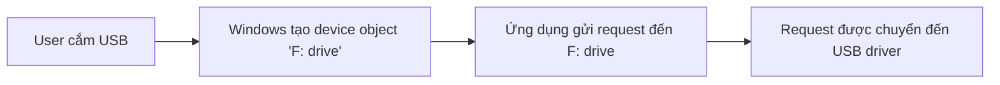
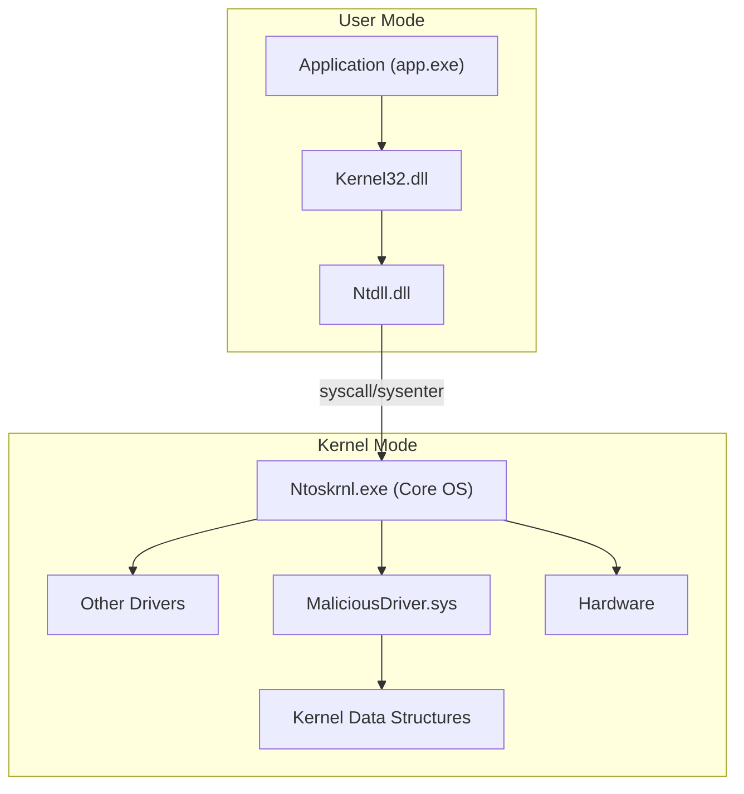
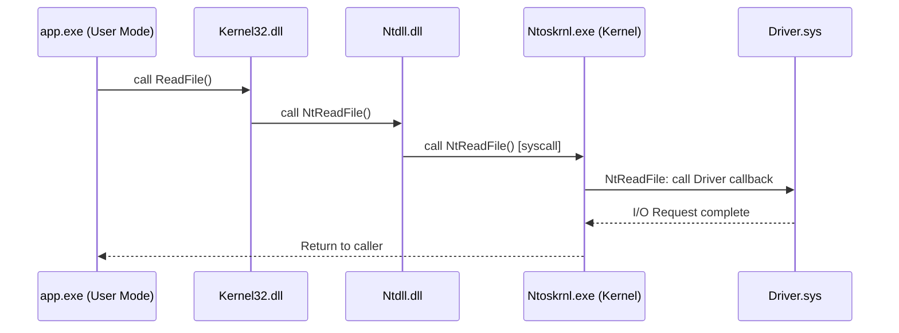

# Bài 7: Debugging Malicious Binaries

## 1. General Debugging Concepts

### 1.1 Launching và Attaching to Process

Có hai cách để debug một chương trình:

- **Attach debugger vào một process đang chạy**: Dùng khi chương trình đã được khởi động trước, debugger "gắn" vào process đó để kiểm soát và quan sát.
- **Launch một process mới**: Debugger khởi chạy chương trình ngay từ đầu, cho phép kiểm soát từ instruction đầu tiên.

---

### 1.2 Entry Point

**Entry point** là địa chỉ của instruction đầu tiên sẽ được thực thi khi chương trình chạy.

Có thể tìm entry point bằng các công cụ phân tích PE header:

- **PEiD**: Hiển thị `Entrypoint`, `EP Section`, `First Bytes`, thông tin linker và compiler.
- **Detect It Easy (DiE)**: Hiển thị `EntryPoint`, `ImageBase`, `NumberOfSections`, thông tin compiler/linker.
- **Resource Hacker**, **CFF Explorer**: Các công cụ khác hỗ trợ đọc thông tin PE.
- Trong **IDA Pro** và **x64dbg**: Entry point được hiển thị trực tiếp trong giao diện disassembly.

!!! note "Tại sao entry point quan trọng?"
    Khi phân tích malware, entry point giúp xác định nơi mã độc bắt đầu thực thi, là điểm khởi đầu quan trọng cho việc phân tích luồng thực thi.

---

### 1.3 Controlling Process Execution

Debugger cung cấp các tùy chọn điều khiển thực thi:

| Tính năng | Mô tả |
|---|---|
| **Continue (Run)** | Tiếp tục chạy chương trình cho đến breakpoint tiếp theo |
| **Step Into** | Bước vào bên trong hàm được gọi (đi vào call) |
| **Step Over** | Thực thi một instruction, nếu là lệnh `call` thì thực thi toàn bộ hàm mà không bước vào |
| **Run Until Return** | Chạy đến khi hàm hiện tại kết thúc (lệnh `ret`) |
| **Run to Cursor** | Chạy đến vị trí con trỏ hiện tại trong disassembly |

---

### 1.4 Breakpoint

**Breakpoint** là tính năng cho phép tạm dừng thực thi chương trình tại một vị trí cụ thể. Đây là công cụ cốt lõi trong debugging.

Breakpoint có thể được đặt để:

- Tạm dừng tại một instruction cụ thể
- Tạm dừng khi chương trình gọi một hàm
- Tạm dừng khi chương trình đọc, ghi, hoặc thực thi từ một địa chỉ bộ nhớ

**Các loại breakpoint:**

=== "Software Breakpoint"
    Thay thế byte đầu tiên của instruction tại địa chỉ đó bằng byte `0xCC` (lệnh `INT3`). Khi CPU thực thi `INT3`, hệ điều hành sẽ thông báo cho debugger. Đây là loại phổ biến nhất nhưng có thể bị malware phát hiện.

=== "Hardware Breakpoint"
    Sử dụng các thanh ghi debug đặc biệt của CPU (DR0–DR3). Không sửa đổi code gốc, do đó khó bị phát hiện hơn. Giới hạn tối đa 4 hardware breakpoint cùng lúc. Có thể thiết lập để break on execute, break on read/write.

=== "Memory Breakpoint"
    Đặt trang bộ nhớ ở trạng thái guard page. Khi có bất kỳ truy cập nào vào trang đó, debugger sẽ được thông báo. Hữu ích để theo dõi truy cập bộ nhớ của một vùng nhớ cụ thể.

=== "Conditional Breakpoint"
    Kết hợp với điều kiện (expression). Debugger chỉ dừng khi điều kiện thỏa mãn. Ví dụ: chỉ dừng khi `eax == 0` hoặc khi một thanh ghi chứa giá trị cụ thể.

---

### 1.5 Tracing

**Tracing** cho phép ghi lại (log) các sự kiện cụ thể trong khi process đang thực thi, thay vì dừng lại. IDA cung cấp nhiều cơ chế tracing:

- **Instruction Tracing**: Ghi lại luồng thực thi (execution flow) của ứng dụng, xác định các thanh ghi bị thay đổi bởi mỗi instruction.
- **Function Tracing**: Ghi lại tất cả các lời gọi hàm (function calls) và các điểm trả về (function returns).
- **Read/Write/Execute Tracing**: Ghi lại tất cả các lần truy cập vào một địa chỉ được chỉ định. Về bản chất, đây là các breakpoint không dừng (non-stopping breakpoints) — debugger ghi log nhưng không tạm dừng thực thi.

---

## 2. Debugging a Binary Using x64dbg

### 2.1 Giới thiệu x64dbg

**x64dbg** là một debugger mã nguồn mở, hỗ trợ debug cả ứng dụng 32-bit và 64-bit trên Windows. Giao diện thân thiện, dễ sử dụng với nhiều tính năng mạnh mẽ.

**Các tính năng nổi bật:**

- IDA-like sidebar với jump arrows (hiển thị hướng nhảy của các lệnh điều kiện)
- Memory Map: xem toàn bộ bộ nhớ được ánh xạ
- Symbol view: xem các symbol của module
- Thread view: xem và quản lý các thread
- Source code view: hỗ trợ xem source code (nếu có debug info)
- Graph view: hiển thị control flow graph
- Fast disassembler: disassemble nhanh

---

### 2.2 Launching a New Process trong x64dbg

Để load một executable: chọn **File | Open** và duyệt đến file cần debug.

Sau khi load, debugger sẽ tạm dừng tại một trong các vị trí sau tùy theo cấu hình:

1. **System Breakpoint**: Breakpoint nội bộ của hệ thống, dừng rất sớm trong quá trình khởi tạo.
2. **TLS Callback**: Nếu chương trình có TLS callback, debugger dừng ở đây. Đặc biệt hữu ích vì **một số malware đặt anti-debugging tricks trong TLS entries** để chạy trước `main`.
3. **Entry Point**: Dừng tại entry point của chương trình.

!!! tip "Cấu hình điểm dừng đầu tiên"
    Truy cập **Options | Preferences | Event** để cấu hình. Nếu muốn dừng ngay tại entry point của chương trình, bỏ tick **System Breakpoint** và **TLS Callbacks**.

---

### 2.3 Attaching to an Existing Process

Để attach vào một process đang chạy: nhấn **Alt + A**.

Hộp thoại liệt kê các process đang chạy sẽ xuất hiện. Chọn process muốn debug và nhấn **Attach**.

Khi debugger attach xong, process bị tạm dừng — lúc này có thể đặt breakpoint và kiểm tra tài nguyên của process.

**Lưu ý quan trọng:**

- Khi đóng debugger, process đã được attach sẽ bị **terminate** theo. Để tránh điều này, dùng **Ctrl + Alt + F2** để detach trước khi đóng.
- Không phải tất cả process đều hiển thị trong danh sách. Phải chạy debugger với quyền **Administrator** và bật **debug privilege** trong settings để thấy đầy đủ.

---

### 2.4 Controlling Process Execution trong x64dbg

| Tính năng | Hotkey | Menu |
|---|---|---|
| Run | F9 | Debugger \| Run |
| Step Into | F7 | Debugger \| Step Into |
| Step Over | F8 | Debugger \| Step Over |
| Run until selection | F4 | Debugger \| Run until selection |

---

### 2.5 Setting a Breakpoint trong x64dbg

**Cách đặt software breakpoint:**

1. Navigate đến địa chỉ muốn đặt breakpoint trong cửa sổ disassembly.
2. Nhấn **F2** để toggle breakpoint.

**Hardware breakpoint** có thể được đặt bằng cách:

- Click chuột phải vào instruction → **Breakpoint** → chọn loại:
  - **Hardware, Access** (Break on Read/Write)
  - **Hardware, Write** (Break on Write)
  - **Hardware, Execute** (Break on Execute)

**Xem tất cả breakpoint:** Click vào tab **Breakpoints** — sẽ liệt kê toàn bộ software, hardware và memory breakpoints đang active.

---

### 2.6 Debugging 32-bit Malware

**Ví dụ thực tế: Phân tích malware tạo file**

Khi phân tích malware gọi hàm `CreateFileA` để tạo file, quy trình như sau:

**Bước 1:** Đặt breakpoint tại lệnh `call CreateFileA`.

**Bước 2:** Chạy chương trình (F9) cho đến khi đạt breakpoint.

**Bước 3:** Khi dừng tại breakpoint, tất cả các tham số truyền vào hàm đã được **push lên stack**. x64dbg tự động thêm comment bên cạnh instruction và bên cạnh các argument trên stack để chỉ rõ tham số nào đang được truyền vào hàm.

**Bước 4:** Kiểm tra tham số đầu tiên trên stack → xác định tên file được tạo.

!!! example "Kết quả phân tích"
    Trong ví dụ, malware tạo file thực thi `winlogdate.exe` trong thư mục `C:\Users\[User]\AppData\Roaming\Microsoft\`.

**Tiếp theo**, sau khi tạo file thực thi, malware truyền handle do `CreateFile` trả về vào `WriteFile` để ghi nội dung thực thi vào file đó. Quy trình tương tự: đặt breakpoint tại `call WriteFile` và kiểm tra các tham số.

---

### 2.7 Debugging a Malicious DLL trong x64dbg

DLL không thể chạy độc lập, cần một host process. Có hai cách:

=== "Cách 1: Load trực tiếp vào x64dbg"
    Load DLL qua **File | Open**.

    Khi load, x64dbg tự động tạo một file executable (`DLLLoader32_xxxx.exe`, với `xxxx` là các ký tự hex ngẫu nhiên) trong cùng thư mục với DLL. File này đóng vai trò là **generic host process** để execute DLL (tương tự như `rundll32.exe`).

=== "Cách 2: Dùng rundll32.exe"
    Đây là phương pháp hiệu quả hơn, mô phỏng môi trường thực tế:

    **Bước 1:** Load `rundll32.exe` từ thư mục `C:\Windows\System32\` vào debugger.

    **Bước 2:** Chọn **Debug | Change Command Line** và nhập command line, ví dụ:
    ```
    C:\Windows\System32\rundll32.exe C:\Users\Thiet\Desktop\malware.dll,ExportFunctionName
    ```

    **Bước 3:** Vào tab **Breakpoints** → click vào Breakpoints window → chọn **Add DLL breakpoint** → nhập tên module DLL (không có extension, ví dụ: `malware`). Điều này báo cho debugger dừng khi DLL được load.

    **Bước 4:** Tải lại debugger và load `rundll32.exe`. Command line setting sẽ được giữ nguyên. Chương trình sẽ chạy và dừng tại **entry point của DLL**.

    **Bước 5:** Sau khi dừng, có thể xem các **export function** của DLL trong tab Symbols.

---

### 2.8 Tracing Execution trong x64dbg

x64dbg hỗ trợ **Trace Into** và **Trace Over** với các tùy chọn conditional tracing. Truy cập qua menu **Trace**.

- **Trace Into**: Debugger nội bộ trace chương trình bằng cách đặt step-into breakpoints liên tiếp cho đến khi điều kiện được thỏa mãn hoặc đạt số bước tối đa.
- **Trace Over**: Tương tự nhưng dùng step-over breakpoints (không đi vào bên trong hàm).

**Các tùy chọn cấu hình tracing:**

| Tùy chọn | Mô tả |
|---|---|
| **Break Condition** | Biểu thức điều kiện để dừng tracing. Ví dụ: `eax == 0 && ebx == 1`. Nếu không thỏa mãn, trace tiếp tục đến khi đạt maximum count. |
| **Log Text** | Format string để log sự kiện. Ví dụ: `{P:cip}` sẽ log địa chỉ instruction. |
| **Log Condition** | Chỉ log khi điều kiện cụ thể được thỏa mãn. |
| **Maximum Trace Count** | Số bước tối đa trước khi debugger dừng tracing. |
| **Log File** | Đường dẫn đầy đủ đến file log để ghi lại kết quả. |

---

## 3. Debugging a Binary Using IDA

### 3.1 Launching a New Process trong IDA

Để khởi động debugger trong IDA: **Debugger | Run | Local Windows debugger**

IDA không chỉ là disassembler mà còn là debugger tích hợp, cho phép kết hợp phân tích tĩnh và động trên cùng một giao diện.

---

### 3.2 Giao diện IDA Debugger

Giao diện debugger của IDA bao gồm các thành phần:

| Thành phần | Mô tả |
|---|---|
| **Toolbar** | Các nút điều khiển thực thi nhanh |
| **Registers** | Hiển thị giá trị các thanh ghi hiện tại (EAX, EBX, ECX, EDX, ESP, EBP, ESI, EDI, EIP, EFLAGS...) |
| **Modules** | Liệt kê các module (DLL, EXE) đã được load vào bộ nhớ |
| **Threads** | Liệt kê các thread đang chạy |
| **Stack View** | Hiển thị nội dung stack hiện tại |
| **Hex View** | Hiển thị nội dung bộ nhớ dạng hex dump |
| **Disassembly Window (IDA View-EIP)** | Cửa sổ disassembly chính, tự động cuộn theo EIP |

---

### 3.3 Controlling Process Execution trong IDA

| Tính năng | Hotkey | Menu |
|---|---|---|
| Continue (Run) | F9 | Debugger \| Continue process |
| Step Into | F7 | Debugger \| Step Into |
| Step Over | F8 | Debugger \| Step Over |
| Run to Cursor | F4 | Debugger \| Run to Cursor |

---

### 3.4 Setting a Breakpoint trong IDA

- **Đặt breakpoint**: Đặt con trỏ tại instruction muốn dừng, nhấn **F2** (hoặc click vào cạnh trái của dòng).
- Dòng được đặt breakpoint sẽ được highlight màu đỏ.
- Quản lý breakpoint qua **Debugger | Breakpoints | Breakpoint list** (Ctrl+Alt+B).

---

### 3.5 Buffer Overflow Demo với IDA

**Mã nguồn ví dụ:**

```c
#include <iostream>
#include <string.h>
using namespace std;

int main(int argc, char *argv[]) {
    char buffer_one[8], buffer_two[8];
    
    strcpy(buffer_one, "234");
    strcpy(buffer_two, "567");
    
    cout << "Before\n";
    cout << "Buffer two: " << buffer_two << "\n";
    cout << "Buffer one: " << buffer_one << "\n";
    
    strcpy(buffer_two, argv[1]);  // Nguy hiểm: không kiểm tra độ dài!
    strcpy(buffer_two, "12345678");
    
    cout << "After\n";
    cout << "Buffer two: " << buffer_two << "\n";
    cout << "Buffer one: " << buffer_one << "\n";
}
```

**Stack layout:**

```
High address
+------------------+
| Return address   |
+------------------+
| Old EBP          |
+------------------+
| ...              |
+------------------+
| buffer_one [8]   |  <- 8 bytes
+------------------+
| buffer_two [8]   |  <- 8 bytes
+------------------+
Low address
```

!!! warning "Quan sát buffer overflow"
    - **Trường hợp bình thường** (input ngắn): `Buffer two: 1234567`, `Buffer one: 234` → không tràn.
    - **Trường hợp overflow** (input = "123456789"): `Buffer two: 123456789`, `Buffer one: 9` → byte thứ 9 tràn sang `buffer_one`!

**Giải thích:** `buffer_two` chỉ có 8 bytes. Khi `strcpy` ghi "123456789" (9 ký tự + null terminator = 10 bytes), byte thứ 9 (`'9'`) tràn sang vùng nhớ liền kề là `buffer_one`, ghi đè ký tự đầu tiên của `buffer_one`.

Khi debug với IDA, có thể quan sát trực tiếp trong **Stack View** và **Hex View** sự thay đổi của bộ nhớ khi overflow xảy ra.

---

### 3.6 Debugger Scripting với IDAPython

IDA hỗ trợ scripting qua **IDAPython**, cho phép tự động hóa các tác vụ debugging.

**Đặt breakpoint và chạy đến breakpoint:**

```python
idc.add_bpt(idc.get_screen_ea())   # Đặt breakpoint tại địa chỉ hiện tại
idc.start_process('', '', '')       # Bắt đầu process
evt_code = idc.wait_for_next_event(WFNE_SUSP, -1)  # Chờ sự kiện suspend
if evt_code and (evt_code != idc.PROCESS_EXITED):
    evt_ea = idc.get_event_ea()
    print("Breakpoint Triggered at:", hex(evt_ea),
          idc.generate_disasm_line(evt_ea, 0))
```

```
# Output ví dụ:
Breakpoint Triggered at: 0x1171010 push ebp
```

**Step into và in ra địa chỉ:**

```python
idc.step_into()
evt_code = idc.wait_for_next_event(WFNE_SUSP, -1)
if evt_code and (evt_code != idc.PROCESS_EXITED):
    evt_ea = idc.get_event_ea()
    print("Stepped Into:", hex(evt_ea),
          idc.generate_disasm_line(evt_ea, 0))
```

```
# Output ví dụ:
Stepped Into: 0x1171011 mov ebp, esp
```

!!! note
    Sử dụng `idc.step_over()` thay vì `idc.step_into()` để thực hiện Step Over.

**Đọc giá trị thanh ghi:**

```python
esp_value = idc.get_reg_value("esp")
print(hex(esp_value))
```

**Đọc giá trị bộ nhớ:**

```python
# Đọc DWORD tại địa chỉ 0x14fb04
ea = 0x14fb04
print(hex(idc.read_dbg_dword(ea)))

# Tương tự cho các kích thước khác:
# idc.read_dbg_byte(ea)   -> đọc 1 byte
# idc.read_dbg_word(ea)   -> đọc 2 bytes (WORD)
# idc.read_dbg_qword(ea)  -> đọc 8 bytes (QWORD)
```

**Lấy địa chỉ hàm theo tên:**

```python
ea = idc.get_name_ea_simple("kernel32_CreateFileA")
print(hex(ea))
```

**Đọc chuỗi từ bộ nhớ:**

```python
# Đọc chuỗi ASCII
ea = 0x01373000
print(idc.get_strlit_contents(ea))

# Đọc chuỗi UNICODE (UTF-16)
ea = 0x00C37860
print(idc.get_strlit_contents(ea, strtype=idc.STRTYPE_C_16))
```

**Tiếp tục thực thi process đang bị suspend:**

```python
idc.resume_process()
```

**Liệt kê tất cả module đã load:**

```python
import idautils
for m in idautils.Modules():
    print("0x%08x %s" % (m.base, m.name))
```

```
# Output ví dụ:
0x00400000 C:\malware\5340.exe
0x735c0000 C:\Windows\SYSTEM32\wow64cpu.dll
0x735d0000 C:\Windows\SYSTEM32\wow64win.dll
0x73630000 C:\Windows\SYSTEM32\wow64.dll
0x749e0000 C:\Windows\SysWOW64\cryptbase.dll
```

---

## 4. Debugging a .NET Application với dnSpy

**dnSpy** là công cụ chuyên dụng để phân tích và debug các file binary .NET. Nó có khả năng **decompile** (dịch ngược) các ứng dụng .NET sang C# hoặc VB.NET, giúp đọc được logic gần như source code gốc.

### Giao diện dnSpy

Sau khi load file .NET, dnSpy:

- **Decompile tự động** ứng dụng.
- Hiển thị các **class và method** trong panel bên trái gọi là **Assembly Explorer**.
- Cho phép duyệt qua cây cấu trúc của assembly theo namespace → class → method.

### Debugging với dnSpy

**Bắt đầu debug:** Nhấn nút **Start** trên toolbar hoặc chọn **Debug | Debug an Assembly (F5)**. Hộp thoại xuất hiện cho phép:

- Chọn assembly cần debug.
- Nhập **Arguments** (tham số command line).
- Chỉ định **Working Directory**.
- Tùy chọn **Break at Module_cctor or Entry Point** để dừng ngay tại điểm vào.

**Điều khiển thực thi:** Truy cập qua menu **Debug**:

- **Step Over**, **Step Into**, **Continue** tương tự các debugger khác.
- **Đặt breakpoint:** Double-click vào một dòng code hoặc nhấn **F9** (Debug | Toggle Breakpoint).

!!! tip "Ưu điểm của dnSpy so với debugger thông thường"
    Debugger thông thường (x64dbg, IDA) hiển thị IL bytecode hoặc assembly code của .NET, khó đọc. dnSpy hiển thị code đã decompile sang C#, dễ đọc và phân tích hơn rất nhiều.

---

## 5. Kernel Debug với WinDBG

### 5.1 Drivers và Kernel Code

#### Device Drivers

**Windows device driver** cho phép các nhà phát triển bên thứ ba chạy code trong **Windows kernel**.

Đặc điểm của driver:
- Driver được **load vào bộ nhớ**, tồn tại thường trú (resident) và phản hồi các request từ ứng dụng.
- Ứng dụng không truy cập trực tiếp vào kernel driver, mà thông qua **device objects** — device objects sẽ gửi request đến driver tương ứng.

#### Devices

- **Device không phải là phần cứng vật lý** mà là biểu diễn phần mềm của các thành phần đó.
- Driver tạo và hủy devices, các devices này có thể được truy cập từ **user space**.

**Ví dụ USB Flash Drive:**



#### Loading Drivers

- Driver phải được load vào kernel, tương tự như DLL được load vào process.
- Khi driver được load lần đầu, thủ tục **DriverEntry** được gọi (tương tự `DllMain` cho DLL).

#### DriverEntry

- DLL export chức năng qua **export table**.
- Driver phải **đăng ký địa chỉ của các callback function** — các hàm này sẽ được gọi khi user-space software yêu cầu dịch vụ.
- **DriverEntry** thực hiện việc đăng ký này:
  1. Windows tạo cấu trúc **driver object** và truyền nó vào `DriverEntry`.
  2. `DriverEntry` điền các callback function vào driver object.
  3. `DriverEntry` tạo một device có thể được truy cập từ user-land.

---

### 5.2 Kernel Mode vs User Mode



**Kernel Mode:**
- Hệ điều hành và các chương trình đặc quyền chạy ở kernel mode.
- Code ở kernel mode có quyền truy cập vào **bất kỳ phần nào của hệ thống** — không bị hạn chế như user-mode code.
- Có thể truy cập vào bất kỳ phần nào của bất kỳ process nào (dù đang chạy ở user mode hay kernel mode).

**User Mode:**
- Ứng dụng và subsystem chạy ở user mode trong **virtual address space riêng**.
- Bị hạn chế truy cập trực tiếp vào: phần cứng, bộ nhớ không được cấp phát cho chúng, và các phần khác có thể ảnh hưởng đến tính toàn vẹn của hệ thống.
- Bị cô lập, không thể can thiệp vào các user-mode process khác.

**Luồng xử lý ReadFile:**



---

### 5.3 Ntoskrnl.dll và Hal.dll

- **Malicious driver thường không điều khiển phần cứng trực tiếp** mà tương tác với `Ntoskrnl.dll` và `Hal.dll`.
- **Ntoskrnl.dll**: Chứa code cho các chức năng core của OS (quản lý process, bộ nhớ, I/O...).
- **Hal.dll** (Hardware Abstraction Layer): Chứa code để tương tác với các thành phần phần cứng chính.
- Malware sẽ **import hàm từ một hoặc cả hai file** này để có thể thao túng kernel.

---

### 5.4 Malicious Request: DeviceIoControl

**Request phổ biến nhất từ malware là `DeviceIoControl`:**

- Là một request generic từ user-space module đến device được quản lý bởi driver.
- User-space program truyền vào một **input buffer có độ dài tùy ý**.
- Nhận lại một **output buffer có độ dài tùy ý**.
- Cho phép malware user-space giao tiếp tùy ý với malware driver trong kernel.

---

### 5.5 Microsoft Symbols

**Symbols** là các nhãn (labels) giúp đặt tên có nghĩa cho các địa chỉ trong code.

Nhờ symbols, thay vì thấy địa chỉ như `0x8050f1a2`, debugger có thể hiển thị tên hàm có nghĩa như `MmCreateProcessAddressSpace`.

**Cấu hình Windows Symbols trong WinDbg:**

Nếu máy debug có kết nối internet, có thể cấu hình WinDbg để **tự động download symbols từ Microsoft Symbol Server** khi cần, và cache lại locally.

**Cấu hình:** Vào **File | Symbol File Path** và nhập:

```
SRV*c:\websymbols*https://msdl.microsoft.com/download/symbols
```

Trong đó:
- `c:\websymbols` là thư mục cache local.
- `https://msdl.microsoft.com/download/symbols` là Microsoft Symbol Server.

---

### 5.6 Levels of Kernel Debugging

=== "Level 1: Local Kernel Debugging"
    Debug kernel của chính máy đang chạy WinDbg. **Hạn chế**: Chỉ có thể quan sát kernel routines và data, **không thể dùng breakpoints**.

    **Kích hoạt bằng BCDEdit:**
    ```cmd
    bcdedit /debug on
    bcdedit /dbgsettings local
    ```
    Sau đó restart máy.

=== "Level 2: Remote Debugging của Virtual Machine"
    Debug một VM từ host machine. Đây là **full kernel debugging experience** với đầy đủ tính năng bao gồm breakpoints.

    **Cấu hình trên VM (target):**
    ```cmd
    bcdedit /dbgsettings net hostip:172.17.32.1 port:55000 key:1.2.3.4
    ```

    **Kết nối từ WinDbg (host):**
    Chọn **Attach to kernel | Net** → nhập Port number và Key.

    Windows hỗ trợ nhiều interface kết nối (serial, network, USB...). Với VM, **network** là lựa chọn tốt nhất (hỗ trợ từ Windows 8 trở lên).

=== "Level 3: Remote Debugging của Physical Machine"
    Debug kernel của một máy vật lý từ xa. Phức tạp hơn Level 2, thường yêu cầu kết nối vật lý (serial, network, USB) giữa hai máy.

---

### 5.7 Rootkit Basics

**Rootkit** là malware thay đổi chức năng nội bộ của OS để **ẩn mình**:

- Che giấu processes, kết nối mạng, và các tài nguyên khác khỏi các chương trình đang chạy.
- Rất khó bị phát hiện bởi antivirus, administrator, và security analyst.

**Phương pháp phổ biến nhất: SSDT Hooking**

#### System Service Descriptor Table (SSDT)

- SSDT được Microsoft sử dụng nội bộ để **tra cứu các function call vào kernel**.
- Thông thường không được dùng bởi third-party application hoặc driver.
- Chỉ có **3 cách** để user space truy cập kernel code:
  - `SYSCALL`
  - `SYSENTER`
  - `INT 0x2E`

**SSDT Table Entries:**

```
SSDT[0x22] 805b28bc (NtCreateDirectoryObject)
SSDT[0x23] 80603be0 (NtCreateEvent)
SSDT[0x24] 8060be48 (NtCreateEventPair)
SSDT[0x25] 8056d3ca (NtCreateFile)          <- Rootkit target
SSDT[0x26] 8056bc5c (NtCreateIoCompletion)
SSDT[0x27] 805ca3ca (NtCreateJobObject)
```

**SSDT Hooking:** Rootkit thay đổi giá trị trong SSDT (ví dụ: entry `0x25`) để trỏ đến hàm của malicious driver thay vì hàm kernel gốc. Khi ứng dụng gọi `NtCreateFile`, thực ra đang gọi vào code của rootkit.

!!! warning "Lưu ý"
    Hooking `NtCreateFile` không tự động ẩn file — rootkit cần hook đúng các hàm liên quan đến directory enumeration (liệt kê file) để ẩn file thực sự.

---

## Câu hỏi trắc nghiệm

**Câu 1.** Entry point của một chương trình là gì?

- A. Địa chỉ của hàm `main()` trong source code
- B. Địa chỉ của instruction đầu tiên sẽ được thực thi
- C. Địa chỉ bắt đầu của section `.text`
- D. Địa chỉ của hàm `WinMain()`

??? info "Đáp án & Giải thích"
    **Đáp án: B**

    Entry point là địa chỉ của instruction đầu tiên được thực thi khi chương trình chạy. Đây không nhất thiết là `main()` hay `WinMain()` vì trước đó còn có code khởi tạo runtime (CRT startup code).

---

**Câu 2.** Công cụ nào sau đây KHÔNG được dùng để tìm entry point của một PE file?

- A. PEiD
- B. Detect It Easy (DiE)
- C. CFF Explorer
- D. Wireshark

??? info "Đáp án & Giải thích"
    **Đáp án: D**

    Wireshark là công cụ phân tích gói tin mạng (network packet analyzer), không liên quan đến phân tích PE file hay tìm entry point.

---

**Câu 3.** Khi debug trong x64dbg, nhấn **F7** sẽ thực hiện hành động gì?

- A. Run (tiếp tục chạy)
- B. Step Over
- C. Step Into
- D. Run until selection

??? info "Đáp án & Giải thích"
    **Đáp án: C**

    Trong x64dbg: F7 = Step Into, F8 = Step Over, F9 = Run, F4 = Run until selection.

---

**Câu 4.** Sự khác biệt chính giữa **Step Into** và **Step Over** là gì?

- A. Step Into nhanh hơn Step Over
- B. Step Into đi vào bên trong hàm được gọi, Step Over thực thi toàn bộ hàm mà không đi vào
- C. Step Over chỉ dùng được với IDA, Step Into dùng với x64dbg
- D. Không có sự khác biệt

??? info "Đáp án & Giải thích"
    **Đáp án: B**

    Step Into (F7): Khi gặp lệnh `call`, sẽ bước vào bên trong hàm đó. Step Over (F8): Khi gặp lệnh `call`, thực thi toàn bộ hàm như một đơn vị và dừng tại instruction ngay sau `call`.

---

**Câu 5.** **Software Breakpoint** hoạt động bằng cách nào?

- A. Sử dụng các thanh ghi debug đặc biệt của CPU (DR0–DR3)
- B. Thay thế byte đầu tiên của instruction bằng `0xCC` (lệnh INT3)
- C. Đặt trang bộ nhớ ở trạng thái guard page
- D. Gửi tín hiệu ngắt đến OS

??? info "Đáp án & Giải thích"
    **Đáp án: B**

    Software breakpoint hoạt động bằng cách thay thế byte đầu tiên tại địa chỉ đó bằng `0xCC` (opcode của lệnh `INT3`). Khi CPU thực thi `INT3`, exception được tạo ra và OS thông báo cho debugger.

---

**Câu 6.** **Hardware Breakpoint** có ưu điểm gì so với Software Breakpoint?

- A. Có thể đặt số lượng không giới hạn
- B. Nhanh hơn software breakpoint
- C. Không sửa đổi code gốc nên khó bị malware phát hiện hơn
- D. Chỉ hoạt động với 64-bit process

??? info "Đáp án & Giải thích"
    **Đáp án: C**

    Hardware breakpoint sử dụng các thanh ghi debug của CPU (DR0–DR3) và không thay đổi nội dung code gốc, do đó malware dùng kỹ thuật checksum code để phát hiện breakpoint sẽ không phát hiện được. Tuy nhiên, giới hạn tối đa 4 hardware breakpoints cùng lúc.

---

**Câu 7.** Giới hạn tối đa của **Hardware Breakpoint** trong một lần debug là bao nhiêu?

- A. 2
- B. 4
- C. 8
- D. Không giới hạn

??? info "Đáp án & Giải thích"
    **Đáp án: B**

    CPU x86/x64 chỉ có 4 thanh ghi debug (DR0, DR1, DR2, DR3) để lưu địa chỉ breakpoint, nên chỉ có thể đặt tối đa 4 hardware breakpoints cùng lúc.

---

**Câu 8.** **Tracing** trong debugging khác **Breakpoint** ở điểm nào?

- A. Tracing không hoạt động với x64dbg
- B. Tracing ghi lại (log) sự kiện mà không (nhất thiết) dừng thực thi, trong khi breakpoint dừng thực thi
- C. Breakpoint ghi log còn Tracing thì không
- D. Tracing chỉ dùng được với IDA

??? info "Đáp án & Giải thích"
    **Đáp án: B**

    Tracing ghi lại các sự kiện trong khi process tiếp tục thực thi. Theo tài liệu, Read/Write/Execute tracing trong IDA là "non-stopping breakpoints" — breakpoint không dừng, chỉ ghi log.

---

**Câu 9.** Trong x64dbg, **TLS Callback** breakpoint quan trọng khi phân tích malware vì lý do gì?

- A. TLS Callback luôn chứa mã độc
- B. Một số malware đặt anti-debugging tricks trong TLS entries để thực thi code trước khi hàm main chạy
- C. TLS Callback là nơi duy nhất malware có thể ẩn mình
- D. TLS Callback không bao giờ xuất hiện trong chương trình hợp lệ

??? info "Đáp án & Giải thích"
    **Đáp án: B**

    TLS (Thread Local Storage) callbacks được thực thi trước entry point của chương trình. Một số malware tận dụng điều này để chạy code (bao gồm anti-debugging code) trước khi main application bắt đầu, nhằm phát hiện và phản ứng với debugger trước khi bị phát hiện.

---

**Câu 10.** Để attach x64dbg vào một process đang chạy, sử dụng tổ hợp phím nào?

- A. Ctrl + A
- B. Alt + A
- C. Shift + A
- D. F3

??? info "Đáp án & Giải thích"
    **Đáp án: B**

    Alt + A trong x64dbg mở hộp thoại Attach, liệt kê các process đang chạy để chọn.

---

**Câu 11.** Khi đóng x64dbg sau khi đã attach vào một process, điều gì xảy ra với process đó theo mặc định?

- A. Process tiếp tục chạy bình thường
- B. Process bị tạm dừng (paused)
- C. Process bị terminate
- D. Process được restart

??? info "Đáp án & Giải thích"
    **Đáp án: C**

    Theo mặc định, khi đóng debugger, process đã attach sẽ bị terminate. Để tránh điều này, cần detach trước bằng Ctrl + Alt + F2.

---

**Câu 12.** Để detach x64dbg khỏi một process mà không terminate process đó, dùng tổ hợp phím nào?

- A. Ctrl + D
- B. Alt + D
- C. Ctrl + Alt + F2
- D. Shift + F2

??? info "Đáp án & Giải thích"
    **Đáp án: C**

    Ctrl + Alt + F2 là tổ hợp phím để detach debugger khỏi process trong x64dbg mà không làm terminate process.

---

**Câu 13.** Khi load một **DLL** vào x64dbg trực tiếp, x64dbg xử lý việc DLL không thể chạy độc lập bằng cách nào?

- A. Tự động chèn DLL vào một process có sẵn
- B. Tạo một file executable (`DLLLoader32_xxxx.exe`) trong cùng thư mục để làm host process
- C. Yêu cầu người dùng chọn một process để inject
- D. Load DLL vào process của chính x64dbg

??? info "Đáp án & Giải thích"
    **Đáp án: B**

    x64dbg tự động tạo một file executable có tên `DLLLoader32_xxxx.exe` (xxxx là các ký tự hex ngẫu nhiên) trong cùng thư mục với DLL. File này đóng vai trò generic host process, tương tự như rundll32.exe.

---

**Câu 14.** Khi dùng **rundll32.exe** để debug DLL trong x64dbg, sau khi thiết lập "Add DLL breakpoint", debugger sẽ dừng ở đâu?

- A. Tại hàm `DllMain`
- B. Tại instruction đầu tiên của rundll32.exe
- C. Tại entry point của DLL
- D. Tại hàm export được chỉ định trong command line

??? info "Đáp án & Giải thích"
    **Đáp án: C**

    Theo tài liệu, sau khi thiết lập DLL breakpoint và tải lại rundll32.exe, debugger sẽ chạy và dừng tại entry point của DLL.

---

**Câu 15.** Trong **Trace** của x64dbg, **Maximum Trace Count** có tác dụng gì?

- A. Giới hạn số lần có thể dùng tính năng trace
- B. Giới hạn số sự kiện được ghi vào log file
- C. Xác định số bước tối đa trước khi debugger tự dừng tracing nếu Break Condition chưa được thỏa mãn
- D. Giới hạn kích thước của log file

??? info "Đáp án & Giải thích"
    **Đáp án: C**

    Maximum Trace Count xác định số bước tối đa mà debugger sẽ trace. Nếu Break Condition chưa được thỏa mãn sau khi đạt số bước này, debugger dừng trace. Đây là cơ chế phòng ngừa để tránh trace vô hạn.

---

**Câu 16.** Trong IDA, để mở debugger, chọn menu nào?

- A. Edit | Debug | Start
- B. Debugger | Run | Local Windows debugger
- C. File | Debug | Launch
- D. View | Debugger | Start

??? info "Đáp án & Giải thích"
    **Đáp án: B**

    Trong IDA, để mở debugger: **Debugger | Run | Local Windows debugger**.

---

**Câu 17.** Trong IDA Debugger, cửa sổ **IDA View-EIP** có đặc điểm gì?

- A. Hiển thị giá trị các thanh ghi
- B. Hiển thị stack view
- C. Cửa sổ disassembly tự động cuộn theo giá trị EIP hiện tại
- D. Hiển thị danh sách các module đã load

??? info "Đáp án & Giải thích"
    **Đáp án: C**

    IDA View-EIP là cửa sổ disassembly được đồng bộ (synchronized) với giá trị thanh ghi EIP — nó tự động cuộn và highlight instruction hiện tại mà CPU đang thực thi.

---

**Câu 18.** Trong IDA, nhấn **F4** khi đang debug sẽ thực hiện hành động gì?

- A. Step Into
- B. Step Over
- C. Run to Cursor
- D. Continue (Run)

??? info "Đáp án & Giải thích"
    **Đáp án: C**

    Trong IDA: F7 = Step Into, F8 = Step Over, F9 = Continue, F4 = Run to Cursor.

---

**Câu 19.** Trong ví dụ buffer overflow, khi `strcpy(buffer_two, "123456789")` được thực thi với `buffer_two[8]` và `buffer_one[8]` liền kề trên stack, điều gì xảy ra?

- A. Chương trình crash ngay lập tức
- B. Chuỗi "123456789" bị cắt còn 8 ký tự
- C. Byte thứ 9 (`'9'`) tràn sang vùng nhớ của `buffer_one`, ghi đè ký tự đầu tiên
- D. Không có gì xảy ra do OS bảo vệ

??? info "Đáp án & Giải thích"
    **Đáp án: C**

    `buffer_two` chỉ có 8 bytes nhưng "123456789" cần 10 bytes (9 ký tự + null terminator). Bytes 9 và 10 tràn ra ngoài, ghi đè lên vùng nhớ liền kề là `buffer_one`. Kết quả là `buffer_one` hiển thị "9" thay vì "234".

---

**Câu 20.** Trong ví dụ buffer overflow, sau khi overflow với "123456789", giá trị của `buffer_one` là gì?

- A. "234" (không thay đổi)
- B. "9"
- C. ""(empty)
- D. "123456789"

??? info "Đáp án & Giải thích"
    **Đáp án: B**

    Theo kết quả thực tế trong tài liệu: `Buffer two: 123456789`, `Buffer one: 9`. Byte `'9'` (byte thứ 9) tràn sang `buffer_one` và ghi đè byte đầu tiên, byte tiếp theo là null terminator ghi đè byte thứ 2 → `buffer_one` còn "9".

---

**Câu 21.** Hàm IDAPython nào dùng để **đặt breakpoint** tại một địa chỉ cụ thể?

- A. `idc.set_breakpoint(ea)`
- B. `idc.add_bpt(ea)`
- C. `idc.create_bpt(ea)`
- D. `idc.breakpoint(ea)`

??? info "Đáp án & Giải thích"
    **Đáp án: B**

    `idc.add_bpt(ea)` là hàm IDAPython để thêm breakpoint tại địa chỉ `ea`.

---

**Câu 22.** Hàm IDAPython nào dùng để **đọc giá trị DWORD** từ bộ nhớ của process đang được debug?

- A. `idc.read_memory_dword(ea)`
- B. `idc.get_dword(ea)`
- C. `idc.read_dbg_dword(ea)`
- D. `idc.mem_dword(ea)`

??? info "Đáp án & Giải thích"
    **Đáp án: C**

    `idc.read_dbg_dword(ea)` đọc giá trị DWORD tại địa chỉ `ea` từ bộ nhớ của process đang được debug. Tương tự có `read_dbg_byte`, `read_dbg_word`, `read_dbg_qword`.

---

**Câu 23.** Trong IDAPython, để lấy địa chỉ của hàm `CreateFileA` trong `kernel32.dll`, dùng hàm nào?

- A. `idc.get_func_addr("kernel32.CreateFileA")`
- B. `idc.get_name_ea_simple("kernel32_CreateFileA")`
- C. `idc.find_function("CreateFileA")`
- D. `idc.resolve_symbol("kernel32", "CreateFileA")`

??? info "Đáp án & Giải thích"
    **Đáp án: B**

    `idc.get_name_ea_simple("kernel32_CreateFileA")` trả về địa chỉ của symbol có tên `kernel32_CreateFileA`.

---

**Câu 24.** Trong IDAPython, để **đọc chuỗi UNICODE** (UTF-16) từ bộ nhớ, cần sử dụng hàm nào với tham số gì?

- A. `idc.get_unicode_string(ea)`
- B. `idc.get_strlit_contents(ea, strtype=idc.STRTYPE_C_16)`
- C. `idc.read_unicode(ea)`
- D. `idc.get_string(ea, encoding="utf-16")`

??? info "Đáp án & Giải thích"
    **Đáp án: B**

    `idc.get_strlit_contents(ea)` mặc định đọc chuỗi ASCII. Để đọc UNICODE (UTF-16), cần truyền thêm tham số `strtype=idc.STRTYPE_C_16`.

---

**Câu 25.** Module IDAPython nào cung cấp hàm `Modules()` để liệt kê tất cả các module đã load?

- A. `idc`
- B. `ida_nalt`
- C. `idautils`
- D. `idaapi`

??? info "Đáp án & Giải thích"
    **Đáp án: C**

    `import idautils` sau đó dùng `idautils.Modules()` để lặp qua tất cả modules đã load.

---

**Câu 26.** **dnSpy** chủ yếu được dùng để phân tích loại file nào?

- A. File PE 32-bit và 64-bit
- B. File .NET binary
- C. File PDF
- D. File script Python

??? info "Đáp án & Giải thích"
    **Đáp án: B**

    dnSpy là công cụ chuyên dụng để decompile và debug các file binary .NET (`.exe`, `.dll` được viết bằng C#, VB.NET...).

---

**Câu 27.** Cửa sổ **Assembly Explorer** trong dnSpy hiển thị gì?

- A. Danh sách các assembly instruction
- B. Cây cấu trúc của assembly theo namespace → class → method
- C. Danh sách các module đã load vào bộ nhớ
- D. Danh sách các breakpoint đang active

??? info "Đáp án & Giải thích"
    **Đáp án: B**

    Assembly Explorer trong dnSpy hiển thị cấu trúc phân cấp của .NET assembly: namespace → class → method, cho phép duyệt và truy cập code đã decompile.

---

**Câu 28.** Trong dnSpy, để đặt breakpoint tại một dòng code, làm như thế nào?

- A. Nhấn F2 tại dòng đó
- B. Double-click vào dòng đó hoặc nhấn F9 (Debug | Toggle Breakpoint)
- C. Click chuột phải → Add Breakpoint
- D. Nhấn Ctrl + B

??? info "Đáp án & Giải thích"
    **Đáp án: B**

    Trong dnSpy, có thể đặt breakpoint bằng cách double-click vào dòng code hoặc chọn Debug | Toggle Breakpoint (F9).

---

**Câu 29.** **Windows Device Driver** khác với DLL ở điểm nào?

- A. Driver chạy trong user space, DLL chạy trong kernel space
- B. Driver chạy trong kernel space, cho phép truy cập toàn bộ hệ thống; DLL chạy trong user space của process
- C. Driver và DLL hoạt động hoàn toàn giống nhau
- D. Driver không thể import hàm từ các module khác

??? info "Đáp án & Giải thích"
    **Đáp án: B**

    Device drivers chạy trong kernel mode với đặc quyền đầy đủ. DLL chạy trong user mode trong address space của process đã load nó, bị giới hạn bởi user mode restrictions.

---

**Câu 30.** Thủ tục **DriverEntry** trong một Windows driver có vai trò tương đương với gì trong DLL?

- A. `WinMain()`
- B. `main()`
- C. `DllMain()`
- D. `_start()`

??? info "Đáp án & Giải thích"
    **Đáp án: C**

    `DriverEntry` được gọi khi driver được load lần đầu tiên, tương tự như `DllMain` được gọi khi DLL được load vào process. Cả hai đều là điểm khởi tạo ban đầu.

---

**Câu 31.** Ứng dụng user-space tương tác với kernel driver thông qua cơ chế nào?

- A. Gọi trực tiếp hàm trong driver
- B. Thông qua device objects — device objects nhận request và chuyển đến driver tương ứng
- C. Thông qua shared memory
- D. Thông qua named pipes

??? info "Đáp án & Giải thích"
    **Đáp án: B**

    Theo tài liệu: "Applications don't directly access kernel drivers — They access device objects which send requests to particular devices." Device objects là abstraction layer giữa user space và driver.

---

**Câu 32.** **DriverEntry** làm gì khi được gọi?

- A. Load các DLL phụ thuộc
- B. Đăng ký các callback function vào driver object và tạo device object có thể truy cập từ user-land
- C. Khởi tạo heap và stack của driver
- D. Thiết lập kết nối mạng

??? info "Đáp án & Giải thích"
    **Đáp án: B**

    DriverEntry nhận driver object từ Windows, điền các callback function vào đó (để xử lý các loại request khác nhau), sau đó tạo device object có thể được truy cập từ user space.

---

**Câu 33.** Request phổ biến nhất mà malware user-space gửi đến malicious driver trong kernel là gì?

- A. `ReadFile`
- B. `WriteFile`
- C. `DeviceIoControl`
- D. `CreateFile`

??? info "Đáp án & Giải thích"
    **Đáp án: C**

    `DeviceIoControl` là generic request cho phép user-space program giao tiếp tùy ý với driver — truyền input buffer và nhận output buffer có độ dài tùy ý. Đây là cơ chế giao tiếp linh hoạt nhất giữa user-space malware và kernel-mode malware.

---

**Câu 34.** **Ntoskrnl.dll** và **Hal.dll** có vai trò gì trong hệ thống Windows?

- A. Ntoskrnl.dll quản lý giao diện người dùng; Hal.dll quản lý mạng
- B. Ntoskrnl.dll chứa code cho các chức năng core của OS; Hal.dll chứa code để tương tác với phần cứng chính
- C. Cả hai đều chỉ là DLL thông thường cho ứng dụng user-space
- D. Ntoskrnl.dll quản lý memory; Hal.dll quản lý file system

??? info "Đáp án & Giải thích"
    **Đáp án: B**

    Ntoskrnl.dll (NT OS Kernel) chứa code cho các chức năng core OS (process management, memory management...). Hal.dll (Hardware Abstraction Layer) cung cấp abstraction cho việc tương tác với phần cứng.

---

**Câu 35.** Tại sao malicious driver thường import hàm từ Ntoskrnl.dll và Hal.dll?

- A. Vì đây là yêu cầu bắt buộc của Windows
- B. Để thao túng kernel — hai file này cung cấp API để điều khiển các chức năng OS và phần cứng
- C. Vì các driver không thể dùng bất kỳ DLL nào khác
- D. Để bypass antivirus

??? info "Đáp án & Giải thích"
    **Đáp án: B**

    Malware import hàm từ Ntoskrnl.dll và Hal.dll để có quyền truy cập vào các chức năng kernel như thao túng process, memory, hide files... Đây là các API kernel cốt lõi.

---

**Câu 36.** **Microsoft Symbol Server** giúp ích gì cho việc kernel debugging?

- A. Cung cấp source code của Windows
- B. Cung cấp symbols (tên có nghĩa cho các địa chỉ) giúp debugger hiển thị tên hàm thay vì địa chỉ hex
- C. Cung cấp các script debug tự động
- D. Upload dump file lên cloud để phân tích

??? info "Đáp án & Giải thích"
    **Đáp án: B**

    Symbols map địa chỉ binary sang tên có nghĩa. Thay vì thấy `0x8050f1a2`, debugger hiển thị `MmCreateProcessAddressSpace`. Điều này giúp analyst hiểu code kernel dễ hơn nhiều.

---

**Câu 37.** Cấu hình Symbol File Path nào dùng để download symbols tự động từ Microsoft khi cần?

- A. `https://msdl.microsoft.com/download/symbols`
- B. `SRV*c:\websymbols*https://msdl.microsoft.com/download/symbols`
- C. `c:\websymbols`
- D. `cache*c:\websymbols`

??? info "Đáp án & Giải thích"
    **Đáp án: B**

    Cú pháp `SRV*[local_cache]*[symbol_server_url]` cho phép WinDbg tự động download symbols từ server về cache local khi cần.

---

**Câu 38.** **Local Kernel Debugging** (Level 1) có hạn chế gì?

- A. Không thể xem giá trị thanh ghi
- B. Chỉ có thể quan sát kernel data, không thể dùng breakpoints
- C. Không thể kết nối với Windows Symbols
- D. Chỉ hoạt động với Windows 7

??? info "Đáp án & Giải thích"
    **Đáp án: B**

    Local kernel debugging cho phép quan sát kernel routines và data nhưng không thể sử dụng breakpoints. Đây là hạn chế cơ bản của level 1 so với remote debugging.

---

**Câu 39.** Để kích hoạt **Local Kernel Debugging**, cần chạy lệnh nào?

- A. `windbg /local`
- B. `bcdedit /debug on` và `bcdedit /dbgsettings local`
- C. `netsh kernel debug enable`
- D. `sc start kdcom`

??? info "Đáp án & Giải thích"
    **Đáp án: B**

    ```cmd
    bcdedit /debug on
    bcdedit /dbgsettings local
    ```
    Sau đó restart máy để kích hoạt local kernel debugging.

---

**Câu 40.** Để setup **Remote Kernel Debugging qua network** cho VM, lệnh nào được dùng trên VM target?

- A. `windbg -remote net:port=55000`
- B. `bcdedit /dbgsettings net hostip:172.17.32.1 port:55000 key:1.2.3.4`
- C. `netsh debug kernel net enable port=55000`
- D. `sc config dbgsvc start=auto`

??? info "Đáp án & Giải thích"
    **Đáp án: B**

    Lệnh `bcdedit /dbgsettings net hostip:[HOST_IP] port:[PORT] key:[KEY]` cấu hình VM target để kết nối với WinDbg trên host qua network. `hostip` là IP của máy host chạy WinDbg.

---

**Câu 41.** **Rootkit** hoạt động bằng cách nào để ẩn mình?

- A. Mã hóa toàn bộ file system
- B. Thay đổi chức năng nội bộ của OS để che giấu processes, kết nối mạng và tài nguyên
- C. Chạy trong một virtual machine ẩn
- D. Xóa các log file của OS

??? info "Đáp án & Giải thích"
    **Đáp án: B**

    Rootkits modify the internal functionality of the OS to conceal themselves — ẩn processes, network connections và các tài nguyên khỏi các chương trình đang chạy, làm cho chúng rất khó bị phát hiện.

---

**Câu 42.** **SSDT** (System Service Descriptor Table) được dùng để làm gì?

- A. Lưu trữ danh sách các DLL đã được load
- B. Microsoft dùng nội bộ để tra cứu các function call vào kernel qua syscall
- C. Lưu trữ thông tin về các device driver
- D. Quản lý bộ nhớ ảo của các process

??? info "Đáp án & Giải thích"
    **Đáp án: B**

    SSDT là bảng ánh xạ số hiệu syscall → địa chỉ hàm kernel. Khi user-space gọi syscall (SYSCALL/SYSENTER/INT 0x2E), kernel dùng SSDT để tìm hàm kernel cần gọi.

---

**Câu 43.** Có bao nhiêu cách để user space truy cập kernel code?

- A. 1 (chỉ qua SYSCALL)
- B. 2 (SYSCALL và SYSENTER)
- C. 3 (SYSCALL, SYSENTER, và INT 0x2E)
- D. 4

??? info "Đáp án & Giải thích"
    **Đáp án: C**

    Có 3 cách: `SYSCALL` (dùng trên x64), `SYSENTER` (dùng trên x86), và `INT 0x2E` (cách cũ hơn, dùng interrupt). Tất cả đều chuyển execution từ user mode sang kernel mode.

---

**Câu 44.** **SSDT Hooking** hoạt động như thế nào?

- A. Thêm entry mới vào SSDT
- B. Xóa entry khỏi SSDT
- C. Thay đổi giá trị (địa chỉ hàm) trong SSDT entry để trỏ đến code của malicious driver thay vì hàm kernel gốc
- D. Mã hóa toàn bộ SSDT

??? info "Đáp án & Giải thích"
    **Đáp án: C**

    Rootkit thay đổi giá trị của một entry trong SSDT (ví dụ: SSDT[0x25] cho `NtCreateFile`) từ địa chỉ hàm kernel gốc sang địa chỉ hàm của malicious driver. Kết quả là khi ứng dụng gọi syscall đó, code của rootkit được thực thi.

---

**Câu 45.** Theo tài liệu, **Instruction Tracing** trong IDA có thể làm gì?

- A. Chỉ ghi lại địa chỉ instruction
- B. Xác định execution flow và detect các thanh ghi bị thay đổi bởi mỗi instruction
- C. Chỉ trace các function call
- D. Ghi lại tất cả memory access

??? info "Đáp án & Giải thích"
    **Đáp án: B**

    Instruction Tracing trong IDA có thể: xác định execution flow (luồng thực thi) của ứng dụng và detect các thanh ghi nào bị thay đổi bởi từng instruction.

---

**Câu 46.** Trong IDAPython, `idc.wait_for_next_event(WFNE_SUSP, -1)` trả về giá trị gì?

- A. Địa chỉ của instruction hiện tại
- B. Event code cho biết loại sự kiện đã xảy ra (breakpoint hit, process exit...)
- C. Giá trị của thanh ghi EIP
- D. Số lượng instruction đã thực thi

??? info "Đáp án & Giải thích"
    **Đáp án: B**

    `wait_for_next_event` chờ và trả về event code. `WFNE_SUSP` là flag "Wait For Next Event - Suspend" — chờ đến khi process bị suspend (tại breakpoint, step, ...). Kết quả được check với `idc.PROCESS_EXITED` để xem process có còn sống không.

---

**Câu 47.** Khi load file PE vào x64dbg, nếu muốn debugger dừng **ngay tại entry point** của chương trình (bỏ qua system initialization), cần làm gì?

- A. Không cần làm gì, đây là hành vi mặc định
- B. Bỏ tick **System Breakpoint** và **TLS Callbacks** trong Options | Preferences | Event
- C. Tick thêm option "Entry Point Break"
- D. Đặt breakpoint thủ công tại địa chỉ entry point

??? info "Đáp án & Giải thích"
    **Đáp án: B**

    Mặc định, x64dbg dừng tại System Breakpoint (rất sớm). Để dừng tại entry point của chương trình, cần vào Options | Preferences | Event và bỏ tick "System Breakpoint" và "TLS Callbacks".

---

**Câu 48.** **Function Tracing** trong IDA ghi lại những gì?

- A. Tất cả instruction được thực thi
- B. Tất cả function call và function return
- C. Tất cả memory access
- D. Chỉ các lời gọi đến Windows API

??? info "Đáp án & Giải thích"
    **Đáp án: B**

    Function Tracing trong IDA ghi lại tất cả function calls (lời gọi hàm) và function returns (điểm trả về của hàm).

---

**Câu 49.** **Memory Breakpoint** hoạt động bằng cơ chế nào?

- A. Thay thế code bằng `0xCC`
- B. Sử dụng thanh ghi debug DR0–DR3
- C. Đặt trang bộ nhớ ở trạng thái guard page — bất kỳ truy cập nào sẽ trigger exception
- D. Sử dụng hardware watchpoint của CPU

??? info "Đáp án & Giải thích"
    **Đáp án: C**

    Memory breakpoint hoạt động bằng cách thay đổi quyền truy cập của trang bộ nhớ (page) thành guard page. Khi có bất kỳ truy cập nào vào trang đó, OS tạo ra exception và notify debugger.

---

**Câu 50.** Trong phân tích malware thực tế với x64dbg, khi đặt breakpoint tại `call CreateFileA` và chạy đến breakpoint, x64dbg tự động làm gì giúp cho việc phân tích?

- A. Tự động decompile code xung quanh
- B. Thêm comment bên cạnh instruction và argument trên stack để chỉ rõ tham số nào đang được truyền vào hàm
- C. Mở cửa sổ riêng hiển thị documentation của hàm
- D. Tự động dump bộ nhớ

??? info "Đáp án & Giải thích"
    **Đáp án: B**

    Khi thực thi tạm dừng tại breakpoint của một Windows API call, x64dbg tự động thêm comments bên cạnh instruction và bên cạnh các argument trên stack, giúp analyst biết ngay tham số nào đang được truyền vào hàm mà không cần tự tính toán địa chỉ.

---

**Câu 51.** Theo tài liệu, ưu điểm nào sau đây là đúng khi so sánh **Remote Kernel Debugging của VM** (Level 2) với **Local Kernel Debugging** (Level 1)?

- A. Level 1 hỗ trợ breakpoint còn Level 2 thì không
- B. Level 2 là "full kernel debugging experience" với đầy đủ tính năng bao gồm breakpoints
- C. Level 1 nhanh hơn Level 2
- D. Không có sự khác biệt về tính năng

??? info "Đáp án & Giải thích"
    **Đáp án: B**

    Level 2 (Remote VM Debugging) là "full kernel debugging experience" — đầy đủ tính năng bao gồm breakpoints, step, tracing... Level 1 (Local) chỉ có thể quan sát, không dùng được breakpoints.

---

**Câu 52.** Khi phân tích malware tạo file `winlogdate.exe`, sau khi xác định file được tạo qua `CreateFileA`, bước tiếp theo cần kiểm tra là gì?

- A. Xem malware có xóa file không
- B. Kiểm tra `WriteFile` để xem nội dung gì được ghi vào file — trong ví dụ là nội dung executable
- C. Kiểm tra registry
- D. Theo dõi kết nối mạng

??? info "Đáp án & Giải thích"
    **Đáp án: B**

    Theo tài liệu, sau khi tạo file bằng `CreateFileA`, malware truyền handle trả về vào `WriteFile` để ghi nội dung executable vào file đó. Đây là pattern malware drop executable — tạo file rồi ghi payload vào.

---

**Câu 53.** x64dbg là gì?

- A. Một disassembler chỉ dùng cho 64-bit
- B. Một open-source debugger hỗ trợ cả ứng dụng 32-bit và 64-bit
- C. Một plugin của IDA Pro
- D. Một công cụ chỉ dùng để debug kernel

??? info "Đáp án & Giải thích"
    **Đáp án: B**

    x64dbg là open-source debugger với GUI thân thiện, hỗ trợ debug cả ứng dụng 32-bit (thông qua x32dbg) và 64-bit.

---

**Câu 54.** Trong **Trace** của x64dbg, **Log Condition** khác **Break Condition** ở điểm nào?

- A. Không có sự khác biệt
- B. Break Condition dừng tracing khi thỏa mãn; Log Condition chỉ quyết định khi nào ghi log (không dừng tracing)
- C. Log Condition dừng tracing; Break Condition chỉ ghi log
- D. Break Condition dùng cho Trace Into; Log Condition dùng cho Trace Over

??? info "Đáp án & Giải thích"
    **Đáp án: B**

    Break Condition: khi điều kiện thỏa mãn, tracing dừng lại. Log Condition: debugger chỉ ghi log khi điều kiện này thỏa mãn, nhưng tracing vẫn tiếp tục.

---

**Câu 55.** Khi phân tích **malicious DLL** bằng phương pháp rundll32.exe trong x64dbg, tại sao phải thêm **DLL breakpoint** trước khi chạy?

- A. Vì x64dbg không tự động nhận biết DLL
- B. Để debugger dừng khi DLL được load vào memory, tránh bỏ lỡ code khởi tạo của DLL
- C. Vì rundll32.exe không cho phép debug
- D. Để bypass ASLR

??? info "Đáp án & Giải thích"
    **Đáp án: B**

    DLL breakpoint báo cho debugger dừng ngay khi DLL được load vào memory. Nếu không có breakpoint này, rundll32.exe có thể execute DLL và thoát trước khi có cơ hội debug, hoặc ta sẽ bỏ lỡ phần khởi tạo quan trọng của DLL.