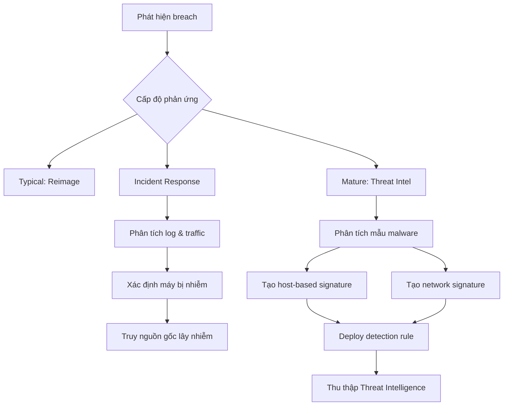
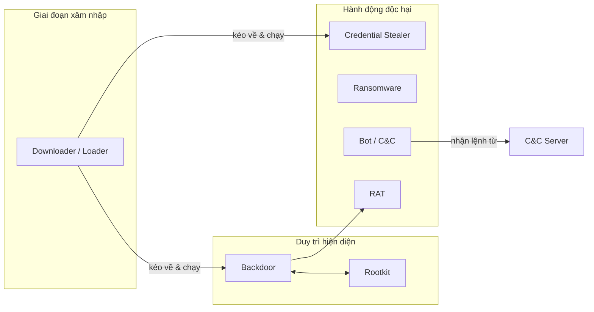
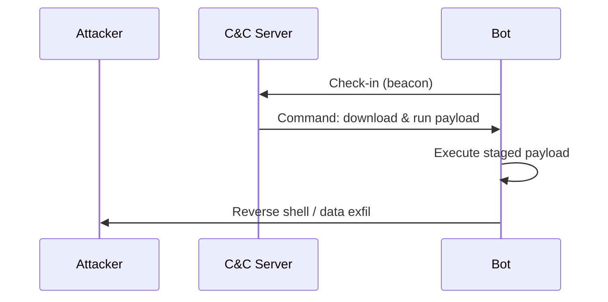
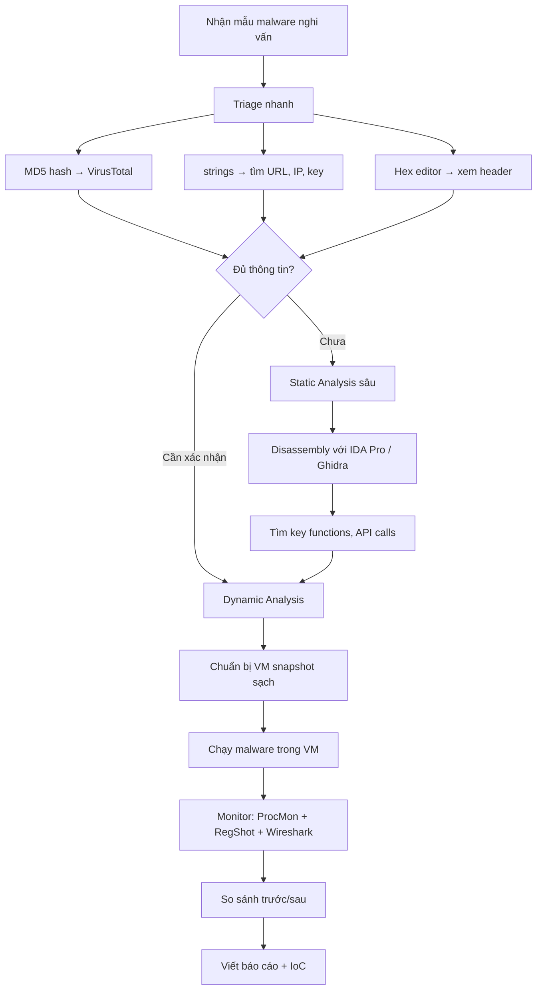
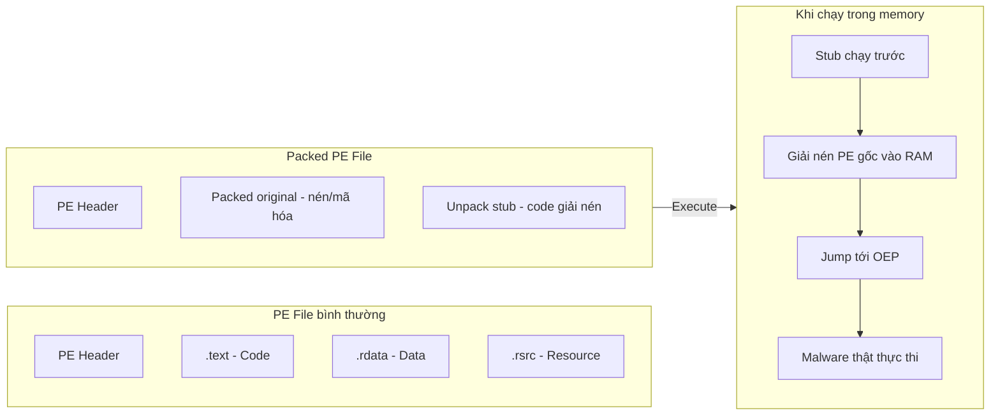
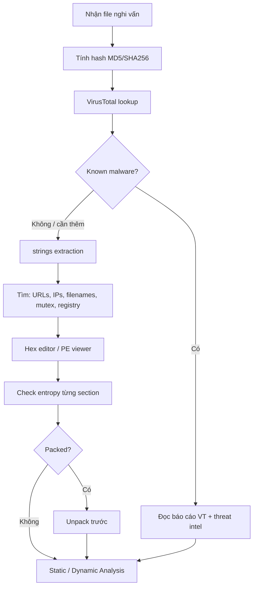

# Bài 1: Introduction to Malware Analysis

---

## Mục tiêu phân tích tài liệu

Tài liệu gồm 32 slide, tôi xác định **5 chủ đề cốt lõi** sau khi lọc phần hành chính:

1. **Mục tiêu & vai trò của Malware Analysis**
2. **Các loại Malware & Payload**
3. **Phương pháp phân tích (Static / Dynamic / Hybrid)**
4. **Công cụ & quy trình triage**
5. **PE File & Packing**

---

## Mục tiêu & Vai Trò của Malware Analysis

Malware analysis không chỉ là "reverse engineering cho vui" — đây là kỹ năng sống còn trong incident response. Khi AV bỏ sót 70–90% mẫu mã độc đặc thù cho từng tổ chức, analyst chính là lớp phòng thủ cuối cùng.

### Khái niệm & lý thuyết

**Malware Analysis** là quá trình kiểm tra mã độc nhằm xác định hành vi, khả năng lây lan, và cơ chế hoạt động của nó.

Ba cấp độ phản ứng sau breach:

| Cấp độ | Hành động | Giới hạn |
|---|---|---|
| **Typical** | Reimage máy | Không biết còn máy nào bị nhiễm không |
| **Incident Response** | Phân tích log, network, process lạ | Biết *cái gì* xảy ra, chưa biết *tại sao* |
| **Mature (Threat Intel)** | Phân tích impact, risk, attribution | Hiểu đầy đủ — APT? Financial? Hacktivist? |

Hai loại **signature** sinh ra từ malware analysis:

- **Host-based signature (IoC):** Tập trung vào *hành vi* của malware trên hệ thống — file được tạo/sửa, registry key bị thay đổi. Hiệu quả hơn AV signature vì không phụ thuộc vào "hình dạng" file.
- **Network signature:** Phát hiện traffic độc hại. Khi kết hợp với malware analysis, tỉ lệ phát hiện cao hơn và false positive thấp hơn đáng kể.

### Cách hoạt động / Luồng xử lý



### Ví dụ thực tế & Analogy

**Ví dụ:** WannaCry 2017 — AV của nhiều tổ chức không phát hiện variant đầu tiên. Chỉ khi analyst reverse engineer được dropper, họ mới tìm ra `killswitch` domain và tạo được network signature ngăn lây lan.

**Analogy:** Malware analysis giống như bác sĩ pháp y sau vụ án. Cảnh sát (AV) có thể bắt tội phạm quen mặt, nhưng kẻ mới hoặc cải trang thì cần pháp y — mổ xẻ từng chi tiết — mới biết *chính xác* chuyện gì đã xảy ra.

### ⚠️ Điểm hay gặp sai / Cần lưu ý

!!! warning "AV không đủ"
    Nhiều sinh viên nghĩ "upload VirusTotal là xong." Thực tế: 70–90% mẫu malware là **unique per organization** (Verizon DBIR 2015). AV chỉ phát hiện mẫu đã biết — analyst phải làm việc với những mẫu *chưa ai thấy bao giờ*.

!!! danger "Host-based vs AV Signature"
    AV signature nhận diện **đặc điểm file** (hash, byte pattern). Host-based IoC nhận diện **hành vi** (tạo registry key `HKCU\Software\MalwareXYZ`). Khi malware tự xóa khỏi disk hoặc đổi hình dạng, AV thất bại — IoC vẫn hoạt động.

### Câu hỏi thực tế

1. Một máy trong mạng doanh nghiệp bị nhiễm ransomware. Bạn chỉ có 1 giờ trước khi mọi người bắt đầu làm việc. Bạn ưu tiên reimage hay phân tích malware trước? Tại sao?
2. Sau khi phân tích, bạn tìm thấy malware ghi file `svchost32.dll` vào `C:\Windows\Temp\`. Bạn sẽ tạo loại signature nào để deploy toàn mạng nhanh nhất?
3. Một APT group sử dụng malware tự thay đổi hash mỗi lần lây nhiễm. Tại sao host-based signature hiệu quả hơn AV signature trong trường hợp này?

---

> 💡 **Chốt nhanh:** Malware analysis sinh ra hai thứ: **IoC để hunt trên host** và **network signature để monitor traffic**. Mục tiêu cuối cùng là hiểu *đầy đủ cơ chế hoạt động* của mã độc — không chỉ dọn sạch một máy.

---

## Phân Loại Malware

Biết tên không đủ — phải hiểu *cơ chế* thì mới phân tích đúng hướng và không bị lạc trong đống assembly code.

### Khái niệm & lý thuyo thuyết

**General malware** — hoạt động theo cơ chế phổ biến:

| Loại | Cơ chế cốt lõi |
|---|---|
| **Virus** | Tự nhân bản bằng cách *gắn vào file hợp lệ* — cần host file để sống |
| **Worm** | Tự nhân bản *không cần host* — lan qua network tự động |
| **Trojan** | Giả dạng phần mềm hợp lệ — không tự nhân bản |
| **Bot** | Nhận lệnh từ **C&C (Command-and-Control) server** |
| **Rootkit** | Ẩn sự tồn tại của malware khác — thường đi kèm backdoor |
| **RAT** | Remote Access Trojan — điều khiển từ xa toàn diện |

**Specialized malware** — chức năng cụ thể hơn:

| Loại | Mục tiêu |
|---|---|
| **Spyware** | Thu thập thông tin người dùng thầm lặng |
| **Adware** | Hiển thị quảng cáo không mong muốn |
| **Scareware** | Dọa người dùng để bán "giải pháp giả" |
| **Credential Stealer** | Keylogger, sniffer, password hash grabber |
| **Backdoor** | Duy trì quyền truy cập sau khi xâm nhập |
| **Loader/Downloader** | Tải và chạy malware khác — thường là bước đầu xâm nhập |

**Malicious Payloads:**

- **Shellcode:** Tập lệnh được inject và thực thi bởi chương trình bị khai thác
- **Staged payload:** Nhiều giai đoạn — stage 1 nhỏ gọn, chỉ để kéo stage 2 về
- **Stageless payload:** Tất cả trong một — chứa sẵn reverse shell callback

**Mass vs. Targeted Malware:**

- **Mass malware:** Lây nhiễm càng nhiều máy càng tốt — dễ phân tích hơn vì có nhiều mẫu
- **Targeted malware (APT):** Được viết riêng cho một tổ chức/cá nhân — rất khó phát hiện, cần phân tích nâng cao

### Cách hoạt động / Luồng xử lý





### Ví dụ thực tế & Analogy

**Ví dụ — Staged payload với Metasploit:**
```
Stage 1 (stager): ~300 bytes — chỉ mở socket và kéo stage 2
Stage 2 (Meterpreter): ~200KB — full-featured reverse shell
```
Tách 2 giai đoạn giúp bypass detection vì stage 1 quá nhỏ và không chứa code nguy hiểm.

**Analogy — Rootkit + Backdoor:**  
Rootkit giống người canh cổng tàng hình — không thấy mặt anh ta, nhưng anh ta đảm bảo backdoor (cửa hậu) luôn mở và không ai biết cửa đó tồn tại. Diệt backdoor mà không diệt rootkit thì backdoor sẽ tái xuất hiện.

**Analogy — Mass vs Targeted:**  
Mass malware như bom xăng ném vào đám đông — gây hại rộng, không cần chính xác. Targeted malware như sniper — một viên đạn, một mục tiêu cụ thể, cần trinh sát kỹ lưỡng trước.

### ⚠️ Điểm hay gặp sai / Cần lưu ý

!!! warning "Nhầm Virus và Worm"
    Virus **cần file host** để lây lan (attach vào `.exe`, `.docx`). Worm **tự lây lan** qua network mà không cần người dùng mở file gì. WannaCry là worm — nó tự quét SMB port và lây sang máy kế tiếp.

!!! danger "Rootkit khó phát hiện từ OS bị nhiễm"
    Nếu OS đã bị rootkit kiểm soát, mọi công cụ chạy trên OS đó đều có thể bị "nói dối". Phân tích rootkit đúng cách cần boot từ external media hoặc dùng memory forensics (Volatility).

!!! tip "Loader/Downloader thường là mẫu đầu tiên bạn thấy"
    Trong thực tế IR, mẫu đầu tiên tìm được thường là loader nhỏ — không chứa gì nguy hiểm. Đừng bỏ cuộc — task của nó là kéo payload thật về.

### Câu hỏi thực tế

1. Bạn tìm được một file `.exe` 15KB trên máy bị nhiễm. File chỉ có một chức năng: kết nối tới IP lạ và download file khác. Đây là loại malware gì? Bước phân tích tiếp theo của bạn là gì?
2. Một máy trong mạng liên tục gửi HTTP request đều đặn mỗi 60 giây tới một domain lạ. Đây có thể là hành vi của loại malware nào? Bạn cần xác nhận thêm thông tin gì?
3. Sau khi dọn malware, máy bị nhiễm lại sau 2 ngày mặc dù bạn đã xóa file executable. Có thể cơ chế nào đang hoạt động?

---

> 💡 **Chốt nhanh:** Hiểu loại malware → hiểu *cái gì cần tìm* khi phân tích. Loader dẫn đến payload thật; rootkit bảo vệ backdoor; bot nhận lệnh từ C&C. Mỗi loại có artifact và IoC đặc trưng riêng.

---

## Phương Pháp Phân Tích

Ba con đường tiếp cận malware — mỗi cái có trade-off riêng. Analyst giỏi biết *khi nào dùng cái nào*.

### Khái niệm & lý thuyết

| Phương pháp | Mô tả | Ưu điểm | Nhược điểm |
|---|---|---|---|
| **Static Analysis** | Kiểm tra mà *không chạy* malware | An toàn, không cần VM đặc biệt | Chậm, cần kiến thức RE sâu |
| **Dynamic Analysis** | *Chạy* malware và quan sát hành vi | Nhanh, trực quan | Dễ bỏ sót nhánh code không được kích hoạt |
| **Hybrid** | Kết hợp cả hai — thấy gì trong disassembly thì confirm bằng cách chạy | Hiệu quả nhất trong thực tế | Cần thành thạo cả hai |

**Công cụ Static Analysis:**
- **VirusTotal** — kiểm tra hash, so sánh với database
- **strings** — extract chuỗi ASCII/Unicode từ binary
- **IDA Pro / Ghidra / x64dbg** — disassembler và debugger

**Công cụ Dynamic Analysis:**
- **Process Monitor (ProcMon)** — monitor file, registry, network calls
- **RegShot** — snapshot registry trước/sau khi chạy malware
- **Process Hacker** — xem process tree, memory, handles
- **CaptureBAT** — capture toàn bộ behavior
- **Volatility / Mandiant Redline** — RAM forensics

### Cách hoạt động / Luồng xử lý



### Ví dụ thực tế & Analogy

**Ví dụ — Hybrid trong thực tế:**  
Bạn disassemble một hàm encrypt trong IDA Pro và thấy nó XOR từng byte với key cố định. Thay vì giải thủ công, bạn set breakpoint tại điểm sau khi decrypt hoàn tất và *chạy malware trong debugger* để dump chuỗi đã decrypt ra. Đây là hybrid — static để tìm điểm quan trọng, dynamic để extract data.

**Analogy — Static vs Dynamic:**  
Static analysis như đọc công thức thuốc độc trong sách hóa học — bạn hiểu thành phần nhưng không thấy tác dụng thực tế. Dynamic analysis như để chuột lab uống thuốc và quan sát — bạn thấy triệu chứng nhưng có thể bỏ sót phần tác dụng chỉ xảy ra sau 7 ngày. Hybrid thì bạn vừa đọc công thức vừa quan sát thực nghiệm.

### ⚠️ Điểm hay gặp sai / Cần lưu ý

!!! danger "KHÔNG chạy malware trên máy thật"
    Dynamic analysis BẮT BUỘC thực hiện trong môi trường cô lập — VM có snapshot sạch, network cô lập hoặc giả lập (INetSim/ApateDNS). Một số malware phát hiện VM và không hoạt động — đây là kỹ thuật **anti-analysis**.

!!! warning "Dynamic analysis có thể bỏ sót logic ẩn"
    Malware có thể kiểm tra ngày giờ, hostname, hoặc điều kiện đặc biệt trước khi kích hoạt payload chính. Nếu điều kiện không thỏa, bạn chỉ thấy malware "không làm gì" — nhưng thực ra nó đang chờ.

!!! tip "Memory Forensics là công cụ bổ sung, không phải thay thế"
    Volatility rất mạnh nhưng không phải "end-all-be-all" như slide đề cập. Dùng khi cần phân tích malware đã đang chạy trong RAM, unpack malware in-memory, hoặc tìm process ẩn mà static/dynamic thông thường bỏ sót.

### Câu hỏi thực tế

1. Bạn nhận được một mẫu malware đã được pack bằng UPX. Bạn sẽ bắt đầu bằng static hay dynamic analysis? Tại sao? Bước đầu tiên cụ thể là gì?
2. Dynamic analysis của bạn không thấy malware làm gì bất thường. Nhưng colleague của bạn nói mạng thực tế bị mã hóa toàn bộ sau khi bị nhiễm loại malware này. Bạn nghi ngờ điều gì?
3. Bạn cần tạo IoC nhanh nhất có thể trong 30 phút. Bạn chọn phương pháp nào và output cụ thể là gì?

---

> 💡 **Chốt nhanh:** Static an toàn nhưng chậm. Dynamic nhanh nhưng có thể bị qua mặt. **Hybrid là chuẩn mực thực tế** — disassembly để hiểu structure, debugger để confirm và extract runtime data.

---

## PE File & Packing

Hiểu cấu trúc PE file là nền tảng của mọi kỹ thuật static analysis. Packing là kỹ thuật malware dùng để "che" bản thân — analyst phải unpack được mới phân tích tiếp.

### Khái niệm & lý thuyết

**PE (Portable Executable)** là định dạng file thực thi của Windows (`.exe`, `.dll`, `.sys`...).

Cấu trúc chính:

| Thành phần | Vai trò |
|---|---|
| **MS-DOS Header** | Tương thích ngược với DOS, chứa magic bytes `MZ` |
| **PE File Header** | Metadata: architecture, số section, timestamp |
| **Optional Header** | Entry point, image base, subsystem |
| **Section Headers** | Mô tả từng section (tên, offset, size, flags) |
| **`.text` section** | Code thực thi |
| **`.rdata` section** | Read-only data: strings, import table |
| **`.data` section** | Initialized global variables |
| **`.rsrc` section** | Resources: icon, dialog, version info |

**Key concepts:**
- **OEP (Original Entry Point):** Điểm thực thi đầu tiên của file gốc
- **VA (Virtual Address):** Địa chỉ khi file được load vào memory
- **RVA (Relative Virtual Address):** Offset tính từ image base

**Packing là gì?**  
Packer nén/encrypt toàn bộ PE gốc, bọc nó trong một stub nhỏ. Khi chạy, stub sẽ **giải nén PE gốc vào memory** rồi nhảy tới OEP — mọi chuyện xảy ra hoàn toàn trong RAM.

### Cách hoạt động / Luồng xử lý



**Quy trình unpack thủ công (ESP trick):**

```
1. Load packed binary vào x32dbg
2. Set breakpoint on ESP (hardware breakpoint sau PUSHAD)
3. Run → dừng khi stub chuẩn bị jump tới OEP
4. Tìm lệnh JMP/CALL → OEP
5. Set breakpoint tại OEP
6. Dump memory bằng Scylla
7. Fix IAT (Import Address Table)
```

### Ví dụ thực tế & Analogy

**Ví dụ — Nhận biết packed file:**
```bash
# Dùng strings trên packed file:
$ strings malware.exe
# Output: rất ít string có nghĩa, thấy nhiều ký tự rác
# → dấu hiệu bị pack

# Entropy cao > 7.0 → file bị nén/mã hóa
# Tool: PE Studio, Detect-It-Easy (DIE)
```

**Ví dụ — Dùng DIE để phát hiện packer:**
```
Detect-It-Easy output:
  PE: UPX 3.95 [NRV2B] → rõ ràng là packed bằng UPX
  PE: unknown packer → cần unpack thủ công
```

**Analogy — Packing:**  
Packed malware giống như tài liệu mật được đặt trong hộp khóa (stub). Chỉ khi hộp được mở (stub chạy và giải mã) thì tài liệu thật mới xuất hiện. Nếu bạn phân tích cái hộp, bạn chỉ thấy cơ chế mở khóa — không thấy nội dung bên trong.

### ⚠️ Điểm hay gặp sai / Cần lưu ý

!!! warning "Entropy cao ≠ luôn là packed"
    Section `.rsrc` chứa ảnh bitmap cũng có entropy cao. Kiểm tra *từng section* riêng, không phải toàn file. Section `.text` entropy > 7.5 mới đáng nghi.

!!! danger "Dump xong phải fix IAT"
    Sau khi dump memory, IAT (Import Address Table) trỏ tới địa chỉ runtime trong memory — không dùng được khi load lại. Bắt buộc dùng **Scylla** hoặc tương đương để rebuild IAT trước khi phân tích file đã dump.

!!! tip "UPX có thể unpack tự động"
    `upx -d malware_packed.exe -o malware_unpacked.exe`  
    Tuy nhiên nhiều malware dùng modified UPX — command này sẽ fail và bạn phải unpack thủ công.

### Câu hỏi thực tế

1. Bạn mở một file `.exe` trong IDA Pro nhưng chỉ thấy khoảng 10 function và gần như không có import nào. Bạn nghi ngờ điều gì và bước tiếp theo là gì?
2. Sau khi dump một packed binary từ memory, khi load vào IDA Pro bạn thấy tất cả các import đều là địa chỉ số lẻ không có nghĩa. Vấn đề là gì?
3. Bạn cần so sánh behavior của malware trước và sau khi unpack. Công cụ nào trong bộ dynamic analysis giúp bạn làm điều này hiệu quả nhất?

---

> 💡 **Chốt nhanh:** PE file = bản đồ của executable. Packing = ẩn bản đồ thật trong một phong bì. Unpack = mở phong bì. Mọi static analysis đều vô nghĩa nếu bạn đang đọc stub thay vì malware thật.

---

## Quy Tắc Vàng & Công Cụ Triage

Phần này tổng hợp mindset và workflow thực tế của analyst — thứ không có trong sách nhưng cực kỳ quan trọng trong nghề.

### Khái niệm & lý thuyết

**Ba quy tắc vàng của malware analysis:**

1. **Đừng sa lầy vào chi tiết** — Malware thường rất lớn và phức tạp. Focus vào key features trước, general overview trước khi đào sâu.

2. **Không có "một công cụ duy nhất"** — Mỗi tình huống cần công cụ khác nhau. Bí với IDA? Thử Ghidra. Bí với một approach? Thử góc nhìn khác.

3. **Cat-and-mouse game** — Malware author luôn phát triển kỹ thuật anti-analysis mới để đáp lại analyst. Analyst phải liên tục cập nhật.

**One-Minute Triage workflow:**

```
1. Hash file (MD5/SHA256)
2. Upload hash lên VirusTotal → xem detection rate, common names, IoC
3. Chạy strings → tìm URL, IP, registry keys, mutex names
4. Mở Hex editor → xem magic bytes, PE header, entropy
5. Dùng Detect-It-Easy → xác định packer, compiler, architecture
```

### Cách hoạt động / Luồng xử lý



**Bộ công cụ tối thiểu:**

```
Static:
├── PE Studio / CFF Explorer     # PE header analysis
├── Detect-It-Easy (DIE)         # Packer/compiler detection
├── strings (Sysinternals)       # String extraction
├── IDA Pro / Ghidra             # Disassembler
└── VirusTotal                   # Hash lookup

Dynamic:
├── x64dbg                       # Debugger
├── Process Monitor (ProcMon)    # Behavior monitoring
├── RegShot                      # Registry diff
├── Wireshark / FakeNet-NG       # Network monitoring
└── Volatility                   # Memory forensics

VM Setup:
├── VMware / VirtualBox          # Isolation
├── Snapshot sạch                # Rollback sau mỗi run
└── INetSim / ApateDNS           # Fake network services
```

### Ví dụ thực tế & Analogy

**Ví dụ — strings output tiêu biểu của malware:**
```bash
$ strings malware.exe | grep -E "(http|\.exe|HKEY|CreateRemoteThread)"
http://evil-c2.xyz/gate.php
C:\Users\Public\svchost32.exe
HKEY_CURRENT_USER\Software\Microsoft\Windows\Run
CreateRemoteThread
VirtualAllocEx
WriteProcessMemory
```
Chỉ 6 dòng này đã tiết lộ: C&C URL, persistence mechanism, và process injection capability.

**Analogy — Triage:**  
One-minute triage giống như bác sĩ cấp cứu đánh giá bệnh nhân trong 60 giây đầu — không phải để chẩn đoán hoàn toàn, mà để biết *mức độ khẩn cấp* và *ưu tiên xử lý* gì trước.

### ⚠️ Điểm hay gặp sai / Cần lưu ý

!!! warning "VirusTotal = starting point, không phải conclusion"
    0/72 detection không có nghĩa file sạch. Có thể là targeted malware chưa ai submit. Có thể mới được tạo. Có thể đã obfuscated kỹ. VT là bước đầu tiên của triage, không phải phán quyết cuối cùng.

!!! tip "Minimize tool clutter"
    Slide ghi rõ: *"Note: keep it to a Minimum."* Biết 5 tool tốt còn hơn cài 50 tool không biết dùng. Master ProcMon trước khi học tool phức tạp hơn.

### Câu hỏi thực tế

1. VirusTotal trả về 0/72 cho một file exe bạn tìm thấy trên máy bị nghi nhiễm. Bạn sẽ xử lý file này như thế nào tiếp theo?
2. Bạn đang phân tích một malware phức tạp và bị kẹt ở một đoạn obfuscated code trong 2 tiếng. Theo quy tắc vàng, bạn nên làm gì?
3. Bạn cần setup lab dynamic analysis trong 1 giờ cho buổi seminar. Liệt kê 5 bước tối thiểu cần thực hiện trước khi chạy malware đầu tiên.

---

> 💡 **Chốt nhanh:** Triage = hash → VirusTotal → strings → hex. Đây là 60 giây quyết định bạn cần đầu tư bao nhiêu thời gian phân tích tiếp theo. Công cụ ít nhưng thành thạo luôn tốt hơn cài đầy máy mà không dùng được.

---

---

# 📝 Quiz: Introduction to Malware Analysis

---

## Tầng 1 — Ghi nhớ

**Câu 1.** Malware là viết tắt của?

- [x] Malicious Software
- [ ] Management Layer Software
- [ ] Multi-Layer Attack Software
- [ ] Malfunction Software

??? info "Giải thích"
    Malware = **Mal**icious Soft**ware** — phần mềm độc hại thực thi mà không có sự cho phép của người dùng.

---

**Câu 2.** Host-based signature (IoC) tập trung vào điều gì?

- [x] Hành vi của malware trên hệ thống (file tạo ra, registry thay đổi)
- [ ] Hash của file malware
- [ ] Byte pattern trong binary
- [ ] Địa chỉ IP của C&C server

??? info "Giải thích"
    IoC tập trung vào **hành vi** — không phụ thuộc "hình dạng" của file, do đó vẫn hoạt động khi malware đã bị xóa khỏi disk hoặc tự thay đổi.

---

**Câu 3.** Loại malware nào tự nhân bản mà KHÔNG cần file host?

- [x] Worm
- [ ] Virus
- [ ] Trojan
- [ ] Spyware

??? info "Giải thích"
    Virus cần gắn vào file host để lây lan. Worm tự lan qua network độc lập — không cần người dùng mở file nào.

---

**Câu 4.** Rootkit thường đi kèm với loại malware nào?

- [x] Backdoor
- [ ] Ransomware
- [ ] Adware
- [ ] Worm

??? info "Giải thích"
    Rootkit ẩn sự tồn tại của các malware khác — thường được ghép cặp với backdoor để duy trì quyền truy cập bền vững và không bị phát hiện.

---

**Câu 5.** Trong cấu trúc PE file, section nào chứa code thực thi?

- [x] `.text`
- [ ] `.rdata`
- [ ] `.data`
- [ ] `.rsrc`

??? info "Giải thích"
    `.text` chứa code thực thi (assembly instructions). `.rdata` là read-only data, `.data` là biến toàn cục, `.rsrc` là resources như icon.

---

**Câu 6.** Packer làm gì với PE file?

- [x] Nén/mã hóa PE gốc và thêm stub để giải nén khi chạy
- [ ] Xóa các section không cần thiết để file nhỏ hơn
- [ ] Thay đổi entry point về địa chỉ 0x0
- [ ] Gắn malware vào file PE hợp lệ khác

??? info "Giải thích"
    Packer bọc PE gốc trong một stub (unpack code). Khi chạy, stub giải nén PE gốc vào memory rồi nhảy tới OEP — payload thật chỉ xuất hiện trong RAM.

---

**Câu 7.** Dynamic analysis khác static analysis ở điểm cơ bản nào?

- [x] Dynamic analysis thực sự chạy malware để quan sát hành vi
- [ ] Dynamic analysis nhanh hơn và chính xác hơn
- [ ] Dynamic analysis không cần môi trường cô lập
- [ ] Dynamic analysis chỉ dùng cho malware đã được unpack

??? info "Giải thích"
    Static = kiểm tra **không chạy**. Dynamic = **chạy** và quan sát. Mỗi cái có trade-off riêng.

---

**Câu 8.** OEP trong ngữ cảnh PE packing là gì?

- [x] Original Entry Point — điểm thực thi đầu tiên của PE gốc trước khi bị pack
- [ ] Open Execution Path — đường dẫn thực thi mở
- [ ] Offset Entry Pointer — con trỏ offset vào file
- [ ] Operating Entry Protocol — giao thức khởi động hệ điều hành

??? info "Giải thích"
    OEP là địa chỉ entry point của PE gốc. Khi unpack, analyst cần tìm lệnh `JMP OEP` của stub để biết nơi dump memory — đây là điểm malware thật bắt đầu chạy.

---

## Tầng 2 — Hiểu & Phân Tích

**Câu 9.** Tại sao host-based IoC hiệu quả hơn AV signature khi phát hiện polymorphic malware?

- [x] Vì IoC dựa trên hành vi (tạo file, sửa registry) thay vì đặc điểm của file — hành vi ít thay đổi hơn hình dạng file
- [ ] Vì IoC được cập nhật nhanh hơn AV database
- [ ] Vì IoC chỉ cần 1 byte để match
- [ ] Vì AV không thể quét registry

??? info "Giải thích"
    Polymorphic malware thay đổi hash và byte pattern mỗi lần — AV dựa trên signature sẽ miss. Nhưng nó vẫn cần tạo file persistence, gọi API đặc trưng — hành vi khó thay đổi hơn.

---

**Câu 10.** Một analyst chọn chỉ dùng dynamic analysis cho toàn bộ quá trình phân tích. Rủi ro lớn nhất là gì?

- [x] Bỏ sót các code path không được kích hoạt trong điều kiện test (time bomb, anti-VM logic)
- [ ] File có thể bị corrupt trong quá trình chạy
- [ ] Dynamic analysis không thể tìm được IoC
- [ ] Malware sẽ tự xóa khi phát hiện đang bị monitor

??? info "Giải thích"
    Malware có thể kiểm tra ngày giờ, hostname, số process đang chạy, hay thậm chí MAC address trước khi kích hoạt payload — dynamic analysis một lần không đảm bảo bạn thấy toàn bộ behavior.

---

**Câu 11.** So sánh Staged payload và Stageless payload: lý do attacker chọn staged payload là gì?

- [x] Stage 1 nhỏ gọn, dễ bypass detection hơn; stage 2 được tải về sau khi đã establish foothold
- [ ] Staged payload mã hóa tốt hơn
- [ ] Stageless payload không hỗ trợ reverse shell
- [ ] Staged payload chỉ dùng trong APT, không dùng trong mass malware

??? info "Giải thích"
    Stage 1 (~300 bytes) không chứa code nguy hiểm rõ ràng — khó bị AV/IDS phát hiện. Sau khi kết nối C2 thành công, stage 2 mới được kéo về với đầy đủ capability.

---

**Câu 12.** Bạn thấy entropy của section `.text` là 7.8 (thang 0–8). Điều này gợi ý điều gì nhất?

- [x] File có thể bị packed hoặc encrypted — cần unpack trước khi phân tích
- [ ] File được viết bằng C++ với nhiều template
- [ ] File sử dụng nhiều string constants
- [ ] File có nhiều resource nhúng

??? info "Giải thích"
    Entropy cao (>7.0) ở `.text` section cho thấy dữ liệu gần như ngẫu nhiên — đặc trưng của nén hoặc mã hóa. Code assembly bình thường có entropy thấp hơn nhiều (~5–6).

---

**Câu 13.** Tại sao targeted malware khó phát hiện hơn mass malware?

- [x] Targeted malware được viết riêng cho một tổ chức/cá nhân — không có mẫu nào trong AV database, và attacker đã nghiên cứu kỹ môi trường mục tiêu
- [ ] Targeted malware sử dụng ngôn ngữ lập trình hiếm hơn
- [ ] Targeted malware thường nhỏ hơn về kích thước file
- [ ] Targeted malware không giao tiếp với C&C server nên không bị detect qua network

??? info "Giải thích"
    Mass malware được share rộng rãi — AV nhanh chóng có mẫu và tạo signature. Targeted malware unique cho từng tổ chức (70–90% theo Verizon DBIR), AV chưa bao giờ thấy mẫu đó.

---

**Câu 14.** Sau khi dump memory của packed malware, IAT của file dump bị broken. Nguyên nhân là gì?

- [x] IAT trong memory chứa địa chỉ runtime thực — sau khi dump ra file, các địa chỉ này không còn hợp lệ nữa
- [ ] Dump process làm corrupt IAT
- [ ] Packer xóa IAT khi unpack vào memory
- [ ] IAT chỉ tồn tại trong file on-disk, không có trong memory

??? info "Giải thích"
    Khi PE được load vào memory, Windows resolve các import và điền địa chỉ thực của API vào IAT. Địa chỉ này là runtime virtual address — khi dump ra file tĩnh, nó không hợp lệ. Cần Scylla để rebuild.

---

## Tầng 3 — Vận Dụng

**Câu 15.** Trong một IR case, bạn tìm thấy file `update.exe` (12KB) trên nhiều máy. VirusTotal cho 0/72 detections. `strings` output chỉ có URL `http://update-server.xyz/payload.bin` và không có gì khác đáng chú ý. Bạn xử lý thế nào?

- [x] Setup VM cô lập, chạy file và monitor network traffic — bắt payload.bin được download về, sau đó phân tích payload đó
- [ ] Kết luận file sạch vì VT cho 0 detection
- [ ] Xóa file vì size quá nhỏ, không thể là malware nguy hiểm
- [ ] Chỉ cần block URL trên firewall là đủ

??? info "Giải thích"
    Đây là dấu hiệu classic của Downloader/Loader. 0/72 VT detection có thể là targeted hoặc mới tạo. Block URL là bước đầu nhưng chưa đủ — cần phân tích payload.bin để hiểu impact thực sự và tìm IoC cho host-based detection.

---

**Câu 16.** Bạn đang phân tích malware bằng dynamic analysis. ProcMon không ghi nhận gì bất thường trong 10 phút đầu. Nhưng bạn nhớ rằng vụ breach xảy ra vào đúng ngày 1 hàng tháng. Bước nào sau đây phù hợp nhất?

- [x] Thay đổi system clock trong VM về ngày 1 của tháng và chạy lại malware
- [ ] Kết luận dynamic analysis không hiệu quả và chuyển sang static hoàn toàn
- [ ] Tăng thời gian monitor lên 60 phút
- [ ] Submit lên VirusTotal để xem behavioral report

??? info "Giải thích"
    Đây là dấu hiệu **logic bomb** — malware kiểm tra ngày giờ trước khi kích hoạt. Thay đổi system clock trong VM là cách đơn giản nhất để trigger điều kiện đó mà không phải chờ đến ngày 1.

---

**Câu 17.** Một SOC analyst cần tạo detection rule NHANH NHẤT có thể cho một malware mới đang lây lan trong mạng. Malware liên tục thay đổi hash (polymorphic) và đã tự xóa khỏi disk. Approach nào sau đây ĐÚNG nhất?

- [x] Dùng memory forensics (Volatility) để extract malware từ RAM của máy bị nhiễm, sau đó dynamic analysis để tìm network behavior → tạo network signature cho SIEM/IDS
- [ ] Chờ AV vendor cập nhật signature
- [ ] Reimage toàn bộ máy bị nhiễm và monitor tiếp
- [ ] Chạy strings trên các file `.tmp` trên disk để tìm IoC

??? info "Giải thích"
    Malware polymorphic + đã xóa khỏi disk → AV signature vô dụng, strings trên disk không còn target. Memory forensics extract malware từ RAM (nơi nó đang chạy), dynamic analysis reveal network behavior, từ đó tạo network signature detect được qua traffic dù hash luôn thay đổi.

---
