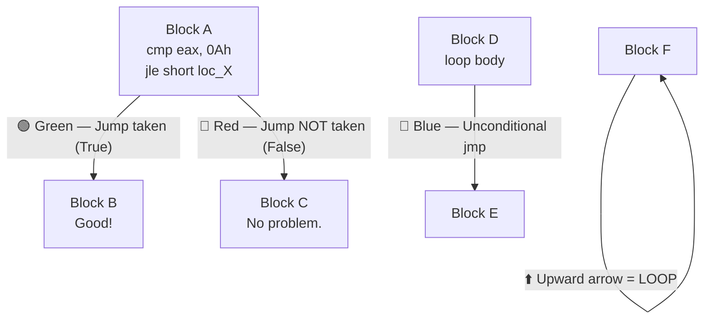
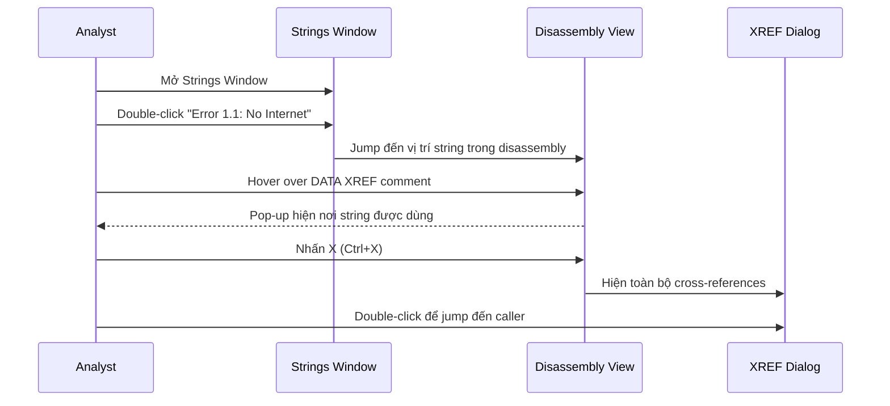
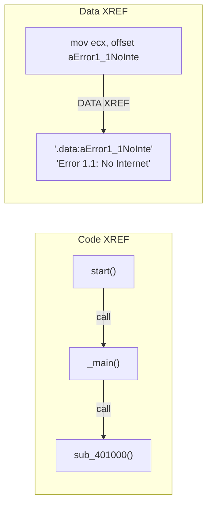
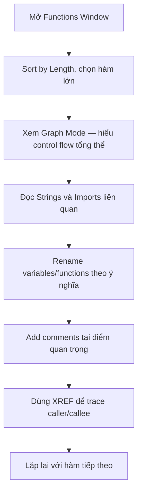

# Bài 3: Static Analysis với IDA Pro

---

## 1. Tổng quan về Công cụ Reverse Engineering

Trước khi đi vào IDA Pro, cần biết "bức tranh toàn cảnh" — có nhiều công cụ phục vụ reverse engineering, mỗi cái có lý do tồn tại riêng.

### Khái niệm & lý thuyết

**Disassembler** — công cụ chuyển đổi mã máy (binary) thành assembly code có thể đọc được.

**Debugger** — công cụ cho phép chạy từng bước chương trình, theo dõi trạng thái memory/register.

Các công cụ chính trong reversing community:

| Công cụ | Loại | Phí | Điểm mạnh | Điểm yếu |
|---|---|---|---|---|
| **IDA Pro** | Disassembler + Debugger | Có phí | Hỗ trợ đa nền tảng, tính năng vượt trội | Giá cao, learning curve dốc |
| **Radare2 (r2)** | Disassembler + Debugger | Miễn phí | Open source, cross-platform | Learning curve dốc |
| **x64dbg** | Debugger | Miễn phí | x64-oriented, plugin ecosystem | Còn phát triển |
| **OllyDbg** | Debugger | Miễn phí | Dễ dùng, nhiều tutorial | Không hỗ trợ x64, phát triển chậm |
| **Ghidra** | Disassembler | Miễn phí | NSA-backed, mạnh ngang IDA | — |

### Ví dụ thực tế & Analogy

> **Analogy:** Nếu một binary là căn nhà đã bị khóa cửa, thì disassembler là bản vẽ kiến trúc giúp bạn hiểu cấu trúc bên trong — còn debugger là chìa khóa vạn năng cho phép bạn bước vào từng phòng theo thời gian thực.

Thực tế: ESET Labs dùng IDA Pro để reverse engineer malware phục vụ xây dựng signature cho AV.

### ⚠️ Điểm hay gặp sai

!!! warning "Nhầm lẫn về vai trò"
    Nhiều sinh viên nghĩ "chỉ cần Ghidra là đủ" — đúng cho học tập, nhưng trong môi trường doanh nghiệp/CTF chuyên nghiệp, IDA Pro vẫn là tiêu chuẩn de facto. Hiểu cả hai để linh hoạt.

### Câu hỏi thực tế

1. Khi bạn nhận được một file `.exe` bị nghi là malware và cần phân tích nhanh mà không cần chạy — bạn dùng disassembler hay debugger trước?
2. Team bạn cần reversing cả binary 32-bit lẫn 64-bit, nhưng ngân sách bằng 0 — bạn chọn công cụ gì và tại sao?

---

> 💡 **Chốt nhanh:** IDA Pro = vua disassembler, đắt nhưng đỉnh. Radare2/Ghidra = miễn phí, đủ mạnh cho học tập và CTF. x64dbg = debugger hiện đại nhất cho Windows binary.

---

## 2. IDA Pro — Giao diện & Chế độ hiển thị

### Khái niệm & lý thuyết

IDA Pro có hai chế độ hiển thị chính:

**Graph Mode (mặc định)** — hiển thị control flow graph (CFG) dưới dạng các block nối với nhau bằng mũi tên màu sắc.

**Text Mode** — hiển thị disassembly dạng dòng tuần tự như text editor truyền thống, kèm địa chỉ và section label.

Phím **Spacebar** chuyển đổi qua lại giữa hai chế độ.

### Cách hoạt động — Màu sắc mũi tên trong Graph Mode



| Màu | Ý nghĩa |
|---|---|
| 🟢 **Xanh lá** | Conditional jump **được thực hiện** (condition = true) |
| 🔴 **Đỏ** | Conditional jump **không được thực hiện** (condition = false) |
| 🔵 **Xanh dương** | Unconditional jump (`jmp`) |
| ⬆️ **Mũi tên đi lên** | **Loop** — nhảy ngược về địa chỉ cao hơn |

Trong **Text Mode**, convention khác:

- **Solid arrow** = unconditional jump
- **Dashed arrow** = conditional jump
- Arrow đi lên = loop

### Navigation Band

Thanh màu nằm phía trên IDA cho biết loại code:

- 🔵 **Xanh nhạt** — Library code (không cần phân tích sâu)
- 🔴 **Đỏ** — Compiler-generated code
- 🔵 **Xanh đậm** — **User-written code** → đây là phần cần tập trung phân tích

### Ví dụ thực tế & Analogy

> **Analogy:** Graph mode giống bản đồ metro — bạn thấy ngay ga nào nối ga nào, rẽ trái hay rẽ phải. Text mode giống đọc lịch trình chuyến tàu từng dòng — chi tiết hơn nhưng mất nhiều thời gian để hiểu tổng thể.

```c
// Source code gốc
if (abc > 10) {
    printf("\n Good!");
} else {
    printf("\n No problem.");
}
```

Trong Graph Mode, IDA tạo ra 3 block:
- Block điều kiện (`cmp`, `jle`)
- Block "Good!" → mũi tên **xanh lá** từ block điều kiện
- Block "No problem." → mũi tên **đỏ** từ block điều kiện

### ⚠️ Điểm hay gặp sai

!!! danger "Đọc nhầm màu mũi tên"
    Nhiều người mới nhớ ngược: **xanh = true (jump taken)**, **đỏ = false (not taken)**. Mẹo nhớ: "Đèn xanh thì đi" — green = go = jump executed.

!!! warning "Không có Undo"
    IDA Pro **không có chức năng Undo**. Mọi thay đổi (rename, comment, patch) là vĩnh viễn trong session. Luôn backup file `.idb` trước khi sửa đổi lớn.

### Câu hỏi thực tế

1. Bạn đang phân tích một hàm trong Graph Mode và thấy một mũi tên màu đỏ đi lên — điều đó nói lên gì về cấu trúc code?
2. Trong Navigation Band, phần nào bạn nên click vào đầu tiên khi bắt đầu phân tích malware và tại sao?

---

> 💡 **Chốt nhanh:** Graph Mode = nhìn tổng thể control flow; Text Mode = đọc chi tiết từng instruction. Màu mũi tên = ngôn ngữ riêng của IDA — phải thuộc lòng.

---

## 3. Các cửa sổ phân tích quan trọng

### Khái niệm & lý thuyết

IDA Pro cung cấp nhiều sub-window, mỗi cái phục vụ một mục đích khác nhau trong quá trình phân tích.

### Functions Window

Liệt kê tất cả hàm được IDA nhận diện, kèm:
- **Segment** (`.text`, `.data`...)
- **Start address**
- **Length** — hàm có **length lớn** thường chứa logic phức tạp hơn → ưu tiên phân tích
- **Flags**: `L` = Library function (bỏ qua), `R`, `S`, `B`, `T`...

**Tip:** Sort theo Length giảm dần để tìm hàm "béo" nhất — thường là nơi chứa logic chính của malware.

### Names Window

Liệt kê mọi địa chỉ có tên, bao gồm: functions, named code, named data, strings.

Prefix | Ý nghĩa
---|---
`F` | Function (user-defined)
`L` | Library function

### Strings Window

Hiển thị tất cả chuỗi tìm thấy trong binary — đây là điểm **khởi đầu tuyệt vời** khi phân tích malware vì strings thường tiết lộ: URL C2, registry key, tên file, thông điệp lỗi.

### Imports & Exports Window

- **Imports**: Danh sách API/DLL mà binary gọi → biết ngay khả năng của malware (network? registry? file system?)
- **Exports**: Hàm mà binary expose ra ngoài

### Structures Window

Hiển thị tất cả data structures đang active. Hover để xem pop-up màu vàng hiện chi tiết từng field.

### Cách hoạt động — Luồng phân tích từ Strings đến Code



### Ví dụ thực tế & Analogy

> **Analogy:** Strings Window giống việc lật sách ra xem mục lục và phần chú thích — bạn chưa đọc toàn bộ sách nhưng đã biết sách nói về gì. Sau đó dùng XREF để tìm trang nào nhắc đến keyword đó.

Ví dụ thực tế: Thấy string `"InternetGetConnectedState"` trong Imports → malware có khả năng kiểm tra kết nối internet trước khi thực hiện hành động độc hại.

### ⚠️ Điểm hay gặp sai

!!! warning "Strings Window mặc định không hiển thị tất cả"
    IDA chỉ hiển thị strings đáp ứng độ dài tối thiểu. Vào `Setup → Strings` để thay đổi nếu nghi có strings bị ẩn.

### Câu hỏi thực tế

1. Khi mở một binary trong IDA, bạn thấy Imports có `RegSetValueExW`, `CreateFileA`, `InternetOpenA` — bạn suy luận gì về hành vi của binary?
2. Làm thế nào để từ một string thú vị trong Strings Window, bạn tìm được hàm `main()` đang dùng string đó?

---

> 💡 **Chốt nhanh:** Strings → XREF → Code = luồng phân tích cơ bản nhất. Functions Window sort theo size để tìm điểm vào. Imports tiết lộ "vũ khí" của malware.

---

## 4. Điều hướng trong IDA Pro

### Khái niệm & lý thuyết

**Cross-Reference (XREF)** — cơ chế IDA theo dõi mọi nơi một symbol (hàm, data, string) được **sử dụng** hoặc **được gọi đến**.

Hai loại XREF:
- **Code XREF** — hàm A gọi hàm B → XREF từ A đến B
- **Data XREF** — instruction tại địa chỉ X đọc/ghi data tại địa chỉ Y

### Các phím tắt quan trọng

| Phím | Tác dụng |
|---|---|
| **Double-click** | Jump đến địa chỉ/symbol được click |
| **Esc / Back button** | Quay lại vị trí trước (như browser history) |
| **G** | Jump to address — nhập hex address hoặc tên symbol |
| **X** (hoặc Ctrl+X) | Hiện tất cả cross-references đến symbol đang chọn |
| **Spacebar** | Toggle Graph ↔ Text mode |
| **Alt+T** | Search text |
| **Alt+B** | Search sequence of bytes |

### Cách hoạt động — XREF trong thực tế



XREF comment trong disassembly view có dạng:
```
.text:00401440 _main  proc near    ; CODE XREF: start+DE↓p
```
- `start+DE` = địa chỉ trong hàm `start` gọi đến `main`
- `↓p` = direction down, type `p` (call instruction)

Để xem **tất cả** XREF (không chỉ 1-2 cái mặc định): click vào tên hàm → nhấn **X**.

### Graphing Options — XREF Visualization

- **View → Graphs → Xrefs to**: Hiển thị tất cả đường đi dẫn **vào** một hàm
- **View → Graphs → Xrefs from**: Hiển thị tất cả hàm mà một hàm **gọi ra**
- **View → Graphs → Function calls**: Toàn bộ call graph của chương trình

!!! note "Legacy Graphs"
    Các graph này là "Legacy Graphs" — không thể kéo thả trong IDA. Dùng **User xrefs chart** để tùy chỉnh độ sâu đệ quy và hướng graph.

### Ví dụ thực tế & Analogy

> **Analogy:** XREF giống tính năng "Find all references" trong IDE như VS Code — bạn click vào một function, IDE hiện tất cả nơi gọi function đó. IDA làm điều tương tự nhưng với binary đã compiled.

### ⚠️ Điểm hay gặp sai

!!! warning "Chỉ thấy 1-2 XREF mặc định"
    IDA chỉ hiện một vài XREF trong comment. Nếu hàm được gọi 50 lần, bạn **phải** nhấn X để xem tất cả — rất quan trọng khi phân tích hàm decrypt hoặc hàm network.

### Câu hỏi thực tế

1. Bạn muốn tìm tất cả nơi trong binary gọi đến `CreateFileA` — bạn làm theo bước nào trong IDA?
2. Phím G trong IDA có thể nhận input là gì — chỉ hex address hay còn gì khác?

---

> 💡 **Chốt nhanh:** Double-click để navigate, Esc để quay lại, X để xem tất cả XREF. Navigation Band màu đậm = user code = phần cần đọc.

---

## 5. Tùy chỉnh và Nâng cao chất lượng Disassembly

### Khái niệm & lý thuyết

IDA Pro cho phép **annotate** và **rename** để biến assembly khó hiểu thành code có ý nghĩa — đây là kỹ năng cốt lõi của reverse engineer.

**FLIRT (Fast Library Identification and Recognition Technology)** — hệ thống nhận diện library code của IDA dựa trên code signature. Cả free và paid version đều có FLIRT.

### Các thao tác nâng cao disassembly

**1. Renaming**

Click vào tên (`sub_401000`) → nhấn **N** → nhập tên có ý nghĩa (`DecryptPayload`).

IDA sẽ **tự động cập nhật tên này ở tất cả XREF** — không cần sửa thủ công từng nơi.

Trước khi rename:
```asm
004013C8  mov   eax, [ebp+arg_4]
004013D4  mov   [ebp+var_598], ax
```

Sau khi rename `arg_4` → `port_str` và `var_598` → `port`:
```asm
004013C8  mov   eax, [ebp+port_str]
004013D4  mov   [ebp+port], ax
```

**2. Comments**

| Phím | Tác dụng |
|---|---|
| `:` (colon) | Thêm comment tại dòng hiện tại (chỉ xuất hiện 1 nơi) |
| `;` (semicolon) | Thêm **repeatable comment** — echo đến tất cả XREF |

**3. Formatting Operands**

Mặc định IDA hiển thị số theo hexadecimal. Right-click vào operand để chuyển sang:
- Decimal (`4896`)
- Octal (`11440o`)
- Binary (`1001100100000b`)
- **Named constant** (quan trọng nhất!)

**4. Named Constants**

IDA tự động gợi ý Windows API constants. Trước:
```asm
push  80h         ; dwFlagsAndAttributes
push  3           ; dwCreationDisposition
push  0           ; lpSecurityAttributes
push  1           ; dwShareMode
```

Sau khi apply symbolic constants:
```asm
push  FILE_ATTRIBUTE_NORMAL   ; dwFlagsAndAttributes
push  OPEN_EXISTING           ; dwCreationDisposition
push  NULL                    ; lpSecurityAttributes
push  FILE_SHARE_READ         ; dwShareMode
```

**5. Options → General**

Có thể bật **Auto comments** — IDA tự thêm comment giải thích mỗi instruction:
```asm
jz   short loc_40102B  ; Jump if Zero (ZF=1)
call sub_40105F        ; Call Procedure
xor  eax, eax         ; Logical Exclusive OR
```

### Cách hoạt động — Quy trình phân tích hàm



### Ví dụ thực tế & Analogy

> **Analogy:** Renaming trong IDA giống việc dùng bút highlight và ghi chú vào lề sách giáo khoa — sách vẫn vậy nhưng bạn đã thêm context của mình vào, lần sau đọc lại nhanh hơn nhiều.

### ⚠️ Điểm hay gặp sai

!!! danger "Rename nhưng không backup"
    Không có Undo. Nếu rename sai một function được gọi 200 lần, phải rename lại thủ công. Backup `.idb` file thường xuyên.

!!! warning "IDA không phải lúc nào cũng đúng"
    IDA tự nhận diện function arguments (`arg_0`, `arg_4`...) nhưng **đôi khi sai** — đặc biệt với calling convention không chuẩn hoặc code bị obfuscated. Luôn verify bằng cách trace thủ công.

### Câu hỏi thực tế

1. Bạn thấy hàm `sub_401000` được gọi ở 30 nơi khác nhau, và sau phân tích bạn biết nó decrypt string. Bạn sẽ làm gì để việc phân tích các caller sau này dễ hơn?
2. Khi thấy `push 3` trước một call đến `CreateFileA`, làm thế nào để IDA tự hiển thị `push OPEN_EXISTING` thay vì con số?

---

> 💡 **Chốt nhanh:** Rename + Comment = đầu tư thời gian ban đầu để tiết kiệm thời gian phân tích về sau. Named constants biến số hex vô nghĩa thành Windows API constant có ý nghĩa rõ ràng.

---

## 6. Mở rộng IDA với Scripts & Plugins

### Khái niệm & lý thuyết

IDA Pro hỗ trợ hai ngôn ngữ scripting:

- **IDC** — ngôn ngữ scripting nội bộ của IDA (C-like syntax)
- **IDAPython** — Python binding cho IDA API (phổ biến hơn nhiều trong cộng đồng hiện đại)

Paid version còn cung cấp **SDK** để viết plugin native.

### Ứng dụng thực tế của scripts

```python
# Ví dụ IDAPython: Tự động rename tất cả function bắt đầu bằng sub_
import idc
import idautils

for func_ea in idautils.Functions():
    name = idc.get_func_name(func_ea)
    if name.startswith("sub_"):
        # Thêm prefix để dễ nhận biết
        idc.set_name(func_ea, f"UNKNOWN_{name}", idc.SN_NOCHECK)
```

??? details "Một số use case phổ biến của IDAPython trong phân tích malware"
    - **String decryption automation**: Malware thường XOR-encrypt strings — viết script tự động decrypt và đổi tên
    - **Batch rename**: Rename hàng trăm functions dựa trên pattern
    - **Export CFG**: Export control flow graph ra format phù hợp cho ML pipeline (ứng dụng cho project của bạn)
    - **Find format string bugs**: Script có sẵn tại openrce.org/downloads/browse/IDA_Scripts

### ⚠️ Điểm hay gặp sai

!!! warning "IDC vs IDAPython"
    IDC là legacy — hầu hết script mới đều viết bằng IDAPython. Khi tìm script trên GitHub, kiểm tra xem nó dùng ngôn ngữ nào và compatible với version IDA bạn đang dùng.

---

> 💡 **Chốt nhanh:** IDAPython là cầu nối giữa IDA Pro và Python ecosystem — cho phép tự động hóa mọi thao tác thủ công. Đây là kỹ năng phân biệt reverse engineer cơ bản và chuyên nghiệp.

---

## Quiz — IDA Pro & Static Analysis

---

### Tầng 1 — Ghi nhớ

**Câu 1.** IDA Pro lần đầu được phát hành vào khoảng thời gian nào?

- [ ] Đầu những năm 2000
- [x] Giữa những năm 1990
- [ ] Năm 2006
- [ ] Năm 2013

??? info "Giải thích"
    Theo slide, IDA Pro được released vào "mid 1990s" và được phát triển bởi Ilfak Guilfanov tại Hex-Rays.

---

**Câu 2.** Phím tắt nào dùng để chuyển đổi giữa Graph Mode và Text Mode trong IDA Pro?

- [ ] Tab
- [ ] Enter
- [x] Spacebar
- [ ] Ctrl+G

??? info "Giải thích"
    Spacebar là phím toggle giữa hai chế độ hiển thị chính của IDA Pro.

---

**Câu 3.** Trong Graph Mode của IDA Pro, mũi tên màu xanh lá (green) thể hiện điều gì?

- [ ] Unconditional jump
- [ ] Conditional jump không được thực hiện
- [x] Conditional jump được thực hiện (taken)
- [ ] Loop

??? info "Giải thích"
    Green = jump taken (điều kiện true). Red = not taken. Blue = unconditional. Arrow đi lên = loop.

---

**Câu 4.** FLIRT trong IDA Pro là viết tắt của gì?

- [ ] Fast Library Integration and Runtime Technology
- [x] Fast Library Identification and Recognition Technology
- [ ] Function Label Identification and Reverse Tooling
- [ ] File Loading and Instruction Recognition Tool

??? info "Giải thích"
    FLIRT = Fast Library Identification and Recognition Technology — hệ thống nhận diện library code bằng code signature, có trong cả free và paid version.

---

**Câu 5.** Trong Navigation Band của IDA Pro, màu xanh đậm (dark blue) đại diện cho loại code nào?

- [ ] Library code
- [ ] Compiler-generated code
- [x] User-written code
- [ ] Import table

??? info "Giải thích"
    Dark blue = user-written code — đây là phần analyst cần tập trung phân tích. Light blue = library, Red = compiler-generated.

---

**Câu 6.** Phím nào trong IDA Pro dùng để xem tất cả cross-references đến một symbol?

- [ ] C
- [ ] R
- [ ] N
- [x] X

??? info "Giải thích"
    X (hoặc Ctrl+X) mở XREF dialog hiển thị tất cả nơi symbol được referenced.

---

**Câu 7.** Trong IDA Pro, pressing `:` (colon) thực hiện hành động gì?

- [x] Thêm comment tại dòng hiện tại (single comment)
- [ ] Thêm repeatable comment echo đến tất cả XREF
- [ ] Rename symbol
- [ ] Format operand

??? info "Giải thích"
    Colon (:) = single comment. Semicolon (;) = repeatable comment (echo đến mọi XREF của location đó).

---

### Tầng 2 — Hiểu & phân tích

**Câu 8.** Analyst đang phân tích một malware và thấy mũi tên đi ngược lên (upward arrow) trong Graph Mode. Điều này có nghĩa là gì?

- [ ] Hàm đang gọi một hàm khác từ thư viện
- [ ] Có unconditional jump đến đầu file
- [x] Có vòng lặp (loop) trong code
- [ ] Control flow trở về hàm caller

??? info "Giải thích"
    Mũi tên đi lên trong IDA Graph Mode = nhảy ngược về địa chỉ thấp hơn = vòng lặp. Đây là dấu hiệu quan trọng để nhận biết loop trong disassembly.

---

**Câu 9.** Tại sao analyst nên ưu tiên phân tích các hàm có **length lớn** trong Functions Window?

- [ ] Hàm dài hơn chạy chậm hơn và dễ debug hơn
- [ ] IDA Pro phân tích hàm dài chính xác hơn
- [x] Hàm lớn thường chứa nhiều logic phức tạp hơn và có nhiều khả năng là code quan trọng
- [ ] Hàm dài thường là library function dễ nhận diện

??? info "Giải thích"
    Trong malware analysis, hàm có kích thước lớn thường chứa logic chính của malware (encryption, network communication, payload execution). Library function thường nhỏ và được IDA đánh dấu `L`.

---

**Câu 10.** So sánh `XREF to` và `XREF from` trong graphing options của IDA — sự khác biệt cốt lõi là gì?

- [ ] Xrefs to hiển thị graph của toàn bộ chương trình; Xrefs from chỉ hiển thị 1 level
- [x] Xrefs to hiển thị đường đi DẪN VÀO hàm; Xrefs from hiển thị hàm nào được gọi RA từ hàm đó
- [ ] Xrefs to chỉ hoạt động với code references; Xrefs from hoạt động với data references
- [ ] Không có sự khác biệt thực tế

??? info "Giải thích"
    Xrefs to = caller graph (ai gọi đến mình). Xrefs from = callee graph (mình gọi đến ai). Cả hai rất hữu ích để hiểu call hierarchy.

---

**Câu 11.** Tại sao việc apply **Named Constants** trong IDA lại quan trọng khi phân tích Windows binary?

- [ ] Giúp IDA phân tích nhanh hơn
- [ ] Thay thế việc đọc tài liệu Windows API
- [x] Biến các giá trị số vô nghĩa thành tên constant có ý nghĩa, giúp hiểu ngay Windows API được gọi với parameter nào
- [ ] Chỉ quan trọng khi phân tích malware, không cần cho binary thông thường

??? info "Giải thích"
    `push 3` không nói lên gì. `push OPEN_EXISTING` cho bạn biết ngay file được mở kiểu gì. Named constants giảm thời gian tra cứu documentation.

---

**Câu 12.** Radare2 khác IDA Pro ở điểm cốt lõi nào?

- [ ] Radare2 chỉ hỗ trợ Linux, IDA Pro chỉ hỗ trợ Windows
- [ ] Radare2 là debugger thuần túy, không có disassembler
- [x] Radare2 là open source còn IDA Pro là proprietary — nhưng cả hai có khả năng tương đương nhau
- [ ] Radare2 không hỗ trợ plugin

??? info "Giải thích"
    Theo slide: "Radare2 is similar to IDA Pro, but the big difference is that Radare2 is open source while IDA Pro is proprietary." Cả hai đều support đa platform và có plugin ecosystem.

---

### Tầng 3 — Vận dụng

**Câu 13.** Bạn nhận được một file `.exe` bị nghi là malware. Trong Imports window của IDA, bạn thấy: `InternetOpenA`, `InternetConnectA`, `HttpSendRequestA`, `RegSetValueExW`, `CreateProcessA`. Bạn kết luận malware này có khả năng làm gì?

- [ ] Chỉ đơn giản là một web browser
- [ ] Chỉ có khả năng đọc/ghi registry
- [x] Có khả năng kết nối internet (C2 communication), ghi vào registry (persistence), và tạo process mới (execution)
- [ ] Đây là một installer thông thường, không phải malware

??? info "Giải thích"
    `InternetOpen/Connect/HttpSendRequest` = network communication (likely C2). `RegSetValueEx` = registry write (persistence/configuration). `CreateProcess` = spawn new process (execution/lateral movement). Sự kết hợp này là pattern điển hình của backdoor/RAT.

---

**Câu 14.** Trong quá trình phân tích, bạn tìm thấy string `"cmd.exe /c whoami"` trong Strings Window. Bước tiếp theo hiệu quả nhất để hiểu string này được dùng như thế nào là gì?

- [ ] Đóng IDA và chạy binary trong sandbox để xem output
- [ ] Search toàn bộ disassembly bằng Text search
- [x] Double-click vào string để jump đến vị trí nó được định nghĩa, sau đó nhấn X để xem tất cả nơi nó được referenced trong code
- [ ] Mở Structures window để tìm struct chứa string này

??? info "Giải thích"
    Double-click → jump đến data definition → X (XREF) → tìm instruction nào `push offset` string này → trace đến hàm sử dụng nó. Đây là luồng chuẩn từ String đến Logic.

---

**Câu 15.** Team của bạn cần phân tích một malware family với 50+ variant. Mỗi variant có hàm decrypt strings tại địa chỉ khác nhau nhưng logic giống nhau. Cách nào là scalable nhất để xử lý tình huống này trong IDA?

- [ ] Phân tích thủ công từng variant một
- [ ] Chỉ phân tích variant đầu tiên và assume các variant khác giống nhau
- [x] Viết IDAPython script để tự động nhận diện và rename hàm decrypt dựa trên pattern (byte signature hoặc import list), apply cho tất cả variant
- [ ] Dùng FLIRT để tạo signature cho hàm decrypt

??? info "Giải thích"
    IDAPython automation là giải pháp scalable cho phân tích hàng loạt. FLIRT dùng để nhận diện library functions, không phải custom malware functions. Phân tích thủ công 50+ variant là không thực tế.

---

