# Bài 4: Phân Tích Chương Trình Windows Độc Hại — Phần B

---

## DLLs — Dynamic Link Libraries

DLL là "module chia sẻ" của Windows — và cũng là **vũ khí yêu thích** của malware để ẩn code, inject vào process khác, và né tránh phát hiện.

### Khái niệm & lý thuyết

**DLL (Dynamic Link Library)** là file PE (giống EXE) chứa code và data có thể được **chia sẻ** giữa nhiều chương trình cùng lúc.

Điểm khác biệt DLL vs EXE:

| Đặc điểm | EXE | DLL |
|---|---|---|
| Chạy độc lập | ✅ | ❌ (phải được load bởi process khác) |
| Flag trong PE Header | `IMAGE_FILE_EXECUTABLE_IMAGE` | `IMAGE_FILE_DLL` |
| Entry point | `main()` / `WinMain()` | `DllMain()` |
| Imports | Nhiều | Ít |
| Exports | Ít/không có | Nhiều |

**`DllMain`** — hàm entry point của DLL, **không được export**, chỉ được khai báo trong PE Header. Được gọi tự động khi:

| Lý do gọi (`ul_reason_for_call`) | Ý nghĩa |
|---|---|
| `DLL_PROCESS_ATTACH` | Một process vừa load DLL này |
| `DLL_PROCESS_DETACH` | Process vừa unload DLL |
| `DLL_THREAD_ATTACH` | Process tạo thêm một thread mới |
| `DLL_THREAD_DETACH` | Một thread vừa kết thúc |

**Tại sao malware dùng DLL:**

- **Giấu code:** Lưu payload trong DLL, inject vào process hợp lệ
- **Dùng Windows DLL sẵn có:** Mọi malware đều dùng `kernel32.dll`, `ntdll.dll`...
- **Dùng third-party DLL:** Dùng DLL của Firefox/Chrome để kết nối mạng — traffic trông như traffic bình thường của browser

**Static Library vs DLL:**

| | Static Library | DLL |
|---|---|---|
| Chia sẻ memory giữa process | ❌ | ✅ |
| RAM usage | Cao hơn (mỗi process 1 bản) | Thấp hơn (1 bản dùng chung) |
| Phổ biến hiện nay | Ít | Rất phổ biến |

### Cách hoạt động / Luồng xử lý

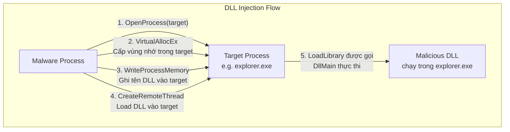

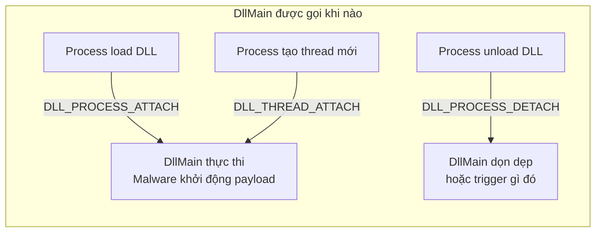

### Ví dụ thực tế & Analogy

**Ví dụ — DllMain cơ bản:**

```cpp
BOOL APIENTRY DllMain(
    HANDLE hModule,           // Handle đến DLL module
    DWORD  ul_reason_for_call,// Lý do được gọi
    LPVOID lpReserved         // Reserved
) {
    switch (ul_reason_for_call) {
        case DLL_PROCESS_ATTACH:
            // Malware thực thi payload ở đây
            // Khi bất kỳ process nào load DLL này
            CreateThread(NULL, 0, MaliciousThread, NULL, 0, NULL);
            break;
        case DLL_PROCESS_DETACH:
            break;
    }
    return TRUE;
}
```

**Ví dụ — Dùng Firefox DLL để né network monitoring:**

Malware load `nss3.dll` (thư viện SSL của Firefox) để tạo kết nối HTTPS — traffic trông hệt như Firefox, firewall và IDS không phân biệt được.

**Analogy — DLL vs Static Library:** Static library giống **photo copy tài liệu cho mỗi người** — tiện nhưng tốn giấy. DLL giống **1 cuốn sách đặt ở thư viện** — mọi người đến đọc chung, tiết kiệm tài nguyên.

**Analogy — DllMain:** Giống **bảo vệ tòa nhà** — không làm việc chính nhưng luôn theo dõi: ai vào (ATTACH) thì check in, ai ra (DETACH) thì check out, có sự kiện gì thì báo cáo.

### ⚠️ Điểm hay gặp sai / Cần lưu ý

!!! danger "DLL Hijacking — Nguy hiểm thực tế"
    Windows tìm DLL theo thứ tự: thư mục của EXE → System32 → PATH. Nếu malware đặt một DLL giả mạo **cùng tên** với DLL hợp lệ vào thư mục của ứng dụng → ứng dụng load DLL độc hại thay vì DLL thật. Kỹ thuật này gọi là **DLL Hijacking / DLL Search Order Hijacking**.

!!! warning "DllMain có giới hạn nghiêm ngặt"
    Trong `DLL_PROCESS_ATTACH`, **không được** gọi `LoadLibrary`, tạo thread phức tạp, hay nhiều API nhất định vì có thể gây deadlock với Loader Lock. Tuy nhiên malware vẫn hay vi phạm điều này — gây crash process là "bonus" cho kẻ tấn công.

### Câu hỏi thực tế

1. Bạn thấy malware gọi `OpenProcess`, `VirtualAllocEx`, `WriteProcessMemory`, `CreateRemoteThread` nhắm vào `explorer.exe`. Đây là kỹ thuật gì và mục đích là gì?
2. Tại sao malware dùng third-party DLL (như Firefox) để kết nối mạng thay vì dùng WinINet của Windows?
3. Bạn phân tích một DLL độc hại và thấy code thực thi ngay trong `DLL_PROCESS_ATTACH`. Điều này có ý nghĩa gì với việc phân tích?

---

> 💡 **Chốt nhanh:** DLL giống EXE nhưng chạy trong process khác. `DllMain` là entry point tự động — malware đặt payload ở `DLL_PROCESS_ATTACH`. DLL Injection = ép process hợp lệ load DLL độc hại → malware chạy "núp bóng" process đó.

---

---

## Processes & Memory Management

Hiểu process model của Windows là nền tảng để hiểu mọi kỹ thuật injection, hollowing, và evasion của malware hiện đại.

### Khái niệm & lý thuyết

**Process** là container chứa tài nguyên của một chương trình đang chạy:

- Vùng nhớ riêng (virtual address space)
- Handles (file, socket, registry key...)
- Một hoặc nhiều **thread**
- Security context (token, permissions)

**Virtual Address Space:**

| Đặc điểm | Chi tiết |
|---|---|
| Mỗi process có không gian địa chỉ **riêng** | Process A và B có thể dùng cùng địa chỉ 0x00400000 nhưng trỏ đến RAM vật lý khác nhau |
| Windows dùng paging | Ánh xạ virtual address → physical address qua Page Table |
| 32-bit process | 4GB virtual space (2GB user + 2GB kernel) |
| 64-bit process | 128TB virtual space |

**Tại sao malware cần hiểu process model:**

- Malware cũ: chạy như **process độc lập** → dễ phát hiện trong Task Manager
- Malware mới: **inject code vào process hợp lệ** → ẩn mình, né antivirus

**`CreateProcess` — Hàm tạo process:**

Tham số quan trọng nhất: **`STARTUPINFO`** — chứa handle cho stdin, stdout, stderr.

```c
STARTUPINFO si = {0};
si.hStdInput  = (HANDLE)socket;  // Redirect input từ socket
si.hStdOutput = (HANDLE)socket;  // Redirect output ra socket
si.hStdError  = (HANDLE)socket;  // Redirect error ra socket
si.dwFlags    = STARTF_USESTDHANDLES;

CreateProcess("cmd.exe", NULL, NULL, NULL,
              TRUE,  // bInheritHandles = TRUE!
              0, NULL, NULL, &si, &pi);
```

Kết quả: **Reverse shell** — mọi I/O của `cmd.exe` đi qua socket.

### Cách hoạt động / Luồng xử lý

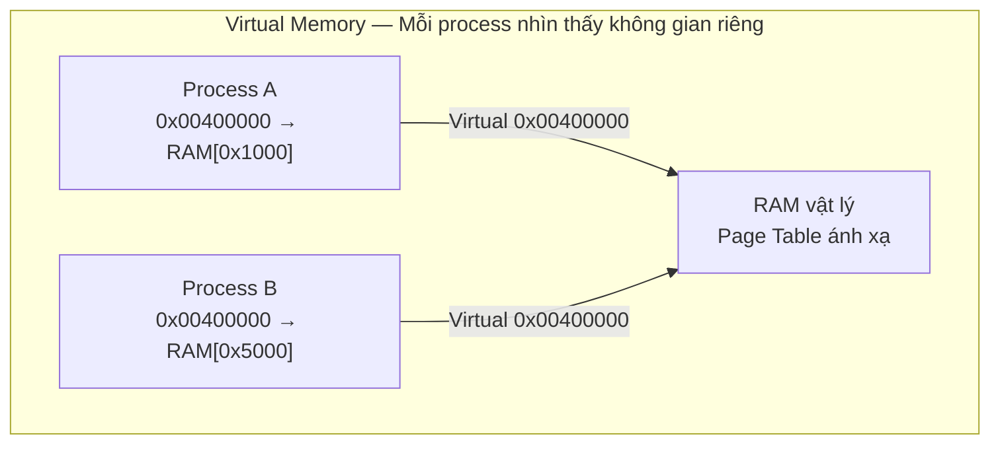

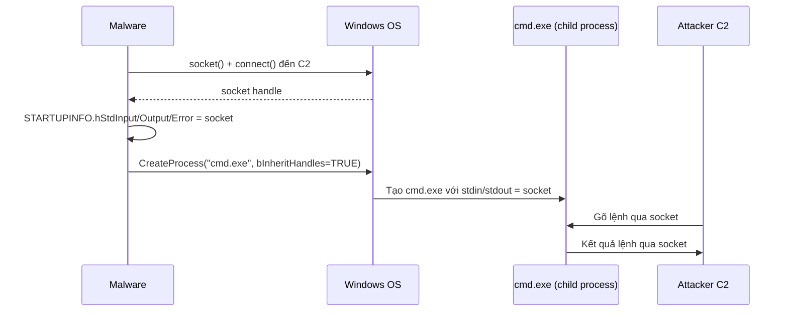

### Ví dụ thực tế & Analogy

**Ví dụ — Process Hollowing (kỹ thuật nâng cao):**

```
1. CreateProcess("svchost.exe", CREATE_SUSPENDED)  
   → Tạo svchost.exe ở trạng thái suspended (chưa chạy)

2. NtUnmapViewOfSection()
   → "Khoét rỗng" code của svchost.exe khỏi memory

3. VirtualAllocEx() + WriteProcessMemory()  
   → Nhồi malware code vào vùng nhớ vừa khoét

4. SetThreadContext() + ResumeThread()
   → Sửa EIP/RIP trỏ vào malware code, resume process
   
Kết quả: Task Manager hiển thị "svchost.exe" nhưng chạy malware code!
```

**Analogy — Virtual Address Space:** Giống **nhiều căn hộ trong chung cư**, mỗi căn có số phòng riêng (101, 102...). Cùng số phòng 101 nhưng ở tầng khác là hai phòng hoàn toàn khác nhau — không ai can thiệp vào phòng người khác được.

**Analogy — Process Hollowing:** Giống **mượn bộ đồng phục cảnh sát** — bên ngoài trông như cảnh sát thật (svchost.exe), nhưng bên trong là tên trộm (malware). Ai nhìn vào Task Manager cũng thấy "svchost.exe" — không nghi ngờ gì.

### ⚠️ Điểm hay gặp sai / Cần lưu ý

!!! danger "Process Injection vs Process Hollowing"
    Nhiều sinh viên nhầm hai kỹ thuật này. **Injection** = inject code vào process đang **chạy**. **Hollowing** = tạo process mới ở trạng thái **suspended**, khoét rỗng, nhồi code mới vào rồi resume. Hollowing khó phát hiện hơn vì process name hợp lệ.

!!! warning "bInheritHandles phải là TRUE"
    Khi tạo reverse shell bằng `CreateProcess`, tham số `bInheritHandles` **phải là TRUE** để child process (`cmd.exe`) kế thừa socket handle từ parent. Nếu FALSE, stdin/stdout redirect sẽ không hoạt động.

### Câu hỏi thực tế

1. Tại sao malware hiện đại không chạy như process độc lập mà prefer inject vào `explorer.exe` hoặc `svchost.exe`?
2. Bạn thấy một process `notepad.exe` đang kết nối ra ngoài internet. Kỹ thuật nào có thể giải thích hiện tượng này?

---

> 💡 **Chốt nhanh:** Process là container tài nguyên với virtual memory riêng. `CreateProcess` + `STARTUPINFO` socket redirect = reverse shell. Process Hollowing = "mặc đồng phục giả" — chạy malware code nhưng hiển thị tên process hợp lệ.

---

---

## Threads

Thread là đơn vị thực thi thực sự — hiểu thread giúp bạn theo dõi luồng thực thi của malware khi nó chia nhỏ công việc.

### Khái niệm & lý thuyết

**Thread** là chuỗi lệnh độc lập được CPU thực thi. Trong một process:

| Đặc điểm | Chi tiết |
|---|---|
| **Chia sẻ** | Virtual memory, handles, global variables |
| **Riêng biệt** | Registers, stack, thread ID |
| Thực thi | Song song (concurrent) trên multi-core hoặc time-sliced trên single-core |

**Thread Context:** Khi OS switch từ thread này sang thread khác (context switch), toàn bộ trạng thái CPU (registers: EAX, EBX, ESP, EIP...) được lưu vào **CONTEXT structure** của thread đó.

**`CreateThread`:**

```c
HANDLE CreateThread(
    LPSECURITY_ATTRIBUTES   lpThreadAttributes,  // NULL = default
    SIZE_T                  dwStackSize,         // 0 = default
    LPTHREAD_START_ROUTINE  lpStartAddress,      // Hàm thread bắt đầu chạy
    LPVOID                  lpParameter,         // Tham số truyền vào hàm
    DWORD                   dwCreationFlags,     // 0 = start immediately
    LPDWORD                 lpThreadId           // Output: thread ID
);
```

**Malware dùng thread như thế nào:**

- `CreateThread` để load malicious DLL vào process khác (kết hợp với `LoadLibrary`)
- Tạo **2 thread** cho input và output — giao tiếp với C2 không chặn nhau
- Thread riêng cho keylogging, screenshot, exfiltration... chạy song song

### Cách hoạt động / Luồng xử lý

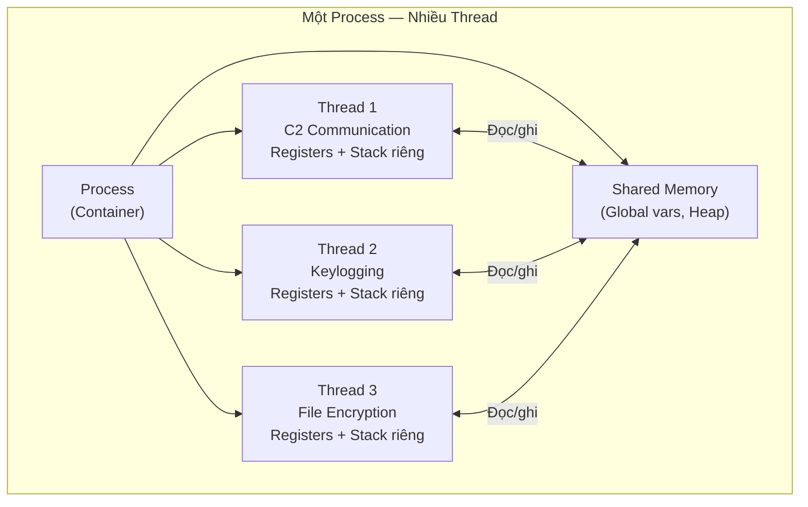

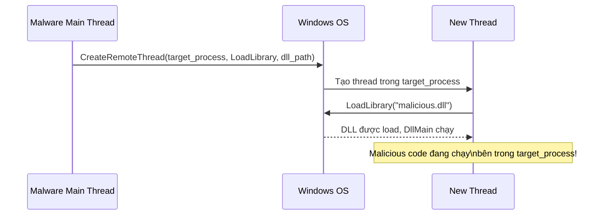

### Ví dụ thực tế & Analogy

**Ví dụ — CreateRemoteThread để inject DLL:**

```c
// Malware inject DLL vào notepad.exe
HANDLE hProcess = OpenProcess(PROCESS_ALL_ACCESS, FALSE, notepad_pid);

// Cấp vùng nhớ trong notepad để chứa tên DLL
LPVOID pDllPath = VirtualAllocEx(hProcess, NULL, strlen(dll_path)+1,
                                  MEM_COMMIT, PAGE_READWRITE);
// Ghi tên DLL vào vùng nhớ đó
WriteProcessMemory(hProcess, pDllPath, dll_path, strlen(dll_path)+1, NULL);

// Tạo thread trong notepad, chạy LoadLibrary với tên DLL
HANDLE hThread = CreateRemoteThread(hProcess, NULL, 0,
    (LPTHREAD_START_ROUTINE)GetProcAddress(GetModuleHandle("kernel32.dll"),
    "LoadLibraryA"), pDllPath, 0, NULL);
```

**Analogy — Thread:** Giống **nhân viên trong một văn phòng** — cùng dùng chung bàn trà, tủ tài liệu (shared memory), nhưng mỗi người có bàn làm việc riêng (stack) và đang làm việc riêng của mình (registers). Nếu hai người cùng sửa một file chung mà không phối hợp → xung đột (race condition).

**Analogy — Context Switch:** Giống **diễn viên đóng nhiều vai** — khi cần đóng vai khác, diễn viên thay trang phục (lưu context cũ, load context mới). Khán giả thấy "nhiều nhân vật" nhưng thực ra chỉ có một diễn viên chuyển đổi rất nhanh.

### ⚠️ Điểm hay gặp sai / Cần lưu ý

!!! warning "CreateRemoteThread là dấu hiệu đỏ"
    Chương trình hợp lệ **hiếm khi** cần tạo thread trong process khác. Nếu thấy `CreateRemoteThread` trong import table → **rất có khả năng đây là malware đang inject code**. Luôn tìm xem process nào là target.

!!! danger "Race Condition trong Malware"
    Malware dùng nhiều thread chia sẻ dữ liệu mà không synchronize đúng → race condition → behavior không nhất quán → khó reproduce khi phân tích. Đây là kỹ thuật vô tình hoặc cố ý để cản trở analyst.

### Câu hỏi thực tế

1. Malware dùng `CreateRemoteThread` với địa chỉ của `LoadLibraryA` làm start function. Tại sao đây là kỹ thuật hiệu quả để inject DLL?
2. Tại sao malware thường tạo 2 thread riêng cho input và output khi communicate với C2 thay vì dùng 1 thread?

---

> 💡 **Chốt nhanh:** Thread = đơn vị thực thi thực sự, chia sẻ memory nhưng có stack/registers riêng. `CreateRemoteThread` = kỹ thuật inject code vào process khác. Context = "ảnh chụp" trạng thái CPU của thread tại một thời điểm.

---

---

## Mutexes

Mutex là cơ chế đồng bộ hóa — nhưng malware dùng nó như **"thẻ căn cước"** để tránh chạy nhiều bản cùng lúc.

### Khái niệm & lý thuyết

**Mutex (Mutual Exclusion Object)** là global object dùng để phối hợp giữa nhiều process/thread — đảm bảo chỉ **một** thread/process truy cập tài nguyên tại một thời điểm.

!!! note "Thuật ngữ kernel"
    Trong kernel, mutex được gọi là **mutant** (tên gốc từ thời NT kernel). Khi dùng WinObj của Sysinternals, bạn sẽ thấy chúng liệt kê dưới "Mutant".

**Mutex API:**

| Hàm | Vai trò |
|---|---|
| `CreateMutex` | Tạo hoặc mở một mutex với tên cụ thể |
| `OpenMutex` | Mở mutex đã tồn tại (kiểm tra xem có chưa) |
| `WaitForSingleObject` | Chờ và giành quyền sở hữu mutex |
| `ReleaseMutex` | Giải phóng mutex (cho thread khác dùng) |

**Tại sao mutex quan trọng với malware analyst:**

- Malware thường dùng mutex **hard-coded name** (ví dụ: `"HGL345"`, `"Global\{GUID}"`) để kiểm tra xem instance khác đã chạy chưa
- Mutex name là **IOC (Indicator of Compromise)** cực kỳ giá trị — stable hơn hash, ổn định hơn domain name
- Kỹ thuật "vaccine": tạo mutex giả với tên malware biết → malware nghĩ đã có instance → không chạy

### Cách hoạt động / Luồng xử lý

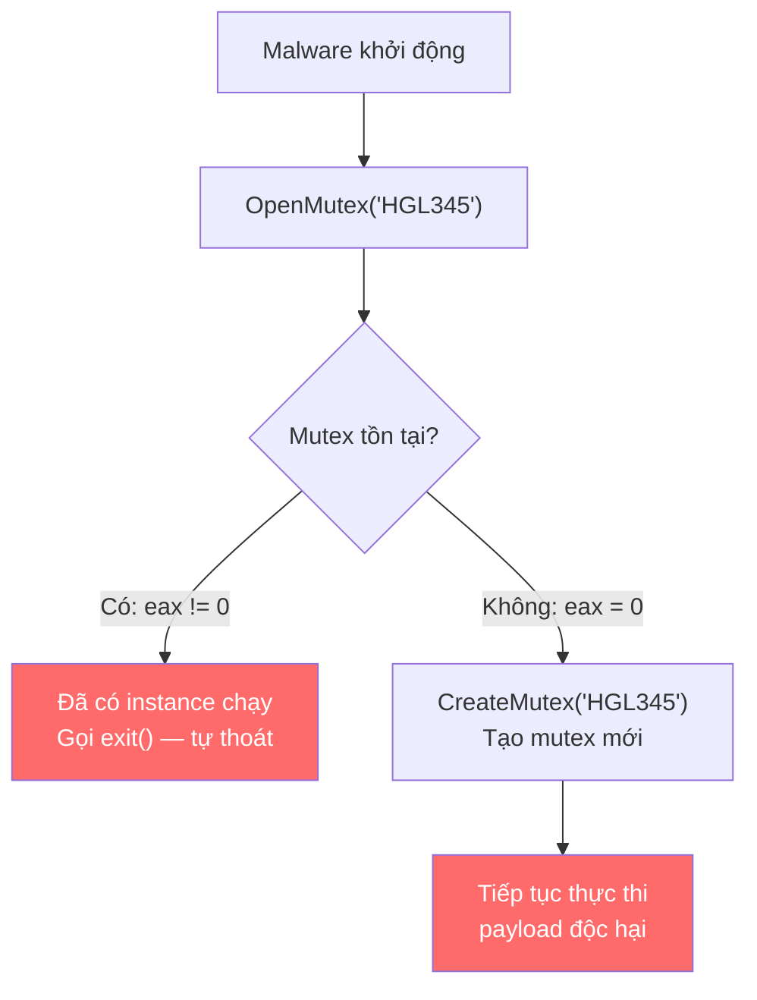

**Giải thích đoạn assembly từ slide:**

```nasm
; Kiểm tra mutex "HGL345" có tồn tại chưa
push  1F0001h              ; dwDesiredAccess
call  ds:__imp__OpenMutexW@12
test  eax, eax             ; eax = 0 nếu mutex KHÔNG tồn tại
jz    short loc_40101E     ; Jump nếu zero (mutex chưa có) → tạo mới

; Nếu mutex đã tồn tại → có instance đang chạy
push  0                    ; exit code
call  ds:__imp__exit       ; Tự thoát!

; Tạo mutex mới nếu chưa có
loc_40101E:
push  offset Name          ; "HGL345"
push  0                    ; bInitialOwner
push  0                    ; lpMutexAttributes
call  ds:__imp__CreateMutexW@12
```

### Ví dụ thực tế & Analogy

**Ví dụ — Vaccine kỹ thuật dùng mutex:**

Nếu biết malware kiểm tra mutex `"Global\MicrosoftUpdate_v2"`:

```python
# Vaccine script: tạo mutex giả
import ctypes
ctypes.windll.kernel32.CreateMutexW(None, False, "Global\MicrosoftUpdate_v2")
# Giữ process chạy để mutex tồn tại
input("Vaccine active. Press Enter to stop...")
```

Malware chạy → thấy mutex đã tồn tại → tự thoát. Không cần antivirus!

**Ví dụ thực tế:** Ransomware WannaCry (2017) kiểm tra mutex `"Global\MsWinZonesCacheCounterMutexA"` — khi researcher phát hiện, họ có thể tạo mutex này để block WannaCry mà không cần patch.

**Analogy:** Mutex giống **biển "Đã có người"** trên cửa nhà vệ sinh. Malware instance đầu tiên treo biển đó lên (CreateMutex). Instance thứ hai vào thấy biển → quay về (exit). Không cần giao tiếp phức tạp — chỉ cần kiểm tra biển.

**Analogy — Vaccine:** Nếu bạn biết malware kiểm tra biển "HGL345" trước khi vào — bạn chỉ cần **tự treo biển đó lên trước** → malware đến thấy "đã có người" → bỏ đi.

### ⚠️ Điểm hay gặp sai / Cần lưu ý

!!! warning "Mutex name có thể được generate động"
    Malware tinh vi không dùng hard-coded string mà **generate tên mutex từ thông tin máy** (username, hostname, MAC address...) → tên mutex khác nhau trên mỗi máy → IOC dựa trên tên cụ thể không hoạt động. Phải tìm **thuật toán** generate.

!!! tip "Tìm mutex bằng công cụ"
    Dùng **Process Explorer** (Sysinternals) → tab Handles → filter "Mutant" để xem tất cả mutex của một process. Dùng **WinObj** để xem tất cả mutex toàn hệ thống.

### Câu hỏi thực tế

1. Bạn phân tích malware và tìm thấy mutex name `"Global\{a3d5-b2c1-...}"`. Làm thế nào để biết đây là hard-coded hay được generate động?
2. Kỹ thuật "vaccine" dựa trên mutex có hạn chế gì? Khi nào nó không hiệu quả?
3. Tại sao mutex name là IOC tốt hơn file hash?

---

> 💡 **Chốt nhanh:** Mutex = "thẻ đánh dấu đã chạy" của malware. Hard-coded mutex name = IOC quý giá. Kỹ thuật vaccine = tạo mutex giả để chặn malware không cần antivirus. `OpenMutex` + `test eax, eax` + `jz` = pattern kiểm tra singleton cổ điển.

---

---

## Services

Services là cơ chế cho phép chương trình chạy nền không cần user đăng nhập — và là **kỹ thuật persistence phổ biến thứ hai** của malware sau Run Key.

### Khái niệm & lý thuyết

**Windows Service** là chương trình chạy nền, được quản lý bởi **Service Control Manager (SCM)**, không cần user interaction.

**Tại sao malware thích Services:**

- Chạy với quyền **SYSTEM** — cao hơn Administrator
- **Tự động khởi động** khi Windows boot — trước cả khi user đăng nhập
- Khó bị phát hiện hơn process thông thường

**Các loại Service phổ biến:**

| Loại | Constant | Mô tả |
|---|---|---|
| **WIN32_SHARE_PROCESS** | 0x20 | Phổ biến nhất với malware — code trong DLL, chạy chung trong `svchost.exe` |
| **WIN32_OWN_PROCESS** | 0x10 | Chạy như EXE độc lập trong process riêng |
| **KERNEL_DRIVER** | 0x01 | Load code vào Kernel — dùng bởi rootkit |

**Start Type:**

| Giá trị | Ý nghĩa |
|---|---|
| 0x00 | Boot (load ngay khi kernel boot) |
| 0x01 | System |
| 0x02 | Automatic (tự động khi Windows start) |
| 0x03 | Manual (chỉ khi được gọi thủ công) |
| 0x04 | Disabled |

**Service API:**

| Hàm | Vai trò |
|---|---|
| `OpenSCManager` | Mở kết nối đến Service Control Manager → nhận handle |
| `CreateService` | Đăng ký service mới vào SCM |
| `StartService` | Khởi động service thủ công (nếu start type = Manual) |

**Service lưu trong Registry:**

```
HKLM\SYSTEM\CurrentControlSet\Services\[ServiceName]
    ImagePath = "C:\Windows\System32\svchost.exe -k netsvcs"
    Type      = 0x20 (WIN32_SHARE_PROCESS)
    Start     = 0x02 (Automatic)
    ObjectName = "LocalSystem"  ← Chạy với quyền SYSTEM!
```

### Cách hoạt động / Luồng xử lý

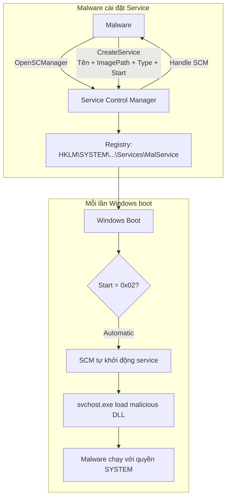

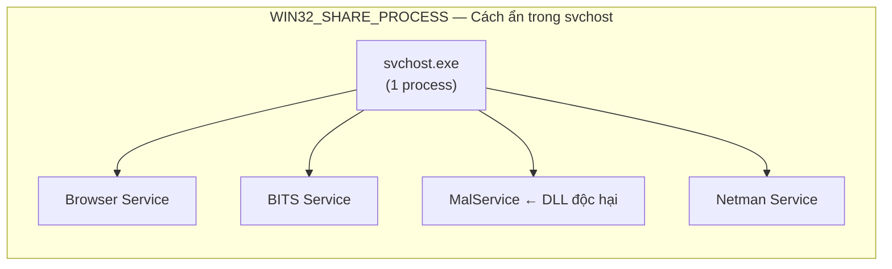

### Ví dụ thực tế & Analogy

**Ví dụ — Phát hiện service độc hại bằng `sc` command:**

```cmd
sc qc MaliciousService
[SC] QueryServiceConfig SUCCESS

SERVICE_NAME: MaliciousService
    TYPE               : 20  WIN32_SHARE_PROCESS
    START_TYPE         : 2   AUTO_START          ← Tự động khởi động!
    BINARY_PATH_NAME   : C:\Windows\System32\svchost.exe -k netsvcs
    SERVICE_START_NAME : LocalSystem             ← Quyền SYSTEM!
```

**Ví dụ — Registry check:**

```
HKLM\SYSTEM\CurrentControlSet\Services\MalService
    ImagePath = "%SystemRoot%\system32\svchost.exe -k netsvcs"
    Type      = REG_DWORD 0x00000020  ← WIN32_SHARE_PROCESS
    Start     = REG_DWORD 0x00000002  ← AUTO_START
    Parameters\ServiceDll = "C:\Windows\Temp\evil.dll"  ← DLL thực sự!
```

**Analogy:** Service giống **nhân viên trực đêm** — không cần ai giám sát (no user login), tự động làm việc từ khi "cửa hàng mở" (boot), và có chìa khóa chính (SYSTEM rights). Malware đăng ký làm "nhân viên trực đêm" → mãi mãi có mặt trong hệ thống.

**Analogy — WIN32_SHARE_PROCESS trong svchost:** Giống **văn phòng chia sẻ (coworking space)** — nhiều công ty (service) thuê chung 1 mặt bằng (svchost.exe). Nhìn từ ngoài chỉ thấy 1 tòa nhà, nhưng bên trong có nhiều tenant — malware chỉ là một tenant ẩn mình trong đám đông.

### ⚠️ Điểm hay gặp sai / Cần lưu ý

!!! danger "SYSTEM > Administrator"
    Nhiều sinh viên nghĩ Administrator là cao nhất. Sai! **SYSTEM account** có nhiều quyền hơn Administrator — có thể access memory của processes khác, bypass nhiều security check. Malware chạy với SYSTEM = game over cho hệ thống.

!!! warning "ServiceDll là nơi ẩn thực sự"
    Với WIN32_SHARE_PROCESS, `ImagePath` chỉ trỏ đến `svchost.exe` — trông hoàn toàn bình thường! DLL độc hại thực sự được khai báo ở `Parameters\ServiceDll`. Luôn kiểm tra subkey `Parameters` khi phân tích service.

!!! tip "Công cụ kiểm tra"
    **Autoruns** (Sysinternals) → tab "Services" hiển thị tất cả service có chữ ký số không hợp lệ hoặc không có chữ ký. **sc qc [name]** để xem chi tiết từng service.

### Câu hỏi thực tế

1. Tại sao malware prefer dùng `WIN32_SHARE_PROCESS` (chạy trong svchost) thay vì `WIN32_OWN_PROCESS` (EXE độc lập)?
2. Bạn thấy service với `ImagePath = svchost.exe -k netsvcs` — điều này có chứng minh service đó hợp lệ không? Bạn cần kiểm tra thêm gì?
3. Trong incident response, làm thế nào để phân biệt service hợp lệ với service do malware tạo ra?

---

> 💡 **Chốt nhanh:** Service = persistence mạnh nhất — tự khởi động, chạy với SYSTEM, không cần user. WIN32_SHARE_PROCESS ẩn trong svchost → khó phát hiện. Luôn kiểm tra `Parameters\ServiceDll` vì đó là nơi malware giấu DLL thực sự.

---

---

## COM & Exceptions

### COM — Component Object Model

**COM** là framework cho phép các software component **khác ngôn ngữ, khác process** giao tiếp với nhau qua interface chuẩn.

#### Khái niệm & lý thuyết

**Các khái niệm cốt lõi:**

| Khái niệm | Ý nghĩa |
|---|---|
| **GUID** | Globally Unique Identifier — 128-bit, dùng để định danh COM object |
| **CLSID** | Class Identifier — định danh class COM cụ thể, lưu tại `HKEY_CLASSES_ROOT\CLSID` |
| **IID** | Interface Identifier — định danh interface, lưu tại `HKEY_CLASSES_ROOT\Interface` |
| `OleInitialize` / `CoInitializeEx` | **Bắt buộc gọi đầu tiên** trước khi dùng bất kỳ COM function nào |

**Tại sao malware dùng COM:**

- **COM Hijacking:** Malware đăng ký CLSID giả trong `HKCU\Software\Classes\CLSID` — khi ứng dụng hợp lệ gọi COM object đó → load malware code
- **Automation:** Dùng COM để điều khiển IE, Word, Excel... thực hiện hành động mà không cần process mới
- **Persistence:** COM server đăng ký trong registry → tồn tại qua reboot

#### Cách hoạt động

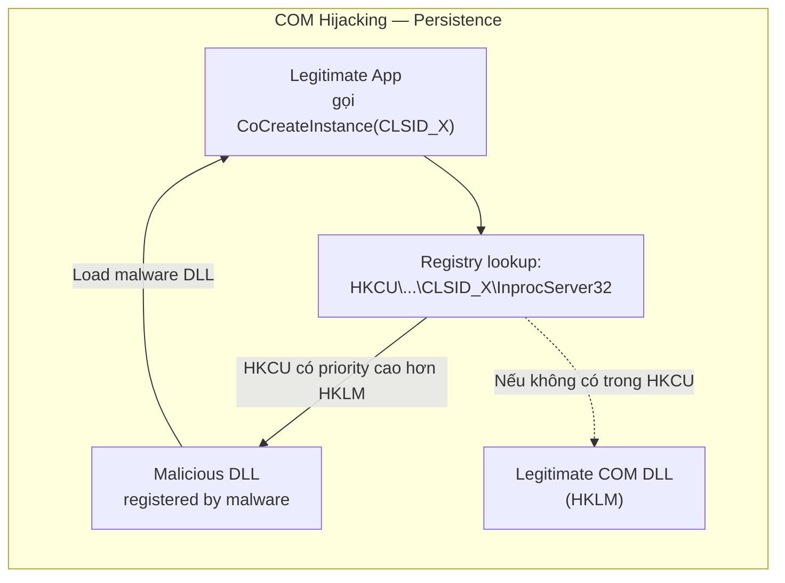

**Analogy:** COM giống **ổ cắm điện chuẩn** — bất kỳ thiết bị nào có phích cắm đúng chuẩn (interface) đều cắm vào được, bất kể hãng sản xuất. COM Hijacking giống **thay ổ cắm giả** — bề ngoài trông như ổ thật, nhưng khi cắm vào thì "điện" đi đến chỗ khác.

#### ⚠️ Điểm cần lưu ý

!!! warning "COM Hijacking không cần Admin"
    Malware có thể đăng ký COM object trong `HKCU` (không cần Admin) → override CLSID trong `HKLM`. Khi ứng dụng hợp lệ gọi COM → load malware. Đây là kỹ thuật **UAC bypass** phổ biến.

---

### Exceptions

**Exception** xảy ra khi có lỗi runtime: chia cho 0, truy cập địa chỉ memory không hợp lệ, v.v.

#### Khái niệm & lý thuyết

Khi exception xảy ra, Windows chuyển execution đến **Structured Exception Handler (SEH)**.

**Malware dùng exception để:**

- **Anti-debugging:** Đặt code thực sự trong exception handler — debugger xử lý exception khác với runtime → behavior khác nhau
- **Obfuscation:** Dùng `NtContinue` (Native API) để "return từ exception" nhưng thực ra nhảy đến địa chỉ tùy ý
- **Anti-disassembly:** Tạo fake exception để confuse disassembler

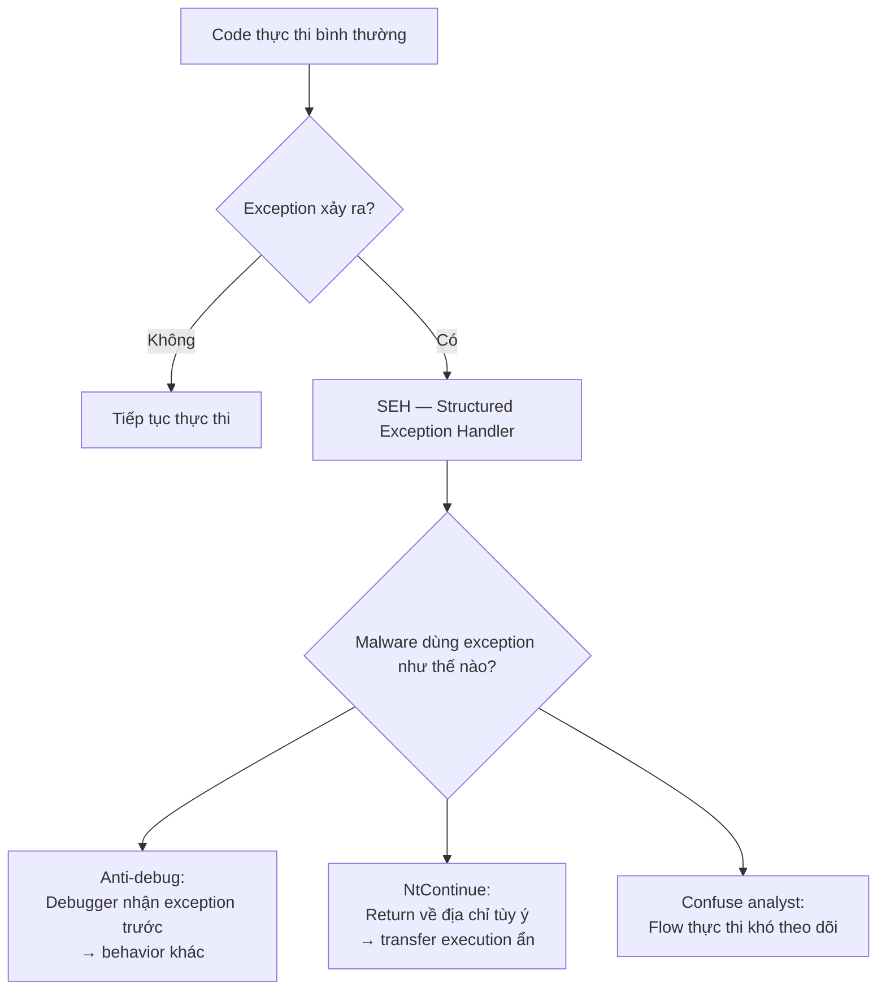

**Analogy:** Exception handler giống **bẫy lò xo** — khi đi vào khu vực bình thường (code), lỡ chạm phải bẫy (exception) → văng ra chỗ khác (handler). Malware **cố tình đặt bẫy** để đưa execution đến nơi analyst không ngờ tới.

---

> 💡 **Chốt nhanh:** COM = framework giao tiếp component — malware hijack bằng cách override CLSID trong HKCU. Exception = transfer execution ẩn — malware cố tình trigger exception để nhảy đến code độc hại mà analyst không theo dõi được.

---

---

## Kernel vs User Mode

Đây là nền tảng kiến trúc bảo mật của Windows — hiểu sự phân chia này giúp bạn hiểu tại sao malware ở kernel nguy hiểm hơn hẳn malware ở user mode.

### Khái niệm & lý thuyết

Windows dùng **CPU privilege rings** — nhưng chỉ dùng 2 trong 4 ring:

```
Ring 3 (User Mode)    ← Ứng dụng, malware thông thường
Ring 2 & 1            ← Không dùng trong Windows
Ring 0 (Kernel Mode)  ← OS kernel, drivers, rootkits
```

**So sánh User Mode vs Kernel Mode:**

| Đặc điểm | User Mode (Ring 3) | Kernel Mode (Ring 0) |
|---|---|---|
| **Memory** | Riêng biệt cho từng process | Chia sẻ toàn bộ |
| **Hardware access** | Không trực tiếp — phải qua API | Trực tiếp |
| **CPU instructions** | Subset giới hạn | Toàn bộ |
| **Crash ảnh hưởng** | Chỉ process đó crash | **BSOD — toàn hệ thống** |
| **Security checks** | Đầy đủ | Ít hơn nhiều |
| **Auditing** | Có | **Không** |
| **Chạy bởi** | Applications | OS, drivers, rootkits |

**Malware ở User Mode vs Kernel Mode:**

| | User Mode Malware | Kernel Mode Malware |
|---|---|---|
| Phổ biến | Rất phổ biến | Ít hơn |
| Khó viết | Trung bình | Rất khó |
| Quyền hạn | Giới hạn | Tuyệt đối |
| Phát hiện | Tương đối dễ | Rất khó |
| Ví dụ | RAT, Ransomware, Spyware | Rootkit |

### Cách hoạt động / Luồng xử lý

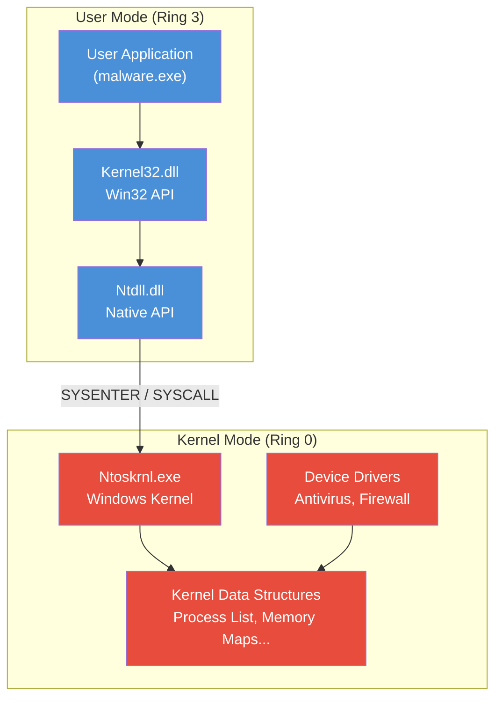

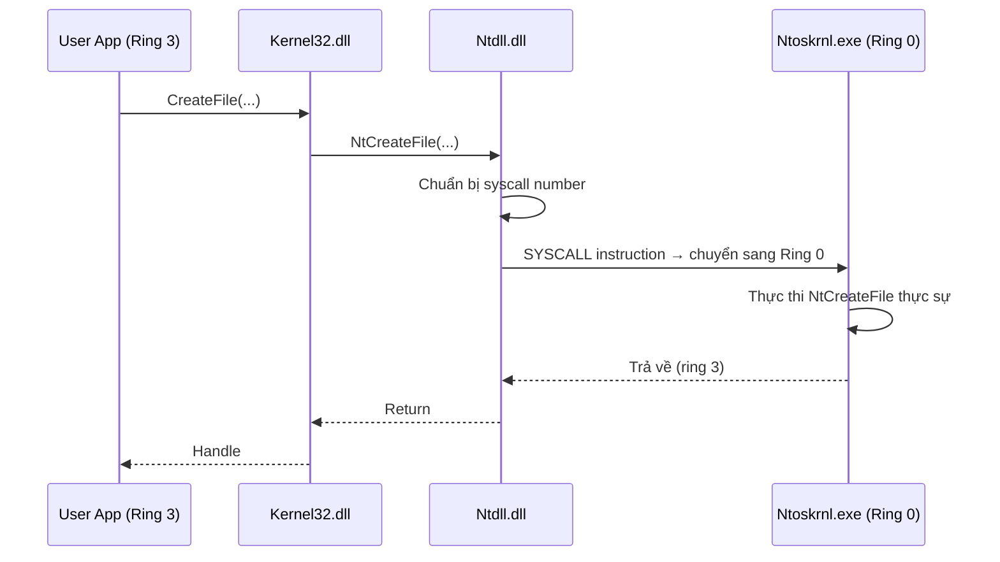

### Ví dụ thực tế & Analogy

**Ví dụ — Rootkit ở Kernel Mode:**

Rootkit có thể hook **SSDT (System Service Descriptor Table)** — bảng tra cứu syscall của kernel:

```
Bình thường:   App → NtQuerySystemInformation → [SSDT] → Code thật → Process list đầy đủ
Sau khi hook:  App → NtQuerySystemInformation → [SSDT bị sửa] → Rootkit code
               → Rootkit lọc bỏ process của mình → Process list giả → Trả về App
```

Kết quả: Process Explorer, Task Manager... đều không thấy malware vì **kernel trả về data giả**.

**Ví dụ — Tại sao antivirus chạy ở kernel:**

Antivirus cần kernel mode để intercept file access, network calls ở mức thấp nhất — trước khi user mode code có cơ hội "né". Driver `avcenter.sys` hook vào kernel → scan mọi file trước khi mở.

**Analogy — User vs Kernel Mode:** User mode giống **khách thuê nhà** — có phòng riêng, bị hàng xóm (process khác) không ảnh hưởng, nếu làm cháy phòng (crash) thì chỉ phòng đó thiệt hại. Kernel mode giống **ban quản lý tòa nhà** — có chìa khóa mọi phòng, biết mọi thứ, nếu làm sập server điện (BSOD) thì toàn tòa tắt điện.

**Analogy — SSDT Hook của rootkit:** Giống **đổi biển hiệu** — thay vì "Phòng 101 → Tầng 1" (địa chỉ thật), rootkit thay bằng "Phòng 101 → Tầng ảo do rootkit kiểm soát". Mọi người hỏi thì đều được hướng dẫn sai mà không biết.

### ⚠️ Điểm hay gặp sai / Cần lưu ý

!!! danger "Kernel malware = BSOD risk"
    Lỗi nhỏ trong kernel code → BSOD ngay lập tức. Đây vừa là điểm yếu (malware dễ gây crash) vừa là vũ khí (malware có thể dùng làm DoS). Khi phân tích kernel malware, **luôn dùng VM** và snapshot thường xuyên.

!!! warning "Driver Signing — Hàng rào quan trọng"
    Từ Windows Vista 64-bit trở đi, Microsoft yêu cầu **kernel driver phải được ký số** (code signing). Rootkit hiện đại phải dùng: stolen certificate, exploit UEFI, hay boot-level attack để bypass. Đây là lý do kernel malware ngày càng hiếm và tinh vi hơn.

!!! info "Không phải mọi rootkit đều dùng kernel"
    **User-mode rootkit** cũng tồn tại — hook API trong ntdll.dll để ẩn mình. Ít quyền lực hơn kernel rootkit nhưng dễ viết hơn và không cần bypass driver signing.

### Câu hỏi thực tế

1. Tại sao một crash trong kernel mode gây BSOD nhưng crash trong user mode thì không?
2. Nếu malware hook SSDT trong kernel để ẩn process của mình, `Process Explorer` có phát hiện được không? Tại sao?
3. Antivirus chạy ở kernel mode mang lại lợi gì so với chạy ở user mode?

---

> 💡 **Chốt nhanh:** User mode = sandbox có giới hạn, crash chỉ chết process đó. Kernel mode = toàn quyền, crash = BSOD toàn hệ thống. Rootkit ở kernel có thể hook SSDT để trả data giả cho mọi query — kể cả từ antivirus user mode.

---

---

## Native API

Native API là tầng API "thô" nhất mà user-mode code có thể chạm vào — và là lý do tại sao malware tinh vi thường **bỏ qua WinAPI hoàn toàn**.

### Khái niệm & lý thuyết

**Native API** là tập hàm trong `ntdll.dll` — lớp mỏng nhất giữa user space và kernel, implement giao thức syscall thực sự.

**Tầng API của Windows:**

```
User Application
      ↓
kernel32.dll / user32.dll  (Win32 API — documented, high-level)
      ↓
ntdll.dll                  (Native API — mostly undocumented)
      ↓
[SYSCALL instruction]       ← ranh giới user/kernel
      ↓
ntoskrnl.exe               (Windows Kernel)
      ↓
Kernel Data Structures
```

**Tại sao malware dùng Native API:**

| Lý do | Chi tiết |
|---|---|
| **Bypass security hooks** | AV/EDR thường hook ở `kernel32.dll` — gọi thẳng `ntdll` để bỏ qua |
| **Thêm thông tin** | Native API trả về nhiều data hơn Win32 API tương đương |
| **Anti-analysis** | Ít analyst quen với Native API → khó reverse |
| **Stealthier** | Ít được monitor hơn Win32 calls |

**Native API calls phổ biến trong malware:**

| Hàm Native API | Win32 tương đương | Lý do dùng |
|---|---|---|
| `NtQuerySystemInformation` | Không có tương đương đầy đủ | Lấy process list, system info chi tiết |
| `NtQueryInformationProcess` | `GetProcessInformation` (giới hạn) | Detect debugger, lấy process details |
| `NtQueryInformationThread` | Giới hạn | Thread details, anti-debug |
| `NtQueryInformationFile` | Giới hạn | File metadata đầy đủ |
| `NtQueryInformationKey` | Giới hạn | Registry details |
| `NtContinue` | Không có | Return từ exception → transfer execution |

**Quy ước đặt tên:**
- Prefix `Nt` hoặc `Zw` → Native API (ntdll.dll hoặc kernel)
- Prefix `Rtl` → Runtime Library (utility functions trong ntdll)
- Prefix `Ldr` → Loader functions (PE loading, DLL management)

### Cách hoạt động / Luồng xử lý

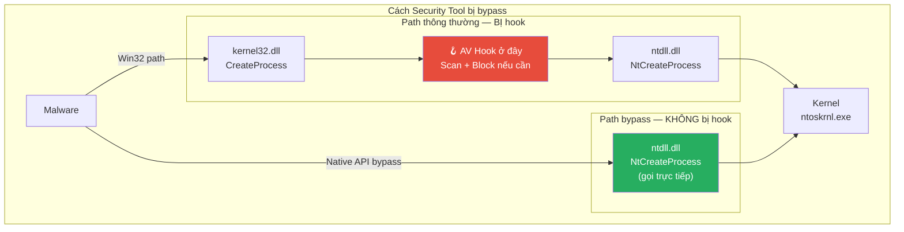

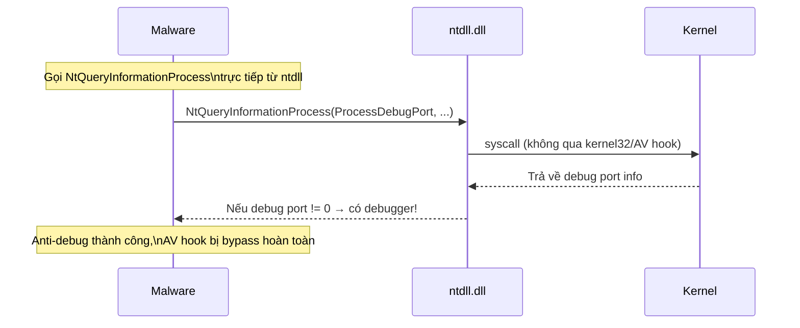

### Ví dụ thực tế & Analogy

**Ví dụ — Anti-debug bằng `NtQueryInformationProcess`:**

```c
// Dùng Native API để detect debugger
// Win32 tương đương (IsDebuggerPresent) dễ bị hook/patch bởi debugger
typedef NTSTATUS (NTAPI *pNtQueryInformationProcess)(
    HANDLE, PROCESSINFOCLASS, PVOID, ULONG, PULONG);

pNtQueryInformationProcess NtQIP = 
    (pNtQueryInformationProcess)GetProcAddress(
        GetModuleHandle("ntdll.dll"), "NtQueryInformationProcess");

DWORD_PTR debugPort = 0;
NtQIP(GetCurrentProcess(), ProcessDebugPort, &debugPort, sizeof(debugPort), NULL);

if (debugPort != 0) {
    // Đang bị debug → tự hủy hoặc chạy fake behavior
    ExitProcess(0);
}
```

**Ví dụ — `NtContinue` để obfuscate execution flow:**

```c
// Trigger exception cố ý
// Exception handler dùng NtContinue để "return" về địa chỉ tùy ý
// Analyst nhìn code thấy exception handler → không đoán được
// code sẽ nhảy đến đâu tiếp theo
```

**Analogy — Native API bypass:** Win32 API giống **đường chính có trạm kiểm soát** (AV hook). Native API giống **đường tắt qua làng** — ít người biết, không có trạm kiểm soát, nhưng cũng đến đích (kernel) được. Malware tinh vi luôn đi đường tắt.

**Analogy — Undocumented API:** Giống **menu bí mật trong nhà hàng** — không in trong menu chính, nhưng nếu bạn biết tên món và cách gọi đúng, chef vẫn làm cho bạn. Malware "biết menu bí mật" của Windows mà user thường không biết.

### ⚠️ Điểm hay gặp sai / Cần lưu ý

!!! danger "Gọi Native API trực tiếp = Dấu hiệu đỏ lớn"
    Ứng dụng hợp lệ **rất hiếm** gọi trực tiếp `ntdll` functions mà bỏ qua Win32 API. Nếu thấy malware import từ `ntdll.dll` những hàm như `NtWriteVirtualMemory`, `NtCreateThreadEx`... → **đây là dấu hiệu rõ ràng của kỹ thuật evasion**.

!!! warning "Prefix Zw vs Nt"
    `ZwCreateFile` và `NtCreateFile` gần như giống nhau ở user mode, nhưng khác ở kernel mode. Trong user mode, cả hai đều gọi syscall tương tự. Khi phân tích, đừng bị nhầm lẫn bởi prefix — hành vi tương đương nhau.

!!! tip "Tìm hiểu Native API"
    Nguồn tài liệu về Native API (vì Microsoft không document chính thức):
    - `http://undocumented.ntinternals.net/`
    - Sách "Windows Internals" của Mark Russinovich
    - Phân tích trực tiếp `ntdll.dll` bằng IDA/Ghidra

### Câu hỏi thực tế

1. Tại sao malware gọi `NtQueryInformationProcess` trực tiếp thay vì dùng `IsDebuggerPresent` từ kernel32?
2. Nếu EDR (Endpoint Detection & Response) hook toàn bộ ntdll.dll, malware có thể làm gì để vẫn bypass?
3. Một sample import chỉ từ `ntdll.dll` và không import từ `kernel32.dll`. Điều này có ý nghĩa gì?

---

> 💡 **Chốt nhanh:** Native API = tầng dưới Win32 API, trong ntdll.dll. Gọi Native API trực tiếp = bypass AV hook đặt ở Win32 layer. `NtQueryInformationProcess` = anti-debug phổ biến nhất. Prefix `Nt/Zw` = Native API, `Rtl` = Runtime library.

---

---

## Direct & Indirect Syscalls + API Hashing

Đây là hai kỹ thuật evasion **tiên tiến nhất** mà malware hiện đại dùng để hoàn toàn bypass mọi hook của security tools.

### Syscalls — Direct & Indirect

#### Khái niệm & lý thuyết

**Syscall** là cơ chế chuyển đổi từ User Mode (Ring 3) sang Kernel Mode (Ring 0). Mỗi kernel function có một **SSN (System Service Number)** — số index trong SSDT.

**Cách syscall hoạt động bình thường (qua ntdll):**

```nasm
; Đây là nội dung của NtCreateFile trong ntdll.dll
mov r10, rcx          ; Lưu tham số đầu tiên
mov eax, 55h          ; SSN của NtCreateFile = 0x55
syscall               ; Chuyển sang kernel mode
ret
```

**Vấn đề với EDR:** Security tools (CrowdStrike, SentinelOne...) **patch byte đầu** của các hàm ntdll để redirect sang engine của họ:

```nasm
; Sau khi EDR hook:
NtCreateFile:
    jmp  EDR_hook_NtCreateFile  ; ← EDR thêm jump này!
    ; Code gốc bên dưới không bao giờ chạy
```

**Giải pháp của malware: Direct Syscalls**

Malware tự implement syscall stub — không gọi qua ntdll:

```nasm
; Malware tự viết syscall stub
MalNtCreateFile:
    mov r10, rcx
    mov eax, 55h      ; SSN hard-coded
    syscall           ; Nhảy thẳng vào kernel
    ret               ; Không đi qua ntdll → không bị hook
```

**Vấn đề của Direct Syscall:** SSN thay đổi giữa các phiên bản Windows → hard-code SSN sẽ crash trên Windows khác version.

**Giải pháp tiếp theo: Indirect Syscalls**

```nasm
; Indirect Syscall: lấy SSN từ ntdll nhưng thực hiện syscall từ địa chỉ trong ntdll
MalNtCreateFile:
    mov r10, rcx
    mov eax, 55h           ; SSN lấy từ ntdll (parse lúc runtime)
    jmp ntdll_syscall_addr ; Jump đến lệnh syscall BÊN TRONG ntdll
                           ; EDR thấy syscall từ ntdll → không nghi ngờ
```

#### Cách hoạt động / Luồng xử lý

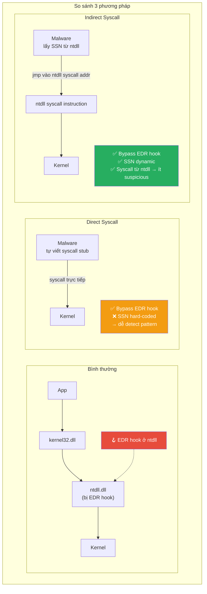

#### Ví dụ thực tế & Analogy

**Ví dụ — Detect Direct Syscall:**

```python
# Pattern signature để detect direct syscall trong binary
# Tìm: mov r10, rcx / mov eax, [số] / syscall
direct_syscall_pattern = b"\x4C\x8B\xD1"  # mov r10, rcx
                       + b"\xB8"           # mov eax, imm32
                       # + SSN value (varies)
                       + b"\x0F\x05"       # syscall
```

**Analogy — Direct Syscall:** Giống **lẻn vào bếp nhà hàng thẳng** thay vì đặt món qua bồi bàn (kernel32) → bếp trưởng (EDR) đứng ở cửa bếp không thấy bạn đặt món gì.

**Analogy — Indirect Syscall:** Giống **mua vé qua app bên thứ ba** nhưng check-in bằng barcode giống hệt vé gốc → nhân viên soát vé (EDR) thấy barcode hợp lệ từ hệ thống chính → không nghi ngờ.

---

### API Hashing

#### Khái niệm & lý thuyết

**API Hashing** là kỹ thuật malware dùng để **ẩn tên API functions** khỏi import table — thay vì lưu string `"CreateThread"`, malware lưu hash của tên đó.

**Mục đích:**

- Né tránh static analysis dựa trên import table
- Strings trong binary không còn readable
- Yêu cầu analyst phải reverse thuật toán hash

**Quy trình 2 bước:**

```
Bước 1 — Compile time (offline):
"CreateThread" → hash_function() → 0x00544e304

Bước 2 — Runtime:
1. Duyệt qua Export Table của kernel32.dll
2. Với mỗi exported function name:
   a. Tính hash của tên đó
   b. So sánh với 0x00544e304
   c. Nếu match → lấy địa chỉ hàm đó
3. Gọi hàm qua địa chỉ vừa tìm được
```

**Các hash algorithm phổ biến trong malware:**

| Algorithm | Đặc điểm |
|---|---|
| ROR13 | Phổ biến nhất — đơn giản, nhanh |
| DJB2 | Hash string chuẩn |
| CRC32 | Nhanh, collision thấp |
| Custom | Malware tự viết để né detection |

#### Cách hoạt động / Luồng xử lý

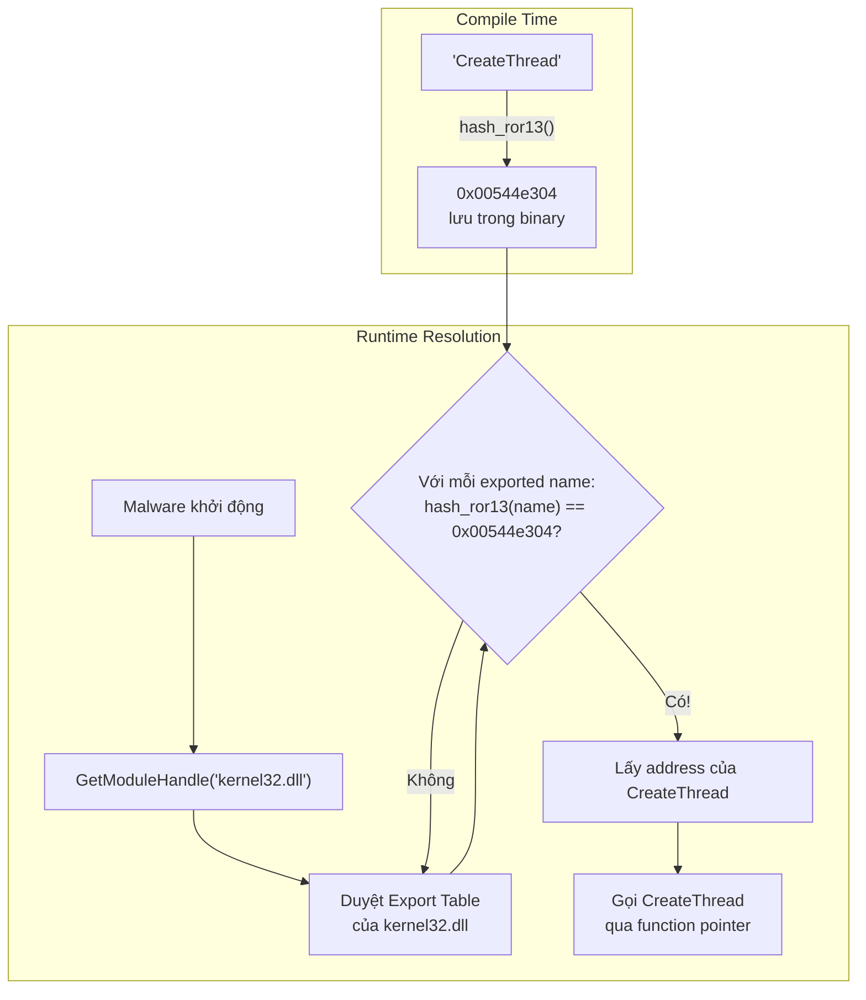

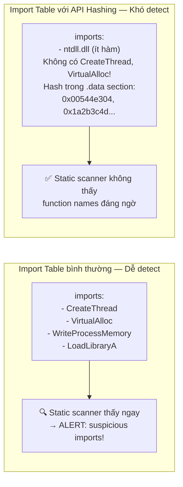

#### Ví dụ thực tế & Analogy

**Ví dụ — ROR13 Hash algorithm:**

```c
// ROR13: Rotate Right 13 bits, XOR-based hashing
DWORD ror13_hash(const char* name) {
    DWORD hash = 0;
    while (*name) {
        hash = (hash >> 13) | (hash << 19); // Rotate right 13
        hash += (BYTE)*name;
        name++;
    }
    return hash;
}

// Ví dụ:
// ror13_hash("CreateThread") = 0x00544e304
// ror13_hash("VirtualAllocEx") = 0x3F9287AE

// Malware resolve lúc runtime:
DWORD target_hash = 0x00544e304;
// Duyệt exports của kernel32.dll...
// Tìm thấy "CreateThread" → hash match → lấy address
```

**Ví dụ — Công cụ phân tích:**

```python
# Script tính ROR13 hash để lookup API
def ror13(value, bits=32):
    return ((value >> 13) | (value << (bits - 13))) & (2**bits - 1)

def api_hash(name):
    h = 0
    for c in name:
        h = ror13(h) + ord(c)
    return h & 0xFFFFFFFF

# Lookup: tìm API nào có hash = 0x00544e304
known_apis = ["CreateThread", "VirtualAlloc", "WriteProcessMemory", ...]
for api in known_apis:
    if api_hash(api) == 0x00544e304:
        print(f"Found: {api}")
```

**Ví dụ thực tế:** Shellcode của **Metasploit** dùng API hashing (ROR13) để resolve WinAPI — cho phép shellcode nhỏ gọn, không cần import table, chạy được trong mọi context.

**Analogy — API Hashing:** Giống **dùng mã số nhân viên thay vì tên** — thay vì nói "gặp anh Nguyễn Văn A" (CreateThread), bạn nói "gặp nhân viên #12345". Người ngoài nghe không biết #12345 là ai, nhưng HR (malware resolver) biết cách tra cứu từ mã số ra tên thật.

**Analogy — Export Table walk:** Giống **tìm số điện thoại trong danh bạ** — bạn không biết số, nhưng biết cách tính checksum từ tên → duyệt danh bạ từng người, tính checksum tên họ, so sánh với checksum mình có. Khi match → gọi số đó.

#### ⚠️ Điểm hay gặp sai / Cần lưu ý

!!! danger "API Hashing + Direct Syscall = Cực kỳ khó detect"
    Malware hiện đại thường kết hợp **cả hai**: API hashing để ẩn function names + Direct/Indirect syscall để bypass EDR hook. Kết quả: import table trống, không có suspicious strings, không bị hook. Chỉ dynamic analysis hoặc kernel-level monitoring mới bắt được.

!!! warning "Nhận biết API Hashing trong binary"
    Dấu hiệu: binary có vòng lặp duyệt Export Table của DLL (pattern: `GetProcAddress` → không có; thay vào đó duyệt `IMAGE_EXPORT_DIRECTORY` thủ công), và có các hằng số 32-bit hoặc 64-bit không rõ nghĩa trong code.

!!! tip "Công cụ hỗ trợ"
    - **HashDB** (plugin IDA/Ghidra): database hash của APIs phổ biến, tự động annotate
    - **CAPA** (FireEye): detect API hashing pattern tự động
    - Viết script Python để brute-force lookup hash từ danh sách API biết trước

### Câu hỏi thực tế

1. Tại sao Direct Syscall an toàn hơn gọi qua ntdll, nhưng vẫn có thể bị EDR detect?
2. Nếu malware dùng custom hash algorithm thay vì ROR13, việc phân tích khó hơn như thế nào?
3. Bạn thấy một binary hầu như không có imports, nhưng trong code có vòng lặp duyệt memory với phép tính bitwise phức tạp. Bạn nghi ngờ kỹ thuật gì và sẽ làm gì tiếp theo?

---

> 💡 **Chốt nhanh:** Direct Syscall = tự viết syscall stub, bypass hook ở ntdll. Indirect Syscall = lấy SSN từ ntdll nhưng nhảy vào địa chỉ syscall của ntdll → trông hợp lệ hơn. API Hashing = thay tên API bằng hash → import table trống, static analysis mù. Ba kỹ thuật này kết hợp = malware "vô hình" với phần lớn security tools.

---

---

## 🧪 Quiz — Phần B

### Tầng 1 — Ghi nhớ

---

**Câu 1.** `DllMain` được gọi tự động khi nào với lý do `DLL_PROCESS_ATTACH`?

- [x] Khi một process load DLL vào memory lần đầu tiên
- [ ] Khi DLL tạo một thread mới
- [ ] Khi process gọi hàm được export từ DLL
- [ ] Khi DLL được unload khỏi memory

??? info "Giải thích"
    `DLL_PROCESS_ATTACH` được gửi đến `DllMain` khi một process **load DLL lần đầu**. Đây là lý do malware đặt payload trong case này — code chạy ngay khi DLL được load, không cần gọi hàm export nào.

---

**Câu 2.** Trong Windows service, `WIN32_SHARE_PROCESS` có nghĩa là gì?

- [x] Service lưu code trong DLL và chạy chung trong một process `svchost.exe` với các service khác
- [ ] Service chia sẻ dữ liệu với các service khác qua shared memory
- [ ] Service chạy trong process riêng nhưng chia sẻ port mạng
- [ ] Service có thể được nhiều user dùng đồng thời

??? info "Giải thích"
    `WIN32_SHARE_PROCESS` = nhiều service cùng chạy trong **một** process `svchost.exe`, mỗi service là một DLL. Đây là lý do bạn thấy nhiều process `svchost.exe` trong Task Manager — mỗi cái host nhiều service khác nhau.

---

**Câu 3.** Mutex trong kernel Windows được gọi bằng tên gì?

- [x] Mutant
- [ ] Semaphore
- [ ] CriticalSection
- [ ] Event

??? info "Giải thích"
    Trong NT kernel, mutex được gọi là **mutant** — tên gốc từ thời thiết kế ban đầu. Khi dùng WinObj (Sysinternals) để xem kernel objects, bạn sẽ thấy chúng liệt kê dưới type "Mutant".

---

**Câu 4.** User Mode (Ring 3) khác Kernel Mode (Ring 0) ở điểm quan trọng nào sau đây?

- [x] Crash ở User Mode chỉ kill process đó; crash ở Kernel Mode gây BSOD toàn hệ thống
- [ ] User Mode có tốc độ thực thi nhanh hơn Kernel Mode
- [ ] User Mode có thể access hardware trực tiếp còn Kernel Mode thì không
- [ ] User Mode chạy ở Ring 0 còn Kernel Mode chạy ở Ring 3

??? info "Giải thích"
    User Mode process bị isolated — crash chỉ ảnh hưởng process đó, Windows reclaim resources và tiếp tục. Kernel Mode share memory với toàn hệ thống — một lỗi nhỏ gây **BSOD** (Blue Screen of Death) làm sập toàn bộ OS.

---

**Câu 5.** `NtQueryInformationProcess` được gọi từ đâu trong kiến trúc Windows?

- [x] Từ `ntdll.dll` — thuộc Native API
- [ ] Từ `kernel32.dll` — thuộc Win32 API
- [ ] Từ `user32.dll` — thuộc Win32 API
- [ ] Trực tiếp từ `ntoskrnl.exe` — thuộc Kernel API

??? info "Giải thích"
    Các hàm có prefix `Nt` hoặc `Zw` thuộc **Native API**, implement trong `ntdll.dll`. Đây là tầng ngay trên syscall, thấp hơn Win32 API (kernel32.dll). Malware gọi trực tiếp ntdll để bypass hook đặt ở kernel32.

---

**Câu 6.** Trong API Hashing, malware dùng thuật toán nào phổ biến nhất?

- [x] ROR13 (Rotate Right 13)
- [ ] MD5
- [ ] SHA-256
- [ ] Base64

??? info "Giải thích"
    **ROR13** là thuật toán hash đơn giản, nhanh, và nhỏ gọn — lý tưởng cho shellcode. Dùng bitwise rotation 13 bits + addition cho mỗi ký tự. MD5/SHA không dùng cho mục đích này vì quá phức tạp để implement trong shellcode nhỏ.

---

**Câu 7.** Hàm nào **bắt buộc** phải gọi trước khi dùng COM functions?

- [x] `OleInitialize` hoặc `CoInitializeEx`
- [ ] `CoCreateInstance`
- [ ] `RegOpenKeyEx`
- [ ] `LoadLibrary`

??? info "Giải thích"
    Mọi thread dùng COM đều phải khởi tạo COM runtime trước bằng `OleInitialize` hoặc `CoInitializeEx`. Tương tự `WSAStartup` cho Winsock — không init trước thì mọi COM call đều fail.

---

**Câu 8.** `CreateRemoteThread` thường được dùng để làm gì trong context malware?

- [x] Tạo thread trong process khác để inject và thực thi code độc hại
- [ ] Tạo thread chạy từ xa trên máy tính khác qua mạng
- [ ] Tạo thread với quyền Administrator từ user thường
- [ ] Tạo thread ẩn không hiện trong Task Manager

??? info "Giải thích"
    `CreateRemoteThread` tạo thread **trong một process khác** (remote = process khác, không phải máy khác). Kết hợp với `WriteProcessMemory` + địa chỉ của `LoadLibraryA`, đây là kỹ thuật **DLL Injection cổ điển** nhất.

---

**Câu 9.** Direct Syscall khác gọi qua `ntdll.dll` như thế nào?

- [x] Malware tự implement stub chứa lệnh `syscall` → không đi qua ntdll → bypass hook của EDR đặt tại ntdll
- [ ] Direct Syscall nhanh hơn vì bỏ qua một tầng thư viện
- [ ] Direct Syscall dùng INT 0x80 thay vì SYSCALL instruction
- [ ] Direct Syscall chỉ hoạt động trên 32-bit Windows

??? info "Giải thích"
    EDR thường hook các hàm trong `ntdll.dll` để monitor syscalls. Direct Syscall = malware **tự viết `mov eax, SSN; syscall; ret`** trong code của mình → nhảy thẳng vào kernel mà không đi qua ntdll → EDR hook bị bỏ qua hoàn toàn.

---

**Câu 10.** CLSID trong COM được lưu ở đâu trong registry?

- [x] `HKEY_CLASSES_ROOT\CLSID`
- [ ] `HKEY_LOCAL_MACHINE\SOFTWARE\Classes`
- [ ] `HKEY_CURRENT_USER\Software\COM`
- [ ] `HKEY_LOCAL_MACHINE\SYSTEM\COM`

??? info "Giải thích"
    CLSID (Class Identifier) của COM objects được đăng ký tại `HKEY_CLASSES_ROOT\CLSID\{GUID}`. IID (Interface Identifier) ở `HKEY_CLASSES_ROOT\Interface`. Đây là nơi malware đăng ký COM Hijacking entry.

---

### Tầng 2 — Hiểu & Phân Tích

---

**Câu 11.** Tại sao malware prefer dùng `WIN32_SHARE_PROCESS` (svchost) thay vì `WIN32_OWN_PROCESS` (EXE riêng) để tạo service?

- [x] Ẩn trong svchost cùng nhiều service hợp lệ khiến việc phát hiện khó hơn, vì svchost là process hệ thống bình thường
- [ ] WIN32_SHARE_PROCESS cho phép chạy với quyền cao hơn SYSTEM
- [ ] WIN32_SHARE_PROCESS không bị Autoruns kiểm tra
- [ ] WIN32_SHARE_PROCESS tự động restart nếu bị kill

??? info "Giải thích"
    Khi malware chạy như WIN32_OWN_PROCESS, Task Manager hiện một process lạ → dễ phát hiện. Khi chạy trong svchost, chỉ thấy "svchost.exe" — trông bình thường. Analyst phải kiểm tra sâu hơn (Process Explorer, sc qc) mới phát hiện service độc hại ẩn bên trong.

---

**Câu 12.** Process A tạo thread mới trong Process B bằng `CreateRemoteThread`. Thread đó chạy `LoadLibraryA` với tên DLL là tham số. Tại sao kỹ thuật này hoạt động?

- [x] `LoadLibraryA` là hàm có địa chỉ fixed trong kernel32.dll (do ASLR với DLL hệ thống được randomize một lần khi boot), và thread start function nhận đúng 1 LPVOID parameter — giống prototype của LoadLibrary
- [ ] Vì kernel32.dll cho phép load DLL từ process khác
- [ ] Vì `CreateRemoteThread` có quyền đặc biệt để gọi LoadLibrary
- [ ] Vì Windows tự động map tất cả DLL vào cùng địa chỉ cho mọi process

??? info "Giải thích"
    `LoadLibraryA` có signature `HMODULE LoadLibraryA(LPCSTR lpLibFileName)` — nhận 1 pointer. Thread start function có signature `DWORD CALLBACK ThreadProc(LPVOID lpParam)` — cũng nhận 1 pointer. Type-compatible, và địa chỉ của LoadLibraryA trong kernel32.dll giống nhau giữa các process (randomize chỉ một lần lúc boot) → trick hoạt động.

---

**Câu 13.** Kỹ thuật "vaccine" dựa trên mutex có điểm yếu gì?

- [x] Chỉ hiệu quả nếu biết chính xác tên mutex; malware generate tên động từ thông tin máy sẽ tạo tên khác nhau trên mỗi máy → vaccine không biết tên để tạo giả
- [ ] Vaccine cần quyền Administrator để tạo mutex
- [ ] Mutex bị xóa khi hệ thống reboot nên cần chạy vaccine mỗi lần
- [ ] Windows tự động xóa mutex sau 30 phút không dùng

??? info "Giải thích"
    Vaccine dựa trên mutex chỉ work với **hard-coded mutex name**. Malware tinh vi generate tên từ `username + hostname + MAC` → tên khác trên mỗi máy → không thể viết vaccine chung. Tên mutex cũng có thể thay đổi giữa các phiên bản malware.

---

**Câu 14.** Phân biệt Process Injection và Process Hollowing. Kỹ thuật nào khó phát hiện hơn và tại sao?

- [x] Injection inject vào process đang chạy; Hollowing tạo process suspended → khoét rỗng → nhồi code mới. Hollowing khó phát hiện hơn vì process name hợp lệ và không có process cha đáng ngờ
- [ ] Injection dễ hơn vì không cần tạo process mới; Hollowing khó hơn vì cần leo quyền Admin
- [ ] Hollowing chỉ hoạt động với 32-bit process; Injection hoạt động với cả 32 và 64-bit
- [ ] Cả hai như nhau về mức độ khó phát hiện

??? info "Giải thích"
    Process Hollowing tạo process hợp lệ (svchost.exe, notepad.exe) ở trạng thái suspended → khoét rỗng memory → nhồi malware code → resume. Task Manager thấy "svchost.exe" đang chạy — hoàn toàn bình thường. Chỉ memory forensics hoặc so sánh disk image vs memory mới phát hiện được mismatch.

---

**Câu 15.** Indirect Syscall giải quyết vấn đề gì mà Direct Syscall gặp phải?

- [x] Direct Syscall hard-code SSN và dễ bị phát hiện qua pattern matching; Indirect Syscall lấy SSN động từ ntdll và thực hiện syscall tại địa chỉ trong ntdll → trông hợp lệ hơn và SSN luôn đúng
- [ ] Direct Syscall không hoạt động trên 64-bit Windows
- [ ] Indirect Syscall nhanh hơn Direct Syscall vì dùng cache
- [ ] Direct Syscall cần quyền kernel còn Indirect thì không

??? info "Giải thích"
    Direct Syscall có hai vấn đề: (1) SSN hard-coded → sai version Windows = crash; (2) pattern `mov r10,rcx; mov eax,X; syscall` dễ detect bằng signature scanning. Indirect Syscall: lấy SSN runtime từ ntdll (luôn đúng) + syscall instruction nằm trong ntdll (địa chỉ hợp lệ) → EDR rule dựa trên "syscall from outside ntdll" không trigger.

---

**Câu 16.** Tại sao malware gọi `NtQueryInformationProcess` trực tiếp từ ntdll thay vì `IsDebuggerPresent` từ kernel32?

- [x] `IsDebuggerPresent` dễ bị debugger patch thành return 0 (false); NtQueryInformationProcess ở tầng thấp hơn, khó patch hơn và trả về nhiều thông tin anti-debug hơn
- [ ] Vì `IsDebuggerPresent` không tồn tại trên Windows 10
- [ ] Vì `NtQueryInformationProcess` nhanh hơn 10 lần
- [ ] Vì `IsDebuggerPresent` luôn return TRUE khi chạy trong VM

??? info "Giải thích"
    `IsDebuggerPresent` chỉ check PEB.BeingDebugged flag — debugger (như x64dbg) có thể patch flag này thành 0 để bypass. `NtQueryInformationProcess` với `ProcessDebugPort` query thẳng debug port của process từ kernel — khó fake hơn nhiều. Đây là lý do malware prefer tầng thấp hơn cho anti-debug.

---

**Câu 17.** Một malware DLL được thiết kế để ẩn code trong `DLL_PROCESS_ATTACH`. Điều này có ý nghĩa gì với việc phân tích động (dynamic analysis)?

- [x] Payload chạy ngay khi DLL được load — ngay cả khi không gọi hàm export nào; analyst cần chú ý ngay từ lúc load DLL, không chờ đến khi gọi hàm export
- [ ] Payload chỉ chạy khi process tạo thêm thread mới
- [ ] Payload không chạy nếu DLL được load bằng LoadLibrary
- [ ] Payload chỉ chạy một lần và không thể trigger lại

??? info "Giải thích"
    `DLL_PROCESS_ATTACH` chạy **ngay lập tức** khi DLL được mapped vào memory — trước khi `LoadLibrary` return, trước khi có thể gọi bất kỳ export nào. Trong dynamic analysis, nếu đặt breakpoint chỉ ở exported functions → miss toàn bộ payload.

---

### Tầng 3 — Vận dụng

---

**Câu 18.** Bạn đang phân tích một sample và quan sát: (1) Import table gần như trống, chỉ có `GetModuleHandle` và `GetProcAddress`. (2) Trong code có vòng lặp duyệt memory, thực hiện bitwise rotation, phép cộng, và so sánh với một hằng số 32-bit. (3) Sau vòng lặp, có `call eax`. Bạn nghi ngờ kỹ thuật gì và bước tiếp theo là gì?

- [x] Đây là API Hashing — dùng `GetModuleHandle` để lấy base address DLL, duyệt export table và hash từng tên, `call eax` gọi hàm tìm được. Bước tiếp: xác định hash algorithm, viết script lookup từ database hash biết trước
- [ ] Đây là packed malware — cần unpack trước khi phân tích
- [ ] Đây là process hollowing — malware đang parse PE header của process khác
- [ ] Đây là direct syscall — malware đang tìm SSN trong ntdll

??? info "Giải thích"
    Pattern `GetModuleHandle` + loop + bitwise ops + compare constant + `call register` = **API Hashing**. `GetModuleHandle` lấy base của DLL, loop duyệt export table, bitwise rotation là hash algorithm (ROR13 thường dùng rotation). Tool như **HashDB** (IDA plugin) có thể tự động lookup hash và annotate function names.

---

**Câu 19.** Trong incident response, bạn tìm thấy một service với các thông tin sau: `ImagePath = svchost.exe -k netsvcs`, `Start = 2 (Auto)`, `Type = 32 (WIN32_SHARE_PROCESS)`. Service này trông hợp lệ. Bạn có thể kết luận ngay đây là service hợp lệ không? Nếu không, bạn kiểm tra tiếp ở đâu?

- [x] Không thể kết luận ngay — cần kiểm tra `Parameters\ServiceDll` để xem DLL thực sự được load là gì, sau đó verify chữ ký số của DLL đó và đường dẫn có bất thường không
- [ ] Có — `svchost.exe -k netsvcs` là path của Windows, service chắc chắn hợp lệ
- [ ] Không — tất cả Auto-start service đều là malware
- [ ] Có — Type = 32 chứng tỏ đây là Windows built-in service

??? info "Giải thích"
    `ImagePath = svchost.exe -k netsvcs` trông hoàn toàn bình thường — đây là path chuẩn của hàng chục service Windows hợp lệ. **Nhưng DLL thực sự** được khai báo tại `HKLM\SYSTEM\CurrentControlSet\Services\[Name]\Parameters\ServiceDll`. Malware để `ImagePath` giống service thật, chỉ thay `ServiceDll` trỏ vào DLL độc hại.

---

**Câu 20.** Một EDR solution hook toàn bộ các hàm quan trọng trong `ntdll.dll` bằng cách patch byte đầu thành `jmp` đến engine của họ. Malware phản ứng bằng cách load một bản copy sạch của `ntdll.dll` từ disk vào memory (bằng `CreateFileMapping`) và gọi hàm từ bản copy đó thay vì bản đã bị hook. Kỹ thuật phòng thủ nào của EDR có thể counter lại?

- [x] Monitor việc đọc file `ntdll.dll` từ disk và tạo file mapping của nó (unusual ntdll file access); hoặc implement kernel-level monitoring không phụ thuộc vào user-mode hooks
- [ ] Khóa file ntdll.dll để không ai đọc được
- [ ] Tăng số lượng hook trong ntdll lên để không có chỗ bypass
- [ ] Đổi tên ntdll.dll thành tên khác để malware không tìm thấy

??? info "Giải thích"
    Kỹ thuật này gọi là **ntdll unhooking** hoặc **fresh ntdll mapping**. EDR counter bằng: (1) Kernel callbacks (PsSetLoadImageNotifyRoutine) phát hiện bất thường khi load ntdll từ disk; (2) ETW (Event Tracing for Windows) ở kernel level; (3) Hardware breakpoints; (4) Hypervisor-based monitoring. Không có giải pháp hoàn hảo — đây là cuộc chơi cat-and-mouse ongoing.

---

**Câu 21.** Bạn phân tích rootkit nghi ngờ. Sample chạy xong thì process của nó biến mất khỏi Task Manager, nhưng Wireshark vẫn thấy traffic từ địa chỉ IP máy này. Giải thích cơ chế kỹ thuật và công cụ nào có thể phát hiện rootkit này?

- [x] Rootkit kernel-mode hook SSDT — filter kết quả của NtQuerySystemInformation để ẩn process khỏi mọi query từ user mode. Dùng: memory forensics (Volatility), so sánh process list từ EPROCESS linked list với SSDT output, hoặc LiveKD/WinDbg để inspect kernel structures trực tiếp
- [ ] Process tự xóa file EXE sau khi chạy xong nên không thấy trong Task Manager
- [ ] Malware dùng `FreeConsole()` để ẩn khỏi Task Manager
- [ ] Process đã kết thúc nhưng socket connection vẫn giữ trong kernel buffer

??? info "Giải thích"
    SSDT hook ở kernel level cho phép rootkit **trả về data giả** cho mọi user-mode query — kể cả từ Task Manager, Process Explorer. Nhưng **Volatility** (memory forensics) đọc thẳng từ RAM dump và walk `EPROCESS` linked list trong kernel — rootkit không thể ẩn khỏi đây. Đây là lý do memory forensics là "vũ khí cuối cùng" chống rootkit.

---

*Kết thúc Phần B — Toàn bộ bài giảng "Analyzing Malicious Windows Programs" đã hoàn chỉnh.*
