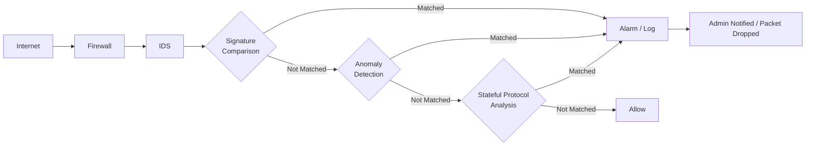

# Bài 1: Tổng quan môn học

### Kiến thức tiên quyết

- Nguyên tắc hoạt động cơ bản của mạng máy tính (IT005)
- Cơ bản về các tấn công mạng và phương pháp phòng thủ (NT101)
- Kiến thức về hệ điều hành Linux, Windows
- Kỹ năng nghiên cứu cơ bản (đọc hiểu, phân tích, cài đặt/cấu hình)
- Kiến thức về Machine Learning / Deep Learning

---

## 2. Mục tiêu môn học

Sau khi kết thúc môn học, sinh viên có thể:

- Hiểu được cơ bản các vấn đề, khái niệm, phân loại, nguyên tắc hoạt động và các kỹ thuật trong các hệ thống IDPS.
- Hiểu được lúc nào, ở đâu, bằng cách nào và lý do khi áp dụng các công cụ IDPS và các kỹ thuật liên quan để đảm bảo an toàn mạng.
- Tiếp cận các hướng mới cho IDPS (học máy/học sâu) và cách áp dụng các công nghệ bảo mật mới vào kiến trúc mạng hiện có.
- Có thể triển khai, đánh giá, tuỳ chỉnh một IDPS cho những yêu cầu bảo mật cụ thể.

!!! tip "Hint"
    Nhiều bài tập vận dụng, bài tập nghiên cứu được dùng để đánh giá các mục tiêu môn học này!

---

## 3. Nội dung từng tuần (dự kiến)

| Tuần | Nội dung |
|------|----------|
| 1 | Giới thiệu môn học |
| 2 | Ôn tập về tấn công mạng, tổng quan IDPS |
| 3–4 | Network-based IDPS |
| 5 | Host-based IDPS |
| 6 | Security Monitoring, Log analysis, SIEM/SOC |
| **7** | **Báo cáo đồ án lần 1 (Giữa kỳ)** |
| 8 | Đánh giá và đánh lừa IDPS |
| 9–10 | Học máy cho IDS |
| 11 | Bảo mật cho Học máy |
| **12–15** | **Báo cáo đồ án lần 2 (Cuối kỳ)** |

---

## 4. Đánh giá

```
30% Quá trình  +  20% Thực hành  +  50% Cuối kỳ
```

### Quá trình (30%)
- Điểm danh, câu hỏi trên lớp, các bài tập nghiên cứu tài liệu
- Bài tập về nhà
- Đồ án môn học

!!! warning "Lưu ý"
    **Không thi giữa kỳ.**

### Đồ án
- Thực hiện theo nhóm
- Danh sách chủ đề và thông tin đăng ký sẽ thông báo sau

### Cuối kỳ (50%)
- Thi cuối kỳ: gồm trắc nghiệm và tự luận (nội dung gồm LT, TH, BT)

---

## 5. Tài liệu tham khảo

!!! info "Lưu ý về giáo trình"
    **Không có giáo trình chính thức!** Nội dung môn học dựa trên các bài báo khoa học gần đây và tài liệu của các công cụ IDPS.

Tài liệu tham khảo thêm:

1. Karen Scarfone & Peter Mell – *Guide to Intrusion Detection and Prevention Systems (IDPS)*, NIST, 2007
2. Carol Fung & Raouf Boutaba – *Intrusion Detection Networks: A Key to Collaborative Security*, CRC Press, 2013
3. Một số bài báo khoa học liên quan (sẽ được cung cấp trong các buổi học)

---

## 6. Giới thiệu IDS/IPS

### 6.1. Nhắc lại cơ bản về An toàn thông tin

**Định nghĩa An toàn thông tin (NIST):**

> *"The protection of information and information systems from unauthorized access, use, disclosure, disruption, modification, or destruction in order to provide confidentiality, integrity, and availability."*

#### Bộ ba CIA

```
         C – Confidentiality (Bảo mật)
        / \
       /   \
      I-----A
Integrity  Availability
(Toàn vẹn) (Sẵn sàng)
```

| Mục tiêu | Ý nghĩa | Phạm vi |
|----------|---------|---------|
| **Confidentiality** | Tránh để lộ thông tin trái phép | Thông tin |
| **Integrity** | Tránh để thông tin bị thay đổi trái phép | Thông tin |
| **Availability** | Đảm bảo người dùng hợp lệ luôn có thể truy cập | Hệ thống |

!!! note
    Availability là mục tiêu về **hệ thống** – không thể chỉ xem xét thông tin đơn thuần.

---

### 6.2. Intrusion (Xâm nhập) là gì?

**Định nghĩa từ điển Merriam-Webster:**
> *"Intrusion is the act of thrusting in, or of entering into a place or state without invitation, right, or welcome."*

**Định nghĩa NIST:**
> **Intrusion** là một hành vi cố gắng xâm phạm CIA, hoặc qua mặt cơ chế bảo mật của một máy tính hoặc mạng máy tính.

#### Nguyên nhân xâm nhập phổ biến

- **Malware** (worms, spyware,…)
- Kẻ tấn công truy cập trái phép qua mạng Internet
- Người dùng hợp lệ lợi dụng hoặc cố chiếm thêm quyền không được phép

---

### 6.3. Các tấn công mạng – Intrusion phổ biến

- Truy cập trái phép vào tài nguyên → tiết lộ, thay đổi hoặc phá huỷ tài nguyên
- **DDoS Attacks** (ví dụ: Mirai botnet)
- **Malware**: Virus, worms, trojan, ransomware, spyware (ví dụ: WannaCry)
- Theo dõi và bắt lưu lượng mạng → đánh cắp credentials
- Khai thác lỗ hổng phần mềm (ví dụ: buffer overflow)
- Giả dạng người dùng hợp lệ hoặc hệ thống đầu cuối
- Tấn công Web: SQLi, XSS, CSRF,…
- DNS Attack

---

### 6.4. Dấu hiệu nhận biết xâm nhập

=== "Dấu hiệu chung"
    - Log ngắn và không đầy đủ
    - Hiệu suất hệ thống thấp bất thường
    - Các tiến trình bất thường
    - Hệ thống bị crash hoặc reboot
    - Hiển thị hình ảnh hoặc đoạn tin nhắn bất thường

=== "Xâm nhập hệ thống"
    - Xuất hiện các file hoặc chương trình lạ
    - Các quyền truy cập file bị thay đổi
    - Kích thước file bị thay đổi bất thường
    - Những tên file lạ trong các thư mục
    - Thiếu file

=== "Xâm nhập mạng"
    - Thăm dò liên tục các service trên các máy tính
    - Kết nối từ các vị trí bất thường
    - Cố gắng đăng nhập liên tục từ host ở xa
    - Dữ liệu bất thường trong các file log, dấu hiệu của DoS hoặc hướng tới crash dịch vụ

---

### 6.5. Intrusion Detection and Prevention – Khái niệm

| Thuật ngữ | Định nghĩa |
|-----------|-----------|
| **Intrusion Detection** | Quy trình theo dõi các sự kiện trong hệ thống/mạng và phân tích để nhận biết dấu hiệu bất thường |
| **IDS** | Hệ thống phần mềm/phần cứng **tự động** thực hiện quy trình phát hiện xâm nhập |
| **IPS** | Hệ thống có **tất cả chức năng của IDS** và **có thể dừng** sự xâm nhập |
| **IDPS** | IDS + IPS |

```
IDPS = IDS + IPS
```

---

### 6.6. Cách IDS hoạt động



---

### 6.7. Cách IPS ngăn chặn xâm nhập

IPS can thiệp theo **3 hướng**:

??? note "1. IPS dừng hoạt động tấn công"
    - Ngắt kết nối hoặc phiên làm việc đang bị sử dụng để tấn công
    - Chặn truy cập vào mục tiêu từ tài khoản người dùng, địa chỉ IP hoặc các yếu tố tấn công khác
    - Chặn tất cả các truy cập đến host, dịch vụ, ứng dụng hoặc tài nguyên là mục tiêu

??? note "2. IPS thay đổi môi trường bảo mật"
    - Tái cấu hình thiết bị mạng (tường lửa, router, switch) để chặn truy cập từ attacker hoặc đến mục tiêu
    - Vá các lỗ hổng đang có trên host

??? note "3. IPS thay đổi nội dung của hoạt động tấn công"
    - Loại bỏ hoặc thay thế những phần độc hại của tấn công để nó trở nên bình thường
    - Hoạt động như proxy và bình thường hoá (normalize) các yêu cầu được gửi đến (đóng gói lại payload, bỏ các thông tin header,…)

---

### 6.8. False Positive và False Negative

!!! danger "IDPS không phải lúc nào cũng phát hiện đúng!"

```
┌─────────────────────────────────────────────┐
│         Thực tế \ Phán đoán IDPS            │
│                                             │
│              | Bình thường | Tấn công       │
│  Bình thường |     ✅ TN   |  ❌ FP         │
│  Tấn công    |     ❌ FN   |  ✅ TP         │
└─────────────────────────────────────────────┘
```

| Khái niệm | Diễn giải |
|-----------|-----------|
| **False Positive (FP)** | IDPS xác định nhầm hoạt động **bình thường** là hoạt động **đáng ngờ** |
| **False Negative (FN)** | IDPS **không thể xác định** một hoạt động là đáng ngờ (bỏ sót tấn công) |

!!! warning "Thực tế quan trọng"
    **Giảm 1 tỷ lệ sẽ làm tăng tỷ lệ còn lại.** Mục tiêu là **tuỳ chỉnh (tuning) IDPS** để cân bằng và giảm cả FP lẫn FN.

---

### 6.9. IDPS: Có thể và không thể làm gì?

??? success "IDS CÓ THỂ làm gì?"
    - Liên tục theo dõi các gói tin trong mạng, phân tích ở dạng nhị phân và cảnh báo nếu xảy ra bất thường khớp với signature đã biết
    - Tạo ra lượng lớn dữ liệu dù được điều chỉnh tốt như thế nào
    - Hỗ trợ các cơ chế phòng thủ mạng khác → hiện thực chiến lược **phòng thủ theo chiều sâu (defense-in-depth)**

    > *"Một IDS mới giống như 1 đứa bé, cần chăm sóc và nuôi dưỡng để trưởng thành khoẻ mạnh và hiệu quả."*

??? failure "IDS KHÔNG THỂ làm gì?"
    - **Không thể thay thế** sự cần thiết của đội ngũ nhân viên am hiểu về an toàn thông tin
    - **Không thể bắt tất cả** các tấn công xảy ra, hoặc chặn người khác cố gắng tấn công

---

### 6.10. Từ khoá cần nhớ

```
intrusion         → xâm nhập
incident          → sự cố
exploit           → khai thác
vulnerability     → lỗ hổng
intrusion detection  → phát hiện xâm nhập
intrusion prevention → ngăn chặn xâm nhập
IDS / IPS / IDPS
false positive    → dương tính giả
false negative    → âm tính giả
tuning IDPS       → tuỳ chỉnh IDPS
defense-in-depth  → phòng thủ theo chiều sâu
```

---

## 7. Câu hỏi thảo luận

1. IDPS có quan trọng không?
2. Khác biệt giữa IDS và IPS?
3. Giả sử đã có 1 firewall, vậy có cần thêm IDPS? Firewall có thể hoạt động như IDPS không?

---

## 8. Chuẩn bị tuần sau

Đọc thêm (bài tập về nhà):

1. Xem lại nội dung TCP/IP attack của môn NT101
2. G. Fernandes et al., *"A comprehensive survey on network anomaly detection"*, Telecommunication Systems, 2019 – Phần 1–4
3. K. Scarfone & M. Peter, *Guide to Intrusion Detection and Prevention Systems (IDPS)*, NIST, 2007 – Chương 2, 3

---

# 50 Câu Trắc nghiệm – NT204 Tuần 1

---

**Câu 1.** Môn NT204 là môn học về lĩnh vực nào?

- A. Mật mã học
- B. Hệ thống tìm kiếm, phát hiện và ngăn ngừa xâm nhập
- C. Lập trình mạng
- D. Quản trị cơ sở dữ liệu

??? success "Đáp án: B"
    Tên đầy đủ của môn là *Hệ thống tìm kiếm, phát hiện và ngăn ngừa xâm nhập* – tiếng Anh là Intrusion Detection and Prevention System (IDPS).

---

**Câu 2.** Viết tắt IDPS có nghĩa là gì?

- A. Intrusion Defense and Protection System
- B. Intrusion Detection and Prevention System
- C. Internet Detection and Prevention Service
- D. Intrusion Discovery and Prevention Software

??? success "Đáp án: B"
    IDPS = Intrusion Detection and Prevention System = IDS + IPS.

---

**Câu 3.** Môn tiên quyết nào cung cấp kiến thức về tấn công mạng và phòng thủ cho NT204?

- A. IT005
- B. NT547
- C. NT101
- D. IT001

??? success "Đáp án: C"
    NT101 – An toàn mạng máy tính cung cấp kiến thức cơ bản về các tấn công mạng và phương pháp phòng thủ.

---

**Câu 4.** Theo slide môn học, sinh viên cần kiến thức về lĩnh vực nào NGOÀI an toàn mạng?

- A. Thiết kế đồ họa
- B. Machine Learning / Deep Learning
- C. Quản trị doanh nghiệp
- D. Kiến trúc phần mềm

??? success "Đáp án: B"
    Slide yêu cầu kiến thức về Machine Learning / Deep Learning vì đây là hướng nghiên cứu mới của IDPS.

---

**Câu 5.** Cấu trúc điểm của môn NT204 là gì?

- A. 40% quá trình + 60% cuối kỳ
- B. 50% quá trình + 50% cuối kỳ
- C. 30% quá trình + 20% thực hành + 50% cuối kỳ
- D. 20% quá trình + 30% thực hành + 50% cuối kỳ

??? success "Đáp án: C"
    Cấu trúc chính xác: **30% quá trình + 20% thực hành + 50% cuối kỳ**.

---

**Câu 6.** Môn NT204 có thi giữa kỳ không?

- A. Có, thi viết
- B. Có, thi vấn đáp
- C. Không có thi giữa kỳ
- D. Có, nhưng không tính điểm

??? success "Đáp án: C"
    Slide ghi rõ: **Không thi giữa kỳ**.

---

**Câu 7.** Đồ án môn học NT204 được thực hiện theo hình thức nào?

- A. Cá nhân
- B. Nhóm
- C. Cặp đôi bắt buộc
- D. Tùy chọn cá nhân hoặc nhóm

??? success "Đáp án: B"
    Đồ án được thực hiện theo **nhóm**.

---

**Câu 8.** Tuần 7 của môn học có nội dung gì?

- A. Network-based IDPS
- B. Học máy cho IDS
- C. Báo cáo đồ án lần 1 (Giữa kỳ)
- D. Đánh giá và đánh lừa IDPS

??? success "Đáp án: C"
    Theo lịch dự kiến, Tuần 7 là **Báo cáo đồ án lần 1 (Giữa kỳ)**.

---

**Câu 9.** Từ tuần nào đến tuần nào là giai đoạn báo cáo đồ án cuối kỳ?

- A. 10–15
- B. 11–15
- C. 12–15
- D. 13–15

??? success "Đáp án: C"
    Tuần **12–15** là giai đoạn báo cáo đồ án lần 2 (cuối kỳ).

---

**Câu 10.** Định nghĩa của NIST về An toàn thông tin nhấn mạnh vào 3 mục tiêu nào?

- A. Authentication, Authorization, Accounting
- B. Confidentiality, Integrity, Availability
- C. Prevention, Detection, Response
- D. Firewall, IDS, VPN

??? success "Đáp án: B"
    NIST định nghĩa An toàn thông tin nhằm cung cấp **Confidentiality, Integrity, Availability** (CIA).

---

**Câu 11.** "Confidentiality" trong bộ ba CIA có nghĩa là gì?

- A. Đảm bảo hệ thống luôn hoạt động
- B. Tránh để thông tin bị thay đổi trái phép
- C. Tránh để lộ thông tin trái phép
- D. Xác thực danh tính người dùng

??? success "Đáp án: C"
    **Confidentiality (bảo mật)** = tránh để lộ thông tin trái phép.

---

**Câu 12.** "Integrity" trong bộ ba CIA có nghĩa là gì?

- A. Đảm bảo tính sẵn sàng của hệ thống
- B. Tránh để thông tin bị thay đổi trái phép
- C. Ngăn chặn truy cập trái phép
- D. Mã hóa dữ liệu

??? success "Đáp án: B"
    **Integrity (toàn vẹn)** = tránh để thông tin bị thay đổi trái phép.

---

**Câu 13.** Mục tiêu nào trong CIA liên quan đến cả thông tin lẫn hệ thống?

- A. Confidentiality
- B. Integrity
- C. Availability
- D. Cả A và B

??? success "Đáp án: C"
    **Availability** liên quan đến hệ thống – đảm bảo người dùng hợp lệ luôn truy cập được, không chỉ xem xét thông tin đơn thuần.

---

**Câu 14.** Theo NIST, "intrusion" (xâm nhập) được định nghĩa là hành vi nào?

- A. Hành vi kiểm tra hệ thống định kỳ
- B. Hành vi cố gắng xâm phạm CIA hoặc qua mặt cơ chế bảo mật
- C. Hành vi cài đặt phần mềm bảo mật
- D. Hành vi giám sát lưu lượng mạng hợp lệ

??? success "Đáp án: B"
    NIST định nghĩa intrusion là hành vi cố gắng **xâm phạm CIA** hoặc **qua mặt cơ chế bảo mật** của máy tính hoặc mạng.

---

**Câu 15.** Đâu KHÔNG phải là nguyên nhân gây ra xâm nhập theo slide?

- A. Malware (worms, spyware)
- B. Kẻ tấn công truy cập trái phép qua Internet
- C. Nhân viên IT cập nhật hệ thống
- D. Người dùng hợp lệ cố chiếm thêm quyền không được phép

??? success "Đáp án: C"
    Nhân viên IT cập nhật hệ thống là hoạt động hợp lệ, không phải xâm nhập.

---

**Câu 16.** WannaCry là ví dụ tiêu biểu của loại tấn công nào?

- A. DDoS
- B. DNS Attack
- C. Malware (ransomware)
- D. SQL Injection

??? success "Đáp án: C"
    WannaCry là một **ransomware** nổi tiếng, thuộc nhóm Malware.

---

**Câu 17.** Mirai botnet là ví dụ tiêu biểu của loại tấn công nào?

- A. Buffer overflow
- B. DDoS (Distributed Denial of Service)
- C. XSS
- D. DNS spoofing

??? success "Đáp án: B"
    Mirai botnet là ví dụ điển hình của tấn công **DDoS**.

---

**Câu 18.** Dấu hiệu nào sau đây là của **xâm nhập hệ thống** (không phải xâm nhập mạng)?

- A. Kết nối từ vị trí bất thường
- B. Cố gắng đăng nhập liên tục từ host ở xa
- C. Kích thước file bị thay đổi bất thường
- D. Dữ liệu bất thường trong file log

??? success "Đáp án: C"
    Kích thước file thay đổi bất thường là dấu hiệu **xâm nhập hệ thống**. Các đáp án còn lại là dấu hiệu xâm nhập mạng.

---

**Câu 19.** Dấu hiệu nào sau đây là của **xâm nhập mạng**?

- A. Thiếu file
- B. Tên file lạ trong thư mục
- C. Thăm dò liên tục các service trên máy tính
- D. Quyền truy cập file bị thay đổi

??? success "Đáp án: C"
    **Thăm dò liên tục các service** là dấu hiệu xâm nhập mạng điển hình.

---

**Câu 20.** "Intrusion Detection" là gì?

- A. Hệ thống ngăn chặn xâm nhập tự động
- B. Quy trình theo dõi sự kiện và phân tích để nhận biết dấu hiệu xâm nhập
- C. Công cụ mã hóa dữ liệu mạng
- D. Phần mềm quét virus

??? success "Đáp án: B"
    **Intrusion Detection** là *quy trình* (process) theo dõi và phân tích sự kiện – không phải hệ thống.

---

**Câu 21.** Điểm khác biệt chính giữa IDS và IPS là gì?

- A. IDS chỉ hoạt động trên mạng, IPS chỉ hoạt động trên host
- B. IPS có thể **dừng** sự xâm nhập, còn IDS chỉ phát hiện
- C. IDS sử dụng Machine Learning, IPS dùng signature
- D. IPS là phiên bản cũ hơn của IDS

??? success "Đáp án: B"
    IPS có **tất cả chức năng của IDS** và thêm khả năng **dừng** sự xâm nhập.

---

**Câu 22.** IDS là viết tắt của?

- A. Internet Detection Software
- B. Intrusion Defense System
- C. Intrusion Detection System
- D. Information Defense Service

??? success "Đáp án: C"
    IDS = **Intrusion Detection System** – Hệ thống phát hiện xâm nhập.

---

**Câu 23.** IPS là viết tắt của?

- A. Internet Protection System
- B. Intrusion Prevention System
- C. Information Protection Software
- D. Intrusion Protection Service

??? success "Đáp án: B"
    IPS = **Intrusion Prevention System** – Hệ thống ngăn chặn xâm nhập.

---

**Câu 24.** IDPS thường được sử dụng để làm gì?

- A. Thay thế hoàn toàn firewall
- B. Xác định các sự cố có thể xảy ra và hỗ trợ ứng phó với sự cố
- C. Mã hóa toàn bộ lưu lượng mạng
- D. Quản lý tài khoản người dùng

??? success "Đáp án: B"
    IDPS thường tập trung **xác định các sự cố có thể xảy ra** và **hỗ trợ ứng phó với sự cố**.

---

**Câu 25.** Theo slide, IDPS KHÔNG được dùng để làm gì trong số các mục sau?

- A. Ghi log các thông tin có thể được attacker sử dụng
- B. Nhận biết các hành vi vi phạm chính sách bảo mật
- C. Thay thế hoàn toàn nhân viên an toàn thông tin
- D. Tài liệu hoá các mối đe doạ hiện có

??? success "Đáp án: C"
    IDS **không thể thay thế** sự cần thiết của đội ngũ nhân viên am hiểu về an toàn thông tin.

---

**Câu 26.** "False Positive" trong IDPS có nghĩa là gì?

- A. IDPS bỏ sót một cuộc tấn công thực sự
- B. IDPS xác định nhầm hoạt động bình thường là đáng ngờ
- C. IDPS phát hiện đúng tấn công
- D. IDPS hoạt động đúng với hoạt động bình thường

??? success "Đáp án: B"
    **False Positive** = dương tính giả = IDPS báo nhầm hoạt động bình thường là tấn công.

---

**Câu 27.** "False Negative" trong IDPS có nghĩa là gì?

- A. IDPS báo nhầm hoạt động bình thường là tấn công
- B. IDPS không thể xác định một hoạt động là đáng ngờ (bỏ sót tấn công)
- C. IDPS phát hiện đúng hoạt động bình thường
- D. IDPS phát hiện đúng tấn công

??? success "Đáp án: B"
    **False Negative** = âm tính giả = IDPS **bỏ sót** tấn công thực sự.

---

**Câu 28.** Mục tiêu khi tuỳ chỉnh (tuning) IDPS là gì?

- A. Tăng tốc độ xử lý gói tin
- B. Giảm tỉ lệ false positive và false negative
- C. Tăng số lượng signature
- D. Mở rộng phạm vi giám sát

??? success "Đáp án: B"
    Mục tiêu tuning IDPS là **giảm FP và FN** – cân bằng giữa hai loại sai số.

---

**Câu 29.** Điều gì xảy ra khi ta cố gắng giảm False Positive rate?

- A. False Negative rate cũng giảm theo
- B. False Negative rate có xu hướng tăng lên
- C. Hiệu suất hệ thống tăng
- D. Không ảnh hưởng gì

??? success "Đáp án: B"
    Slide nêu rõ: **Giảm 1 tỷ lệ sẽ làm tăng tỷ lệ còn lại** – đây là đánh đổi cơ bản.

---

**Câu 30.** Theo slide, IDS có thể làm điều gì?

- A. Bắt tất cả mọi tấn công xảy ra
- B. Thay thế nhân viên an toàn thông tin
- C. Liên tục theo dõi gói tin và cảnh báo khi khớp signature
- D. Tự động vá lỗ hổng phần mềm

??? success "Đáp án: C"
    IDS có thể **liên tục theo dõi gói tin** và **cảnh báo nếu xảy ra bất thường khớp với signature đã biết**.

---

**Câu 31.** Chiến lược "defense-in-depth" có nghĩa là gì trong ngữ cảnh IDPS?

- A. Chỉ dùng IDS để bảo vệ mạng
- B. Hợp tác giữa nhiều cơ chế phòng thủ để bảo vệ theo nhiều lớp
- C. Tấn công ngược lại kẻ tấn công
- D. Mã hóa tất cả lưu lượng

??? success "Đáp án: B"
    **Defense-in-depth** = phòng thủ theo chiều sâu = IDPS hỗ trợ các cơ chế khác để tạo ra nhiều lớp bảo vệ.

---

**Câu 32.** IPS ngăn chặn xâm nhập bằng cách nào sau đây?

- A. Chỉ ghi log và thông báo
- B. Ngắt kết nối đang bị sử dụng để tấn công
- C. Chỉ mã hóa lưu lượng đáng ngờ
- D. Gửi cảnh báo email cho admin

??? success "Đáp án: B"
    IPS có thể **ngắt kết nối** hoặc phiên làm việc đang bị sử dụng để tấn công – đây là cách "dừng hoạt động tấn công".

---

**Câu 33.** IPS "thay đổi môi trường bảo mật" bằng cách nào?

- A. Bình thường hoá payload
- B. Ngắt kết nối mạng
- C. Tái cấu hình tường lửa/router/switch để chặn attacker
- D. Loại bỏ phần độc hại trong payload

??? success "Đáp án: C"
    **Thay đổi môi trường bảo mật** = tái cấu hình thiết bị mạng hoặc vá lỗ hổng trên host.

---

**Câu 34.** IPS "thay đổi nội dung của hoạt động tấn công" bằng cách nào?

- A. Vá lỗ hổng trên host
- B. Tái cấu hình tường lửa
- C. Ngắt kết nối
- D. Loại bỏ phần độc hại và bình thường hoá yêu cầu như một proxy

??? success "Đáp án: D"
    IPS có thể hoạt động như **proxy**, bình thường hoá (normalize) yêu cầu, loại bỏ phần độc hại.

---

**Câu 35.** Trong sơ đồ hoạt động của IDS, sau khi Signature Comparison không khớp, bước tiếp theo là gì?

- A. Drop packet
- B. Anomaly Detection
- C. Thông báo admin
- D. Kết thúc phân tích

??? success "Đáp án: B"
    Luồng xử lý: Signature → **Anomaly Detection** → Stateful Protocol Analysis. Nếu không khớp signature thì chuyển sang Anomaly Detection.

---

**Câu 36.** Các cơ chế bảo mật Internet đã tồn tại TRƯỚC khi có IDPS bao gồm?

- A. IDS, IPS, SIEM
- B. Firewall, Honeypot, Antivirus
- C. VPN, SSL, TLS
- D. WAF, CDN, Load Balancer

??? success "Đáp án: B"
    Slide liệt kê các cơ chế đã có: **Firewall, Honeypot, Phần mềm Antivirus**.

---

**Câu 37.** Theo slide, hành vi "khai thác buffer overflow" thuộc loại tấn công nào?

- A. Malware
- B. DDoS
- C. Khai thác lỗ hổng phần mềm
- D. DNS Attack

??? success "Đáp án: C"
    Buffer overflow là ví dụ của việc **khai thác lỗ hổng phần mềm**.

---

**Câu 38.** Tấn công SQLi, XSS, CSRF thuộc nhóm nào?

- A. Network attack
- B. Malware
- C. Tấn công Web
- D. DDoS

??? success "Đáp án: C"
    SQLi, XSS, CSRF được phân loại vào nhóm **tấn công Web** trong slide.

---

**Câu 39.** Theo slide, nếu vắng hơn bao nhiêu phần trăm buổi học thực hành sẽ bị 0 điểm?

- A. 30%
- B. 40%
- C. 50% (hơn 3/6 buổi)
- D. 60%

??? success "Đáp án: C"
    Quy định: bị 0 điểm nếu vắng **hơn 50% buổi học** (TH: hơn 3/6 buổi).

---

**Câu 40.** Theo slide, hậu quả của hành vi gian lận hoặc sao chép trong môn học là gì?

- A. Trừ 50% điểm bài đó
- B. Bị 0 điểm môn học
- C. Bị đình chỉ học
- D. Phải làm lại bài

??? success "Đáp án: B"
    Slide ghi rõ: **Bị 0 điểm (môn học)** cho bất kỳ hành vi nào liên quan đến gian lận hoặc sao chép.

---

**Câu 41.** Các hoạt động thực nghiệm trong môn NT204 cần thực hiện trên môi trường nào?

- A. Hệ thống thật của trường
- B. Bất kỳ hệ thống nào có kết nối Internet
- C. Container hoặc máy ảo
- D. Hệ thống của nhà cung cấp dịch vụ

??? success "Đáp án: C"
    Slide quy định: thực nghiệm cần dùng **container hoặc máy ảo**, và chỉ trên các hệ thống được cho phép.

---

**Câu 42.** Tuần 5 của môn học học về nội dung gì?

- A. Network-based IDPS
- B. Host-based IDPS
- C. Học máy cho IDS
- D. SIEM/SOC

??? success "Đáp án: B"
    Tuần 5: **Host-based IDPS**.

---

**Câu 43.** Tuần 6 của môn học học về nội dung gì?

- A. Host-based IDPS
- B. Đánh giá và đánh lừa IDPS
- C. Security Monitoring, Log analysis, SIEM/SOC
- D. Học máy cho IDS

??? success "Đáp án: C"
    Tuần 6: **Security Monitoring, Log analysis, SIEM/SOC**.

---

**Câu 44.** Tuần 8 của môn học học về nội dung gì?

- A. Host-based IDPS
- B. SIEM/SOC
- C. Học máy cho IDS
- D. Đánh giá và đánh lừa IDPS

??? success "Đáp án: D"
    Tuần 8: **Đánh giá và đánh lừa IDPS**.

---

**Câu 45.** Tài liệu bài tập về nhà cho tuần 2 bao gồm cuốn sách của NIST cần đọc chương nào?

- A. Chương 1, 2
- B. Chương 2, 3
- C. Chương 3, 4
- D. Chương 1, 3

??? success "Đáp án: B"
    Bài tập yêu cầu đọc K. Scarfone & M. Peter, NIST IDPS Guide – **Chương 2, 3**.

---

**Câu 46.** Cách tốt nhất để liên hệ giảng viên môn NT204 là gì?

- A. Nhắn tin Facebook
- B. Gọi điện trực tiếp
- C. Gửi email đến hiendh@uit.edu.vn kèm mã lớp
- D. Hỏi trực tiếp trong giờ học mà không cần báo trước

??? success "Đáp án: C"
    Slide ghi: *"Best way!! Gửi email đến hiendh@uit.edu.vn"* và nhớ thêm mã lớp NT204.XXX.YYYY trong tiêu đề.

---

**Câu 47.** IDPS có thể được dùng để làm gì ngoài phát hiện tấn công?

- A. Xác định các vấn đề trong chính sách bảo mật
- B. Mã hóa dữ liệu nhạy cảm
- C. Quản lý tài khoản người dùng
- D. Cấp phát địa chỉ IP

??? success "Đáp án: A"
    IDPS còn được dùng để **xác định các vấn đề trong chính sách bảo mật** và tài liệu hoá các mối đe doạ.

---

**Câu 48.** Khẳng định nào ĐÚNG về IDS theo slide?

- A. IDS có thể bắt tất cả các tấn công
- B. IDS tạo ra lượng lớn dữ liệu dù được điều chỉnh tốt như thế nào
- C. IDS có thể thay thế nhân viên an toàn thông tin
- D. IDS không cần cấu hình sau khi cài đặt

??? success "Đáp án: B"
    Slide nêu: IDPS tạo ra **lượng lớn dữ liệu** dù được điều chỉnh tốt như thế nào.

---

**Câu 49.** Ví dụ nào được nêu trong slide về phát hiện của IDPS?

- A. Phát hiện khi có attacker khai thác lỗ hổng chiếm thành công một hệ thống
- B. Phát hiện khi người dùng đăng nhập sai mật khẩu 1 lần
- C. Phát hiện khi administrator cập nhật hệ thống
- D. Phát hiện khi người dùng tải file lớn

??? success "Đáp án: A"
    Slide dùng ví dụ: *"phát hiện khi có attacker đã chiếm thành công một hệ thống bằng cách khai thác một lỗ hổng"*.

---

**Câu 50.** Câu ví von nào trong slide mô tả việc triển khai IDS mới?

- A. "IDS mới như một con dao hai lưỡi"
- B. "Một IDS mới giống như 1 đứa bé, cần chăm sóc và nuôi dưỡng để trưởng thành"
- C. "IDS là tấm khiên hoàn hảo cho mọi mạng"
- D. "IDS mới như một chiếc xe cần nhiên liệu"

??? success "Đáp án: B"
    Slide viết: *"Một IDS mới giống như 1 đứa bé, cần chăm sóc và nuôi dưỡng để trưởng thành khoẻ mạnh và hiệu quả"* – nhấn mạnh cần tuning và vận hành liên tục.
