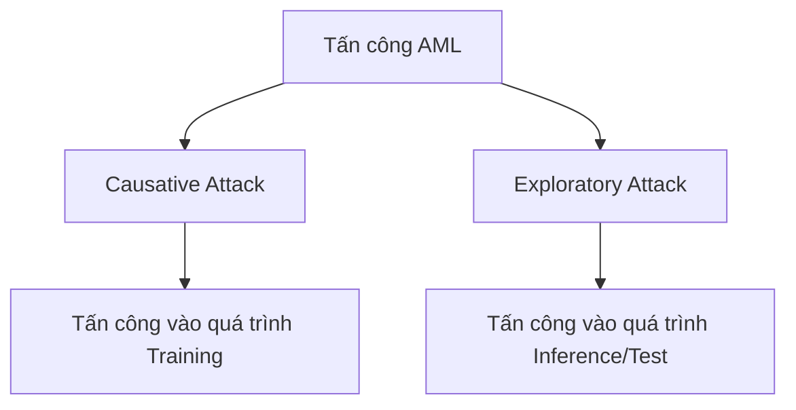
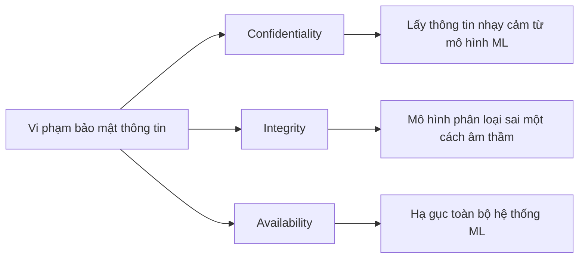
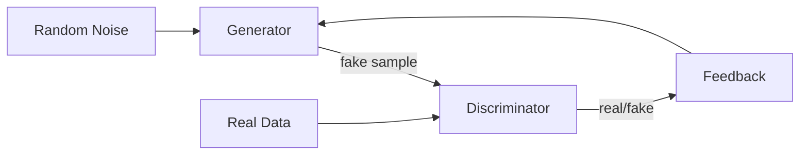

# Bài 10: Học máy đối kháng (Adversarial Machine Learning)

---

## 1. Tổng quan

### 1.1 Học máy trong thực tế

Học máy (Machine Learning - ML) ngày càng được ứng dụng rộng rãi trong nhiều lĩnh vực quan trọng:

- **Xe tự hành**: nhận diện biển báo, phát hiện chướng ngại vật
- **Y tế**: chẩn đoán hình ảnh, dự đoán bệnh
- **Thành phố thông minh**: quản lý giao thông, giám sát an ninh
- **Phân loại mã độc (Malware Classification)**: phân biệt phần mềm độc hại và lành tính
- **Phát hiện lừa đảo (Fraud Detection)**: phát hiện giao dịch bất thường
- **Nhận diện sinh trắc học (Biometrics Recognition)**: nhận diện khuôn mặt, vân tay

Chính vì mức độ phổ biến này, các hệ thống ML trở thành mục tiêu tấn công hấp dẫn.

---

### 1.2 Ví dụ trực quan về tấn công đối kháng

#### Ví dụ 1 – GoogLeNet (Goodfellow et al., ICLR 2015)

Một hình ảnh con gấu trúc được phân loại đúng với độ tin cậy 57.7%. Sau khi thêm nhiễu đối kháng cực nhỏ (không nhìn thấy bằng mắt thường), mô hình lại phân loại nhầm thành "gibbon" với độ tin cậy lên đến 99.3%.

Điều này cho thấy: một sự thay đổi rất nhỏ, có chủ đích trong dữ liệu đầu vào có thể khiến mô hình đưa ra kết quả sai hoàn toàn.

#### Ví dụ 2 – Tấn công trong thế giới thực (Evtimov et al., 2017)

Các nhiễu loạn đối kháng không chỉ tồn tại trong môi trường kỹ thuật số mà còn hiệu quả trong thế giới thực dưới nhiều điều kiện khác nhau:

- Góc độ và khoảng cách khác nhau
- Điều kiện ánh sáng thay đổi
- Sai số màu sắc khi in ấn và chụp lại bằng camera
- Thay đổi nền (background)

Ví dụ: biển báo "STOP" bị dán thêm nhãn in ấn đặc biệt có thể khiến hệ thống xe tự hành nhận diện nhầm thành biển báo "Yield" hoặc "Speed Limit".

---

## 2. Học máy đối kháng (Adversarial Machine Learning – AML)

### 2.1 Định nghĩa

**Học máy đối kháng (AML)** là lĩnh vực nghiên cứu các lỗ hổng của các hệ thống học máy khi chúng được triển khai trong môi trường đối kháng – tức là môi trường có sự hiện diện của kẻ tấn công cố tình phá hoại hoặc đánh lừa mô hình.

!!! info "Đặc điểm cốt lõi"
    Vấn đề chính trong AML là **kẻ xấu muốn không bị phát hiện** và **có thể chủ động thay đổi hành vi** để tránh bị phát hiện.

Các nhà nghiên cứu đã công bố nhiều nghiên cứu tấn công vào:

- Phần mềm diệt virus (antivirus)
- Bộ lọc thư rác (spam filter)
- Hệ thống phát hiện xâm nhập (IDS/IPS)
- Bộ phân loại ảnh
- Bộ phân tích tâm lý (sentiment analysis)

---

### 2.2 Nguồn gốc lỗ hổng trong ML

Các kỹ thuật ML thường được phát triển với các giả định lý tưởng:

- Dữ liệu training và testing lấy từ cùng một phân bố không đổi theo thời gian
- Các thuộc tính (features) độc lập với nhau và phân bố đều
- Thuật toán ML **không được thiết kế** để hoạt động trong môi trường đối kháng

Khi các giả định này bị phá vỡ, lỗ hổng xuất hiện. Nguyên nhân cốt lõi là **imperfect learning** (học không triệt để): mô hình không thể bao phủ toàn bộ không gian phân bố lý thuyết, tạo ra **không gian đối kháng (adversarial space)** – vùng dữ liệu nằm ngoài tập huấn luyện nhưng vẫn thuộc phân bố thực tế.

```
Không gian lý thuyết (Theoretical Distribution Space)
    ├── Tập Training Data
    ├── Tập Test Data
    └── Adversarial Space  <-- kẻ tấn công khai thác vùng này
```

---

## 3. Phân loại tấn công trong AML

### 3.1 Phân loại theo ảnh hưởng (Impact)



#### Causative Attack (Poisoning – Đầu độc)

Kẻ tấn công **can thiệp vào giai đoạn huấn luyện** bằng cách:

- Hiểu cơ chế hoạt động của thuật toán học
- Thao tác trên **thuộc tính** hoặc **nhãn** của tập training
- Thay đổi ranh giới phân loại của mô hình

**Ví dụ điển hình**: Flipping-label attack (đổi nhãn dữ liệu), Backdoor attack.

#### Exploratory Attack (Evasion – Qua mặt)

Kẻ tấn công **tương tác với hệ thống sau khi mô hình đã được huấn luyện**, tìm kiếm và khai thác không gian đối kháng:

- Thao tác trên thuộc tính của **dữ liệu test**
- Ngăn cản hoạt động phát hiện thông thường
- Thay đổi kết quả phân loại

**Ví dụ**: Brute-force fuzzing không gian đầu vào để tìm mẫu bị phân loại sai.

---

### 3.2 Phân loại theo đặc trưng (Specificity)

#### Indiscriminate Attack (Non-targeted – Không có mục tiêu cụ thể)

- Mục đích: khiến mô hình **đưa ra kết quả sai bất kỳ**, không quan tâm kết quả cuối là gì
- Dễ thực hiện hơn vì không cần kiểm soát nhãn đầu ra
- **Ví dụ**: Khiến mẫu thuộc họ malware A bị phân loại thành bất kỳ họ nào khác

#### Targeted Attack (Tấn công có mục tiêu)

- Mục đích: khiến mô hình phân loại sai **sang một nhãn cụ thể được chọn trước**
- Khó thực hiện hơn vì phải kiểm soát đầu ra
- **Ví dụ**: Khiến mẫu malware A bị phân loại chắc chắn thành malware B

---

### 3.3 Phân loại theo vi phạm CIA Triad



- **Confidentiality (Bảo mật)**: Tấn công nhằm trích xuất thông tin nhạy cảm từ mô hình (ví dụ: model inversion, membership inference)
- **Integrity (Toàn vẹn)**: Mô hình hoạt động sai nhưng âm thầm, không bị phát hiện
  - Phân loại sai source/target cụ thể (A → B)
  - Phân loại sai có mục tiêu (A → bất kỳ lớp nào khác)
  - Phân loại sai tổng quát
- **Availability (Sẵn sàng)**: Giảm khả năng sử dụng hoặc hạ gục hoàn toàn hệ thống

---

### 3.4 Phân loại theo mức độ hiểu biết của kẻ tấn công

=== "White-Box Attack"

    Kẻ tấn công **biết đầy đủ thông tin** về hệ thống ML:
    
    - Phân bố dữ liệu training
    - Kiến trúc mô hình
    - Thuật toán tối ưu được dùng
    - Trọng số (weights) và bias
    
    Đây là dạng tấn công mạnh nhất về lý thuyết, thường dùng để nghiên cứu giới hạn dưới của tính an toàn.

=== "Black-Box Attack"

    Kẻ tấn công **không biết gì về bên trong** hệ thống. Có 2 dạng:
    
    - **Hard label**: Chỉ nhận được nhãn dự đoán cuối cùng
    - **Confidence**: Nhận được nhãn dự đoán kèm điểm tin cậy (confidence score)
    
    Thực tế, hầu hết các hệ thống triển khai thương mại là black-box.

=== "Grey-Box Attack"

    Kẻ tấn công **biết một phần thông tin**:
    
    - Ví dụ: biết kiến trúc mô hình nhưng không biết dữ liệu training
    - Hoặc ngược lại: biết dữ liệu nhưng không biết kiến trúc

---

## 4. Tấn công Black-box – Framework chung

### 4.1 Zero-Query Attack

Kẻ tấn công **không cần truy vấn** mô hình mục tiêu, sử dụng:

- Thêm nhiễu ngẫu nhiên (random noise)
- Tính chênh lệch trung bình (mean difference)
- **Tấn công dựa trên chuyển nhượng (Transferability-based attacks)**
- Ensemble targeted black-box attacks dựa trên transferability

!!! note "Lưu ý"
    Zero-Query Attack là **trường hợp đặc biệt** của Query-Based Attack khi số lượng truy vấn = 0.

### 4.2 Query-Based Attack

Kẻ tấn công gửi truy vấn đến mô hình và quan sát phản hồi:

- **Ước tính gradient bằng sai phân hữu hạn (Finite Difference)**: xấp xỉ gradient bằng cách thay đổi nhỏ từng chiều
- **Ước tính gradient với ít truy vấn hơn**: các kỹ thuật giảm số lượng query

**Kết quả**: Hiệu quả tương đương tấn công White-box trong nhiều trường hợp.

---

## 5. Chuyển nhượng tấn công (Attack Transferability)

### 5.1 Khái niệm

**Chuyển nhượng tấn công** là hiện tượng: các mẫu đối kháng được thiết kế để đánh lừa **mô hình A** cũng có khả năng đánh lừa **mô hình B**, dù hai mô hình có thuật toán hoặc kiến trúc khác nhau.

Điều này rất nguy hiểm vì kẻ tấn công có thể:

1. Xây dựng một mô hình "surrogate" (mô hình thay thế) dựa trên dữ liệu có nhãn tự thu thập
2. Tạo mẫu đối kháng trên mô hình surrogate đó
3. Dùng các mẫu đó để tấn công mô hình black-box mục tiêu

### 5.2 Generative Adversarial Network (GAN)

GAN là thuật toán ML không giám sát sử dụng **2 mạng neuron cạnh tranh nhau**:



- **Generator**: Học cách tạo dữ liệu giả trông giống dữ liệu thật
- **Discriminator**: Học cách phân biệt dữ liệu thật và dữ liệu giả
- Hai mạng "đấu tay đôi" trong một trò chơi **zero-sum**: khi Discriminator giỏi hơn, Generator phải học giỏi hơn để vượt qua, và ngược lại.

!!! warning "Ứng dụng độc hại"
    Trong thực tế, GAN đã được dùng để **tạo ra tên miền C&C (Command & Control)** giả mạo nhằm qua mặt các hệ thống phát hiện tấn công dựa trên ML.

---

## 6. Kỹ thuật tấn công chi tiết

### 6.1 Tấn công Đầu độc (Poisoning Attack)

#### Cơ chế

Kẻ tấn công **chèn dữ liệu xấu vào tập huấn luyện** để mô hình học những điều không mong muốn. Các phương thức:

- **Thêm dòng dữ liệu**: gửi email hoặc request được thiết kế đặc biệt vào hệ thống
- **Thay đổi dòng dữ liệu**: tấn công vào server lưu trữ dữ liệu training
- **Xóa dữ liệu có chọn lọc**: loại bỏ các mẫu quan trọng

#### Phân loại theo mục tiêu

=== "Tấn công vào Availability"

    Thêm rất nhiều dữ liệu nhiễu vào hệ thống, khiến bất kỳ ranh giới phân loại nào mô hình học được đều vô dụng.
    
    **Ví dụ điển hình**: Label-flipping attack – đổi nhãn của các mẫu training (malware thành benign và ngược lại).

=== "Tấn công vào Integrity (Backdoor)"

    Backdoor là **một dạng input ẩn** mà người thiết kế mô hình không để ý, nhưng kẻ tấn công có thể lợi dụng để kích hoạt hành vi bất thường.
    
    **Ví dụ**: Biển báo "STOP" được dán thêm sticker nhỏ → mô hình nhận diện thành "Speed Limit 45" hoặc "Yield".
    
    Backdoor chỉ kích hoạt khi có **trigger** (dấu hiệu kích hoạt) cụ thể, còn trong điều kiện bình thường mô hình hoạt động bình thường → khó phát hiện.

#### Đối phó với Poisoning Attack

1. **Phát hiện bên ngoài – Data Sanitization & Anomaly Detection**
    - Ý tưởng: Dữ liệu bị đầu độc thường có đặc điểm bất thường so với phân bố chính
    - Thách thức: Nếu kẻ tấn công có thể truy cập "bên trong" quy trình, việc phát hiện trở nên khó hơn

2. **Phân tích ảnh hưởng của mẫu mới lên độ chính xác**
    - Ý tưởng: Chạy mẫu mới trong **sandbox** trước khi thêm vào tập huấn luyện; nếu độ chính xác trên tập test giảm đột ngột, mẫu đó có thể bị đầu độc
    - Giới hạn: Không có quy tắc nào đảm bảo chặn hoàn toàn tấn công đầu độc

!!! danger "Cảnh báo"
    Không có giải pháp nào đủ đúng và chính xác để chắc chắn chặn được tấn công đầu độc. Đây vẫn là bài toán mở trong nghiên cứu.

---

### 6.2 Tấn công Qua mặt (Evasion Attack)

#### Cơ chế

Kẻ tấn công **khai thác không gian đối kháng** để tìm mẫu x' sao cho:

- x ban đầu: được phân loại là **độc hại (malicious)**
- x': được phân loại là **lành tính (benign)**
- x và x' **trông gần giống nhau** (về mặt ngữ nghĩa hoặc thị giác)

#### Ví dụ cụ thể – Spam Filter Evasion

**Bước 1**: Mô hình spam filter có trọng số:

```
cheap    = +1.0
mortgage = +1.5
```

Email: "Cheap mortgage now!!!" → Tổng điểm = 2.5 > 1.0 (ngưỡng) → **SPAM**

**Bước 2**: Kẻ tấn công thêm từ có trọng số âm:

```
Joy     = -1.0
Oregon  = -1.0
```

Email sửa: "Cheap mortgage now!!! Joy Oregon" → Tổng điểm = 2.5 - 1.0 - 1.0 = 0.5 < 1.0 → **OK (không phải spam)**

Nội dung email thực chất vẫn là spam, nhưng đã qua mặt được bộ lọc bằng cách thêm các từ "vô hại".

#### Đối phó với Evasion Attack

=== "Adversarial Training (Tái huấn luyện đối kháng)"

    **Quy trình**:
    
    1. Bắt đầu với tập dữ liệu gốc
    2. Huấn luyện mô hình f ban đầu
    3. Tạo mẫu đối kháng x' từ các mẫu độc hại bằng phương pháp evasion
    4. Thêm x' vào tập training
    5. Huấn luyện lại mô hình
    6. Lặp lại cho đến khi:
        - Không còn mẫu mới để thêm
        - Đạt giới hạn số vòng lặp
        - Mô hình ít thay đổi giữa các vòng lặp

=== "Robust Learning bằng Regularization"

    Thêm các ràng buộc regularization vào quá trình huấn luyện để mô hình ít nhạy cảm hơn với các biến đổi nhỏ trong đầu vào.
    
    Ý tưởng: Thay vì minimize loss thông thường, minimize worst-case loss trong một vùng lân cận của mỗi điểm dữ liệu.

---

## 7. Tổng kết

!!! summary "Các điểm chính cần nhớ"

    1. **AML nghiên cứu lỗ hổng ML trong môi trường đối kháng** – nơi kẻ xấu chủ động can thiệp
    2. **Lỗ hổng phát sinh từ imperfect learning** – mô hình không bao phủ toàn bộ không gian phân bố thực tế
    3. **Hai loại tấn công chính**: Poisoning (can thiệp training) và Evasion (qua mặt khi inference)
    4. **Tấn công có thể transferable**: mẫu đối kháng tạo ra cho mô hình này có thể đánh lừa mô hình khác
    5. **Phòng thủ vẫn còn nhiều thách thức**: không có giải pháp hoàn hảo
    6. **AML không phải thất bại của ML**, mà là lời nhắc nhở về kỳ vọng thực tế và thiết kế hệ thống tốt hơn

!!! tip "Bài học thực tiễn"
    Điều kiện tiên quyết cho các giải pháp bảo mật dựa trên ML là **bản thân ML phải an toàn và mạnh mẽ**. Hiểu về các lỗ hổng trong môi trường đối kháng giúp giảm các giả định sai lầm về khả năng của ML.

---

---

## Câu hỏi trắc nghiệm

**Câu 1.** Học máy đối kháng (Adversarial Machine Learning – AML) nghiên cứu về điều gì?

- A. Các thuật toán học máy hiệu quả nhất
- B. Các lỗ hổng của học máy trong môi trường đối kháng
- C. Cách tăng tốc quá trình huấn luyện mô hình
- D. Phương pháp thu thập dữ liệu huấn luyện

??? info "Đáp án & Giải thích"
    **Đáp án: B**
    
    AML nghiên cứu các lỗ hổng của các hệ thống ML khi chúng bị tấn công bởi các tác nhân đối kháng có mục đích gây hại.

---

**Câu 2.** Vấn đề chính trong AML mà kẻ xấu muốn đạt được là gì?

- A. Lấy cắp mô hình ML
- B. Phá hủy phần cứng chạy ML
- C. Không bị phát hiện và có thể thay đổi hành vi để tránh bị phát hiện
- D. Làm chậm quá trình huấn luyện

??? info "Đáp án & Giải thích"
    **Đáp án: C**
    
    Mục tiêu chủ yếu của kẻ tấn công trong AML là **tránh bị phát hiện** và có khả năng **thay đổi hành vi linh hoạt** để tiếp tục né tránh hệ thống phòng thủ.

---

**Câu 3.** Nguyên nhân cốt lõi tạo ra không gian đối kháng (adversarial space) trong ML là gì?

- A. Phần cứng không đủ mạnh để huấn luyện
- B. Dữ liệu training quá nhiều
- C. Imperfect learning – học không triệt để
- D. Thuật toán tối ưu quá phức tạp

??? info "Đáp án & Giải thích"
    **Đáp án: C**
    
    Vì mô hình không thể bao phủ toàn bộ không gian phân bố lý thuyết, luôn tồn tại các vùng dữ liệu (adversarial space) mà mô hình có thể bị đánh lừa.

---

**Câu 4.** Causative Attack (Poisoning Attack) nhắm vào giai đoạn nào của vòng đời ML?

- A. Giai đoạn inference (kiểm thử)
- B. Giai đoạn triển khai (deployment)
- C. Giai đoạn huấn luyện (training)
- D. Giai đoạn thu thập dữ liệu

??? info "Đáp án & Giải thích"
    **Đáp án: C**
    
    Poisoning attack can thiệp vào **quá trình huấn luyện** bằng cách giả mạo dữ liệu training hoặc tham số training.

---

**Câu 5.** Exploratory Attack (Evasion Attack) nhắm vào giai đoạn nào?

- A. Giai đoạn huấn luyện
- B. Giai đoạn inference/test sau khi mô hình đã được huấn luyện
- C. Giai đoạn thiết kế kiến trúc mô hình
- D. Giai đoạn lưu trữ dữ liệu

??? info "Đáp án & Giải thích"
    **Đáp án: B**
    
    Evasion attack tương tác với hệ thống **sau khi mô hình đã được train**, tìm và khai thác không gian đối kháng trong quá trình inference.

---

**Câu 6.** Indiscriminate Attack khác Targeted Attack ở điểm gì?

- A. Indiscriminate không cần truy cập dữ liệu training
- B. Indiscriminate không quan tâm nhãn đầu ra sai là gì, Targeted muốn đầu ra sai thành một nhãn cụ thể
- C. Targeted dễ thực hiện hơn
- D. Indiscriminate chỉ tấn công được black-box model

??? info "Đáp án & Giải thích"
    **Đáp án: B**
    
    **Indiscriminate**: chỉ cần mô hình phân loại sai, không quan tâm sai thành gì. **Targeted**: muốn mô hình phân loại thành một nhãn cụ thể do kẻ tấn công chọn trước.

---

**Câu 7.** Tấn công nào trong CIA Triad khiến mô hình ML phân loại sai một cách âm thầm?

- A. Confidentiality
- B. Availability
- C. Integrity
- D. Authentication

??? info "Đáp án & Giải thích"
    **Đáp án: C**
    
    Tấn công vào **Integrity** khiến mô hình đưa ra kết quả sai nhưng **âm thầm**, không bị phát hiện – đây là dạng nguy hiểm nhất.

---

**Câu 8.** Tấn công nào nhắm vào Availability của hệ thống ML?

- A. Tấn công nhằm lấy thông tin từ mô hình
- B. Tấn công nhằm hạ gục hoàn toàn hệ thống ML
- C. Tấn công nhằm phân loại sai một mẫu cụ thể
- D. Tấn công nhằm thay đổi kiến trúc mô hình

??? info "Đáp án & Giải thích"
    **Đáp án: B**
    
    Tấn công Availability nhằm **giảm hoặc loại bỏ hoàn toàn** khả năng sử dụng của hệ thống ML.

---

**Câu 9.** Trong White-Box Attack, kẻ tấn công biết được những thông tin nào?

- A. Chỉ biết nhãn đầu ra của mô hình
- B. Biết phân bố dữ liệu, kiến trúc, thuật toán tối ưu, weights và bias
- C. Chỉ biết loại thuật toán được dùng
- D. Không biết gì về hệ thống

??? info "Đáp án & Giải thích"
    **Đáp án: B**
    
    White-Box Attack giả định kẻ tấn công có đầy đủ thông tin về hệ thống ML, bao gồm dữ liệu, kiến trúc, thuật toán tối ưu, weights và bias.

---

**Câu 10.** Sự khác nhau giữa "hard label" và "confidence" trong Black-Box Attack là gì?

- A. Hard label nhanh hơn, confidence chậm hơn
- B. Hard label chỉ nhận được nhãn dự đoán, confidence nhận được nhãn kèm điểm tin cậy
- C. Hard label dùng cho white-box, confidence dùng cho black-box
- D. Không có sự khác nhau

??? info "Đáp án & Giải thích"
    **Đáp án: B**
    
    **Hard label**: attacker chỉ nhận được nhãn phân loại cuối cùng. **Confidence**: attacker nhận được cả nhãn và điểm tin cậy (probability score), cung cấp nhiều thông tin hơn để tấn công.

---

**Câu 11.** Attack Transferability có nghĩa là gì?

- A. Kẻ tấn công chuyển dữ liệu từ mô hình này sang mô hình khác
- B. Mẫu đối kháng tạo ra để đánh lừa mô hình A cũng có thể đánh lừa mô hình B dù kiến trúc khác nhau
- C. Kỹ thuật tấn công được chia sẻ giữa các nhóm hacker
- D. Mô hình ML được chuyển từ môi trường training sang production

??? info "Đáp án & Giải thích"
    **Đáp án: B**
    
    Transferability là hiện tượng mẫu đối kháng có tính "di chuyển" – hiệu quả trên nhiều mô hình khác nhau, ngay cả khi kiến trúc và thuật toán khác nhau.

---

**Câu 12.** Zero-Query Attack là trường hợp đặc biệt của loại tấn công nào?

- A. White-Box Attack
- B. Grey-Box Attack
- C. Query-Based Attack khi số lượng truy vấn = 0
- D. Poisoning Attack

??? info "Đáp án & Giải thích"
    **Đáp án: C**
    
    Zero-Query Attack là trường hợp giới hạn của Query-Based Attack khi kẻ tấn công không gửi bất kỳ truy vấn nào đến mô hình mục tiêu.

---

**Câu 13.** GAN (Generative Adversarial Network) sử dụng cơ chế gì?

- A. Một mạng neuron duy nhất học từ dữ liệu có nhãn
- B. Hai mạng neuron cạnh tranh nhau trong trò chơi zero-sum
- C. Nhiều mạng neuron hợp tác cùng nhau
- D. Một mạng neuron học từ dữ liệu không có nhãn bằng clustering

??? info "Đáp án & Giải thích"
    **Đáp án: B**
    
    GAN dùng **Generator** và **Discriminator** đấu tay đôi: Generator cố tạo dữ liệu giả trông thật, Discriminator cố phân biệt thật/giả – đây là trò chơi zero-sum.

---

**Câu 14.** Trong GAN, vai trò của Generator là gì?

- A. Phân biệt dữ liệu thật và dữ liệu giả
- B. Tạo ra dữ liệu giả từ nhiễu ngẫu nhiên để đánh lừa Discriminator
- C. Kiểm tra độ chính xác của mô hình
- D. Lưu trữ dữ liệu training

??? info "Đáp án & Giải thích"
    **Đáp án: B**
    
    Generator nhận đầu vào là nhiễu ngẫu nhiên (random noise) và học cách tạo ra dữ liệu giả trông giống dữ liệu thật đến mức Discriminator không thể phân biệt.

---

**Câu 15.** GAN được ứng dụng độc hại như thế nào trong bối cảnh bảo mật?

- A. Tấn công từ chối dịch vụ (DDoS)
- B. Tạo tên miền C&C giả để qua mặt hệ thống phát hiện tấn công dựa trên ML
- C. Đánh cắp mật khẩu
- D. Tấn công SQL injection

??? info "Đáp án & Giải thích"
    **Đáp án: B**
    
    Trong thực tế, GAN đã được dùng để tạo ra các **tên miền Command & Control (C&C)** giả mạo trông giống tên miền hợp lệ, nhằm qua mặt các hệ thống phát hiện dựa trên ML.

---

**Câu 16.** Label-flipping attack là ví dụ của loại tấn công nào?

- A. Evasion attack nhắm vào Integrity
- B. Poisoning attack nhắm vào Availability
- C. White-box attack
- D. Query-based attack

??? info "Đáp án & Giải thích"
    **Đáp án: B**
    
    Label-flipping đổi nhãn của dữ liệu training (ví dụ: malware thành benign) khiến mô hình học sai, hướng đến phá hoại **Availability** của hệ thống phân loại.

---

**Câu 17.** Backdoor attack hoạt động theo cơ chế nào?

- A. Tấn công trực tiếp vào server lưu trữ mô hình
- B. Chèn trigger ẩn vào dữ liệu training khiến mô hình hành xử bình thường trong đa số trường hợp nhưng sai khi gặp trigger
- C. Thêm nhiễu vào dữ liệu test
- D. Thay đổi hyperparameter của mô hình

??? info "Đáp án & Giải thích"
    **Đáp án: B**
    
    Backdoor được kích hoạt bởi **trigger** cụ thể (ví dụ: một sticker đặc biệt trên biển báo). Khi không có trigger, mô hình hoạt động bình thường – đây là lý do backdoor rất khó phát hiện.

---

**Câu 18.** Phương pháp Data Sanitization trong phòng thủ Poisoning Attack hoạt động dựa trên ý tưởng gì?

- A. Mã hóa toàn bộ dữ liệu training
- B. Dữ liệu bị đầu độc thường có đặc điểm bất thường so với phân bố chính
- C. Kiểm tra tất cả dữ liệu bằng tay
- D. Giới hạn số lượng dữ liệu training

??? info "Đáp án & Giải thích"
    **Đáp án: B**
    
    Ý tưởng của data sanitization là phát hiện các điểm dữ liệu **bất thường** (outlier) trong tập training – vì khi tấn công đầu độc, attacker thường thêm những thứ rất khác biệt với phân bố bình thường.

---

**Câu 19.** Phương pháp Sandbox testing trong phòng thủ Poisoning Attack là gì?

- A. Cô lập mô hình ML khỏi internet
- B. Chạy mẫu mới trong môi trường cô lập để kiểm tra xem nó có làm giảm độ chính xác của mô hình không trước khi thêm vào training
- C. Backup dữ liệu training thường xuyên
- D. Mã hóa dữ liệu training

??? info "Đáp án & Giải thích"
    **Đáp án: B**
    
    Trước khi thêm mẫu mới vào tập training, hệ thống chạy thử trong sandbox để đánh giá ảnh hưởng. Nếu độ chính xác trên tập test giảm đột ngột, mẫu đó có thể bị đầu độc.

---

**Câu 20.** Trong ví dụ Evasion Attack vào spam filter, kẻ tấn công đã làm gì?

- A. Xóa bỏ các từ spam khỏi email
- B. Thêm các từ có trọng số âm vào email để hạ điểm tổng xuống dưới ngưỡng phát hiện
- C. Mã hóa nội dung email
- D. Gửi email với tần suất thấp hơn

??? info "Đáp án & Giải thích"
    **Đáp án: B**
    
    Kẻ tấn công thêm các từ như "Joy", "Oregon" có trọng số âm (-1.0 mỗi từ) khiến tổng điểm spam giảm từ 2.5 xuống 0.5 – dưới ngưỡng 1.0 – nên email được phân loại là hợp lệ.

---

**Câu 21.** Adversarial Training (tái huấn luyện đối kháng) phòng thủ Evasion Attack bằng cách nào?

- A. Tăng kích thước mô hình
- B. Liên tục tạo mẫu đối kháng và thêm vào tập training để mô hình học cách xử lý chúng
- C. Giảm learning rate
- D. Thêm nhiều lớp mạng neuron hơn

??? info "Đáp án & Giải thích"
    **Đáp án: B**
    
    Adversarial training là vòng lặp: huấn luyện mô hình → tạo mẫu đối kháng → thêm vào training set → huấn luyện lại. Quá trình này giúp mô hình trở nên **robust** hơn với các mẫu đối kháng.

---

**Câu 22.** Tại sao hầu hết các giải pháp ML hoạt động dạng black-box khiến AML trở nên khó?

- A. Vì black-box chạy nhanh hơn
- B. Vì không thể tiếp cận thông tin nội bộ để phân tích và thiết kế phòng thủ hiệu quả
- C. Vì black-box cần nhiều dữ liệu hơn
- D. Vì black-box không thể bị tấn công

??? info "Đáp án & Giải thích"
    **Đáp án: B**
    
    Khi không có thông tin về bên trong mô hình (kiến trúc, trọng số), việc phân tích lỗ hổng và thiết kế phòng thủ trở nên rất khó khăn.

---

**Câu 23.** Giả định nào của các kỹ thuật ML truyền thống thường bị phá vỡ trong môi trường đối kháng?

- A. Dữ liệu phải được mã hóa
- B. Tập training và testing lấy từ phân bố không đổi theo thời gian, các thuộc tính độc lập nhau
- C. Mô hình phải có ít nhất 3 lớp ẩn
- D. Dữ liệu phải được chuẩn hóa

??? info "Đáp án & Giải thích"
    **Đáp án: B**
    
    Trong môi trường đối kháng, kẻ tấn công chủ động thay đổi phân bố dữ liệu và tạo ra sự phụ thuộc giữa các thuộc tính, phá vỡ giả định của ML truyền thống.

---

**Câu 24.** Điều gì xảy ra với biển báo "STOP" trong ví dụ về tấn công thế giới thực?

- A. Bị xóa khỏi bản đồ
- B. Bị dán thêm nhãn đặc biệt khiến hệ thống nhận diện nhầm thành "Yield" hoặc "Speed Limit"
- C. Bị thay thế bằng biển giả
- D. Bị chiếu ánh sáng bất thường

??? info "Đáp án & Giải thích"
    **Đáp án: B**
    
    Đây là ví dụ về **backdoor/adversarial patch** trong thế giới thực: các nhãn in ấn (sticker) đặc biệt được thiết kế để đánh lừa hệ thống nhận diện biển báo của xe tự hành.

---

**Câu 25.** Query-Based Attack sử dụng kỹ thuật gì để ước tính gradient?

- A. Backpropagation trực tiếp
- B. Ước tính gradient bằng sai phân hữu hạn (Finite Difference)
- C. Tính toán gradient theo công thức giải tích
- D. Lấy mẫu ngẫu nhiên

??? info "Đáp án & Giải thích"
    **Đáp án: B**
    
    Finite Difference ước tính gradient bằng cách thay đổi nhỏ từng chiều đầu vào và quan sát sự thay đổi đầu ra. Phương pháp này không cần biết nội bộ mô hình.

---

**Câu 26.** Phân bố của mẫu đối kháng nằm ở đâu so với tập training?

- A. Hoàn toàn nằm trong tập training
- B. Nằm trong vùng "adversarial space" – ngoài tập training nhưng vẫn thuộc phân bố thực tế
- C. Nằm hoàn toàn ngoài phân bố thực tế
- D. Trùng với tập test

??? info "Đáp án & Giải thích"
    **Đáp án: B**
    
    Adversarial space là vùng thuộc phân bố lý thuyết thực tế nhưng **không có trong tập training**, do imperfect learning tạo ra.

---

**Câu 27.** Kết quả của Query-Based Attack so với White-Box Attack như thế nào?

- A. Kém hơn rất nhiều
- B. Tương đương trong nhiều trường hợp
- C. Tốt hơn vì không cần thông tin nội bộ
- D. Không thể so sánh

??? info "Đáp án & Giải thích"
    **Đáp án: B**
    
    Các nghiên cứu cho thấy Query-Based Attack có thể đạt **hiệu quả tương đương** White-Box Attack, điều này rất đáng lo ngại vì kẻ tấn công không cần biết bên trong mô hình.

---

**Câu 28.** Tấn công Poisoning có thể thực hiện bằng cách nào sau đây?

- A. Chỉ thêm dữ liệu mới
- B. Thêm, thay đổi, hoặc xóa có chọn lọc các mẫu training
- C. Chỉ thay đổi nhãn của dữ liệu
- D. Chỉ xóa dữ liệu

??? info "Đáp án & Giải thích"
    **Đáp án: B**
    
    Poisoning attack có thể thực hiện qua 3 cách: **thêm** dòng dữ liệu, **thay đổi** dòng dữ liệu (tấn công server lưu trữ), hoặc **xóa có chọn lọc** một số dòng dữ liệu.

---

**Câu 29.** Tại sao Backdoor attack khó phát hiện hơn Label-flipping attack?

- A. Backdoor không thay đổi dữ liệu training
- B. Mô hình có backdoor hoạt động bình thường trong đa số trường hợp, chỉ sai khi gặp trigger cụ thể
- C. Backdoor chỉ ảnh hưởng đến một lớp dữ liệu
- D. Backdoor không cần truy cập dữ liệu training

??? info "Đáp án & Giải thích"
    **Đáp án: B**
    
    Mô hình có backdoor hoạt động **bình thường** trong hầu hết trường hợp, chỉ phát sinh lỗi khi gặp trigger cụ thể. Điều này khiến việc phát hiện rất khó trong quá trình kiểm thử thông thường.

---

**Câu 30.** Trong bối cảnh AML, "surrogate model" được sử dụng để làm gì?

- A. Thay thế mô hình gốc khi bị tấn công
- B. Tạo mô hình nội bộ tương tự mô hình black-box mục tiêu để tạo mẫu đối kháng transferable
- C. Kiểm tra độ chính xác của mô hình chính
- D. Lưu trữ backup của mô hình

??? info "Đáp án & Giải thích"
    **Đáp án: B**
    
    Kẻ tấn công xây dựng surrogate model từ dữ liệu có nhãn tự thu thập, tạo mẫu đối kháng trên đó, rồi dùng tính transferability để tấn công mô hình black-box mục tiêu.

---

**Câu 31.** Robust Learning bằng Regularization phòng thủ Evasion Attack theo nguyên lý nào?

- A. Tăng kích thước tập training
- B. Ràng buộc quá trình training để mô hình ít nhạy cảm với biến đổi nhỏ trong đầu vào
- C. Giảm độ phức tạp của mô hình
- D. Tăng ngưỡng phân loại

??? info "Đáp án & Giải thích"
    **Đáp án: B**
    
    Regularization trong bối cảnh adversarial robustness hướng đến **minimize worst-case loss** trong vùng lân cận của mỗi điểm dữ liệu, thay vì chỉ minimize loss trung bình.

---

**Câu 32.** Nhận định nào đúng về việc phòng thủ tấn công đầu độc?

- A. Có thể chặn hoàn toàn bằng mã hóa dữ liệu
- B. Không có giải pháp nào đảm bảo chặn hoàn toàn
- C. Adversarial training đủ để phòng thủ
- D. Chỉ cần kiểm tra dữ liệu thủ công là đủ

??? info "Đáp án & Giải thích"
    **Đáp án: B**
    
    Bài giảng nhấn mạnh: "Không có rule đủ đúng và chính xác chắc chắn chặn được tấn công đầu độc". Đây vẫn là bài toán mở trong nghiên cứu.

---

**Câu 33.** Poisoning attack và Evasion attack khác nhau về thời điểm tấn công như thế nào?

- A. Cả hai đều tấn công trong quá trình huấn luyện
- B. Poisoning tấn công giai đoạn training, Evasion tấn công giai đoạn inference
- C. Cả hai đều tấn công trong quá trình inference
- D. Poisoning tấn công sau khi deploy, Evasion tấn công trước khi deploy

??? info "Đáp án & Giải thích"
    **Đáp án: B**
    
    Đây là phân biệt cơ bản nhất: **Poisoning** → can thiệp vào **training**; **Evasion** → tấn công trong **inference** sau khi mô hình đã được huấn luyện và triển khai.

---

**Câu 34.** Ensemble Targeted Black-box Attack dựa trên nguyên lý gì?

- A. Tấn công nhiều mô hình cùng lúc
- B. Sử dụng nhiều mô hình white-box để tạo mẫu đối kháng có tính transferable cao hơn đến mô hình black-box mục tiêu
- C. Kết hợp nhiều kỹ thuật tấn công khác nhau
- D. Sử dụng nhiều attacker cùng lúc

??? info "Đáp án & Giải thích"
    **Đáp án: B**
    
    Bằng cách tạo mẫu đối kháng đánh lừa **ensemble nhiều mô hình** white-box cùng lúc, khả năng transferability đến mô hình black-box mục tiêu tăng lên đáng kể.

---

**Câu 35.** Tấn công vào tính Confidentiality của hệ thống ML nhằm mục đích gì?

- A. Làm hỏng mô hình
- B. Lấy được thông tin nhạy cảm từ hệ thống ML (ví dụ: dữ liệu training, tham số mô hình)
- C. Phân loại sai dữ liệu
- D. Làm chậm quá trình inference

??? info "Đáp án & Giải thích"
    **Đáp án: B**
    
    Ví dụ: Model Inversion Attack cố gắng tái tạo dữ liệu training từ mô hình, Membership Inference Attack xác định dữ liệu nào đã được dùng để training – cả hai đều vi phạm Confidentiality.

---

**Câu 36.** Điều kiện tiên quyết nào được nhấn mạnh cho các giải pháp bảo mật dựa trên ML?

- A. Dữ liệu training phải lớn
- B. Bản thân ML phải an toàn và mạnh mẽ
- C. Phải sử dụng deep learning
- D. Phải có GPU mạnh

??? info "Đáp án & Giải thích"
    **Đáp án: B**
    
    Nếu bản thân ML không an toàn, không thể xây dựng giải pháp bảo mật đáng tin cậy trên nền tảng đó. Đây là điểm xuất phát của nghiên cứu AML.

---

**Câu 37.** Nhận định nào ĐÚNG về tấn công Poisoning và Evasion trong bức tranh tổng quan AML?

- A. Chúng chứng minh ML hoàn toàn thất bại và không nên dùng trong bảo mật
- B. Chúng chỉ ra các kỳ vọng không đúng về ML và thúc đẩy thiết kế hệ thống tốt hơn
- C. Chúng chỉ ảnh hưởng đến các mô hình cũ
- D. Chúng không thể được phòng thủ

??? info "Đáp án & Giải thích"
    **Đáp án: B**
    
    Bài giảng nhấn mạnh: tấn công Poisoning và Evasion "không phải minh chứng cho sự thất bại của ML" mà chỉ ra các **quy chuẩn không đúng về kỳ vọng**, từ đó thúc đẩy thiết kế tốt hơn.

---

**Câu 38.** Kỹ thuật tấn công nào được GAN hỗ trợ trong bối cảnh C&C domain generation?

- A. Poisoning attack
- B. Physical adversarial attack
- C. Tạo tên miền C&C giả mạo để qua mặt ML-based detection
- D. Label-flipping attack

??? info "Đáp án & Giải thích"
    **Đáp án: C**
    
    GAN được dùng để tạo tên miền giả mạo trông giống tên miền hợp lệ (DGA – Domain Generation Algorithm với sự hỗ trợ của GAN), nhằm qua mặt các hệ thống phát hiện C&C traffic.

---

**Câu 39.** Trong ví dụ GoogLeNet, mức độ tin cậy thay đổi như thế nào sau khi thêm nhiễu đối kháng?

- A. Từ 57.7% (đúng) xuống 10% (sai)
- B. Từ 57.7% (đúng) lên 99.3% (sai – nhận nhầm thành gibbon)
- C. Từ 99.3% (đúng) xuống 57.7% (sai)
- D. Không thay đổi đáng kể

??? info "Đáp án & Giải thích"
    **Đáp án: B**
    
    Đây là điểm đặc biệt nguy hiểm: nhiễu đối kháng không chỉ khiến mô hình phân loại sai mà còn **tăng độ tin cậy** (confidence) của kết quả sai lên 99.3%, khiến mô hình "tự tin" với câu trả lời sai.

---

**Câu 40.** Grey-Box Attack có đặc điểm gì so với White-Box và Black-Box?

- A. Chỉ tấn công được mô hình đơn giản
- B. Kẻ tấn công biết một phần thông tin (ví dụ: biết kiến trúc nhưng không biết dữ liệu training hoặc ngược lại)
- C. Kẻ tấn công biết toàn bộ nhưng không dùng hết
- D. Grey-Box Attack không tồn tại trong thực tế

??? info "Đáp án & Giải thích"
    **Đáp án: B**
    
    Grey-Box nằm ở giữa: kẻ tấn công có **thông tin không đầy đủ** về hệ thống – có thể biết kiến trúc mô hình nhưng không biết dữ liệu training, hoặc ngược lại.

---

**Câu 41.** Khi nào quá trình Adversarial Training dừng lại?

- A. Khi mô hình đạt 100% độ chính xác
- B. Khi không còn mẫu mới để thêm, hoặc đạt giới hạn vòng lặp, hoặc mô hình ít thay đổi giữa các vòng lặp liên tiếp
- C. Sau một số lần cố định
- D. Khi tập training đạt kích thước nhất định

??? info "Đáp án & Giải thích"
    **Đáp án: B**
    
    Có 3 điều kiện dừng: (1) không còn mẫu mới, (2) đạt giới hạn số vòng lặp, (3) mô hình ổn định (ít thay đổi giữa các vòng lặp).

---

**Câu 42.** Tại sao các perturbation (nhiễu) đối kháng nguy hiểm trong thế giới thực?

- A. Chúng rất dễ nhìn thấy bằng mắt thường
- B. Chúng tồn tại và hiệu quả dưới nhiều điều kiện vật lý khác nhau (góc độ, khoảng cách, ánh sáng)
- C. Chúng chỉ hoạt động trong môi trường kỹ thuật số
- D. Chúng cần thiết bị đặc biệt để tạo ra

??? info "Đáp án & Giải thích"
    **Đáp án: B**
    
    Evtimov et al. (2017) chứng minh nhiễu đối kháng **bền vững** trong điều kiện vật lý thực tế: nhiều góc độ, khoảng cách, ánh sáng khác nhau – đây là điểm khiến chúng đặc biệt nguy hiểm cho hệ thống như xe tự hành.

---

**Câu 43.** Thách thức chính của Data Sanitization khi phòng thủ Poisoning Attack là gì?

- A. Chi phí tính toán quá cao
- B. Nếu attacker kiểm soát được "bên trong" quy trình sanitization, việc phát hiện trở nên vô hiệu
- C. Không thể áp dụng cho dữ liệu lớn
- D. Cần nhiều chuyên gia để thực hiện

??? info "Đáp án & Giải thích"
    **Đáp án: B**
    
    Bài giảng đặt câu hỏi "bên trong?" như một thách thức: nếu attacker đã xâm nhập vào chính quy trình kiểm tra, phòng thủ mất hiệu quả.

---

**Câu 44.** Tại sao Targeted Attack khó thực hiện hơn Indiscriminate Attack?

- A. Targeted Attack cần nhiều tài nguyên tính toán hơn
- B. Targeted Attack phải kiểm soát đầu ra sai thành một nhãn cụ thể, trong khi Indiscriminate chỉ cần gây ra bất kỳ lỗi nào
- C. Targeted Attack chỉ áp dụng được với white-box model
- D. Targeted Attack cần nhiều dữ liệu training hơn

??? info "Đáp án & Giải thích"
    **Đáp án: B**
    
    Việc kiểm soát **hướng** của lỗi (sai về một nhãn cụ thể) khó hơn nhiều so với chỉ cần gây ra lỗi bất kỳ.

---

**Câu 45.** Ứng dụng ML nào sau đây KHÔNG được đề cập trong bài giảng như lĩnh vực dễ bị tấn công đối kháng?

- A. Phân loại mã độc
- B. Phát hiện lừa đảo
- C. Quản lý cơ sở dữ liệu
- D. Nhận diện sinh trắc học

??? info "Đáp án & Giải thích"
    **Đáp án: C**
    
    Bài giảng đề cập: xe tự hành, y tế, thành phố thông minh, phân loại mã độc, phát hiện lừa đảo, nhận diện sinh trắc học. Quản lý cơ sở dữ liệu không được đề cập.

---

**Câu 46.** Imperfect learning dẫn đến hệ quả gì trong bối cảnh AML?

- A. Mô hình cần nhiều RAM hơn
- B. Xuất hiện adversarial space – vùng mà mô hình dễ bị đánh lừa
- C. Quá trình training chậm hơn
- D. Mô hình overfitting

??? info "Đáp án & Giải thích"
    **Đáp án: B**
    
    Do không thể học triệt để toàn bộ không gian phân bố thực tế, mô hình luôn có "điểm mù" – **adversarial space** – nơi kẻ tấn công có thể khai thác.

---

**Câu 47.** Theo bài giảng, lỗ hổng trong hệ thống ML có thể do những nguyên nhân nào?

- A. Chỉ do lỗi khi thiết kế hệ thống
- B. Chỉ do giới hạn của thuật toán
- C. Lỗi thiết kế, giới hạn thuật toán, hoặc kết hợp cả hai
- D. Chỉ do thiếu dữ liệu

??? info "Đáp án & Giải thích"
    **Đáp án: C**
    
    Bài giảng nêu rõ: lỗ hổng có thể do **lỗi khi thiết kế hệ thống**, **giới hạn của thuật toán**, hoặc **kết hợp cả hai**.

---

**Câu 48.** Mục tiêu của Evasion Attack khác với Poisoning Attack như thế nào về phương diện đối tượng tấn công?

- A. Evasion tấn công dữ liệu training, Poisoning tấn công dữ liệu test
- B. Evasion thao tác trên dữ liệu test/đầu vào, Poisoning thao tác trên dữ liệu training
- C. Cả hai đều tấn công dữ liệu test
- D. Không có sự khác biệt

??? info "Đáp án & Giải thích"
    **Đáp án: B**
    
    **Poisoning**: thao tác trên **thuộc tính hoặc nhãn của tập training**. **Evasion**: thao tác trên **thuộc tính của dữ liệu test** (đầu vào khi inference).

---

**Câu 49.** Theo tài liệu tham khảo chính (Chio & Freeman, 2018), AML được đề cập ở chương nào?

- A. Chương 1
- B. Chương 5
- C. Chương 8
- D. Chương 12

??? info "Đáp án & Giải thích"
    **Đáp án: C**
    
    Tài liệu tham khảo chính là "Machine Learning & Security" của Chio & Freeman (2018), **Chapter 8**, được trích dẫn nhiều lần trong bài giảng.

---

**Câu 50.** Hiểu biết về các lỗ hổng AML có ý nghĩa thực tiễn gì theo bài giảng?

- A. Giúp chứng minh ML không nên dùng trong bảo mật
- B. Thúc đẩy thiết kế hệ thống tốt hơn và giảm các giả định sai lầm về khả năng của ML
- C. Giúp phát triển ML nhanh hơn
- D. Chứng minh cần phải thay thế ML bằng các phương pháp truyền thống

??? info "Đáp án & Giải thích"
    **Đáp án: B**
    
    Bài giảng kết luận: "Biết về các loại lỗ hổng khác nhau của ML trong môi trường đối kháng có thể **thúc đẩy các thiết kế hệ thống tốt hơn** và giúp giảm số lượng các giả định sai lầm về khả năng của ML."
