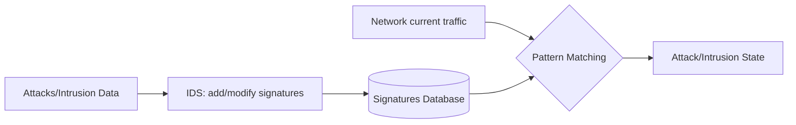
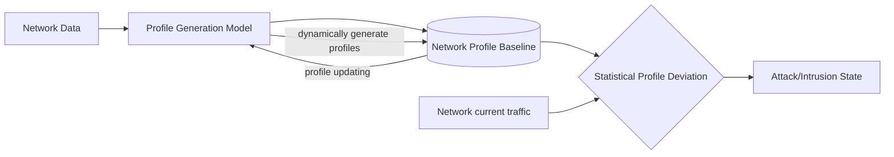
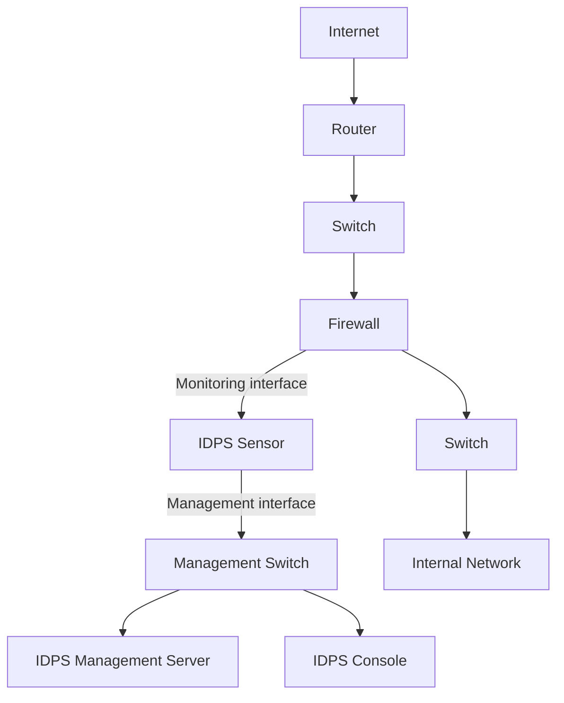
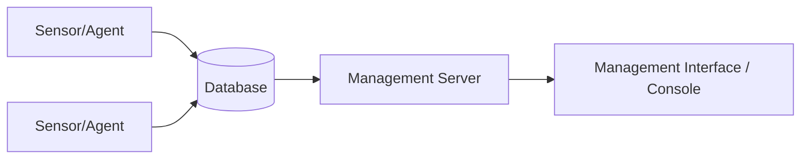
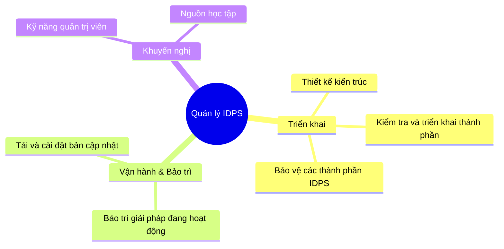

# Bài 2: Tổng quan IDPS

---

## Mục lục

1. Các khái niệm IDPS
2. Phân loại IDPS
3. Các công nghệ IDPS

---

## 1. Nhắc lại khái niệm

!!! info "Định nghĩa IDPS"
    **Hệ thống tìm kiếm, phát hiện và ngăn ngừa xâm nhập (IDPS)** chủ yếu tập trung vào:

    - Xác định các sự cố có thể xảy ra
    - Ghi nhận các thông tin liên quan
    - Cố gắng ngăn chặn
    - Báo cáo cho các quản trị viên bảo mật

    **Mục tiêu:** Đảm bảo an toàn cho mạng hoặc hệ thống máy tính theo **bộ ba CIA**.

??? question "Câu hỏi thảo luận"
    1. Điểm khác biệt giữa IDS và IPS?
    2. Mô tả ít nhất 3 dạng tấn công và dấu hiệu để nhận biết chúng?
    3. Có bao nhiêu loại IDPS? (dựa trên nguồn dữ liệu và kỹ thuật phát hiện tấn công)
    4. Có thể đặt IDPS ở đâu trong một mạng? Nó có thể thay thế các hệ thống phòng thủ khác?

---

## 2. Phân loại IDPS

IDPS được phân loại dựa trên **hai tiêu chí chính**:

```
IDPS
├── Dựa trên Kỹ thuật phát hiện tấn công
│   ├── Signature-based
│   ├── Anomaly-based
│   ├── Specification-based
│   └── Hybrid
└── Dựa trên Nguồn dữ liệu
    ├── Network-based (NIDPS)
    ├── Host-based (HIDPS)
    └── Hybrid
```

---

### 2.1 Phân loại theo Kỹ thuật phát hiện

#### Signature-Based Detection

!!! abstract "Định nghĩa"
    **Signature** là một mẫu tương ứng với một nguy cơ tấn công — cơ sở dữ liệu về các tấn công đã biết trước.

    **Kỹ thuật Signature-based** (còn gọi là *knowledge-based*) là quá trình **so sánh các signature với các sự kiện quan sát được** để xác định các sự cố có thể có.

**Ví dụ:**

- Kết nối `telnet` với `username = root` → dấu hiệu vi phạm chính sách bảo mật
- Email tiêu đề `"Free pictures!"` với file đính kèm `freepics.exe` → đặc điểm của malware đã biết



!!! success "Ưu điểm"
    - Độ chính xác cao khi phát hiện các tấn công đã biết
    - Tỉ lệ cảnh báo sai (false positive) thấp

!!! danger "Nhược điểm"
    - **Không thể** phát hiện các hành vi bất thường chưa biết trước hoặc các biến đổi nhỏ trong tấn công đã biết
    - → Yêu cầu **cập nhật liên tục** cơ sở dữ liệu signature
    - Việc triển khai và cập nhật signature **khó và tốn thời gian**

---

#### Anomaly-Based Detection

!!! abstract "Nguyên lý hoạt động"
    Kỹ thuật **Anomaly-based** (còn gọi là *profile-based*) hoạt động dựa trên:

    1. Tạo ra một **profile cơ sở** đại diện cho các hành vi bình thường/dự kiến trong mạng
    2. Bất kỳ hoạt động nào **sai khác so với profile** này đều bị xem là bất thường

**Cách tạo Profile:**
> Profiles được tạo ra thông qua phân tích lịch sử lưu lượng mạng sử dụng: hàm thống kê, máy học, clustering, fuzzy logic, heuristics,...

**Ví dụ:** Hoạt động web thường chiếm khoảng **13% băng thông** tại cổng Internet trong giờ hành chính.



!!! success "Ưu điểm"
    - Phát hiện được cả các hành vi bất thường **đã biết và chưa biết**, không cần hiểu biết trước
    - Phát hiện được **tấn công mới** (về sau có thể dùng trên signature-based IDS)

!!! danger "Nhược điểm"
    - Tỷ lệ **false positive cao** (phát hiện nhầm hành vi bình thường là tấn công)
    - Ít hiệu quả trong các **môi trường mạng động**, thay đổi nhiều
    - Yêu cầu **thời gian và tài nguyên** để xây dựng profile đại diện

---

#### Specification-Based Detection

!!! abstract "Nguyên lý"
    Thu thập các hoạt động **chính xác** của một chương trình hoặc giao thức và **theo dõi hoạt động dựa trên các ràng buộc**.

    - Sử dụng mô hình giao thức dựa trên các chuẩn từ IETF, RFC,...
    - **Ví dụ:** Thực hiện nhiều câu lệnh khi ở trạng thái chưa chứng thực trong FTP → bị xem là bất thường

!!! success "Ưu điểm"
    - Xác định được các chuỗi lệnh bất thường, kiểm tra tính hợp lý của từng câu lệnh
    - Tỷ lệ **false positive thấp**

!!! danger "Nhược điểm"
    - **Khó**, thậm chí không thể phát triển các mô hình giao thức chính xác hoàn toàn
    - Phức tạp, tốn tài nguyên và thời gian

---

#### Hybrid Detection

!!! abstract "Định nghĩa"
    **Hybrid IDS** (còn gọi là *Compound Detection*) kết hợp các kỹ thuật phát hiện dựa trên **signature, anomaly và specification**.

!!! success "Ưu điểm"
    - Đối phó được với các thay đổi tinh vi trong tấn công
    - Tích hợp được lợi ích của cả 3 kỹ thuật
    - Khắc phục được nhiều nhược điểm

!!! danger "Nhược điểm"
    - Bị giới hạn phạm vi vào hoạt động của một chương trình giao thức
    - Cần tích hợp sao cho 3 kỹ thuật riêng biệt có thể **cùng tương tác và hoạt động** trong một hệ thống

---

### 2.2 Phân loại theo Nguồn dữ liệu

#### Network-based IDPS (NIDPS)

!!! info ""
    NIDPS theo dõi lưu lượng mạng cho **một phần của mạng (network segment) hoặc các thiết bị**, phân tích các hoạt động mạng và các giao thức, ứng dụng để xác định hành vi bất thường.

**Đặc điểm triển khai:**

- Thường triển khai ở **biên mạng**: gần tường lửa, router biên, server VPN, server remote access, mạng không dây
- Gồm nhiều **sensor** đặt ở nhiều điểm khác nhau trong mạng



---

#### Host-based IDPS (HIDPS)

!!! info ""
    HIDPS theo dõi **các đặc điểm của một host riêng lẻ** và các sự kiện xảy ra trong host đó để phát hiện hoạt động bất thường.

**Theo dõi các yếu tố:**

- Lưu lượng mạng của host
- Log hệ thống
- Các tiến trình đang chạy
- Các hoạt động ứng dụng
- Truy cập và thay đổi file
- Thay đổi trong cấu hình hệ thống hay ứng dụng

**Vị trí triển khai:** Trên các **host quan trọng** (server có thể truy cập từ bên ngoài, server chứa thông tin quan trọng).

---

#### Hybrid IDPS

!!! info ""
    Hybrid IDPS được phát triển để **xem xét tất cả dữ liệu** từ các sự kiện trên host và sự kiện trong các phần mạng, kết hợp chức năng của cả **network và host-based IDPSs**.

- **Ưu điểm:** Tích hợp các ưu điểm của cả 2 kỹ thuật
- **Nhược điểm:** Cần tích hợp sao cho 2 kỹ thuật riêng biệt có thể cùng tương tác và hoạt động trong cùng một hệ thống

---

## 3. Các công nghệ IDPS

### 3.1 Thành phần chính



| Thành phần | Mô tả |
|---|---|
| **Sensor / Agent** | Theo dõi và phân tích các hoạt động. Sensor dùng cho NIDPS, Agent dùng cho HIDPS |
| **Server quản lý** | Thiết bị trung tâm nhận thông tin từ các sensor/agent để quản lý |
| **Server cơ sở dữ liệu** | Lưu trữ các thông tin sự kiện theo dõi được *(optional)* |
| **Consoles** | Chương trình cung cấp giao diện tương tác với IDPS (GUI hoặc CLI) |

---

### 3.2 Kiến trúc

Các thành phần IDPS có thể được kết nối qua:

1. **Các mạng chuẩn** (standard networks) của tổ chức
2. **Mạng quản lý** – mạng tách biệt được thiết kế riêng cho quản lý an toàn thông tin

!!! success "Ưu điểm của Mạng quản lý"
    - **Độc lập** đối với mạng sản xuất của doanh nghiệp
    - **Che giấu** được sự tồn tại và dấu hiệu của IDPS với attacker
    - **Bảo vệ** IDPS khỏi tấn công và đảm bảo đủ băng thông hoạt động trong điều kiện bất lợi

!!! warning "Nhược điểm"
    - Cần thêm chi phí cho hạ tầng mạng và phần cứng
    - Bất tiện cho người dùng và quản trị viên IDPS

!!! tip "Giải pháp thay thế"
    **Mạng quản lý ảo với VLAN** — nhưng VLAN không được bảo vệ tốt như mạng quản lý vật lý.

**Ví dụ kiến trúc Network-based IDPS:**

- Các server quản lý, server CSDL và console **chỉ được gắn với mạng quản lý**
- Các sensor **không thể gửi lưu lượng** giữa interface quản lý của chúng với bất kỳ interface mạng nào khác

---

### 3.3 Các khả năng bảo mật

#### 1. Thu thập thông tin

Thu thập thông tin trên host hoặc mạng từ các hoạt động quan sát được:

> Ví dụ: OS, các host, các ứng dụng được dùng, xác định các đặc điểm chung của mạng,...

#### 2. Ghi log

- Ghi log các dữ liệu liên quan đến sự kiện phát hiện được
- Dùng để kiểm tra **tính hợp lệ** của cảnh báo, điều tra sự cố và liên kết sự kiện

**Các trường dữ liệu phổ biến:**

```
- Thời gian xảy ra sự kiện
- Loại sự kiện
- Mức độ quan trọng (độ ưu tiên, mức độ nghiêm trọng, tác động, độ tin cậy)
- Hành động ngăn chặn đã thực hiện (nếu có)
- Gói tin bắt được (NIDS)
- User ID (HIDS)
```

!!! note "Lưu ý"
    Log nên được lưu trữ ở cả **nội bộ** và **tập trung** để đảm bảo tính toàn vẹn và sẵn sàng của dữ liệu.

---

#### 3. Phát hiện

**3a. Ngưỡng (Thresholds)**

!!! info ""
    **Ngưỡng** là một giá trị thiết lập giới hạn giữa hành vi bình thường và bất thường, xác định mức độ tối đa có thể chấp nhận được.

    **Ví dụ:**
    - `x` lần đăng nhập lỗi trong 60 giây
    - `y` ký tự cho độ dài của tên file

    Thường dùng cho: **anomaly-based detection** và **phân tích stateful protocol**

**3b. Blacklists và Whitelists**

| | Blacklist (Hot List) | Whitelist |
|---|---|---|
| **Định nghĩa** | Danh sách các thực thể đã xác định là liên quan đến hoạt động độc hại | Danh sách các thực thể đã biết là bình thường |
| **Mục đích** | Nhận dạng và chặn các hoạt động nguy cơ cao, gán độ ưu tiên cao hơn cho cảnh báo | Giảm hoặc loại bỏ false positive từ các host đáng tin cậy |
| **Thực thể** | Hosts, port TCP/UDP, ICMP types/codes, ứng dụng, usernames, URLs, tên file, phần mở rộng file | Tương tự |
| **Dùng cho** | Signature-based, phân tích stateful protocol | Signature-based, phân tích stateful protocol |

**3c. Thiết lập cảnh báo**

- Bật hoặc tắt chức năng cảnh báo
    - Một số IDPS: tắt cảnh báo → tắt luôn khả năng phát hiện
    - Một số IDPS khác: vẫn phát hiện nhưng không tạo thông điệp cảnh báo
- Thiết lập giá trị mặc định cho **mức độ ưu tiên** và **mức độ nghiêm trọng**
- Xác định thông tin cần ghi nhận và phương pháp thông báo (email, SMS, thông báo ứng dụng)
- Xác định khả năng ngăn chặn được dùng
- Ngưng cảnh báo nếu attacker tạo nhiều cảnh báo trong khoảng thời gian ngắn

**3d. Xem và chỉnh sửa mã nguồn**

!!! note ""
    Một số IDPS mã nguồn mở cho phép quản trị viên xem/chỉnh sửa mã nguồn liên quan đến phát hiện tấn công.

    - **Xem mã nguồn:** xác định cụ thể cảnh báo nào sẽ được tạo, xác nhận lại cảnh báo, xác định tỷ lệ false positive
    - **Chỉnh sửa mã nguồn:** viết signature mới, tuỳ chỉnh khả năng phát hiện
        - Cần kỹ năng lập trình và phát hiện tấn công
        - Quá trình tuỳ chỉnh có thể phát sinh bugs

!!! warning "Bảo trì tuỳ chỉnh"
    Quản trị viên nên **định kỳ kiểm tra lại** việc tuỳ chỉnh:

    - Ngưỡng và thiết lập cảnh báo có thể cần điều chỉnh theo thay đổi môi trường và mối đe doạ
    - Whitelist và blacklist nên được kiểm tra thường xuyên
    - Các thay đổi mã nguồn có thể cần sao chép lại mỗi khi sản phẩm được cập nhật

---

#### 4. Ngăn chặn

!!! info ""
    IDPS thường cho phép quản trị viên **cấu hình khả năng ngăn chặn cho mỗi loại cảnh báo**, bao gồm bật/tắt và chỉ định loại khả năng ngăn chặn nào nên dùng.

---

### 3.4 Quản lý IDPS



#### Triển khai – Thiết kế kiến trúc

Các câu hỏi cần quan tâm:

- Đặt sensor/agent **ở đâu**?
- Giải pháp cần có **độ tin cậy** như thế nào?
- Đặt các thành phần khác **ở đâu**?
- Mỗi thành phần cần **số lượng bao nhiêu** (usability, redundancy, load balancing)?
- IDPS cần **giao tiếp** với các hệ thống nào?
    - Hệ thống cung cấp dữ liệu (DMZ server, log server tập trung, e-mail servers)
    - Hệ thống thực hiện phản ứng ngăn chặn (tường lửa, routers, switches)
    - Hệ thống quản lý thành phần IDPS (phần mềm quản lý mạng, bản vá)
- Có cần **mạng quản lý** không?
- Cơ chế kiểm soát bảo mật nào cần thay đổi để phù hợp với triển khai IDPS?

#### Triển khai – Kiểm tra và triển khai thành phần

- Nên triển khai trước trong **môi trường thử nghiệm**
- Có thể yêu cầu **ngưng mạng trong thời gian ngắn**
- **IDPS phần cứng** thường dễ triển khai hơn **IDPS phần mềm**
- Sau triển khai: cần cấu hình khả năng phát hiện và ngăn chặn

!!! warning ""
    Nếu không cấu hình, một số IDPS chỉ có thể phát hiện số lượng ít các tấn công cũ, dễ phát hiện.

#### Triển khai – Bảo vệ các thành phần IDPS

!!! danger "Quan trọng"
    IDPS thường là **mục tiêu của attacker** — bảo vệ IDPS là việc rất quan trọng!

Quản trị viên nên:

- Tạo **tài khoản riêng biệt** cho mỗi người dùng/quản trị viên, chỉ cung cấp quyền hạn cần thiết
- Cấu hình tường lửa, router để **hạn chế truy cập trực tiếp** đến thành phần IDPS
- Đảm bảo các giao tiếp quản lý IDPS được **bảo vệ** qua tách biệt vật lý, logic (VLAN), hoặc mã hoá

#### Vận hành và bảo trì

Quản lý qua **console** (GUI hoặc CLI/SSH), cho phép:

- Cấu hình và cập nhật các sensor, server
- Theo dõi trạng thái (agent failure, packet dropping)
- Thực hiện các tác vụ định kỳ (kiểm tra cảnh báo, phân tích, bắt gói tin)
- Tạo báo cáo

**Checklist bảo trì:**

- [ ] Theo dõi các vấn đề vận hành và bảo mật trên thành phần IDPS
- [ ] Định kỳ kiểm tra IDPS có đang hoạt động chính xác không
- [ ] Thường xuyên đánh giá các lỗ hổng có thể có
- [ ] Nhận và phản hồi thông báo từ nhà sản xuất về vấn đề bảo mật
- [ ] Kiểm tra và cài đặt các bản cập nhật

**Hai loại cập nhật:**

| Loại | Mô tả |
|---|---|
| **Cập nhật phần mềm** | Sửa bugs trong phần mềm IDPS hoặc thêm tính năng mới |
| **Cập nhật signature** | Thêm khả năng phát hiện tấn công mới hoặc điều chỉnh tấn công đã có |

!!! warning ""
    Quản trị viên nên **kiểm tra bản cập nhật trước khi cài đặt**, ngoại trừ các trường hợp khẩn cấp.

#### Khuyến nghị – Kỹ năng cần có

| Vai trò | Kỹ năng yêu cầu |
|---|---|
| **Quản trị viên triển khai** | Kiến thức cơ bản về quản trị hệ thống, quản trị mạng và an toàn thông tin |
| **Quản trị viên tuỳ chỉnh** | Kiến thức bao quát về an toàn thông tin và nguyên tắc hoạt động của IDPS |
| **Tuỳ chỉnh mã nguồn** | Kỹ năng lập trình |

**Nguồn học tập về sản phẩm IDPS:**

- Training từ nhà sản xuất: courses, seminar, webinar
- Tài liệu sản phẩm: manual, installation guide, user's guide, administrator's guide
- Hỗ trợ kỹ thuật
- Các dịch vụ chuyên gia: consulting, write custom signatures or reports
- Cộng đồng người dùng: mailing lists, online forum, Github, Stackoverflow

---

## Tóm lại

!!! summary "Kiến thức cần nhớ"

    **Phân loại IDPS:**

    | Theo kỹ thuật phát hiện | Theo nguồn dữ liệu |
    |---|---|
    | Signature-based | Network-based |
    | Anomaly-based | Host-based |
    | Specification-based | Hybrid |
    | Hybrid | |

    - IDPS **không thể** cung cấp khả năng phát hiện chính xác hoàn toàn → luôn có thể có false positive và false negative → IDPS nên **hỗ trợ** các cơ chế phòng thủ khác (tường lửa, antivirus,...)
    - **Thành phần chủ yếu:** Sensor/Agent, Server quản lý, Server CSDL, Console
    - **Khả năng bảo mật:** Thu thập thông tin, ghi log, phát hiện (ngưỡng, blacklist/whitelist, thiết lập cảnh báo, chỉnh sửa mã nguồn), ngăn chặn
    - Sau khi chọn giải pháp IDPS: thiết kế kiến trúc → kiểm tra thành phần → triển khai → bảo vệ thành phần

---

---

## 50 Câu trắc nghiệm

### Phần 1: Khái niệm và Phân loại

---

**Câu 1.** IDPS là viết tắt của?

- A. Intrusion Detection and Prevention System
- B. Internet Detection and Prevention System
- C. Intrusion Defense and Protection System
- D. Integrated Detection and Prevention Software

??? success "Đáp án: A"
    IDPS = **I**ntrusion **D**etection and **P**revention **S**ystem — Hệ thống phát hiện và ngăn ngừa xâm nhập.

---

**Câu 2.** Mục tiêu chính của IDPS là gì?

- A. Thay thế hoàn toàn tường lửa
- B. Đảm bảo an toàn cho mạng hoặc hệ thống máy tính theo bộ ba CIA
- C. Chỉ ghi log các sự kiện mạng
- D. Mã hoá dữ liệu truyền qua mạng

??? success "Đáp án: B"
    Mục tiêu của IDPS là đảm bảo an toàn theo **bộ ba CIA** (Confidentiality – Integrity – Availability).

---

**Câu 3.** IDPS được phân loại dựa trên những tiêu chí nào?

- A. Theo loại phần cứng và phần mềm
- B. Theo kỹ thuật phát hiện tấn công và nguồn dữ liệu
- C. Theo nhà sản xuất và giá thành
- D. Theo quy mô mạng và băng thông

??? success "Đáp án: B"
    Hai tiêu chí phân loại chính: **kỹ thuật phát hiện tấn công** (signature, anomaly, specification, hybrid) và **nguồn dữ liệu** (network-based, host-based, hybrid).

---

**Câu 4.** Signature trong hệ thống Signature-based IDS là gì?

- A. Chữ ký điện tử của quản trị viên
- B. Một mẫu tương ứng với một nguy cơ tấn công đã biết trước
- C. Mật khẩu dùng để xác thực sensor
- D. Tên của tệp log được tạo ra

??? success "Đáp án: B"
    **Signature** là một mẫu (pattern) tương ứng với một nguy cơ tấn công — đây là cơ sở dữ liệu về các tấn công đã biết trước.

---

**Câu 5.** Kỹ thuật phát hiện Signature-based còn được gọi là?

- A. Profile-based
- B. Behavior-based
- C. Knowledge-based
- D. Specification-based

??? success "Đáp án: C"
    Signature-based còn gọi là **knowledge-based** vì nó dựa trên kiến thức về các tấn công đã biết.

---

**Câu 6.** Ưu điểm nổi bật nhất của Signature-based detection là?

- A. Phát hiện được các tấn công zero-day
- B. Không cần cập nhật cơ sở dữ liệu
- C. Độ chính xác cao và tỉ lệ false positive thấp với tấn công đã biết
- D. Hoạt động tốt trong mạng động

??? success "Đáp án: C"
    Signature-based có **độ chính xác cao** khi phát hiện tấn công đã biết và **tỉ lệ false positive thấp**.

---

**Câu 7.** Nhược điểm lớn nhất của Signature-based detection là?

- A. Tỉ lệ false positive cao
- B. Không thể phát hiện tấn công đã biết
- C. Không thể phát hiện các hành vi bất thường chưa biết trước
- D. Tiêu tốn nhiều tài nguyên tính toán

??? success "Đáp án: C"
    Signature-based **không thể phát hiện** các hành vi bất thường chưa biết trước hoặc các biến đổi nhỏ trong tấn công đã biết.

---

**Câu 8.** Anomaly-based detection hoạt động dựa trên nguyên lý nào?

- A. So sánh traffic với cơ sở dữ liệu signature
- B. Xây dựng profile hành vi bình thường và phát hiện sai khác
- C. Kiểm tra xem giao thức có tuân thủ đặc tả hay không
- D. Kết hợp nhiều kỹ thuật phát hiện khác nhau

??? success "Đáp án: B"
    Anomaly-based tạo **profile cơ sở** đại diện cho hành vi bình thường, sau đó bất kỳ sai khác nào đều bị coi là bất thường.

---

**Câu 9.** Profile trong Anomaly-based detection được tạo ra như thế nào?

- A. Được lập trình cứng bởi nhà sản xuất
- B. Thông qua phân tích lịch sử lưu lượng mạng bằng thống kê, ML, clustering,...
- C. Được nhập thủ công bởi quản trị viên
- D. Được tải từ cơ sở dữ liệu của nhà sản xuất

??? success "Đáp án: B"
    Profiles được tạo qua **phân tích lịch sử lưu lượng mạng** sử dụng hàm thống kê, máy học, clustering, fuzzy logic, heuristics,...

---

**Câu 10.** Đâu là ưu điểm của Anomaly-based detection mà Signature-based KHÔNG có?

- A. Tỉ lệ false positive thấp
- B. Không cần thời gian xây dựng profile
- C. Phát hiện được các tấn công mới chưa từng biết
- D. Dễ triển khai và bảo trì

??? success "Đáp án: C"
    Anomaly-based có thể **phát hiện tấn công mới** vì không phụ thuộc vào cơ sở dữ liệu tấn công đã biết.

---

**Câu 11.** Nhược điểm nào là đặc trưng của Anomaly-based detection?

- A. Không thể phát hiện tấn công mới
- B. Tỷ lệ false positive cao
- C. Phải cập nhật signature liên tục
- D. Không phát hiện được hành vi bất thường đã biết

??? success "Đáp án: B"
    Anomaly-based có **tỷ lệ false positive cao** vì có thể nhầm hành vi bình thường (nhưng bất thường theo thống kê) là tấn công.

---

**Câu 12.** Specification-based detection dựa trên điều gì?

- A. Cơ sở dữ liệu về các tấn công đã biết
- B. Hành vi thống kê của mạng
- C. Các ràng buộc và đặc tả chính xác của chương trình hoặc giao thức
- D. Kết hợp nhiều kỹ thuật phát hiện

??? success "Đáp án: C"
    Specification-based thu thập các hoạt động chính xác của chương trình/giao thức và **theo dõi dựa trên các ràng buộc**, thường dựa trên chuẩn IETF, RFC.

---

**Câu 13.** Ví dụ nào dưới đây minh hoạ cho Specification-based detection?

- A. Phát hiện email có file đính kèm `.exe`
- B. Phát hiện nhiều lệnh FTP khi chưa xác thực
- C. Phát hiện lưu lượng UDP tăng đột biến so với baseline
- D. Phát hiện kết nối từ IP nằm trong blacklist

??? success "Đáp án: B"
    **Thực hiện nhiều câu lệnh khi ở trạng thái chưa chứng thực trong FTP** là ví dụ điển hình của Specification-based (vi phạm đặc tả giao thức FTP).

---

**Câu 14.** Tỷ lệ false positive của Specification-based detection như thế nào so với Anomaly-based?

- A. Cao hơn
- B. Tương đương
- C. Thấp hơn
- D. Không có false positive

??? success "Đáp án: C"
    Specification-based có **tỷ lệ false positive thấp** vì dựa trên đặc tả chính xác của giao thức, không phụ thuộc vào thống kê.

---

**Câu 15.** Hybrid IDS còn được gọi là?

- A. Specification-based IDS
- B. Compound Detection
- C. Profile-based IDS
- D. Knowledge-based IDS

??? success "Đáp án: B"
    Hybrid IDS còn gọi là **Compound Detection** — kết hợp các kỹ thuật signature, anomaly và specification.

---

**Câu 16.** Network-based IDPS (NIDPS) thường được triển khai ở đâu?

- A. Trên từng máy tính trong mạng nội bộ
- B. Biên mạng, gần tường lửa, router biên, server VPN
- C. Chỉ trên server cơ sở dữ liệu
- D. Bên trong mạng nội bộ, không tiếp xúc với Internet

??? success "Đáp án: B"
    NIDPS thường triển khai ở **biên mạng**, như gần tường lửa, router biên, server VPN, server remote access và mạng không dây.

---

**Câu 17.** NIDPS phân tích điều gì để phát hiện hành vi bất thường?

- A. Log hệ thống của từng host
- B. Các tiến trình đang chạy trên host
- C. Lưu lượng mạng, các giao thức và ứng dụng
- D. Thay đổi trong cấu hình hệ thống

??? success "Đáp án: C"
    NIDPS theo dõi **lưu lượng mạng**, phân tích các hoạt động mạng, giao thức, ứng dụng.

---

**Câu 18.** NIDPS sử dụng thành phần nào để thu thập dữ liệu?

- A. Agent
- B. Sensor
- C. Console
- D. Proxy

??? success "Đáp án: B"
    NIDPS sử dụng **Sensor** — trong khi HIDPS sử dụng Agent.

---

**Câu 19.** Host-based IDPS (HIDPS) nên được triển khai ở đâu?

- A. Trên mọi thiết bị trong mạng
- B. Chỉ trên router và switch
- C. Trên các host quan trọng (server có thể truy cập từ bên ngoài, server chứa dữ liệu nhạy cảm)
- D. Chỉ trên firewall

??? success "Đáp án: C"
    HIDPS được triển khai trên **host quan trọng** — server có thể truy cập từ bên ngoài và server chứa thông tin quan trọng.

---

**Câu 20.** HIDPS theo dõi những gì? Chọn tất cả đúng nhất:

- A. Chỉ lưu lượng mạng của host
- B. Log hệ thống, tiến trình, hoạt động ứng dụng, truy cập file, thay đổi cấu hình
- C. Chỉ các thay đổi file
- D. Chỉ các kết nối mạng ra vào

??? success "Đáp án: B"
    HIDPS theo dõi toàn diện: lưu lượng mạng, **log hệ thống, tiến trình đang chạy, hoạt động ứng dụng, truy cập và thay đổi file, thay đổi cấu hình**.

---

### Phần 2: Thành phần và Kiến trúc

---

**Câu 21.** IDPS gồm những thành phần chính nào?

- A. Router, Switch, Firewall, Proxy
- B. Sensor/Agent, Server quản lý, Server CSDL, Console
- C. IDS, IPS, Firewall, Antivirus
- D. Client, Server, Database, Web Application

??? success "Đáp án: B"
    4 thành phần chính của IDPS: **Sensor/Agent, Server quản lý, Server CSDL (optional), Console**.

---

**Câu 22.** Chức năng của Server quản lý trong IDPS là gì?

- A. Lưu trữ dữ liệu log sự kiện
- B. Cung cấp giao diện tương tác cho người dùng
- C. Thiết bị trung tâm nhận thông tin từ sensor/agent để quản lý
- D. Thực hiện phân tích và phát hiện tấn công

??? success "Đáp án: C"
    **Server quản lý** là thiết bị trung tâm nhận thông tin từ các sensor hoặc agent để quản lý.

---

**Câu 23.** Server cơ sở dữ liệu trong IDPS là thành phần?

- A. Bắt buộc phải có
- B. Tuỳ chọn (optional)
- C. Chỉ dùng cho HIDPS
- D. Chỉ dùng cho NIDPS

??? success "Đáp án: B"
    Server cơ sở dữ liệu là thành phần **tuỳ chọn (optional)** trong kiến trúc IDPS.

---

**Câu 24.** Console trong IDPS cung cấp gì?

- A. Khả năng phân tích gói tin trực tiếp
- B. Giao diện tương tác với IDPS cho người dùng hoặc quản trị viên (GUI hoặc CLI)
- C. Kết nối mạng giữa các sensor
- D. Lưu trữ tập trung các log sự kiện

??? success "Đáp án: B"
    **Console** cung cấp giao diện tương tác (GUI hoặc CLI) cho người dùng và quản trị viên.

---

**Câu 25.** Mạng quản lý trong kiến trúc IDPS có ưu điểm nào?

- A. Tiết kiệm chi phí hạ tầng
- B. Thuận tiện cho người dùng
- C. Che giấu sự tồn tại của IDPS với attacker và bảo vệ IDPS khỏi tấn công
- D. Không cần phần cứng bổ sung

??? success "Đáp án: C"
    Mạng quản lý **che giấu** sự tồn tại và dấu hiệu IDPS với attacker, **bảo vệ** IDPS khỏi tấn công, đảm bảo đủ băng thông.

---

**Câu 26.** Nhược điểm của mạng quản lý là?

- A. Không bảo vệ được IDPS
- B. Attacker dễ phát hiện IDPS
- C. Cần thêm chi phí hạ tầng và bất tiện cho quản trị viên
- D. Không thể dùng VLAN

??? success "Đáp án: C"
    Mạng quản lý có nhược điểm: **cần thêm chi phí** cho hạ tầng mạng và phần cứng, và **bất tiện** cho người dùng/quản trị viên.

---

**Câu 27.** VLAN quản lý so với mạng quản lý vật lý thì?

- A. VLAN bảo vệ tốt hơn
- B. VLAN không được bảo vệ tốt bằng mạng quản lý vật lý
- C. Hai cái tương đương về bảo mật
- D. VLAN rẻ hơn nhưng không dùng được trong thực tế

??? success "Đáp án: B"
    **VLAN không được bảo vệ tốt như mạng quản lý vật lý** — đây là lý do mạng quản lý vật lý vẫn được ưu tiên hơn.

---

**Câu 28.** Trong kiến trúc Network-based IDPS với mạng quản lý, điều nào đúng?

- A. Sensor có thể gửi traffic giữa các interface
- B. Console được kết nối trực tiếp vào mạng sản xuất
- C. Các server quản lý, CSDL và console chỉ được gắn với mạng quản lý
- D. Sensor không có interface quản lý

??? success "Đáp án: C"
    Trong kiến trúc chuẩn: **server quản lý, server CSDL và console chỉ được gắn với mạng quản lý**, sensor không thể gửi traffic giữa interface quản lý và các interface khác.

---

### Phần 3: Khả năng bảo mật

---

**Câu 29.** Khả năng thu thập thông tin của IDPS bao gồm điều gì?

- A. Mã hoá dữ liệu mạng
- B. Thu thập thông tin về OS, host, ứng dụng, đặc điểm mạng từ các hoạt động quan sát được
- C. Chỉ thu thập địa chỉ IP nguồn/đích
- D. Chỉ thu thập thông tin về lỗ hổng bảo mật đã biết

??? success "Đáp án: B"
    Thu thập thông tin bao gồm: **OS, các host, các ứng dụng được dùng, đặc điểm chung của mạng**,...

---

**Câu 30.** Các trường dữ liệu phổ biến trong log của IDPS bao gồm?

- A. Chỉ thời gian và loại sự kiện
- B. Thời gian, loại sự kiện, mức độ quan trọng, hành động ngăn chặn, gói tin bắt được, user ID
- C. Chỉ địa chỉ IP nguồn và đích
- D. Chỉ gói tin bắt được (raw packet)

??? success "Đáp án: B"
    Trường dữ liệu phổ biến: **thời gian, loại sự kiện, mức độ quan trọng** (ưu tiên, nghiêm trọng, tác động, tin cậy), hành động ngăn chặn, **gói tin bắt được (NIDS)**, **user ID (HIDS)**.

---

**Câu 31.** Log của IDPS nên được lưu trữ ở đâu để đảm bảo tính toàn vẹn và sẵn sàng?

- A. Chỉ lưu nội bộ tại sensor
- B. Chỉ lưu tập trung tại server
- C. Cả nội bộ và tập trung
- D. Không cần lưu, chỉ hiển thị real-time

??? success "Đáp án: C"
    Log nên lưu ở **cả nội bộ và tập trung** để đảm bảo tính toàn vẹn và sẵn sàng.

---

**Câu 32.** "Ngưỡng" (threshold) trong IDPS là gì?

- A. Mức băng thông tối đa của đường truyền
- B. Giá trị thiết lập giới hạn giữa hành vi bình thường và bất thường
- C. Số lượng sensor tối đa có thể triển khai
- D. Thời gian tối đa để phản hồi một cảnh báo

??? success "Đáp án: B"
    **Ngưỡng** là giá trị xác định mức độ tối đa có thể chấp nhận được (bình thường). Ví dụ: x lần đăng nhập lỗi trong 60 giây.

---

**Câu 33.** Ngưỡng (threshold) thường được dùng với kỹ thuật phát hiện nào?

- A. Chỉ Signature-based
- B. Anomaly-based và phân tích stateful protocol
- C. Chỉ Specification-based
- D. Chỉ Hybrid

??? success "Đáp án: B"
    Ngưỡng thường dùng cho **kỹ thuật phát hiện anomaly-based** và **phân tích các stateful protocol**.

---

**Câu 34.** Blacklist (hot list) trong IDPS dùng để làm gì?

- A. Liệt kê các host được phép truy cập
- B. Nhận dạng và chặn các hoạt động có nguy cơ cao là có hại
- C. Lưu trữ các signature của tấn công
- D. Xác định các port được phép mở

??? success "Đáp án: B"
    Blacklist **nhận dạng và chặn** các hoạt động có nguy cơ cao là có hại, đồng thời gán độ ưu tiên cao hơn cho cảnh báo liên quan.

---

**Câu 35.** Whitelist trong IDPS dùng để làm gì?

- A. Liệt kê các tấn công đã biết
- B. Tăng tỷ lệ phát hiện tấn công mới
- C. Giảm hoặc loại bỏ false positive từ các host đáng tin cậy
- D. Xác định mức độ nghiêm trọng của cảnh báo

??? success "Đáp án: C"
    **Whitelist** chứa các thực thể đã biết là bình thường, dùng để **giảm false positive** từ các hoạt động bình thường của host đáng tin cậy.

---

**Câu 36.** Blacklist và Whitelist thường được sử dụng cho kỹ thuật phát hiện nào?

- A. Anomaly-based
- B. Specification-based
- C. Signature-based và phân tích stateful protocol
- D. Hybrid

??? success "Đáp án: C"
    Blacklist và Whitelist thường sử dụng cho **kỹ thuật phát hiện signature-based** và **phân tích các stateful protocol**.

---

**Câu 37.** Khi tắt chức năng cảnh báo trong một số công nghệ IDPS, điều gì xảy ra?

- A. Hệ thống vẫn phát hiện và ghi log nhưng không thông báo
- B. Tắt cảnh báo cũng tắt luôn khả năng phát hiện tấn công
- C. Hệ thống chuyển sang chế độ passive
- D. Chỉ các cảnh báo có mức độ thấp bị tắt

??? success "Đáp án: B"
    Ở **một số công nghệ IDPS**, tắt cảnh báo cũng **tắt luôn khả năng phát hiện tấn công** (trong khi một số sản phẩm khác vẫn phát hiện nhưng không tạo thông điệp cảnh báo).

---

**Câu 38.** Lợi ích của việc xem mã nguồn IDPS mã nguồn mở là?

- A. Tăng tốc độ xử lý của IDPS
- B. Xác định cụ thể cảnh báo nào được tạo, xác nhận lại cảnh báo và xác định tỷ lệ false positive
- C. Tự động cập nhật signature
- D. Giảm chi phí phần cứng

??? success "Đáp án: B"
    Xem mã nguồn giúp **xác định cụ thể cảnh báo nào sẽ được tạo, xác nhận lại các cảnh báo và xác định tỷ lệ false positive**.

---

**Câu 39.** Việc chỉnh sửa mã nguồn phát hiện tấn công trong IDPS yêu cầu?

- A. Chỉ cần quyền admin trên hệ thống
- B. Kỹ năng lập trình và kiến thức về phát hiện tấn công
- C. Bằng cấp chuyên ngành an toàn thông tin
- D. Không yêu cầu kỹ năng đặc biệt

??? success "Đáp án: B"
    Chỉnh sửa mã nguồn cần **kỹ năng lập trình và phát hiện tấn công**, và có thể phát sinh bugs trong quá trình tuỳ chỉnh.

---

**Câu 40.** Sau khi cập nhật sản phẩm IDPS (vá lỗi, nâng cấp), điều gì cần lưu ý với mã nguồn đã chỉnh sửa?

- A. Mã nguồn tuỳ chỉnh tự động được giữ lại
- B. Các thay đổi trong mã nguồn có thể cần sao chép lại
- C. Không cần làm gì thêm
- D. Phải cài đặt lại toàn bộ từ đầu

??? success "Đáp án: B"
    **Các thay đổi trong mã nguồn phát hiện tấn công có thể cần sao chép lại** mỗi khi sản phẩm được cập nhật.

---

### Phần 4: Quản lý IDPS

---

**Câu 41.** Trong thiết kế kiến trúc IDPS, câu hỏi nào KHÔNG thuộc danh sách cần xem xét?

- A. Đặt sensor hay agent ở đâu?
- B. Mỗi thành phần cần số lượng bao nhiêu?
- C. Phần mềm nào nên dùng để phát triển IDPS từ đầu?
- D. IDPS cần giao tiếp với các hệ thống nào khác?

??? success "Đáp án: C"
    Danh sách thiết kế kiến trúc không bao gồm việc "phát triển IDPS từ đầu" — các câu hỏi tập trung vào vị trí, số lượng, giao tiếp, mạng quản lý và cơ chế kiểm soát bảo mật.

---

**Câu 42.** Tại sao nên triển khai IDPS trong môi trường thử nghiệm trước?

- A. Để tiết kiệm chi phí bản quyền
- B. Để tránh các sự cố triển khai làm gián đoạn mạng sản xuất
- C. Vì yêu cầu pháp lý bắt buộc
- D. Để có thể hoàn trả sản phẩm nếu không vừa ý

??? success "Đáp án: B"
    Triển khai thử trong môi trường test để **tránh các sự cố triển khai làm gián đoạn mạng sản xuất**.

---

**Câu 43.** So sánh giữa IDPS phần cứng và phần mềm về mức độ dễ triển khai?

- A. IDPS phần mềm dễ triển khai hơn
- B. Cả hai như nhau
- C. IDPS phần cứng thường dễ triển khai hơn IDPS phần mềm
- D. Tuỳ thuộc vào nhà sản xuất

??? success "Đáp án: C"
    **IDPS phần cứng thường dễ triển khai hơn** các IDPS phần mềm.

---

**Câu 44.** Tại sao bảo vệ các thành phần IDPS là việc rất quan trọng?

- A. Vì IDPS rất đắt tiền
- B. Vì IDPS thường là mục tiêu của attacker
- C. Vì quy định pháp luật yêu cầu
- D. Vì IDPS chứa dữ liệu người dùng nhạy cảm

??? success "Đáp án: B"
    Bảo vệ IDPS quan trọng vì **IDPS thường là mục tiêu của attacker** — nếu IDPS bị tấn công, toàn bộ hệ thống phòng thủ có thể bị vô hiệu hoá.

---

**Câu 45.** Để bảo vệ thành phần IDPS, quản trị viên nên làm gì? Chọn phương án đúng nhất:

- A. Cho tất cả nhân viên IT quyền truy cập vào IDPS để tiện quản lý
- B. Tạo tài khoản riêng biệt với quyền tối thiểu, hạn chế truy cập trực tiếp, bảo vệ giao tiếp quản lý
- C. Đặt IDPS trong vùng DMZ để dễ giám sát
- D. Chỉ dùng giao diện web không mã hoá để tiện truy cập

??? success "Đáp án: B"
    Cần: tài khoản riêng biệt với **quyền tối thiểu**, hạn chế truy cập trực tiếp qua tường lửa/router, bảo vệ giao tiếp qua **tách biệt vật lý/logic hoặc mã hoá**.

---

**Câu 46.** Console trong IDPS cho phép quản trị viên làm những gì?

- A. Chỉ xem cảnh báo real-time
- B. Cấu hình và cập nhật sensor, theo dõi trạng thái, kiểm tra cảnh báo, phân tích, bắt gói tin, tạo báo cáo
- C. Chỉ cấu hình các rule phát hiện
- D. Chỉ quản lý tài khoản người dùng

??? success "Đáp án: B"
    Console cung cấp đầy đủ: **cấu hình sensor/server, theo dõi trạng thái, kiểm tra cảnh báo, phân tích, bắt gói tin, và báo cáo**. Một số IDPS còn hỗ trợ CLI qua SSH.

---

**Câu 47.** Sự khác biệt giữa "cập nhật phần mềm" và "cập nhật signature" trong IDPS là gì?

- A. Cập nhật phần mềm miễn phí, cập nhật signature phải trả phí
- B. Cập nhật phần mềm sửa bugs/thêm tính năng; cập nhật signature thêm khả năng phát hiện tấn công mới
- C. Cập nhật signature thay đổi giao diện; cập nhật phần mềm thay đổi rule
- D. Hai loại cập nhật này giống nhau

??? success "Đáp án: B"
    - **Cập nhật phần mềm:** sửa bugs hoặc thêm tính năng mới cho IDPS
    - **Cập nhật signature:** thêm khả năng phát hiện tấn công mới hoặc điều chỉnh tấn công đã có

---

**Câu 48.** Khi nào quản trị viên nên cài đặt bản cập nhật mà không cần kiểm tra trước?

- A. Khi bản cập nhật từ nhà sản xuất uy tín
- B. Khi bản cập nhật được phát hành vào cuối tuần
- C. Chỉ trong các trường hợp khẩn cấp
- D. Không bao giờ — luôn phải kiểm tra trước

??? success "Đáp án: C"
    Quản trị viên nên kiểm tra bản cập nhật trước khi cài đặt, **ngoại trừ các trường hợp khẩn cấp** (ví dụ: lỗ hổng đang bị khai thác tích cực).

---

**Câu 49.** Nhân viên nào cần kỹ năng lập trình trong việc quản lý IDPS?

- A. Quản trị viên triển khai các thành phần IDPS
- B. Người dùng cuối sử dụng console
- C. Nhân viên tuỳ chỉnh mã nguồn, viết report và các tác vụ nâng cao
- D. Nhân viên chỉ xem cảnh báo

??? success "Đáp án: C"
    **Kỹ năng lập trình** cần cho việc tuỳ chỉnh mã nguồn, viết report và nhiều tác vụ nâng cao khác.

---

**Câu 50.** Phát biểu nào sau đây về IDPS là ĐÚNG nhất?

- A. IDPS có thể cung cấp khả năng phát hiện chính xác hoàn toàn
- B. IDPS nên thay thế hoàn toàn tường lửa và antivirus
- C. IDPS không thể cung cấp khả năng phát hiện chính xác hoàn toàn và nên được dùng để hỗ trợ các cơ chế phòng thủ khác
- D. IDPS chỉ cần thiết cho các tổ chức lớn

??? success "Đáp án: C"
    IDPS **không thể** cung cấp khả năng phát hiện chính xác hoàn toàn — luôn có thể có false positive và false negative. IDPS **nên được dùng để hỗ trợ** các cơ chế phòng thủ khác như tường lửa, antivirus,...

---

**Câu 51 (bonus).** Kỹ thuật phát hiện nào có khả năng phát hiện tấn công zero-day?

- A. Chỉ Signature-based
- B. Anomaly-based và Specification-based
- C. Chỉ Signature-based với signature được cập nhật mới nhất
- D. Không kỹ thuật nào có thể phát hiện zero-day

??? success "Đáp án: B"
    - **Anomaly-based** có thể phát hiện tấn công mới vì dựa trên sai lệch so với baseline, không cần biết trước tấn công
    - **Specification-based** có thể phát hiện vi phạm giao thức dù là tấn công mới
    - Signature-based **không thể** phát hiện zero-day vì cần signature đã biết trước

---

**Câu 52 (bonus).** Ví dụ "một email với tiêu đề 'Free pictures!' và file đính kèm freepics.exe" là minh hoạ cho kỹ thuật phát hiện nào?

- A. Anomaly-based
- B. Specification-based
- C. Signature-based
- D. Hybrid

??? success "Đáp án: C"
    Đây là **Signature-based** — email với tiêu đề và tên file đính kèm cụ thể là **đặc điểm (signature) của một malware đã biết**.

---

**Câu 53 (bonus).** Trong hệ thống IDPS, khi attacker tạo nhiều cảnh báo trong khoảng thời gian ngắn, hành động nào nên được thực hiện?

- A. Tăng mức độ ưu tiên của tất cả cảnh báo
- B. Ngưng việc cảnh báo và tạm thời bỏ qua tất cả lưu lượng từ attacker đó
- C. Xoá tất cả log để tránh quá tải
- D. Tắt toàn bộ hệ thống IDPS

??? success "Đáp án: B"
    Khi attacker tạo nhiều cảnh báo trong khoảng thời gian ngắn: **ngưng việc cảnh báo và tạm thời bỏ qua tất cả lưu lượng mạng từ attacker** đó — đây là một tính năng thiết lập cảnh báo quan trọng.

---

**Câu 54 (bonus).** Ngưỡng (threshold) và blacklist/whitelist được dùng phổ biến nhất với kỹ thuật phát hiện nào tương ứng?

- A. Cả hai đều dùng với anomaly-based
- B. Cả hai đều dùng với signature-based
- C. Ngưỡng → anomaly-based; Blacklist/Whitelist → signature-based và stateful protocol
- D. Ngưỡng → specification-based; Blacklist/Whitelist → anomaly-based

??? success "Đáp án: C"
    - **Ngưỡng:** thường dùng cho **anomaly-based** và phân tích stateful protocol
    - **Blacklist/Whitelist:** thường dùng cho **signature-based** và phân tích stateful protocol

---

**Câu 55 (bonus).** Hệ thống nào sau đây KHÔNG phải là hệ thống mà IDPS cần giao tiếp trong thiết kế kiến trúc?

- A. Hệ thống cung cấp dữ liệu (DMZ server, log server)
- B. Hệ thống thực hiện phản ứng ngăn chặn (tường lửa, router)
- C. Hệ thống phát triển phần mềm nội bộ của doanh nghiệp
- D. Hệ thống quản lý thành phần IDPS (phần mềm quản lý mạng, bản vá)

??? success "Đáp án: C"
    IDPS cần giao tiếp với: hệ thống **cung cấp dữ liệu**, hệ thống **ngăn chặn** (firewall, router) và hệ thống **quản lý thành phần**. Hệ thống phát triển phần mềm nội bộ không nằm trong danh sách này.
