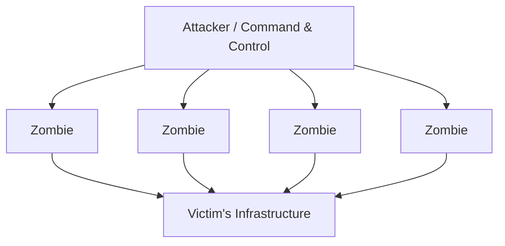
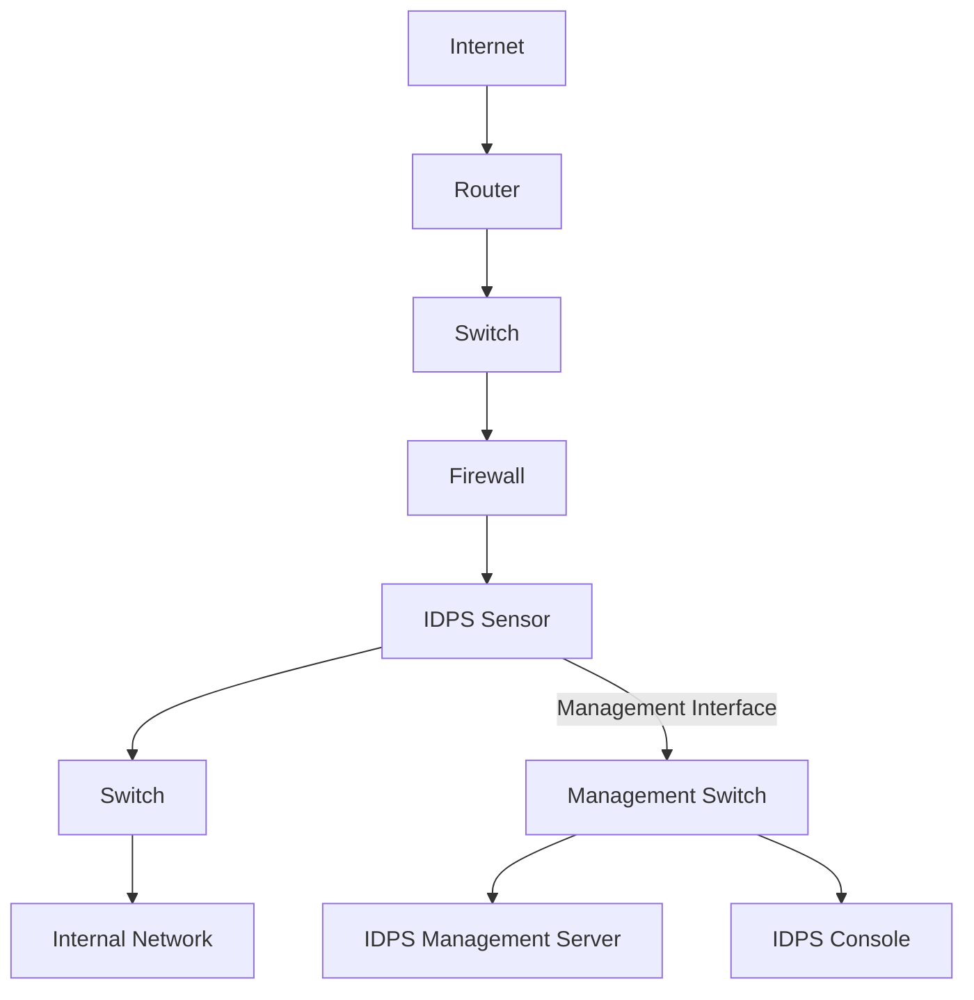
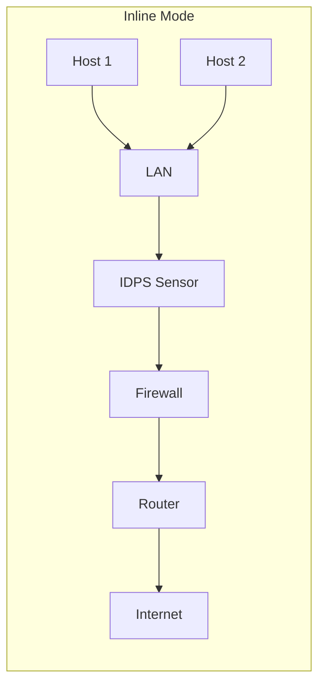
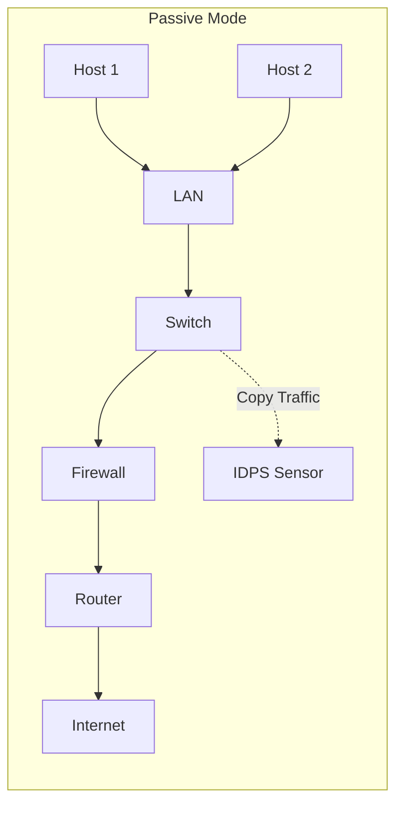
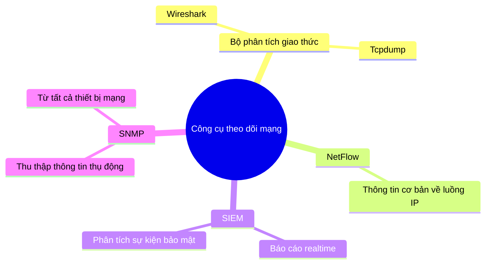
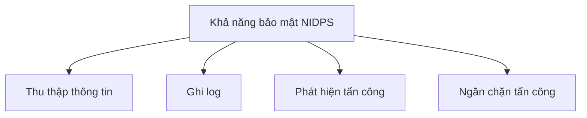
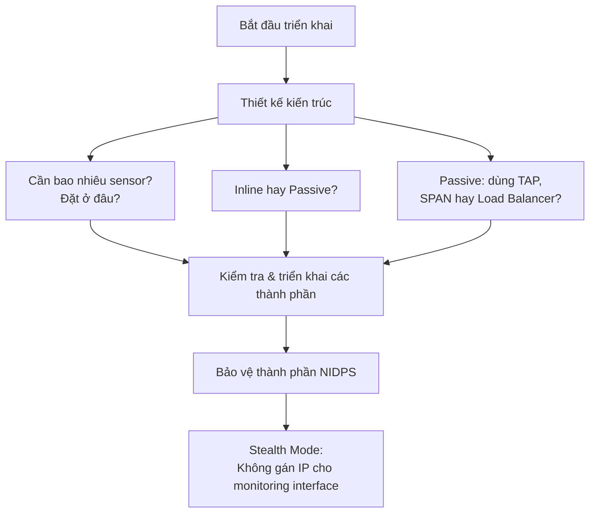

# Bài 3: Network-based IDPS (NIDPS)

---

## 1. Tổng quan TCP/IP Stack

> Các khái niệm phức tạp như cách một mạng máy tính hoạt động có thể khó giải thích. Do đó, mô hình chia tầng được sử dụng.

```
OSI Model          TCP/IP Protocol Suite     TCP/IP Model
─────────────────────────────────────────────────────────
Application   │                         │
Presentation  │  HTTP, DNS, DHCP, FTP   │  Application
Session       │                         │
─────────────────────────────────────────────────────────
Transport     │  TCP, UDP               │  Transport
─────────────────────────────────────────────────────────
Network       │  IPv4, IPv6,            │  Internet
              │  ICMPv4, ICMPv6         │
─────────────────────────────────────────────────────────
Data Link     │                         │
Physical      │  Ethernet, WLAN,        │  Network Access
              │  SONET, SDH             │
```

---

## 2. Đóng gói dữ liệu (Data Encapsulation)

```
Source (Nguồn):
  Application  →  Message:   [ M ]
  Transport    →  Segment:   [ Ht | M ]
  Network      →  Datagram:  [ Hn | Ht | M ]
  Link         →  Frame:     [ Hl | Hn | Ht | M ]
  Physical     →  Bits trên đường truyền

Destination (Đích):
  Link         →  Frame:     [ Hl | Hn | Ht | M ]
  Network      →  Datagram:  [ Hn | Ht | M ]
  Transport    →  Segment:   [ Ht | M ]
  Application  →  Message:   [ M ]
```

---

## 3. IP Packet Header

=== "IPv4 Header (20 bytes)"

    ```
    ┌────────┬──────┬──────┬────────────────────┐
    │ Ver. 4 │  HL  │ TOS  │  Datagram length   │
    ├────────┴──────┴──────┴────────────────────┤
    │     Datagram-ID      │ Flags │ Flag offset │
    ├──────────────────────┼───────┴────────────┤
    │         TTL          │Protocol│Hdr checksum│
    ├──────────────────────┴────────┴────────────┤
    │              Source IP address             │
    ├────────────────────────────────────────────┤
    │           Destination IP address           │
    ├────────────────────────────────────────────┤
    │       IP options (with padding if needed)  │
    └────────────────────────────────────────────┘
    ```

=== "IPv6 Header (40 bytes)"

    ```
    ┌────────┬──────────────┬────────────────────┐
    │ Ver. 6 │Traffic class │  Flow label 20 bits│
    ├────────┴──────────────┼──────────┬──────────┤
    │  Payload length 16bit │Next hdr  │Hop limit │
    ├───────────────────────┴──────────┴──────────┤
    │           Source address 128 bits           │
    │                                             │
    ├────────────────────────────────────────────┤
    │         Destination address 128 bits        │
    │                                             │
    └────────────────────────────────────────────┘
    ```

---

## 4. Network Threats – IP Vulnerabilities

### 4.1 DoS / DDoS Attacks



!!! warning "Smurf Attack (DoS)"
    Kẻ tấn công sử dụng kỹ thuật **amplification (khuếch đại)** và **reflection (phản xạ)**:

    1. Gửi ICMP Echo Request với source IP giả mạo = IP nạn nhân
    2. Toàn bộ thiết bị trong broadcast domain gửi ICMP Echo Reply về nạn nhân
    3. Nạn nhân bị ngập tràn bởi lưu lượng phản hồi

---

### 4.2 TCP Segment & UDP Segment

```
TCP Segment (20 bytes header):
┌──────────────────┬──────────────────┐
│   Source Port    │ Destination Port │
├──────────────────┴──────────────────┤
│           Sequence Number           │
├─────────────────────────────────────┤
│        Acknowledgment Number        │
├──────┬──────────┬───────────────────┤
│HdrLen│  Control │      Window       │
├──────┴──────────┼───────────────────┤
│    Checksum     │      Urgent       │
├─────────────────┴───────────────────┤
│          Options (0 or 32)          │
├─────────────────────────────────────┤
│       Application Layer Data        │
└─────────────────────────────────────┘

UDP Segment (8 bytes header):
┌──────────────────┬──────────────────┐
│   Source Port    │ Destination Port │
├──────────────────┼──────────────────┤
│     Length       │    Checksum      │
├──────────────────┴──────────────────┤
│       Application Layer Data        │
└─────────────────────────────────────┘
```

!!! info "Đặc điểm"
    - **TCP**: Connection-oriented, Reliable delivery, Flow control, Stateful communication
    - **UDP**: Connectionless transport

---

### 4.3 Lỗ hổng trong TCP – UDP

| Giao thức | Các dạng tấn công |
|-----------|-------------------|
| **TCP** | TCP SYN Flood Attack, TCP Reset Attack, TCP Session Hijacking |
| **UDP** | UDP Ping-Pong Attack, UDP Amplification Attack, UDP DoS Attacks |

!!! example "TCP SYN Flood Attack"
    ```
    1. Attacker gửi hàng loạt SYN requests đến Web Server
    2. Web Server gửi SYN-ACK replies (chờ hoàn thành 3-way handshake)
    3. Attacker KHÔNG gửi ACK → Server bị treo hàng loạt half-open connections
    4. Valid user gửi SYN → Web Server UNAVAILABLE
    ```

---

## 5. Network-based IDPS (NIDPS)

!!! abstract "Định nghĩa"
    **Network-based IDPS (NIDPS)** theo dõi lưu lượng mạng cho một **network segment** hoặc các thiết bị, phân tích các hoạt động mạng và các giao thức ứng dụng để xác định các **hành vi bất thường**.

    - Thường triển khai ở **biên mạng**: gần tường lửa, router biên, server VPN, server remote access, mạng không dây
    - Chủ yếu phân tích tại tầng **Application**, **Transport**, **Network** — ít phân tích tại tầng **Network Access**

---

## 6. NIDPS: Các thành phần



!!! info "Các thành phần chủ yếu"
    - **Sensor** (bắt buộc)
    - **Management Server** (server quản lý)
    - **Console**
    - **Database Server** *(optional)*

### 6.1 Promiscuous Mode

!!! note "Promiscuous Mode"
    - Thông thường, NIC **bỏ qua** các gói tin không gửi đến nó (khác địa chỉ MAC)
    - Khi hoạt động ở **Promiscuous Mode**, NIC chuyển **tất cả** các frame nhận được từ mạng lên kernel
    - Nếu một **sniffer** đã đăng ký với kernel → có thể thấy toàn bộ gói tin
    - Trong Wi-Fi → gọi là **Monitor Mode**

### 6.2 Loại Sensor

=== "Hardware-based Sensor"
    Gồm:
    
    - Phần cứng chuyên dụng (NICs / driver NIC để bắt gói tin, bộ xử lý...)
    - Phần mềm sensor (firmware)
    - Hệ điều hành (OS) được tuỳ chỉnh

=== "Software-only Sensor"
    Gồm:
    
    - Có thể bao gồm OS được tuỳ chỉnh
    - Hoặc cài đặt trên OS chuẩn của host thông thường

---

## 7. NIDPS: Kiến trúc và Vị trí Sensor

!!! tip "Khuyến nghị triển khai"
    Nên sử dụng **mạng quản lý riêng** hoặc **VLAN** để bảo vệ các giao tiếp IDPS.

### 7.1 Inline Sensor vs Passive Sensor





| Tiêu chí | Inline Sensor | Passive Sensor |
|----------|--------------|----------------|
| Lưu lượng | Đi **qua** sensor | Sensor nhận **bản sao** |
| Ngăn chặn tấn công | **Có thể** chặn trực tiếp | Hạn chế hơn |
| Vị trí điển hình | Tại vị trí tường lửa / biên mạng | Vị trí chia mạng, DMZ |
| Rủi ro | Nếu lỗi → mạng gián đoạn | Fail-safe hơn |

---

### 7.2 Các phương pháp theo dõi mạng

??? note "Network TAPs (Terminal Access Point)"
    - Kết nối **trực tiếp** giữa sensor và đường truyền vật lý
    - Cung cấp **bản sao** lưu lượng mạng trên đường truyền
    - **Fail-safe** (an toàn khi xảy ra lỗi)
    - **Nhược điểm**: cần thêm chi phí trang bị phần cứng

??? note "Switch Port Mirroring (SPAN Port)"
    - Switch sao chép frame của một/nhiều port gửi đến **SPAN port** (Switch Port Analyzer)
    - SPAN port kết nối với thiết bị phân tích (IDS Sensor)
    - **Nhược điểm**: SPAN port có thể **không thấy đủ** lưu lượng nếu cấu hình sai hoặc quá tải

---

### 7.3 Công cụ theo dõi mạng



---

## 8. NIDPS: Các khả năng bảo mật



---

### 8.1 Thu thập thông tin

!!! info "NIDPS thu thập thông tin gì?"
    - **Xác định các host**: dựa trên địa chỉ IP và MAC
    - **Xác định thông tin OS**: theo dõi ports, phân tích packet header, xác định phiên bản ứng dụng
    - **Xác định các ứng dụng**: theo dõi ports đang dùng, đặc điểm giao tiếp ứng dụng
    - **Xác định đặc điểm mạng**: ví dụ số lượng hop giữa 2 thiết bị

---

### 8.2 Ghi log

!!! example "Các trường thông tin điển hình trong log"

    ```
    - Thời gian (Timestamp)
    - ID kết nối / Session
    - Loại sự kiện / cảnh báo (thường liên kết đến CVE)
    - Xếp hạng: mức ưu tiên, mức quan trọng, ảnh hưởng, độ tin cậy
    - Giao thức tầng Network, Transport, Application
    - Địa chỉ IP nguồn & đích, port TCP/UDP, loại & code ICMP
    - Số byte đã truyền
    - Dữ liệu payload đã giải mã (request / response)
    - Trạng thái kết nối (vd: username đã đăng nhập)
    - Hoạt động ngăn chặn đã thực hiện (nếu có)
    ```

---

### 8.3 Phát hiện tấn công

#### Các dạng sự kiện có thể phát hiện

| Tầng | Ví dụ tấn công |
|------|----------------|
| **Application** | Banner grabbing, Buffer overflow, Format string, Password guessing, Malware |
| **Transport** | Port scanning, Packet fragmentation, SYN floods |
| **Network** | IP spoofing, Giá trị IP header không hợp lệ |
| **Dịch vụ bất thường** | Backdoor, Host chạy dịch vụ trái phép |
| **Vi phạm chính sách** | Truy cập website không phù hợp, dùng giao thức bị cấm |

---

#### Độ chính xác

!!! warning "False Positive & False Negative"
    - NIDPS cũ dùng **signature** → false positive **thấp**, false negative **cao**
    - Kỹ thuật mới kết hợp nhiều phương pháp → tăng độ chính xác, giảm cả hai loại lỗi
    - Không thể loại bỏ hoàn toàn do sự phức tạp (nhiều OS, ứng dụng đa dạng)
    - Nên dùng NIDPS kết hợp để chống lại các **evasion technique** phổ biến

---

#### Khả năng tuỳ chỉnh

!!! tip "Tuỳ chỉnh để giảm sai số"
    - Đặt ngưỡng cho **port scan**, **số lần đăng nhập sai**
    - Cấu hình **blacklist / whitelist** cho IP và username
    - Thiết lập cảnh báo phù hợp
    - Một số NIDPS tích hợp **kết quả quét lỗ hổng** → ưu tiên cảnh báo chính xác hơn

---

#### Hạn chế của NIDPS

!!! danger "Các hạn chế quan trọng"

    1. **Lưu lượng mã hoá**: Không thể / hạn chế phân tích VPN, HTTPS, SSH
    2. **Tải lượng lưu lượng cao**:
        - *Passive sensor*: có thể drop gói → phát hiện sai
        - *Inline sensor*: drop gói → mạng gián đoạn; xử lý chậm → độ trễ cao
    3. **Tấn công vào chính NIDPS**:
        - DDoS / gói tin bất thường → cạn kiệt tài nguyên sensor → crash
        - Tạo lượng lớn cảnh báo trong thời gian ngắn → alert flooding

---

### 8.4 Ngăn chặn tấn công

=== "Chỉ Passive Mode"

    - **Session Sniping**: Gửi gói **TCP Reset** đến cả 2 đầu kết nối để kết thúc session
    - Chỉ dùng được với **TCP** (không dùng được với UDP, ICMP)
    - Không còn được sử dụng rộng rãi

    ```
    1. Attack detected  →  IDS Alert
    2. IDS phân tích & phản hồi
    3. IDS gửi TCP Reset Command đến cả 2 đầu
    ```

=== "Chỉ Inline Mode"

    - **Thực hiện chức năng tường lửa**: chặn traffic độc hại
    - **Giới hạn băng thông**: hạn chế tỉ lệ băng thông mà giao thức có thể dùng
    - **Thay đổi nội dung độc hại**: thay thế payload độc hại bằng nội dung bình thường, gửi gói đã chỉnh đến host đích

    ```
    1. Attack occurs (Port 80 Attack)
    2. IDS phân tích & phản hồi
    3. IDS Command: Close Port 80 for 60 seconds
    ```

=== "Cả Passive & Inline"

    - **Tái cấu hình các thiết bị mạng khác** (router, firewall,...)
    - **Chạy các chương trình hoặc script** phản ứng với sự cố

---

## 9. NIDPS: Quản lý

### 9.1 Triển khai



### 9.2 Vận hành & Bảo trì

!!! note
    Vận hành và bảo trì NIDPS tương tự như các loại IDPS thông thường.

---

## 10. Các công cụ NIDPS phổ biến

| Công cụ | Mô tả |
|---------|-------|
| **Snort** | NIDPS mã nguồn mở phổ biến nhất, dựa trên rule-based detection |
| **Zeek** | Phân tích traffic mạng theo hướng scripting, mạnh về behavioral analysis |
| **Suricata** | Hỗ trợ đa luồng (multi-threading), tương thích rule Snort |
| **Security Onion** | Platform tích hợp nhiều công cụ (Snort/Suricata + Zeek + SIEM...) |

---

## 11. Tóm tắt

!!! summary "Kết luận"
    - **NIDPS** giám sát lưu lượng mạng theo segment/thiết bị, phân tích tầng Network/Transport/Application để phát hiện hành vi đáng ngờ
    - Thành phần chính: **sensor**, server quản lý, console, database (optional)
    - Sensor có thể là **hardware-based** hoặc **software-only**
    - Hai chế độ triển khai sensor: **Inline** và **Passive**
    - Cung cấp đa dạng khả năng bảo mật nhưng có **hạn chế đáng kể** (mã hoá, tải cao, bị tấn công ngược)
    - Sensor có nhiều phương pháp ngăn chặn tấn công khác nhau

---
---

# 50 Câu Trắc Nghiệm – Network-based IDPS

---

### Câu 1
**Trong mô hình TCP/IP, giao thức nào thuộc tầng Transport?**

- A. HTTP
- B. IPv4
- C. TCP và UDP ✅
- D. Ethernet

> **Giải thích:** TCP và UDP là hai giao thức chính ở tầng Transport của mô hình TCP/IP.

---

### Câu 2
**Khi dữ liệu đi qua tầng Network, đơn vị dữ liệu (PDU) được gọi là gì?**

- A. Message
- B. Segment
- C. Datagram ✅
- D. Frame

> **Giải thích:** Tầng Application → Message; Transport → Segment; Network → Datagram; Link → Frame.

---

### Câu 3
**IPv4 header có kích thước tối thiểu là bao nhiêu byte?**

- A. 8 bytes
- B. 20 bytes ✅
- C. 40 bytes
- D. 64 bytes

> **Giải thích:** IPv4 header tối thiểu là 20 bytes; IPv6 header là 40 bytes.

---

### Câu 4
**IPv6 header có kích thước cố định là bao nhiêu byte?**

- A. 20 bytes
- B. 32 bytes
- C. 40 bytes ✅
- D. 60 bytes

---

### Câu 5
**Trường nào trong IPv6 header thay thế TTL của IPv4?**

- A. Traffic Class
- B. Flow Label
- C. Hop Limit ✅
- D. Next Header

> **Giải thích:** Hop Limit trong IPv6 có chức năng tương đương TTL trong IPv4 — giảm 1 tại mỗi router, khi về 0 thì gói bị hủy.

---

### Câu 6
**Smurf Attack thuộc loại tấn công nào?**

- A. Man-in-the-Middle
- B. DoS sử dụng amplification và reflection ✅
- C. SQL Injection
- D. Session Hijacking

> **Giải thích:** Smurf Attack gửi ICMP Echo Request với IP nguồn giả mạo là IP nạn nhân đến địa chỉ broadcast, khiến toàn bộ hosts trong mạng gửi ICMP Reply về nạn nhân.

---

### Câu 7
**TCP SYN Flood Attack khai thác điểm yếu nào của TCP?**

- A. Yêu cầu mã hóa dữ liệu
- B. Cơ chế 3-way handshake ✅
- C. Thiếu kiểm tra checksum
- D. Không có cơ chế xác thực port

> **Giải thích:** Attacker gửi hàng loạt SYN nhưng không hoàn thành 3-way handshake, khiến server duy trì nhiều half-open connection cho đến khi cạn tài nguyên.

---

### Câu 8
**TCP Reset Attack (TCP Reset) dùng để làm gì?**

- A. Tăng tốc độ kết nối TCP
- B. Cưỡng bức ngắt một phiên TCP đang hoạt động ✅
- C. Tái khởi động server
- D. Mã hoá dữ liệu trong session

---

### Câu 9
**UDP khác TCP ở điểm nào quan trọng nhất?**

- A. UDP sử dụng port còn TCP thì không
- B. UDP là connectionless, không đảm bảo độ tin cậy ✅
- C. UDP có checksum còn TCP thì không
- D. UDP chỉ dùng cho ứng dụng web

---

### Câu 10
**UDP Amplification Attack hoạt động theo nguyên tắc nào?**

- A. Tăng kích thước file tải lên
- B. Gửi request nhỏ, nhận response lớn từ server dịch vụ, phản hồi về nạn nhân ✅
- C. Tạo nhiều kết nối TCP đồng thời
- D. Mã hoá lưu lượng UDP

---

### Câu 11
**NIDPS thường được triển khai ở đâu trong mạng?**

- A. Bên trong máy chủ ứng dụng
- B. Tại biên mạng, gần tường lửa hoặc router biên ✅
- C. Trên mỗi máy trạm người dùng
- D. Trong cơ sở dữ liệu

---

### Câu 12
**NIDPS chủ yếu phân tích ở những tầng nào?**

- A. Chỉ tầng Physical và Data Link
- B. Application, Transport, Network ✅
- C. Chỉ tầng Application
- D. Tất cả các tầng kể cả Network Access

---

### Câu 13
**Thành phần nào là OPTIONAL (không bắt buộc) trong NIDPS?**

- A. Sensor
- B. Management Server
- C. Console
- D. Database Server ✅

---

### Câu 14
**Promiscuous Mode trên NIC có tác dụng gì?**

- A. Tăng tốc độ truyền dữ liệu
- B. Cho phép NIC nhận và chuyển lên kernel TẤT CẢ frame trên mạng, kể cả không gửi đến NIC đó ✅
- C. Mã hoá toàn bộ lưu lượng mạng
- D. Chặn các gói tin không hợp lệ

---

### Câu 15
**Trong mạng Wi-Fi, Promiscuous Mode được gọi là gì?**

- A. Passive Mode
- B. Stealth Mode
- C. Monitor Mode ✅
- D. Inline Mode

---

### Câu 16
**Hardware-based sensor trong NIDPS khác software-only sensor ở điểm nào?**

- A. Hardware-based sensor không cần OS
- B. Hardware-based sensor gồm phần cứng chuyên dụng, firmware và OS tuỳ chỉnh; software-only có thể cài trên OS chuẩn ✅
- C. Software-only sensor không thể bắt gói tin
- D. Hardware-based sensor chỉ hoạt động ở Passive Mode

---

### Câu 17
**Điểm khác biệt chính giữa Inline sensor và Passive sensor là gì?**

- A. Inline sensor rẻ hơn Passive sensor
- B. Inline sensor nhận bản sao lưu lượng; Passive nhận lưu lượng thực
- C. Inline sensor yêu cầu lưu lượng PHẢI đi qua nó; Passive chỉ nhận bản sao ✅
- D. Passive sensor có thể chặn tấn công trực tiếp, Inline thì không

---

### Câu 18
**Ưu điểm chính của Inline sensor so với Passive sensor là gì?**

- A. Tiêu tốn ít tài nguyên hơn
- B. Có thể ngăn chặn tấn công bằng cách chặn lưu lượng trực tiếp ✅
- C. Không gây trễ mạng
- D. Hoạt động tốt hơn với lưu lượng mã hoá

---

### Câu 19
**Nhược điểm của Inline sensor khi xảy ra lỗi là gì?**

- A. Bị phát hiện bởi attacker
- B. Mất log ghi chép
- C. Mạng bị gián đoạn vì lưu lượng không thể đi qua ✅
- D. Gây ra false positive cao

---

### Câu 20
**Passive sensor thường được đặt ở đâu?**

- A. Trực tiếp trên đường đi của lưu lượng chính
- B. Tại vị trí phân chia mạng hoặc các segment quan trọng như DMZ ✅
- C. Chỉ trong mạng không dây
- D. Trên mỗi máy chủ web

---

### Câu 21
**Network TAP (Terminal Access Point) có đặc điểm gì?**

- A. Sao chép frame qua SPAN port của switch
- B. Kết nối trực tiếp với đường truyền vật lý, cung cấp bản sao traffic, fail-safe ✅
- C. Chỉ hoạt động với lưu lượng không dây
- D. Yêu cầu cấu hình phần mềm phức tạp

---

### Câu 22
**Nhược điểm của Network TAP là gì?**

- A. Không cung cấp đủ bản sao lưu lượng
- B. Không phải fail-safe
- C. Cần thêm chi phí trang bị phần cứng ✅
- D. Không tương thích với Ethernet

---

### Câu 23
**Switch Port Mirroring (SPAN) hoạt động như thế nào?**

- A. Switch tắt các port không sử dụng
- B. Switch sao chép frame từ một/nhiều port đến SPAN port để kết nối thiết bị phân tích ✅
- C. Switch mã hoá lưu lượng trước khi gửi đến sensor
- D. Switch chặn toàn bộ lưu lượng nghi ngờ

---

### Câu 24
**Nhược điểm của SPAN port là gì?**

- A. Không thể hoạt động với switch managed
- B. SPAN port có thể bỏ sót lưu lượng nếu cấu hình sai hoặc quá tải ✅
- C. Chỉ hỗ trợ một chiều traffic
- D. Yêu cầu phần cứng đặc biệt

---

### Câu 25
**Wireshark và Tcpdump thuộc loại công cụ nào?**

- A. SIEM
- B. NetFlow collector
- C. Bộ phân tích giao thức (Protocol Analyzer) ✅
- D. Vulnerability Scanner

---

### Câu 26
**NetFlow cung cấp thông tin gì?**

- A. Nội dung đầy đủ của từng gói tin
- B. Thông tin cơ bản về tất cả luồng IP chuyển tiếp trên thiết bị ✅
- C. Chữ ký số của mỗi gói tin
- D. Thông tin mã hoá SSL/TLS

---

### Câu 27
**SIEM là viết tắt của gì?**

- A. System Intrusion Event Monitor
- B. Security Information Event Management ✅
- C. Sensor Intelligence and Event Module
- D. Secure Internet Event Monitoring

---

### Câu 28
**SNMP (Simple Network Management Protocol) thu thập thông tin theo cách nào?**

- A. Chủ động tấn công các thiết bị để lấy thông tin
- B. Thụ động — yêu cầu và thu thập thông tin từ tất cả thiết bị mạng ✅
- C. Phân tích lưu lượng thời gian thực
- D. Mã hoá thông tin quản lý

---

### Câu 29
**Khi NIDPS ghi log, trường nào thường liên kết đến một lỗ hổng cụ thể?**

- A. Địa chỉ IP nguồn
- B. Số byte truyền
- C. Loại sự kiện / cảnh báo (thường liên kết đến CVE) ✅
- D. Username đăng nhập

---

### Câu 30
**Banner Grabbing thuộc dạng tấn công ở tầng nào?**

- A. Network
- B. Transport
- C. Application ✅
- D. Physical

> **Giải thích:** Banner Grabbing là kỹ thuật do thám ở tầng Application, dùng để xác định phiên bản phần mềm/dịch vụ đang chạy.

---

### Câu 31
**Port Scanning là dạng do thám / tấn công ở tầng nào?**

- A. Application
- B. Transport ✅
- C. Network
- D. Data Link

---

### Câu 32
**IP Spoofing là dạng tấn công ở tầng nào?**

- A. Application
- B. Transport
- C. Network ✅
- D. Physical

---

### Câu 33
**NIDPS cũ sử dụng signature thường có đặc điểm gì về độ chính xác?**

- A. False positive cao, false negative thấp
- B. False positive thấp, false negative cao ✅
- C. Cả hai đều thấp
- D. Cả hai đều cao

> **Giải thích:** Signature-based NIDPS chỉ phát hiện tấn công đã biết, nên ít báo nhầm (false positive thấp) nhưng bỏ sót nhiều tấn công mới (false negative cao).

---

### Câu 34
**Evasion Technique là gì trong ngữ cảnh NIDPS?**

- A. Kỹ thuật mã hoá dữ liệu mạng
- B. Kỹ thuật kẻ tấn công dùng để tránh bị NIDPS phát hiện ✅
- C. Kỹ thuật tối ưu hiệu suất sensor
- D. Phương pháp sao lưu log

---

### Câu 35
**Để giảm false positive, quản trị viên có thể làm gì với NIDPS?**

- A. Tắt bớt sensor
- B. Đặt ngưỡng cho port scan, cấu hình blacklist/whitelist IP và username ✅
- C. Chuyển toàn bộ sensor sang Passive Mode
- D. Vô hiệu hoá tất cả cảnh báo

---

### Câu 36
**NIDPS gặp khó khăn lớn nhất khi phân tích loại lưu lượng nào?**

- A. HTTP
- B. DNS
- C. Lưu lượng đã mã hoá (VPN, HTTPS, SSH) ✅
- D. ICMP

---

### Câu 37
**Khi Passive IDPS sensor bị quá tải, hậu quả có thể xảy ra là gì?**

- A. Mạng bị gián đoạn hoàn toàn
- B. Sensor drop gói tin, có thể phát hiện sai tấn công ✅
- C. Sensor tự động chuyển sang Inline Mode
- D. Toàn bộ lưu lượng bị chặn

---

### Câu 38
**Kẻ tấn công tạo lưu lượng lớn để gây crash sensor NIDPS là loại tấn công nào vào chính NIDPS?**

- A. Buffer Overflow vào database
- B. Tạo traffic DDoS / gói tin bất thường để cạn kiệt tài nguyên sensor ✅
- C. SQL Injection vào management console
- D. Brute force vào tài khoản admin

---

### Câu 39
**Session Sniping trong NIDPS Passive Mode hoạt động như thế nào?**

- A. Sensor clone session và phân tích riêng
- B. Sensor gửi gói TCP Reset đến cả 2 đầu kết nối để kết thúc session ✅
- C. Sensor chặn hoàn toàn băng thông của connection
- D. Sensor mã hoá lại toàn bộ lưu lượng

---

### Câu 40
**Session Sniping có thể dùng với giao thức nào?**

- A. TCP, UDP và ICMP
- B. Chỉ UDP
- C. Chỉ TCP ✅
- D. Chỉ ICMP

> **Giải thích:** TCP Reset chỉ có tác dụng với kết nối TCP vì dùng cờ RST. UDP và ICMP không có cơ chế session/connection, nên không áp dụng được.

---

### Câu 41
**Inline NIDPS có thể thực hiện tính năng nào mà Passive NIDPS không thể?**

- A. Ghi log sự kiện
- B. Gửi cảnh báo
- C. Giới hạn băng thông và thay đổi nội dung độc hại ✅
- D. Thu thập thông tin về host

---

### Câu 42
**"Thay đổi nội dung độc hại" trong Inline NIDPS có nghĩa là gì?**

- A. Xoá toàn bộ gói tin
- B. Thay thế payload độc hại bằng nội dung bình thường và gửi gói đã chỉnh đến host đích ✅
- C. Mã hoá lại nội dung gói tin
- D. Chuyển gói tin đến honeypot

---

### Câu 43
**Cả Passive lẫn Inline NIDPS đều có thể thực hiện hành động ngăn chặn nào?**

- A. Giới hạn băng thông
- B. Thay đổi nội dung gói tin
- C. Tái cấu hình các thiết bị mạng khác và chạy script phản hồi ✅
- D. Gửi TCP Reset

---

### Câu 44
**Stealth Mode trong NIDPS có nghĩa là gì?**

- A. Sensor hoạt động không ghi log
- B. Không gán địa chỉ IP cho monitoring interface của sensor ✅
- C. Sensor ẩn khỏi màn hình quản lý
- D. Sensor chỉ hoạt động ban đêm

> **Giải thích:** Không gán IP cho monitoring interface giúp sensor khó bị phát hiện và tấn công, vì không có địa chỉ để kẻ tấn công nhắm đến.

---

### Câu 45
**Khi thiết kế kiến trúc NIDPS, câu hỏi nào cần cân nhắc đầu tiên?**

- A. Nên dùng Wireshark hay Tcpdump?
- B. Cần bao nhiêu sensor và đặt ở vị trí nào? ✅
- C. Nên dùng IPv4 hay IPv6?
- D. Nên sử dụng giao thức mã hoá nào?

---

### Câu 46
**Snort là công cụ NIDPS hoạt động theo nguyên tắc nào?**

- A. Anomaly-based detection thuần túy
- B. Machine learning-based detection
- C. Rule-based detection ✅
- D. Chỉ dựa trên NetFlow

---

### Câu 47
**Security Onion là gì?**

- A. Một loại tường lửa thế hệ mới
- B. Một platform tích hợp nhiều công cụ bảo mật mạng (Snort/Suricata + Zeek + SIEM...) ✅
- C. Một giao thức mạng bảo mật
- D. Một loại VPN mã nguồn mở

---

### Câu 48
**Zeek (trước đây là Bro) có điểm mạnh nào so với Snort?**

- A. Snort nhanh hơn Zeek
- B. Zeek mạnh về behavioral analysis và scripting, trong khi Snort tập trung vào signature ✅
- C. Zeek tương thích với tất cả rule của Snort
- D. Zeek tiêu thụ ít tài nguyên hơn

---

### Câu 49
**Trong mô hình triển khai NIDPS thực tế, vì sao nên dùng VLAN riêng cho management traffic?**

- A. VLAN giúp tăng tốc độ xử lý gói tin của sensor
- B. VLAN bảo vệ các giao tiếp quản lý IDPS khỏi bị nghe lén hoặc tấn công ✅
- C. VLAN bắt buộc theo chuẩn IEEE 802.11
- D. VLAN giúp sensor nhận được nhiều lưu lượng hơn

---

### Câu 50
**Packet Fragmentation được sử dụng như một Evasion Technique như thế nào?**

- A. Gộp nhiều gói tin thành một để tránh phân tích
- B. Chia payload tấn công thành nhiều fragment nhỏ, NIDPS có thể không reassemble đúng để nhận ra signature ✅
- C. Mã hoá từng fragment độc lập
- D. Gửi fragment với TTL = 0 để bypass router

> **Giải thích:** Bằng cách phân mảnh gói tin, kẻ tấn công hy vọng NIDPS không có khả năng hoặc tài nguyên để tái lắp ráp (reassemble) đầy đủ và so khớp signature tấn công.

---

### Câu 51 *(Bonus)*
**NIDPS sử dụng kết quả quét lỗ hổng (vulnerability scan) để làm gì?**

- A. Thay thế hoàn toàn chức năng phát hiện tấn công
- B. Xác định các tấn công có thể đã thành công nếu không ngăn chặn, giúp quyết định hành động và ưu tiên cảnh báo ✅
- C. Tự động vá lỗi trên các host trong mạng
- D. Cập nhật signature mới nhất

---

### Câu 52 *(Bonus)*
**Tại sao NIDPS phân tích ít ở tầng Network Access (Data Link / Physical)?**

- A. Vì tầng này không có lỗ hổng bảo mật
- B. Vì NIDPS thường được đặt ở vị trí chỉ nhìn thấy lưu lượng từ tầng Network trở lên sau khi qua switch/router ✅
- C. Vì tầng này đã được bảo vệ bởi WPA3
- D. Vì chi phí phân tích tầng này quá thấp

---

### Câu 53 *(Bonus)*
**Khi một Passive sensor nhận lưu lượng từ IDS Load Balancer, mục đích chính là gì?**

- A. Giảm chi phí triển khai
- B. Phân phối tải lưu lượng giữa nhiều sensor để xử lý hiệu quả hơn ✅
- C. Mã hoá lưu lượng trước khi gửi đến sensor
- D. Tạo redundancy cho tường lửa

---

### Câu 54 *(Bonus)*
**Trường "Xếp hạng" trong log NIDPS bao gồm những thông tin gì?**

- A. Tên user và địa chỉ IP
- B. Mức ưu tiên, mức quan trọng, ảnh hưởng, độ tin cậy ✅
- C. Số lượng byte và thời gian kết nối
- D. Loại giao thức và port

---

### Câu 55 *(Bonus)*
**Tại sao Session Sniping không còn được sử dụng rộng rãi trong các NIDPS hiện đại?**

- A. Quá tốn kém để triển khai
- B. Chỉ hoạt động với UDP
- C. Hạn chế chỉ dùng với TCP và không hiệu quả với nhiều dạng tấn công hiện đại; Inline mode cung cấp giải pháp toàn diện hơn ✅
- D. Bị cấm theo luật bảo mật quốc tế
