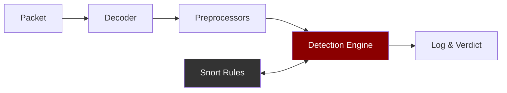
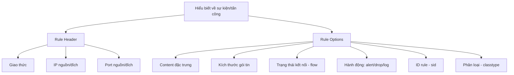
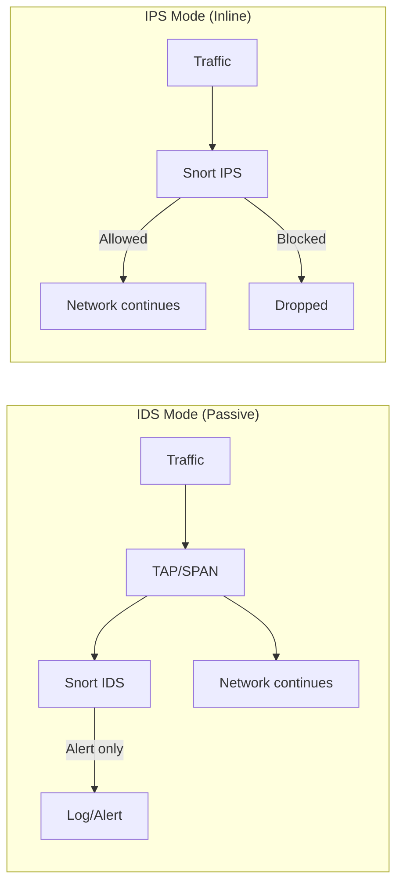

# Bài 4: Network-based IDS/IPS (tt) 

---

## 📋 Nội dung bài học

- Ví dụ triển khai NIDPS
- Snort

> **Tài liệu tham khảo:** NIST SP 800-94, Chapter 4

---

## 1. Triển khai IDS/IPS

### 1.1 Triển khai IDS với Network TAP

```
Switch/Firewall
     │
    TAP ──────► IDS
     │
Host/Switch
```

**Mô hình TAP đơn giản:** Một TAP đặt giữa Switch/Firewall và Host, sao chép lưu lượng sang IDS để phân tích mà không ảnh hưởng đến luồng dữ liệu chính.

**Mô hình TAP với Redundancy (HA):**

```
Switch/Firewall
    ├── TAP ──► IDS 1 ──┐
    │                   ├── Heartbeat
    └── TAP ──► IDS 2 ──┘
         │
    Host/Switch
```

> **Heartbeat** được dùng để hai IDS theo dõi tình trạng hoạt động của nhau, đảm bảo tính sẵn sàng cao (High Availability).

**Mô hình TAP phân tầng (multi-segment):**

```
Switch (trên)
  ├── TAP ──► IDS 1 ──┐
  ├── TAP ──►          ├── Heartbeat
  ├── TAP ──► IDS 2 ──┘
  └── TAP ──►
Switch (dưới)
```

---

### 1.2 Triển khai IDS với Port Mirroring (SPAN)

```
[Workstations] ──► Switch ──► SPAN 1 ──► IDS 1 ──┐
                         └──► SPAN 2 ──► IDS 2 ──┴── Heartbeat
```

**Mô hình thực tế với Firewall Cluster:**

```
           Internet
              │
    ┌─────────────────┐
    │  Firewall Cluster│
    └────────┬────────┘
          SPAN↑  SPAN↑
         Switch ─── Switch
             │   (Trunk)   │
         Internal Network
              │
             IDS
```

> **SPAN (Switched Port Analyzer)** là tính năng trên switch cho phép sao chép lưu lượng từ một hoặc nhiều port sang port giám sát, nơi IDS được kết nối.

---

### 1.3 Triển khai IDS với Reset Interface

```
Switch/Firewall ◄──── Resets ────┐
      │                          │
     TAP ──────────────────────► IDS
      │
Host/Switch
```

!!! info "Cơ chế Reset Interface"
    IDS phát hiện tấn công và gửi tín hiệu **Reset (RST)** về Switch/Firewall để ngắt kết nối tấn công. Đây là cách chủ động phản ứng mà không cần đặt IDS theo dạng inline.

---

### 1.4 Triển khai IPS – Inline Mode

```
         Internet
            │
    ┌───────┴───────┐
    │               │
  Router          Router
    │               │
 Firewall ──── Firewall (Cluster)
    │               │
   IPS            IPS  ← (highlighted: active)
    │               │
  Switch          Switch
    └───────┬───────┘
      Internal Network
```

!!! warning "Lưu ý Inline Mode"
    IPS đặt **trực tiếp trên đường truyền** (inline). Mọi gói tin đều phải đi qua IPS trước khi vào mạng nội bộ. Điều này cho phép IPS **chặn (drop/block)** gói tin tấn công ngay lập tức, nhưng nếu IPS gặp sự cố, toàn bộ lưu lượng có thể bị gián đoạn.

---

### 1.5 Vận dụng – Đặt NIDS/NIPS tại các vị trí phù hợp

!!! tip "Nguyên tắc đặt NIDS/NIPS"
    Trong một hệ thống mạng lớn, các NIDS/NIPS cần được đặt tại **nhiều điểm chiến lược**:

    - Trước/sau Firewall biên (WAN)
    - Tại DMZ (vùng phi quân sự)
    - Tại Internal Firewall
    - Tại các phân đoạn mạng nội bộ nhạy cảm (Server Block, User Block)
    - Tại các kết nối WAN (LeaseLine, MegaWAN, FTTH, VPN)
    - Tại các kết nối với chi nhánh (Branch), đối tác (Banking)

---

## 2. Snort

### 2.1 Tổng quan về Snort

!!! abstract "Snort là gì?"
    **Snort** là một **Network-based Intrusion Detection/Prevention System (NIDPS)** mã nguồn mở, hoạt động theo cơ chế **Signature-based** (dựa trên chữ ký/dấu hiệu).

**Khả năng của Snort:**

| Khả năng | Mô tả |
|---|---|
| Phân tích real-time | Phân tích lưu lượng mạng theo thời gian thực |
| Packet logging | Ghi log các gói tin |
| Protocol analysis | Phân tích giao thức mạng |
| Content matching | Tìm kiếm/so khớp nội dung trong payload |
| Attack detection | Phát hiện tấn công/do thám dựa trên rules |

---

### 2.2 Quy trình phân tích gói tin trong Snort 2



??? info "Giải thích các thành phần"
    - **Packet**: Gói tin đến từ interface mạng hoặc file pcap
    - **Decoder**: Giải mã cấu trúc gói tin (Ethernet, IP, TCP/UDP, v.v.)
    - **Preprocessors**: Tiền xử lý – tái hợp TCP stream, decode HTTP, chống evasion
    - **Detection Engine**: So khớp gói tin đã xử lý với Snort Rules
    - **Snort Rules**: Tập các quy tắc định nghĩa dấu hiệu tấn công
    - **Log & Verdict**: Ghi log và thực thi hành động (alert, drop, log, pass)

---

### 2.3 Snort Rules – Cấu trúc

#### Cú pháp tổng quát

```
action protocol src_IP src_port -> dst_IP dst_port ( Rule Options )
```

#### Giải thích từng trường

```
alert  tcp  192.168.1.0/24  21  ->  any  any  (msg:"..."; sid:100007;)
  │     │         │           │    │    │    │
  │     │         │           │    │    │    └── Destination port
  │     │         │           │    │    └─────── Destination IP
  │     │         │           │    └──────────── Direction (-> or <->)
  │     │         │           └───────────────── Source port
  │     │         └───────────────────────────── Source IP
  │     └─────────────────────────────────────── Protocol
  └───────────────────────────────────────────── Action
```

| Thành phần | Giá trị có thể | Mô tả |
|---|---|---|
| **action** | `alert`, `drop`, `log`, `pass`, `reject` | Hành động thực hiện khi rule khớp |
| **protocol** | `tcp`, `udp`, `icmp`, `ip` | Giao thức mạng |
| **src_IP / dst_IP** | IP cụ thể, CIDR, `any`, `$VAR` | Địa chỉ IP nguồn/đích |
| **src_port / dst_port** | Port cụ thể, range, `any` | Cổng nguồn/đích |
| **direction** | `->` (1 chiều), `<->` (2 chiều) | Chiều lưu lượng |

---

### 2.4 Rule Options – Chi tiết

!!! note "Rule Options là gì?"
    **Rule options** là phần nằm trong cặp dấu `( )`, là **trọng tâm** quyết định khả năng phát hiện tấn công của Snort. Mỗi option có dạng `key:value;` và các option phân cách nhau bằng dấu `;`.

**Các nhóm option quan trọng:**

| Nhóm | Option phổ biến | Mô tả |
|---|---|---|
| **General** | `msg`, `sid`, `rev`, `classtype` | Thông tin mô tả rule |
| **Detection** | `content`, `pcre`, `offset`, `depth`, `distance`, `within`, `byte_test` | Phát hiện nội dung |
| **Flow** | `flow` | Kiểm soát trạng thái kết nối |
| **Metadata** | `metadata`, `reference` | Tham chiếu CVE, policy |

**Ví dụ rule đầy đủ (Browser IE CacheSize Exploit):**

```snort
alert tcp $EXTERNAL_NET $HTTP_PORTS -> $HOME_NET any (
    msg:"BROWSER-IE Microsoft Internet Explorer CacheSize exploit attempt";
    flow:to_client,established;
    file_data;
    content:"recordset"; offset:14; depth:9;
    content:".CacheSize"; distance:0; within:100;
    pcre:"/CacheSize\s*=\s*/";
    byte_test:10,>,0x3ffffffe,0,relative,string;
    metadata:policy max-detect-ips drop, service http;
    reference:cve,2016-8077;
    classtype:attempted-user;
    sid:65535; rev:1;
)
```

---

### 2.5 Ví dụ Rule – Phân tích chi tiết

#### Ví dụ 1: Phát hiện ICMP (Ping)

```snort
alert icmp any any -> 192.168.1.1 any (msg:"ICMP detected"; sid:100005;)
```

??? example "Phân tích"
    | Trường | Giá trị | Ý nghĩa |
    |---|---|---|
    | action | `alert` | Cảnh báo khi khớp |
    | protocol | `icmp` | Giao thức ICMP |
    | src IP | `any` | Bất kỳ host nào |
    | src port | `any` | Bất kỳ port nào |
    | direction | `->` | Một chiều |
    | dst IP | `192.168.1.1` | Chỉ đến host này |
    | dst port | `any` | Bất kỳ port nào |
    | msg | `"ICMP detected"` | Thông điệp cảnh báo |
    | sid | `100005` | ID của rule |

    **Kết quả:** Snort hiện cảnh báo "ICMP detected" khi bất kỳ host nào ping tới `192.168.1.1`.

---

#### Ví dụ 2: Phát hiện đăng nhập FTP thất bại

```snort
alert tcp 192.168.1.0/24 21 -> any any (
    msg:"FTP failed login";
    content:"Login or password incorrect";
    sid:100007;
)
```

??? example "Phân tích"
    | Trường | Giá trị | Ý nghĩa |
    |---|---|---|
    | action | `alert` | Cảnh báo |
    | protocol | `tcp` | TCP |
    | src IP | `192.168.1.0/24` | FTP server trong subnet |
    | src port | `21` | Port FTP |
    | direction | `->` | Traffic từ server ra client |
    | dst IP/port | `any any` | Bất kỳ client nào |
    | content | `"Login or password incorrect"` | Nội dung response FTP khi sai mật khẩu |

    **Kết quả:** Snort cảnh báo "FTP failed login" khi FTP server trả về thông báo đăng nhập sai cho bất kỳ client nào.

---

#### Ví dụ 3: Phát hiện tấn công XSS

```snort
alert tcp $EXTERNAL_NET any -> any $HTTP_PORTS (
    msg:"XSS";
    content:"<script>";
    flow:to_server,established;
    sid:100009;
)
```

??? example "Phân tích"
    | Trường | Giá trị | Ý nghĩa |
    |---|---|---|
    | action | `alert` | Cảnh báo |
    | protocol | `tcp` | TCP |
    | src IP | `$EXTERNAL_NET` | IP từ mạng ngoài (định nghĩa trong snort.conf) |
    | src port | `any` | Bất kỳ port nào |
    | dst IP | `any` | Bất kỳ web server |
    | dst port | `$HTTP_PORTS` | Các port HTTP (định nghĩa trong snort.conf) |
    | content | `"<script>"` | Chuỗi đặc trưng của XSS |
    | flow | `to_server,established` | Chỉ xét traffic chiều client→server, TCP đã kết nối |

    **Kết quả:** Snort cảnh báo "XSS" khi client từ mạng ngoài gửi request chứa `<script>` đến web server.

!!! tip "Biến trong snort.conf"
    `$EXTERNAL_NET`, `$HOME_NET`, `$HTTP_PORTS` là các **biến toàn cục** được định nghĩa trong file `snort.conf`, giúp tái sử dụng và quản lý rules linh hoạt.

---

### 2.6 Cần thông tin gì để viết một Snort Rule?



!!! warning "Yêu cầu quan trọng"
    Để viết rule hiệu quả, người viết **phải hiểu rõ cơ chế hoạt động của sự kiện/tấn công** cần phát hiện:

    - Giao thức sử dụng là gì?
    - IP/port nguồn và đích ra sao?
    - Payload có chuỗi đặc trưng nào không?
    - Kích thước gói tin có điểm bất thường không?
    - Kết nối được thiết lập theo chiều nào?

---

### 2.7 Nguồn lấy Rules cho Snort

!!! success "3 cách lấy Snort Rules"
    1. **Mặc định (built-in):** Snort cung cấp tập rules mặc định kèm theo trong source cài đặt
    2. **Tự viết:** Người dùng có thể tự viết rules tùy chỉnh theo nhu cầu cụ thể
    3. **Tải từ trang chủ:** Snort.org cung cấp nhiều tập rules cho các nhóm người dùng khác nhau (Community Rules, Registered Rules, Subscriber Rules)

---

### 2.8 Nguồn lưu lượng đầu vào của Snort

!!! info "Snort có thể nhận traffic từ 2 nguồn:"
    - **Live capture:** Bắt lưu lượng trực tiếp trên network interface đang giám sát
    - **PCAP replay:** Đọc từ file `.pcap` chứa lưu lượng đã bắt trước đó

    ```bash
    # Live capture mode
    snort -i eth0 -c /etc/snort/snort.conf

    # PCAP replay mode
    snort -r capture.pcap -c /etc/snort/snort.conf
    ```

---

### 2.9 Snort: IDS hay IPS?

!!! question "Snort có chặn tấn công không?"
    Snort **có thể** chặn tấn công, nhưng **chỉ khi chạy ở chế độ phù hợp**:

    | Chế độ | Khả năng | Ghi chú |
    |---|---|---|
    | **Sniffer mode** | Chỉ hiển thị packet | Không lưu, không phát hiện |
    | **Packet Logger mode** | Ghi log packet | Không phát hiện tấn công |
    | **IDS mode** | Phát hiện + alert | Không chặn được |
    | **IPS/inline mode** | Phát hiện + chặn | Cần cấu hình inline với NFQ/DAQ |

    ```bash
    # Chạy Snort ở IPS inline mode (Linux với NFQueue)
    snort -Q --daq nfq --daq-var queue=0 -c /etc/snort/snort.conf
    ```

---

## 3. So sánh: IDS vs IPS



| Tiêu chí | IDS | IPS |
|---|---|---|
| Vị trí | Out-of-band (TAP/SPAN) | In-line |
| Khả năng chặn | Không (chỉ cảnh báo) | Có |
| Ảnh hưởng đến traffic | Không | Có (bottleneck, SPOF) |
| Độ trễ | Không thêm | Có thêm độ trễ |
| Nguy cơ False Positive | Chỉ cảnh báo sai | Có thể chặn nhầm traffic hợp lệ |

---

## 50 Câu Trắc Nghiệm

---

### Phần 1: Triển khai IDS/IPS

**Câu 1.** Network TAP (Test Access Point) hoạt động theo nguyên tắc nào?

- A. Chặn toàn bộ lưu lượng và chuyển tiếp cho IDS xử lý
- B. Sao chép lưu lượng mạng và gửi bản sao đến IDS mà không ảnh hưởng đến luồng chính
- C. Chỉ bắt lưu lượng từ một port duy nhất trên switch
- D. Yêu cầu cấu hình đặc biệt trên switch

??? success "Đáp án: B"
    TAP hoạt động passively, sao chép (mirror) lưu lượng đến IDS mà không làm gián đoạn đường truyền chính. Đây là ưu điểm lớn so với inline mode.

---

**Câu 2.** Trong mô hình triển khai IDS với TAP có **Heartbeat**, Heartbeat có chức năng gì?

- A. Gửi cảnh báo đến quản trị viên khi phát hiện tấn công
- B. Theo dõi tình trạng hoạt động giữa các IDS để đảm bảo High Availability
- C. Đồng bộ hóa cơ sở dữ liệu signature giữa các IDS
- D. Ghi log tất cả lưu lượng mạng đi qua TAP

??? success "Đáp án: B"
    Heartbeat là cơ chế kiểm tra tình trạng (health check) giữa các IDS trong cụm HA. Nếu một IDS bị lỗi, IDS còn lại biết và tiếp tục hoạt động.

---

**Câu 3.** SPAN (Switched Port Analyzer) còn được gọi là gì?

- A. Network TAP
- B. Port Mirroring
- C. Inline Mode
- D. Reset Interface

??? success "Đáp án: B"
    SPAN và Port Mirroring là hai tên gọi cho cùng một kỹ thuật: sao chép lưu lượng từ một hoặc nhiều port của switch sang port giám sát.

---

**Câu 4.** Nhược điểm chính của triển khai IPS trong **Inline Mode** là gì?

- A. Không thể phát hiện tấn công theo thời gian thực
- B. Không hỗ trợ ghi log
- C. IPS có thể trở thành Single Point of Failure (SPOF) và thêm độ trễ
- D. Chỉ hoạt động được với giao thức TCP

??? success "Đáp án: C"
    Khi IPS đặt inline, mọi lưu lượng phải đi qua nó. Nếu IPS gặp sự cố, mạng có thể ngừng hoạt động hoàn toàn. Ngoài ra, việc xử lý gói tin thêm độ trễ (latency).

---

**Câu 5.** Phương pháp triển khai IDS với **Reset Interface** hoạt động như thế nào?

- A. IDS đặt inline và drop gói tin trực tiếp
- B. IDS nhận bản sao traffic qua TAP và gửi gói RST về Switch/Firewall để ngắt kết nối tấn công
- C. IDS sử dụng SPAN để giám sát và không có khả năng phản ứng
- D. IDS chỉ ghi log mà không thực hiện hành động nào

??? success "Đáp án: B"
    Reset Interface là cách IDS phản ứng chủ động: nhận traffic qua TAP (out-of-band), khi phát hiện tấn công thì gửi TCP RST packet đến Switch/Firewall để ngắt kết nối.

---

**Câu 6.** Trong triển khai thực tế của mạng doanh nghiệp lớn, NIDS/NIPS nên được đặt ở đâu?

- A. Chỉ tại cổng Internet (WAN edge)
- B. Chỉ bên trong Internal Firewall
- C. Tại nhiều điểm chiến lược: WAN edge, DMZ, Internal Firewall, các phân đoạn nhạy cảm
- D. Không cần thiết nếu đã có Firewall cluster

??? success "Đáp án: C"
    Defense-in-depth yêu cầu đặt NIDS/NIPS tại nhiều tầng: biên mạng, DMZ, và các phân đoạn nội bộ quan trọng để có khả năng phát hiện tấn công từ nhiều hướng.

---

**Câu 7.** So với Port Mirroring (SPAN), Network TAP có ưu điểm gì?

- A. Rẻ hơn và không cần thiết bị phần cứng riêng
- B. TAP là thiết bị phần cứng chuyên dụng, không phụ thuộc vào cấu hình switch, độ tin cậy cao hơn
- C. TAP hỗ trợ nhiều giao thức hơn SPAN
- D. TAP cho phép IDS chặn traffic trực tiếp

??? success "Đáp án: B"
    TAP là thiết bị phần cứng độc lập, không cần cấu hình switch, không bị ảnh hưởng bởi tải của switch, và đảm bảo sao chép 100% lưu lượng. SPAN có thể bỏ sót gói tin khi switch quá tải.

---

**Câu 8.** Khi nào nên ưu tiên sử dụng IDS thay vì IPS?

- A. Khi cần chặn tấn công ngay lập tức
- B. Khi False Positive rate cao và không muốn risk chặn nhầm traffic hợp lệ
- C. Khi mạng có băng thông rất thấp
- D. Khi hệ thống không có Firewall

??? success "Đáp án: B"
    Nếu rule chưa được tinh chỉnh tốt và False Positive rate cao, IPS inline có thể chặn nhầm traffic hợp lệ gây gián đoạn dịch vụ. IDS (passive) an toàn hơn trong trường hợp này.

---

### Phần 2: Tổng quan Snort

**Câu 9.** Snort thuộc loại NIDPS nào?

- A. Anomaly-based NIDPS
- B. Specification-based NIDPS
- C. Signature-based NIDPS
- D. Hybrid NIDPS

??? success "Đáp án: C"
    Snort là Signature-based NIDPS — phát hiện tấn công bằng cách so khớp lưu lượng mạng với các chữ ký (signatures/rules) định nghĩa sẵn. Điều này có nghĩa là Snort chỉ phát hiện được các tấn công đã biết.

---

**Câu 10.** Snort có thể nhận lưu lượng đầu vào từ nguồn nào?

- A. Chỉ từ network interface trực tiếp
- B. Chỉ từ file pcap
- C. Từ cả network interface và file pcap
- D. Từ database lưu lượng mạng

??? success "Đáp án: C"
    Snort hỗ trợ cả hai chế độ: live capture từ interface và replay từ file pcap, rất tiện cho việc phân tích lưu lượng đã ghi lại trước đó.

---

**Câu 11.** Snort có khả năng nào trong số các khả năng sau? (Chọn tất cả đúng — đây là câu hỏi dạng nhiều đáp án, chọn đáp án tổng hợp)

- A. Chỉ phát hiện tấn công, không ghi log
- B. Phân tích real-time, ghi log, phân tích giao thức, phát hiện tấn công dựa trên rules
- C. Tự động vá lỗ hổng bảo mật trên hệ thống
- D. Mã hóa lưu lượng mạng để bảo vệ

??? success "Đáp án: B"
    Snort có 4 khả năng chính: (1) Phân tích lưu lượng real-time, (2) Ghi log gói tin, (3) Phân tích giao thức và content matching, (4) Phát hiện tấn công/do thám dựa trên rules.

---

**Câu 12.** Snort sử dụng cơ chế gì để nhận diện tấn công?

- A. Machine learning phân loại traffic bình thường/bất thường
- B. Một cơ sở dữ liệu tấn công tích hợp sẵn không thể chỉnh sửa
- C. Một tập các rules định nghĩa dấu hiệu của các sự kiện/tấn công
- D. Thống kê baseline traffic để phát hiện deviation

??? success "Đáp án: C"
    Snort là signature-based, sử dụng rules (lưu trong file `.rules`) để mô tả đặc điểm của tấn công. Khi traffic khớp với rule, Snort thực hiện hành động tương ứng.

---

**Câu 13.** Có thể lấy Snort rules từ nguồn nào?

- A. Chỉ từ trang chủ Snort.org
- B. Chỉ tự viết
- C. Mặc định đi kèm, tự viết, hoặc tải từ trang chủ
- D. Chỉ mua từ Cisco (hãng sở hữu Snort)

??? success "Đáp án: C"
    Snort hỗ trợ 3 nguồn rules: (1) built-in rules đi kèm, (2) tự viết custom rules, (3) tải từ snort.org (Community/Registered/Subscriber rules).

---

**Câu 14.** Snort có phải là phần mềm mã nguồn mở không?

- A. Không, Snort là sản phẩm thương mại của Cisco
- B. Có, Snort là NIDPS mã nguồn mở
- C. Chỉ phiên bản cũ là mã nguồn mở, phiên bản mới là thương mại
- D. Snort là freeware nhưng không phải open-source

??? success "Đáp án: B"
    Snort là NIDPS mã nguồn mở (open-source), hiện được phát triển bởi Cisco Talos. Source code có thể truy cập tự do.

---

### Phần 3: Quy trình phân tích gói tin Snort 2

**Câu 15.** Trong pipeline xử lý gói tin của Snort 2, thứ tự đúng là gì?

- A. Packet → Preprocessors → Decoder → Detection → Log & Verdict
- B. Packet → Decoder → Preprocessors → Detection → Log & Verdict
- C. Packet → Detection → Decoder → Preprocessors → Log & Verdict
- D. Packet → Decoder → Detection → Preprocessors → Log & Verdict

??? success "Đáp án: B"
    Pipeline chuẩn của Snort 2: **Packet → Decoder → Preprocessors → Detection Engine (với Snort Rules) → Log & Verdict**

---

**Câu 16.** Vai trò của **Preprocessors** trong Snort là gì?

- A. Giải mã cấu trúc header của gói tin (Ethernet, IP, TCP)
- B. Tiền xử lý dữ liệu: tái hợp TCP stream, giải mã HTTP, chống evasion attacks
- C. So khớp gói tin với Snort rules
- D. Ghi log và thực thi hành động

??? success "Đáp án: B"
    Preprocessors thực hiện các tác vụ tiền xử lý phức tạp như: TCP stream reassembly, HTTP normalization, defragmentation IP, port scan detection — giúp Detection Engine hoạt động chính xác hơn.

---

**Câu 17.** Tại sao bước **Decoder** lại cần thiết trước Detection?

- A. Để mã hóa lưu lượng trước khi phân tích
- B. Để giải mã cấu trúc gói tin từng layer (L2→L3→L4→L7) giúp Snort hiểu được nội dung
- C. Để nén gói tin nhằm tăng tốc độ xử lý
- D. Để lọc các gói tin không cần thiết

??? success "Đáp án: B"
    Decoder phân tích từng tầng giao thức (Ethernet frame → IP packet → TCP/UDP segment → Application data), tạo ra cấu trúc dữ liệu mà các module tiếp theo có thể sử dụng.

---

**Câu 18.** Snort Rules được sử dụng ở giai đoạn nào trong pipeline?

- A. Decoder
- B. Preprocessors
- C. Detection Engine
- D. Log & Verdict

??? success "Đáp án: C"
    Snort Rules được Detection Engine sử dụng để so khớp (pattern matching) với gói tin đã được decode và preprocess. Nếu khớp, verdict được chuyển sang Log & Verdict.

---

### Phần 4: Cấu trúc Snort Rule

**Câu 19.** Cấu trúc đúng của một Snort 2 rule header là gì?

- A. `protocol action src_IP src_port -> dst_IP dst_port`
- B. `action protocol src_IP src_port -> dst_IP dst_port`
- C. `action src_IP src_port protocol -> dst_IP dst_port`
- D. `protocol src_IP dst_IP action -> src_port dst_port`

??? success "Đáp án: B"
    Cú pháp chuẩn: `action protocol src_IP src_port -> dst_IP dst_port (options)`
    Action đứng đầu tiên, sau đó là protocol, địa chỉ nguồn, cổng nguồn, hướng, địa chỉ đích, cổng đích.

---

**Câu 20.** Các action hợp lệ trong Snort rule là gì?

- A. `detect`, `block`, `warn`, `ignore`
- B. `alert`, `drop`, `log`, `pass`, `reject`
- C. `allow`, `deny`, `monitor`, `capture`
- D. `scan`, `inspect`, `notify`, `terminate`

??? success "Đáp án: B"
    Các action cơ bản: `alert` (cảnh báo + log), `log` (chỉ log), `pass` (bỏ qua), `drop` (chặn + log, IPS mode), `reject` (chặn + gửi RST).

---

**Câu 21.** Trong Snort rule, ký hiệu `any` dùng cho IP/port có nghĩa là gì?

- A. Không áp dụng điều kiện nào cho trường đó (khớp với tất cả)
- B. Chỉ áp dụng cho địa chỉ localhost
- C. Chỉ áp dụng cho địa chỉ multicast
- D. Áp dụng cho dải IP private (RFC 1918)

??? success "Đáp án: A"
    `any` trong Snort rule có nghĩa là "bất kỳ giá trị nào" — không lọc theo IP hoặc port đó. Ví dụ: `any any` cho src có nghĩa là chấp nhận từ mọi IP và mọi port.

---

**Câu 22.** Ký hiệu `->` và `<->` trong rule header khác nhau như thế nào?

- A. `->` cho TCP, `<->` cho UDP
- B. `->` là one-way (một chiều từ src đến dst), `<->` là bidirectional (hai chiều)
- C. `->` dùng cho alert, `<->` dùng cho drop
- D. Không có sự khác biệt, cả hai đều giống nhau

??? success "Đáp án: B"
    `->` chỉ áp dụng cho traffic từ src đến dst. `<->` áp dụng cho cả hai chiều, hữu ích khi muốn giám sát toàn bộ cuộc hội thoại giữa hai endpoint.

---

**Câu 23.** Biến `$EXTERNAL_NET` và `$HOME_NET` trong Snort được định nghĩa ở đâu?

- A. Trong từng file `.rules` riêng lẻ
- B. Hardcoded trong source code Snort
- C. Trong file cấu hình `snort.conf`
- D. Trong OS environment variables

??? success "Đáp án: C"
    Các biến như `$EXTERNAL_NET`, `$HOME_NET`, `$HTTP_PORTS` được định nghĩa trong `snort.conf`, cho phép tái sử dụng rules linh hoạt mà không cần sửa từng rule.

---

**Câu 24.** Các giao thức nào Snort 2 hỗ trợ trong rule header?

- A. Chỉ TCP và UDP
- B. TCP, UDP, ICMP, IP
- C. TCP, UDP, ICMP, IP, HTTP, FTP, DNS
- D. Tất cả giao thức layer 2 đến layer 7

??? success "Đáp án: B"
    Snort 2 rule header hỗ trợ 4 giao thức: `tcp`, `udp`, `icmp`, `ip`. Việc phát hiện ở tầng ứng dụng (HTTP, FTP, DNS) được thực hiện thông qua preprocessors và content matching.

---

**Câu 25.** Phần **Rule Options** trong Snort rule được bao bởi ký tự gì và phân cách bằng gì?

- A. Bao bởi `[ ]`, phân cách bằng `,`
- B. Bao bởi `{ }`, phân cách bằng `|`
- C. Bao bởi `( )`, phân cách bằng `;`
- D. Bao bởi `< >`, phân cách bằng `:`

??? success "Đáp án: C"
    Rule options được đặt trong cặp dấu `( )` và mỗi option phân cách với nhau bằng dấu `;`. Mỗi option có dạng `key:value;` hoặc `key;`.

---

**Câu 26.** Option `sid` trong Snort rule dùng để làm gì?

- A. Xác định địa chỉ IP nguồn
- B. Định nghĩa nội dung cần tìm kiếm
- C. Gán ID duy nhất cho rule
- D. Xác định độ ưu tiên của rule

??? success "Đáp án: C"
    `sid` (Snort ID) là định danh duy nhất cho mỗi rule. Snort dùng sid để quản lý, cập nhật và tham chiếu rule. Quy ước: sid < 100 (reserved), 100-999999 (local rules), >= 1000000 (Snort official).

---

**Câu 27.** Option `msg` trong Snort rule có chức năng gì?

- A. Gửi email thông báo đến admin
- B. Định nghĩa thông điệp hiển thị trong cảnh báo/log khi rule khớp
- C. Mã hóa nội dung cảnh báo
- D. Xác định giao thức tầng ứng dụng

??? success "Đáp án: B"
    `msg:"text"` định nghĩa chuỗi mô tả hiển thị trong alert/log khi rule được kích hoạt, giúp quản trị viên nhận biết loại sự kiện ngay lập tức.

---

**Câu 28.** Option `content` trong Snort rule dùng để làm gì?

- A. Xác định content-type của HTTP response
- B. Tìm kiếm chuỗi ký tự hoặc byte pattern trong payload của gói tin
- C. Giới hạn kích thước của gói tin cần phân tích
- D. Xác định encoding của dữ liệu

??? success "Đáp án: B"
    `content:"string"` yêu cầu Snort tìm kiếm chuỗi ký tự cụ thể trong payload. Hỗ trợ cả ASCII và hex (`|hex bytes|`). Đây là detection option quan trọng nhất.

---

**Câu 29.** Option `flow:to_server,established` có nghĩa là gì?

- A. Traffic từ server đến client, trong phiên TCP đã được thiết lập
- B. Traffic từ client đến server, trong phiên TCP đã được thiết lập
- C. Traffic theo cả hai chiều, kết nối đang thiết lập
- D. Traffic UDP từ client đến server

??? success "Đáp án: B"
    `flow:to_server,established` có nghĩa: (1) `to_server` = traffic chiều client→server, (2) `established` = chỉ xét sau khi TCP three-way handshake hoàn tất. Giúp tránh false positive với SYN packets.

---

**Câu 30.** Option `flow:to_client,established` phù hợp nhất để phát hiện loại traffic nào?

- A. HTTP request từ client
- B. Response từ server về client (ví dụ: FTP banner, server error messages)
- C. DNS query
- D. TCP SYN packet

??? success "Đáp án: B"
    `to_client` = chiều server→client. Phù hợp để phát hiện các response của server như: FTP login failure message, HTTP error codes, server banners chứa thông tin nhạy cảm.

---

**Câu 31.** Option `pcre` trong Snort rule cho phép làm gì?

- A. Tải thêm rules từ file ngoài
- B. Sử dụng Perl Compatible Regular Expression để tìm kiếm pattern phức tạp hơn content matching thông thường
- C. Kết nối với Perl script để xử lý gói tin
- D. Chỉ định encoding của payload

??? success "Đáp án: B"
    `pcre:"/pattern/flags"` cho phép dùng regular expression mạnh mẽ hơn để tìm pattern, phù hợp với các tấn công có payload biến thiên mà content matching đơn giản không đủ.

---

**Câu 32.** Option `classtype` trong Snort rule dùng để làm gì?

- A. Xác định lớp IP (Class A, B, C)
- B. Phân loại loại tấn công/sự kiện theo các category được định nghĩa sẵn
- C. Giới hạn số lượng alert được tạo ra
- D. Xác định priority của gói tin trong QoS

??? success "Đáp án: B"
    `classtype` phân loại rule theo các category như: `attempted-admin`, `attempted-user`, `web-application-attack`, v.v. — giúp SIEM và analyst ưu tiên xử lý alerts.

---

**Câu 33.** Option `reference:cve,2016-8077` có ý nghĩa gì?

- A. Rule được viết vào năm 2016, revision 8077
- B. Tham chiếu đến lỗ hổng CVE-2016-8077 để người dùng tra cứu thêm thông tin
- C. Rule chỉ áp dụng cho hệ thống có CVE ID này
- D. Số phiên bản của Snort rules database

??? success "Đáp án: B"
    `reference` option cung cấp liên kết tham chiếu đến các nguồn thông tin bên ngoài (CVE, Bugtraq, URL, v.v.) để analyst có thể tra cứu chi tiết về lỗ hổng/tấn công.

---

### Phần 5: Phân tích Rule Cụ thể

**Câu 34.** Phân tích rule sau: `alert icmp any any -> 192.168.1.1 any (msg:"ICMP detected"; sid:100005;)`
Rule này sẽ kích hoạt trong trường hợp nào?

- A. Khi 192.168.1.1 ping đến bất kỳ host nào
- B. Khi bất kỳ host nào gửi ICMP packet đến 192.168.1.1
- C. Khi có traffic TCP đến 192.168.1.1
- D. Khi 192.168.1.1 gửi ICMP reply

??? success "Đáp án: B"
    Chiều `->` từ `any any` (bất kỳ host nào) đến `192.168.1.1 any`. Giao thức `icmp`. Vậy rule kích hoạt khi bất kỳ host nào gửi ICMP (ping) đến 192.168.1.1.

---

**Câu 35.** Phân tích rule: `alert tcp 192.168.1.0/24 21 -> any any (msg:"FTP failed login"; content:"Login or password incorrect"; sid:100007;)`
Tại sao src IP là `192.168.1.0/24` và src port là `21`?

- A. Đây là traffic từ FTP client kết nối đến server
- B. Đây là traffic từ FTP server (port 21) phản hồi về client — thông báo lỗi đăng nhập gửi từ server
- C. Đây là traffic quản trị FTP server
- D. Snort chỉ giám sát port 21 vì đây là port tiêu chuẩn

??? success "Đáp án: B"
    FTP server lắng nghe trên port 21. Response từ server (trong đó có thông báo "Login or password incorrect") đi từ `192.168.1.0/24:21` về phía client. Rule này bắt response của server, không phải request của client.

---

**Câu 36.** Rule XSS: `alert tcp $EXTERNAL_NET any -> any $HTTP_PORTS (msg:"XSS"; content:"<script>"; flow:to_server,established; sid:100009;)` — Tại sao cần option `flow:to_server,established`?

- A. Để chỉ giám sát traffic HTTPS
- B. Để chỉ xét HTTP request (client→server) sau khi TCP kết nối đã hoàn tất, tránh false positive
- C. Để giới hạn số lượng rule match
- D. Để chỉ hoạt động trên VLAN

??? success "Đáp án: B"
    `to_server` đảm bảo chỉ xét chiều request (client gửi payload `<script>` lên server), không bắt nhầm response. `established` loại trừ SYN/SYN-ACK packets chưa có data, tăng độ chính xác.

---

**Câu 37.** Nếu muốn viết rule Snort phát hiện SQL Injection có chuỗi `' OR '1'='1` trong HTTP request, rule header phù hợp nhất là gì?

- A. `alert tcp $HOME_NET any -> $EXTERNAL_NET $HTTP_PORTS`
- B. `alert tcp $EXTERNAL_NET any -> any $HTTP_PORTS`
- C. `alert udp any any -> any 80`
- D. `log icmp any any -> any any`

??? success "Đáp án: B"
    SQLi thường đến từ external network (`$EXTERNAL_NET`) gửi HTTP request (`TCP`) đến web server trên `$HTTP_PORTS`. Chiều `->` là từ external đến web server. Action `alert` để cảnh báo.

---

**Câu 38.** Rule có option `content:"recordset"; offset:14; depth:9;` có nghĩa là gì?

- A. Tìm chuỗi "recordset" trong toàn bộ payload
- B. Tìm chuỗi "recordset" bắt đầu từ byte thứ 14 (offset), chỉ tìm trong 9 bytes tiếp theo (depth)
- C. Tìm chuỗi "recordset" ở byte thứ 14 và dài chính xác 9 bytes
- D. Bỏ qua 14 bytes đầu, tìm "recordset" trong 9 bytes cuối

??? success "Đáp án: B"
    `offset:14` = bắt đầu tìm từ byte thứ 14 trong payload. `depth:9` = chỉ tìm trong 9 bytes kể từ vị trí offset. Giúp tìm kiếm chính xác hơn tại vị trí cố định trong packet.

---

**Câu 39.** Cặp option `distance:0; within:100;` thường đi kèm với `content` thứ hai. Ý nghĩa là gì?

- A. Chuỗi thứ hai phải cách chuỗi thứ nhất đúng 0 bytes và nằm trong 100 bytes tính từ đầu payload
- B. Chuỗi thứ hai bắt đầu ngay sau chuỗi thứ nhất (distance:0) và phải nằm trong vòng 100 bytes kể từ cuối chuỗi thứ nhất
- C. Hai chuỗi phải cách nhau ít nhất 100 bytes
- D. Chỉ tìm chuỗi thứ hai trong 100 bytes đầu của payload

??? success "Đáp án: B"
    `distance:0` = chuỗi thứ hai bắt đầu ngay sau khi chuỗi thứ nhất kết thúc. `within:100` = chuỗi thứ hai phải xuất hiện trong 100 bytes tiếp theo. Dùng để tìm hai chuỗi liên tiếp gần nhau.

---

**Câu 40.** Option `byte_test:10,>,0x3ffffffe,0,relative,string` dùng để làm gì?

- A. Kiểm tra kích thước toàn bộ gói tin
- B. Đọc 10 bytes tại vị trí tương đối, chuyển đổi sang string, và kiểm tra xem giá trị có lớn hơn 0x3ffffffe không
- C. Giới hạn số lần rule match tối đa là 10 lần
- D. Kiểm tra TTL của gói tin IP

??? success "Đáp án: B"
    `byte_test` đọc N bytes tại vị trí chỉ định trong payload, chuyển đổi thành số theo format định trước, rồi so sánh với giá trị ngưỡng. Thường dùng để phát hiện integer overflow exploits.

---

### Phần 6: Kiến thức Tổng hợp

**Câu 41.** Để viết một Snort rule hiệu quả, điều kiện tiên quyết quan trọng nhất là gì?

- A. Phải biết lập trình Python
- B. Phải hiểu rõ cơ chế hoạt động và đặc điểm của sự kiện/tấn công cần phát hiện
- C. Phải có kinh nghiệm cài đặt Linux
- D. Phải có bằng chứng nhận CISSP

??? success "Đáp án: B"
    Slide nhấn mạnh: "phải có hiểu biết về sự kiện/tấn công". Không biết attack hoạt động như thế nào thì không thể xác định được giao thức, IP/port, content đặc trưng để viết rule.

---

**Câu 42.** Tại sao Signature-based NIDPS như Snort không phát hiện được các **zero-day attacks**?

- A. Zero-day attacks sử dụng giao thức không được Snort hỗ trợ
- B. Vì chưa có signature/rule định nghĩa cho tấn công chưa được biết đến
- C. Zero-day attacks chạy ở tầng phần cứng, Snort không thể can thiệp
- D. Snort cần kết nối internet để hoạt động nhưng zero-day attacks ngắt mạng

??? success "Đáp án: B"
    Điểm yếu cốt lõi của signature-based: chỉ phát hiện những gì đã biết. Zero-day = lỗ hổng/tấn công mới chưa có signature → Snort không thể phát hiện.

---

**Câu 43.** Snort 2 và Snort 3 khác nhau như thế nào về kiến trúc?

- A. Snort 3 hỗ trợ IPv6 còn Snort 2 thì không
- B. Snort 3 có kiến trúc multi-threaded, plugin-based hiệu năng cao hơn; Snort 2 là single-threaded
- C. Snort 3 chỉ chạy trên Windows; Snort 2 chỉ trên Linux
- D. Snort 3 bỏ hoàn toàn signature-based, chuyển sang anomaly-based

??? success "Đáp án: B"
    Snort 3 được thiết kế lại từ đầu với kiến trúc multi-threaded (xử lý song song nhiều gói tin), plugin-based linh hoạt, và cú pháp rule có một số thay đổi. Snort 2 là single-threaded.

---

**Câu 44.** Khi Snort chạy ở chế độ **IDS (passive)**, điều gì xảy ra khi phát hiện tấn công?

- A. Tự động block IP tấn công bằng iptables
- B. Chỉ tạo alert/log, không can thiệp vào lưu lượng mạng
- C. Gửi email đến admin và tự động patch hệ thống
- D. Restart toàn bộ network interface

??? success "Đáp án: B"
    Ở IDS mode (passive/out-of-band), Snort chỉ quan sát và cảnh báo. Nó **không có khả năng can thiệp** vào luồng traffic thực tế vì không đứng trực tiếp trên đường truyền.

---

**Câu 45.** Tại sao option `content` nên được kết hợp với `offset`, `depth`, `distance`, `within`?

- A. Bắt buộc theo cú pháp Snort
- B. Để tìm kiếm chính xác hơn tại vị trí cụ thể trong payload, giảm false positives và tăng hiệu năng
- C. Để hỗ trợ Unicode encoding
- D. Vì `content` không hoạt động một mình

??? success "Đáp án: B"
    Nếu chỉ dùng `content:"string"` mà không giới hạn vị trí, Snort phải tìm kiếm toàn bộ payload (chậm và nhiều false positive). Kết hợp với `offset`/`depth`/`distance`/`within` giới hạn vùng tìm kiếm.

---

**Câu 46.** Rule Snort có `classtype:attempted-user` cho biết điều gì về sự kiện?

- A. Sự kiện liên quan đến việc cố gắng leo thang đặc quyền lên user thường
- B. Rule được viết bởi một user thông thường (không phải admin)
- C. Sự kiện xảy ra từ phía user client
- D. Rule chỉ áp dụng cho các tài khoản user

??? success "Đáp án: A"
    `attempted-user` là một classtype trong Snort, mô tả sự kiện là cố gắng leo thang đặc quyền lên mức user (thấp hơn `attempted-admin`). Các classtype giúp SIEM phân loại và ưu tiên alerts.

---

**Câu 47.** Phương pháp nào giúp Snort phát hiện tấn công **evasion** (cố ý né tránh detection)?

- A. Chỉ dựa vào content matching đơn giản
- B. Preprocessors thực hiện normalization (HTTP decode, TCP reassembly) trước khi so khớp rule
- C. Tăng số lượng rules
- D. Chạy nhiều instance Snort đồng thời

??? success "Đáp án: B"
    Evasion attacks thường dùng encoding, fragmentation, hoặc stream manipulation để qua mặt signature matching. Preprocessors normalize dữ liệu về dạng chuẩn trước khi detection, giúp phát hiện các kỹ thuật evasion.

---

**Câu 48.** Trong rule Snort, nếu muốn giám sát **cả hai chiều** của một kết nối FTP, ký hiệu nào nên dùng?

- A. `192.168.1.0/24 21 -> any any`
- B. `any any -> 192.168.1.0/24 21`
- C. `192.168.1.0/24 21 <-> any any`
- D. Phải viết hai rule riêng biệt

??? success "Đáp án: C"
    `<->` là bidirectional operator, cho phép rule áp dụng cho cả hai chiều của kết nối mà không cần viết hai rule riêng.

---

**Câu 49.** Điều gì phân biệt **NIDPS** (Network-based) và **HIDPS** (Host-based)?

- A. NIDPS phân tích log của hệ thống; HIDPS phân tích lưu lượng mạng
- B. NIDPS giám sát lưu lượng mạng trên đường truyền; HIDPS giám sát hoạt động tại từng host cụ thể
- C. NIDPS chỉ hoạt động trên môi trường Linux; HIDPS chỉ trên Windows
- D. Không có sự khác biệt, cả hai đều giám sát network traffic

??? success "Đáp án: B"
    NIDPS (như Snort) đặt tại các điểm trên mạng để giám sát lưu lượng đi qua. HIDPS cài đặt trực tiếp trên từng host để giám sát system calls, file system changes, process activity.

---

**Câu 50.** Tổng hợp: Một security analyst muốn phát hiện port scanning (nmap SYN scan) nhắm vào mạng nội bộ. Yếu tố nào quan trọng nhất cần xem xét khi viết rule?

- A. Chỉ cần kiểm tra port 80 vì hacker thường nhắm vào web server
- B. Đặc điểm của SYN scan: nhiều TCP SYN packet đến nhiều port khác nhau từ một nguồn trong thời gian ngắn — cần kết hợp detection với preprocessor (port scan detection) vì một rule đơn giản không đủ
- C. Chỉ cần `content:"nmap"` trong payload
- D. Dùng action `drop` với protocol `udp` vì nmap dùng UDP

??? success "Đáp án: B"
    Port scanning không có payload đặc trưng — chỉ là nhiều SYN packets đến nhiều port. Content matching đơn giản không hiệu quả. Snort xử lý điều này qua **Portscan Preprocessor** (sfPortscan) — phân tích pattern theo thời gian, không phải từng packet đơn lẻ. Đây là ví dụ điển hình cần hiểu sâu về tấn công để chọn cơ chế phát hiện phù hợp.

---

!!! summary "Tóm tắt nội dung bài"
    Bài học bao gồm 3 nội dung chính:

    1. **Các mô hình triển khai NIDS/NIPS:** TAP (đơn, HA, multi-segment), Port Mirroring/SPAN, Reset Interface, và Inline Mode cho IPS
    2. **Snort tổng quan:** Signature-based NIDPS mã nguồn mở, pipeline xử lý gói tin (Packet→Decoder→Preprocessors→Detection→Log&Verdict)
    3. **Snort Rules:** Cấu trúc rule header và rule options, các ví dụ thực tế (ICMP, FTP failed login, XSS), và nguyên tắc viết rule hiệu quả
