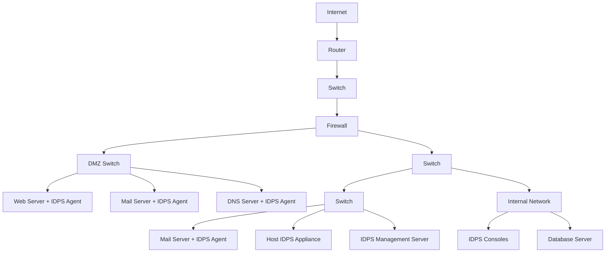
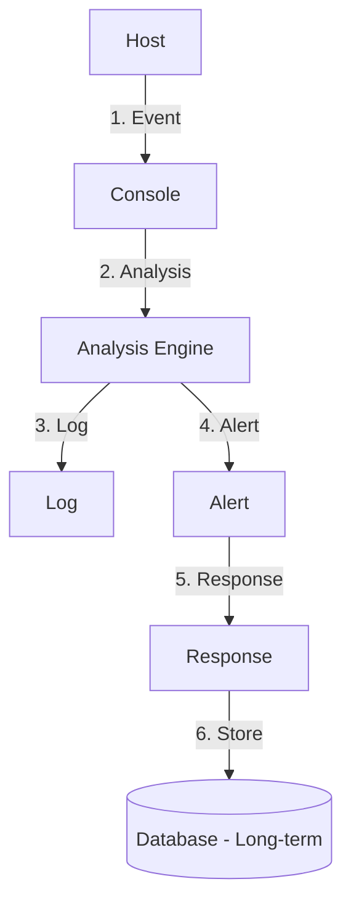
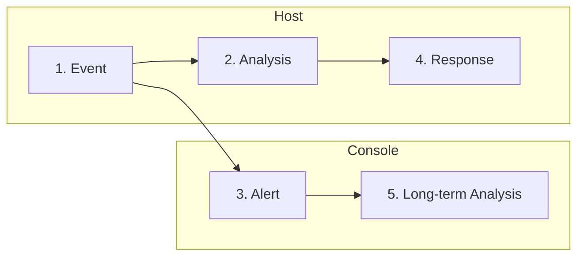
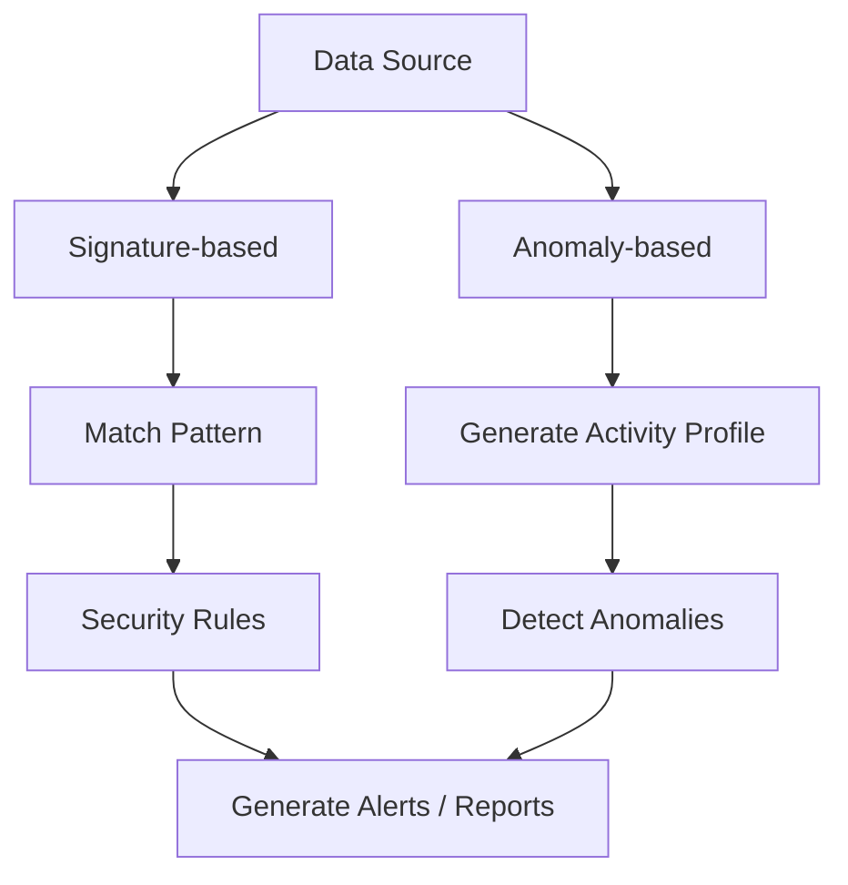
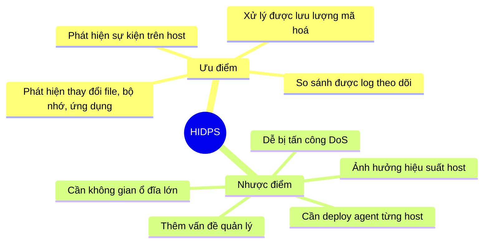
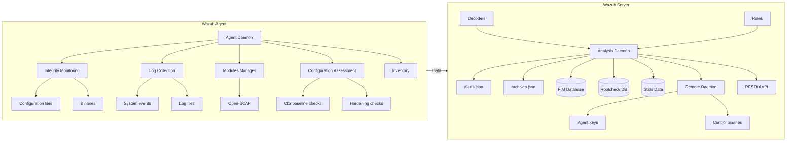

# Bài 5: Host-based IDPS (HIDPS)

> **Môn học:** NT204 – Hệ thống tìm kiếm, phát hiện và ngăn ngừa xâm nhập  
> **Tài liệu tham khảo:** NIST, Chương 7

---

## 1. Tổng quan Endpoint Security

Trong mạng LAN, có **2 thành phần chính** cần được bảo vệ:

- **Endpoint** – Các hosts thường là laptop, máy bàn, máy in, server, điện thoại IP, ...
- **Hạ tầng mạng** – Các thiết bị kết nối endpoint trong LAN: switch, thiết bị không dây, thiết bị thoại IP, ...

### Làm sao để bảo vệ các endpoint?

```
Discover → Inventory → Monitor → Protect
```

**Bộ giải pháp Host-based Security** gồm:

- Antivirus
- Anti-phishing
- Safe browsing
- Host-based Intrusion Prevention System (HIDPS)
- Firewall
- Ghi log (logging)

---

## 2. Host-based Malware Protection

Các phần mềm **Antimalware/Antivirus** hoạt động theo 3 phương pháp:

| Phương pháp | Mô tả |
|---|---|
| **Signature-based** | Phát hiện các đặc điểm khác nhau của những file malware đã biết |
| **Heuristics-based** | Phát hiện các tính năng chung thường được sử dụng bởi các loại malware |
| **Behavior-based** | Dựa trên việc phân tích các hành vi đáng ngờ |

---

## 3. Host-based Firewall

Host-based firewall là các chương trình phần mềm **kiểm soát traffic đi vào và đi ra** một máy tính/thiết bị.

Các loại host-based firewall phổ biến:

- **Windows Firewall** – Sử dụng hướng tiếp cận profile-based để cấu hình hoạt động của firewall
- **Iptables** – Cho phép cấu hình các rule kiểm soát truy cập trên các hệ thống Linux
- **Nftables** – Kế thừa từ iptables, sử dụng 1 máy ảo đơn giản trong kernel Linux
- **TCP Wrapper (Linux)** – Hệ thống kiểm soát truy cập và ghi log dựa trên rule

---

## 4. Host-based IDPS (HIDPS)

### Định nghĩa

**Host-based IDPS** theo dõi các đặc điểm của 1 host và các sự kiện xảy ra trong host đó (trong mạng LAN) để nhận biết các hành vi đáng ngờ.

### Những gì HIDPS theo dõi:

- Traffic mạng có dây và không dây (chỉ cho host/server đó)
- Log hệ thống, tiến trình đang chạy, các file, các hoạt động truy cập và thay đổi file
- Thay đổi trong cấu hình hệ thống và ứng dụng, registry (Windows)
- Traffic do host đó tạo ra

!!! warning "Lưu ý quan trọng"
    HIDPS **không lắng nghe** các gói tin khi chúng đi vào mạng LAN — đây là điểm khác biệt so với Network-based IDPS (NIDPS).

---

## 5. Các thành phần của HIDPS

### Agent

**Agent** là phần mềm hoặc phần cứng chuyên dụng, thực hiện theo dõi các hoạt động trên 1 host và gửi dữ liệu đến các server quản lý.

Mỗi agent thường được thiết kế cụ thể để bảo vệ:

=== "Một server"
    Theo dõi hệ điều hành của server, một số ứng dụng phổ biến

=== "Một client host (máy bàn hay laptop)"
    Theo dõi hệ điều hành và các ứng dụng client phổ biến như e-mail client, trình duyệt web, ...

=== "Một dịch vụ ứng dụng"
    Theo dõi một dịch vụ ứng dụng như Web server hoặc server CSDL  
    *(còn được gọi là **application-based IDPS**)*

!!! tip "Nên triển khai HIDPS ở đâu?"
    Thường được triển khai trên các host quan trọng như **các server có thể truy cập từ internet** và **các server chứa thông tin quan trọng**.

---

## 6. Kiến trúc mạng HIDPS



!!! info "Đặc điểm kiến trúc"
    - Agent được triển khai trên các host đang có trong mạng của tổ chức, **thay vì** sử dụng một mạng quản lý riêng.
    - Hầu hết các sản phẩm HIDPS **mã hoá giao tiếp** để tránh bị nghe lén.
    - Agent dựa trên phần cứng thường được triển khai **inline** ngay phía trước host cần được bảo vệ.

---

## 7. Vị trí triển khai Agent

- Có thể triển khai agent trên hầu hết các server và máy bàn/laptop.
- Thường dùng để phân tích các hoạt động mà **các biện pháp kiểm soát an ninh khác không theo dõi được**.

!!! example "Ví dụ điển hình"
    Network-based IDPS sensor **không thể** phân tích các hoạt động trong các kết nối mạng được mã hoá, nhưng host-based IDPS agent cài đặt trên các endpoint **có thể** theo dõi các hoạt động sau khi giải mã.

### Các yếu tố cần xem xét khi lựa chọn vị trí agent:

- **Chi phí** triển khai, vận hành và theo dõi các agent
- Các **hệ điều hành** và **ứng dụng** được agent hỗ trợ
- **Tầm quan trọng** của dữ liệu hoặc dịch vụ trên các host
- **Khả năng hỗ trợ** các agent của hạ tầng

---

## 8. Các kiến trúc Host

### 8.1 Cấu hình tập trung (Centralized)



**Đặc điểm:**
- Các agent gửi **tất cả dữ liệu** đến 1 vị trí trung tâm
- Hiệu suất của host **không bị ảnh hưởng** bởi IDPS
- Các cảnh báo **có thể không theo thời gian thực**

!!! success "Yêu cầu tài nguyên"
    Yêu cầu **ít CPU, RAM, ổ cứng** trên các host.

### 8.2 Cấu hình phân tán (Distributed)



**Đặc điểm:**
- Việc xử lý các sự kiện được **phân tán** giữa host và console
- Host tạo và phân tích sự kiện **theo thời gian thực**
- **Giảm hiệu suất** trên các host

!!! warning "Yêu cầu tài nguyên"
    Các host nên được trang bị **tối đa CPU, RAM, ổ cứng**.

---

## 9. Hoạt động của HIDPS

HIDPS có khả năng ngăn chặn tấn công do sử dụng các kỹ thuật phát hiện sau:



| Kỹ thuật | Mô tả |
|---|---|
| **Signature-based** | Hành vi bình thường được định nghĩa bằng các rule; phát hiện hành vi vi phạm rule đã định nghĩa trước |
| **Anomaly-based** | Hành vi của host được so sánh với một mô hình baseline đã được học trước (các ngưỡng) |

---

## 10. Khả năng bảo mật của HIDPS

### 10.1 Khả năng phát hiện tấn công

#### Các kỹ thuật phát hiện:

??? info "Phân tích code"
    Xác định các hành động đáng ngờ bằng cách phân tích các lần thực thi mã code.
    
    - **Phân tích hoạt động của code:** Thực thi code trong **sandbox** để phân tích hành vi.
    - **Phát hiện Buffer overflow:** Tìm các đặc điểm đặc trưng như một chuỗi các instruction hay hành vi truy cập vào vùng nhớ không được cấp phát cho tiến trình đó.

??? info "Theo dõi lệnh gọi hệ thống (System call)"
    Biết ứng dụng hay tiến trình nào nên gọi ứng dụng hay tiến trình nào khác hoặc thực hiện các hành động nhất định. Agent có thể **giới hạn driver** nào có thể được load để ngăn việc cài đặt rootkit hoặc các tấn công khác.

??? info "Danh sách ứng dụng và thư viện"
    Để giới hạn các ứng dụng, thư viện cũng như phiên bản nhất định nào có thể được dùng.

??? info "Phân tích lưu lượng mạng"
    Phân tích các ứng dụng thông dụng, client email phổ biến, trích xuất các file gửi bởi các ứng dụng như email, web và các file gửi peer-to-peer.

??? info "Lọc lưu lượng mạng"
    Thường bao gồm 1 tường lửa host-based có thể giới hạn lưu lượng ra và vào cho mỗi ứng dụng trên hệ thống để ngăn chặn các truy cập trái phép và các hành vi vi phạm chính sách.

??? info "Theo dõi hệ thống file (File System)"
    Kiểm tra tính toàn vẹn của file, kiểm tra các đặc điểm của file, theo dõi các truy cập file.

??? info "Phân tích log"
    Theo dõi và phân tích các log của OS và ứng dụng để phát hiện hành vi bất thường.

??? info "Theo dõi cấu hình mạng"
    Theo dõi các cấu hình mạng hiện tại và phát hiện các thay đổi trên các cấu hình này.

#### Độ chính xác

!!! note "Thách thức về độ chính xác"
    Nhiều kỹ thuật phát hiện tấn công như phân tích log hay theo dõi file system **không có kiến thức về ngữ cảnh** các sự kiện diễn ra.

    **Giải pháp:** Sử dụng kết hợp nhiều kỹ thuật phát hiện để đạt được khả năng phát hiện chính xác hơn.

#### Tuỳ chỉnh

Kết nối tự động HIDPS với các hệ thống quản lý thay đổi là **không khả thi**.

Quản trị viên cần thường xuyên:
- Xem các record quản lý các thay đổi
- Thay đổi các cấu hình host và các policy trên HIDPS để ngăn false positive

Hỗ trợ tuỳ chỉnh:
- Các policies có thể linh hoạt được cài đặt trên **một hoặc nhóm** các host
- Hỗ trợ **whitelist** và **blacklist**
- Tuỳ chỉnh các cảnh báo, xác định hành động phản ứng cần được thực hiện với mỗi cảnh báo

---

### 10.2 Khả năng ngăn chặn tấn công

| Kỹ thuật | Khả năng ngăn chặn |
|---|---|
| **Phân tích code** | Ngăn việc code được thực thi (malware, ứng dụng không có quyền); ngăn ứng dụng mạng gọi shell |
| **Phân tích lưu lượng mạng** | Ngăn việc xử lý lưu lượng mạng đi vào/ra host |
| **Lọc lưu lượng mạng** | Ngăn các truy cập trái phép và vi phạm chính sách |
| **Theo dõi hệ thống file** | Ngăn việc truy cập, thay đổi, ghi đè, hoặc xoá file; ngăn cài đặt malware |

---

### 10.3 Các khả năng khác

- **Giới hạn thiết bị removable:** Giới hạn sử dụng USB và các thiết bị lưu trữ truyền thống.
- **Giám sát thiết bị nghe nhìn:** Giám sát khi host kích hoạt/sử dụng microphone, camera, điện thoại IP, ...
- **Host Hardening:** Gỡ bỏ app không cần thiết; khóa port/dịch vụ không cần thiết; khóa/thay đổi tài khoản/mật khẩu mặc định.
- **Theo dõi trạng thái tiến trình:** Theo dõi tiến trình/dịch vụ đang chạy; tự động khởi chạy lại nếu phát hiện tiến trình đã dừng.
- **Làm sạch (sanitize) lưu lượng mạng:** Một số agent (thường là loại phần cứng) có thể làm sạch lưu lượng mạng theo dõi được.

---

## 11. Quản lý HIDPS

### Triển khai

!!! tip "Kiểm tra trước khi triển khai"
    Sau khi đánh giá các thành phần của host-based IDPS trên **môi trường thử nghiệm**, các tổ chức nên triển khai trên một **vùng thí điểm nhỏ** trong mạng sản xuất.

!!! warning "Bảo vệ các thành phần"
    Nếu các server quản lý và console cần chứng thực với mỗi agent để quản lý và thu thập dữ liệu, doanh nghiệp nên đảm bảo rằng cơ chế chứng thực có thể **quản lý và bảo mật đúng cách**.

### Vận hành

- Tương tự như các công nghệ IDPS điển hình.
- Một số agent có khả năng **định kỳ kiểm tra cập nhật** trên server quản lý và tự động lấy về để cài đặt/áp dụng.

---

## 12. Hạn chế của HIDPS

!!! danger "Các hạn chế chính"

    **1. Độ trễ khi tạo cảnh báo và báo cáo tập trung**
    
    - Một số kỹ thuật chỉ kiểm tra định kỳ (theo giờ hoặc vài lần trong ngày) → tạo ra **độ trễ đáng kể**.
    - Nhiều HIDPS được thiết kế để chuyển cảnh báo đến server quản lý **định kỳ**, chứ không theo thời gian thực.

    **2. Sử dụng tài nguyên của host**
    
    - Hoạt động trên agent có thể làm chậm các hoạt động khác như kết nối mạng và sử dụng hệ thống file.

    **3. Xung đột với các cơ chế kiểm soát an ninh đang có**
    
    - Ví dụ: personal firewall, nếu có các chức năng bị trùng lặp.

---

## 13. Ưu điểm và Nhược điểm



---

## 14. Một số nền tảng HIDPS phổ biến

Hầu hết HIDPS sử dụng phần mềm trên host và một số chức năng quản lý bảo mật tập trung cho phép tích hợp với các dịch vụ theo dõi an ninh mạng và threat intelligence.

| Nền tảng | Mô tả |
|---|---|
| **Cisco AMP** | Advanced Malware Protection for Endpoints |
| **AlienVault USM** | Unified Security Management |
| **Tripwire** | File Integrity Monitoring & Security Configuration Management |
| **Wazuh** | Nền tảng bảo mật mã nguồn mở toàn diện |
| **OSSEC** | Open Source HIDS SECurity |

### Wazuh – Nền tảng bảo mật mã nguồn mở toàn diện



**Các chức năng của Wazuh:**

- Security Analytics
- Intrusion Detection
- Log Data Analysis
- File Integrity Monitoring
- Vulnerability Detection
- Configuration Assessment
- Incident Response
- Regulatory Compliance
- Cloud Security
- Containers Security

---

## Câu hỏi Trắc nghiệm

---

**Câu 1.** Host-based IDPS (HIDPS) theo dõi những gì để nhận biết hành vi đáng ngờ?

- A. Toàn bộ lưu lượng mạng trong LAN
- B. Các đặc điểm của host và các sự kiện xảy ra trong host đó
- C. Chỉ các gói tin đến từ internet
- D. Chỉ các tiến trình hệ thống đang chạy

??? success "Đáp án: B"
    HIDPS theo dõi **các đặc điểm của 1 host và các sự kiện xảy ra trong host đó** (trong mạng LAN) để nhận biết các hành vi đáng ngờ.

---

**Câu 2.** Đâu là điểm khác biệt quan trọng của HIDPS so với Network-based IDPS?

- A. HIDPS không thể phát hiện tấn công
- B. HIDPS không lắng nghe các gói tin khi chúng đi vào mạng LAN
- C. HIDPS chỉ hoạt động trên Windows
- D. HIDPS không có khả năng ghi log

??? success "Đáp án: B"
    HIDPS theo dõi traffic do host đó tạo ra nhưng **không lắng nghe các gói tin khi chúng đi vào mạng LAN** – đây là điểm khác biệt so với NIDPS.

---

**Câu 3.** Trong Host-based Security, 4 bước bảo vệ endpoint theo thứ tự đúng là?

- A. Monitor → Discover → Inventory → Protect
- B. Discover → Monitor → Inventory → Protect
- C. Discover → Inventory → Monitor → Protect
- D. Inventory → Discover → Protect → Monitor

??? success "Đáp án: C"
    Thứ tự 4 bước chính là: **Discover → Inventory → Monitor → Protect**.

---

**Câu 4.** Phương pháp phát hiện malware nào dựa trên việc nhận diện các đặc điểm của file malware đã biết?

- A. Behavior-based
- B. Heuristics-based
- C. Signature-based
- D. Anomaly-based

??? success "Đáp án: C"
    **Signature-based** phát hiện các đặc điểm khác nhau của những file malware đã biết.

---

**Câu 5.** Phương pháp phát hiện malware nào dựa trên phân tích hành vi đáng ngờ?

- A. Signature-based
- B. Behavior-based
- C. Heuristics-based
- D. Rule-based

??? success "Đáp án: B"
    **Behavior-based** dựa trên việc phân tích các hành vi đáng ngờ.

---

**Câu 6.** Nftables là gì?

- A. Một loại firewall phần cứng
- B. Một firewall cho Windows sử dụng profile-based
- C. Kế thừa từ iptables, là ứng dụng firewall Linux sử dụng máy ảo đơn giản trong kernel
- D. Một hệ thống kiểm soát truy cập dựa trên rule cho Unix

??? success "Đáp án: C"
    **Nftables** kế thừa từ iptables, là ứng dụng firewall cho Linux sử dụng **1 máy ảo đơn giản trong kernel Linux**.

---

**Câu 7.** TCP Wrapper được sử dụng trên hệ điều hành nào?

- A. Windows
- B. macOS
- C. Linux
- D. FreeBSD

??? success "Đáp án: C"
    **TCP Wrapper** là hệ thống kiểm soát truy cập và ghi log dựa trên rule dành cho **các thiết bị Linux**.

---

**Câu 8.** Agent trong HIDPS là gì?

- A. Một thiết bị phần cứng đặt tại gateway
- B. Phần mềm hoặc phần cứng chuyên dụng theo dõi hoạt động trên 1 host và gửi dữ liệu đến server quản lý
- C. Một server quản lý trung tâm
- D. Một loại firewall đặc biệt

??? success "Đáp án: B"
    **Agent** là phần mềm hoặc phần cứng chuyên dụng, thực hiện theo dõi các hoạt động trên 1 host, gửi dữ liệu đến các server quản lý.

---

**Câu 9.** HIDPS thường được triển khai ưu tiên trên loại host nào?

- A. Tất cả các máy tính trong mạng
- B. Chỉ các máy bàn của nhân viên
- C. Các server có thể truy cập từ internet và server chứa thông tin quan trọng
- D. Chỉ các router và switch

??? success "Đáp án: C"
    HIDPS thường được triển khai trên các host quan trọng như **các server có thể được truy cập từ internet** và **các server chứa thông tin quan trọng**.

---

**Câu 10.** Loại agent nào theo dõi một dịch vụ ứng dụng cụ thể như Web server hoặc server cơ sở dữ liệu?

- A. Server agent
- B. Client agent
- C. Application-based IDPS agent
- D. Network agent

??? success "Đáp án: C"
    Agent theo dõi một dịch vụ ứng dụng như Web server hoặc server CSDL còn được gọi là **application-based IDPS**.

---

**Câu 11.** Ưu điểm của HIDPS so với NIDPS khi xử lý kết nối mã hoá là gì?

- A. HIDPS không thể xử lý kết nối mã hoá
- B. HIDPS có thể theo dõi hoạt động **sau khi giải mã** ở endpoint
- C. HIDPS giải mã trực tiếp trên đường truyền
- D. HIDPS bỏ qua các kết nối mã hoá

??? success "Đáp án: B"
    Network-based IDPS sensor không thể phân tích các hoạt động trong kết nối mạng được mã hoá, nhưng host-based IDPS agent cài đặt trên các endpoint **có thể theo dõi các hoạt động sau khi giải mã**.

---

**Câu 12.** Trong cấu hình tập trung (Centralized) của HIDPS, điều gì xảy ra với hiệu suất của host?

- A. Hiệu suất bị giảm đáng kể
- B. Hiệu suất không bị ảnh hưởng bởi IDPS
- C. Hiệu suất tăng lên
- D. Host không thể hoạt động bình thường

??? success "Đáp án: B"
    Trong cấu hình tập trung, các agent gửi tất cả dữ liệu đến 1 vị trí trung tâm → **hiệu suất của host không bị ảnh hưởng** bởi IDPS.

---

**Câu 13.** Nhược điểm nào của cấu hình tập trung so với phân tán?

- A. Tốn nhiều tài nguyên trên host hơn
- B. Cảnh báo có thể không theo thời gian thực
- C. Không hỗ trợ nhiều host
- D. Không thể ghi log

??? success "Đáp án: B"
    Trong cấu hình tập trung, **các cảnh báo có thể không theo thời gian thực**.

---

**Câu 14.** Trong cấu hình phân tán (Distributed), host thực hiện chức năng gì?

- A. Chỉ thu thập dữ liệu và gửi về server
- B. Tạo và phân tích sự kiện theo thời gian thực
- C. Không thực hiện bất kỳ phân tích nào
- D. Chỉ lưu log dài hạn

??? success "Đáp án: B"
    Trong cấu hình phân tán, **host tạo và phân tích sự kiện theo thời gian thực**.

---

**Câu 15.** Kỹ thuật phát hiện nào trong HIDPS thực thi code trong sandbox để phân tích hành vi?

- A. Signature-based detection
- B. Buffer overflow detection
- C. Phân tích hoạt động của code (Dynamic code analysis)
- D. System call monitoring

??? success "Đáp án: C"
    **Phân tích hoạt động của code** thực thi code trong **sandbox** để phân tích hành vi của nó.

---

**Câu 16.** Phát hiện buffer overflow trong HIDPS hoạt động như thế nào?

- A. So sánh checksum của file
- B. Phân tích nội dung email
- C. Tìm các đặc điểm đặc trưng như chuỗi instruction hoặc hành vi truy cập vùng nhớ không được cấp phát
- D. Theo dõi kết nối mạng

??? success "Đáp án: C"
    **Phát hiện Buffer overflow:** Tìm các đặc điểm đặc trưng như một chuỗi các instruction hay hành vi truy cập vào vùng nhớ khác vốn không được cấp phát cho tiến trình đó.

---

**Câu 17.** Agent trong HIDPS có thể giới hạn driver nào được load để ngăn chặn điều gì?

- A. Ngăn chặn truy cập internet
- B. Ngăn việc cài đặt rootkit hoặc các tấn công khác
- C. Ngăn chặn cập nhật hệ thống
- D. Ngăn chặn kết nối USB

??? success "Đáp án: B"
    Thông qua theo dõi System call, agent có thể giới hạn driver nào có thể được load để **ngăn việc cài đặt rootkit hoặc các tấn công khác**.

---

**Câu 18.** Chức năng "Lọc lưu lượng mạng" trong HIDPS thường bao gồm gì?

- A. Một proxy server
- B. Một tường lửa host-based có thể giới hạn lưu lượng ra/vào cho mỗi ứng dụng
- C. Một IDS network sensor
- D. Một VPN gateway

??? success "Đáp án: B"
    Lọc lưu lượng mạng **thường bao gồm 1 tường lửa host-based** có thể giới hạn lưu lượng ra và vào cho mỗi ứng dụng trên hệ thống.

---

**Câu 19.** Theo dõi File System trong HIDPS thực hiện những gì?

- A. Chỉ kiểm tra dung lượng ổ đĩa
- B. Kiểm tra tính toàn vẹn của file, kiểm tra đặc điểm file, theo dõi các truy cập file
- C. Chỉ theo dõi file được tạo mới
- D. Chỉ theo dõi file bị xoá

??? success "Đáp án: B"
    Theo dõi File System: **Kiểm tra tính toàn vẹn của file, kiểm tra các đặc điểm của file, theo dõi các truy cập file**.

---

**Câu 20.** Tại sao độ chính xác là thách thức lớn hơn đối với HIDPS?

- A. HIDPS có quá nhiều dữ liệu để xử lý
- B. Nhiều kỹ thuật phát hiện không có kiến thức về ngữ cảnh các sự kiện diễn ra
- C. HIDPS không hỗ trợ machine learning
- D. HIDPS chỉ có 1 kỹ thuật phát hiện

??? success "Đáp án: B"
    Nhiều kỹ thuật phát hiện tấn công như phân tích log hay theo dõi file system **không có kiến thức về ngữ cảnh** các sự kiện diễn ra → thách thức hơn với HIDPS.

---

**Câu 21.** Giải pháp để cải thiện độ chính xác của HIDPS là gì?

- A. Chỉ sử dụng signature-based detection
- B. Sử dụng kết hợp nhiều kỹ thuật phát hiện
- C. Tăng số lượng agent
- D. Giảm số lượng rule

??? success "Đáp án: B"
    **Sử dụng kết hợp nhiều kỹ thuật phát hiện** thường có thể đạt được khả năng phát hiện chính xác hơn so với sử dụng 1 hoặc một vài kỹ thuật.

---

**Câu 22.** Tại sao kết nối tự động HIDPS với hệ thống quản lý thay đổi là không khả thi?

- A. Vì HIDPS không hỗ trợ API
- B. Đây là nhận định từ bài giảng, do sự phức tạp trong việc đồng bộ thay đổi cấu hình
- C. Vì HIDPS không có console quản lý
- D. Vì chi phí quá cao

??? success "Đáp án: B"
    Theo bài giảng, kết nối tự động HIDPS với các hệ thống quản lý thay đổi là **không khả thi** → quản trị viên phải thủ công xem các record thay đổi và cập nhật policy.

---

**Câu 23.** HIDPS hỗ trợ cơ chế nào để kiểm soát danh sách ứng dụng được phép?

- A. Chỉ blacklist
- B. Chỉ whitelist
- C. Cả whitelist và blacklist
- D. Không hỗ trợ cả hai

??? success "Đáp án: C"
    HIDPS hỗ trợ **whitelist và blacklist** để kiểm soát các ứng dụng được phép.

---

**Câu 24.** Kỹ thuật ngăn chặn nào trong HIDPS có thể ngăn ứng dụng mạng gọi shell?

- A. Lọc lưu lượng mạng
- B. Phân tích code
- C. Theo dõi file system
- D. Phân tích log

??? success "Đáp án: B"
    **Phân tích code** ngăn việc code được thực thi, bao gồm các malware hoặc ứng dụng không có quyền; **ngăn các ứng dụng mạng gọi shell**.

---

**Câu 25.** Theo dõi hệ thống file trong HIDPS có thể ngăn chặn điều gì?

- A. Chỉ ngăn việc xoá file
- B. Ngăn việc truy cập, thay đổi, ghi đè, xoá file và ngăn cài đặt malware
- C. Chỉ ngăn việc copy file
- D. Không có khả năng ngăn chặn

??? success "Đáp án: B"
    Theo dõi hệ thống file: ngăn việc **truy cập, thay đổi, ghi đè, hoặc xoá file**, từ đó có thể ngăn việc cài đặt malware cũng như các tấn công có truy cập file không phù hợp.

---

**Câu 26.** Chức năng "Host Hardening" trong HIDPS bao gồm gì?

- A. Cài đặt thêm phần mềm bảo mật
- B. Gỡ bỏ app không cần thiết; khóa port/dịch vụ không cần thiết; khóa/thay đổi tài khoản/mật khẩu mặc định
- C. Chỉ cập nhật hệ điều hành
- D. Chỉ thay đổi mật khẩu

??? success "Đáp án: B"
    **Host Hardening:** Gỡ bỏ app không cần thiết; khóa port, dịch vụ không cần thiết; khóa/thay đổi tài khoản/mật khẩu mặc định, ...

---

**Câu 27.** Chức năng "Theo dõi trạng thái tiến trình" của HIDPS hoạt động như thế nào khi phát hiện một tiến trình/dịch vụ đã dừng?

- A. Gửi cảnh báo và chờ admin xử lý
- B. Tự động khởi chạy lại tiến trình đó
- C. Tắt host để bảo vệ
- D. Chặn toàn bộ kết nối mạng

??? success "Đáp án: B"
    Nếu phát hiện đã dừng, các sản phẩm này có thể **tự động khởi chạy lại** chúng.

---

**Câu 28.** Loại agent nào thường thực hiện chức năng "Làm sạch (sanitize) lưu lượng mạng"?

- A. Agent phần mềm
- B. Agent dựa trên phần cứng
- C. Agent ảo
- D. Agent cloud

??? success "Đáp án: B"
    Một số agent, thường là loại **triển khai dựa trên phần cứng**, có thể làm sạch lưu lượng mạng theo dõi được.

---

**Câu 29.** Khi triển khai HIDPS, sau khi đánh giá trên môi trường thử nghiệm, bước tiếp theo nên là gì?

- A. Triển khai ngay trên toàn bộ mạng sản xuất
- B. Triển khai trên một vùng thí điểm nhỏ trong mạng sản xuất
- C. Đánh giá thêm trong môi trường thử nghiệm
- D. Chờ đến khi có sự cố mới triển khai

??? success "Đáp án: B"
    Sau khi đánh giá trên môi trường thử nghiệm, tổ chức nên triển khai trên **một vùng thí điểm nhỏ** trong mạng sản xuất.

---

**Câu 30.** Một số agent HIDPS có thể tự động làm gì liên quan đến cập nhật?

- A. Cập nhật hệ điều hành của host
- B. Định kỳ kiểm tra cập nhật trên server quản lý và tự động lấy về cài đặt
- C. Gửi email thông báo cho admin khi có cập nhật
- D. Chặn mọi cập nhật để đảm bảo ổn định

??? success "Đáp án: B"
    Một số agent có khả năng **định kỳ kiểm tra cập nhật** trên server quản lý và **tự động lấy về để cài đặt/áp dụng** các cập nhật đó.

---

**Câu 31.** Đâu là hạn chế về mặt thời gian của HIDPS trong cấu hình tập trung?

- A. HIDPS không thể tạo cảnh báo
- B. Cảnh báo có thể bị trễ do được chuyển định kỳ chứ không theo thời gian thực
- C. HIDPS chỉ hoạt động theo lịch định sẵn
- D. HIDPS không hỗ trợ cảnh báo tự động

??? success "Đáp án: B"
    Nhiều host-based IDPS được thiết kế để chuyển cảnh báo đến server quản lý **định kỳ**, chứ không theo thời gian thực → **độ trễ đáng kể**.

---

**Câu 32.** HIDPS có thể xung đột với loại cơ chế bảo mật nào?

- A. Antivirus
- B. Personal firewall nếu có chức năng bị trùng lặp
- C. VPN
- D. Proxy server

??? success "Đáp án: B"
    HIDPS có thể xung đột với các cơ chế kiểm soát an ninh đang có, ví dụ **personal firewall**, nếu có các chức năng bị trùng lặp.

---

**Câu 33.** Ưu điểm nào của HIDPS so với NIDPS trong việc phát hiện thay đổi hệ thống?

- A. HIDPS phát hiện tấn công mạng nhanh hơn
- B. HIDPS phát hiện được thay đổi trong các file, bộ nhớ và ứng dụng trên host
- C. HIDPS có thể giám sát toàn bộ mạng
- D. HIDPS không cần cập nhật signature

??? success "Đáp án: B"
    HIDPS có thể **phát hiện các sự kiện trên hệ thống host, phát hiện thay đổi trong các file, bộ nhớ và ứng dụng**.

---

**Câu 34.** Nhược điểm nào liên quan đến quản lý khi triển khai HIDPS trên nhiều host?

- A. Phải mua license cho từng host
- B. Cần triển khai agent trên mỗi host muốn giám sát → thêm gánh nặng quản lý
- C. Không thể quản lý tập trung
- D. Agent không tương thích với nhau

??? success "Đáp án: B"
    HIDPS **thêm vấn đề quản lý**, cần triển khai agent trên mỗi host muốn giám sát.

---

**Câu 35.** HIDPS dễ bị tấn công loại nào nhất?

- A. Man-in-the-middle
- B. SQL Injection
- C. Denial of Service (DoS)
- D. Phishing

??? success "Đáp án: C"
    HIDPS có thể chịu các tấn công trực tiếp hoặc tấn công vào host, **dễ bị 1 số tấn công DoS**.

---

**Câu 36.** Wazuh OSSEC sử dụng kiến trúc gì?

- A. Chỉ agent, không có server
- B. Server quản lý trung tâm và các agents cài đặt trên các host riêng biệt
- C. Peer-to-peer giữa các agent
- D. Chỉ cloud-based

??? success "Đáp án: B"
    **OSSEC** sử dụng **server quản lý trung tâm** và **các agents cài đặt trên các host riêng biệt**.

---

**Câu 37.** Wazuh hỗ trợ những chức năng bảo mật nào? (Chọn tất cả đúng nhất)

- A. Chỉ Intrusion Detection
- B. Security Analytics, Intrusion Detection, Log Data Analysis, File Integrity Monitoring, Vulnerability Detection, ...
- C. Chỉ File Integrity Monitoring và Log Analysis
- D. Chỉ Cloud Security và Container Security

??? success "Đáp án: B"
    Wazuh là **nền tảng bảo mật toàn diện** bao gồm: Security Analytics, Intrusion Detection, Log Data Analysis, File Integrity Monitoring, Vulnerability Detection, Configuration Assessment, Incident Response, Regulatory Compliance, Cloud Security, Containers Security.

---

**Câu 38.** Trong Wazuh, thành phần nào chịu trách nhiệm phân tích dữ liệu nhận từ agents?

- A. Agent Daemon
- B. RESTful API
- C. Analysis Daemon (trên Wazuh Server)
- D. Remote Daemon

??? success "Đáp án: C"
    **Analysis Daemon** trên Wazuh Server chịu trách nhiệm phân tích dữ liệu (sử dụng Decoders và Rules).

---

**Câu 39.** Trong Wazuh Agent, thành phần nào thu thập log hệ thống và log file?

- A. Modules Manager
- B. Log Collection
- C. Configuration Assessment
- D. Inventory

??? success "Đáp án: B"
    **Log Collection** trong Wazuh Agent thu thập System events và Log files.

---

**Câu 40.** Heuristics-based detection trong antimalware khác gì so với signature-based?

- A. Heuristics-based nhận diện đặc điểm của malware đã biết
- B. Heuristics-based phát hiện các tính năng chung thường được sử dụng bởi các loại malware (không cần biết trước)
- C. Heuristics-based chỉ hoạt động trên Windows
- D. Heuristics-based không thể phát hiện malware mới

??? success "Đáp án: B"
    **Heuristics-based** phát hiện các tính năng chung thường được sử dụng bởi các loại malware – không cần có signature cụ thể, có thể phát hiện malware mới.

---

**Câu 41.** Kỹ thuật "Phân tích lưu lượng mạng" trong HIDPS bao gồm gì?

- A. Chỉ phân tích header gói tin
- B. Phân tích ứng dụng thông dụng, client email, trích xuất file gửi bởi email, web và peer-to-peer
- C. Chỉ phân tích lưu lượng HTTP
- D. Chỉ theo dõi DNS queries

??? success "Đáp án: B"
    Phân tích lưu lượng mạng: phân tích các ứng dụng thông dụng, client email phổ biến, **trích xuất các file gửi bởi các ứng dụng như email, web và các file gửi peer-to-peer**.

---

**Câu 42.** Tại sao hầu hết các sản phẩm HIDPS mã hoá giao tiếp giữa agent và server quản lý?

- A. Để tăng tốc độ truyền dữ liệu
- B. Để tránh việc bị nghe lén khi truy cập các thông tin quan trọng
- C. Yêu cầu bắt buộc của pháp luật
- D. Để giảm tải cho server

??? success "Đáp án: B"
    Hầu hết các sản phẩm HIDPS mã hoá giao tiếp để **tránh việc bị nghe lén khi truy cập các thông tin quan trọng**.

---

**Câu 43.** Agent dựa trên phần cứng trong HIDPS thường được triển khai ở đâu?

- A. Trong DMZ zone
- B. Inline ngay phía trước host cần được bảo vệ
- C. Trên router biên
- D. Trong cloud

??? success "Đáp án: B"
    Agent dựa trên phần cứng thường được triển khai **inline ngay phía trước host** cần được bảo vệ.

---

**Câu 44.** Các yếu tố nào cần xem xét khi lựa chọn vị trí triển khai agent? (Đâu KHÔNG phải là yếu tố cần xem xét?)

- A. Chi phí triển khai, vận hành và theo dõi agent
- B. Màu sắc của thiết bị phần cứng
- C. Hệ điều hành và ứng dụng được agent hỗ trợ
- D. Tầm quan trọng của dữ liệu hoặc dịch vụ trên các host

??? success "Đáp án: B"
    **Màu sắc của thiết bị phần cứng** không phải là yếu tố cần xem xét. Các yếu tố thực sự bao gồm: chi phí, hệ điều hành/ứng dụng hỗ trợ, tầm quan trọng của dữ liệu/dịch vụ, khả năng hỗ trợ agent của hạ tầng.

---

**Câu 45.** Chức năng "Giám sát thiết bị nghe nhìn" của HIDPS theo dõi những gì?

- A. Chỉ webcam
- B. Các host khi kích hoạt hoặc sử dụng microphone, camera, điện thoại IP, ...
- C. Chỉ microphone
- D. Chỉ loa ngoài

??? success "Đáp án: B"
    Giám sát các thiết bị nghe nhìn: giám sát các host khi kích hoạt hoặc sử dụng các thiết bị nghe nhìn như **microphone, camera, điện thoại IP**, ...

---

**Câu 46.** HIDPS sử dụng kỹ thuật phát hiện nào kết hợp để phát hiện các xâm nhập qua mặt được signature-based?

- A. Packet inspection
- B. Anomaly-based detection
- C. Deep packet inspection
- D. Port scanning

??? success "Đáp án: B"
    Có thể kết hợp chiến lược **Anomaly-based** để phát hiện các xâm nhập qua mặt được kỹ thuật phát hiện signature-based. Anomaly-based so sánh hành vi của host với một mô hình baseline đã được học trước.

---

**Câu 47.** Trong cấu hình phân tán của HIDPS, việc xử lý sự kiện được phân tán như thế nào?

- A. Chỉ trên server quản lý
- B. Giữa host và console
- C. Chỉ trên host
- D. Trên các agent khác nhau trong mạng

??? success "Đáp án: B"
    Trong cấu hình phân tán, việc xử lý các sự kiện được **phân tán giữa host và console**.

---

**Câu 48.** Cấu hình phân tán của HIDPS yêu cầu gì về tài nguyên phần cứng của host?

- A. Ít CPU, RAM, ổ cứng
- B. Tối đa CPU, RAM, ổ cứng
- C. Chỉ cần nhiều RAM
- D. Chỉ cần nhiều ổ cứng

??? success "Đáp án: B"
    Trong cấu hình phân tán, do host phải tự phân tích sự kiện theo thời gian thực → **các host nên được trang bị tối đa CPU, RAM, ổ cứng**.

---

**Câu 49.** Kỹ thuật "Theo dõi cấu hình mạng" trong HIDPS thực hiện gì?

- A. Theo dõi băng thông mạng
- B. Theo dõi các cấu hình mạng hiện tại và phát hiện các thay đổi trên các cấu hình này
- C. Chỉ theo dõi địa chỉ IP
- D. Chỉ theo dõi các kết nối đang hoạt động

??? success "Đáp án: B"
    **Theo dõi cấu hình mạng:** Theo dõi các cấu hình mạng hiện tại và phát hiện các thay đổi trên các cấu hình này.

---

**Câu 50.** Đâu là các nền tảng HIDPS phổ biến được đề cập trong bài?

- A. Snort, Suricata, Zeek
- B. Cisco AMP, AlienVault USM, Tripwire, Wazuh, OSSEC
- C. Wireshark, tcpdump, nmap
- D. pfSense, OPNsense, Fortinet

??? success "Đáp án: B"
    Các nền tảng HIDPS phổ biến được đề cập: **Cisco AMP, AlienVault USM, Tripwire, Wazuh**, và Open Source HIDS SECurity (**OSSEC**).
