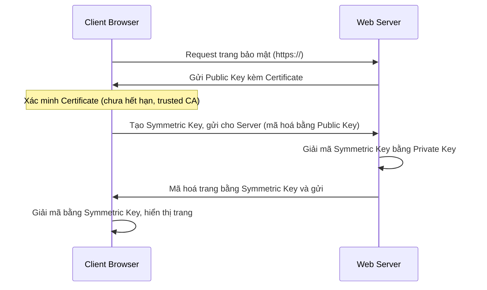
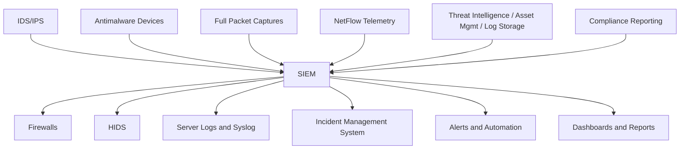
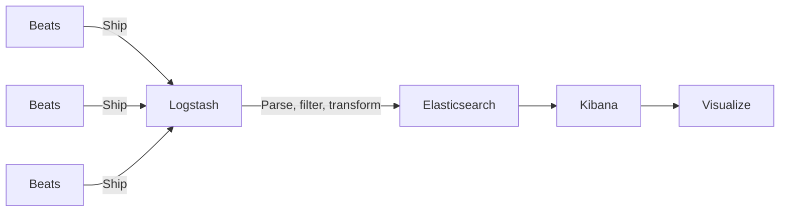
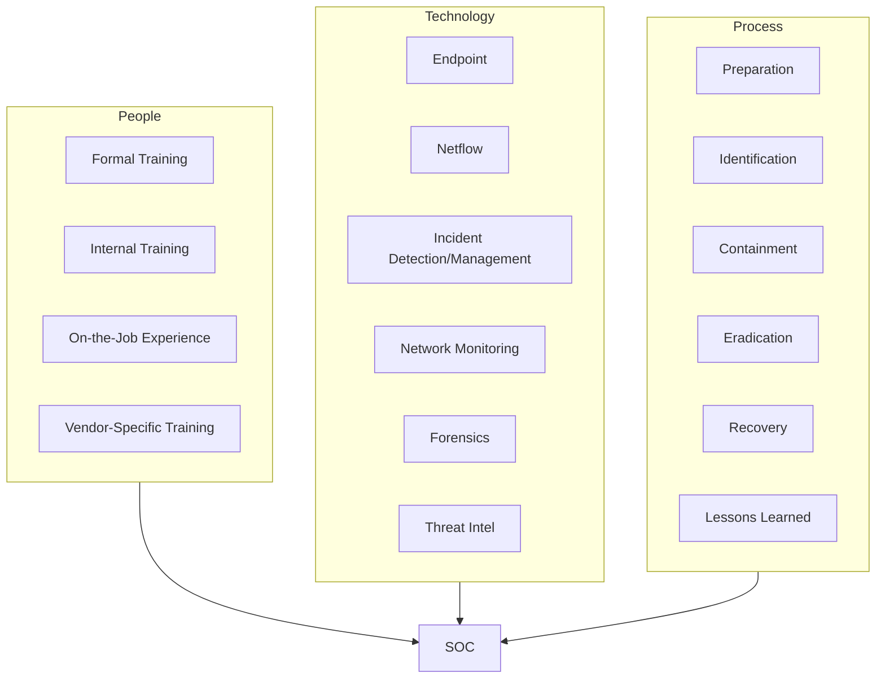

# Bài 6: Security Monitoring, SIEM, SOC

## 1. Tổng quan về Giám sát An ninh

!!! info "Security Monitoring là gì?"
    **Security Monitoring** (Giám sát An ninh) còn được gọi là:
    
    - **SIM** – Security Information Monitoring
    - **SEM** – Security Event Monitoring
    
    Bao gồm **thu thập** và **phân tích** thông tin để:
    
    - Phát hiện các hành vi đáng ngờ hoặc thay đổi hệ thống trái phép trên mạng
    - Xác định loại hành vi nào nên được **cảnh báo**
    - Xác định **hành động** cần thực hiện khi có cảnh báo

---

## 2. Giám sát các Giao thức Thông dụng

### 2.1 Syslog

!!! note "Syslog – System Logging Protocol"
    - Là giao thức **chuẩn** dùng để gửi log hệ thống hoặc thông điệp sự kiện đến một **syslog server**
    - Ghi lại các sự kiện từ các **thiết bị mạng** và **thiết bị đầu cuối**
    - Server syslog thường lắng nghe trên port **UDP 514** (cũng có thể dùng TCP)

!!! warning "Rủi ro bảo mật"
    - Các syslog server có thể trở thành **mục tiêu bị tấn công**
    - Hacker có thể ngăn việc truyền/nhận dữ liệu
    - Hacker có thể **làm giả dữ liệu log** hoặc giả mạo phần mềm tạo/truyền log
    - Cải tiến: **syslog-ng** (next generation)

#### So sánh các biến thể Syslog

| Công cụ | Tác giả | Năm | Loại | Đặc điểm |
|---|---|---|---|---|
| **syslog** | Eric Allman | 1980 | Protocol/Specification | Chuẩn logging, định nghĩa format và độ tin cậy |
| **syslog-ng** | Balázs Scheidler | 1998 | Syslog implementation | TCP, content-based filtering |
| **rsyslog** | Rainer Gerhards | 2004 | Syslog implementation | REPL, TCP forwarding, TLS, advanced filtering |

---

### 2.2 NTP (Network Time Protocol)

!!! note "NTP"
    - Gói tin syslog thường được **gán nhãn thời gian** bằng NTP
    - NTP hoạt động trên port **UDP 123**
    - Nhãn thời gian **rất quan trọng** trong việc phát hiện tấn công

!!! warning "Rủi ro bảo mật"
    - Kẻ tấn công có thể tấn công vào NTP để **gián đoạn thông tin thời gian** dùng cho việc liên kết các sự kiện mạng đã được ghi log
    - Kẻ tấn công có thể dùng hệ thống NTP để **chỉ đạo tấn công DDoS**

---

### 2.3 DNS

!!! danger "DNS bị lợi dụng bởi Malware"
    - DNS được sử dụng trong **nhiều loại malware**
    - Kẻ tấn công đóng gói các giao thức khác **bên trong DNS** để qua mặt thiết bị an ninh
    - Malware dùng DNS để giao tiếp với **server Command-and-Control (CnC)**
    - Dữ liệu đánh cắp được **ngụy trang** dưới dạng truy vấn DNS thông thường

!!! example "DNS Exfiltration – Đánh cắp dữ liệu qua DNS"
    Malware mã hoá (encode) dữ liệu đánh cắp vào **phần subdomain** của truy vấn DNS:
    
    ```
    aW4gcGxhY2UgdG8gcHJvdGVjdC5leGFtcGxlLmNvbQ==.example.com
    BhZ2FpbnN0IEROUyBiYXNIZCB0a.example.com
    HJlYXRzIHRoYW4gdGdlSBoYXZl.example.com
    IHRvIHByb3RlY3QgWgYWdhaW5z.example.com
    ```
    → Dữ liệu được **Base64-encode** trong subdomain, ngụy trang là DNS query bình thường

!!! warning "Dấu hiệu đáng ngờ"
    - Tên domain được **tạo ngẫu nhiên**
    - Subdomain dạng **chuỗi ngẫu nhiên rất dài**
    - Xuất hiện với **số lượng nhiều bất thường** trong mạng

---

### 2.4 HTTP và HTTPS

#### HTTP

!!! warning "HTTP – Không an toàn"
    - Tất cả thông tin truyền nhận đều ở dạng **plaintext**
    - HTTP **không bảo vệ** dữ liệu khỏi hành vi thay đổi hoặc chặn gói

!!! danger "Tấn công HTTP iFrame Injection"
    1. Kẻ tấn công **chiếm một web server**
    2. Cài mã độc tạo **iFrame ẩn** trên các trang web thường được truy cập
    3. Khi iFrame được load trên trình duyệt client → **malware được tải về máy**

#### HTTPS

!!! note "HTTPS – Bảo mật hơn"
    - Thêm một lớp **mã hoá (encryption)** vào HTTP bằng **SSL/TLS**
    - Dữ liệu HTTP **không thể đọc được** khi truyền đi cho đến khi đến máy đích



!!! warning "Thách thức giám sát HTTPS"
    - Traffic đã mã hoá của HTTPS có thể **làm phức tạp hoạt động giám sát an ninh**
    - Việc bắt gói tin HTTPS **phức tạp hơn** so với HTTP

---

### 2.5 Giao thức Email (SMTP, POP3, IMAP)

!!! danger "Email bị lợi dụng"
    Các giao thức **SMTP, POP3, IMAP** có thể bị dùng để:
    
    - Lan truyền **malware**
    - Đánh cắp **dữ liệu**
    - Tạo các kênh giao tiếp với **server CnC**

| Giao thức | Chức năng | Rủi ro |
|---|---|---|
| **SMTP** | Gửi dữ liệu từ host đến server mail, giữa các server mail | Không phải lúc nào cũng được giám sát |
| **IMAP** | Tải email từ server mail về host | Có thể tải malware về host |
| **POP3** | Tải email từ server mail về host | Có thể tải malware về host |

!!! tip "Giám sát an ninh Email"
    Có thể **nhận dạng malware dưới dạng file đính kèm** đi vào mạng và xác định host nào sẽ bị ảnh hưởng đầu tiên.

---

### 2.6 ICMP

!!! danger "ICMP bị lợi dụng"
    ICMP có thể được sử dụng để:
    
    - Xác định các **host có trong mạng**, kiến trúc mạng, hệ điều hành
    - Thực hiện các **tấn công DoS**
    - **Đánh cắp dữ liệu** thông qua traffic ICMP từ bên trong mạng (**ICMP Tunneling**)

!!! example "ICMP Tunneling"
    Malware tạo các gói ICMP để **truyền file** từ host bị nhiễm đến kẻ tấn công, ẩn trong các gói ICMP bình thường.

---

## 3. Các Công nghệ An ninh và Ảnh hưởng đến Giám sát

### 3.1 ACLs (Access Control Lists)

!!! warning "Hạn chế của ACLs"
    ACLs có thể tạo ra **cảm giác sai về an toàn** (*false sense of security*):
    
    - Kẻ tấn công có thể xác định IP, giao thức và port nào được cho phép bởi ACL thông qua: **Port scanning**, **Penetration testing**, hoặc các hoạt động **do thám mạng**
    - Kẻ tấn công có thể tạo gói tin sử dụng **địa chỉ IP nguồn giả mạo**
    - Ứng dụng có thể tạo kết nối với **port bất kỳ**

---

### 3.2 NAT và PAT

!!! warning "NAT/PAT gây khó khăn giám sát"
    - **NAT** (Network Address Translation) và **PAT** (Port Address Translation) có thể khiến giám sát an ninh **trở nên phức tạp**
    - Nhiều địa chỉ IP cùng được ánh xạ đến **một hoặc nhiều địa chỉ IP công cộng**
    - **Ẩn** các địa chỉ IP riêng bên trong mạng → khó truy vết nguồn gốc tấn công

---

### 3.3 Mã hoá (Encryption) và Tunneling

!!! info "Encryption"
    - Nội dung traffic **không thể đọc được**, ngay cả với người phân tích an ninh mạng
    - Là một phần trong hoạt động của **VPN** và **HTTPS**

!!! danger "Malware Tunneling"
    - Malware có thể tạo một **tunnel được mã hoá** sử dụng các giao thức phổ biến và tin cậy
    - Sau đó dùng tunnel này để **đánh cắp dữ liệu** từ mạng
    - Tạo **kết nối ảo point-to-point** giữa host bên trong mạng và thiết bị của kẻ tấn công

---

### 3.4 Mạng Peer-to-Peer (P2P) và Tor

!!! warning "P2P"
    - Có thể **phá vỡ biện pháp bảo vệ** của tường lửa
    - Là phương pháp phổ biến để **lây lan malware**
    - 3 dạng ứng dụng P2P: **chia sẻ file**, **chia sẻ processor**, **IM (tin nhắn)**
    - Các ứng dụng chia sẻ file P2P **không nên cho phép** hoạt động trong mạng công ty

!!! danger "Tor"
    - Là nền tảng phần mềm và mạng các host kết nối P2P hoạt động như các **router trên mạng Tor**
    - Cho phép người dùng truy cập Internet **ẩn danh** bằng trình duyệt đặc biệt
    - Có thể dùng **che giấu danh tính kẻ tấn công**
    - Được dùng bởi các **tổ chức tội phạm**

---

### 3.5 Load Balancing (Cân bằng tải)

!!! info "Load Balancing"
    - Là hoạt động **phân phối lưu lượng mạng** giữa các thiết bị hoặc đường mạng để tránh quá tải
    - Một số phương pháp dùng **DNS** để gửi traffic đến tài nguyên có cùng tên domain nhưng **nhiều địa chỉ IP**
    - Có thể dẫn đến các **đặc điểm đáng ngờ** trong việc bắt gói tin (một kết nối xuất hiện với nhiều IP khác nhau)

---

## 4. Các Loại Dữ liệu An ninh

### 4.1 Dữ liệu Cảnh báo (Alert Data)

!!! note "Alert Data"
    - Gồm các gói tin tạo ra từ **IDS/IPS** khi có traffic vi phạm chính sách hoặc khớp với dấu hiệu tấn công
    - Một NIDS phổ biến: **Snort** – được cấu hình với các **rule** để phát hiện tấn công đã biết
    - Cảnh báo từ Snort có thể được đọc, tìm kiếm bằng ứng dụng như **Sguil** (một phần của bộ công cụ **Security Onion**)

---

## 5. Các File Log

### 5.1 Log của Host (End Device)

!!! info "HIDPS – Host-based IDPS"
    - Chạy trên các **host riêng biệt**
    - Không chỉ **phát hiện** tấn công mà còn có thể **ngăn chặn** tấn công (khi chạy dạng host-based firewall)
    - Tạo ra các log và lưu lại **trên host**

!!! tip "Event Viewer trên Windows"
    Log trên Microsoft Windows có thể xem bằng **Event Viewer**, hiển thị các loại log:
    
    - **Application Logs**
    - **System Logs**
    - **Setup Logs**
    - **Security Logs**

| Loại sự kiện | Mô tả |
|---|---|
| **Error** | Sự kiện chỉ ra vấn đề nghiêm trọng như mất dữ liệu hoặc mất chức năng |
| **Warning** | Không nhất thiết nghiêm trọng nhưng có thể chỉ ra vấn đề trong tương lai |
| **Information** | Mô tả hoạt động thành công của ứng dụng, driver, hoặc dịch vụ |
| **Success Audit** | Ghi lại một lần thử truy cập bảo mật đã được kiểm tra thành công |
| **Failure Audit** | Ghi lại một lần thử truy cập bảo mật đã được kiểm tra thất bại |

---

### 5.2 Syslog – Cấu trúc gói tin

!!! note "Cấu trúc gói tin Syslog"
    Gói tin Syslog gồm **3 phần**:

```
<165>1 2019-08-01T15:30:54.001Z ubuntu-box apache 200 20031 - "The Apache Server encountered an error"
 ^^^                                                                                                    
 PRI   |←————————————— HEADER ——————————————→|  |←————————————— MSG ————————————————————————————→|
```

| Phần | Nội dung |
|---|---|
| **PRI** | Priority = (Facility × 8) + Severity |
| **HEADER** | Timestamp, Hostname |
| **MSG** | Nội dung dạng văn bản |

#### Syslog Severity

| Integer | Severity |
|---|---|
| 0 | **Emergency**: System is unusable |
| 1 | **Alert**: Action must be taken immediately |
| 2 | **Critical**: Critical conditions |
| 3 | **Error**: Error conditions |
| 4 | **Warning**: Warning conditions |
| 5 | **Notice**: Normal but significant condition |
| 6 | **Informational**: Informational messages |
| 7 | **Debug**: Debug-level messages |

#### Syslog Facility

| Integer | Facility |
|---|---|
| 0 | **kern**: Kernel messages |
| 1 | **user**: User-level messages |
| 2 | **mail**: Mail system |
| 3 | **daemon**: System daemons |
| 4 | **auth**: Security/authorization messages |
| 5 | **syslog**: Messages generated internally by Syslogd |
| 6 | **lpr**: Line printer subsystem |
| 7 | **news**: Network news subsystem |
| 8 | **uucp**: Unix-to-Unix copy subsystem |
| 9 | Clock daemon |
| 10 | **authpriv**: Security/authorization messages |
| 11 | **ftp**: FTP daemon |
| 12 | **NTP** subsystem |
| 13 | Log audit |

!!! example "Ví dụ tính PRI"
    ```
    PRI = 165
    165 = 20 × 8 + 5
    → Facility = 20 (local4)
    → Severity = 5 (Notice)
    ```

---

### 5.3 Log của Server

!!! info "Log Server"
    Log của Server là nguồn dữ liệu **quan trọng** trong giám sát an ninh mạng:
    
    - Server Email và Web có **log truy cập (access)** và **log lỗi (error)**
    - Log của **server DNS proxy** ghi lại tất cả truy vấn DNS và phản hồi DNS trong mạng
    - Log DNS proxy có thể xác định host đã truy cập **website nguy hiểm**, các **tấn công DNS exfiltration**, hoặc kết nối đến **server CnC**

#### Apache Access Log

!!! note "Định dạng Apache Access Log"
    Apache Webserver ghi lại các **request từ client đến server**. Có 2 định dạng:
    
    - **CLF** – Common Log Format
    - **Dạng kết hợp** – CLF + thêm trường Referrer, User Agent

```
203.0.113.127 - dsmith [10/Oct/2016:10:26:57 -0500] "GET /logo_sm.gif HTTP/1.0" 200 2254 "http://www.example.com/links.html" "Mozilla/5.0 (Windows NT 6.1; Win64; x64; rv:47.0) Gecko/20100101 Firefox/47.0"
```

| Field | Tên | Mô tả | Ví dụ |
|---|---|---|---|
| 1 | Client IP | Địa chỉ IP client | 203.0.113.127 |
| 2 | Client identity | Thường bỏ qua | - |
| 3 | User ID | Tên user đã xác thực | dsmith |
| 4 | Timestamp | Ngày giờ request | [10/Oct/2016:10:26:57 -0500] |
| 5 | Request | Phương thức và tài nguyên | GET /logo_sm.gif HTTP/1.0 |
| 6 | Status Code | HTTP status code | 200 |
| 7 | Size of Response | Bytes trả về client | 2254 |
| 8 | Referrer | Nguồn dẫn đến | http://www.example.com/links.html |
| 9 | User Agent | Trình duyệt client | Mozilla/5.0 ... Firefox/47.0 |

#### IIS Access Log

!!! note "Microsoft IIS Access Log"
    Microsoft IIS tạo các log truy cập có thể xem bằng **Event Viewer**

```
6/14/2016, 16:22:43, 203.0.113.24, -, W3SVC2, WEB3, 198.51.100.10, 80, GET, /home.htm, -, 200, 0, 15321, 159, 15, HTTP/1.1, Mozilla/5.0 ...
```

| Field | Tên | Ví dụ |
|---|---|---|
| date | Ngày | 6/14/2016 |
| time | Giờ (UTC) | 16:22:43 |
| c-ip | Client IP | 203.0.113.24 |
| cs-username | User đã xác thực | - |
| s-sitename | Internet service name | W3SVC2 |
| s-computername | Server name | WEB3 |
| s-ip | Server IP | 198.51.100.10 |
| s-port | Server port | 80 |
| cs-method | HTTP method | GET |
| cs-uri-stem | Target | /home.htm |
| sc-status | HTTP Status | 200 |
| sc-bytes | Bytes sent | 15321 |
| cs-bytes | Bytes received | 159 |
| time-taken | Thời gian xử lý (ms) | 15 |
| cs-version | Protocol version | HTTP/1.1 |
| cs(User-Agent) | Browser | Mozilla/5.0 ... |

---

## 6. SIEM – Security Information and Event Management

### 6.1 Tổng quan SIEM

!!! info "SIEM là gì?"
    **SIEM** kết hợp chức năng của **SEM** (Security Event Management) và **SIM** (Security Information Management) để cung cấp **cái nhìn toàn diện về mạng** của tổ chức.

**Các chức năng của SIEM:**

- Thu thập log
- Chuẩn hoá
- Tương quan sự kiện
- Tích hợp
- Báo cáo
- Tuân thủ CNTT



!!! example "SIEM phổ biến"
    - **Splunk** – Một trong những SIEM thương mại phổ biến nhất
    - **ELK Stack** – Nền tảng SIEM mã nguồn mở

---

### 6.2 ELK Stack – SIEM Mã nguồn mở

!!! info "ELK Stack"
    **ELK** là từ viết tắt của 3 sản phẩm mã nguồn mở của **Elastic**:



| Thành phần | Vai trò |
|---|---|
| **Elasticsearch** | Công cụ tìm kiếm văn bản theo hướng tài liệu – **Stockage** |
| **Logstash** | Bộ tích hợp, thu thập và xử lý dữ liệu từ nhiều nguồn – **ETL** |
| **Kibana** | Dashboard phân tích và tìm kiếm chạy trên trình duyệt – **Visualisation** |
| **Beats** | Công cụ chuyển log nhỏ gọn, hỗ trợ mã hoá, có cơ chế khôi phục tốt |

---

## 7. SOC – Security Operations Center

### 7.1 SOC là gì?

!!! info "SOC – Security Operations Center"
    **SOC** là một vị trí **trung tâm** trong doanh nghiệp, có **chuyên gia, quy trình và công nghệ** để liên tục theo dõi và xử lý các vấn đề an ninh:
    
    - Phát hiện
    - Phân tích
    - Đánh giá
    - Báo cáo
    - Phản ứng với các vấn đề an ninh mạng



**Các thành phần hỗ trợ SOC:**

- Log Collection
- Aggregation & Correlation
- SIEM
- Ticketing
- Knowledge Base
- Threat Intelligence
- Research & Development
- Reporting

---

### 7.2 So sánh SIEM – SOC – NOC

!!! tip "SIEM vs SOC vs NOC"

| | NOC | SOC | SIEM |
|---|---|---|---|
| **Viết tắt** | Network Operations Center | Security Operations Center | Security Information and Event Management |
| **Tập trung** | Giảm downtime, đảm bảo SLA | Phân tích mối đe doạ và lỗ hổng | Công cụ quản lý sự kiện an ninh |
| **Bản chất** | Trung tâm vận hành mạng | Nhóm chuyên gia + công cụ | Một phần công việc của SOC |

!!! quote "Tóm tắt mối quan hệ"
    - **SOC** là nhóm các chuyên gia và công cụ cùng làm việc chung
    - **SIEM** là một phần công việc/công cụ mà SOC sử dụng
    - **NOC** tập trung vào uptime, **SOC** tập trung vào security

---

## 8. Tóm tắt

??? summary "Tổng kết toàn bộ nội dung"
    **Giao thức thường được giám sát:** Syslog, NTP, DNS, HTTP/HTTPS, SMTP, POP3, IMAP, ICMP
    
    **Công nghệ ảnh hưởng đến giám sát:** ACLs, NAT/PAT, Encryption, Tunneling, P2P, Tor, Load Balancing
    
    **Log thiết bị đầu cuối:** Windows Event Viewer (Application, System, Setup, Security Logs)
    
    **Syslog:** Định dạng gói tin (PRI/HEADER/MSG), kiến trúc client-server, giao thức mạng
    
    **Log server:** Access log, Error log (Apache, IIS), DNS proxy log
    
    **SIEM:** Kết hợp SEM + SIM, cung cấp cái nhìn toàn diện về mạng
    
    **SOC:** Bộ phận chuyên phân tích traffic, theo dõi mối đe doạ, phát hiện và ngăn chặn sự cố theo thời gian thực

---

---

# 50 Câu Trắc Nghiệm

---

**Câu 1.** Security Monitoring còn được gọi là gì?

- A. SIM và SEM
- B. SOC và SIEM
- C. IDS và IPS
- D. NAT và PAT

??? done "Đáp án"
    **A. SIM và SEM**
    
    Security Monitoring còn được gọi là Security Information Monitoring (SIM) hoặc Security Event Monitoring (SEM).

---

**Câu 2.** Server Syslog thường lắng nghe trên port nào?

- A. TCP 514
- B. UDP 514
- C. UDP 123
- D. TCP 443

??? done "Đáp án"
    **B. UDP 514**
    
    Syslog server thường lắng nghe trên port UDP 514 (cũng có thể dùng TCP).

---

**Câu 3.** NTP hoạt động trên port nào?

- A. UDP 53
- B. TCP 80
- C. UDP 123
- D. TCP 514

??? done "Đáp án"
    **C. UDP 123**
    
    NTP (Network Time Protocol) hoạt động trên port UDP 123.

---

**Câu 4.** Gói tin Syslog gồm những phần nào?

- A. SRC, DST, MSG
- B. PRI, HEADER, MSG
- C. FACILITY, SEVERITY, BODY
- D. TIMESTAMP, HOST, DATA

??? done "Đáp án"
    **B. PRI, HEADER, MSG**
    
    Gói tin Syslog gồm 3 phần: PRI (priority), HEADER (timestamp, hostname), và MSG (nội dung văn bản).

---

**Câu 5.** Công thức tính Syslog Priority (PRI) là gì?

- A. PRI = Facility + Severity
- B. PRI = Severity × 8 + Facility
- C. PRI = Facility × 8 + Severity
- D. PRI = Facility × Severity

??? done "Đáp án"
    **C. PRI = Facility × 8 + Severity**
    
    Ví dụ: PRI = 165 → 165 = 20 × 8 + 5 → Facility = 20, Severity = 5.

---

**Câu 6.** Syslog Severity = 0 tương ứng với mức độ nào?

- A. Debug
- B. Warning
- C. Emergency
- D. Critical

??? done "Đáp án"
    **C. Emergency**
    
    Severity 0 = Emergency: System is unusable (mức cao nhất, nghiêm trọng nhất).

---

**Câu 7.** Syslog Severity = 4 tương ứng với mức độ nào?

- A. Error
- B. Warning
- C. Notice
- D. Alert

??? done "Đáp án"
    **B. Warning**
    
    Severity 4 = Warning: Warning conditions.

---

**Câu 8.** Trong Syslog Facility, giá trị 0 tương ứng với nguồn nào?

- A. user
- B. mail
- C. auth
- D. kern

??? done "Đáp án"
    **D. kern**
    
    Facility 0 = kern: Kernel messages.

---

**Câu 9.** PRI = 165. Facility và Severity tương ứng là bao nhiêu?

- A. Facility = 20, Severity = 5
- B. Facility = 5, Severity = 20
- C. Facility = 21, Severity = 3
- D. Facility = 16, Severity = 5

??? done "Đáp án"
    **A. Facility = 20, Severity = 5**
    
    165 ÷ 8 = 20 dư 5 → Facility = 20, Severity = 5.

---

**Câu 10.** Kẻ tấn công có thể lợi dụng NTP để làm gì?

- A. Đánh cắp password
- B. Gián đoạn thông tin thời gian và chỉ đạo tấn công DDoS
- C. Chặn gói tin DNS
- D. Bypass tường lửa

??? done "Đáp án"
    **B. Gián đoạn thông tin thời gian và chỉ đạo tấn công DDoS**
    
    Kẻ tấn công có thể tấn công vào NTP để làm gián đoạn thông tin thời gian dùng liên kết sự kiện log, và dùng hệ thống NTP để chỉ đạo tấn công DDoS.

---

**Câu 11.** Kỹ thuật DNS Exfiltration mã hoá dữ liệu vào phần nào của truy vấn DNS?

- A. Phần TLD (Top-Level Domain)
- B. Phần subdomain
- C. Phần record type
- D. Phần TTL

??? done "Đáp án"
    **B. Phần subdomain**
    
    Malware mã hoá (encode) dữ liệu đánh cắp trong phần subdomain của truy vấn DNS cho một domain có nameserver bị kiểm soát bởi kẻ tấn công.

---

**Câu 12.** Dấu hiệu nào của DNS traffic được coi là đáng ngờ?

- A. Truy vấn đến google.com
- B. Truy vấn DNS với subdomain dạng chuỗi ngẫu nhiên rất dài, số lượng nhiều bất thường
- C. Phản hồi DNS có TTL thấp
- D. Truy vấn DNS loại A record

??? done "Đáp án"
    **B. Truy vấn DNS với subdomain dạng chuỗi ngẫu nhiên rất dài, số lượng nhiều bất thường**

---

**Câu 13.** Trong tấn công HTTP iFrame Injection, kẻ tấn công làm gì?

- A. Tấn công DNS server
- B. Chiếm web server và cài mã độc tạo iFrame ẩn trên các trang web thường được truy cập
- C. Tấn công vào giao thức HTTPS
- D. Giả mạo địa chỉ IP nguồn

??? done "Đáp án"
    **B. Chiếm web server và cài mã độc tạo iFrame ẩn trên các trang web thường được truy cập**
    
    Khi iFrame được load trên trình duyệt client, malware sẽ được tải về máy.

---

**Câu 14.** HTTP khác HTTPS ở điểm nào?

- A. HTTP dùng TCP, HTTPS dùng UDP
- B. HTTPS thêm lớp mã hoá SSL/TLS vào HTTP
- C. HTTP chạy trên port 443, HTTPS chạy trên port 80
- D. HTTPS không cần certificate

??? done "Đáp án"
    **B. HTTPS thêm lớp mã hoá SSL/TLS vào HTTP**

---

**Câu 15.** Tại sao HTTPS gây khó khăn cho giám sát an ninh?

- A. HTTPS chạy trên port không chuẩn
- B. Traffic HTTPS được mã hoá nên không thể đọc nội dung
- C. HTTPS không để lại log
- D. HTTPS không dùng TCP

??? done "Đáp án"
    **B. Traffic HTTPS được mã hoá nên không thể đọc nội dung**
    
    Traffic đã mã hoá của HTTPS có thể làm phức tạp hoạt động giám sát an ninh mạng.

---

**Câu 16.** Giao thức email nào được dùng để GỬI email từ host đến server mail?

- A. POP3
- B. IMAP
- C. SMTP
- D. FTP

??? done "Đáp án"
    **C. SMTP**
    
    SMTP gửi dữ liệu từ 1 host đến server mail và giữa các server mail.

---

**Câu 17.** IMAP và POP3 có thể bị lợi dụng để làm gì?

- A. Gửi spam
- B. Tải malware về host
- C. Tấn công DDoS
- D. Bypass ACL

??? done "Đáp án"
    **B. Tải malware về host**
    
    IMAP và POP3 thường được dùng để tải email từ server mail về host và có thể dùng để tải malware về host.

---

**Câu 18.** ICMP Tunneling là gì?

- A. Mã hoá gói tin ICMP bằng SSL
- B. Malware tạo gói ICMP để truyền file từ host bị nhiễm đến kẻ tấn công
- C. Dùng ICMP để scan port
- D. Tấn công DoS bằng ICMP flood

??? done "Đáp án"
    **B. Malware tạo gói ICMP để truyền file từ host bị nhiễm đến kẻ tấn công**

---

**Câu 19.** ACLs có thể tạo ra điều gì nguy hiểm trong bảo mật?

- A. Chặn toàn bộ traffic
- B. False sense of security (cảm giác sai về an toàn)
- C. Làm chậm mạng
- D. Mã hoá traffic

??? done "Đáp án"
    **B. False sense of security (cảm giác sai về an toàn)**
    
    Kẻ tấn công có thể xác định IP, giao thức và port nào được phép bởi ACL, sau đó bypass.

---

**Câu 20.** NAT và PAT gây khó khăn gì cho giám sát an ninh?

- A. Làm chậm tốc độ mạng
- B. Ẩn địa chỉ IP riêng bên trong mạng, khó truy vết nguồn gốc
- C. Làm tăng chi phí hạ tầng
- D. Không ảnh hưởng gì

??? done "Đáp án"
    **B. Ẩn địa chỉ IP riêng bên trong mạng, khó truy vết nguồn gốc**

---

**Câu 21.** Malware có thể dùng Tunneling để làm gì?

- A. Tăng tốc kết nối
- B. Tạo tunnel mã hoá bằng giao thức phổ biến để đánh cắp dữ liệu
- C. Bypass NTP
- D. Tạo kết nối P2P hợp lệ

??? done "Đáp án"
    **B. Tạo tunnel mã hoá bằng giao thức phổ biến để đánh cắp dữ liệu**

---

**Câu 22.** Mạng Tor có đặc điểm gì?

- A. Tăng tốc độ kết nối Internet
- B. Cho phép người dùng truy cập Internet ẩn danh, có thể che giấu danh tính kẻ tấn công
- C. Là giao thức email bảo mật
- D. Là công cụ quét lỗ hổng

??? done "Đáp án"
    **B. Cho phép người dùng truy cập Internet ẩn danh, có thể che giấu danh tính kẻ tấn công**

---

**Câu 23.** Ứng dụng P2P nào KHÔNG nên cho phép hoạt động trong mạng công ty?

- A. Ứng dụng email
- B. Ứng dụng web
- C. Ứng dụng chia sẻ file P2P
- D. Ứng dụng DNS

??? done "Đáp án"
    **C. Ứng dụng chia sẻ file P2P**

---

**Câu 24.** Load Balancing có thể gây ra vấn đề gì trong giám sát an ninh?

- A. Làm mất log
- B. Một kết nối có thể xuất hiện với nhiều địa chỉ IP → các đặc điểm đáng ngờ trong bắt gói tin
- C. Làm chậm SIEM
- D. Bypass tường lửa

??? done "Đáp án"
    **B. Một kết nối có thể xuất hiện với nhiều địa chỉ IP → các đặc điểm đáng ngờ trong bắt gói tin**

---

**Câu 25.** HIDPS là viết tắt của gì?

- A. Host-based Intrusion Detection and Prevention System
- B. High-level Intrusion Detection Protocol System
- C. Hardware Intrusion Detection and Prevention System
- D. Hybrid Intrusion Detection Protocol System

??? done "Đáp án"
    **A. Host-based Intrusion Detection and Prevention System**

---

**Câu 26.** Trên Windows, công cụ nào dùng để xem log sự kiện?

- A. Task Manager
- B. Registry Editor
- C. Event Viewer
- D. Device Manager

??? done "Đáp án"
    **C. Event Viewer**
    
    Event Viewer hiển thị Application Logs, System Logs, Setup Logs và Security Logs.

---

**Câu 27.** Loại sự kiện Windows nào ghi lại một lần đăng nhập THÀNH CÔNG?

- A. Error
- B. Warning
- C. Success Audit
- D. Failure Audit

??? done "Đáp án"
    **C. Success Audit**
    
    Success Audit ghi lại một lần thử truy cập bảo mật đã được kiểm tra thành công.

---

**Câu 28.** Loại sự kiện Windows nào ghi lại khi một dịch vụ KHÔNG khởi động được?

- A. Warning
- B. Information
- C. Failure Audit
- D. Error

??? done "Đáp án"
    **D. Error**
    
    Error: Sự kiện chỉ ra vấn đề nghiêm trọng như mất dữ liệu hoặc mất chức năng. Ví dụ: service không load được khi khởi động.

---

**Câu 29.** Dữ liệu cảnh báo (Alert Data) trong giám sát an ninh đến từ đâu?

- A. Server DNS
- B. IDS/IPS khi có traffic vi phạm chính sách
- C. Syslog server
- D. Load Balancer

??? done "Đáp án"
    **B. IDS/IPS khi có traffic vi phạm chính sách**

---

**Câu 30.** Snort là gì?

- A. Một SIEM thương mại
- B. Một Network IDS được cấu hình với các rule để phát hiện tấn công đã biết
- C. Một giao thức logging
- D. Một SOC tool

??? done "Đáp án"
    **B. Một Network IDS được cấu hình với các rule để phát hiện tấn công đã biết**

---

**Câu 31.** Sguil là gì và thuộc bộ công cụ nào?

- A. Một SIEM, thuộc bộ công cụ Elastic
- B. Ứng dụng đọc cảnh báo Snort, thuộc bộ công cụ Security Onion
- C. Một IDS, thuộc bộ công cụ Splunk
- D. Một firewall, thuộc bộ công cụ Cisco

??? done "Đáp án"
    **B. Ứng dụng đọc cảnh báo Snort, thuộc bộ công cụ Security Onion**

---

**Câu 32.** SIEM là viết tắt của gì?

- A. Security Incident and Event Monitoring
- B. Security Information and Event Management
- C. System Intrusion and Event Management
- D. Security Information and Event Monitoring

??? done "Đáp án"
    **B. Security Information and Event Management**

---

**Câu 33.** SIEM kết hợp chức năng của những gì?

- A. IDS và IPS
- B. Firewall và Antivirus
- C. SEM (Security Event Management) và SIM (Security Information Management)
- D. NAT và PAT

??? done "Đáp án"
    **C. SEM (Security Event Management) và SIM (Security Information Management)**

---

**Câu 34.** Splunk là gì?

- A. Một giao thức logging
- B. Một SIEM phổ biến
- C. Một firewall
- D. Một IDS/IPS

??? done "Đáp án"
    **B. Một SIEM phổ biến**

---

**Câu 35.** ELK Stack bao gồm những thành phần nào?

- A. Elasticsearch, Logstash, Kibana
- B. Email, Log, Key
- C. Elastic, Linux, Kibana
- D. Event, Log, Knowledge

??? done "Đáp án"
    **A. Elasticsearch, Logstash, Kibana**
    
    ELK = Elasticsearch + Logstash + Kibana (cộng thêm Beats trong stack hiện đại).

---

**Câu 36.** Trong ELK Stack, Logstash có vai trò gì?

- A. Hiển thị dashboard
- B. Lưu trữ và tìm kiếm dữ liệu
- C. Thu thập và xử lý dữ liệu từ nhiều nguồn (ETL)
- D. Chuyển log từ host

??? done "Đáp án"
    **C. Thu thập và xử lý dữ liệu từ nhiều nguồn (ETL)**

---

**Câu 37.** Trong ELK Stack, Kibana có vai trò gì?

- A. Thu thập log
- B. Lưu trữ dữ liệu
- C. Dashboard phân tích và tìm kiếm, chạy trên trình duyệt
- D. Chuyển log từ host

??? done "Đáp án"
    **C. Dashboard phân tích và tìm kiếm, chạy trên trình duyệt**

---

**Câu 38.** Trong ELK Stack, Elasticsearch có vai trò gì?

- A. Tạo dashboard
- B. Công cụ tìm kiếm văn bản theo hướng tài liệu (Stockage)
- C. Thu thập log
- D. Gửi cảnh báo

??? done "Đáp án"
    **B. Công cụ tìm kiếm văn bản theo hướng tài liệu (Stockage)**

---

**Câu 39.** Beats trong ELK Stack có vai trò gì?

- A. Tạo dashboard
- B. Lưu trữ dữ liệu
- C. Công cụ chuyển log nhỏ gọn, hỗ trợ mã hoá
- D. Phân tích log

??? done "Đáp án"
    **C. Công cụ chuyển log nhỏ gọn, hỗ trợ mã hoá**

---

**Câu 40.** SOC là viết tắt của gì?

- A. System Operations Center
- B. Security Operations Center
- C. Security Online Center
- D. System Online Control

??? done "Đáp án"
    **B. Security Operations Center**

---

**Câu 41.** SOC bao gồm những yếu tố nào?

- A. Chỉ cần phần cứng và phần mềm
- B. Chuyên gia, quy trình và công nghệ
- C. Chỉ cần SIEM
- D. Firewall và IDS

??? done "Đáp án"
    **B. Chuyên gia, quy trình và công nghệ**

---

**Câu 42.** NOC khác SOC ở điểm nào?

- A. NOC tập trung vào bảo mật, SOC tập trung vào uptime
- B. NOC tập trung vào giảm downtime/đảm bảo SLA, SOC phân tích sâu về mối đe doạ mạng
- C. NOC và SOC có chức năng giống nhau
- D. SOC tập trung vào phần cứng, NOC tập trung vào phần mềm

??? done "Đáp án"
    **B. NOC tập trung vào giảm downtime/đảm bảo SLA, SOC phân tích sâu về mối đe doạ mạng**

---

**Câu 43.** Mối quan hệ giữa SIEM và SOC là gì?

- A. SIEM và SOC là một
- B. SOC là nhóm chuyên gia và công cụ, SIEM là một phần công việc/công cụ mà SOC sử dụng
- C. SIEM thay thế cho SOC
- D. SOC là một phần của SIEM

??? done "Đáp án"
    **B. SOC là nhóm chuyên gia và công cụ, SIEM là một phần công việc/công cụ mà SOC sử dụng**

---

**Câu 44.** Apache Access Log sử dụng định dạng nào?

- A. JSON và XML
- B. CLF (Common Log Format) và dạng kết hợp
- C. CSV và TSV
- D. Binary và Hexadecimal

??? done "Đáp án"
    **B. CLF (Common Log Format) và dạng kết hợp**
    
    Dạng kết hợp là CLF cộng thêm trường Referrer và User Agent.

---

**Câu 45.** Trong Apache Access Log, trường nào cho biết browser của client?

- A. Client IP
- B. Status Code
- C. Referrer
- D. User Agent

??? done "Đáp án"
    **D. User Agent**
    
    User Agent: Browser used by client. Ví dụ: Mozilla/5.0 (Windows NT 6.1; Win64; x64; rv:47.0) Gecko/20100101 Firefox/47.0.

---

**Câu 46.** Log của server DNS proxy có thể xác định điều gì?

- A. Tốc độ kết nối mạng
- B. Các host đã truy cập website nguy hiểm và phát hiện tấn công DNS exfiltration
- C. Số lượng người dùng trên mạng
- D. Hiệu suất CPU của server

??? done "Đáp án"
    **B. Các host đã truy cập website nguy hiểm và phát hiện tấn công DNS exfiltration**

---

**Câu 47.** Trong IIS Access Log, trường `sc-status` có nghĩa là gì?

- A. Server certificate
- B. HTTP Status Code
- C. Secure connection
- D. Session count

??? done "Đáp án"
    **B. HTTP Status Code**
    
    sc-status = HTTP status code (ví dụ: 200, 404, 500).

---

**Câu 48.** Syslog-ng cải tiến gì so với syslog gốc?

- A. Dùng UDP thay vì TCP
- B. Sử dụng TCP và content-based filtering
- C. Không hỗ trợ mã hoá
- D. Chỉ hỗ trợ Windows

??? done "Đáp án"
    **B. Sử dụng TCP và content-based filtering**
    
    syslog-ng leverages syslog with TCP transmission and content-based filtering.

---

**Câu 49.** Nhãn thời gian (timestamp) trong log quan trọng như thế nào?

- A. Chỉ để hiển thị, không có giá trị phân tích
- B. Rất quan trọng trong việc phát hiện tấn công và liên kết các sự kiện mạng đã được ghi log
- C. Chỉ dùng để tính dung lượng log
- D. Không liên quan đến bảo mật

??? done "Đáp án"
    **B. Rất quan trọng trong việc phát hiện tấn công và liên kết các sự kiện mạng đã được ghi log**

---

**Câu 50.** Đâu là mô tả đúng về SIEM?

- A. SIEM là một thiết bị phần cứng duy nhất
- B. SIEM chỉ thu thập log từ firewall
- C. SIEM kết hợp SEM và SIM để cung cấp cái nhìn toàn diện về mạng, hỗ trợ báo cáo thời gian thực và phân tích dài hạn
- D. SIEM thay thế hoàn toàn cho SOC

??? done "Đáp án"
    **C. SIEM kết hợp SEM và SIM để cung cấp cái nhìn toàn diện về mạng, hỗ trợ báo cáo thời gian thực và phân tích dài hạn**

---

**Câu 51.** Trong Syslog Facility, giá trị 4 tương ứng với nguồn nào?

- A. kern
- B. mail
- C. auth
- D. daemon

??? done "Đáp án"
    **C. auth**
    
    Facility 4 = auth: Security/authorization messages.

---

**Câu 52.** Kẻ tấn công có thể dùng phương pháp nào để xác định những IP/port nào được phép bởi ACL?

- A. Chỉ có thể đoán ngẫu nhiên
- B. Port scanning, penetration testing, hoặc do thám mạng
- C. Tấn công brute-force vào syslog
- D. Phân tích log DNS

??? done "Đáp án"
    **B. Port scanning, penetration testing, hoặc do thám mạng**

---

**Câu 53.** 3 dạng ứng dụng Peer-to-Peer là gì?

- A. Web, Email, FTP
- B. Chia sẻ file, chia sẻ processor, IM (tin nhắn)
- C. HTTP, HTTPS, FTP
- D. DNS, NTP, SMTP

??? done "Đáp án"
    **B. Chia sẻ file, chia sẻ processor, IM (tin nhắn)**

---

**Câu 54.** Trong Apache Access Log, trường số 6 cho biết thông tin gì?

- A. Kích thước response
- B. HTTP Status Code
- C. User Agent
- D. Referrer

??? done "Đáp án"
    **B. HTTP Status Code**
    
    Theo bảng Apache Access Log: Field 6 = Status Code (HTTP status code). Ví dụ: 200.

---

**Câu 55.** rsyslog được tạo bởi ai và năm nào?

- A. Eric Allman, 1980
- B. Balázs Scheidler, 1998
- C. Rainer Gerhards, 2004
- D. Linus Torvalds, 1991

??? done "Đáp án"
    **C. Rainer Gerhards, 2004**
    
    rsyslog: Creator = Rainer Gerhards, Developed In = 2004, implements REPL, TCP forwarding, TLS and advanced filtering.

---

**Câu 56.** Syslog gốc được tạo bởi ai và năm nào?

- A. Balázs Scheidler, 1998
- B. Rainer Gerhards, 2004
- C. Eric Allman, 1980
- D. Dennis Ritchie, 1972

??? done "Đáp án"
    **C. Eric Allman, 1980**

---

**Câu 57.** Trong chuỗi HTTPS Transaction, bước nào xảy ra ĐẦU TIÊN?

- A. Client tạo Symmetric Key
- B. Server gửi Public Key kèm Certificate
- C. Client browser request trang bảo mật với https://
- D. Server giải mã Symmetric Key

??? done "Đáp án"
    **C. Client browser request trang bảo mật với https://**
    
    Đây là bước đầu tiên trong quá trình HTTPS handshake.

---

**Câu 58.** Giám sát an ninh email có thể làm gì?

- A. Chặn toàn bộ email đến
- B. Nhận dạng malware dưới dạng file đính kèm và xác định host nào bị ảnh hưởng đầu tiên
- C. Mã hoá email tự động
- D. Chuyển tiếp email đến SOC

??? done "Đáp án"
    **B. Nhận dạng malware dưới dạng file đính kèm và xác định host nào bị ảnh hưởng đầu tiên**

---

**Câu 59.** Malware sử dụng DNS để làm gì với server CnC?

- A. Tải malware về từ CnC
- B. Giao tiếp với CnC và đánh cắp dữ liệu ngụy trang dưới dạng truy vấn DNS thông thường
- C. Tấn công DDoS vào CnC
- D. Cập nhật virus definition từ CnC

??? done "Đáp án"
    **B. Giao tiếp với CnC và đánh cắp dữ liệu ngụy trang dưới dạng truy vấn DNS thông thường**

---

**Câu 60.** ICMP có thể được dùng để làm gì NGOÀI việc kiểm tra kết nối?

- A. Chỉ dùng để ping
- B. Xác định host trong mạng, kiến trúc mạng, OS, thực hiện DoS, và đánh cắp dữ liệu (ICMP Tunneling)
- C. Mã hoá traffic
- D. Cân bằng tải

??? done "Đáp án"
    **B. Xác định host trong mạng, kiến trúc mạng, OS, thực hiện DoS, và đánh cắp dữ liệu (ICMP Tunneling)**
