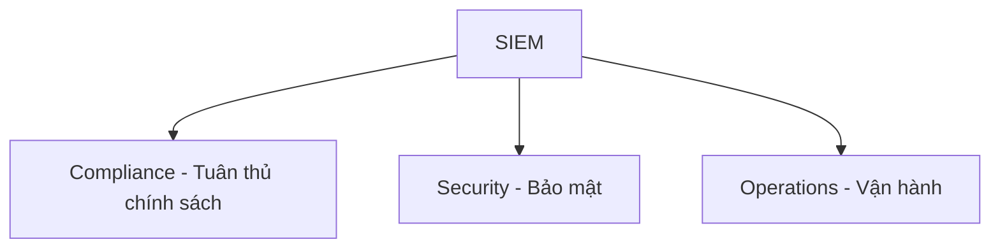
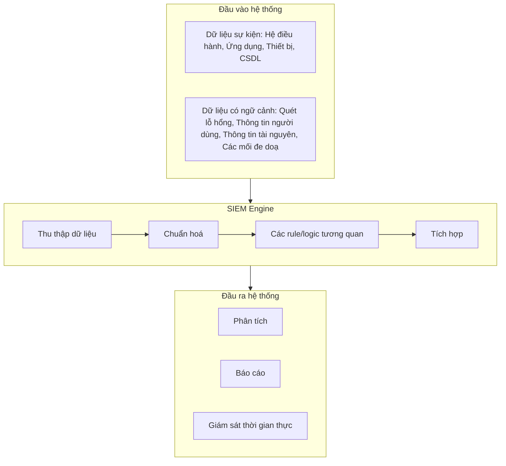

# Bài 7: SIEM và Đánh giá IDPS

## 1. Security Information and Event Management (SIEM)

### 1.1 Quản lý Log (Log Management)

Quản lý log (Log Management - LM) là hướng tiếp cận xử lý một số lượng lớn các log được tạo ra từ các thiết bị. Log còn được gọi là audit record, audit trail, log sự kiện, v.v.

LM bao gồm các chức năng:

- **Thu thập log** từ nhiều nguồn khác nhau
- **Tích hợp tập trung** – gom log về một nơi duy nhất
- **Lưu trữ lâu dài** – đảm bảo log không bị mất
- **Phân tích log** – theo real-time hoặc theo nhóm sau khi lưu trữ
- **Tìm kiếm log** và **tạo báo cáo**

**Các thách thức của quản lý log:**

- Phân tích log để liên kết các sự kiện bảo mật có liên quan
- Thu tập log tập trung từ nhiều nguồn
- Đáp ứng các yêu cầu về tuân thủ CNTT
- Phân tích được hiệu quả nguyên nhân gốc rễ của sự kiện
- Làm các dữ liệu log có ý nghĩa hơn
- Theo dõi các hành vi người dùng đáng ngờ

---

### 1.2 SIEM là gì?

**SIEM = Security Information and Event Management**

SIEM là phần mềm và dịch vụ kết hợp hai lĩnh vực:

- **SEM (Security Event Management):** Giám sát thời gian thực, liên kết sự kiện, cảnh báo
- **SIM (Security Information Management):** Lưu trữ lâu dài, phân tích và báo cáo dữ liệu log

**Mục tiêu chính của SIEM:**

- Xác định mối đe doạ và các vi phạm có thể có
- Thu thập các log để giám sát an ninh và tuân thủ chính sách
- Thực hiện điều tra và cung cấp chứng cứ

**Khả năng của SIEM** – Thu thập, phân tích và biểu diễn thông tin từ các nguồn:

- Mạng và các thiết bị bảo mật
- Các ứng dụng quản lý định danh và truy cập
- Các công cụ quản lý lỗ hổng và tuân thủ chính sách
- Log của các hệ điều hành, CSDL và ứng dụng
- Các dữ liệu về các mối đe doạ bên ngoài

---

### 1.3 So sánh SIEM và LM

| Chức năng | SIEM | Log Management (LM) |
|---|---|---|
| Thu thập log | Thu thập các log an ninh liên quan + dữ liệu có ngữ cảnh | Thu thập tất cả các log |
| Tiền xử lý log | Phân tích định dạng, chuẩn hoá, phân loại, thêm thông tin | Gán chỉ số index, phân tích định dạng hoặc không |
| Lưu trữ log | Log đã được phân tích và chuẩn hoá | Dữ liệu log thô |
| Báo cáo | Báo cáo liên quan đến bảo mật | Báo cáo mục đích chung, có thể sử dụng rộng rãi |
| Phân tích | Tương quan, đánh giá mối đe doạ, sắp xếp ưu tiên các sự kiện | Phân tích text, gán nhãn |
| Cảnh báo và thông báo | Báo cáo nâng cao liên quan đến bảo mật | Cảnh báo đơn giản trên toàn bộ log |
| Các chức năng khác | Quản lý sự cố, phân tích luồng hoạt động, phân tích ngữ cảnh | Khả năng mở rộng cao trong thu thập và lưu trữ |

!!! note "Điểm khác biệt cốt lõi"
    LM thu thập **tất cả** log và lưu thô, còn SIEM **chọn lọc**, **chuẩn hoá** và **tương quan** log để phục vụ mục tiêu bảo mật cụ thể. SIEM thông minh hơn nhưng tốn nhiều tài nguyên hơn.

---

### 1.4 Vì sao SIEM lại cần thiết?

- Số lượng các vi phạm chính sách ngày càng tăng do mối đe doạ bên trong và bên ngoài
- Kẻ tấn công ngày càng tinh vi, các công cụ an ninh truyền thống là chưa đủ
- Cần giảm thiểu các tấn công mạng phức tạp
- Phải quản lý số lượng log lớn từ nhiều nguồn
- Đáp ứng các yêu cầu nghiêm ngặt về tuân thủ chính sách (PCI DSS, HIPAA, SOX, v.v.)

---

### 1.5 Các thành phần của SIEM

```
[Các sự kiện giám sát được]
        |
        v
[Bộ thu thập sự kiện]
        |
        v
   [Engine lõi]
        |
        v
[Giao diện người dùng]
```

---

### 1.6 Ba vấn đề lớn mà SIEM giải quyết



---

### 1.7 Quy trình xử lý của SIEM


---

### 1.8 Kiến trúc của SIEM



---

### 1.9 Ngữ cảnh trong SIEM

Ngữ cảnh (context) là yếu tố then chốt giúp SIEM biến một dòng log đơn thuần thành thông tin có giá trị phân tích. Xét ví dụ:

```
Mar 20 08:44:35 pcx02 sshd[263]: Accepted password for root from 216.101.197.234 port 56946 ssh2
```

Từ một dòng log này, SIEM cần đặt ra và trả lời nhiều câu hỏi ngữ cảnh:

| Thành phần | Câu hỏi ngữ cảnh |
|---|---|
| `Mar 20 08:44:35` | Timezone? Sự kiện nào khác xảy ra gần thời điểm này? |
| `pcx02` | IP? Tên hệ thống? Vị trí? Chủ sở hữu? Admin? |
| `sshd[263]` | Dịch vụ SSH còn chạy trên hệ thống nào? Còn tạo log nào khác? |
| `root` | User này là ai thực sự? Phòng ban? Vai trò/quyền hạn? |
| `216.101.197.234` | Tên DNS? IP của người dùng hay tổ chức nào? Vị trí địa lý? |
| `port 56946` | Port này phục vụ dịch vụ gì? Đề cập trong log nào khác? |

**Ví dụ về cách thêm ngữ cảnh:**

- Thêm thông tin vị trí địa lý (GeoIP)
- Lấy thông tin từ DNS server
- Lấy thông tin user (tên đầy đủ, phòng ban, công việc)

**Ngữ cảnh giúp xác định:**

- Truy cập từ nước ngoài bất thường
- Truyền dữ liệu đáng ngờ

---

### 1.10 8 Chức năng quan trọng của SIEM

=== "1. Thu thập log"

    - Thu thập log từ nhiều nguồn: Windows/Linux, ứng dụng, CSDL, router, switch và các thiết bị khác
    - Phương pháp thu thập: **agent-based** (cài agent trên máy nguồn) hoặc **agent-less** (thu thập từ xa qua giao thức như Syslog, SNMP)
    - Thu thập log **tập trung** về một điểm
    - Chỉ số quan trọng: **EPS (Event Per Second)** – tốc độ gửi sự kiện của hạ tầng CNTT

    !!! warning "Lưu ý về EPS"
        Nếu EPS không được tính toán phù hợp, SIEM có thể **drop (bỏ)** một số sự kiện trước khi lưu vào CSDL, dẫn đến các báo cáo, kết quả tìm kiếm, cảnh báo và tương quan **không chính xác**.

=== "2. Giám sát hoạt động người dùng"

    - Giám sát hoạt động người dùng, quyền hạn người dùng và báo cáo giám sát
    - Đảm bảo SIEM cung cấp **"Complete audit trail"** – truy vết đầy đủ:
        - User nào thực hiện hành động?
        - Kết quả của hành động là gì?
        - Diễn ra trên server nào?
        - Thiết bị người dùng nào đã kích hoạt hành động?

=== "3. Tương quan sự kiện thời gian thực"

    - Hỗ trợ **chủ động** đối phó với các mối đe doạ
    - Xử lý **hàng triệu sự kiện đồng thời** để phát hiện sự kiện đáng ngờ
    - Có thể dựa trên: tìm kiếm log, các rule và cảnh báo

    !!! tip "Điểm cần lưu ý"
        Các rule và cảnh báo được định nghĩa trước thường **không hiệu quả** theo thời gian. SIEM cần hỗ trợ các **trình tạo rule và alert tuỳ chỉnh** để quản trị viên có thể điều chỉnh theo môi trường thực tế.

=== "4. Lưu trữ log"

    - Tự động lưu trữ tất cả dữ liệu log từ các hệ thống, thiết bị và ứng dụng vào **1 kho lưu trữ tập trung**
    - Cần đảm bảo tính năng **Tamper Proof** – mã hoá và gán nhãn thời gian log để phục vụ tuân thủ chính sách và điều tra pháp chứng
    - Hỗ trợ truy xuất và phân tích log đã lưu

=== "5. Báo cáo tuân thủ chính sách"

    - Tuân thủ chính sách là **cốt lõi** của SIEM
    - Đảm bảo khả năng báo cáo tuân thủ chính sách như: **PCI DSS, FISMA, GLBA, SOX, HIPAA**, v.v.
    - Cần có khả năng tuỳ chỉnh và dựng báo cáo tuân thủ mới để đáp ứng các hoạt động quản lý trong tương lai

=== "6. Giám sát tính toàn vẹn của file"

    - Hỗ trợ các chuyên gia bảo mật giám sát các file và thư mục quan trọng trong tổ chức
    - Giám sát và báo cáo tất cả thay đổi: tạo, truy cập, xem, xoá, thay đổi, đổi tên file/thư mục
    - Gửi cảnh báo **real-time** khi có truy cập trái phép vào các file hoặc tập tin quan trọng

=== "7. Pháp chứng số trên log (Log Forensics)"

    - Cho phép người dùng **truy vết hành vi xâm nhập** hoặc hoạt động của 1 sự kiện nào đó
    - Chức năng tìm kiếm log cần **trực quan và thân thiện** với người dùng
    - Cho phép quản trị viên tìm kiếm nhanh chóng trong các dữ liệu log thô

=== "8. Dashboard"

    - Hỗ trợ quản trị viên thực hiện các **hành động kịp thời** và đưa ra quyết định cho các sự kiện đáng ngờ
    - Dữ liệu an ninh cần được biểu diễn một cách **trực quan và thân thiện** với người dùng
    - Dashboard cần hỗ trợ **tuỳ chỉnh** để quản trị viên có thể cấu hình các thông tin bảo mật cần quan sát

---

### 1.11 Vì sao triển khai SIEM lỗi?

!!! danger "Bảo mật là một quá trình, không phải là một sản phẩm"

**Không có kế hoạch:**

- Không định nghĩa trước phạm vi

**Chiến lược triển khai lỗi:**

- Thu thập và quản lý dữ liệu log không liên tục
- Số lượng dữ liệu không liên quan có thể làm hệ thống quá tải

**Vận hành:**

- Thiếu giám sát, quản lý
- Giả định plug and play (cắm vào là chạy được mà không cần cấu hình)

---

### 1.12 Lợi ích thương mại của SIEM

- Giám sát thời gian thực
- Tiết kiệm kinh phí
- Tuân thủ chính sách
- Khả năng báo cáo mạnh
- ROI (Return on Investment – tỷ suất hoàn vốn) nhanh chóng

---

## 2. Đánh giá IDPS

### 2.1 Sự cần thiết của việc đánh giá cảnh báo

Các hoạt động khai thác/tấn công, dù tinh vi đến mức nào, đều sẽ cố gắng qua mặt các biện pháp bảo vệ. Vì vậy:

- Các rule phát hiện cần rất thận trọng (overly conservative)
- Cần có các **chuyên gia phân tích an ninh mạng** có chuyên môn trong việc xem xét các cảnh báo để xác nhận tấn công có thực sự diễn ra hay không

Mô hình SOC (Security Operations Center) thường có nhiều tầng phân tích: Tier 1 Alert Analyst, Tier 2 Incident Responder, SIEM Hunter, SOC Manager chuyên về các mảng khác nhau (Network, Malware, Endpoint, Threat Intel).

---

### 2.2 Phân tích Xác định và Phân tích Xác suất

Các kỹ thuật thống kê được dùng để đánh giá những rủi ro có thể xảy ra các tấn công trên 1 vùng mạng cho trước:

=== "Phân tích Xác định (Deterministic Analysis)"

    - Đánh giá rủi ro **dựa trên những hiểu biết về một lỗ hổng cụ thể**
    - Để một khai thác thành công, **tất cả** các bước trước đó trong chuỗi khai thác cũng phải thành công
    - Chuyên gia biết chính xác các bước để khai thác thành công

=== "Phân tích Xác suất (Probabilistic Analysis)"

    - Sử dụng **kỹ thuật thống kê** để ước tính khả năng một khai thác được thực hiện
    - Dựa trên khả năng **mỗi bước** trong chuỗi khai thác thành công
    - Không cần biết chắc chắn, mà **ước lượng xác suất** của từng bước

---

### 2.3 Phân loại cảnh báo (TP, FP, TN, FN)

Các cảnh báo được phân loại thành 4 nhóm:

| | Thực tế có tấn công | Thực tế không có tấn công |
|---|---|---|
| **Có cảnh báo (Positive)** | True Positive (TP) | False Positive (FP) |
| **Không có cảnh báo (Negative)** | False Negative (FN) | True Negative (TN) |

- **True Positive (TP):** Có cảnh báo và thực tế đúng là 1 tấn công
- **False Positive (FP):** Có cảnh báo nhưng thực tế **không phải** là 1 tấn công (cảnh báo nhầm)
- **True Negative (TN):** Không có cảnh báo và thực tế **không có tấn công** (đúng)
- **False Negative (FN):** Có tấn công xảy ra nhưng **không bị phát hiện** (nguy hiểm nhất)

!!! warning "FN là nguy hiểm nhất"
    False Negative có nghĩa là tấn công thực sự đã xảy ra nhưng hệ thống bỏ qua – đây là tình huống nguy hiểm nhất trong bảo mật vì tổ chức không biết mình đang bị tấn công.

---

### 2.4 Các chỉ số đánh giá IDPS

**Accuracy (Độ chính xác):** có bao nhiêu trường hợp được xác định đúng (là tấn công hoặc bình thường) trong tổng số các trường hợp.

$$Accuracy = \frac{TP + TN}{TP + TN + FP + FN}$$

**False Positive Rate (FPR):** tỉ lệ trường hợp bình thường nhưng bị cảnh báo là tấn công.

$$FPR = \frac{FP}{FP + TN}$$

**False Negative Rate (FNR):** tỉ lệ trường hợp tấn công nhưng không được cảnh báo.

$$FNR = \frac{FN}{FN + TP}$$

**Precision:** tỉ lệ các phát hiện chính xác trên tổng số các cảnh báo tấn công IDPS đã tạo ra.

$$Precision = \frac{TP}{TP + FP}$$

**Recall (Detection Rate):** tỉ lệ các phát hiện chính xác trên tổng số tất cả các trường hợp tấn công thực tế đã có.

$$Recall = \frac{TP}{TP + FN}$$

**F1-score:** kết hợp cả Precision và Recall, là chỉ số tổng hợp đánh giá chất lượng phát hiện.

$$F1\text{-}score = 2 \times \frac{Precision \times Recall}{Precision + Recall}$$

!!! info "Ý nghĩa của F1-score"
    F1-score đạt giá trị cao khi **cả Precision lẫn Recall đều cao**. Nếu một chỉ số thấp, F1-score sẽ bị kéo xuống đáng kể. Đây là lý do F1-score thường được dùng thay vì chỉ dùng Accuracy, đặc biệt khi dữ liệu mất cân bằng (imbalanced).

---

### 2.5 Bài tập vận dụng

???+ question "Đề bài"
    Trong một ngày, Inseclab nhận được 100 email và công cụ IDPS mà Inseclab triển khai đã phân tích và cho kết quả như sau:

    - Có **30 email** được phân loại là **spam**, trong đó có **26 email là spam thật** và **4 email không phải spam**.
    - Có **70 email** được phân loại là **bình thường**, trong đó có **65 email là bình thường thật** và **5 email là spam**.

    Xác định TP, FP, TN, FN và tính Accuracy, Precision, Recall và F1-score.

??? success "Lời giải"
    **Xác định các giá trị:**

    | | IDPS phân loại là spam | IDPS phân loại là bình thường |
    |---|---|---|
    | Thực tế là spam | **TP = 26** | **FN = 5** |
    | Thực tế là bình thường | **FP = 4** | **TN = 65** |

    **Tính toán:**

    $$Accuracy = \frac{TP + TN}{TP + TN + FP + FN} = \frac{26 + 65}{26 + 65 + 4 + 5} = \frac{91}{100} = 91\%$$

    $$Precision = \frac{TP}{TP + FP} = \frac{26}{26 + 4} = \frac{26}{30} \approx 86.67\%$$

    $$Recall = \frac{TP}{TP + FN} = \frac{26}{26 + 5} = \frac{26}{31} \approx 83.87\%$$

    $$F1\text{-}score = 2 \times \frac{Precision \times Recall}{Precision + Recall} = 2 \times \frac{0.8667 \times 0.8387}{0.8667 + 0.8387} \approx 2 \times \frac{0.7268}{1.7054} \approx 85.25\%$$

---

## Câu hỏi trắc nghiệm

**Câu 1.** Log Management (LM) bao gồm những chức năng nào sau đây?

- A. Chỉ thu thập và lưu trữ log
- B. Thu thập, tích hợp tập trung, lưu trữ lâu dài, phân tích, tìm kiếm và tạo báo cáo
- C. Chỉ phân tích và tạo báo cáo
- D. Chỉ lưu trữ và tương quan log

??? info "Đáp án & Giải thích"
    **Đáp án: B**

    LM bao gồm đầy đủ các chức năng: thu thập log, tích hợp tập trung, lưu trữ lâu dài, phân tích log (real-time và theo nhóm), tìm kiếm log và tạo báo cáo.

---

**Câu 2.** SEM trong SIEM là viết tắt của?

- A. Security Event Monitoring
- B. Security Event Management
- C. System Event Management
- D. Security Evaluation Module

??? info "Đáp án & Giải thích"
    **Đáp án: B**

    SIEM = SIM (Security Information Management) + SEM (Security Event Management). SEM phụ trách giám sát thời gian thực, liên kết sự kiện và cảnh báo.

---

**Câu 3.** SIM trong SIEM có nhiệm vụ chính là?

- A. Giám sát thời gian thực và cảnh báo
- B. Lưu trữ lâu dài, phân tích và báo cáo dữ liệu log
- C. Thu thập log từ các thiết bị
- D. Tương quan sự kiện và phát hiện tấn công

??? info "Đáp án & Giải thích"
    **Đáp án: B**

    SIM (Security Information Management) tập trung vào lưu trữ lâu dài, phân tích và báo cáo. Còn SEM mới là phần phụ trách real-time monitoring và cảnh báo.

---

**Câu 4.** Điểm khác biệt quan trọng nhất giữa SIEM và LM về lưu trữ log là?

- A. SIEM lưu trữ nhiều log hơn LM
- B. LM lưu log đã được chuẩn hoá, SIEM lưu log thô
- C. SIEM lưu log đã được phân tích và chuẩn hoá, LM lưu dữ liệu log thô
- D. Cả hai đều lưu log thô

??? info "Đáp án & Giải thích"
    **Đáp án: C**

    SIEM xử lý, phân tích, chuẩn hoá log trước khi lưu. LM lưu dữ liệu log thô. Điều này giúp SIEM truy vấn và phân tích nhanh hơn nhưng cần nhiều tài nguyên xử lý hơn.

---

**Câu 5.** EPS trong SIEM là chỉ số đo lường gì?

- A. Encryption Per Second
- B. Event Per Second – tốc độ gửi sự kiện của hạ tầng CNTT
- C. Error Per System
- D. Evaluation Performance Score

??? info "Đáp án & Giải thích"
    **Đáp án: B**

    EPS = Event Per Second. Đây là chỉ số quan trọng khi triển khai SIEM: nếu SIEM không đủ năng lực xử lý EPS thực tế, nó sẽ drop sự kiện và dẫn đến kết quả phân tích không chính xác.

---

**Câu 6.** Khi EPS của hạ tầng vượt quá khả năng xử lý của SIEM, hậu quả gì xảy ra?

- A. SIEM tự động nâng cấp phần cứng
- B. SIEM drop một số sự kiện, dẫn đến báo cáo, cảnh báo và tương quan không chính xác
- C. SIEM chỉ xử lý các sự kiện bảo mật quan trọng
- D. SIEM sẽ gửi cảnh báo đến quản trị viên và dừng lại

??? info "Đáp án & Giải thích"
    **Đáp án: B**

    Khi bị quá tải, SIEM sẽ drop (bỏ qua) một số sự kiện. Điều này rất nguy hiểm vì có thể bỏ sót các sự kiện bảo mật quan trọng, dẫn đến báo cáo và cảnh báo thiếu chính xác.

---

**Câu 7.** "Complete audit trail" trong giám sát hoạt động người dùng của SIEM có nghĩa là gì?

- A. Chỉ ghi lại các hành động thất bại
- B. Ghi lại đầy đủ: ai làm gì, kết quả thế nào, trên server nào, từ thiết bị nào
- C. Ghi lại tên người dùng và thời gian
- D. Tạo bản sao backup của tất cả file người dùng

??? info "Đáp án & Giải thích"
    **Đáp án: B**

    Complete audit trail yêu cầu truy vết đầy đủ: user nào thực hiện hành động, kết quả của hành động, diễn ra trên server nào, thiết bị nào kích hoạt hành động.

---

**Câu 8.** Tại sao các rule và cảnh báo được định nghĩa trước trong SIEM thường không đủ hiệu quả?

- A. Vì chúng quá phức tạp để cấu hình
- B. Vì môi trường mạng và kiểu tấn công thay đổi theo thời gian, rule cứng không theo kịp
- C. Vì chúng tốn quá nhiều tài nguyên
- D. Vì chúng chỉ hoạt động trên Windows

??? info "Đáp án & Giải thích"
    **Đáp án: B**

    Các rule cố định không theo kịp sự thay đổi của môi trường và kiểu tấn công mới. SIEM cần hỗ trợ các trình tạo rule và alert tuỳ chỉnh để quản trị viên điều chỉnh linh hoạt.

---

**Câu 9.** "Tamper Proof" trong chức năng lưu trữ log của SIEM đề cập đến điều gì?

- A. Nén log để tiết kiệm dung lượng
- B. Mã hoá và gán nhãn thời gian log để đảm bảo log không bị giả mạo, phục vụ tuân thủ và pháp chứng
- C. Xoá log cũ tự động
- D. Sao lưu log lên cloud

??? info "Đáp án & Giải thích"
    **Đáp án: B**

    Tamper Proof đảm bảo tính toàn vẹn của log: log được mã hoá và gán nhãn thời gian, không thể bị sửa đổi. Điều này rất quan trọng cho điều tra pháp chứng và tuân thủ chính sách.

---

**Câu 10.** SIEM hỗ trợ báo cáo tuân thủ các chính sách nào sau đây?

- A. Chỉ PCI DSS
- B. PCI DSS, FISMA, GLBA, SOX, HIPAA và các chính sách tương tự
- C. Chỉ HIPAA và SOX
- D. Chỉ các chính sách do tổ chức tự đặt ra

??? info "Đáp án & Giải thích"
    **Đáp án: B**

    SIEM hỗ trợ nhiều framework tuân thủ như PCI DSS (bảo mật thanh toán), FISMA (chính phủ Mỹ), GLBA (tài chính), SOX (kế toán), HIPAA (y tế), v.v. Ngoài ra còn cần hỗ trợ tuỳ chỉnh báo cáo mới.

---

**Câu 11.** Chức năng giám sát tính toàn vẹn file của SIEM theo dõi những thay đổi nào?

- A. Chỉ theo dõi việc xoá file
- B. Tạo, truy cập, xem, xoá, thay đổi, đổi tên file/thư mục và gửi cảnh báo real-time
- C. Chỉ theo dõi file hệ thống quan trọng
- D. Chỉ theo dõi quyền truy cập file

??? info "Đáp án & Giải thích"
    **Đáp án: B**

    SIEM giám sát toàn bộ thay đổi: tạo, truy cập, xem, xoá, thay đổi nội dung, đổi tên – và gửi cảnh báo real-time khi có truy cập trái phép vào file quan trọng.

---

**Câu 12.** Pháp chứng số trên log (Log Forensics) trong SIEM hỗ trợ điều gì?

- A. Tạo log mới để phục vụ điều tra
- B. Truy vết hành vi xâm nhập hoặc hoạt động của sự kiện thông qua khả năng tìm kiếm log
- C. Xoá log sau khi điều tra xong
- D. Tự động gửi báo cáo cho cơ quan pháp luật

??? info "Đáp án & Giải thích"
    **Đáp án: B**

    Log Forensics cho phép truy vết ngược lại hành vi xâm nhập. Chức năng tìm kiếm phải trực quan, thân thiện để quản trị viên có thể tìm kiếm nhanh trong dữ liệu log thô.

---

**Câu 13.** Lý do chính nào khiến triển khai SIEM thất bại liên quan đến "chiến lược triển khai"?

- A. Phần cứng không đủ mạnh
- B. Thu thập và quản lý dữ liệu log không liên tục, dữ liệu không liên quan làm hệ thống quá tải
- C. Thiếu giao diện người dùng
- D. Chi phí bản quyền quá cao

??? info "Đáp án & Giải thích"
    **Đáp án: B**

    Về chiến lược triển khai, hai nguyên nhân chính là: thu thập log không nhất quán/liên tục và thu thập quá nhiều dữ liệu không liên quan làm quá tải hệ thống.

---

**Câu 14.** "Giả định plug and play" là nguyên nhân thất bại nào của SIEM?

- A. Chiến lược triển khai
- B. Vấn đề vận hành – cho rằng cài xong là hoạt động tốt mà không cần cấu hình, giám sát liên tục
- C. Không có kế hoạch
- D. Vấn đề phần cứng

??? info "Đáp án & Giải thích"
    **Đáp án: B**

    Plug and play là lỗi vận hành: nghĩ rằng SIEM cài vào là tự hoạt động. Thực tế SIEM cần được cấu hình, giám sát, tinh chỉnh rule liên tục. Bảo mật là một quá trình, không phải sản phẩm.

---

**Câu 15.** ROI trong lợi ích thương mại của SIEM là viết tắt của?

- A. Rate of Incidents
- B. Return on Investment – tỷ suất hoàn vốn
- C. Risk of Intrusion
- D. Report on Infrastructure

??? info "Đáp án & Giải thích"
    **Đáp án: B**

    ROI = Return on Investment. SIEM được cho là có ROI nhanh chóng vì nó giúp tiết kiệm chi phí ứng phó sự cố, tuân thủ chính sách và giám sát tập trung.

---

**Câu 16.** Ba vấn đề lớn mà SIEM cần giải quyết là gì?

- A. Hardware, Software, Network
- B. Compliance (Tuân thủ), Security (Bảo mật), Operations (Vận hành)
- C. Log, Alert, Report
- D. Detection, Prevention, Response

??? info "Đáp án & Giải thích"
    **Đáp án: B**

    SIEM được thiết kế để giải quyết 3 nhóm vấn đề lớn: Compliance (đáp ứng yêu cầu tuân thủ), Security (phát hiện và ứng phó mối đe doạ) và Operations (vận hành hệ thống IT).

---

**Câu 17.** Trong quy trình xử lý của SIEM, bước nào diễn ra sau "Trích xuất các thông tin"?

- A. Thu thập dữ liệu
- B. Biểu diễn trên Dashboard
- C. Thêm giá trị (ngữ cảnh)
- D. Lưu trữ log

??? info "Đáp án & Giải thích"
    **Đáp án: C**

    Quy trình: Thu thập dữ liệu → Trích xuất thông tin → **Thêm giá trị (ngữ cảnh)** → Biểu diễn trên Dashboard và Báo cáo.

---

**Câu 18.** Trong kiến trúc SIEM, "Dữ liệu có ngữ cảnh" bao gồm những gì?

- A. Chỉ log của hệ điều hành
- B. Kết quả quét lỗ hổng, thông tin người dùng, thông tin tài nguyên, các mối đe doạ
- C. Chỉ thông tin về thiết bị mạng
- D. Log ứng dụng và log CSDL

??? info "Đáp án & Giải thích"
    **Đáp án: B**

    Dữ liệu có ngữ cảnh là thông tin bổ sung cho log sự kiện, gồm: kết quả quét lỗ hổng bảo mật, thông tin người dùng, thông tin tài nguyên và các mối đe doạ – giúp SIEM hiểu sâu hơn về sự kiện.

---

**Câu 19.** Phương pháp thu thập log "agent-based" khác với "agent-less" như thế nào?

- A. Agent-based nhanh hơn, agent-less chậm hơn
- B. Agent-based cài phần mềm agent lên máy nguồn; agent-less thu thập từ xa qua giao thức như Syslog
- C. Agent-based chỉ dùng cho Windows, agent-less chỉ dùng cho Linux
- D. Không có sự khác biệt

??? info "Đáp án & Giải thích"
    **Đáp án: B**

    Agent-based: cài phần mềm agent trực tiếp lên thiết bị nguồn, cho phép thu thập chi tiết hơn. Agent-less: thu thập log từ xa qua các giao thức chuẩn (Syslog, SNMP, WMI...), không cần cài thêm phần mềm.

---

**Câu 20.** Ví dụ nào sau đây về việc "thêm ngữ cảnh" trong SIEM?

- A. Xoá các log cũ hơn 30 ngày
- B. Thêm thông tin vị trí địa lý (GeoIP), lấy thông tin từ DNS, lấy thông tin user đầy đủ
- C. Mã hoá tất cả log
- D. Chuyển đổi log sang định dạng PDF

??? info "Đáp án & Giải thích"
    **Đáp án: B**

    Thêm ngữ cảnh là làm phong phú thêm thông tin cho log: thêm vị trí địa lý từ IP, tra DNS để biết tên miền, tra thông tin user (tên, phòng ban, vai trò). Điều này giúp phát hiện các truy cập bất thường.

---

**Câu 21.** True Positive (TP) trong đánh giá IDPS có nghĩa là?

- A. Không có cảnh báo và không có tấn công
- B. Có cảnh báo nhưng không có tấn công
- C. Có cảnh báo và thực tế đúng là một tấn công
- D. Có tấn công nhưng không có cảnh báo

??? info "Đáp án & Giải thích"
    **Đáp án: C**

    TP = hệ thống cảnh báo đúng: phát hiện đúng là có tấn công. Đây là trường hợp lý tưởng mà IDPS muốn tối đa hoá.

---

**Câu 22.** False Positive (FP) trong đánh giá IDPS là tình huống nào?

- A. Phát hiện tấn công đúng
- B. Có cảnh báo nhưng thực tế không phải là tấn công (cảnh báo nhầm)
- C. Tấn công xảy ra nhưng không bị phát hiện
- D. Không có sự kiện nào xảy ra

??? info "Đáp án & Giải thích"
    **Đáp án: B**

    FP = cảnh báo nhầm (false alarm): hệ thống kích hoạt cảnh báo nhưng sự kiện thực ra là lưu lượng bình thường. FP cao gây mệt mỏi cho analyst và có thể khiến họ bỏ qua cảnh báo thật.

---

**Câu 23.** Loại cảnh báo nào được coi là nguy hiểm nhất trong đánh giá IDPS?

- A. False Positive (FP)
- B. True Positive (TP)
- C. False Negative (FN)
- D. True Negative (TN)

??? info "Đáp án & Giải thích"
    **Đáp án: C**

    FN = tấn công thực sự xảy ra nhưng không bị phát hiện. Đây là nguy hiểm nhất vì tổ chức không biết mình đang bị tấn công, không có biện pháp ứng phó kịp thời.

---

**Câu 24.** Công thức tính Accuracy của IDPS là?

- A. TP / (TP + FP)
- B. (TP + TN) / (TP + TN + FP + FN)
- C. TP / (TP + FN)
- D. FP / (FP + TN)

??? info "Đáp án & Giải thích"
    **Đáp án: B**

    Accuracy = (TP + TN) / (TP + TN + FP + FN). Đây là tỉ lệ các trường hợp được phân loại đúng (cả tấn công và bình thường) trên tổng số trường hợp.

---

**Câu 25.** Công thức tính FPR (False Positive Rate) là?

- A. FP / (FP + TP)
- B. FP / (FP + TN)
- C. FN / (FN + TP)
- D. FP / (TP + FP + TN + FN)

??? info "Đáp án & Giải thích"
    **Đáp án: B**

    FPR = FP / (FP + TN). Mẫu số là tổng số trường hợp bình thường thực tế (FP + TN), tử số là số trường hợp bình thường bị cảnh báo nhầm (FP).

---

**Câu 26.** Công thức tính FNR (False Negative Rate) là?

- A. FN / (FP + TN)
- B. FN / (FN + TN)
- C. FN / (FN + TP)
- D. FP / (TP + FN)

??? info "Đáp án & Giải thích"
    **Đáp án: C**

    FNR = FN / (FN + TP). Mẫu số là tổng số trường hợp tấn công thực tế (FN + TP), tử số là số tấn công bị bỏ sót (FN).

---

**Câu 27.** Precision trong đánh giá IDPS đo lường điều gì?

- A. Tỉ lệ tấn công thực tế được phát hiện
- B. Tỉ lệ phát hiện chính xác trên tổng số cảnh báo IDPS đã tạo ra
- C. Tỉ lệ trường hợp bình thường được xác định đúng
- D. Tỉ lệ tổng hợp của Recall và F1

??? info "Đáp án & Giải thích"
    **Đáp án: B**

    Precision = TP / (TP + FP). Trong tổng số cảnh báo hệ thống phát ra, có bao nhiêu % là cảnh báo đúng. Precision cao = ít cảnh báo nhầm.

---

**Câu 28.** Recall (Detection Rate) trong đánh giá IDPS đo lường điều gì?

- A. Tỉ lệ cảnh báo đúng trên tổng cảnh báo đã phát
- B. Tỉ lệ tấn công thực tế được phát hiện trên tổng số tấn công thực tế
- C. Độ chính xác tổng thể của hệ thống
- D. Tốc độ phát hiện tấn công

??? info "Đáp án & Giải thích"
    **Đáp án: B**

    Recall = TP / (TP + FN). Trong tổng số tấn công thực tế xảy ra, hệ thống phát hiện được bao nhiêu %. Recall cao = ít tấn công bị bỏ sót (FN thấp).

---

**Câu 29.** F1-score kết hợp hai chỉ số nào?

- A. Accuracy và FPR
- B. Precision và Recall
- C. FPR và FNR
- D. TP và TN

??? info "Đáp án & Giải thích"
    **Đáp án: B**

    F1-score = 2 × (Precision × Recall) / (Precision + Recall). Đây là trung bình điều hoà của Precision và Recall, phản ánh cân bằng giữa hai chỉ số này.

---

**Câu 30.** Tại sao F1-score thường được ưu tiên hơn Accuracy trong đánh giá IDPS?

- A. F1-score dễ tính hơn
- B. F1-score phản ánh cân bằng giữa Precision và Recall, không bị ảnh hưởng bởi dữ liệu mất cân bằng
- C. F1-score luôn cho giá trị cao hơn Accuracy
- D. F1-score tính cả TN nên toàn diện hơn

??? info "Đáp án & Giải thích"
    **Đáp án: B**

    Khi dữ liệu mất cân bằng (ví dụ 99% bình thường, 1% tấn công), Accuracy cao nhưng hệ thống vẫn có thể bỏ sót toàn bộ tấn công. F1-score phát hiện vấn đề này vì nó kết hợp Precision (ít FP) và Recall (ít FN).

---

**Câu 31.** Phân tích Xác định (Deterministic Analysis) dựa trên điều gì?

- A. Dữ liệu thống kê ngẫu nhiên
- B. Hiểu biết về một lỗ hổng cụ thể và các bước cần thiết để khai thác thành công
- C. Machine learning để dự đoán tấn công
- D. Phân tích hành vi người dùng

??? info "Đáp án & Giải thích"
    **Đáp án: B**

    Deterministic Analysis đánh giá rủi ro dựa trên hiểu biết xác định về lỗ hổng: biết chính xác các bước khai thác và yêu cầu tất cả bước phải thành công thì khai thác mới thực hiện được.

---

**Câu 32.** Phân tích Xác suất (Probabilistic Analysis) khác Phân tích Xác định ở điểm nào?

- A. Probabilistic không cần biết về lỗ hổng
- B. Probabilistic ước tính xác suất thành công của từng bước khai thác thay vì yêu cầu biết chắc
- C. Probabilistic chỉ áp dụng cho tấn công mạng nội bộ
- D. Không có sự khác biệt thực sự

??? info "Đáp án & Giải thích"
    **Đáp án: B**

    Probabilistic dùng thống kê để ước tính khả năng khai thác thành công dựa trên xác suất từng bước. Thích hợp khi không có đủ thông tin xác định về lỗ hổng.

---

**Câu 33.** Theo bài tập trong slide, với 26 TP, 4 FP, 65 TN, 5 FN, giá trị Accuracy là?

- A. 86.67%
- B. 83.87%
- C. 91%
- D. 85.25%

??? info "Đáp án & Giải thích"
    **Đáp án: C**

    Accuracy = (26 + 65) / (26 + 65 + 4 + 5) = 91/100 = 91%.

---

**Câu 34.** Theo bài tập trong slide, giá trị Precision là?

- A. 91%
- B. 83.87%
- C. 86.67%
- D. 85.25%

??? info "Đáp án & Giải thích"
    **Đáp án: C**

    Precision = TP / (TP + FP) = 26 / (26 + 4) = 26/30 ≈ 86.67%.

---

**Câu 35.** Theo bài tập trong slide, giá trị Recall là?

- A. 91%
- B. 83.87%
- C. 86.67%
- D. 85.25%

??? info "Đáp án & Giải thích"
    **Đáp án: B**

    Recall = TP / (TP + FN) = 26 / (26 + 5) = 26/31 ≈ 83.87%.

---

**Câu 36.** Trong bài tập, 5 email spam bị phân loại là bình thường tương ứng với loại cảnh báo nào?

- A. True Positive
- B. False Positive
- C. True Negative
- D. False Negative

??? info "Đáp án & Giải thích"
    **Đáp án: D**

    5 email là spam (tấn công thực) nhưng hệ thống phân loại là bình thường (không có cảnh báo) → False Negative: tấn công xảy ra nhưng không bị phát hiện.

---

**Câu 37.** Trong bài tập, 4 email không phải spam nhưng bị phân loại là spam tương ứng với loại cảnh báo nào?

- A. True Positive
- B. False Positive
- C. True Negative
- D. False Negative

??? info "Đáp án & Giải thích"
    **Đáp án: B**

    4 email bình thường (không phải tấn công) nhưng bị cảnh báo là spam (có cảnh báo) → False Positive: cảnh báo nhầm.

---

**Câu 38.** Ngữ cảnh trong SIEM giúp xác định điều gì từ một dòng log SSH đơn giản?

- A. Chỉ giúp xác định thời gian kết nối
- B. Có thể xác định xem đây là truy cập từ nước ngoài bất thường, từ IP đáng ngờ, bởi user có quyền hạn không phù hợp
- C. Chỉ giúp xác định tên người dùng
- D. Không cần ngữ cảnh cho log SSH

??? info "Đáp án & Giải thích"
    **Đáp án: B**

    Ngữ cảnh cho phép SIEM kết hợp thông tin GeoIP, DNS, thông tin user để xác định liệu kết nối SSH có bất thường không (truy cập từ nước ngoài, IP của tổ chức đáng ngờ, user không có quyền admin).

---

**Câu 39.** Chức năng tương quan sự kiện thời gian thực (Real-time Event Correlation) của SIEM xử lý bao nhiêu sự kiện đồng thời?

- A. Hàng chục sự kiện
- B. Hàng trăm sự kiện
- C. Hàng nghìn sự kiện
- D. Hàng triệu sự kiện

??? info "Đáp án & Giải thích"
    **Đáp án: D**

    SIEM tăng bảo mật mạng bằng cách xử lý hàng triệu sự kiện đồng thời để phát hiện sự kiện đáng ngờ. Đây là lý do SIEM cần kiến trúc hiệu năng cao.

---

**Câu 40.** Dashboard trong SIEM có chức năng chính là gì?

- A. Chỉ hiển thị log thô
- B. Hỗ trợ quản trị viên thực hiện hành động kịp thời và đưa ra quyết định, biểu diễn dữ liệu an ninh trực quan
- C. Chỉ tạo báo cáo định kỳ
- D. Lưu trữ log dài hạn

??? info "Đáp án & Giải thích"
    **Đáp án: B**

    Dashboard giúp quản trị viên nắm bắt tình trạng bảo mật một cách trực quan, ra quyết định kịp thời. Cần hỗ trợ tuỳ chỉnh để mỗi tổ chức có thể hiển thị thông tin quan trọng với mình.

---

**Câu 41.** Phương pháp thu thập log nào KHÔNG cần cài thêm phần mềm lên thiết bị nguồn?

- A. Agent-based
- B. Agent-less
- C. Both require agent
- D. Không phương pháp nào

??? info "Đáp án & Giải thích"
    **Đáp án: B**

    Agent-less thu thập log từ xa qua các giao thức chuẩn (Syslog, SNMP, WMI...) mà không cần cài phần mềm agent lên thiết bị nguồn.

---

**Câu 42.** Trong mô hình SOC, Tier 1 Alert Analyst có vai trò gì?

- A. Quản lý toàn bộ SOC
- B. Xử lý tuyến đầu – xem xét và phân loại cảnh báo ban đầu
- C. Chuyên về điều tra malware
- D. Quản lý threat intelligence

??? info "Đáp án & Giải thích"
    **Đáp án: B**

    Tier 1 là tuyến đầu (Frontlines) của SOC, phụ trách xem xét và phân loại các cảnh báo. Các cảnh báo phức tạp hơn sẽ được chuyển lên Tier 2 (Incident Responder) hoặc các chuyên gia.

---

**Câu 43.** Điều gì xảy ra khi hệ thống có FPR cao?

- A. Hệ thống bỏ sót nhiều tấn công
- B. Hệ thống tạo ra nhiều cảnh báo nhầm, gây mệt mỏi cho analyst và có thể bỏ qua cảnh báo thật
- C. Hệ thống hoạt động rất chính xác
- D. Hệ thống cần được nâng cấp phần cứng

??? info "Đáp án & Giải thích"
    **Đáp án: B**

    FPR cao = nhiều cảnh báo nhầm. Điều này gây ra "alert fatigue" – analyst quá mệt mỏi với cảnh báo giả nên có thể bỏ qua cảnh báo thật, làm giảm hiệu quả bảo mật.

---

**Câu 44.** SIEM khác LM trong phần "Phân tích" như thế nào?

- A. Cả hai đều thực hiện tương quan sự kiện
- B. SIEM thực hiện tương quan, đánh giá mối đe doạ, sắp xếp ưu tiên; LM chỉ phân tích text, gán nhãn
- C. LM mạnh hơn về phân tích tương quan
- D. Không có sự khác biệt

??? info "Đáp án & Giải thích"
    **Đáp án: B**

    SIEM có khả năng phân tích cao cấp hơn: tương quan sự kiện từ nhiều nguồn, đánh giá mức độ mối đe doạ và sắp xếp ưu tiên. LM chỉ ở mức phân tích text và gán nhãn cơ bản.

---

**Câu 45.** Tại sao cần có chuyên gia phân tích an ninh mạng để đánh giá cảnh báo IDPS?

- A. Vì IDPS không tạo ra cảnh báo tự động
- B. Vì các rule phát hiện cần rất thận trọng và cần xác nhận cảnh báo có phải tấn công thật hay không
- C. Vì chuyên gia viết code cho IDPS
- D. Vì IDPS không có giao diện người dùng

??? info "Đáp án & Giải thích"
    **Đáp án: B**

    Các rule phải thận trọng nên có thể tạo FP. Chuyên gia cần xem xét từng cảnh báo để xác nhận đây là tấn công thật (TP) hay cảnh báo nhầm (FP) trước khi ứng phó.

---

**Câu 46.** Nếu Precision = 100% nhưng Recall = 10%, hệ thống IDPS có vấn đề gì?

- A. Tốt, vì Precision cao
- B. Hệ thống rất ít cảnh báo nhầm nhưng bỏ sót 90% tấn công thực tế – nguy hiểm
- C. Hệ thống hoạt động cân bằng
- D. Cần tăng FPR

??? info "Đáp án & Giải thích"
    **Đáp án: B**

    Precision = 100% nghĩa là không có FP (cảnh báo nào ra đều đúng). Nhưng Recall = 10% nghĩa là 90% tấn công thực tế bị bỏ sót (FN rất cao). F1-score sẽ rất thấp ≈ 18.2%.

---

**Câu 47.** Mục tiêu chính của SIEM KHÔNG bao gồm điều gì sau đây?

- A. Xác định mối đe doạ và vi phạm
- B. Thu thập log để giám sát an ninh
- C. Thay thế hoàn toàn tường lửa (firewall)
- D. Thực hiện điều tra và cung cấp chứng cứ

??? info "Đáp án & Giải thích"
    **Đáp án: C**

    SIEM không thay thế tường lửa. SIEM là hệ thống giám sát, phân tích và phát hiện, trong khi tường lửa là thiết bị ngăn chặn lưu lượng. Chúng bổ sung cho nhau.

---

**Câu 48.** Vấn đề "không định nghĩa trước phạm vi" trong triển khai SIEM dẫn đến điều gì?

- A. Hệ thống hoạt động tốt hơn vì linh hoạt
- B. Chiến lược triển khai lỗi, thu thập log không nhất quán, hệ thống quá tải
- C. Tiết kiệm chi phí ban đầu
- D. Không ảnh hưởng gì

??? info "Đáp án & Giải thích"
    **Đáp án: B**

    Không định nghĩa phạm vi dẫn đến không biết cần thu thập log gì, từ đâu – gây thu thập không đủ hoặc thu thập quá nhiều dữ liệu không cần thiết, làm hệ thống quá tải và kém hiệu quả.

---

**Câu 49.** Nếu F1-score của một IDPS bằng 0, điều đó có nghĩa là?

- A. Hệ thống hoàn hảo
- B. Precision hoặc Recall (hoặc cả hai) bằng 0 – hệ thống không phát hiện được tấn công nào đúng
- C. Hệ thống chỉ có TN và FP
- D. Accuracy bằng 50%

??? info "Đáp án & Giải thích"
    **Đáp án: B**

    F1 = 2 × (P × R) / (P + R). Nếu P = 0 hoặc R = 0, thì F1 = 0. Điều này có nghĩa hệ thống không có TP nào – hoặc không phát hiện được tấn công nào, hoặc tất cả cảnh báo đều sai.

---

**Câu 50.** Câu nào sau đây ĐÚNG nhất về mối quan hệ giữa Precision và Recall trong thực tế?

- A. Tăng Precision luôn dẫn đến tăng Recall
- B. Thường có sự đánh đổi (trade-off): tăng Precision có xu hướng làm giảm Recall và ngược lại
- C. Precision và Recall luôn bằng nhau
- D. Chỉ cần tối ưu một trong hai là đủ

??? info "Đáp án & Giải thích"
    **Đáp án: B**

    Đây là đánh đổi (trade-off) kinh điển trong ML/security: nếu hạ ngưỡng cảnh báo để bắt nhiều tấn công hơn (tăng Recall), sẽ có nhiều FP hơn (giảm Precision). F1-score giúp tìm điểm cân bằng tốt nhất giữa hai chỉ số này.
