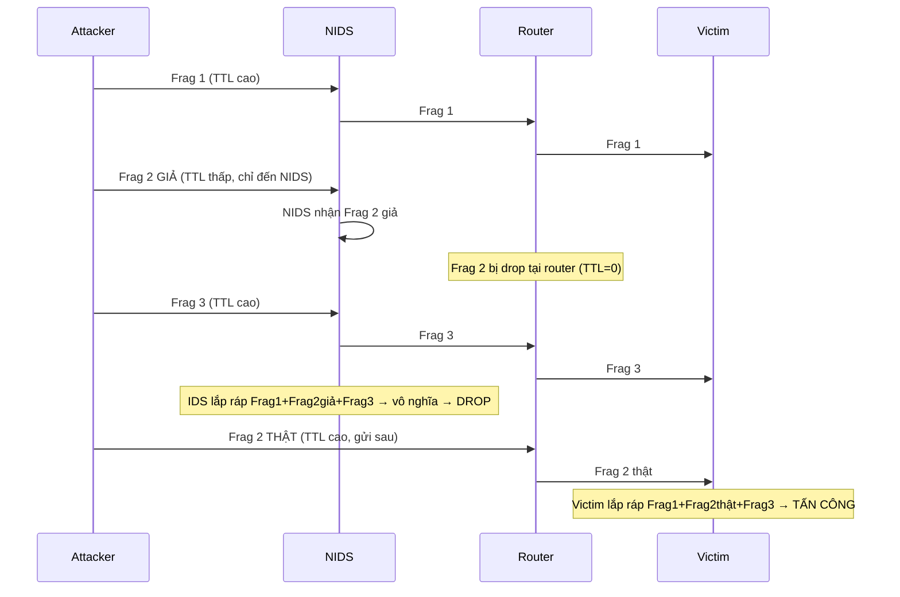

# Bài 8: Đánh Lừa IDS (IDS Evasion)

## 1. Tổng quan về Đánh Lừa IDS

**IDS Evasion** là quá trình kẻ tấn công thay đổi các cuộc tấn công sao cho IDS nhận diện chúng như traffic hợp lệ, từ đó ngăn IDS tạo ra cảnh báo.

Có 18 kỹ thuật chính được phân loại như sau:

```
1.  Insertion Attack        10. Time-To-Live Attacks
2.  Evasion                 11. Invalid RST Packets
3.  Denial-of-Service       12. Urgency Flag
4.  Obfuscating             13. Unicode Evasion
5.  False Positive Gen.     14. Polymorphic Shellcode
6.  Session Splicing        15. ASCII Shellcode
7.  Fragmentation Attack    16. Application-Layer Attacks
8.  Overlapping Fragments   17. Desynchronization
9.  (các kỹ thuật khác)     18. Encryption / Flooding
```

---

## 2. Insertion Attack

**Khái niệm:** Kẻ tấn công lừa IDS đọc các gói tin không hợp lệ mà hệ thống đầu cuối (end system) sẽ loại bỏ. Kết quả là IDS nhận được **nhiều gói tin hơn** so với hệ thống đầu cuối.

**Điều kiện xảy ra:** NIDS có chính sách bảo vệ không chặt chẽ bằng hệ thống nội bộ, cho phép IDS chấp nhận những gói tin mà end system sẽ reject.

**Mục tiêu:** Thêm dữ liệu "giả" vào luồng thông tin mà IDS đọc, khiến IDS phân tích nhầm một chuỗi tấn công vô hại.

**Ví dụ:**

- IDS chấp nhận ký tự `X` (end system thì không), kẻ tấn công chèn `X` vào giữa chuỗi tấn công.
- IDS nhận diện chuỗi `phf` trong HTTP request:
    - Bình thường: `GET /cgi-bin/phf?` → IDS cảnh báo
    - Tấn công: `GET /cgi-bin/p[ký tự lạ]h[ký tự lạ]f?` → IDS không nhận ra pattern `phf` vì bị "chèn" ký tự mà chỉ IDS chấp nhận còn end system loại bỏ → end system thực ra vẫn thấy `phf`

```
Luồng IDS thấy:  C X A T T A C K  (có chèn X)
Luồng end system thấy:  C A T T A C K  (X bị loại bỏ)
```

---

## 3. Evasion

**Khái niệm:** Ngược lại với Insertion Attack. Hệ thống đầu cuối chấp nhận gói tin nhưng **IDS lại chặn/loại bỏ** gói đó. IDS nhận được **ít gói tin hơn** so với hệ thống đầu cuối.

**Cơ chế:** Kẻ tấn công gửi các phần của yêu cầu tấn công trong các gói tin mà IDS sẽ lọc bỏ sai, khiến IDS bỏ qua một số phần của stream.

**Ví dụ:**

- Tấn công gửi từng byte (byte-by-byte).
- Một byte bị IDS loại bỏ → IDS không thể ghép lại đủ chuỗi tấn công → không phát hiện được.
- End system nhận đủ tất cả các byte → bị tấn công thành công.

```
Luồng IDS thấy:  C A T _ A C K  (_ bị IDS drop)
Luồng end system thấy:  C A T T A C K  (nhận đủ)
```

---

## 4. Insertion & Evasion – Các Trường Hợp Thực Tế

Nguyên nhân sâu xa của hai kỹ thuật trên đến từ sự khác biệt trong cách NIDS và end system xử lý các trường header:

| Trường | Vấn đề cho NIDS |
|---|---|
| TTL | Gói tin có đến end system trước khi TTL = 0? |
| Length, DF | Tất cả downstream link có thể truyền gói lớn mà không phân mảnh? |
| IP Option(s) | End system/router có chấp nhận gói tin có thêm IP Options không? |
| TCP Option(s) | End system có chấp nhận gói tin có thêm TCP Options không? |
| Data | End system có chấp nhận dữ liệu trong gói SYN không? |
| ToS | Gói tin có tuân thủ tất cả router nội bộ (DiffServ)? |
| IP Frag Offset | End system có lắp ráp các fragment chồng chéo không? |
| TCP Seq No | End system có lắp ráp các segment chồng chéo không? |

**Nguyên nhân cốt lõi:**

- Khai thác vấn đề trong NIDS về phân tích mạng và giao thức cơ bản (phân tích header, xử lý options, lắp ráp fragment/segment).
- Khác biệt trong hiện thực các giao thức (không theo chuẩn; các OS khác nhau trong protocol stack).
- Cấu hình end system và router khác nhau.

---

## 5. Denial-of-Service Attack (DoS) nhắm vào IDS

Thay vì tấn công trực tiếp vào mạng mục tiêu, kẻ tấn công nhắm vào bản thân IDS để làm nó không hoạt động được.

**Các hình thức DoS IDS:**

1. Khóa thiết bị IDS.
2. Tạo quá nhiều cảnh báo khiến người quản trị không thể xem xét hết.
3. Làm đầy ổ cứng để không thể ghi log.
4. Tiêu tốn tài nguyên xử lý (CPU) để IDS bỏ sót các tấn công sau.
5. Tấn công vào server lưu trữ alert tập trung → làm chậm hoặc crash → các tấn công sau không bị ghi log.

**Các dạng DoS cụ thể:**

- **DoS CPU:** Nhắm vào các hoạt động tốn tính toán như lắp ráp fragment/segment, mã hóa/giải mã.
- **DoS bộ nhớ:** Nhắm vào quản lý trạng thái (TCP 3-way handshake, lắp ráp fragment).
- **DoS băng thông:** Khiến NIDS không xử lý kịp gói tin đang truyền.
- **DoS hệ thống phản ứng:** Tạo nhiều false positive, chặn truy cập hợp lệ bằng cách giả mạo địa chỉ.

!!! warning "Lưu ý quan trọng"
    Nhiều NIDS hoạt động ở trạng thái **"fail-open"** – khi bị crash, nó vẫn cho phép traffic đi qua để đảm bảo mạng hoạt động. Kẻ tấn công khai thác điều này để crash IDS trước, rồi tấn công sau.

---

## 6. False Positive Generation

**Cơ chế:**

```mermaid
graph LR
    A[Kẻ tấn công tạo gói tin độc hại giả] --> B[Gửi đến IDS → sinh cảnh báo false positive số lượng lớn]
    B --> C[Admin bị "chìm ngập" trong cảnh báo]
    C --> D[Kẻ tấn công gửi traffic tấn công thật]
    D --> E[Traffic thật bị che khuất → không bị phát hiện]
```

**Chi tiết:** Kẻ tấn công có hiểu biết về IDS, tạo các gói tin được thiết kế để trigger cảnh báo nhưng thực ra vô hại. Lượng cảnh báo khổng lồ khiến admin không thể phân biệt đâu là tấn công thật, từ đó traffic tấn công thực sự "trượt qua" mà không bị chú ý.

---

## 7. Obfuscating (Làm Rối Mã)

**Khái niệm:** Kẻ tấn công encode payload tấn công sang dạng khác sao cho **chỉ host đích decode được**, còn IDS thì không nhận ra.

**Các kỹ thuật làm rối mã:**

1. **Thay đổi đường dẫn** được tham chiếu trong signature để đánh lừa HIDS.
2. **Encode sang Unicode** để bypass bộ lọc của IDS, nhưng Web server vẫn hiểu được.
3. **Code đa hình (Polymorphic)** tạo ra các pattern tấn công khác biệt mỗi lần, không có signature cố định nào có thể phát hiện.
4. **Các tấn công trong HTTPS** cũng là một dạng làm rối mã vì IDS không thể đọc được nội dung đã mã hóa.

**Câu hỏi trong slide:** Đoạn code JS obfuscated thực hiện công việc gì?

```javascript
// Đây là đoạn code đã bị obfuscate (rối mã)
var _0x5823=['log','bind','warn',...,'Hello\x20IDPS\x20Class!',...];
// ...
function hi(){
    // ... (nhiều logic che giấu)
    alert(_0x113adf(0x1ab)); // Thực ra chỉ gọi alert()
}
hi();
```

**Trả lời:** Sau khi deobfuscate, đoạn code trên chỉ đơn giản thực hiện:

```javascript
function hi() {
    alert("Hello IDPS Class!");
}
hi();
```

Toàn bộ sự phức tạp là để che giấu chuỗi `"Hello IDPS Class!"` và lệnh `alert()` khỏi các bộ lọc/IDS phân tích code tĩnh.

---

## 8. Session Splicing

**Khái niệm:** Kẻ tấn công chia nhỏ traffic tấn công thành **nhiều gói tin nhỏ** sao cho không một gói nào đơn lẻ kích hoạt cảnh báo trên IDS.

**Phân biệt với IP Fragmentation:**

| Đặc điểm | IP Fragmentation | Session Splicing |
|---|---|---|
| Nguyên nhân | Gói tin quá lớn cho data link layer | Cố tình chia nhỏ để qua mặt IDS |
| Kích thước fragment | Theo MTU | Nhỏ hơn cần thiết |
| Mục đích | Kỹ thuật mạng bình thường | Tấn công có chủ đích |

**Ví dụ với Whisker:**

```
Chuỗi gốc: "GET / HTTP/1.1"
Sau splicing: "GE" | "T " | "/" | " H" | "T" | "TP" | "/1" | ".1"
```

Mỗi gói chỉ chứa 1-2 ký tự → IDS không thể nhận ra pattern tấn công nếu không lắp ráp lại.

**Kỹ thuật thêm delay:** Gửi gói với độ trễ lớn để qua mặt quá trình lắp ráp trên IDS vì một số IDS ngừng lắp ráp nếu không nhận gói tiếp theo sau một khoảng thời gian nhất định.

**Biện pháp đối phó:**

- Fragment reassembly
- Session reassembly
- Gửi gói TCP RST để đóng session tấn công

---

## 9. Fragmentation Attack

**Nguyên tắc:** Khai thác sự khác biệt về **timeout lắp ráp fragment** giữa IDS và host đích.

### Ví dụ 1: Timeout host > Timeout IDS

```
Host timeout: 20s | IDS timeout: 10s
Kẻ tấn công gửi fragment cách nhau 15s

Timeline:
t=0s:   Gửi Frag 1 → IDS nhận, Host nhận
t=15s:  IDS timeout (10s đã qua) → DROP các fragment tiếp theo
        Host chưa timeout (20s chưa qua) → VẪN nhận
t=15s:  Gửi Frag 2 → IDS DROP, Host nhận và lắp ráp → TẤN CÔNG THÀNH CÔNG
```

### Ví dụ 2: Timeout host < Timeout IDS (phức tạp hơn)

```
Host timeout: 30s | IDS timeout: 60s

t=0s:     Gửi Frag 2, 4 GIẢ (payload sai) → Cả IDS và Host nhận
t=30s:    Host timeout → bỏ Frag 2, 4 giả (không nhận được Frag 1)
          IDS vẫn giữ Frag 2, 4 giả (chưa timeout)
30s<t<60s: Gửi Frag 1, 3 THẬT
          IDS cố lắp ráp 4 frag (có Frag 2,4 giả + Frag 1,3 thật)
          → checksum không hợp lệ → IDS DROP
30s<t<60s: Gửi Frag 2, 4 THẬT
          Host nhận Frag 1,2,3,4 thật → lắp ráp → TẤN CÔNG THÀNH CÔNG
          IDS đã timeout với chuỗi cũ → KHÔNG PHÁT HIỆN
```

---

## 10. Overlapping Fragments

**Khái niệm:** Tạo ra các fragment với **sequence number chồng chéo** nhau.

**Ví dụ:** Fragment 1 gồm 100 bytes với seq=1; Fragment 2 có seq=96 (chồng lên 4 bytes cuối của Fragment 1).

**Vấn đề cốt lõi:** Khi lắp ráp lại, host cần quyết định: khi hai fragment có seq chồng chéo, giữ byte nào?

- **Windows W2K/XP/2003:** Giữ fragment **gốc** (đến trước) khi trùng seq.
- **Cisco IOS:** Chọn fragment **đến sau** có cùng seq.

**Khai thác:** Kẻ tấn công gửi fragment "vô hại" trước (IDS phân tích thấy OK), sau đó gửi fragment chồng chéo chứa payload tấn công. Tùy OS của victim, payload tấn công sẽ được lắp ráp theo cách khác với những gì IDS thấy.

---

## 11. Time-To-Live (TTL) Attacks

**Điều kiện:** Kẻ tấn công cần biết trước topology mạng (dùng traceroute để đếm số router giữa attacker và victim).

**Các bước tấn công:**



**Kết quả:** IDS lắp ráp nhầm với Frag 2 giả → bỏ qua. Victim nhận Frag 2 thật → bị tấn công.

---

## 12. Invalid RST Packets

**Nền tảng:**

- Cờ RST trong TCP dùng để đóng kết nối TCP.
- TCP dùng checksum 16 bit để kiểm tra lỗi.

**Cơ chế tấn công:**

```
1. Attacker gửi gói RST với checksum KHÔNG HỢP LỆ đến victim
2. IDS nhận gói RST → nghĩ TCP session đã kết thúc → NGỪNG theo dõi
3. Victim nhận gói RST → kiểm tra checksum → thấy sai → DROP (bỏ qua)
4. Victim vẫn duy trì kết nối TCP
5. Attacker tiếp tục giao tiếp với victim trong khi IDS đã "rời đi"
```

**Kết quả:** IDS bị "đánh lừa" rằng kết nối đã đóng, trong khi thực tế kết nối vẫn còn.

---

## 13. Urgency Flag

**Nền tảng:** Cờ URG trong TCP header đánh dấu dữ liệu cần xử lý khẩn cấp. Khi URG bật, Urgent Pointer trỏ đến byte cuối của dữ liệu khẩn cấp trong segment.

**Vấn đề:** Nhiều IDS không xem xét Urgent Pointer và xử lý **toàn bộ** gói tin, trong khi victim chỉ xử lý **dữ liệu khẩn cấp**.

**Theo RFC 1122:** Urgency pointer sẽ khiến 1 byte dữ liệu nằm ngay sau dữ liệu khẩn cấp bị mất khi kết hợp dữ liệu khẩn cấp và dữ liệu thường.

**Ví dụ trong slide:**

```
Packet 1: ABC
Packet 2: DEF  (Urgency Pointer = 3, tức byte thứ 3 là 'F', byte NGAY SAU là 'G' bị mất)
Packet 3: GHI

Victim xử lý: A B C D E F _ H I  → "ABCDEFHI"  (bỏ 'G')
IDS xử lý:    A B C D E F G H I  → "ABCDEFGHI" (đầy đủ)
```

Kẻ tấn công có thể nhúng payload tấn công vào byte bị mất theo góc nhìn của IDS.

---

## 14. Unicode Evasion

**Nền tảng:** Unicode là hệ thống mã hóa ký tự hỗ trợ trao đổi văn bản. Một ký tự có thể có nhiều dạng biểu diễn:

- `/` → `%u2215`
- `e` → `%u00e9`
- `\` → `5C` hoặc `C19C` hoặc `E0819C`

**Cơ chế tấn công:**

- Một số IDS xử lý Unicode không chính xác.
- Attacker encode chuỗi tấn công sang dạng Unicode → IDS không khớp được signature → bỏ qua.
- Web server vẫn decode được và xử lý → bị tấn công.

**Ví dụ:**

```
Chuỗi tấn công thật: /cgi-bin/cmd.exe
Dạng Unicode:        %u002f%u0063%u0067%u0069-bin/cmd.exe
IDS tìm "/cgi-bin"  → không tìm thấy → không cảnh báo
Web server decode    → thấy "/cgi-bin/cmd.exe" → thực thi
```

---

## 15. Polymorphic Shellcode (Shellcode Đa Hình)

**Vấn đề với signature-based IDS:** IDS dùng các string phổ biến trong shellcode làm signature. Ví dụ: `\x90\x90\x90` (NOP sled), các system call đặc trưng...

**Cách hoạt động của Polymorphic Shellcode:**

```
[GetPC Code] → [Decryptor] → [Encrypted Payload/Shellcode]
```

1. **GetPC Code:** Lấy địa chỉ hiện tại của instruction pointer.
2. **Decryptor:** Giải mã payload thực sự tại runtime.
3. **Encrypted Payload:** Shellcode thực sự, được mã hóa/encode khác nhau **mỗi lần gửi**.

**Kết quả:** Mỗi lần gửi, pattern của shellcode khác hoàn toàn → không có signature cố định nào có thể match → IDS signature-based trở nên vô dụng.

---

## 16. ASCII Shellcode

**Khái niệm:** Shellcode được viết chỉ sử dụng các ký tự trong bảng mã ASCII in được (printable ASCII, giá trị 0x20–0x7E).

**Lý do hiệu quả:** Các bộ lọc IDS thường tìm kiếm byte có giá trị cao (>0x7F) hoặc các byte đặc biệt như `\x00`, `\x90`. ASCII shellcode vượt qua được các filter này.

**Hạn chế và cách khắc phục:**

- Không phải tất cả lệnh assembly đều có thể biểu diễn trực tiếp bằng ASCII.
- Giải pháp: Sử dụng tập hợp các lệnh khác kết hợp để đạt được kết quả tương đương.

**Ví dụ:**

| Assembly | Mã máy | ASCII |
|---|---|---|
| `pop eax` | `\x58` | `X` |
| `xor al, 58` | `\x34\x58` | `4X` |

Bằng cách kết hợp các lệnh này, có thể xây dựng shellcode đầy đủ chỉ từ ký tự ASCII, ví dụ chạy `/bin/sh`.

---

## 17. Application-Layer Attacks

**Cơ chế:** Các ứng dụng thường nén dữ liệu (audio, video, hình ảnh) để tối ưu tốc độ truyền.

**Vấn đề:** IDS không thể kiểm tra nội dung bên trong dữ liệu đã nén → không phát hiện được signature tấn công ẩn trong đó.

**Khai thác:** Attacker nhúng payload tấn công vào dữ liệu nén. Khi ứng dụng đích giải nén và xử lý → lỗ hổng bị khai thác mà IDS không hay biết.

---

## 18. Desynchronization

### Pre-Connection SYN

**Cơ chế:**

```
1. Attacker gửi gói SYN giả với checksum KHÔNG HỢP LỆ trước khi tạo kết nối thật
2. IDS nhận SYN → mở TCP Control Block → theo dõi sequence number của SYN này
3. Victim nhận SYN → kiểm tra checksum → DROP
4. Attacker gửi nhiều gói SYN giả với seq number khác nhau
   → IDS liên tục cập nhật lại seq number theo dõi
   → IDS bị "mất phương hướng" (desynchronized)
5. Kết nối thật được thiết lập với seq number khác
   → IDS không thể theo dõi đúng luồng dữ liệu
```

### Post-Connection SYN

**Cơ chế:**

```
1. Kết nối TCP đã được thiết lập bình thường
2. Attacker gửi gói SYN TRONG luồng dữ liệu đang chạy (với seq number khác)
3. Victim bỏ qua gói SYN này (vì kết nối đã tồn tại)
4. IDS thấy SYN mới → đồng bộ lại seq number theo SYN mới
5. IDS bỏ qua tất cả dữ liệu hợp lệ của kết nối gốc (vì đang chờ seq number khác)
6. Attacker gửi RST với seq number mới → IDS đóng kết nối "ảo" của nó
7. Attacker giao tiếp với victim trong vùng "mù" của IDS
```

---

## 19. Mã Hóa (Encryption) và Flooding

**Mã hóa:**

Khi attacker đã thiết lập được một **session được mã hóa** với victim (ví dụ HTTPS, SSH tunnel), đây là hình thức đánh lừa IDS hiệu quả nhất. IDS không thể đọc nội dung mã hóa → mọi tấn công trong session đó đều vô hình.

**Flooding:**

Attacker gửi một lượng lớn traffic "nhiễu" để:

- Làm IDS không xử lý kịp.
- Ẩn traffic tấn công thực sự trong "đám đông" các gói tin nhiễu.

---

## 20. Biện Pháp Đối Phó

??? info "14 biện pháp đối phó với tấn công đánh lừa IDS"

    1. Đóng các switch port liên quan đến host tấn công đã biết.
    2. Phân tích theo chiều sâu traffic mạng khả nghi để phát hiện nguy cơ.
    3. Sử dụng gói TCP FIN hoặc RST để đóng các session TCP tấn công.
    4. Tìm kiếm các NOP opcode khác ngoài `0x90` để ngăn polymorphic shellcode.
    5. Đào tạo user cách xác định pattern tấn công; cập nhật/vá hệ thống và thiết bị.
    6. Triển khai IDS sau khi phân tích mạng, đặc điểm traffic và số lượng host.
    7. Sử dụng **traffic normalizer** để loại bỏ phần đáng ngờ trong gói tin trước khi đến IDS.
    8. Đảm bảo IDS chuẩn hóa được gói tin đã phân mảnh và lắp ráp đúng thứ tự.
    9. Định nghĩa DNS server cho client trên router hoặc thiết bị mạng tương tự.
    10. Củng cố an ninh của tất cả thiết bị giao tiếp (modem, router, switch...).
    11. Chặn gói ICMP TTL expired ở external interface; đặt TTL thành giá trị lớn.
    12. Thường xuyên cập nhật cơ sở dữ liệu signature của antivirus.
    13. Sử dụng giải pháp chuẩn hóa traffic tại IDS.
    14. Lưu trữ thông tin tấn công (IP attacker, IP victim, thời gian) để phân tích sau.

---

## 21. IDS Penetration Testing

**Mục đích:** Đánh giá khả năng lọc traffic ra/vào mạng và kiểm tra tính hiệu quả của IDS.

**Lý do cần Pentest IDS:**

- Kiểm tra IDS có đảm bảo thi hành policy bảo mật không.
- Kiểm tra IDS có đủ mạnh để ngăn tấn công từ bên ngoài không.
- Đánh giá hiệu quả của vành đai bảo vệ mạng.
- Kiểm tra lượng thông tin mạng có thể bị lộ từ phía kẻ xâm nhập.
- Kiểm tra các lỗ hổng bảo mật trên IDS.
- Đánh giá tương quan giữa các rule IDS và hành động được thực hiện.

**Quy trình 20 bước:**

=== "Bước 1-10"

    1. Vô hiệu hóa Trusted Host
    2. Thực hiện Insertion Attack
    3. Thực hiện kỹ thuật Evasion
    4. Thực hiện tấn công DoS
    5. Làm rối mã / encode payload tấn công (ví dụ: encode để bypass IDS nhưng IIS vẫn decode được)
    6. Tạo False Positive để bypass IDS
    7. Session Splicing (giữ session active lâu hơn thời gian lắp ráp của IDS)
    8. Unicode Evasion
    9. Fragmentation Attack (timeout IDS nhỏ hơn và lớn hơn victim)
    10. Overlapping Fragments (tạo fragment với seq number chồng chéo)

=== "Bước 11-20"

    11. Time-To-Live Attack
    12. Invalid RST Packets (ngăn IDS theo dõi gói tin)
    13. Urgency Flag (IDS không xem xét urgent pointer)
    14. Polymorphic Shellcode
    15. ASCII Shellcode
    16. Application-Layer Attack (kiểm tra xử lý dữ liệu nén)
    17. Encryption và Flooding
    18. Post-Connection SYN Attack
    19. Pre-Connection SYN Attack
    20. Tài liệu hóa tất cả thông tin thu thập được

---

## Câu Hỏi Trắc Nghiệm

**Câu 1.** Trong kỹ thuật Insertion Attack, điều nào sau đây mô tả đúng nhất?

- A. IDS nhận ít gói tin hơn so với hệ thống đầu cuối
- B. IDS nhận nhiều gói tin hơn so với hệ thống đầu cuối
- C. IDS và hệ thống đầu cuối nhận cùng số gói tin
- D. Hệ thống đầu cuối không nhận được gói tin nào

??? info "Đáp án & Giải thích"
    **Đáp án: B**
    
    Trong Insertion Attack, kẻ tấn công chèn các gói tin mà IDS chấp nhận nhưng end system sẽ loại bỏ. Do đó IDS "thấy" nhiều gói tin hơn so với những gì end system thực sự nhận và xử lý.

---

**Câu 2.** Kỹ thuật Evasion khác với Insertion Attack ở điểm nào?

- A. Evasion làm IDS nhận nhiều gói tin hơn end system
- B. Evasion làm IDS nhận ít gói tin hơn end system
- C. Evasion chỉ áp dụng với giao thức UDP
- D. Evasion không liên quan đến gói tin mạng

??? info "Đáp án & Giải thích"
    **Đáp án: B**
    
    Trong Evasion, end system chấp nhận gói tin nhưng IDS lại chặn/loại bỏ. Kết quả là IDS nhận ít gói tin hơn, không thể ghép đủ chuỗi tấn công để phát hiện.

---

**Câu 3.** Mục tiêu chính của kỹ thuật False Positive Generation là gì?

- A. Làm crash IDS bằng quá nhiều gói tin
- B. Tạo lượng lớn cảnh báo giả để che giấu traffic tấn công thực sự
- C. Mã hóa traffic tấn công
- D. Chia nhỏ payload thành nhiều gói tin

??? info "Đáp án & Giải thích"
    **Đáp án: B**
    
    Kẻ tấn công tạo hàng loạt cảnh báo false positive khiến admin bị "chìm ngập" và không thể phân biệt đâu là tấn công thật. Traffic tấn công thực sự trượt qua trong lúc admin đang xử lý các cảnh báo giả.

---

**Câu 4.** Trong Session Splicing với công cụ Whisker, chuỗi "GET / HTTP/1.1" được chia thành dạng nào?

- A. Chia theo từng từ: "GET", "/", "HTTP/1.1"
- B. Chia theo từng ký tự/cặp ký tự: "GE", "T ", "/", " H", "T", "TP", "/1", ".1"
- C. Mã hóa toàn bộ chuỗi sang Base64
- D. Gửi ngược từ cuối lên đầu

??? info "Đáp án & Giải thích"
    **Đáp án: B**
    
    Whisker chia chuỗi HTTP request thành các đoạn rất nhỏ (1-2 ký tự mỗi gói), kích thước nhỏ hơn nhiều so với cần thiết. Mục tiêu là không một gói nào chứa đủ pattern để IDS nhận ra là tấn công.

---

**Câu 5.** Kỹ thuật Fragmentation Attack khai thác điều gì?

- A. Sự khác biệt về MTU giữa IDS và victim
- B. Sự khác biệt về timeout lắp ráp fragment giữa IDS và host đích
- C. Sự khác biệt về thuật toán checksum
- D. Sự khác biệt về TCP window size

??? info "Đáp án & Giải thích"
    **Đáp án: B**
    
    Fragmentation Attack khai thác việc IDS và host đích có thời gian timeout cho lắp ráp fragment khác nhau. Kẻ tấn công tính toán thời gian gửi fragment sao cho IDS đã timeout (drop fragment) nhưng host vẫn còn trong thời hạn (tiếp tục lắp ráp).

---

**Câu 6.** Trong Fragmentation Attack ví dụ 1 (host timeout=20s, IDS timeout=10s), nếu kẻ tấn công gửi fragment cách nhau 15s thì kết quả gì xảy ra?

- A. Cả IDS và host đều lắp ráp thành công
- B. IDS timeout và drop, host vẫn lắp ráp thành công → tấn công qua mặt IDS
- C. Host timeout và drop, IDS vẫn phát hiện
- D. Cả IDS và host đều timeout và drop

??? info "Đáp án & Giải thích"
    **Đáp án: B**
    
    Sau 15s IDS đã vượt quá timeout 10s → không lắp ráp fragment tiếp theo. Nhưng host chưa vượt quá timeout 20s → vẫn nhận và lắp ráp fragment tiếp → payload tấn công được lắp ráp hoàn chỉnh mà không bị IDS phát hiện.

---

**Câu 7.** Overlapping Fragments khai thác điểm yếu gì?

- A. IDS không thể xử lý gói tin có TTL thấp
- B. Sự khác biệt giữa các OS trong cách xử lý fragment có sequence number chồng chéo
- C. IDS không hỗ trợ giao thức IPv6
- D. IDS không lưu trạng thái TCP connection

??? info "Đáp án & Giải thích"
    **Đáp án: B**
    
    Các OS khác nhau có hành vi khác nhau khi gặp fragment chồng chéo. Windows XP giữ fragment gốc, Cisco IOS chọn fragment đến sau. Kẻ tấn công lợi dụng sự khác biệt này để IDS lắp ráp ra nội dung khác với những gì victim thực sự nhận được.

---

**Câu 8.** Trong TTL Attack, tại sao kẻ tấn công cần biết topology mạng trước?

- A. Để biết băng thông của từng link
- B. Để tính toán giá trị TTL thấp vừa đủ để gói tin giả chỉ đến IDS mà không đến victim
- C. Để biết địa chỉ IP của IDS
- D. Để lựa chọn cổng tấn công phù hợp

??? info "Đáp án & Giải thích"
    **Đáp án: B**
    
    Kẻ tấn công cần biết số router nằm giữa mình và victim (dùng traceroute). Từ đó tính TTL thấp vừa đủ để fragment giả đến được IDS (nằm gần hơn) nhưng bị drop tại router trước khi đến victim (nằm xa hơn).

---

**Câu 9.** Invalid RST Packets attack dựa trên đặc điểm gì của IDS?

- A. IDS không kiểm tra TCP checksum
- B. IDS tin tưởng gói RST và dừng theo dõi session, trong khi victim kiểm tra checksum và loại bỏ gói RST không hợp lệ
- C. IDS không hỗ trợ cờ RST
- D. Victim không bao giờ kiểm tra checksum

??? info "Đáp án & Giải thích"
    **Đáp án: B**
    
    IDS khi nhận gói RST (dù checksum sai) sẽ nghĩ kết nối đã đóng và ngừng theo dõi. Victim ngược lại, sẽ kiểm tra checksum → thấy sai → drop gói RST → vẫn duy trì kết nối. Kẻ tấn công lợi dụng điều này để giao tiếp với victim trong "vùng mù" của IDS.

---

**Câu 10.** Trong kỹ thuật Urgency Flag, theo RFC 1122, điều gì xảy ra với byte ngay sau dữ liệu khẩn cấp?

- A. Byte đó được xử lý ưu tiên cao nhất
- B. Byte đó bị mất khi kết hợp dữ liệu khẩn cấp và dữ liệu thường
- C. Byte đó được sao lưu vào buffer dự phòng
- D. Byte đó được gửi lại bằng gói tin riêng

??? info "Đáp án & Giải thích"
    **Đáp án: B**
    
    RFC 1122 quy định byte ngay sau dữ liệu khẩn cấp sẽ bị mất khi kết hợp. Trong ví dụ: Packet 2 = "DEF" với Urgency Pointer = 3, byte ngay sau 'F' là 'G' sẽ bị mất, kết quả cuối là "ABCDEFHI" thay vì "ABCDEFGHI".

---

**Câu 11.** Unicode Evasion hoạt động dựa trên nguyên lý gì?

- A. Mã hóa toàn bộ payload bằng AES
- B. Một ký tự có thể có nhiều dạng biểu diễn Unicode, IDS có thể không nhận ra tất cả
- C. Unicode không hỗ trợ ký tự đặc biệt trong URL
- D. Web server không thể decode Unicode

??? info "Đáp án & Giải thích"
    **Đáp án: B**
    
    Một ký tự có thể biểu diễn nhiều cách trong Unicode (ví dụ `\` có thể là `5C`, `C19C`, hoặc `E0819C`). IDS có thể chỉ kiểm tra một dạng, kẻ tấn công dùng dạng khác để bypass signature, nhưng web server vẫn decode ra ký tự gốc và xử lý.

---

**Câu 12.** Điểm khác biệt chính của Polymorphic Shellcode so với shellcode thông thường là gì?

- A. Polymorphic shellcode luôn nhỏ hơn về kích thước
- B. Pattern của shellcode thay đổi mỗi lần gửi, không có signature cố định để IDS match
- C. Polymorphic shellcode chỉ hoạt động trên Windows
- D. Polymorphic shellcode không cần decoder

??? info "Đáp án & Giải thích"
    **Đáp án: B**
    
    Polymorphic shellcode được encode lại hoàn toàn mỗi lần gửi, chỉ giữ lại decoder ở đầu. Mỗi lần pattern bytes hoàn toàn khác nhau, khiến các signature-based IDS không thể định nghĩa một signature duy nhất để phát hiện tất cả các biến thể.

---

**Câu 13.** Cấu trúc của Polymorphic Shellcode bao gồm những thành phần nào?

- A. Header + Payload + Footer
- B. GetPC Code + Decryptor + Encrypted Payload
- C. Loader + Injector + Executor
- D. Encoder + Buffer + NOP Sled

??? info "Đáp án & Giải thích"
    **Đáp án: B**
    
    Polymorphic shellcode gồm: GetPC Code (lấy địa chỉ instruction pointer hiện tại), Decryptor (giải mã payload tại runtime), và Encrypted Payload (shellcode thực sự được mã hóa/encode).

---

**Câu 14.** ASCII Shellcode giúp bypass IDS bằng cách nào?

- A. Nén shellcode để giảm kích thước
- B. Chỉ sử dụng ký tự ASCII in được, tránh các byte đặc biệt mà IDS thường lọc
- C. Mã hóa shellcode bằng Base64
- D. Chia shellcode thành nhiều gói tin nhỏ

??? info "Đáp án & Giải thích"
    **Đáp án: B**
    
    IDS thường tìm kiếm các byte đặc biệt như `\x00`, `\x90` (NOP), các byte giá trị cao (>0x7F). ASCII shellcode chỉ dùng ký tự ASCII in được (0x20-0x7E), vượt qua các filter này. Kết hợp các lệnh assembly thay thế để đạt cùng kết quả với chỉ byte ASCII hợp lệ.

---

**Câu 15.** Application-Layer Attack khai thác điểm yếu gì của IDS?

- A. IDS không hiểu giao thức HTTP
- B. IDS không thể phát hiện signature trong dữ liệu đã nén
- C. IDS không hỗ trợ giao thức HTTPS
- D. IDS không kiểm tra gói tin UDP

??? info "Đáp án & Giải thích"
    **Đáp án: B**
    
    Các file đa phương tiện thường được nén. IDS không thể giải nén và kiểm tra nội dung bên trong, do đó payload tấn công ẩn trong dữ liệu nén sẽ không bị phát hiện. Khi ứng dụng đích giải nén → lỗ hổng bị khai thác.

---

**Câu 16.** Desynchronization Pre-Connection SYN hoạt động như thế nào?

- A. Gửi gói SYN hợp lệ trước, sau đó xóa kết nối
- B. Gửi gói SYN với checksum không hợp lệ trước khi tạo kết nối thật, làm IDS mất đồng bộ sequence number
- C. Gửi nhiều gói SYN hợp lệ cùng lúc để làm IDS quá tải
- D. Gửi gói SYN với TTL bằng 0

??? info "Đáp án & Giải thích"
    **Đáp án: B**
    
    Attacker gửi gói SYN giả với checksum không hợp lệ (victim drop, nhưng IDS tin). IDS thiết lập TCP Control Block và theo dõi seq number này. Sau đó attacker gửi nhiều SYN giả với seq khác nhau → IDS liên tục cập nhật → mất đồng bộ với kết nối thật sau này.

---

**Câu 17.** Điểm khác biệt giữa Pre-Connection SYN và Post-Connection SYN Desynchronization là gì?

- A. Pre-Connection xảy ra trước khi TCP handshake, Post-Connection xảy ra sau khi kết nối đã được thiết lập
- B. Pre-Connection chỉ hoạt động với IPv4, Post-Connection chỉ hoạt động với IPv6
- C. Pre-Connection dùng cờ FIN, Post-Connection dùng cờ SYN
- D. Không có sự khác biệt, cả hai giống nhau hoàn toàn

??? info "Đáp án & Giải thích"
    **Đáp án: A**
    
    Pre-Connection SYN: gửi SYN giả TRƯỚC khi tạo kết nối thật. Post-Connection SYN: gửi SYN trong luồng dữ liệu khi kết nối đã tồn tại. Victim bỏ qua SYN sau này nhưng IDS lại đồng bộ lại seq number → mất theo dõi kết nối gốc.

---

**Câu 18.** Tại sao mã hóa (Encryption) được xem là hình thức đánh lừa IDS hiệu quả nhất?

- A. Vì mã hóa làm chậm tốc độ truyền tin, IDS không kịp xử lý
- B. Vì IDS không thể đọc nội dung đã mã hóa → mọi tấn công trong session mã hóa đều vô hình
- C. Vì mã hóa thay đổi địa chỉ IP nguồn
- D. Vì mã hóa làm gói tin có kích thước lớn hơn MTU

??? info "Đáp án & Giải thích"
    **Đáp án: B**
    
    Khi attacker thiết lập session mã hóa (HTTPS, SSH tunnel...) với victim, IDS chỉ thấy các byte mã hóa vô nghĩa. Không có signature nào có thể match trong dữ liệu đã mã hóa. Đây là bypass hoàn hảo cho signature-based IDS.

---

**Câu 19.** Flooding trong ngữ cảnh đánh lừa IDS nhằm mục đích gì?

- A. Làm sập hoàn toàn IDS bằng quá tải điện
- B. Tạo traffic nhiễu để IDS không xử lý kịp, ẩn traffic tấn công thực trong đó
- C. Làm đầy bộ nhớ đệm của victim
- D. Thay đổi routing table của mạng

??? info "Đáp án & Giải thích"
    **Đáp án: B**
    
    Flooding gửi lượng lớn traffic dư thừa (nhiễu). Nếu IDS không xử lý kịp tất cả traffic, traffic tấn công thực sự bị "ẩn" trong đám traffic nhiễu → không được phát hiện.

---

**Câu 20.** Biện pháp nào giúp đối phó hiệu quả với Polymorphic Shellcode?

- A. Chỉ chặn các gói tin có TTL thấp
- B. Tìm kiếm các NOP opcode khác ngoài `0x90`
- C. Tăng thời gian timeout lắp ráp fragment
- D. Sử dụng IDS dạng passive thay vì inline

??? info "Đáp án & Giải thích"
    **Đáp án: B**
    
    Polymorphic shellcode thường dùng NOP sled với các byte khác ngoài `0x90` (byte NOP truyền thống). Tìm kiếm nhiều loại NOP opcode thay thế giúp phát hiện các biến thể polymorphic shellcode.

---

**Câu 21.** Traffic Normalizer trong biện pháp đối phó giúp gì?

- A. Tăng tốc độ xử lý gói tin của IDS
- B. Loại bỏ các phần đáng ngờ trong gói tin trước khi chúng đến IDS
- C. Mã hóa lại tất cả traffic để bảo vệ
- D. Tự động block IP nguồn khi phát hiện tấn công

??? info "Đáp án & Giải thích"
    **Đáp án: B**
    
    Traffic Normalizer xử lý và "làm sạch" traffic trước khi đến IDS: lắp ráp các fragment, loại bỏ các options bất thường, chuẩn hóa các encoding... Giúp IDS nhận được traffic đã được xử lý nhất quán, tránh bị đánh lừa bởi các kỹ thuật chèn gói hoặc evasion.

---

**Câu 22.** Trong DoS nhắm vào IDS, tại sao trạng thái "fail-open" lại nguy hiểm?

- A. Vì fail-open làm IDS ghi quá nhiều log
- B. Vì khi IDS bị crash ở trạng thái fail-open, nó vẫn cho traffic đi qua, mạng không bị gián đoạn nhưng không còn được bảo vệ
- C. Vì fail-open làm IDS chặn tất cả traffic
- D. Vì fail-open tiêu tốn nhiều điện năng hơn

??? info "Đáp án & Giải thích"
    **Đáp án: B**
    
    Fail-open được thiết kế để ưu tiên tính sẵn sàng của mạng hơn bảo mật. Khi IDS bị crash (do DoS), mạng vẫn hoạt động bình thường nhưng không có IDS bảo vệ. Kẻ tấn công lợi dụng: crash IDS trước, sau đó tấn công thoải mái.

---

**Câu 23.** Kỹ thuật nào trong đánh lừa IDS hoạt động ở mức phân mảnh IP (Network Layer)?

- A. Session Splicing
- B. Fragmentation Attack
- C. Application-Layer Attack
- D. Unicode Evasion

??? info "Đáp án & Giải thích"
    **Đáp án: B**
    
    Fragmentation Attack hoạt động ở Network Layer bằng cách khai thác quá trình phân mảnh IP. Session Splicing cũng liên quan đến packet nhưng thực hiện ở Transport Layer (TCP) bằng cách chia nhỏ TCP segment một cách cố ý.

---

**Câu 24.** Đâu là điểm khác biệt giữa IP Fragmentation bình thường và Session Splicing?

- A. IP Fragmentation xảy ra do gói quá lớn cho data link layer; Session Splicing cố tình chia nhỏ payload để tấn công
- B. IP Fragmentation chỉ xảy ra với IPv6; Session Splicing chỉ với IPv4
- C. IP Fragmentation do router thực hiện; Session Splicing do victim thực hiện
- D. Không có sự khác biệt

??? info "Đáp án & Giải thích"
    **Đáp án: A**
    
    IP Fragmentation là cơ chế kỹ thuật bình thường: router chia gói tin quá lớn (vượt MTU) thành các fragment nhỏ hơn. Session Splicing là hành động cố ý của kẻ tấn công: chia payload thành các gói nhỏ hơn cần thiết với mục đích đánh lừa IDS.

---

**Câu 25.** Kỹ thuật obfuscating encode payload sang HTTPS được phân loại là gì?

- A. Session Splicing
- B. Một dạng làm rối mã (Obfuscating)
- C. Fragmentation Attack
- D. DoS Attack

??? info "Đáp án & Giải thích"
    **Đáp án: B**
    
    Slide đề cập rõ: các tấn công trong giao thức mã hóa như HTTPS cũng là một dạng làm rối mã. Dữ liệu tấn công được "ẩn" trong session HTTPS mà IDS không thể đọc được nội dung.

---

**Câu 26.** Trong obfuscation đoạn code JS ở slide, sau khi deobfuscate, chương trình thực sự làm gì?

- A. Tấn công vào hệ thống IDS
- B. Chỉ đơn giản là hiển thị alert "Hello IDPS Class!"
- C. Thu thập thông tin phiên làm việc
- D. Thực thi shellcode

??? info "Đáp án & Giải thích"
    **Đáp án: B**
    
    Đây là ví dụ minh họa về obfuscation. Đoạn code JS dài và phức tạp sau khi deobfuscate chỉ là: `function hi() { alert("Hello IDPS Class!"); } hi();` — hoàn toàn vô hại, chỉ dùng để giảng dạy khái niệm làm rối mã.

---

**Câu 27.** Trong IDS Penetration Testing, bước đầu tiên là gì và tại sao?

- A. Thực hiện DoS attack ngay lập tức để kiểm tra độ chịu tải
- B. Vô hiệu hóa Trusted Host để kiểm tra IDS phản ứng như thế nào khi mất nguồn tin cậy
- C. Cài đặt thêm rule vào IDS
- D. Tắt toàn bộ IDS

??? info "Đáp án & Giải thích"
    **Đáp án: B**
    
    Bước 1 của IDS Pentest là vô hiệu hóa Trusted Host. Điều này mô phỏng kịch bản thực tế khi kẻ tấn công đã vượt qua danh sách whitelist, kiểm tra xem IDS có phát hiện được tấn công từ nguồn "tin cậy" không.

---

**Câu 28.** Bước cuối cùng (bước 20) trong quy trình IDS Penetration Testing là gì?

- A. Thực hiện tấn công mã hóa
- B. Tài liệu hóa tất cả thông tin thu thập được
- C. Cài đặt exploit thêm vào hệ thống
- D. Xóa log của IDS

??? info "Đáp án & Giải thích"
    **Đáp án: B**
    
    Bước 20 là "Document all the findings" — tài liệu hóa toàn bộ kết quả. Đây là bước quan trọng trong mọi quy trình pentest: ghi lại những gì phát hiện được, những điểm yếu, để từ đó đề xuất cải thiện.

---

**Câu 29.** Lý do chính để thực hiện IDS Penetration Testing là gì?

- A. Để tìm cách tắt IDS nhanh nhất
- B. Để kiểm tra IDS có đảm bảo thi hành policy bảo mật và đủ mạnh để ngăn tấn công không
- C. Để cài đặt malware vào IDS
- D. Để thay thế IDS bằng firewall

??? info "Đáp án & Giải thích"
    **Đáp án: B**
    
    IDS Pentest được thực hiện để đánh giá toàn diện: kiểm tra policy IDS, kiểm tra khả năng ngăn tấn công, đánh giá hiệu quả vành đai bảo vệ, phát hiện lỗ hổng trong cấu hình IDS, và xác minh rằng các rule IDS hoạt động đúng.

---

**Câu 30.** Theo slide, công cụ nào có thể thực hiện Session Splicing attack?

- A. Metasploit và Burp Suite
- B. Nessus và Whisker
- C. Wireshark và tcpdump
- D. Nmap và Masscan

??? info "Đáp án & Giải thích"
    **Đáp án: B**
    
    Slide đề cập rõ: "Một số công cụ có thể thực hiện tấn công này: Nessus, Whisker". Whisker là công cụ chuyên dùng cho Session Splicing ở mức HTTP.

---

**Câu 31.** Ký tự `\` có thể được biểu diễn bằng bao nhiêu dạng Unicode theo slide?

- A. 1 dạng: 5C
- B. 2 dạng: 5C và C19C
- C. 3 dạng: 5C, C19C, E0819C
- D. 4 dạng

??? info "Đáp án & Giải thích"
    **Đáp án: C**
    
    Slide đề cập ký tự `\` có thể biểu diễn 3 dạng: `5C`, `C19C`, `E0819C`. IDS có thể chỉ kiểm tra một dạng, kẻ tấn công dùng dạng khác để bypass.

---

**Câu 32.** ASCII Shellcode có hạn chế gì và được khắc phục như thế nào?

- A. Quá lớn về kích thước; khắc phục bằng nén
- B. Không phải tất cả lệnh assembly đều chuyển trực tiếp sang ASCII; khắc phục bằng dùng tập lệnh thay thế kết hợp
- C. Chỉ chạy trên Linux; khắc phục bằng cross-compilation
- D. Quá chậm; khắc phục bằng JIT compilation

??? info "Đáp án & Giải thích"
    **Đáp án: B**
    
    Hạn chế của ASCII shellcode: phạm vi byte bị giới hạn trong 0x20-0x7E, không phải lệnh assembly nào cũng có opcode trong khoảng này. Giải pháp: dùng tập hợp các lệnh thay thế (ví dụ XOR kết hợp để tạo ra byte cần thiết).

---

**Câu 33.** Trong ví dụ ASCII shellcode: `pop eax` có mã máy `\x58` tương đương ASCII `X`. `xor al, 58` có mã máy gì?

- A. `\x90\x58`
- B. `\x34\x58`
- C. `\x58\x34`
- D. `\x00\x58`

??? info "Đáp án & Giải thích"
    **Đáp án: B**
    
    Theo bảng trong slide: `xor al, 58` → mã máy `\x34\x58` → ASCII `4X`. `\x34` = ký tự `4` (ASCII 52), `\x58` = ký tự `X` (ASCII 88), cả hai đều là ký tự ASCII in được.

---

**Câu 34.** Biện pháp nào đối phó trực tiếp với Fragmentation Attack?

- A. Chặn tất cả gói tin có TTL thấp
- B. Đảm bảo IDS chuẩn hóa được gói tin đã phân mảnh và lắp ráp chúng đúng thứ tự
- C. Tăng băng thông mạng
- D. Sử dụng VPN cho tất cả kết nối

??? info "Đáp án & Giải thích"
    **Đáp án: B**
    
    Biện pháp 8 trong slide: "Đảm bảo IDS chuẩn hóa được các gói tin đã phân mảnh và cho phép lắp ráp chúng đúng thứ tự." Khi IDS lắp ráp fragment trước khi phân tích, tấn công fragmentation không còn hiệu quả.

---

**Câu 35.** Trong DoS nhắm vào IDS, tấn công vào bộ nhớ (memory) nhắm vào hoạt động nào?

- A. Tính toán mã hóa AES
- B. Quản lý trạng thái như TCP 3-way handshake, lắp ráp fragment/segment
- C. Phân giải DNS
- D. Ghi log vào ổ cứng

??? info "Đáp án & Giải thích"
    **Đáp án: B**
    
    Slide đề cập: "DoS vào bộ nhớ nhắm tới các hoạt động quản lý trạng thái (TCP 3-way handshake, lắp ráp các fragment/segment...)". Các hoạt động này yêu cầu IDS lưu trữ nhiều state object trong bộ nhớ.

---

**Câu 36.** Tại sao kẻ tấn công muốn thực hiện DoS vào server lưu trữ alert tập trung?

- A. Để lấy cắp dữ liệu từ server
- B. Để khi tấn công tiếp theo xảy ra sẽ không bị ghi log
- C. Để tăng tốc độ mạng
- D. Để cài malware vào server

??? info "Đáp án & Giải thích"
    **Đáp án: B**
    
    Slide đề cập: "Kẻ tấn công có thể thực hiện DoS hoặc các tấn công khác vào server này để làm chậm hoặc crash server. Khi đó, việc tấn công sau đó sẽ không bị ghi log." Đây là cách xóa dấu vết trước khi tấn công.

---

**Câu 37.** Biện pháp nào giúp đối phó với TTL Attack?

- A. Chặn gói ICMP TTL expired ở external interface và đặt TTL thành giá trị lớn
- B. Tắt tất cả giao thức ICMP
- C. Giảm TTL mặc định xuống 1
- D. Chặn tất cả gói tin từ bên ngoài

??? info "Đáp án & Giải thích"
    **Đáp án: A**
    
    Biện pháp 11 trong slide: "Nên chặn các gói ICMP TTL expired ở external interface và thay đổi trường TTL thành 1 giá trị lớn." Điều này làm cho việc dùng traceroute để khám phá topology mạng trở nên khó khăn hơn, đồng thời cản trở TTL Attack.

---

**Câu 38.** Công cụ Traffic IQ Professional được dùng để làm gì?

- A. Tự động vá lỗ hổng IDS
- B. Theo dõi và kiểm tra hoạt động thiết bị bảo mật bằng cách tạo traffic ứng dụng chuẩn và traffic tấn công giữa 2 VM
- C. Phân tích log của IDS
- D. Cấu hình rule cho Snort

??? info "Đáp án & Giải thích"
    **Đáp án: B**
    
    Slide mô tả: Traffic IQ Professional cho phép theo dõi và kiểm tra hoạt động của các thiết bị bảo mật bằng cách tạo ra cả traffic ứng dụng chuẩn lẫn traffic tấn công giữa 2 máy ảo.

---

**Câu 39.** Tại sao Obfuscating encode sang Unicode lại hiệu quả để bypass Web Application IDS?

- A. Vì Unicode không được hỗ trợ bởi HTTP
- B. Vì IDS có thể xử lý Unicode không chính xác, nhưng Web server vẫn decode và xử lý được
- C. Vì Unicode làm tăng kích thước gói tin vượt MTU
- D. Vì Unicode thay đổi địa chỉ IP nguồn

??? info "Đáp án & Giải thích"
    **Đáp án: B**
    
    Slide đề cập: "Một số IDS có thể xử lý Unicode không chính xác." Web server (IIS, Apache...) được thiết kế để decode đầy đủ các encoding Unicode trong URL. IDS nếu không decode đúng sẽ không nhận ra pattern tấn công.

---

**Câu 40.** Trong kỹ thuật Post-Connection SYN, victim phản ứng thế nào với gói SYN giả được gửi trong luồng dữ liệu?

- A. Victim reset kết nối ngay lập tức
- B. Victim bỏ qua gói SYN vì đang tham chiếu đến một kết nối đã được thiết lập
- C. Victim gửi SYN-ACK như bình thường
- D. Victim gửi gói RST về cho attacker

??? info "Đáp án & Giải thích"
    **Đáp án: B**
    
    Slide: "Máy đích sẽ bỏ qua gói SYN này, vì nó đang tham chiếu đến một kết nối đã được thiết lập." Kết nối TCP đã tồn tại → victim không xử lý SYN mới. Nhưng IDS lại đồng bộ lại seq number → mất theo dõi kết nối gốc.

---

**Câu 41.** Trong biện pháp đối phó, biện pháp nào liên quan trực tiếp đến Session Splicing?

- A. Cập nhật signature antivirus
- B. Fragment reassembly và Session reassembly
- C. Đào tạo user nhận biết tấn công
- D. Định nghĩa DNS server trên router

??? info "Đáp án & Giải thích"
    **Đáp án: B**
    
    Slide đề cập trong phần Session Splicing: "Biện pháp đối phó: Fragment reassembly, Session reassembly, Send a reset [RST]". Khi IDS lắp ráp lại đầy đủ session trước khi phân tích, Session Splicing mất tác dụng.

---

**Câu 42.** Kỹ thuật nào đánh lừa IDS bằng cách khiến IDS nghĩ rằng một TCP session đã kết thúc trong khi thực tế nó vẫn còn?

- A. Session Splicing
- B. Invalid RST Packets
- C. Fragmentation Attack
- D. Unicode Evasion

??? info "Đáp án & Giải thích"
    **Đáp án: B**
    
    Invalid RST Packets: gửi gói RST với checksum sai đến victim. IDS nhận RST → nghĩ kết nối đóng → ngừng theo dõi. Victim kiểm tra checksum sai → drop gói RST → vẫn duy trì kết nối. Attacker tiếp tục giao tiếp ngoài tầm nhìn của IDS.

---

**Câu 43.** Urgency Flag attack khai thác sự khác biệt nào giữa IDS và victim?

- A. IDS xử lý toàn bộ payload, victim chỉ xử lý dữ liệu khẩn cấp (và bỏ qua 1 byte sau)
- B. IDS chỉ xử lý header, victim xử lý toàn bộ payload
- C. IDS xử lý nhanh hơn victim
- D. IDS dùng buffer nhỏ hơn victim

??? info "Đáp án & Giải thích"
    **Đáp án: A**
    
    Nhiều IDS không xem xét Urgent Pointer và xử lý toàn bộ gói tin. Victim tuân thủ RFC 1122: chỉ xử lý dữ liệu khẩn cấp và bỏ mất byte ngay sau. Kết quả: IDS và victim thấy stream dữ liệu khác nhau.

---

**Câu 44.** Một kẻ tấn công muốn bypass IDS mà không cần kỹ thuật phức tạp nhất, chỉ cần đã thiết lập kết nối với victim. Kỹ thuật nào phù hợp nhất?

- A. Polymorphic Shellcode
- B. Fragmentation Attack
- C. Mã hóa (Encryption) — thiết lập session HTTPS/SSH
- D. ASCII Shellcode

??? info "Đáp án & Giải thích"
    **Đáp án: C**
    
    Slide đề cập: "Khi attacker đã thiết lập được một session được mã hóa với victim, đó là tấn công đánh lừa IDS hiệu quả nhất." Một khi session HTTPS hoặc SSH tunnel được thiết lập, tất cả traffic trong đó đều vô hình với signature-based IDS.

---

**Câu 45.** Overlapping Fragments exploit sự khác biệt giữa Windows XP và Cisco IOS như thế nào?

- A. Windows XP giữ fragment gốc khi trùng seq; Cisco IOS chọn fragment đến sau
- B. Windows XP chọn fragment đến sau; Cisco IOS giữ fragment gốc
- C. Cả hai đều giữ fragment gốc
- D. Cả hai đều chọn fragment đến sau

??? info "Đáp án & Giải thích"
    **Đáp án: A**
    
    Slide: "Một số OS như Windows W2K/XP/2003: giữ fragment gốc khi trùng seq. Một số OS như Cisco IOS sẽ chọn các fragment đến sau có cùng seq." Kẻ tấn công gửi fragment "sạch" trước (IDS phân tích thấy OK), sau đó gửi fragment độc hại. Với Cisco IOS sẽ dùng fragment đến sau → bị tấn công.

---

**Câu 46.** Mục tiêu cuối cùng của chuỗi tấn công trong TTL Attack là gì?

- A. Làm IDS crash hoàn toàn
- B. IDS lắp ráp gói tin vô nghĩa và drop, còn victim nhận đủ payload tấn công thật → tấn công thành công mà không bị ghi log
- C. Làm victim mất kết nối mạng
- D. Đánh cắp session token của victim

??? info "Đáp án & Giải thích"
    **Đáp án: B**
    
    Trong TTL Attack: IDS nhận Frag 1 + Frag 2 giả (TTL thấp, không đến victim) + Frag 3 → lắp ráp → kết quả vô nghĩa → drop. Victim nhận Frag 1 + Frag 2 thật (gửi sau, TTL cao) + Frag 3 → lắp ráp → payload tấn công hoàn chỉnh → tấn công thành công.

---

**Câu 47.** Biện pháp đối phó nào giúp ngăn chặn False Positive Generation?

- A. Cập nhật signature thường xuyên và phân tích sâu traffic khả nghi
- B. Tắt tất cả cảnh báo IDS
- C. Chặn tất cả traffic từ bên ngoài
- D. Giảm sensitivity của IDS xuống mức thấp nhất

??? info "Đáp án & Giải thích"
    **Đáp án: A**
    
    Biện pháp 2 trong slide: "Phân tích theo chiều sâu các traffic mạng khả nghi để phát hiện các nguy cơ tấn công." Việc phân tích sâu hơn giúp phân biệt false positive với tấn công thực sự. Cập nhật signature cũng giúp IDS chính xác hơn, giảm false positive rate.

---

**Câu 48.** Trong Insertion Attack, ví dụ về việc chèn ký tự Japanese vào giữa chuỗi `phf` minh họa điều gì?

- A. IDS không hỗ trợ Unicode
- B. IDS chấp nhận và không lọc các ký tự mà end system sẽ loại bỏ, làm pattern bị che khuất trong góc nhìn của IDS nhưng end system vẫn thấy `phf`
- C. IDS không kiểm tra URL path
- D. End system không xử lý được Unicode

??? info "Đáp án & Giải thích"
    **Đáp án: B**
    
    Kẻ tấn công gửi `GET /cgi-bin/p[ký tự Japanese]h[ký tự Japanese]f?`. IDS chấp nhận các ký tự lạ này nên thấy chuỗi `p[lạ]h[lạ]f` → không khớp signature `phf`. End system loại bỏ ký tự lạ → thấy `phf` → thực thi lệnh. Đây là Insertion Attack điển hình.

---

**Câu 49.** Tại sao biện pháp "định nghĩa DNS server cho client trên router" giúp ngăn đánh lừa IDS?

- A. Ngăn kẻ tấn công thay đổi DNS để redirect traffic qua DNS giả, tránh IDS không giám sát đúng luồng traffic thực
- B. DNS server nhanh hơn giúp IDS xử lý nhanh hơn
- C. DNS server bảo vệ chống lại SQL injection
- D. DNS server mã hóa traffic tự động

??? info "Đáp án & Giải thích"
    **Đáp án: A**
    
    Nếu kẻ tấn công có thể thay đổi DNS của client (DNS poisoning, rogue DNS), traffic có thể bị redirect qua đường khác không qua IDS. Định nghĩa DNS cố định trên router ngăn client dùng DNS giả → đảm bảo IDS vẫn giám sát đúng luồng traffic.

---

**Câu 50.** Đoạn code obfuscated JavaScript trong slide có mục đích gì trong bối cảnh IDS evasion?

- A. Minh họa cách kẻ tấn công có thể ẩn malware JavaScript khỏi các IDS dựa trên signature, vì IDS không thể đọc được logic thực của code
- B. Là một exploit thực sự dùng để tấn công
- C. Mã hóa key của IDS
- D. Tạo ra false positive để làm nhiễu IDS

??? info "Đáp án & Giải thích"
    **Đáp án: A**
    
    Đây là ví dụ minh họa kỹ thuật obfuscation. Code JS được làm rối mã nặng nề — tên biến là hex, chuỗi được encode, logic bị xáo trộn. Một IDS dựa trên signature tìm kiếm `alert(` hay chuỗi cụ thể sẽ không tìm thấy trong đoạn code obfuscated. Chỉ sau khi thực thi (runtime) mới lộ ra `alert("Hello IDPS Class!")`. Đây chính xác là cách malware JS thực tế hoạt động để bypass IDS/WAF.

---

**Câu 51.** Biện pháp nào sau đây đối phó trực tiếp với tấn công DoS nhắm vào IDS?

- A. Tăng thời gian timeout lắp ráp fragment
- B. Sử dụng IDS dự phòng, giám sát tài nguyên IDS, và lưu trữ alert phân tán
- C. Chặn toàn bộ traffic UDP
- D. Giảm số lượng rule trên IDS

??? info "Đáp án & Giải thích"
    **Đáp án: B**
    
    Mặc dù slide không liệt kê biện pháp cụ thể cho DoS IDS, nguyên tắc chung là: có IDS dự phòng (redundancy), giám sát tài nguyên IDS, lưu log phân tán (không chỉ một server tập trung), và đặt IDS trong môi trường được bảo vệ. Biện pháp 4 trong slide cũng đề cập "làm đầy ổ cứng" — liên quan đến DoS.

---

**Câu 52.** Trong quy trình IDS Pentest, tại sao bước kiểm tra Unicode Evasion (bước 8) quan trọng với môi trường web?

- A. Vì tất cả website đều dùng ASCII
- B. Vì nhiều web application IDS/WAF kiểm tra pattern tấn công dạng ASCII nhưng không decode đúng Unicode, cho phép tấn công web (SQLi, XSS, Path Traversal) bypass qua dạng Unicode
- C. Vì Unicode làm chậm server web
- D. Vì Unicode chỉ ảnh hưởng đến giao thức FTP

??? info "Đáp án & Giải thích"
    **Đáp án: B**
    
    Các tấn công web như Path Traversal (`../`), SQL Injection, XSS thường có signature dạng ASCII. Nếu attacker encode payload sang Unicode (`%u002e%u002e%u002f` thay vì `../`), WAF/IDS không decode đúng sẽ bỏ qua, nhưng web server vẫn xử lý đúng → tấn công thành công.
