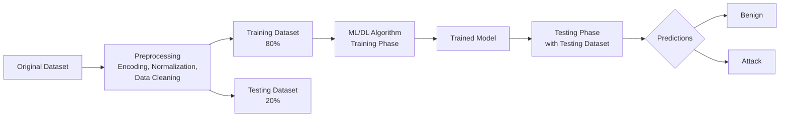

# Bài 9: IDS Dựa Trên Học Máy (Machine Learning-based IDS)

---

## 1. Tổng quan về IDS và thách thức

### Nhắc lại: IDS là gì?

**Intrusion (xâm nhập)** là hành động truy cập trái phép vào thông tin bên trong một máy tính hoặc hệ thống mạng, ảnh hưởng đến tính **bảo mật (Confidentiality)**, **toàn vẹn (Integrity)**, và **sẵn sàng (Availability)** – bộ ba CIA.

**Intrusion Detection and Prevention Systems (IDPS)** tập trung vào:

- Xác định các hành vi xâm nhập
- Ghi log thông tin sự kiện
- Cố gắng ngăn chặn tấn công
- Báo cáo với quản trị viên bảo mật

### Phân loại IDS

```
IDS
├── Theo cách triển khai / nguồn dữ liệu
│   ├── Network-based IDS (NIDS)
│   └── Host-based IDS (HIDS)
└── Theo kỹ thuật phát hiện
    ├── Signature-based IDS (SIDS)
    └── Anomaly-based IDS (AIDS)
```

### Thách thức với IDS truyền thống

!!! warning "Các thách thức chính"
    - Kích thước mạng và khối lượng dữ liệu ngày càng tăng khiến việc xử lý trở nên khó khăn hơn.
    - Khó cải thiện độ chính xác trong phát hiện tấn công đồng thời giảm tỷ lệ cảnh báo sai (False Positive).
    - Xuất hiện nhiều **novel/zero-day attack** – các tấn công chưa từng được ghi nhận trước đây, khiến Signature-based IDS không thể phát hiện.
    - Các kỹ thuật tấn công và qua mặt IDS ngày càng phức tạp và tinh vi.

**Giải pháp tiềm năng:** IDS dựa trên Machine Learning (ML) và Deep Learning (DL).

---

## 2. Tổng quan về Machine Learning và Deep Learning

### Machine Learning là gì?

ML là quá trình sử dụng các dữ liệu đã thấy để đưa ra thuật toán dự đoán cho những dữ liệu chưa từng thấy (dữ liệu tương lai).

Một thuật toán ML bao gồm:

- **Đầu vào:** Tập dữ liệu huấn luyện (training dataset)
- **Kết quả:** Một mô hình (model)
- **Model:** Nhận đầu vào là dữ liệu mới cùng định dạng và đưa ra dự đoán

```
Training Dataset --> [ML/DL Algorithm] --> Model --> Dự đoán trên dữ liệu mới
```

### Phân loại các phương pháp học máy

=== "Supervised Learning"
    **Học có giám sát** – dữ liệu đầu vào đã được gán nhãn (label).

    **Classification (Phân lớp):** Xác định thể loại của mỗi dữ liệu.

    - *Nhị phân:* Chỉ có 2 lớp. Ví dụ: phân loại tất cả sự kiện mạng thành *tấn công* hoặc *bình thường*.
    - *Đa lớp:* Có nhiều lớp. Ví dụ: xác định loại malware cụ thể là ransomware, keylogger, hay remote access trojan.

    **Regression (Hồi quy):** Dự đoán một giá trị số thực. Ví dụ: dự đoán số lượng email lừa đảo một nhân viên sẽ nhận trong 1 tháng dựa trên vị trí làm việc, quyền hạn, thời gian làm việc...

    !!! note
        Kỹ thuật Anomaly-based IDS là một ứng dụng điển hình của hồi quy: xác định khi nào một giá trị quan sát được đủ khác với giá trị dự đoán để kết luận có điều bất thường đang xảy ra.

=== "Unsupervised Learning"
    **Học không giám sát** – dùng dữ liệu chưa được gán nhãn.

    **Clustering:** Xác định các dữ liệu nào tương tự nhau và gom nhóm chúng lại. Ví dụ: phân tích lượng lớn traffic đến một website, có thể phân nhóm các request thành: botnet, người dùng thông thường, crawler...

=== "Semi-Supervised Learning"
    **Học bán giám sát** – dữ liệu đầu vào gồm cả dữ liệu đã gán nhãn và chưa gán nhãn. Thích hợp khi việc gán nhãn tốn kém nhưng vẫn có một lượng nhỏ dữ liệu có nhãn.

=== "Reinforcement Learning"
    **Học tăng cường** – đưa ra các quyết định dựa trên thử và sai. Dạy cho agent thực hiện tốt một task bằng cách tương tác với môi trường (environment) thông qua hành động (action) và nhận phần thưởng (reward). Ứng dụng trong IDS: cho phép hệ thống học cách phản ứng tối ưu với các tình huống tấn công qua thời gian.

---

## 3. Quy trình xây dựng ML-based IDS



**3 bước chính:**

1. **Tiền xử lý dữ liệu (Preprocessing):**
    - Chuyển dữ liệu sang định dạng phù hợp cho thuật toán (encoding các giá trị categorical, normalization về cùng thang đo).
    - Data cleaning: loại bỏ dữ liệu nhiễu, thiếu.
    - Chia ngẫu nhiên thành 2 tập: **training (80%)** và **testing (20%)**.

2. **Training – Huấn luyện:**
    - Thuật toán ML hoặc DL được huấn luyện với tập dữ liệu training.
    - Model học các pattern từ dữ liệu.

3. **Testing – Kiểm tra:**
    - Model đã huấn luyện được kiểm tra với tập testing.
    - Đánh giá dựa trên các dự đoán mà model đưa ra.

### Overfitting và Underfitting

!!! danger "Overfitting"
    Model tạo ra quá khớp với dữ liệu huấn luyện, học thuộc cả nhiễu trong dữ liệu train, nên **không tổng quát hóa tốt** trên dữ liệu mới chưa thấy. Biểu hiện: accuracy trên train rất cao nhưng trên test thấp hẳn.

!!! warning "Underfitting"
    Model quá đơn giản, không học được đủ các pattern từ dữ liệu, cũng tổng quát hóa kém. Biểu hiện: accuracy thấp ngay cả trên tập train.

---

## 4. Các thuật toán Machine Learning ("Shallow Learning")

### 4.1 Decision Tree (DT) – Cây quyết định

**Ý tưởng:** Thuật toán học có giám sát cơ bản, dùng cho cả classification và regression. Áp dụng một loạt các quyết định (rules) để phân loại dữ liệu.

**Cấu trúc:**
- **Node:** Đại diện cho một đặc điểm (feature/attribute).
- **Nhánh (Branch):** Đại diện cho một quyết định hoặc rule.
- **Lá (Leaf):** Kết quả hoặc nhãn cần gán cho dữ liệu.

**Ưu điểm:**
- Tự động chọn các thuộc tính tốt nhất để dựng cây.
- Thực hiện **pruning (cắt tỉa)** – bỏ đi các nhánh không liên quan để tránh overfitting.
- Dễ giải thích (interpretable).

**Các model DT phổ biến:** CART, C4.5, ID3

**Mở rộng:** Random Forest (RF), XGBoost – là các **ensemble methods** dựa trên DT.

---

### 4.2 Support Vector Machine (SVM)

**Ý tưởng:** Tìm một **siêu mặt phẳng phân chia (hyperplane)** có **lề (margin) lớn nhất** trong không gian n chiều để phân tách các lớp dữ liệu.

- n = 2: đường thẳng
- n = 3: mặt phẳng
- n > 3: siêu mặt phẳng

**Xử lý bài toán phi tuyến tính:**
1. Dùng **kernel function** để ánh xạ vector đầu vào ít chiều sang không gian nhiều chiều hơn (nơi dữ liệu có thể phân tách tuyến tính).
2. Tìm **support vectors** – các điểm dữ liệu gần ranh giới nhất – để xác định siêu mặt phẳng phân chia tối ưu.

**Ứng dụng trong IDS:** Phân loại traffic bình thường và tấn công.

---

### 4.3 K-Nearest Neighbor (KNN)

**Ý tưởng:** Phân loại dữ liệu mới dựa trên **k điểm dữ liệu "hàng xóm"** gần nhất (tính theo khoảng cách, thường là Euclidean distance).

**Cách hoạt động:**
- Tính khoảng cách từ điểm cần phân loại đến tất cả các điểm trong tập training.
- Chọn k điểm gần nhất.
- Phân loại theo nhãn chiếm đa số trong k điểm đó (majority voting).

**Ảnh hưởng của tham số k:**
- k quá nhỏ → model dễ bị **overfitting** (nhạy cảm với nhiễu).
- k quá lớn → model có thể **phân loại sai** do xét đến quá nhiều hàng xóm không liên quan.

---

### 4.4 K-Means Clustering

**Ý tưởng:** Thuật toán **unsupervised learning**, chia dữ liệu thành K cluster (nhóm) bằng cách đặt các dữ liệu giống nhau vào cùng một nhóm.

**Cách hoạt động (lặp lại đến khi hội tụ):**

```
1. Khởi tạo K centroid (trung tâm) ngẫu nhiên
2. Gán mỗi điểm dữ liệu vào cluster có centroid gần nhất
3. Tính lại centroid mới của mỗi cluster (trung bình các điểm trong cluster)
4. Lặp lại bước 2-3 cho đến khi centroid không thay đổi
```

**Mục tiêu:** Giảm thiểu tổng khoảng cách giữa các điểm dữ liệu và centroid đại diện của cluster.

**Ứng dụng trong IDS:** Phân nhóm traffic để phát hiện anomaly mà không cần nhãn.

---

### 4.5 Artificial Neural Network (ANN)

**Ý tưởng:** Lấy cảm hứng từ mạng thần kinh sinh học trong não người.

**Cấu trúc:**
- **Input layer:** Nhận dữ liệu đầu vào.
- **Hidden layers:** Các lớp ẩn xử lý và trích xuất đặc trưng.
- **Output layer:** Đưa ra kết quả dự đoán.

**Backpropagation:** Thuật toán học chính trong ANN, điều chỉnh trọng số (weights) của các kết nối theo hướng giảm thiểu sai số (loss).

---

### 4.6 Ensemble Learning – Học kết hợp

**Ý tưởng:** Thay vì dùng một classifier, kết hợp nhiều classifier khác nhau để tạo ra một classifier tổng thể mạnh hơn.

**Nguyên lý:** Kết hợp các classifier "yếu" (weak learners) thông qua thuật toán **voting** để tạo thành một "strong learner".

**Ví dụ phổ biến:**
- **Random Forest:** Kết hợp nhiều Decision Tree, mỗi cây được train trên một subset ngẫu nhiên của dữ liệu và features.
- **XGBoost:** Gradient boosting, huấn luyện tuần tự, mỗi cây mới cố gắng sửa lỗi của các cây trước.
- **Bagging, Boosting, Stacking:** Các chiến lược ensemble khác nhau.

---

## 5. Các thuật toán Deep Learning (DL)

!!! info "Deep Learning vs Machine Learning"
    DL là một **tập con của ML**, sử dụng nhiều hidden layers để tạo thành **deep neural network**. DL hiệu quả hơn ML nhờ:
    - Cấu trúc sâu (deep structure) cho phép học các biểu diễn phức tạp.
    - Khả năng **tự học các thuộc tính (feature)** quan trọng từ dữ liệu thô mà không cần feature engineering thủ công.

### 5.1 Convolutional Neural Network (CNN)

**Phù hợp với:** Dữ liệu dạng mảng (array), đặc biệt dữ liệu hình ảnh. Trong IDS, traffic data có thể được biểu diễn dạng ma trận để áp dụng CNN.

**Cấu trúc:**

```
Input --> [Convolutional Layer] --> [Pooling Layer] --> ... --> [Fully Connected Layer] --> Output
```

- **Convolutional Layer:** Trích xuất đặc trưng cục bộ bằng các bộ lọc (filters/kernels).
- **Pooling Layer:** Giảm chiều dữ liệu, giữ lại đặc trưng quan trọng, tăng tính bất biến.
- **Fully Connected Layer:** Kết hợp tất cả đặc trưng để đưa ra phân loại cuối cùng.

**Ứng dụng trong IDS:** Trích xuất đặc trưng và phân loại theo hướng có giám sát.

---

### 5.2 Recurrent Neural Network (RNN)

**Phù hợp với:** Dữ liệu dạng chuỗi (sequence data) – phù hợp với traffic mạng có tính thứ tự thời gian.

**Điểm đặc biệt:** Mỗi đơn vị RNN đưa ra quyết định dựa trên **input hiện tại** và **kết quả của bước trước** – tạo ra "bộ nhớ" ngắn hạn.

**Hạn chế:** Khó xử lý các chuỗi rất dài do vấn đề **vanishing gradient** (gradient biến mất khi lan truyền ngược qua nhiều bước).

**Các biến thể cải tiến:**
- **LSTM (Long Short-Term Memory):** Giải quyết vấn đề vanishing gradient bằng các cổng (gate) kiểm soát luồng thông tin.
- **GRU (Gated Recurrent Unit):** Phiên bản đơn giản hơn LSTM, ít tham số hơn nhưng hiệu quả tương đương trong nhiều trường hợp.

---

### 5.3 AutoEncoder (AE)

**Ý tưởng:** Mạng học cách **nén (encode)** dữ liệu vào biểu diễn chiều thấp rồi **giải nén (decode)** lại, được huấn luyện để tái tạo đầu vào càng chính xác càng tốt.

**Ứng dụng trong IDS (Anomaly Detection):**
- Train AutoEncoder chỉ trên traffic bình thường.
- Khi gặp traffic tấn công (bất thường), reconstruction error cao → phát hiện anomaly.

**Các biến thể:** Variational AE (VAE), Sparse AE, Stacked AE.

---

### 5.4 Deep Belief Network (DBN)

Mạng nhiều tầng được xây dựng từ các **Restricted Boltzmann Machines (RBM)**, học biểu diễn phân tầng của dữ liệu theo kiểu unsupervised, sau đó fine-tune có giám sát.

---

## 6. Các tập dữ liệu Benchmark cho IDS

| Dataset | Năm | Loại tấn công chính |
|---|---|---|
| KDD Cup'99 | 1998 | DoS, Probe, R2L, U2R |
| NSL-KDD | 2009 | DoS, Probe, R2L, U2R |
| Kyoto 2006+ | 2006–2015 | Known/Unknown Attacks |
| UNSW-NB15 | 2015 | DoS, Exploits, Backdoor, Fuzzers, Worms, Shellcode, Recon, Port Scan, Generic |
| CIC-IDS2017 | 2017 | Brute Force, HeartBleed, Botnet, DoS, DDoS, Web Attack, Infiltration |
| CSE-CIC-IDS2018 | 2018 | Brute-force, Heartbleed, Botnet, DoS, DDoS, Web Attacks, Infiltration |

??? details "Chi tiết từng dataset"
    **KDD Cup'99 (lỗi thời):**

    - Phổ biến nhất và được sử dụng rộng rãi cho IDS.
    - Gồm 5 lớp phân loại, gần 2 triệu records.
    - Mỗi record gồm 41 thuộc tính, nhãn: *normal* hoặc *attack*.
    - 4 loại tấn công: **DoS, Probe, R2L (Remote to Local), U2R (User to Root)**.

    **NSL-KDD (2009):**

    - Phiên bản sửa đổi của KDD Cup'99, loại bỏ các bản ghi trùng lặp và một số vấn đề thống kê.
    - Vẫn 41 thuộc tính, 4 loại tấn công tương tự.
    - Được dùng rộng rãi hơn KDD Cup'99 trong nghiên cứu hiện đại.

    **Kyoto 2006+:**

    - Tạo từ traffic thực từ honeypot, sensor, email server, web crawler của Đại học Kyoto, Nhật Bản.
    - Có bản ghi traffic từ 2006 đến 2015 (dữ liệu thực, dài hạn).
    - Mỗi bản ghi có 24 thuộc tính: 14 từ KDD Cup'99 + 10 bổ sung.

    **UNSW-NB15:**

    - Tạo bởi Australian Center for Cyber Security và Đại học UNSW, Úc.
    - Gần 2 triệu bản ghi, 49 thuộc tính trích xuất từ Bro-IDS, Argus, và các thuật toán mới.
    - Phong phú về loại tấn công: Worms, Shellcode, Reconnaissance, Port Scans, Generic, Backdoor, DoS, Exploits, Fuzzers.

    **CIC-IDS2017:**

    - Tạo bởi Canadian Institute of Cyber Security (CIC) năm 2017.
    - Hơn 80 thuộc tính mỗi record.
    - Traffic được phân tích bằng **CICFlowMeter** (timestamps, IP nguồn/đích, giao thức).
    - Có cả traffic bình thường lẫn tấn công thực tế.

    **CSE-CIC-IDS2018:**

    - Tạo bởi Communications Security Establishment (CSE) kết hợp CIC.
    - Hơn 80 thuộc tính, 7 kịch bản tấn công.
    - Có profiles người dùng với các sự kiện khác nhau để tăng tính thực tế.

---

## 7. Các chỉ số đánh giá IDS

### Ma trận nhầm lẫn (Confusion Matrix)

=== "Nhị phân"
    | | Dự đoán: Tấn công | Dự đoán: Bình thường |
    |---|---|---|
    | **Thực tế: Tấn công** | TP (True Positive) | FN (False Negative) |
    | **Thực tế: Bình thường** | FP (False Positive) | TN (True Negative) |

=== "Đa nhãn"
    | | Dự đoán: a | Dự đoán: b | Dự đoán: c |
    |---|---|---|---|
    | **Thực tế: a** | TP | FN | FN |
    | **Thực tế: b** | FP | TN | TN |
    | **Thực tế: c** | FP | TN | TN |

**Định nghĩa:**
- **TP (True Positive):** Cảnh báo đúng – thực sự là tấn công và bị phát hiện.
- **FP (False Positive):** Cảnh báo sai – thực ra là bình thường nhưng bị cảnh báo là tấn công.
- **TN (True Negative):** Không có tấn công và không có cảnh báo.
- **FN (False Negative):** Là tấn công nhưng không bị phát hiện – nguy hiểm nhất.

### Các công thức tính

**Accuracy (Độ chính xác):**

```
Accuracy = (TP + TN) / (TP + TN + FP + FN)
```

> Có bao nhiêu trường hợp được xác định đúng trong tổng số.

**False Positive Rate (FPR):**

```
FPR = FP / (FP + TN)
```

> Tỷ lệ traffic bình thường bị cảnh báo nhầm là tấn công.

**False Negative Rate (FNR):**

```
FNR = FN / (FN + TP)
```

> Tỷ lệ tấn công thực sự không được phát hiện.

**Precision:**

```
Precision = TP / (TP + FP)
```

> Trong tất cả các cảnh báo tấn công, có bao nhiêu là thật sự tấn công.

**Recall (Detection Rate):**

```
Recall = TP / (TP + FN)
```

> Trong tất cả các tấn công thực tế, bao nhiêu được phát hiện.

**F1-Score:**

```
F1 = 2 * (Precision * Recall) / (Precision + Recall)
```

> Tổ hợp hài hòa giữa Precision và Recall, hữu ích khi dữ liệu mất cân bằng.

### Bài tập tính chỉ số đánh giá

Cho bảng confusion matrix:

| | Dự đoán: Tấn công | Dự đoán: Bình thường |
|---|---|---|
| **Thực tế: Tấn công** | 55 | 45 |
| **Thực tế: Bình thường** | 50 | 850 |

??? info "Giải"
    - TP = 55, FN = 45, FP = 50, TN = 850

    **Accuracy** = (55 + 850) / (55 + 850 + 50 + 45) = 905 / 1000 = **90.5%**

    **FPR** = 50 / (50 + 850) = 50 / 900 ≈ **5.56%**

    **FNR** = 45 / (45 + 55) = 45 / 100 = **45%** ← Rất cao, 45% tấn công bị bỏ qua!

    **Precision** = 55 / (55 + 50) = 55 / 105 ≈ **52.38%**

    **Recall** = 55 / (55 + 45) = 55 / 100 = **55%**

    **F1-Score** = 2 * (0.5238 * 0.55) / (0.5238 + 0.55) = 2 * 0.2881 / 1.0738 ≈ **53.67%**

    **Nhận xét:** Accuracy có vẻ tốt (90.5%) nhưng FNR rất cao (45%) – cho thấy model bỏ sót nhiều tấn công. Đây là lý do tại sao không nên chỉ dùng Accuracy để đánh giá IDS.

---

## 8. Xu hướng hiện tại và tương lai

### Xu hướng hiện tại

- DL chiếm ưu thế hơn ML trong các nghiên cứu gần đây: **DL chiếm ~60%**, ML ~40% trong các nghiên cứu từ 2017–2020.
- Dataset được dùng nhiều nhất: **NSL-KDD (36%)**, KDD Cup'99 (24%), UNSW-NB15 (18%).
- Hầu hết model được test trên các dataset cũ như KDD Cup'99 và NSL-KDD → hiệu suất tốt trên dataset cũ có thể giảm khi áp dụng dataset mới hơn.
- Các thuật toán ML được dùng nhiều nhất: **RF, DT, KNN, SVM, Ensemble Methods**.

### Thách thức trong nghiên cứu

!!! warning "4 thách thức chính"
    1. **Thiếu dataset cập nhật và có hệ thống** – hầu hết dataset đã cũ, không phản ánh các tấn công mới.
    2. **Class imbalance (mất cân bằng lớp)** – số bản ghi tấn công ít hơn nhiều so với bình thường, ảnh hưởng đến tỷ lệ phát hiện. Giải pháp: SMOTE, RandomOverSampler, ADASYN.
    3. **Hiệu suất trong môi trường thực tế** – hầu hết được test trong môi trường lab với public dataset, chưa kiểm chứng thực tế.
    4. **Tiêu tốn tài nguyên** với model phức tạp → cần thuật toán chọn lọc thuộc tính (feature selection) hiệu quả. Đặc biệt cần **IDS nhẹ cho ngữ cảnh IoT**.

### Xu hướng trong tương lai

- Framework NIDS hiệu quả với dataset cập nhật, cân bằng, có hệ thống.
- Các thuật toán DL mới chưa được khai thác nhiều: **Deep Reinforcement Learning**, **Hidden Markov Models**.
- **NIDS cho Cyber-Physical Systems:**
    - SCADA networks (smart grids, manufacturing industries).
    - Mạng UAV (Unmanned Aerial Vehicles – phương tiện không người lái).

---

## 9. Các tài liệu tham khảo và tự học

- **Sách:** Chio, C., & Freeman, D. (2018). *Machine Learning & Security*
- **Nghiên cứu:** Ahmad et al. (2021). Network intrusion detection system: A systematic study of ML and DL approaches. *Transactions on Emerging Telecommunications Technologies*, 32(1).
- **Nghiên cứu:** Khraisat et al. (2019). Survey of intrusion detection systems. *Cybersecurity*, 2(1).
- **ML:** https://scikit-learn.org/ | https://machinelearningcoban.com/
- **DL:** https://d2l.ai/ | https://nttuan8.com/
- **Thực hành:** https://playground.tensorflow.org/

---

---

# Câu hỏi trắc nghiệm

**Câu 1.** Bộ ba CIA trong bảo mật thông tin bao gồm những gì?

- A. Confidentiality, Integrity, Availability
- B. Classification, Identification, Authentication
- C. Cryptography, Intrusion, Access
- D. Control, Isolation, Authorization

??? info "Đáp án & Giải thích"
    **Đáp án: A**

    CIA là nền tảng của bảo mật thông tin: Confidentiality (Bảo mật), Integrity (Toàn vẹn), Availability (Sẵn sàng).

---

**Câu 2.** IDPS viết tắt của gì?

- A. Intrusion Data Protection System
- B. Intrusion Detection and Prevention Systems
- C. Internal Defense and Prevention Service
- D. Integrated Detection Protocol Stack

??? info "Đáp án & Giải thích"
    **Đáp án: B**

    IDPS = Intrusion Detection and Prevention Systems.

---

**Câu 3.** IDS phân loại theo kỹ thuật phát hiện gồm những loại nào?

- A. NIDS và HIDS
- B. SIDS và AIDS
- C. ML-based và Rule-based
- D. Active và Passive

??? info "Đáp án & Giải thích"
    **Đáp án: B**

    Theo kỹ thuật phát hiện: Signature-based IDS (SIDS) và Anomaly-based IDS (AIDS). Còn NIDS/HIDS là phân loại theo cách triển khai.

---

**Câu 4.** Zero-day attack là gì và tại sao nó là thách thức cho IDS truyền thống?

- A. Tấn công xảy ra vào ngày đầu tiên của tháng, khó dự đoán
- B. Tấn công lợi dụng lỗ hổng chưa được công bố, Signature-based IDS không có chữ ký để phát hiện
- C. Tấn công từ 0 giờ đêm đến 6 giờ sáng
- D. Tấn công mà hacker không để lại dấu vết nào

??? info "Đáp án & Giải thích"
    **Đáp án: B**

    Zero-day/novel attack là tấn công chưa từng được ghi nhận, không có signature. SIDS không thể phát hiện vì không có pattern để so sánh.

---

**Câu 5.** Trong ML, "model" là gì?

- A. Tập dữ liệu huấn luyện
- B. Thuật toán được sử dụng để training
- C. Thuật toán nhận dữ liệu mới và đưa ra dự đoán sau khi training
- D. Kết quả cuối cùng sau khi testing

??? info "Đáp án & Giải thích"
    **Đáp án: C**

    Model là đầu ra của quá trình training, có thể nhận dữ liệu mới (cùng định dạng với training data) và đưa ra dự đoán.

---

**Câu 6.** Supervised Learning khác Unsupervised Learning ở điểm nào chính?

- A. Supervised Learning dùng nhiều dữ liệu hơn
- B. Supervised Learning dùng dữ liệu đã được gán nhãn, Unsupervised Learning dùng dữ liệu chưa gán nhãn
- C. Supervised Learning chỉ dùng cho classification, Unsupervised Learning chỉ dùng cho clustering
- D. Supervised Learning chậm hơn Unsupervised Learning

??? info "Đáp án & Giải thích"
    **Đáp án: B**

    Đây là sự khác biệt cơ bản nhất: Supervised có label, Unsupervised không có label.

---

**Câu 7.** Anomaly-based IDS phù hợp với kỹ thuật ML nào nhất?

- A. Classification nhị phân
- B. Clustering
- C. Regression / phát hiện bất thường
- D. Reinforcement Learning

??? info "Đáp án & Giải thích"
    **Đáp án: C**

    Theo slide, kỹ thuật Anomaly-based là điển hình của hồi quy (regression): xác định khi nào giá trị quan sát được đủ khác giá trị dự đoán để coi là bất thường.

---

**Câu 8.** Semi-Supervised Learning là gì?

- A. Học máy chỉ dùng 50% dữ liệu
- B. Kết hợp dữ liệu đã gán nhãn và chưa gán nhãn
- C. Học máy với giám sát một phần bởi con người
- D. Học máy dùng cho bài toán có 2 class

??? info "Đáp án & Giải thích"
    **Đáp án: B**

    Semi-supervised learning dùng cả labeled và unlabeled data, hữu ích khi việc gán nhãn tốn kém nhưng vẫn có một lượng nhỏ dữ liệu có nhãn.

---

**Câu 9.** Trong quy trình ML-based IDS, tập dữ liệu thường được chia theo tỷ lệ nào?

- A. 50% training – 50% testing
- B. 70% training – 30% testing
- C. 80% training – 20% testing
- D. 90% training – 10% testing

??? info "Đáp án & Giải thích"
    **Đáp án: C**

    Theo tài liệu, tỷ lệ phổ biến là 80% training và 20% testing.

---

**Câu 10.** Preprocessing dữ liệu trong ML bao gồm các bước nào?

- A. Encoding, Normalization, Data Cleaning
- B. Encryption, Compression, Classification
- C. Training, Testing, Validation
- D. Labeling, Sorting, Filtering

??? info "Đáp án & Giải thích"
    **Đáp án: A**

    Ba bước chính trong preprocessing: Encoding (chuyển đổi dữ liệu categorical), Normalization (chuẩn hóa về cùng thang đo), Data Cleaning (loại bỏ dữ liệu nhiễu/thiếu).

---

**Câu 11.** Overfitting xảy ra khi nào?

- A. Model quá đơn giản, không học được đủ pattern
- B. Model học quá khớp với training data, không tổng quát hóa tốt trên dữ liệu mới
- C. Model có quá nhiều dữ liệu training
- D. Model dùng quá nhiều tài nguyên tính toán

??? info "Đáp án & Giải thích"
    **Đáp án: B**

    Overfitting: model khớp quá tốt với training data (kể cả nhiễu), dẫn đến hiệu suất kém trên dữ liệu mới.

---

**Câu 12.** Decision Tree thực hiện "pruning" để làm gì?

- A. Tăng độ sâu của cây để học nhiều hơn
- B. Loại bỏ các nhánh không liên quan để tránh overfitting
- C. Cắt bớt dữ liệu training để tiết kiệm thời gian
- D. Tối ưu hóa tốc độ dự đoán

??? info "Đáp án & Giải thích"
    **Đáp án: B**

    Pruning (cắt tỉa) loại bỏ các nhánh không đóng góp đáng kể vào độ chính xác, giúp tránh overfitting và tạo model đơn giản hơn, tổng quát hơn.

---

**Câu 13.** Các model Decision Tree phổ biến được đề cập là gì?

- A. CART, C4.5, ID3
- B. CNN, RNN, LSTM
- C. KNN, SVM, RF
- D. CART, XGBoost, GBM

??? info "Đáp án & Giải thích"
    **Đáp án: A**

    Ba model DT phổ biến: CART (Classification and Regression Trees), C4.5, và ID3.

---

**Câu 14.** Support Vector Machine tìm kiếm điều gì trong không gian n chiều?

- A. Centroid gần nhất với dữ liệu
- B. Siêu mặt phẳng phân chia có lề (margin) lớn nhất
- C. Cây quyết định tối ưu
- D. Cluster có nhiều điểm nhất

??? info "Đáp án & Giải thích"
    **Đáp án: B**

    SVM tìm hyperplane (siêu mặt phẳng) phân chia các lớp với margin lớn nhất, tối đa hóa khoảng cách từ hyperplane đến các điểm dữ liệu gần nhất (support vectors).

---

**Câu 15.** SVM xử lý bài toán phi tuyến tính bằng cách nào?

- A. Tăng số lượng support vectors
- B. Dùng kernel function để ánh xạ vào không gian chiều cao hơn
- C. Chia bài toán thành nhiều bài toán tuyến tính nhỏ
- D. Dùng ensemble của nhiều SVM tuyến tính

??? info "Đáp án & Giải thích"
    **Đáp án: B**

    Kernel trick: ánh xạ dữ liệu từ không gian ít chiều sang không gian nhiều chiều hơn nơi dữ liệu có thể phân tách tuyến tính, sau đó tìm hyperplane trong không gian mới đó.

---

**Câu 16.** Trong KNN, điều gì xảy ra nếu k quá nhỏ?

- A. Model bị underfitting
- B. Model dễ bị overfitting
- C. Model không thể phân loại được
- D. Model chạy chậm hơn

??? info "Đáp án & Giải thích"
    **Đáp án: B**

    k quá nhỏ → model quá nhạy cảm với các điểm nhiễu/ngoại lệ trong training data → overfitting.

---

**Câu 17.** Trong KNN, điều gì xảy ra nếu k quá lớn?

- A. Model bị overfitting
- B. Model có thể phân loại sai do xét quá nhiều hàng xóm không liên quan
- C. Thời gian dự đoán nhanh hơn
- D. Model tốt hơn vì xét nhiều thông tin hơn

??? info "Đáp án & Giải thích"
    **Đáp án: B**

    k quá lớn → xét cả những điểm ở xa, không liên quan đến dữ liệu cần phân loại → phân loại sai (underfitting).

---

**Câu 18.** K-Means Clustering là thuật toán thuộc loại nào?

- A. Supervised Learning
- B. Semi-supervised Learning
- C. Unsupervised Learning
- D. Reinforcement Learning

??? info "Đáp án & Giải thích"
    **Đáp án: C**

    K-Means là unsupervised learning vì không cần nhãn dữ liệu, tự động khám phá cấu trúc nhóm trong dữ liệu.

---

**Câu 19.** Mục tiêu tối ưu của K-Means là gì?

- A. Tối đa hóa khoảng cách giữa các cluster
- B. Giảm thiểu tổng khoảng cách giữa các điểm dữ liệu và centroid của cluster
- C. Tối đa hóa số lượng cluster
- D. Tối thiểu hóa số lượng vòng lặp

??? info "Đáp án & Giải thích"
    **Đáp án: B**

    K-Means minimizes inertia (tổng bình phương khoảng cách từ mỗi điểm đến centroid của cluster nó thuộc về).

---

**Câu 20.** Thuật toán backpropagation trong ANN dùng để làm gì?

- A. Truyền dữ liệu từ input đến output
- B. Điều chỉnh trọng số các kết nối theo hướng giảm thiểu sai số
- C. Khởi tạo các node trong mạng
- D. Loại bỏ các node không quan trọng

??? info "Đáp án & Giải thích"
    **Đáp án: B**

    Backpropagation tính gradient của hàm loss theo các trọng số, sau đó cập nhật trọng số theo hướng ngược với gradient (gradient descent) để giảm thiểu sai số.

---

**Câu 21.** Deep Learning khác Machine Learning "nông" (shallow) ở điểm gì chính?

- A. DL dùng nhiều dữ liệu hơn
- B. DL có nhiều hidden layers, tự học đặc trưng từ dữ liệu thô
- C. DL chỉ dùng cho phân loại ảnh
- D. DL không cần training

??? info "Đáp án & Giải thích"
    **Đáp án: B**

    DL có cấu trúc sâu (deep structure) với nhiều hidden layers, khả năng tự học và trích xuất đặc trưng phức tạp từ dữ liệu thô mà không cần feature engineering thủ công.

---

**Câu 22.** CNN đặc biệt phù hợp với loại dữ liệu nào?

- A. Dữ liệu dạng bảng (tabular)
- B. Dữ liệu dạng chuỗi thời gian
- C. Dữ liệu dạng mảng (array), đặc biệt là ảnh
- D. Dữ liệu văn bản

??? info "Đáp án & Giải thích"
    **Đáp án: C**

    CNN được thiết kế cho dữ liệu dạng mảng, ban đầu thành công trong computer vision. Trong IDS, traffic data có thể biểu diễn dạng ma trận để áp dụng CNN.

---

**Câu 23.** Pooling layer trong CNN có chức năng gì?

- A. Tăng kích thước feature map
- B. Trích xuất đặc trưng bằng kernel
- C. Giảm chiều dữ liệu và giữ đặc trưng quan trọng
- D. Kết hợp tất cả đặc trưng để phân loại

??? info "Đáp án & Giải thích"
    **Đáp án: C**

    Pooling (thường là Max Pooling hoặc Average Pooling) giảm chiều của feature map, giảm số tham số, tăng tính bất biến với dịch chuyển nhỏ.

---

**Câu 24.** RNN phù hợp với loại dữ liệu nào?

- A. Dữ liệu ảnh
- B. Dữ liệu dạng chuỗi (sequence data) có tính thứ tự thời gian
- C. Dữ liệu bảng không có thứ tự
- D. Dữ liệu âm thanh dạng snapshot

??? info "Đáp án & Giải thích"
    **Đáp án: B**

    RNN được thiết kế cho sequence data, mỗi bước xử lý phụ thuộc vào kết quả bước trước. Traffic mạng có tính thứ tự thời gian nên phù hợp với RNN.

---

**Câu 25.** LSTM và GRU là gì?

- A. Hai loại CNN khác nhau
- B. Biến thể của RNN giải quyết vấn đề vanishing gradient
- C. Hai thuật toán clustering
- D. Các phương pháp ensemble

??? info "Đáp án & Giải thích"
    **Đáp án: B**

    LSTM (Long Short-Term Memory) và GRU (Gated Recurrent Unit) là biến thể của RNN, sử dụng các cổng (gate) để kiểm soát luồng thông tin, giải quyết vấn đề vanishing gradient khi xử lý chuỗi dài.

---

**Câu 26.** AutoEncoder ứng dụng trong IDS như thế nào?

- A. Train trên cả dữ liệu tấn công và bình thường để phân loại
- B. Train chỉ trên traffic bình thường, khi reconstruction error cao → phát hiện anomaly
- C. Nén dữ liệu để tăng tốc độ xử lý
- D. Tạo dữ liệu tổng hợp để augment tập training

??? info "Đáp án & Giải thích"
    **Đáp án: B**

    AutoEncoder học mô hình của dữ liệu bình thường. Khi gặp tấn công (dữ liệu bất thường), model không thể tái tạo tốt → reconstruction error cao → flagged là anomaly.

---

**Câu 27.** Ensemble Learning có ý tưởng chính là gì?

- A. Dùng một model rất phức tạp để đạt độ chính xác cao
- B. Kết hợp nhiều classifier yếu để tạo thành một classifier mạnh hơn
- C. Chia dữ liệu thành nhiều phần và train song song
- D. Dùng nhiều lần train để tăng độ chính xác

??? info "Đáp án & Giải thích"
    **Đáp án: B**

    Ensemble learning kết hợp các weak learners thông qua voting/averaging để tạo strong learner với hiệu suất tốt hơn bất kỳ model đơn lẻ nào.

---

**Câu 28.** Dataset nào sau đây là phiên bản cải tiến của KDD Cup'99?

- A. UNSW-NB15
- B. CIC-IDS2017
- C. NSL-KDD
- D. Kyoto 2006+

??? info "Đáp án & Giải thích"
    **Đáp án: C**

    NSL-KDD (2009) là phiên bản sửa đổi và tinh chỉnh của KDD Cup'99, loại bỏ các bản ghi trùng lặp và một số vấn đề thống kê.

---

**Câu 29.** KDD Cup'99 phân loại tấn công thành mấy loại chính?

- A. 3 loại: DoS, Probe, R2L
- B. 4 loại: DoS, Probe, R2L, U2R
- C. 5 loại: DoS, Probe, R2L, U2R, DDoS
- D. 2 loại: Normal và Attack

??? info "Đáp án & Giải thích"
    **Đáp án: B**

    KDD Cup'99 và NSL-KDD phân loại 4 loại tấn công: DoS (Denial of Service), Probe, R2L (Remote to Local), U2R (User to Root).

---

**Câu 30.** Dataset UNSW-NB15 được tạo bởi tổ chức nào?

- A. Canadian Institute of Cyber Security
- B. Đại học Kyoto, Nhật Bản
- C. Australian Center for Cyber Security và Đại học UNSW
- D. Communications Security Establishment Canada

??? info "Đáp án & Giải thích"
    **Đáp án: C**

    UNSW-NB15 được tạo bởi Australian Center for Cyber Security kết hợp với Đại học UNSW, Úc.

---

**Câu 31.** CIC-IDS2017 sử dụng công cụ gì để phân tích traffic mạng?

- A. Wireshark
- B. Snort
- C. CICFlowMeter
- D. Argus

??? info "Đáp án & Giải thích"
    **Đáp án: C**

    CIC-IDS2017 dùng CICFlowMeter để phân tích traffic, trích xuất thông tin từ timestamps, địa chỉ IP nguồn/đích, giao thức và các tấn công.

---

**Câu 32.** CIC-IDS2017 và CSE-CIC-IDS2018 mỗi record có bao nhiêu thuộc tính?

- A. 24 thuộc tính
- B. 41 thuộc tính
- C. 49 thuộc tính
- D. Hơn 80 thuộc tính

??? info "Đáp án & Giải thích"
    **Đáp án: D**

    Cả CIC-IDS2017 và CSE-CIC-IDS2018 đều có hơn 80 thuộc tính mỗi record, phong phú hơn nhiều so với KDD Cup'99 (41 thuộc tính).

---

**Câu 33.** True Positive (TP) trong IDS được định nghĩa là gì?

- A. Cảnh báo sai – thực ra là traffic bình thường
- B. Không có tấn công và không có cảnh báo
- C. Tấn công thực sự được phát hiện và cảnh báo đúng
- D. Tấn công xảy ra nhưng không bị phát hiện

??? info "Đáp án & Giải thích"
    **Đáp án: C**

    TP = True Positive: hệ thống cảnh báo tấn công và thực tế đó đúng là tấn công.

---

**Câu 34.** False Negative (FN) trong IDS nguy hiểm như thế nào?

- A. Gây ra nhiều cảnh báo sai, làm quản trị viên mệt mỏi
- B. Tấn công thực sự xảy ra nhưng không bị phát hiện – hệ thống bị xâm nhập mà không hay biết
- C. Làm chậm hệ thống do xử lý nhiều cảnh báo
- D. Không nguy hiểm, chỉ ảnh hưởng đến hiệu suất

??? info "Đáp án & Giải thích"
    **Đáp án: B**

    FN là nguy hiểm nhất: tấn công xảy ra nhưng IDS không phát hiện được, hệ thống bị xâm nhập mà không có cảnh báo nào.

---

**Câu 35.** Công thức tính Accuracy là gì?

- A. TP / (TP + FP)
- B. TP / (TP + FN)
- C. (TP + TN) / (TP + TN + FP + FN)
- D. FP / (FP + TN)

??? info "Đáp án & Giải thích"
    **Đáp án: C**

    Accuracy = số trường hợp phân loại đúng / tổng số trường hợp = (TP + TN) / (TP + TN + FP + FN).

---

**Câu 36.** Precision đo lường điều gì?

- A. Tỷ lệ tấn công thực tế được phát hiện
- B. Trong tất cả các cảnh báo tấn công, bao nhiêu là thực sự tấn công
- C. Tỷ lệ traffic bình thường bị cảnh báo nhầm
- D. Tổng số tấn công trong dataset

??? info "Đáp án & Giải thích"
    **Đáp án: B**

    Precision = TP / (TP + FP) – trong số tất cả những gì model dự đoán là tấn công, có bao nhiêu phần trăm thực sự là tấn công.

---

**Câu 37.** Recall (Detection Rate) đo lường điều gì?

- A. Trong tất cả các cảnh báo, bao nhiêu là đúng
- B. Trong tất cả các tấn công thực tế, bao nhiêu được phát hiện
- C. Tỷ lệ True Negative
- D. Số lượng cảnh báo trên mỗi giờ

??? info "Đáp án & Giải thích"
    **Đáp án: B**

    Recall = TP / (TP + FN) – trong số tất cả các tấn công thực sự xảy ra, IDS phát hiện được bao nhiêu phần trăm.

---

**Câu 38.** F1-Score được tính như thế nào và dùng khi nào?

- A. (Precision + Recall) / 2, dùng khi dữ liệu cân bằng
- B. 2 * (Precision * Recall) / (Precision + Recall), đặc biệt hữu ích khi dữ liệu mất cân bằng
- C. Precision * Recall, dùng thay thế Accuracy
- D. (TP + FP) / (TP + FN), dùng khi FP quan trọng hơn FN

??? info "Đáp án & Giải thích"
    **Đáp án: B**

    F1 là harmonic mean của Precision và Recall. Đặc biệt hữu ích khi có class imbalance (mất cân bằng lớp) vì không bị ảnh hưởng bởi TN nhiều.

---

**Câu 39.** FPR (False Positive Rate) ảnh hưởng thực tế như thế nào đến hoạt động IDS?

- A. FPR cao → bỏ sót nhiều tấn công thật
- B. FPR cao → nhiều cảnh báo sai, tốn thời gian xử lý và gây "alert fatigue" cho quản trị viên
- C. FPR cao → model quá nhạy, phát hiện tốt hơn
- D. FPR không ảnh hưởng đến IDS

??? info "Đáp án & Giải thích"
    **Đáp án: B**

    FPR = FP / (FP + TN). FPR cao nghĩa là nhiều traffic bình thường bị cảnh báo nhầm là tấn công, gây tốn tài nguyên xử lý và "alert fatigue" (quản trị viên bị quá tải cảnh báo, có thể bỏ qua cảnh báo thật).

---

**Câu 40.** Tại sao chỉ dùng Accuracy không đủ để đánh giá IDS khi dataset mất cân bằng?

- A. Accuracy không tính đến thời gian xử lý
- B. Dataset mất cân bằng (ví dụ 95% normal, 5% attack) làm model đoán "normal" cho tất cả vẫn cho Accuracy cao, nhưng Recall = 0
- C. Accuracy chỉ đúng với binary classification
- D. Accuracy bị ảnh hưởng bởi số lượng thuộc tính

??? info "Đáp án & Giải thích"
    **Đáp án: B**

    Ví dụ: dataset có 950 normal và 50 attack. Model đoán tất cả là "normal" → Accuracy = 95%, nhưng không phát hiện được tấn công nào (Recall = 0). Đây là lý do cần kết hợp Precision, Recall, F1-Score.

---

**Câu 41.** Theo thống kê từ 2017–2020, DL hay ML được dùng nhiều hơn trong nghiên cứu IDS?

- A. ML nhiều hơn (~60%)
- B. DL nhiều hơn (~60%)
- C. Ngang nhau (~50-50%)
- D. Không có xu hướng rõ ràng

??? info "Đáp án & Giải thích"
    **Đáp án: B**

    Theo thống kê, DL chiếm khoảng 60% trong các giải pháp IDS từ 2017–2020, do khả năng học tự động và hiệu quả trên dataset lớn.

---

**Câu 42.** Dataset nào được dùng nhiều nhất trong nghiên cứu IDS (2017–2020)?

- A. KDD Cup'99 (36%)
- B. UNSW-NB15 (36%)
- C. NSL-KDD (36%)
- D. CIC-IDS2017 (36%)

??? info "Đáp án & Giải thích"
    **Đáp án: C**

    NSL-KDD chiếm 36%, tiếp theo là KDD Cup'99 (24%) và UNSW-NB15 (18%).

---

**Câu 43.** Class imbalance (mất cân bằng lớp) trong IDS dataset gây ra vấn đề gì?

- A. Làm chậm quá trình training
- B. Ảnh hưởng đến tỷ lệ phát hiện và độ chính xác cho các lớp tấn công có ít bản ghi
- C. Làm tăng FPR
- D. Gây ra overfitting trong mọi trường hợp

??? info "Đáp án & Giải thích"
    **Đáp án: B**

    Khi số bản ghi của một loại tấn công rất ít so với traffic bình thường, model có xu hướng bỏ qua lớp thiểu số → detection rate thấp cho loại tấn công đó.

---

**Câu 44.** Giải pháp nào được đề xuất để xử lý class imbalance?

- A. Tăng số lượng hidden layers
- B. Dùng SMOTE, RandomOverSampler, ADASYN
- C. Giảm learning rate
- D. Dùng activation function khác

??? info "Đáp án & Giải thích"
    **Đáp án: B**

    SMOTE (Synthetic Minority Over-sampling Technique), RandomOverSampler, và ADASYN là các kỹ thuật tạo thêm dữ liệu cho lớp thiểu số để cân bằng dataset.

---

**Câu 45.** Tại sao DL được ưa chuộng hơn ML truyền thống với dataset lớn?

- A. DL nhanh hơn ML
- B. DL ít tốn bộ nhớ hơn
- C. DL tự học và trích xuất đặc trưng từ dữ liệu thô, phù hợp khi gán nhãn tốn kém
- D. DL không cần preprocessing

??? info "Đáp án & Giải thích"
    **Đáp án: C**

    Với dataset lớn, việc gán nhãn tốn thời gian và chi phí. DL học được đặc trưng từ dữ liệu thô mà không cần feature engineering thủ công, thích hợp hơn với big data.

---

**Câu 46.** Kyoto 2006+ dataset có điểm đặc biệt gì so với các dataset khác?

- A. Có nhiều thuộc tính nhất (>80)
- B. Được thu thập từ môi trường thực với honeypot và các biện pháp an ninh thực tế, dữ liệu từ 2006–2015
- C. Chỉ có 2 loại tấn công
- D. Được tạo bởi Canada

??? info "Đáp án & Giải thích"
    **Đáp án: B**

    Kyoto 2006+ được tạo từ traffic thực từ honeypot, sensors, email server, web crawler của Đại học Kyoto – dữ liệu thực tế dài hạn (10 năm).

---

**Câu 47.** Xu hướng tương lai nào được đề xuất cho NIDS?

- A. Quay lại dùng Signature-based IDS
- B. NIDS cho Cyber-Physical Systems như SCADA, UAV networks
- C. Giảm sử dụng DL do tốn tài nguyên
- D. Chỉ tập trung vào bảo mật web

??? info "Đáp án & Giải thích"
    **Đáp án: B**

    Xu hướng tương lai bao gồm NIDS hiệu quả cho Cyber-Physical Systems: SCADA networks (smart grids, manufacturing) và mạng UAV (Unmanned Aerial Vehicles).

---

**Câu 48.** Tại sao hiệu suất model tốt trên KDD Cup'99 không đảm bảo hiệu suất tốt trong thực tế?

- A. KDD Cup'99 quá lớn, model bị overfitting
- B. KDD Cup'99 là dataset cũ (1998), không phản ánh các tấn công hiện đại
- C. KDD Cup'99 có quá nhiều thuộc tính
- D. KDD Cup'99 không có nhãn

??? info "Đáp án & Giải thích"
    **Đáp án: B**

    KDD Cup'99 từ 1998 – các tấn công hiện đại (2020+) có đặc điểm khác hoàn toàn. Model được tối ưu cho dataset cũ sẽ kém hiệu quả với traffic/tấn công thực tế hiện nay.

---

**Câu 49.** Deep Reinforcement Learning và Hidden Markov Models được đề cập trong bối cảnh nào?

- A. Các thuật toán đã được nghiên cứu đầy đủ trong IDS
- B. Các thuật toán DL đáng quan tâm nhưng chưa được khai thác nhiều trong IDS
- C. Các phương pháp thay thế cho KNN và SVM
- D. Chỉ dùng cho Cyber-Physical Systems

??? info "Đáp án & Giải thích"
    **Đáp án: B**

    Bài giảng đề cập đây là các thuật toán DL "vẫn còn đáng quan tâm" – tức là tiềm năng nhưng chưa được nghiên cứu đầy đủ trong bối cảnh IDS.

---

**Câu 50.** Trong IDS dựa trên ML, tại sao cần "model NIDS càng được huấn luyện nhiều thì phát hiện tấn công càng hiệu quả"?

- A. Vì mỗi lần train sẽ reset model về trạng thái ban đầu
- B. Vì training thêm trên dữ liệu mới giúp model cập nhật pattern tấn công mới, cải thiện khả năng tổng quát hóa
- C. Vì DL cần ít nhất 100 epoch mới hoạt động được
- D. Vì dataset cần được shuffle nhiều lần

??? info "Đáp án & Giải thích"
    **Đáp án: B**

    Mạng ngày càng có nhiều loại tấn công mới. Model được huấn luyện liên tục trên dữ liệu mới sẽ cập nhật được các pattern tấn công mới nhất, không bị lỗi thời.

---

**Câu 51.** NSL-KDD cải thiện KDD Cup'99 bằng cách nào?

- A. Thêm nhiều loại tấn công mới
- B. Tăng số lượng bản ghi lên 10 triệu
- C. Loại bỏ bản ghi trùng lặp và một số vấn đề thống kê tồn tại
- D. Chuyển sang định dạng CSV

??? info "Đáp án & Giải thích"
    **Đáp án: C**

    NSL-KDD cải thiện KDD Cup'99 bằng cách loại bỏ bản ghi trùng lặp (duplicate records) và giải quyết một số vấn đề thống kê khiến model bị bias.

---

**Câu 52.** Thuật toán ML nào được dùng nhiều nhất trong IDS theo thống kê 2017–2020?

- A. SVM
- B. KNN
- C. Random Forest (RF)
- D. K-Means

??? info "Đáp án & Giải thích"
    **Đáp án: C**

    Theo biểu đồ thống kê trong slide, Random Forest (RF) và DT là các thuật toán được dùng nhiều nhất, tiếp theo là CNN và DNN trong DL.

---

**Câu 53.** Chỉ số nào trong các chỉ số sau được dùng phổ biến nhất để đánh giá IDS?

- A. FPR
- B. ROC
- C. Accuracy
- D. Precision

??? info "Đáp án & Giải thích"
    **Đáp án: C**

    Theo thống kê trong slide, Accuracy là chỉ số được dùng phổ biến nhất (gần 100% các nghiên cứu), mặc dù cần kết hợp với các chỉ số khác.

---

**Câu 54.** Tại sao IDS "nhẹ" (lightweight) quan trọng trong ngữ cảnh IoT?

- A. IoT devices có băng thông mạng hạn chế
- B. IoT devices thường có tài nguyên tính toán và bộ nhớ rất hạn chế, không thể chạy model phức tạp
- C. IoT chỉ bị tấn công DoS nên cần IDS đơn giản
- D. IoT không kết nối internet nên cần IDS offline

??? info "Đáp án & Giải thích"
    **Đáp án: B**

    IoT devices (cảm biến, thiết bị nhúng...) có CPU yếu, RAM ít. Model DL phức tạp không thể triển khai trực tiếp trên thiết bị → cần thuật toán nhẹ, hiệu quả.

---

**Câu 55.** Trong bài tập confusion matrix (TP=55, FN=45, FP=50, TN=850), FNR bằng bao nhiêu và có ý nghĩa gì?

- A. FNR = 5.56%, nghĩa là 5.56% tấn công bị bỏ qua
- B. FNR = 45%, nghĩa là 45% tấn công thực sự không bị phát hiện
- C. FNR = 47.6%, nghĩa là gần nửa cảnh báo là sai
- D. FNR = 90.5%, nghĩa là model hoạt động tốt

??? info "Đáp án & Giải thích"
    **Đáp án: B**

    FNR = FN / (FN + TP) = 45 / (45 + 55) = 45/100 = 45%. Điều này rất nghiêm trọng: 45% tấn công thực sự bị bỏ qua hoàn toàn, mặc dù Accuracy = 90.5% trông có vẻ tốt.
