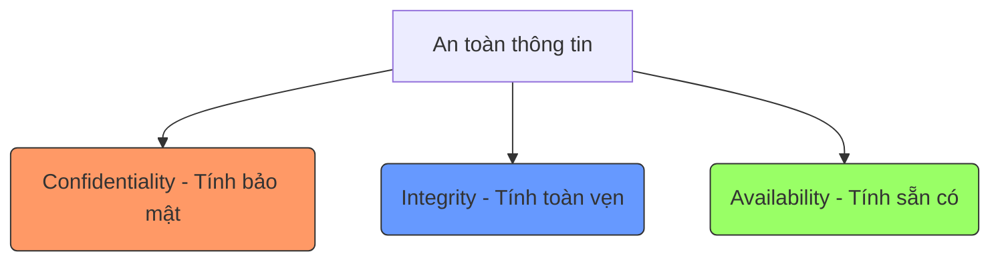

# CHƯƠNG 1: GIỚI THIỆU VỀ QLRR - PHẠM VI & THUẬT NGỮ

### 1. Định nghĩa về Rủi ro (Risk)

Rủi ro được hiểu và định nghĩa theo nhiều góc độ khác nhau dựa trên các tiêu chuẩn quốc tế:

!!! info "Định nghĩa theo ISO 31000:2018"
    Rủi ro là **tác động của sự bất trắc** (hay sự không chắc chắn) lên mục tiêu.

!!! note "Công thức tính toán rủi ro"
    Rủi ro thường được xem là sự kết hợp của 3 yếu tố:
    **Risk = f(e, p, s)**
    1.  **e (Potential Event):** Sự kiện tiềm ẩn.
    2.  **p (Probability/Likelihood):** Khả năng/Xác suất xảy ra.
    3.  **s (Severity/Impact):** Mức độ nghiêm trọng hoặc hệ quả.

!!! abstract "Rủi ro An toàn thông tin (ATTT)"
    Liên quan đến khả năng các **mối đe dọa** khai thác **điểm yếu** (lỗ hổng bảo mật) của tài sản thông tin, gây thiệt hại về vật chất, danh tiếng, uy tín cho doanh nghiệp.

### 2. Quản lý rủi ro (Risk Management)

Quản lý rủi ro là các hoạt động phối hợp để chỉ đạo và kiểm soát một tổ chức liên quan đến rủi ro.

#### Quy trình tiếp cận quản lý rủi ro
Quy trình này bao gồm các bước áp dụng hệ thống các chính sách, thủ tục và thực hành vào các hoạt động:
*   Truyền đạt và tham vấn.
*   Thiết lập bối cảnh.
*   Xác định, phân tích, đánh giá rủi ro.
*   Xử lý, giám sát và rà soát rủi ro.

### 3. Các thành phần chính của An toàn thông tin (CIA Triad)

An toàn thông tin là việc bảo tồn ba trụ cột chính:

*   **Tính bảo mật (C):** Thông tin không được tiết lộ cho cá nhân/tổ chức trái phép. (VD: Encryption, 2FA).
*   **Tính toàn vẹn (I):** Thông tin chính xác, đầy đủ và không bị chỉnh sửa trái phép mà không bị phát hiện. (VD: Checksum, Version control).
*   **Tính sẵn có (A):** Thông tin có thể truy cập và sử dụng được ngay khi có yêu cầu bởi người được ủy quyền. (VD: Redundancy, RAID, Backup).

### 4. Tiêu chí và Ma trận rủi ro

#### Định lượng rủi ro
Giá trị rủi ro được tính theo tích số: **R = Occ x Sev**

*   **Occ (Occurrence):** Khả năng xảy ra (thang đo 1-5 hoặc 1-10).
*   **Sev (Severity):** Mức độ nghiêm trọng (thang đo 1-5 hoặc 1-10).

#### Ma trận rủi ro (Risk Matrix)
Dùng để phân loại rủi ro dựa trên màu sắc:

*   🔴 **Đỏ (Rất cao):** Không thể chấp nhận, bắt buộc phải giảm thiểu.
*   🟠 **Cam (Cao):** Không thể chấp nhận, nên có biện pháp giảm thiểu.
*   🟡 **Vàng (Trung bình):** Có thể chấp nhận một phần, có thể triển khai biện pháp giảm thiểu.
*   🟢 **Xanh (Thấp):** Có thể chấp nhận, không cần biện pháp giảm thiểu ngay.

### 5. Các thuật ngữ quan trọng khác

??? abstract "Thuật ngữ nâng cao"
    *   **Khẩu vị rủi ro (Risk Appetite):** Lượng và loại rủi ro mà tổ chức **sẵn sàng chấp nhận** để đạt mục tiêu.
    *   **Khả năng chịu đựng rủi ro (Risk Tolerance):** Mức độ sai lệch thực tế cho phép so với khẩu vị rủi ro.
    *   **Rủi ro còn lại (Residual Risk):** Rủi ro còn tồn tại sau khi đã áp dụng các biện pháp kiểm soát.
    *   **Cửa sổ rủi ro (Risk Window):** Khoảng thời gian cụ thể mà một rủi ro có khả năng xảy ra cao nhất hoặc hệ thống dễ bị tấn công nhất.
    *   **Mức độ phơi nhiễm (Risk Exposure):** $Loss \times Probability$.

### 6. Cách đọc tài liệu ISO

Khi đọc các tiêu chuẩn ISO, cần lưu ý các động từ mang tính pháp lý:

*   **Shall:** Yêu cầu bắt buộc (Requirement).
*   **Should:** Khuyến nghị (Recommendation).
*   **May:** Sự cho phép (Permission).
*   **Can:** Khả năng/Năng lực (Possibility/Capability).

### 7. Các tình huống minh họa (Case Studies)

!!! example "Sự cố CrowdStrike (19/07/2024)"
    *   **Nguồn rủi ro:** Bản vá lỗi Falcon của CrowdStrike có lỗi.
    *   **Sự kiện:** Máy tính chạy Windows gặp lỗi "màn hình xanh chết chóc" (BSOD).
    *   **Hệ quả:** 8.5 triệu máy tính ngừng hoạt động, gây gián đoạn toàn cầu.
    *   **Bài học:** Thiếu quy trình kiểm thử (System Acceptance Testing) và hệ thống dự phòng (Failover).

!!! warning "Câu chuyện Cửa sắt & Thang máy"
    Minh họa về rủi ro tiềm ẩn khi lắp thêm cửa sắt khóa ngoài thang máy. 
    
    *   **Sự kiện:** Khách bấm nhầm tầng -> Bước ra -> Cửa thang máy đóng -> Bị kẹt giữa cửa thang và cửa sắt.
    *   **Hệ quả cuối cùng:** Nếu không có ai cứu, khách có thể chết vì đói/khát sau 3-4 ngày.

---

# BỘ 50 CÂU HỎI TRẮC NGHIỆM ÔN TẬP

**Câu 1.** Theo tiêu chuẩn ISO 31000:2018, rủi ro (Risk) được định nghĩa là gì?

- A. Là những thiệt hại về tài chính mà doanh nghiệp phải gánh chịu  
- B. Là tác động của sự bất trắc (hay sự không chắc chắn) lên mục tiêu  
- C. Là tổng hợp các lỗ hổng bảo mật chưa được khắc phục trong hệ thống  
- D. Là xác suất xảy ra một cuộc tấn công mạng vào doanh nghiệp  

??? success "Đáp án: B"
    Định nghĩa 1 trong tài liệu trích dẫn trực tiếp từ **ISO 31000:2018**: Rủi ro là tác động của sự bất trắc lên mục tiêu.

**Câu 2.** Trong công thức $Risk = f(e, p, s)$, biến số **'p'** đại diện cho yếu tố nào?

- A. Sự kiện tiềm ẩn (Potential event)  
- B. Mức độ nghiêm trọng (Severity)  
- C. Xác suất/Khả năng xảy ra (Probability/Likelihood)  
- D. Tác động tài chính (Profit/Loss)  

??? success "Đáp án: C"
    Trong mô hình rủi ro thông thường, **'p' (probability)** chính là xác suất hoặc khả năng xảy ra của sự kiện.

**Câu 3.** Rủi ro An toàn thông tin (ATTT) được mô tả là sự kết hợp giữa các yếu tố nào sau đây?

- A. Mối đe dọa, Điểm yếu và Hệ quả (thiệt hại)  
- B. Hacker, Virus và Người dùng  
- C. Phần cứng, Phần mềm và Mạng máy tính  
- D. Chi phí, Thời gian và Nhân lực  

??? success "Đáp án: A"
    Rủi ro ATTT liên quan đến khả năng các **mối đe dọa** khai thác **điểm yếu** của tài sản thông tin và gây ra **hệ quả/thiệt hại**.

**Câu 4.** "Các hoạt động phối hợp để chỉ đạo và kiểm soát một tổ chức liên quan đến rủi ro" là định nghĩa của:

- A. Đánh giá rủi ro (Risk Assessment)  
- B. Quản lý rủi ro (Risk Management)  
- C. Kiểm soát rủi ro (Risk Control)  
- D. Xử lý rủi ro (Risk Treatment)  

??? success "Đáp án: B"
    Đây là định nghĩa chính xác về **Quản lý rủi ro** theo tiêu chuẩn ISO 27000 và ISO 31000:2018.

**Câu 5.** "CIA triad" là bộ ba trụ cột của ATTT, bao gồm các tính chất nào?

- A. Confidentiality, Integrity, Accountability  
- B. Confidentiality, Integrity, Availability  
- C. Control, Identification, Authorization  
- D. Cryptography, Intelligence, Access  

??? success "Đáp án: B"
    Bộ ba **CIA** kinh điển bao gồm: **Tính bảo mật** (Confidentiality), **Tính toàn vẹn** (Integrity) và **Tính sẵn có** (Availability).

**Câu 6.** Một cuộc tấn công làm tê liệt website khiến khách hàng không thể truy cập được là vi phạm tính chất nào?

- A. Tính bảo mật (Confidentiality)  
- B. Tính toàn vẹn (Integrity)  
- C. Tính sẵn có (Availability)  
- D. Tính xác thực (Authentication)  

??? success "Đáp án: C"
    **Tính sẵn có** đảm bảo thông tin có thể truy cập và sử dụng được theo yêu cầu. Khi website bị tê liệt, tính chất này bị xâm phạm.

**Câu 7.** Việc hacker bí mật sửa đổi số dư tài khoản ngân hàng của người dùng là vi phạm tính chất nào?

- A. Tính sẵn có (Availability)  
- B. Tính bảo mật (Confidentiality)  
- C. Tính toàn vẹn (Integrity)  
- D. Tính không thể phủ nhận (Non-repudiation)  

??? success "Đáp án: C"
    **Tính toàn vẹn** là đặc tính của tính chính xác và đầy đủ. Việc sửa đổi dữ liệu trái phép làm mất đi sự chính xác này.

**Câu 8.** Mã hóa dữ liệu (Encryption) là biện pháp điển hình để bảo vệ tính chất nào?

- A. Tính sẵn có (Availability)  
- B. Tính bảo mật (Confidentiality)  
- C. Tính toàn vẹn (Integrity)  
- D. Tính hiệu quả (Efficiency)  

??? success "Đáp án: B"
    **Tính bảo mật** đảm bảo thông tin không bị tiết lộ cho các cá nhân/tổ chức trái phép. Mã hóa giúp dữ liệu không thể đọc được nếu không có quyền.

**Câu 9.** Giá trị rủi ro được định lượng theo công thức $R = f(Occ, Sev)$, trong đó **'Sev'** là gì?

- A. Khả năng xảy ra (Occurrence)  
- B. Tần suất xuất hiện (Frequency)  
- C. Mức độ nghiêm trọng của thiệt hại (Severity)  
- D. Số lượng tài sản bị ảnh hưởng (Quantity)  

??? success "Đáp án: C"
    **Sev (Severity)** là mức độ nghiêm trọng của tác động hoặc hậu quả khi rủi ro xảy ra.

**Câu 10.** "Điều khoản tham chiếu mà theo đó ý nghĩa của rủi ro được đánh giá" được gọi là:

- A. Ma trận rủi ro (Risk Matrix)  
- B. Tiêu chí rủi ro (Risk Criteria)  
- C. Hồ sơ rủi ro (Risk Profile)  
- D. Danh mục rủi ro (Risk Register)  

??? success "Đáp án: B"
    **Tiêu chí rủi ro** là các chuẩn mực dùng để đo lường và đánh giá tầm quan trọng của rủi ro.

**Câu 11.** Trong ma trận rủi ro, các ô được tô màu Đỏ thường đại diện cho mức rủi ro nào?

- A. Thấp - Có thể chấp nhận  
- B. Trung bình - Cần theo dõi  
- C. Cao/Rất cao - Không thể chấp nhận  
- D. Rủi ro còn lại - Đã xử lý  

??? success "Đáp án: C"
    Theo bảng tiêu chí, **màu Đỏ** đại diện cho mức rủi ro Rất cao, kèm theo hành động bắt buộc phải giảm thiểu (Must/Shall).

**Câu 12.** "Lượng và loại rủi ro mà một tổ chức sẵn sàng chấp nhận để đạt được mục tiêu chiến lược" là:

- A. Khả năng chịu đựng rủi ro (Risk Tolerance)  
- B. Khẩu vị rủi ro (Risk Appetite)  
- C. Thái độ rủi ro (Risk Attitude)  
- D. Phơi nhiễm rủi ro (Risk Exposure)  

??? success "Đáp án: B"
    **Khẩu vị rủi ro (Risk Appetite)** thể hiện mức độ rủi ro mà doanh nghiệp "muốn" hoặc "sẵn lòng" đón nhận.

**Câu 13.** Sự khác biệt cơ bản giữa **Risk Appetite** và **Risk Tolerance** là gì?

- A. Risk Appetite là thực tế, Risk Tolerance là lý thuyết  
- B. Risk Tolerance là mức sai lệch thực tế cho phép so với Risk Appetite tiêu chuẩn  
- C. Risk Appetite luôn nhỏ hơn Risk Tolerance  
- D. Không có sự khác biệt giữa hai khái niệm này  

??? success "Đáp án: B"
    **Risk Tolerance** là biên độ sai lệch hoặc độ giãn cho phép xung quanh khẩu vị rủi ro để xem xét việc chấp nhận một rủi ro cụ thể.

**Câu 14.** Rủi ro còn tồn tại sau khi đã áp dụng các biện pháp xử lý rủi ro được gọi là:

- A. Rủi ro cố hữu (Inherent Risk)  
- B. Rủi ro tiềm ẩn (Potential Risk)  
- C. Rủi ro còn lại (Residual Risk)  
- D. Rủi ro thứ cấp (Secondary Risk)  

??? success "Đáp án: C"
    **Residual Risk (Rủi ro còn lại)** là phần rủi ro vẫn còn hiện hữu sau khi các biện pháp kiểm soát đã được thực hiện.

**Câu 15.** "Risk Window" (Cửa sổ rủi ro) được định nghĩa là:

- A. Một phần mềm dùng để quét virus  
- B. Khoảng thời gian cụ thể mà một rủi ro cụ thể có khả năng xảy ra nhất  
- C. Thời gian nhân viên được phép truy cập vào hệ thống  
- D. Một lỗ hổng trên hệ điều hành Windows  

??? success "Đáp án: B"
    **Risk Window** là khung thời gian mà hệ thống dễ bị tấn công nhất hoặc rủi ro có xác suất xảy ra cao nhất (ví dụ: giờ hacker thường hoạt động).

**Câu 16.** Công thức tính **"Mức độ phơi nhiễm rủi ro" (Risk Exposure)** định lượng là:

- A. $Khả năng xảy ra + Tác động tài chính$  
- B. $Khả năng xảy ra \times Tác động tài chính$  
- C. $Tác động tài chính / Khả năng xảy ra$  
- D. $Mức độ nghiêm trọng \times 100\%$  

??? success "Đáp án: B"
    **Risk Exposure** được tính bằng cách nhân xác suất xảy ra (%) với giá trị tác động tài chính (số tiền).

**Câu 17.** Thái độ rủi ro **"Risk-averse"** mô tả một người hoặc tổ chức:

- A. Thích mạo hiểm để tìm kiếm lợi nhuận cao  
- B. Không quan tâm đến rủi ro  
- C. Không thích (né tránh) rủi ro, thường rất thận trọng  
- D. Trung lập, chỉ đối phó khi rủi ro xảy ra  

??? success "Đáp án: C"
    **Risk-averse** là thái độ ngại rủi ro, luôn ưu tiên sự an toàn và thận trọng trong mọi quyết định.

**Câu 18.** Động từ nào trong tài liệu ISO chỉ ra một **"Khuyến nghị" (Recommendation)**?

- A. Shall  
- B. May  
- C. Can  
- D. Should  

??? success "Đáp án: D"
    Trong chuẩn ISO: **Shall** (bắt buộc), **Should** (khuyến nghị), **May** (cho phép), **Can** (khả năng).

**Câu 19.** Trong sự cố CrowdStrike (19/07/2024), yếu tố nào được coi là "Sự kiện tiềm ẩn"?

- A. Hacker tấn công vào máy chủ CrowdStrike  
- B. Bản vá lỗi Falcon có lỗi và được thiết lập tự động cập nhật trên hệ thống khách hàng  
- C. Nhân viên ngân hàng nghỉ việc hàng loạt  
- D. Đường truyền cáp quang biển bị đứt  

??? success "Đáp án: B"
    Bản vá lỗi có sai sót kết hợp với cơ chế tự động cập nhật chính là sự kiện dẫn đến rủi ro sập hệ thống hàng loạt.

**Câu 20.** Theo định nghĩa về "Effect" (Tác động) trong ISO 31000, tác động rủi ro có thể là:

- A. Luôn luôn là tiêu cực  
- B. Luôn luôn là tích cực  
- C. Tích cực, tiêu cực hoặc cả hai (sai lệch so với dự kiến)  
- D. Chỉ là những thiệt hại về tài sản  

??? success "Đáp án: C"
    Tác động là sự sai lệch so với mong đợi, có thể mang lại hệ quả xấu (rủi ro) hoặc cơ hội tốt (tích cực).

**Câu 21.** "Khả năng một thực thể có thể truy cập và sử dụng thông tin theo yêu cầu" là định nghĩa của:

- A. Tính sẵn có (Availability)  
- B. Tính bảo mật (Confidentiality)  
- C. Tính toàn vẹn (Integrity)  
- D. Tính xác thực (Authenticity)  

??? success "Đáp án: A"
    Đây là định nghĩa chuẩn của **Availability** theo ISO 27000:2018.

**Câu 22.** Thuật ngữ nào sau đây liên quan chặt chẽ nhất đến việc bảo vệ **Tính toàn vẹn (Integrity)**?

- A. Encryption (Mã hóa)  
- B. Checksums (Mã kiểm tra lỗi)  
- C. Redundancy (Dư thừa dữ liệu)  
- D. Failover (Chuyển vùng dự phòng)  

??? success "Đáp án: B"
    **Checksums** giúp phát hiện xem dữ liệu có bị thay đổi trái phép hay không, từ đó đảm bảo tính toàn vẹn.

**Câu 23.** "Mức độ phơi nhiễm là mức độ dễ bị tổn thương, và xếp hạng là thước đo mức độ tổn thương đó". Câu này mô tả mối quan hệ giữa:

- A. Risk Appetite và Risk Tolerance  
- B. Risk Exposure và Risk Rating  
- C. Risk Source và Risk Event  
- D. Inherent Risk và Residual Risk  

??? success "Đáp án: B"
    Tài liệu nêu rõ **Risk Exposure** xét về lượng (số tiền), còn **Risk Rating** là điểm số/thứ hạng (thước đo) mức độ phơi nhiễm đó.

**Câu 24.** "Risk-neutral" là thái độ rủi ro kiểu:

- A. Chấp nhận rủi ro như một thách thức  
- B. Đối phó với rủi ro một cách khách quan  
- C. Không chú ý đến rủi ro cho đến khi nó trở thành vấn đề  
- D. Luôn lo sợ rủi ro  

??? success "Đáp án: B"
    Người có thái độ **trung lập (Neutral)** sẽ đánh giá và xử lý rủi ro dựa trên dữ liệu khách quan thay vì cảm tính.

**Câu 25.** Trong quản lý rủi ro, "Stakeholder" (Bên liên quan) có thể là:

- A. Chỉ là khách hàng của doanh nghiệp  
- B. Chỉ là ban giám đốc và cổ đông  
- C. Người hoặc tổ chức có thể ảnh hưởng hoặc bị ảnh hưởng bởi một quyết định/hoạt động  
- D. Chỉ là đội ngũ IT của công ty  

??? success "Đáp án: C"
    Khái niệm **Stakeholder** rất rộng, bao gồm bất kỳ ai có liên quan hoặc chịu tác động từ các hoạt động quản lý rủi ro.

**Câu 26.** "Nguồn rủi ro" (Risk Source) được hiểu là:

- A. Hậu quả cuối cùng của rủi ro  
- B. Các biện pháp kiểm soát rủi ro  
- C. Yếu tố hoặc thực thể mà tự thân nó hoặc trong sự kết hợp có thể làm phát sinh rủi ro  
- D. Bản báo cáo thống kê rủi ro hàng năm  

??? success "Đáp án: C"
    **Nguồn rủi ro** là nguyên nhân gốc rễ hoặc các yếu tố dẫn đến sự xuất hiện của rủi ro.

**Câu 27.** Câu nào sau đây nói ĐÚNG về rủi ro theo ISO 27001:2013?

- A. ISO 27001 xét rủi ro cả mặt tích cực lẫn tiêu cực  
- B. ISO 27001 chỉ xét rủi ro ATTT hoàn toàn theo khía cạnh tiêu cực  
- C. ISO 27001 không quan tâm đến rủi ro  
- D. ISO 27001 coi rủi ro là một cơ hội kinh doanh  

??? success "Đáp án: B"
    Mặc dù lý thuyết rủi ro nói chung có 2 mặt, nhưng bộ tiêu chuẩn **ISO 27001:2013** về ATTT tập trung hoàn toàn vào các khía cạnh tiêu cực.

**Câu 28.** Hệ quả (Consequence) của một sự kiện rủi ro là:

- A. Nguyên nhân gây ra sự kiện đó  
- B. Kết quả của một sự kiện ảnh hưởng đến mục tiêu  
- C. Khả năng xảy ra của sự kiện  
- D. Chi phí để ngăn chặn sự kiện  

??? success "Đáp án: B"
    **Hệ quả** chính là những tác động/kết quả thực tế lên mục tiêu doanh nghiệp sau khi sự kiện xảy ra.

**Câu 29.** Một người có thái độ "Risk-tolerant" thường:

- A. Rất nhạy cảm với mọi rủi ro nhỏ  
- B. Không chú ý đến rủi ro cho đến khi nó trở thành vấn đề thực sự  
- C. Luôn tìm cách khai thác rủi ro để trục lợi  
- D. Chủ động lập kế hoạch ứng phó từ sớm  

??? success "Đáp án: B"
    Thái độ **Tolerant (chịu đựng)** mang tính thụ động, thường để mặc rủi ro cho đến khi hậu quả bắt đầu xuất hiện.

**Câu 30.** "Hành động được khuyến nghị" cho mức rủi ro màu Cam (Cao) là:

- A. Không cần có biện pháp giảm rủi ro  
- B. Nên có biện pháp giảm rủi ro (Should be implemented)  
- C. Bắt buộc phải có biện pháp giảm rủi ro (Must be implemented)  
- D. Biện pháp giảm rủi ro có thể có hoặc không tùy ý  

??? success "Đáp án: B"
    Theo bảng phân loại: Đỏ là **Must/Shall**, Cam là **Should**, Vàng là **Can**, Xanh là **Not required**.

**Câu 31.** Trong câu chuyện "Cửa sắt thang máy", hành động khách mang chìa khóa đi và không để lại ở chung cư thuộc về yếu tố nào?

- A. Tăng khả năng xảy ra rủi ro (Likelihood)  
- B. Tăng mức độ nghiêm trọng của hậu quả (Severity)  
- C. Là một biện pháp bảo mật tốt  
- D. Giúp giảm thiểu rủi ro cho khách  

??? success "Đáp án: B"
    Việc không có chìa khóa tại chỗ làm cho công tác cứu hộ gặp khó khăn, kéo dài thời gian khách bị kẹt, dẫn đến hậu quả nghiêm trọng hơn (đói, khát, chết).

**Câu 32.** Tài liệu ISO 27000:2018 định nghĩa ATTT là việc bảo tồn 3 yếu tố CIA, điều này có nghĩa là:

- A. Chỉ cần bảo vệ 1 trong 3 yếu tố là đủ  
- B. Phải đảm bảo đồng thời cả 3 yếu tố để thông tin được an toàn  
- C. Tính bảo mật là quan trọng nhất, hai yếu tố còn lại là phụ  
- D. Doanh nghiệp tự chọn yếu tố nào phù hợp để bảo vệ  

??? success "Đáp án: B"
    ATTT là việc bảo tồn đồng thời cả 3 trụ cột CIA. Thiếu bất kỳ yếu tố nào cũng dẫn đến mất an toàn thông tin.

**Câu 33.** Một chính sách (Policy) theo ISO 27000:2018 là:

- A. Một chuỗi các hoạt động kỹ thuật chi tiết  
- B. Tuyên bố về mục tiêu, quy tắc chi phối hoạt động của mọi người trong một bối cảnh nhất định  
- C. Phần mềm thực thi các quy định bảo mật  
- D. Biên bản xử phạt vi phạm hành chính  

??? success "Đáp án: B"
    **Chính sách** mang tính định hướng, thể hiện ý định và chỉ đạo của cấp quản lý cao nhất.

**Câu 34.** Sự khác biệt giữa **Process** (Quy trình) và **Procedure** (Thủ tục) là gì?

- A. Process là lý thuyết, Procedure là thực hành  
- B. Process đòi hỏi đầu vào (inputs) để mang lại kết quả, Procedure là cách thức xác định để thực hiện một hoạt động  
- C. Procedure quan trọng hơn Process  
- D. Hai khái niệm này là một, không có sự khác biệt  

??? success "Đáp án: B"
    Tài liệu nhấn mạnh: **Process** cần có input/output rõ ràng, còn **Procedure** chỉ tập trung vào trình tự thực hiện hành động.

**Câu 35.** Trong an ninh mạng, một "Risk Window" ngắn (nhỏ) thể hiện:

- A. Hệ thống bảo mật yếu kém  
- B. Một chương trình bảo mật mạnh mẽ và chủ động  
- C. Hacker không quan tâm đến hệ thống  
- D. Hệ thống không có lỗ hổng nào  

??? success "Đáp án: B"
    Chủ động quản lý lỗ hổng để rút ngắn thời gian hệ thống bị phơi nhiễm (Risk Window) là mục tiêu của một hệ thống bảo mật tốt.

**Câu 36.** Động từ **"Shall"** trong tài liệu ISO tương ứng với từ tiếng Việt nào?

- A. Nên  
- B. Phải (Bắt buộc)  
- C. Có thể  
- D. Được phép  

??? success "Đáp án: B"
    **Shall** dùng để chỉ ra một Requirement - điều gì đó bạn bắt buộc phải làm.

**Câu 37.** Kết quả của "Risk Evaluation" (Đánh giá rủi ro) giúp tổ chức quyết định điều gì?

- A. Cách thức lập trình phần mềm  
- B. Quyết định về việc xử lý rủi ro (Risk Treatment)  
- C. Mua sắm thiết bị phần cứng nào  
- D. Đuổi việc nhân viên gây ra rủi ro  

??? success "Đáp án: B"
    **Risk Evaluation** là bước so sánh kết quả phân tích với tiêu chí để xem rủi ro đó có chấp nhận được không, từ đó đưa ra hướng xử lý.

**Câu 40.** "Mức độ phơi nhiễm rủi ro thể hiện khả năng tổn thất được định lượng từ các hoạt động". Từ quan trọng nhất ở đây là:

- A. Chất lượng  
- B. Định lượng (Quantitative)  
- C. Cảm tính  
- D. Dự đoán  

??? success "Đáp án: B"
    **Risk Exposure** tập trung vào việc quy đổi rủi ro ra các con số cụ thể (thường là tiền tệ).

**Câu 41.** Động từ **"Can"** trong tài liệu ISO chỉ ra điều gì?

- A. Một khuyến nghị chuyên gia  
- B. Một sự cho phép từ quản lý  
- C. Một khả năng hoặc năng lực (Possibility/Capability)  
- D. Một quy định pháp luật  

??? success "Đáp án: C"
    **Can** dùng để mô tả một khả năng có thể xảy ra hoặc năng lực thực hiện của một thực thể.

**Câu 42.** Việc sử dụng RAID hoặc hệ thống dự phòng (Failover) chủ yếu phục vụ cho mục tiêu nào?

- A. Confidentiality  
- B. Integrity  
- C. Availability  
- D. Non-repudiation  

??? success "Đáp án: C"
    Các công nghệ này giúp hệ thống duy trì hoạt động liên tục ngay cả khi có sự cố phần cứng, đảm bảo **Tính sẵn có**.

**Câu 43.** "Performance" theo ISO 27000:2018 được hiểu là:

- A. Tốc độ của CPU máy chủ  
- B. Kết quả (thành tích) có thể đo lường được  
- C. Thái độ làm việc của nhân viên IT  
- D. Khả năng chịu tải của đường truyền mạng  

??? success "Đáp án: B"
    **Performance** là những kết quả định lượng hoặc định tính thu được từ hoạt động quản lý.

**Câu 44.** Tại sao sinh viên được yêu cầu không nên đọc sai tên 6 tài liệu tham khảo ISO?

- A. Để tránh bị trừ điểm chuyên cần  
- B. Vì việc sử dụng đúng từ khóa (Key word) là cực kỳ quan trọng trong chuyên môn  
- C. Vì các tài liệu đó rất đắt tiền  
- D. Vì đó là quy định của nhà trường  

??? success "Đáp án: B"
    Tài liệu nhấn mạnh việc sử dụng đúng **Từ khóa** giúp xác định và truy xuất thông tin chính xác, chuyên nghiệp.

**Câu 45.** "Khẩu vị rủi ro và Biên độ rủi ro không được phép vượt quá Giới hạn rủi ro". Đây là nguyên tắc trong việc xác định:

- A. Risk Appetite  
- B. Risk Tolerance  
- C. Risk Assessment  
- D. Risk Identification  

??? success "Đáp án: B"
    Nguyên tắc này dùng để đảm bảo các sai lệch cho phép (**Tolerance**) vẫn nằm trong tầm kiểm soát an toàn của tổ chức.

**Câu 46.** Một rủi ro có xác suất xảy ra là "Possible" (thỉnh thoảng) và tác động là "Major" (lớn) sẽ được xếp hạng là bao nhiêu điểm (theo ma trận 5x5)?

- A. 8 điểm  
- B. 12 điểm  
- C. 15 điểm  
- D. 20 điểm  

??? success "Đáp án: B"
    Theo ma trận tích số: **Possible (3)** x **Major (4)** = **12**.

**Câu 47.** Động từ **"May"** trong ISO dùng để chỉ:

- A. Một dự báo thời tiết  
- B. Sự cho phép (Permission)  
- C. Sự bắt buộc tuyệt đối  
- D. Sự khuyến khích thực hiện  

??? success "Đáp án: B"
    **May** cho biết một hành động được phép thực hiện nhưng không bắt buộc.

**Câu 48.** Hệ quả "Thảm khốc" (Catastrophic) trong ví dụ định lượng về tiền tệ là mức nào?

- A. < 100 triệu đồng  
- B. 500 triệu - 1 tỷ đồng  
- C. 1 tỷ - 5 tỷ đồng  
- D. ≥ 5 tỷ đồng  

??? success "Đáp án: D"
    Theo bảng ví dụ trang 10: Mức 5 (Catastrophic) tương ứng với giá trị thiệt hại **lớn hơn hoặc bằng 5 tỷ đồng**.

**Câu 49.** Việc triển khai các dự án CNTT gặp rủi ro về tiến độ và chi phí được phân loại vào nhóm rủi ro nào?

- A. Rủi ro môi trường  
- B. Rủi ro chiến lược  
- C. Rủi ro liên quan đến CNTT  
- D. Rủi ro tuân thủ  

??? success "Đáp án: C"
    Tài liệu phân loại rủi ro dự án CNTT (tiến độ, phạm vi, chất lượng) thuộc nhóm **Rủi ro liên quan đến CNTT**.

**Câu 50.** Câu nào sau đây mô tả ĐÚNG nhất về quy trình quản lý rủi ro?

- A. Là việc cài đặt các phần mềm bảo mật mạnh nhất  
- B. Là sự áp dụng hệ thống các chính sách, thủ tục vào hoạt động xác định, phân tích, đánh giá và xử lý rủi ro  
- C. Là việc thuê các chuyên gia bên ngoài về làm thay doanh nghiệp  
- D. Là việc liệt kê tất cả các lỗi của nhân viên trong năm  

??? success "Đáp án: B"
    Đây là mô tả đầy đủ về **Cách tiếp cận quy trình** trong quản lý rủi ro theo tài liệu bài giảng.

---
Hy vọng bộ câu hỏi này giúp bạn ôn tập tốt!
