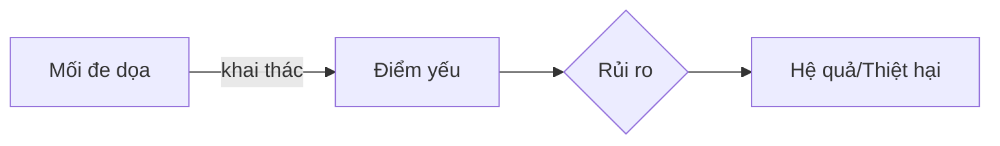

# Chương 2: Mối đe dọa, Điểm yếu và Kiểm soát rủi ro ATTT

## 1. Các khái niệm cốt lõi

### 1.1. Mối đe dọa (Threat)
Mối đe dọa là nguyên nhân tiềm ẩn của một sự cố không mong muốn, có thể dẫn đến tổn hại cho hệ thống hoặc doanh nghiệp.

!!! info "Đặc điểm của Mối đe dọa"
    - Có thể là một **hành động** (Action), một **sự kiện** (Event) hoặc một **tình huống** (Circumstance).
    - Phải là thứ **cụ thể**, có bằng chứng hiện diện.
    - Khi phát biểu không dùng từ "có thể".

### 1.2. Điểm yếu (Vulnerability/Weakness)
Là những đặc điểm chưa tốt, thiếu sót hoặc lỗ hổng của tài sản/quyền kiểm soát mà mối đe dọa có thể khai thác.

!!! warning "Nhận biết điểm yếu"
    Thường đi kèm với các cụm từ: *không có, thiếu, kém, chưa đạt yêu cầu, lỗi hổng, lạc hậu, vi phạm...*

### 1.3. Rủi ro (Risk)
Rủi ro là tác động của sự không chắc chắn lên mục tiêu.

**Công thức tính hạng mức rủi ro:**
$Risk Rating = Likelihood (Khả năng xảy ra) \times Severity (Mức độ nghiêm trọng)$

---

## 2. Tiêu chí đánh giá rủi ro (Risk Criteria)

### 2.1. Khả năng xảy ra (Likelihood)
Được chia thành các cấp độ dựa trên tần suất hoặc xác suất:
- **Rare:** Hiếm khi (~0%).
- **Unlikely:** Khó xảy ra (~10%).
- **Possible:** Có thể xảy ra (~20%).
- **Likely:** Rất có thể (~30%).
- **Almost Certain:** Chắc chắn xảy ra (~100%).

### 2.2. Tác động (Impact/Severity)
Được định lượng bằng tiền hoặc mức độ ảnh hưởng:
- **Negligible:** Không đáng kể (< 100 triệu VNĐ).
- **Minor:** Nhỏ (100 - 500 triệu VNĐ).
- **Moderate:** Trung bình (500 triệu - 1 tỷ VNĐ).
- **Major:** Lớn (1 tỷ - 5 tỷ VNĐ).
- **Catastrophic:** Thảm khốc (> 5 tỷ VNĐ).

---

## 3. Kiểm toán ATTT theo ISO 27001:2013

### 3.1. Cấu trúc Phụ lục A (Annex A)
Phụ lục A bao gồm 14 nhóm (Domains) yêu cầu bảo mật. Một số nhóm quan trọng:

| Domain | Tên nhóm | Nội dung chính |
| :--- | :--- | :--- |
| **A.5** | Chính sách ATTT | Quy định về phê duyệt và công bố chính sách. |
| **A.6** | Tổ chức ATTT | Phân công nhiệm vụ, quản lý thiết bị di động. |
| **A.7** | An toàn nhân sự | Đào tạo, nâng cao nhận thức nhân viên. |
| **A.8** | Quản lý tài sản | Phân loại thông tin, bàn giao tài sản. |
| **A.9** | Quản lý truy cập | Chính sách mật khẩu, quyền truy cập. |
| **A.11** | An toàn vật lý | Kiểm soát ra vào phòng server, cable mạng. |
| **A.12** | An toàn vận hành | Backup dữ liệu, chống malware, logging. |
| **A.15** | Quan hệ nhà cung cấp | Thỏa thuận bảo mật (NDA). |

### 3.2. Công thức phát biểu một phát hiện bảo mật
Khi làm báo cáo kiểm toán, nên áp dụng **Công thức 1** (Tỷ lệ 1:1) để đảm bảo tính rõ ràng và thù lao kiểm toán:

!!! abstract "Công thức chuẩn"
    **1 Điểm yếu + 1 Mối đe dọa + 1 Rủi ro + 1 Khả năng xảy ra + x Hệ quả**

---

## 4. Các lỗi thường gặp khi phát biểu rủi ro
??? danger "Danh sách các lỗi cần tránh"
    1. Không áp dụng công thức chuẩn.
    2. Phát biểu hệ quả mà không có con số cụ thể.
    3. Nhận diện sai từ khóa trong "Control".
    4. Trích dẫn sai nội dung ISO 27001.
    5. Phát biểu điểm yếu trùng ý với rủi ro.
    6. Dịch sai thuật ngữ tiếng Anh chuyên ngành.

---

# BỘ 50 CÂU HỎI TRẮC NGHIỆM CHƯƠNG 2

**Câu 1. Mối đe dọa (Threat) theo ISO 27000:2018 được định nghĩa là gì?**

- A. Là một lỗ hổng trong phần mềm.
- B. Là nguyên nhân tiềm ẩn của một sự cố không mong muốn gây tổn hại cho hệ thống.
- C. Là xác suất một sự kiện xấu xảy ra.
- D. Là kết quả của việc không có chính sách bảo mật.
??? success "Đáp án: B"
    Giải thích: Theo slide 8, Threat là "potential cause of an unwanted incident".

**Câu 2. Điểm yếu (Vulnerability) được định nghĩa là gì?**

- A. Là một hành động tấn công của hacker.
- B. Là sự kiện thiên tai gây hỏng hóc thiết bị.
- C. Là điểm yếu của một tài sản hoặc quyền kiểm soát có thể bị khai thác bởi mối đe dọa.
- D. Là thiệt hại về tài chính sau sự cố.
??? success "Đáp án: C"
    Giải thích: Theo slide 21, Vulnerability là "weakness of an asset or control".

**Câu 3. Trong ngữ cảnh ATTT, thuật ngữ "Bug" hoặc "Flaw" được hiểu là gì?**

- A. Mối đe dọa.
- B. Rủi ro.
- C. Điểm yếu.
- D. Hệ quả.
??? success "Đáp án: C"
    Giải thích: Slide 21 nêu rõ "Security hole / Flaw / Error / Bug" đều có hàm ý là Weakness/Vulnerability.

**Câu 4. Rủi ro (Risk) theo cách hiểu thông thường là sự kết hợp của mấy yếu tố?**

- A. 2 yếu tố.
- B. 3 yếu tố.
- C. 4 yếu tố.
- D. 5 yếu tố.
??? success "Đáp án: B"
    Giải thích: Gồm sự kiện tiềm ẩn, xác suất xảy ra và mức độ nghiêm trọng (Slide 3).

**Câu 5. Công thức định lượng xếp hạng rủi ro (Risk Rating) là gì?**

- A. Likelihood + Severity.
- B. Likelihood - Severity.
- C. Likelihood x Severity.
- D. Likelihood / Severity.
??? success "Đáp án: C"
    Giải thích: Xếp hạng rủi ro là tích số của Khả năng xảy ra và Mức độ nghiêm trọng (Slide 5).

**Câu 6. Phát biểu nào sau đây là SAI về cách phát biểu một Mối đe dọa?**

- A. Phải là một mối đe dọa chắc chắn có.
- B. Thường là một cụm danh từ.
- C. Phải có cụm từ "có thể" để thể hiện sự bất trắc.
- D. Không viết thành một câu có chủ ngữ và vị ngữ.
??? success "Đáp án: C"
    Giải thích: Phát biểu mối đe dọa không được có cụm từ "có thể" vì gây nghi vấn (Slide 9).

**Câu 7. Điểm yếu của con người trong ATTT thường bao gồm yếu tố nào?**

- A. Kiến trúc hệ thống yếu kém.
- B. Thiếu sót về kiến thức, kỹ năng, kinh nghiệm.
- C. Cấu tạo vật liệu không bền.
- D. Năng lực xử lý của CPU thấp.
??? success "Đáp án: B"
    Giải thích: Theo slide 22, điểm yếu con người là thiếu kiến thức, chuyên môn, hành vi...

**Câu 8. Cụm từ nào thường xuất hiện trong phát biểu về Điểm yếu?**

- A. Có khả năng xảy ra.
- B. Không có hoặc thiếu.
- C. Sẽ dẫn đến thiệt hại.
- D. Dự kiến xảy ra vào năm sau.
??? success "Đáp án: B"
    Giải thích: Slide 23 liệt kê các từ như "không có", "thiếu", "yếu", "kém"...

**Câu 9. Theo Risk Criteria, mức độ tác động "Thảm khốc" (Catastrophic) tương ứng với giá trị thiệt hại nào?**

- A. 500 triệu - 1 tỷ VNĐ.
- B. 1 tỷ - 5 tỷ VNĐ.
- C. > 5 tỷ VNĐ.
- D. < 100 triệu VNĐ.
??? success "Đáp án: C"
    Giải thích: Dựa trên bảng xếp hạng tác động ở slide 14.

**Câu 10. Khi phát biểu rủi ro, cụm từ nào thường được sử dụng?**

- A. Chắc chắn hiện diện.
- B. Đã xảy ra vào ngày hôm qua.
- C. Có thể xảy ra.
- D. Là một danh từ cụ thể.
??? success "Đáp án: C"
    Giải thích: Rủi ro là dự đoán, tiềm ẩn nên thường dùng "có thể" (Slide 19).

**Câu 11. "Nhân viên dùng thiết bị di động cá nhân truy cập mạng doanh nghiệp" là ví dụ của:**

- A. Điểm yếu.
- B. Mối đe dọa.
- C. Hệ quả.
- D. Kiểm soát.
??? success "Đáp án: B"
    Giải thích: Đây là một hành động cụ thể có thể dẫn đến sự cố (Slide 59).

**Câu 12. Công thức nào nên được ưu tiên sử dụng khi công bố một phát hiện bảo mật trong kiểm toán?**

- A. 1 Điểm yếu + n Mối đe dọa.
- B. 1 Điểm yếu + 1 Mối đe dọa + 1 Rủi ro + 1 Khả năng xảy ra + x Hệ quả.
- C. n Điểm yếu + 1 Rủi ro.
- D. Chỉ cần nêu Rủi ro.
??? success "Đáp án: B"
    Giải thích: Công thức 1:1 giúp dễ dàng thiết lập biện pháp kiểm soát tương ứng và có lợi về thù lao kiểm toán (Slide 18, 20).

**Câu 13. Lỗi "Phát biểu hệ quả không có con số bị ảnh hưởng" là lỗi thuộc về:**

- A. Điểm yếu.
- B. Rủi ro.
- C. Hệ quả/Tác động.
- D. Mối đe dọa.
??? success "Đáp án: C"
    Giải thích: Hệ quả phải được định lượng bằng tiền, số người hoặc thời gian (Slide 25).

**Câu 14. Phụ lục A của ISO 27001:2013 có bao nhiêu nhóm (domains) yêu cầu?**

- A. 10 nhóm.
- B. 12 nhóm.
- C. 14 nhóm.
- D. 18 nhóm.
??? success "Đáp án: C"
    Giải thích: Theo slide 46, Phụ lục A bao gồm 14 nhóm yêu cầu.

**Câu 15. Nhóm A.12 trong Phụ lục A ISO 27001 tập trung vào lĩnh vực nào?**

- A. An toàn nhân sự.
- B. Quản lý truy cập.
- C. An toàn vận hành.
- D. Sự tuân thủ.
??? success "Đáp án: C"
    Giải thích: Slide 81 nêu rõ A.12 là "Operations Security" (An toàn vận hành).

**Câu 16. Để rà soát và nâng cấp các biện pháp kiểm soát, doanh nghiệp nên đối chiếu ISO 27001 với tài liệu hướng dẫn nào?**

- A. ISO 9001.
- B. ISO 27002.
- C. ISO 31000.
- D. ISO 14001.
??? success "Đáp án: B"
    Giải thích: ISO 27002 cung cấp "Implementation Guidance" (Hướng dẫn triển khai) (Slide 48).

**Câu 17. Mô hình PDCA (Plan-Do-Check-Act) được áp dụng trong ISO 27001 nhằm mục đích gì?**

- A. Chỉ để đánh giá rủi ro.
- B. Cải tiến liên tục hệ thống quản lý ATTT (ISMS).
- C. Để sa thải nhân viên vi phạm.
- D. Để lập báo cáo tài chính.
??? success "Đáp án: B"
    Giải thích: PDCA là chu trình cải tiến liên tục (Slide 45).

**Câu 18. Một phát hiện bảo mật có "n Điểm yếu, m Mối đe dọa" sẽ dẫn đến vấn đề gì khi lập biện pháp kiểm soát (Control)?**

- A. Dễ dàng quản lý.
- B. Khó ánh xạ 1:1 để lập Control tương ứng.
- C. Giảm chi phí kiểm toán.
- D. Tăng độ chính xác.
??? success "Đáp án: B"
    Giải thích: Slide 20 nêu vấn đề 1 là không ánh xạ 1:1 nên khó lập Control.

**Câu 19. Thuật ngữ SIEM trong giám sát an ninh mạng là viết tắt của?**

- A. Security Information and Event Management.
- B. System Internal Error Management.
- C. Secure Information Exchange Model.
- D. Software Integrity Evaluation Method.
??? success "Đáp án: A"
    Giải thích: Xem slide 17.

**Câu 20. CVE (Common Vulnerabilities and Exposures) là gì?**

- A. Một loại mã độc mới.
- B. Một tiêu chuẩn của Bộ Tài chính Mỹ.
- C. Cơ sở dữ liệu công khai về các lỗ hổng bảo mật đã biết.
- D. Một kỹ thuật tấn công của hacker.
??? success "Đáp án: C"
    Giải thích: Slide 29 nêu định nghĩa về CVE.

**Câu 21. Theo lời khuyên trong bài học, rủi ro sẽ tăng theo yếu tố nào?**

- A. Số lượng máy tính trong doanh nghiệp.
- B. Số lượng người biết bí mật/điểm yếu của mình.
- C. Tốc độ đường truyền internet.
- D. Số lượng phần mềm có bản quyền.
??? success "Đáp án: B"
    Giải thích: Slide 34 nêu rủi ro tăng theo số lượng người biết bí mật/điểm yếu.

**Câu 22. Nhóm yêu cầu A.15 trong ISO 27001 liên quan đến đối tượng nào?**

- A. Nhân viên mới.
- B. Cơ quan thuế.
- C. Nhà cung cấp (Suppliers).
- D. Khách hàng cá nhân.
??? success "Đáp án: C"
    Giải thích: Slide 95 đề cập A.15 là "Supplier relationships".

**Câu 23. NDA (Non-Disclosure Agreement) là gì?**

- A. Hợp đồng mua bán thiết bị.
- B. Thỏa thuận bảo mật thông tin.
- C. Chứng chỉ an toàn mạng.
- D. Quy trình sao lưu dữ liệu.
??? success "Đáp án: B"
    Giải thích: Xem slide 95.

**Câu 24. Điểm yếu "Không áp dụng xác thực đa yếu tố (MFA) cho quản trị viên" thuộc nhóm yêu cầu nào?**

- A. A.7 An toàn nhân sự.
- B. A.9 Quản lý truy cập.
- C. A.13 An toàn truyền thông.
- D. A.18 Sự tuân thủ.
??? success "Đáp án: B"
    Giải thích: MFA là một phần của quản lý truy cập (Slide 25).

**Câu 25. "Mối đe dọa có cấu trúc" (Structured threat) thường do đối tượng nào thực hiện?**

- A. Những người nghiệp dư.
- B. Nhân viên vô ý làm sai.
- C. Tội phạm mạng có tổ chức, mục đích rõ ràng.
- D. Thiên tai, lũ lụt.
??? success "Đáp án: C"
    Giải thích: Xem slide 16.

**Câu 26. Sự cố (Incident) khác với Rủi ro (Risk) ở điểm nào?**

- A. Sự cố là rủi ro đã hiện hữu (thực sự xảy ra).
- B. Rủi ro là sự cố đã kết thúc.
- C. Không có sự khác biệt.
- D. Sự cố luôn nhẹ hơn rủi ro.
??? success "Đáp án: A"
    Giải thích: Slide 9: "Sự cố là những rủi ro đã hiện hữu".

**Câu 27. "Brute force attack" nhắm vào khai thác điểm yếu nào?**

- A. Phòng máy chủ không khóa cửa.
- B. Hệ thống không có backup.
- C. Mật khẩu yếu hoặc quy trình quản lý mật khẩu kém.
- D. Cable mạng bị hỏng.
??? success "Đáp án: C"
    Giải thích: Xem ví dụ về quản lý truy cập ở slide 67, 69.

**Câu 28. "Bề mặt tấn công bị mở rộng" là một ví dụ của:**

- A. Mối đe dọa.
- B. Rủi ro.
- C. Điểm yếu.
- D. Kiểm soát.
??? success "Đáp án: C"
    Giải thích: Slide 26 liệt kê đây là một điểm yếu.

**Câu 29. "Nhân viên gặp sự cố không biết bắt đầu làm gì" là rủi ro do thiếu sót ở nhóm yêu cầu nào?**

- A. A.10 Mật mã.
- B. A.16 Quản lý sự cố ATTT.
- C. A.8 Quản lý tài sản.
- D. A.5 Chính sách ATTT.
??? success "Đáp án: B"
    Giải thích: Liên quan đến quy trình ứng phó sự cố (Slide 99).

**Câu 30. Việc sử dụng giao thức Telnet thay vì SSH là một điểm yếu vì?**

- A. Telnet quá đắt tiền.
- B. Telnet truyền dữ liệu không mã hóa, dễ bị tấn công Man-in-the-middle.
- C. Telnet không chạy được trên Windows.
- D. SSH chậm hơn Telnet.
??? success "Đáp án: B"
    Giải thích: Slide 89, 91 nêu rủi ro khi dùng Telnet.

**Câu 31. Một sự cố ATTT (Information Security Incident) có thể bao gồm mấy sự kiện?**

- A. Luôn luôn chỉ 1 sự kiện.
- B. Một hoặc một loạt các sự kiện không mong muốn.
- C. Tối thiểu 10 sự kiện.
- D. Không bao gồm sự kiện nào.
??? success "Đáp án: B"
    Giải thích: Theo ISO 27000:2018 trích dẫn ở slide 10.

**Câu 32. Nhóm yêu cầu A.11 (An toàn vật lý và môi trường) bao gồm việc kiểm soát nào sau đây?**

- A. Cài đặt phần mềm diệt virus.
- B. Kiểm soát ra vào phòng máy chủ (biometric, PIN...).
- C. Mã hóa email.
- D. Đào tạo lập trình an toàn.
??? success "Đáp án: B"
    Giải thích: Xem slide 75.

**Câu 33. Rủi ro "Doanh nghiệp bị phạt tiền vì vi phạm bản quyền phần mềm" thuộc domain nào?**

- A. A.12 An toàn vận hành.
- B. A.18 Sự tuân thủ (Compliance).
- C. A.9 Quản lý truy cập.
- D. A.15 Quan hệ nhà cung cấp.
??? success "Đáp án: B"
    Giải thích: Vi phạm luật pháp và bản quyền thuộc về Compliance (Slide 105).

**Câu 34. "Hardware Security Module (HSM)" được nhắc đến trong domain nào?**

- A. A.10 Mật mã (Cryptography).
- B. A.14 Tiếp nhận, phát triển hệ thống.
- C. A.11 An toàn vật lý.
- D. A.6 Tổ chức ATTT.
??? success "Đáp án: A"
    Giải thích: HSM dùng để bảo vệ các khóa mã hóa và thông tin nhạy cảm (Slide 73, 74).

**Câu 35. "Mối đe dọa phi cấu trúc" thường có đặc điểm gì?**

- A. Do các tổ chức tình báo thực hiện.
- B. Có mục tiêu cụ thể và dài hạn.
- C. Thực hiện bởi những người nghiệp dư và không có mục tiêu cụ thể.
- D. Chỉ xảy ra thông qua đường vật lý.
??? success "Đáp án: C"
    Giải thích: Xem slide 16.

**Câu 36. Phương pháp STRIDE hoặc OCTAVE dùng để làm gì?**

- A. Để sao lưu dữ liệu.
- B. Là các khuôn khổ phân loại mối đe dọa (threat classification).
- C. Để quét virus.
- D. Để quản trị nhân sự.
??? success "Đáp án: B"
    Giải thích: Xem slide 18.

**Câu 37. Điểm yếu "Mật khẩu ngầm định của thiết bị khi xuất xưởng không thay đổi" gọi là gì?**

- A. Zero-day.
- B. Factory setting weakness.
- C. Social engineering.
- D. Phishing.
??? success "Đáp án: B"
    Giải thích: Xem slide 25.

**Câu 38. "Lỗ hổng zero-day" được hiểu là?**

- A. Lỗ hổng đã có bản vá từ lâu.
- B. Lỗ hổng mới chưa được nhà sản xuất biết đến hoặc chưa có bản vá.
- C. Lỗ hổng chỉ xuất hiện vào ngày chủ nhật.
- D. Một kỹ thuật backup dữ liệu.
??? success "Đáp án: B"
    Giải thích: Dựa trên ngữ cảnh báo cáo ở slide 36, 37.

**Câu 39. Tại sao không nên viết 2 vùng tin (field) có nội dung trùng nhau trong báo cáo rủi ro?**

- A. Để tiết kiệm giấy.
- B. Vì mỗi vùng tin có vai trò và ý nghĩa riêng, không thay thế cho nhau.
- C. Vì cơ sở dữ liệu sẽ bị lỗi.
- D. Vì khách hàng sẽ không hiểu.
??? success "Đáp án: B"
    Giải thích: Slide 8, 27 nhấn mạnh tính độc lập của các trường thông tin.

**Câu 40. "Mục tiêu bảo vệ tính bí mật, toàn vẹn, xác thực của thông tin thất bại" là ví dụ của:**

- A. Điểm yếu.
- B. Mối đe dọa.
- C. Hệ quả (Consequences).
- D. Khả năng xảy ra.
??? success "Đáp án: C"
    Giải thích: Đây là tác động xấu đến mục tiêu ATTT (Slide 74).

**Câu 41. Việc "Thiết lập chế độ cấu hình tự động cập nhật bản vá lỗi" trong sự cố CrowdStrike được coi là:**

- A. Điểm yếu.
- B. Mối đe dọa.
- C. Sự kiện tiềm ẩn (Potential event).
- D. Biện pháp kiểm soát tốt nhất.
??? success "Đáp án: C"
    Giải thích: Slide 10 (Chương 1) và ngữ cảnh chương 2 coi đây là sự kiện kết hợp dẫn đến rủi ro.

**Câu 42. "Lây nhiễm mã độc vào thiết bị tường lửa" được phân loại là:**

- A. Điểm yếu.
- B. Mối đe dọa (Threat).
- C. Khả năng xảy ra.
- D. Hệ quả.
??? success "Đáp án: B"
    Giải thích: Đây là một hành động độc hại cụ thể (Slide 37).

**Câu 43. Đâu là một công cụ SIEM phổ biến?**

- A. Microsoft Word.
- B. Splunk.
- C. Adobe Photoshop.
- D. Google Drive.
??? success "Đáp án: B"
    Giải thích: Slide 17 liệt kê Splunk là một phần mềm SIEM.

**Câu 44. Trong ma trận rủi ro 5x5, nếu Likelihood = 4 và Severity = 3 thì Risk Rating bằng bao nhiêu?**

- A. 7.
- B. 1.
- C. 12.
- D. 0.75.
??? success "Đáp án: C"
    Giải thích: 4 x 3 = 12.

**Câu 45. Nhóm domain A.17 trong ISO 27001 là gì?**

- A. An toàn vận hành.
- B. Quản lý sự cố.
- C. ATTT trong quản lý liên tục hoạt động (Business Continuity).
- D. Mật mã.
??? success "Đáp án: C"
    Giải thích: Xem slide 100.

**Câu 46. Việc "Thiếu sơ đồ mạng (Network diagram)" là lỗi thuộc nhóm nào?**

- A. Mối đe dọa bên ngoài.
- B. Điểm yếu về hồ sơ/tài liệu (A.12 hoặc A.18).
- C. Rủi ro về mật mã.
- D. Hệ quả tài chính.
??? success "Đáp án: B"
    Giải thích: Slide 26 nêu hồ sơ thiếu sót là một điểm yếu.

**Câu 47. Cấp độ khả năng xảy ra "Possible" thường tương ứng với xác suất bao nhiêu trong ví dụ?**

- A. 10%.
- B. 20%.
- C. 30%.
- D. 100%.
??? success "Đáp án: B"
    Giải thích: Xem bảng ở slide 13.

**Câu 48. "Nhân viên sắp nghỉ việc ít quan tâm đến quy trình ATTT" là:**

- A. Điểm yếu.
- B. Mối đe dọa (Threat).
- C. Rủi ro.
- D. Kiểm soát.
??? success "Đáp án: B"
    Giải thích: Slide 62 xếp đây vào nhóm mối đe dọa được nhận ra.

**Câu 49. "Dây cable mạng đi ngoài trời không có ống bảo vệ" là một:**

- A. Mối đe dọa.
- B. Điểm yếu.
- C. Rủi ro.
- D. Kiểm soát.
??? success "Đáp án: B"
    Giải thích: Slide 75 nêu đây là một điểm yếu được phát hiện.

**Câu 50. Theo slide 102, "Sử dụng phần mềm xử lý ảnh không có bản quyền" là vi phạm điều khoản nào?**

- A. A.5.1.1.
- B. A.9.3.1.
- C. A.18.1.2.
- D. A.11.2.3.
??? success "Đáp án: C"
    Giải thích: Xem slide 102 (Nhóm A.18 - Compliance).

---
Hy vọng bộ câu hỏi này giúp bạn ôn tập tốt!
