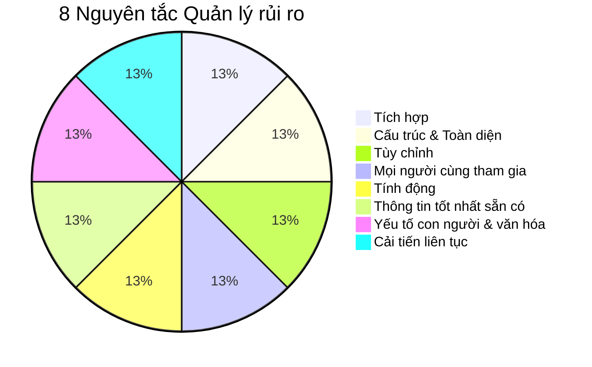
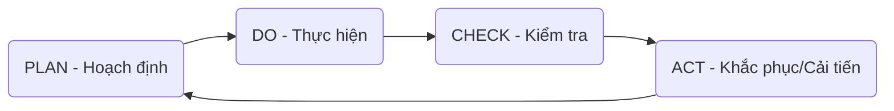

# Chương 3: Mục đích và Các nguyên tắc Quản lý rủi ro

## 1. Mục đích của Quản lý rủi ro (QLRR)

!!! quote "Câu nói cốt lõi"
    "The purpose of risk management is the **creation and protection of value**"  
    *(Mục đích của quản lý rủi ro là tạo ra và bảo vệ giá trị)*

### 1.1. Khái niệm "Giá trị" (Value)
*   **Giá trị** là một con số (`number`) có thể đo lường được.
*   Chỉ khi **đo lường** được con số này, doanh nghiệp mới có thể tiến hành:
    `Phân tích` $\rightarrow$ `Quản lý` $\rightarrow$ `Kiểm soát` $\rightarrow$ `Cải tiến`.

### 1.2. Các ví dụ minh họa về bảo vệ giá trị

| Ví dụ | Mối đe dọa / Rủi ro | Giải pháp / Giá trị tạo ra |
| :--- | :--- | :--- |
| **Lưu trữ (HDD)** | Sao chép tập tin lớn thất bại do hết bộ nhớ. | Hệ điều hành cảnh báo khi dung lượng trống còn **~8%**. |
| **Chip xử lý (CPU)** | CPU quá nóng gây ngừng hoạt động. | Thiết kế chip hoạt động trong điều kiện nhiệt độ **$\le 70^\circ C$**. |
| **Cơ sở dữ liệu** | File MS Access bị hỏng (corrupt) do quá lớn. | Giới hạn dung lượng file **$\le 2GB$** và đưa ra cảnh báo. |
| **Nguồn điện (UPS)** | Mất dữ liệu đột ngột khi mất điện lưới. | Trang bị UPS duy trì điện **15 phút** để đạt **RTO = 0**. |
| **An toàn lao động** | Té ngã khi làm việc trên cao. | Quy định độ cao **từ 2m trở lên** là "làm việc trên cao", bắt buộc bảo hộ. |
| **Hàng không** | Thiếu thời gian xử lý khi hạ cánh (88 tấn). | Phương thức ILS: Đưa máy bay vào đường hạ cánh **4000’ – 2500’ – 1400’**. |
| **Dịch vụ khách hàng** | Khách bị bỏng cà phê nóng (vụ McDonald's). | Cảnh báo đồ uống **$\ge 56^\circ C$**, dùng túi cách nhiệt hoặc ký cam kết. |

---

## 2. Phân biệt Mục đích (Purpose) và Mục tiêu (Objective)

| Đặc điểm | Mục đích (Purpose) | Mục tiêu (Objective) |
| :--- | :--- | :--- |
| **Tính chất** | Chung chung, trừu tượng. | Cụ thể, rõ ràng, chi tiết. |
| **Thời gian** | Dài hạn. | Ngắn hạn. |
| **Vai trò** | Cung cấp lý do "tại sao" làm điều gì đó. | Mô tả kết quả mong muốn và hành động cần thiết. |
| **Tiêu chuẩn** | Gắn với tầm nhìn, sứ mệnh. | Phải đáp ứng tiêu chí **S.M.A.R.T**. |

!!! tip "Tiêu chí S.M.A.R.T"
    *   **S**pecific: Cụ thể.
    *   **M**easurable: Đo lường được.
    *   **A**ttainable: Khả năng thực hiện được.
    *   **R**elevant: Tính thực tế.
    *   **T**ime-based: Giới hạn thời gian.

---

## 3. Tám (8) Nguyên tắc Quản lý rủi ro (ISO 31000:2018)

Các nguyên tắc này là nền tảng để thiết lập khuôn khổ (framework) và quy trình QLRR:

1.  **Được tích hợp (Integrated):** Là một phần không thể tách rời trong mọi hoạt động của tổ chức.
2.  **Có cấu trúc và toàn diện (Structured & Comprehensive):** Đảm bảo kết quả nhất quán và có thể so sánh.
3.  **Được tùy chỉnh (Customized):** Phù hợp với bối cảnh nội bộ, bên ngoài và mục tiêu riêng của tổ chức.
4.  **Mọi người cùng tham gia (Inclusive):** Sự tham gia kịp thời của các bên liên quan để nâng cao nhận thức.
5.  **Tính động (Dynamic):** Rủi ro có thể xuất hiện, thay đổi hoặc biến mất khi bối cảnh thay đổi.
6.  **Thông tin tốt nhất sẵn có (Best Available Information):** Dựa trên dữ liệu quá khứ, hiện tại và dự báo tương lai.
7.  **Yếu tố con người và văn hóa (Human & Cultural factors):** Hành vi và văn hóa ảnh hưởng đến mọi giai đoạn QLRR.
8.  **Cải tiến liên tục (Continual Improvement):** Thông qua học hỏi và kinh nghiệm.

---

## 4. Cải tiến liên tục thông qua chu trình PDCA

Quản lý rủi ro không phải là hoạt động một lần mà là một chu kỳ lặp lại:

!!! failure "Logic của sự thất bại khi thiếu đo lường"
    *   Nếu không thể **đo lường**, bạn không thể **phân tích**.
    *   Nếu không thể **phân tích**, bạn không thể **quản lý**.
    *   Nếu không thể **quản lý**, bạn không thể **kiểm soát**.
    *   Nếu không thể **kiểm soát**, bạn không thể **cải tiến**.

---

# BỘ 50 CÂU HỎI TRẮC NGHIỆM CHƯƠNG 3

**Câu 1. Mục đích cốt lõi của quản lý rủi ro (theo ISO 31000) là gì?**

- A. Loại bỏ hoàn toàn mọi rủi ro trong doanh nghiệp.
- B. Tạo ra và bảo vệ giá trị.
- C. Tiết kiệm chi phí vận hành cho bộ phận IT.
- D. Tuân thủ các quy định của cơ quan nhà nước.
??? success "Đáp án: B"
    Giải thích: Tài liệu nêu rõ "The purpose of risk management is the creation and protection of value".

**Câu 2. Trong quản lý rủi ro, "Giá trị" (Value) nên được hiểu là gì để có thể quản lý hiệu quả?**

- A. Là sự hài lòng của ban giám đốc.
- B. Là những ý tưởng trừu tượng về sự an toàn.
- C. Là một con số (number) có thể đo lường được.
- D. Là các bản hợp đồng bảo hiểm đã mua.
??? success "Đáp án: C"
    Giải thích: Chỉ khi là một con số đo lường được thì mới có thể phân tích và cải tiến (Slide 3).

**Câu 3. "Nếu không thể đo lường, bạn không thể phân tích" dẫn đến hệ quả cuối cùng là gì?**

- A. Không thể thuê chuyên gia.
- B. Không thể mua phần mềm.
- C. Không thể cải tiến (improve).
- D. Không thể lập kế hoạch tài chính.
??? success "Đáp án: C"
    Giải thích: Đây là logic chuỗi: Đo lường -> Phân tích -> Quản lý -> Kiểm soát -> Cải tiến.

**Câu 4. Tại sao Microsoft thiết lập cảnh báo khi dung lượng trống HDD còn khoảng 8%?**

- A. Để ép người dùng mua thêm ổ cứng mới.
- B. Để tạo ra giá trị bảo vệ tính toàn vẹn của dữ liệu khi sao chép.
- C. Để làm chậm máy tính của đối thủ cạnh tranh.
- D. Để tăng tốc độ truy cập internet.
??? success "Đáp án: B"
    Giải thích: Giá trị 8% giúp quản lý rủi ro việc sao chép bị thất bại hoặc hỏng dữ liệu.

**Câu 5. Intel sản xuất chip xử lý hoạt động tốt nhất ở ngưỡng nhiệt độ nào để QLRR?**

- A. $\le 100^\circ C$.
- B. $\le 90^\circ C$.
- C. $\le 70^\circ C$.
- D. $\le 50^\circ C$.
??? success "Đáp án: C"
    Giải thích: Theo slide 6, Intel thiết lập ngưỡng $70^\circ C$ để bảo vệ chip và duy trì vận hành.

**Câu 6. Giới hạn dung lượng tập tin của MS Access ($\le 2GB$) nhằm mục đích bảo vệ giá trị gì?**

- A. Giảm dung lượng lưu trữ trên đám mây.
- B. Tránh việc tác vụ sao chép bị thất bại hoặc làm hỏng (corrupt) tệp dữ liệu.
- C. Tăng tính thẩm mỹ cho giao diện phần mềm.
- D. Để người dùng chuyển sang sử dụng SQL Server.
??? success "Đáp án: B"
    Giải thích: Đây là biện pháp QLRR để bảo vệ sự ổn định của cơ sở dữ liệu (Slide 7).

**Câu 7. Một doanh nghiệp trang bị UPS duy trì điện trong 15 phút với mục tiêu RTO = 0. RTO là viết tắt của:**

- A. Risk Treatment Option.
- B. Recovery Time Objective.
- C. Regional Traffic Office.
- D. Return Target Output.
??? success "Đáp án: B"
    Giải thích: RTO (Recovery Time Objective) là mục tiêu thời gian phục hồi hệ thống.

**Câu 8. Theo quy định tại ví dụ về an toàn lao động, công việc được coi là "làm việc trên cao" khi ở độ cao:**

- A. Từ 1 mét trở lên.
- B. Từ 2 mét trở lên.
- C. Từ 5 mét trở lên.
- D. Từ 10 mét trở lên.
??? success "Đáp án: B"
    Giải thích: Slide 9 nêu rõ quy định từ 2 mét trở lên so với mặt đất.

**Câu 9. "Cung cấp lý do để làm điều gì đó hoặc chứng minh kết quả mong muốn trong dài hạn" là định nghĩa của:**

- A. Mục tiêu (Objective).
- B. Mục đích (Purpose).
- C. Kế hoạch (Plan).
- D. Chiến lược (Strategy).
??? success "Đáp án: B"
    Giải thích: Mục đích có tính dài hạn, chung chung và trả lời cho câu hỏi "tại sao" (Slide 9).

**Câu 10. Đặc điểm nào sau đây thuộc về "Mục tiêu" (Objective)?**

- A. Chung chung và trừu tượng.
- B. Thiếu rõ ràng, không cụ thể.
- C. Mô tả kết quả mong muốn theo tiêu chí S.M.A.R.T.
- D. Thường chỉ gắn liền với sứ mệnh của công ty.
??? success "Đáp án: C"
    Giải thích: Mục tiêu phải cụ thể và tuân thủ S.M.A.R.T (Slide 10).

**Câu 11. Trong tiêu chí S.M.A.R.T, chữ "M" đại diện cho:**

- A. Management (Quản lý).
- B. Measurable (Đo lường được).
- C. Material (Vật chất).
- D. Mission (Sứ mệnh).
??? success "Đáp án: B"

**Câu 12. Ví dụ: "Năm 2024, ngân hàng MB đặt mục tiêu lợi nhuận tăng 6% so với năm 2023" là:**

- A. Một mục đích chung chung.
- B. Một mục tiêu kinh doanh cụ thể.
- C. Một nguyên tắc quản lý rủi ro.
- D. Một chính sách bảo mật thông tin.
??? success "Đáp án: B"
    Giải thích: Nó có con số cụ thể, thời gian rõ ràng (S.M.A.R.T).

**Câu 13. Mục tiêu ATTT: "Thời gian gián đoạn hệ thống không quá 2 giờ/năm" đáp ứng chữ cái nào trong S.M.A.R.T mạnh nhất?**

- A. S (Specific).
- B. M (Measurable).
- C. T (Time-based).
- D. Tất cả các ý trên.
??? success "Đáp án: D"

**Câu 14. "Objective and Value must be aligned" có nghĩa là:**

- A. Mục tiêu và giá trị phải luôn đối nghịch nhau.
- B. Mục tiêu và giá trị phải phù hợp hoặc liên kết chặt chẽ với nhau.
- C. Mục tiêu quan trọng hơn giá trị.
- D. Giá trị chỉ được tính sau khi đã hoàn thành mục tiêu.
??? success "Đáp án: B"

**Câu 15. Có bao nhiêu nguyên tắc quản lý rủi ro theo ISO 31000:2018 được nêu trong bài?**

- A. 5 nguyên tắc.
- B. 7 nguyên tắc.
- C. 8 nguyên tắc.
- D. 10 nguyên tắc.
??? success "Đáp án: C"
    Giải thích: Hình 2 và Slide 6 liệt kê 8 nguyên tắc.

**Câu 16. Nguyên tắc "Được tích hợp" (Integrated) có nghĩa là:**

- A. QLRR là một bộ phận tách biệt hoàn toàn với sản xuất.
- B. QLRR là một phần không thể tách rời trong tất cả các hoạt động của tổ chức.
- C. Mọi rủi ro phải được gộp chung thành một nhóm duy nhất.
- D. Chỉ tích hợp QLRR vào bộ phận Công nghệ thông tin.
??? success "Đáp án: B"
    Giải thích: QLRR hiện diện trong hoạt động hàng ngày, dự án và hệ thống CNTT (Slide 23).

**Câu 17. Nguyên tắc nào giúp đảm bảo kết quả quản lý rủi ro nhất quán và có thể so sánh được?**

- A. Được tùy chỉnh (Customized).
- B. Tính động (Dynamic).
- C. Có cấu trúc và toàn diện (Structured and Comprehensive).
- D. Yếu tố con người và văn hóa.
??? success "Đáp án: C"
    Giải thích: Tiếp cận có cấu trúc mang lại sự nhất quán (Slide 24).

**Câu 18. Tại sao khuôn khổ QLRR cần phải "Được tùy chỉnh" (Customized)?**

- A. Vì mỗi tổ chức đều khác nhau về bối cảnh và mục tiêu.
- B. Để làm cho quy trình trở nên phức tạp hơn.
- C. Để không phải tuân theo bất kỳ tiêu chuẩn quốc tế nào.
- D. Vì doanh nghiệp muốn tiết kiệm chi phí thuê chuyên gia.
??? success "Đáp án: A"
    Giải thích: QLRR phải tương xứng với bối cảnh nội bộ và bên ngoài của riêng tổ chức đó (Slide 26).

**Câu 19. Nguyên tắc "Sự tham gia" (Inclusive) nhấn mạnh vào điều gì?**

- A. Chỉ có ban giám đốc mới được tham gia QLRR.
- B. Sự tham gia thích hợp và kịp thời của các bên liên quan để suy xét kiến thức và quan điểm của họ.
- C. Mọi nhân viên đều phải chịu trách nhiệm tài chính như nhau khi có rủi ro.
- D. Thuê thật nhiều nhân sự bên ngoài tham gia vào công ty.
??? success "Đáp án: B"
    Giải thích: Giúp nâng cao nhận thức và đảm bảo việc quản lý có đầy đủ thông tin (Slide 27).

**Câu 20. Khi bối cảnh nội bộ hoặc bên ngoài của tổ chức thay đổi, rủi ro cũng có thể hình thành hoặc biến mất. Đây là nội dung của nguyên tắc:**

- A. Tính động (Dynamic).
- B. Thông tin tốt nhất sẵn có.
- C. Được tích hợp.
- D. Tùy chỉnh.
??? success "Đáp án: A"

**Câu 21. Đầu vào cho hoạt động QLRR dựa trên những loại thông tin nào?**

- A. Chỉ thông tin trong quá khứ.
- B. Chỉ những dự báo tương lai.
- C. Thông tin quá khứ, hiện tại và các dự báo tương lai.
- D. Chỉ những tin đồn trên thị trường.
??? success "Đáp án: C"
    Giải thích: Nguyên tắc "Thông tin tốt nhất sẵn có" (Best Available Information - Slide 29).

**Câu 22. Hành vi con người và văn hóa doanh nghiệp ảnh hưởng như thế nào đến QLRR?**

- A. Không ảnh hưởng vì rủi ro được quản lý bằng máy móc.
- B. Ảnh hưởng đáng kể đến tất cả các khía cạnh của QLRR tại mỗi cấp.
- C. Chỉ ảnh hưởng ở giai đoạn tuyển dụng nhân sự.
- D. Chỉ ảnh hưởng nếu doanh nghiệp đó hoạt động trong lĩnh vực nghệ thuật.
??? success "Đáp án: B"
    Giải thích: Nguyên tắc "Yếu tố con người và văn hóa" (Slide 30).

**Câu 23. Quản lý rủi ro được cải tiến liên tục thông qua việc áp dụng chu trình nào?**

- A. Chu trình Water-fall.
- B. Chu trình PDCA (Deming cycle).
- C. Chu trình Agile.
- D. Chu trình ABC.
??? success "Đáp án: B"

**Câu 24. Trong chu trình PDCA, chữ "C" đại diện cho hành động nào?**

- A. Control (Kiểm soát).
- B. Check (Kiểm tra, giám sát).
- C. Creation (Tạo ra).
- D. Cultural (Văn hóa).
??? success "Đáp án: B"

**Câu 25. Trong chu trình PDCA, chữ "A" (Act) có nghĩa là:**

- A. Hành động ngay lập tức khi thấy rủi ro.
- B. Diễn kịch để mô phỏng rủi ro.
- C. Duy trì và cải tiến kết quả thông qua hành động khắc phục.
- D. Báo cáo lên cấp trên.
??? success "Đáp án: C"

**Câu 26. Theo logic "If you can't measure it, you can't analyse it", bước đầu tiên cần làm để cải tiến là:**

- A. Phân tích.
- B. Quản lý.
- C. Kiểm soát.
- D. Tạo ra giá trị/con số để đo lường.
??? success "Đáp án: D"

**Câu 27. Trong vụ kiện McDonald's về cà phê nóng, giá trị rủi ro gây thiệt hại danh tiếng là con số nào?**

- A. 1 triệu USD.
- B. 2 triệu USD.
- C. 5 triệu USD.
- D. 10 triệu USD.
??? success "Đáp án: B"
    Giải thích: Khách hàng thắng kiện 2 triệu USD (Slide 12).

**Câu 28. "Trời kêu ai nấy dạ" là biểu hiện của loại thái độ rủi ro nào?**

- A. Chấp nhận rủi ro một cách chủ động.
- B. Ghét rủi ro.
- C. Không quan tâm/Phó mặc cho số phận.
- D. Trung lập với rủi ro.
??? success "Đáp án: C"
    Giải thích: Slide 30 dùng câu này để minh họa cho sự khác biệt về nhận thức/thái độ con người.

**Câu 29. Việc máy bay phải vào đường hạ cánh ở các mốc độ cao 4000’ – 2500’ – 1400’ là minh chứng cho việc quản lý:**

- A. Rủi ro về nhiên liệu.
- B. Rủi ro về thời gian xử lý sự cố.
- C. Rủi ro về tiếng ồn.
- D. Rủi ro về thời tiết.
??? success "Đáp án: B"
    Giải thích: Vì phi công có rất ít thời gian xử lý khi máy bay chạm đất nên phải chuẩn bị từ xa (Slide 10).

**Câu 30. Theo nguyên tắc ISO 31000, các thành phần của QLRR cần được:**

- A. Giữ nguyên không thay đổi theo thời gian.
- B. Điều chỉnh hoặc cải thiện để trở nên hiệu quả và nhất quán.
- C. Công khai toàn bộ cho đối thủ cạnh tranh.
- D. Chỉ thực hiện một lần duy nhất khi thành lập công ty.
??? success "Đáp án: B"
    Giải thích: Đây là tinh thần của cải tiến liên tục (Slide 15).

**Câu 31. QLRR giúp cải thiện hiệu suất vận hành (`performance`) bằng cách:**

- A. Loại bỏ toàn bộ nhân viên yếu kém.
- B. Thiết lập các biện pháp kiểm soát ảnh hưởng tích cực đến việc đạt mục tiêu.
- C. Tăng thời gian làm việc của nhân viên.
- D. Giảm tiền lương của bộ phận quản lý.
??? success "Đáp án: B"

**Câu 32. "Inclusive" trong 8 nguyên tắc của QLRR dịch sang tiếng Việt sát nghĩa nhất là:**

- A. Bao hàm/Sự tham gia.
- B. Loại trừ.
- C. Duy nhất.
- D. Bí mật.
??? success "Đáp án: A"

**Câu 33. Khi một rủi ro "vượt quá một giá trị nào đó" dẫn đến thất bại, doanh nghiệp cần:**

- A. Bỏ mặc rủi ro đó.
- B. Thiết lập ngưỡng (threshold) để cảnh báo hoặc ngăn chặn.
- C. Đóng cửa doanh nghiệp.
- D. Tăng giá bán sản phẩm.
??? success "Đáp án: B"
    Giải thích: Ví dụ ngưỡng 8% của HDD hoặc 2GB của MS Access.

**Câu 34. Theo slide 15, QLRR là một phần của:**

- A. Chỉ bộ phận IT.
- B. Chỉ bộ phận kế toán.
- C. Quản trị và lãnh đạo.
- D. Bộ phận bảo vệ tòa nhà.
??? success "Đáp án: C"

**Câu 35. Câu nói "If you can't control it, you can't improve it" có nghĩa là:**

- A. Bạn không cần kiểm soát nếu muốn cải tiến.
- B. Kiểm soát là điều kiện tiên quyết để thực hiện cải tiến.
- C. Kiểm soát và cải tiến là hai việc không liên quan.
- D. Cải tiến dễ hơn kiểm soát.
??? success "Đáp án: B"

**Câu 36. Một mục tiêu ATTT đạt tiêu chí "Time-based" khi:**

- A. Có quy định rõ ai thực hiện.
- B. Có phương pháp đo lường chính xác.
- C. Có thời hạn hoàn thành cụ thể (ví dụ: trong vòng 30 phút, trước cuối năm...).
- D. Có ngân sách dồi dào.
??? success "Đáp án: C"

**Câu 37. Yếu tố nào sau đây KHÔNG nằm trong 8 nguyên tắc của QLRR?**

- A. Được tích hợp.
- B. Tính động.
- C. Lợi nhuận tối đa.
- D. Tùy chỉnh.
??? success "Đáp án: C"

**Câu 38. "Tổ chức QLRR toàn doanh nghiệp với cơ cấu từ trên xuống dưới" là biểu hiện của nguyên tắc:**

- A. Tích hợp.
- B. Có cấu trúc và toàn diện.
- C. Mọi người cùng tham gia.
- D. Cải tiến liên tục.
??? success "Đáp án: B"

**Câu 39. Ví dụ về việc Intel cải tiến kiến trúc chip và quạt làm mát là để phục vụ nguyên tắc:**

- A. Tùy chỉnh.
- B. Cải tiến liên tục nhằm bảo vệ giá trị CPU.
- C. Thông tin tốt nhất sẵn có.
- D. Bao hàm.
??? success "Đáp án: B"

**Câu 40. "Mục tiêu và giá trị phải Alignment" - từ Alignment ở đây mang nghĩa:**

- A. Sắp xếp thẳng hàng/Phù hợp/Kết hợp.
- B. Đối lập/Xung đột.
- C. Tách rời/Độc lập.
- D. Ngẫu nhiên.
??? success "Đáp án: A"

**Câu 41. Tại sao nói QLRR thúc đẩy sự đổi mới (Innovation)?**

- A. Vì rủi ro buộc con người phải tiêu tiền.
- B. Vì quản lý rủi ro tốt giúp doanh nghiệp tự tin thử nghiệm các phương pháp/sản phẩm mới trong tầm kiểm soát.
- C. Vì rủi ro luôn làm hỏng cái cũ.
- D. Vì đổi mới là cách duy nhất để không gặp rủi ro.
??? success "Đáp án: B"

**Câu 42. Trong QLRR, việc "học hỏi từ kinh nghiệm và phản hồi từ khách hàng" thuộc giai đoạn nào của PDCA?**

- A. Plan.
- B. Do.
- C. Check.
- D. Act.
??? success "Đáp án: C"
    Giải thích: Học hỏi và kiểm tra kết quả thực tế thuộc bước Check (Slide 33).

**Câu 43. Một hệ thống quản lý rủi ro "Hiệu quả" (Effective) là hệ thống:**

- A. Tốn nhiều chi phí nhất.
- B. Đạt được các mục tiêu tạo ra và bảo vệ giá trị đã đề ra.
- C. Không bao giờ để xảy ra sự cố nhỏ nhất.
- D. Có ít nhân viên nhất.
??? success "Đáp án: B"

**Câu 44. Thái độ rủi ro (Risk Attitude) của cá nhân và các bên liên quan được nhắc tới trong nguyên tắc nào?**

- A. Tính động.
- B. Yếu tố con người và văn hóa.
- C. Được tích hợp.
- D. Tùy chỉnh.
??? success "Đáp án: B"

**Câu 45. Việc "Dự trữ phụ tùng, linh kiện đủ để bảo hành sản phẩm trong 2 năm" của nhà sản xuất máy tính là hành động:**

- A. Tạo ra giá trị.
- B. Bảo vệ giá trị (Bảo hành).
- C. Phớt lờ rủi ro.
- D. Đầu tư mạo hiểm.
??? success "Đáp án: B"

**Câu 46. Mục đích của QLRR là tạo nền tảng cho:**

- A. Cách thức tổ chức được quản lý ở mọi cấp độ.
- B. Việc sa thải nhân viên khi có lỗi.
- C. Việc quảng cáo sản phẩm.
- D. Việc vay vốn ngân hàng dễ hơn.
??? success "Đáp án: A"
    Giải thích: Slide 15 nêu QLRR là nền tảng cho cách thức tổ chức được quản lý.

**Câu 47. S.M.A.R.T là một bộ tiêu chuẩn dùng để đánh giá tính chất của:**

- A. Mục đích (Purpose).
- B. Mục tiêu (Objective).
- C. Nguyên tắc (Principle).
- D. Rủi ro (Risk).
??? success "Đáp án: B"

**Câu 48. Một "dự báo trong tương lai" được coi là đầu vào của quản lý rủi ro theo nguyên tắc:**

- A. Tính động.
- B. Thông tin tốt nhất sẵn có.
- C. Tùy chỉnh.
- D. Toàn diện.
??? success "Đáp án: B"

**Câu 49. Nếu một doanh nghiệp sao chép y hệt quy trình QLRR của một doanh nghiệp khác mà không chỉnh sửa, họ đã vi phạm nguyên tắc:**

- A. Được tích hợp.
- B. Được tùy chỉnh (Customized).
- C. Cải tiến liên tục.
- D. Tính động.
??? success "Đáp án: B"

**Câu 50. Câu nói "If you can't measure it, you can't analyse it" thường được gán cho ai (trong lĩnh vực quản trị)?**

- A. Elon Musk.
- B. Peter Drucker (Người được coi là cha đẻ quản trị hiện đại, mặc dù slide không nêu tên nhưng đây là kiến thức nền tảng của logic này).
- C. Bill Gates.
- D. Steve Jobs.
??? success "Đáp án: B"
    Giải thích: Đây là một câu danh ngôn kinh điển trong quản trị để nhấn mạnh vai trò của dữ liệu và đo lường (như slide 15 đề cập).

---
Hy vọng bộ câu hỏi này giúp bạn ôn tập tốt!
