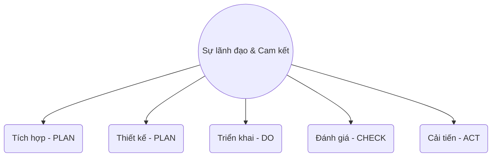

# Chương 4: Khuôn khổ quản lý rủi ro (Risk Management Framework)

## 1. Khái quát (General)

### 1.1. Mục đích và Định nghĩa
Khuôn khổ quản lý rủi ro (QLRR) đóng vai trò là nền tảng và cấu trúc hỗ trợ thiết yếu cho mọi hoạt động quản lý rủi ro của tổ chức.

!!! abstract "Định nghĩa Khuôn khổ (Framework)"
    *   Là cấu trúc hỗ trợ hoặc cấu trúc cơ bản thiết yếu (*essential supporting or underlying structure*) theo ISO 9001.
    *   Phục vụ như một nền tảng (*foundation*).
    *   **Tiêu chuẩn ISO 31000:2018** chính là một khuôn khổ của quản lý rủi ro.

!!! info "Mục đích của Khuôn khổ QLRR"
    *   Hỗ trợ doanh nghiệp tích hợp QLRR vào các hoạt động và chức năng quan trọng.
    *   Đảm bảo nhận được sự hỗ trợ từ ban quản lý cấp cao và các bên liên quan.

### 1.2. Khuôn khổ trong An toàn thông tin (Cybersecurity Framework)
Khuôn khổ ATTT là một hệ thống các tiêu chuẩn, hướng dẫn và phương pháp tốt nhất để quản lý rủi ro kỹ thuật số.

*   **Nhóm tiêu chuẩn ISO 27000:** Được công nhận toàn cầu về quản lý bảo mật thông tin.
*   **ISO 27001:2013:** Khuôn khổ gồm 14 nhóm yêu cầu (domains), 35 mục tiêu kiểm soát và 114 biện pháp kiểm soát.
*   **ISO 27002:2013:** Đưa ra các thông lệ thực hành tốt nhất (*Best Practices*) để lựa chọn và triển khai kiểm soát.
*   **ISO 27005:** Cung cấp phương pháp luận chi tiết để đánh giá và xử lý rủi ro ATTT.

### 1.3. Các khuôn khổ khác
Ngoài các tiêu chuẩn ISO, còn có các khuôn khổ chuyên biệt khác:
*   **Mô hình OSI:** Khuôn khổ cho mạng máy tính (7 lớp).
*   **.NET Framework:** Khuôn khổ phát triển phần mềm của Microsoft.
*   **Apache Log4j 2:** Khuôn khổ ghi nhật ký mã nguồn mở.
*   **Common Criteria:** Khuôn khổ đánh giá và chứng nhận khả năng bảo mật của sản phẩm CNTT (ví dụ: Router).

---

## 2. Quản trị (Governance) và Quản lý (Management)

Sự phân biệt giữa Quản trị và Quản lý là yếu tố then chốt trong khuôn khổ QLRR.

| Đặc điểm | Quản trị (Governance - BoD) | Quản lý (Management - BoM) |
| :--- | :--- | :--- |
| **Cấp bậc** | Cấp cao nhất (Hội đồng quản trị) | Cấp điều hành (Ban Tổng giám đốc) |
| **Trách nhiệm** | Thiết lập mục tiêu, định hướng, chiến lược, luật lệ | Phân bổ nguồn lực, hướng dẫn, giám sát hoạt động |
| **Câu hỏi cốt lõi** | Làm cái gì? (**What**) | Làm như thế nào? (**How**) |
| **Vai trò** | Chịu trách nhiệm giải trình | Vận hành hàng ngày |

---

## 3. Các thành phần của Khuôn khổ QLRR

Khuôn khổ QLRR được cấu trúc xoay quanh trung tâm là **Sự lãnh đạo và Cam kết**, liên hệ chặt chẽ với chu trình PDCA:

### 3.1. Sự lãnh đạo và Cam kết (Leadership and Commitment)
*   **Vị trí:** Trung tâm của khuôn khổ.
*   **Vai trò của BoM:** Ban hành chính sách, phân công trách nhiệm, cung cấp nguồn lực và thúc đẩy cải tiến liên tục.
*   **Yêu cầu:** Cam kết QLRR phải được ghi thành điều khoản cụ thể trong Chính sách ATTT.

### 3.2. Thiết kế (Design)
Doanh nghiệp cần hiểu rõ bối cảnh để thiết kế khuôn khổ phù hợp:
*   **Bối cảnh bên ngoài:** Chính trị, pháp lý, công nghệ, kinh tế, môi trường quốc tế/quốc gia.
*   **Bối cảnh bên trong:** Tầm nhìn, sứ mệnh, giá trị, cơ cấu điều hành, văn hóa tổ chức.
*   **Phân công:** Xác định rõ "Chủ sở hữu rủi ro" (*Risk Owners*).

### 3.3. Cải tiến (Improvement)
QLRR được cải tiến liên tục thông qua học hỏi và kinh nghiệm.

!!! danger "Logic của sự cải tiến"
    1. Nếu không có giá trị để **Đo lường**, bạn không thể **Phân tích** nó.
    2. Nếu không thể phân tích, bạn không thể **Quản lý** nó.
    3. Nếu không thể quản lý, bạn không thể **Kiểm soát** nó.
    4. Nếu không thể kiểm soát, bạn không thể **Cải tiến** nó.

---

# BỘ 50 CÂU HỎI TRẮC NGHIỆM CHƯƠNG 4

**Câu 1.** Mục đích chính của Khuôn khổ quản lý rủi ro (Risk Management Framework) là gì?

- A. Loại bỏ hoàn toàn các rủi ro trong doanh nghiệp.
- B. Hỗ trợ tổ chức tích hợp quản lý rủi ro vào các hoạt động và chức năng quan trọng.
- C. Thay thế các quy trình kinh doanh hiện tại bằng quy trình rủi ro.
- D. Giảm số lượng nhân viên trong bộ phận bảo mật.
??? success "Đáp án: B"
    Giải thích: Theo slide 4, mục đích của khuôn khổ là hỗ trợ tích hợp QLRR vào các hoạt động và chức năng quan trọng.

**Câu 2.** Theo định nghĩa của ISO 9001, "Framework" được hiểu là:

- A. Một phần mềm quản lý dự án.
- B. Cấu trúc hỗ trợ hoặc cấu trúc cơ bản thiết yếu.
- C. Một bản báo cáo tài chính hàng năm.
- D. Danh sách các hacker tiềm năng.
??? success "Đáp án: B"
    Giải thích: Framework phục vụ như một nền tảng (Foundation) - Slide 5.

**Câu 3.** Tiêu chuẩn nào sau đây được coi chính là một khuôn khổ của quản lý rủi ro?

- A. ISO 9001.
- B. ISO 14001.
- C. ISO 31000:2018.
- D. ISO 45001.
??? success "Đáp án: C"
    Giải thích: Slide 6 khẳng định ISO 31000:2018 chính là một khuôn khổ QLRR.

**Câu 4.** Khuôn khổ ATTT (Framework in Cybersecurity) về cơ bản là gì?

- A. Một bức tường lửa (Firewall) duy nhất.
- B. Một hệ thống các tiêu chuẩn, hướng dẫn và phương pháp tốt nhất để quản lý rủi ro kỹ thuật số.
- C. Một bộ luật do chính phủ ban hành.
- D. Một nhóm các nhân viên IT chuyên nghiệp.
??? success "Đáp án: B"
    Giải thích: Xem slide 8.

**Câu 5.** ISO 27001:2013 bao gồm bao nhiêu nhóm yêu cầu (domains)?

- A. 10.
- B. 12.
- C. 14.
- D. 18.
??? success "Đáp án: C"
    Giải thích: ISO 27001:2013 có 14 nhóm yêu cầu (Slide 10).

**Câu 6.** Có bao nhiêu biện pháp kiểm soát (Controls) được nêu trong ISO 27001:2013?

- A. 35.
- B. 78.
- C. 114.
- D. 200.
??? success "Đáp án: C"
    Giải thích: Xem slide 10.

**Câu 7.** Tiêu chuẩn ISO/IEC 27002:2013 tập trung vào nội dung nào?

- A. Đưa ra các yêu cầu để cấp chứng chỉ.
- B. Đưa ra các hướng dẫn và thông lệ thực hành tốt nhất về bảo mật thông tin.
- C. Quản lý rủi ro môi trường.
- D. Định nghĩa các thuật ngữ mạng máy tính lớp 1.
??? success "Đáp án: B"
    Giải thích: ISO 27002 cung cấp hướng dẫn triển khai kiểm soát (Slide 11).

**Câu 8.** Vai trò của tiêu chuẩn ISO/IEC 27005 trong hệ thống ISMS là gì?

- A. Thay thế cho ISO 27001.
- B. Là hướng dẫn bổ sung, cung cấp phương pháp luận chi tiết để quản lý rủi ro ATTT.
- C. Quản lý nhân sự tiền lương.
- D. Thiết kế phần cứng máy chủ.
??? success "Đáp án: B"
    Giải thích: Xem slide 12.

**Câu 9.** Mô hình OSI có bao nhiêu lớp và được coi là khuôn khổ cho lĩnh vực nào?

- A. 5 lớp, khuôn khổ phần mềm.
- B. 7 lớp, khuôn khổ mạng máy tính.
- C. 3 lớp, khuôn khổ quản trị.
- D. 10 lớp, khuôn khổ điện toán đám mây.
??? success "Đáp án: B"
    Giải thích: Xem slide 13.

**Câu 10.** .NET Framework là sản phẩm của hãng nào?

- A. Google.
- B. Apple.
- C. Microsoft.
- D. Oracle.
??? success "Đáp án: C"
    Giải thích: Xem slide 14.

**Câu 11.** Khuôn khổ "Common Criteria" dùng để làm gì?

- A. Đánh giá và chứng nhận khả năng bảo mật của sản phẩm CNTT.
- B. Quản lý thời gian làm việc của nhân viên.
- C. Thiết kế trang web doanh nghiệp.
- D. Ghi nhật ký lỗi phần mềm.
??? success "Đáp án: A"
    Giải thích: Xem slide 15.

**Câu 12.** "Governance" (Quản trị) trong doanh nghiệp thường gắn liền với chủ thể nào?

- A. Nhân viên kỹ thuật.
- B. Khách hàng.
- C. Hội đồng quản trị (Board of Directors - BoD).
- D. Nhà cung cấp thiết bị.
??? success "Đáp án: C"
    Giải thích: Quản trị là cách thức tổ chức được quản lý ở cấp cao nhất (Slide 16).

**Câu 13.** Trách nhiệm chính của "Quản lý" (Management - BoM) là gì?

- A. Thiết lập định hướng chiến lược.
- B. Kiểm soát và vận hành tổ chức, phân bổ nguồn lực và giám sát hàng ngày.
- C. Ban hành các bộ luật quốc gia.
- D. Chịu trách nhiệm giải trình với chính phủ về chiến lược.
??? success "Đáp án: B"
    Giải thích: Xem slide 17.

**Câu 14.** Câu nào mô tả đúng nhất về mối quan hệ giữa BoD và BoM?

- A. BoM xác định cái gì (What) và BoD thực hiện như thế nào (How).
- B. Cả hai cùng làm một việc như nhau.
- C. BoD xác định cái gì (What) và BoM chịu trách nhiệm về cách thức (How) thực hiện.
- D. BoD không có quyền can thiệp vào QLRR.
??? success "Đáp án: C"
    Giải thích: Phân biệt What vs How ở slide 18.

**Câu 15.** "Conformity" (Sự phù hợp) được định nghĩa là:

- A. Sự hoàn thành một yêu cầu hoặc tuân thủ tiêu chuẩn, quy tắc, pháp luật.
- B. Việc thay đổi mục tiêu của tổ chức.
- C. Sự phản đối các quy định của ban giám đốc.
- D. Việc bỏ qua các lỗi nhỏ trong hệ thống.
??? success "Đáp án: A"
    Giải thích: Xem slide 19.

**Câu 16.** Hiệu quả của QLRR tại doanh nghiệp phụ thuộc vào yếu tố nào sau đây?

- A. Chỉ phụ thuộc vào công cụ phần mềm.
- B. Sự cam kết và ra quyết định của lãnh đạo.
- C. Việc tích hợp QLRR vào hoạt động quản trị.
- D. Cả B và C đều đúng.
??? success "Đáp án: D"
    Giải thích: Xem slide 20.

**Câu 17.** Thành phần nào nằm ở vị trí trung tâm của Khuôn khổ QLRR?

- A. Tích hợp.
- B. Thiết kế.
- C. Sự lãnh đạo và Cam kết.
- D. Cải tiến.
??? success "Đáp án: C"
    Giải thích: Theo sơ đồ Framework ở slide 3 và 23.

**Câu 18.** Trong chu trình PDCA, các bước "Integrating" (Tích hợp) và "Designing" (Thiết kế) tương ứng với giai đoạn nào?

- A. PLAN (Lập kế hoạch).
- B. DO (Thực hiện).
- C. CHECK (Kiểm tra).
- D. ACT (Cải tiến).
??? success "Đáp án: A"
    Giải thích: Xem bảng liên hệ ở slide 21.

**Câu 19.** Giai đoạn "Implementing" (Triển khai) trong khuôn khổ QLRR tương ứng với bước nào của PDCA?

- A. Plan.
- B. Do.
- C. Check.
- D. Act.
??? success "Đáp án: B"
    Giải thích: Slide 21.

**Câu 20.** "Evaluating" (Đánh giá) trong khuôn khổ QLRR tương ứng với bước nào của PDCA?

- A. Plan.
- B. Do.
- C. Check.
- D. Act.
??? success "Đáp án: C"
    Giải thích: Slide 21.

**Câu 21.** Lãnh đạo cấp cao (BoM) thể hiện cam kết đối với ATTT thông qua việc:

- A. Chỉ cần nói miệng trong các cuộc họp.
- B. Ban hành chính sách, cung cấp nguồn lực và phân công trách nhiệm rõ ràng.
- C. Để nhân viên tự quyết định mọi việc.
- D. Thuê công ty bảo vệ bên ngoài.
??? success "Đáp án: B"
    Giải thích: Xem slide 26.

**Câu 22.** Cam kết của tổ chức đối với QLRR phải được ghi thành nội dung gì khi ban hành?

- A. Ghi vào nhật ký cá nhân của giám đốc.
- B. Ghi thành các điều khoản trong chính sách ATTT.
- C. Ghi lên bảng tin của công ty.
- D. Không cần ghi lại, chỉ cần nhớ.
??? success "Đáp án: B"
    Giải thích: Xem slide 27.

**Câu 23.** "Chủ sở hữu rủi ro" (Risk Owner) là người có trách nhiệm:

- A. Gây ra rủi ro cho công ty.
- B. Giải trình và có quyền hạn đối với việc quản lý một rủi ro cụ thể.
- C. Trả tiền phạt cho công ty.
- D. Sửa lỗi phần mềm.
??? success "Đáp án: B"
    Giải thích: Xem slide 33.

**Câu 24.** Khi thiết kế khuôn khổ QLRR, yếu tố nào thuộc về "Bối cảnh bên ngoài"?

- A. Tầm nhìn và sứ mệnh công ty.
- B. Văn hóa tổ chức.
- C. Các yếu tố chính trị, pháp lý và tài chính quốc tế.
- D. Cơ cấu điều hành nội bộ.
??? success "Đáp án: C"
    Giải thích: Xem slide 32.

**Câu 25.** Việc phân bổ nguồn lực cho QLRR bao gồm những gì?

- A. Con người và công cụ.
- B. Tài liệu hướng dẫn và các khóa đào tạo.
- C. Ngân sách tài chính.
- D. Tất cả các phương án trên.
??? success "Đáp án: D"
    Giải thích: Slide 34 nêu con người, công cụ, tài liệu, đào tạo...

**Câu 26.** Trao đổi thông tin và tham vấn trong thiết kế QLRR nhằm mục đích:

- A. Để buôn chuyện giữa các phòng ban.
- B. Để đảm bảo quan điểm của các bên liên quan được xem xét và thấu hiểu.
- C. Để kéo dài thời gian dự án.
- D. Để tìm người đổ lỗi khi có sự cố.
??? success "Đáp án: B"
    Giải thích: Theo nguyên tắc "Inclusive" và slide 35.

**Câu 27.** "Quy chế hoạt động QLRR" nên được áp dụng cho đối tượng nào?

- A. Chỉ ban giám đốc.
- B. Các phòng, ban và đơn vị trực thuộc trong doanh nghiệp.
- C. Chỉ dành cho đối tác bên ngoài.
- D. Chỉ dành cho nhân viên mới thử việc.
??? success "Đáp án: B"
    Giải thích: Xem slide 37.

**Câu 28.** Việc đánh giá định kỳ khuôn khổ QLRR nhằm xác định:

- A. Khuôn khổ có còn duy trì sự thích hợp để hỗ trợ đạt được mục tiêu hay không.
- B. Ai là người làm việc chậm nhất.
- C. Số lượng máy tính cần mua thêm.
- D. Lợi nhuận của quý trước.
??? success "Đáp án: A"
    Giải thích: Xem slide 39.

**Câu 29.** Để cải tiến khuôn khổ QLRR, doanh nghiệp cần thực hiện theo chu trình nào?

- A. Chu trình sinh trưởng của virus.
- B. Chu trình PDCA (Deming).
- C. Chu trình sản xuất phần cứng.
- D. Chu trình đào tạo nhân sự.
??? success "Đáp án: B"
    Giải thích: Xem slide 41.

**Câu 30.** Nếu bạn không có giá trị để **Đo lường**, bạn không thể:

- A. Phân tích nó.
- B. Ăn mừng.
- C. Nghỉ phép.
- D. Thuê thêm nhân viên.
??? success "Đáp án: A"
    Giải thích: Logic ở slide 43: "Nếu bạn không có giá trị để Đo lường, bạn không thể PHÂN TÍCH nó".

**Câu 31.** Theo logic cải tiến, việc không thể **Quản lý** một vấn đề thường là do:

- A. Không thể phân tích nó.
- B. Không có tiền.
- C. Thiếu máy tính.
- D. Giám đốc đi vắng.
??? success "Đáp án: A"
    Giải thích: Logic chuỗi ở slide 43.

**Câu 32.** Để **Cải tiến** được, trước hết bạn phải có khả năng làm gì với đối tượng đó?

- A. Phớt lờ nó.
- B. Kiểm soát nó.
- C. Chụp ảnh nó.
- D. Chuyển nhượng nó.
??? success "Đáp án: B"
    Giải thích: Slide 43: "Nếu bạn không thể kiểm soát nó, bạn không thể CẢI TIẾN nó".

**Câu 33.** Thành phần "Tích hợp" (Integration) trong khuôn khổ QLRR nhấn mạnh điều gì?

- A. QLRR là một bộ phận tách biệt hoàn toàn.
- B. QLRR là một phần không thể tách rời của tất cả các hoạt động tổ chức.
- C. Chỉ tích hợp QLRR vào ngày cuối cùng của dự án.
- D. Chỉ tích hợp khi có sự cố xảy ra.
??? success "Đáp án: B"
    Giải thích: Xem slide 30.

**Câu 34.** Việc "Phân công trách nhiệm cụ thể cho người thi hành cải tiến" thuộc giai đoạn nào?

- A. Tích hợp.
- B. Thiết kế.
- C. Triển khai.
- D. Cải tiến.
??? success "Đáp án: D"
    Giải thích: Xem slide 42.

**Câu 35.** Trong QLRR, "đo lường kết quả thực hiện theo các chỉ số" (metrics) là một phần của:

- A. Thiết kế.
- B. Đánh giá (Evaluation).
- C. Lãnh đạo.
- D. Tích hợp.
??? success "Đáp án: B"
    Giải thích: Đánh giá hiệu lực cần dựa trên các chỉ số đo lường (Slide 39).

**Câu 36.** Tầm nhìn và sứ mệnh của doanh nghiệp là yếu tố cần xem xét khi:

- A. Xem xét bối cảnh bên ngoài.
- B. Xem xét bối cảnh bên trong khi thiết kế khuôn khổ.
- C. Thuê văn phòng mới.
- D. Đặt tên cho phần mềm.
??? success "Đáp án: B"
    Giải thích: Xem slide 32.

**Câu 37.** Yếu tố nào sau đây giúp việc QLRR trở nên "hiệu quả, hiệu suất và nhất quán"?

- A. Luôn thay đổi quy trình mỗi tuần.
- B. Điều chỉnh và cải thiện khuôn khổ dựa trên bối cảnh thực tế.
- C. Giữ kín thông tin rủi ro với nhân viên.
- D. Chỉ làm QLRR khi có yêu cầu từ công an.
??? success "Đáp án: B"
    Giải thích: Dựa trên tinh thần slide 15 (Chương 3 và nhắc lại ở Chương 4).

**Câu 38.** Động từ "Should" trong ISO chỉ ra một:

- A. Yêu cầu bắt buộc.
- B. Khuyến nghị nên thực hiện.
- C. Sự cho phép.
- D. Khả năng trong tương lai.
??? success "Đáp án: B"
    Giải thích: (Kiến thức bổ trợ từ slide Chương trước và áp dụng xuyên suốt).

**Câu 39.** Một hệ thống QLRR thành công KHÔNG THỂ thiếu yếu tố nào?

- A. Phần mềm đắt tiền nhất.
- B. Sự cam kết của quản lý cấp cao (BoM).
- C. Một văn phòng làm việc hiện đại.
- D. Sự đồng ý của tất cả khách hàng.
??? success "Đáp án: B"
    Giải thích: Xem slide 25.

**Câu 40.** Việc phản hồi của các đối tượng mục tiêu cần được:

- A. Lưu trữ và không bao giờ đọc.
- B. Xem xét, đối chiếu, tổng hợp và ra quyết định khắc phục/cải tiến.
- C. Coi là sự làm phiền.
- D. Trả phí cho mỗi ý kiến.
??? success "Đáp án: B"
    Giải thích: Xem slide 35.

**Câu 41.** Trách nhiệm giải trình (Accountability) về rủi ro cuối cùng thuộc về cấp nào?

- A. Nhân viên IT.
- B. Khách hàng.
- C. Cấp quản trị (Governance/BoD).
- D. Nhà cung cấp internet.
??? success "Đáp án: C"
    Giải thích: BoD thiết lập khuôn khổ giải trình (Slide 18).

**Câu 42.** Các thành phần của khuôn khổ QLRR theo ISO 31000 được sắp xếp theo hình thức nào trên sơ đồ?

- A. Hình tháp.
- B. Hình tròn xoay quanh trung tâm.
- C. Đường thẳng một chiều.
- D. Các ô rời rạc không liên kết.
??? success "Đáp án: B"
    Giải thích: Xem hình 3 ở slide 3 hoặc 23.

**Câu 43.** "Risk management is an integral part of all organizational activities" là nguyên tắc:

- A. Thiết kế.
- B. Tích hợp (Integrated).
- C. Cải tiến.
- D. Đánh giá.
??? success "Đáp án: B"
    Giải thích: Xem slide 22.

**Câu 44.** Việc xây dựng kịch bản (Scenarios) là để hỗ trợ cho giai đoạn nào?

- A. Mua sắm thiết bị.
- B. Nhận diện điểm yếu và đánh giá tác động tiềm tàng.
- C. Quảng cáo sản phẩm.
- D. Tính toán lương nhân viên.
??? success "Đáp án: B"
    Giải thích: (Dựa trên kiến thức Chương 2 được khuôn khổ hóa ở Chương 4).

**Câu 45.** "Best Available Information" (Thông tin sẵn có tốt nhất) trong QLRR dựa trên:

- A. Chỉ là những dự báo tương lai.
- B. Thông tin quá khứ, hiện tại và dự báo tương lai.
- C. Những lời đồn đoán trên mạng xã hội.
- D. Chỉ là các số liệu từ kế toán.
??? success "Đáp án: B"
    Giải thích: Xem slide 29.

**Câu 46.** Sự khác biệt lớn nhất giữa ISO 27001 và ISO 27002 là:

- A. 27001 là yêu cầu bắt buộc để chứng nhận, 27002 là hướng dẫn thực hành.
- B. 27002 quan trọng hơn 27001.
- C. 27001 dành cho phần cứng, 27002 dành cho phần mềm.
- D. Không có sự khác biệt.
??? success "Đáp án: A"
    Giải thích: 27001 là Requirements, 27002 là Guidance (Slide 10-11).

**Câu 47.** "What" vs "How" trong QLRR giúp làm rõ:

- A. Giá của các thiết bị.
- B. Sự phân định vai trò giữa Quản trị và Quản lý.
- C. Thời gian bắt đầu và kết thúc dự án.
- D. Số lượng rủi ro đã xảy ra.
??? success "Đáp án: B"
    Giải thích: Xem slide 18.

**Câu 48.** Theo ISO 31000:2018, thành phần nào giúp truyền đạt giá trị của QLRR?

- A. Chỉ các con số tài chính.
- B. Các nguyên tắc (Principles).
- C. Các phần mềm virus.
- D. Các hợp đồng bảo hiểm.
??? success "Đáp án: B"
    Giải thích: Các nguyên tắc cung cấp hướng dẫn để truyền đạt giá trị QLRR (Slide 21).

**Câu 49.** Việc lập "Kế hoạch triển khai QLRR" bao gồm nội dung nào?

- A. Phạm vi áp dụng và thời điểm triển khai.
- B. Nguồn lực trang bị và người thực hiện.
- C. Khóa đào tạo cho cá nhân liên quan.
- D. Tất cả các phương án trên.
??? success "Đáp án: D"
    Giải thích: Xem slide 37.

**Câu 50.** Khi nghĩ về cải tiến, bước đầu tiên và quan trọng nhất sinh viên phải làm là:

- A. Viết báo cáo.
- B. Tạo ra giá trị (Create value) có thể đo lường được.
- C. Xin lỗi lãnh đạo.
- D. Tắt máy tính.
??? success "Đáp án: B"
    Giải thích: Đây là yêu cầu cốt lõi được nhấn mạnh ở slide 43 và 44.

---
Hy vọng nội dung này hữu ích cho việc học tập của bạn!
