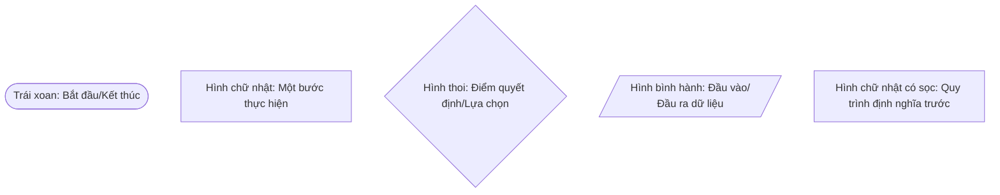

# Chương 5: Quy trình quản lý rủi ro (Risk Management Process)

## 1. Khái quát về Biện pháp kiểm soát (Control)

Theo tiêu chuẩn ISO/IEC 27001, An toàn thông tin (ATTT) đạt được thông qua việc triển khai các bộ biện pháp kiểm soát phù hợp.

!!! info "Định nghĩa Biện pháp kiểm soát"
    Là biện pháp bảo vệ hoặc đối phó được sử dụng để quản lý rủi ro liên quan đến bảo mật thông tin.

### Mục đích của Control:
*   Tránh các lỗ hổng bảo mật và mối đe dọa tiềm ẩn.
*   Giảm khả năng xảy ra hoặc hệ quả của rủi ro.
*   Duy trì và nâng cao tính **CIA** (Bảo mật - Toàn vẹn - Sẵn có) của tài sản thông tin.

### Thành phần của bộ Control:
1.  **Tài liệu:** Chính sách, quy tắc, quy trình, thủ tục, hướng dẫn.
2.  **Cơ chế kỹ thuật.**
3.  **Cấu trúc tổ chức.**
4.  **Chức năng phần mềm và phần cứng.**

---

## 2. Quy trình QLRR và Chu trình PDCA

Quy trình QLRR phải tuân thủ các nguyên tắc (Chương 3) và khuôn khổ (Chương 4). Mối quan hệ giữa các bước trong quy trình QLRR và chu trình **PDCA (Plan-Do-Check-Act)** được thể hiện như sau:

| Bước thực hiện Quy trình QLRR | Chu trình PDCA |
| :--- | :---: |
| Trao đổi thông tin & tham vấn; Xác định phạm vi, bối cảnh và tiêu chí rủi ro | **PLAN** |
| Đánh giá rủi ro (Nhận diện, Phân tích, Định mức); Xử lý rủi ro | **DO** |
| Theo dõi và Xem xét | **CHECK** |
| Cải tiến, lập hồ sơ và báo cáo | **ACT** |

---

## 3. Cách biên soạn tài liệu Quy trình

Một tài liệu quy trình chuẩn thường bao gồm các cột: **Bước, Trách nhiệm, Lưu đồ, Diễn giải (5W1H), Biểu mẫu/Bằng chứng**.

### 3.1. Diễn giải theo 5W1H
*   **Who (Ai?):** Người thực hiện.
*   **What (Làm gì?):** Nội dung công việc.
*   **Where (Ở đâu?):** Địa điểm thực hiện.
*   **When (Khi nào?):** Thời điểm bắt đầu/kết thúc.
*   **Why (Tại sao?):** Lý do thực hiện (ví dụ: theo phân công của lãnh đạo).
*   **How (Như thế nào?):** Cách thức thực hiện dựa trên hướng dẫn.

### 3.2. Ý nghĩa các ký hiệu lưu đồ (Flowchart)

---

## 4. Các giai đoạn chính trong Quy trình

### 4.1. Thiết lập bối cảnh và Tiêu chí (Context & Criteria)
*   **Phạm vi:** Xác định ranh giới QLRR (Mạng, Hệ thống, Ứng dụng).
*   **Bối cảnh:** Bao gồm bối cảnh nội bộ (tầm nhìn, chiến lược) và bối cảnh bên ngoài (pháp lý, công nghệ).
*   **Tiêu chí rủi ro:** Xác định ngưỡng chấp nhận rủi ro (**Risk Appetite**). Ví dụ: Ngân hàng X quy định rủi ro "Thảm họa" là tổn thất > 50 tỷ VNĐ.

### 4.2. Đánh giá rủi ro (Risk Assessment)
Bao gồm 3 bước nhỏ:
1.  **Nhận diện rủi ro:** Phát hiện rủi ro cản trở mục tiêu thông qua rà soát tài sản, phân tích nguyên nhân gốc rễ (Root cause analysis).
2.  **Phân tích rủi ro:** Hiểu bản chất và mức độ rủi ro (định tính hoặc định lượng).
3.  **Định mức rủi ro:** So sánh kết quả phân tích với tiêu chí rủi ro để đưa ra hành động ứng phó.

### 4.3. Xử lý rủi ro (Risk Treatment)
Có 4 phương án chính:
*   **Tránh né (Avoid):** Quyết định không thực hiện hoạt động làm tăng rủi ro.
*   **Chấp nhận (Accept):** Giữ lại rủi ro để theo đuổi cơ hội.
*   **Giảm thiểu (Mitigate):** Thay đổi khả năng xảy ra hoặc hệ quả.
*   **Chuyển giao (Transfer):** Thông qua bảo hiểm hoặc hợp đồng bên thứ ba.

---

## 5. Cải tiến liên tục

!!! danger "Nguyên tắc đo lường để cải tiến"
    *   Nếu không có giá trị để **Đo lường**, bạn không thể **Phân tích**.
    *   Nếu không thể phân tích, bạn không thể **Quản lý**.
    *   Nếu không thể quản lý, bạn không thể **Kiểm soát**.
    *   Nếu không thể kiểm soát, bạn không thể **Cải tiến**.

---

# BỘ 50 CÂU HỎI TRẮC NGHIỆM CHƯƠNG 5

**Câu 1. Theo ISO 27001, An toàn thông tin đạt được bằng cách nào?**

- A. Chỉ bằng cách mua các phần mềm đắt tiền.
- B. Triển khai một bộ các biện pháp kiểm soát (Controls) phù hợp.
- C. Chỉ cần đào tạo nhân viên.
- D. Thuê công ty bảo vệ 24/7.
??? success "Đáp án: B"
    Giải thích: ATTT là kết quả của việc triển khai các Controls đồng bộ (Slide 5).

**Câu 2. Mục đích chính của việc thiết lập các biện pháp kiểm soát (Control) là gì?**

- A. Để tăng chi phí vận hành doanh nghiệp.
- B. Để nhân viên làm việc khó khăn hơn.
- C. Duy trì và nâng cao tính bảo mật, toàn vẹn và khả dụng của tài sản thông tin.
- D. Để thay thế vai trò của lãnh đạo.
??? success "Đáp án: C"
    Giải thích: Xem slide 6.

**Câu 3. Thành phần nào sau đây thuộc bộ các biện pháp kiểm soát (Control)?**

- A. Chính sách, Quy trình, Thủ tục.
- B. Cơ chế kỹ thuật.
- C. Chức năng phần cứng và phần mềm.
- D. Tất cả các phương án trên.
??? success "Đáp án: D"
    Giải thích: Xem slide 7.

**Câu 4. Trong chu trình PDCA, giai đoạn "Thiết lập bối cảnh và Tiêu chí rủi ro" thuộc về:**

- A. Plan.
- B. Do.
- C. Check.
- D. Act.
??? success "Đáp án: A"
    Giải thích: Bước chuẩn bị và lập kế hoạch luôn nằm trong giai đoạn Plan (Slide 10).

**Câu 5. Hoạt động "Xử lý rủi ro" (Risk Treatment) thuộc giai đoạn nào của PDCA?**

- A. Plan.
- B. Do.
- C. Check.
- D. Act.
??? success "Đáp án: B"
    Giải thích: Việc thực hiện các hành động xử lý thuộc giai đoạn Do (Slide 10).

**Câu 6. "Theo dõi và Xem xét" (Monitoring and Review) tương ứng với bước nào của PDCA?**

- A. Plan.
- B. Do.
- C. Check.
- D. Act.
??? success "Đáp án: C"
    Giải thích: Check là kiểm tra và theo dõi (Slide 10).

**Câu 7. Theo slide 11, bước đầu tiên trong phần thực hiện ("Do") của Quy trình QLRR là gì?**

- A. Nhận dạng rủi ro.
- B. Phân tích rủi ro.
- C. Lập kế hoạch.
- D. Xử lý rủi ro.
??? success "Đáp án: C"
    Giải thích: Quy trình cụ thể gồm 11 bước, bắt đầu bằng Lập kế hoạch (Slide 11).

**Câu 8. Cột "Trách nhiệm" trong bảng mô tả quy trình nhằm trả lời câu hỏi nào?**

- A. Làm cái gì?
- B. Ai làm (Who)?
- C. Làm như thế nào?
- D. Tại sao làm?
??? success "Đáp án: B"
    Giải thích: Trách nhiệm xác định người thực hiện (Slide 13).

**Câu 9. Ký hiệu hình thoi trong lưu đồ (Flowchart) có ý nghĩa gì?**

- A. Bước bắt đầu.
- B. Bước kết thúc.
- C. Điểm quyết định phải chọn lựa (If-Else).
- D. Một bước thực hiện bình thường.
??? success "Đáp án: C"
    Giải thích: Hình thoi biểu thị sự rẽ nhánh hoặc quyết định (Slide 16).

**Câu 10. Ký hiệu hình trái xoan (Oval) trong lưu đồ dùng để chỉ:**

- A. Một hành động kỹ thuật.
- B. Bước bắt đầu và bước kết thúc.
- C. Dữ liệu đầu vào.
- D. Tài liệu in ấn.
??? success "Đáp án: B"
    Giải thích: Xem slide 16.

**Câu 11. Ký hiệu hình bình hành trong lưu đồ có ý nghĩa gì?**

- A. Chỉ đầu vào hoặc đầu ra dữ liệu.
- B. Chỉ sự chờ đợi.
- C. Chỉ một quy trình con.
- D. Chỉ một quyết định đúng/sai.
??? success "Đáp án: A"
    Giải thích: Xem slide 17.

**Câu 12. Trong diễn giải 5W1H, "How" dùng để mô tả:**

- A. Thời gian thực hiện.
- B. Lý do thực hiện.
- C. Cách thức thực hiện công việc.
- D. Địa điểm thực hiện.
??? success "Đáp án: C"
    Giải thích: How là "Làm như thế nào" (Slide 18).

**Câu 13. Vai trò của "Biểu mẫu" (Form/Template) trong quy trình là gì?**

- A. Để trang trí tài liệu.
- B. Tạo dựng niềm tin và là bằng chứng chứng minh công việc đã thực hiện.
- C. Để thay thế cho quy trình.
- D. Để tăng dung lượng lưu trữ của ổ cứng.
??? success "Đáp án: B"
    Giải thích: Biểu mẫu giúp chứng minh công việc là có thật (Slide 14).

**Câu 14. "System log" (syslog) được coi là ví dụ của:**

- A. Một chính sách.
- B. Một rủi ro.
- C. Một biểu mẫu/bằng chứng (record).
- D. Một mối đe dọa.
??? success "Đáp án: C"
    Giải thích: Log là bản ghi lại các sự kiện đã xảy ra (Slide 15).

**Câu 15. Mục đích của việc xác định phạm vi (Scope) QLRR là gì?**

- A. Để giới hạn số lượng nhân viên.
- B. Để tùy chỉnh quá trình QLRR phù hợp với ranh giới của mục tiêu/sản phẩm.
- C. Để tránh phải làm báo cáo.
- D. Để tăng giá trị hợp đồng kiểm toán.
??? success "Đáp án: B"
    Giải thích: Phạm vi xác định ranh giới các hoạt động QLRR (Slide 26-27).

**Câu 16. Yếu tố nào sau đây thuộc về "Bối cảnh bên ngoài" của doanh nghiệp?**

- A. Tầm nhìn, sứ mệnh của doanh nghiệp.
- B. Các yếu tố chính trị, pháp lý, công nghệ quốc tế.
- C. Văn hóa doanh nghiệp.
- D. Cơ cấu điều hành nội bộ.
??? success "Đáp án: B"
    Giải thích: Xem bảng so sánh tại slide 29.

**Câu 17. Yếu tố nào sau đây thuộc về "Bối cảnh nội bộ"?**

- A. Đối thủ cạnh tranh.
- B. Thiên tai tại địa phương.
- C. Chiến lược, mục tiêu và chính sách của tổ chức.
- D. Thay đổi của vòng đời sản phẩm CNTT trên thế giới.
??? success "Đáp án: C"
    Giải thích: Xem bảng so sánh tại slide 29.

**Câu 18. "Tiêu chí rủi ro" (Risk Criteria) cần được ban hành khi nào?**

- A. Sau khi rủi ro đã xảy ra.
- B. Khi bắt đầu quá trình đánh giá rủi ro.
- C. Khi kết thúc năm tài chính.
- D. Chỉ khi có yêu cầu của thanh tra.
??? success "Đáp án: B"
    Giải thích: Tiêu chí là cơ sở để đánh giá nên phải có từ đầu (Slide 30).

**Câu 19. "Risk Appetite" (Khẩu vị rủi ro) vạch ra điều gì?**

- A. Danh sách các món ăn cho nhân viên.
- B. Giới hạn mà trong đó các hoạt động QLRR được thực hiện mà không cần phê duyệt lại.
- C. Tổng số tiền doanh nghiệp bị mất trong năm qua.
- D. Thời gian làm việc của bộ phận bảo mật.
??? success "Đáp án: B"
    Giải thích: Khẩu vị rủi ro vạch ra giới hạn chấp nhận tổn thất (Slide 34).

**Câu 20. Phối hợp tiêu chí "Khả năng xảy ra" và "Tác động" sẽ tạo ra:**

- A. Một bản kế hoạch kinh doanh.
- B. Ma trận đánh giá rủi ro (Risk Matrix).
- C. Một danh sách nhân viên xuất sắc.
- D. Một biểu đồ hình tròn.
??? success "Đáp án: B"
    Giải thích: Ma trận rủi ro là sự kết hợp của 2 trục Likelihood và Impact (Slide 35).

**Câu 21. Trong ma trận rủi ro 6x6, rủi ro được xếp hạng trong bao nhiêu ô?**

- A. 12 ô.
- B. 24 ô.
- C. 36 ô.
- D. 48 ô.
??? success "Đáp án: C"
    Giải thích: 6 x 6 = 36 ô (Slide 36).

**Câu 22. Theo ví dụ về Ngân hàng X, mức rủi ro "Rất cao" (E) tương ứng với giá trị phân lớp nào?**

- A. 1 - 4.
- B. 5 - 9.
- C. 10 - 17.
- D. 18 - 36.
??? success "Đáp án: D"
    Giải thích: Xem slide 39.

**Câu 23. Rủi ro được xếp hạng 10 điểm trong ma trận 6x6 (Ngân hàng X) thuộc loại nào?**

- A. Rủi ro thấp.
- B. Rủi ro trung bình.
- C. Rủi ro cao (H).
- D. Rủi ro rất cao.
??? success "Đáp án: C"
    Giải thích: Mức 10-17 là rủi ro Cao (Slide 39).

**Câu 24. Đánh giá rủi ro (Risk Assessment) gồm các bước theo trình tự nào?**

- A. Phân tích -> Nhận diện -> Định mức.
- B. Nhận diện -> Phân tích -> Định mức (Evaluation).
- C. Định mức -> Xử lý -> Nhận diện.
- D. Lập hồ sơ -> Theo dõi -> Xử lý.
??? success "Đáp án: B"
    Giải thích: Trình tự chuẩn: Identification -> Analysis -> Evaluation (Slide 41).

**Câu 25. Mục đích của "Nhận diện rủi ro" là:**

- A. Đổ lỗi cho nhân viên.
- B. Phát hiện, ghi nhận và mô tả các rủi ro cản trở việc đạt mục tiêu.
- C. Tính toán số tiền thiệt hại chính xác.
- D. Mua bảo hiểm rủi ro.
??? success "Đáp án: B"
    Giải thích: Xem slide 43.

**Câu 26. Kỹ thuật nào giúp nhận diện rủi ro ATTT hiệu quả nhất?**

- A. Rà soát danh sách tài sản.
- B. Phân tích nguyên nhân gốc rễ (Root cause analysis).
- C. Sử dụng Phụ lục A - ISO 27001.
- D. Tất cả các kỹ thuật trên.
??? success "Đáp án: D"
    Giải thích: Xem danh sách kỹ thuật tại slide 44.

**Câu 27. "Hệ thống legacy" (hệ thống lỗi thời) thường phát sinh rủi ro do đâu?**

- A. Do quá đắt tiền.
- B. Do thiếu bản vá (patch) và không còn được hỗ trợ.
- C. Do nhân viên không thích sử dụng.
- D. Do tốn ít điện năng.
??? success "Đáp án: B"
    Giải thích: Hệ thống cũ thường có nhiều lỗ hổng bảo mật không được vá (Slide 46).

**Câu 28. "Phân tích rủi ro" (Risk Analysis) nhằm mục đích gì?**

- A. Để ra quyết định xử lý rủi ro thích hợp nhất.
- B. Để hiểu bản chất và các đặc trưng của rủi ro.
- C. Để tính toán mức độ rủi ro.
- D. Tất cả các phương án trên.
??? success "Đáp án: D"
    Giải thích: Xem slide 47-48.

**Câu 29. Kỹ thuật phân tích rủi ro có thể là:**

- A. Chỉ định tính (Qualitative).
- B. Chỉ định lượng (Quantitative).
- C. Kết hợp cả định tính và định lượng.
- D. Chỉ dựa trên cảm nhận cá nhân.
??? success "Đáp án: C"
    Giải thích: Tùy hoàn cảnh mà chọn định tính, định lượng hoặc cả hai (Slide 48).

**Câu 30. "Định mức rủi ro" (Risk Evaluation) là việc:**

- A. Liệt kê các mối đe dọa.
- B. So sánh kết quả phân tích rủi ro với các tiêu chí rủi ro đã thiết lập.
- C. Cài đặt tường lửa.
- D. Phân công người chịu trách nhiệm.
??? success "Đáp án: B"
    Giải thích: Bước này để quyết định xem rủi ro có chấp nhận được không (Slide 50).

**Câu 31. Khi định mức rủi ro, nếu rủi ro được coi là chấp nhận được, tổ chức có thể:**

- A. Không làm gì thêm.
- B. Duy trì các kiểm soát hiện có.
- C. Cả A và B đều đúng.
- D. Bắt buộc phải thiết lập kiểm soát mới.
??? success "Đáp án: C"
    Giải thích: Xem slide 50.

**Câu 32. Mục đích của "Xử lý rủi ro" (Risk Treatment) là:**

- A. Lựa chọn và thực hiện các phương án để giải quyết rủi ro.
- B. Xóa bỏ hoàn toàn cơ sở dữ liệu.
- C. Thay đổi ban lãnh đạo.
- D. Chỉ là việc ghi chép lại các sự cố.
??? success "Đáp án: A"
    Giải thích: Xem slide 53.

**Câu 33. Khi lựa chọn phương án xử lý rủi ro, doanh nghiệp cần cân đối giữa:**

- A. Thời gian và nhân sự.
- B. Lợi ích và chi phí.
- C. Phần cứng và phần mềm.
- D. Khách hàng và đối tác.
??? success "Đáp án: B"
    Giải thích: Xử lý rủi ro phải hiệu quả về mặt kinh tế (Slide 54).

**Câu 34. Việc "Quyết định không thực hiện hoạt động làm tăng rủi ro" là phương án xử lý nào?**

- A. Chấp nhận rủi ro.
- B. Giảm rủi ro.
- C. Tránh né rủi ro (Risk Avoidance).
- D. Chuyển giao rủi ro.
??? success "Đáp án: C"
    Giải thích: Tránh né là loại bỏ nguồn rủi ro hoặc ngưng hoạt động đó (Slide 55).

**Câu 35. "Mua bảo hiểm rủi ro" là ví dụ của phương án xử lý nào?**

- A. Tránh né rủi ro.
- B. Giảm rủi ro.
- C. Chuyển giao rủi ro (Risk Transfer).
- D. Chấp nhận rủi ro.
??? success "Đáp án: C"
    Giải thích: Chuyển một phần thiệt hại cho bên bảo hiểm (Slide 55).

**Câu 36. Phương án "Giảm rủi ro" (Risk Mitigation) tập trung vào việc:**

- A. Thay đổi khả năng xảy ra (Likelihood).
- B. Thay đổi hệ quả (Impact).
- C. Cả A và B đều đúng.
- D. Không làm gì cả.
??? success "Đáp án: C"
    Giải thích: Mitigation nhắm vào cả xác suất và hậu quả (Slide 55).

**Câu 37. "Chấp nhận rủi ro" (Risk Acceptance) thường được thực hiện khi:**

- A. Tổ chức không biết rủi ro đó tồn tại.
- B. Để theo đuổi một cơ hội kinh doanh.
- C. Khi rủi ro quá thấp so với chi phí xử lý.
- D. Cả B và C đều đúng.
??? success "Đáp án: D"
    Giải thích: Chấp nhận rủi ro có chủ đích để lấy cơ hội hoặc vì rủi ro nằm trong ngưỡng (Slide 55).

**Câu 38. "Kế hoạch xử lý rủi ro" cần xác định rõ điều gì?**

- A. Trình tự thực hiện việc xử lý.
- B. Người chịu trách nhiệm.
- C. Nguồn lực cần thiết.
- D. Tất cả các phương án trên.
??? success "Đáp án: D"
    Giải thích: Xem slide 57.

**Câu 39. Tại sao cần thực hiện "Theo dõi và Xem xét" (Monitoring and Review) định kỳ?**

- A. Để cải tiến chất lượng và hiệu lực của việc thiết kế, áp dụng Control.
- B. Để giải quyết các khác biệt trong kết quả QLRR.
- C. Để cập nhật theo những thay đổi của bối cảnh.
- D. Tất cả các phương án trên.
??? success "Đáp án: D"
    Giải thích: Xem slide 59.

**Câu 40. "Báo cáo định mức rủi ro" cần được gửi cho ai?**

- A. Chỉ nhân viên vệ sinh.
- B. Các cấp thích hợp trong tổ chức để được xác nhận giá trị sử dụng.
- C. Công khai trên mạng xã hội cho mọi người xem.
- D. Chỉ cho đối thủ cạnh tranh.
??? success "Đáp án: B"
    Giải thích: Báo cáo rủi ro là thông tin nội bộ quan trọng (Slide 51).

**Câu 41. Theo logic cải tiến liên tục, nếu bạn không thể phân tích một vấn đề, nguyên nhân là do:**

- A. Bạn không thể quản lý nó.
- B. Bạn không có giá trị để đo lường nó.
- C. Bạn không thích nó.
- D. Bạn không có phần mềm.
??? success "Đáp án: B"
    Giải thích: Logic: Không đo lường -> Không phân tích (Slide 61).

**Câu 42. "Nếu không thể quản lý thì không thể kiểm soát". Câu này Đúng hay Sai?**

- A. Đúng.
- B. Sai.
??? success "Đáp án: A"
    Giải thích: Theo chuỗi logic tại slide 61.

**Câu 43. Bước cuối cùng trong chuỗi "Tạo giá trị > ... > Cải tiến" là gì?**

- A. Phân tích.
- B. Quản lý.
- C. Kiểm soát.
- D. Cải tiến.
??? success "Đáp án: D"
    Giải thích: Mục đích cuối cùng của quy trình là sự cải tiến liên tục (Slide 61).

**Câu 44. Việc lập hồ sơ quá trình QLRR (Recording) nhằm:**

- A. Lưu trữ các văn bản phát sinh trong từng hoạt động để đối chiếu, kiểm tra.
- B. Để làm tốn diện tích kho lưu trữ.
- C. Để che giấu các sai lầm.
- D. Để bán cho các công ty thu mua giấy vụn.
??? success "Đáp án: A"
    Giải thích: Hồ sơ là bằng chứng cho hoạt động QLRR (Slide 62).

**Câu 45. Theo ISO 31000:2018 (6.7), báo cáo cho các bên liên quan cần dựa trên:**

- A. Sự ngẫu hứng của nhân viên.
- B. Cơ chế thích hợp và yêu cầu về thông tin cụ thể của họ.
- C. Tất cả mọi thông tin bí mật của doanh nghiệp.
- D. Chỉ các thông tin tích cực.
??? success "Đáp án: B"
    Giải thích: Báo cáo phải đúng người, đúng nhu cầu (Slide 62).

**Câu 46. Tiêu chuẩn ISO/IEC 27005:2008 tập trung vào lĩnh vực nào?**

- A. Quản lý chất lượng.
- B. Quản lý rủi ro An toàn thông tin.
- C. Quản lý môi trường.
- D. Quản lý dự án xây dựng.
??? success "Đáp án: B"
    Giải thích: Xem tài liệu tham khảo (Slide 63).

**Câu 47. Trong lưu đồ, ký hiệu "hình chữ nhật có sọc hai bên" (Slide 17, mục 10) dùng để chỉ:**

- A. Một quy trình đã được định nghĩa trước.
- B. Một quyết định sai.
- C. Một tài liệu bị hỏng.
- D. Bước kết thúc quy trình.
??? success "Đáp án: A"
    Giải thích: Thường dùng cho các quy trình con đã có sẵn.

**Câu 48. Một "Quy chế hoạt động QLRR" tốt cần có nội dung gì từ giai đoạn Thiết kế?**

- A. Phạm vi áp dụng.
- B. Người thực hiện và thời điểm triển khai.
- C. Cách thức ra quyết định và đào tạo.
- D. Tất cả các phương án trên.
??? success "Đáp án: D"
    Giải thích: Xem slide 37.

**Câu 49. "Khả năng xảy ra rủi ro" (Likelihood) cấp độ 6 trong ví dụ Ngân hàng X có tần suất là:**

- A. Rất hiếm khi xảy ra.
- B. Gần như chắc chắn xảy ra/Xảy ra thường xuyên (ít nhất 1 lần/tuần).
- C. Thỉnh thoảng xảy ra.
- D. 10 năm mới xảy ra 1 lần.
??? success "Đáp án: B"
    Giải thích: Xem bảng thang điểm tại slide 31.

**Câu 50. Tại sao quy trình QLRR đối với ATTT cần được tùy chỉnh theo ISO 27005?**

- A. Để làm quy trình phức tạp hơn.
- B. Vì nó có các điểm kiểm soát đặc thù để ra quyết định trước khi "Chấp nhận nghiệm thu" (Risk Acceptance).
- C. Để tốn nhiều chi phí hơn.
- D. Để không phải tuân thủ ISO 31000.
??? success "Đáp án: B"
    Giải thích: ISO 27005 cung cấp quy trình chuyên sâu cho ATTT với các điểm kiểm soát quyết định (Slide 9).

---
Hy vọng bộ câu hỏi này giúp bạn ôn tập tốt!
