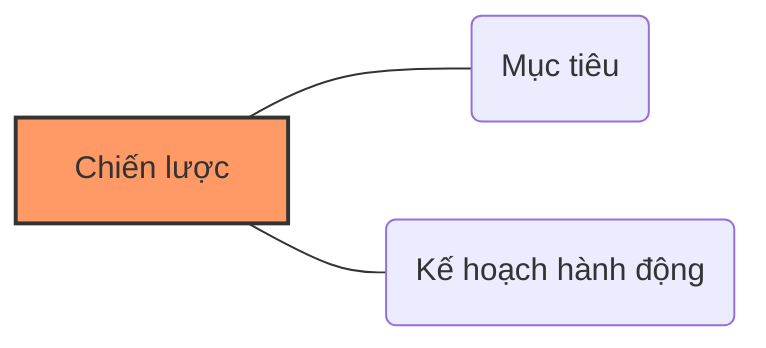

# Chương 6: Chiến lược quản lý rủi ro

## 1. Khái quát về Mục đích và Mục tiêu

Trong quản lý rủi ro An toàn thông tin (QLRR ATTT), việc phân biệt rõ giữa "Mục đích" và "Mục tiêu" là nền tảng để xây dựng chiến lược.

### 1.1. Mục đích (Purpose)
*   **Định nghĩa:** Là lý do tại sao ("the reason why") tổ chức tồn tại và thực hiện các hoạt động.
*   **Đặc điểm:**
    *   Mang tính bao quát, trừu tượng.
    *   Tầm nhìn dài hạn.
    *   Thiếu tính cụ thể về công việc phải làm.
    *   Dùng làm cơ sở biện minh cho mọi hành động.
*   **Ví dụ:** Xử lý Big Data để giúp tổ chức đưa ra quyết định sáng suốt hơn.

### 1.2. Mục tiêu (Objective)
*   **Định nghĩa:** Những gì tổ chức phải đạt được trong ngắn hạn để đáp ứng mục đích lớn hơn.
*   **Đặc điểm:** Gắn với tác nghiệp hàng ngày và phải đáp ứng tiêu chí **S.M.A.R.T**.

!!! tip "Tiêu chí S.M.A.R.T"
    *   **S - Specific:** Cụ thể, rõ ràng.
    *   **M - Measurable:** Đo lường được.
    *   **A - Achievable/Attainable:** Khả năng thực hiện được.
    *   **R - Realistic/Relevant:** Tính thực tế, liên quan.
    *   **T - Time-bound:** Giới hạn thời gian.

**Ví dụ:** Duy trì thời gian gián đoạn hệ thống không quá 2 giờ/năm; RTO không quá 30 phút.

---

## 2. Chiến lược (Strategy)

### 2.1. Định nghĩa chiến lược
Chiến lược là sự kết hợp giữa mục tiêu và kế hoạch hành động.

*   **Theo ISO 9000:** Là một kế hoạch hành động chi tiết và có hệ thống.
*   **Theo Alfred Chandler Jr:** Xác định mục tiêu dài hạn/ngắn hạn, thông qua các chính sách và phân bổ nguồn lực.
*   **Theo Harvard Business Review:** Tạo ra một vị trí độc đáo và có giá trị thông qua các hoạt động phù hợp.

### 2.2. Quy trình 9 bước thiết lập chiến lược kinh doanh
1.  Chi tiết hóa **Tầm nhìn và Sứ mạng**.
2.  Thiết lập **Mục tiêu dài hạn** (Goals).
3.  Thiết lập **Mục tiêu ngắn hạn S.M.A.R.T** (Strategic Objectives).
4.  Phân tích nội bộ (**Điểm mạnh/Điểm yếu**).
5.  Phân tích bên ngoài (**Cơ hội/Mối đe dọa**).
6.  Xác định các lựa chọn chiến lược.
7.  Lựa chọn chiến lược tối ưu.
8.  Triển khai chiến lược.
9.  Đánh giá kết quả và phản hồi.

---

## 3. Chiến lược QLRR An toàn thông tin

Chiến lược QLRR ATTT đề cập đến cách doanh nghiệp đánh giá, ứng phó và giám sát rủi ro. Có 4 chiến lược chính:

### 3.1. Chấp nhận rủi ro (Risk Acceptance)
*   **Nội dung:** Không thực hiện hành động khắc phục nào nếu rủi ro nằm trong giới hạn của **Khẩu vị rủi ro (Risk Appetite)**.
*   **Lý do:** Chi phí để ngăn chặn rủi ro lớn hơn thiệt hại mà rủi ro đó gây ra.
*   **Đặc điểm:** Ít tốn kém nhất trong ngắn hạn nhưng có thể tốn kém nhất trong dài hạn.
*   **Ví dụ:** Duy trì Windows XP cho máy tính không kết nối mạng nhạy cảm.

### 3.2. Giảm nhẹ rủi ro (Risk Mitigation)
*   **Nội dung:** Thực hiện các biện pháp kiểm soát để giảm khả năng xảy ra (**Likelihood**) hoặc mức độ ảnh hưởng (**Impact**).
*   **Ví dụ:** Đào tạo nhân viên, cài đặt tường lửa, xác thực 2 yếu tố (2FA).

### 3.3. Tránh né rủi ro (Risk Avoidance)
*   **Nội dung:** Loại bỏ hoàn toàn nguồn rủi ro hoặc ngưng các hoạt động tạo nên rủi ro.
*   **Ví dụ:** Loại bỏ hoàn toàn các ứng dụng cũ (legacy), thu hồi quyền truy cập đặc quyền vô thời hạn.

### 3.4. Chuyển giao rủi ro (Risk Transfer)
*   **Nội dung:** Chuyển một phần hoặc toàn bộ trách nhiệm/tổn thất sang bên thứ ba.
*   **Phương thức:**
    *   Mua bảo hiểm (Insurance).
    *   Hợp đồng có điều khoản bồi thường (Indemnification).
    *   Thuê ngoài (Outsourcing).
*   **Ví dụ:** Thuê IBM quản lý hạ tầng, thuê FPT gia công phần mềm.

---

# BỘ 50 CÂU HỎI TRẮC NGHIỆM CHƯƠNG 6

**Câu 1.** Theo tài liệu, "Chiến lược" được tóm tắt bằng công thức nào sau đây?

- A. Chiến lược = Tầm nhìn + Sứ mạng
- B. Chiến lược = Mục tiêu + Kế hoạch hành động
- C. Chiến lược = Nguồn lực + Thời gian
- D. Chiến lược = Rủi ro + Biện pháp kiểm soát
??? success "Đáp án: B"
    Giải thích: Xem slide 19 và slide 24. Chiến lược là sự kết hợp giữa mục tiêu mong muốn và lộ trình thực hiện.

**Câu 2.** "Lý do tại sao tổ chức tồn tại và thực hiện hoạt động ngay từ đầu" là định nghĩa của:

- A. Mục tiêu (Objective)
- B. Kế hoạch (Plan)
- C. Mục đích (Purpose)
- D. Tác nghiệp
??? success "Đáp án: C"
    Giải thích: Mục đích cung cấp cái "Why", mang tính dài hạn và bao quát (Slide 13).

**Câu 3.** Đặc điểm nào sau đây KHÔNG thuộc về "Mục đích"?

- A. Tính dài hạn
- B. Tính cụ thể, rõ ràng
- C. Tính chung chung hoặc trừu tượng
- D. Thiếu rõ ràng về công việc phải làm
??? success "Đáp án: B"
    Giải thích: Mục đích thường trừu tượng, còn tính cụ thể thuộc về Mục tiêu (Slide 9).

**Câu 4.** Tiêu chí S.M.A.R.T được dùng để đo lường tính chất của:

- A. Mục đích
- B. Tầm nhìn
- C. Mục tiêu
- D. Khẩu vị rủi ro
??? success "Đáp án: C"
    Giải thích: Mục tiêu phải đáp ứng SMART để có thể thực thi và đánh giá (Slide 10).

**Câu 5.** Trong S.M.A.R.T, chữ **"M"** viết tắt của từ gì?

- A. Management
- B. Material
- C. Measurable
- D. Mission
??? success "Đáp án: C"
    Giải thích: Measurable có nghĩa là tính đo lường được (Slide 10).

**Câu 6.** "Năm 2024, lợi nhuận trước thuế tăng 6% so với năm 2023" là ví dụ về:

- A. Mục đích
- B. Tầm nhìn
- C. Mục tiêu
- D. Sứ mạng
??? success "Đáp án: C"
    Giải thích: Đây là phát biểu cụ thể, có con số và thời gian (S.M.A.R.T) nên là mục tiêu.

**Câu 7.** Một phát biểu QLRR: "Bảo vệ các giá trị và tài sản của doanh nghiệp" được phân loại là:

- A. Mục tiêu
- B. Mục đích
- C. Kế hoạch hành động
- D. Quy trình
??? success "Đáp án: B"
    Giải thích: Đây là phát biểu bao quát, không có thời hạn hay con số đo lường cụ thể (Slide 4).

**Câu 8.** Theo ISO 9000, "Systematic" (có hệ thống) được hiểu là:

- A. Làm việc ngẫu hứng
- B. Thực hiện theo một kế hoạch hoặc hệ thống cố định
- C. Chỉ tập trung vào phần mềm
- D. Làm việc không cần quy trình
??? success "Đáp án: B"
    Giải thích: Làm việc có phương pháp và theo kế hoạch cố định (Slide 16).

**Câu 9.** Quy trình thiết lập chiến lược kinh doanh gồm bao nhiêu bước?

- A. 5 bước
- B. 7 bước
- C. 9 bước
- D. 11 bước
??? success "Đáp án: C"
    Giải thích: Slide 20 liệt kê quy trình 9 bước.

**Câu 10.** Bước thứ 4 và thứ 5 trong quy trình 9 bước thiết lập chiến lược liên quan đến hoạt động nào?

- A. Triển khai chiến lược
- B. Phân tích nội bộ và bên ngoài (Diagnostics)
- C. Phê duyệt ngân sách
- D. Tuyển dụng nhân sự
??? success "Đáp án: B"
    Giải thích: Xem slide 21. Bước 4 là chẩn đoán nội bộ, bước 5 là chẩn đoán bên ngoài.

**Câu 11.** "Chiến lược là việc tạo ra một vị trí độc đáo và có giá trị" là quan điểm của tổ chức/cá nhân nào?

- A. ISO 31000
- B. Alfred Chandler Jr
- C. Harvard Business Review
- D. Elon Musk
??? success "Đáp án: C"
    Giải thích: Xem slide 18.

**Câu 12.** Chiến lược QLRR ATTT đề cập đến những nội dung nào?

- A. Cách đánh giá rủi ro
- B. Cách ứng phó với rủi ro
- C. Cách giám sát rủi ro
- D. Tất cả các phương án trên
??? success "Đáp án: D"
    Giải thích: Xem slide 24.

**Câu 13.** Có bao nhiêu chiến lược QLRR ATTT chính được nêu trong chương này?

- A. 3
- B. 4
- C. 5
- D. 6
??? success "Đáp án: B"
    Giải thích: Bao gồm Chấp nhận, Giảm nhẹ, Tránh né và Chuyển giao (Slide 26).

**Câu 14.** Chiến lược "Chấp nhận rủi ro" (Risk Acceptance) được chọn khi nào?

- A. Khi doanh nghiệp không biết có rủi ro
- B. Khi rủi ro nằm trong giới hạn của Khẩu vị rủi ro (Risk Appetite)
- C. Khi doanh nghiệp sắp phá sản
- D. Khi hacker yêu cầu
??? success "Đáp án: B"
    Giải thích: Chấp nhận khi rủi ro nằm trong ngưỡng cho phép và không cần biện pháp ứng phó (Slide 27).

**Câu 15.** Tại sao một doanh nghiệp lại chấp nhận chi 1.000 USD cho rủi ro thay vì chi 10.000 USD để phòng ngừa?

- A. Vì họ thiếu tiền
- B. Vì chi phí chiến lược QLRR khác lớn hơn lợi ích thu lại
- C. Vì họ muốn thách thức rủi ro
- D. Vì nhân viên lười biếng
??? success "Đáp án: B"
    Giải thích: Đây là sự cân bằng giữa lợi ích và chi phí (Slide 30).

**Câu 16.** "Risk Retention" trong ngữ cảnh ATTT thường đồng nghĩa với thuật ngữ nào?

- A. Risk Transfer
- B. Risk Mitigation
- C. Risk Acceptance (Chấp nhận/Giữ lại rủi ro)
- D. Risk Avoidance
??? success "Đáp án: C"
    Giải thích: Slide 28 có đề cập: Giữ lại rủi ro khi chấp nhận nó.

**Câu 17.** Chấp nhận rủi ro thường là lựa chọn:

- A. Tốn kém nhất trong ngắn hạn
- B. Ít tốn kém nhất trong ngắn hạn nhưng có thể tốn kém nhất trong dài hạn
- C. Luôn luôn an toàn nhất
- D. Không bao giờ được sử dụng trong ngân hàng
??? success "Đáp án: B"
    Giải thích: Trong ngắn hạn không phải chi tiền xử lý, nhưng nếu sự cố xảy ra thiệt hại sẽ rất lớn (Slide 30).

**Câu 18.** Việc "Đào tạo nâng cao nhận thức ATTT cho nhân viên" thuộc chiến lược nào?

- A. Chấp nhận rủi ro
- B. Giảm nhẹ rủi ro (Risk Mitigation)
- C. Tránh né rủi ro
- D. Chuyển giao rủi ro
??? success "Đáp án: B"
    Giải thích: Đây là hành động nhằm giảm khả năng xảy ra rủi ro do con người gây ra (Slide 33).

**Câu 19.** "Cài đặt tường lửa" là biện pháp của chiến lược:

- A. Tránh né rủi ro
- B. Chuyển giao rủi ro
- C. Giảm nhẹ rủi ro
- D. Chấp nhận rủi ro
??? success "Đáp án: C"
    Giải thích: Tường lửa giúp giảm khả năng bị xâm nhập (Slide 33).

**Câu 20.** Chiến lược "Tránh né rủi ro" (Risk Avoidance) được hiểu là:

- A. Mua bảo hiểm để tránh lỗ
- B. Loại bỏ hoàn toàn các hoạt động hoặc mối nguy hiểm tạo nên rủi ro
- C. Thuê bên thứ ba làm thay
- D. Giả vờ như rủi ro không tồn tại
??? success "Đáp án: B"
    Giải thích: Tránh né là tìm cách không để rủi ro có cơ hội xuất hiện (Slide 35).

**Câu 21.** Ví dụ nào sau đây minh họa cho chiến lược "Tránh né rủi ro"?

- A. Mua bảo hiểm cháy nổ
- B. Loại bỏ quyền truy cập đặc quyền vô thời hạn
- C. Cài phần mềm diệt virus
- D. Chấp nhận dùng Windows XP
??? success "Đáp án: B"
    Giải thích: Loại bỏ nguồn gây nguy hiểm (quyền đặc quyền không kiểm soát) là tránh né (Slide 36).

**Câu 22.** Chuyển giao rủi ro (Risk Transfer) thường dựa trên cơ sở nào?

- A. Niềm tin giữa các bên
- B. Hợp đồng pháp lý
- C. Quyết định của nhân viên IT
- D. Sự may rủi
??? success "Đáp án: B"
    Giải thích: Chuyển giao rủi ro được thực hiện thông qua hợp đồng, bảo hiểm hoặc thuê ngoài (Slide 37).

**Câu 23.** "Contracts with an Indemnification Clause" là phương thức chuyển giao rủi ro bằng:

- A. Bảo hiểm
- B. Thuê ngoài (Outsourcing)
- C. Hợp đồng có điều khoản bồi thường
- D. Đào tạo nhân sự
??? success "Đáp án: C"
    Giải thích: Slide 38 liệt kê đây là 1 trong 3 phương thức chuyển giao.

**Câu 24.** Khi doanh nghiệp thuê công ty FPT gia công phần mềm, họ đang thực hiện chiến lược:

- A. Giảm nhẹ rủi ro
- B. Chấp nhận rủi ro
- C. Chuyển giao rủi ro
- D. Tránh né rủi ro
??? success "Đáp án: C"
    Giải thích: Đây là hình thức Outsourcing (Thuê ngoài) để chuyển rủi ro vận hành sang bên thứ ba (Slide 43).

**Câu 25.** Một chiến lược QLRR ATTT tốt PHẢI phù hợp với yếu tố nào?

- A. Nguyên tắc QLRR của doanh nghiệp
- B. Mục tiêu và chính sách của doanh nghiệp
- C. Tiêu chuẩn ISO 27000
- D. Tất cả các phương án trên
??? success "Đáp án: D"
    Giải thích: Xem slide 25.

**Câu 26.** S trong SMART là Specific, vậy T là gì?

- A. Technology
- B. Training
- C. Time-bound (Giới hạn thời gian)
- D. Total
??? success "Đáp án: C"
    Giải thích: Mục tiêu cần có thời hạn rõ ràng (Slide 10).

**Câu 27.** "Phản ứng nhanh chóng và hiệu quả nếu rủi ro trở thành vấn đề" là một phát biểu về:

- A. Mục tiêu cụ thể
- B. Mục đích của QLRR
- C. Kế hoạch hành động
- D. Chấp nhận rủi ro
??? success "Đáp án: B"
    Giải thích: Đây là phát biểu chung chung, thể hiện mong muốn (Slide 5).

**Câu 28.** Việc "Duy trì Windows 98/XP cho các máy tính KHÔNG kết nối mạng nhạy cảm" là ví dụ của:

- A. Giảm nhẹ rủi ro
- B. Chấp nhận rủi ro có kiểm soát
- C. Tránh né rủi ro
- D. Chuyển giao rủi ro
??? success "Đáp án: B"
    Giải thích: Doanh nghiệp chấp nhận rủi ro từ hệ điều hành cũ vì đã phân tách mạng để hạn chế tác động (Slide 31).

**Câu 29.** "Xác thực 2 yếu tố (2FA) cho giao dịch thanh toán" thuộc về:

- A. Chấp nhận rủi ro
- B. Giảm nhẹ rủi ro
- C. Tránh né rủi ro
- D. Chuyển giao rủi ro
??? success "Đáp án: B"
    Giải thích: Đây là biện pháp kỹ thuật để giảm khả năng bị chiếm đoạt tài khoản (Slide 33).

**Câu 30.** Mục đích của việc đánh giá kết quả (bước 9) trong chiến lược kinh doanh là gì?

- A. Để kết thúc dự án
- B. Để có phản hồi (Feedback) nhằm điều chỉnh các bước trước đó
- C. Để sa thải nhân viên làm kém
- D. Để khoe với cổ đông
??? success "Đáp án: B"
    Giải thích: Quy trình là một vòng lặp, kết quả đánh giá giúp cải thiện các bước từ tầm nhìn đến triển khai (Slide 23).

**Câu 31.** "Risk Mitigation" tập trung vào việc thay đổi yếu tố nào của rủi ro?

- A. Chỉ thay đổi khả năng xảy ra (Likelihood)
- B. Chỉ thay đổi hệ quả (Impact)
- C. Thay đổi cả khả năng xảy ra và hệ quả
- D. Không thay đổi gì, chỉ theo dõi
??? success "Đáp án: C"
    Giải thích: Giảm nhẹ có thể nhắm vào xác suất hoặc mức độ ảnh hưởng hoặc cả hai (Slide 32).

**Câu 32.** Khi một khách hàng kiện McDonald's vì bị bỏng cà phê, rủi ro mà cửa hàng đối mặt là:

- A. Rủi ro tài chính (bồi thường)
- B. Rủi ro danh tiếng
- C. Cả A và B
- D. Không có rủi ro nào
??? success "Đáp án: C"
    Giải thích: Doanh nghiệp vừa mất tiền vừa mất uy tín (Slide 13).

**Câu 33.** Biện pháp "Yêu cầu khách ký giấy cam kết tự chịu trách nhiệm khi mang cà phê nóng ra ngoài" thuộc chiến lược:

- A. Giảm nhẹ rủi ro
- B. Tránh né rủi ro
- C. Chuyển giao rủi ro (về mặt trách nhiệm)
- D. Chấp nhận rủi ro
??? success "Đáp án: C"
    Giải thích: Chuyển trách nhiệm pháp lý sang cho khách hàng (Slide 13/37).

**Câu 34.** Alfred Chandler Jr định nghĩa chiến lược là việc xác định mục tiêu và:

- A. Thuê thêm chuyên gia
- B. Phân bổ nguồn lực để đạt được mục tiêu đó
- C. Trốn tránh đối thủ cạnh tranh
- D. Tăng giá bán sản phẩm
??? success "Đáp án: B"
    Giải thích: Xem slide 17.

**Câu 35.** Trong quản lý rủi ro, yếu tố nào giúp "chứng minh kết quả là điều mong muốn trong dài hạn"?

- A. Mục tiêu S.M.A.R.T
- B. Mục đích (Purpose)
- C. Ngân sách
- D. Tường lửa
??? success "Đáp án: B"
    Giải thích: Mục đích là cái đích đến cuối cùng trong dài hạn (Slide 9).

**Câu 36.** Một doanh nghiệp muốn tập trung vào kinh doanh cốt lõi nên chuyển các hoạt động phụ trợ cho bên thứ ba. Đây là lý do của chiến lược:

- A. Tránh né
- B. Chấp nhận
- C. Chuyển giao (Outsourcing)
- D. Giảm nhẹ
??? success "Đáp án: C"
    Giải thích: Chuyển giao rủi ro giúp tổ chức tập trung vào thế mạnh cốt lõi (Slide 42).

**Câu 37.** "Đảm bảo doanh nghiệp hoạt động liên tục khi đối mặt với sự không chắc chắn" là một:

- A. Mục tiêu
- B. Mục đích
- C. Chiến lược tránh né
- D. Quy trình vận hành
??? success "Đáp án: B"
    Giải thích: Phát biểu chung chung về khả năng phục hồi (Slide 5).

**Câu 41.** RTO (Recovery Time Objective) là một chỉ số thuộc về:

- A. Mục đích
- B. Mục tiêu
- C. Tầm nhìn
- D. Sứ mạng
??? success "Đáp án: B"
    Giải thích: RTO có con số và thời gian cụ thể (ví dụ: < 30 phút) nên là mục tiêu (Slide 6/13).

**Câu 42.** Phân tích rủi ro trước khi mua sản phẩm/dịch vụ của bên thứ ba là ví dụ của chiến lược:

- A. Chấp nhận
- B. Chuyển giao
- C. Tránh né rủi ro
- D. Giảm nhẹ
??? success "Đáp án: C"
    Giải thích: Nếu thấy rủi ro quá cao từ bên thứ ba, doanh nghiệp có thể từ chối mua để tránh hoàn toàn rủi ro đó (Slide 36).

**Câu 43.** Bảo hiểm (Insurance) giúp doanh nghiệp chuyển giao rủi ro nào?

- A. Rủi ro vận hành kỹ thuật
- B. Tác động tài chính của rủi ro
- C. Rủi ro về danh tiếng
- D. Rủi ro về lòng trung thành của nhân viên
??? success "Đáp án: B"
    Giải thích: Bảo hiểm chi trả thiệt hại tài chính khi sự cố xảy ra (Slide 41).

**Câu 44.** Theo Harvard Business Review, sự phù hợp (fit) giữa các hoạt động của công ty tạo nên:

- A. Một chiến lược
- B. Một sản phẩm giá rẻ
- C. Một bộ quy tắc đạo đức
- D. Một mạng máy tính
??? success "Đáp án: A"
    Giải thích: Chiến lược bao gồm một loạt hoạt động và sự khớp nối giữa chúng (Slide 18).

**Câu 45.** "Phát triển các sản phẩm, bằng sáng chế mới thay vì chỉ dựa vào lý thuyết" là cách để:

- A. Tiết kiệm tiền
- B. Liên kết trình độ học vấn với giá trị thực tế (Alignment)
- C. Tránh né rủi ro học thuật
- D. Quảng bá thương hiệu
??? success "Đáp án: B"
    Giải thích: Ví dụ về luật giáo dục Trung Quốc 2024 trong slide 14.

**Câu 46.** Chiến lược QLRR "Giảm nhẹ" thường tác động vào:

- A. Nguồn rủi ro
- B. Khả năng xảy ra hoặc Hệ quả
- C. Ý kiến của cổ đông
- D. Giá cổ phiếu
??? success "Đáp án: B"
    Giải thích: Xem slide 32.

**Câu 47.** "Loại bỏ các ứng dụng cũ (legacy)" là hành động thuộc chiến lược:

- A. Chấp nhận
- B. Giảm nhẹ
- C. Tránh né
- D. Chuyển giao
??? success "Đáp án: C"
    Giải thích: Loại bỏ nguồn gây rủi ro hoàn toàn (Slide 36).

**Câu 48.** Theo slide 13, Mục đích được dùng để:

- A. Tính toán lương
- B. Làm cơ sở và biện minh cho mọi hành động được thực hiện
- C. Cấu hình router
- D. Viết mã phần mềm
??? success "Đáp án: B"

**Câu 49.** Thuật ngữ "Indemnification Clause" trong hợp đồng có nghĩa là gì?

- A. Điều khoản bảo mật
- B. Điều khoản bồi thường
- C. Điều khoản chấm dứt hợp đồng
- D. Điều khoản khuyến mãi
??? success "Đáp án: B"
    Giải thích: Slide 38.

**Câu 50.** Tầm nhìn (Vision) và Sứ mạng (Mission) nằm ở bước nào trong quy trình thiết lập chiến lược?

- A. Bước 1
- B. Bước 5
- C. Bước 9
- D. Không nằm trong quy trình
??? success "Đáp án: A"
    Giải thích: Đây là điểm xuất phát của mọi chiến lược (Slide 20/23).

---
Hy vọng bộ câu hỏi này giúp bạn ôn tập tốt!
