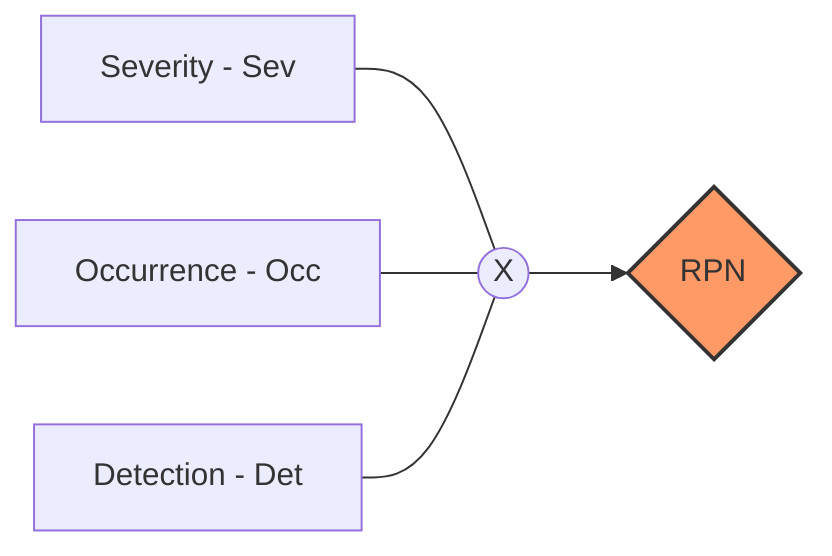

# Chương 7: Triển khai phương pháp FMEA / FMECA cho QLRR

## 1. Khái quát về FMEA

### 1.1. Định nghĩa
**FMEA** là viết tắt của **Failure Mode and Effects Analysis** (Phân tích phương thức lỗi và ảnh hưởng của lỗi).

!!! info "Giải thích thuật ngữ"
    *   **Failure (Lỗi/Thất bại):** Tình huống cái gì đó không làm việc hoặc ngừng làm việc, hoặc ai đó thất bại.
    *   **Mode (Phương thức/Dạng):** Cách thức mà lỗi xảy ra (ví dụ: trong tập dữ liệu {2, 4, 5, 5}, mode là 5 vì xuất hiện nhiều nhất).
    *   **Effects Analysis (Phân tích tác động):** Nghiên cứu sự thay đổi, hậu quả hoặc kết quả sinh ra khi lỗi xảy ra.

### 1.2. Mục đích và Lợi ích
*   **Mục đích:** Xác định các phương thức lỗi tiềm ẩn thường xảy ra nhất và các tác động liên quan để xếp hạng ưu tiên xử lý.
*   **Lợi ích:** Nhận diện vấn đề trước khi chúng xảy ra, thực hiện sớm các biện pháp phòng ngừa (`control`), cải thiện chất lượng sản phẩm/dịch vụ.

---

## 2. Chỉ số RPN và các yếu tố cấu thành

Trong FMEA, rủi ro được định lượng thông qua **Số ưu tiên rủi ro (Risk Priority Number - RPN)**.

### 2.1. Công thức tính RPN

**Công thức:** $RPN = Severity \times Occurrence \times Detection$

### 2.2. Ý nghĩa 3 thành phần
1.  **Severity (Sev - Mức độ nghiêm trọng):** Đo lường mức độ tồi tệ nếu rủi ro xảy ra. (1: Không đáng kể $\rightarrow$ 5: Thảm khốc).
2.  **Occurrence (Occ - Khả năng xảy ra):** Xác suất rủi ro xảy ra do nguyên nhân đó. (1: Rất hiếm $\rightarrow$ 5: Gần như chắc chắn).
3.  **Detection (Det - Khả năng phát hiện):** Đánh giá khả năng các biện pháp kiểm soát hiện tại phát hiện ra lỗi trước khi nó đến tay khách hàng. 
    *   **Lưu ý:** Điểm Det càng **cao** thì khả năng phát hiện càng **thấp** (5: Không thể phát hiện).

### 2.3. Ngưỡng RPN (Threshold RPN)
Là mức RPN tối đa mà rủi ro được coi là chấp nhận được. Nếu vượt ngưỡng (ví dụ > 50 trên thang 1000), rủi ro được coi là **RỦI RO CAO** và cần kế hoạch hành động.

---

## 3. FMECA (Failure Mode, Effects and Criticality Analysis)

FMECA là bước mở rộng của FMEA bằng cách bổ sung thêm phân tích **Criticality (Tính tới hạn)**.

!!! abstract "Sự khác biệt giữa FMEA và FMECA"
    *   **FMECA** đi sâu vào chi tiết hơn và cung cấp kết quả chính xác hơn về mức độ nghiêm trọng tới hạn.
    *   **FMECA** cung cấp cả thông tin định tính và định lượng.
    *   **Criticality** thường được tính bằng: $Criticality = Severity \times Occurrence$.

---

## 4. Quy trình triển khai FMEA (12 Bước)

Quy trình thực hiện theo trình tự thời gian và trách nhiệm cụ thể:
1.  **Bước 1:** Nhập tên bước/hoạt động.
2.  **Bước 2:** Ghi ra các 'mode' lỗi (rủi ro tiềm ẩn).
3.  **Bước 3:** Tìm nguyên nhân gốc rễ (**Root Cause** - giống như tìm dấu vân tay).
4.  **Bước 4 - 7:** Đánh giá điểm Occ, Sev, Det.
5.  **Bước 8:** Tính RPN.
6.  **Bước 9:** Xác định biện pháp kiểm soát hiện hữu.
7.  **Bước 10:** Chỉ định người chịu trách nhiệm và ngày hoàn thành.
8.  **Bước 11 - 12:** Tính lại RPN mới sau khi cải tiến.

!!! note "Công cụ hỗ trợ tìm nguyên nhân"
    *   **Exception (Ngoại lệ):** Trong lập trình, là sự kiện gián đoạn luồng lệnh bình thường.
    *   **Stack Traces (Dấu vết ngăn xếp):** Giúp xác định chính xác "where and how" vấn đề phát sinh. Dòng cuối cùng (`Caused by`) thường chứa nguyên nhân gốc rễ.

---

# BỘ 50 CÂU HỎI TRẮC NGHIỆM CHƯƠNG 7

**Câu 1. FMEA là viết tắt của cụm từ nào?**

- A. Failure Mode and Environment Analysis
- B. Failure Mode and Effects Analysis
- C. Future Model and Efficiency Analysis
- D. Financial Management and Evaluation Association
??? success "Đáp án: B"
    Giải thích: Failure Mode and Effects Analysis (Phân tích phương thức lỗi và ảnh hưởng của lỗi).

**Câu 2. "Mode" trong FMEA nên được hiểu như thế nào?**

- A. Là một trạng thái hiện đại của hệ thống
- B. Là dạng lỗi hoặc cách thức lỗi xuất hiện thường xuyên nhất
- C. Là một mô hình giả lập rủi ro
- D. Là tên một phần mềm quản lý
??? success "Đáp án: B"
    Giải thích: Slide 4 giải thích "mode" là giá trị xuất hiện thường xuyên nhất trong tập dữ liệu.

**Câu 3. Phương pháp FMEA được phát triển đầu tiên ở đâu và khi nào?**

- A. Tại Đức năm 1950
- B. Tại Mỹ năm 1940
- C. Tại Nhật năm 1960
- D. Tại Anh năm 1970
??? success "Đáp án: B"
    Giải thích: Theo slide 6, FMEA được phát triển ở Mỹ từ những năm 1940.

**Câu 4. Thành phần "Detection" (Det) trong công thức RPN có nghĩa là gì?**

- A. Khả năng ngăn chặn hoàn toàn rủi ro
- B. Khả năng phát hiện ra lỗi trước khi nó gây ra tác động cho khách hàng
- C. Tốc độ sửa lỗi của nhân viên IT
- D. Khả năng tấn công của hacker
??? success "Đáp án: B"
    Giải thích: Đánh giá khả năng nhận biết vấn đề của các biện pháp kiểm soát hiện tại (Slide 22).

**Câu 5. Công thức tính Số ưu tiên rủi ro (RPN) là:**

- A. RPN = Sev + Occ + Det
- B. RPN = Sev x Occ
- C. RPN = Sev x Occ x Det
- D. RPN = (Sev x Occ) / Det
??? success "Đáp án: C"
    Giải thích: RPN là tích của 3 yếu tố: Mức độ nghiêm trọng, Khả năng xảy ra và Khả năng phát hiện (Slide 25).

**Câu 6. Trong thang điểm 1-5 của Detection, điểm 5 có nghĩa là gì?**

- A. Chắc chắn phát hiện được rủi ro
- B. Khả năng phát hiện rủi ro là trung bình
- C. Hoàn toàn không thể phát hiện được rủi ro (Absolute Uncertainty)
- D. Rủi ro đã được xử lý xong
??? success "Đáp án: C"
    Giải thích: Điểm Det càng cao thì khả năng phát hiện càng thấp (Slide 43).

**Câu 7. "Criticality" trong FMECA thường được tính bằng tích của những yếu tố nào?**

- A. Severity x Detection
- B. Occurrence x Detection
- C. Severity x Occurrence
- D. RPN x 2
??? success "Đáp án: C"
    Giải thích: Criticality (Mức độ tới hạn) tập trung vào mức độ nghiêm trọng và khả năng xảy ra (Slide 74).

**Câu 8. Sự khác biệt chính giữa FMECA và FMEA là gì?**

- A. FMECA rẻ hơn FMEA
- B. FMECA bổ sung thêm phân tích mức độ tới hạn (Criticality)
- C. FMEA chỉ dùng cho phần mềm, FMECA dùng cho phần cứng
- D. FMEA ra đời sau FMECA
??? success "Đáp án: B"
    Giải thích: FMECA đi sâu vào chi tiết mức độ nghiêm trọng và xếp hạng tới hạn (Slide 70).

**Câu 9. Một rủi ro có Sev=5, Occ=4, Det=1. Chỉ số RPN là bao nhiêu?**

- A. 10
- B. 20
- C. 9
- D. 25
??? success "Đáp án: B"
    Giải thích: 5 x 4 x 1 = 20.

**Câu 10. Tại sao hiện nay FMECA trở nên ít cần thiết hơn so với trước đây?**

- A. Vì rủi ro không còn nghiêm trọng
- B. Vì các mẫu (template) FMEA hiện đại đã được tích hợp thêm các yếu tố phân tích của FMECA
- C. Vì FMECA quá khó thực hiện
- D. Vì tiêu chuẩn ISO đã bãi bỏ FMECA
??? success "Đáp án: B"
    Giải thích: Các mẫu FMEA ngày nay đã phát triển và bổ sung đầy đủ hơn (Slide 73).

**Câu 11. "Caused by" trong một Stack Trace giúp ích gì cho người quản lý rủi ro?**

- A. Biết được ai là người làm sai để phạt
- B. Xác định Exception đầu tiên - chính là nguyên nhân gốc rễ (Root Cause)
- C. Tính toán thời gian hệ thống bị treo
- D. Xóa nhật ký lỗi
??? success "Đáp án: B"
    Giải thích: Phần "Caused by" cuối cùng chỉ ra vấn đề gốc rễ gây ra chuỗi lỗi (Slide 52-54).

**Câu 12. Trong lĩnh vực CNTT, rủi ro "Mật khẩu yếu" thuộc phương thức lỗi (Failure mode) nào?**

- A. Lỗi phần cứng
- B. Lỗi mạng
- C. Lỗi bảo mật / ATTT (Security Failures)
- D. Lỗi do thiên tai
??? success "Đáp án: C"
    Giải thích: Xem slide 15.

**Câu 13. Một rủi ro được coi là "RỦI RO CAO" khi nào?**

- A. Khi nhân viên cảm thấy lo lắng
- B. Khi chỉ số RPN vượt quá ngưỡng (Threshold) quy định
- C. Khi rủi ro đó do hacker thực hiện
- D. Khi rủi ro gây thiệt hại dưới 1 triệu đồng
??? success "Đáp án: B"
    Giải thích: Ngưỡng RPN do doanh nghiệp quy định để phân loại mức độ ưu tiên (Slide 26).

**Câu 14. "Action Priority" (AP) khác RPN ở điểm nào?**

- A. AP không dùng phép nhân
- B. AP nhấn mạnh vào Mức độ nghiêm trọng (Severity) trước tiên
- C. AP chỉ dùng cho rủi ro tài chính
- D. AP không yêu cầu khả năng phát hiện
??? success "Đáp án: B"
    Giải thích: AP ưu tiên kiểm soát mức độ nghiêm trọng trước, sau đó mới đến Occ và Det (Slide 29-30).

**Câu 15. Ký hiệu "oval" (trái xoan) trong lưu đồ quy trình FMEA dùng để chỉ:**

- A. Một bước thực hiện
- B. Một điểm quyết định
- C. Bước bắt đầu và bước kết thúc
- D. Dữ liệu đầu vào
??? success "Đáp án: C"
    Giải thích: Xem slide 16.

**Câu 16. "Root Cause Analysis" trong FMEA được so sánh với hành động nào của cảnh sát?**

- A. Chụp ảnh hiện trường
- B. Lấy lời khai
- C. Tìm dấu vân tay (fingerprint) hoặc dấu chân (footprint)
- D. Bắt giam tội phạm
??? success "Đáp án: C"
    Giải thích: Tìm nguyên nhân gốc rễ giống như tìm bằng chứng pháp y để lại (Slide 47-48).

**Câu 17. Trong lập trình, một "Exception" (ngoại lệ) có được coi là một rủi ro không?**

- A. Không, nó chỉ là một thông báo bình thường
- B. Có, vì nó đại diện cho một sự kiện không mong muốn làm gián đoạn quy trình
- C. Chỉ khi nào chương trình bị xóa mới là rủi ro
- D. Không, vì lập trình viên có thể sửa được ngay
??? success "Đáp án: B"
    Giải thích: Exception gây gián đoạn luồng lệnh bình thường và có khả năng gây sự cố (Slide 50).

**Câu 18. Phương pháp FMEA nên được áp dụng ở giai đoạn nào của một sản phẩm/dịch vụ?**

- A. Chỉ khi sản phẩm đã hỏng
- B. Ngay từ giai đoạn thiết kế (Design)
- C. Khi khách hàng phàn nàn
- D. Sau khi dự án kết thúc
??? success "Đáp án: B"
    Giải thích: Sử dụng trong thiết kế để ngăn ngừa lỗi sớm (Slide 31).

**Câu 19. Nếu một rủi ro có khả năng xảy ra là "Rare" (Hiếm có), điểm Occ tương ứng thường là:**

- A. 1
- B. 3
- C. 5
- D. 10
??? success "Đáp án: A"
    Giải thích: Thang điểm 1 là tốt nhất/thấp nhất (Slide 39, 56).

**Câu 20. Khi thực hiện FMEA, nếu một rủi ro có nhiều tác động khác nhau, ta nên ghi điểm Severity như thế nào?**

- A. Ghi điểm trung bình cộng
- B. Chỉ ghi mức độ tác động cao nhất
- C. Ghi điểm thấp nhất để giảm lo lắng
- D. Không ghi điểm nào
??? success "Đáp án: B"
    Giải thích: Luôn chọn mức độ tồi tệ nhất để cảnh báo (Slide 58).

**Câu 21. Bước 12 của quy trình FMEA yêu cầu ghi "Có" ở cột số (15) khi nào?**

- A. Khi muốn xóa rủi ro
- B. Để duy trì biện pháp kiểm soát hiện hữu
- C. Khi rủi ro đã xảy ra
- D. Khi không có ai chịu trách nhiệm
??? success "Đáp án: B"
    Giải thích: Xem slide 67.

**Câu 22. Một "Action Plan" (Kế hoạch hành động) cần đáp ứng cấu trúc nào?**

- A. CIA
- B. S.M.A.R.T
- C. 5W1H
- D. OSI
??? success "Đáp án: C"
    Giải thích: Kế hoạch hành động chi tiết cần xác định Who, What, Why, Where, When, How (Slide 65).

**Câu 23. Trong CNTT, "Lỗi do sai sót của con người" (Human error) bao gồm ví dụ nào?**

- A. Ổ cứng bị cháy
- B. Xóa nhầm tập tin quan trọng
- C. Đứt cáp quang biển
- D. Lỗi tương thích hệ điều hành
??? success "Đáp án: B"
    Giải thích: Xem slide 15.

**Câu 24. "Criticality" đo lường giá trị trong khoảng nào nếu dùng thang điểm 1-5?**

- A. 1 đến 10
- B. 1 đến 25
- C. 1 đến 100
- D. 1 đến 125
??? success "Đáp án: B"
    Giải thích: $5 (Sev) \times 5 (Occ) = 25$ (Slide 76).

**Câu 25. "Stack trace" là công cụ dùng để:**

- A. Diệt virus
- B. Gỡ lỗi (debugging) và xác định vị trí, cách thức lỗi phát sinh trong mã nguồn
- C. Tăng tốc độ mạng
- D. Sao lưu dữ liệu
??? success "Đáp án: B"
    Giải thích: Xem slide 51.

**Câu 26. Trong phân tích FMEA, việc tập hợp một "nhóm đa chức năng" nhằm mục đích gì?**

- A. Để chia sẻ chi phí
- B. Để có kiến thức đa dạng về quy trình, sản phẩm và ATTT
- C. Để tìm người chịu trách nhiệm kỷ luật
- D. Để làm báo cáo dài hơn
??? success "Đáp án: B"
    Giải thích: Xem slide 34.

**Câu 27. RPN dao động trong khoảng nào nếu cả 3 biến số Sev, Occ, Det đều được xếp hạng từ 1 đến 5?**

- A. 1 đến 15
- B. 1 đến 25
- C. 1 đến 125
- D. 1 đến 1000
??? success "Đáp án: C"
    Giải thích: $5 \times 5 \times 5 = 125$ (Slide 25, 63).

**Câu 28. "Severity" 1 trong thang điểm đánh giá ảnh hưởng có nghĩa là:**

- A. Thảm họa
- B. Nghiêm trọng
- C. Không đáng kể (Insignificant)
- D. Rất hiếm
??? success "Đáp án: C"
    Giải thích: Xem slide 59.

**Câu 29. "Failure Mode" tập trung vào yếu tố nào của lỗi?**

- A. Giá tiền của thiết bị bị hỏng
- B. Cách thức (way) hoặc nguyên nhân (cause) mà lỗi xảy ra
- C. Tên của nhân viên làm lỗi
- D. Ngày tháng năm xảy ra lỗi
??? success "Đáp án: B"
    Giải thích: Xem slide 14.

**Câu 30. Một hệ thống có khả năng phát hiện lỗi cực kỳ tốt (chắc chắn phát hiện được) thì điểm Detection là bao nhiêu?**

- A. 1
- B. 3
- C. 5
- D. 10
??? success "Đáp án: A"
    Giải thích: Điểm thấp nhất thể hiện rủi ro thấp nhất (khả năng phát hiện cao nhất) - Slide 43, 61.

**Câu 31. Việc "định kỳ phân tích lỗi trong suốt vòng đời sản phẩm" là một nội dung của:**

- A. Thiết lập bối cảnh
- B. Sử dụng FMEA cho cải tiến liên tục
- C. Chấp nhận rủi ro
- D. Chuyển giao rủi ro
??? success "Đáp án: B"
    Giải thích: Xem slide 33.

**Câu 32. Ngưỡng RPN được mở rộng (ví dụ từ 5% lên 15%) khi nào?**

- A. Khi doanh nghiệp hết tiền
- B. Khi doanh nghiệp được kiểm soát tốt và có ít rủi ro cao
- C. Khi có quá nhiều lỗi xảy ra
- D. Khi sếp yêu cầu
??? success "Đáp án: B"
    Giải thích: Để tập trung nguồn lực giải quyết các rủi ro thấp hơn (Slide 27).

**Câu 33. "AP không phải là việc ưu tiên rủi ro, mà là việc ưu tiên nhu cầu hành động". Câu này Đúng hay Sai?**

- A. Đúng
- B. Sai
??? success "Đáp án: A"
    Giải thích: AP = Action Priority (Slide 30).

**Câu 34. Trong cơ khí, lỗi "Corrosion" có nghĩa là gì?**

- A. Sự quátải
- B. Sự ăn mòn kim loại do hóa học
- C. Sự mỏi của cấu trúc
- D. Sự xói mòn do cơ học
??? success "Đáp án: B"
    Giải thích: Xem slide 16.

**Câu 35. "Erosion" trong cơ khí thường do tác động nào?**

- A. Tác động hóa học
- B. Tác động cơ học (dòng chất lỏng, gió thổi vận tốc cao)
- C. Nhiệt độ quá cao
- D. Độ ẩm thấp
??? success "Đáp án: B"
    Giải thích: Xem slide 16.

**Câu 36. Phương pháp tiếp cận "Bottom-Up" trong FMECA nghĩa là:**

- A. Phân tích từ cấp lãnh đạo xuống nhân viên
- B. Phân tích rủi ro từng thành phần từ cấp độ thấp nhất trở lên
- C. Chỉ phân tích các lỗi phần mềm
- D. Bỏ qua các lỗi nhỏ
??? success "Đáp án: B"
    Giải thích: Xem slide 72.

**Câu 37. Theo slide 11, ví dụ về rủi ro số 4: "Ngân hàng có thể bị ngừng hoạt động vì không có kế hoạch kinh doanh liên tục" tương ứng với điều khoản nào của ISO 27001?**

- A. A.5.1.2
- B. A.8.1.1
- C. A.10.1.1
- D. A.17.1.1
??? success "Đáp án: D"
    Giải thích: Nhóm A.17 liên quan đến tính liên tục của doanh nghiệp.

**Câu 38. Tại Bước 8 của quy trình FMEA, RPN được tính nhằm mục đích gì?**

- A. Để tính lương thưởng
- B. Để xếp hạng các rủi ro tiềm ẩn theo thứ tự ưu tiên
- C. Để báo cáo với cơ quan thuế
- D. Để xóa nhật ký hệ thống
??? success "Đáp án: B"
    Giải thích: Xem slide 62.

**Câu 39. Exception "Chia cho 0" trong lập trình có khả năng gây ra hệ quả gì?**

- A. Tăng tốc độ máy tính
- B. Sự cố chương trình hoặc lỗi bảo mật
- C. Máy tính tự động sao lưu
- D. Không có ảnh hưởng gì
??? success "Đáp án: B"
    Giải thích: Xem slide 49.

**Câu 40. "Mức độ tồi tệ có thể xảy ra nếu một rủi ro cụ thể xảy ra" là định nghĩa của:**

- A. Occurrence
- B. Severity (Mức độ nghiêm trọng)
- C. Detection
- D. Criticality
??? success "Đáp án: B"
    Giải thích: Xem slide 20.

**Câu 41. Theo slide 13, rủi ro có thể là:**

- A. Chỉ là rủi ro thực tế (actual)
- B. Chỉ là rủi ro tiềm ẩn (potential)
- C. Có thể là tiềm ẩn hoặc thực tế
- D. Luôn luôn là lỗi do hacker
??? success "Đáp án: C"
    Giải thích: Lỗi (Failure) có thể là potential or actual.

**Câu 42. "Dòng Caused by ở vị trí thấp nhất chính là nguyên nhân gốc rễ". Đây là quy tắc khi đọc:**

- A. Báo cáo tài chính
- B. Stack traces (Dấu vết ngăn xếp)
- C. Hợp đồng bảo hiểm
- D. Quy trình ISO
??? success "Đáp án: B"
    Giải thích: Xem slide 53-54.

**Câu 43. Việc "xác định ranh giới nhận diện rủi ro" nằm ở bước nào của FMEA?**

- A. Bước 1
- B. Xác định phạm vi (Scope)
- C. Tính RPN
- D. Cải tiến
??? success "Đáp án: B"
    Giải thích: Xem slide 44.

**Câu 44. "Lỗi liên quan đến sự mỏi của kim loại" (Fatigue) xảy ra do:**

- A. Kim loại bị nóng chảy
- B. Ứng suất hoặc tải trọng lặp đi lặp lại làm yếu cấu trúc
- C. Axit ăn mòn
- D. Va chạm mạnh 1 lần duy nhất
??? success "Đáp án: B"
    Giải thích: Xem slide 16.

**Câu 45. Trong ví dụ về Stack Trace, lệnh gọi nào là "root issue" (vấn đề gốc)?**

- A. main
- B. ServiceException
- C. dbCall (gọi cơ sở dữ liệu)
- D. Author.getBookTitles
??? success "Đáp án: C"
    Giải thích: Xem slide 54.

**Câu 46. Tại sao điểm Detection lại tỉ lệ nghịch với khả năng phát hiện?**

- A. Do sai sót trong thiết kế FMEA
- B. Vì điểm cao đại diện cho mức rủi ro cao (khả năng phát hiện kém = rủi ro cao)
- C. Để làm khó người sử dụng
- D. Do quy định của chính phủ Mỹ
??? success "Đáp án: B"
    Giải thích: Tất cả các chỉ số rủi ro đều quy định điểm cao = rủi ro cao để đồng nhất khi nhân lại (Slide 43).

**Câu 47. "Xếp hạng rủi ro giúp xác định lượng nguồn lực cần áp dụng". Nếu nguồn lực ít, ta nên xử lý các rủi ro có vị trí như thế nào trong danh sách xếp hạng theo RPN?**

- A. Ở cuối danh sách (RPN thấp)
- B. Ở đầu danh sách (RPN cao nhất)
- C. Ở giữa danh sách
- D. Ngẫu nhiên
??? success "Đáp án: B"
    Giải thích: Phải ưu tiên rủi ro nguy hiểm nhất khi nguồn lực có hạn (Slide 27).

**Câu 48. FMEA được coi là một công cụ phân tích:**

- A. Tài chính
- B. Nhân sự
- C. Quy trình (Process)
- D. Thị trường
??? success "Đáp án: C"
    Giải thích: Xem slide 6.

**Câu 49. Kết quả của "Effects Analysis" có thể bao gồm:**

- A. Sự thay đổi (change)
- B. Hậu quả (consequence)
- C. Kết quả (result)
- D. Tất cả các phương án trên
??? success "Đáp án: D"
    Giải thích: Xem slide 17.

**Câu 50. Câu nói "Nếu bạn không thể đo lường, bạn không thể cải tiến" nhằm nhấn mạnh tầm quan trọng của việc gì trong QLRR?**

- A. Mua sắm thiết bị đo đạc
- B. Tạo ra các giá trị định lượng để quản lý và kiểm soát
- C. Thuê thêm nhân viên kế toán
- D. Đọc thật nhiều sách
??? success "Đáp án: B"
    Giải thích: Slide 43 nhấn mạnh chuỗi logic: Đo lường -> Phân tích -> Quản lý -> Kiểm soát -> Cải tiến.

---
Hy vọng nội dung này hữu ích cho việc học tập và ôn luyện của bạn!
