# Chương 8: Kế hoạch kinh doanh liên tục (Business Continuity Plan)

## 1. Khái quát về Kinh doanh liên tục

### 1.1. Các định nghĩa cốt lõi (ISO 22301:2019)

!!! info "Kinh doanh liên tục (Business Continuity)"
    Là khả năng của một tổ chức để tiếp tục cung cấp sản phẩm và dịch vụ trong khung thời gian có thể chấp nhận được với năng lực được xác định trước trong thời gian gián đoạn.

!!! note "Kế hoạch kinh doanh liên tục (BCP)"
    Là thông tin dạng văn bản hướng dẫn tổ chức ứng phó với sự gián đoạn và thực hiện khôi phục, phục hồi việc cung cấp sản phẩm/dịch vụ phù hợp với mục tiêu đã định.

!!! abstract "Hệ thống quản lý kinh doanh liên tục (BCMS)"
    Là một phương pháp chủ động và toàn diện giúp doanh nghiệp xác định và quản lý những rủi ro có thể làm gián đoạn hoạt động, trang bị các công cụ và quy trình để điều hướng các tình huống khẩn cấp.

### 1.2. Mối quan hệ với ISO 27001
Trong tiêu chuẩn ISO 27001:2013, khía cạnh này nằm ở **Nhóm A.17**:
*   **A.17.1.1:** Lập kế hoạch tính liên tục của ATTT.
*   **A.17.1.2:** Triển khai tính liên tục của ATTT.
*   **A.17.1.3:** Kiểm tra, xem xét và đánh giá tính liên tục của ATTT.

---

## 2. Các chỉ số đo lường trong BCP

Việc thiết lập BCP dựa trên các cột mốc thời gian quan trọng:

```mermaid
gantt
    title Biểu đồ thời gian phục hồi (RPO, RTO, WRT, MTD)
    dateFormat  HH:mm
    axisFormat %H:%M
    section Trước sự cố
    Sao lưu cuối cùng      :active, p1, 00:00, 02:00
section Sự cố
    Thời điểm xảy ra rủi ro :milestone, m1, 02:00, 00:00
    section Phục hồi
    Khôi phục tạm thời (RTO) :crit, r1, 02:00, 04:00
    Đưa vào vận hành (WRT) :r2, 04:00, 06:00
```

| Chỉ số | Tên đầy đủ | Ý nghĩa |
| :--- | :--- | :--- |
| **RPO** | Recovery Point Objective | Mục tiêu điểm phục hồi: Lượng dữ liệu tối đa chấp nhận bị mất (tính từ lần backup cuối). |
| **RTO** | Recovery Time Objective | Mục tiêu thời gian phục hồi: Thời gian tối đa cho phép để khôi phục dịch vụ tạm thời. |
| **WRT** | Work Recovery Time | Thời gian phục hồi công việc: Thời gian cần để đưa hệ thống từ trạng thái khôi phục về trạng thái hoạt động bình thường. |
| **MTD** | Maximum Tolerable Downtime | Thời gian ngừng hoạt động tối đa cho phép: **MTD = RTO + WRT**. |

---

## 3. Quy trình 14 bước lập Kế hoạch kinh doanh liên tục

Doanh nghiệp triển khai BCP theo trình tự logic sau:

1.  **Xác định phạm vi thực hiện.**
2.  **Xác định bối cảnh hoạt động.**
3.  **Thu thập dữ liệu và thông tin.**
4.  **Xác định các quy trình trọng yếu.**
5.  **Phân tích tác động kinh doanh (BIA - Business Impact Analysis).**
6.  Trình phê duyệt tài liệu BIA.
7.  **Đánh giá rủi ro (Risk Assessment).**
8.  Thiết lập chiến lược quản lý rủi ro.
9.  Thiết lập biện pháp phòng chống rủi ro.
10. **Thiết lập Kế hoạch kinh doanh liên tục (BCP).**
11. Trình phê duyệt tài liệu BCP.
12. **Diễn tập kế hoạch (Testing/Exercise).**
13. Theo dõi, xem xét và cải tiến.
14. Lưu hồ sơ BCP.

---

## 4. Tầm quan trọng và Lợi ích

??? success "Các lợi ích chính của BCMS"
    *   **Góc độ kinh doanh:** Hỗ trợ thực thi chiến lược và đạt lợi thế cạnh tranh.
    *   **Góc độ tài chính:** Giảm thiệt hại trực tiếp và tránh bị phạt pháp lý.
    *   **Góc độ kỹ thuật:** Giảm thiểu thời gian chết (Downtime), bảo vệ tính toàn vẹn (Integrity) và sẵn có (Availability) của dữ liệu.
    *   **Bên liên quan:** Xây dựng niềm tin với khách hàng và đối tác.

---

## 5. Phân loại mức độ quan trọng theo MTD

Tùy vào thời gian ngừng hoạt động tối đa cho phép (MTD), quy trình được phân loại:
*   **Trọng yếu (Critical):** Vài phút đến 1 giờ.
*   **Khẩn cấp (Urgent):** Trong 24 giờ.
*   **Quan trọng (Important):** Trong 72 giờ.
*   **Bình thường (Normal):** Trong 1 tuần.
*   **Không quan trọng (Non-critical):** Trong 30 ngày.

---

# BỘ 50 CÂU HỎI TRẮC NGHIỆM CHƯƠNG 8

**Câu 1.** Theo ISO 22301:2019, "Kinh doanh liên tục" tập trung vào khả năng nào của tổ chức?

- A. Khả năng tăng lợi nhuận trong thảm họa
- B. Khả năng tiếp tục cung cấp sản phẩm/dịch vụ trong thời gian gián đoạn
- C. Khả năng sa thải nhân viên nhanh chóng khi có sự cố
- D. Khả năng mua sắm thiết bị mới sau thiên tai
??? success "Đáp án: B"
    Giải thích: Đây là định nghĩa cốt lõi tại slide 6.

**Câu 2.** BCP là viết tắt của cụm từ nào?

- A. Business Control Process
- B. Business Continuity Plan
- C. Backup Connection Provider
- D. Business Case Protocol
??? success "Đáp án: B"
    Giải thích: Business Continuity Plan - Kế hoạch kinh doanh liên tục.

**Câu 3.** Trong ISO 27001:2013, các yêu cầu về tính liên tục của ATTT nằm ở nhóm nào?

- A. Nhóm A.5
- B. Nhóm A.9
- C. Nhóm A.12
- D. Nhóm A.17
??? success "Đáp án: D"
    Giải thích: Nhóm A.17 quy định về "Information security aspects of business continuity management" (Slide 4).

**Câu 4.** "Thông tin dạng văn bản hướng dẫn tổ chức ứng phó với sự gián đoạn" là định nghĩa của:

- A. RPO
- B. RTO
- C. BCP
- D. BIA
??? success "Đáp án: C"
    Giải thích: Xem slide 7.

**Câu 5.** Mục đích chính của việc trang bị UPS cho hệ thống máy chủ là gì?

- A. Tiết kiệm tiền điện
- B. Đảm bảo tính sẵn có (Availability) và đạt mục tiêu RTO/RPO
- C. Tăng tốc độ xử lý của CPU
- D. Chống lại virus máy tính
??? success "Đáp án: B"
    Giải thích: UPS giúp duy trì nguồn điện tạm thời để phục vụ phục hồi dữ liệu hoặc duy trì dịch vụ (Slide 5, 13).

**Câu 6.** "RPO" (Recovery Point Objective) đo lường điều gì?

- A. Thời gian cần để sửa máy tính
- B. Lượng dữ liệu tối đa có thể bị mất (tính theo thời gian)
- C. Số lượng nhân viên cần cho việc cứu hộ
- D. Chi phí mua phần mềm backup
??? success "Đáp án: B"
    Giải thích: RPO xác định "điểm phục hồi", dữ liệu phát sinh trong khoảng thời gian này sẽ không khôi phục được (Slide 19).

**Câu 7.** Một doanh nghiệp thực hiện backup dữ liệu vào 23g00 hàng ngày. Nếu sự cố xảy ra vào 09g00 sáng hôm sau, giá trị RPO là bao nhiêu?

- A. 2 giờ
- B. 9 giờ
- C. 10 giờ
- D. 23 giờ
??? success "Đáp án: C"
    Giải thích: Từ 23g00 tối hôm trước đến 09g00 sáng hôm sau là 10 tiếng (Slide 20).

**Câu 8.** "RTO" (Recovery Time Objective) được hiểu là:

- A. Thời gian kể từ lúc backup đến lúc hỏng
- B. Thời gian tối đa cho phép để khôi phục tạm thời dịch vụ sau gián đoạn
- C. Thời gian nhân viên được nghỉ phép sau sự cố
- D. Thời hạn sử dụng của pin UPS
??? success "Đáp án: B"
    Giải thích: Xem slide 21.

**Câu 9.** Chỉ số nào mô tả thời gian cần thiết để đưa hệ thống từ trạng thái "khôi phục tạm thời" về "hoạt động bình thường"?

- A. RTO
- B. RPO
- C. WRT
- D. MTD
??? success "Đáp án: C"
    Giải thích: WRT (Work Recovery Time) là thời gian phục hồi công việc (Slide 22).

**Câu 10.** Công thức tính thời gian ngừng hoạt động tối đa cho phép (MTD) là:

- A. MTD = RTO + RPO
- B. MTD = RTO + WRT
- C. MTD = RPO + WRT
- D. MTD = RTO - WRT
??? success "Đáp án: B"
    Giải thích: MTD là tổng thời gian từ khi sập đến khi hoạt động bình thường trở lại (Slide 23).

**Câu 11.** Một quy trình có yêu cầu MTD là "vài phút đến 1 giờ" được xếp loại mức độ quan trọng nào?

- A. Trọng yếu (Critical)
- B. Khẩn cấp (Urgent)
- C. Quan trọng (Important)
- D. Bình thường
??? success "Đáp án: A"
    Giải thích: Theo bảng phân loại tại slide 24.

**Câu 12.** Quy trình được phép ngừng hoạt động trong vòng 1 tuần thuộc mức độ quan trọng nào?

- A. Khẩn cấp
- B. Quan trọng
- C. Bình thường
- D. Không quan trọng
??? success "Đáp án: C"
    Giải thích: Mức "Bình thường" cho phép MTD trong 1 tuần (Slide 24).

**Câu 13.** Quy trình "Không quan trọng" có thời gian MTD cho phép là bao lâu?

- A. 72 giờ
- B. 1 tuần
- C. 30 ngày
- D. 1 năm
??? success "Đáp án: C"
    Giải thích: Xem slide 24.

**Câu 14.** Lợi ích của BCMS dưới góc độ tài chính bao gồm:

- A. Giảm chi phí trực tiếp và gián tiếp do gián đoạn
- B. Tăng giá cổ phiếu ngay lập tức
- C. Không phải đóng thuế cho nhà nước
- D. Giảm lương nhân viên IT
??? success "Đáp án: A"
    Giải thích: BCMS giúp doanh nghiệp hoạt động liên tục, giảm thiểu tổn thất (Slide 11).

**Câu 15.** "BIA" là viết tắt của hoạt động nào trong quy trình lập BCP?

- A. Business Integration Analysis
- B. Business Impact Analysis
- C. Backup Information Assessment
- D. Basic Incident Action
??? success "Đáp án: B"
    Giải thích: Phân tích tác động kinh doanh (Slide 18).

**Câu 16.** Mục đích của phân tích BIA là gì?

- A. Để tìm người gây ra lỗi
- B. Để phân tích xem nếu bị gián đoạn hoạt động thì điều gì xảy ra cho tổ chức
- C. Để cài đặt phần mềm diệt virus
- D. Để tính toán lương thưởng
??? success "Đáp án: B"
    Giải thích: BIA phân tích tác động theo thời gian của sự gián đoạn (Slide 18).

**Câu 17.** Trong mô hình PDCA của BCMS, bước "Thiết lập chính sách, mục tiêu và kế hoạch hành động" thuộc giai đoạn:

- A. Plan
- B. Do
- C. Check
- D. Act
??? success "Đáp án: A"
    Giải thích: Xem bảng liên hệ tại slide 15.

**Câu 18.** "Diễn tập kế hoạch" (BCP Rehearsal) thuộc bước nào trong quy trình 14 bước?

- A. Bước 1
- B. Bước 5
- C. Bước 12
- D. Bước 14
??? success "Đáp án: C"
    Giải thích: Theo quy trình tại slide 38.

**Câu 19.** "Sự kiện có thể dẫn đến sự gián đoạn, mất mát, khẩn cấp hoặc khủng hoảng" là định nghĩa của:

- A. Rủi ro
- B. Sự cố (Incident)
- C. Hệ quả
- D. Tác động
??? success "Đáp án: B"
    Giải thích: Định nghĩa chuẩn tại slide 17.

**Câu 20.** Ai là người có vai trò quyết định trong việc triển khai BCP thành công?

- A. Chỉ nhân viên bảo vệ
- B. Chỉ nhân viên IT
- C. Cấp lãnh đạo cao nhất (BoM)
- D. Khách hàng
??? success "Đáp án: C"
    Giải thích: Lãnh đạo phải cam kết thì mới lập được kế hoạch (Slide 32).

**Câu 21.** "Thỏa thuận bồi thường" (Indemnification Clause) trong hợp đồng là một hình thức của:

- A. Chấp nhận rủi ro
- B. Giảm thiểu rủi ro
- C. Chuyển giao rủi ro
- D. Tránh né rủi ro
??? success "Đáp án: C"
    Giải thích: Chuyển rủi ro tài chính sang bên bồi thường (Slide 41).

**Câu 22.** "RTO tương ứng với các mức dịch vụ mà tổ chức cam kết", điều này có nghĩa là:

- A. RTO phải bằng 0 trong mọi trường hợp
- B. RTO được thiết lập dựa trên thỏa thuận mức dịch vụ (SLA) với khách hàng
- C. RTO chỉ dành cho các công ty lớn
- D. RTO không cần đo lường
??? success "Đáp án: B"
    Giải thích: RTO phụ thuộc vào cam kết cung cấp dịch vụ (Slide 21).

**Câu 23.** Việc thu thập dữ liệu (Bước 3) trong quy trình lập BCP thường dùng các kỹ thuật nào?

- A. Họp, phỏng vấn
- B. Tiếp nhận tài liệu, gửi bảng câu hỏi
- C. Cả A và B
- D. Chỉ dùng phần mềm tự động
??? success "Đáp án: C"
    Giải thích: Xem slide 46.

**Câu 24.** "MTD = 72 giờ" tương ứng với loại quy trình:

- A. Trọng yếu
- B. Khẩn cấp
- C. Quan trọng (Important)
- D. Bình thường
??? success "Đáp án: C"
    Giải thích: Xem slide 24.

**Câu 25.** Đầu ra cuối cùng của "Quy trình lập kế hoạch kinh doanh liên tục" là:

- A. Danh sách nhân viên
- B. Tài liệu BIA
- C. Tài liệu BCP đã phê duyệt
- D. Một ổ cứng chứa dữ liệu backup
??? success "Đáp án: C"
    Giải thích: Bước 11 (Slide 38) nêu rõ BCP là đầu ra của quy trình.

**Câu 26.** Tại sao cần diễn tập BCP định kỳ?

- A. Để nhân viên có thời gian nghỉ ngơi
- B. Để kiểm tra tính khả thi và hiệu quả của kế hoạch
- C. Để làm tốn kém ngân sách
- D. Để hacker không tấn công được
??? success "Đáp án: B"
    Giải thích: Diễn tập giúp phát hiện sai sót và cải tiến kế hoạch (Slide 34, 59).

**Câu 27.** Sự khác biệt giữa BCP và BCMS là gì?

- A. BCP là kế hoạch cụ thể, BCMS là hệ thống quản lý tổng thể bao gồm cả chính sách và quy trình
- B. BCP quan trọng hơn BCMS
- C. BCMS chỉ dành cho lĩnh vực y tế
- D. Không có sự khác biệt
??? success "Đáp án: A"
    Giải thích: BCMS cung cấp khuôn khổ để duy trì BCP (Slide 8, 13).

**Câu 28.** "Documented information" (Thông tin tài liệu) trong BCP cần được:

- A. Công khai hoàn toàn trên internet
- B. Kiểm soát và duy trì bởi tổ chức
- C. Xóa ngay sau khi đọc
- D. Viết bằng tay trên giấy
??? success "Đáp án: B"
    Giải thích: Theo ISO 22301 trích dẫn tại slide 16.

**Câu 29.** "Xác định các quy trình trọng yếu" nằm ở bước thứ mấy trong quy trình lập BCP?

- A. Bước 1
- B. Bước 4
- C. Bước 7
- D. Bước 14
??? success "Đáp án: B"
    Giải thích: Xem slide 37.

**Câu 30.** Một trong những yêu cầu đầu vào của quy trình BCP là:

- A. Danh sách khách hàng thân thiết
- B. Chính sách của doanh nghiệp về Kế hoạch kinh doanh liên tục
- C. Bảng báo giá thiết bị mạng
- D. Nhật ký làm việc của giám đốc
??? success "Đáp án: B"
    Giải thích: Xem slide 39.

**Câu 31.** Logic của sự cải tiến "Nếu bạn không thể đo lường, bạn không thể phân tích" được nhắc lại ở chương này nhằm nhấn mạnh điều gì?

- A. Phải thuê kế toán giỏi
- B. Phải xác định được các chỉ số thời gian (RTO, RPO, MTD) cụ thể
- C. Phải mua nhiều thước đo
- D. Phải đếm số lượng máy tính hàng ngày
??? success "Đáp án: B"
    Giải thích: QLRR và BCP cần số liệu cụ thể để đánh giá hiệu quả (Slide 63).

**Câu 32.** Ai là người xác nhận vào Biểu mẫu Thu thập dữ liệu để đảm bảo tính chính xác?

- A. Nhân viên nhập liệu
- B. Cấp quản lý cao nhất của đơn vị cung cấp thông tin
- C. Khách hàng tình cờ
- D. Công an khu vực
??? success "Đáp án: B"
    Giải thích: Xem slide 47.

**Câu 33.** Việc "Phân tích tác động đến danh tiếng" thuộc về hoạt động nào?

- A. Đánh giá rủi ro
- B. Phân tích tác động kinh doanh (BIA)
- C. Backup dữ liệu
- D. Diễn tập phòng cháy chữa cháy
??? success "Đáp án: B"
    Giải thích: BIA xác định thiệt hại tài chính, hoạt động, pháp lý và danh tiếng (Slide 49).

**Câu 34.** "Theo dõi và rà soát bộ hồ sơ BCP" nên được thực hiện với tần suất nào?

- A. 10 năm một lần
- B. 2 lần/năm
- C. Chỉ khi công ty phá sản
- D. Hàng ngày
??? success "Đáp án: B"
    Giải thích: Để đảm bảo tính khả thi (Slide 60).

**Câu 35.** Hình thức lưu trữ hồ sơ BCP bao gồm:

- A. Chỉ bản cứng (in ra giấy)
- B. Chỉ bản mềm (USB, HDD)
- C. Cả bản cứng và bản mềm
- D. Lưu trong trí nhớ của nhân viên
??? success "Đáp án: C"
    Giải thích: Xem slide 64.

**Câu 36.** Theo slide 12, BCMS giúp giải quyết vấn đề gì trong nội bộ?

- A. Giải quyết các điểm yếu vận hành
- B. Tăng lương cho nhân viên
- C. Giảm thời gian nghỉ trưa
- D. Thay đổi màu sơn văn phòng
??? success "Đáp án: A"
    Giải thích: BCMS giúp chứng minh tính chủ động và khắc phục điểm yếu (Slide 12).

**Câu 37.** Bước 7 trong quy trình 14 bước là gì?

- A. Thiết lập tiêu chí rủi ro
- B. Đánh giá rủi ro
- C. Lập hồ sơ BCP
- D. Phê duyệt BIA
??? success "Đáp án: B"
    Giải thích: Xem slide 37.

**Câu 38.** Đâu là một phương thức "Chuyển giao rủi ro" (Risk Transfer)?

- A. Mua bảo hiểm (Insurance)
- B. Thuê ngoài (Outsourcing)
- C. Hợp đồng có điều khoản bồi thường
- D. Tất cả các phương án trên
??? success "Đáp án: D"
    Giải thích: Xem slide 38.

**Câu 39.** Một tổ chức có thể chịu đựng việc mất tối đa 2 giờ dữ liệu. Chỉ số này gọi là gì?

- A. RTO = 2 giờ
- B. RPO = 2 giờ
- C. MTD = 2 giờ
- D. WRT = 2 giờ
??? success "Đáp án: B"
    Giải thích: Mức độ mất dữ liệu tối đa chấp nhận được là RPO (Slide 19).

**Câu 40.** "Conformity" (Sự phù hợp) trong ngữ cảnh BCP nghĩa là:

- A. Sự hoàn thành một yêu cầu (Fulfilment of a requirement)
- B. Việc bắt chước doanh nghiệp khác
- C. Sự thay đổi logo công ty
- D. Việc nhân viên mặc đồng phục
??? success "Đáp án: A"
    Giải thích: Xem slide 16.

**Câu 41.** Biện pháp phòng chống rủi ro về "Phi kỹ thuật" bao gồm:

- A. Cài đặt Firewall
- B. Thay đổi quy trình hoặc mua bảo hiểm
- C. Cấu hình Router
- D. Mã hóa ổ cứng
??? success "Đáp án: B"
    Giải thích: Xem slide 55.

**Câu 42.** Nhóm BCP là một nhóm như thế nào?

- A. Chỉ gồm các chuyên gia bảo mật thuê ngoài
- B. Nhóm đa chức năng gồm nhân viên từ nhiều phòng ban khác nhau
- C. Chỉ gồm ban giám đốc
- D. Chỉ gồm nhân viên mới vào nghề
??? success "Đáp án: B"
    Giải thích: Xem slide 40.

**Câu 43.** "Impact" (Sự tác động) ảnh hưởng trực tiếp đến yếu tố nào của doanh nghiệp?

- A. Màu sắc trang web
- B. Các mục tiêu (Objectives) của tổ chức
- C. Số lượng email rác
- D. Thời tiết tại trụ sở
??? success "Đáp án: B"
    Giải thích: Xem slide 17.

**Câu 44.** Việc tính toán RPO và RTO cho từng quy trình (hệ thống) nằm trong bước nào?

- A. Bước 1: Xác định phạm vi
- B. Bước 5: Phân tích tác động kinh doanh (BIA)
- C. Bước 12: Diễn tập
- D. Bước 14: Lưu hồ sơ
??? success "Đáp án: B"
    Giải thích: Xem slide 49.

**Câu 45.** "Response Plan" (Kế hoạch ứng phó) là một phần của:

- A. Chính sách nhân sự
- B. Triển khai kế hoạch hoạt động liên tục
- C. Kế hoạch marketing
- D. Hợp đồng lao động
??? success "Đáp án: B"
    Giải thích: Xem slide 34.

**Câu 46.** Lợi ích của BCP đối với các "Bên quan tâm" (Stakeholders) là:

- A. Bảo vệ tài sản và tạo niềm tin
- B. Giúp họ mua hàng rẻ hơn
- C. Giúp họ chiếm đoạt dữ liệu dễ hơn
- D. Không có lợi ích gì
??? success "Đáp án: A"
    Giải thích: Xem slide 11.

**Câu 47.** "Phân tích các tác động xem nếu bị gián đoạn hoạt động thì điều gì xảy ra" là nội dung của:

- A. SWOT
- B. FMEA
- C. BIA
- D. RPN
??? success "Đáp án: C"
    Giải thích: Xem slide 18.

**Câu 48.** Một kế hoạch BCP chi tiết cần đáp ứng cấu trúc nào để mọi người dễ thực hiện?

- A. 3C
- B. 4P
- C. 5W1H
- D. 7S
??? success "Đáp án: C"
    Giải thích: Xem slide 27.

**Câu 49.** Việc "Xây dựng và trình ban hành Quy chế làm việc của nhóm BCP" là:

- A. Một yêu cầu đầu ra
- B. Một yêu cầu đầu vào của quy trình
- C. Một hành động thừa
- D. Một kỹ thuật backup
??? success "Đáp án: B"
    Giải thích: Xem slide 40.

**Câu 50.** Khi thảm họa xảy ra, mục tiêu của BCP là giúp doanh nghiệp hoạt động trở lại với:

- A. Chi phí đắt nhất
- B. Thời gian ngừng hoạt động tối thiểu
- C. Số lượng nhân viên tối đa
- D. Dữ liệu hoàn toàn mới
??? success "Đáp án: B"
    Giải thích: Mục đích của BCP là duy trì và phục hồi nhanh nhất có thể (Slide 7).

---
Hy vọng bộ câu hỏi này sẽ giúp bạn nắm vững kiến thức Chương 8!
