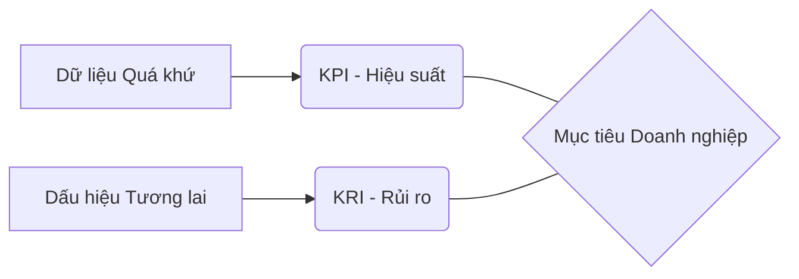

# Chương 9: Chỉ số rủi ro trọng yếu (Key Risk Indicator)

## 1. Khái niệm về "Indicator" (Chỉ báo)

!!! info "Định nghĩa"
    *   **Indicator** là một thước đo hoặc đồng hồ đo thuộc một loại cụ thể.
    *   Nó chỉ ra, gợi ý hoặc cho thấy một vấn đề/hiện tượng quan trọng được rút ra từ các sự kiện quan sát được.
    *   Sử dụng để thể hiện vị trí tương đối hoặc sự thay đổi (tích cực/tiêu cực) trên một thang đo.
    *   *Ví dụ:* Chất chỉ thị pH (pH Indicator) giúp đánh giá trực quan mức độ axit, trung tính hay kiềm của dung dịch.

---

## 2. Phân biệt KPI và KRI

Doanh nghiệp sử dụng cả hai chỉ số này để đánh giá tiến độ hướng tới các mục tiêu đã tuyên bố.

| Đặc điểm | KPI (Key Performance Indicator) | KRI (Key Risk Indicator) |
| :--- | :--- | :--- |
| **Tên gọi** | Chỉ số hiệu suất công việc trọng yếu | Chỉ số rủi ro trọng yếu |
| **Câu hỏi cốt lõi** | "Làm việc đó tốt như thế nào?" | "Hoạt động đó rủi ro như thế nào?" |
| **Tính chất** | Nhìn lại quá khứ (Lagging) | Dự đoán tương lai (Leading) |
| **Tập trung** | Thành tích, hiệu quả hoàn thành mục tiêu | Dấu hiệu cảnh báo sớm các rủi ro tiềm ẩn |
| **Ví dụ** | Doanh số bán hàng, sự hài lòng khách hàng | Tỷ lệ nghỉ việc, số lần đăng nhập sai |

---

## 3. Các thước đo rủi ro

Rủi ro được định lượng và xếp hạng qua các chỉ số sau:

*   **Occ (Occurrence):** Đo lường khả năng xảy ra rủi ro (*How likely is it?*).
*   **Sev (Severity):** Đo lường mức độ nghiêm trọng (*How seriously is it?*).
*   **Det (Detection):** Khả năng phát hiện sớm rủi ro (*How soon/quickly can you detect it?*).
*   **RPN (Risk Priority Number):** Tác động tổng hợp. Công thức: $RPN = Occ \times Sev \times Det$.
*   **KRI (Key Risk Indicator):** Mức độ rủi ro của một hoạt động cụ thể. Thường đi kèm với một **Giá trị ngưỡng (Threshold)**.

!!! tip "Ngưỡng giá trị KRI"
    Nếu giá trị KRI vượt quá ngưỡng (theo quy định của *Risk Appetite* và *Risk Tolerance*), một hành động ứng phó phải được thực hiện ngay để bảo vệ mục tiêu.

---

## 4. Cách thiết lập và phát triển KRI

### Quy trình thiết lập
1.  Hiểu rõ **Mục tiêu** và **Điểm yếu**.
2.  Xác định **Nguồn rủi ro** (Risk Sources) và các mối đe dọa.
3.  Thiết lập các **KRI** tương ứng với KPI để có thông tin cơ bản.
4.  Xác định **Ngưỡng giá trị** (Threshold).
5.  Ấn định **Tần suất giám sát**.

### Nguồn rủi ro (Risk Source)
*   **Bên ngoài:** Biến động thị trường, thiên tai, thay đổi pháp lý, sự cố công nghệ của nhà cung cấp.
*   **Bên trong:** Quy trình quản lý kém, lỗi thiết kế, thiếu đào tạo nhân sự, dữ liệu không được bảo vệ.

---

## 5. Các chỉ số KRI tiêu biểu

Doanh nghiệp thường phân loại KRI theo 3 nhóm: **Con người (People)**, **Quy trình (Process)** và **Công nghệ (Technology)**.

### 5.1. Nhóm Người lao động (People)
*   **Tỷ lệ nghỉ việc tự nguyện:** Đề nghị KRI < 6% mỗi 3 tháng.
*   **Tỷ lệ vi phạm quy trình kiểm soát thay đổi (Change Control):** Đề nghị KRI = 0%.
*   **Tỷ lệ khiếu nại của nhân viên:** Đề nghị KRI < 15% hàng tháng.
*   **Số giờ đào tạo trung bình:** Ví dụ KRI $\ge$ 18 giờ/năm.

### 5.2. Nhóm Quy trình (Process)
*   **Số lượng báo cáo gửi lỗi/thất bại:** Đề nghị KRI < 1.
*   **Tỷ lệ cuộc gọi nhỡ (Chăm sóc khách hàng):** Ví dụ KRI < 1%.
*   **Số lần nhà cung cấp ngừng dịch vụ:** Đề nghị KRI < 3 lần/năm.
*   **Tỷ lệ giao dịch duyệt chậm:** Ví dụ KRI < 1%.

### 5.3. Nhóm Công nghệ (Technology)
*   **Triển khai bản vá lỗi (Patches) chậm:** Ví dụ KRI < 2 bản vá/tháng.
*   **Mức độ sẵn sàng của hệ thống (Availability):** Ví dụ KRI > 99.72%.
*   **Thời gian duy trì của UPS khi mất điện:** Ví dụ KRI $\ge$ 15 phút.
*   **Thời gian giải quyết sự cố (RTO):** Ví dụ KRI $\le$ 120 phút.

---

# BỘ 50 CÂU HỎI TRẮC NGHIỆM CHƯƠNG 9

**Câu 1. "Indicator" (Chỉ báo) theo định nghĩa chung là gì?**

- A. Một phần mềm tự động sửa lỗi.
- B. Một thước đo hoặc đồng hồ đo thuộc một loại cụ thể dùng để chỉ ra điều gì đó.
- C. Một bản báo cáo tài chính cuối năm.
- D. Một quy tắc bắt buộc nhân viên phải tuân theo.
??? success "Đáp án: B"
    Giải thích: Theo slide 4, Indicator là "a gauge or meter... points to, suggests, or shows something".

**Câu 2. Chất chỉ thị pH được đưa vào bài học như một ví dụ để minh họa cho điều gì?**

- A. Rủi ro hóa chất trong doanh nghiệp.
- B. Cách đánh giá trực quan một chỉ báo thông qua sự thay đổi màu sắc.
- C. Quy trình sản xuất nước uống.
- D. Tầm quan trọng của việc vệ sinh văn phòng.
??? success "Đáp án: B"
    Giải thích: Slide 6 dùng pH Indicator để ví dụ về việc đánh giá mức độ axit/kiềm một cách trực quan.

**Câu 3. KPI là viết tắt của cụm từ nào?**

- A. Key Professional Indicator.
- B. Key Performance Indicator.
- C. Knowledge Performance Index.
- D. Key Process Information.
??? success "Đáp án: B"

**Câu 4. Câu hỏi cốt lõi mà KPI trả lời là gì?**

- A. Hoạt động này rủi ro như thế nào?
- B. Công việc đang được thực hiện tốt như thế nào (How well)?
- C. Khi nào thì rủi ro sẽ xảy ra?
- D. Ai là người chịu trách nhiệm cho lỗi này?
??? success "Đáp án: B"
    Giải thích: Slide 7 nêu KPI trả lời cho câu hỏi "how well something is being done".

**Câu 5. KPI tập trung vào loại dữ liệu nào?**

- A. Dữ liệu dự đoán tương lai.
- B. Dữ liệu nhìn lại quá khứ và thành tích đã đạt được.
- C. Dữ liệu về các mối đe dọa tiềm ẩn.
- D. Dữ liệu về thời tiết.
??? success "Đáp án: B"
    Giải thích: Slide 32 nhấn mạnh KPI nhìn lại dữ liệu quá khứ và tập trung vào thành tích.

**Câu 6. KRI là viết tắt của cụm từ nào?**

- A. Key Resource Information.
- B. Key Risk Indicator.
- C. Knowledge Risk Index.
- D. Key Reliability Indicator.
??? success "Đáp án: B"

**Câu 7. KRI cung cấp dấu hiệu gì cho doanh nghiệp?**

- A. Dấu hiệu về doanh thu tăng trưởng.
- B. Dấu hiệu cảnh báo sớm về các rủi ro tiềm ẩn (Warning signs).
- C. Dấu hiệu về danh tiếng của đối thủ.
- D. Dấu hiệu về ngày nghỉ lễ của nhân viên.
??? success "Đáp án: B"
    Giải thích: KRI hoạt động như một hệ thống cảnh báo sớm (Slide 13).

**Câu 8. Câu hỏi cốt lõi mà KRI trả lời là gì?**

- A. Chúng ta đã bán được bao nhiêu hàng?
- B. Một hoạt động rủi ro như thế nào (How risky)?
- C. Nhân viên có hài lòng không?
- D. Hệ thống có đẹp không?
??? success "Đáp án: B"
    Giải thích: Slide 11 và 33 nêu KRI trả lời cho "how risky an activity is".

**Câu 9. Mối quan hệ về chức năng giữa KPI và KRI được mô tả là:**

- A. Tương thuận (cùng tăng cùng giảm).
- B. Nghịch đảo của nhau.
- C. Không có mối liên hệ nào.
- D. KRI là một phần nhỏ của KPI.
??? success "Đáp án: B"
    Giải thích: Slide 31 nêu rõ về chức năng, KPI và KRI là nghịch đảo của nhau.

**Câu 10. Chỉ số "Occ" trong thước đo rủi ro đo lường điều gì?**

- A. Mức độ thiệt hại.
- B. Khả năng xảy ra rủi ro (Likelihood).
- C. Khả năng phát hiện lỗi.
- D. Tên của rủi ro.
??? success "Đáp án: B"
    Giải thích: Slide 16 nêu Occ đo lường "how likely is it?".

**Câu 11. Thước đo "Det" (Detection) nhằm mục đích gì?**

- A. Đo lường tốc độ mạng.
- B. Đo lường khả năng phát hiện sớm rủi ro.
- C. Đo lường sự hài lòng của sếp.
- D. Đo lường độ bền của ổ cứng.
??? success "Đáp án: B"
    Giải thích: Xem slide 16.

**Câu 12. Công thức tính RPN (Risk Priority Number) là:**

- A. RPN = Occ + Sev + Det.
- B. RPN = Occ x Sev x Det.
- C. RPN = (Occ x Sev) / Det.
- D. RPN = Occ x Sev.
??? success "Đáp án: B"
    Giải thích: Xem slide 16 và 17.

**Câu 13. Giá trị gán cho Occ, Sev, Det thường nằm trong thang điểm nào?**

- A. Từ 1 đến 100.
- B. Từ 1 đến 5 (hoặc 6, 10).
- C. Từ A đến Z.
- D. Chỉ có 0 và 1.
??? success "Đáp án: B"
    Giải thích: Tùy theo thang đo doanh nghiệp chọn, phổ biến là 1-5 (Slide 17).

**Câu 14. Trong thang điểm rủi ro, điểm số 1 thường đại diện cho trạng thái nào?**

- A. Xấu nhất.
- B. Tốt nhất/Ít rủi ro nhất.
- C. Nguy hiểm nhất.
- D. Không xác định.
??? success "Đáp án: B"
    Giải thích: Thang điểm thường quy định 1 là Tốt nhất, 5 hoặc 10 là Xấu nhất (Slide 17).

**Câu 15. "Giá trị ngưỡng" (Risk Threshold) của KRI là gì?**

- A. Là giá trị trung bình của KRI.
- B. Là điểm kiểm soát mà nếu vượt qua thì tổn thất/rủi ro sẽ tăng lên.
- C. Là mức lương cao nhất của nhân viên.
- D. Là dung lượng lớn nhất của ổ cứng.
??? success "Đáp án: B"
    Giải thích: Slide 18 và 27 định nghĩa ngưỡng là điểm kiểm soát rủi ro.

**Câu 16. Ngưỡng giá trị KRI được quy định dựa trên yếu tố nào?**

- A. Ý kiến của nhân viên mới.
- B. Khẩu vị rủi ro (Risk Appetite) và Khả năng chịu đựng rủi ro (Risk Tolerance) của lãnh đạo.
- C. Giá vàng trên thị trường.
- D. Số lượng máy tính trong kho.
??? success "Đáp án: B"
    Giải thích: Xem slide 18.

**Câu 17. Ví dụ về dung lượng HDD: KRI được thiết lập là 0.5% tổng dung lượng. Điều này có nghĩa là gì?**

- A. Khi dung lượng còn trống 0.5%, rủi ro sao chép thất bại sẽ tăng cao và cần hành động.
- B. Ổ cứng chỉ được dùng 0.5% dung lượng.
- C. Cứ 0.5 giây ổ cứng lại quét virus một lần.
- D. Lỗi ổ cứng chiếm 0.5% tổng số lỗi.
??? success "Đáp án: A"
    Giải thích: Khi giá trị metrics tiến gần đến ngưỡng KRI (0.5%), khả năng xảy ra rủi ro (Occ) tăng lên (Slide 19).

**Câu 18. Trong ví dụ về tốc độ xe ô tô, KRI = 60km/h là:**

- A. Tốc độ tối thiểu phải đạt được.
- B. Ngưỡng giới hạn tốc độ để tránh rủi ro bị phạt hoặc tai nạn.
- C. Tốc độ trung bình của mọi loại xe.
- D. Khoảng cách an toàn giữa hai xe.
??? success "Đáp án: B"
    Giải thích: Xem slide 20.

**Câu 19. "Số lần nhập sai mật khẩu tối đa là 5 lần" là một ví dụ về KRI cho rủi ro nào?**

- A. Rủi ro cháy nổ.
- B. Rủi ro không truy cập được hệ thống để làm việc/giao dịch.
- C. Rủi ro thiếu nhân sự.
- D. Rủi ro hỏng bàn phím.
??? success "Đáp án: B"
    Giải thích: Slide 21 nêu KRI = 5 lần là ngưỡng giới hạn cho việc nhập sai thông tin xác thực.

**Câu 20. "Độ bão hòa oxy (SpO2) dưới 90%" là một KRI báo hiệu điều gì?**

- A. Người đó đang rất khỏe mạnh.
- B. Rủi ro suy hô hấp, cần cấp cứu ngay.
- C. Bình oxy đang bị rò rỉ.
- D. Pin của máy đo sắp hết.
??? success "Đáp án: B"
    Giải thích: Slide 22 dùng ví dụ y tế để minh họa ngưỡng cảnh báo nguy hiểm của KRI.

**Câu 21. "Số người sử dụng đồng thời" được gọi là chỉ số gì?**

- A. RTO.
- B. CCU (Concurrent Users).
- C. RPO.
- D. CPU.
??? success "Đáp án: B"
    Giải thích: Xem slide 23.

**Câu 22. KRI về kích thước tải trọng gói tin (Payload size) nhằm quản lý rủi ro gì?**

- A. Rủi ro lộ thông tin mật.
- B. Rủi ro gói tin bị mạng "drop" (bỏ rơi) do quá lớn so với MSS.
- C. Rủi ro đứt cáp quang.
- D. Rủi ro tốn tiền băng thông.
??? success "Đáp án: B"
    Giải thích: Slide 24 nêu KRI = 1460 byte là ngưỡng kích thước tải trọng gói tin.

**Câu 23. Khi nhiệt độ nước tiến sát ngưỡng KRI = 56°C, yếu tố nào của rủi ro sẽ tăng lên?**

- A. Khả năng xảy ra (Occ).
- B. Mức độ nghiêm trọng (Sev).
- C. Khả năng phát hiện (Det).
- D. Không có yếu tố nào thay đổi.
??? success "Đáp án: B"
    Giải thích: Slide 25 nêu giá trị càng gần sát 56°C thì mức độ nghiêm trọng (Sev) - gây bỏng - càng tăng lên.

**Câu 24. Đâu là một KRI thuộc nhóm "Nguồn nhân lực"?**

- A. Tỷ lệ luân chuyển nhân viên.
- B. Thời gian ngừng hoạt động của thiết bị.
- C. Mức tồn kho.
- D. Tỷ lệ nợ trên vốn.
??? success "Đáp án: A"
    Giải thích: Xem slide 26.

**Câu 25. Vai trò của KRI cung cấp "phương tiện giám sát từng rủi ro" (monitor each risk) có nghĩa là:**

- A. Chỉ theo dõi khi có thảm họa.
- B. Giám sát liên tục giữa các lần đánh giá rủi ro định kỳ.
- C. Thay thế hoàn toàn con người trong việc bảo mật.
- D. Chỉ dùng để báo cáo cho khách hàng.
??? success "Đáp án: B"
    Giải thích: Xem slide 27 và 28.

**Câu 26. Tại sao nên thiết lập KPI trước khi lập KRI tương ứng?**

- A. Vì KPI dễ làm hơn.
- B. Vì KPI cung cấp thông tin cơ bản để có thể lập ra các KRI tương ứng.
- C. Vì đó là quy định của ISO 9001.
- D. Vì KPI không quan trọng bằng KRI.
??? success "Đáp án: B"
    Giải thích: Slide 43 nhấn mạnh KPI cung cấp dữ liệu nền tảng cho KRI.

**Câu 27. Để phát triển KRI hiệu quả, doanh nghiệp cần có:**

- A. Sự cộng tác và tham gia của các bên liên quan.
- B. Nỗ lực có ý thức và nguồn lực từ người điều hành.
- C. Dữ liệu định lượng đầy đủ và thường xuyên.
- D. Tất cả các phương án trên.
??? success "Đáp án: D"
    Giải thích: Xem slide 47.

**Câu 28. "Tỷ lệ % nhân viên bỏ qua quy trình Change Control" có ngưỡng KRI đề nghị là bao nhiêu?**

- A. < 10%.
- B. 0%.
- C. < 5%.
- D. 100%.
??? success "Đáp án: B"
    Giải thích: Quy trình kiểm soát thay đổi (A.12.1.2) là bắt buộc, không được phép bỏ qua nên KRI = 0% (Slide 54).

**Câu 29. KRI "Số giờ đào tạo người lao động trong năm" phản ánh điều gì?**

- A. Chất lượng làm việc và mức độ quan tâm của cấp quản lý về năng lực chuyên môn.
- B. Số tiền công ty bị lãng phí.
- C. Thời gian nhân viên không làm việc.
- D. Độ bền của máy tính trong phòng đào tạo.
??? success "Đáp án: A"
    Giải thích: Xem slide 57.

**Câu 30. KRI "Số lượng cá nhân giữ tài khoản quản trị < 2" nhằm mục đích gì?**

- A. Tiết kiệm chi phí bản quyền phần mềm.
- B. Giảm mức độ khó khăn khi xác định thủ phạm nếu có rò rỉ dữ liệu hoặc lạm dụng đặc quyền.
- C. Để một người làm hết mọi việc cho nhanh.
- D. Vì không có đủ máy tính cho nhiều admin.
??? success "Đáp án: B"
    Giải thích: Càng ít người giữ quyền admin thì việc kiểm soát và truy vết càng dễ dàng (Slide 69).

**Câu 31. KRI "Số lượng hệ thống cho phép cùng một tài khoản đăng nhập đồng thời = 0" giúp nhận ra:**

- A. Hệ thống bị lỗi kết nối.
- B. Nhân viên có chia sẻ thông tin đăng nhập với người khác trái phép hay không.
- C. Tốc độ mạng đang rất nhanh.
- D. Máy tính đang bị quá tải.
??? success "Đáp án: B"
    Giải thích: Xem slide 70.

**Câu 32. Trong nhóm Công nghệ, "Thời gian chạy chương trình khóa sổ giao dịch bị kéo dài" báo hiệu điều gì?**

- A. Nhân viên kế toán đang làm việc chăm chỉ.
- B. Hiệu suất hệ thống/ứng dụng giảm hoặc đang bị quá tải.
- C. Công ty sắp có nhiều lợi nhuận.
- D. Hệ thống sắp được nâng cấp miễn phí.
??? success "Đáp án: B"
    Giải thích: Xem slide 72 (The End of Day routine).

**Câu 33. KRI về "Triển khai bản vá lỗi (Patches) chậm" giúp xác định điều gì?**

- A. Giá tiền của bản vá.
- B. Mức độ vá lỗi tối ưu cho hệ thống an ninh mạng.
- C. Tên của nhà cung cấp phần mềm.
- D. Dung lượng của bản cập nhật.
??? success "Đáp án: B"
    Giải thích: Giúp đảm bảo hệ thống không bị phơi nhiễm lỗ hổng quá lâu (Slide 73).

**Câu 34. Chỉ số Availability (Mức độ sẵn sàng) của hệ thống trọng yếu thường được yêu cầu ở mức cao, ví dụ:**

- A. > 50%.
- B. > 80%.
- C. > 99.72%.
- D. < 100%.
??? success "Đáp án: C"
    Giải thích: Hệ thống trọng yếu đòi hỏi tính liên tục cực cao (Slide 75).

**Câu 35. "RTO" trong KRI công nghệ viết tắt của:**

- A. Return Time Objective.
- B. Recovery Time Objective.
- C. Risk Treatment Option.
- D. Regional Traffic Organization.
??? success "Đáp án: B"

**Câu 36. KRI "Thời gian nhân viên HelpDesk giải quyết xong một yêu cầu" thể hiện:**

- A. Năng lực và kiến thức của nhân viên kỹ thuật cùng mức độ sẵn sàng làm việc.
- B. Số lượng khách hàng đang giận dữ.
- C. Độ bền của điện thoại phòng trực.
- D. Tiền lương của nhân viên HelpDesk.
??? success "Đáp án: A"
    Giải thích: Xem slide 80.

**Câu 37. Nguồn rủi ro "Bên trong" tổ chức bao gồm yếu tố nào?**

- A. Thiên tai.
- B. Đối thủ cạnh tranh.
- C. Quy trình, nhân sự hoặc dữ liệu của chính tổ chức.
- D. Thay đổi chính sách của chính phủ.
??? success "Đáp án: C"
    Giải thích: Xem slide 38.

**Câu 38. Logic nào sau đây là ĐÚNG về cải tiến (Slide 15/61)?**

- A. Không quản lý được thì không đo lường được.
- B. Không đo lường được thì không phân tích được.
- C. Không cải tiến được thì không kiểm soát được.
- D. Không phân tích được thì không cần đo lường.
??? success "Đáp án: B"
    Giải thích: Logic chuỗi: Đo lường -> Phân tích -> Quản lý -> Kiểm soát -> Cải tiến.

**Câu 39. "Tần suất các lần đăng nhập không thành công trong tháng" (KRI = 5 lần/tháng) giúp phát hiện:**

- A. Các mối đe dọa bảo mật hoặc hành vi bất thường của người dùng.
- B. Bàn phím bị hỏng phím số.
- C. Nhân viên quên mật khẩu do làm việc quá sức.
- D. Hệ thống tự động đổi mật khẩu.
??? success "Đáp án: A"
    Giải thích: Xem slide 81.

**Câu 40. "Theo dõi năng lực hệ thống (CPU, RAM, HDD)" giúp doanh nghiệp chủ động:**

- A. Tăng lương cho nhân viên IT.
- B. Dự đoán khi nào tài nguyên cạn kiệt để lập kế hoạch đầu tư nâng cao năng lực.
- C. Giảm bớt số lượng máy tính.
- D. Chơi game mượt hơn.
??? success "Đáp án: B"
    Giải thích: Xem slide 82.

**Câu 41. "Risk Appetite" (Khẩu vị rủi ro) là gì?**

- A. Là sự sợ hãi đối với rủi ro.
- B. Là mức rủi ro mà tổ chức sẵn sàng chấp nhận để đạt được mục tiêu.
- C. Là tổng số tiền thiệt hại thực tế.
- D. Là các biện pháp kiểm soát rủi ro.
??? success "Đáp án: B"
    Giải thích: (Kiến thức nhắc lại từ Chương 1, áp dụng ở slide 18).

**Câu 42. Một KRI tốt cần có đặc điểm nào tương tự mục tiêu?**

- A. Phải thật phức tạp.
- B. Phải đáp ứng tiêu chí S.M.A.R.T.
- C. Không cần đo lường được.
- D. Chỉ ban giám đốc mới hiểu.
??? success "Đáp án: B"
    Giải thích: Slide 44 nhấn mạnh hành động ứng phó KRI phải đáp ứng S.M.A.R.T.

**Câu 43. "Early signal of increasing risk exposures" là ý nghĩa của:**

- A. KPI.
- B. KRI.
- C. ROI.
- D. SLA.
??? success "Đáp án: B"
    Giải thích: KRI là tín hiệu sớm về việc mức độ phơi nhiễm rủi ro đang tăng lên (Slide 27).

**Câu 44. Tại sao nói KRI giúp "giảm tác động tiềm ẩn của rủi ro"?**

- A. Vì rủi ro sợ KRI.
- B. Vì KRI giúp xác định vấn đề sớm để thực hiện các bước chủ động giảm thiểu.
- C. Vì KRI làm rủi ro biến mất hoàn toàn.
- D. Vì KRI tốn rất nhiều tiền.
??? success "Đáp án: B"
    Giải thích: Xem slide 15.

**Câu 45. "Số lượng khiếu nại của khách hàng về sản phẩm/dịch vụ" (KRI < 5) thể hiện điều gì?**

- A. Khách hàng đang rất khó tính.
- B. Mức độ đáp ứng tiêu chuẩn chất lượng và hiệu quả của bộ tiêu chuẩn quản lý chất lượng.
- C. Công ty cần thuê thêm nhân viên tư vấn.
- D. Đối thủ cạnh tranh đang chơi xấu.
??? success "Đáp án: B"
    Giải thích: Xem slide 66.

**Câu 46. KRI "Tỷ lệ % các sự cố tương tự tái diễn" có ngưỡng đề nghị là 0%. Nếu chỉ số này tăng, nó cho thấy:**

- A. Nhân viên đang học hỏi từ sai lầm.
- B. Nguyên nhân gốc rễ chưa được giải quyết hoặc quy trình ứng phó kém hiệu quả.
- C. Hệ thống đang tự sửa lỗi.
- D. Cần phải mua máy tính mới.
??? success "Đáp án: B"
    Giải thích: Sự cố tái diễn chứng tỏ việc xử lý rủi ro trước đó thất bại (Slide 67).

**Câu 47. KRI "Thời gian giải quyết một sự cố nghiêm trọng" tăng cao phản ánh:**

- A. Sự cố đó rất thú vị.
- B. Quy trình xử lý sự cố cần được rà soát và thay đổi.
- C. Nhân viên đang làm việc rất kỹ lưỡng.
- D. Hệ thống đang được bảo trì định kỳ.
??? success "Đáp án: B"
    Giải thích: Thời gian giải quyết tăng đồng nghĩa với năng lực ứng phó giảm (Slide 68).

**Câu 48. "Tỷ lệ % lỗi tác nghiệp còn tồn đọng quá hạn khắc phục" (KRI < 0.5%) thể hiện:**

- A. Năng lực xử lý lỗi của nhân viên và mức độ cung cấp nguồn lực để khắc phục.
- B. Nhân viên đang đi nghỉ mát.
- C. Các lỗi này không quan trọng.
- D. Khách hàng đã bỏ qua lỗi.
??? success "Đáp án: A"
    Giải thích: Xem slide 56.

**Câu 49. KRI "Số lần can thiệp thủ công để khắc phục lỗi quy trình tự động" tăng cho thấy:**

- A. Con người quan trọng hơn máy móc.
- B. Lỗi hoặc sự thiếu sót khi thiết kế quy trình tự động.
- C. Quy trình tự động đang hoạt động hoàn hảo.
- D. Nhân viên muốn làm việc bằng tay cho vui.
??? success "Đáp án: B"
    Giải thích: Quy trình tự động mà phải can thiệp thủ công nhiều là lỗi thiết kế (Slide 71).

**Câu 50. Việc xác định rủi ro nào có tác động cao nhất, khả năng xảy ra cao nhất giúp doanh nghiệp:**

- A. Tăng lương cho sếp.
- B. Xếp hạng ưu tiên triển khai các kế hoạch hành động.
- C. Đóng cửa những bộ phận rủi ro.
- D. Mua thêm bảo hiểm cho tất cả mọi thứ.
??? success "Đáp án: B"
    Giải thích: Giúp phân bổ nguồn lực hợp lý vào những nơi nguy hiểm nhất (Slide 37, 39).

---
Hy vọng nội dung tóm tắt và bộ câu hỏi này giúp bạn nắm vững kiến thức về KRI!
