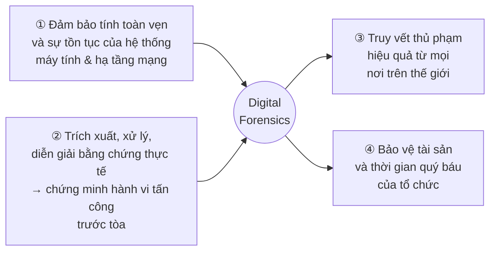
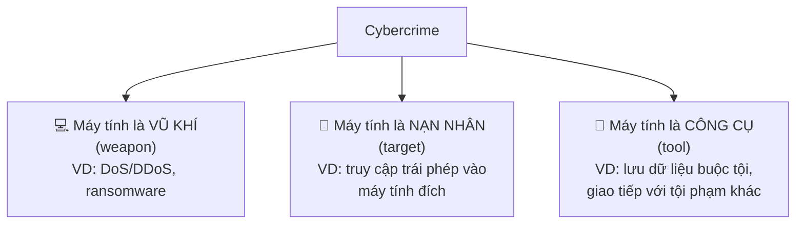
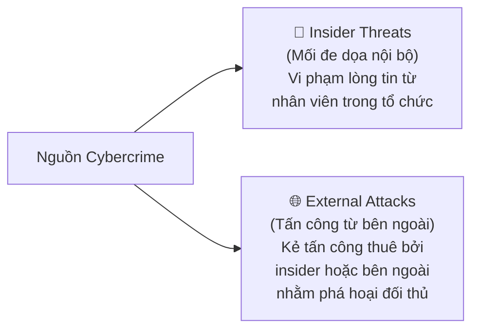
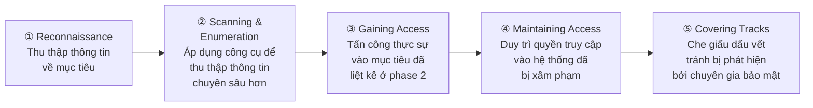
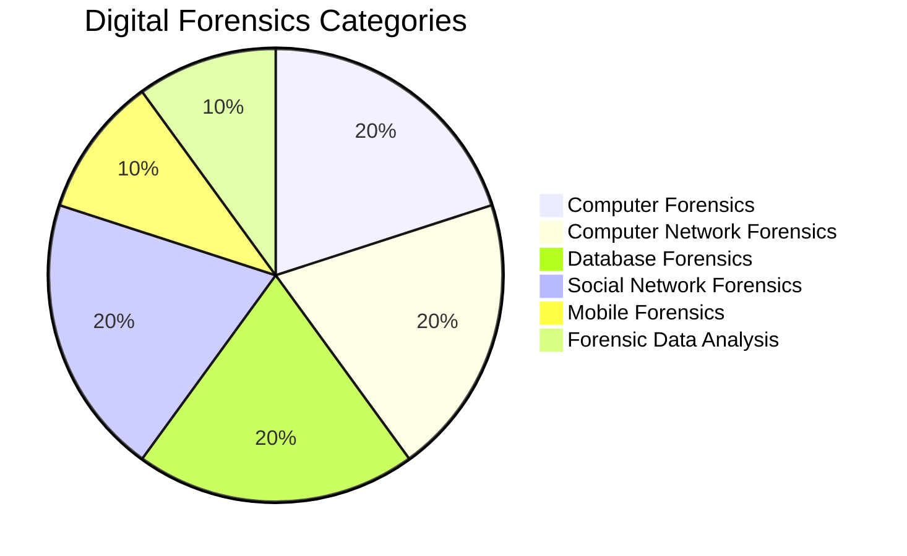
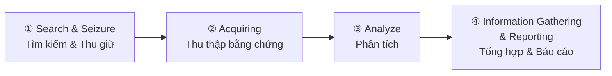

# Introduction to Computer and Network Forensics

---

## 1. Định nghĩa Digital Forensics

**Digital Forensics** là một nhánh của khoa học pháp y, sử dụng hiểu biết khoa học để **thu thập (acquire)**, **đánh giá (evaluate)**, **ghi lại (record)** và **trình bày (present)** bằng chứng kỹ thuật số liên quan đến tội phạm máy tính trước tòa.

!!! info "Mục tiêu cốt lõi"
    Trả lời ba câu hỏi then chốt:

    - **What happened?** – Chuyện gì đã xảy ra?
    - **When it happened?** – Khi nào xảy ra?
    - **Who did it?** – Ai đã làm?

> "Digital forensics" là thuật ngữ bao quát cho *computer forensics* hay gần đây hơn là **cyber forensics**.

### Phạm vi điều tra

Bao gồm mọi thiết bị có khả năng **gửi, nhận, lưu trữ** dữ liệu số:

- Laptop, máy tính để bàn, điện thoại di động
- Thiết bị mạng, webcam, tablet, camcorder
- IoT và thiết bị nhà thông minh
- Phương tiện lưu trữ: USB, CD/DVD, SD card, băng từ

### Objectives (Mục tiêu cụ thể)

```
┌─────────────────────────────────────────────────────────────┐
│  OBJ 1: Thu hồi, phân tích, bảo tồn máy tính và tài liệu  │
│          liên quan → trình bày như bằng chứng trước tòa    │
├─────────────────────────────────────────────────────────────┤
│  OBJ 2: Xác định bằng chứng nhanh chóng, ước tính tác động│
│          của hoạt động độc hại, xác định ý định & danh     │
│          tính của thủ phạm                                  │
└─────────────────────────────────────────────────────────────┘
```

### Lý do cần Computer Forensics



!!! note "Bối cảnh phát triển"
    So với khoa học pháp y truyền thống (xét nghiệm máu, định danh ADN, dấu vân tay), digital forensics là **khoa học trẻ** nhưng đặc biệt phức tạp vì:

    - Tương tác với hệ sinh thái máy tính thay đổi nhanh chóng
    - Giao thoa với nhiều lĩnh vực: tư pháp, luật pháp, quản lý, CNTT, internet không biên giới
    - Đòi hỏi phát triển liên tục để đối phó với các thách thức mới

---

## 2. Mục tiêu của Digital Forensics

Mục tiêu cơ bản: điều tra tội phạm thực hiện qua hệ thống máy tính và **trích xuất bằng chứng số** để trình bày trước tòa.

Cụ thể, digital forensics thực hiện qua các cách sau:

| # | Mục tiêu |
|---|----------|
| 1 | Xác định vị trí và bảo tồn bằng chứng hợp pháp trên thiết bị máy tính theo cách được tòa án chấp nhận |
| 2 | Tuân thủ các phương pháp công nghệ được tòa án phê duyệt để bảo tồn và phục hồi bằng chứng |
| 3 | Gán trách nhiệm cho người đã khởi xướng hoạt động |
| 4 | Xác định các vi phạm dữ liệu trong tổ chức |
| 5 | Xác định mức độ thiệt hại có thể xảy ra do vi phạm dữ liệu |
| 6 | Tổng hợp kết quả thành báo cáo chính thức để nộp tòa |
| 7 | Cung cấp bằng chứng chuyên gia trước tòa |

---

## 3. Định nghĩa Cybercrime

!!! danger "Định nghĩa"
    **Cybercrime** là bất kỳ hoạt động bất hợp pháp nào được thực hiện **trên** hoặc **thông qua** máy tính/mạng máy tính (internet).

    > Cybercrime là **cố ý (intentional)**, không phải ngẫu nhiên (accidental).

### Phân loại theo vai trò của máy tính



### Công thức tấn công

```
Attacks = Motive (Goal) + Method + Vulnerability
```

- **Motive**: phát sinh từ nhận thức rằng hệ thống đích lưu trữ/xử lý thứ có giá trị
- **Method**: kẻ tấn công dùng các công cụ và kỹ thuật để khai thác lỗ hổng
- **Vulnerability**: điểm yếu trong hệ thống máy tính hoặc chính sách bảo mật

### Động cơ phổ biến

- **Tài chính** (chủ yếu): phát tán malware để đánh cắp thông tin tài khoản ngân hàng
- **Phá hoại dịch vụ**: DDoS để đánh sập dịch vụ của tổ chức mục tiêu
- **Đánh cắp dữ liệu bí mật**: dữ liệu khách hàng, thông tin y tế
- **Gián điệp mạng (Cyber espionage)**: bí mật thương mại, bí mật quân sự
- **Trao đổi bất hợp pháp** tài liệu có bản quyền

### Nguồn gốc Cybercrime



### Các giai đoạn Hacking (Hacking Phases)



---

## 4. Các danh mục Digital Forensics



| Danh mục | Mô tả |
|----------|-------|
| **Computer Forensics** | Pháp chứng máy tính |
| **Computer Network Forensics** | Pháp chứng mạng máy tính |
| **Database Forensics** | Pháp chứng cơ sở dữ liệu |
| **Social Network Forensics** | Pháp chứng mạng xã hội |
| **Mobile Forensics** | Pháp chứng thiết bị di động |
| **Forensic Data Analysis** | Phân tích dữ liệu pháp y |

---

## 5. Loại hình điều tra Digital Forensics

!!! abstract "Phân loại theo chủ thể khởi xướng điều tra"

### Public Investigation (Điều tra công)

- Do **cơ quan thực thi pháp luật** thực hiện
- Tuân thủ **luật pháp quốc gia hoặc tiểu bang**
- Ba giai đoạn chính:

```
Complaint (Khiếu nại) → Investigation (Điều tra) → Prosecution (Truy tố)
```

### Private Investigation (Điều tra tư)

- Do **doanh nghiệp** thực hiện
- Mục đích: điều tra vi phạm chính sách, vấn đề pháp lý, sa thải không công bằng, rò rỉ thông tin bí mật (gián điệp công nghiệp)

---

## 6. Loại bằng chứng kỹ thuật số

??? info "User-created data (Dữ liệu do người dùng tạo ra)"
    - Bản sao lưu trước đó (cloud backup và offline backup: CD/DVD, băng từ)
    - Thông tin tài khoản (username, ảnh đại diện, mật khẩu)
    - Email và file đính kèm (email online và client như Outlook)
    - File âm thanh và video
    - Sổ địa chỉ và lịch
    - Bản ghi webcam (ảnh và video kỹ thuật số)
    - File nội dung (tài liệu MS Office, hội thoại IM, bookmark, bảng tính, cơ sở dữ liệu, văn bản lưu trữ kỹ thuật số)
    - File ẩn và file mã hóa (bao gồm thư mục nén) do người dùng tạo

??? info "Machine and network-created data (Dữ liệu do máy và mạng tạo ra)"
    - File cấu hình và audit trail (kể cả ISP lưu lịch sử tài khoản/trình duyệt khách hàng)
    - **Windows Event Logs**: Application, Security, Setup, System, Forward Events, Apps, Services
    - Lịch sử theo dõi GPS
    - File tạm thời (temporary files)
    - Thông tin trình duyệt: browser history, cookies, download history
    - Địa chỉ IP và MAC của thiết bị (LAN, broadcast)
    - Lịch sử instant messenger và danh sách liên lạc (Skype, WhatsApp)
    - Lịch sử ứng dụng và Windows (VD: file MS Office mở gần đây)
    - Restore points (Windows)
    - Thông tin header email
    - Registry files (Windows OS)
    - File hệ thống ẩn và thông thường
    - Printer spooler files
    - Virtual machines
    - Bản ghi giám sát video (surveillance)
    - Paging file, hibernation file, memory dump file

---

## 7. Vị trí bằng chứng điện tử

!!! example "Các thiết bị có thể chứa bằng chứng"

```
Systems          : Desktops, Laptops, Tablets, Servers, RAIDs
Network devices  : Hubs, Switches, Modems, Routers, Wireless APs
IoT devices      : Smart AC, Smart Refrigerators
Surveillance     : DVRs, Camera systems
Portable         : MP3 players, GPS devices, Smartphones, PDAs
Gaming           : Xbox, PlayStation
Imaging          : Digital cameras
Other            : Smart cards, Pagers, Digital voice recorders
```

---

## 8. Chain of Custody (Chuỗi giám hộ)

!!! warning "Nguyên tắc then chốt"
    Chain of custody là **bắt buộc** trong mọi phương pháp điều tra pháp y kỹ thuật số.

**Chain of custody** phải ghi chép chi tiết cách bằng chứng kỹ thuật số được:

```
Discovered → Gathered → Transported → Analyzed → Stored → Maintained
(Phát hiện)  (Thu thập)  (Vận chuyển)  (Phân tích)  (Lưu trữ)  (Duy trì)
```

**Mục tiêu cuối cùng**: bảo vệ **tính toàn vẹn (integrity)** của bằng chứng số bằng cách theo dõi mọi người đã tiếp xúc với nó từ lúc thu thập đến khi trình bày trước tòa.

!!! danger "Hậu quả nếu vi phạm"
    Nếu không thể xác định ai đã tiếp xúc với bằng chứng tại bất kỳ thời điểm nào trong quá trình điều tra → **chain of custody bị phá vỡ** → bằng chứng **vô hiệu** trước tòa.

### Các câu hỏi Chain of Custody phải trả lời được

Để duy trì chain of custody hợp lệ, cần có **audit record** theo dõi di chuyển và người sở hữu bằng chứng số mọi lúc. Khi hợp lệ, điều tra viên phải trả lời được:

| Câu hỏi | Ví dụ |
|---------|-------|
| Bằng chứng là gì? | Mô tả bằng chứng thu được |
| Tìm thấy ở đâu? | Máy tính, tablet, điện thoại; trạng thái ON/OFF khi thu? |
| Được tạo ra như thế nào? | Công cụ sử dụng; quy trình bảo vệ tính toàn vẹn khi thu thập |
| Phương pháp vận chuyển, bảo tồn, xử lý? | — |
| Phương pháp phân tích? | Công cụ và quy trình sử dụng |
| Ai, khi nào, mục đích gì truy cập bằng chứng? | — |
| Vai trò của bằng chứng trong điều tra? | — |

---

## 9. Quy trình điều tra (Examination Process)

!!! note
    Không có phương pháp được thống nhất toàn cầu, nhưng mọi chiến lược đều chia thành **4 giai đoạn chính**:



---

---

# Câu hỏi trắc nghiệm

---

### Câu 1
**Digital Forensics là nhánh của khoa học nào?**

- A. Khoa học máy tính
- B. Khoa học pháp y (Forensic Science)
- C. Khoa học mạng
- D. Khoa học thông tin

??? success "Đáp án"
    **B. Khoa học pháp y (Forensic Science)**

    Digital forensics là một nhánh của forensic science, sử dụng hiểu biết khoa học để acquire, evaluate, record và present bằng chứng kỹ thuật số.

---

### Câu 2
**Mục tiêu cốt lõi của Digital Forensics là trả lời những câu hỏi nào?**

- A. What, Where, How
- B. What happened, When it happened, Who did it
- C. Who, Why, How much
- D. When, Where, How

??? success "Đáp án"
    **B. What happened, When it happened, Who did it**

    Ba câu hỏi then chốt: Chuyện gì xảy ra, Khi nào xảy ra, Ai đã làm.

---

### Câu 3
**"Digital forensics" là thuật ngữ bao quát cho thuật ngữ nào sau đây?**

- A. Network forensics
- B. Computer forensics / Cyber forensics
- C. Mobile forensics
- D. Cloud forensics

??? success "Đáp án"
    **B. Computer forensics / Cyber forensics**

    Slide định nghĩa: "The term 'digital forensics' is a catch-all word for computer forensics or, more recently, 'cyber forensics'."

---

### Câu 4
**Computer Forensics còn được biết đến với tên gọi nào?**

- A. Digital Forensic Science
- B. Computer Crime Stream
- C. Computer Forensic Science
- D. Computer Forensics Investigations

??? success "Đáp án"
    **C. Computer Forensic Science**

    Đây là câu hỏi trực tiếp từ slide quiz của bài giảng.

---

### Câu 5
**Digital Forensics có thể được sử dụng trong tố tụng dân sự không?**

- A. Không, chỉ dành cho hình sự
- B. Có
- C. Chỉ trong trường hợp đặc biệt
- D. Không bao giờ

??? success "Đáp án"
    **B. Có (True)**

    Computer Forensics can also be used in civil proceedings — câu hỏi quiz từ slide.

---

### Câu 6
**Động cơ cơ bản nhất của cybercrime là gì?**

- A. Gián điệp chính trị
- B. Tài chính (Financial gain)
- C. Phá hoại dịch vụ
- D. Đánh cắp dữ liệu

??? success "Đáp án"
    **B. Tài chính (Financial gain)**

    "The fundamental motivation for cybercrime is financial gain." VD: phát tán malware để đánh cắp thông tin tài khoản ngân hàng.

---

### Câu 7
**Cybercrime được phân loại theo vai trò máy tính thành mấy loại?**

- A. 2
- B. 3
- C. 4
- D. 5

??? success "Đáp án"
    **B. 3**

    Ba loại: máy tính là vũ khí (weapon), là nạn nhân/mục tiêu (target), là công cụ hỗ trợ (tool).

---

### Câu 8
**Tấn công DDoS để đánh sập dịch vụ của tổ chức mục tiêu là ví dụ về vai trò nào của máy tính trong cybercrime?**

- A. Máy tính là nạn nhân (target)
- B. Máy tính là công cụ hỗ trợ (tool)
- C. Máy tính là vũ khí (weapon)
- D. Cả A và C

??? success "Đáp án"
    **C. Máy tính là vũ khí (weapon)**

    "The computer is used as a weapon in the commission of a crime. Launching denial-of-service (DoS) attacks or delivering ransomware are two examples."

---

### Câu 9
**Sử dụng máy tính để lưu trữ dữ liệu buộc tội hoặc liên lạc với tội phạm khác là ví dụ về loại nào?**

- A. Máy tính là vũ khí
- B. Máy tính là nạn nhân
- C. Máy tính là công cụ hỗ trợ
- D. Không thuộc loại nào

??? success "Đáp án"
    **C. Máy tính là công cụ hỗ trợ (tool)**

    "The computer is used to aid in the commission of a crime. Using a computer to keep incriminating data or communicate with other criminals online."

---

### Câu 10
**Công thức tấn công trong cybercrime là gì?**

- A. Attack = Target + Tool + Method
- B. Attack = Motive + Method + Vulnerability
- C. Attack = Hacker + System + Exploit
- D. Attack = Goal + Access + Cover

??? success "Đáp án"
    **B. Attack = Motive + Method + Vulnerability**

    Slide định nghĩa: "Attacks = Motive (Goal) + Method + Vulnerability"

---

### Câu 11
**Hai nguồn gốc chính của cybercrime là gì?**

- A. Internal và external
- B. Insider threats và external attacks
- C. Nation-state và criminal groups
- D. Hardware và software

??? success "Đáp án"
    **B. Insider threats và external attacks**

    "Insider threats and external attacks are the two primary sources of cybercrime."

---

### Câu 12
**Insider threat được đặc trưng bởi điều gì?**

- A. Tấn công từ nước ngoài
- B. Vi phạm lòng tin từ nhân viên trong tổ chức
- C. Khai thác lỗ hổng zero-day
- D. Tấn công vật lý

??? success "Đáp án"
    **B. Vi phạm lòng tin từ nhân viên trong tổ chức**

    "Breach of trust from employees within the organization."

---

### Câu 13
**Trong 5 giai đoạn hacking, giai đoạn nào đến ngay sau Reconnaissance?**

- A. Gaining Access
- B. Maintaining Access
- C. Scanning and Enumeration
- D. Covering Tracks

??? success "Đáp án"
    **C. Scanning and Enumeration**

    Thứ tự: Reconnaissance → Scanning & Enumeration → Gaining Access → Maintaining Access → Covering Tracks.

---

### Câu 14
**Giai đoạn Covering Tracks trong hacking có mục đích gì?**

- A. Thu thập thông tin mục tiêu
- B. Khai thác lỗ hổng để xâm nhập
- C. Duy trì backdoor trên hệ thống
- D. Che giấu dấu vết, tránh bị phát hiện bởi chuyên gia bảo mật

??? success "Đáp án"
    **D. Che giấu dấu vết, tránh bị phát hiện bởi chuyên gia bảo mật**

    "Attackers attempt to conceal their success and avoid detection by security professionals."

---

### Câu 15
**Giai đoạn Maintaining Access có mục đích gì?**

- A. Thu thập thông tin ban đầu
- B. Đảm bảo kẻ tấn công có đường quay lại hệ thống đã xâm phạm
- C. Phân tích lỗ hổng
- D. Xóa log

??? success "Đáp án"
    **B. Đảm bảo kẻ tấn công có đường quay lại hệ thống đã xâm phạm**

    "Hackers attempt to ensure they have a way back into the machine or system they've already compromised."

---

### Câu 16
**Digital Forensics có mấy danh mục chính?**

- A. 3
- B. 4
- C. 6
- D. 5

??? success "Đáp án"
    **C. 6**

    Computer Forensics, Computer Network Forensics, Database Forensics, Social Network Forensics, Mobile Forensics, Forensic Data Analysis.

---

### Câu 17
**Điều tra pháp y kỹ thuật số được chia thành mấy loại theo chủ thể khởi xướng?**

- A. 2 (Public và Private)
- B. 3 (Public, Private, Military)
- C. 4
- D. Không phân loại

??? success "Đáp án"
    **A. 2 (Public và Private)**

    "Digital forensic investigations may be divided into two categories: Public investigation và Private sector investigations."

---

### Câu 18
**Ba giai đoạn chính của Public Investigation là gì?**

- A. Planning, Execution, Reporting
- B. Complaint, Investigation, Prosecution
- C. Search, Analyze, Present
- D. Acquire, Examine, Document

??? success "Đáp án"
    **B. Complaint, Investigation, Prosecution**

    "The three main phases of these investigations are complaint, investigation, and prosecution."

---

### Câu 19
**Private investigation thường do ai thực hiện và nhằm mục đích gì?**

- A. Cảnh sát, điều tra hình sự
- B. Doanh nghiệp, điều tra vi phạm chính sách/rò rỉ thông tin
- C. Chính phủ, điều tra gián điệp
- D. Cá nhân, tự bảo vệ

??? success "Đáp án"
    **B. Doanh nghiệp, điều tra vi phạm chính sách/rò rỉ thông tin**

    "Private investigations are commonly conducted by businesses to investigate policy violations, legal problems, unfair dismissal, or the leak of secret information as industrial espionage."

---

### Câu 20
**Dữ liệu dễ mất (volatile data) tồn tại ở đâu?**

- A. Chỉ RAM
- B. Chỉ Registry
- C. Chỉ Cache
- D. Registries, Cache và RAM (tất cả)

??? success "Đáp án"
    **D. Registries, Cache và RAM (tất cả)**

    Câu quiz từ slide: "Volatile data resides in: Registries, Cache, RAM → All the above."

---

### Câu 21
**Loại dữ liệu nào dưới đây thuộc "User-created data"?**

- A. Windows Event Logs
- B. Registry files
- C. Email messages và attachments
- D. Printer spooler files

??? success "Đáp án"
    **C. Email messages và attachments**

    Email là dữ liệu do người dùng tạo ra. Windows Event Logs, Registry files, Printer spooler files đều thuộc Machine and network-created data.

---

### Câu 22
**File nào dưới đây thuộc "Machine and network-created data"?**

- A. Ảnh webcam của người dùng
- B. Tài liệu MS Office
- C. Paging và hibernation files
- D. Sổ địa chỉ và lịch

??? success "Đáp án"
    **C. Paging và hibernation files**

    Paging file, hibernation file, memory dump file là dữ liệu do máy tạo ra.

---

### Câu 23
**Windows Event Log bao gồm những loại log nào?**

- A. Application, Security, System
- B. Application, Security, Setup, System, Forward Events, Apps, Services
- C. System, Network, User
- D. Error, Warning, Information

??? success "Đáp án"
    **B. Application, Security, Setup, System, Forward Events, Apps, Services**

    Đây là danh sách đầy đủ theo slide.

---

### Câu 24
**ISP (Internet Service Provider) thường lưu trữ loại thông tin nào?**

- A. Mật khẩu người dùng
- B. Nội dung email đã mã hóa
- C. Tài khoản khách hàng và lịch sử duyệt web
- D. Registry files

??? success "Đáp án"
    **C. Tài khoản khách hàng và lịch sử duyệt web**

    "Internet service providers (ISPs) often retain customers' accounts and browser history logs."

---

### Câu 25
**Thiết bị nào dưới đây KHÔNG được liệt kê là vị trí chứa bằng chứng điện tử?**

- A. Xbox, PlayStation
- B. Smart cards
- C. Máy photocopy thông thường (không kết nối)
- D. GPS devices

??? success "Đáp án"
    **C. Máy photocopy thông thường (không kết nối)**

    Slide liệt kê: Systems, Network devices, IoT, DVRs, MP3, GPS, Smartphones, PDA, Game stations, Digital cameras, Smart cards, Pagers, Digital voice recorders — không có máy photocopy thông thường.

---

### Câu 26
**Chain of custody có mục tiêu cuối cùng là gì?**

- A. Thu thập bằng chứng nhanh nhất có thể
- B. Bảo vệ tính toàn vẹn của bằng chứng số
- C. Xác định thủ phạm
- D. Lập báo cáo điều tra

??? success "Đáp án"
    **B. Bảo vệ tính toàn vẹn của bằng chứng số**

    "The ultimate goal is to protect the integrity of digital evidence by tracking down everyone who had contact with it."

---

### Câu 27
**Điều gì xảy ra nếu chain of custody bị phá vỡ?**

- A. Điều tra viên bị xử phạt
- B. Bằng chứng vô hiệu trước tòa án
- C. Phải bắt đầu lại toàn bộ điều tra
- D. Chỉ mất giá trị một phần

??? success "Đáp án"
    **B. Bằng chứng vô hiệu trước tòa án**

    "The chain of custody will be jeopardized, and the obtained evidence will be rendered useless in a court of law."

---

### Câu 28
**Chain of custody phải ghi chép quá trình nào của bằng chứng?**

- A. Chỉ thu thập và phân tích
- B. Phát hiện, thu thập, vận chuyển, phân tích, lưu trữ, duy trì
- C. Chỉ vận chuyển và lưu trữ
- D. Chỉ phân tích và báo cáo

??? success "Đáp án"
    **B. Phát hiện, thu thập, vận chuyển, phân tích, lưu trữ, duy trì**

    "A proper chain of custody should detail how digital evidence was discovered, gathered, transported, researched (analyzed), stored, and maintained."

---

### Câu 29
**Để duy trì chain of custody hợp lệ trước tòa, cần duy trì điều gì?**

- A. File backup của bằng chứng
- B. Audit record theo dõi di chuyển và người sở hữu bằng chứng số mọi lúc
- C. Biên bản ký tên của điều tra viên
- D. Hash value của bằng chứng

??? success "Đáp án"
    **B. Audit record theo dõi di chuyển và người sở hữu bằng chứng số mọi lúc**

    "An audit record for all acquired digital evidence that tracks the movements and possessors of digital evidence at all times must be preserved."

---

### Câu 30
**Quy trình điều tra pháp y kỹ thuật số gồm mấy giai đoạn chính?**

- A. 3
- B. 4
- C. 5
- D. 6

??? success "Đáp án"
    **B. 4**

    Search & Seizure → Acquiring → Analyze → Information Gathering & Reporting.

---

### Câu 31
**Giai đoạn đầu tiên trong Examination Process là gì?**

- A. Acquiring
- B. Analyze
- C. Search and Seizure
- D. Reporting

??? success "Đáp án"
    **C. Search and Seizure**

    Thứ tự: Search and seizure → Acquiring → Analyze → Information gathering and reporting.

---

### Câu 32
**Có phương pháp điều tra digital forensic nào được thống nhất toàn cầu không?**

- A. Có, theo chuẩn ISO
- B. Có, theo NIST
- C. Không có phương pháp được thống nhất toàn cầu
- D. Có, theo FBI guidelines

??? success "Đáp án"
    **C. Không có phương pháp được thống nhất toàn cầu**

    "Although there is no globally agreed method or procedure for performing digital forensic investigations, various approaches are in place."

---

### Câu 33
**Bằng chứng kỹ thuật số (digital evidence) là gì?**

- A. Bất kỳ file nào trên máy tính
- B. Dữ liệu có giá trị chứng minh (data of probative value) thu từ nguồn điện tử
- C. Chỉ email và tài liệu văn bản
- D. Chỉ dữ liệu được mã hóa

??? success "Đáp án"
    **B. Dữ liệu có giá trị chứng minh (data of probative value) thu từ nguồn điện tử**

    Câu quiz từ slide: "A valid definition of digital evidence is: Digital data of probative value."

---

### Câu 34
**Digital evidence được dùng để thiết lập mối liên hệ đáng tin cậy giữa các bên nào?**

- A. Attacker và victim và crime scene
- B. Victim và tòa án
- C. Chỉ attacker và information
- D. Investigator và prosecutor

??? success "Đáp án"
    **A. Attacker và victim và crime scene**

    Câu quiz từ slide: "Digital evidence is used to establish a credible link between: Attacker and victim and the crime scene."

---

### Câu 35
**Digital Evidence phải tuân thủ quy tắc nào?**

- A. Ideal Evidence Rule
- B. Best Evidence Rule
- C. Exchange Rule
- D. Tất cả các trên

??? success "Đáp án"
    **B. Best Evidence Rule**

    Câu quiz từ slide: "Digital Evidence must follow the requirement of the Best Evidence Rule."

---

### Câu 36
**"False positive" trong forensics được định nghĩa là gì?**

- A. Cảnh báo về hoạt động bất hợp pháp thực sự
- B. Không có cảnh báo cho hoạt động bất hợp pháp
- C. Cảnh báo về hoạt động nghi ngờ, nhưng khi kiểm tra hóa ra là traffic/hành vi hợp pháp
- D. Cảnh báo giả mạo từ attacker

??? success "Đáp án"
    **C. Cảnh báo về hoạt động nghi ngờ, nhưng khi kiểm tra hóa ra là traffic/hành vi hợp pháp**

    Câu quiz từ slide: "An alert that indicates nefarious activity on a system that, upon further inspection, turns out to represent legitimate network traffic or behavior."

---

### Câu 37
**Điều tra viên pháp y (Forensic investigators) cần thỏa mãn yêu cầu đạo đức nào?**

- A. Chỉ cần trung thực
- B. Chỉ cần tránh gây hại
- C. Đóng góp cho xã hội, tránh gây hại, trung thực và đáng tin cậy (tất cả)
- D. Không có yêu cầu đặc biệt

??? success "Đáp án"
    **C. Tất cả**

    Câu quiz từ slide: "All of the Above: Contribute to society and human being, Avoid harm to others, Honest and trustworthy."

---

### Câu 38
**Cyber espionage (gián điệp mạng) nhằm mục tiêu đánh cắp loại thông tin nào?**

- A. Thông tin tài khoản ngân hàng
- B. Dữ liệu y tế cá nhân
- C. Bí mật thương mại doanh nghiệp và bí mật quân sự
- D. Dữ liệu người dùng mạng xã hội

??? success "Đáp án"
    **C. Bí mật thương mại doanh nghiệp và bí mật quân sự**

    "Cyber espionage (corporate trade and military secrets)."

---

### Câu 39
**Cybercrime có tính chất gì quan trọng phân biệt với sự cố thông thường?**

- A. Luôn có thiệt hại về tài chính
- B. Là hành vi **cố ý** (intentional), không phải ngẫu nhiên
- C. Luôn liên quan đến malware
- D. Luôn xảy ra qua internet

??? success "Đáp án"
    **B. Là hành vi cố ý (intentional), không phải ngẫu nhiên**

    "A Cyber crime is intentional and not accidental."

---

### Câu 40
**Trong digital forensics, việc "gán trách nhiệm cho người khởi xướng hoạt động" thuộc mục tiêu nào?**

- A. Thu thập bằng chứng
- B. Phân tích bằng chứng
- C. Assigning responsibility (một trong các mục tiêu của digital forensics)
- D. Báo cáo

??? success "Đáp án"
    **C. Assigning responsibility**

    "Assigning responsibility for an activity to the person who initiated it" — đây là một trong các mục tiêu cụ thể của digital forensics.

---

### Câu 41
**So với khoa học pháp y truyền thống, digital forensics khác biệt như thế nào?**

- A. Chính xác hơn và dễ thực hiện hơn
- B. Là khoa học trẻ, tương tác với môi trường thay đổi nhanh, giao thoa nhiều lĩnh vực
- C. Ít tốn kém hơn
- D. Chỉ áp dụng trong môi trường doanh nghiệp

??? success "Đáp án"
    **B. Là khoa học trẻ, tương tác với môi trường thay đổi nhanh, giao thoa nhiều lĩnh vực**

    "Digital forensics is a young science; it interacts with rapid changes in the computing ecosystem and reaches other domains (judicial process, law enforcement, management consulting, IT, internet)."

---

### Câu 42
**Giai đoạn Reconnaissance trong hacking là gì?**

- A. Khai thác lỗ hổng để xâm nhập
- B. Thu thập bằng chứng và thông tin về mục tiêu muốn tấn công
- C. Cài backdoor để duy trì truy cập
- D. Xóa log sau khi tấn công

??? success "Đáp án"
    **B. Thu thập bằng chứng và thông tin về mục tiêu muốn tấn công**

    "Reconnaissance is nothing more than the steps taken to gather evidence and information on the targets you want to attack."

---

### Câu 43
**Giai đoạn Scanning and Enumeration khác Reconnaissance ở điểm nào?**

- A. Scanning không cần thông tin từ Recon
- B. Scanning áp dụng công cụ chủ động để thu thập thông tin chuyên sâu hơn từ dữ liệu Recon
- C. Scanning chỉ kiểm tra cổng mạng
- D. Scanning do team khác thực hiện

??? success "Đáp án"
    **B. Scanning áp dụng công cụ chủ động để thu thập thông tin chuyên sâu hơn từ dữ liệu Recon**

    "Take the information you gathered in recon and actively apply tools and techniques to gather more in-depth information on the targets."

---

### Câu 44
**Trong chain of custody, trạng thái nào của thiết bị tính toán cần được ghi chú khi thu thập bằng chứng?**

- A. Dung lượng pin
- B. ON hay OFF
- C. Tốc độ xử lý
- D. Kết nối mạng

??? success "Đáp án"
    **B. ON hay OFF**

    "The status of the computing device when the digital evidence is acquired — ON or OFF?"

---

### Câu 45
**Mục tiêu nào của digital forensics liên quan đến bảo vệ tài chính cho tổ chức?**

- A. Trích xuất bằng chứng trước tòa
- B. Bảo tồn tính toàn vẹn hệ thống
- C. Bảo vệ tài sản (money) và thời gian quý báu của tổ chức
- D. Xác định thủ phạm

??? success "Đáp án"
    **C. Bảo vệ tài sản (money) và thời gian quý báu của tổ chức**

    Từ sơ đồ "Need for computer forensics": "To protect the organization's money and valuable time."

---

### Câu 46
**Pháp chứng mạng xã hội (Social Network Forensics) là một trong những danh mục nào của Digital Forensics?**

- A. Không phải danh mục chính thức
- B. Là một trong 6 danh mục chính
- C. Chỉ là phần của Mobile Forensics
- D. Chỉ áp dụng cho Facebook

??? success "Đáp án"
    **B. Là một trong 6 danh mục chính**

    Social Network Forensics được liệt kê rõ trong sơ đồ 6 danh mục Digital Forensics.

---

### Câu 47
**Browser history, cookies, và download history là loại bằng chứng nào?**

- A. User-created data
- B. Machine and network-created data
- C. Cả hai
- D. Không phải bằng chứng hợp lệ

??? success "Đáp án"
    **B. Machine and network-created data**

    "Information from the browser (browser history, cookies, and download history)" được liệt kê trong phần Machine and network-created data.

---

### Câu 48
**Virtual machines (máy ảo) có được coi là nguồn bằng chứng điện tử không?**

- A. Không, vì không phải phần cứng thực
- B. Có, virtual machines là một loại Machine and network-created data
- C. Chỉ khi được export ra file vật lý
- D. Chỉ trong môi trường cloud

??? success "Đáp án"
    **B. Có, virtual machines là một loại Machine and network-created data**

    "Virtual machines" được liệt kê trong danh sách Machine and network-created data.

---

### Câu 49
**Thiết bị IoT như máy điều hòa thông minh và tủ lạnh thông minh có thể là vị trí chứa bằng chứng điện tử không?**

- A. Không
- B. Có, được liệt kê là "Internet-enabled home automation and IoT devices"
- C. Chỉ trong lý thuyết
- D. Chỉ nếu kết nối với máy tính

??? success "Đáp án"
    **B. Có**

    "Internet-enabled home automation and IoT devices: Air conditioners and Smart refrigerators" được liệt kê trong Locations of electronic evidence.

---

### Câu 50
**Khi một tổ chức muốn điều tra rò rỉ thông tin bí mật nội bộ (industrial espionage), loại điều tra nào phù hợp?**

- A. Public investigation do cảnh sát thực hiện
- B. Military investigation
- C. Private sector investigation do doanh nghiệp thực hiện
- D. International investigation

??? success "Đáp án"
    **C. Private sector investigation do doanh nghiệp thực hiện**

    "Private investigations are commonly conducted by businesses to investigate... the leak of secret information as industrial espionage."

---

!!! summary "Tổng kết nội dung bài"
    Bài học đã bao phủ các chủ đề: định nghĩa và mục tiêu Digital Forensics, định nghĩa Cybercrime và công thức tấn công, 5 giai đoạn hacking, 6 danh mục pháp chứng số, 2 loại điều tra (public/private), phân loại bằng chứng số (user-created vs machine-created), vị trí bằng chứng điện tử, chain of custody và 4 giai đoạn quy trình điều tra.
