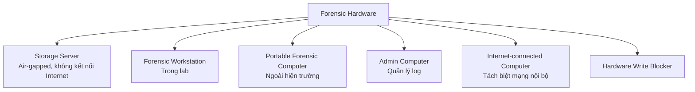
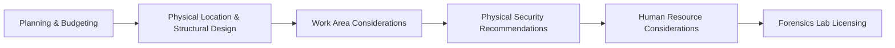

# Requirements for a Computer Forensics Lab

---

## 1. Digital Forensic Lab

!!! info "Tổng quan"
    Ngày nay, các ngân hàng, công ty công nghệ, nhà bán lẻ (Amazon, Walmart) và nhà cung cấp tiện ích đều xây dựng lab điều tra kỹ thuật số nội bộ nhằm tăng tốc quá trình điều tra và giảm chi phí.

!!! warning "LEA vs Private Lab"
    - **Private corporations**: tự do mua phần mềm/phần cứng mới nhất.
    - **Law Enforcement Agency (LEA)**: thường bị giới hạn ngân sách, có thể vẫn dùng phần mềm cũ.

!!! note "Quy trình phối hợp"
    Trong hầu hết các trường hợp, điều tra viên nội bộ và đội e-discovery của công ty sẽ phối hợp với cơ quan thực thi pháp luật để thu thập và phân tích bằng chứng đưa ra tòa.

### 1.1 Accreditation (Kiểm định)

!!! tip "Tại sao cần kiểm định?"
    Kiểm định đảm bảo lab (in-house hoặc outsource) đáp ứng tiêu chuẩn của cơ quan có thẩm quyền về:

    - Phương pháp đáng tin cậy
    - Công cụ đúng (hardware + software)
    - Nhân sự có năng lực

### 1.2 Lập kế hoạch & Ngân sách

Trước khi xây dựng lab cần xác định:

- Ngân sách khả dụng
- Mục đích sử dụng lab
- Loại thiết bị và phần mềm cần thiết

Các lab lớn có thể xử lý: malware, network breach, GPS forensics, mobile forensics.

---

## 2. Physical Requirements (Yêu cầu vật lý)

```
[Entrance]
  └── Alarm System
  └── Biometric Access (log dài hạn cho audit)
[Lab Area]
  └── Không có cửa sổ (khuyến nghị)
  └── Cách âm (ceiling + wall soundproofing, carpet sàn)
  └── Camera giám sát toàn bộ
[Evidence Storage Room]
  └── Nơi an toàn nhất
  └── Lưu trữ video recorder của hệ thống camera
  └── Fire suppression system
```

!!! danger "Chain of Custody"
    Nếu video recorder của camera bị xâm phạm → **tampering of evidence** → **vi phạm data integrity** → bằng chứng mất giá trị pháp lý.

??? details "Chi tiết yêu cầu vật lý"
    | Yêu cầu | Mô tả |
    |---|---|
    | Lối vào | Tối thiểu một lối vào kiểm soát |
    | Cửa sổ | Không nên có cửa sổ |
    | Cách âm | Vật liệu cách âm trần + tường + thảm sàn |
    | Kiểm soát vào | Alarm + Biometric + Audit log |
    | Camera | Phủ toàn bộ lab, đặc biệt lối vào và phòng lưu trữ bằng chứng |
    | Chữa cháy | Fire suppression system bắt buộc |

---

## 3. Environment Controls (Kiểm soát môi trường)

!!! info "Mục tiêu"
    Bảo vệ thiết bị forensic và thiết bị kỹ thuật số bị thu giữ khỏi hư hại.

### 3.1 Hệ thống làm mát (Air Cooling)

!!! warning "Lý do quan trọng"
    Workstation forensic có thể chạy liên tục trong thời gian dài (ví dụ: crack password). Nhiệt tích lũy nhanh trong không gian nhỏ → cần hệ thống tản nhiệt chuyên dụng.

### 3.2 Môi trường làm việc

- Nhiệt độ phù hợp
- Độ ẩm thấp
- Không khí sạch

### 3.3 Chiếu sáng & Nguồn điện

- Ánh sáng tốt toàn bộ lab và từng phòng workstation
- **UPS (Uninterruptible Power Supply)** bắt buộc cho: forensic workstation, storage server, camera giám sát

---

## 4. Digital Forensic Equipment

### 4.1 Forensic Hardware



!!! danger "Hardware Write Blocker"
    Thiết bị kết nối media bằng chứng (HDD) với workstation. **Mục đích**: ngăn bất kỳ thay đổi nào lên ổ đĩa bằng chứng trong quá trình acquisition → bảo toàn **integrity**.

??? details "Danh sách thiết bị đầy đủ"
    | Thiết bị | Ghi chú |
    |---|---|
    | License Server | Bắt buộc với một số forensic suite |
    | Storage Server | Removable HDD, air-gapped |
    | Forensic Workstation | Trong lab |
    | Portable Forensic Computer | Field work |
    | Internet Computer | Tách riêng |
    | Admin Computer | Log management |
    | Hardware Write Blocker | Bảo vệ integrity |
    | CD/DVD Drive | |
    | USB Reader | |
    | HDD/SSD cases (USB 3.0) | |
    | SD Card Reader | |
    | USB 2.0 / 3.0 Thumb Drives | Nhiều dung lượng khác nhau |
    | Tape Drives | Lưu trữ dài hạn |
    | Screwdriver, Multi-meter, Flashlight | Công cụ vật lý |

### 4.2 Cáp và Kết nối

```
Data Cables & Connectors:
├── Ethernet (RJ-45)
├── BNC adapters (modular adapters)
├── Ribbon cables
├── DIN split cables
├── VGA split cables
├── USB cables
├── Audio cables / USB extension
├── Cable extenders
├── HDMI
└── FireWire (IEEE 1394)
```

### 4.3 Office Electrical Equipment

- UPS cho mỗi workstation, server, network device
- Máy chiếu (phòng hội nghị)
- Scanner, Photocopier
- Paper Shredder
- Digital cameras (video cameras + phụ kiện)
- Wi-Fi Access Point
- Headset
- Symmetrical power source

---

## 5. Networked Devices

!!! danger "Nguyên tắc Air-gap"
    Mạng nội bộ lab (nối workstation ↔ storage server) **tuyệt đối không** kết nối Internet.

```mermaid
graph LR
    subgraph Lab Internal Network [Mạng nội bộ Lab - Isolated]
        WS1[Forensic WS 1] --- SW[Switch]
        WS2[Forensic WS 2] --- SW
        SW --- SS[Storage Server<br/>Evidence Room]
    end

    subgraph Internet Zone [Vùng Internet - Tách biệt]
        IC[Internet Computer] --- FW[Firewall/Router]
        FW --- NET[Internet]
    end

    Lab Internal Network -. "Không kết nối" .- Internet Zone
```

!!! tip "Thiết bị mạng cần có"
    - Firewall
    - Switch
    - Router
    
    *(Ba thành phần có thể gộp trong một thiết bị)*
    
    - Network cables & wires

!!! note "Truy cập Internet có kiểm soát"
    Forensic examiner đôi khi cần tra cứu thông tin hoặc cộng tác → chỉ cấp Internet qua **direct line** đến máy tính được chỉ định, không kết nối qua mạng lab.

---

## 6. Forensic Workstation

### 6.1 Hệ điều hành

!!! info "Khuyến nghị OS"
    - **Windows 10 Pro / Enterprise** (64-bit) — khuyến nghị
    - Hỗ trợ tới **6 TB RAM** và **4 processor**
    - Windows Server: hỗ trợ tới **24 TB RAM** nhưng chi phí cao hơn

### 6.2 Yêu cầu phần cứng

| Thành phần | Yêu cầu |
|---|---|
| CPU | Processing power cao |
| RAM | Dung lượng lớn |
| Storage | Lớn |
| Expansion slots | Nhiều (kết nối đa dạng thiết bị) |

!!! tip "Build vs Buy"
    Tự build forensic workstation **rẻ hơn** mua sẵn (ready-made). Phù hợp cho doanh nghiệp nhỏ.

---

## 7. Tổng quan kiến trúc Computer Forensic Lab



---

---

# 50 Câu Trắc Nghiệm

---

**Câu 1.** Mục đích chính của một Digital Forensic Lab là gì?

- A. Phát triển phần mềm bảo mật
- B. Tăng tốc quá trình điều tra và giảm chi phí điều tra kỹ thuật số
- C. Lưu trữ phần cứng cũ
- D. Đào tạo nhân viên CNTT

??? success "Đáp án"
    **B** — Lab được xây dựng để speed up investigation process và cut down costs.

---

**Câu 2.** So với lab của tư nhân, Lab của Law Enforcement Agency (LEA) thường có hạn chế gì?

- A. Không được phép dùng phần mềm forensic
- B. Phải kết nối Internet liên tục
- C. Có thể vẫn dùng phần mềm cũ do thiếu ngân sách hoặc nhân lực
- D. Không được phép kiểm định (accreditation)

??? success "Đáp án"
    **C** — LEA labs may still be using old software because they lack money or trained personnel.

---

**Câu 3.** Accreditation (kiểm định) của forensic lab đảm bảo điều gì?

- A. Lab được phép thu giữ thiết bị nghi can
- B. Lab đáp ứng tiêu chuẩn về phương pháp, công cụ, và nhân sự
- C. Lab có quyền trình bày bằng chứng tại tòa án quốc tế
- D. Lab được miễn kiểm tra định kỳ

??? success "Đáp án"
    **B** — Accreditation xác nhận reliable methods, right tools, right people.

---

**Câu 4.** Khi lập kế hoạch xây dựng forensic lab, yếu tố đầu tiên cần cân nhắc là gì?

- A. Số lượng điều tra viên
- B. Ngân sách
- C. Vị trí địa lý
- D. Loại OS sử dụng

??? success "Đáp án"
    **B** — Slide nêu rõ: "You need to think about how much money you have."

---

**Câu 5.** Tại sao forensic lab không nên có cửa sổ?

- A. Để tiết kiệm điện chiếu sáng
- B. Để tránh ánh nắng làm hỏng thiết bị
- C. Tăng cường bảo mật vật lý, ngăn quan sát từ bên ngoài
- D. Để dễ lắp đặt camera hơn

??? success "Đáp án"
    **C** — Không có cửa sổ là một yêu cầu physical security, ngăn quan sát và xâm nhập từ bên ngoài.

---

**Câu 6.** Mục đích của hệ thống biometric access trong forensic lab là gì?

- A. Tăng tốc độ ra vào lab
- B. Thay thế camera giám sát
- C. Kiểm soát và ghi log người vào lab phục vụ audit
- D. Mã hóa bằng chứng kỹ thuật số

??? success "Đáp án"
    **C** — Biometric log must be kept for a long time for auditing purposes.

---

**Câu 7.** Video recorder của hệ thống camera giám sát phải được đặt ở đâu?

- A. Phòng hội nghị
- B. Phòng làm việc chính của điều tra viên
- C. Evidence storage room — phòng an toàn nhất
- D. Ngoài hành lang

??? success "Đáp án"
    **C** — Đặt trong evidence storage room để tránh bị xâm phạm.

---

**Câu 8.** Nếu video recorder của camera giám sát bị xâm phạm, hậu quả pháp lý là gì?

- A. Lab bị mất kiểm định
- B. Tampering of evidence và violation of data integrity
- C. Điều tra viên bị sa thải
- D. Bằng chứng phải thu thập lại

??? success "Đáp án"
    **B** — Slide nêu rõ: "This can lead to the tempering of evidence and violation of data integrity."

---

**Câu 9.** Cách âm trong forensic lab được thực hiện bằng phương pháp nào?

- A. Kính hai lớp ở cửa sổ
- B. Vật liệu cách âm trần + tường, thảm sàn
- C. Hệ thống quạt công nghiệp
- D. Tường bê tông dày

??? success "Đáp án"
    **B** — Soundproofing material on ceiling and walls + carpet on floor.

---

**Câu 10.** Fire suppression system trong forensic lab có tác dụng gì liên quan đến chain of custody?

- A. Không liên quan đến chain of custody
- B. Bảo vệ bằng chứng vật lý khỏi bị phá hủy bởi lửa, duy trì tính toàn vẹn bằng chứng
- C. Chỉ bảo vệ phần cứng tránh bị cháy
- D. Kích hoạt alarm khi có xâm nhập

??? success "Đáp án"
    **B** — Bảo vệ evidence storage khỏi hỏa hoạn duy trì integrity và admissibility của bằng chứng.

---

**Câu 11.** Tại sao forensic workstation cần hệ thống làm mát (air cooling)?

- A. Để bảo vệ ổ cứng HDD khỏi từ trường
- B. Do workstation có thể chạy liên tục trong thời gian dài (như cracking password), sinh nhiều nhiệt
- C. Vì phần mềm forensic tỏa nhiều nhiệt hơn phần mềm thông thường
- D. Để UPS hoạt động hiệu quả hơn

??? success "Đáp án"
    **B** — Forensic workstations can stay running for a long time during evidence analysis.

---

**Câu 12.** Điều kiện môi trường nào là bắt buộc trong forensic lab?

- A. Nhiệt độ cao, độ ẩm cao
- B. Nhiệt độ phù hợp, độ ẩm thấp, không khí sạch
- C. Không khí vô trùng như phòng mổ
- D. Nhiệt độ dưới 10°C

??? success "Đáp án"
    **B** — Healthy climate: appropriate temperature, low humidity, clean air.

---

**Câu 13.** UPS (Uninterruptible Power Supply) trong forensic lab cần được trang bị cho những thiết bị nào?

- A. Chỉ forensic workstation
- B. Mỗi workstation, server, và network device
- C. Chỉ storage server
- D. Chỉ camera giám sát

??? success "Đáp án"
    **B** — Each workstation, server, and network device needs UPS.

---

**Câu 14.** Hardware Write Blocker có chức năng gì?

- A. Mã hóa dữ liệu trên ổ đĩa bằng chứng
- B. Ngăn dữ liệu trên evidence drive bị thay đổi trong quá trình acquisition
- C. Tăng tốc độ đọc dữ liệu từ HDD
- D. Xác thực hash của ổ đĩa bằng chứng

??? success "Đáp án"
    **B** — Write Blocker prevents data on the evidence drive from being changed during acquisition.

---

**Câu 15.** Nguyên tắc CIA nào mà Hardware Write Blocker bảo vệ trực tiếp nhất?

- A. Confidentiality
- B. Availability
- C. Integrity
- D. Authentication

??? success "Đáp án"
    **C** — Write Blocker bảo vệ Integrity của bằng chứng, không cho phép bất kỳ modification nào.

---

**Câu 16.** Storage server trong forensic lab phải có đặc điểm gì bắt buộc?

- A. Kết nối Wi-Fi để điều tra viên truy cập từ xa
- B. Không kết nối Internet (air-gapped)
- C. Chạy hệ điều hành Linux
- D. Được mã hóa toàn bộ bằng BitLocker

??? success "Đáp án"
    **B** — "This server must not be connected to the internet."

---

**Câu 17.** Tape drives trong forensic lab được dùng để làm gì?

- A. Sao lưu OS forensic workstation
- B. Lưu trữ dữ liệu dài hạn (long-term data storage)
- C. Kết nối với thiết bị di động
- D. Truyền dữ liệu tốc độ cao

??? success "Đáp án"
    **B** — Tape drives are used to store long-term data.

---

**Câu 18.** FireWire (IEEE 1394) thuộc loại kết nối nào trong forensic lab?

- A. Network cable
- B. Power cable
- C. Data cable / connector
- D. Video output

??? success "Đáp án"
    **C** — FireWire IEEE 1394 là data cable/connector được liệt kê trong danh sách forensic connectivity.

---

**Câu 19.** Portable forensic computer được sử dụng trong tình huống nào?

- A. Chỉ trong lab để xử lý bằng chứng phức tạp
- B. Ngoài hiện trường để thu thập bằng chứng và phân tích sơ bộ
- C. Kết nối với storage server trong evidence room
- D. Thay thế forensic workstation khi bảo trì

??? success "Đáp án"
    **B** — "Used outside the lab to capture evidence and for doing some analysis."

---

**Câu 20.** Administrative computer trong forensic lab có chức năng chính là gì?

- A. Phân tích malware
- B. Crack password
- C. Quản lý log và các tác vụ hành chính
- D. Kết nối trực tiếp với evidence storage server

??? success "Đáp án"
    **C** — Administrative computer is used to keep track of logs and other things.

---

**Câu 21.** Tại sao mạng nội bộ lab (kết nối workstation ↔ storage server) không được kết nối Internet?

- A. Tiết kiệm băng thông
- B. Ngăn nguy cơ bằng chứng bị xâm phạm, rò rỉ, hoặc tấn công từ bên ngoài
- C. Tốc độ mạng nội bộ nhanh hơn
- D. Vì storage server không hỗ trợ TCP/IP

??? success "Đáp án"
    **B** — Air-gap bảo vệ integrity và confidentiality của bằng chứng số.

---

**Câu 22.** Khi forensic examiner cần truy cập Internet để tra cứu thông tin, phải làm thế nào?

- A. Dùng Wi-Fi public
- B. Dùng VPN trên forensic workstation
- C. Chỉ truy cập qua máy tính được chỉ định, kết nối direct line, tách biệt mạng lab
- D. Tạm thời kết nối forensic workstation vào Internet

??? success "Đáp án"
    **C** — Internet connection should only be available through a direct line to designated computer(s).

---

**Câu 23.** Ba thành phần mạng cơ bản trong forensic lab có thể gộp trong một thiết bị là gì?

- A. Modem, Switch, Wi-Fi AP
- B. Firewall, Switch, Router
- C. Proxy, IDS, Firewall
- D. Hub, Router, Repeater

??? success "Đáp án"
    **B** — Firewall + Switch + Router có thể combined in one device.

---

**Câu 24.** Windows 10 Pro/Enterprise 64-bit được khuyến nghị cho forensic workstation vì lý do nào?

- A. Miễn phí license
- B. Có thể chạy trên phần cứng cao cấp, hỗ trợ tới 6TB RAM và 4 processor
- C. Tương thích với tất cả forensic software
- D. Có built-in write blocker

??? success "Đáp án"
    **B** — "Can run on high-end hardware, up to 6 TB RAM and four processors."

---

**Câu 25.** Windows Server so với Windows 10 Pro/Enterprise có ưu điểm gì về phần cứng?

- A. Hỗ trợ nhiều GPU hơn
- B. Hỗ trợ RAM lớn hơn (24 TB vs 6 TB)
- C. Tích hợp sẵn forensic tools
- D. Tốc độ I/O nhanh hơn gấp đôi

??? success "Đáp án"
    **B** — Windows Server editions support up to 24 TB RAM vs 6 TB of desktop editions.

---

**Câu 26.** Forensic workstation cần expansion slots với số lượng nhiều để làm gì?

- A. Cài đặt nhiều card đồ họa
- B. Kết nối đa dạng các loại thiết bị thu thập bằng chứng
- C. Tăng số màn hình hiển thị
- D. Gắn thêm card âm thanh

??? success "Đáp án"
    **B** — Nhiều expansion slots để connect different types of devices.

---

**Câu 27.** Lý do nên tự build forensic workstation thay vì mua sẵn (ready-made) là gì?

- A. Hiệu năng cao hơn
- B. Tự build rẻ hơn đáng kể
- C. Tự build được cấp chứng nhận forensic
- D. Ready-made không tương thích với write blocker

??? success "Đáp án"
    **B** — "Building costs money, but still cheaper than buying a ready-made workstation."

---

**Câu 28.** Paper shredder trong forensic lab phục vụ mục đích gì từ góc độ bảo mật?

- A. Hủy bằng chứng vật lý không cần thiết
- B. Ngăn lộ thông tin nhạy cảm qua tài liệu in
- C. Xử lý rác thải điện tử
- D. Tuân thủ quy định môi trường

??? success "Đáp án"
    **B** — Paper shredder bảo vệ confidentiality của thông tin nhạy cảm trên tài liệu giấy.

---

**Câu 29.** Storage server phải được đặt ở đâu trong forensic lab?

- A. Phòng hội nghị
- B. Phòng làm việc chung của điều tra viên
- C. Evidence room để kiểm soát truy cập
- D. Ngoài lab để tiện quản lý

??? success "Đáp án"
    **C** — "The server must be put in the evidence room to keep people from getting to it."

---

**Câu 30.** Symmetrical power source trong lab phục vụ mục đích gì?

- A. Cung cấp điện dự phòng như UPS
- B. Đảm bảo điện áp ổn định và cân bằng tải cho các thiết bị
- C. Kết nối hai nguồn điện độc lập
- D. Giảm nhiễu điện từ cho thiết bị forensic

??? success "Đáp án"
    **B** — Symmetrical power source đảm bảo nguồn điện ổn định, cân bằng tải.

---

**Câu 31.** Trong quy trình lập kế hoạch Computer Forensic Lab, bước đầu tiên là gì?

- A. Physical security recommendations
- B. Forensics lab licensing
- C. Planning and budgeting
- D. Work area considerations

??? success "Đáp án"
    **C** — Theo sơ đồ: Planning and budgeting → Physical location → Work area → Physical security → Human resource → Licensing.

---

**Câu 32.** Yêu cầu nào SAI về biometric access system?

- A. Phải ghi log người vào lab
- B. Log phải được lưu dài hạn cho auditing
- C. Chỉ cần biometric, không cần alarm system
- D. Biometric kết hợp với alarm system tại entrance

??? success "Đáp án"
    **C** — Cả alarm system VÀ biometric đều bắt buộc, không thay thế nhau.

---

**Câu 33.** Các công ty lớn xây dựng advanced forensic lab có thể xử lý những loại case nào?

- A. Chỉ malware và network forensics
- B. Malware, outside breaches, network, GPS, mobile forensics
- C. Chỉ mobile và GPS forensics
- D. Chỉ network và disk forensics

??? success "Đáp án"
    **B** — "Labs can handle all types: malware, outside breaches, network, GPS, mobile forensics."

---

**Câu 34.** In-house digital forensics analysts thường phối hợp với ai để giải quyết vụ việc?

- A. Chỉ với ban lãnh đạo công ty
- B. Law enforcement (cơ quan thực thi pháp luật)
- C. Các công ty forensic tư nhân khác
- D. Tòa án trực tiếp

??? success "Đáp án"
    **B** — "In-house analysts work with law enforcement to solve cases related to their businesses."

---

**Câu 35.** E-discovery team có vai trò gì trong forensic investigation?

- A. Thiết kế forensic lab
- B. Mua phần cứng forensic
- C. Phối hợp thu thập và phân tích bằng chứng kỹ thuật số
- D. Cấp chứng chỉ forensic cho điều tra viên

??? success "Đáp án"
    **C** — E-discovery team works to get and analyze the evidence.

---

**Câu 36.** HDD và SSD cases với cổng USB 3.0 trong forensic lab được dùng để làm gì?

- A. Lưu trữ dài hạn thay thế tape drive
- B. Kết nối ổ đĩa bằng chứng với workstation (thường kết hợp với write blocker)
- C. Cài đặt OS cho forensic workstation
- D. Backup dữ liệu lên cloud

??? success "Đáp án"
    **B** — HDD/SSD cases với USB 3.0 để mount ổ đĩa bằng chứng một cách cơ động.

---

**Câu 37.** Tại sao forensic lab cần cả USB 2.0 lẫn USB 3.0 thumb drives với nhiều dung lượng khác nhau?

- A. Để phân biệt dữ liệu mã hóa và không mã hóa
- B. Tương thích với nhiều loại thiết bị và đáp ứng nhu cầu transfer đa dạng
- C. Yêu cầu của tiêu chuẩn ISO forensic
- D. Vì USB 3.0 không tương thích với thiết bị cũ

??? success "Đáp án"
    **B** — Cần đa dạng để đảm bảo tương thích backward compatibility và linh hoạt trong field work.

---

**Câu 38.** Mạng nào trong forensic lab ĐƯỢC PHÉP kết nối Internet?

- A. Mạng kết nối forensic workstation với storage server
- B. Mạng kết nối administrative computer với evidence room
- C. Mạng riêng cho máy tính Internet được chỉ định, tách biệt hoàn toàn với mạng lab
- D. Không có mạng nào được kết nối Internet

??? success "Đáp án"
    **C** — Internet chỉ có trên máy tính chỉ định, tách hoàn toàn khỏi lab internal network.

---

**Câu 39.** Tại sao camera giám sát phải phủ toàn bộ lab, đặc biệt lối vào và evidence room?

- A. Để điều tra viên theo dõi từ xa
- B. Tạo audit trail về ai đã tiếp cận bằng chứng, phát hiện tampering
- C. Yêu cầu bảo hiểm của thiết bị
- D. Thay thế biometric system

??? success "Đáp án"
    **B** — Camera tạo visual audit trail, phát hiện unauthorized access và tampering.

---

**Câu 40.** Điều nào sau đây KHÔNG phải là environment control trong forensic lab?

- A. Hệ thống làm mát air cooling
- B. Độ ẩm thấp
- C. Biometric access system
- D. UPS cho workstation

??? success "Đáp án"
    **C** — Biometric access system thuộc Physical Requirements (security), không phải Environment Controls (môi trường vật lý).

---

**Câu 41.** Forensic lab nên có bao nhiêu lối vào và tại sao?

- A. Nhiều lối vào để thuận tiện
- B. Tối thiểu một, càng ít càng tốt để kiểm soát truy cập
- C. Hai lối vào: một chính, một thoát hiểm
- D. Ba lối vào theo tiêu chuẩn NFPA

??? success "Đáp án"
    **B** — "There must be at least one way" — ít lối vào = dễ kiểm soát hơn.

---

**Câu 42.** Trong Digital Forensics, khái niệm "chain of custody" liên quan trực tiếp nhất đến yêu cầu nào?

- A. Tốc độ xử lý của workstation
- B. Tính toàn vẹn (integrity) và khả năng kiểm toán (auditability) của bằng chứng
- C. Bandwidth của mạng nội bộ
- D. Số lượng điều tra viên tham gia

??? success "Đáp án"
    **B** — Chain of custody = duy trì integrity + audit trail từ thu thập đến trình tòa.

---

**Câu 43.** Screwdriver, multi-meter, và flashlight trong forensic lab phục vụ mục đích gì?

- A. Sửa chữa thiết bị điện
- B. Tháo lắp, kiểm tra phần cứng vật lý khi xử lý thiết bị bằng chứng
- C. Kiểm tra nguồn điện của UPS
- D. Lắp đặt camera giám sát

??? success "Đáp án"
    **B** — Other tools để tháo lắp và kiểm tra thiết bị vật lý trong quá trình acquisition.

---

**Câu 44.** Điều nào sau đây là đúng về licensing trong forensic lab?

- A. Không cần license vì forensic software là open-source
- B. Một số forensic suite yêu cầu licensing server riêng biệt
- C. License được cấp bởi cơ quan thực thi pháp luật
- D. License chỉ áp dụng cho phần cứng

??? success "Đáp án"
    **B** — "Licensing the server (which is required by some digital forensics suites)."

---

**Câu 45.** Outsourcing digital forensics cho third-party provider đòi hỏi điều gì quan trọng nhất?

- A. Third-party phải là công ty nhà nước
- B. Kiểm tra accreditation của third-party provider
- C. Ký NDA với provider
- D. Provider phải có office gần trụ sở

??? success "Đáp án"
    **B** — Accreditation ensures the outsourced lab meets required standards.

---

**Câu 46.** Tại sao projector (máy chiếu) là thiết bị cần thiết trong forensic lab?

- A. Để trình chiếu bằng chứng trong phòng hội nghị khi họp và phân tích
- B. Thay thế màn hình máy tính
- C. Chiếu hình ảnh từ camera giám sát
- D. Bắt buộc theo tiêu chuẩn ISO

??? success "Đáp án"
    **A** — Projector dùng trong conference room để phân tích và trình bày findings.

---

**Câu 47.** Khi xây dựng forensic workstation từ đầu, yếu tố phần cứng nào KHÔNG được đề cập trong slide?

- A. CPU mạnh
- B. RAM lớn
- C. GPU chuyên dụng
- D. Nhiều expansion slots

??? success "Đáp án"
    **C** — Slide không đề cập GPU. Forensic workstation cần CPU, RAM, storage, expansion slots.

---

**Câu 48.** BNC adapter trong danh sách forensic connectors thường dùng để làm gì?

- A. Kết nối màn hình VGA
- B. Kết nối camera analog CCTV hoặc thiết bị mạng cũ
- C. Kết nối USB 3.0
- D. Kết nối FireWire

??? success "Đáp án"
    **B** — BNC (Bayonet Neill-Concelman) thường dùng cho camera CCTV analog và thiết bị network cũ.

---

**Câu 49.** Wi-Fi Access Point trong forensic lab được phép kết nối vào mạng nào?

- A. Mạng nội bộ kết nối storage server
- B. Mạng Internet zone, tách biệt với mạng lab internal
- C. Cả hai mạng
- D. Không được phép có Wi-Fi trong forensic lab

??? success "Đáp án"
    **B** — Wi-Fi thuộc zone Internet, không được kết nối vào lab internal network (air-gapped).

---

**Câu 50.** Điều nào sau đây mô tả ĐÚNG NHẤT về thiết kế mạng của một forensic lab chuẩn?

- A. Một mạng duy nhất nối toàn bộ thiết bị, có firewall bảo vệ
- B. Hai mạng riêng biệt: internal air-gapped (workstation ↔ server) và Internet zone (máy được chỉ định), hoàn toàn không kết nối với nhau
- C. Mạng VPN mã hóa kết nối tất cả thiết bị
- D. Mạng VLAN phân tách logically nhưng vẫn cùng physical switch

??? success "Đáp án"
    **B** — Hai mạng hoàn toàn tách biệt: internal air-gapped + Internet zone riêng. VLAN không đủ vì vẫn có thể có lateral movement.
