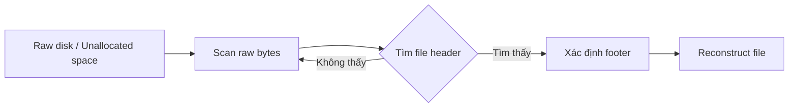
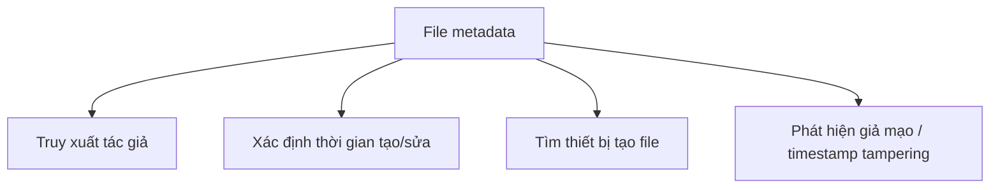
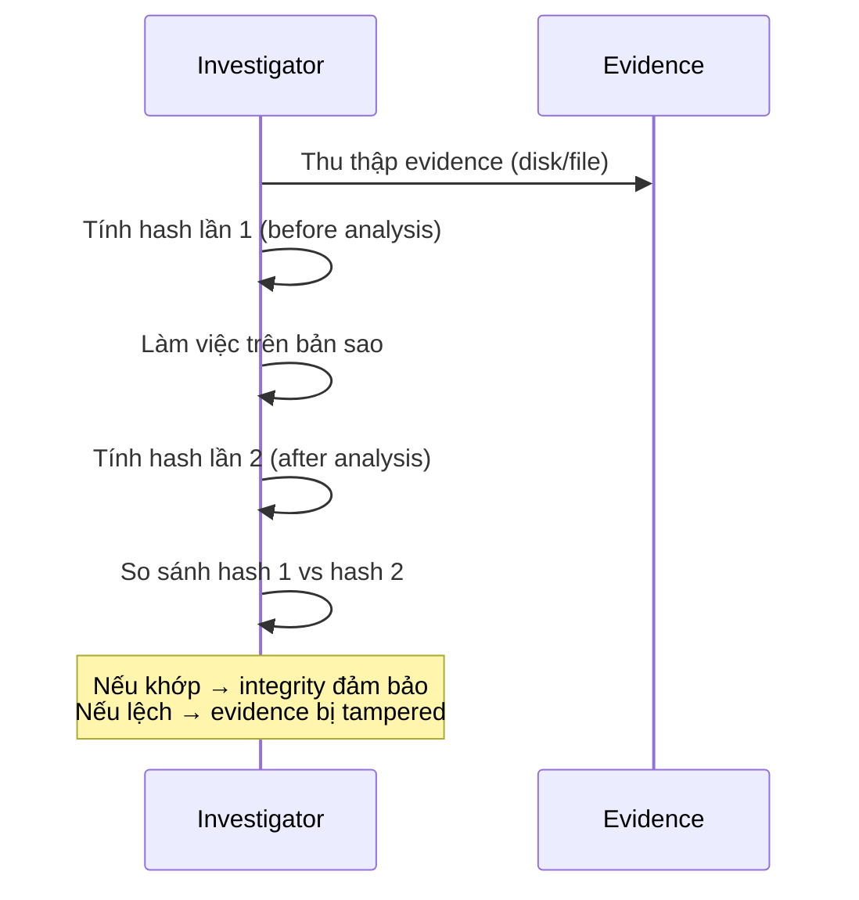
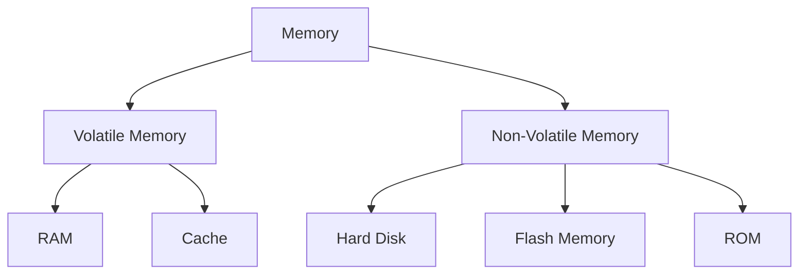
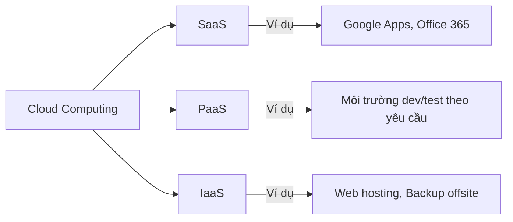

# Essential Technical Concepts — Digital Forensics

---

## 1. Hệ thống số

### 1.1 Decimal (Cơ số 10)

Hệ thập phân dùng 10 ký hiệu: `0 1 2 3 4 5 6 7 8 9`. Giá trị mỗi chữ số phụ thuộc vào **vị trí** — nhân với lũy thừa tương ứng của 10.

```
7564 = 7×10³ + 5×10² + 6×10¹ + 4×10⁰
     = 7000 + 500 + 60 + 4
```

---

### 1.2 Binary (Cơ số 2)

Máy tính lưu trữ mọi thứ dưới dạng nhị phân — chỉ gồm `0` và `1`.

- **1 bit** = 1 chữ số nhị phân (0 hoặc 1)
- **1 byte** = 8 bit

```
110011001₂ = 1×2⁸ + 1×2⁷ + 0×2⁶ + 0×2⁵ + 1×2⁴ + 1×2³ + 0×2² + 0×2¹ + 1×2⁰
           = 256 + 128 + 0 + 0 + 16 + 8 + 0 + 0 + 1
           = 409₁₀
```

!!! info "Lưu ý"
    Toàn bộ dữ liệu số — văn bản Word, ảnh, video, email, tweet — đều được lưu dưới dạng binary.

---

### 1.3 Hexadecimal (Cơ số 16)

Dùng 16 ký hiệu: `0–9` và `A–F` (A=10, B=11, ..., F=15).

!!! tip "Mục đích chính"
    Rút gọn binary dài thành dạng **con người đọc được**. Mỗi 4 bit → 1 ký tự hex.

```
0xFF = 1111 1111₂ = 255₁₀
0x1A = 0001 1010₂ = 26₁₀
```

Hex xuất hiện nhiều khi xem **memory address**, **file header**, **shellcode**.

---

## 2. File Carving

### 2.1 Khái niệm

**File carving** là kỹ thuật phục hồi file **chỉ dựa vào cấu trúc và nội dung file**, không cần file system metadata.



!!! warning "Vì sao file vẫn còn sau khi xóa?"
    Hầu hết filesystem khi xóa file **chỉ xóa entry trong file table**, không xóa dữ liệu thực. Dữ liệu vẫn nằm trong **unallocated space** cho đến khi bị ghi đè.

### 2.2 Cơ chế hoạt động

- Scan toàn bộ raw bytes của disk
- Nhận diện file thông qua **header (magic bytes)** và **footer**
- Đặc biệt với JPEG: không tìm footer từ đầu mà **nhảy từ marker đến marker** đến khi gặp **SOS (Start of Scan)**

```
JPEG structure (hex dump):
FF D8          → SOI (Start of Image) - HEADER
FF E0 ...      → APP0 marker
FF DB ...      → DQT marker  
FF DA ...      → SOS (Start of Scan) - bắt đầu data thực
...data...
FF D9          → EOI (End of Image)  - FOOTER
```

### 2.3 Tools phổ biến

| Tool | Mô tả |
|------|-------|
| **Autopsy** | GUI forensics suite, hỗ trợ disk image |
| **Binwalk** | Tìm file/data nhúng trong binary |
| **Foremost** | File carving theo header/footer |
| **Scalpel** | Tương tự Foremost, cấu hình linh hoạt hơn |
| **Bulk Extractor** | Extract pcap, URL, IP, MAC, email từ image |
| **PhotoRec** | GUI + CLI, chọn file type cần tìm |
| **FindAES** | Tìm AES key (128/192/256-bit) qua key schedule |

---

## 3. File Structure

### 3.1 File format & File signature

Mỗi file type có **encoding scheme** riêng gọi là **file format** — có thể open-source (PNG, ISO/IEC) hoặc proprietary (WMA, PSD).

!!! danger "Không tin vào file extension!"
    Extension có thể bị đổi tùy ý (`.docx` → `.dll`, `.png`...). Forensics analyst **phải kiểm tra file signature (magic bytes)** tại 20 byte đầu của file.

```
Một số magic bytes phổ biến:
FF D8 FF       → JPEG
89 50 4E 47    → PNG  (%PNG)
50 4B 03 04    → ZIP / DOCX / XLSX / APK
25 50 44 46    → PDF  (%PDF)
4D 5A          → Windows PE (MZ header)
7F 45 4C 46    → ELF (Linux executable)
```

### 3.2 Hex Editors để phân tích

- **wxHexEditor** — wxhexeditor.org
- **Free Hex Editor Neo** — hhdsoftware.com
- **PSPad** — pspad.com

### 3.3 Container formats

Một số format chứa nhiều loại nội dung trong 1 file:

```
OGG container:
├── Video stream
├── Audio stream  
├── Text / Subtitle
└── Metadata

Tương tự: AVI, WAV, 3GP
```

---

## 4. Digital File Metadata

### 4.1 Định nghĩa

> **Metadata = thông tin về thông tin** (data about data)

Metadata có thể được nhúng trong file hoặc lưu trong file riêng biệt.

Ví dụ metadata trong MS Word:
- Author name, Organization name
- Computer name
- Date/time created
- Comments, revision history

### 4.2 Ứng dụng trong forensics



!!! warning "Timestamp tampering"
    Tội phạm có thể **chỉnh sửa metadata** để xóa bằng chứng. Forensics specialist phải phát hiện hành vi này và trình bày trước tòa.

### 4.3 Timestamp metadata

Các loại timestamp quan trọng:
- **Created** — ngày tạo file
- **Modified** — ngày sửa lần cuối  
- **Accessed** — ngày truy cập lần cuối

!!! note "Chú ý"
    Timestamp trong Windows Registry được lưu dạng **binary** → cần decode sang ASCII. Tool: [digital-detective.net](https://www.digital-detective.net/digital-forensic-software/freetools)

### 4.4 Tools xem/chỉnh metadata

| Tool | Mục đích |
|------|----------|
| **ExifTool** | Đọc/ghi metadata đa dạng format |
| **Exif Pilot** | Viewer/editor cho ảnh |
| **GIMP** | Xem/sửa metadata ảnh |
| **Pdf Metadata Editor** | PDF |
| **Mp3tag** | Audio |
| **XnView** | Image metadata |
| **MediaInfo** | Video và audio |

---

## 5. Hash Analysis

### 5.1 Nguyên lý

Hash function: `f(input) → fixed-length output (digest)`

Tính chất:
- **Deterministic**: cùng input → cùng output
- **One-way**: không thể đảo ngược
- **Collision resistant**: khó tìm 2 input khác nhau có cùng hash
- **Avalanche effect**: thay 1 bit input → output thay đổi hoàn toàn

```
MD5("hello")    = 5d41402abc4b2a76b9719d911017c592
MD5("Hello")    = 8b1a9953c4611296a827abf8c47804d7
                  ↑ hoàn toàn khác dù chỉ thay đổi 1 ký tự
```

### 5.2 Vai trò trong Digital Forensics



!!! info "Hash = Digital Fingerprint"
    MD5 và SHA-256 là hai thuật toán phổ biến nhất trong forensics. SHA-256 được khuyến nghị vì MD5 đã có collision attacks.

### 5.3 Tools tính hash

- **Febooti Hash and CRC** — tích hợp vào Windows right-click menu
- **HashMyFiles** (NirSoft) — batch hashing, hỗ trợ MD5, SHA-256

---

## 6. System Memory

### 6.1 Phân loại



| Loại | Đặc điểm | Ví dụ |
|------|----------|-------|
| **Volatile** | Mất dữ liệu khi mất điện | RAM, CPU Cache |
| **Non-volatile** | Giữ dữ liệu dù mất điện | HDD, SSD, ROM, Flash |

### 6.2 Primary vs Secondary Storage

**Primary Storage (Main Memory):**
- Volatile
- Nhỏ hơn, nhanh hơn, đắt hơn
- RAM (SRAM, DRAM) và Cache

**Secondary Storage:**
- Non-volatile, long-term
- Lớn hơn, chậm hơn, rẻ hơn
- HDD, SSD, Flash (USB), CD/DVD

**Backup/Auxiliary Storage:**
- Dạng non-volatile dùng để lưu trữ dài hạn bên ngoài hệ thống chính

---

## 7. Cloud Computing

### 7.1 Các mô hình dịch vụ



| Model | Người dùng quản lý | Provider quản lý |
|-------|-------------------|-----------------|
| **SaaS** | Dữ liệu | App + Platform + Infra |
| **PaaS** | App + Dữ liệu | Platform + Infra |
| **IaaS** | App + OS + Dữ liệu | Hardware + Datacenter |

### 7.2 Thách thức với forensics

!!! danger "Vấn đề pháp lý cross-jurisdiction"
    Nếu suspect ở UK nhưng dữ liệu lưu tại Singapore → cảnh sát UK **không có quyền tự động** yêu cầu provider Singapore giao dữ liệu. Đây là thách thức lớn của digital forensics trong kỷ nguyên cloud.

---

---

# 50 Câu Trắc Nghiệm

---

**Q1.** Hệ thập phân (decimal) sử dụng bao nhiêu ký hiệu?

- A. 2  
- B. 8  
- C. **10** ✓  
- D. 16  

> **Giải thích:** Decimal = base-10, dùng các ký hiệu 0–9.

---

**Q2.** Trong hệ nhị phân, `1 byte` tương đương bao nhiêu bit?

- A. 4  
- B. **8** ✓  
- C. 16  
- D. 32  

---

**Q3.** Binary `110011001` chuyển sang decimal bằng bao nhiêu?

- A. 256  
- B. 384  
- C. **409** ✓  
- D. 512  

> **Giải thích:** 256+128+16+8+1 = 409.

---

**Q4.** Hexadecimal sử dụng bao nhiêu ký hiệu?

- A. 8  
- B. 10  
- C. 12  
- D. **16** ✓  

---

**Q5.** Trong hệ hex, chữ cái `F` biểu diễn giá trị decimal nào?

- A. 14  
- B. **15** ✓  
- C. 16  
- D. 17  

---

**Q6.** Mục đích chính của hệ hexadecimal trong máy tính là gì?

- A. Thực hiện phép tính số học nhanh hơn  
- B. **Biểu diễn dữ liệu binary dài dưới dạng compact, dễ đọc** ✓  
- C. Mã hóa dữ liệu  
- D. Thay thế hệ thập phân  

---

**Q7.** File carving trong digital forensics là gì?

- A. Kỹ thuật mã hóa file  
- B. Kỹ thuật nén file  
- C. **Kỹ thuật phục hồi file dựa trên cấu trúc/nội dung, không cần filesystem metadata** ✓  
- D. Kỹ thuật phân tích metadata  

---

**Q8.** Unallocated space trên disk là gì?

- A. Vùng đĩa bị hỏng  
- B. Vùng đĩa được mã hóa  
- C. **Vùng mà file system không còn ghi nhận thông tin file nào** ✓  
- D. Vùng dành riêng cho OS  

---

**Q9.** Tại sao file carving có thể phục hồi được file đã xóa?

- A. Vì file được backup tự động  
- B. **Vì hầu hết filesystem chỉ xóa entry trong file table, không xóa dữ liệu thực** ✓  
- C. Vì dữ liệu được lưu trên cloud  
- D. Vì file được nén lại  

---

**Q10.** File carving hoạt động bằng cách nào?

- A. Đọc file table của filesystem  
- B. Giải mã dữ liệu được mã hóa  
- C. **Scan raw bytes và nhận diện qua header/footer** ✓  
- D. Phân tích log hệ thống  

---

**Q11.** Khi carving file JPEG, thuật toán phải làm gì thay vì tìm footer từ đầu header?

- A. Đọc toàn bộ file một lần  
- B. Giải mã nén ảnh  
- C. **Nhảy từ marker đến marker cho đến khi gặp SOS marker** ✓  
- D. Tính hash của từng block  

---

**Q12.** SOS trong cấu trúc file JPEG là viết tắt của gì?

- A. Start of Size  
- B. **Start of Scan** ✓  
- C. Start of Segment  
- D. Start of Stream  

---

**Q13.** Tool nào trong danh sách dưới đây có khả năng tìm AES key từ trong image?

- A. Autopsy  
- B. Foremost  
- C. PhotoRec  
- D. **FindAES** ✓  

---

**Q14.** Binwalk được dùng để làm gì?

- A. Phân tích log Windows  
- B. **Tìm file/data nhúng trong binary file** ✓  
- C. Tính hash giá trị  
- D. Giải mã certificate  

---

**Q15.** Bulk Extractor có thể extract loại thông tin nào từ disk image?

- A. Chỉ file ảnh  
- B. Chỉ file PDF  
- C. **pcap, URL, domain, IP, MAC, email** ✓  
- D. Chỉ file text  

---

**Q16.** File format là gì?

- A. Tên của file  
- B. Kích thước của file  
- C. **Encoding scheme quy định cách thông tin được lưu trong file** ✓  
- D. Ngày tạo file  

---

**Q17.** Trong digital forensics, tại sao không nên chỉ dựa vào file extension để xác định file type?

- A. Extension quá dài để đọc  
- B. Extension không phải chuẩn quốc tế  
- C. **Extension có thể bị thay đổi tùy ý để che giấu loại file thực** ✓  
- D. Extension chỉ hoạt động trên Windows  

---

**Q18.** File signature (magic bytes) thường nằm ở đâu trong file?

- A. Cuối file  
- B. Giữa file  
- C. **20 byte đầu của file** ✓  
- D. Tại offset ngẫu nhiên  

---

**Q19.** Magic bytes `FF D8 FF` ứng với loại file nào?

- A. PNG  
- B. PDF  
- C. **JPEG** ✓  
- D. ZIP  

---

**Q20.** Magic bytes `50 4B 03 04` ứng với loại file nào?

- A. JPEG  
- B. PDF  
- C. ELF  
- D. **ZIP / DOCX / XLSX / APK** ✓  

---

**Q21.** Format OGG có đặc điểm gì đặc biệt về cấu trúc?

- A. Chỉ chứa audio  
- B. Chỉ chứa video  
- C. **Có thể chứa video, audio, text và metadata trong 1 container** ✓  
- D. Chỉ chứa metadata  

---

**Q22.** Metadata trong file kỹ thuật số là gì?

- A. Nội dung chính của file  
- B. **Thông tin mô tả về file (thông tin về thông tin)** ✓  
- C. Phần header của file  
- D. Checksum của file  

---

**Q23.** Metadata trong file MS Word có thể chứa thông tin nào sau đây?

- A. CPU model của máy tạo file  
- B. **Author name, organization, computer name, date/time created** ✓  
- C. Dung lượng RAM của máy  
- D. IP address của máy tạo file  

---

**Q24.** Trong digital forensics, metadata có thể được dùng để làm gì?

- A. Mã hóa file  
- B. Nén dữ liệu  
- C. **Truy xuất tác giả, thời gian tạo, thiết bị sử dụng** ✓  
- D. Kiểm tra virus  

---

**Q25.** Timestamp metadata quan trọng nhất trong forensics gồm những loại nào?

- A. File size, format, encoding  
- B. **Created, Modified, Accessed** ✓  
- C. Author, title, subject  
- D. Hash MD5, SHA1, SHA256  

---

**Q26.** Tại sao tội phạm có thể chỉnh sửa metadata của file?

- A. Để nén file nhỏ hơn  
- B. Để tăng tốc độ đọc file  
- C. **Để xóa bằng chứng và đánh lạc hướng điều tra viên** ✓  
- D. Để mã hóa dữ liệu  

---

**Q27.** Timestamp trong Windows Registry được lưu dưới dạng nào?

- A. ASCII text  
- B. Unicode  
- C. **Binary** ✓  
- D. JSON  

---

**Q28.** ExifTool được dùng để làm gì?

- A. Tách file từ disk image  
- B. Tính hash của file  
- C. **Đọc, ghi và chỉnh sửa metadata của nhiều định dạng file** ✓  
- D. Phân tích network traffic  

---

**Q29.** Trong hashing, tính chất nào đảm bảo không thể từ hash value suy ngược ra input?

- A. Deterministic  
- B. Collision resistant  
- C. **One-way (preimage resistance)** ✓  
- D. Avalanche effect  

---

**Q30.** Hash được sử dụng trong digital forensics để làm gì?

- A. Mã hóa evidence  
- B. Nén disk image  
- C. **Xác minh tính toàn vẹn của evidence trước và sau điều tra** ✓  
- D. Phục hồi file đã xóa  

---

**Q31.** Hash còn được gọi là gì trong digital forensics?

- A. Digital signature  
- B. Digital certificate  
- C. **Digital fingerprint** ✓  
- D. Digital watermark  

---

**Q32.** MD5 và SHA-256 là loại gì?

- A. Thuật toán mã hóa đối xứng  
- B. Thuật toán mã hóa bất đối xứng  
- C. **Thuật toán hash mật mã học** ✓  
- D. Thuật toán nén dữ liệu  

---

**Q33.** Khi nào forensics investigator tính hash lần đầu?

- A. Sau khi phân tích xong  
- B. Khi nộp report cho tòa  
- C. **Ngay khi thu thập evidence, trước khi bắt đầu phân tích** ✓  
- D. Sau khi sao lưu evidence  

---

**Q34.** Nếu hash của evidence trước và sau phân tích khác nhau, điều đó cho thấy điều gì?

- A. Thuật toán hash có lỗi  
- B. File quá lớn  
- C. **Evidence đã bị thay đổi / tampered** ✓  
- D. Ổ cứng bị lỗi  

---

**Q35.** Volatile memory có đặc điểm nào sau đây?

- A. Giữ dữ liệu khi mất điện  
- B. Chậm hơn non-volatile  
- C. **Mất dữ liệu ngay khi mất điện** ✓  
- D. Dung lượng lớn hơn HDD  

---

**Q36.** RAM thuộc loại memory nào?

- A. Non-volatile  
- B. Secondary storage  
- C. **Volatile memory** ✓  
- D. Backup storage  

---

**Q37.** Non-volatile memory là loại nào trong danh sách sau?

- A. RAM  
- B. CPU Cache  
- C. DRAM  
- D. **ROM, HDD, Flash** ✓  

---

**Q38.** Primary storage có đặc điểm nào so với secondary storage?

- A. Chậm hơn và rẻ hơn  
- B. Lớn hơn và chậm hơn  
- C. **Nhỏ hơn, nhanh hơn và đắt hơn** ✓  
- D. Non-volatile và bền hơn  

---

**Q39.** Hai loại primary storage memory trong máy tính là gì?

- A. HDD và SSD  
- B. ROM và Flash  
- C. **RAM và Cache (CPU memory)** ✓  
- D. PROM và EPROM  

---

**Q40.** Secondary storage gồm những ví dụ nào sau đây?

- A. RAM và Cache  
- B. SRAM và DRAM  
- C. **HDD, SSD, Flash (USB), CD/DVD** ✓  
- D. PROM và EEPROM  

---

**Q41.** Tại sao secondary storage quan trọng với máy tính?

- A. Giúp CPU xử lý nhanh hơn  
- B. **Nếu không có, toàn bộ chương trình và dữ liệu sẽ mất khi tắt máy** ✓  
- C. Cung cấp kết nối mạng  
- D. Giúp RAM hoạt động hiệu quả hơn  

---

**Q42.** Cloud computing là gì?

- A. Mô hình phần cứng mới  
- B. Hệ điều hành dạng web  
- C. **Mô hình cung cấp dịch vụ computing qua internet** ✓  
- D. Giao thức mạng không dây  

---

**Q43.** SaaS (Software as a Service) có đặc điểm nào?

- A. Client tự quản lý phần cứng  
- B. Client tự quản lý OS và runtime  
- C. **Client dùng ứng dụng trên cloud, không cài trên máy local** ✓  
- D. Client tự cài đặt toàn bộ stack  

---

**Q44.** Ví dụ nào sau đây là SaaS?

- A. AWS EC2  
- B. Google Cloud Platform  
- C. **Google Apps for Education, Microsoft Office 365** ✓  
- D. Docker container  

---

**Q45.** PaaS (Platform as a Service) phù hợp nhất cho đối tượng nào?

- A. Người dùng cá nhân lưu ảnh  
- B. Doanh nghiệp thuê phần cứng  
- C. **Công ty phát triển phần mềm / web cần môi trường dev/test** ✓  
- D. Cơ quan thực thi pháp luật  

---

**Q46.** IaaS (Infrastructure as a Service) cung cấp điều gì cho khách hàng?

- A. Ứng dụng hoàn chỉnh trên cloud  
- B. Môi trường lập trình sẵn có  
- C. **Phần cứng (server, datacenter) cho thuê qua internet** ✓  
- D. Quản lý toàn bộ IT cho doanh nghiệp  

---

**Q47.** Cloud computing đặt ra thách thức gì cho digital forensics?

- A. Dữ liệu bị mã hóa quá mạnh  
- B. Thiếu công cụ phân tích  
- C. **Vấn đề pháp lý cross-jurisdiction khi dữ liệu lưu ở nước khác** ✓  
- D. Tốc độ mạng quá chậm  

---

**Q48.** Forensics investigator cần làm gì khi thu thập evidence từ disk?

- A. Mở trực tiếp trên máy gốc  
- B. Chạy antivirus trước  
- C. **Tính hash trước khi phân tích, làm việc trên bản sao, tính lại hash sau** ✓  
- D. Xóa các file không liên quan  

---

**Q49.** Kỹ thuật nào dùng để phân tích file JPEG trong file carving khác với các loại file thông thường?

- A. Tìm footer từ vị trí cố định  
- B. Giải mã toàn bộ stream  
- C. **Nhảy từ marker đến marker cho đến khi gặp SOS** ✓  
- D. Đọc từ cuối file lên đầu  

---

**Q50.** Nhận định nào SAI về hashing trong forensics?

- A. Hash đảm bảo tính toàn vẹn của evidence  
- B. MD5 và SHA-256 là các thuật toán hash phổ biến  
- C. Hash được tính trước khi bắt đầu phân tích  
- D. **Từ hash value có thể khôi phục lại nội dung file gốc** ✓  

> **Giải thích:** Hash là hàm một chiều (one-way), không thể đảo ngược để lấy lại dữ liệu gốc. Đây là tính chất cơ bản của cryptographic hash function.

---

**Q51.** Dữ liệu được lưu trữ trong máy tính dưới dạng nào?

- A. Decimal  
- B. Octal  
- C. **Binary** ✓  
- D. Hexadecimal  

---

**Q52.** Điểm khác biệt giữa SRAM và DRAM là gì?

- A. SRAM là non-volatile, DRAM là volatile  
- B. SRAM dùng cho secondary storage  
- C. **Cả hai đều là RAM nhưng khác nhau về cấu trúc và tốc độ** ✓  
- D. DRAM là read-only  

---

**Q53.** PhotoRec có tính năng đặc biệt nào so với các carving tool khác?

- A. Chỉ chạy được trên Linux  
- B. Chỉ phục hồi ảnh JPEG  
- C. **Cho phép chọn file type cần tìm, có cả GUI và CLI** ✓  
- D. Tích hợp phân tích malware  

---

**Q54.** Tại sao forensics analyst không làm việc trực tiếp trên evidence gốc?

- A. Vì evidence gốc quá nặng để di chuyển  
- B. Vì evidence gốc không thể đọc được  
- C. **Để bảo toàn tính toàn vẹn của evidence, tránh thay đổi ngoài ý muốn** ✓  
- D. Vì quy định cấm phân tích evidence gốc  

---

**Q55.** EEPROM khác ROM ở điểm nào?

- A. EEPROM nhanh hơn  
- B. EEPROM là volatile  
- C. **EEPROM có thể xóa và ghi lại được bằng điện** ✓  
- D. EEPROM là secondary storage
