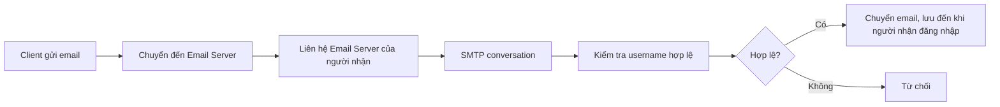
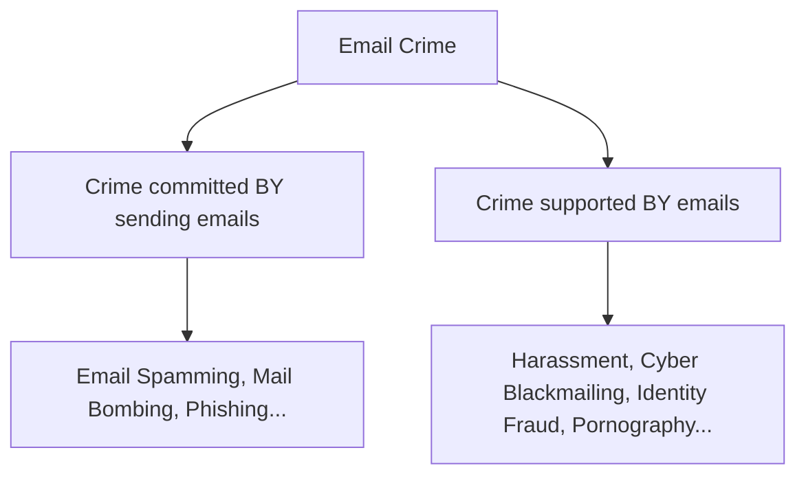
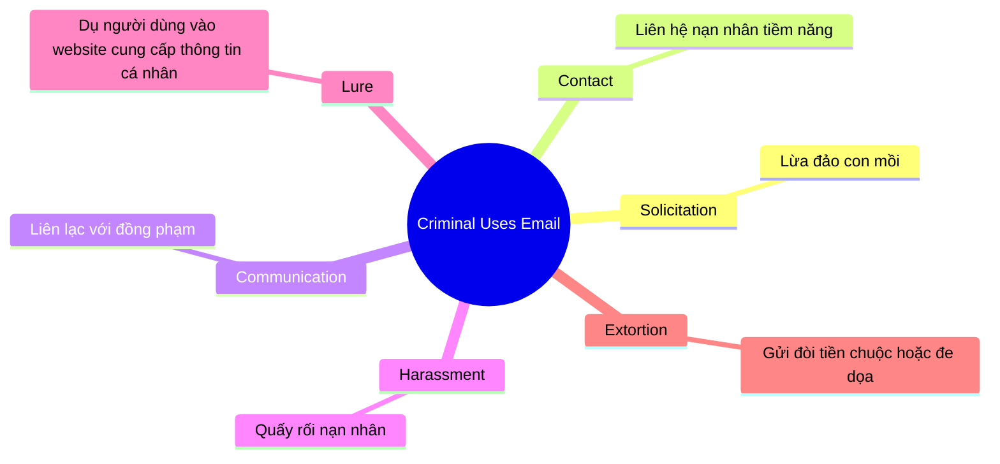
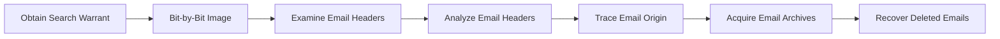
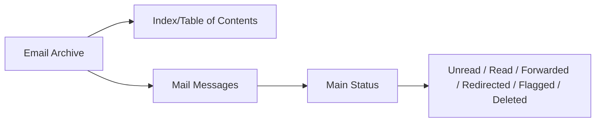

# 📧 Tracking Emails and Investigating Email Crimes

---

## 📋 Mục tiêu Module

!!! info "Nội dung bài học"
    Module này bao gồm các chủ đề sau:
    
    - Hệ thống Email (Email System)
    - Email Clients & Email Servers
    - Cấu trúc Email Message
    - Tầm quan trọng của Electronic Records Management
    - Các loại Email Crime
    - Ví dụ & danh sách Email Headers
    - Lý do điều tra Email
    - Các bước điều tra Email Crime
    - Email Forensics Tools
    - Luật và quy định chống Email Crime

---

## 1. Email System Basics

### 1.1 Thuật ngữ Email

| Thuật ngữ | Mô tả |
|-----------|-------|
| **IMAP** | Internet Message Access Protocol – Truy cập email trên mail server, hiển thị như lưu cục bộ |
| **SMTP** | Simple Mail Transfer Protocol – Nhận mail đi từ client, xác thực địa chỉ nguồn/đích |
| **HTTP** | Hypertext Transfer Protocol – Dùng trong webmail, message lưu trên webmail server |
| **POP3** | Post Office Protocol 3 – Giao thức nhận email tiêu chuẩn, xóa mail trên server sau khi tải, cổng mặc định 110 |
| **CC** | Carbon Copy – Gửi bản sao tới người nhận khác |
| **BCC** | Blind Carbon Copy – Gửi bản sao mà người nhận chính không biết |
| **Attachment** | File đính kèm gửi cùng email |
| **Email Client** | Phần mềm đọc/gửi email (VD: Outlook, Eudora) |
| **Email Server** | Server tại ISP hoặc website lớn, vận chuyển email, thường dùng **sendmail** |
| **Encoding** | Phương pháp gửi file nhị phân: Uuencode, BinHex, MIME... |

### 1.2 Hệ thống Email

```
[User A + Mail Client]
        |
        v (1. Gửi qua SMTP)
[SMTP Server] ──────────────> [Internet] ──────> [POP3 Server]
                                                       |
                                                       v (3. Tải về)
                                               [User B + Mail Client]
```

!!! note "Kiến trúc Client-Server"
    - Email system dựa trên **client-server architecture**
    - Email gửi từ client → central server → reroute đến đích
    - Hệ thống gồm: mail clients + SMTP server + POP3/IMAP server

### 1.3 Email Clients

Email client là ứng dụng máy tính cho phép **gửi, nhận và tổ chức email**.

**Chức năng của Email Client:**

- Lấy message từ mailbox
- Hiển thị header của tất cả message trong mailbox
- Cho phép chọn header và đọc nội dung email
- Tạo message mới và gửi lên email server
- Thêm attachment và lưu attachment từ message nhận được
- Format message

**Các email client phổ biến:**

=== "Standalone"
    - Microsoft Outlook
    - Thunderbird

=== "Web-based"
    - Yahoo! Mail
    - Gmail
    - Hotmail

### 1.4 Email Server

!!! abstract "Email/Mail Server là gì?"
    Email server là máy tính trong mạng hoạt động như **virtual post office** (bưu điện ảo).

**Quy trình gửi email:**



### 1.5 SMTP Server

!!! info "SMTP Server"
    - Lắng nghe trên **port 25**
    - Xử lý **outgoing email**
    - Khi client gửi email → kết nối SMTP server
    - Client thông báo: địa chỉ sender, recipient, nội dung message
    - SMTP server chia địa chỉ "To" thành: **tên người nhận** + **tên domain**
    - Liên hệ DNS Server → lấy thông tin domain → kết nối SMTP server đích

### 1.6 POP3 và IMAP Servers

=== "POP3 (Post Office Protocol 3)"
    - Chỉ dùng cho **incoming email**
    - Khi message đến, POP3 server thêm vào cuối file account của người nhận
    - Email client kết nối POP3 server tại **port 110** để tải email
    - POP3 là dịch vụ **store and forward**

=== "IMAP (Internet Message Access Protocol)"
    - Client kết nối IMAP server tại **port 143**
    - Cho phép **nhiều client kết nối đồng thời** vào cùng mailbox
    - Hỗ trợ: truy cập MIME message parts, duy trì trạng thái message trên server, tạo/quản lý nhiều mailbox, tìm kiếm server-side
    - IMAP là **remote file server**

### 1.7 Email Message

!!! tip "Cấu trúc Email Message gồm 3 phần:"

=== "1. Header"
    - Chứa thông tin về **nguồn gốc email**: địa chỉ gửi, routing, thời gian, subject
    - Một số header quan trọng bị **ẩn** bởi email software

=== "2. Body"
    - Chứa **nội dung thực sự** của message

=== "3. Signature"
    - Thông tin về **người gửi** cung cấp cho người nhận
    - Có thể được cài đặt tự động

---

## 2. Tầm quan trọng của Electronic Records Management

!!! quote "Định nghĩa"
    Electronic Records Management (ERM) là lĩnh vực quản lý chịu trách nhiệm kiểm soát **hiệu quả và có hệ thống** việc tạo, nhận, duy trì, sử dụng và xử lý hồ sơ điện tử, bao gồm quy trình thu thập và duy trì bằng chứng thông tin cho mục đích pháp lý, tài chính, hành chính.

**Tầm quan trọng:**

1. **Non-repudiation**: Giúp không thể phủ nhận là nguồn gốc của thông tin liên lạc điện tử
2. **Deterrent**: Là biện pháp ngăn chặn các tài liệu lạm dụng và không phù hợp trong email
3. **Investigation support**: Hỗ trợ điều tra và truy tố các email crime

---

## 3. Email Crimes

### 3.1 Phân loại Email Crime



!!! warning "Lưu ý"
    Tính **dễ dàng, nhanh chóng và ẩn danh tương đối** của email làm cho nó trở thành công cụ mạnh mẽ cho tội phạm.

### 3.2 Email Spamming

!!! danger "Email Spamming"
    Spamming được định nghĩa là **gửi email không mong muốn (unsolicited emails)**.

- Spammer thu thập địa chỉ email từ: Usenet postings, DNS listings, web pages
- Người dùng có địa chỉ email hợp lệ có thể spam email addresses, bulletin-board services, newsgroups

### 3.3 Mail Bombing / Mail Storm

=== "Mail Bombing"
    Gửi **số lượng khổng lồ email** đến một địa chỉ nhằm:
    - Tràn ngập mailbox (overflow the mailbox)
    - Làm quá tải server (overwhelm the server)
    - Gây ra **denial-of-service attack**
    
    Các message thường lớn và chứa dữ liệu vô nghĩa để tiêu thụ thêm tài nguyên hệ thống.

=== "Mail Storm"
    Sự tăng đột biến của các message **"Reply All"** trên danh sách phân phối email, gây ra bởi **một message bị gửi nhầm**.

### 3.4 Phishing

!!! danger "Phishing"
    Là hành vi hình sự gửi **email giả mạo (illegitimate email)**, tự nhận là từ một trang web hợp pháp nhằm lấy thông tin cá nhân hoặc tài khoản người dùng.

- Phishing email chuyển hướng người dùng đến **fake webpages** của các trang tin cậy
- Yêu cầu người dùng cung cấp thông tin cá nhân
- Có thể nhắm vào hàng triệu địa chỉ email bằng **mass-mailing systems**

### 3.5 Email Spoofing

!!! danger "Email Spoofing"
    Email spoofing là **giả mạo email header** để message có vẻ xuất phát từ người hoặc nơi khác thay vì nguồn thực.

- Spammer và phisher **thay đổi các trường header** như: From, Return-Path, Reply-To để ẩn nguồn thực
- Ví dụ: Dùng dịch vụ Anonymailer, Mr. Smith (smith@hotmail.com) có thể gửi virus bằng địa chỉ của Sam (samchoang@yahoo.com)

### 3.6 Crime via Chat Room

- Chat room là website/phần của website cung cấp **nơi giao tiếp thời gian thực** cho cộng đồng người dùng
- Ngày càng bị dùng cho các tội phạm: **child pornography, cyber stalking, identity theft**
- Có thể dùng như **social engineering tool** để thu thập thông tin phạm tội
- Là tính năng thường xuyên của các trang người lớn để phổ biến tài liệu không phù hợp

### 3.7 Identity Fraud / Chain Letter

=== "Identity Fraud"
    Đề cập đến tất cả các loại tội phạm mà ai đó **lấy trái phép và sử dụng thông tin cá nhân** của người khác theo cách liên quan đến gian lận hoặc lừa dối để thu lợi kinh tế.

=== "Chain Letter"
    Là thư **hướng dẫn người nhận gửi nhiều bản sao** để lưu thông tăng lên theo cấp số nhân.

---

## 4. Email Headers

### 4.1 Ví dụ Email Header

```
Microsoft Mail Internet Headers Version 2.0
Received: from EXIC1.lse.ac.uk ([132.148.290.111]) by ExF2.lse.ac.uk 
          with Microsoft SMTPSVC(5.0.2195.5329); Tue, 2 Nov 2010 12:20:40 +0100
...
Message-ID: <2003056893256.6388.qmail@web60003.mail.yahoo.com>
Date: Tue, 2 Nov 2010 12:18:20+0100 (BST)
From: "Daniel Simpson" <djs@yahoo.co.uk>
Reply-To: <d.simpson@hotmail.com>
Subject: Test Email
To: <f.muir@lse.ac.uk>
Return-Path: <djs@yahoo.co.uk>
```

| Header Line | Ý nghĩa |
|-------------|---------|
| Received (từ Exchange gateway) | Email đi qua Exchange gateway servers đến staff mailbox |
| Received (từ anti-virus servers) | Email đi qua anti-virus servers đến Exchange gateway |
| Received (từ anti-spam servers) | Email đi qua anti-spam servers đến anti-virus servers |
| Received (từ originator's server) | Email nhận bởi LSE anti-spam server từ originator's email server |
| Message-ID | ID duy nhất của message |
| Date | Ngày giờ gửi |
| From | Địa chỉ email của người gửi |
| Reply-To | Địa chỉ reply |
| Subject | Chủ đề |
| To | Địa chỉ email người nhận |
| Return-Path | Địa chỉ email của originator |

### 4.2 Danh sách Common Headers

??? info "BCC (Blind Carbon Copy)"
    - Dùng để thêm địa chỉ vào SMTP delivery list nhưng không hiển thị trong message data
    - Cho phép gửi bản sao đến người không muốn nhận replies
    - **Phổ biến với spammers** vì gây nhầm lẫn cho người dùng không kinh nghiệm

??? info "Apparently-To"
    - Message với nhiều người nhận có thể có danh sách dài headers dạng "Apparently-To: rth@bieberdorf.edu"
    - **Bất thường trong email hợp pháp** – thường là dấu hiệu của mailing list

??? info "Cc (Carbon Copy)"
    - Chỉ định **thêm người nhận**
    - Sự khác biệt giữa "To:" và "Cc:" chủ yếu là hàm ý; một số email programs xử lý chúng khác nhau trong replies

??? info "Comments"
    - Trường header phi tiêu chuẩn
    - Được thêm bởi một số mailers để nhận dạng sender
    - **Thường được spammer thêm thủ công**

??? info "Content-Transfer-Encoding"
    - Liên quan đến MIME – cách chuẩn để đính kèm nội dung non-text trong email
    - Ảnh hưởng đến cách MIME-compliant email programs diễn giải nội dung

??? info "Content-Type"
    - MIME header khác, cho MIME-compliant programs biết **loại nội dung** cần mong đợi

??? info "Date"
    - Ngày thông thường là ngày message được **soạn và gửi**
    - Nếu bị bỏ qua bởi máy tính người gửi, có thể được thêm bởi email server

??? info "Errors-To"
    - Chỉ định địa chỉ nhận **mailer-generated errors** như bounce messages

??? info "From"
    - Biểu thị **địa chỉ email của người gửi**

??? info "In-Reply-To"
    - Header Usenet đôi khi xuất hiện trong email
    - Cho biết **Message ID của message trước** đang được reply
    - **Spammer sử dụng** để cố tránh chương trình lọc

??? info "Message-Id"
    - Là **identifier duy nhất** được gán cho mỗi message bởi email server đầu tiên gặp
    - Dạng: "gibberish@bieberdorf.edu"
    - Email có message ID bị malformed hoặc site không phải nơi xuất phát thực → **có thể là giả mạo**

??? info "Mime-Version"
    - Chỉ định **phiên bản giao thức MIME** được người gửi sử dụng

??? info "Newsgroup"
    - Chỉ xuất hiện trong email liên quan đến Usenet
    - Chỉ định newsgroup(s) mà message được post

??? info "Reply-To"
    - Chỉ định địa chỉ để replies được gửi đến
    - Nhiều **legitimate uses** nhưng cũng được spammer dùng để **deflect criticism**

??? info "References"
    - Hiếm trong email ngoại trừ bản sao Usenet postings
    - Nhận dạng "upstream" posts mà message đang respond

??? info "Priority"
    - Header tự do chỉ định **mức độ ưu tiên** cho email
    - **Thường bị ignore** bởi hầu hết software
    - Thường được **spammer sử dụng** dạng "Priority: urgent"

??? info "Organization"
    - Header tự do chứa **tên tổ chức** mà người gửi có quyền truy cập internet
    - Sender có thể kiểm soát header này

??? info "Sender"
    - Bất thường trong email (X-Sender thường được dùng thay thế)
    - Đáng tin cậy hơn From: line trong Usenet posts

??? info "Subject"
    - Trường hoàn toàn tự do, mô tả **chủ đề của message**

??? info "X-Confirm-Reading-To"
    - Yêu cầu **automated confirmation** khi message được nhận hoặc đọc
    - Thường bị bỏ qua

??? info "X-Mailer (also X-mailer)"
    - Trường tự do nhận dạng **email software** người gửi sử dụng
    - Hữu ích cho bộ lọc vì nhiều junk email dùng mailers được tạo cho mục đích spam

??? info "X-Distribution"
    - Thêm bởi Pegasus Mail để chống spam
    - Message gửi với Pegasus đến số lượng lớn người nhận có header "X-Distribution: bulk"

??? info "X-PMFLAGS"
    - Header thêm bởi Pegasus Mail
    - Không truyền thông tin nào không có trong X-Mailer header

??? info "To"
    - Địa chỉ email và tên của **người nhận chính**

??? info "Received"
    - Message được tạo bởi email server
    - Cung cấp **log chi tiết về lịch sử của message**

??? info "X-Priority"
    - Trường priority khác, dùng bởi **Eudora** để gán mức độ ưu tiên

??? info "X-Errors-To"
    - Tương tự Errors-To – chỉ định địa chỉ nhận errors

??? info "X-Headers"
    - Thuật ngữ chung cho headers bắt đầu bằng **chữ X hoa và dấu gạch ngang**
    - Quy ước: X-headers là **nonstandard** và chỉ để thông tin

??? info "X-Sender"
    - Tương đương email của Sender header trong Usenet news
    - Dễ giả mạo như From: header → xem với **sự nghi ngờ tương tự**

??? info "X-UIDL"
    - Identifier duy nhất dùng bởi **POP protocol** để lấy email từ server
    - Thường được thêm giữa recipient's email server và recipient's email software
    - Email đến với X-UIDL header **có thể là junk**

### 4.3 Received: Headers

!!! tip "Received Headers rất quan trọng trong điều tra"
    Received headers cung cấp **log chi tiết về lịch sử của message** → có thể suy ra nguồn gốc của email ngay cả khi các headers khác bị giả mạo.

**Ví dụ:** Nếu máy turmeric.com (IP: 104.128.23.115) gửi message đến mail.bieberdorf.edu nhưng tự nhận là HELO galangal.org:

```
Received: from galangal.org ([104.128.23.115]) by mail.bieberdorf.edu (8.8.5)...
```

### 4.4 Forging Headers (Giả mạo Header)

!!! danger "Kỹ thuật giả mạo header"
    Một trick của email forger là **thêm spurious Received: headers** trước khi gửi mail vi phạm.

- Received: headers luôn được thêm ở **đầu** (top)
- Các **forged lines ở cuối** (bottom) của danh sách
- Khi đọc từ trên xuống dưới, có thể bỏ qua mọi thứ **sau dòng giả mạo đầu tiên**

**Ví dụ giả mạo:**
```
Received: from galangal.org ([104.128.23.115]) by mail.bieberdorf.edu (8.8.5)
Received: from nowhere by fictitious-site (8.8.3/8.7.2)...    ← GIẢ MẠO
Received: No Information Here, Go Away!                         ← GIẢ MẠO
```

### 4.5 Email Header Fields (Bảng tổng hợp)

**Source/Sender Header Fields:**

| Field | Giải thích |
|-------|-----------|
| From | Nhận dạng email sender (tên và email) |
| Sender | Nhận dạng sender thực sự của email |
| Reply-To | Địa chỉ email để replies gửi đến |
| Return Path | Đường về sender |
| Received | Mỗi email đi qua ít nhất một intermediary server – mỗi server xuất hiện trên Received line riêng |
| Resent-xxx | Áp dụng cho re-sent messages (From, Sender, Reply-to) |

**Destination Header Fields:**

| Field | Giải thích |
|-------|-----------|
| To | Tên và địa chỉ email người nhận |
| Cc | Secondary message recipients |
| Bcc | Blind carbon-copy message recipients |
| Resent-xxx | Áp dụng cho re-sent messages (To, Cc, Bcc) |

**Date Headers:**

| Field | Giải thích |
|-------|-----------|
| Date | Ngày giờ gửi message gốc |
| Resent date | Ngày giờ re-sent message |

**Optional Headers:**

| Field | Giải thích |
|-------|-----------|
| Subject | Chủ đề của message |
| Message-ID | Unique message identifier |
| In-reply-to | Nhận dạng message đang được reply |
| References | Nhận dạng các message liên quan |
| Keywords | Keywords để sắp xếp và tổ chức nội dung |
| Comments | Text comments về message |
| Encrypted | Cho biết nội dung message được mã hóa |
| X-xxx | Nhận dạng các user-defined fields |

---

## 5. Lý do Điều tra Email

!!! question "Tại sao cần điều tra Email?"
    Email có thể là **manh mối về danh tính tội phạm** và có thể trở thành **bằng chứng**.

**Tội phạm thường sử dụng email để:**



---

## 6. Các bước Điều tra Email Crime

### 6.1 Tổng quan quy trình



### 6.2 Bước 1: Obtain a Search Warrant and Seize Computer and Email Account

!!! note "Lấy Search Warrant"
    - Application phải có **ngôn ngữ phù hợp** để thực hiện on-site examination của computer và email server
    - Chỉ thực hiện **forensics test** trên equipment được phép
    - **Seize** computer và email accounts nghi ngờ liên quan đến tội phạm
    - Email accounts có thể bị seized bằng cách **đổi password** (hỏi nạn nhân hoặc từ email server)

### 6.3 Bước 2: Obtain a Bit-by-Bit Image of Email Information

!!! note "Tạo Bit-by-Bit Image"
    - Tạo bit-by-bit image của tất cả **folders, settings, và configurations** trong email account
    - Lưu vào removable disk dùng tools như **Safe Back**
    - **Encrypt** image dùng **MD5 hashing** để duy trì tính toàn vẹn của bằng chứng

### 6.4 Bước 3: Examine Email Headers

- Biết cách tìm email headers trong **command-line, Web-based, và GUI clients**
- Mở email headers, **copy và paste** headers vào text document
- Headers chứa thông tin quan trọng: **Message sent time, unique identifying numbers, IP address của sending server**

**Xem headers trong Microsoft Outlook:**
```
1. Log on to Microsoft Outlook và mở email đã nhận
2. Click File → Info → Properties
3. Select message header text, copy và paste vào text editor, lưu file
4. Sign out khỏi Microsoft Outlook account
```

**Xem headers trong Gmail:**
```
1. Log on to Gmail và mở email đã nhận
2. Click Reply drop-down button → Show original
3. Select Message Headers - Full text và copy
4. Paste vào text editor và lưu
5. Sign out khỏi Gmail
```

### 6.5 Bước 4: Analyze Email Headers

**Thu thập supporting evidence từ email headers:**

| Thông tin | Mục đích |
|-----------|---------|
| Return path | Theo dõi đường về |
| Recipient's email address | Xác nhận người nhận |
| Type of sending email service | Loại dịch vụ gửi |
| **IP address of sending server** | **Rất quan trọng để truy tìm** |
| Name of the email server | Tên server |
| Unique message number | ID duy nhất |
| Date and time email was sent | Thời gian gửi |
| Attachment files information | Thông tin file đính kèm |

### 6.6 Bước 5: Trace Email Origin

!!! tip "Truy tìm nguồn gốc Email"

**Tracing Back:**

1. **Bước đầu tiên**: Xem thông tin của header → xác định originating mail server (VD: mail.example.com)
2. Với **court order** từ law enforcement hoặc **civil complaint** từ attorneys → lấy log files từ mail.example.com
3. Thông tin về **Internet domain registration** từ: www.arin.net, www.internic.com, www.freeality.com

**Examine Originating IP Address:**

```
1. Thu thập IP address của sender từ header của email nhận được
2. Tìm kiếm IP trong whois database
3. Tìm geographic address của sender trong whois database
```

Tool: `http://tools.whois.net`

**Tracing Back Web-Based Email:**

- Web-based email (Webmail) khó xác định danh tính sender hơn
- Các trang như Hotmail, Yahoo, Hushmail dễ dàng tạo account mới
- Các trang này duy trì **source IP address** của mỗi kết nối
- **Liên hệ email provider** (Microsoft, Google, Yahoo) để lộ thông tin subscriber

**Checking Email Validity:**

Tool: **Email Dossier** (http://centralops.net) – công cụ online kiểm tra email validity và điều tra email.

### 6.7 Bước 6: Acquire Email Archives

**Email Archiving** là cách tiếp cận có hệ thống để **lưu và bảo vệ dữ liệu trong email** để có thể truy cập nhanh sau này.

=== "Local Archive"
    - Archive có format **độc lập với mail server**
    - Ví dụ: .PST, .DBX, .MBX...
    - Dưới sự kiểm soát của **end user**
    - Mỗi file chứa **bằng chứng tiềm năng** và phải xử lý cẩn thận

=== "Server Storage Archive"
    - Archive có **mixed storage** cho tất cả clients trên server
    - Ví dụ: MS Exchange (.STM, .EDB), Lotus Notes (.NSF, .ID), GroupWise (.DB)

**Common Email Local Storage Archives:**

| Email Client | Index | Messages |
|-------------|-------|---------|
| The Bat! | *.tbi | *.tbb |
| MS Outlook | (Index + Messages) | *.pst |
| Outlook Express v4.x | *.idx | *.mbx |
| Eudora | *.toc | *.mbx |
| FoxMail | *.dbx or .MailDB | *.dbx or .MailDB |
| Outlook Express v5-6 | *.dbx or MailDB | *.dbx |
| Netscape v6.x/7.x/Mozilla | *.msf | *.(No extension) |

**Server Storage Archives:**

| Email Server | Files |
|-------------|-------|
| Microsoft Exchange | priv.edb, pub.edb, priv.stm |
| Lotus Notes | *.nsf, *.id |
| Groupwise | *.db |

**Content of Email Archives:**



**Local Archive - Cấu trúc:**

1. **Header**: Envelope của email – thông tin sender/receiver, subject, thời gian, delivery stamps, CC, BCC
2. **Body**: Nội dung chính của message
3. **Encoding**: Universal translator – MIME (non-ASCII files), UUCODE (UNIX format), BINHEX (Mac format)
4. **Attachment**: Item bổ sung đi kèm body

**Forensic Acquisition of Email Archive:**

!!! warning "Lưu ý khi xử lý Email Archive cho Forensics"
    - Đánh giá tools **trước khi** xử lý email archive
    - Xác định cách tool tính **hash value** – phải diễn giải tất cả thành phần (header, body, attachment)
    - Kiểm tra tool có được **thiết kế cho forensics** không → khả năng recover deleted data
    - Data bị xóa từ archive's recycling bin → nằm trong **unallocated space** của email archive

**Processing Local Email Archives:**

=== "Outlook PST File Acquisition"
    1. Lấy bit-stream image của toàn bộ drive
    2. Extract PST file từ drive image dùng nhiều tools
    3. Dùng tools như **Paraben's Email Examiner** để xử lý

=== "Outlook Express Acquisition"
    1. Outlook Express lưu thông tin message theo **DBX format**
    2. Install Outlook Express trên analysis machine
    3. Tìm DBX files trên suspect image
    4. Copy tất cả DBX files sang analysis machine's Outlook Express directory
    5. Disconnect analysis computer khỏi network
    6. Open Outlook Express trên analysis machine
    7. Có thể dùng **OE Viewer** để xem DBX files

**Processing Server Level Archives:**

- **Ontrack PowerControls**: Hỗ trợ copy, search, recover, analyze email từ MS Exchange Server backups, un-mounted databases
- **Paraben's Network Email Examiner**: Xử lý MS Exchange archives, GroupWise và LotusNotes

### 6.8 Bước 7: Recover Deleted Emails

**Deleted Email Recovery** phụ thuộc vào email client:

=== "Eudora Mail"
    - Messages được **đánh dấu để xóa** và không còn hiển thị trong mailbox
    - Messages vẫn nằm trong **trash folder** đến khi trash được làm trống

=== "Outlook PST"
    - Data chuyển từ active part của archive sang **recycle bin**
    - Nếu recycle bin được làm trống → chuyển sang **unallocated space** của email archive
    - Recovery phụ thuộc vào **kích thước của archive**

---

## 7. Email Forensics Tools

### 7.1 Tools để Recover Deleted Emails

**Stellar Phoenix Deleted Email Recovery**
- Recover permanently removed/deleted **PST items** và **DBX emails**
- Restore PST items thành: .pst, .eml, .msg files
- Restore DBX emails thành: .dbx và .eml files
- Website: http://www.stellarinfo.com

**Recover My Email**
- Recover deleted email messages từ Microsoft Outlook PST hoặc Outlook Express DBX files
- Website: http://www.recovermyemail.com

**Zmeil**
- Recover deleted email messages hoặc messages từ corrupt email databases
- Xử lý trường hợp xóa nhầm hoặc database corruption do software problems hoặc power spikes
- Website: http://www.z-a-recovery.com

**Quick Recovery for MS Outlook**
- Repair và restore data từ damaged hoặc corrupted Microsoft Outlook files
- Recover emails từ corrupt hoặc damaged PST files
- Repair corrupt PST Files và recover tất cả MS Outlook items (Calendar, Tasks, Notes, Contacts, Journals)
- Website: http://www.recoveryourdata.com

**Outlook Express Recovery (Kernel for Outlook PST Repair)**
- Recover permanently deleted Outlook Items
- Recover emails từ corrupt PST file
- Fix damaged PST headers và recover tất cả items từ PST file
- Website: http://www.recoveryemail.com

**FINALeMAIL**
- Recover email database files và locate lost emails không có data location information
- Recover email messages và attachments từ Deleted Items folder trong Outlook Express, Netscape Mail, Eudora
- Recover entire email database files
- Website: http://finaldata2.com

**R-Mail**
- Recover accidentally deleted Outlook email messages, contacts, notes, tasks
- Repair damaged Outlook data files (*.pst)
- Website: http://www.r-tt.com

### 7.2 Email Forensics và Analysis Tools

**Email Trace – Email Tracking** (http://www.ip-adress.com/trace_email/)
- Track email sender và IP address của sender
- Quy trình: Mở email → copy headers → paste vào tool → click "Trace Email Sender"

**eMailTrackerPro** (http://www.emailtrackerpro.com)
- Phân tích email header và cung cấp **IP address của máy gửi email**
- Hiển thị trace information và bản đồ vị trí địa lý

**Forensic Tool Kit (FTK)** (http://accessdata.com)
- AccessData FTK là forensic tool nổi tiếng để **phân tích email**
- **Features:**
    - Hỗ trợ: Outlook, Outlook Express, AOL, Netscape, Yahoo, Earthlink, Eudora, Hotmail, MSN
    - View, search, print, export email messages và attachments
    - Recover deleted và partially deleted emails

**Paraben's E-mail Examiner** (http://www.paraben.com)
- Forensically examines email formats: AOL, Outlook Exchange (PST), Eudora...
- Recover deleted messages và folders

**Paraben's Network E-mail Examiner**
- Examine Microsoft Exchange (EDB), Lotus Notes (NSF), và GroupWise email stores

**Abuse.Net** (http://www.abuse.net)
- Giúp Internet community **report và control network abuse**
- Không bao gồm blacklist hoặc spam analysis services
- Sau khi đăng ký: gửi message đến domain-name@abuse.net → hệ thống tự động email báo cáo đến địa chỉ reporting phù hợp

**MailDetective Tool** (http://www.advsoft.info)
- Monitoring application để kiểm soát email use trong corporate network
- Phân tích email server log files và cung cấp detailed reports

**DiskInternal's Outlook Express Repair** (http://www.diskinternals.com)
- Detect email accounts, scan for damages và restore nội dung thành EML files

---

## 8. Luật và Quy định chống Email Crime

### 8.1 U.S. Laws: CAN-SPAM Act

!!! legal "CAN-SPAM Act of 2003"
    **Controlling the Assault of Non-Solicited Pornography and Marketing Act**
    
    Thiết lập yêu cầu cho những người gửi commercial email, quy định penalties cho spammers và companies.

**Các điều khoản chính:**

| Điều khoản | Mô tả |
|-----------|-------|
| Cấm thông tin header sai hoặc misleading | Bans false or misleading header information |
| Cấm subject lines lừa dối | Prohibits deceptive subject lines |
| Yêu cầu opt-out method | Requires email to give recipients an opt-out method |
| Yêu cầu nhận dạng là quảng cáo | Requires commercial email be identified as advertisement with valid postal address |

**Penalties:**

!!! danger "Hình phạt"
    - Mỗi vi phạm bị phạt **tối đa $11,000**
    - Additional fines cho mailers:
        - "Harvest" địa chỉ từ websites có thông báo prohibiting transfer
        - Generate địa chỉ email bằng "dictionary attack"
        - Dùng scripts để đăng ký nhiều accounts
        - Relay emails qua computer/network không được phép
    - DOJ có thể seek **criminal penalties** bao gồm imprisonment cho những ai:
        - Dùng máy tính người khác không được phép để gửi commercial email
        - Relay/retransmit email để đánh lừa recipients
        - **Falsify header information** trong nhiều email messages

### 8.2 18 U.S.C. § 2252A

!!! legal "Luật về Child Pornography"
    Người vi phạm sẽ bị phạt tù **không dưới 5 năm và không quá 20 năm** nếu:
    
    - Knowingly distributes/offers/sends/provides cho trẻ vị thành niên bất kỳ visual depiction
    - Knowingly mails/transports/ships in interstate hoặc foreign commerce bất kỳ child pornography
    - Knowingly reproduces child pornography để phân phối
    - Knowingly receives hoặc distributes child pornography được mailed/shipped/transported

### 8.3 18 U.S.C. § 2252B

!!! legal "Luật về Misleading Domain Names"
    - Ai **knowingly sử dụng misleading domain name** trên Internet với intent lừa người vào xem obscene material → phạt tù **tối đa 2 năm**
    - Ai sử dụng misleading domain name với intent lừa **trẻ vị thành niên** vào xem harmful material → phạt tù **tối đa 4 năm**
    - Domain name có từ "sex" hoặc "porn" → **không phải misleading**

### 8.4 Email Crime Law in Washington: RCW 19.190.020

!!! legal "Luật Washington State"
    Không ai được phép khởi xướng, âm mưu khởi xướng hoặc hỗ trợ truyền tải **commercial electronic mail message** từ computer tại Washington hoặc đến địa chỉ email của Washington resident mà:
    
    - Sử dụng **third party's Internet domain name** không có sự cho phép
    - Chứa **thông tin sai hoặc misleading** trong subject line

---

## 📝 Module Summary

!!! summary "Tóm tắt"
    - Spammers thu thập địa chỉ email bằng cách harvest từ Usenet postings, DNS listings, hoặc web pages
    - Chat rooms có thể được dùng như **social engineering tool** để thu thập thông tin phạm tội
    - Phishers dụ dỗ người dùng cung cấp thông tin cá nhân trong các website không hợp pháp
    - Online email programs như AOL, Hotmail, Yahoo lưu Email messages trong folders như **History, Cookies, và Temp**
    - Headers chứa thông tin quan trọng: **Message sent time, unique identifying numbers và IP address của sending server**

---

---

# 🧩 50 Câu Trắc Nghiệm

---

**Câu 1.** Giao thức nào lắng nghe trên port 25 và xử lý outgoing email?

- A) POP3
- B) IMAP
- C) SMTP
- D) HTTP

??? success "Đáp án: C"
    **SMTP (Simple Mail Transfer Protocol)** lắng nghe trên port 25 và xử lý outgoing email. Khi client gửi email, nó kết nối đến SMTP server.

---

**Câu 2.** POP3 sử dụng port mặc định nào?

- A) 25
- B) 80
- C) 110
- D) 143

??? success "Đáp án: C"
    POP3 (Post Office Protocol 3) sử dụng **port 110** mặc định để tải email từ server về client.

---

**Câu 3.** IMAP sử dụng port mặc định nào?

- A) 25
- B) 110
- C) 143
- D) 443

??? success "Đáp án: C"
    IMAP (Internet Message Access Protocol) kết nối với server tại **port 143** mặc định.

---

**Câu 4.** Đặc điểm nào phân biệt IMAP với POP3?

- A) IMAP xóa mail trên server sau khi tải về
- B) IMAP cho phép nhiều client kết nối đồng thời vào cùng mailbox
- C) IMAP chỉ dùng cho incoming email
- D) IMAP sử dụng port 110

??? success "Đáp án: B"
    IMAP cho phép **multiple concurrent client connections** vào cùng mailbox, trong khi POP3 là dịch vụ store-and-forward đơn giản hơn.

---

**Câu 5.** Email message được cấu thành từ mấy phần?

- A) 2
- B) 3
- C) 4
- D) 5

??? success "Đáp án: B"
    Email message gồm **3 phần**: Header, Body và Signature.

---

**Câu 6.** Phần nào của email chứa thông tin về nguồn gốc, routing, thời gian và subject?

- A) Body
- B) Signature
- C) Header
- D) Attachment

??? success "Đáp án: C"
    **Header** chứa thông tin về email origin: địa chỉ gửi, routing, thời gian, subject line.

---

**Câu 7.** BCC là viết tắt của gì?

- A) Basic Carbon Copy
- B) Blind Carbon Copy
- C) Binary Content Copy
- D) Blocked Carbon Copy

??? success "Đáp án: B"
    **BCC = Blind Carbon Copy** – gửi bản sao đến người nhận mà người nhận chính không biết.

---

**Câu 8.** Email crime có thể chia thành mấy loại chính?

- A) 1
- B) 2
- C) 3
- D) 4

??? success "Đáp án: B"
    Email crime chia thành **2 loại**: (1) Crime committed BY sending emails (VD: spamming, phishing) và (2) Crime supported BY emails (VD: harassment, identity fraud).

---

**Câu 9.** Định nghĩa đúng nhất về Email Spamming là gì?

- A) Gửi email có virus
- B) Gửi email không mong muốn (unsolicited emails)
- C) Giả mạo header email
- D) Tấn công từ chối dịch vụ qua email

??? success "Đáp án: B"
    **Email Spamming** được định nghĩa là **gửi unsolicited emails** – email mà người nhận không yêu cầu hoặc muốn nhận.

---

**Câu 10.** Mail Bombing khác Mail Storm ở điểm nào?

- A) Mail Bombing là tấn công từ bên ngoài; Mail Storm là từ nội bộ
- B) Mail Bombing gửi khối lượng lớn email để làm tràn mailbox/server; Mail Storm là spike đột ngột của "Reply All"
- C) Mail Bombing dùng virus; Mail Storm dùng spyware
- D) Không có sự khác biệt

??? success "Đáp án: B"
    **Mail Bombing**: Gửi khối lượng khổng lồ email để tràn mailbox hoặc làm quá tải server → DoS attack. **Mail Storm**: Spike đột ngột của "Reply All" messages trên distribution list, gây ra bởi một message bị gửi nhầm.

---

**Câu 11.** Phishing email thường làm gì với người dùng?

- A) Cài malware trực tiếp vào máy tính
- B) Chuyển hướng người dùng đến fake webpages để lấy thông tin cá nhân
- C) Gửi email bombing để làm crash server
- D) Mã hóa dữ liệu của người dùng

??? success "Đáp án: B"
    Phishing email **chuyển hướng (redirect) người dùng đến fake webpages** của các trang tin cậy, yêu cầu họ cung cấp thông tin cá nhân hoặc tài khoản.

---

**Câu 12.** Email Spoofing là gì?

- A) Gửi email ẩn danh
- B) Giả mạo email header để message có vẻ xuất phát từ nguồn khác
- C) Mã hóa nội dung email
- D) Chặn và đọc email của người khác

??? success "Đáp án: B"
    **Email Spoofing** là **giả mạo email header** để message có vẻ xuất phát từ người hoặc nơi khác thay vì nguồn thực.

---

**Câu 13.** Spammer thường thay đổi những trường header nào trong email spoofing?

- A) To, Cc, Bcc
- B) From, Return-Path, Reply-To
- C) Date, Message-ID, Subject
- D) Content-Type, MIME-Version

??? success "Đáp án: B"
    Spammer và phisher thay đổi các trường **From, Return-Path, Reply-To** để ẩn nguồn thực của email.

---

**Câu 14.** Received: headers trong email có tác dụng gì trong điều tra?

- A) Xác định nội dung email
- B) Cung cấp log chi tiết về lịch sử message, giúp suy ra nguồn gốc
- C) Mã hóa email để bảo mật
- D) Xác định file đính kèm

??? success "Đáp án: B"
    **Received: headers** cung cấp **detailed log về lịch sử của message** → có thể suy ra nguồn gốc email ngay cả khi các headers khác bị giả mạo.

---

**Câu 15.** Khi email forger thêm spurious Received: headers, các forged lines sẽ nằm ở đâu?

- A) Đầu danh sách (top)
- B) Giữa danh sách
- C) Cuối danh sách (bottom)
- D) Ngẫu nhiên

??? success "Đáp án: C"
    Vì Received: headers luôn được thêm **ở đầu** bởi mail servers thực, nên các **forged lines nằm ở cuối** danh sách. Khi đọc từ trên xuống, mọi thứ sau dòng giả mạo đầu tiên có thể bỏ qua.

---

**Câu 16.** Bước đầu tiên trong điều tra email crime là gì?

- A) Phân tích email headers
- B) Recover deleted emails
- C) Obtain a Search Warrant
- D) Tạo bit-by-bit image

??? success "Đáp án: C"
    Bước đầu tiên là **Obtain a Search Warrant** (lấy lệnh khám xét) và seize computer cùng email account.

---

**Câu 17.** Tool nào được đề cập để tạo bit-by-bit image của email information?

- A) FTK
- B) Safe Back
- C) Paraben's Email Examiner
- D) Email Dossier

??? success "Đáp án: B"
    **Safe Back** được đề cập để tạo bit-by-bit image của tất cả folders, settings, và configurations trong email account vào removable disk.

---

**Câu 18.** Hash algorithm nào được dùng để encrypt image và duy trì tính toàn vẹn của bằng chứng email?

- A) SHA-1
- B) SHA-256
- C) MD5
- D) RSA

??? success "Đáp án: C"
    **MD5 hashing** được dùng để encrypt image và duy trì **integrity của bằng chứng** trong quá trình forensic investigation.

---

**Câu 19.** Để xem email headers trong Microsoft Outlook, người dùng cần vào đường dẫn nào?

- A) View → Options → Headers
- B) File → Info → Properties
- C) Tools → Email Headers
- D) Message → Show Headers

??? success "Đáp án: B"
    Trong Microsoft Outlook: Click **File → Info → Properties** để xem Internet headers của email.

---

**Câu 20.** Để xem email headers trong Gmail, người dùng cần làm gì?

- A) Settings → Advanced → Show Headers
- B) More options → View Raw Message
- C) Click Reply drop-down button → Show original
- D) Tools → Email Headers

??? success "Đáp án: C"
    Trong Gmail: Click **Reply drop-down button** và navigate đến **"Show original"** option.

---

**Câu 21.** Email archiving có 2 loại chính là gì?

- A) Active Archive và Passive Archive
- B) Local Archive và Server Storage Archive
- C) Online Archive và Offline Archive
- D) Personal Archive và Corporate Archive

??? success "Đáp án: B"
    Hai loại email archive: **Local Archive** (format độc lập với mail server, VD: .PST) và **Server Storage Archive** (mixed storage cho tất cả clients, VD: MS Exchange).

---

**Câu 22.** Microsoft Outlook lưu email trong file format nào?

- A) .DBX
- B) .MBX
- C) .PST
- D) .NSF

??? success "Đáp án: C"
    Microsoft Outlook lưu email trong **Personal Storage Table (.PST)** files.

---

**Câu 23.** Outlook Express lưu email trong file format nào?

- A) .PST
- B) .DBX
- C) .NSF
- D) .EDB

??? success "Đáp án: B"
    Outlook Express lưu thông tin message theo **DBX format** và có thể xem bằng OE Viewer.

---

**Câu 24.** Microsoft Exchange Server lưu data trong những file nào?

- A) .PST, .DBX, .MBX
- B) .NSF, .ID
- C) PRIV.EDB, PUB.EDB, PRIV.STM
- D) *.DB

??? success "Đáp án: C"
    Microsoft Exchange Server sử dụng **PRIV.EDB** (rich text database – headers, text, attachments), **PUB.EDB** (public folder hierarchies), và **PRIV.STM** (streaming Internet content – video, audio).

---

**Câu 25.** Lotus Notes lưu email trong file format nào?

- A) *.PST
- B) *.NSF và *.ID
- C) *.DBX
- D) *.EDB

??? success "Đáp án: B"
    Lotus Notes sử dụng ***.NSF** (database file) và ***.ID** (encryption key cho encrypted mail).

---

**Câu 26.** Trong Eudora Mail, điều gì xảy ra khi email bị xóa?

- A) Email bị xóa ngay lập tức
- B) Email được đánh dấu để xóa và nằm trong trash folder cho đến khi trash được làm trống
- C) Email chuyển sang unallocated space
- D) Email được mã hóa và lưu trữ

??? success "Đáp án: B"
    Trong Eudora Mail, messages được **đánh dấu để xóa** và không hiển thị trong mailbox, nhưng **vẫn nằm trong trash folder** cho đến khi trash folder được làm trống.

---

**Câu 27.** Tool nào phân tích email header và cung cấp IP address của máy gửi email?

- A) Abuse.Net
- B) eMailTrackerPro
- C) FINALeMAIL
- D) Zmeil

??? success "Đáp án: B"
    **eMailTrackerPro** phân tích email header và cung cấp **IP address của máy gửi email**, đồng thời hiển thị trace information và bản đồ vị trí địa lý.

---

**Câu 28.** AccessData FTK hỗ trợ phân tích email từ những client nào?

- A) Chỉ Outlook
- B) Chỉ Gmail và Yahoo
- C) Outlook, Outlook Express, AOL, Netscape, Yahoo, Earthlink, Eudora, Hotmail, MSN
- D) Tất cả email clients

??? success "Đáp án: C"
    AccessData FTK hỗ trợ: **Outlook, Outlook Express, AOL, Netscape, Yahoo, Earthlink, Eudora, Hotmail, và MSN email**.

---

**Câu 29.** Abuse.Net có chức năng gì?

- A) Phân tích spam và blacklist
- B) Giúp Internet community report và control network abuse
- C) Recover deleted emails
- D) Phân tích email headers

??? success "Đáp án: B"
    **Abuse.Net** giúp Internet community **report và control network abuse**. Không bao gồm blacklist hoặc spam analysis services.

---

**Câu 30.** CAN-SPAM Act là viết tắt của gì?

- A) Controlling All Networks - Stop Phishing And Malware
- B) Controlling the Assault of Non-Solicited Pornography and Marketing Act
- C) Computer And Network Security Protection And Management Act
- D) Cybercrime And Network Spam Prevention And Monitoring Act

??? success "Đáp án: B"
    **CAN-SPAM Act = Controlling the Assault of Non-Solicited Pornography and Marketing Act** (2003).

---

**Câu 31.** Theo CAN-SPAM Act, mỗi vi phạm có thể bị phạt tối đa bao nhiêu?

- A) $1,000
- B) $5,000
- C) $11,000
- D) $50,000

??? success "Đáp án: C"
    Theo CAN-SPAM Act, mỗi vi phạm bị phạt **tối đa $11,000**.

---

**Câu 32.** Theo 18 U.S.C. § 2252A, hình phạt tù cho tội phạm liên quan đến child pornography qua email là bao nhiêu?

- A) 1-5 năm
- B) Không dưới 5 năm và không quá 20 năm
- C) Không quá 10 năm
- D) Tùy theo mức độ vi phạm

??? success "Đáp án: B"
    Theo **18 U.S.C. § 2252A**: phạt tù **không dưới 5 năm và không quá 20 năm**.

---

**Câu 33.** Theo 18 U.S.C. § 2252B, sử dụng misleading domain name để lừa người lớn xem obscene material bị phạt tù tối đa bao lâu?

- A) 1 năm
- B) 2 năm
- C) 4 năm
- D) 10 năm

??? success "Đáp án: B"
    Theo **18 U.S.C. § 2252B**: Lừa **người lớn** → phạt tù tối đa **2 năm**; Lừa **trẻ vị thành niên** → phạt tù tối đa **4 năm**.

---

**Câu 34.** Message-ID trong email có đặc điểm gì giúp phát hiện giả mạo?

- A) Phải chứa địa chỉ IP của server
- B) Nếu bị malformed hoặc site trong Message-ID không phải nơi xuất phát thực → có thể là giả mạo
- C) Phải được mã hóa bằng SSL
- D) Phải trùng với Reply-To address

??? success "Đáp án: B"
    **Message-ID** theo dạng "gibberish@bieberdorf.edu". Nếu **Message-ID bị malformed** hoặc **site trong Message-ID không phải nơi xuất phát thực** của email → email đó có thể là **giả mạo (forgery)**.

---

**Câu 35.** Khi điều tra web-based email, tại sao cần liên hệ email provider?

- A) Để lấy password của người dùng
- B) Vì webmail khó xác định sender hơn và provider duy trì source IP address của mỗi kết nối
- C) Để xóa email vi phạm
- D) Để block account của tội phạm

??? success "Đáp án: B"
    **Web-based email** khó xác định danh tính sender hơn vì dễ tạo account mới. Tuy nhiên, các providers như Gmail, Yahoo, Hotmail **duy trì source IP address** của mỗi kết nối → cần liên hệ provider để **lộ thông tin subscriber**.

---

**Câu 36.** Electronic Records Management có lợi ích nào sau đây?

- A) Giúp tăng tốc độ gửi email
- B) Giúp non-repudiation, ngăn chặn lạm dụng và hỗ trợ điều tra email crime
- C) Giúp mã hóa email
- D) Giúp giảm spam

??? success "Đáp án: B"
    Electronic Records Management có 3 lợi ích chính: **(1) Non-repudiation** – không thể phủ nhận nguồn gốc; **(2) Deterrent** – ngăn chặn tài liệu lạm dụng; **(3) Investigation support** – hỗ trợ điều tra và truy tố email crime.

---

**Câu 37.** Hệ thống email dựa trên kiến trúc gì?

- A) Peer-to-peer
- B) Distributed computing
- C) Client-server
- D) Cloud computing

??? success "Đáp án: C"
    Email systems dựa trên **client-server architecture** – email gửi từ client đến central server, sau đó được reroute đến đích.

---

**Câu 38.** "Reply-To" header thường bị spammer sử dụng với mục đích gì?

- A) Để tăng tốc độ gửi email
- B) Để deflect criticism (chuyển hướng phản hồi tiêu cực)
- C) Để mã hóa email
- D) Để tránh spam filters

??? success "Đáp án: B"
    **Reply-To** header có nhiều legitimate uses nhưng cũng được **spammer dùng để deflect criticism** – chuyển hướng replies đến địa chỉ invalid hoặc innocent victim.

---

**Câu 39.** Tool "Email Dossier" tại centralops.net dùng để làm gì?

- A) Recover deleted emails
- B) Phân tích email headers
- C) Kiểm tra email validity và điều tra email
- D) Gửi anonymous emails

??? success "Đáp án: C"
    **Email Dossier** là công cụ online dùng để **kiểm tra email validity** và **điều tra email**. Nó hiển thị validation results, MX records và SMTP session information.

---

**Câu 40.** Paraben's Network E-mail Examiner hỗ trợ những email server nào?

- A) Chỉ Microsoft Exchange
- B) Microsoft Exchange (EDB), Lotus Notes (NSF), và GroupWise
- C) Gmail, Yahoo, Hotmail
- D) Tất cả email servers

??? success "Đáp án: B"
    **Paraben's Network E-mail Examiner** hỗ trợ examine **Microsoft Exchange (EDB), Lotus Notes (NSF), và GroupWise** email stores.

---

**Câu 41.** "Priority" header trong email thường được ai sử dụng và như thế nào?

- A) Người dùng bình thường để đánh dấu email quan trọng
- B) Spammer, thường dưới dạng "Priority: urgent" để email được đọc
- C) Email servers để xác định thứ tự xử lý
- D) Bộ phận IT để quản lý email traffic

??? success "Đáp án: B"
    **Priority** header thường bị **spammer sử dụng**, dạng "Priority: urgent" để cố gắng làm cho messages được đọc. Hầu hết software **bỏ qua** header này.

---

**Câu 42.** X-UIDL header được dùng bởi giao thức nào và có đặc điểm đáng ngờ gì?

- A) SMTP; nếu xuất hiện thì email là spam
- B) POP protocol để lấy email từ server; email đến server với X-UIDL header có thể là junk
- C) IMAP để đồng bộ mailbox; thường xuất hiện trong email hợp pháp
- D) HTTP cho webmail; dấu hiệu của phishing

??? success "Đáp án: B"
    **X-UIDL** là identifier duy nhất dùng bởi **POP protocol** để lấy email từ server. Thường được thêm **giữa recipient's email server và recipient's email software**. Nếu email đến server có X-UIDL header → **có thể là junk** (không có lý do hợp lệ cho header này, nhưng nhiều spammer thêm nó).

---

**Câu 43.** Để truy tìm nguồn gốc của email, bước đầu tiên trong "Tracing Back" là gì?

- A) Liên hệ ISP của người gửi
- B) Xem thông tin header để xác định originating mail server
- C) Kiểm tra IP address trong whois database
- D) Lấy court order

??? success "Đáp án: B"
    **Bước đầu tiên** trong Tracing Back là **xem thông tin của header** để xác định originating mail server (VD: mail.example.com).

---

**Câu 44.** Thông tin về Internet domain registration có thể tìm tại đâu? (Chọn tất cả đúng)

- A) www.arin.net
- B) www.google.com
- C) www.internic.com
- D) www.freeality.com

??? success "Đáp án: A, C, D"
    Thông tin về Internet domain registration có thể tìm tại: **www.arin.net**, **www.internic.com**, và **www.freeality.com**.

---

**Câu 45.** Chat rooms bị sử dụng cho những tội phạm nào?

- A) Chỉ spam
- B) Child pornography, cyber stalking, identity theft
- C) Chỉ phishing
- D) Mail bombing

??? success "Đáp án: B"
    Chat rooms ngày càng bị dùng cho: **child pornography, cyber stalking, và identity theft**. Chúng cũng được dùng như **social engineering tool** và để phổ biến obscene materials.

---

**Câu 46.** Stellar Phoenix Deleted Email Recovery có thể restore file theo định dạng nào?

- A) Chỉ .PST
- B) .PST items thành .pst, .eml, .msg; DBX emails thành .dbx và .eml
- C) Chỉ .EML
- D) Chỉ .DBX

??? success "Đáp án: B"
    **Stellar Phoenix** restore **PST items** thành: .pst, .eml, .msg files; và **DBX emails** thành: .dbx và .eml files.

---

**Câu 47.** Khi xử lý Outlook Express DBX files trong forensics, cần disconnect analysis computer khỏi network vì lý do gì?

- A) Để tăng tốc độ xử lý
- B) Để ngăn chặn involuntary accessing của mailboxes
- C) Để tránh virus lây lan
- D) Để tiết kiệm bandwidth

??? success "Đáp án: B"
    Cần **disconnect analysis computer khỏi network** để **ngăn chặn involuntary accessing mailboxes** – tránh tình huống Outlook Express tự động kết nối và thay đổi dữ liệu.

---

**Câu 48.** Ontrack PowerControls là gì?

- A) Tool tạo bit-by-bit image
- B) Tool hỗ trợ copy, search, recover, analyze email từ MS Exchange Server backups
- C) Tool phân tích email headers
- D) Tool kiểm tra email validity

??? success "Đáp án: B"
    **Ontrack PowerControls** hỗ trợ administrators để **copy, search, recover, và analyze email** và mailbox items trực tiếp từ Microsoft Exchange Server backups, un-mounted databases (EDB) và information store files.

---

**Câu 49.** FINALeMAIL có khả năng đặc biệt gì so với các tools khác?

- A) Chỉ recover Outlook emails
- B) Recover email database files và locate lost emails không có data location information
- C) Phân tích spam patterns
- D) Monitor email traffic trong corporate network

??? success "Đáp án: B"
    **FINALeMAIL** có khả năng đặc biệt là **recover email database files** và **locate lost emails không có data location information** liên kết với chúng – bao gồm cả emails từ Deleted Items folder trong nhiều clients.

---

**Câu 50.** Theo RCW 19.190.020 (Washington State law), điều nào bị cấm?

- A) Gửi bất kỳ commercial email nào
- B) Gửi commercial email dùng third party domain không được phép hoặc chứa thông tin misleading trong subject line
- C) Gửi email có hình ảnh
- D) Gửi email hàng loạt

??? success "Đáp án: B"
    **RCW 19.190.020** cấm gửi commercial email mà: **(1) Sử dụng third party's Internet domain name** không có sự cho phép, hoặc **(2) Chứa false hoặc misleading information** trong subject line.

---

**Câu 51.** Tool MailDetective có chức năng chính là gì?

- A) Recover deleted emails
- B) Phân tích email headers
- C) Monitoring và kiểm soát email use trong corporate network, phân tích server log files
- D) Gửi mass emails

??? success "Đáp án: C"
    **MailDetective** là **monitoring application** thiết kế để **kiểm soát email use trong corporate network**. Nó phân tích **email server log files** và cung cấp detailed reports về private và business emails.

---

**Câu 52.** MIME trong email encoding là viết tắt của gì và có tác dụng gì?

- A) Mail Internet Message Exchange – mã hóa email
- B) Multipurpose Internet Mail Extensions – cho phép non-ASCII files (video, graphics, audio) trong email
- C) Multiple Inbox Mail Extension – quản lý nhiều mailbox
- D) Message Internet MIME Encoding – nén dữ liệu email

??? success "Đáp án: B"
    **MIME = Multipurpose Internet Mail Extensions** – giao thức cho phép **non-ASCII files** (video, graphics, audio) được nhúng vào email message. Đây là "universal translator" cho email.

---

**Câu 53.** Email server khi nhận email sẽ kiểm tra điều gì trước khi chuyển tiếp?

- A) Nội dung của email
- B) Kích thước của email
- C) Tính hợp lệ của username với email server kia
- D) Ngày giờ gửi email

??? success "Đáp án: C"
    Email server **kiểm tra tính hợp lệ của username** với email server kia. Nếu hợp lệ → transfers email; email lưu trên receiving email server cho đến khi addressee logs on và downloads.

---

**Câu 54.** SMTP server chia địa chỉ "To" thành những phần nào?

- A) Tên đầy đủ và địa chỉ IP
- B) Tên người nhận và tên domain
- C) Username và password
- D) Địa chỉ IP và port number

??? success "Đáp án: B"
    SMTP server chia địa chỉ "To" thành: **(1) Tên người nhận (recipient's name)** và **(2) Tên domain (domain's name)**.

---

**Câu 55.** Khi xử lý server level archives trong forensics, điều gì cần lưu ý với MS Exchange?

- A) Chỉ cần lấy PRIV.EDB
- B) Không deal với active Exchange server; lấy backup; gather PRIV.EDB, PUB.EDB, PRIV.STM
- C) Xóa all emails trước khi imaging
- D) Chỉ cần PRIV.STM

??? success "Đáp án: B"
    Với **MS Exchange**: **(1) Không deal với active Exchange server** – lấy backup; **(2) Gather tất cả data files**: PRIV.EDB, PUB.EDB, và PRIV.STM để tạo complete archive.

---

**Câu 56.** Identity Fraud được định nghĩa như thế nào?

- A) Gian lận trong hệ thống banking online
- B) Tất cả loại tội phạm mà ai đó lấy trái phép và sử dụng thông tin cá nhân của người khác để thu lợi kinh tế
- C) Giả mạo email để lấy mật khẩu
- D) Sử dụng VPN để ẩn danh trên internet

??? success "Đáp án: B"
    **Identity Fraud** đề cập đến tất cả các loại tội phạm mà ai đó **wrongfully obtains và uses another person's personal data** theo cách liên quan đến fraud hoặc deception để **thu lợi kinh tế**.

---

**Câu 57.** Trong điều tra forensics email archive, hashing mechanism cần phải làm gì?

- A) Chỉ hash header
- B) Interpret tất cả email message components (header, body, attachment) trong computation của hash value
- C) Chỉ hash body và attachment
- D) Hash toàn bộ email database file

??? success "Đáp án: B"
    Hashing mechanism phải **interpret tất cả email message components** – **header, body, và attachment** – trong computation của hash value để đảm bảo tính toàn vẹn của bằng chứng.

---

**Câu 58.** Khi cần lấy log files từ originating mail server để xác định ai đã gửi email vi phạm, cần có gì?

- A) Chỉ cần technical skills
- B) Court order từ law enforcement hoặc civil complaint từ attorneys
- C) Chỉ cần giấy phép forensics
- D) Yêu cầu bằng miệng với ISP

??? success "Đáp án: B"
    Cần có **court order từ law enforcement** hoặc **civil complaint được nộp bởi attorneys** để obtain log files từ mail.example.com và xác định ai đã gửi message.

---
