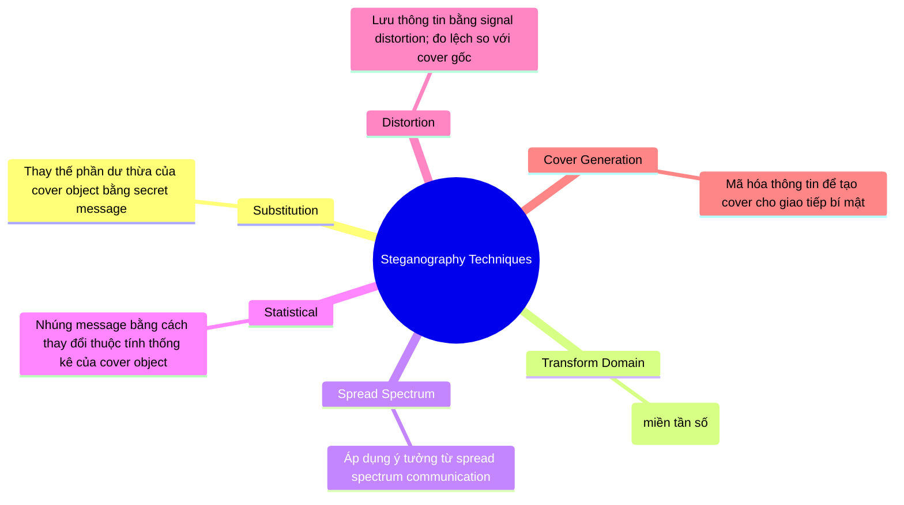
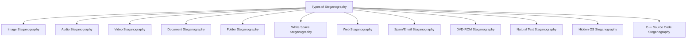
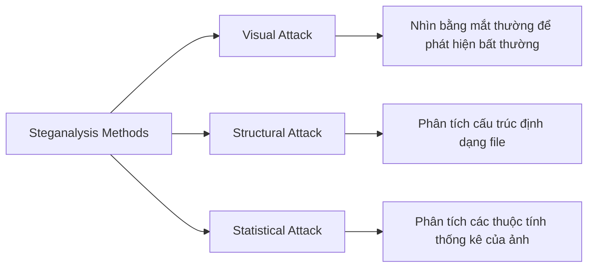
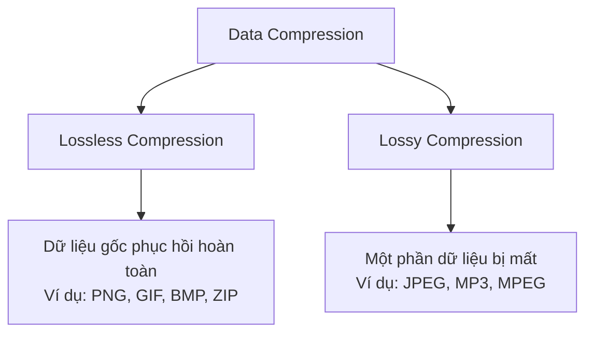
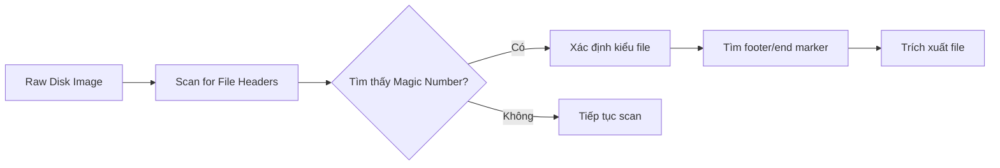

# Steganography and Image File Forensics

## Mục tiêu module

Bài học bao gồm các chủ đề:

- Steganography là gì, ứng dụng, kỹ thuật, phân loại, các loại
- Steganalysis & cách phát hiện Steganography
- Công cụ phát hiện Steganography
- Image Files, định dạng file ảnh, nén dữ liệu
- Xử lý ảnh pháp y bằng MATLAB
- Định vị và phục hồi file ảnh
- Nhận dạng định dạng file không xác định
- Công cụ xem ảnh & công cụ điều tra pháp y ảnh

---

## 1. Steganography

### Định nghĩa

!!! info "Steganography là gì?"
    **Steganography** là kỹ thuật **giấu một thông điệp bí mật bên trong một thông điệp thông thường** và giải mã nó ở điểm đích nhằm duy trì tính bí mật của dữ liệu.

- Sử dụng **hình ảnh đồ họa làm cover** là phương pháp phổ biến nhất để che giấu dữ liệu trong file.
- Dữ liệu có thể ẩn bao gồm: danh sách máy chủ bị xâm phạm, source code công cụ hack, kênh liên lạc & phối hợp, kế hoạch tấn công tương lai.

### Cách hoạt động (Stegosystem)

```
Stego Protocol
     │
     ▼ (Secure Channel)
Alice ──[Cover Message]──► Steganography Tool
      ──[Secret Message]──►     │
                                │── Stego Message ──► Public Channel ──► Bob
                                                                          │
                                                                          ▼
                                                                   Steganography Tool
                                                                          │
                                                                          ▼
                                                               Recovered Secret Message
```

Trong đó **Willie** (kẻ nghe lén) chỉ thấy *Innocent Message* trên kênh công khai, không thể biết có thông điệp bí mật.

### Ứng dụng của Steganography

Steganography được ứng dụng trong các lĩnh vực:

| Ứng dụng | Mô tả |
|---|---|
| Broadcast Monitoring | Gibson, Pattern Recognition |
| Covert Communication | Giao tiếp bí mật |
| Ownership Assertion | Khẳng định quyền sở hữu |
| Fingerprinting (Traitor Tracking) | Theo dõi kẻ phản bội |
| Authentication | Phân biệt bản gốc vs giả mạo |
| Access Control System | Phân phối nội dung số |
| Steganographic File Systems | Hệ thống file ẩn |
| Media Bridging | Cầu nối phương tiện |
| Copy Prevention/Control (DVD) | Bảo vệ bản quyền DVD |
| Metadata Hiding | Ẩn thông tin theo dõi |

### Sử dụng hợp pháp

Cơ quan thực thi pháp luật sử dụng steganography để:

- **Đóng dấu watermark** vật liệu qua trung gian sau khi được ủy quyền và dưới sự kiểm soát của công tố viên
- **Truy vết** vật liệu thương mại
- **Xây dựng ngân hàng dữ liệu quốc tế** để thu thập dữ liệu về giao dịch
- **Cung cấp node mạng** để giám sát vật liệu thương mại

### Sử dụng phi đạo đức

!!! warning "Sử dụng trái phép"
    Steganography bị lạm dụng cho các mục đích: criminal communications, fraud, hacking, electronic payments, gambling & pornography, harassment, intellectual property offenses, viruses.

---

## 2. Kỹ thuật Steganography



---

## 3. Phân loại Steganography

### Technical Steganography (Kỹ thuật vật lý/hóa học)

Sử dụng phương tiện vật lý hoặc hóa học để che giấu sự tồn tại của thông điệp:

- **Invisible Ink** – Mực vô hình, phương pháp có truyền thống lâu đời nhất
- **Microdots** – Phương pháp thu nhỏ tới 1 trang trong một dấu chấm
- **Computer-Based Methods** – Sử dụng thông tin dư thừa trong văn bản, hình ảnh, âm thanh, video…

### Linguistic Steganography (Ngôn ngữ học)

Sử dụng ngôn ngữ viết tự nhiên để ẩn thông điệp, chia thành:

=== "Semagrams"
    Sử dụng **ký hiệu hoặc dấu hiệu trực quan** để ẩn thông điệp bí mật:

    - **Visual Semagrams**: Dùng vật thể vô hại/hàng ngày để truyền đạt thông điệp (hình vẽ nguệch ngoạc, vị trí đồ vật trên bàn…)
    - **Text Semagrams**: Ẩn thông điệp bằng cách **thay đổi giao diện của văn bản** (cỡ chữ, kiểu chữ, thêm khoảng trắng…)

=== "Open Codes"
    Ẩn thông điệp bí mật trong một **mẫu được thiết kế đặc biệt** mà người đọc bình thường không nhận ra:

    **1. Jargon Code** – Ngôn ngữ mà một nhóm người hiểu nhưng vô nghĩa với người khác.

    **2. Covered Ciphers** – Thông điệp được ẩn công khai trong carrier medium. Gồm:

    - *Null Ciphers*: Plaintext được trộn với nhiều vật liệu không phải cipher; cũng dùng để ẩn ciphertext
    - *Grille Ciphers*: Tạo một tấm lưới bằng cách cắt lỗ trên giấy; đặt lên văn bản sẽ lộ thông điệp

---

## 4. Các loại Steganography



### Image Steganography

!!! note "Nguyên tắc"
    Thông tin được ẩn trong các file ảnh định dạng `.PNG`, `.JPG`, `.BMP`… Công cụ **thay thế các bit dư thừa** của dữ liệu ảnh bằng thông điệp theo cách mắt người không phát hiện được.

Quy trình:

```
Cover Image + Information → Steganography Tool → Stego Image
Stego Image → Steganography Tool → Cover Image + Information
```

#### Kỹ thuật Image Steganography

**1. Least Significant Bit (LSB) Insertion**

- **Bit ngoài cùng bên phải** của mỗi pixel gọi là LSB.
- Binary data của thông điệp bí mật được **phân mảnh và chèn vào LSB** của mỗi pixel theo trình tự xác định.
- Thay đổi LSB **không tạo ra sự khác biệt đáng chú ý** vì biến động net là tối thiểu.

```
Ví dụ: Giấu ký tự "H" (= 01001000)

Trước khi giấu:
(00100111 11101001 11001000) (00100111 11001000 11101001) (11001000 00100111 11101001)

Sau khi giấu:
(00100110 11101001 11001000) (00100110 11001001 11101000) (11001000 00100110 11101000)

→ Ghép tất cả LSB: 01001000 = "H"
```

**2. Masking and Filtering**

- Chủ yếu dùng với **ảnh 24-bit và grayscale**
- Ẩn dữ liệu bằng phương pháp tương tự **watermark trên giấy thực**, thực hiện bằng cách thay đổi **luminance** của các phần ảnh
- Thông điệp ẩn nằm **bên trong phần nhìn thấy** của ảnh
- Thông tin **không** được ẩn ở mức "noise" của ảnh

**3. Algorithms and Transformation**

- Ẩn dữ liệu trong **các hàm toán học** của thuật toán nén
- Dữ liệu được nhúng bằng cách **thay đổi các hệ số của transform** của ảnh
- JPEG dùng kỹ thuật **Discrete Cosine Transform (DCT)** để nén ảnh

Các kỹ thuật biến đổi:

- Fast Fourier Transformation (FFT)
- Discrete Cosine Transformation (DCT)
- Wavelet Transformation

#### Công cụ Image Steganography

| Công cụ | URL |
|---|---|
| Hermetic Stego | hermetic.ch |
| S-Tools | Ẩn nhiều ứng dụng trong BMP, GIF, WAV |
| ImageHide | dancemammal.com |
| QuickStego | quickcrypto.com |
| gifshuffle | darkside.com.au |
| OutGuess | outguess.org |
| Contraband | jthz.com |
| Camera/Shy | sourceforge.net |
| JPHIDE and JPSEEK | linux01.gwdg.de |
| StegaNote | planetsourcecode.com |

!!! tip "S-Tools"
    S-Tools có thể **ẩn nhiều ứng dụng trong một object duy nhất**, hỗ trợ file BMP, GIF và WAV.

---

### Audio Steganography

!!! note "Nguyên tắc"
    Ẩn thông tin bí mật trong các file audio như `.MP3`, `.RM`, `.WAV`…

Thông tin có thể được ẩn bằng cách:
- Dùng **LSB**
- Dùng các tần số **không nghe được bởi tai người (>20,000 Hz)**

#### Các phương pháp Audio Steganography

=== "LSB Coding"
    - Tương tự kỹ thuật LSB trong ảnh
    - **Thay thế LSB** của mỗi sampling point bằng một coded binary string

=== "Tone Insertion"
    - Dựa trên tính không nghe được của các **tông có công suất thấp** khi có các thành phần phổ mạnh hơn
    - Khai thác hiện tượng **psychoacoustic masking** trong miền spectral

=== "Phase Decoding"
    - Initial audio segment được **thay thế bằng một reference phase** đại diện cho dữ liệu
    - Mã hóa secret message bits như **phase shifts** trong phase spectrum của tín hiệu số
    - Đạt được soft encoding theo tỷ lệ **signal-to-noise**

=== "Echo Data Hiding"
    - Nhúng secret message vào **cover audio signal dưới dạng echo**
    - Các tham số của echo (**amplitude, decay rate, offset**) được thay đổi để biểu diễn encoded binary message
    - Echo không thể dễ dàng phân giải vì các tham số được đặt **dưới mức nghe thấy của con người**

=== "Spread Spectrum"
    - Mã hóa dữ liệu như **binary sequence nghe như noise** nhưng được nhận dạng bởi receiver với đúng key
    - Hai phương pháp:
        - **DSSS** (Direct Sequence Spread Spectrum): thông điệp được spread bởi chip rate (hằng số) và modulate với pseudo-random signal
        - **FHSS** (Frequency Hopping Spread Spectrum): phổ tần số của audio file được thay đổi để nhảy nhanh giữa các tần số
    - Đóng vai trò quan trọng trong **truyền thông an toàn – thương mại và quân sự**

#### Công cụ Audio Steganography

| Công cụ | URL |
|---|---|
| Mp3stegz | Dùng thuật toán steg trên MP3, duy trì kích thước & chất lượng, nén zlib + mã hóa Rijndael |
| MAXA Security Tools | maxa-tools.com |
| MP3Stego | petitcolas.net |
| Stealth Files | froebis.com |
| Steghide | steghide.sourceforge.net |
| Audiostegano | mathworks.com |
| Hide4PGP | heinz-repp.onlinehome.de |
| BitCrypt | bitcrypt.moshe-szweizer.com |
| CHAOS Universal | safechaos.com |

---

### Video Steganography

!!! note "Nguyên tắc"
    Ẩn thông tin bí mật hoặc bất kỳ loại file nào vào **carrier video file**.

- Thông tin ẩn trong video định dạng `.AVI`, `.MPG4`, `.WMV`…
- **DCT manipulation** được dùng để thêm dữ liệu bí mật trong quá trình biến đổi video
- Video = audio + image, do đó các kỹ thuật của cả hai loại đều áp dụng được
- **Lượng lớn thông điệp** có thể ẩn trong video vì video là luồng ảnh và âm thanh liên tục

#### Công cụ Video Steganography

| Công cụ | URL |
|---|---|
| MSU StegoVideo | compression.ru – ẩn file trong video sequence, nhỏ distortion, extract sau nén, bảo vệ bằng passcode |
| Masker | softpuls.com |
| Our Secret | securekit.net |
| Max File Encryption | softeza.com |
| BDV DataHider | bdvnotepad.com |
| Xiao Steganography | xiao-steganography.en.softonic.com |
| CHAOS Universal | safechaos.com |
| RT Steganography | sourceforge.net |
| OmniHide PRO | omnihide.com |

---

### Document Steganography

**wbStego** là công cụ document steganography nổi bật:

- Ẩn bất kỳ file nào vào carrier file (BMP, TXT, HTML, PDF) **mà không thay đổi file gốc về mặt hình thức**
- Wizard hỗ trợ step-by-step qua coding/decoding
- **Byte Shelter I**: Mã hóa dữ liệu và ẩn trong file `.doc` hoặc email; ẩn file và/hoặc text trong **rich text fragments**

---

## 5. Steganalysis

!!! abstract "Định nghĩa"
    **Steganalysis** là nghệ thuật phát hiện và giải mã các thông điệp được ẩn bằng steganography. Mục tiêu: xác định các gói tin nghi ngờ, xác định liệu có thông điệp ẩn không, và nếu có thì giải mã nó.

### Các phương pháp Steganalysis



### Các kỹ thuật phát hiện

- **Raw Quick Pairs**: Phân tích các cặp giá trị pixel
- **Chi-square Attack**: Kiểm định thống kê chi-square để phát hiện LSB insertion
- **Detecting LSB**: Phân tích histogram của các bit thấp nhất
- **RS Analysis (Regular/Singular)**: Phân loại nhóm pixel Regular/Singular/Unusable
- **Detecting DCT (JPEG)**: Phân tích hệ số DCT của JPEG

---

## 6. Cách phát hiện Steganography

!!! warning "Dấu hiệu nhận biết"
    Sự hiện diện của steganography có thể được nhận diện thông qua:

- Thay đổi **kích thước file**
- **Checksum** không khớp
- **Thời gian tạo file** bất thường
- Thay đổi **màu sắc bảng màu** (palette)
- Thay đổi **định dạng header** của file
- **Noise** trong ảnh/audio tăng bất thường
- **Statistical anomalies** trong phân phối pixel

---

## 7. Công cụ phát hiện Steganography

| Công cụ | Chức năng |
|---|---|
| **Stegdetect** | Phát hiện steganographic content trong JPEG |
| **Stegbreak** | Brute-force tấn công JSteg, JPHide, OutGuess |
| **Virtual Steganographic Laboratory (VSL)** | Nền tảng pháp y steganography |
| **StegoSuite** | Detect & analyze stego content |
| **StegSpy** | Phát hiện stego content trong ảnh |

---

## 8. Image Files

### Định dạng file ảnh phổ biến

| Định dạng | Đầy đủ | Đặc điểm |
|---|---|---|
| **BMP** | Bitmap | Không nén, từng bit, lossless |
| **JPEG** | Joint Photographic Experts Group | Nén lossy, dùng DCT, tối ưu cho ảnh chụp |
| **GIF** | Graphics Interchange Format | 256 màu, hỗ trợ animation, lossless |
| **PNG** | Portable Network Graphics | Lossless, hỗ trợ transparency (alpha channel) |
| **TIFF** | Tagged Image File Format | Chất lượng cao, dùng trong in ấn |
| **RAW** | Raw Image Format | Dữ liệu thô từ cảm biến camera |

### Cấu trúc header file ảnh

!!! info "Magic Numbers / File Signatures"
    Mỗi định dạng file có **magic number** (chữ ký file) ở phần đầu:

```
JPEG: FF D8 FF E0
PNG:  89 50 4E 47 0D 0A 1A 0A
GIF:  47 49 46 38 (GIF8)
BMP:  42 4D (BM)
TIFF: 49 49 2A 00 (little-endian) hoặc 4D 4D 00 2A (big-endian)
```

---

## 9. Nén dữ liệu (Data Compression)

### Hai loại nén



### Các thuật toán nén phổ biến

- **Run-Length Encoding (RLE)**: Mã hóa các chuỗi ký tự lặp lại
- **Huffman Coding**: Cây nhị phân, ký tự thường gặp có mã ngắn hơn
- **LZW (Lempel-Ziv-Welch)**: Dùng trong GIF, TIFF
- **DCT (Discrete Cosine Transform)**: Dùng trong JPEG, MPEG
- **Wavelet Transform**: Dùng trong JPEG 2000

---

## 10. Xử lý ảnh pháp y bằng MATLAB

!!! tip "MATLAB trong Forensics"
    MATLAB cung cấp Image Processing Toolbox để phân tích ảnh pháp y.

Ví dụ đọc và phân tích ảnh với MATLAB:

```matlab
% Đọc ảnh
img = imread('suspicious_image.jpg');

% Hiển thị ảnh
imshow(img);

% Phân tích LSB
lsb_plane = bitget(img, 1);  % Lấy bit thấp nhất (LSB)
imshow(lsb_plane * 255);

% Phân tích histogram
imhist(rgb2gray(img));

% Kiểm tra noise
noise_level = std2(double(img));
fprintf('Noise level: %f\n', noise_level);
```

---

## 11. Định vị và phục hồi file ảnh

### File Carving

!!! info "File Carving là gì?"
    Kỹ thuật phục hồi file dựa trên **file signatures (magic numbers)** và **footer markers** mà không cần file system metadata.



### Các kỹ thuật phục hồi

- **Header-Footer Carving**: Dựa vào cả header lẫn footer của file
- **Header-Based Carving**: Chỉ dựa vào header, dùng kích thước trung bình
- **File Structure-Based Carving**: Phân tích cấu trúc nội bộ của file

### Công cụ phục hồi file ảnh

| Công cụ | Chức năng |
|---|---|
| **Foremost** | File carving CLI, hỗ trợ nhiều định dạng |
| **Scalpel** | Nhanh hơn Foremost, cấu hình linh hoạt |
| **PhotoRec** | Phục hồi ảnh và nhiều định dạng khác |
| **Recoverjpeg** | Phục hồi JPEG từ raw device |
| **Magnet AXIOM** | Suite pháp y toàn diện |
| **EnCase** | Platform pháp y thương mại |
| **FTK (Forensic Toolkit)** | Phân tích toàn diện của AccessData |

---

## 12. Nhận dạng định dạng file không xác định

### Phương pháp nhận dạng

1. **File Extension**: Kiểm tra phần mở rộng (không đáng tin cậy)
2. **Magic Numbers**: Kiểm tra byte đầu tiên của file
3. **File Command (Linux)**:

```bash
file unknown_file
```

4. **Hex Editor**: Xem raw bytes để nhận dạng thủ công

```bash
xxd unknown_file | head -20
```

5. **TrID**: Công cụ tự động nhận dạng file type
6. **ExifTool**: Đọc metadata của ảnh

```bash
exiftool image.jpg
```

### Các magic numbers quan trọng trong forensics

```
FF D8 FF        → JPEG
89 50 4E 47     → PNG
47 49 46 38     → GIF
42 4D           → BMP
49 49 2A 00     → TIFF (little-endian)
4D 4D 00 2A     → TIFF (big-endian)
25 50 44 46     → PDF (%PDF)
50 4B 03 04     → ZIP/DOCX/XLSX
52 49 46 46     → AVI/WAV (RIFF)
```

---

## 13. Công cụ xem ảnh & Công cụ pháp y ảnh

### Picture Viewer Tools

- **IrfanView**: Hỗ trợ hơn 80 định dạng, xem metadata EXIF
- **XnView**: Viewer và converter đa nền tảng
- **FastStone Image Viewer**: Nhẹ, hỗ trợ đọc EXIF
- **Picasa**: Tổ chức và xem ảnh (Google)

### Image File Forensic Tools

| Công cụ | Chức năng |
|---|---|
| **Autopsy** | Open-source digital forensic platform |
| **ExifTool** | Đọc/ghi metadata EXIF, IPTC, XMP |
| **Stegdetect** | Phát hiện steganography trong JPEG |
| **FotoForensics** | Phân tích pháp y ảnh online (ELA) |
| **Ghiro** | Automated image forensic tool |
| **JPEG Snoop** | Phân tích cấu trúc nội bộ JPEG |
| **Metadata Viewer** | Xem metadata file ảnh |

!!! tip "Error Level Analysis (ELA)"
    ELA là kỹ thuật phát hiện chỉnh sửa ảnh bằng cách **lưu lại ảnh với chất lượng nén thấp hơn** và phân tích sự khác biệt. Vùng đã bị chỉnh sửa sẽ có mức ELA khác biệt.

---

---

# 📝 Câu hỏi trắc nghiệm

## Phần 1: Steganography – Khái niệm cơ bản

**Câu 1.** Steganography là gì?

- A. Kỹ thuật mã hóa dữ liệu để bảo vệ bí mật
- B. Kỹ thuật giấu thông điệp bí mật bên trong một thông điệp thông thường
- C. Kỹ thuật phá vỡ mã hóa
- D. Kỹ thuật nén dữ liệu

??? success "Đáp án"
    **B** – Steganography là kỹ thuật **giấu** (không phải mã hóa) thông điệp bí mật bên trong thông điệp thông thường để duy trì tính bí mật của dữ liệu.

---

**Câu 2.** Điểm khác biệt chính giữa Steganography và Cryptography là gì?

- A. Cryptography ẩn sự tồn tại của thông điệp; Steganography mã hóa nội dung
- B. Steganography ẩn sự tồn tại của thông điệp; Cryptography mã hóa nội dung
- C. Cả hai đều giống nhau
- D. Steganography chỉ dùng cho ảnh; Cryptography dùng cho văn bản

??? success "Đáp án"
    **B** – Cryptography làm cho thông điệp **không đọc được** nhưng người ta vẫn biết thông điệp tồn tại. Steganography **ẩn sự tồn tại** của thông điệp.

---

**Câu 3.** Phương pháp phổ biến nhất để che giấu dữ liệu trong steganography là gì?

- A. Sử dụng văn bản mã hóa
- B. Sử dụng hình ảnh đồ họa làm cover
- C. Sử dụng audio file
- D. Sử dụng video file

??? success "Đáp án"
    **B** – Sử dụng **graphic image làm cover** là phương pháp phổ biến nhất.

---

**Câu 4.** Trong mô hình Stegosystem, "Willie" đóng vai trò gì?

- A. Người gửi thông điệp bí mật
- B. Người nhận thông điệp bí mật
- C. Kẻ nghe lén trên kênh công khai
- D. Người quản lý khóa bí mật

??? success "Đáp án"
    **C** – Willie là **kẻ nghe lén (eavesdropper)** trên Public Channel, chỉ thấy Innocent Message.

---

**Câu 5.** Cơ quan thực thi pháp luật KHÔNG sử dụng steganography để làm điều nào sau đây?

- A. Watermark vật liệu qua trung gian
- B. Truy vết vật liệu thương mại
- C. Xây dựng ngân hàng dữ liệu giao dịch
- D. Hack vào hệ thống của nghi phạm

??? success "Đáp án"
    **D** – Các cơ quan pháp luật dùng steganography hợp pháp để watermark, trace, và build data bank. Tấn công hack hệ thống không phải mục đích hợp pháp của steganography.

---

## Phần 2: Kỹ thuật Steganography

**Câu 6.** Kỹ thuật Steganography nào nhúng thông điệp bằng cách **thay thế phần dư thừa** của cover object?

- A. Transform Domain Techniques
- B. Substitution Techniques
- C. Spread Spectrum Techniques
- D. Cover Generation Techniques

??? success "Đáp án"
    **B** – **Substitution Techniques** thay thế phần dư thừa (redundant part) của cover object bằng secret message.

---

**Câu 7.** Kỹ thuật nào nhúng secret message vào **miền tần số** của tín hiệu?

- A. Substitution Techniques
- B. Statistical Techniques
- C. Transform Domain Techniques
- D. Distortion Techniques

??? success "Đáp án"
    **C** – **Transform Domain Techniques** nhúng message vào transform space của tín hiệu (e.g., frequency domain).

---

**Câu 8.** Kỹ thuật **Distortion** trong steganography hoạt động như thế nào?

- A. Thay thế bit thấp nhất của mỗi pixel
- B. Lưu thông tin bằng signal distortion và đo độ lệch so với cover gốc ở bước extraction
- C. Nhúng thông điệp bằng cách thay đổi thuộc tính thống kê
- D. Tạo ra cover object mới để giao tiếp bí mật

??? success "Đáp án"
    **B** – Distortion Techniques **lưu thông tin bằng signal distortion** và đo **độ lệch (deviation)** so với cover gốc trong bước extraction.

---

**Câu 9.** Cover Generation Techniques khác với các kỹ thuật khác ở điểm nào?

- A. Dùng file ảnh làm carrier
- B. Mã hóa thông tin để tạo ra cover cho giao tiếp bí mật
- C. Phân tích thống kê để phát hiện thông điệp ẩn
- D. Dùng biến đổi tần số để ẩn thông tin

??? success "Đáp án"
    **B** – Cover Generation Techniques **encode thông tin đảm bảo tạo ra cover** cho giao tiếp bí mật (không dùng cover có sẵn mà tạo mới).

---

## Phần 3: Phân loại Steganography

**Câu 10.** Technical Steganography sử dụng phương tiện gì?

- A. Ngôn ngữ viết tự nhiên
- B. File ảnh kỹ thuật số
- C. Phương tiện vật lý hoặc hóa học
- D. Thuật toán toán học

??? success "Đáp án"
    **C** – Technical Steganography dùng **physical hoặc chemical means** để ẩn thông điệp.

---

**Câu 11.** Microdots là gì?

- A. Phương pháp mã hóa dữ liệu số
- B. Phương pháp thu nhỏ tới một trang tài liệu vào trong một dấu chấm
- C. Loại mực vô hình
- D. Kỹ thuật giấu thông tin trong âm thanh

??? success "Đáp án"
    **B** – Microdots là phương pháp **ẩn tới một trang tài liệu trong một dấu chấm** nhỏ.

---

**Câu 12.** Mực vô hình (Invisible Ink) được mô tả là gì trong kỹ thuật steganography?

- A. Phương pháp mới nhất
- B. Phương pháp có truyền thống lâu đời nhất
- C. Phương pháp kỹ thuật số
- D. Phương pháp chỉ dùng trong quân sự

??? success "Đáp án"
    **B** – Invisible Ink được mô tả là **method with the longest tradition**.

---

**Câu 13.** Linguistic Steganography sử dụng gì để ẩn thông điệp?

- A. Hóa chất và vật liệu vật lý
- B. Ngôn ngữ viết tự nhiên
- C. Thuật toán kỹ thuật số
- D. Biến đổi tần số

??? success "Đáp án"
    **B** – Linguistic Steganography sử dụng **written natural language** để ẩn thông điệp.

---

**Câu 14.** Visual Semagrams dùng gì để truyền đạt thông điệp?

- A. Font chữ đặc biệt
- B. Vật thể vô hại hoặc hàng ngày (doodles, vị trí đồ vật)
- C. Khoảng trắng trong văn bản
- D. Mã hóa nhị phân

??? success "Đáp án"
    **B** – Visual Semagrams dùng **innocent-looking or everyday physical objects** (doodles, positioning of items on a desk/website).

---

**Câu 15.** Text Semagrams ẩn thông điệp bằng cách nào?

- A. Thay đổi nội dung của văn bản
- B. Thay đổi giao diện của carrier text (font, khoảng trắng, kiểu chữ)
- C. Thêm file đính kèm ẩn
- D. Mã hóa nội dung

??? success "Đáp án"
    **B** – Text Semagrams ẩn thông điệp bằng cách **modify the appearance of the carrier text**: thay đổi cỡ chữ, kiểu chữ, thêm khoảng trắng, flourishes…

---

**Câu 16.** Jargon Code là gì?

- A. Mã mật được tạo bằng thuật toán
- B. Ngôn ngữ mà một nhóm người có thể hiểu nhưng vô nghĩa với người khác
- C. Cách ẩn thông điệp bằng lưới cắt giấy
- D. Phương pháp mã hóa plaintext với vật liệu không liên quan

??? success "Đáp án"
    **B** – Jargon Code là ngôn ngữ **một nhóm người hiểu được** nhưng vô nghĩa với người ngoài.

---

**Câu 17.** Null Cipher là gì?

- A. Mật mã không dùng key
- B. Dạng mã hóa cổ xưa trộn plaintext với lượng lớn vật liệu không phải cipher
- C. Thuật toán mã hóa hiện đại
- D. Phương pháp ẩn bằng lưới giấy

??? success "Đáp án"
    **B** – Null Cipher là **dạng mã hóa cổ xưa** trộn plaintext với nhiều non-cipher material; cũng dùng để ẩn ciphertext.

---

**Câu 18.** Grille Cipher hoạt động như thế nào?

- A. Mã hóa từng ký tự riêng lẻ
- B. Tạo một tấm lưới bằng cách cắt lỗ trên giấy; đặt lên văn bản để lộ thông điệp
- C. Thay đổi thứ tự ký tự trong văn bản
- D. Dùng tần số ký tự để mã hóa

??? success "Đáp án"
    **B** – Grille Cipher tạo **tấm lưới (grille)** bằng cách cắt lỗ trên giấy; đặt lên văn bản, chỉ những ký tự qua lỗ mới là thông điệp thật.

---

## Phần 4: Các loại Steganography

**Câu 19.** Image Steganography ẩn thông tin trong các định dạng file nào?

- A. .DOC, .PDF, .TXT
- B. .PNG, .JPG, .BMP, v.v.
- C. .MP3, .WAV, .RM
- D. .AVI, .WMV, .MPEG

??? success "Đáp án"
    **B** – Image Steganography ẩn thông tin trong file ảnh như **.PNG, .JPG, .BMP**.

---

**Câu 20.** LSB là viết tắt của gì và nó nằm ở đâu?

- A. Longest Significant Bit – bit ngoài cùng bên trái
- B. Least Significant Bit – bit ngoài cùng bên phải của pixel
- C. Low Security Bit – bit mã hóa bảo mật thấp nhất
- D. Linear Steganography Bit – bit đặc biệt để steganography

??? success "Đáp án"
    **B** – LSB = **Least Significant Bit**, là bit **ngoài cùng bên phải** (rightmost bit) của mỗi pixel.

---

**Câu 21.** Tại sao thay đổi LSB không tạo ra sự khác biệt đáng chú ý với mắt người?

- A. Vì LSB được mã hóa trước khi thay đổi
- B. Vì net change là tối thiểu và không thể phân biệt bằng mắt thường
- C. Vì màu sắc được tính toán lại sau khi thay đổi
- D. Vì mắt người không nhìn thấy màu sắc kỹ thuật số

??? success "Đáp án"
    **B** – Thay đổi LSB không đáng kể vì **net change là minimal** và không thể phân biệt bằng mắt thường (indiscernible to the human eye).

---

**Câu 22.** Trong ví dụ LSB, để giấu ký tự "H" (01001000), cần làm gì với stream byte?

- A. Xóa các byte chứa thông tin dư thừa
- B. Thay thế LSB của 8 byte liên tiếp bằng các bit của "H"
- C. Thêm một byte mới vào cuối stream
- D. Đảo ngược thứ tự tất cả các byte

??? success "Đáp án"
    **B** – LSB của mỗi byte trong stream được thay thế bằng từng bit của "H"; ghép tất cả LSB lại cho ra 01001000 = "H".

---

**Câu 23.** Masking and Filtering chủ yếu được sử dụng trên loại ảnh nào?

- A. Ảnh 8-bit màu
- B. Ảnh 24-bit và grayscale
- C. Ảnh 1-bit đen trắng
- D. Ảnh vector

??? success "Đáp án"
    **B** – Masking and Filtering **chủ yếu dùng trên ảnh 24-bit và grayscale**.

---

**Câu 24.** Kỹ thuật Algorithms and Transformation trong image steganography dựa trên nguyên tắc gì?

- A. Thay đổi màu sắc của từng pixel
- B. Thay đổi các hệ số của transform (biến đổi) của ảnh trong thuật toán nén
- C. Thêm noise vào ảnh
- D. Thay đổi metadata của file ảnh

??? success "Đáp án"
    **B** – Dữ liệu được nhúng bằng cách **thay đổi các coefficients của transform** trong compression algorithms.

---

**Câu 25.** JPEG sử dụng kỹ thuật biến đổi nào để nén ảnh?

- A. Fast Fourier Transform (FFT)
- B. Wavelet Transform
- C. Discrete Cosine Transform (DCT)
- D. Run-Length Encoding (RLE)

??? success "Đáp án"
    **C** – JPEG dùng **Discrete Cosine Transform (DCT)** để nén ảnh.

---

**Câu 26.** S-Tools có khả năng đặc biệt nào so với các tool khác?

- A. Chỉ ẩn file ảnh
- B. Có thể ẩn nhiều ứng dụng trong một object duy nhất
- C. Tự động phát hiện steganography
- D. Chỉ hỗ trợ định dạng JPEG

??? success "Đáp án"
    **B** – S-Tools có thể **ẩn multiple applications trong một single object**, hỗ trợ BMP, GIF, WAV.

---

**Câu 27.** Audio Steganography ẩn thông tin bằng cách nào? (Chọn câu đúng nhất)

- A. Chỉ dùng LSB trong file audio
- B. Dùng LSB hoặc sử dụng tần số không nghe được bởi tai người (>20,000 Hz)
- C. Chỉ dùng tần số cao
- D. Mã hóa rồi nhúng vào ID3 tag

??? success "Đáp án"
    **B** – Audio Steganography dùng **LSB** hoặc **tần số >20,000 Hz** (inaudible to human ear).

---

**Câu 28.** Echo Data Hiding ẩn thông điệp như thế nào?

- A. Thêm tần số siêu âm vào file
- B. Nhúng secret message vào cover audio như một echo, thay đổi amplitude, decay rate và offset
- C. Thay đổi sample rate của file audio
- D. Nén file audio rồi nhúng thông điệp

??? success "Đáp án"
    **B** – Echo Data Hiding nhúng message vào audio dưới dạng echo, thay đổi **amplitude, decay rate và offset** dưới mức nghe được.

---

**Câu 29.** Trong Spread Spectrum Method, DSSS và FHSS khác nhau như thế nào?

- A. DSSS thay đổi tần số; FHSS spread bằng chip rate
- B. DSSS spread bằng chip rate constant; FHSS thay đổi frequency spectrum để hopping giữa các tần số
- C. Cả hai hoàn toàn giống nhau
- D. DSSS dùng cho audio; FHSS dùng cho video

??? success "Đáp án"
    **B** – **DSSS**: secret message spread bằng chip rate (constant) → modulate với pseudo-random signal. **FHSS**: frequency spectrum của audio file được thay đổi để hops rapidly giữa các tần số.

---

**Câu 30.** Mp3stegz dùng thuật toán nào để nén và mã hóa thông điệp ẩn?

- A. ZIP và AES
- B. zlib (nén) và Rijndael (mã hóa)
- C. RAR và DES
- D. LZMA và RSA

??? success "Đáp án"
    **B** – Mp3stegz nén bằng **zlib** và mã hóa bằng **Rijndael**.

---

**Câu 31.** Video Steganography ẩn thông tin trong định dạng file nào?

- A. .PNG, .JPEG, .BMP
- B. .MP3, .WAV, .RM
- C. .AVI, .MPG4, .WMV
- D. .DOC, .PDF, .TXT

??? success "Đáp án"
    **C** – Video Steganography ẩn thông tin trong **AVI, MPG4, WMV**.

---

**Câu 32.** Tại sao video file có thể chứa lượng lớn thông điệp ẩn?

- A. Vì video file rất nhỏ
- B. Vì video là luồng liên tục của ảnh và âm thanh
- C. Vì video dùng mã hóa đặc biệt
- D. Vì video không bị kiểm tra bởi antivirus

??? success "Đáp án"
    **B** – Video là **moving stream of images and sound**, nên có thể chứa lượng lớn secret messages.

---

**Câu 33.** MSU StegoVideo có tính năng đặc biệt nào?

- A. Chỉ ẩn text trong video
- B. Có thể extract thông tin SAU KHI video bị nén
- C. Tự động detect steganography trong video
- D. Chỉ hỗ trợ định dạng AVI

??? success "Đáp án"
    **B** – MSU StegoVideo đặc biệt ở chỗ **có thể extract info sau video compression**, bảo vệ bằng passcode.

---

**Câu 34.** Byte Shelter I ẩn dữ liệu vào loại file nào?

- A. File ảnh PNG và JPEG
- B. File .doc và email messages / rich text fragments
- C. File audio MP3
- D. File video AVI

??? success "Đáp án"
    **B** – Byte Shelter I mã hóa và ẩn dữ liệu trong **.doc files** hoặc **email messages**, cũng ẩn text trong **rich text fragments**.

---

## Phần 5: Steganalysis

**Câu 35.** Steganalysis là gì?

- A. Kỹ thuật tạo steganography
- B. Nghệ thuật phát hiện và giải mã các thông điệp được ẩn bằng steganography
- C. Phương pháp nén dữ liệu
- D. Công cụ mã hóa file ảnh

??? success "Đáp án"
    **B** – Steganalysis là **nghệ thuật phát hiện và giải mã (decode)** thông điệp được ẩn bằng steganography.

---

**Câu 36.** Chi-square Attack trong steganalysis được dùng để phát hiện điều gì?

- A. Giả mạo metadata
- B. LSB insertion trong ảnh
- C. Mã hóa XOR
- D. Compression artifact

??? success "Đáp án"
    **B** – Chi-square Attack dùng kiểm định thống kê để phát hiện **LSB insertion**, phân tích sự phân phối giá trị pixel.

---

**Câu 37.** RS Analysis (Regular/Singular) phân loại pixel theo nhóm nào?

- A. Red, Green, Blue
- B. Regular, Singular, Unusable
- C. Low, Medium, High
- D. Odd, Even, Zero

??? success "Đáp án"
    **B** – RS Analysis phân loại nhóm pixel thành **Regular, Singular, Unusable** để phát hiện LSB modification.

---

**Câu 38.** Dấu hiệu nào KHÔNG phải là dấu hiệu nhận biết steganography?

- A. Thay đổi kích thước file
- B. Checksum không khớp
- C. Font chữ đẹp hơn
- D. Noise trong ảnh tăng bất thường

??? success "Đáp án"
    **C** – Font chữ đẹp hơn không phải dấu hiệu steganography. Các dấu hiệu thực sự: file size thay đổi, checksum không khớp, noise tăng bất thường, timestamp bất thường.

---

**Câu 39.** Công cụ **Stegdetect** được dùng để làm gì?

- A. Tạo thông điệp ẩn trong JPEG
- B. Phát hiện steganographic content trong JPEG
- C. Nén file ảnh JPEG
- D. Chỉnh sửa metadata JPEG

??? success "Đáp án"
    **B** – Stegdetect là công cụ **phát hiện steganographic content trong ảnh JPEG**.

---

## Phần 6: Image Files và Định dạng

**Câu 40.** Magic number của file JPEG là gì?

- A. `89 50 4E 47`
- B. `42 4D`
- C. `FF D8 FF`
- D. `47 49 46 38`

??? success "Đáp án"
    **C** – Magic number của JPEG là **`FF D8 FF`**. PNG là `89 50 4E 47`, BMP là `42 4D`, GIF là `47 49 46 38`.

---

**Câu 41.** Định dạng ảnh nào hỗ trợ transparency (alpha channel) và lossless compression?

- A. JPEG
- B. GIF
- C. BMP
- D. PNG

??? success "Đáp án"
    **D** – **PNG** hỗ trợ cả lossless compression và transparency (alpha channel). GIF cũng lossless nhưng hạn chế 256 màu và không có alpha channel thật sự.

---

**Câu 42.** GIF có giới hạn số màu là bao nhiêu?

- A. 16 màu
- B. 256 màu
- C. 65,536 màu
- D. Không giới hạn

??? success "Đáp án"
    **B** – GIF chỉ hỗ trợ tối đa **256 màu** (8-bit color palette).

---

**Câu 43.** Sự khác biệt giữa Lossy và Lossless compression là gì?

- A. Lossy nhanh hơn; Lossless chậm hơn – không có khác biệt khác
- B. Lossy mất một phần dữ liệu gốc; Lossless khôi phục dữ liệu gốc hoàn toàn
- C. Lossless chỉ dùng cho văn bản; Lossy cho ảnh
- D. Không có sự khác biệt thực sự

??? success "Đáp án"
    **B** – **Lossy**: mất dữ liệu không thể phục hồi (JPEG, MP3). **Lossless**: phục hồi hoàn toàn dữ liệu gốc (PNG, GIF, ZIP).

---

**Câu 44.** Thuật toán nén nào được dùng trong định dạng GIF?

- A. DCT (Discrete Cosine Transform)
- B. LZW (Lempel-Ziv-Welch)
- C. Huffman Coding
- D. Wavelet Transform

??? success "Đáp án"
    **B** – GIF dùng thuật toán **LZW (Lempel-Ziv-Welch)**.

---

## Phần 7: File Forensics và Recovery

**Câu 45.** File Carving là gì?

- A. Tạo file ảnh mới từ đầu
- B. Phục hồi file dựa trên file signatures và footer markers mà không cần file system metadata
- C. Mã hóa file để bảo vệ
- D. Nén file để tiết kiệm dung lượng

??? success "Đáp án"
    **B** – File Carving là kỹ thuật **phục hồi file dựa trên magic numbers và footer markers** mà không cần file system metadata (FAT, NTFS...).

---

**Câu 46.** Công cụ nào trong số sau đây được dùng để phục hồi ảnh từ thiết bị lưu trữ?

- A. Stegdetect
- B. PhotoRec
- C. ExifTool
- D. IrfanView

??? success "Đáp án"
    **B** – **PhotoRec** là công cụ phục hồi file ảnh và nhiều định dạng khác từ raw device.

---

**Câu 47.** Lệnh Linux nào được dùng để nhận dạng loại file không biết?

- A. `cat unknown_file`
- B. `ls unknown_file`
- C. `file unknown_file`
- D. `rm unknown_file`

??? success "Đáp án"
    **C** – Lệnh **`file unknown_file`** phân tích và nhận dạng loại file dựa trên nội dung (không phụ thuộc extension).

---

**Câu 48.** Error Level Analysis (ELA) được dùng để làm gì trong pháp y ảnh?

- A. Nén ảnh ở chất lượng cao hơn
- B. Phát hiện các vùng đã bị chỉnh sửa trong ảnh
- C. Phục hồi ảnh bị xóa
- D. Mã hóa ảnh để bảo vệ bản quyền

??? success "Đáp án"
    **B** – ELA lưu lại ảnh với chất lượng thấp hơn và phân tích sự khác biệt; **vùng bị chỉnh sửa sẽ có mức ELA khác biệt**.

---

**Câu 49.** ExifTool được sử dụng chủ yếu để làm gì?

- A. Tạo steganography trong ảnh
- B. Đọc/ghi metadata EXIF, IPTC, XMP của file ảnh
- C. Phục hồi file ảnh bị xóa
- D. Nén file ảnh

??? success "Đáp án"
    **B** – ExifTool là công cụ chuyên **đọc/ghi metadata** (EXIF, IPTC, XMP) của nhiều loại file ảnh.

---

**Câu 50.** Magic number `50 4B 03 04` tương ứng với loại file nào?

- A. PDF
- B. JPEG
- C. ZIP/DOCX/XLSX (định dạng ZIP-based)
- D. GIF

??? success "Đáp án"
    **C** – `50 4B 03 04` là magic number của **ZIP** và các định dạng dựa trên ZIP như DOCX, XLSX, PPTX.

---

## Câu hỏi bổ sung (Bonus)

**Câu 51.** Kỹ thuật Phase Decoding trong audio steganography mã hóa secret message bits như thế nào?

- A. Thêm khoảng trắng vào audio
- B. Mã hóa secret message bits như phase shifts trong phase spectrum của tín hiệu số
- C. Xóa một phần của audio signal
- D. Tăng biên độ audio

??? success "Đáp án"
    **B** – Phase Decoding mã hóa secret message bits như **phase shifts trong phase spectrum** của tín hiệu số, đạt được soft encoding theo signal-to-noise ratio.

---

**Câu 52.** Spread Spectrum Method đóng vai trò quan trọng trong lĩnh vực nào?

- A. Chỉ trong pháp y máy tính
- B. Truyền thông an toàn – thương mại và quân sự
- C. Chỉ trong truyền phát nhạc
- D. Chỉ trong hệ thống điện thoại

??? success "Đáp án"
    **B** – Spread Spectrum Method đóng vai trò quan trọng trong **secure communications – commercial and military**.

---

**Câu 53.** Theo Module Objectives, công việc pháp y ảnh bao gồm việc sử dụng phần mềm nào để xử lý ảnh?

- A. Adobe Photoshop
- B. MATLAB
- C. Microsoft Paint
- D. GIMP

??? success "Đáp án"
    **B** – Module đề cập đến **Forensic Image Processing Using MATLAB** (sử dụng Image Processing Toolbox).

---

**Câu 54.** wbStego4 hỗ trợ carrier file ở định dạng nào?

- A. MP3, WAV, AAC
- B. BMP, TXT, HTML, PDF
- C. AVI, WMV, MPEG
- D. DOC, XLSX, PPTX

??? success "Đáp án"
    **B** – wbStego4 hỗ trợ ẩn file vào carrier file dạng **BMP, TXT, HTML, PDF** mà không thay đổi về mặt hình thức.

---

**Câu 55.** Kỹ thuật Tone Insertion trong audio steganography dựa trên hiện tượng gì?

- A. Hiện tượng cộng hưởng âm thanh
- B. Hiện tượng psychoacoustic masking trong miền spectral
- C. Hiện tượng nhiễu sóng điện từ
- D. Hiện tượng Doppler

??? success "Đáp án"
    **B** – Tone Insertion là **khai thác gián tiếp hiện tượng psychoacoustic masking** trong spectral domain: các tông công suất thấp không nghe được khi có thành phần phổ mạnh hơn.

---

!!! summary "Tóm tắt điểm trắc nghiệm"
    - **Câu 1–5**: Khái niệm cơ bản Steganography
    - **Câu 6–9**: Kỹ thuật Steganography
    - **Câu 10–18**: Phân loại (Technical / Linguistic)
    - **Câu 19–34**: Các loại (Image, Audio, Video, Document)
    - **Câu 35–39**: Steganalysis
    - **Câu 40–44**: Image Files & Nén dữ liệu
    - **Câu 45–50**: File Forensics & Recovery
    - **Câu 51–55**: Câu hỏi nâng cao / tổng hợp
