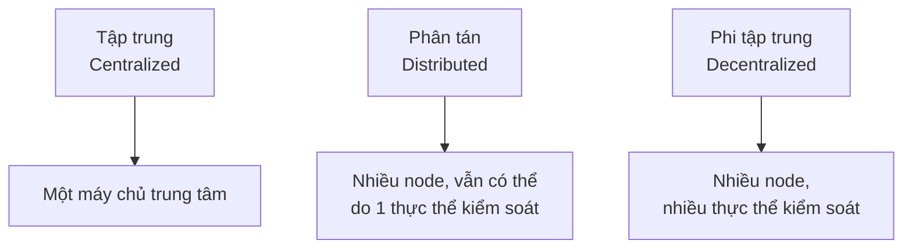
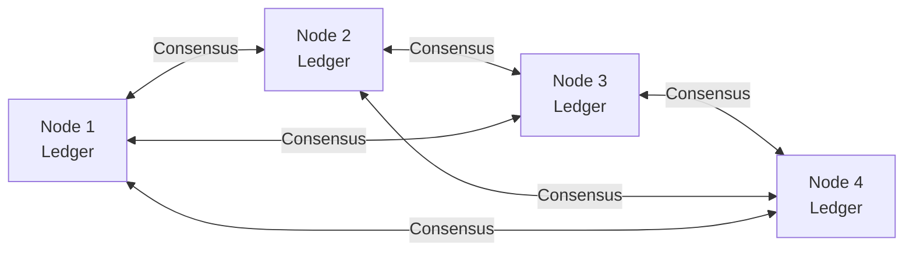
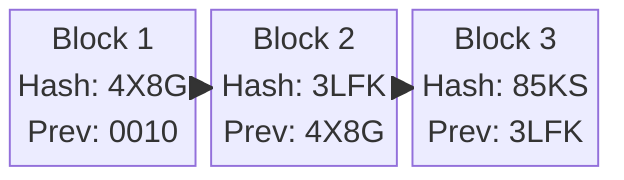
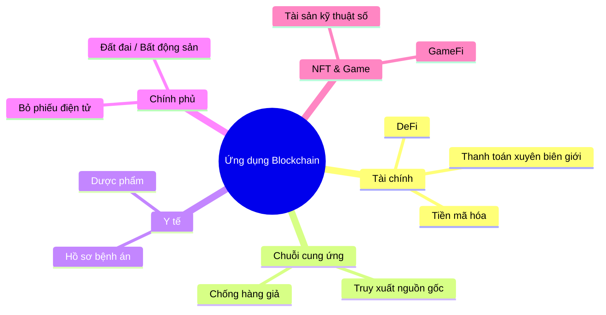

# Buổi 1 - Tổng quan về Blockchain và Hệ thống Phân tán

> **Môn học:** Blockchain: Nền tảng, Ứng dụng & Bảo mật  
> **Nhóm nghiên cứu:** Blockchainist Research Team – UIT

---

## Mục tiêu bài học

Sau buổi học, sinh viên sẽ có khả năng:

- **Hiểu** bối cảnh lịch sử dẫn đến sự ra đời của Bitcoin và Blockchain.
- **Phân biệt** rạch ròi ba kiến trúc hệ thống: Tập trung, Phân tán và Phi tập trung.
- **Trình bày** được các đặc tính cốt lõi của công nghệ Blockchain.
- **Nhận dạng** được các loại hình Blockchain phổ biến và ứng dụng của chúng.

---

## Phần 1 – Tại sao cần Blockchain?

### Vấn đề: Niềm tin trong Kỷ nguyên số

Mọi giao dịch online hiện nay đều cần một **bên trung gian đáng tin cậy**:

- **Chuyển tiền:** Cần Ngân hàng xác nhận.
- **Mua sắm online:** Cần Sàn TMĐT đảm bảo.
- **Mạng xã hội:** Cần Facebook/Google quản lý dữ liệu.

!!! question "Câu hỏi cốt lõi"
    Liệu chúng ta có thể tạo ra một hệ thống nơi mà **sự tin tưởng được xây dựng bằng thuật toán**, thay vì dựa vào một tổ chức?

---

## Phần 2 – Lịch sử ra đời

### Giấc mơ về "Tiền mặt Kỹ thuật số" (Những năm 80–90)

Ý tưởng về tiền điện tử không mới, bắt đầu từ **phong trào Cypherpunk** những năm 80–90.

```
Timeline:
1983 → e-Cash (David Chaum / DigiCash)
1998 → B-money (Wei Dai) + Bit Gold (Nick Szabo)
2008 → Bitcoin Whitepaper (Satoshi Nakamoto)
2009 → Genesis Block – mạng lưới Bitcoin khởi chạy
```

???+ note "e-Cash của David Chaum (1983)"
    - Là nỗ lực tiên phong tạo ra tiền điện tử **ẩn danh**.
    - **Thất bại cốt lõi:** Hệ thống DigiCash vẫn là **tập trung**. Máy chủ công ty là trung tâm xử lý — đây là một "điểm yếu chí mạng" (**single point of failure**).

### Thách thức lớn nhất: Bài toán Chi tiêu Kép (Double-Spending)

Trong thế giới vật lý, bạn không thể đưa cho 2 người cùng một tờ tiền. Nhưng trong thế giới số, mọi thứ chỉ là dữ liệu — dữ liệu có thể bị **sao chép**.

```
[Đồng tiền số] → [Ctrl+C] → [Bản sao đồng tiền số]
```

!!! warning "Câu hỏi chưa có lời giải (trước 2008)"
    Làm thế nào để ngăn chặn một người dùng chi tiêu cùng một "đồng tiền số" nhiều lần trong một mạng lưới mà **không có ai là người quản lý**?

### Những nỗ lực Tiền-Bitcoin

Nhiều nhà mật mã học đã cố gắng giải quyết bài toán trên:

| Dự án | Năm | Tác giả | Đóng góp |
|---|---|---|---|
| **B-money** | 1998 | Wei Dai | Đề xuất kiến trúc **phi tập trung**, mọi người duy trì một sổ cái chung |
| **Bit Gold** | 1998 | Nick Szabo | Đưa ra ý tưởng về **Proof of Work** – người dùng phải giải bài toán tính toán để tạo "vàng kỹ thuật số" |

!!! info "Nhận xét"
    Cả hai đều là những ý tưởng đột phá, đặt nền móng lý thuyết nhưng chưa được triển khai thành một hệ thống hoàn chỉnh.

### Chất xúc tác: Khủng hoảng Tài chính Toàn cầu 2008

- Sự sụp đổ của các định chế tài chính lớn làm lung lay niềm tin của công chúng vào hệ thống ngân hàng tập trung.
- Đây là bối cảnh hoàn hảo cho một giải pháp thay thế ra đời — một hệ thống tài chính không phụ thuộc vào các tổ chức *"quá lớn để sụp đổ"*.

### Giải pháp của Satoshi Nakamoto

- **Tháng 10/2008:** Whitepaper *"Bitcoin: A Peer-to-Peer Electronic Cash System"* được công bố.
- **Tháng 01/2009:** Khối đầu tiên — **Genesis Block** — được tạo ra, khởi chạy mạng lưới.

!!! quote "Thông điệp ẩn trong Genesis Block"
    *"The Times 03/Jan/2009 Chancellor on brink of second bailout for banks"*
    
    Đây là lời tuyên bố về mục đích của Bitcoin: tạo ra một hệ thống **độc lập với tài chính truyền thống**.

---

## Phần 3 – Kiến trúc Hệ thống

### So sánh 3 mô hình kiến trúc



#### Tập trung (Centralized)

Mô hình truyền thống, hoạt động theo kiểu **client-server**.

- **Ví dụ:** Hệ thống của một ngân hàng, website của một công ty.
- ✅ **Ưu điểm:** Dễ quản lý, hiệu suất cao, kiểm soát rõ ràng.
- ❌ **Nhược điểm:** Điểm yếu chí mạng (máy chủ sập → cả hệ thống sập), dễ bị kiểm duyệt, người dùng phải tin tưởng hoàn toàn vào bên quản lý.

#### Phi tập trung (Decentralized)

Quyền lực và quyền ra quyết định được **phân bổ cho nhiều nodes** trong mạng lưới.

- **Ví dụ:** Bitcoin, Ethereum.
- ✅ **Ưu điểm:** Chống chịu lỗi tốt hơn (không có điểm yếu chí mạng), khó bị kiểm duyệt, không cần tin tưởng một thực thể duy nhất.
- ❌ **Nhược điểm:** Phức tạp hơn trong việc phối hợp, hiệu suất có thể thấp hơn.

#### Phân tán (Distributed)

Dữ liệu và tính toán được đặt ở **nhiều vị trí địa lý khác nhau**, nhưng có thể vẫn dưới sự kiểm soát của một thực thể.

- **Ví dụ:** Mạng lưới phân phối nội dung (CDN) của Google, Netflix.

!!! tip "Mối quan hệ quan trọng"
    - Một hệ thống **phi tập trung** bắt buộc phải **phân tán**.
    - Nhưng một hệ thống **phân tán** không nhất thiết phải **phi tập trung**.
    - **Blockchain là sự kết hợp của cả hai:** Dữ liệu phân tán toàn cầu + quyền kiểm soát phi tập trung.

### Bảng so sánh tổng hợp

| Tiêu chí | Tập trung | Phi tập trung | Phân tán |
|---|---|---|---|
| **Kiểm soát** | Một thực thể | Nhiều thực thể | Có thể một hoặc nhiều |
| **Chống chịu lỗi** | Thấp (SPOF) | Cao | Cao |
| **Hiệu suất** | Cao | Thấp hơn | Cao |
| **Bảo mật** | Dễ bị tấn công vào trung tâm | Khó tấn công đồng bộ | Phụ thuộc vào kiến trúc |
| **Ví dụ** | Ngân hàng | Bitcoin | Google Search |

---

## Phần 4 – Thành phần Blockchain

### 1. Sổ cái Phân tán (DLT – Distributed Ledger Technology)

Blockchain là một dạng đặc biệt của **Công nghệ Sổ cái Phân tán (DLT)**.



- Thay vì một cuốn sổ duy nhất, **mỗi người trong mạng lưới đều giữ một bản sao y hệt** của cuốn sổ.
- Khi một giao dịch mới xảy ra, nó sẽ được thông báo cho mọi người và tất cả cùng ghi vào sổ của mình.
- Điều này tạo ra sự **đồng thuận** và **minh bạch** mà không cần một người ghi sổ trung tâm.

### 2. Khối (Block)

Dữ liệu giao dịch không được ghi riêng lẻ mà được **nhóm lại vào các "Khối"**.

Một khối gồm **2 phần chính**:

```
┌─────────────────────────────────────────┐
│              BLOCK HEADER               │
│  - Hash của khối trước (Previous Hash) │
│  - Dấu thời gian (Timestamp)           │
│  - Nonce                               │
│  - Merkle Root (tóm tắt các giao dịch)│
├─────────────────────────────────────────┤
│              BLOCK BODY                 │
│  - Danh sách các giao dịch             │
│    [From: A, To: B, Amount: $$]        │
└─────────────────────────────────────────┘
```

### 3. Chuỗi (Blockchain)

Đây chính là phần **"Chain"** trong "Blockchain". Các khối được liên kết với nhau **một cách chặt chẽ bằng mật mã học**.



- Mỗi khối trong chuỗi **chứa mã hash của khối ngay trước nó**.
- Điều này tạo ra một liên kết không thể phá vỡ, giống như các mắt xích của một sợi dây chuyền.

### 4. Tính bất biến (Immutability)

!!! danger "Tại sao không thể sửa dữ liệu trên Blockchain?"
    Nếu ai đó **sửa dữ liệu trong Block N-1**:
    
    1. Hash của Block N-1 **thay đổi**
    2. Liên kết tới Block N bị **phá vỡ** (hash không còn khớp)
    3. Kẻ tấn công phải **tính toán lại hash cho Block N VÀ tất cả các khối sau đó**
    
    Việc này đòi hỏi một năng lực tính toán khổng lồ, khiến cho việc gian lận trở nên **cực kỳ tốn kém** và gần như không thể trên các mạng lưới lớn.

---

## Phần 5 – Các loại hình Blockchain

*(Nội dung phần này được trình bày trong các slide cuối – slides 17–20)*

### Slide 17: Public Blockchain

- **Ai cũng có thể tham gia:** Không cần xin phép.
- **Hoàn toàn minh bạch:** Mọi giao dịch công khai.
- **Phi tập trung hoàn toàn.**
- **Ví dụ:** Bitcoin, Ethereum.

### Slide 18: Private Blockchain

- **Chỉ những người được cấp phép** mới có thể tham gia.
- **Kiểm soát bởi một tổ chức** duy nhất.
- **Hiệu suất cao hơn**, ít phi tập trung hơn.
- **Ví dụ:** Hyperledger Fabric (dùng trong doanh nghiệp).

### Slide 19: Consortium / Federated Blockchain

- **Được kiểm soát bởi một nhóm tổ chức** (không phải một tổ chức duy nhất).
- Cân bằng giữa minh bạch và kiểm soát.
- **Ví dụ:** R3 (ngân hàng), Energy Web Chain.

### Slide 20: Ứng dụng thực tế



---

---

# 🧪 Bộ câu hỏi trắc nghiệm ôn tập

## Chương 1: Bối cảnh & Lịch sử

---

**Câu 1.** Vấn đề cốt lõi mà Blockchain ra đời để giải quyết là gì?

- A. Tăng tốc độ xử lý giao dịch ngân hàng
- B. Tạo ra sự tin tưởng mà không cần bên trung gian tập trung
- C. Mã hóa dữ liệu người dùng trên mạng xã hội
- D. Thay thế Internet truyền thống

??? success "Đáp án: B"
    Câu hỏi cốt lõi của Blockchain là: *"Liệu có thể tạo ra hệ thống nơi sự tin tưởng được xây dựng bằng thuật toán, thay vì dựa vào một tổ chức?"*

---

**Câu 2.** e-Cash của David Chaum được tạo ra vào năm nào?

- A. 1975
- B. 1983
- C. 1998
- D. 2008

??? success "Đáp án: B"
    David Chaum tạo ra e-Cash vào năm **1983**, là một trong những nỗ lực tiên phong nhất về tiền điện tử ẩn danh.

---

**Câu 3.** Lý do khiến DigiCash (e-Cash) thất bại là gì?

- A. Công nghệ mã hóa quá yếu
- B. Không có ứng dụng thực tiễn
- C. Hệ thống vẫn là **tập trung** – máy chủ công ty là điểm yếu chí mạng
- D. Chính phủ cấm sử dụng

??? success "Đáp án: C"
    Mặc dù e-Cash có tính ẩn danh, **hệ thống vẫn phụ thuộc vào máy chủ trung tâm của DigiCash** – đây là single point of failure khiến nó dễ sụp đổ.

---

**Câu 4.** "Single Point of Failure" (điểm yếu chí mạng) nghĩa là gì?

- A. Một điểm trong hệ thống nếu bị lỗi sẽ khiến toàn bộ hệ thống ngừng hoạt động
- B. Một lỗ hổng bảo mật nhỏ trong mã nguồn
- C. Giới hạn số lượng giao dịch mỗi giây
- D. Điểm tập hợp dữ liệu trên cloud

??? success "Đáp án: A"
    SPOF là thành phần mà nếu nó thất bại, toàn bộ hệ thống sẽ ngừng hoạt động. Đây là nhược điểm lớn nhất của hệ thống tập trung.

---

**Câu 5.** B-money (1998) do ai đề xuất?

- A. Nick Szabo
- B. Satoshi Nakamoto
- C. Wei Dai
- D. David Chaum

??? success "Đáp án: C"
    **Wei Dai** đề xuất B-money năm 1998 – một kiến trúc phi tập trung nơi mọi người duy trì một sổ cái chung.

---

**Câu 6.** Bit Gold (1998) đóng góp ý tưởng quan trọng gì cho Blockchain sau này?

- A. Mã hóa đầu-cuối (End-to-end encryption)
- B. Proof of Work – người dùng phải giải bài toán tính toán
- C. Hợp đồng thông minh (Smart Contract)
- D. Mạng ngang hàng (P2P network)

??? success "Đáp án: B"
    **Nick Szabo** với Bit Gold đã đưa ra ý tưởng **Proof of Work**: người dùng phải giải một bài toán tính toán khó để tạo ra "vàng kỹ thuật số" – ý tưởng này được Bitcoin kế thừa.

---

**Câu 7.** Bitcoin Whitepaper được công bố vào tháng mấy, năm nào?

- A. Tháng 1/2008
- B. Tháng 10/2008
- C. Tháng 1/2009
- D. Tháng 10/2009

??? success "Đáp án: B"
    Whitepaper *"Bitcoin: A Peer-to-Peer Electronic Cash System"* được Satoshi Nakamoto công bố vào **tháng 10/2008**.

---

**Câu 8.** Genesis Block là gì?

- A. Block đầu tiên trong chuỗi Bitcoin, được tạo ra tháng 1/2009
- B. Block có giá trị giao dịch lớn nhất trong lịch sử Bitcoin
- C. Tên gọi của Bitcoin Whitepaper
- D. Block đặc biệt dùng để reset toàn bộ blockchain

??? success "Đáp án: A"
    **Genesis Block** là khối đầu tiên của blockchain Bitcoin, được Satoshi Nakamoto tạo ra vào tháng 01/2009, đánh dấu sự khởi chạy của mạng lưới.

---

**Câu 9.** Thông điệp ẩn trong Genesis Block của Bitcoin là gì và ý nghĩa của nó?

- A. "Hello World" – đánh dấu sự ra đời của công nghệ mới
- B. "The Times 03/Jan/2009 Chancellor on brink of second bailout for banks" – tuyên bố sự độc lập với tài chính truyền thống
- C. "In code we trust" – khẳng định niềm tin vào mã nguồn mở
- D. "Veni, vidi, vici" – tuyên bố chiến thắng hệ thống ngân hàng

??? success "Đáp án: B"
    Đây là dòng tiêu đề báo The Times ngày 3/1/2009, được Satoshi nhúng vào Genesis Block như một **lời tuyên bố về mục đích của Bitcoin**: tạo ra hệ thống tài chính độc lập, không phụ thuộc vào các ngân hàng trung ương.

---

**Câu 10.** Sự kiện nào năm 2008 là "chất xúc tác" thúc đẩy sự ra đời của Bitcoin?

- A. Sự bùng nổ của mạng xã hội Facebook
- B. Ra đời của điện thoại thông minh iPhone
- C. Khủng hoảng tài chính toàn cầu – sự sụp đổ của các định chế tài chính lớn
- D. Sự ra đời của điện toán đám mây

??? success "Đáp án: C"
    Khủng hoảng tài chính 2008 làm lung lay niềm tin vào hệ thống ngân hàng tập trung, tạo ra bối cảnh hoàn hảo cho Bitcoin – một hệ thống không phụ thuộc vào tổ chức "quá lớn để sụp đổ".

---

## Chương 2: Bài toán Chi tiêu Kép

---

**Câu 11.** Bài toán Chi tiêu Kép (Double-Spending) là gì?

- A. Việc hai người cùng gửi tiền cho nhau cùng lúc
- B. Việc một đồng tiền số bị sao chép và chi tiêu nhiều lần
- C. Lỗi tính toán khiến số dư tài khoản bị nhân đôi
- D. Thuế suất áp dụng hai lần cho một giao dịch

??? success "Đáp án: B"
    Trong thế giới số, dữ liệu có thể bị sao chép. **Double-Spending** là vấn đề khi cùng một "đồng tiền số" được chi tiêu nhiều hơn một lần.

---

**Câu 12.** Tại sao Double-Spending là vấn đề trong thế giới số nhưng không phải trong thế giới vật lý?

- A. Vì tiền vật lý có mã số serial riêng
- B. Vì trong thế giới số, dữ liệu có thể bị sao chép (Ctrl+C), còn tiền vật lý thì không
- C. Vì ngân hàng quản lý chặt tiền vật lý hơn
- D. Vì tiền điện tử không có giá trị thực

??? success "Đáp án: B"
    Tờ tiền vật lý chỉ tồn tại ở một chỗ. Nhưng dữ liệu số có thể bị sao chép dễ dàng – đây là vấn đề cốt lõi của tiền điện tử.

---

**Câu 13.** Cách truyền thống để giải quyết Double-Spending là gì?

- A. Mã hóa mạnh hơn
- B. Dùng bên thứ ba trung gian (ngân hàng) để xác nhận giao dịch
- C. Giới hạn số lượng giao dịch mỗi ngày
- D. Yêu cầu xác thực sinh trắc học

??? success "Đáp án: B"
    Ngân hàng (trung gian tập trung) là giải pháp truyền thống: họ lưu sổ cái và đảm bảo không ai chi tiêu cùng một khoản tiền hai lần.

---

## Chương 3: Kiến trúc Hệ thống

---

**Câu 14.** Hệ thống tập trung (Centralized) hoạt động theo mô hình nào?

- A. Peer-to-Peer (P2P)
- B. Client-Server
- C. Mesh Network
- D. Ring Topology

??? success "Đáp án: B"
    Hệ thống tập trung hoạt động theo mô hình **Client-Server**: tất cả client kết nối và phụ thuộc vào một server trung tâm.

---

**Câu 15.** Đâu là ưu điểm của hệ thống tập trung so với phi tập trung?

- A. Khó bị kiểm duyệt hơn
- B. Không có điểm yếu chí mạng
- C. Dễ quản lý, hiệu suất cao, kiểm soát rõ ràng
- D. Không cần tin tưởng bên thứ ba

??? success "Đáp án: C"
    Hệ thống tập trung có **ưu điểm** về quản lý dễ dàng, hiệu suất cao và kiểm soát rõ ràng – đây là lý do các doanh nghiệp truyền thống ưa dùng.

---

**Câu 16.** Đâu là nhược điểm nghiêm trọng nhất của hệ thống tập trung?

- A. Chi phí vận hành cao
- B. Điểm yếu chí mạng: máy chủ sập thì toàn hệ thống sập
- C. Khó tích hợp với hệ thống khác
- D. Tốc độ xử lý chậm

??? success "Đáp án: B"
    **SPOF (Single Point of Failure)** là nhược điểm nghiêm trọng nhất: nếu server trung tâm bị tấn công hoặc gặp sự cố, toàn bộ hệ thống ngừng hoạt động.

---

**Câu 17.** Trong hệ thống phi tập trung (Decentralized), quyền lực được phân bổ như thế nào?

- A. Tập trung vào một máy chủ mạnh nhất
- B. Phân bổ cho nhiều nodes trong mạng lưới
- C. Giao cho một hội đồng quản trị
- D. Được xác định bởi người sở hữu nhiều token nhất

??? success "Đáp án: B"
    Trong hệ thống phi tập trung, **quyền lực và quyền ra quyết định được phân bổ cho nhiều nodes** – không có một điểm kiểm soát duy nhất.

---

**Câu 18.** Bitcoin và Ethereum là ví dụ của loại kiến trúc nào?

- A. Tập trung (Centralized)
- B. Phân tán (Distributed)
- C. Phi tập trung (Decentralized)
- D. Hỗn hợp (Hybrid)

??? success "Đáp án: C"
    Bitcoin và Ethereum là ví dụ điển hình của kiến trúc **phi tập trung**: không có một thực thể nào kiểm soát toàn bộ mạng lưới.

---

**Câu 19.** CDN (Content Delivery Network) của Google/Netflix là ví dụ của kiến trúc nào?

- A. Phi tập trung (Decentralized)
- B. Phân tán (Distributed)
- C. Tập trung (Centralized)
- D. Ngang hàng (Peer-to-Peer)

??? success "Đáp án: B"
    CDN đặt dữ liệu ở nhiều vị trí địa lý (phân tán), nhưng vẫn do **một tổ chức kiểm soát** (Google/Netflix) – đây là hệ thống phân tán chứ không phải phi tập trung.

---

**Câu 20.** Mối quan hệ giữa "Phân tán" và "Phi tập trung" là gì?

- A. Hai khái niệm hoàn toàn giống nhau
- B. Phi tập trung bắt buộc phải phân tán, nhưng phân tán không nhất thiết phải phi tập trung
- C. Phân tán bắt buộc phải phi tập trung
- D. Hai khái niệm hoàn toàn độc lập, không liên quan

??? success "Đáp án: B"
    Đây là điểm **rất hay nhầm lẫn**: Phi tập trung (decentralized) **buộc phải** phân tán (distributed). Nhưng phân tán chưa chắc đã phi tập trung vì vẫn có thể do một thực thể kiểm soát.

---

**Câu 21.** Blockchain kết hợp đặc điểm gì của hai loại kiến trúc?

- A. Tập trung + Phân tán
- B. Phân tán (dữ liệu) + Phi tập trung (quyền kiểm soát)
- C. Phân tán (quyền kiểm soát) + Tập trung (dữ liệu)
- D. Phi tập trung + Riêng tư

??? success "Đáp án: B"
    Blockchain là sự kết hợp: **dữ liệu được phân tán** trên toàn cầu VÀ **quyền kiểm soát thì phi tập trung** (nhiều thực thể).

---

**Câu 22.** Theo bảng so sánh, hệ thống nào có **chống chịu lỗi (fault tolerance)** thấp nhất?

- A. Phân tán
- B. Phi tập trung
- C. Tập trung
- D. Blockchain

??? success "Đáp án: C"
    Hệ thống **tập trung** có chống chịu lỗi **thấp nhất** do có SPOF. Phi tập trung và phân tán đều có khả năng chống chịu lỗi cao hơn.

---

**Câu 23.** Hệ thống phi tập trung có nhược điểm gì so với tập trung?

- A. Bảo mật kém hơn
- B. Phức tạp hơn trong phối hợp, hiệu suất có thể thấp hơn
- C. Dễ bị kiểm duyệt hơn
- D. Chi phí lưu trữ thấp hơn

??? success "Đáp án: B"
    Do nhiều node phải đồng bộ và đồng thuận với nhau, hệ thống phi tập trung **phức tạp hơn trong điều phối và có thể đạt hiệu suất thấp hơn** so với tập trung.

---

## Chương 4: Thành phần Blockchain

---

**Câu 24.** DLT là viết tắt của gì?

- A. Digital Ledger Transfer
- B. Distributed Ledger Technology
- C. Decentralized Link Technology
- D. Data Ledger Transaction

??? success "Đáp án: B"
    **DLT = Distributed Ledger Technology** (Công nghệ Sổ cái Phân tán). Blockchain là một dạng đặc biệt của DLT.

---

**Câu 25.** Mối quan hệ giữa Blockchain và DLT là gì?

- A. Blockchain và DLT là hai tên gọi khác nhau của cùng một công nghệ
- B. Blockchain là một dạng đặc biệt của DLT
- C. DLT là một dạng đặc biệt của Blockchain
- D. Blockchain và DLT hoàn toàn không liên quan

??? success "Đáp án: B"
    **Blockchain ⊂ DLT**: Blockchain là một loại DLT cụ thể (dùng chuỗi khối). Không phải mọi DLT đều là Blockchain.

---

**Câu 26.** Trong DLT/Blockchain, điều gì xảy ra khi một giao dịch mới phát sinh?

- A. Chỉ một node được chỉ định ghi lại giao dịch
- B. Giao dịch được gửi đến máy chủ trung tâm để xử lý
- C. Giao dịch được thông báo cho mọi node, tất cả cùng ghi vào sổ của mình
- D. Giao dịch được mã hóa và chỉ người gửi biết

??? success "Đáp án: C"
    Trong DLT, khi có giao dịch mới, nó được **broadcast** (phát sóng) tới toàn bộ mạng lưới, và mọi node đều cập nhật sổ cái của mình sau khi đạt đồng thuận.

---

**Câu 27.** Một Block trong Blockchain gồm mấy phần chính?

- A. 1 phần
- B. 2 phần: Block Header và Block Body
- C. 3 phần: Header, Body và Footer
- D. 4 phần: Hash, Data, Timestamp và Nonce

??? success "Đáp án: B"
    Một block gồm **2 phần chính**: **Block Header** (siêu dữ liệu) và **Block Body** (danh sách giao dịch).

---

**Câu 28.** Block Header chứa những thông tin gì? (Chọn tất cả đáp án đúng – đây là câu hỏi một đáp án tốt nhất)

- A. Chỉ chứa danh sách giao dịch
- B. Chứa: Hash khối trước, Timestamp, Nonce, Merkle Root
- C. Chỉ chứa hash và địa chỉ người gửi
- D. Chứa khóa công khai của tất cả người tham gia

??? success "Đáp án: B"
    **Block Header** chứa siêu dữ liệu quan trọng: **Previous Hash** (hash khối trước), **Timestamp** (dấu thời gian), **Nonce** (số dùng trong Proof of Work), và **Merkle Root** (tóm tắt tất cả giao dịch).

---

**Câu 29.** Block Body chứa gì?

- A. Mã hash của khối trước
- B. Thông tin về nodes trong mạng lưới
- C. Danh sách các giao dịch được đưa vào khối
- D. Khóa riêng tư của thợ đào

??? success "Đáp án: C"
    **Block Body** chứa danh sách các giao dịch thực tế (From, To, Amount...) được nhóm lại và đưa vào khối đó.

---

**Câu 30.** Merkle Root trong Block Header dùng để làm gì?

- A. Lưu địa chỉ ví của thợ đào
- B. Tóm tắt (fingerprint) toàn bộ giao dịch trong khối bằng mật mã học
- C. Xác định thứ tự của khối trong chuỗi
- D. Lưu trữ khóa công khai của người gửi

??? success "Đáp án: B"
    **Merkle Root** là giá trị hash tổng hợp (fingerprint) của toàn bộ giao dịch trong block. Nếu bất kỳ giao dịch nào thay đổi, Merkle Root sẽ thay đổi ngay lập tức.

---

**Câu 31.** "Chain" trong Blockchain được tạo ra bằng cách nào?

- A. Các block được nối với nhau bằng số thứ tự tuần tự
- B. Mỗi block chứa hash của block ngay trước nó
- C. Các block được lưu trữ trong một cơ sở dữ liệu trung tâm
- D. Block mới luôn ghi đè lên block cũ

??? success "Đáp án: B"
    Phần "Chain" được tạo ra bởi: **mỗi block chứa Previous Hash** – tức là hash của block ngay trước nó. Điều này tạo ra chuỗi liên kết không thể phá vỡ.

---

**Câu 32.** Tại sao việc sửa dữ liệu trong một block cũ lại gần như không thể thực hiện được?

- A. Dữ liệu được mã hóa bằng thuật toán không thể giải mã
- B. Cần sự cho phép của tất cả người dùng
- C. Sửa block N-1 → hash thay đổi → liên kết tới block N vỡ → phải tính lại hash của tất cả block sau, đòi hỏi sức mạnh tính toán khổng lồ
- D. Dữ liệu bị xóa ngay sau khi ghi

??? success "Đáp án: C"
    Đây chính là cơ chế **Tính bất biến (Immutability)**: sửa một block cũ đòi hỏi phải tính toán lại hash cho tất cả block phía sau, một nhiệm vụ gần như bất khả thi trên mạng lớn.

---

**Câu 33.** Tính bất biến (Immutability) của Blockchain có ý nghĩa thực tiễn gì?

- A. Không ai có thể đọc dữ liệu trên blockchain
- B. Dữ liệu đã được ghi vào blockchain rất khó bị giả mạo hay thay đổi
- C. Blockchain không cần sao lưu dữ liệu
- D. Mọi giao dịch đều ẩn danh hoàn toàn

??? success "Đáp án: B"
    Immutability đảm bảo **toàn vẹn dữ liệu**: một khi được ghi vào blockchain, dữ liệu cực kỳ khó bị thay đổi, giả mạo – tạo nền tảng cho sự tin tưởng.

---

**Câu 34.** Nonce trong Block Header là gì?

- A. Địa chỉ ví của người nhận
- B. Một số dùng trong quá trình Proof of Work (sẽ học ở buổi sau)
- C. Số thứ tự của giao dịch
- D. Mã xác thực hai yếu tố

??? success "Đáp án: B"
    Slide đề cập Nonce là thành phần trong Block Header, liên quan đến **Proof of Work** – sẽ được học chi tiết ở các buổi sau.

---

## Chương 5: Các loại hình Blockchain

---

**Câu 35.** Đặc điểm nào KHÔNG phải của Public Blockchain?

- A. Ai cũng có thể tham gia mà không cần xin phép
- B. Mọi giao dịch công khai và minh bạch
- C. Được kiểm soát bởi một tổ chức duy nhất
- D. Phi tập trung hoàn toàn

??? success "Đáp án: C"
    **Public Blockchain** (như Bitcoin, Ethereum) không được kiểm soát bởi một tổ chức duy nhất – đó là đặc điểm của **Private Blockchain**.

---

**Câu 36.** Bitcoin và Ethereum thuộc loại Blockchain nào?

- A. Private Blockchain
- B. Consortium Blockchain
- C. Public Blockchain
- D. Federated Blockchain

??? success "Đáp án: C"
    Bitcoin và Ethereum là ví dụ điển hình của **Public Blockchain**: mở, không cần phép, phi tập trung hoàn toàn.

---

**Câu 37.** Private Blockchain khác Public Blockchain ở điểm gì quan trọng nhất?

- A. Private Blockchain không dùng mã hóa
- B. Chỉ những người được cấp phép mới có thể tham gia Private Blockchain
- C. Private Blockchain không có khả năng ghi lại giao dịch
- D. Private Blockchain nhanh hơn vì không dùng Internet

??? success "Đáp án: B"
    **Private Blockchain** yêu cầu **cấp phép (permissioned)**: chỉ những thành viên được phê duyệt mới có thể tham gia và xem dữ liệu.

---

**Câu 38.** Hyperledger Fabric là ví dụ của loại Blockchain nào?

- A. Public Blockchain
- B. Private Blockchain
- C. Consortium Blockchain
- D. Hybrid Blockchain

??? success "Đáp án: B"
    **Hyperledger Fabric** là một nền tảng **Private Blockchain** phổ biến trong môi trường doanh nghiệp (enterprise), do Linux Foundation phát triển.

---

**Câu 39.** Consortium Blockchain (Liên minh Blockchain) được kiểm soát bởi ai?

- A. Một tổ chức duy nhất
- B. Tất cả mọi người (công khai)
- C. Một nhóm các tổ chức được chỉ định trước
- D. Chính phủ

??? success "Đáp án: C"
    **Consortium Blockchain** được kiểm soát bởi **một nhóm tổ chức** (ví dụ: một liên minh ngân hàng), cân bằng giữa minh bạch và kiểm soát.

---

**Câu 40.** R3 (liên minh các ngân hàng) sử dụng loại Blockchain nào?

- A. Public Blockchain
- B. Private Blockchain
- C. Consortium Blockchain
- D. Không dùng Blockchain

??? success "Đáp án: C"
    **R3** là ví dụ của **Consortium Blockchain**: một liên minh ngân hàng cùng quản lý mạng lưới.

---

**Câu 41.** So với Public Blockchain, Private Blockchain có ưu điểm gì?

- A. Phi tập trung hơn
- B. Minh bạch hơn với công chúng
- C. Hiệu suất cao hơn và ít phi tập trung hơn
- D. Không cần đồng thuận

??? success "Đáp án: C"
    **Private Blockchain** có ít nodes hơn, ít overhead hơn → **hiệu suất cao hơn**. Đánh đổi là mức độ phi tập trung và minh bạch thấp hơn.

---

## Chương 6: Ứng dụng thực tế

---

**Câu 42.** Blockchain được ứng dụng trong lĩnh vực chuỗi cung ứng chủ yếu để làm gì?

- A. Tăng tốc độ vận chuyển hàng hóa
- B. Truy xuất nguồn gốc sản phẩm và chống hàng giả
- C. Tự động hóa kho hàng
- D. Tính toán chi phí logistics

??? success "Đáp án: B"
    Blockchain trong chuỗi cung ứng được dùng để **truy xuất nguồn gốc** (track & trace) và **chống hàng giả** nhờ tính bất biến và minh bạch của dữ liệu.

---

**Câu 43.** DeFi là viết tắt của gì và thuộc ứng dụng nào của Blockchain?

- A. Decentralized Finance – Tài chính phi tập trung
- B. Digital Finance – Tài chính kỹ thuật số
- C. Distributed Fintech – Công nghệ tài chính phân tán
- D. Decentralized Fund – Quỹ phi tập trung

??? success "Đáp án: A"
    **DeFi = Decentralized Finance** (Tài chính phi tập trung) – các dịch vụ tài chính (cho vay, đổi tiền, đầu tư) hoạt động trực tiếp trên blockchain mà không cần ngân hàng truyền thống.

---

**Câu 44.** NFT (Non-Fungible Token) liên quan đến ứng dụng blockchain nào?

- A. Chuỗi cung ứng
- B. Y tế
- C. Tài sản kỹ thuật số và Game
- D. Bỏ phiếu điện tử

??? success "Đáp án: C"
    **NFT** gắn liền với ứng dụng blockchain trong lĩnh vực **tài sản kỹ thuật số (digital assets)** và **GameFi** – tạo ra quyền sở hữu độc nhất cho các tài sản số.

---

**Câu 45.** Tại sao Blockchain phù hợp với ứng dụng bỏ phiếu điện tử?

- A. Vì blockchain rất nhanh
- B. Vì tính bất biến và minh bạch của blockchain giúp đảm bảo kết quả bầu cử không thể bị giả mạo
- C. Vì blockchain rẻ hơn máy bỏ phiếu truyền thống
- D. Vì blockchain ẩn danh hoàn toàn

??? success "Đáp án: B"
    **Tính bất biến (Immutability)** và **minh bạch** của blockchain giúp đảm bảo các phiếu bầu không thể bị thay đổi sau khi ghi, tăng độ tin cậy của bầu cử.

---

## Câu hỏi tổng hợp & nâng cao

---

**Câu 46.** Phong trào nào trong những năm 80–90 là tiền thân tư tưởng của Blockchain?

- A. Open Source Movement
- B. Cypherpunk Movement
- C. Agile Movement
- D. Free Software Movement

??? success "Đáp án: B"
    **Phong trào Cypherpunk** (những năm 80–90) tập trung vào quyền riêng tư, mật mã học và tự do khỏi sự kiểm soát của chính phủ/tập đoàn – là nền tảng tư tưởng cho Bitcoin và Blockchain.

---

**Câu 47.** Satoshi Nakamoto là ai?

- A. Một nhà khoa học máy tính người Nhật Bản
- B. Một nhóm các nhà phát triển người Mỹ
- C. Danh tính bí ẩn/ẩn danh – có thể là một người hoặc nhóm người – tác giả của Bitcoin Whitepaper
- D. Một tổ chức phi lợi nhuận tại Thụy Sĩ

??? success "Đáp án: C"
    **Satoshi Nakamoto** là **bút danh ẩn danh** của tác giả (hoặc nhóm tác giả) Bitcoin Whitepaper. Đến nay danh tính thực sự vẫn là bí ẩn lớn nhất trong lịch sử công nghệ.

---

**Câu 48.** Tại sao Blockchain được gọi là "sổ cái công khai không thể giả mạo"?

- A. Vì nó được bảo vệ bởi mật khẩu mạnh
- B. Vì kết hợp DLT (mọi người đều giữ bản sao) + Tính bất biến (rất khó sửa dữ liệu)
- C. Vì nó chỉ đọc được bởi cơ quan chính phủ
- D. Vì dữ liệu được lưu trên server bảo mật cao

??? success "Đáp án: B"
    Blockchain kết hợp hai đặc tính: **DLT** (mọi node đều có bản sao → không có điểm tấn công duy nhất) và **Immutability** (cơ chế hash liên kết khiến sửa đổi cực kỳ khó) → tạo ra "sổ cái công khai không thể giả mạo".

---

**Câu 49.** So sánh sau đây đúng hay sai: "Mọi hệ thống phân tán đều là phi tập trung"

- A. Đúng
- B. Sai – Phân tán chỉ nói về vị trí dữ liệu/tính toán, không phải về quyền kiểm soát
- C. Đúng, nhưng chỉ trong trường hợp của Blockchain
- D. Phụ thuộc vào định nghĩa của từng tổ chức

??? success "Đáp án: B"
    **SAI**. CDN của Google là phân tán nhưng tập trung (Google kiểm soát tất cả). Phi tập trung đề cập đến **ai kiểm soát**, phân tán đề cập đến **dữ liệu ở đâu**.

---

**Câu 50.** Điều gì khiến Blockchain khác biệt căn bản với một cơ sở dữ liệu phân tán thông thường?

- A. Blockchain dùng ngôn ngữ lập trình khác
- B. Blockchain dùng cơ chế đồng thuận phi tập trung + liên kết mật mã học giữa các block, tạo ra tính bất biến và không cần tin tưởng bên thứ ba
- C. Blockchain lưu trữ nhiều dữ liệu hơn
- D. Blockchain chỉ hoạt động trên Internet tốc độ cao

??? success "Đáp án: B"
    Điểm khác biệt căn bản: **cơ chế đồng thuận phi tập trung** (không ai kiểm soát) + **liên kết mật mã học** (hash chain → bất biến) = **trustless system** (không cần tin tưởng bên thứ ba). Đây là điều không có trong database phân tán thông thường.

---

!!! summary "Tóm tắt bài học"
    Buổi 1 bao gồm 5 nội dung lớn:
    
    1. **Vấn đề niềm tin** trong kỷ nguyên số → Động lực ra đời Blockchain
    2. **Lịch sử** từ e-Cash (1983) → B-money/Bit Gold (1998) → Khủng hoảng 2008 → Bitcoin (2008/2009)
    3. **Ba kiến trúc hệ thống**: Tập trung / Phi tập trung / Phân tán và sự khác biệt
    4. **Thành phần Blockchain**: DLT, Block (Header + Body), Chain (hash liên kết), Immutability
    5. **Các loại Blockchain**: Public, Private, Consortium và ứng dụng thực tế
