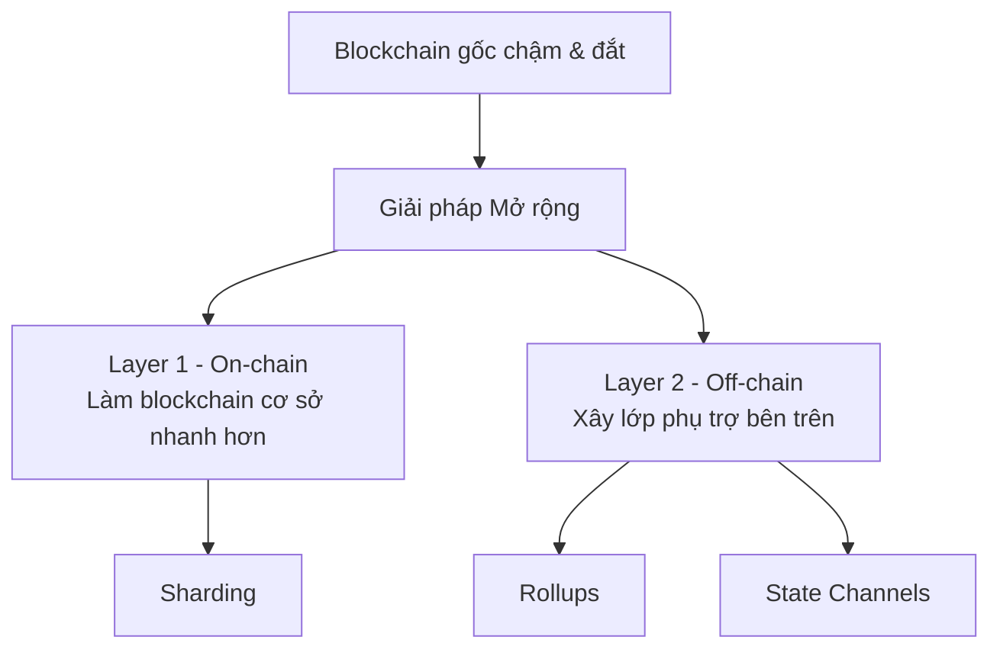
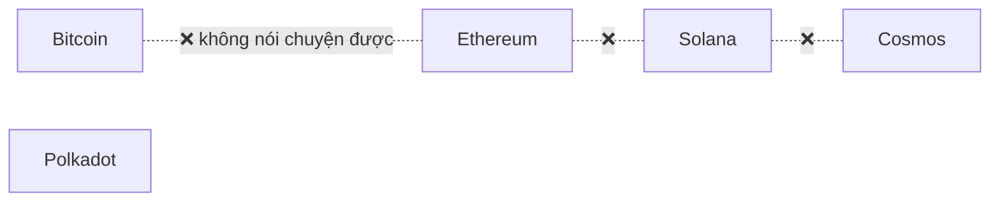
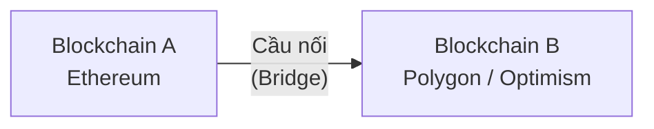
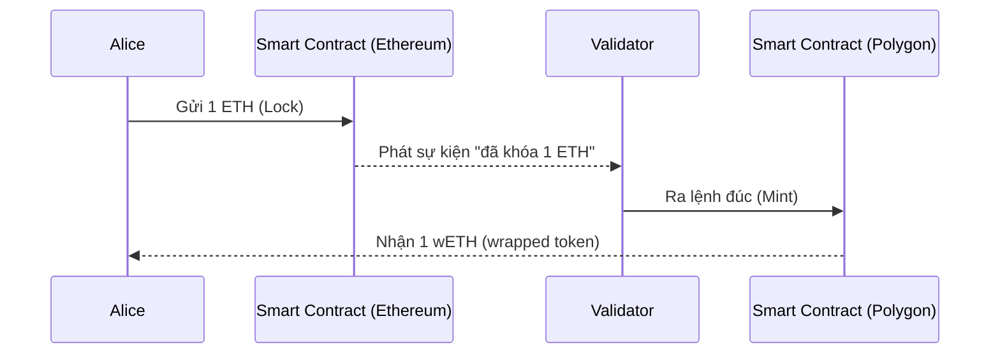

# Buổi 10 — Bộ ba Bất khả thi, Khả năng Mở rộng & Tương tác Chuỗi chéo

> **Môn học:** Blockchain: Nền tảng, Ứng dụng & Bảo mật · Giảng viên: ThS. Trần Tuấn Dũng

---

## 1. The Blockchain Trilemma — Bộ ba Bất khả thi

Khái niệm được **Vitalik Buterin** phổ biến: một blockchain chỉ có thể tối ưu **hai trong ba** thuộc tính sau cùng một lúc.

```
         Bảo mật (Security)
              /\
             /  \
            /    \
           /______\
Phi tập trung   Khả năng Mở rộng
(Decentralization)  (Scalability)
```

| Thuộc tính | Định nghĩa |
|---|---|
| **Bảo mật (Security)** | Khả năng chống lại các cuộc tấn công 51% |
| **Phi tập trung (Decentralization)** | Mạng lưới vận hành bởi nhiều người tham gia độc lập, không bị một thực thể nào kiểm soát |
| **Khả năng Mở rộng (Scalability)** | Khả năng xử lý một lượng lớn giao dịch nhanh chóng và rẻ (TPS — Transactions Per Second) |

### 1.1 Phân tích Sự đánh đổi

=== "Bitcoin & Ethereum (L1)"

    - **Ưu tiên:** Bảo mật + Phi tập trung
    - **Đánh đổi:** Khả năng mở rộng — Để ai cũng có thể chạy node (phi tập trung), kích thước khối và tốc độ phải bị giới hạn → TPS thấp, phí cao

=== "Solana, BSC (Tốc độ cao)"

    - **Ưu tiên:** Bảo mật + Khả năng mở rộng
    - **Đánh đổi:** Phi tập trung — Để đạt TPS cao, yêu cầu phần cứng validator cực kỳ mạnh và đắt tiền → giảm số người có thể tham gia xác thực → nguy cơ tập trung hóa

!!! warning "Không có blockchain hoàn hảo"
    Mọi thiết kế đều phải đối mặt với sự đánh đổi này. Blockchain vẫn chưa được áp dụng rộng rãi như Internet một phần vì lý do nền tảng này.

---

## 2. Khả năng Mở rộng quy mô (Scalability)

Hai hướng tiếp cận chính để "đi đường vòng" qua Trilemma:



---

### 2.1 Layer 1: Sharding

**Sharding** là kỹ thuật chia blockchain thành nhiều chuỗi nhỏ hơn gọi là **"shards"**, mỗi shard xử lý song song một tập con các giao dịch.

```
Nodes network
┌─────────────┐
│ shard1      │──(intra-shard consensus)──► Blockchain of shard1
│ ○ ● ●       │
│             │
│ shard2      │──(intra-shard consensus)──► Blockchain of shard2
│ ○ ●         │
│        ╌╌╌╌╌╌╌╌╌╌►(cross-shard consensus)
│ shard3      │──(intra-shard consensus)──► Blockchain of shard3
│ ○ ●         │
└─────────────┘
● Consensus node   ○ Leader node
```

> **Ví von:** Siêu thị mở ra 64 quầy thanh toán thay vì chỉ 1 quầy duy nhất → tổng thông lượng tăng 64 lần.

!!! note "Node roles trong Sharding"
    - **Master node** — điều phối toàn mạng
    - **Leader node** — lãnh đạo từng shard
    - **Consensus node** — xác thực trong shard
    - **Cross-shard transaction** — giao dịch liên shard (phức tạp hơn)

---

### 2.2 Layer 2: Rollups

**Ý tưởng cốt lõi:**

> Layer 1 (Ethereum) = **đại lộ chính** — cực kỳ an toàn nhưng thường xuyên tắc nghẽn.
> Layer 2 = **đường cao tốc, đường nội bộ, tuyến xe buýt nhanh** — xử lý phần lớn lưu lượng, chỉ dùng L1 để chốt sổ điểm cuối.

**Nguyên lý hoạt động của Rollups:**

```
┌──────────────────────────────────────────┐
│  L2 Rollup (off-chain)                   │
│  [tx1][tx2][tx3]...[tx1000] ──────────►  │
│                             [L2 Block]   │
└───────────────────────────────┬──────────┘
                                │ Bundle of txs submitted to L1
                                ▼
┌──────────────────────────────────────────┐
│  L1 Blockchain (on-chain)                │
│  [block][block][block][block][compressed]│
└──────────────────────────────────────────┘
```

| Bước | Mô tả |
|------|-------|
| **1. Thực thi off-chain** | Hàng trăm/ngàn giao dịch thực thi trên máy chủ L2 |
| **2. Nén dữ liệu** | Dữ liệu giao dịch được nén thông minh |
| **3. Đăng lên on-chain** | Dữ liệu đã nén + bằng chứng mật mã đăng lên L1 trong **1 giao dịch duy nhất** |

!!! success "Kết quả"
    Chi phí của một giao dịch L1 đắt đỏ được **"chia đều"** cho hàng ngàn người dùng L2 → phí rẻ hơn rất nhiều.

**Các dự án Rollup nổi bật:** `Arbitrum`, `Optimism`, `ZKSync`

---

## 3. Tương tác Chuỗi chéo (Interoperability)

### 3.1 Vấn đề "Quần đảo Blockchain"

Thế giới blockchain không phải một lục địa thống nhất — nó là một **quần đảo** với hàng trăm hòn đảo (chains) riêng biệt:



Mỗi blockchain có "luật lệ" (cơ chế đồng thuận) và "ngôn ngữ" (kiến trúc) riêng → chúng không thể tự "nói chuyện" với nhau.

**Interoperability** = Khả năng các blockchain khác nhau **giao tiếp và trao đổi tài sản, dữ liệu** một cách an toàn.

---

### 3.2 Giải pháp: Cầu nối Chuỗi chéo (Cross-chain Bridges)

Cầu nối là các **giao thức** cho phép chuyển tài sản và thông tin giữa hai hoặc nhiều blockchain.



Hai loại kiến trúc cầu nối chính:

| Loại | Cơ chế | Ưu / Nhược |
|------|--------|------------|
| **Trusted / Centralized** | Dựa vào một hoặc một nhóm bên trung gian để xác thực giao dịch | Nhanh, rẻ, dễ dùng — nhưng **rủi ro tập trung CỰC LỚN** |
| **Trust-Minimized** | Dựa vào bằng chứng mật mã và cơ chế on-chain để xác thực, không cần tin vào bên trung gian | An toàn hơn nhưng phức tạp hơn |

---

### 3.3 Cơ chế Lock-and-Mint (Cầu nối Tập trung)



| Bước | Tên | Mô tả |
|------|-----|-------|
| 1 | **Khóa (Lock)** | Người dùng gửi tài sản (1 ETH) vào smart contract trên chuỗi nguồn (Ethereum). Tài sản bị khóa lại |
| 2 | **Xác thực (Validate)** | Một nhóm validator (hoặc một thực thể tập trung) theo dõi sự kiện này |
| 3 | **Đúc (Mint)** | Sau khi xác nhận, validator ra lệnh cho smart contract trên chuỗi đích đúc ra **wrapped token** (ví dụ: 1 wETH) |

!!! danger "Nhược điểm CỰC LỚN của Lock-and-Mint"
    Rủi ro tập trung: Nếu các validator bị **tấn công** hoặc **cấu kết gian lận**, toàn bộ số tài sản bị khóa trong cầu có thể bị **đánh cắp**. Đây là nguyên nhân nhiều vụ hack bridge xảy ra (Ronin Bridge ~$625M, Wormhole ~$320M).

---

### 3.4 Cầu nối Trust-Minimized: "Lãnh sự quán" On-chain

> **Ví von:** Blockchain A chạy một phiên bản **"lãnh sự quán"** của Blockchain B ngay trên chính nó.

**Cơ chế hoạt động (Light Client Bridge):**

1. Blockchain A chạy một **light client** (hợp đồng) của Blockchain B trên chain
2. Light client này liên tục cập nhật và xác minh các **block headers** từ Blockchain B
3. Khi có giao dịch từ B muốn gửi sang A → giao dịch đó đính kèm một **bằng chứng mật mã (cryptographic proof)**
4. "Lãnh sự quán" trên A tự kiểm tra bằng chứng với các block headers → xác nhận tính hợp lệ **mà không cần tin vào bên trung gian nào**

!!! info "So sánh hai loại bridge"
    - **Lock-and-Mint (Trusted):** Nhanh, rẻ, rủi ro tập trung cao
    - **Light Client (Trust-Minimized):** An toàn hơn, phức tạp hơn, tốn tài nguyên hơn

---

---

## 🧠 Bộ câu hỏi Trắc nghiệm (50+ câu)

---

### Phần 1: Blockchain Trilemma

**Câu 1.** Khái niệm "Bộ ba Bất khả thi của Blockchain" (Blockchain Trilemma) được phổ biến bởi ai?

- A. Satoshi Nakamoto
- B. Gavin Wood
- **C. Vitalik Buterin** ✅
- D. Charles Hoskinson

> **Giải thích:** Vitalik Buterin — đồng sáng lập Ethereum — là người phổ biến khái niệm Blockchain Trilemma.

---

**Câu 2.** Ba thuộc tính trong Blockchain Trilemma là gì?

- A. Tốc độ, Bảo mật, Chi phí
- **B. Bảo mật, Phi tập trung, Khả năng Mở rộng** ✅
- C. Bảo mật, Minh bạch, Phi tập trung
- D. Tốc độ, Phi tập trung, Minh bạch

---

**Câu 3.** Theo Trilemma, một blockchain có thể tối ưu tối đa bao nhiêu thuộc tính cùng lúc?

- A. Một
- **B. Hai** ✅
- C. Ba
- D. Không có giới hạn nào

---

**Câu 4.** "Khả năng Mở rộng" (Scalability) trong Trilemma được đo bằng đơn vị nào phổ biến nhất?

- A. Block size (MB)
- B. Hash rate (H/s)
- **C. TPS — Transactions Per Second** ✅
- D. Gas limit

---

**Câu 5.** Bitcoin và Ethereum (Layer 1) ưu tiên hai thuộc tính nào trong Trilemma?

- A. Bảo mật và Khả năng Mở rộng
- **B. Bảo mật và Phi tập trung** ✅
- C. Phi tập trung và Khả năng Mở rộng
- D. Cả ba

> **Giải thích:** Bitcoin/ETH hy sinh Scalability để giữ Security và Decentralization. Kích thước khối và tốc độ bị giới hạn để ai cũng có thể chạy node.

---

**Câu 6.** Tại sao các blockchain tốc độ cao như Solana, BSC lại bị coi là kém phi tập trung hơn?

- A. Vì họ dùng PoW thay vì PoS
- **B. Vì yêu cầu phần cứng validator quá cao, ít người đủ điều kiện tham gia** ✅
- C. Vì họ có ít node hơn Bitcoin
- D. Vì họ dùng smart contract

---

**Câu 7.** Nguyên nhân chính khiến blockchain chưa được áp dụng rộng rãi như Internet theo bài giảng là gì?

- A. Thiếu tài chính đầu tư
- B. Luật pháp chưa cho phép
- **C. Các sự đánh đổi (trade-offs) cơ bản trong thiết kế** ✅
- D. Thiếu lập trình viên

---

**Câu 8.** Solana và BSC ưu tiên hai thuộc tính nào trong Trilemma?

- **A. Bảo mật và Khả năng Mở rộng** ✅
- B. Bảo mật và Phi tập trung
- C. Phi tập trung và Khả năng Mở rộng
- D. Cả ba

---

**Câu 9.** "Phi tập trung" (Decentralization) trong Trilemma có nghĩa là gì?

- A. Không có tổ chức nào đứng sau dự án
- **B. Mạng lưới được vận hành bởi nhiều người tham gia độc lập, không bị một thực thể nào kiểm soát** ✅
- C. Code là mã nguồn mở
- D. Không cần server tập trung

---

**Câu 10.** Một blockchain ưu tiên Phi tập trung và Khả năng Mở rộng sẽ hy sinh điều gì?

- A. Tốc độ
- **B. Bảo mật** ✅
- C. Chi phí
- D. Tính minh bạch

---

### Phần 2: Khả năng Mở rộng — Sharding (Layer 1)

**Câu 11.** Sharding thuộc nhóm giải pháp mở rộng nào?

- **A. Layer 1 (On-chain)** ✅
- B. Layer 2 (Off-chain)
- C. Layer 3
- D. Sidechain

---

**Câu 12.** Sharding là kỹ thuật gì?

- A. Nén dữ liệu giao dịch để tiết kiệm không gian
- B. Tăng kích thước khối lên nhiều lần
- **C. Chia blockchain thành nhiều chuỗi nhỏ hơn gọi là "shards" hoạt động song song** ✅
- D. Chuyển giao dịch ra ngoài chuỗi

---

**Câu 13.** Trong kiến trúc Sharding, "cross-shard transaction" là gì?

- A. Giao dịch được xác thực bởi toàn bộ mạng
- **B. Giao dịch liên quan đến hai shard khác nhau** ✅
- C. Giao dịch bị từ chối bởi một shard
- D. Giao dịch được nén trước khi ghi

---

**Câu 14.** Trong mô hình Sharding được trình bày, loại node nào điều phối toàn mạng?

- A. Leader node
- B. Consensus node
- **C. Master node** ✅
- D. Validator node

---

**Câu 15.** Ví von "siêu thị có nhiều quầy thanh toán" trong bài giảng minh họa điều gì?

- A. Cơ chế đồng thuận PoS
- B. Smart contract tự động hóa
- **C. Sharding giúp tăng thông lượng tổng thể** ✅
- D. Layer 2 Rollups

> **Giải thích:** Thay vì 1 quầy (1 blockchain xử lý tất cả), mở 64 quầy (64 shards song song) → thông lượng tăng 64 lần.

---

**Câu 16.** "Intra-shard consensus" trong Sharding là gì?

- A. Đồng thuận giữa các shard với nhau
- **B. Đồng thuận bên trong một shard** ✅
- C. Đồng thuận giữa L1 và L2
- D. Đồng thuận toàn mạng

---

**Câu 17.** Loại node nào trong Sharding đóng vai trò lãnh đạo từng shard?

- A. Master node
- **B. Leader node** ✅
- C. Consensus node
- D. Full node

---

**Câu 18.** Giải pháp Sharding thuộc hướng tiếp cận nào?

- A. Làm cho các lớp phụ trên nhanh hơn
- **B. Làm cho chính blockchain cơ sở trở nên nhanh hơn** ✅
- C. Chuyển toàn bộ xử lý ra ngoài chuỗi
- D. Giảm kích thước giao dịch

---

### Phần 3: Khả năng Mở rộng — Rollups (Layer 2)

**Câu 19.** Rollups thuộc giải pháp mở rộng nào?

- A. Layer 1 (On-chain)
- **B. Layer 2 (Off-chain)** ✅
- C. Sidechain
- D. Sharding

---

**Câu 20.** Trong ví von "hệ thống giao thông", Layer 1 (Ethereum) được so sánh với gì?

- A. Đường cao tốc
- **B. Đại lộ chính — cực kỳ an toàn nhưng hay tắc nghẽn** ✅
- C. Đường nội bộ
- D. Tuyến xe buýt nhanh

---

**Câu 21.** Bước đầu tiên trong nguyên lý hoạt động của Rollups là gì?

- A. Đăng dữ liệu lên L1
- B. Nén dữ liệu giao dịch
- **C. Thực thi hàng trăm/ngàn giao dịch trên máy chủ L2 (off-chain)** ✅
- D. Tạo bằng chứng mật mã

---

**Câu 22.** Sau khi nén dữ liệu, Rollups đăng gì lên L1?

- A. Toàn bộ dữ liệu giao dịch gốc
- **B. Dữ liệu đã nén và một bằng chứng mật mã trong một giao dịch duy nhất** ✅
- C. Chỉ hash của các giao dịch
- D. State root mà không có dữ liệu

---

**Câu 23.** Kết quả chính của cơ chế Rollups là gì về mặt chi phí?

- **A. Chi phí L1 đắt đỏ được "chia đều" cho hàng ngàn người dùng L2** ✅
- B. Chi phí L2 bằng 0 hoàn toàn
- C. Chi phí L1 giảm vì giảm số node
- D. Chi phí chuyển hoàn toàn sang người vận hành L2

---

**Câu 24.** Arbitrum, Optimism, ZKSync là ví dụ của loại giải pháp nào?

- A. Layer 1 Sharding
- B. Cross-chain Bridge
- **C. Layer 2 Rollups** ✅
- D. Sidechain

---

**Câu 25.** Trong sơ đồ Rollups, giao dịch L2 được tổng hợp thành "bundle" rồi submit lên L1 như thế nào?

- A. Mỗi giao dịch L2 = 1 giao dịch L1 riêng
- **B. Nhiều giao dịch L2 được gom vào 1 giao dịch L1 duy nhất** ✅
- C. Giao dịch L2 không bao giờ cần lên L1
- D. L2 tạo một L1 mới hoàn toàn

---

**Câu 26.** Layer 2 về cơ bản giải quyết vấn đề gì của Layer 1?

- A. Bảo mật kém
- B. Phi tập trung thấp
- **C. Khả năng mở rộng thấp (TPS thấp, phí cao)** ✅
- D. Thiếu smart contract

---

**Câu 27.** "Xây dựng các lớp phụ trợ bên trên blockchain cơ sở" là định nghĩa của hướng tiếp cận nào?

- A. Layer 1 scaling
- **B. Layer 2 scaling** ✅
- C. Sharding
- D. Forking

---

### Phần 4: Interoperability — Tổng quan

**Câu 28.** Vấn đề "Quần đảo Blockchain" (Blockchain Islands) mô tả điều gì?

- **A. Các blockchain tồn tại độc lập, không thể tự giao tiếp với nhau** ✅
- B. Blockchain chỉ hoạt động ở một số quốc gia
- C. Mỗi blockchain có địa lý vật lý riêng
- D. Blockchain bị cô lập bởi tường lửa chính phủ

---

**Câu 29.** "Interoperability" trong bối cảnh blockchain có nghĩa là gì?

- A. Khả năng nâng cấp smart contract
- B. Khả năng mở rộng TPS
- **C. Khả năng các blockchain khác nhau giao tiếp và trao đổi tài sản, dữ liệu an toàn** ✅
- D. Khả năng chạy node trên nhiều hệ điều hành

---

**Câu 30.** Tại sao các blockchain không thể tự "nói chuyện" với nhau?

- **A. Mỗi blockchain có cơ chế đồng thuận và kiến trúc riêng biệt** ✅
- B. Vì các blockchain đang cạnh tranh thương mại
- C. Vì pháp lý không cho phép
- D. Vì thiếu internet băng thông rộng

---

**Câu 31.** Ví dụ nào SAU ĐÂY KHÔNG phải là một blockchain riêng biệt theo bài giảng?

- A. Bitcoin
- B. Cosmos
- C. Polkadot
- **D. MetaMask** ✅

> **Giải thích:** MetaMask là ví (wallet), không phải blockchain. Bitcoin, Cosmos, Polkadot đều là các blockchain riêng biệt.

---

**Câu 32.** Giải pháp chính cho bài toán Interoperability được trình bày trong bài là gì?

- A. Sharding
- B. Rollups
- **C. Cross-chain Bridges** ✅
- D. PoS consensus

---

### Phần 5: Cross-chain Bridges — Kiến trúc

**Câu 33.** Cross-chain Bridge là gì?

- **A. Giao thức cho phép chuyển tài sản và thông tin giữa hai hoặc nhiều blockchain** ✅
- B. Smart contract để tạo token mới
- C. Layer 2 dành riêng cho DeFi
- D. Consensus mechanism đa chuỗi

---

**Câu 34.** Hai loại kiến trúc cầu nối chuỗi chéo chính là gì?

- A. Layer 1 Bridge và Layer 2 Bridge
- B. PoW Bridge và PoS Bridge
- **C. Trusted (Centralized) Bridge và Trust-Minimized Bridge** ✅
- D. Hot Bridge và Cold Bridge

---

**Câu 35.** Cầu nối "Trusted / Centralized" xác thực giao dịch bằng cách nào?

- A. Bằng bằng chứng mật mã on-chain
- **B. Dựa vào một hoặc một nhóm các bên trung gian để xác thực** ✅
- C. Bằng cơ chế đồng thuận của L1
- D. Bằng Zero-Knowledge Proof

---

**Câu 36.** Cầu nối "Trust-Minimized" xác thực giao dịch bằng cách nào?

- A. Dựa vào tổ chức tập trung
- B. Dựa vào validator được cấp phép
- **C. Dựa vào bằng chứng mật mã và cơ chế on-chain, không cần tin bên trung gian** ✅
- D. Dựa vào đa số phiếu bầu của người dùng

---

### Phần 6: Cơ chế Lock-and-Mint

**Câu 37.** Cơ chế Lock-and-Mint thuộc loại bridge nào?

- **A. Trusted / Centralized Bridge** ✅
- B. Trust-Minimized Bridge
- C. Light Client Bridge
- D. ZK Bridge

---

**Câu 38.** Trong cơ chế Lock-and-Mint, bước "Lock" là gì?

- A. Khóa private key của người dùng
- **B. Người dùng gửi tài sản vào smart contract trên chuỗi nguồn, tài sản bị khóa lại** ✅
- C. Mã hóa dữ liệu giao dịch
- D. Validator khóa quyền truy cập vào chuỗi đích

---

**Câu 39.** "Wrapped token" (ví dụ wETH) trong cơ chế Lock-and-Mint là gì?

- A. Token gốc ETH được chuyển sang chain khác
- **B. Token đại diện được đúc ra trên chuỗi đích, tương ứng với tài sản bị khóa trên chuỗi nguồn** ✅
- C. Token được mã hóa bằng ZK-proof
- D. ETH được nén lại để tiết kiệm phí

---

**Câu 40.** Bước "Mint" trong Lock-and-Mint xảy ra ở đâu?

- A. Trên chuỗi nguồn (Ethereum)
- **B. Trên chuỗi đích (ví dụ Polygon)** ✅
- C. Trên server của validator
- D. Trên cả hai chuỗi đồng thời

---

**Câu 41.** Ưu điểm của cơ chế Lock-and-Mint là gì?

- A. An toàn tuyệt đối, không thể bị hack
- **B. Nhanh, rẻ, dễ sử dụng** ✅
- C. Không cần validator
- D. Hoàn toàn phi tập trung

---

**Câu 42.** Nhược điểm CỰC LỚN của cầu nối Lock-and-Mint là gì?

- A. Tốc độ chậm, phí cao
- B. Không hỗ trợ token ERC-20
- **C. Rủi ro tập trung — nếu validator bị tấn công/gian lận, toàn bộ tài sản trong cầu có thể bị đánh cắp** ✅
- D. Không tương thích với EVM

---

**Câu 43.** Thứ tự đúng của 3 bước trong cơ chế Lock-and-Mint là gì?

- A. Mint → Validate → Lock
- B. Validate → Lock → Mint
- **C. Lock → Validate → Mint** ✅
- D. Lock → Mint → Validate

---

**Câu 44.** Trong ví dụ Lock-and-Mint của bài giảng: Alice khóa 1 ETH trên Ethereum và nhận được gì trên Optimism?

- A. 1 ETH nguyên bản
- B. 1 USDC
- **C. 1 wETH (wrapped ETH — token đại diện)** ✅
- D. 1 OP token

---

### Phần 7: Cầu nối Trust-Minimized — Light Client

**Câu 45.** Trong cơ chế Light Client Bridge, "lãnh sự quán" on-chain là gì?

- **A. Một hợp đồng light client chạy trên Blockchain A, xác minh block headers từ Blockchain B** ✅
- B. Một tổ chức trung gian được cấp phép
- C. Một validator node đặc biệt
- D. Một sidechain kết nối hai chain

---

**Câu 46.** Light Client Bridge xác nhận tính hợp lệ của giao dịch cross-chain như thế nào?

- A. Hỏi ý kiến đa số validator
- **B. Kiểm tra bằng chứng mật mã kèm theo giao dịch với block headers đang theo dõi** ✅
- C. Dựa vào chữ ký của bên trung gian uy tín
- D. Yêu cầu cả hai chain dừng lại để đồng bộ

---

**Câu 47.** So với Trusted Bridge, Trust-Minimized Bridge có đặc điểm gì?

- A. Nhanh hơn và rẻ hơn
- **B. An toàn hơn nhưng phức tạp hơn** ✅
- C. Không cần smart contract
- D. Không cần bằng chứng mật mã

---

**Câu 48.** "Block headers" trong Light Client Bridge được dùng để làm gì?

- A. Lưu trữ toàn bộ dữ liệu giao dịch
- **B. Xác minh tính hợp lệ của bằng chứng mật mã đính kèm giao dịch cross-chain** ✅
- C. Đồng bộ state toàn bộ giữa hai chain
- D. Tính phí giao dịch

---

### Phần 8: Tổng hợp và So sánh

**Câu 49.** Điểm khác biệt cốt lõi giữa Layer 1 scaling và Layer 2 scaling là gì?

- **A. L1 thay đổi bản thân blockchain cơ sở; L2 xây dựng lớp phụ trên nền L1 mà không thay đổi L1** ✅
- B. L1 dùng PoW, L2 dùng PoS
- C. L1 chỉ dành cho Bitcoin, L2 chỉ dành cho Ethereum
- D. L1 off-chain, L2 on-chain

---

**Câu 50.** Theo bài giảng, đâu là giải pháp L2 "phổ biến và hứa hẹn nhất hiện nay"?

- A. State Channels
- B. Sidechains
- **C. Rollups** ✅
- D. Plasma

---

**Câu 51.** Sharding giải quyết vấn đề Trilemma theo hướng nào?

- A. Tăng bảo mật cho toàn mạng
- **B. Tăng khả năng mở rộng mà vẫn cố giữ phi tập trung** ✅
- C. Giảm số lượng node cần thiết
- D. Chuyển xác thực ra khỏi blockchain

---

**Câu 52.** Trong bảng so sánh hai loại bridge, loại nào phù hợp hơn với mục tiêu phi tập trung của blockchain?

- A. Trusted / Centralized Bridge
- **B. Trust-Minimized Bridge** ✅
- C. Cả hai ngang nhau
- D. Không loại nào

---

**Câu 53.** "Đi đường vòng qua Bộ ba Bất khả thi" có nghĩa là gì trong ngữ cảnh của bài?

- **A. Tìm giải pháp mở rộng mà không cần thay đổi toàn bộ giao thức L1, giảm nhẹ sự đánh đổi** ✅
- B. Bỏ qua một trong ba thuộc tính của Trilemma
- C. Phát triển blockchain hoàn toàn mới không bị ràng buộc bởi Trilemma
- D. Sử dụng AI để tự động tối ưu cả ba

---

**Câu 54.** Cosmos và Polkadot được đề cập trong bài với vai trò gì?

- A. Giải pháp Rollups nổi tiếng
- B. Ví dụ về blockchain sử dụng Sharding
- **C. Ví dụ về các blockchain riêng biệt trong "quần đảo blockchain"** ✅
- D. Layer 2 của Ethereum

---

**Câu 55.** Tại sao chi phí giao dịch trên Layer 2 Rollups rẻ hơn nhiều so với L1?

- A. Vì L2 không cần đồng thuận
- B. Vì L2 không lưu trữ dữ liệu
- **C. Vì chi phí 1 giao dịch L1 được chia đều cho hàng ngàn giao dịch L2 gom trong một batch** ✅
- D. Vì L2 dùng token khác rẻ hơn ETH

---

**Câu 56.** Bài giảng thuộc buổi số mấy và tổng kết chủ đề gì?

- A. Buổi 5, tổng kết Consensus
- B. Buổi 9, tổng kết DeFi
- **C. Buổi 10, tổng kết các thách thức nền tảng của blockchain (Trilemma, Scalability, Interoperability)** ✅
- D. Buổi 12, tổng kết bảo mật

---

> 💡 **Tổng kết:** 56 câu trắc nghiệm bao phủ đầy đủ 4 chủ đề chính của Buổi 10 — Trilemma (10 câu), Sharding (8 câu), Rollups (9 câu), Interoperability + Bridges (29 câu). Các câu được phân bổ theo độ sâu của slide, ưu tiên các khái niệm, cơ chế hoạt động và sự so sánh.
