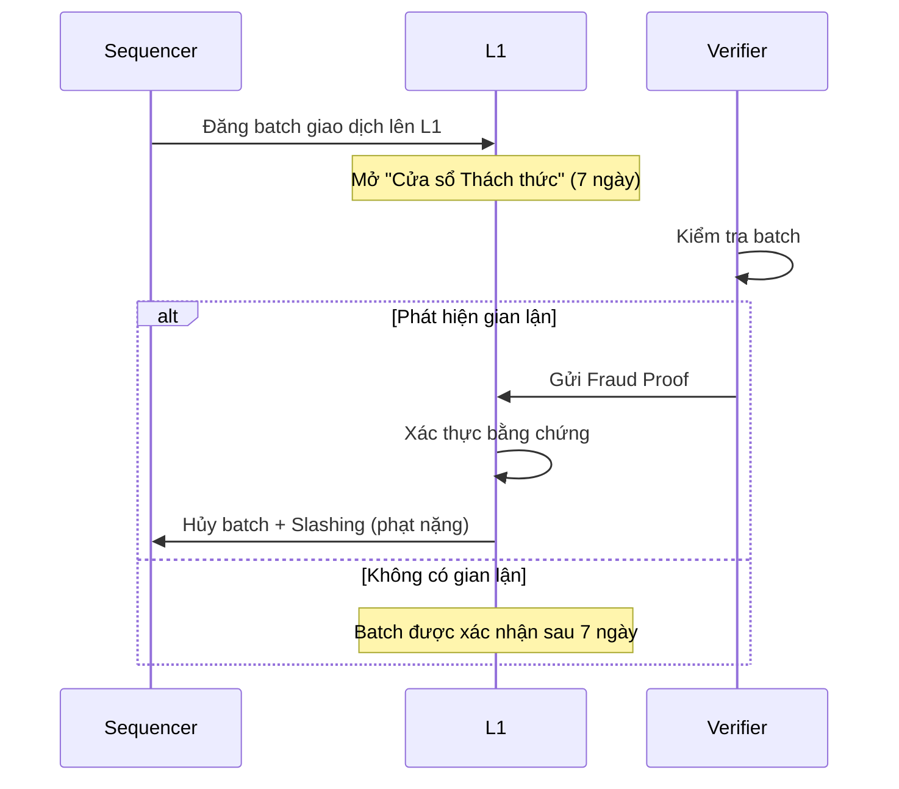
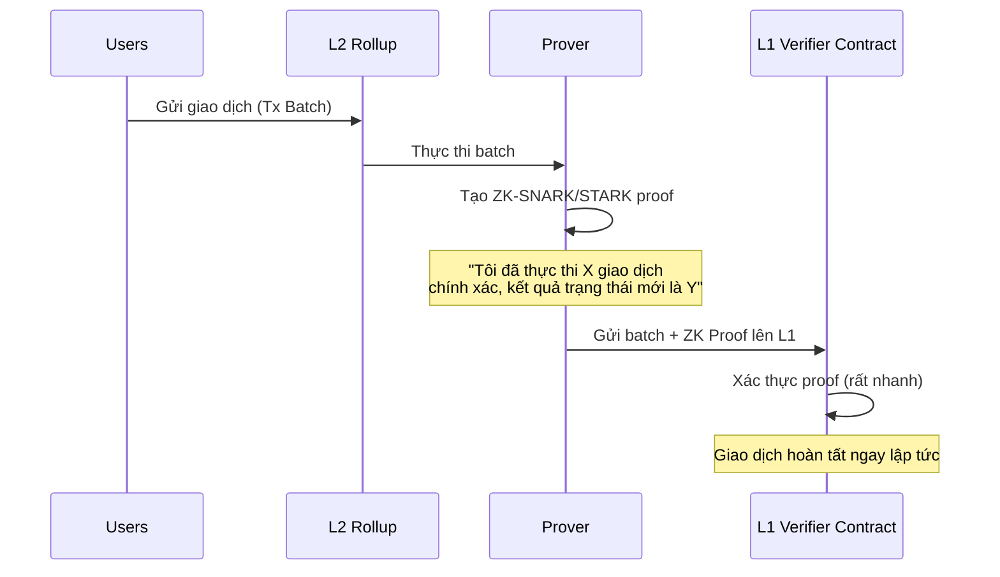
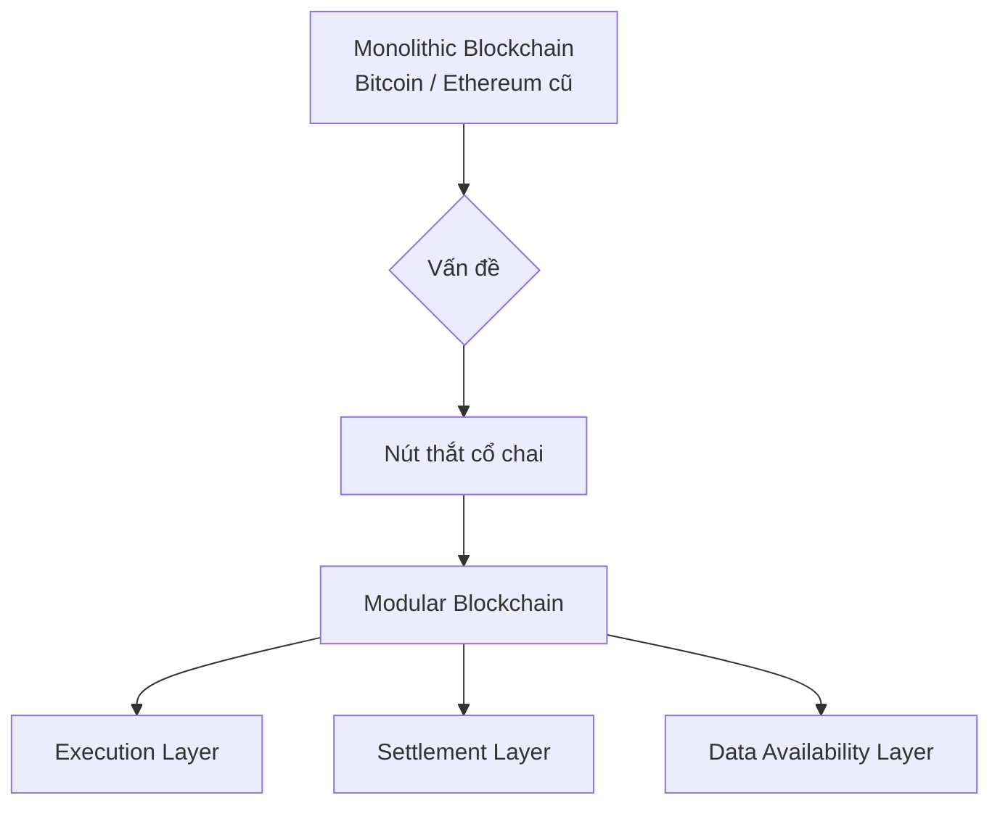
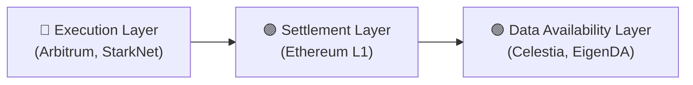
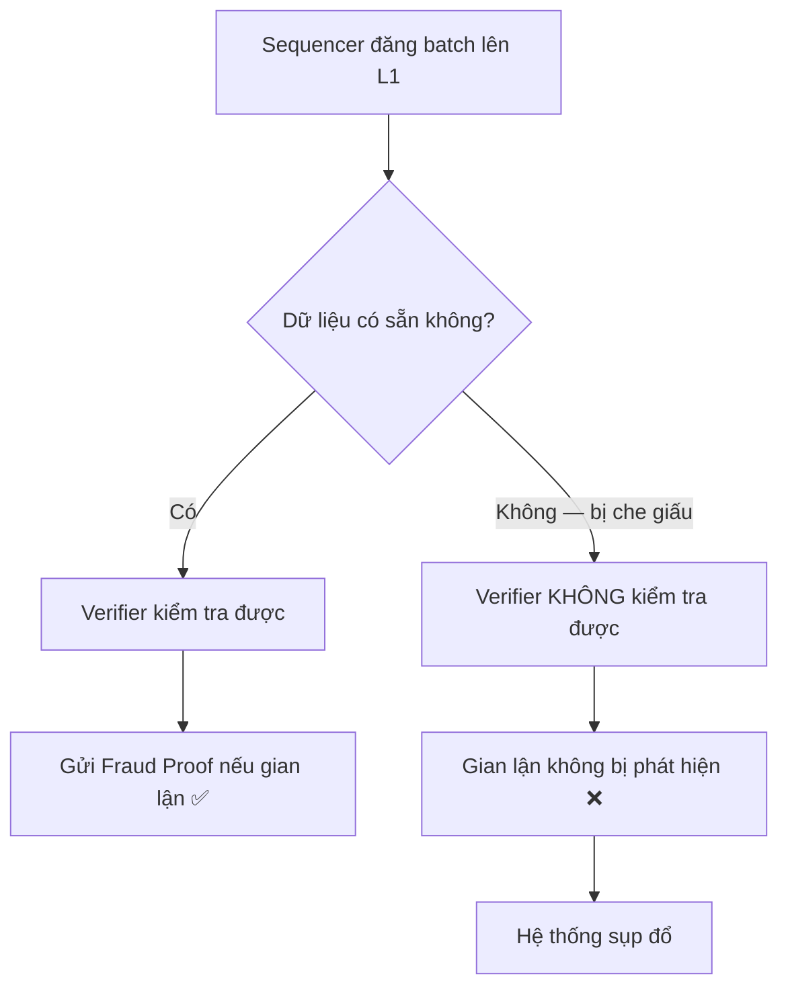

# Buổi 11 — Kiến trúc Blockchain Hiện đại: Layer 2 Chuyên sâu và Kỷ nguyên Modular Blockchain

---

## Mục tiêu Buổi học

!!! info "Tổng quan"
    Buổi học đầu tiên của phần nâng cao — "phóng to" vào các giải pháp cho Trilemma đã học.

- Phân tích sâu cơ chế hoạt động, ưu và nhược điểm của hai loại Rollups chính: **Optimistic** và **ZK-Rollups**.
- Hiểu rõ sự khác biệt mang tính kiến trúc giữa blockchain **Nguyên khối (Monolithic)** và **Mô-đun hóa (Modular)**.
- Giải thích được **"Vấn đề Sẵn có Dữ liệu"** (Data Availability Problem).
- Nắm được lộ trình phát triển theo hướng modular của Ethereum (**Proto-Danksharding**).

---

## Dẫn Nhập

Phần nền tảng đã kết thúc với **Bộ ba Bất khả thi (Trilemma)**: một blockchain rất khó để cùng lúc đạt được cả **Bảo mật**, **Phi tập trung**, và **Khả năng Mở rộng**.

Việc cố gắng nhồi nhét tất cả các chức năng vào một lớp duy nhất đã tạo ra **"nút thắt cổ chai"** — dẫn đến sự ra đời của một tư duy kiến trúc mới.

---

## Kiến trúc Nguyên khối (Monolithic)

Các blockchain truyền thống như **Bitcoin** và **Ethereum** (trước đây) là các hệ thống nguyên khối — thực hiện cả 3 nhiệm vụ trên cùng một lớp:

| Nhiệm vụ | Mô tả |
|---|---|
| **Thực thi (Execution)** | Xử lý giao dịch |
| **Đồng thuận (Consensus)** | Thống nhất về trạng thái của sổ cái |
| **Sẵn có Dữ liệu (Data Availability)** | Lưu trữ và đảm bảo dữ liệu giao dịch có thể truy cập được |

!!! warning "Nút thắt cổ chai"
    Yêu cầu mỗi node phải làm **tất cả mọi việc**. Để giữ tính phi tập trung (nhiều người có thể chạy node), năng lực xử lý của mỗi node phải thấp → **Toàn mạng lưới bị chậm lại**.

---

## Layer 2 Rollups — "Tách lớp" Thực thi

!!! abstract "Ý tưởng cốt lõi"
    Rollups là giải pháp cấp tiến đầu tiên: **Chuyển việc Thực thi ra khỏi chuỗi chính (off-chain)**, và chỉ sử dụng L1 như một lớp bảo mật và chốt sổ.

Có 2 trường phái chính:

```
┌─────────────────────┐     ┌─────────────────────┐
│  Optimistic Rollups │     │     ZK-Rollups       │
└─────────────────────┘     └─────────────────────┘
```

---

### Optimistic Rollups

> **Triết lý:** "Vô tội cho đến khi bị chứng minh có tội"

Hoạt động dựa trên một giả định **"lạc quan"**: mọi giao dịch được batch (bó) lại và gửi lên L1 đều được coi là **hợp lệ**.

#### Cơ chế "Cửa sổ Thách thức" (Challenge Window)



!!! success "Ưu điểm"
    - **Tương thích EVM cao:** Rất dễ dàng để di chuyển các DApp từ Ethereum L1 sang.
    - **Công nghệ trưởng thành:** Ít phức tạp hơn về mặt mật mã học so với ZK-Rollups.

!!! failure "Nhược điểm"
    - **Thời gian rút tiền dài:** Người dùng phải đợi hết **7 ngày** của "Cửa sổ Thách thức" để có thể rút tài sản về L1 một cách an toàn.
    - **Hiệu quả vốn thấp:** Cần các bên thứ ba (liquidity providers) để cung cấp dịch vụ "rút tiền nhanh", nhưng người dùng phải trả phí.

??? example "Ví dụ thực tế"
    - **Arbitrum**
    - **Optimism**

---

### ZK-Rollups

> **Triết lý:** "Có tội cho đến khi được chứng minh vô tội (bằng toán học)"

Hoạt động dựa trên **Bằng chứng Hợp lệ (Validity Proof)**. Thay vì giả định các giao dịch là đúng, ZK-Rollups **chủ động chứng minh** điều đó.

#### Cơ chế Bằng chứng Không-Kiến thức (ZKP)



!!! success "Ưu điểm"
    - **Bảo mật cao & Hoàn tất nhanh:** Một khi bằng chứng được xác thực trên L1, giao dịch được coi là hoàn tất. Thời gian rút tiền chỉ mất **vài phút**.
    - **Nén dữ liệu tốt hơn:** Không cần gửi nhiều dữ liệu chi tiết như Optimistic Rollups.

!!! failure "Nhược điểm"
    - **Công nghệ phức tạp:** Mật mã ZKP rất khó để triển khai và kiểm toán.
    - **Tốn nhiều tài nguyên để tạo bằng chứng:** Cần các server chuyên dụng và mạnh mẽ để tạo ZKP.
    - **Thách thức tương thích EVM (zkEVM):** Việc tạo ra một môi trường ZKP tương thích hoàn toàn với EVM là một bài toán kỹ thuật cực kỳ khó.

??? example "Ví dụ thực tế"
    - **ZKSync**
    - **StarkNet**
    - **Polygon zkEVM**

---

### So sánh Optimistic vs ZK-Rollups

| Tiêu chí | Optimistic Rollups | ZK-Rollups |
|---|---|---|
| **Cơ chế bảo mật** | Fraud Proof (hậu kiểm) | Validity Proof (tiền kiểm) |
| **Thời gian rút tiền** | ~7 ngày | Vài phút |
| **Độ phức tạp kỹ thuật** | Thấp hơn | Rất cao |
| **Tương thích EVM** | Cao | Khó (zkEVM) |
| **Tài nguyên tính toán** | Thấp hơn | Rất cao (Prover) |
| **Ví dụ** | Arbitrum, Optimism | ZKSync, StarkNet |

---

## Cuộc Cách mạng Modular Blockchain

!!! quote "Tư duy cốt lõi"
    Rollups đã cho thấy sức mạnh của việc "tách lớp" thực thi. Kiến trúc Modular đẩy ý tưởng này đi xa hơn: **"Hãy chuyên môn hóa mọi thứ. Thay vì một blockchain làm tất cả, hãy tạo ra nhiều lớp blockchain, mỗi lớp chỉ làm tốt một việc duy nhất."**



---

### Các Lớp trong Kiến trúc Modular



??? info "Lớp Thực thi (Execution Layer)"
    - **Chỉ làm một việc:** thực thi giao dịch.
    - Đây là nơi các DApp và người dùng sinh sống.
    - **Ví dụ:** Các L2 Rollups như Arbitrum, StarkNet.

??? info "Lớp Giải quyết & Đồng thuận (Settlement & Consensus Layer)"
    - Là **"tòa án tối cao"**, nơi giải quyết các tranh chấp (fraud proofs) và là nguồn chân lý cuối cùng.
    - Cung cấp bảo mật cho toàn bộ hệ sinh thái.
    - **Ví dụ:** Ethereum L1.

??? info "Lớp Sẵn có Dữ liệu (Data Availability Layer)"
    - **Chỉ làm một việc:** lưu trữ dữ liệu giao dịch và đảm bảo bất kỳ ai cũng có thể truy cập nó.
    - **Ví dụ:** Celestia, EigenDA, và tương lai của Ethereum.

---

### Vấn đề Sẵn có Dữ liệu (Data Availability Problem)

!!! danger "Vấn đề cốt lõi"
    **Câu hỏi:** Làm sao một Verifier của Optimistic Rollup có thể gửi Bằng chứng Gian lận nếu Sequencer **che giấu dữ liệu** của batch giao dịch đó?



!!! tip "Giải pháp"
    Mạng lưới phải đảm bảo rằng dữ liệu này **luôn sẵn có** cho bất kỳ ai muốn kiểm tra. Đây chính là nhiệm vụ của **Lớp Sẵn có Dữ liệu**.

---

### Lộ trình Modular của Ethereum

Ethereum đang tích cực đi theo con đường modular hóa để trở thành lớp **Settlement & DA** tối ưu cho hệ sinh thái Rollups.

#### Proto-Danksharding (EIP-4844) — "The Surge"

!!! note "EIP-4844"
    Đây là nâng cấp quan trọng **đã diễn ra**, là bước đầu tiên của lộ trình. Nó tạo ra một không gian dữ liệu mới, **rẻ hơn** trên Ethereum, gọi là **"Blobs"**.

**Ví von:**

```
Trước EIP-4844:
  Rollup Data → nhét vào "phong bì thư" đắt đỏ (CALLDATA) 📮💸

Sau EIP-4844:
  Rollup Data → "container vận chuyển hàng rời" giá rẻ (Blobs) 📦✅
```

!!! success "Kết quả"
    Phí giao dịch trên các Layer 2 như **Arbitrum** và **Optimism** đã **giảm đáng kể** sau nâng cấp này.

---

---

## 🧩 Câu hỏi Trắc nghiệm

---

**Câu 1.** Kiến trúc Nguyên khối (Monolithic) thực hiện bao nhiêu nhiệm vụ trên cùng một lớp?

- A. 1
- B. 2
- C. 3
- D. 4

??? success "Đáp án"
    **C. 3** — Thực thi (Execution), Đồng thuận (Consensus), Sẵn có Dữ liệu (Data Availability).

---

**Câu 2.** Điều gì gây ra "nút thắt cổ chai" trong kiến trúc Monolithic?

- A. Các node không đủ phần cứng
- B. Mỗi node phải làm tất cả mọi việc để giữ phi tập trung
- C. Thiếu giao thức đồng thuận
- D. Không có lớp bảo mật

??? success "Đáp án"
    **B.** Yêu cầu mỗi node phải làm tất cả mọi việc. Để giữ tính phi tập trung, năng lực xử lý phải thấp → toàn mạng bị chậm.

---

**Câu 3.** Rollups giải quyết vấn đề Monolithic bằng cách nào?

- A. Tăng kích thước block
- B. Chuyển việc Thực thi ra khỏi chuỗi chính (off-chain)
- C. Loại bỏ đồng thuận
- D. Tăng số lượng validator

??? success "Đáp án"
    **B.** Rollups chuyển việc Thực thi ra off-chain, chỉ dùng L1 như một lớp bảo mật và chốt sổ.

---

**Câu 4.** Optimistic Rollups hoạt động dựa trên giả định nào?

- A. Tất cả giao dịch đều gian lận cho đến khi chứng minh ngược lại
- B. Mọi giao dịch được batch và gửi lên L1 đều được coi là hợp lệ
- C. Mỗi giao dịch phải có bằng chứng mật mã
- D. L1 sẽ tự động xác thực tất cả giao dịch

??? success "Đáp án"
    **B.** Đây là giả định "lạc quan" — mọi batch đều hợp lệ trừ khi có ai đó chứng minh ngược lại.

---

**Câu 5.** "Cửa sổ Thách thức" (Challenge Window) trong Optimistic Rollups thường kéo dài bao lâu?

- A. 1 ngày
- B. 3 ngày
- C. 7 ngày
- D. 14 ngày

??? success "Đáp án"
    **C. 7 ngày.**

---

**Câu 6.** Trong Optimistic Rollups, ai có thể gửi Bằng chứng Gian lận (Fraud Proof)?

- A. Chỉ các validator được ủy quyền
- B. Chỉ Sequencer
- C. Bất kỳ ai (Verifiers)
- D. Chỉ Ethereum Foundation

??? success "Đáp án"
    **C.** Bất kỳ ai (gọi là Verifiers) đều có thể kiểm tra và gửi Fraud Proof.

---

**Câu 7.** Điều gì xảy ra khi một Fraud Proof được xác thực thành công trên L1?

- A. Giao dịch bị trì hoãn thêm 7 ngày
- B. Batch gian lận bị hủy và Sequencer bị phạt nặng (slashing)
- C. Verifier nhận được phần thưởng nhưng batch vẫn tồn tại
- D. Toàn bộ L2 bị tắt

??? success "Đáp án"
    **B.** Batch gian lận bị hủy và Sequencer bị slashing (phạt nặng).

---

**Câu 8.** Nhược điểm lớn nhất của Optimistic Rollups liên quan đến người dùng cuối là gì?

- A. Phí giao dịch quá cao
- B. Không tương thích EVM
- C. Thời gian rút tiền về L1 phải đợi ~7 ngày
- D. Không hỗ trợ smart contract

??? success "Đáp án"
    **C.** Người dùng phải đợi hết "Cửa sổ Thách thức" (~7 ngày) để rút tài sản về L1 an toàn.

---

**Câu 9.** Arbitrum và Optimism là ví dụ của loại Rollup nào?

- A. ZK-Rollups
- B. Validium
- C. Optimistic Rollups
- D. State Channels

??? success "Đáp án"
    **C. Optimistic Rollups.**

---

**Câu 10.** ZK-Rollups sử dụng loại bằng chứng nào để đảm bảo tính hợp lệ?

- A. Fraud Proof (Bằng chứng Gian lận)
- B. Validity Proof (Bằng chứng Hợp lệ)
- C. Merkle Proof
- D. Consensus Proof

??? success "Đáp án"
    **B. Validity Proof** — ZK-Rollups chủ động chứng minh tính đúng đắn của giao dịch trước khi gửi lên L1.

---

**Câu 11.** Trong ZK-Rollups, "Prover" có nhiệm vụ gì?

- A. Xác thực giao dịch trên L1
- B. Tạo ra bằng chứng mật mã (ZK-SNARK/STARK) sau khi thực thi batch
- C. Lưu trữ dữ liệu giao dịch
- D. Đóng vai trò là Sequencer

??? success "Đáp án"
    **B.** Prover tạo ra ZK-SNARK/STARK để chứng minh batch giao dịch được thực thi chính xác.

---

**Câu 12.** ZK-SNARK và ZK-STARK là gì?

- A. Các loại token trên ZK-Rollups
- B. Các dạng bằng chứng mật mã trong ZK-Rollups
- C. Các giao thức đồng thuận
- D. Các loại node trong mạng ZK

??? success "Đáp án"
    **B.** Đây là các dạng bằng chứng không-kiến thức (Zero-Knowledge Proof) được dùng trong ZK-Rollups.

---

**Câu 13.** Thời gian rút tiền của ZK-Rollups so với Optimistic Rollups là?

- A. Dài hơn (~14 ngày)
- B. Tương đương (~7 ngày)
- C. Nhanh hơn (chỉ vài phút)
- D. Không thể rút tiền

??? success "Đáp án"
    **C.** ZK-Rollups chỉ mất vài phút vì giao dịch hoàn tất ngay sau khi proof được xác thực trên L1.

---

**Câu 14.** Nhược điểm chính của ZK-Rollups về mặt kỹ thuật là?

- A. Không thể xử lý nhiều giao dịch
- B. Mật mã ZKP rất phức tạp để triển khai và kiểm toán, tốn nhiều tài nguyên
- C. Không tương thích với bất kỳ blockchain nào
- D. Không có khả năng mở rộng

??? success "Đáp án"
    **B.** Công nghệ ZKP phức tạp, khó kiểm toán, và cần server chuyên dụng mạnh mẽ để tạo proof.

---

**Câu 15.** "zkEVM" là gì và tại sao nó là thách thức?

- A. Một loại token mới trên Ethereum
- B. Môi trường ZKP tương thích hoàn toàn với EVM — bài toán kỹ thuật cực kỳ khó
- C. Phiên bản nâng cấp của EVM
- D. Một giao thức đồng thuận mới

??? success "Đáp án"
    **B.** Việc tạo ra môi trường ZKP tương thích hoàn toàn với EVM (zkEVM) là một bài toán kỹ thuật cực kỳ khó — đây là nhược điểm của ZK-Rollups so với Optimistic Rollups.

---

**Câu 16.** ZKSync, StarkNet, Polygon zkEVM là ví dụ của loại Rollup nào?

- A. Optimistic Rollups
- B. State Channels
- C. ZK-Rollups
- D. Plasma

??? success "Đáp án"
    **C. ZK-Rollups.**

---

**Câu 17.** So với Optimistic Rollups, ZK-Rollups nén dữ liệu như thế nào?

- A. Nén dữ liệu kém hơn vì phải gửi thêm proof
- B. Nén dữ liệu tốt hơn, không cần gửi nhiều dữ liệu chi tiết
- C. Không có sự khác biệt
- D. Không hỗ trợ nén dữ liệu

??? success "Đáp án"
    **B.** ZK-Rollups nén dữ liệu tốt hơn vì không cần gửi toàn bộ dữ liệu giao dịch chi tiết lên L1.

---

**Câu 18.** Ưu điểm về tương thích EVM thuộc về loại Rollup nào?

- A. ZK-Rollups
- B. Optimistic Rollups
- C. Cả hai đều tương đương
- D. Không loại nào tương thích EVM

??? success "Đáp án"
    **B. Optimistic Rollups** — Dễ dàng di chuyển DApp từ Ethereum L1 sang hơn so với ZK-Rollups.

---

**Câu 19.** Kiến trúc Modular Blockchain khác gì so với Monolithic?

- A. Tất cả chức năng vẫn trên một lớp nhưng nhanh hơn
- B. Tách biệt và chuyên môn hóa từng chức năng (Execution, Settlement, DA) thành các lớp riêng
- C. Loại bỏ hoàn toàn Layer 1
- D. Chỉ hỗ trợ ZK-Rollups

??? success "Đáp án"
    **B.** Modular Blockchain chuyên môn hóa mọi thứ — mỗi lớp chỉ làm tốt một việc duy nhất.

---

**Câu 20.** Trong kiến trúc Modular, Lớp Thực thi (Execution Layer) có nhiệm vụ gì?

- A. Lưu trữ dữ liệu và đảm bảo tính sẵn có
- B. Giải quyết tranh chấp và là nguồn chân lý cuối cùng
- C. Thực thi giao dịch — nơi các DApp và người dùng sinh sống
- D. Tạo ra các bằng chứng ZKP

??? success "Đáp án"
    **C.** Execution Layer chỉ làm một việc: thực thi giao dịch.

---

**Câu 21.** Ethereum L1 đóng vai trò nào trong kiến trúc Modular?

- A. Execution Layer
- B. Data Availability Layer
- C. Settlement & Consensus Layer
- D. Prover Layer

??? success "Đáp án"
    **C.** Ethereum L1 là Settlement & Consensus Layer — "tòa án tối cao" giải quyết tranh chấp và là nguồn chân lý cuối cùng.

---

**Câu 22.** Celestia và EigenDA là ví dụ của lớp nào trong kiến trúc Modular?

- A. Execution Layer
- B. Settlement Layer
- C. Data Availability Layer
- D. Consensus Layer

??? success "Đáp án"
    **C. Data Availability Layer.**

---

**Câu 23.** "Vấn đề Sẵn có Dữ liệu" (Data Availability Problem) đặt ra câu hỏi gì?

- A. Dữ liệu blockchain có thể bị hack không?
- B. Làm sao Verifier gửi Fraud Proof nếu Sequencer che giấu dữ liệu batch?
- C. Dữ liệu L1 có thể bị mất không?
- D. Ai sở hữu dữ liệu trên blockchain?

??? success "Đáp án"
    **B.** Đây là vấn đề cốt lõi: nếu Sequencer che giấu dữ liệu, không ai có thể kiểm tra gian lận.

---

**Câu 24.** Nếu không có Data Availability Layer, điều gì có thể xảy ra trong Optimistic Rollup?

- A. Giao dịch chậm hơn
- B. Gian lận không bị phát hiện vì Verifier không có dữ liệu để kiểm tra
- C. Phí giao dịch tăng cao
- D. ZK-proof không tạo được

??? success "Đáp án"
    **B.** Không có dữ liệu → không kiểm tra được → gian lận không bị phát hiện → hệ thống sụp đổ.

---

**Câu 25.** Nhiệm vụ chính của Data Availability Layer là gì?

- A. Thực thi smart contract
- B. Đồng thuận về trạng thái sổ cái
- C. Lưu trữ dữ liệu giao dịch và đảm bảo bất kỳ ai cũng có thể truy cập
- D. Tạo bằng chứng ZKP

??? success "Đáp án"
    **C.** DA Layer đảm bảo dữ liệu giao dịch **luôn sẵn có** cho bất kỳ ai muốn kiểm tra.

---

**Câu 26.** Proto-Danksharding được triển khai thông qua đề xuất nào?

- A. EIP-1559
- B. EIP-4337
- C. EIP-4844
- D. EIP-2718

??? success "Đáp án"
    **C. EIP-4844.**

---

**Câu 27.** "Blobs" trong EIP-4844 là gì?

- A. Một loại token mới trên Ethereum
- B. Không gian dữ liệu mới, rẻ hơn trên Ethereum dành cho Rollups
- C. Một dạng bằng chứng ZKP
- D. Tên gọi của các validator mới

??? success "Đáp án"
    **B.** Blobs là không gian dữ liệu chuyên dụng, rẻ hơn để các Rollup lưu trữ dữ liệu thay vì dùng CALLDATA đắt đỏ.

---

**Câu 28.** Trước EIP-4844, các Rollup lưu dữ liệu ở đâu trên Ethereum và tại sao tốn kém?

- A. Lưu trong Blobs — rẻ nhưng chậm
- B. Lưu trong CALLDATA — đắt tiền
- C. Lưu trong State Trie — không tốn phí
- D. Không cần lưu dữ liệu trên L1

??? success "Đáp án"
    **B.** Trước EIP-4844, Rollup phải nhét dữ liệu vào CALLDATA — rất đắt đỏ.

---

**Câu 29.** Kết quả của việc triển khai EIP-4844 trên các Layer 2 là gì?

- A. Tốc độ giao dịch giảm
- B. Phí giao dịch trên Arbitrum và Optimism giảm đáng kể
- C. Bảo mật Layer 2 bị suy giảm
- D. ZK-Rollups không còn hoạt động được

??? success "Đáp án"
    **B.** Phí giao dịch trên các L2 như Arbitrum và Optimism giảm đáng kể sau EIP-4844.

---

**Câu 30.** EIP-4844 (Proto-Danksharding) nằm trong lộ trình phát triển nào của Ethereum?

- A. The Merge
- B. The Surge
- C. The Purge
- D. The Splurge

??? success "Đáp án"
    **B. "The Surge"** — lộ trình tập trung vào khả năng mở rộng quy mô của Ethereum.

---

**Câu 31.** Mục tiêu dài hạn của Ethereum trong kiến trúc Modular là trở thành lớp gì?

- A. Execution Layer duy nhất
- B. Settlement & DA Layer tối ưu cho hệ sinh thái Rollups
- C. Prover Layer cho các ZK-Rollups
- D. Consensus Layer độc lập

??? success "Đáp án"
    **B.** Ethereum hướng đến trở thành lớp Settlement & Data Availability tối ưu cho hệ sinh thái Rollups.

---

**Câu 32.** Trong kiến trúc Modular, "Settlement Layer" được ví như gì?

- A. Kho lưu trữ dữ liệu
- B. Nơi thực thi hợp đồng thông minh
- C. "Tòa án tối cao" — nguồn chân lý cuối cùng
- D. Máy tạo bằng chứng ZKP

??? success "Đáp án"
    **C.** Settlement Layer là "tòa án tối cao", nơi giải quyết tranh chấp và là nguồn chân lý cuối cùng.

---

**Câu 33.** Sự khác biệt cơ bản giữa Fraud Proof và Validity Proof là gì?

- A. Fraud Proof dùng mật mã; Validity Proof dùng kinh tế học
- B. Fraud Proof kiểm tra SAU (hậu kiểm); Validity Proof chứng minh TRƯỚC (tiền kiểm)
- C. Cả hai đều như nhau
- D. Fraud Proof chỉ dùng trong ZK-Rollups

??? success "Đáp án"
    **B.** Fraud Proof (Optimistic) là hậu kiểm — ai đó phải thách thức. Validity Proof (ZK) là tiền kiểm — chứng minh đúng trước khi submit.

---

**Câu 34.** Tại sao Optimistic Rollups có "hiệu quả vốn thấp"?

- A. Vì phí giao dịch quá cao
- B. Vì cần liquidity providers để rút tiền nhanh, người dùng phải trả phí thêm
- C. Vì không có đủ validator
- D. Vì không tương thích EVM

??? success "Đáp án"
    **B.** Do phải đợi 7 ngày, người dùng cần liquidity providers để rút tiền nhanh — nhưng phải trả phí dịch vụ.

---

**Câu 35.** Ưu điểm về "tương thích EVM cao" của Optimistic Rollups có nghĩa là gì trong thực tế?

- A. Không cần viết lại smart contract khi chuyển DApp từ Ethereum L1 sang
- B. Tốc độ nhanh hơn 10 lần
- C. Phí rẻ hơn ZK-Rollups
- D. Không cần Layer 1

??? success "Đáp án"
    **A.** DApp trên Ethereum L1 có thể dễ dàng di chuyển sang Optimistic Rollup mà không cần viết lại code.

---

**Câu 36.** "Sequencer" trong Rollups có vai trò gì?

- A. Xác thực ZKP trên L1
- B. Thu thập, sắp xếp giao dịch và đăng batch lên L1
- C. Lưu trữ dữ liệu DA
- D. Tạo Fraud Proof

??? success "Đáp án"
    **B.** Sequencer thu thập giao dịch, tạo batch và đăng lên L1. Nếu gian lận, Sequencer bị slashing.

---

**Câu 37.** Tại sao "nút thắt cổ chai" trong Monolithic Blockchain xảy ra?

- A. Blockchain thiếu node
- B. Để giữ phi tập trung, mỗi node năng lực thấp → toàn mạng chậm
- C. Không có đủ giao dịch
- D. Phí giao dịch quá cao

??? success "Đáp án"
    **B.** Đây là mâu thuẫn cốt lõi: phi tập trung (nhiều node, năng lực thấp) vs. hiệu suất (cần node mạnh).

---

**Câu 38.** Lớp nào trong kiến trúc Modular cung cấp bảo mật cho toàn bộ hệ sinh thái?

- A. Execution Layer
- B. Data Availability Layer
- C. Settlement & Consensus Layer
- D. Prover Layer

??? success "Đáp án"
    **C. Settlement & Consensus Layer** (Ethereum L1).

---

**Câu 39.** Tại sao ZK-Rollups cần server chuyên dụng mạnh mẽ?

- A. Để lưu trữ toàn bộ lịch sử giao dịch
- B. Để tạo ra các ZK-proof (ZK-SNARK/STARK) — quá trình tính toán rất nặng
- C. Để xác thực Fraud Proof
- D. Để chạy EVM

??? success "Đáp án"
    **B.** Việc tạo ZKP đòi hỏi tính toán rất nặng, cần hardware chuyên dụng.

---

**Câu 40.** Trong bài, ví dụ nào được dùng để minh họa sự khác biệt giữa CALLDATA và Blobs?

- A. Xe tải vs. tàu hỏa
- B. "Phong bì thư" đắt đỏ vs. "container vận chuyển hàng rời" giá rẻ
- C. Máy tính vs. điện thoại
- D. Ngân hàng vs. ví điện tử

??? success "Đáp án"
    **B.** Bài giảng dùng hình ảnh "phong bì thư đắt đỏ (CALLDATA)" vs. "container vận chuyển hàng rời giá rẻ (Blobs)".

---

**Câu 41.** Bộ ba Bất khả thi (Trilemma) trong blockchain gồm những yếu tố nào?

- A. Tốc độ, Phí, Bảo mật
- B. Bảo mật, Phi tập trung, Khả năng Mở rộng
- C. Đồng thuận, Thực thi, Lưu trữ
- D. Layer 1, Layer 2, Layer 3

??? success "Đáp án"
    **B. Bảo mật (Security), Phi tập trung (Decentralization), Khả năng Mở rộng (Scalability).**

---

**Câu 42.** Đặc điểm nào sau đây ĐÚNG với ZK-Rollups nhưng SAI với Optimistic Rollups?

- A. Sử dụng L1 làm lớp bảo mật
- B. Xử lý giao dịch theo batch (bó)
- C. Giao dịch hoàn tất sau vài phút mà không cần thời gian thách thức
- D. Tương thích cao với EVM

??? success "Đáp án"
    **C.** ZK-Rollups hoàn tất ngay sau khi proof được xác thực. Optimistic Rollups cần 7 ngày thách thức.

---

**Câu 43.** Trong vòng đời giao dịch ZK-Rollup, thứ tự đúng là?

- A. Users → L1 → Prover → L2
- B. Users → L2 → Prover tạo ZK proof → Gửi batch + proof lên L1 → L1 xác thực
- C. Users → Prover → L1 → L2
- D. Users → L1 → L2 → Prover

??? success "Đáp án"
    **B.** Users gửi giao dịch → L2 thực thi → Prover tạo proof → Gửi lên L1 → L1 xác thực nhanh chóng.

---

**Câu 44.** Điểm chung giữa Optimistic Rollups và ZK-Rollups là gì?

- A. Cùng dùng Fraud Proof
- B. Cùng dùng Validity Proof
- C. Đều chuyển Execution ra off-chain và dùng L1 làm lớp bảo mật/chốt sổ
- D. Đều không tương thích EVM

??? success "Đáp án"
    **C.** Cả hai đều là Layer 2 Rollups — chuyển Execution ra off-chain, dùng L1 làm nền tảng bảo mật.

---

**Câu 45.** Tại sao DA Problem đặc biệt nguy hiểm cho Optimistic Rollups?

- A. Vì ZKP không thể tạo được nếu thiếu dữ liệu
- B. Vì nếu Sequencer che giấu dữ liệu, Verifier không thể tạo Fraud Proof → gian lận không bị phát hiện
- C. Vì L1 không thể xử lý giao dịch khi thiếu dữ liệu
- D. Vì Ethereum sẽ fork nếu thiếu dữ liệu

??? success "Đáp án"
    **B.** Cơ chế bảo mật của Optimistic Rollup phụ thuộc vào khả năng kiểm tra dữ liệu — nếu dữ liệu bị ẩn, toàn bộ cơ chế sụp đổ.

---

**Câu 46.** "Hệ sinh thái Rollups" trong bài đề cập đến việc Ethereum muốn làm gì?

- A. Thay thế tất cả các Rollup
- B. Trở thành lớp Settlement & DA tối ưu phục vụ hệ sinh thái Rollups
- C. Cạnh tranh trực tiếp với Arbitrum
- D. Chuyển toàn bộ sang ZK-Rollups

??? success "Đáp án"
    **B.** Ethereum hướng đến là nền tảng bảo mật và DA tốt nhất, không cạnh tranh với các Rollup.

---

**Câu 47.** Ý nghĩa của "off-chain" trong ngữ cảnh Rollups là gì?

- A. Dữ liệu không được lưu trữ ở bất kỳ đâu
- B. Giao dịch được xử lý bên ngoài blockchain chính (L1), sau đó tổng hợp kết quả gửi về L1
- C. Giao dịch không hợp lệ
- D. Giao dịch chỉ tồn tại trên Layer 2 vĩnh viễn

??? success "Đáp án"
    **B.** Off-chain nghĩa là xử lý ngoài L1, sau đó chỉ gửi tóm tắt/bằng chứng về L1 — tiết kiệm chi phí đáng kể.

---

**Câu 48.** Theo tài liệu, sự phát triển từ Monolithic → Rollups → Modular thể hiện xu hướng gì?

- A. Tập trung hóa ngày càng tăng
- B. Chuyên môn hóa và tách lớp các chức năng để tối ưu hiệu suất từng phần
- C. Đơn giản hóa kiến trúc blockchain
- D. Loại bỏ hoàn toàn Layer 1

??? success "Đáp án"
    **B.** Xu hướng nhất quán: tách biệt và chuyên môn hóa từng chức năng (Execution → Settlement → DA).

---

**Câu 49.** Tại sao EIP-4844 là "bước đầu tiên" của lộ trình Modular Ethereum chứ không phải là đích đến cuối cùng?

- A. EIP-4844 chỉ tạo ra Blobs — một cải tiến về DA, nhưng Full Danksharding với khả năng DA đầy đủ vẫn đang được phát triển
- B. EIP-4844 chỉ áp dụng cho ZK-Rollups
- C. EIP-4844 không giảm được phí
- D. EIP-4844 chỉ là bản thử nghiệm tạm thời

??? success "Đáp án"
    **A.** Proto-Danksharding (EIP-4844) là bước đầu tạo nền tảng, còn Full Danksharding — với khả năng DA hoàn chỉnh — vẫn là mục tiêu tiếp theo trong lộ trình.

---

**Câu 50.** Phát biểu nào sau đây MÔ TẢ ĐÚNG NHẤT sự khác biệt giữa Monolithic và Modular Blockchain?

- A. Monolithic nhanh hơn; Modular chậm hơn
- B. Monolithic tập trung tất cả chức năng vào một lớp gây nút thắt cổ chai; Modular tách từng chức năng thành lớp chuyên biệt để mỗi lớp tối ưu riêng
- C. Monolithic dùng ZKP; Modular dùng Fraud Proof
- D. Monolithic chỉ dùng cho Bitcoin; Modular chỉ dùng cho Ethereum

??? success "Đáp án"
    **B.** Đây là sự khác biệt cốt lõi về triết lý kiến trúc: tất cả trong một vs. chuyên môn hóa từng phần.
