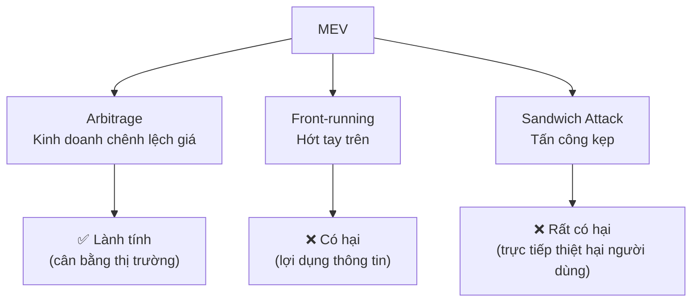
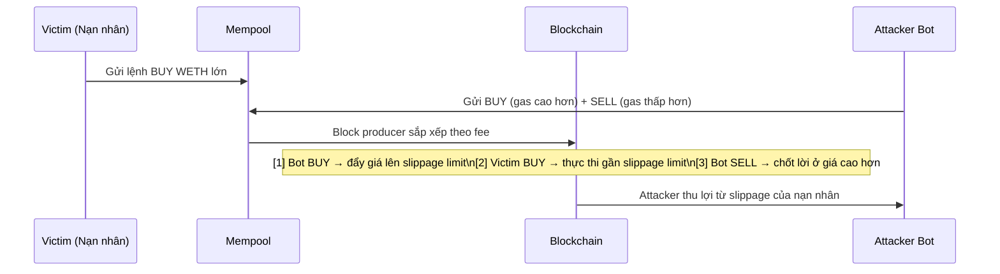
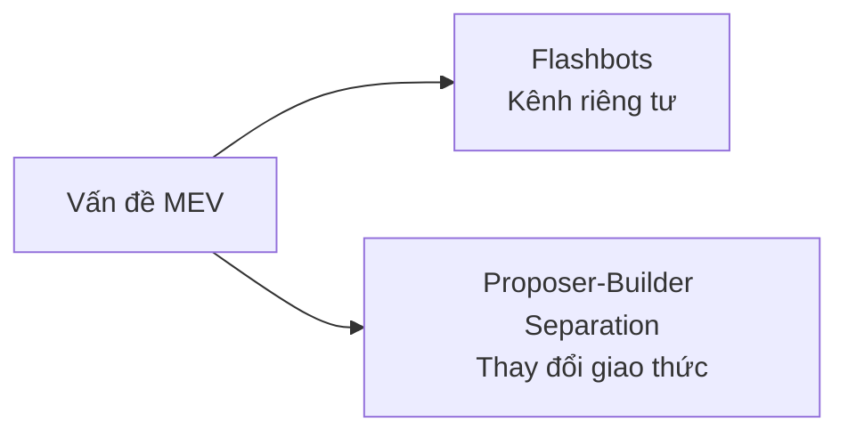
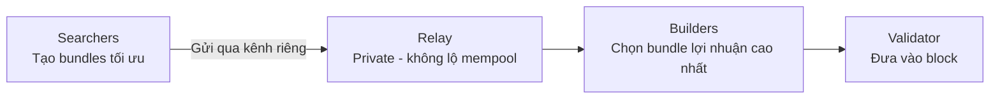
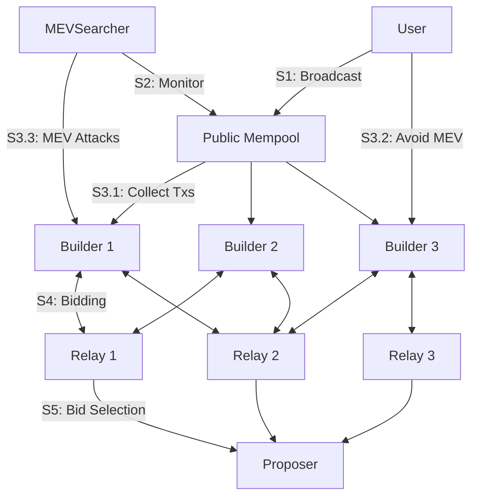

# Buổi 12 — MEV (Maximal Extractable Value) — Cuộc chiến trong Khu rừng tối

---

## 1. Dẫn nhập

Vòng đời của một giao dịch trên blockchain:

```
Người dùng → Mempool → Miner/Validator → Khối (Block)
```

!!! info "Mempool là gì?"
    Mempool là một "bể" chứa các giao dịch đang chờ được xử lý. **Mọi thứ trong đó đều công khai.**

!!! warning "Quyền lực của người tạo khối"
    Miner/Validator có **toàn quyền quyết định thứ tự** các giao dịch trong khối họ tạo ra. Quyền lực này cho phép họ — và những người khác — có thể trích xuất thêm giá trị ngoài phần thưởng thông thường.

---

## 2. MEV là gì?

**MEV (Maximal Extractable Value)** là tổng giá trị tối đa có thể được trích xuất từ việc sản xuất một khối, vượt ra ngoài phần thưởng khối và phí giao dịch thông thường, bằng cách **sắp xếp, chèn, hoặc kiểm duyệt** các giao dịch.

- Ban đầu được gọi là **Miner** Extractable Value.
- Sau **The Merge** (chuyển sang PoS), đổi thành **Maximal** để bao gồm cả Validators và hệ sinh thái tác nhân khác (Searchers, Builders).

!!! example "Ví von"
    Người tạo khối giống như một **nhà đấu giá**. Họ không chỉ nhận phí tham gia (gas fee) mà còn có thể thấy tất cả các lệnh đặt giá (transactions) **trước khi chốt phiên** và có thể tự mình đặt lệnh để tối đa hóa lợi nhuận.

---

## 3. Khu rừng tối (The Dark Forest)

!!! danger "The Dark Forest"
    Đây là thuật ngữ nổi tiếng mô tả môi trường Mempool trên Ethereum. Mempool là một nơi **cực kỳ thù địch** — bất kỳ cơ hội lợi nhuận nào được phát sóng công khai sẽ **ngay lập tức** bị các "động vật ăn thịt" (bot tự động) phát hiện và giành giật.

---

## 4. Các chiến lược trích xuất MEV phổ biến

Có 3 loại phổ biến nhất:



---

### 4.1 Arbitrage — MEV "Lành tính"

Đây là hình thức MEV đơn giản và thường được coi là **có lợi** cho hệ sinh thái.

!!! example "Kịch bản"
    - Giá ETH trên **Uniswap**: 2,000 DAI  
    - Giá ETH trên **Sushiswap**: 2,010 DAI  

    **Hành động của Bot** (atomic transaction):

    ```
    1. Mua 1 ETH @ 2,000 DAI trên Uniswap
    2. Bán 1 ETH @ 2,010 DAI trên Sushiswap
    3. Lợi nhuận: 10 DAI (trừ phí)
    ```

    **Kết quả:** Giúp cân bằng giá trên các sàn → thị trường hiệu quả hơn.

---

### 4.2 Front-running — "Nghe lỏm và Chạy trước"

Hành động **lợi dụng thông tin** từ một giao dịch đang chờ xử lý để trục lợi.

!!! example "Ví von"
    Bạn nghe lỏm được một nhà đầu tư lớn sắp đặt lệnh mua 1 triệu cổ phiếu X → bạn ngay lập tức mua trước, vì biết lệnh mua lớn kia sẽ **đẩy giá lên**.

```mermaid
sequenceDiagram
    participant User as Nạn nhân (T3$$$)
    participant Mempool
    participant Bot as Front-running Bot
    participant Block as Block

    User->>Mempool: Gửi giao dịch T3$$$ (gas thường)
    Bot->>Mempool: Phát hiện T3$$$, gửi T4$$$$ (gas cao hơn - BUY)\nvà T2$$ (gas thấp hơn - SELL)
    Mempool->>Block: Miner sắp xếp theo gas
    Note over Block: 1. T4$$$$ (Bot BUY)\n2. T3$$$ (Nạn nhân)\n3. T2$$ (Bot SELL)\n4. T1$ (thấp nhất)
```

---

### 4.3 Sandwich Attack — Hình thức Front-running Tinh vi

Đây là loại tấn công MEV **phổ biến nhất gây hại cho người dùng DeFi**. Nó bao gồm cả Front-running và Back-running.



!!! danger "Kết quả với người dùng"
    Bạn bị **"kẹp" ở giữa** và phải mua với giá tệ hơn (trượt giá cao hơn so với kỳ vọng).

??? details "Chi tiết 5 bước Sandwich Attack"
    1. **Victim** gửi lệnh BUY vào mempool.
    2. **Attacker** gửi BUY với fee cao hơn và SELL với fee thấp hơn.
    3. **Block producer** sắp xếp giao dịch theo thứ tự fee.
    4. Lệnh của Attacker thực thi **trước và sau** lệnh của Victim — như một cái sandwich.
    5. Attacker **thu lợi** từ chênh lệch giữa giá kỳ vọng và giá thực thi của Victim (slippage).

---

## 5. Hệ lụy của MEV

!!! warning "MEV không chỉ là trò chơi vô hại"

| Hệ lụy | Mô tả |
|---|---|
| **Tắc nghẽn mạng & Phí gas cao** | Các bot liên tục trả gas cao hơn nhau (Priority Gas Auctions - PGA), đẩy giá gas trung bình lên cho tất cả |
| **Trải nghiệm người dùng tồi tệ** | Người dùng thông thường là nạn nhân của Sandwich Attack, chịu trượt giá cao hơn dự kiến |
| **Rủi ro tập trung hóa** | MEV đòi hỏi hạ tầng phức tạp và vốn lớn → lợi thế cho validator lớn, giảm tính phi tập trung |
| **Rủi ro bất ổn chuỗi** | Miner có thể bị cám dỗ re-org các khối cũ để cướp MEV lớn trong quá khứ (**Time-Bandit Attack**) |

---

## 6. Giải pháp: Thuần hóa Khu rừng

Cộng đồng phát triển hai giải pháp chính:



---

### 6.1 Flashbots — Tạo ra một "Kênh riêng"

Flashbots tạo ra một **kênh giao tiếp riêng** giữa Searchers và Builders, không qua mempool công khai.

!!! example "Ví von"
    Thay vì la lớn cơ hội của bạn trong một khu chợ đông đúc (mempool công khai) và bị hớt tay trên, bạn **viết nó vào một phong bì kín** và đưa thẳng cho nhà đấu giá (Builder).



**Kết quả:** Ngăn chặn các cuộc chiến gas và các cuộc tấn công front-running đơn giản.

---

### 6.2 Proposer-Builder Separation (PBS)

PBS là ý tưởng dài hạn nhằm **tích hợp cơ chế Flashbots vào chính giao thức Ethereum**, giúp nó phi tập trung và công bằng hơn.

!!! info "Tách biệt vai trò"

    | Vai trò | Mô tả |
    |---|---|
    | **Builder** (Người xây dựng) | Chuyên môn cao — cạnh tranh xây dựng các khối có lợi nhuận cao nhất (bao gồm MEV) |
    | **Proposer / Validator** (Người đề xuất) | Đơn giản hơn — chỉ cần **chọn khối từ Builder trả giá cao nhất** |

**Kết quả:** Validator không cần tự chạy các chiến lược MEV phức tạp → giảm rào cản tham gia → tăng tính phi tập trung.



---

---

# 50 Câu Trắc nghiệm

---

### Phần 1: MEV — Khái niệm cơ bản

**Câu 1.** MEV ban đầu là viết tắt của?

- A. Maximal Extractable Value  
- B. Miner Extractable Value  
- C. Maximum Exchange Value  
- D. Miner Exchange Value  

??? success "Đáp án: B"
    Ban đầu MEV = **Miner** Extractable Value. Sau The Merge (chuyển sang PoS) mới đổi thành **Maximal**.

---

**Câu 2.** Sau sự kiện "The Merge" của Ethereum, MEV được mở rộng thành?

- A. Mining Extractable Value  
- B. Maximal Exchange Value  
- C. Maximal Extractable Value  
- D. Miner Executable Value  

??? success "Đáp án: C"
    The Merge chuyển Ethereum sang PoS, không còn Miner nữa → MEV = **Maximal** Extractable Value để bao gồm cả Validators, Searchers, Builders.

---

**Câu 3.** MEV được trích xuất bằng các hành động nào?

- A. Sắp xếp, chèn hoặc kiểm duyệt giao dịch  
- B. Tăng block size  
- C. Giảm gas fee  
- D. Fork blockchain  

??? success "Đáp án: A"
    Định nghĩa MEV: trích xuất giá trị bằng cách **sắp xếp (reorder), chèn (insert), hoặc kiểm duyệt (censor)** các giao dịch.

---

**Câu 4.** MEV vượt ra ngoài phần thưởng nào sau đây?

- A. Staking reward  
- B. Phần thưởng khối và phí giao dịch thông thường  
- C. Token airdrop  
- D. Liquidity mining reward  

??? success "Đáp án: B"
    MEV là giá trị **vượt ngoài** block reward + transaction fee thông thường.

---

**Câu 5.** Mempool có đặc điểm gì đặc biệt liên quan đến MEV?

- A. Được mã hóa hoàn toàn  
- B. Chỉ có validator mới xem được  
- C. Công khai — ai cũng có thể quan sát  
- D. Tự động xóa sau 10 phút  

??? success "Đáp án: C"
    Mempool là **công khai** — đây chính là lý do các bot MEV có thể quan sát và khai thác giao dịch của người dùng.

---

**Câu 6.** Vì sao người tạo khối có khả năng trích xuất MEV?

- A. Vì họ sở hữu nhiều ETH nhất  
- B. Vì họ có toàn quyền quyết định thứ tự giao dịch trong khối  
- C. Vì họ có thể thay đổi smart contract  
- D. Vì họ kiểm soát oracle  

??? success "Đáp án: B"
    Người tạo khối có **toàn quyền quyết định thứ tự** các giao dịch → có thể chèn/sắp xếp để tối đa hóa lợi nhuận.

---

**Câu 7.** "Khu rừng tối" (Dark Forest) là ẩn dụ cho?

- A. Mạng lưới validator bí mật  
- B. Môi trường Mempool — nơi các bot tự động săn lùng cơ hội lợi nhuận  
- C. Các smart contract bị hack  
- D. Layer 2 không minh bạch  

??? success "Đáp án: B"
    Dark Forest ám chỉ **Mempool** là nơi thù địch, bất kỳ cơ hội nào lộ ra công khai đều bị bot ngay lập tức "săn".

---

**Câu 8.** Trong ẩn dụ "Khu rừng tối", "động vật ăn thịt" tương ứng với?

- A. Validator  
- B. Smart contract  
- C. Bot MEV tự động  
- D. Liquidity provider  

??? success "Đáp án: C"
    "Động vật ăn thịt" = các **bot MEV tự động** liên tục quét mempool để tìm và khai thác cơ hội lợi nhuận.

---

**Câu 9.** Trong ẩn dụ về MEV, người tạo khối được so sánh với?

- A. Người mua hàng  
- B. Nhà đấu giá  
- C. Cảnh sát  
- D. Thẩm phán  

??? success "Đáp án: B"
    Người tạo khối = **nhà đấu giá**, có thể thấy tất cả lệnh đặt giá trước khi chốt phiên và tự mình đặt lệnh.

---

**Câu 10.** Các tác nhân nào được bao gồm trong hệ sinh thái MEV sau The Merge?

- A. Chỉ Validator  
- B. Chỉ Miner  
- C. Validators, Searchers, Builders  
- D. Chỉ Searchers  

??? success "Đáp án: C"
    Sau The Merge, MEV bao gồm một hệ sinh thái: **Validators, Searchers, Builders** (và Relays).

---

### Phần 2: Arbitrage

**Câu 11.** Arbitrage trong bối cảnh MEV thường được coi là?

- A. Có hại nhất cho người dùng  
- B. Lành tính và có lợi cho hệ sinh thái  
- C. Bất hợp pháp  
- D. Gây tắc nghẽn mạng nặng nhất  

??? success "Đáp án: B"
    Arbitrage được coi là MEV **"lành tính"** vì nó giúp cân bằng giá giữa các sàn → thị trường hiệu quả hơn.

---

**Câu 12.** Trong ví dụ arbitrage: ETH giá 2,000 DAI trên Uniswap và 2,010 DAI trên Sushiswap. Bot thực hiện giao dịch nguyên tử (atomic transaction). Lợi nhuận thô là?

- A. 5 DAI  
- B. 10 DAI  
- C. 20 DAI  
- D. 2,010 DAI  

??? success "Đáp án: B"
    2,010 - 2,000 = **10 DAI** (trước khi trừ phí gas).

---

**Câu 13.** "Atomic transaction" trong arbitrage có nghĩa là?

- A. Giao dịch được thực hiện bằng token nguyên tử  
- B. Giao dịch hoặc thực hiện toàn bộ hoặc không thực hiện gì cả  
- C. Giao dịch mất ít gas nhất  
- D. Giao dịch được ưu tiên cao nhất  

??? success "Đáp án: B"
    Atomic transaction = giao dịch **all-or-nothing** — đảm bảo bot không bị lỗ nếu điều kiện thị trường thay đổi giữa chừng.

---

**Câu 14.** Kết quả tích cực của arbitrage MEV đối với thị trường là?

- A. Tăng phí gas  
- B. Cân bằng giá giữa các sàn DEX  
- C. Tăng tốc độ xử lý block  
- D. Giảm số lượng validator  

??? success "Đáp án: B"
    Arbitrage **cân bằng giá** giữa các sàn, làm thị trường DeFi hiệu quả hơn — đây là lý do nó được coi là "lành tính".

---

**Câu 15.** Điều kiện cần để arbitrage xảy ra là?

- A. Một token bị hack  
- B. Chênh lệch giá cùng một tài sản giữa hai hoặc nhiều sàn  
- C. Validator kiểm duyệt giao dịch  
- D. Mempool bị tắc nghẽn  

??? success "Đáp án: B"
    Arbitrage cần **chênh lệch giá** của cùng tài sản trên các sàn khác nhau để bot có thể mua rẻ, bán đắt.

---

### Phần 3: Front-running

**Câu 16.** Front-running là hành động?

- A. Gửi giao dịch trước khi mempool xuất hiện  
- B. Lợi dụng thông tin từ giao dịch đang chờ xử lý để chạy trước và trục lợi  
- C. Tạo block trống để tăng gas  
- D. Kiểm duyệt giao dịch của đối thủ  

??? success "Đáp án: B"
    Front-running = **lợi dụng thông tin** từ giao dịch pending trong mempool để đặt lệnh trước và thu lợi.

---

**Câu 17.** Cơ chế nào cho phép front-running bot "chạy trước" giao dịch của nạn nhân?

- A. Sử dụng flash loan  
- B. Trả gas fee cao hơn để được ưu tiên xử lý trước  
- C. Hack smart contract  
- D. Sử dụng private key của nạn nhân  

??? success "Đáp án: B"
    Bot trả **gas fee cao hơn** → miner/validator ưu tiên xử lý trước → bot "chạy trước" giao dịch nạn nhân.

---

**Câu 18.** Trong ví dụ front-running (cổ phiếu X), người "front-run" kiếm lợi vì?

- A. Mua được giá thấp trước, rồi bán cao hơn sau khi lệnh lớn đẩy giá lên  
- B. Bán khống cổ phiếu  
- C. Thao túng báo cáo tài chính  
- D. Sử dụng insider trading hợp pháp  

??? success "Đáp án: A"
    Mua trước → lệnh lớn của nhà đầu tư kia đẩy giá lên → **bán với giá cao hơn** → thu lợi.

---

**Câu 19.** Điểm khác biệt cốt lõi giữa front-running và arbitrage là?

- A. Front-running cần nhiều vốn hơn  
- B. Front-running khai thác thông tin từ giao dịch của người dùng cụ thể và gây hại cho họ  
- C. Arbitrage chỉ hoạt động trên CEX  
- D. Front-running không cần gas  

??? success "Đáp án: B"
    Arbitrage khai thác **chênh lệch giá thị trường** (không hại ai cụ thể). Front-running **khai thác giao dịch của người dùng cụ thể** và gây thiệt hại trực tiếp cho họ.

---

**Câu 20.** Trong sơ đồ front-running, thứ tự giao dịch trong block là?

- A. T1 → T2 → T3 → T4  
- B. T4 → T3 → T2 → T1  
- C. T3 → T2 → T1 → T4  
- D. Ngẫu nhiên  

??? success "Đáp án: B"
    Giao dịch được sắp xếp **theo gas fee giảm dần**: T4\$\$\$\$ → T3\$\$\$ → T2\$\$ → T1\$. Bot mua (T4) trước nạn nhân (T3), rồi bán (T2) sau nạn nhân.

---

### Phần 4: Sandwich Attack

**Câu 21.** Sandwich Attack bao gồm những loại tấn công nào?

- A. Chỉ front-running  
- B. Front-running và back-running  
- C. Chỉ back-running  
- D. Arbitrage và front-running  

??? success "Đáp án: B"
    Sandwich = **Front-run** (mua trước) + **Back-run** (bán sau) → kẹp giao dịch nạn nhân ở giữa.

---

**Câu 22.** Trong Sandwich Attack, bước "Front-run" của bot là?

- A. Bán token ngay sau giao dịch nạn nhân  
- B. Mua token với gas cao hơn ngay TRƯỚC giao dịch nạn nhân  
- C. Hủy giao dịch của nạn nhân  
- D. Tăng slippage tolerance của nạn nhân  

??? success "Đáp án: B"
    Front-run = Bot **mua token với gas cao hơn** để được xử lý TRƯỚC giao dịch của nạn nhân, đẩy giá lên.

---

**Câu 23.** Trong Sandwich Attack, bước "Back-run" của bot là?

- A. Mua thêm token sau giao dịch nạn nhân  
- B. Bán token ngay SAU giao dịch nạn nhân để chốt lời  
- C. Báo cáo giao dịch lên on-chain  
- D. Rút thanh khoản khỏi pool  

??? success "Đáp án: B"
    Back-run = Bot **bán token với gas thấp hơn** (nhưng vẫn cao hơn giao dịch tiếp theo) → thực thi NGAY SAU nạn nhân → chốt lời từ giá cao mà nạn nhân vừa tạo ra.

---

**Câu 24.** Tại sao Sandwich Attack được gọi là "kẹp"?

- A. Vì bot dùng 2 ví khác nhau  
- B. Vì giao dịch của nạn nhân bị kẹp giữa lệnh mua và lệnh bán của bot  
- C. Vì attack xảy ra trên 2 blockchain khác nhau  
- D. Vì bot cần 2 bước xác nhận  

??? success "Đáp án: B"
    Giao dịch nạn nhân bị **kẹp giữa** lệnh BUY (front-run) và lệnh SELL (back-run) của bot — như nhân của một cái sandwich.

---

**Câu 25.** Hậu quả trực tiếp với người dùng khi bị Sandwich Attack là?

- A. Giao dịch bị hủy hoàn toàn  
- B. Mất toàn bộ token  
- C. Phải mua với giá tệ hơn (trượt giá cao hơn dự kiến)  
- D. Bị khóa tài khoản  

??? success "Đáp án: C"
    Nạn nhân không mất hết tiền nhưng **mua với giá cao hơn** mức họ kỳ vọng (slippage tệ hơn).

---

**Câu 26.** Sandwich Attack phổ biến nhất trên loại giao thức nào?

- A. CEX (sàn tập trung)  
- B. NFT marketplace  
- C. DEX (sàn phi tập trung) như Uniswap  
- D. Lending protocol  

??? success "Đáp án: C"
    Sandwich Attack nhắm vào **DEX** vì các lệnh swap lớn trên AMM (như Uniswap) tạo ra price impact có thể dự đoán và khai thác được.

---

**Câu 27.** Bot trong Sandwich Attack kiếm lợi từ?

- A. Gas fee được hoàn lại  
- B. Chênh lệch giữa giá kỳ vọng và giá thực thi của nạn nhân (slippage)  
- C. Staking reward  
- D. Flash loan fee  

??? success "Đáp án: B"
    Bot lợi nhuận = **slippage của nạn nhân** — khoảng chênh lệch giữa giá nạn nhân dự kiến được và giá thực sự nhận được.

---

**Câu 28.** Trong 5 bước của Sandwich Attack, bước nào là bước block producer tham gia?

- A. Bước 1  
- B. Bước 2  
- C. Bước 3  
- D. Bước 5  

??? success "Đáp án: C"
    Bước 3: **Block producer** thêm các giao dịch vào block theo thứ tự fee — đây là lúc thứ tự "sandwich" được xác lập.

---

### Phần 5: Hệ lụy của MEV

**Câu 29.** PGA là viết tắt của?

- A. Protocol Gas Authority  
- B. Priority Gas Auctions  
- C. Public Gas Allocation  
- D. Proof of Gas Algorithm  

??? success "Đáp án: B"
    PGA = **Priority Gas Auctions** — các bot MEV liên tục đấu giá gas fee cao hơn nhau để được ưu tiên xử lý trước.

---

**Câu 30.** PGA ảnh hưởng thế nào đến người dùng thông thường?

- A. Giúp giao dịch nhanh hơn  
- B. Đẩy giá gas trung bình lên cao, tất cả đều phải trả nhiều hơn  
- C. Không có ảnh hưởng gì  
- D. Giảm phần thưởng cho validator  

??? success "Đáp án: B"
    PGA làm **gas fee trung bình tăng** vì các bot liên tục cạnh tranh → người dùng thông thường cũng phải trả nhiều hơn.

---

**Câu 31.** Rủi ro tập trung hóa do MEV xảy ra vì?

- A. MEV chỉ hoạt động trên một blockchain  
- B. MEV đòi hỏi hạ tầng phức tạp và vốn lớn → lợi thế cho validator lớn  
- C. Các validator nhỏ bị cấm tham gia  
- D. MEV làm giảm staking reward  

??? success "Đáp án: B"
    Trích xuất MEV hiệu quả đòi hỏi hạ tầng phức tạp và vốn lớn → **lợi thế cạnh tranh nghiêng về validator lớn** → giảm tính phi tập trung.

---

**Câu 32.** "Time-Bandit Attack" là gì?

- A. Tấn công làm chậm đồng hồ block  
- B. Miner re-org các khối cũ để cướp cơ hội MEV lớn trong quá khứ  
- C. Bot tấn công nhiều mempool cùng lúc  
- D. Validator từ chối xử lý giao dịch  

??? success "Đáp án: B"
    Time-Bandit Attack = Miner bị cám dỗ **tổ chức lại (re-org) các khối cũ** để cướp một cơ hội MEV lớn đã được xử lý trong quá khứ.

---

**Câu 33.** Time-Bandit Attack gây ra rủi ro gì cho blockchain?

- A. Tăng phí gas  
- B. Bất ổn định của chuỗi — đe dọa tính finality của giao dịch  
- C. Giảm tốc độ đào block  
- D. Mất dữ liệu mempool  

??? success "Đáp án: B"
    Re-org block đe dọa **tính finality** (tính chắc chắn không thể đảo ngược) của blockchain — một trong những thuộc tính bảo mật cốt lõi.

---

**Câu 34.** Hệ lụy nào của MEV ảnh hưởng TRỰC TIẾP nhất đến người dùng DeFi thông thường?

- A. Rủi ro Time-Bandit Attack  
- B. Rủi ro tập trung hóa  
- C. Trải nghiệm tồi tệ do Sandwich Attack gây ra  
- D. Phí PGA do validator thu  

??? success "Đáp án: C"
    Người dùng DeFi thông thường bị ảnh hưởng trực tiếp nhất bởi **Sandwich Attack** — mua với giá tệ hơn mà không biết lý do.

---

### Phần 6: Flashbots

**Câu 35.** Flashbots giải quyết vấn đề MEV bằng cách nào?

- A. Mã hóa toàn bộ mempool  
- B. Tạo kênh giao tiếp riêng tư giữa Searchers và Builders  
- C. Cấm bot tham gia mạng lưới  
- D. Tăng block size để giảm cạnh tranh  

??? success "Đáp án: B"
    Flashbots tạo **kênh riêng tư** giữa Searchers (tìm kiếm MEV) và Builders (xây khối) → giao dịch không bị lộ ra mempool công khai.

---

**Câu 36.** Trong hệ thống Flashbots, "bundle" là gì?

- A. Một khối block hoàn chỉnh  
- B. Nhóm giao dịch được tối ưu hóa do Searcher tạo ra  
- C. Tập hợp các validator  
- D. Phí relay  

??? success "Đáp án: B"
    Bundle = **nhóm giao dịch** được Searcher đóng gói và tối ưu hóa để tối đa hóa lợi nhuận MEV.

---

**Câu 37.** Relay trong hệ thống Flashbots có vai trò gì?

- A. Xây dựng block  
- B. Xác thực giao dịch on-chain  
- C. Nhận bundle từ Searcher và chuyển đến Builder một cách riêng tư  
- D. Phân phối phần thưởng MEV  

??? success "Đáp án: C"
    Relay = trung gian **riêng tư** giữa Searcher và Builder — đảm bảo bundle không bị lộ ra mempool công khai.

---

**Câu 38.** Kết quả chính của Flashbots là?

- A. Loại bỏ hoàn toàn MEV  
- B. Ngăn chặn chiến tranh gas (PGA) và các tấn công front-running đơn giản  
- C. Tăng tốc độ xử lý giao dịch  
- D. Giảm staking requirement  

??? success "Đáp án: B"
    Flashbots **ngăn chặn PGA** (vì giao dịch không cạnh tranh công khai trên mempool) và giảm front-running đơn giản.

---

**Câu 39.** Trong ẩn dụ của Flashbots, "phong bì kín" tương ứng với?

- A. Block được mã hóa  
- B. Bundle gửi qua Relay riêng tư — không lộ ra mempool công khai  
- C. Private key của Searcher  
- D. Smart contract ẩn danh  

??? success "Đáp án: B"
    "Phong bì kín" = **bundle gửi qua Relay riêng tư**, không bị các bot khác quan sát và front-run.

---

**Câu 40.** Builder trong hệ thống Flashbots làm gì?

- A. Xác thực chữ ký giao dịch  
- B. Chọn các bundle có lợi nhuận cao nhất để đưa vào khối  
- C. Giám sát mempool  
- D. Tạo ra các bundle MEV  

??? success "Đáp án: B"
    Builder **cạnh tranh** để xây dựng khối có giá trị cao nhất bằng cách chọn các bundle từ Searchers.

---

### Phần 7: PBS (Proposer-Builder Separation)

**Câu 41.** PBS khác Flashbots ở điểm nào?

- A. PBS không liên quan đến MEV  
- B. PBS tích hợp cơ chế vào chính giao thức Ethereum, không phải giải pháp ngoài giao thức  
- C. PBS chỉ áp dụng cho PoW  
- D. PBS không có Relay  

??? success "Đáp án: B"
    Flashbots là giải pháp **ngoài giao thức** (off-protocol). PBS là ý tưởng **tích hợp vào chính giao thức** Ethereum — một thay đổi cấp độ giao thức.

---

**Câu 42.** Trong PBS, Builder có vai trò gì?

- A. Xác thực block cuối cùng  
- B. Chuyên gia — cạnh tranh xây dựng các khối có lợi nhuận cao nhất  
- C. Đơn giản — chỉ chọn block tốt nhất  
- D. Giám sát mempool  

??? success "Đáp án: B"
    Builder = vai trò **chuyên môn cao**, cạnh tranh để xây dựng khối tối ưu nhất (bao gồm khai thác MEV).

---

**Câu 43.** Trong PBS, Proposer (Validator) chỉ cần làm gì?

- A. Tự xây dựng block tối ưu  
- B. Giám sát mempool và phát hiện MEV  
- C. Chọn block từ Builder trả giá cao nhất  
- D. Phân phối MEV cho tất cả validator  

??? success "Đáp án: C"
    Proposer trong PBS chỉ cần **chọn block từ Builder trả giá cao nhất** — đơn giản hóa vai trò, không cần tự chạy chiến lược MEV.

---

**Câu 44.** PBS giúp tăng tính phi tập trung như thế nào?

- A. Cấm các validator lớn tham gia  
- B. Validator không cần chạy chiến lược MEV phức tạp → giảm rào cản tham gia  
- C. Tăng staking reward đồng đều  
- D. Phân chia MEV bình đẳng cho tất cả  

??? success "Đáp án: B"
    Khi Validator không cần tự mình làm MEV phức tạp, **rào cản tham gia giảm** → nhiều validator nhỏ có thể tham gia → tăng phi tập trung.

---

**Câu 45.** Trong luồng PBS, thứ tự các bước là?

- A. Builder → Proposer → Relay → User  
- B. User → Mempool → Builder → Relay → Proposer  
- C. Proposer → Builder → Relay → User  
- D. Relay → Builder → Proposer → Mempool  

??? success "Đáp án: B"
    Luồng: **User broadcast** vào Mempool → **Builder** thu thập + xây khối → gửi qua **Relay** (bidding) → **Proposer** chọn bid cao nhất.

---

### Phần 8: Tổng hợp & So sánh

**Câu 46.** Sắp xếp 3 loại MEV theo mức độ gây hại cho người dùng thông thường (từ ít đến nhiều)?

- A. Arbitrage < Front-running < Sandwich Attack  
- B. Sandwich Attack < Front-running < Arbitrage  
- C. Front-running < Sandwich Attack < Arbitrage  
- D. Arbitrage < Sandwich Attack < Front-running  

??? success "Đáp án: A"
    - **Arbitrage**: ít/không hại (thậm chí có lợi)  
    - **Front-running**: có hại vừa  
    - **Sandwich Attack**: gây hại trực tiếp nhất cho người dùng DeFi (trượt giá thực sự)

---

**Câu 47.** Giải pháp nào dưới đây thuộc cấp độ giao thức (protocol-level)?

- A. Flashbots  
- B. Sandwich bot detection  
- C. Proposer-Builder Separation (PBS)  
- D. Private mempool của từng node  

??? success "Đáp án: C"
    PBS là thay đổi **ở cấp độ giao thức Ethereum** (protocol-level), còn Flashbots là giải pháp ở tầng ứng dụng.

---

**Câu 48.** Người dùng DeFi có thể tự bảo vệ khỏi Sandwich Attack bằng cách nào?

- A. Tăng gas fee lên tối đa  
- B. Đặt slippage tolerance thấp hơn hoặc dùng private RPC/MEV-protected endpoints  
- C. Chỉ trade trên CEX  
- D. Sử dụng hardware wallet  

??? success "Đáp án: B"
    **Slippage tolerance thấp** làm cho giao dịch không profitable để sandwich. **Private RPC** (như Flashbots Protect) không lộ giao dịch ra mempool công khai.

---

**Câu 49.** Điều nào sau đây KHÔNG phải là hệ lụy của MEV được đề cập trong bài?

- A. Tắc nghẽn mạng và phí gas cao  
- B. Rủi ro tập trung hóa  
- C. Smart contract bị exploit  
- D. Rủi ro bất ổn chuỗi (Time-Bandit)  

??? success "Đáp án: C"
    Bài không đề cập đến **smart contract exploit** là hệ lụy của MEV. 4 hệ lụy chính là: tắc nghẽn/gas cao, UX tồi, tập trung hóa, bất ổn chuỗi.

---

**Câu 50.** Câu nào mô tả ĐÚNG nhất mối quan hệ giữa Flashbots và PBS?

- A. Flashbots và PBS là hai giải pháp hoàn toàn độc lập, không liên quan  
- B. PBS là phiên bản nâng cấp của Flashbots tích hợp vào giao thức Ethereum  
- C. Flashbots thay thế hoàn toàn PBS  
- D. PBS ra đời trước Flashbots  

??? success "Đáp án: B"
    PBS là ý tưởng **tích hợp cơ chế của Flashbots vào chính giao thức Ethereum** — kế thừa và mở rộng những gì Flashbots đã làm ở tầng ứng dụng.
