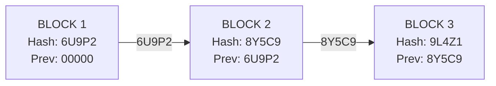
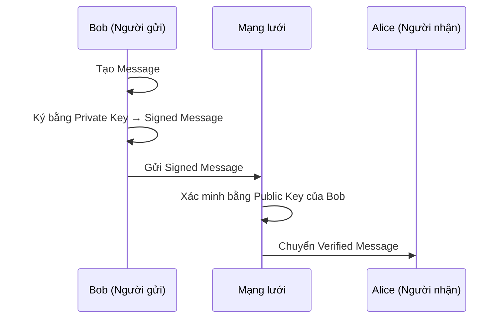
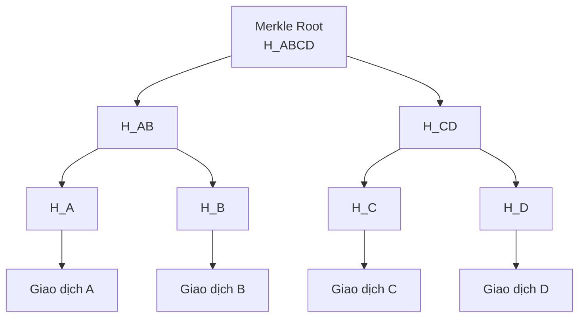
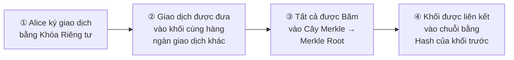

# Buổi 2 - Các Nguyên lý Mật mã học trong Blockchain

---

## Mục tiêu

Kết thúc buổi học, sinh viên sẽ nắm vững:

- **Hàm băm Mật mã:** Cách tạo ra "vân tay số" và vai trò của nó.
- **Mật mã hóa Khóa công khai:** Cách tạo ra danh tính và sở hữu tài sản số.
- **Chữ ký số:** Cách xác thực giao dịch mà không cần trung gian.
- **Cây Merkle:** Cách Blockchain quản lý hàng ngàn giao dịch một cách hiệu quả.

---

## 1. Hàm băm — "Vân tay" của Dữ liệu

> Hãy tưởng tượng hàm băm như một chiếc **máy xay ma thuật**:

- Bạn có thể cho bất cứ thứ gì vào: một chữ cái, một cuốn sách, một bộ phim...
- Đầu ra (kết quả băm) luôn là một chuỗi ký tự có **độ dài không đổi**.
- **Không thể** từ "bột" xay ra mà ráp lại thành vật thể ban đầu.

### Minh họa — SHA-256

```text
// Đầu vào 1
Input:  "Xin chao the gioi"
Output: 29b0e219...18d91f42

// Chỉ thay đổi 1 ký tự 'X' -> 'x'
Input:  "xin chao the gioi"
Output: 99933390...6044702d  // Kết quả khác biệt 100%!
```

!!! warning "Hiệu ứng Thác đổ (Avalanche Effect)"
    Sự thay đổi dù nhỏ nhất ở đầu vào cũng tạo ra kết quả **khác biệt hoàn toàn** ở đầu ra.

---

### Đặc tính VÀNG của Hàm băm

#### 1. Tính đơn định (Deterministic)

- Một đầu vào luôn tạo ra **cùng một kết quả** đầu ra.
- `hash("Syllabus")` hôm nay hay 10 năm sau vẫn cho ra cùng một chuỗi hash.

!!! info "Tại sao quan trọng?"
    Cho phép mọi người trong mạng lưới có thể **tự mình kiểm tra và xác minh** tính hợp lệ của dữ liệu. Nếu tôi và bạn cùng băm một khối và ra kết quả giống nhau, chúng ta biết rằng chúng ta có cùng một dữ liệu.

---

#### 2. Tính một chiều (One-Way / Pre-image Resistance)

- Rất dễ để tính `Y = hash(X)`.
- Nhưng gần như **không thể** tìm ra `X` nếu chỉ biết `Y`.

!!! info "Tại sao quan trọng?"
    Giúp **bảo vệ dữ liệu**. Ví dụ, Merkle Root tóm tắt hàng ngàn giao dịch, nhưng không ai có thể từ Merkle Root mà suy ngược ra được nội dung của các giao dịch đó.

---

#### 3. Tính kháng va chạm (Collision Resistance)

- Cực kỳ khó để tìm ra hai đầu vào khác nhau `X` và `Z` sao cho `hash(X) = hash(Z)`.
- Với SHA-256, xác suất này **nhỏ hơn cả việc trúng số độc đắc nhiều lần liên tiếp**.

!!! info "Tại sao quan trọng?"
    Đảm bảo **tính toàn vẹn của chuỗi**. Nếu có thể tạo ra va chạm, kẻ gian có thể tạo ra một khối giả mạo có cùng hash với khối thật để lừa đảo hệ thống.

---

### Ứng dụng — Tạo ra "Chuỗi"

Hàm băm chính là **"chất keo" mật mã học** gắn kết toàn bộ lịch sử của Blockchain. Mỗi khối chứa hash của chính nó và hash của khối trước, tạo ra liên kết bất biến:



> Đây là cách các khối được liên kết với nhau một cách **bất biến**.

---

## 2. Mật mã Khóa công khai — Danh tính Số

> **Vấn đề:** Làm sao để giao tiếp an toàn và xác định danh tính trên một mạng lưới công cộng và không tin cậy?

**Giải pháp:** Sử dụng cặp khóa **Public Key / Private Key**.

### Ví von về Hòm thư & Chìa khóa

| | Ví von | Trong Blockchain |
|---|---|---|
| **Khóa Công khai (Public Key)** | Địa chỉ hòm thư — ai cũng biết | Địa chỉ ví, dùng để nhận tài sản |
| **Khóa Riêng tư (Private Key)** | Chìa khóa mở hòm thư — chỉ bạn giữ | Dùng để ký giao dịch, chứng minh quyền sở hữu |

### Trông chúng như thế nào?

```text
// Một Khóa Riêng tư (dạng Hexadecimal, 256-bit)
Private Key:
8e3c...b733

        ↓ (Thuật toán ECC) ↓

// Địa chỉ Ethereum tương ứng (tạo từ Khóa Công khai)
Address:
0x71C7...A18e
```

!!! note "Quan hệ một chiều"
    Có thể từ **khóa riêng tư** tạo ra **địa chỉ**, nhưng **không thể** làm ngược lại.

---

### Cảnh báo An ninh Tối quan trọng

!!! danger "Not Your Keys, Not Your Coins"
    **"Không phải khóa của bạn, không phải tiền của bạn"**

    - Nếu bạn **để lộ khóa riêng tư**, bạn mất tất cả tài sản. Không có tổng đài hay ngân hàng nào để gọi hỗ trợ.
    - Nếu bạn **lưu khóa trên một sàn giao dịch**, về mặt kỹ thuật, họ mới là người đang giữ tài sản của bạn.

---

## 3. Chữ ký số — Dấu ấn Không thể Chối cãi

> **Vấn đề:** Làm sao mạng lưới biết một giao dịch là hợp lệ và thực sự đến từ bạn?

Chữ ký số cung cấp **hai bằng chứng sắt đá**:

- **Tính xác thực (Authenticity):** Giao dịch được tạo bởi chủ nhân của khóa riêng tư.
- **Tính toàn vẹn (Integrity):** Giao dịch không hề bị chỉnh sửa.

### Quy trình ký và xác nhận



### So sánh các chức năng mật mã

| Chức năng | Mục đích | Khóa sử dụng | Kết quả |
|---|---|---|---|
| **Băm (Hashing)** | Kiểm tra tính toàn vẹn | Không dùng khóa | "Vân tay số" |
| **Mã hóa (Encryption)** | Bảo vệ tính bí mật | Khóa công khai | Dữ liệu bị xáo trộn |
| **Ký số (Signing)** | Xác thực & Chống chối bỏ | Khóa riêng tư | "Chữ ký" |

---

## 4. Cây Merkle — Tối ưu hóa Hiệu suất

> **Vấn đề:** Một khối có thể chứa hàng ngàn giao dịch. Làm sao một ví điện thoại (**light client**) có thể xác minh giao dịch của mình mà không cần tải về cả khối (hàng Megabyte dữ liệu)?

**Giải pháp:** Cây Merkle cho phép **tóm tắt toàn bộ giao dịch** trong khối thành **một chuỗi hash duy nhất** (Merkle Root).

### Cấu trúc Cây Merkle



### Merkle Proof — Xác minh tối giản

Để chứng minh **Giao dịch A** có trong khối, bạn **không cần cả cây**. Bạn chỉ cần:

??? example "Các bước xác minh Giao dịch A"
    1. **HB** → để tính `H_AB`
    2. **H_CD** → để tính `H_ABCD`
    3. **Merkle Root** → để so sánh kết quả cuối cùng

!!! success "Kết quả"
    Một lượng dữ liệu **cực nhỏ** để xác minh, giúp các thiết bị yếu có thể tương tác an toàn với Blockchain.

---

## Tổng kết — Cả 4 thành phần hoạt động cùng nhau



---

---

# 50 Câu Trắc nghiệm

---

### Phần 1 — Hàm băm

**Câu 1.** Hàm băm mật mã là gì?

- A. Một thuật toán mã hóa dữ liệu có thể giải mã được
- B. Một hàm nhận đầu vào bất kỳ và tạo ra đầu ra có độ dài cố định, không thể đảo ngược
- C. Một cách lưu trữ khóa riêng tư an toàn
- D. Một phương pháp truyền dữ liệu giữa các node

??? success "Đáp án: B"
    Hàm băm nhận đầu vào bất kỳ kích thước, cho ra chuỗi có độ dài cố định và không thể đảo ngược — đây là định nghĩa cốt lõi.

---

**Câu 2.** "Hiệu ứng thác đổ" (Avalanche Effect) trong hàm băm có nghĩa là gì?

- A. Khi đầu vào tăng kích thước, đầu ra cũng tăng theo
- B. Thay đổi nhỏ ở đầu vào tạo ra thay đổi hoàn toàn ở đầu ra
- C. Nhiều đầu vào có thể cho ra cùng một đầu ra
- D. Hàm băm chạy chậm hơn khi dữ liệu lớn

??? success "Đáp án: B"
    Avalanche Effect: chỉ cần thay 1 ký tự (ví dụ 'X' → 'x') thì output hash thay đổi hoàn toàn — đây là tính chất bảo mật quan trọng.

---

**Câu 3.** Thuật toán hàm băm nào được Bitcoin sử dụng chủ yếu?

- A. MD5
- B. SHA-1
- C. SHA-256
- D. SHA-512

??? success "Đáp án: C"
    Bitcoin sử dụng SHA-256 — cũng là thuật toán được đề cập trong bài với ví dụ minh họa.

---

**Câu 4.** Tính chất nào của hàm băm đảm bảo cùng một đầu vào luôn cho ra cùng một đầu ra?

- A. Tính kháng va chạm
- B. Tính một chiều
- C. Tính đơn định
- D. Hiệu ứng thác đổ

??? success "Đáp án: C"
    **Tính đơn định (Deterministic):** `hash("Syllabus")` hôm nay hay 10 năm sau vẫn cho cùng kết quả.

---

**Câu 5.** Tính "một chiều" (One-Way) của hàm băm có nghĩa là:

- A. Chỉ có thể băm dữ liệu theo một hướng duy nhất trong mạng
- B. Dễ tính Y = hash(X), nhưng gần như không thể tìm ra X khi chỉ biết Y
- C. Mỗi dữ liệu chỉ được băm một lần duy nhất
- D. Hàm băm chỉ xử lý được văn bản một chiều

??? success "Đáp án: B"
    Pre-image Resistance: biết Y nhưng không thể suy ngược ra X — nền tảng của bảo mật trong Merkle Tree và nhiều ứng dụng khác.

---

**Câu 6.** Tại sao tính kháng va chạm (Collision Resistance) quan trọng trong Blockchain?

- A. Giúp tăng tốc độ xử lý giao dịch
- B. Ngăn kẻ gian tạo khối giả mạo có cùng hash với khối thật
- C. Cho phép nhiều node đồng bộ dữ liệu nhanh hơn
- D. Giảm kích thước dữ liệu cần lưu trữ

??? success "Đáp án: B"
    Nếu tìm được va chạm (hash(X) = hash(Z) với X ≠ Z), kẻ gian có thể tạo khối giả với cùng hash, phá vỡ tính toàn vẹn của chuỗi.

---

**Câu 7.** Điều gì xảy ra nếu một khối trong Blockchain bị chỉnh sửa?

- A. Chỉ khối đó bị thay đổi hash, không ảnh hưởng các khối sau
- B. Hash của khối đó thay đổi, làm mất liên kết với tất cả các khối tiếp theo
- C. Mạng lưới tự động sửa lỗi và khôi phục khối gốc
- D. Không có gì xảy ra nếu thay đổi nhỏ

??? success "Đáp án: B"
    Vì mỗi khối chứa hash của khối trước, khi sửa một khối thì hash của nó thay đổi, làm "Previous Hash" của khối sau không còn khớp — toàn bộ chuỗi phía sau bị phá vỡ.

---

**Câu 8.** Vai trò của hàm băm trong việc tạo ra "chuỗi" trong Blockchain là gì?

- A. Mã hóa nội dung giao dịch để bảo mật
- B. Kết nối các khối lại với nhau bằng cách mỗi khối chứa hash của khối trước
- C. Tạo địa chỉ ví cho người dùng
- D. Xác thực chữ ký số của giao dịch

??? success "Đáp án: B"
    Hàm băm là "chất keo mật mã học" — mỗi khối chứa `Previous Hash` của khối trước, tạo ra chuỗi liên kết bất biến.

---

**Câu 9.** Với SHA-256, xác suất tìm ra va chạm được so sánh với:

- A. Xác suất bị sét đánh trong đời người
- B. Xác suất trúng số độc đắc nhiều lần liên tiếp
- C. Xác suất tung đồng xu 256 lần liên tiếp ra mặt ngửa
- D. Xác suất chọn đúng một hạt cát trong sa mạc

??? success "Đáp án: B"
    Theo bài giảng, xác suất va chạm SHA-256 "nhỏ hơn cả việc trúng số độc đắc nhiều lần liên tiếp."

---

**Câu 10.** Tại sao tính đơn định của hàm băm quan trọng trong mạng Blockchain phân tán?

- A. Giúp tiết kiệm băng thông mạng
- B. Cho phép mọi node độc lập xác minh và ra cùng kết quả với cùng dữ liệu
- C. Ngăn chặn các cuộc tấn công từ chối dịch vụ (DDoS)
- D. Tăng tốc độ đồng thuận giữa các node

??? success "Đáp án: B"
    Nếu tôi và bạn cùng băm một khối và ra cùng kết quả, chúng ta biết mình có cùng dữ liệu — nền tảng của việc xác minh phi tập trung.

---

### Phần 2 — Mật mã Khóa công khai

**Câu 11.** Trong mật mã khóa công khai, Khóa Công khai (Public Key) đóng vai trò gì?

- A. Dùng để ký giao dịch, chứng minh quyền sở hữu
- B. Giống như địa chỉ hòm thư — ai cũng có thể biết và gửi tài sản đến đó
- C. Dùng để giải mã thông điệp bí mật
- D. Chỉ được dùng nội bộ, không chia sẻ ra ngoài

??? success "Đáp án: B"
    Public Key = địa chỉ hòm thư: bạn chia sẻ cho ai cũng được để họ gửi tài sản cho bạn.

---

**Câu 12.** Khóa Riêng tư (Private Key) trong Blockchain có đặc điểm nào sau đây?

- A. Có thể chia sẻ công khai để mọi người xác minh giao dịch
- B. Được lưu trữ trên blockchain để minh bạch
- C. Chỉ chủ sở hữu giữ; ai có khóa này có toàn quyền với tài sản
- D. Có thể được khôi phục từ Khóa Công khai nếu bị mất

??? success "Đáp án: C"
    Private Key = chìa khóa hòm thư: chỉ bạn giữ, mất là mất tất cả — không có cơ chế phục hồi từ Public Key.

---

**Câu 13.** Thuật toán nào được nhắc đến trong bài để tạo ra địa chỉ Ethereum từ Khóa Riêng tư?

- A. RSA
- B. AES
- C. ECC (Elliptic Curve Cryptography)
- D. DES

??? success "Đáp án: C"
    Bài giảng nêu rõ: Private Key → *(Thuật toán ECC)* → Address (0x71C7...A18e).

---

**Câu 14.** Mối quan hệ giữa Khóa Riêng tư và địa chỉ ví là:

- A. Hai chiều — có thể suy ra khóa riêng tư từ địa chỉ ví
- B. Một chiều — chỉ có thể từ khóa riêng tư tạo ra địa chỉ, không thể ngược lại
- C. Không liên quan — chúng được tạo độc lập nhau
- D. Phụ thuộc vào blockchain đang dùng

??? success "Đáp án: B"
    Đây là tính chất một chiều nhờ hàm băm và ECC — bảo đảm an toàn: biết địa chỉ không suy ra được private key.

---

**Câu 15.** Câu thần chú "Not Your Keys, Not Your Coins" có nghĩa thực tế là gì?

- A. Bạn nên đổi khóa ví thường xuyên để bảo mật
- B. Nếu khóa riêng tư không do bạn nắm giữ (ví dụ: lưu trên sàn), bạn không thực sự sở hữu tài sản đó
- C. Chỉ những người có nhiều coin mới cần giữ khóa riêng
- D. Mọi giao dịch cần xác nhận bằng khóa công khai

??? success "Đáp án: B"
    Nếu sàn giao dịch giữ private key thay bạn, về mặt kỹ thuật, họ mới là chủ tài sản — như vụ FTX sụp đổ là ví dụ thực tế.

---

**Câu 16.** Điều gì xảy ra nếu khóa riêng tư bị lộ?

- A. Người dùng có thể yêu cầu sàn giao dịch khóa tài khoản để bảo vệ
- B. Ngân hàng trung ương can thiệp để đóng băng tài sản
- C. Kẻ tấn công có toàn quyền truy cập và lấy đi toàn bộ tài sản, không có cách nào phục hồi
- D. Chữ ký số tự động vô hiệu hóa các giao dịch trái phép

??? success "Đáp án: C"
    Blockchain không có cơ chế "quên mật khẩu" hay tổng đài hỗ trợ — mất private key là mất tất cả.

---

**Câu 17.** Khóa Riêng tư trong ví Ethereum thường có định dạng nào?

- A. Chuỗi 12 hoặc 24 từ tiếng Anh (seed phrase)
- B. Chuỗi 256-bit dưới dạng Hexadecimal
- C. Địa chỉ email mã hóa
- D. Số điện thoại kết hợp với mã PIN

??? success "Đáp án: B"
    Bài nêu rõ: `Private Key: 8e3c...b733` — dạng Hexadecimal 256-bit.

---

**Câu 18.** Tại sao mật mã khóa công khai giải quyết được vấn đề giao tiếp trên mạng không tin cậy?

- A. Vì nó mã hóa toàn bộ lưu lượng mạng
- B. Vì nó cho phép xác định danh tính và giao tiếp an toàn mà không cần tin tưởng vào bên thứ ba
- C. Vì nó yêu cầu tất cả các bên phải biết nhau trước
- D. Vì nó sử dụng máy chủ trung tâm để xác thực

??? success "Đáp án: B"
    Đây là lý do cốt lõi của PKC: cho phép hai bên không quen biết giao tiếp an toàn và xác thực danh tính trên mạng công cộng.

---

### Phần 3 — Chữ ký số

**Câu 19.** Chữ ký số cung cấp những bằng chứng nào?

- A. Tính bí mật và tính sẵn sàng
- B. Tính xác thực (Authenticity) và tính toàn vẹn (Integrity)
- C. Tính phân tán và tính đồng thuận
- D. Tính nhanh và tính tiết kiệm chi phí

??? success "Đáp án: B"
    Chữ ký số chứng minh: (1) giao dịch đến từ chủ nhân private key, (2) nội dung không bị chỉnh sửa sau khi ký.

---

**Câu 20.** Trong quy trình chữ ký số, ai sử dụng khóa nào?

- A. Người gửi dùng khóa công khai để ký; người nhận dùng khóa riêng tư để xác minh
- B. Người gửi dùng khóa riêng tư để ký; người nhận/mạng lưới dùng khóa công khai để xác minh
- C. Cả hai bên đều dùng cùng một khóa bí mật chia sẻ
- D. Không cần khóa — chữ ký số chỉ dựa vào hàm băm

??? success "Đáp án: B"
    Bob ký bằng **Private Key** → Alice/mạng xác minh bằng **Public Key của Bob** — đây là cơ chế cốt lõi.

---

**Câu 21.** "Tính toàn vẹn" (Integrity) mà chữ ký số đảm bảo có nghĩa là:

- A. Giao dịch được xử lý trong thời gian nhất định
- B. Không ai có thể chỉnh sửa nội dung giao dịch sau khi nó đã được ký mà không bị phát hiện
- C. Mọi node đều lưu trữ bản sao đầy đủ của giao dịch
- D. Người gửi không thể từ chối đã thực hiện giao dịch

??? success "Đáp án: B"
    Integrity: chữ ký gắn liền với nội dung cụ thể — nếu nội dung bị thay đổi, chữ ký sẽ không còn hợp lệ khi xác minh.

---

**Câu 22.** "Tính xác thực" (Authenticity) mà chữ ký số đảm bảo có nghĩa là:

- A. Giao dịch được tạo bởi chủ nhân thực sự của khóa riêng tư tương ứng
- B. Giao dịch đã được xác nhận bởi ít nhất 6 khối
- C. Nội dung giao dịch được mã hóa hoàn toàn
- D. Phí giao dịch đã được thanh toán đủ

??? success "Đáp án: A"
    Authenticity: chứng minh người ký thực sự sở hữu private key — không ai có thể giả mạo chữ ký nếu không có khóa đó.

---

**Câu 23.** Điểm khác biệt chính giữa **Ký số (Signing)** và **Mã hóa (Encryption)** là gì?

- A. Ký số nhanh hơn mã hóa
- B. Ký số dùng khóa riêng tư để xác thực; mã hóa dùng khóa công khai để bảo vệ bí mật nội dung
- C. Mã hóa an toàn hơn ký số
- D. Chúng giống nhau hoàn toàn, chỉ khác tên gọi

??? success "Đáp án: B"
    Signing (Private Key) → xác thực + chống chối bỏ. Encryption (Public Key) → bảo vệ tính bí mật. Mục đích khác nhau.

---

**Câu 24.** Điểm khác biệt chính giữa **Băm (Hashing)** và **Ký số (Signing)** là gì?

- A. Băm cần khóa; ký số không cần
- B. Băm tạo "vân tay số" không cần khóa; ký số tạo "chữ ký" dùng khóa riêng tư để xác thực danh tính
- C. Cả hai đều tạo ra cùng loại đầu ra
- D. Ký số chỉ dùng được với dữ liệu nhỏ hơn 1MB

??? success "Đáp án: B"
    Hashing: không cần khóa, kết quả là "vân tay số". Signing: dùng Private Key, kết quả là "chữ ký" gắn với danh tính.

---

**Câu 25.** Tại sao Blockchain không cần bên thứ ba (như ngân hàng) để xác thực giao dịch?

- A. Vì tất cả giao dịch đều miễn phí
- B. Vì chữ ký số và mật mã khóa công khai cho phép mạng lưới tự xác thực giao dịch một cách toán học
- C. Vì tất cả người dùng đều quen biết nhau
- D. Vì chính phủ đảm bảo tính hợp lệ của các giao dịch

??? success "Đáp án: B"
    Chữ ký số thay thế hoàn toàn vai trò xác thực của ngân hàng/công chứng — bằng toán học, không cần tin tưởng.

---

**Câu 26.** Nếu nội dung một giao dịch bị chỉnh sửa sau khi đã ký, điều gì xảy ra khi xác minh?

- A. Chữ ký vẫn hợp lệ nếu thay đổi nhỏ
- B. Chữ ký sẽ không còn hợp lệ — xác minh thất bại, giao dịch bị từ chối
- C. Cần ký lại với cùng khóa riêng tư để cập nhật
- D. Mạng lưới tự động sửa nội dung về bản gốc

??? success "Đáp án: B"
    Chữ ký được tạo từ hash của nội dung gốc — nếu nội dung thay đổi, hash thay đổi, chữ ký không khớp → xác minh thất bại.

---

**Câu 27.** Trong ví dụ Bob và Alice, sau khi Alice nhận được Signed Message, Alice làm gì để xác minh?

- A. Dùng Private Key của Alice để giải mã
- B. Dùng Public Key của Bob để xác minh chữ ký
- C. Liên hệ Bob trực tiếp để xác nhận
- D. Dùng Private Key của Bob (được Bob chia sẻ trước)

??? success "Đáp án: B"
    Public Key của Bob là công khai — Alice (hoặc bất kỳ ai) đều có thể dùng nó để xác minh chữ ký mà Bob đã tạo bằng Private Key của mình.

---

### Phần 4 — Cây Merkle

**Câu 28.** Cây Merkle giải quyết vấn đề gì trong Blockchain?

- A. Tăng tốc độ khai thác (mining) của các miner
- B. Cho phép xác minh giao dịch hiệu quả mà không cần tải toàn bộ dữ liệu khối
- C. Bảo vệ khóa riêng tư của người dùng
- D. Kết nối các blockchain khác nhau lại với nhau

??? success "Đáp án: B"
    Light client (ví điện thoại) có thể xác minh giao dịch chỉ với một lượng dữ liệu rất nhỏ nhờ Merkle Proof.

---

**Câu 29.** Merkle Root là gì?

- A. Khóa riêng tư của người tạo khối
- B. Hash đầu tiên trong chuỗi Blockchain
- C. Một chuỗi hash duy nhất tóm tắt toàn bộ giao dịch trong một khối
- D. Địa chỉ của node đầu tiên trong mạng lưới

??? success "Đáp án: C"
    Merkle Root = "đại diện" của toàn bộ tập hợp giao dịch trong khối, được tính từ việc băm từng cặp hash từ dưới lên.

---

**Câu 30.** Cây Merkle được xây dựng như thế nào?

- A. Băm tất cả giao dịch lại cùng một lúc thành một hash duy nhất
- B. Băm từng cặp giao dịch, rồi băm tiếp các hash đó theo từng cặp, cho đến khi còn một hash gốc (root)
- C. Sắp xếp giao dịch theo thời gian và lấy hash của giao dịch cuối cùng
- D. Chọn ngẫu nhiên một giao dịch và băm nó làm đại diện

??? success "Đáp án: B"
    Bottom-up: hash từng tx → băm cặp → băm cặp tiếp → ... → Merkle Root. Cấu trúc cây nhị phân.

---

**Câu 31.** Để chứng minh Giao dịch A có trong khối (với cây gồm A, B, C, D), cần những thông tin nào?

- A. Toàn bộ nội dung của tất cả giao dịch A, B, C, D
- B. Chỉ cần HB, H_CD và Merkle Root
- C. Chỉ cần Private Key của người gửi giao dịch A
- D. Toàn bộ cây Merkle từ gốc đến lá

??? success "Đáp án: B"
    Đây là Merkle Proof: chỉ cần các "anh em" trên đường đi từ lá đến gốc — không cần toàn bộ cây.

---

**Câu 32.** "Light client" trong Blockchain là gì và tại sao họ hưởng lợi từ Cây Merkle?

- A. Node đặc biệt có quyền tạo khối mới
- B. Ví hoặc ứng dụng không lưu toàn bộ blockchain, cần xác minh giao dịch với dữ liệu tối thiểu
- C. Miner dùng phần cứng yếu hơn
- D. Node chỉ phục vụ các giao dịch nhỏ hơn 1 ETH

??? success "Đáp án: B"
    Light client (ví điện thoại) không đủ bộ nhớ/băng thông để tải toàn bộ blockchain — Merkle Proof cho phép họ xác minh chỉ với log(n) hash.

---

**Câu 33.** Nếu Giao dịch B trong một khối bị giả mạo, điều gì xảy ra với Cây Merkle?

- A. Chỉ hash của giao dịch B thay đổi, Merkle Root không bị ảnh hưởng
- B. Hash của B thay đổi → H_AB thay đổi → Merkle Root thay đổi → bị phát hiện ngay
- C. Cây Merkle tự sửa lỗi và khôi phục giao dịch B gốc
- D. Chỉ các node biết về giao dịch B mới phát hiện được

??? success "Đáp án: B"
    Đây là tính toàn vẹn của Merkle Tree: thay đổi bất kỳ lá nào → hash lan truyền lên gốc → Merkle Root thay đổi → phát hiện gian lận.

---

**Câu 34.** Cây Merkle có cấu trúc dữ liệu dạng gì?

- A. Danh sách liên kết (Linked List)
- B. Cây nhị phân (Binary Tree)
- C. Đồ thị có hướng (Directed Graph)
- D. Bảng băm (Hash Table)

??? success "Đáp án: B"
    Merkle Tree là cây nhị phân: mỗi nút cha = hash(nút con trái + nút con phải).

---

**Câu 35.** Với 1024 giao dịch trong một khối, cần bao nhiêu hash để thực hiện Merkle Proof cho một giao dịch?

- A. 1024 hash
- B. 512 hash
- C. 10 hash (log₂ 1024)
- D. 1 hash (Merkle Root)

??? success "Đáp án: C"
    Độ phức tạp của Merkle Proof là O(log n) — với 1024 = 2¹⁰ giao dịch, chỉ cần 10 hash. Đây là lý do light client hoạt động hiệu quả.

---

### Phần 5 — Tổng hợp và So sánh

**Câu 36.** Thứ tự đúng của quy trình hoàn chỉnh từ giao dịch đến khối được ghi vào chuỗi là:

- A. Băm giao dịch → Ký bằng Private Key → Tạo Merkle Root → Liên kết khối
- B. Ký bằng Private Key → Đưa vào khối → Tạo Merkle Root → Liên kết khối bằng hash trước
- C. Tạo Merkle Root → Ký bằng Private Key → Liên kết khối → Băm giao dịch
- D. Liên kết khối → Tạo Merkle Root → Ký bằng Private Key → Băm giao dịch

??? success "Đáp án: B"
    Đúng theo bài: (1) Alice ký bằng Private Key → (2) giao dịch vào khối → (3) băm vào Merkle Tree → Merkle Root → (4) khối liên kết bằng hash khối trước.

---

**Câu 37.** Công cụ mật mã nào là "chất keo" gắn kết các khối trong Blockchain?

- A. Chữ ký số ECDSA
- B. Mã hóa AES
- C. Hàm băm SHA-256
- D. Giao thức TLS

??? success "Đáp án: C"
    Bài nêu rõ: "Hàm băm chính là 'chất keo' mật mã học gắn kết toàn bộ lịch sử của Blockchain."

---

**Câu 38.** Trong 4 thành phần mật mã học của bài, thành phần nào tạo ra "danh tính số" cho người dùng?

- A. Hàm băm
- B. Mật mã khóa công khai (cặp Public/Private Key)
- C. Chữ ký số
- D. Cây Merkle

??? success "Đáp án: B"
    Cặp Public/Private Key = danh tính số: địa chỉ ví là "tên" của bạn, private key là "chứng minh thư" của bạn.

---

**Câu 39.** Thành phần nào cho phép xác thực "ai là người gửi" mà không cần bên thứ ba?

- A. Hàm băm
- B. Cây Merkle
- C. Chữ ký số
- D. Merkle Root

??? success "Đáp án: C"
    Chữ ký số = dấu ấn không thể chối cãi, cho phép bất kỳ ai xác minh danh tính người gửi mà không cần ngân hàng hay cơ quan trung gian.

---

**Câu 40.** Thành phần nào giúp ví điện thoại (thiết bị yếu) có thể tương tác an toàn với Blockchain?

- A. Hàm băm SHA-256
- B. Thuật toán ECC
- C. Chữ ký số ECDSA
- D. Cây Merkle và Merkle Proof

??? success "Đáp án: D"
    Merkle Proof cho phép light client xác minh giao dịch với lượng dữ liệu tối thiểu (O log n), không cần tải toàn bộ blockchain.

---

**Câu 41.** Đặc tính nào của hàm băm đảm bảo không ai có thể suy ngược từ Merkle Root để đọc nội dung giao dịch?

- A. Tính đơn định
- B. Tính kháng va chạm
- C. Tính một chiều (Pre-image Resistance)
- D. Hiệu ứng thác đổ

??? success "Đáp án: C"
    One-Way: biết Y = hash(X) nhưng không thể tìm ra X — Merkle Root tóm tắt hàng ngàn tx nhưng không ai đọc được nội dung từ đó.

---

**Câu 42.** Nếu muốn gửi Bitcoin cho ai đó, bạn cần thông tin gì của họ?

- A. Khóa riêng tư của họ
- B. Chữ ký số của họ
- C. Khóa công khai / địa chỉ ví của họ
- D. Seed phrase (cụm từ khôi phục) của họ

??? success "Đáp án: C"
    Public Key / địa chỉ ví = địa chỉ hòm thư: bạn chỉ cần địa chỉ của người nhận để gửi tài sản.

---

**Câu 43.** Tại sao thay đổi nội dung một giao dịch đã được đưa vào blockchain là gần như bất khả thi?

- A. Vì giao dịch được mã hóa bằng AES-256
- B. Vì thay đổi một giao dịch làm thay đổi Merkle Root → thay đổi hash khối → phá vỡ liên kết với tất cả khối tiếp theo → cần tính lại toàn bộ
- C. Vì chữ ký số tự động khóa giao dịch sau 10 phút
- D. Vì chỉ có Satoshi Nakamoto mới có thể chỉnh sửa blockchain

??? success "Đáp án: B"
    Đây là sự kết hợp của: hàm băm (liên kết khối) + Merkle Tree (phát hiện thay đổi tx) + chữ ký số (bảo vệ quyền sở hữu) — tạo ra tính bất biến của Blockchain.

---

**Câu 44.** Hàm băm, Chữ ký số, và Cây Merkle cùng nhau đảm bảo thuộc tính nào của Blockchain?

- A. Tốc độ xử lý cao
- B. Tính bất biến (Immutability) và tính toàn vẹn của dữ liệu
- C. Chi phí giao dịch thấp
- D. Khả năng mở rộng không giới hạn

??? success "Đáp án: B"
    Ba thành phần mật mã học này cùng tạo ra tính bất biến: dữ liệu một khi ghi vào blockchain gần như không thể bị sửa đổi bí mật.

---

**Câu 45.** Trong bảng so sánh của bài, "Mã hóa (Encryption)" có kết quả đầu ra là gì?

- A. "Vân tay số"
- B. "Chữ ký"
- C. Dữ liệu bị xáo trộn
- D. Merkle Root

??? success "Đáp án: C"
    Theo bảng trong bài: Encryption → Bảo vệ tính bí mật → Khóa công khai → **Dữ liệu bị xáo trộn**.

---

### Phần 6 — Câu hỏi nâng cao & ứng dụng

**Câu 46.** Nếu bạn lưu khóa riêng tư trên một sàn giao dịch tập trung (CEX), rủi ro nào sau đây tồn tại?

- A. Không có rủi ro — sàn có bảo hiểm đầy đủ
- B. Nếu sàn bị hack hoặc sụp đổ, bạn có thể mất toàn bộ tài sản vì sàn đang giữ key thay bạn
- C. Giao dịch của bạn sẽ chậm hơn
- D. Bạn không thể nhận thêm coin từ người khác

??? success "Đáp án: B"
    "Not Your Keys, Not Your Coins" — trường hợp FTX (2022) là bài học thực tế: hàng tỷ USD tài sản bị mất khi sàn sụp đổ.

---

**Câu 47.** Tại sao Blockchain cần cả **Hàm băm** lẫn **Chữ ký số**, thay vì chỉ cần một trong hai?

- A. Chúng phục vụ các mục đích khác nhau: hàm băm liên kết các khối và đảm bảo toàn vẹn dữ liệu; chữ ký số xác thực danh tính người gửi
- B. Chỉ để tăng độ phức tạp kỹ thuật
- C. Vì một mình hàm băm đã đủ để bảo mật hoàn toàn
- D. Chúng thay thế nhau tùy theo loại giao dịch

??? success "Đáp án: A"
    Hàm băm = bảo vệ tính toàn vẹn của chuỗi khối. Chữ ký số = xác thực người gửi. Hai vai trò độc lập và bổ sung cho nhau.

---

**Câu 48.** Điều gì xảy ra với tính bảo mật của Blockchain nếu hàm băm SHA-256 bị phá vỡ (tìm được va chạm dễ dàng)?

- A. Chỉ ảnh hưởng đến tốc độ giao dịch
- B. Kẻ gian có thể tạo khối giả với hash trùng khớp khối thật, phá vỡ tính toàn vẹn toàn bộ blockchain
- C. Chữ ký số vẫn bảo vệ được tất cả giao dịch
- D. Cây Merkle sẽ tự động chuyển sang thuật toán băm khác

??? success "Đáp án: B"
    Đây là lý do tính kháng va chạm quan trọng — nếu SHA-256 bị phá, toàn bộ tính bất biến của Bitcoin/Blockchain sụp đổ.

---

**Câu 49.** Tại sao máy tính lượng tử (quantum computer) được xem là mối đe dọa tiềm ẩn với Blockchain hiện tại?

- A. Máy tính lượng tử chạy nóng hơn và tốn điện hơn
- B. Máy tính lượng tử có thể phá vỡ thuật toán ECC và một số hàm băm, làm lộ private key từ public key
- C. Máy tính lượng tử không thể kết nối internet
- D. Máy tính lượng tử chỉ hoạt động với tiền pháp định

??? success "Đáp án: B"
    Thuật toán Shor trên máy tính lượng tử có thể phá vỡ ECC (tìm private key từ public key) — đây là lý do cộng đồng đang nghiên cứu "post-quantum cryptography."

---

**Câu 50.** Trong bối cảnh Blockchain, thuật ngữ "Không thể chối cãi" (Non-repudiation) của chữ ký số có nghĩa là:

- A. Người dùng không thể xóa lịch sử giao dịch của mình
- B. Người đã ký giao dịch bằng private key của mình không thể sau đó tuyên bố "tôi không gửi giao dịch đó"
- C. Mạng lưới không bao giờ từ chối giao dịch hợp lệ
- D. Sàn giao dịch không thể đóng băng tài khoản người dùng

??? success "Đáp án: B"
    Non-repudiation: vì chỉ có chủ sở hữu private key mới tạo được chữ ký hợp lệ, họ không thể phủ nhận đã ký — đây là bằng chứng toán học không thể tranh cãi.
