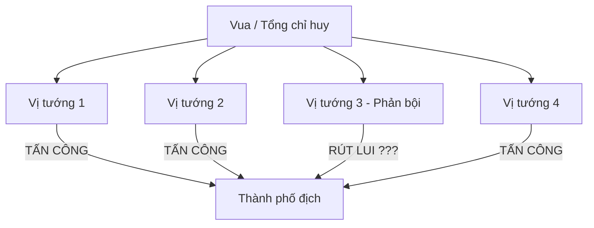
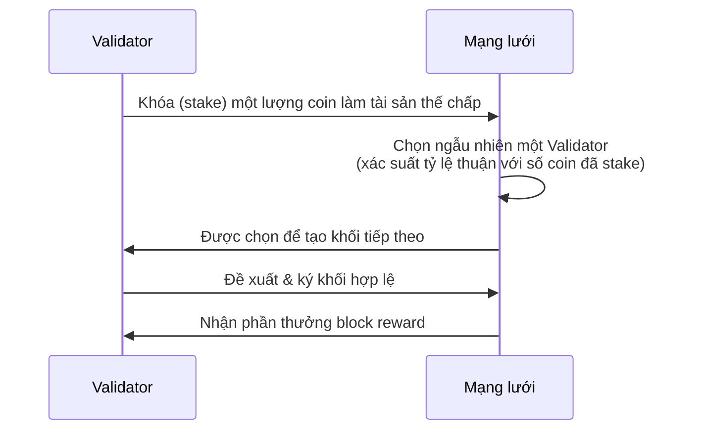

# Buổi 3 - Các Cơ chế Đồng thuận (Consensus Mechanisms)

> **Môn học:** Blockchain: Nền tảng, Ứng dụng & Bảo mật — Buổi 3

---

## 1. Cơ chế Đồng thuận là gì?

Đồng thuận là một quy trình cho phép một nhóm các thực thể (máy tính) **không tin tưởng lẫn nhau** có thể **thống nhất về một trạng thái chung** của hệ thống.

!!! example "Ví dụ trực quan"
    Một nhóm bạn muốn quyết định đi xem phim gì tối nay mà **không có ai là "nhóm trưởng"**. Mọi người phải đề xuất, thảo luận, và bỏ phiếu cho đến khi đa số cùng đồng ý một bộ phim. Quá trình đó chính là "đồng thuận".

---

## 2. Bài toán Các Vị tướng Byzantine

**Các vị tướng Byzantine** là một câu chuyện ẩn dụ nổi tiếng để mô tả vấn đề đồng thuận trong môi trường **không đáng tin cậy**.



- **Tình huống:** Nhiều đạo quân Byzantine bao vây một thành phố địch. Họ phải cùng nhau quyết định "TẤN CÔNG" hay "RÚT LUI".
- **Thử thách:** Họ chỉ có thể liên lạc qua người đưa tin. Một vài vị tướng có thể là **kẻ phản bội**, sẽ gửi thông điệp sai lệch để phá hoại kế hoạch.
- **Câu hỏi:** Cần một chiến lược nào để tất cả các vị tướng trung thành có thể đi đến cùng một quyết định?

### Ánh xạ sang Blockchain

| Thực thể trong câu chuyện | Tương ứng trong Blockchain |
|---|---|
| Các vị tướng | Các node (máy tính) trong mạng lưới |
| Quyết định "Tấn công / Rút lui" | Nội dung của khối tiếp theo (gồm những giao dịch nào) |
| Người đưa tin | Đường truyền Internet |
| **Tướng phản bội** | **Node độc hại (muốn gian lận, double-spend)** |

!!! info "Byzantine Fault Tolerant (BFT)"
    Một cơ chế đồng thuận có khả năng **Chống lỗi Byzantine (Byzantine Fault Tolerant - BFT)** là cơ chế có thể đảm bảo mạng lưới hoạt động ổn định ngay cả khi có một số node gian lận.

---

## 3. Proof of Work (PoW)

Đây là giải pháp được **Satoshi Nakamoto** giới thiệu trong Bitcoin.

!!! quote "Ý tưởng cốt lõi"
    "Để có quyền đề xuất khối tiếp theo, anh phải **chứng minh** rằng anh đã bỏ ra một lượng lớn công sức (năng lực tính toán). Việc này rất tốn kém, khiến cho việc gian lận trở nên **bất lợi về kinh tế**."

→ **Biến việc đồng thuận thành một cuộc thi về sức mạnh tính toán.**

### 3.1 Cơ chế hoạt động — Ẩn dụ Sudoku

Để thêm một trang mới vào sổ cái chung:

- Tất cả "kế toán viên" (thợ đào / miners) phải tham gia giải một **câu đố Sudoku cực khó** (tìm giá trị `nonce` sao cho `hash(block) < target`).
- Giải câu đố này rất **tốn thời gian và công sức** (Work).
- Nhưng một khi ai đó tìm ra lời giải, những người khác có thể **kiểm tra lại đáp án một cách cực kỳ nhanh chóng và dễ dàng**.
- Người giải được đầu tiên sẽ có quyền ghi trang sổ cái mới và **nhận phần thưởng**.

```python
# Minh họa đơn giản quá trình mining PoW
import hashlib

def mine_block(block_data: str, difficulty: int) -> tuple[str, int]:
    target = "0" * difficulty  # Hash phải bắt đầu bằng `difficulty` số 0
    nonce = 0
    while True:
        candidate = f"{block_data}{nonce}"
        hash_result = hashlib.sha256(candidate.encode()).hexdigest()
        if hash_result.startswith(target):
            return hash_result, nonce  # Tìm được nonce hợp lệ!
        nonce += 1

hash_val, nonce = mine_block("Block #100 data...", difficulty=4)
print(f"Found nonce={nonce}, hash={hash_val}")
```

### 3.2 Cơ chế Điều chỉnh Độ khó

Mạng lưới Bitcoin muốn duy trì **thời gian tạo khối trung bình là 10 phút**.

- Nếu có nhiều thợ đào tham gia (tổng sức mạnh tính toán tăng) → các khối sẽ được giải nhanh hơn → **tăng độ khó**.
- Nếu thợ đào rời đi (tổng sức mạnh giảm) → các khối sẽ được giải chậm hơn → **giảm độ khó**.

!!! note "Chu kỳ điều chỉnh"
    Cứ sau **2016 khối** (khoảng 2 tuần), mạng lưới sẽ tự động điều chỉnh độ khó (số lượng số 0 cần tìm) để đưa thời gian về lại mức 10 phút.

### 3.3 Lỗ hổng: Tấn công 51%

!!! danger "Tấn công 51% — Mối đe dọa lý thuyết lớn nhất của PoW"
    Nếu một cá nhân hoặc tổ chức kiểm soát hơn **50% tổng sức mạnh tính toán** của mạng lưới, họ có thể:

    - Tạo ra một chuỗi khối giả mạo **dài hơn** chuỗi thật một cách bí mật.
    - **Đảo ngược** các giao dịch của chính mình (thực hiện **double-spend**).
    - **Ngăn chặn** các giao dịch hợp lệ khác.

    → Trên các mạng lưới lớn như Bitcoin, cuộc tấn công này cực kỳ tốn kém và **gần như bất khả thi**.

### 3.4 Ưu & Nhược điểm của PoW

=== "✅ Ưu điểm"

    | Ưu điểm | Mô tả |
    |---|---|
    | **Bảo mật đã được chứng minh** | Nguyên tắc "chuỗi dài nhất là chuỗi thật" đã bảo vệ Bitcoin hơn một thập kỷ mà không có sự cố lớn. |
    | **Mức độ phi tập trung cao (lý thuyết)** | Bất kỳ ai có phần cứng đều có thể tham gia, không cần cấp phép. |
    | **Đơn giản và mạnh mẽ** | Các quy tắc rõ ràng và dễ kiểm chứng. |

=== "❌ Nhược điểm"

    | Nhược điểm | Mô tả |
    |---|---|
    | **Tiêu thụ năng lượng khổng lồ** | Năng lượng tiêu thụ của Bitcoin có thể ngang bằng một quốc gia. |
    | **Cuộc chạy đua vũ trang phần cứng** | Dẫn đến sự ra đời của máy đào chuyên dụng (ASIC), đào bằng máy tính thông thường trở nên vô ích; nguy cơ tập trung hóa sản xuất phần cứng. |
    | **Tốc độ giao dịch chậm** | Thời gian tạo khối 10 phút của Bitcoin không phù hợp cho các ứng dụng cần tốc độ cao. |

---

## 4. Proof of Stake (PoS)

PoS ra đời để **giải quyết các vấn đề của PoW**, đặc biệt là về năng lượng.

!!! quote "Ý tưởng cốt lõi"
    "Để có quyền đề xuất khối, anh không cần chứng minh công sức, mà phải **đặt cược (stake)** một lượng tài sản của mình. Nếu anh gian lận, anh sẽ bị **phạt và mất số tiền đã cược**."

→ **Thay thế an ninh dựa trên tính toán bằng an ninh dựa trên kinh tế.**

### 4.1 Cơ chế hoạt động — "Xổ số cổ phần"

Trong PoS, thay vì "đào", những người tham gia gọi là **"người xác thực" (validators)**.



- Để tham gia, bạn phải **"khóa"** một lượng coin của mình làm tài sản thế chấp (staking).
- Hệ thống chọn ngẫu nhiên một người xác thực để tạo khối tiếp theo, trong đó **cơ hội được chọn tỷ lệ thuận với số coin đã stake**.
- Càng stake nhiều, cơ hội được chọn càng cao (giống như mua nhiều vé số hơn).

### 4.2 Slashing (Phạt)

!!! warning "Cơ chế Slashing"
    Nếu một người xác thực có **hành vi xấu** (ví dụ: đề xuất một khối không hợp lệ, hoặc cố gắng tấn công mạng), một phần hoặc toàn bộ số coin họ đã stake sẽ bị hệ thống **tịch thu và tiêu hủy**.

- **Củ cà rốt 🥕:** Phần thưởng khi làm việc trung thực.
- **Cây gậy 🥢:** Hình phạt kinh tế nặng nề khi gian lận.

→ Điều này tạo ra **động lực mạnh mẽ** để các validator hành động vì lợi ích tốt nhất của mạng lưới.

### 4.3 Case Study: "The Merge" của Ethereum

??? info "Ethereum chuyển từ PoW sang PoS — Sự kiện lịch sử tháng 9/2022"
    Vào tháng 9 năm 2022, Ethereum — blockchain lớn thứ hai thế giới — đã thực hiện một trong những nâng cấp lịch sử nhất: **chuyển đổi từ PoW sang PoS** (sự kiện gọi là "The Merge").

    **Kết quả:**

    - Mức tiêu thụ năng lượng của mạng lưới Ethereum giảm hơn **99.95%**.
    - Mở đường cho các nâng cấp về khả năng mở rộng trong tương lai.
    - Đây là minh chứng thực tế lớn nhất cho sự thành công của PoS.

### 4.4 Ưu & Nhược điểm của PoS

=== "✅ Ưu điểm"

    | Ưu điểm | Mô tả |
    |---|---|
    | **Hiệu quả năng lượng vượt trội** | Thân thiện với môi trường hơn rất nhiều so với PoW. |
    | **Rào cản tham gia thấp hơn** | Không cần mua sắm phần cứng đắt đỏ, chỉ cần sở hữu coin của mạng lưới. Có thể tăng tính phi tập trung. |
    | **Linh hoạt và nhanh hơn** | Thường cho phép thời gian tạo khối nhanh hơn và thông lượng giao dịch cao hơn. |

=== "❌ Nhược điểm"

    | Nhược điểm | Mô tả |
    |---|---|
    | **"Người giàu càng giàu hơn"** | Những người có nhiều coin nhất sẽ nhận được nhiều phần thưởng nhất, có nguy cơ dẫn đến sự tập trung tài sản. |
    | **Chưa được "thử lửa" lâu dài như PoW** | PoS là một công nghệ mới hơn và các vectơ tấn công vẫn đang được nghiên cứu. |
    | **Rủi ro tập trung hóa Staking** | Nhiều người dùng nhỏ lẻ có xu hướng stake coin thông qua các sàn giao dịch lớn, trao quyền xác thực cho các sàn này. |

---

## 5. So sánh PoW và PoS

| Tiêu chí | Proof of Work (PoW) | Proof of Stake (PoS) |
|---|---|---|
| **Tài nguyên chính** | Năng lượng / Sức mạnh tính toán | Tài sản / Vốn (Coin) |
| **Người tham gia** | Thợ đào (Miners) | Người xác thực (Validators) |
| **Cách chọn người tạo khối** | Cạnh tranh giải đố | Lựa chọn ngẫu nhiên theo cổ phần |
| **Cơ chế chống gian lận** | Chi phí tính toán khổng lồ | Rủi ro mất tài sản (Slashing) |
| **Tiêu thụ năng lượng** | Rất cao | Rất thấp |
| **Ví dụ** | Bitcoin, Litecoin | Ethereum, Cardano, Solana |

---

## 6. Các Cơ chế Đồng thuận Khác

Thế giới cơ chế đồng thuận rất đa dạng. PoW và PoS là hai cơ chế nổi tiếng nhất, nhưng còn có nhiều loại khác:

- **Delegated Proof of Stake (DPoS):** Người dùng bỏ phiếu cho một số lượng "đại biểu" giới hạn để thay mặt họ xác thực giao dịch. Nhanh hơn nhưng tập trung hơn. *(Ví dụ: EOS, Tron)*
- **Proof of Authority (PoA):** Dựa trên danh tính và uy tín của những người xác thực đã được cấp phép. Phù hợp cho các chuỗi riêng tư (private chains).
- Và nhiều cơ chế khác như **Proof of History** (Solana), **Proof of Burn**, ...

---
---

## 🎯 Bộ câu hỏi Trắc nghiệm

---

### Phần 1: Khái niệm Đồng thuận & Byzantine

---

**Câu 1.** Đồng thuận trong Blockchain là gì?

- A. Một quy trình cho phép một nhóm máy tính tin tưởng lẫn nhau đồng bộ dữ liệu.
- B. Một quy trình cho phép các thực thể **không tin tưởng** lẫn nhau **thống nhất về một trạng thái chung** của hệ thống.
- C. Một giao thức mã hóa dữ liệu giữa các node.
- D. Một cơ chế backup dữ liệu phân tán.

??? success "Đáp án"
    **B.** Đồng thuận là quy trình giúp các thực thể không tin tưởng lẫn nhau vẫn có thể thống nhất trạng thái chung — đây chính là bài toán cốt lõi của Blockchain.

---

**Câu 2.** Câu chuyện "Các vị tướng Byzantine" được dùng để ẩn dụ cho vấn đề gì?

- A. Vấn đề tốc độ truyền dữ liệu trong mạng P2P.
- B. Vấn đề bảo mật mật khẩu trong hệ thống phân tán.
- C. Vấn đề **đồng thuận trong môi trường không đáng tin cậy**, khi có một số thực thể độc hại.
- D. Vấn đề mở rộng quy mô (scalability) của Blockchain.

??? success "Đáp án"
    **C.** Câu chuyện mô tả việc đạt được đồng thuận khi tồn tại các "tướng phản bội" — ánh xạ trực tiếp sang bài toán node độc hại trong Blockchain.

---

**Câu 3.** Trong ẩn dụ Byzantine, "người đưa tin" tương ứng với gì trong Blockchain?

- A. Thợ đào (Miners)
- B. Các node xác thực (Validators)
- C. **Đường truyền Internet**
- D. Smart contract

??? success "Đáp án"
    **C.** Người đưa tin chuyển thông điệp giữa các vị tướng, tương tự như Internet chuyển dữ liệu giữa các node.

---

**Câu 4.** "Tướng phản bội" trong câu chuyện Byzantine tương ứng với gì trong Blockchain?

- A. Thợ đào không đủ năng lực
- B. **Node độc hại muốn gian lận hoặc double-spend**
- C. Node bị mất kết nối mạng
- D. Người dùng gửi giao dịch sai định dạng

??? success "Đáp án"
    **B.** Tướng phản bội gửi thông điệp sai lệch → node độc hại cố tình gian lận hoặc double-spend trên mạng Blockchain.

---

**Câu 5.** Byzantine Fault Tolerant (BFT) có nghĩa là gì?

- A. Hệ thống có thể chịu được lỗi phần cứng ngẫu nhiên.
- B. Hệ thống có thể phục hồi sau khi bị tấn công DDoS.
- C. **Hệ thống vẫn hoạt động ổn định ngay cả khi có một số node gian lận (Byzantine).**
- D. Hệ thống có khả năng tự vá lỗi phần mềm.

??? success "Đáp án"
    **C.** BFT là tính chất then chốt — cơ chế đồng thuận đảm bảo mạng lưới không bị phá vỡ bởi các node xấu.

---

**Câu 6.** Quyết định "Tấn công / Rút lui" trong câu chuyện Byzantine tương ứng với gì trong Blockchain?

- A. Lựa chọn giữa PoW và PoS
- B. **Nội dung của khối tiếp theo (gồm những giao dịch nào)**
- C. Kết quả của một smart contract
- D. Khóa công khai hay khóa riêng tư

??? success "Đáp án"
    **B.** Các node phải thống nhất xem khối tiếp theo gồm những giao dịch nào — đó chính là "quyết định" mà tất cả phải đồng ý.

---

### Phần 2: Proof of Work (PoW)

---

**Câu 7.** Proof of Work (PoW) được giới thiệu bởi ai?

- A. Vitalik Buterin
- B. Charles Hoskinson
- C. **Satoshi Nakamoto**
- D. Nick Szabo

??? success "Đáp án"
    **C.** Satoshi Nakamoto giới thiệu PoW trong whitepaper Bitcoin năm 2008.

---

**Câu 8.** Ý tưởng cốt lõi của PoW là gì?

- A. Người có nhiều coin nhất có quyền tạo khối.
- B. Người được tin tưởng nhất có quyền tạo khối.
- C. **Người chứng minh được mình đã bỏ ra nhiều công sức tính toán mới có quyền tạo khối.**
- D. Người đăng ký trước có quyền tạo khối.

??? success "Đáp án"
    **C.** PoW biến việc đồng thuận thành một cuộc thi về sức mạnh tính toán — phải "làm việc" mới được quyền ghi sổ cái.

---

**Câu 9.** Trong ẩn dụ Sudoku về PoW, câu đố Sudoku tương ứng với gì trong thực tế?

- A. Xác minh chữ ký số của giao dịch
- B. Đồng bộ hóa dữ liệu giữa các node
- C. **Tìm giá trị nonce sao cho hash của khối nhỏ hơn giá trị mục tiêu (target)**
- D. Tính toán Merkle root của các giao dịch

??? success "Đáp án"
    **C.** Giải câu đố PoW về bản chất là tìm `nonce` sao cho `SHA256(block header) < target` — rất tốn công nhưng dễ kiểm tra.

---

**Câu 10.** Tại sao PoW hiệu quả trong việc ngăn chặn gian lận?

- A. Vì mỗi giao dịch đều được mã hóa bất đối xứng.
- B. Vì các node luôn theo dõi lẫn nhau.
- C. **Vì việc gian lận đòi hỏi chi phí tính toán khổng lồ, khiến nó bất lợi về kinh tế.**
- D. Vì danh tính của thợ đào được kiểm chứng.

??? success "Đáp án"
    **C.** Chi phí tính toán chính là "chi phí kinh tế" ngăn cản kẻ xấu — gian lận tốn tiền hơn là trung thực.

---

**Câu 11.** Mạng lưới Bitcoin điều chỉnh độ khó sau bao nhiêu khối?

- A. 1000 khối
- B. 1008 khối
- C. **2016 khối**
- D. 4032 khối

??? success "Đáp án"
    **C.** Bitcoin điều chỉnh độ khó mỗi 2016 khối (khoảng 2 tuần) để duy trì thời gian tạo khối trung bình 10 phút.

---

**Câu 12.** Thời gian tạo khối trung bình mục tiêu của Bitcoin là bao lâu?

- A. 1 phút
- B. 5 phút
- C. **10 phút**
- D. 30 phút

??? success "Đáp án"
    **C.** Bitcoin được thiết kế để có thời gian tạo khối trung bình là 10 phút.

---

**Câu 13.** Nếu có nhiều thợ đào tham gia mạng Bitcoin, điều gì xảy ra?

- A. Thời gian tạo khối tăng lên, sau đó hệ thống giảm phần thưởng.
- B. Thời gian tạo khối giảm xuống; sau 2016 khối, hệ thống **tăng độ khó** để kéo thời gian về 10 phút.
- C. Mạng lưới tự động tắt bớt một số node.
- D. Không có gì thay đổi.

??? success "Đáp án"
    **B.** Nhiều thợ đào → tổng hashrate tăng → khối được tạo nhanh hơn → hệ thống tăng độ khó để cân bằng.

---

**Câu 14.** Tấn công 51% trong PoW là gì?

- A. Tấn công vào 51% giao dịch trong một khối.
- B. **Kiểm soát hơn 50% tổng sức mạnh tính toán (hashrate) của mạng lưới để thao túng blockchain.**
- C. Tấn công vào 51% node của mạng lưới bằng DDoS.
- D. Gửi 51% coin của mạng vào một địa chỉ ví.

??? success "Đáp án"
    **B.** Kẻ tấn công chiếm >50% hashrate có thể viết lại lịch sử blockchain và thực hiện double-spend.

---

**Câu 15.** Với tấn công 51% thành công, kẻ tấn công có thể làm gì?

- A. Tạo coin mới từ không khí.
- B. Đánh cắp coin từ ví người khác bất kỳ.
- C. **Đảo ngược giao dịch của chính mình (double-spend) và ngăn chặn giao dịch của người khác.**
- D. Thay đổi toàn bộ giao thức Bitcoin.

??? success "Đáp án"
    **C.** Tấn công 51% không cho phép đánh cắp coin của người khác, nhưng có thể double-spend và kiểm duyệt giao dịch.

---

**Câu 16.** Nguyên tắc "chuỗi dài nhất là chuỗi thật" trong PoW có ý nghĩa gì?

- A. Blockchain có nhiều giao dịch nhất là blockchain hợp lệ.
- B. **Chuỗi có nhiều công sức tính toán tích lũy nhất (dài nhất) được coi là chuỗi hợp lệ mà tất cả node nên tuân theo.**
- C. Blockchain được tạo ra lâu nhất là blockchain chính thống.
- D. Node có lịch sử hoạt động lâu nhất được tin tưởng nhất.

??? success "Đáp án"
    **B.** "Longest chain" rule đảm bảo rằng phiên bản blockchain đòi hỏi nhiều công sức nhất mới được coi là thật.

---

**Câu 17.** ASIC trong bối cảnh PoW là gì?

- A. Một loại thuật toán mã hóa mới
- B. Phần mềm mining chuyên dụng
- C. **Máy đào chuyên dụng (Application-Specific Integrated Circuit) được thiết kế chỉ để giải đố PoW, hiệu quả hơn CPU/GPU nhiều lần.**
- D. Một giao thức kết nối các mining pool

??? success "Đáp án"
    **C.** ASIC là phần cứng tùy chỉnh tối ưu hóa hoàn toàn cho việc tính hash, khiến việc đào bằng máy tính thông thường trở nên vô ích.

---

**Câu 18.** Nhược điểm nào của PoW liên quan đến vấn đề môi trường?

- A. Sản xuất phần cứng tạo ra nhiều rác thải nhựa.
- B. **Tiêu thụ điện năng khổng lồ, năng lượng tiêu thụ của Bitcoin có thể ngang bằng một quốc gia.**
- C. Các thợ đào thải ra khí CO2 trực tiếp.
- D. Blockchain PoW lưu trữ quá nhiều dữ liệu, tốn tài nguyên lưu trữ.

??? success "Đáp án"
    **B.** Điện năng tiêu thụ là nhược điểm môi trường chính, bị chỉ trích nặng nề nhất của PoW.

---

**Câu 19.** Ưu điểm nào của PoW liên quan đến phi tập trung?

- A. Chỉ những tổ chức lớn mới có thể tham gia.
- B. **Về mặt lý thuyết, bất kỳ ai có phần cứng đều có thể tham gia mà không cần xin phép.**
- C. Hệ thống tự động phân phối đều quyền lực cho tất cả node.
- D. Chính phủ không thể kiểm soát được mining.

??? success "Đáp án"
    **B.** PoW là permissionless — ai cũng có thể mua phần cứng và tham gia đào. Tuy nhiên thực tế ASIC đã làm giảm tính phi tập trung này.

---

**Câu 20.** Blockchain nào sau đây dùng PoW?

- A. Ethereum (hiện tại)
- B. Cardano
- C. Solana
- D. **Bitcoin và Litecoin**

??? success "Đáp án"
    **D.** Bitcoin và Litecoin là các blockchain PoW tiêu biểu. Ethereum đã chuyển sang PoS vào tháng 9/2022.

---

### Phần 3: Proof of Stake (PoS)

---

**Câu 21.** PoS ra đời nhằm giải quyết vấn đề gì của PoW?

- A. Tốc độ đồng bộ hóa dữ liệu giữa các node
- B. Khả năng mở rộng của smart contract
- C. **Đặc biệt là vấn đề tiêu thụ năng lượng khổng lồ**
- D. Vấn đề ẩn danh của người dùng

??? success "Đáp án"
    **C.** PoS được thiết kế để loại bỏ nhu cầu tính toán tốn kém, thay bằng tài sản thế chấp kinh tế.

---

**Câu 22.** Ý tưởng cốt lõi của PoS là gì?

- A. Quyền tạo khối tỷ lệ với năng lực tính toán.
- B. Quyền tạo khối được xác định bởi tuổi của node trong mạng.
- C. **Phải đặt cược (stake) tài sản để có quyền tạo khối; gian lận sẽ bị phạt mất tài sản đó.**
- D. Quyền tạo khối được bỏ phiếu bởi cộng đồng.

??? success "Đáp án"
    **C.** PoS thay thế an ninh tính toán bằng an ninh kinh tế: bạn phải có "da thịt trong cuộc chơi".

---

**Câu 23.** Trong PoS, "staking" là gì?

- A. Quá trình giải đố mật mã để tạo khối
- B. **Khóa một lượng coin làm tài sản thế chấp để tham gia xác thực**
- C. Quá trình bầu chọn đại biểu
- D. Việc giao coin cho sàn giao dịch quản lý

??? success "Đáp án"
    **B.** Staking là hành động "khóa" coin vào hệ thống — coin này có thể bị tịch thu nếu validator hành xử xấu.

---

**Câu 24.** Trong PoS, cơ hội được chọn làm người tạo khối phụ thuộc vào điều gì?

- A. Tốc độ xử lý của máy tính validator
- B. Thời gian validator đã tham gia mạng lưới
- C. Số lượng giao dịch validator đã xác nhận trước đó
- D. **Số lượng coin validator đã stake (tỷ lệ thuận)**

??? success "Đáp án"
    **D.** Giống như mua vé số — stake nhiều hơn = có nhiều "vé" hơn = xác suất được chọn cao hơn.

---

**Câu 25.** "Slashing" trong PoS là gì?

- A. Cơ chế chia phần thưởng cho các validator
- B. Quá trình unstake coin sau một thời gian
- C. **Cơ chế phạt bằng cách tịch thu và tiêu hủy coin của validator có hành vi xấu**
- D. Quá trình cập nhật phần mềm cho validator

??? success "Đáp án"
    **C.** Slashing là "cây gậy" — hình phạt kinh tế nặng nề để ngăn validator hành động xấu.

---

**Câu 26.** Trong bài học, "củ cà rốt" và "cây gậy" trong PoS tương ứng với gì?

- A. Lãi suất stake và phí giao dịch
- B. **Phần thưởng khi trung thực (củ cà rốt) và Slashing khi gian lận (cây gậy)**
- C. Coin mới được mint và coin bị đốt
- D. Block reward và transaction fee

??? success "Đáp án"
    **B.** Hệ thống đòn bẩy hai chiều: khuyến khích làm đúng và trừng phạt nặng khi làm sai.

---

**Câu 27.** Sự kiện "The Merge" của Ethereum diễn ra vào thời điểm nào?

- A. Tháng 1 năm 2020
- B. Tháng 12 năm 2021
- C. **Tháng 9 năm 2022**
- D. Tháng 3 năm 2023

??? success "Đáp án"
    **C.** The Merge diễn ra vào tháng 9/2022, đánh dấu Ethereum chuyển từ PoW sang PoS.

---

**Câu 28.** Sau "The Merge", mức tiêu thụ năng lượng của Ethereum thay đổi như thế nào?

- A. Giảm khoảng 50%
- B. Giảm khoảng 80%
- C. Giảm khoảng 95%
- D. **Giảm hơn 99.95%**

??? success "Đáp án"
    **D.** Đây là con số ấn tượng nhất của The Merge — từ PoW sang PoS giảm điện năng tiêu thụ gần như hoàn toàn.

---

**Câu 29.** Nhược điểm "người giàu càng giàu hơn" của PoS đề cập đến điều gì?

- A. Validator giàu có trả phí giao dịch thấp hơn.
- B. Người sở hữu phần cứng tốt kiếm được nhiều hơn.
- C. **Người stake nhiều coin nhất nhận được nhiều phần thưởng nhất, dẫn đến nguy cơ tập trung tài sản.**
- D. Những node lâu đời hơn có ưu thế hơn node mới.

??? success "Đáp án"
    **C.** Đây là vấn đề về phân phối tài sản trong PoS — người giàu tiếp tục giàu hơn thông qua staking rewards.

---

**Câu 30.** Rủi ro "tập trung hóa Staking" trong PoS đến từ đâu?

- A. Giao thức PoS ưu ái validator lớn.
- B. **Người dùng nhỏ lẻ stake coin qua các sàn giao dịch lớn, trao quyền xác thực cho các sàn này.**
- C. Phần thưởng staking chỉ dành cho validator đã hoạt động hơn 1 năm.
- D. Chỉ những validator sở hữu domain name mới được tham gia.

??? success "Đáp án"
    **B.** Khi Coinbase, Binance,... nắm phần lớn staking ETH, tính phi tập trung thực sự bị đe dọa.

---

**Câu 31.** Blockchain nào sau đây dùng PoS (sau The Merge)?

- A. Bitcoin
- B. Litecoin
- C. **Ethereum, Cardano, Solana**
- D. Monero

??? success "Đáp án"
    **C.** Ethereum (sau 9/2022), Cardano và Solana đều dùng các biến thể của PoS. Bitcoin vẫn dùng PoW.

---

**Câu 32.** Điểm khác biệt căn bản nhất giữa "Miners" (PoW) và "Validators" (PoS) là gì?

- A. Validators cần phần cứng tốt hơn Miners.
- B. Miners được phần thưởng cao hơn Validators.
- C. **Miners cạnh tranh bằng sức mạnh tính toán; Validators được chọn ngẫu nhiên theo tỷ lệ tài sản đã stake.**
- D. Validators chỉ kiểm tra giao dịch, không tạo khối mới.

??? success "Đáp án"
    **C.** Đây là sự khác biệt cơ chế cốt lõi giữa hai hệ thống.

---

### Phần 4: So sánh PoW và PoS

---

**Câu 33.** Tài nguyên chính của PoW là gì?

- A. Tài sản / Vốn (Coin)
- B. Danh tiếng / Uy tín
- C. **Năng lượng / Sức mạnh tính toán**
- D. Số lượng giao dịch đã xác thực

??? success "Đáp án"
    **C.** PoW dùng điện và phần cứng tính toán làm "tài nguyên đầu vào" để giành quyền tạo khối.

---

**Câu 34.** Cơ chế chống gian lận của PoW và PoS lần lượt là gì?

- A. Chữ ký số / Mã hóa bất đối xứng
- B. **Chi phí tính toán khổng lồ / Rủi ro mất tài sản (Slashing)**
- C. Kiểm tra danh tính / Bỏ phiếu cộng đồng
- D. Giới hạn tốc độ giao dịch / Phí giao dịch cao

??? success "Đáp án"
    **B.** Cả hai đều dùng đòn bẩy kinh tế: PoW tốn tiền điện khi gian lận, PoS mất tiền cọc khi gian lận.

---

**Câu 35.** So về tiêu thụ năng lượng, PoS có ưu thế như thế nào so với PoW?

- A. PoS tiêu thụ ít hơn khoảng 10-20%
- B. PoS tiêu thụ ít hơn khoảng 50%
- C. Cả hai tương đương nhau về năng lượng
- D. **PoS tiêu thụ ít hơn rất nhiều (minh chứng: Ethereum giảm >99.95% sau The Merge)**

??? success "Đáp án"
    **D.** The Merge là bằng chứng thực tế rõ ràng nhất cho ưu thế năng lượng áp đảo của PoS.

---

**Câu 36.** Về "rào cản tham gia", PoS có ưu thế gì so với PoW?

- A. PoS không yêu cầu kiến thức kỹ thuật.
- B. PoS cho phép mọi người tham gia hoàn toàn miễn phí.
- C. **PoS không yêu cầu mua phần cứng đắt đỏ — chỉ cần sở hữu coin của mạng lưới.**
- D. PoS có phần thưởng tham gia cao hơn PoW.

??? success "Đáp án"
    **C.** PoW đòi hỏi đầu tư phần cứng (ASIC), trong khi PoS chỉ cần "vốn" là coin.

---

**Câu 37.** PoW có ưu điểm gì về mặt bảo mật so với PoS?

- A. PoW có thể chống lại lượng tử máy tính.
- B. PoW sử dụng thuật toán mã hóa mạnh hơn.
- C. **PoW đã được "thử lửa" và chứng minh bảo mật thực tế trong hơn một thập kỷ với mạng Bitcoin.**
- D. PoW không thể bị fork.

??? success "Đáp án"
    **C.** Bitcoin PoW hoạt động hơn 15 năm mà không bị hack thành công — đây là track record bảo mật rất ấn tượng.

---

**Câu 38.** Tại sao PoS thường cho phép tốc độ giao dịch nhanh hơn PoW?

- A. PoS dùng thuật toán hash nhanh hơn.
- B. PoS giới hạn kích thước của mỗi giao dịch.
- C. **PoS không cần cạnh tranh giải đố tốn thời gian, cho phép tạo khối nhanh hơn và thông lượng cao hơn.**
- D. PoS nén dữ liệu giao dịch hiệu quả hơn.

??? success "Đáp án"
    **C.** Không có mining competition → thời gian tạo khối linh hoạt và có thể rất ngắn (Solana ~400ms).

---

### Phần 5: Các cơ chế Đồng thuận khác

---

**Câu 39.** DPoS (Delegated Proof of Stake) là gì?

- A. PoS kết hợp với đào coin (mining).
- B. **Người dùng bỏ phiếu cho một số lượng "đại biểu" giới hạn để thay mặt họ xác thực giao dịch.**
- C. PoS chỉ dành cho các tổ chức doanh nghiệp.
- D. Phiên bản PoS yêu cầu stake coin trực tiếp vào giao thức.

??? success "Đáp án"
    **B.** DPoS dùng hệ thống đại diện — giống dân chủ đại nghị, nhanh hơn nhưng tập trung hơn.

---

**Câu 40.** Ví dụ nào sau đây sử dụng DPoS?

- A. Bitcoin và Litecoin
- B. Ethereum và Cardano
- C. **EOS và Tron**
- D. Solana và Avalanche

??? success "Đáp án"
    **C.** EOS và Tron là các blockchain DPoS tiêu biểu, sử dụng hệ thống 21-27 đại biểu được bầu chọn.

---

**Câu 41.** Proof of Authority (PoA) phù hợp với loại blockchain nào?

- A. Mạng lưới công cộng hoàn toàn phi tập trung như Bitcoin
- B. Hệ thống tài chính phi tập trung (DeFi)
- C. **Chuỗi riêng tư (private chains) nơi các validator đã được cấp phép và có danh tính rõ ràng**
- D. Mạng lưới ngang hàng (P2P) không cần tin cậy

??? success "Đáp án"
    **C.** PoA hy sinh tính phi tập trung để đổi lấy tốc độ và hiệu quả — phù hợp blockchain doanh nghiệp.

---

**Câu 42.** Proof of History (PoH) được sử dụng bởi blockchain nào?

- A. Cardano
- B. Avalanche
- C. **Solana**
- D. Tron

??? success "Đáp án"
    **C.** Solana dùng Proof of History như một cơ chế ghi nhận thứ tự thời gian, kết hợp với PoS để đạt tốc độ cực cao.

---

**Câu 43.** DPoS khác PoS thông thường như thế nào?

- A. DPoS không yêu cầu stake coin.
- B. DPoS có thể chống lại tấn công 51% tốt hơn.
- C. **DPoS dùng hệ thống đại biểu được bầu chọn, nhanh hơn nhưng tập trung hơn PoS thông thường.**
- D. DPoS yêu cầu phần cứng chuyên dụng như PoW.

??? success "Đáp án"
    **C.** DPoS là đánh đổi: lấy tốc độ và hiệu quả, hy sinh một phần tính phi tập trung.

---

### Phần 6: Câu hỏi tổng hợp & phân tích

---

**Câu 44.** Tại sao việc kiểm tra đáp án của PoW lại nhanh hơn rất nhiều so với việc tìm đáp án?

- A. Vì các node dùng phần cứng tốt hơn thợ đào để kiểm tra.
- B. Vì chỉ cần kiểm tra 1 lần, trong khi tìm đáp án phải thử hàng tỷ lần.
- C. **Vì tính chất one-way của hàm hash: tính hash của một giá trị cho trước rất nhanh, nhưng tìm ngược lại rất khó.**
- D. Vì mạng lưới chia sẻ kết quả kiểm tra song song.

??? success "Đáp án"
    **C.** Đây là nền tảng cryptographic của PoW — SHA256 là hàm một chiều, dễ tính thuận nhưng không thể đảo ngược.

---

**Câu 45.** Nếu bạn muốn xây dựng một ứng dụng thanh toán cần xử lý hàng nghìn giao dịch mỗi giây, bạn nên ưu tiên cơ chế đồng thuận nào?

- A. PoW vì bảo mật cao nhất
- B. **PoS hoặc DPoS vì tốc độ cao và thông lượng tốt hơn nhiều so với PoW**
- C. PoW vì đơn giản và dễ triển khai
- D. PoA vì không cần năng lượng

??? success "Đáp án"
    **B.** Bitcoin PoW chỉ xử lý ~7 TPS trong khi Solana (PoS/PoH) xử lý hàng chục nghìn TPS.

---

**Câu 46.** Vì sao tấn công 51% trên Bitcoin (PoW) được coi là "gần như bất khả thi" trong thực tế?

- A. Vì Bitcoin được bảo vệ bởi pháp luật quốc tế.
- B. Vì không ai có thể mua được đủ phần cứng ASIC.
- C. **Vì chi phí để mua/thuê >50% hashrate toàn mạng Bitcoin cực kỳ khổng lồ, vượt xa lợi nhuận có thể thu được.**
- D. Vì hệ thống tự động phát hiện và chặn cuộc tấn công.

??? success "Đáp án"
    **C.** Kinh tế học là lớp bảo vệ thực sự — chi phí tấn công vượt xa lợi nhuận kỳ vọng.

---

**Câu 47.** Vấn đề "tập trung hóa sản xuất phần cứng" trong PoW đề cập đến rủi ro gì?

- A. Một công ty có thể độc quyền sản xuất phần mềm mining.
- B. **Nếu chỉ một số ít công ty sản xuất ASIC, họ có thể kiểm soát việc ai được khai thác và tạo ra điểm tập trung trong một hệ thống "phi tập trung".**
- C. Các thợ đào bị phụ thuộc vào nhà cung cấp điện duy nhất.
- D. Việc sản xuất ASIC tạo ra quá nhiều rác thải điện tử.

??? success "Đáp án"
    **B.** Thực tế Bitmain (công ty Trung Quốc) từng chiếm phần lớn thị trường ASIC, tạo ra rủi ro tập trung hóa đáng lo ngại.

---

**Câu 48.** Tại sao "The Merge" của Ethereum được coi là "minh chứng thực tế lớn nhất cho sự thành công của PoS"?

- A. Vì Ethereum là blockchain đầu tiên trên thế giới.
- B. Vì sau The Merge, giá ETH tăng mạnh nhất lịch sử.
- C. **Vì Ethereum là blockchain lớn thứ hai thế giới đã chuyển đổi thành công sang PoS mà không gián đoạn mạng lưới, giảm >99.95% năng lượng.**
- D. Vì The Merge là lần đầu tiên PoS được sử dụng trong blockchain.

??? success "Đáp án"
    **C.** Việc hệ thống hàng trăm tỷ USD chuyển đổi cơ chế đồng thuận thành công là bằng chứng kỹ thuật rất thuyết phục.

---

**Câu 49.** Trong PoS, nếu một validator đề xuất hai khối mâu thuẫn nhau cho cùng một slot (hành vi "double voting"), điều gì xảy ra?

- A. Hệ thống chọn khối hợp lệ hơn và bỏ qua lỗi.
- B. Validator bị loại khỏi tập validator nhưng không mất coin.
- C. Không có hậu quả, vì hệ thống tự giải quyết.
- D. **Đây là ví dụ điển hình của hành vi bị Slashing — validator bị tịch thu và tiêu hủy một phần hoặc toàn bộ coin đã stake.**

??? success "Đáp án"
    **D.** Double voting (equivocation) là một trong những hành vi bị Slashing nghiêm trọng nhất trong PoS.

---

**Câu 50.** Câu nào sau đây mô tả **chính xác nhất** sự khác biệt triết học cốt lõi giữa PoW và PoS?

- A. PoW dùng toán học, PoS dùng uy tín xã hội.
- B. PoW hoạt động ngoại tuyến, PoS hoạt động trực tuyến.
- C. **PoW bảo đảm an ninh bằng chi phí vật lý/năng lượng bên ngoài hệ thống; PoS bảo đảm an ninh bằng tài sản kinh tế bên trong chính hệ thống.**
- D. PoW là cơ chế phi tập trung, PoS là cơ chế tập trung.

??? success "Đáp án"
    **C.** Đây là sự phân biệt triết học quan trọng nhất: PoW dựa vào thế giới vật lý (điện, phần cứng), PoS dựa vào kinh tế nội tại của chính blockchain.

---

**Câu 51.** So sánh nhược điểm bảo mật: PoW có tấn công 51%, PoS có vấn đề bảo mật tương ứng nào?

- A. Tấn công Sybil (tạo nhiều danh tính giả)
- B. **Chưa được "thử lửa" lâu dài như PoW; các vectơ tấn công mới vẫn đang được nghiên cứu, cộng thêm nguy cơ từ tập trung hóa staking.**
- C. Dễ bị tấn công lượng tử hơn PoW
- D. Các validator có thể tắt node bất cứ lúc nào mà không bị phạt

??? success "Đáp án"
    **B.** PoS còn tương đối non trẻ về thực chiến; PoW đã "chiến đấu và sống sót" trong 15+ năm.

---

**Câu 52.** Tại sao PoA **không phù hợp** cho các blockchain công cộng hoàn toàn phi tập trung?

- A. PoA tiêu tốn quá nhiều năng lượng.
- B. PoA không hỗ trợ smart contract.
- C. **PoA dựa hoàn toàn vào danh tính và uy tín của validator đã được cấp phép — điều này tạo ra điểm kiểm soát tập trung, vi phạm tính permissionless của blockchain công cộng.**
- D. PoA quá chậm cho mạng lưới lớn.

??? success "Đáp án"
    **C.** PoA về bản chất là "tin tưởng bên thứ ba có uy tín" — phù hợp consortium/private blockchain nhưng không phải public blockchain.

---

> 🎓 **Tổng kết:** Bộ 52 câu hỏi trên bao phủ toàn bộ nội dung buổi học, từ khái niệm đồng thuận, Byzantine, PoW (cơ chế, điều chỉnh độ khó, tấn công 51%, ưu/nhược điểm), PoS (cơ chế, Slashing, The Merge, ưu/nhược điểm), so sánh hai cơ chế, đến các biến thể khác (DPoS, PoA, PoH).
