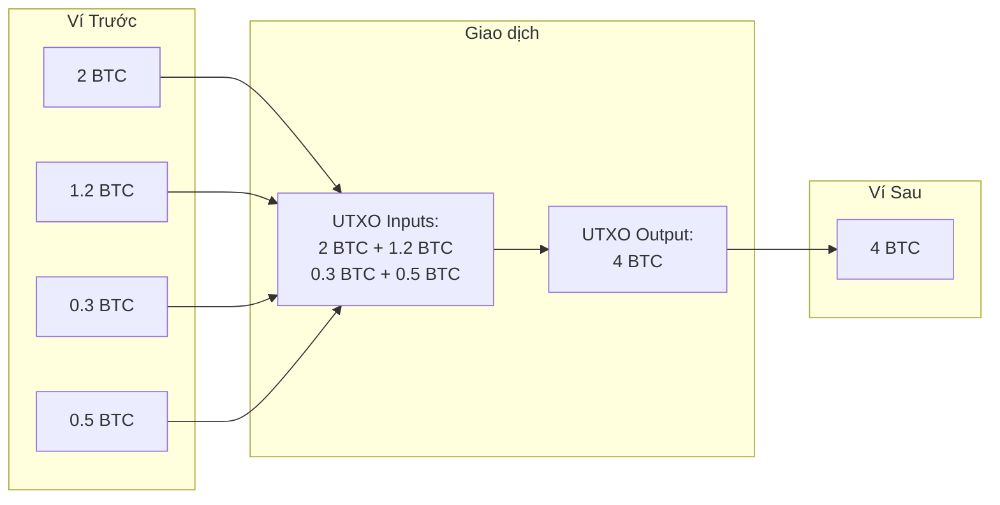
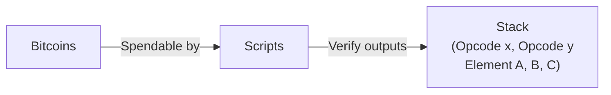
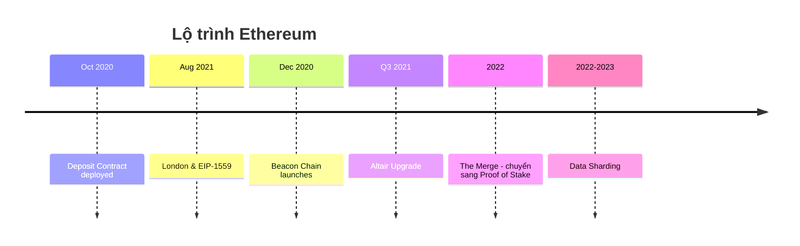
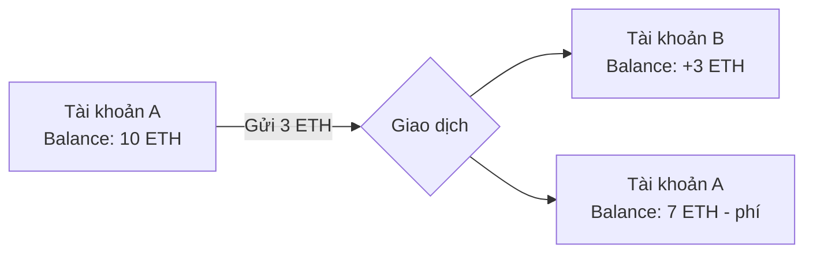
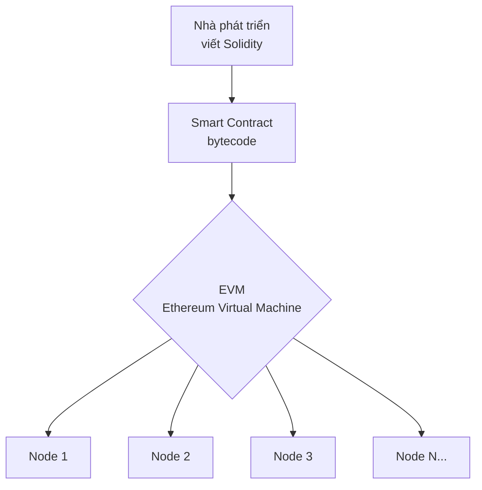

# Buổi 4 - Phân Tích Chuyên Sâu: Bitcoin và Ethereum

---

## 1. Hai Gã Khổng Lồ, Hai Tầm Nhìn

> Nếu coi Blockchain là một cuộc cách mạng, Bitcoin và Ethereum là hai người tiên phong với hai triết lý hoàn toàn khác nhau.

| | Bitcoin (2009) | Ethereum (2015) |
|---|---|---|
| Biệt danh | 🥇 "Vàng kỹ thuật số" | 🤖 "Máy tính Thế giới" |
| Tầm nhìn | Hệ thống tiền tệ phi tập trung, an toàn, nguồn cung giới hạn | Nền tảng xây dựng ứng dụng phi tập trung không thể bị kiểm duyệt |

---

## 2. Bitcoin — Người Tiên Phong

### 2.1 Triết Lý Sáng Lập

- Ra đời từ **khủng hoảng tài chính 2008**, nhằm tạo ra hệ thống tài chính **P2P (Ngang hàng)**
- Loại bỏ sự cần thiết của các trung gian tài chính (ngân hàng, chính phủ)
- Đề cao tính **bảo mật, phi tập trung, và chống kiểm duyệt**
- Tầm nhìn cốt lõi được nêu rõ trong **Whitepaper của Satoshi Nakamoto**

---

### 2.2 Chính Sách Tiền Tệ

!!! success "Tổng cung cố định: 21 triệu BTC"
    Đây là một trong những đặc tính quan trọng nhất, tạo ra sự **khan hiếm** và **chống lạm phát**.

#### Cơ chế Halving

- Cứ sau **210.000 khối** (~4 năm), phần thưởng khối cho thợ đào giảm đi **một nửa**
- Lộ trình phần thưởng:

```
50 BTC → 25 BTC → 12.5 BTC → 6.25 BTC → 3.125 BTC → ...
```

- Sự kiện này làm **giảm tốc độ tạo ra BTC mới**, khiến nó ngày càng khan hiếm hơn

---

### 2.3 Kiến Trúc Cốt Lõi: Mô Hình UTXO

!!! info "UTXO = Unspent Transaction Output (Đầu ra Giao dịch Chưa được chi tiêu)"

> Hãy quên khái niệm "số dư tài khoản". Ví Bitcoin của bạn **không chứa một con số duy nhất**. Thay vào đó, nó chứa một tập hợp các "tờ tiền" và "tiền xu" kỹ thuật số.

**Ví dụ:**

```
Ví của bạn chứa:
  - UTXO #1: 1.0 BTC
  - UTXO #2: 0.5 BTC
  - UTXO #3: 0.1 BTC
  ──────────────────
  Tổng:      1.6 BTC  (gồm 3 "mảnh" riêng biệt)
```

#### Mô phỏng giao dịch UTXO (UTXO Consolidation)



---

### 2.4 Phân Tích Mô Hình UTXO

=== "Ưu điểm"

    - **Tăng cường quyền riêng tư:** Người dùng có thể tạo địa chỉ mới cho mỗi lần nhận tiền (tiền thối), gây khó khăn cho việc theo dõi chuỗi giao dịch
    - **Khả năng xử lý song song:** Các giao dịch không liên quan đến nhau có thể được xác thực đồng thời, vì chúng không ảnh hưởng đến một "trạng thái" chung

=== "Nhược điểm"

    - **Phức tạp:** Khó lập trình và quản lý hơn so với mô hình tài khoản
    - **Lưu trữ kém hiệu quả:** Phải lưu trữ tất cả các UTXO, có thể trở nên cồng kềnh

---

### 2.5 Ngôn Ngữ Script của Bitcoin



!!! warning "Không phải Turing-complete — có chủ đích"
    Bitcoin Script **không hỗ trợ các vòng lặp phức tạp**, nhằm mục đích:

    - Giới hạn các loại giao dịch có thể thực hiện
    - Tối đa hóa bảo mật và **giảm bề mặt tấn công**

> **Nhiệm vụ chính của Script:** Trả lời câu hỏi duy nhất — *"Giao dịch này có được phép chi tiêu UTXO này không?"*

---

### 2.6 Hạn Chế và Di Sản

!!! failure "Hạn chế"
    - **Thông lượng thấp:** ~3–7 giao dịch/giây (TPS)
    - **Thời gian tạo khối chậm:** ~10 phút/khối
    - **Khả năng lập trình hạn chế:** Rất khó xây dựng DeFi, NFTs trực tiếp trên Bitcoin

!!! quote "Di sản"
    *"Bitcoin đã chứng minh rằng một hệ thống tài chính phi tập trung, an toàn là khả thi. Nó đã đặt nền móng và là nguồn cảm hứng cho tất cả những gì ra đời sau nó."*

---

## 3. Ethereum — Cỗ Máy Tính Toán Toàn Cầu

### 3.1 Triết Lý Sáng Lập

- **Vitalik Buterin** nhận ra hạn chế của Bitcoin: chỉ là "máy tính bỏ túi" cho một ứng dụng duy nhất (tiền tệ)
- Tầm nhìn Ethereum: Tạo ra một **"chiếc điện thoại thông minh"** — nền tảng mở để bất kỳ ai xây dựng DApps
- Khẩu hiệu: **"One blockchain to rule them all"**

---

### 3.2 Chính Sách Tiền Tệ

!!! info "Không có tổng cung cố định"
    Ban đầu ETH có chính sách lạm phát có thể dự đoán để trả thưởng cho thợ đào PoW.

**Sau The Merge (chuyển sang PoS):**

- Lượng ETH mới phát hành giảm ~**90%**
- **Cơ chế đốt phí EIP-1559:** Một phần phí giao dịch bị tiêu hủy vĩnh viễn
- Khi mạng lưới sôi nổi → lượng ETH đốt > lượng phát hành → ETH trở thành tài sản **giảm phát (deflationary)**



---

### 3.3 Kiến Trúc Cốt Lõi: Mô Hình Tài Khoản

> Ethereum sử dụng mô hình trực quan hơn, **giống như tài khoản ngân hàng truyền thống**.

- Hệ thống lưu trữ danh sách tất cả tài khoản và **số dư (balance)**
- Một giao dịch = thông điệp làm thay đổi số dư: trừ tiền người gửi, cộng tiền người nhận
- Đây là **hệ thống chuyển đổi trạng thái (state transition system)** — mỗi khối mới cập nhật "trạng thái" chung của toàn hệ thống



---

### 3.4 Phân Tích Mô Hình Tài Khoản

=== "Ưu điểm"

    - **Đơn giản và trực quan:** Dễ hiểu cho nhà phát triển và người dùng
    - **Hiệu quả lưu trữ:** Chỉ cần lưu một giá trị số dư cho mỗi tài khoản
    - **Thân thiện với Hợp đồng thông minh:** Dễ dàng cho một hợp đồng tương tác với nhiều tài khoản khác

=== "Nhược điểm"

    - **Yêu cầu xử lý tuần tự:** Các giao dịch từ cùng một tài khoản phải xử lý theo thứ tự → hạn chế song song hóa
    - **Rủi ro Tấn công Tái nhập (Reentrancy):** Lỗ hổng bảo mật kinh điển do bản chất mô hình này

---

### 3.5 Trái Tim của Ethereum: EVM & Turing-Completeness

#### Máy ảo Ethereum (EVM — Ethereum Virtual Machine)



- Là môi trường thực thi **bị cô lập hoàn toàn** — giống một "CPU phi tập trung"
- **Mọi node** trong mạng Ethereum đều chạy một bản sao của EVM để xử lý giao dịch và hợp đồng thông minh

#### Tính Turing-Complete

!!! success "Bước nhảy vọt so với Bitcoin"
    EVM có thể **thực thi bất kỳ đoạn mã nào**, miễn là có đủ "nhiên liệu" (Gas).
    Cho phép tạo ứng dụng với logic phức tạp không giới hạn: game, sàn giao dịch, hệ thống bỏ phiếu...

---

### 3.6 Gas: Nhiên Liệu cho Cỗ Máy Thế Giới

!!! tip "Ví von"
    Nếu **EVM** là động cơ, thì **Gas** chính là xăng.

**Tại sao cần Gas?**

1. **Ngăn chặn vòng lặp vô hạn:** Vì EVM là Turing-complete, một hợp đồng có thể chứa lỗi và chạy mãi mãi. Gas đảm bảo nó sẽ hết "nhiên liệu" và dừng lại.
2. **Bù đắp chi phí tính toán:** Trả công cho các validator đã dùng tài nguyên máy tính để thực thi mã.

---

### 3.7 Cấu Trúc Phí Giao Dịch

!!! abstract "Công thức tính phí"
    ```
    Phí Giao dịch = Gas Used (Lượng gas đã dùng) × Gas Price (Giá gas)
    ```

| Thành phần | Ý nghĩa |
|---|---|
| **Gas Limit** | Lượng gas tối đa bạn sẵn sàng chi. Đặt quá thấp → giao dịch thất bại |
| **Gas Price** | Giá trả cho mỗi đơn vị gas, đo bằng **Gwei**. Biến động theo mức độ tắc nghẽn mạng |

---

## 4. So Sánh Trực Diện

| Tiêu chí | Bitcoin | Ethereum |
|---|---|---|
| **Mục đích** | Tiền tệ P2P / Lưu trữ giá trị | Nền tảng Hợp đồng thông minh |
| **Người sáng lập** | Satoshi Nakamoto (ẩn danh) | Vitalik Buterin & Team |
| **Mô hình Giao dịch** | UTXO (Giống tiền mặt) | Tài khoản (Giống ngân hàng) |
| **Khả năng Lập trình** | Script (Không Turing-complete) | Solidity (Turing-complete) |
| **Cơ chế Đồng thuận** | Proof of Work (PoW) | Proof of Stake (PoS) |
| **Chính sách Tiền tệ** | Cung cố định 21 triệu (Giảm phát) | Không cố định (Có thể giảm phát) |
| **Thời gian tạo khối** | ~10 phút | ~12 giây |
| **Đơn vị nhỏ nhất** | 1 Satoshi | 1 Wei |
| **Ví von** | Vàng Kỹ thuật số 🥇 | Máy tính Thế giới 🤖 |

!!! note "Kết luận"
    Bitcoin và Ethereum **không phải là đối thủ cạnh tranh trực tiếp**, mà chúng tối ưu cho các mục đích sử dụng khác nhau.

---
---

# 🧠 Bộ Câu Hỏi Trắc Nghiệm — Buổi 4

---

**Câu 1.** Bitcoin ra đời vào năm nào?

- A. 2007
- B. 2008
- C. 2009
- D. 2010

??? success "Đáp án: C"
    Bitcoin ra đời năm **2009**, được phát hành bởi Satoshi Nakamoto sau khủng hoảng tài chính 2008.

---

**Câu 2.** Ethereum ra đời vào năm nào?

- A. 2013
- B. 2014
- C. 2015
- D. 2016

??? success "Đáp án: C"
    Ethereum ra đời năm **2015**.

---

**Câu 3.** Bitcoin được ví von là gì?

- A. Máy tính thế giới
- B. Vàng kỹ thuật số
- C. Ngân hàng phi tập trung
- D. Internet of Money

??? success "Đáp án: B"
    Bitcoin được ví von là **"Vàng kỹ thuật số"** — lưu trữ giá trị, khan hiếm, và chống lạm phát.

---

**Câu 4.** Ethereum được ví von là gì?

- A. Vàng kỹ thuật số
- B. Ngân hàng thế giới
- C. Máy tính thế giới
- D. Tiền tệ toàn cầu

??? success "Đáp án: C"
    Ethereum được ví von là **"Máy tính Thế giới"** — nền tảng để xây dựng ứng dụng phi tập trung.

---

**Câu 5.** Tổng cung tối đa của Bitcoin là bao nhiêu?

- A. 18 triệu BTC
- B. 19 triệu BTC
- C. 21 triệu BTC
- D. Không giới hạn

??? success "Đáp án: C"
    Bitcoin có tổng cung cố định là **21 triệu BTC**, tạo ra sự khan hiếm và chống lạm phát.

---

**Câu 6.** Ethereum có tổng cung cố định không?

- A. Có, 100 triệu ETH
- B. Có, 21 triệu ETH
- C. Không có tổng cung cố định
- D. Có, 1 tỷ ETH

??? success "Đáp án: C"
    Ethereum **không có tổng cung cố định**. Chính sách tiền tệ của ETH linh hoạt và có thể điều chỉnh.

---

**Câu 7.** Sự kiện Halving của Bitcoin xảy ra sau mỗi bao nhiêu khối?

- A. 100.000 khối
- B. 150.000 khối
- C. 210.000 khối
- D. 420.000 khối

??? success "Đáp án: C"
    Halving xảy ra sau mỗi **210.000 khối**, tương đương khoảng 4 năm.

---

**Câu 8.** Phần thưởng khối Bitcoin ban đầu là bao nhiêu?

- A. 25 BTC
- B. 50 BTC
- C. 100 BTC
- D. 12.5 BTC

??? success "Đáp án: B"
    Phần thưởng ban đầu là **50 BTC/khối**, sau đó giảm dần qua mỗi lần Halving.

---

**Câu 9.** UTXO là viết tắt của từ gì?

- A. Unified Transaction Exchange Output
- B. Unspent Transaction Output
- C. Universal Token Exchange Output
- D. Unverified Transaction Exchange Option

??? success "Đáp án: B"
    UTXO = **Unspent Transaction Output** (Đầu ra Giao dịch Chưa được chi tiêu).

---

**Câu 10.** Mô hình UTXO của Bitcoin giống với điều gì trong thực tế?

- A. Tài khoản ngân hàng
- B. Thẻ tín dụng
- C. Tiền mặt (các tờ tiền, tiền xu)
- D. Sổ tiết kiệm

??? success "Đáp án: C"
    UTXO giống với **tiền mặt** — bạn có nhiều tờ tiền, tiền xu riêng biệt, không phải một số dư duy nhất.

---

**Câu 11.** Mô hình giao dịch của Ethereum giống với điều gì?

- A. Tiền mặt
- B. Tài khoản ngân hàng truyền thống
- C. Séc
- D. Thẻ quà tặng

??? success "Đáp án: B"
    Ethereum dùng **mô hình Tài khoản**, giống tài khoản ngân hàng — có số dư và giao dịch trực tiếp thay đổi số dư đó.

---

**Câu 12.** Ưu điểm nào sau đây thuộc về mô hình UTXO?

- A. Đơn giản, dễ lập trình
- B. Thân thiện với hợp đồng thông minh
- C. Khả năng xử lý song song cao
- D. Lưu trữ hiệu quả

??? success "Đáp án: C"
    UTXO cho phép **xử lý song song** vì các giao dịch không liên quan không ảnh hưởng nhau về trạng thái.

---

**Câu 13.** Nhược điểm nào sau đây thuộc về mô hình UTXO?

- A. Yêu cầu xử lý tuần tự
- B. Rủi ro tấn công Reentrancy
- C. Phức tạp, khó lập trình
- D. Không hỗ trợ quyền riêng tư

??? success "Đáp án: C"
    Mô hình UTXO **phức tạp**, khó lập trình và quản lý hơn so với mô hình tài khoản.

---

**Câu 14.** Ưu điểm nào sau đây thuộc về mô hình Tài khoản của Ethereum?

- A. Khả năng xử lý song song cao
- B. Tăng cường quyền riêng tư
- C. Hiệu quả lưu trữ (chỉ lưu một số dư)
- D. Không có rủi ro Reentrancy

??? success "Đáp án: C"
    Mô hình tài khoản **chỉ cần lưu một giá trị số dư** cho mỗi tài khoản, hiệu quả hơn về lưu trữ.

---

**Câu 15.** Nhược điểm nào sau đây thuộc về mô hình Tài khoản của Ethereum?

- A. Khó lập trình
- B. Yêu cầu xử lý tuần tự, hạn chế song song hóa
- C. Lưu trữ kém hiệu quả
- D. Không hỗ trợ hợp đồng thông minh

??? success "Đáp án: B"
    Giao dịch từ cùng một tài khoản phải xử lý theo thứ tự → **hạn chế song song hóa**.

---

**Câu 16.** Ngôn ngữ lập trình của Bitcoin Script có đặc điểm gì nổi bật?

- A. Turing-complete, hỗ trợ vòng lặp phức tạp
- B. Không Turing-complete, không hỗ trợ vòng lặp phức tạp
- C. Dựa trên Java
- D. Tương tự Solidity

??? success "Đáp án: B"
    Bitcoin Script cố ý **không Turing-complete** để giới hạn loại giao dịch, tối đa hóa bảo mật.

---

**Câu 17.** Nhiệm vụ chính của Bitcoin Script là gì?

- A. Thực thi hợp đồng thông minh
- B. Trả lời câu hỏi: giao dịch có được phép chi tiêu UTXO này không?
- C. Tính toán phí giao dịch
- D. Xác thực danh tính người dùng

??? success "Đáp án: B"
    Script chỉ dùng để xác minh **quyền chi tiêu UTXO**, không thực thi logic phức tạp.

---

**Câu 18.** Bitcoin Script dựa trên cấu trúc dữ liệu nào?

- A. Queue (Hàng đợi)
- B. Tree (Cây)
- C. Stack (Ngăn xếp)
- D. Graph (Đồ thị)

??? success "Đáp án: C"
    Bitcoin Script là ngôn ngữ **dựa trên stack** (ngăn xếp).

---

**Câu 19.** Thông lượng giao dịch của Bitcoin là bao nhiêu TPS?

- A. 1–2 TPS
- B. 3–7 TPS
- C. 15–30 TPS
- D. 100+ TPS

??? success "Đáp án: B"
    Bitcoin có thông lượng khoảng **3–7 giao dịch/giây (TPS)** — rất thấp so với các hệ thống khác.

---

**Câu 20.** Thời gian tạo khối trung bình của Bitcoin là bao lâu?

- A. 1 phút
- B. 5 phút
- C. 10 phút
- D. 30 phút

??? success "Đáp án: C"
    Thời gian tạo khối Bitcoin trung bình là **~10 phút**.

---

**Câu 21.** Thời gian tạo khối trung bình của Ethereum là bao lâu?

- A. 1 phút
- B. 30 giây
- C. 12 giây
- D. 5 giây

??? success "Đáp án: C"
    Thời gian tạo khối Ethereum là **~12 giây** — nhanh hơn nhiều so với Bitcoin.

---

**Câu 22.** EVM là viết tắt của gì?

- A. Ethereum Value Machine
- B. Ethereum Virtual Machine
- C. Ethereum Validation Module
- D. Ethereum Verification Method

??? success "Đáp án: B"
    EVM = **Ethereum Virtual Machine** (Máy ảo Ethereum).

---

**Câu 23.** EVM được ví như là gì?

- A. Ổ cứng phi tập trung
- B. CPU phi tập trung
- C. RAM phi tập trung
- D. Mạng phi tập trung

??? success "Đáp án: B"
    EVM được ví như một **"CPU phi tập trung"** — môi trường thực thi bị cô lập hoàn toàn.

---

**Câu 24.** Tính Turing-complete có nghĩa là gì trong ngữ cảnh của Ethereum?

- A. EVM chỉ thực thi các phép tính số học
- B. EVM có thể thực thi bất kỳ đoạn mã nào, miễn là có đủ Gas
- C. EVM không hỗ trợ vòng lặp
- D. EVM chỉ xử lý giao dịch tiền tệ

??? success "Đáp án: B"
    Turing-complete nghĩa là EVM **có thể thực thi bất kỳ đoạn mã nào** — cho phép logic ứng dụng phức tạp không giới hạn.

---

**Câu 25.** Mục đích thứ nhất của Gas trong Ethereum là gì?

- A. Trả thưởng cho thợ đào
- B. Ngăn chặn vòng lặp vô hạn
- C. Giới hạn số lượng giao dịch
- D. Đốt ETH để giảm cung

??? success "Đáp án: B"
    Gas ngăn chặn **vòng lặp vô hạn** — khi hết Gas, hợp đồng dừng lại dù có lỗi hay không.

---

**Câu 26.** Mục đích thứ hai của Gas trong Ethereum là gì?

- A. Ngăn chặn DDoS
- B. Bù đắp chi phí tính toán cho validator
- C. Tạo ra ETH mới
- D. Giới hạn kích thước hợp đồng

??? success "Đáp án: B"
    Gas **bù đắp chi phí tính toán** — trả công cho validator đã dùng tài nguyên máy tính thực thi mã.

---

**Câu 27.** Công thức tính phí giao dịch Ethereum là gì?

- A. Gas Limit × Gas Price
- B. Gas Used × Gas Limit
- C. Gas Used × Gas Price
- D. Gas Price / Gas Limit

??? success "Đáp án: C"
    **Phí Giao dịch = Gas Used × Gas Price**

---

**Câu 28.** Gas Price được đo bằng đơn vị nào?

- A. ETH
- B. Wei
- C. Gwei
- D. Satoshi

??? success "Đáp án: C"
    Gas Price được đo bằng **Gwei** (1 Gwei = 10⁻⁹ ETH).

---

**Câu 29.** Điều gì xảy ra nếu Gas Limit đặt quá thấp?

- A. Giao dịch thực hiện chậm hơn
- B. Giao dịch thất bại
- C. Gas Price tự động tăng
- D. Giao dịch được ưu tiên hơn

??? success "Đáp án: B"
    Nếu Gas Limit quá thấp, **giao dịch thất bại** (out of gas) và phí Gas đã dùng vẫn bị trừ.

---

**Câu 30.** Gas Price biến động theo yếu tố nào?

- A. Giá ETH trên thị trường
- B. Mức độ tắc nghẽn của mạng
- C. Số lượng validator
- D. Kích thước hợp đồng thông minh

??? success "Đáp án: B"
    Gas Price biến động tùy thuộc vào **mức độ tắc nghẽn của mạng** — mạng càng bận, giá Gas càng cao.

---

**Câu 31.** Cơ chế EIP-1559 trong Ethereum làm gì?

- A. Tăng tổng cung ETH
- B. Đốt một phần phí giao dịch vĩnh viễn
- C. Giảm thời gian tạo khối
- D. Tăng Gas Limit tối đa

??? success "Đáp án: B"
    EIP-1559 (London Fork, 2021) đưa ra cơ chế **đốt một phần phí giao dịch** (base fee) vĩnh viễn, giảm nguồn cung ETH.

---

**Câu 32.** Khi nào ETH có thể trở thành tài sản giảm phát (deflationary)?

- A. Khi giá ETH tăng cao
- B. Khi lượng ETH đốt nhiều hơn lượng phát hành mới
- C. Khi số lượng validator giảm
- D. Khi Gas Price bằng 0

??? success "Đáp án: B"
    ETH trở thành giảm phát khi **lượng ETH bị đốt > lượng được phát hành mới**, thường xảy ra khi mạng hoạt động sôi nổi.

---

**Câu 33.** Cơ chế đồng thuận của Bitcoin là gì?

- A. Proof of Stake (PoS)
- B. Delegated Proof of Stake (DPoS)
- C. Proof of Work (PoW)
- D. Proof of Authority (PoA)

??? success "Đáp án: C"
    Bitcoin dùng **Proof of Work (PoW)** — thợ đào phải giải bài toán tính toán khó để tạo khối mới.

---

**Câu 34.** Cơ chế đồng thuận hiện tại của Ethereum (sau The Merge) là gì?

- A. Proof of Work (PoW)
- B. Proof of Stake (PoS)
- C. Proof of Authority (PoA)
- D. Proof of History (PoH)

??? success "Đáp án: B"
    Sau **The Merge (2022)**, Ethereum chuyển sang **Proof of Stake (PoS)**, giảm ~90% lượng ETH phát hành mới.

---

**Câu 35.** Đơn vị nhỏ nhất của Bitcoin là gì?

- A. Bit
- B. Gwei
- C. Wei
- D. Satoshi

??? success "Đáp án: D"
    Đơn vị nhỏ nhất của Bitcoin là **Satoshi** (1 BTC = 100.000.000 Satoshi).

---

**Câu 36.** Đơn vị nhỏ nhất của Ethereum là gì?

- A. Satoshi
- B. Gwei
- C. Wei
- D. Finney

??? success "Đáp án: C"
    Đơn vị nhỏ nhất của Ethereum là **Wei** (1 ETH = 10¹⁸ Wei).

---

**Câu 37.** Ai là người sáng lập Ethereum?

- A. Satoshi Nakamoto
- B. Vitalik Buterin
- C. Gavin Wood
- D. Charles Hoskinson

??? success "Đáp án: B"
    **Vitalik Buterin** (cùng nhóm cộng sự) là người sáng lập Ethereum.

---

**Câu 38.** Satoshi Nakamoto là ai?

- A. Nhà khoa học máy tính người Nhật Bản
- B. Danh tính ẩn danh/bí ẩn của người (hoặc nhóm người) tạo ra Bitcoin
- C. CEO của một công ty blockchain
- D. Nhà kinh tế học người Mỹ

??? success "Đáp án: B"
    **Satoshi Nakamoto** là danh tính **ẩn danh** của người (hoặc nhóm người) tạo ra Bitcoin — danh tính thật vẫn chưa được xác định.

---

**Câu 39.** Ngôn ngữ lập trình chính để viết hợp đồng thông minh trên Ethereum là gì?

- A. Script
- B. Python
- C. Solidity
- D. Rust

??? success "Đáp án: C"
    **Solidity** là ngôn ngữ lập trình chính để viết Smart Contract trên Ethereum — Turing-complete.

---

**Câu 40.** Tại sao Bitcoin Script cố ý không Turing-complete?

- A. Vì công nghệ năm 2009 chưa đủ mạnh
- B. Để giới hạn giao dịch, tối đa hóa bảo mật và giảm bề mặt tấn công
- C. Vì Satoshi Nakamoto không biết lập trình
- D. Để tiết kiệm điện năng

??? success "Đáp án: B"
    Đây là **quyết định có chủ đích** — giới hạn loại giao dịch có thể thực hiện để **tối đa hóa bảo mật** và giảm bề mặt tấn công.

---

**Câu 41.** Mô hình UTXO tăng cường quyền riêng tư bằng cách nào?

- A. Mã hóa danh tính người dùng
- B. Người dùng tạo địa chỉ mới cho mỗi lần nhận tiền (tiền thối)
- C. Ẩn số lượng giao dịch
- D. Xóa lịch sử giao dịch sau 30 ngày

??? success "Đáp án: B"
    UTXO tạo **địa chỉ mới** cho tiền thối mỗi giao dịch, khiến việc theo dõi chuỗi giao dịch khó hơn.

---

**Câu 42.** Mô hình Tài khoản Ethereum có rủi ro bảo mật nào đặc trưng?

- A. Tấn công 51%
- B. Tấn công Sybil
- C. Tấn công Tái nhập (Reentrancy Attack)
- D. Tấn công Double Spending

??? success "Đáp án: C"
    **Reentrancy Attack** (Tấn công Tái nhập) là lỗ hổng kinh điển của mô hình tài khoản Ethereum — nổi tiếng qua vụ DAO Hack 2016.

---

**Câu 43.** Ethereum được mô tả là "state transition system" — điều này có nghĩa là gì?

- A. Ethereum giao dịch theo từng trạng thái cảm xúc của người dùng
- B. Mỗi khối mới cập nhật "trạng thái" chung của toàn bộ hệ thống tài khoản
- C. Ethereum chỉ xử lý giao dịch theo từng bước một
- D. Trạng thái blockchain không thể thay đổi

??? success "Đáp án: B"
    Mỗi giao dịch thay đổi số dư tài khoản → mỗi khối mới **cập nhật trạng thái toàn hệ thống** — đó là state transition system.

---

**Câu 44.** Khẩu hiệu nào gắn với tầm nhìn của Ethereum?

- A. "Be your own bank"
- B. "One blockchain to rule them all"
- C. "Don't trust, verify"
- D. "Code is law"

??? success "Đáp án: B"
    **"One blockchain to rule them all"** — một chuỗi khối để vận hành mọi thứ, phản ánh tầm nhìn nền tảng toàn diện của Ethereum.

---

**Câu 45.** Vitalik Buterin so sánh Bitcoin và Ethereum theo ví von nào?

- A. Bitcoin là smartphone, Ethereum là máy tính để bàn
- B. Bitcoin là máy tính bỏ túi, Ethereum là điện thoại thông minh
- C. Bitcoin là ô tô, Ethereum là máy bay
- D. Bitcoin là ngân hàng, Ethereum là thị trường chứng khoán

??? success "Đáp án: B"
    Buterin ví Bitcoin là **máy tính bỏ túi** (chỉ làm được một việc) và Ethereum là **điện thoại thông minh** (nền tảng mở, đa năng).

---

**Câu 46.** Sau sự kiện The Merge, lượng ETH mới phát hành thay đổi như thế nào?

- A. Tăng gấp đôi
- B. Không thay đổi
- C. Giảm khoảng 90%
- D. Bằng 0

??? success "Đáp án: C"
    Sau The Merge (chuyển từ PoW sang PoS), lượng ETH mới phát hành giảm **~90%** vì không còn phần thưởng đào PoW lớn.

---

**Câu 47.** Điểm giống nhau giữa Bitcoin và Ethereum là gì?

- A. Đều dùng Proof of Work
- B. Đều có tổng cung cố định
- C. Đều là các blockchain phi tập trung, chống kiểm duyệt
- D. Đều dùng mô hình UTXO

??? success "Đáp án: C"
    Cả hai đều là **blockchain phi tập trung, chống kiểm duyệt** — dù triết lý và kiến trúc khác nhau.

---

**Câu 48.** Tại sao nói Bitcoin và Ethereum "không phải là đối thủ cạnh tranh trực tiếp"?

- A. Vì chúng dùng cùng công nghệ
- B. Vì chúng tối ưu cho các mục đích sử dụng khác nhau
- C. Vì chúng thuộc cùng một công ty
- D. Vì thị trường đủ lớn cho cả hai

??? success "Đáp án: B"
    Bitcoin tối ưu cho **lưu trữ giá trị**, Ethereum tối ưu cho **nền tảng ứng dụng phi tập trung** — hai mục đích khác nhau.

---

**Câu 49.** Mô hình UTXO không hiệu quả về lưu trữ vì lý do gì?

- A. Phải lưu toàn bộ lịch sử giao dịch của mỗi tài khoản
- B. Phải lưu trữ tất cả các UTXO hiện có (bộ UTXO set), có thể trở nên cồng kềnh
- C. Mỗi UTXO chiếm dung lượng cố định 1 GB
- D. Phải lưu trữ cả các UTXO đã chi tiêu

??? success "Đáp án: B"
    Phải duy trì toàn bộ **UTXO set** (tập hợp tất cả UTXO chưa chi tiêu) trong bộ nhớ, có thể trở nên cồng kềnh theo thời gian.

---

**Câu 50.** Sự kiện nào năm 2008 đã trực tiếp truyền cảm hứng cho sự ra đời của Bitcoin?

- A. Sự sụp đổ của Mt. Gox
- B. Khủng hoảng tài chính toàn cầu
- C. Sự kiện Y2K
- D. Sự ra đời của Internet

??? success "Đáp án: B"
    Bitcoin ra đời từ **khủng hoảng tài chính 2008** — nhằm tạo ra hệ thống tài chính không cần trung gian (ngân hàng, chính phủ).

---

**Câu 51.** Mục tiêu cốt lõi của Bitcoin là gì theo Whitepaper của Satoshi Nakamoto?

- A. Tạo nền tảng cho hợp đồng thông minh
- B. Tạo hệ thống tài chính P2P loại bỏ trung gian
- C. Thay thế toàn bộ hệ thống ngân hàng thế giới
- D. Tạo ra một loại tiền tệ có thể lập trình

??? success "Đáp án: B"
    Mục tiêu cốt lõi là tạo ra **hệ thống tài chính ngang hàng (P2P)**, loại bỏ sự cần thiết của ngân hàng và chính phủ.

---

**Câu 52.** Trong Ethereum, "state" (trạng thái) bao gồm điều gì?

- A. Chỉ các giao dịch đang chờ xử lý
- B. Danh sách tất cả tài khoản và số dư của chúng
- C. Lịch sử tất cả các khối đã tạo
- D. Danh sách các validator đang hoạt động

??? success "Đáp án: B"
    "State" của Ethereum là **danh sách tất cả tài khoản và số dư** — được cập nhật sau mỗi khối mới.

---

**Câu 53.** Ứng dụng nào dưới đây khó xây dựng trực tiếp trên Bitcoin nhưng dễ trên Ethereum?

- A. Chuyển tiền đơn giản
- B. Lưu trữ giá trị dài hạn
- C. Sàn giao dịch phi tập trung (DeFi)
- D. Giao dịch quốc tế

??? success "Đáp án: C"
    **DeFi, NFTs, và ứng dụng phức tạp** rất khó xây dựng trên Bitcoin (do Script hạn chế), nhưng tự nhiên trên Ethereum (Solidity, EVM Turing-complete).

---

**Câu 54.** Beacon Chain trong lộ trình Ethereum được ra mắt vào thời điểm nào?

- A. August 2021
- B. October 2020
- C. December 2020
- D. 2022

??? success "Đáp án: C"
    **Beacon Chain** được ra mắt vào **tháng 12 năm 2020**, là chuỗi PoS song song trước khi The Merge diễn ra.

---

**Câu 55.** Điều gì phân biệt rõ nhất giữa ngôn ngữ Script (Bitcoin) và Solidity (Ethereum) về khả năng lập trình?

- A. Script dùng Python, Solidity dùng JavaScript
- B. Script không Turing-complete, Solidity Turing-complete
- C. Script nhanh hơn Solidity
- D. Solidity chỉ dùng cho giao dịch tiền tệ

??? success "Đáp án: B"
    Sự khác biệt cốt lõi: **Script = không Turing-complete** (hạn chế có chủ đích), **Solidity = Turing-complete** (có thể xây dựng ứng dụng phức tạp tùy ý).
