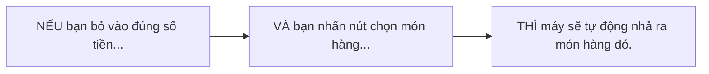
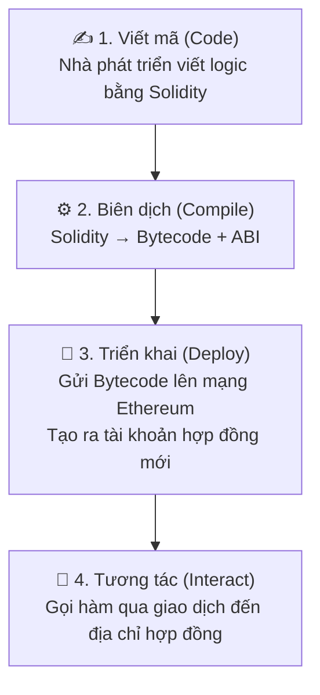

# Buổi 5 — Hợp đồng thông minh (Smart Contracts)

> **Môn học:** Blockchain: Nền tảng, Ứng dụng & Bảo mật  
> **Giảng viên:** Trần Tuấn Dũng

---

## Mục tiêu buổi học

!!! info "Hôm nay chúng ta sẽ học cách *thổi hồn* vào blockchain"
    - **Hiểu** được định nghĩa, lịch sử và triết lý đằng sau Hợp đồng thông minh.
    - **Nắm vững** các thành phần cơ bản của ngôn ngữ lập trình Solidity.
    - **Mô tả** được toàn bộ vòng đời của một Hợp đồng thông minh, từ lúc viết mã đến khi tương tác.
    - **Phân biệt** được hai tiêu chuẩn token quan trọng nhất: ERC-20 và ERC-721.

---

## 1. Smart Contract là gì?

### 1.1 Lịch sử & Ý tưởng sơ khai

Ý tưởng về Hợp đồng thông minh có từ rất lâu **trước cả Bitcoin**. Vào năm **1994**, nhà mật mã học **Nick Szabo** đã đưa ra định nghĩa đầu tiên, ví von Hợp đồng thông minh với một **chiếc máy bán hàng tự động**.

### 1.2 Ví von kinh điển: Máy bán hàng tự động



Chiếc máy này có các đặc tính giống hệt một Hợp đồng thông minh:

!!! success "Các đặc tính của Smart Contract"
    - **Tự thực thi (Self-executing):** Tự động thực hiện các điều khoản khi đủ điều kiện.
    - **Không cần trung gian (Disintermediated):** Bạn tin vào logic của cái máy, không cần tin người bán hàng.
    - **Không thể thay đổi (Immutable):** Các quy tắc được cài đặt sẵn và không thể bị một bên đơn phương thay đổi.
    - **Minh bạch (Transparent):** Logic hoạt động rõ ràng cho tất cả mọi người.

### 1.3 Định nghĩa chính thức

!!! quote "Định nghĩa"
    **Hợp đồng thông minh** là các chương trình máy tính được lưu trữ trên một blockchain, chúng sẽ **tự động thực thi** khi các điều kiện được định sẵn trong mã nguồn được đáp ứng.

    Về cơ bản, chúng là các **"tài khoản được điều khiển bởi mã nguồn"** thay vì bởi con người.

---

## 2. Solidity

**Solidity** là ngôn ngữ lập trình chính để viết Hợp đồng thông minh trên Ethereum và các blockchain tương thích EVM khác.

!!! note "Đặc điểm"
    - Cú pháp chịu ảnh hưởng lớn từ **C++**, **Python**, và **JavaScript**.
    - Là ngôn ngữ lập trình **hướng đối tượng** và được **biên dịch (compiled)**.
    - Được thiết kế đặc biệt để hoạt động trong môi trường **EVM**.

### 2.1 Hello World

```solidity
// 1. Khai báo phiên bản trình biên dịch
pragma solidity ^0.8.20;

// 2. Khai báo Hợp đồng
contract HelloWorld {
    // 3. Khai báo một biến trạng thái (State Variable)
    string public greet = "Hello, World!";
}
```

---

### 2.2 Biến trạng thái (State Variables)

**Biến trạng thái** là các biến có giá trị được **lưu trữ vĩnh viễn trên blockchain**. Chúng đại diện cho "bộ nhớ" của hợp đồng.

!!! warning "Lưu ý"
    Thay đổi giá trị của một biến trạng thái là một trong những hành động **tốn Gas nhất**.

```solidity
contract SimpleStorage {
    // Biến này sẽ được lưu mãi mãi trên blockchain
    uint256 public favoriteNumber;
}
```

---

### 2.3 Hàm (Functions)

Hàm là các khối mã có thể thực thi. Chúng là cách chúng ta tương tác và thay đổi trạng thái của hợp đồng.

```solidity
contract SimpleStorage {
    uint256 public favoriteNumber;

    // Một hàm để thay đổi biến trạng thái
    function store(uint256 _newNumber) public {
        favoriteNumber = _newNumber;
    }

    // Một hàm chỉ để đọc biến trạng thái (không tốn gas)
    function retrieve() public view returns (uint256) {
        return favoriteNumber;
    }
}
```

#### So sánh Hàm Write vs. Hàm Read

| Tiêu chí | Hàm thay đổi trạng thái (Write) | Hàm chỉ đọc (Read) |
|---|---|---|
| **Mục đích** | Thay đổi dữ liệu trên blockchain | Đọc dữ liệu từ blockchain |
| **Từ khóa** | (không có) | `view`, `pure` |
| **Chi phí Gas** | **CÓ**, vì thay đổi trạng thái | **KHÔNG**, khi được gọi từ bên ngoài |
| **Thực thi** | Cần một giao dịch, được xác thực bởi toàn mạng lưới | Thực thi tức thì trên một node duy nhất |
| **Ví dụ** | `transfer()`, `mint()` | `balanceOf()`, `ownerOf()` |

---

### 2.4 Kiểu dữ liệu

#### Kiểu dữ liệu cơ bản

| Kiểu | Mô tả |
|---|---|
| `bool` | `true` / `false` |
| `uint` / `int` | Số nguyên không dấu và có dấu (ví dụ: `uint256`) |
| `address` | Lưu trữ địa chỉ Ethereum (20 bytes). Có `.balance`, `.transfer()` |
| `string` | Chuỗi ký tự |
| `bytes` | Dãy byte động |

#### Kiểu dữ liệu phức hợp

**Mảng (Arrays):**
```solidity
uint[] public numbers;
```

**Struct:**
```solidity
struct Person { string name; uint age; }
```

**Mappings** — cấu trúc dữ liệu dạng key-value, giống hash table / dictionary. Rất hiệu quả về gas:
```solidity
// Ánh xạ từ một địa chỉ tới một số dư
mapping(address => uint) public balances;
```

---

### 2.5 Visibility (Phạm vi truy cập)

| Từ khóa | Ai có thể gọi? | Ghi chú |
|---|---|---|
| `public` | Bất kỳ ai (bên ngoài hoặc nội bộ) | Tự động tạo ra một hàm getter |
| `private` | Chỉ bên trong hợp đồng này | Không thể được truy cập bởi hợp đồng con |
| `internal` | Bên trong hợp đồng này và các hợp đồng con kế thừa nó | Giống `protected` trong các ngôn ngữ khác |
| `external` | Chỉ từ bên ngoài hợp đồng (qua giao dịch) | Tối ưu gas khi nhận dữ liệu lớn |

---

## 3. Vòng đời của một Smart Contract



??? details "Giải thích chi tiết từng bước"
    - **Viết mã (Code):** Nhà phát triển viết logic của hợp đồng bằng Solidity.
    - **Biên dịch (Compile):** Mã Solidity được biên dịch thành hai phần:
        - **Bytecode:** Mã máy cấp thấp mà EVM có thể hiểu và thực thi.
        - **ABI (Application Binary Interface):** Một file JSON mô tả các hàm của hợp đồng, giống như một API doc để các ứng dụng bên ngoài biết cách "nói chuyện" với hợp đồng.
    - **Triển khai (Deploy):** Bytecode được gửi lên mạng Ethereum thông qua một giao dịch đặc biệt. Khi giao dịch này được xác thực, một tài khoản hợp đồng mới sẽ được tạo ra.
    - **Tương tác (Interact):** Người dùng và các hợp đồng khác gọi các hàm trong hợp đồng đã triển khai bằng cách gửi các giao dịch đến địa chỉ của nó.

---

## 4. Tiêu chuẩn Smart Contract (ERC)

!!! info "Sức mạnh của sự Tương thích"
    Để các hợp đồng, ví, và sàn giao dịch có thể "hiểu" và tương tác với nhau, cộng đồng Ethereum đã tạo ra các **Tiêu chuẩn Yêu cầu Cải tiến Ethereum (ERC — Ethereum Request for Comment)**.

    Đây là các bộ quy tắc mà một hợp đồng **phải tuân theo** để được công nhận là một loại token hoặc tài sản cụ thể.

---

### 4.1 ERC-20: Token Có thể thay thế (Fungible)

**Fungible** = mỗi đơn vị đều giống hệt nhau và có thể thay thế cho nhau. Ví dụ: một tờ 100.000 VNĐ này có giá trị y hệt một tờ 100.000 VNĐ khác.

ERC-20 định nghĩa một bộ hàm chung cho các token, cho phép chúng được niêm yết trên sàn giao dịch và được lưu trữ trong ví một cách dễ dàng.

> **Ví dụ:** USDT, SHIB, UNI, LINK...

#### Các hàm cốt lõi của ERC-20

```solidity
function totalSupply() public view returns (uint256);
function balanceOf(address account) public view returns (uint256);
function transfer(address recipient, uint256 amount) public returns (bool);
function allowance(address owner, address spender) public view returns (uint256);
function approve(address spender, uint256 amount) public returns (bool);
function transferFrom(address sender, address recipient, uint256 amount) public returns (bool);
```

---

### 4.2 ERC-721: Token Không thể thay thế (Non-Fungible)

**Non-Fungible** = mỗi token là duy nhất và không thể thay thế cho token khác. Ví dụ: bức tranh Mona Lisa không giống với bất kỳ bức tranh nào khác.

ERC-721 cho phép tạo ra các **tài sản số độc nhất**, có thể chứng minh quyền sở hữu và nguồn gốc.

> **Ứng dụng:** Tác phẩm nghệ thuật số, vật phẩm trong game, vé sự kiện, tên miền...

#### Các hàm cốt lõi của ERC-721

```solidity
function balanceOf(address owner) public view returns (uint256);
function ownerOf(uint256 tokenId) public view returns (address);
function safeTransferFrom(address from, address to, uint256 tokenId) public;
function approve(address to, uint256 tokenId) public;
function getApproved(uint256 tokenId) public view returns (address);
```

!!! tip "Lưu ý quan trọng"
    Hàm `ownerOf()` trả về địa chỉ của người sở hữu một **tokenId duy nhất** — đây là điểm khác biệt cốt lõi so với ERC-20.

---

### 4.3 So sánh ERC-20 và ERC-721

| Tiêu chí | ERC-20 | ERC-721 |
|---|---|---|
| **Loại token** | Fungible (có thể thay thế) | Non-Fungible (không thể thay thế) |
| **Tính duy nhất** | Mọi token đều giống nhau | Mỗi token là duy nhất |
| **Ví dụ thực tế** | Tiền tệ, cổ phiếu | NFT, nghệ thuật số, vật phẩm game |
| **Hàm định danh** | `balanceOf(address)` | `ownerOf(tokenId)` |
| **Ví dụ token** | USDT, UNI, LINK | CryptoPunks, BAYC |

---

---

## 📝 50 Câu trắc nghiệm ôn tập

---

### Phần 1: Smart Contract — Khái niệm & Lịch sử

**Câu 1.** Nick Szabo đưa ra khái niệm Hợp đồng thông minh vào năm nào?

- A. 1989
- B. 1994
- C. 2008
- D. 2015

??? success "Đáp án & Giải thích"
    **B. 1994**  
    Nick Szabo — nhà mật mã học — đưa ra định nghĩa đầu tiên về Smart Contract vào năm 1994, trước cả khi Bitcoin ra đời.

---

**Câu 2.** Nick Szabo ví von Hợp đồng thông minh với thứ gì?

- A. Hợp đồng giấy tờ công chứng
- B. Máy tính lượng tử
- C. Máy bán hàng tự động
- D. Ngân hàng trung ương

??? success "Đáp án & Giải thích"
    **C. Máy bán hàng tự động**  
    Máy bán hàng tự động tự thực thi, không cần trung gian, logic minh bạch — đây là ẩn dụ kinh điển cho Smart Contract.

---

**Câu 3.** Hợp đồng thông minh được định nghĩa chính thức là gì?

- A. Hợp đồng pháp lý số hóa được lưu trên máy chủ trung tâm
- B. Các chương trình máy tính lưu trên blockchain, tự động thực thi khi điều kiện được đáp ứng
- C. Ứng dụng web3 kết nối với ngân hàng
- D. Tài khoản người dùng trên Ethereum

??? success "Đáp án & Giải thích"
    **B.**  
    Smart Contract là chương trình máy tính lưu trữ trên blockchain, tự động thực thi khi các điều kiện định sẵn được đáp ứng.

---

**Câu 4.** Smart Contract về cơ bản là loại tài khoản nào?

- A. Tài khoản được điều khiển bởi ngân hàng
- B. Tài khoản được điều khiển bởi con người
- C. Tài khoản được điều khiển bởi mã nguồn
- D. Tài khoản ẩn danh

??? success "Đáp án & Giải thích"
    **C.**  
    Smart Contract là "tài khoản được điều khiển bởi mã nguồn" thay vì bởi con người — đây là điểm phân biệt với EOA (Externally Owned Account).

---

**Câu 5.** Đặc tính nào của Smart Contract đảm bảo rằng các quy tắc không thể bị một bên đơn phương thay đổi?

- A. Self-executing
- B. Transparent
- C. Immutable
- D. Disintermediated

??? success "Đáp án & Giải thích"
    **C. Immutable (Không thể thay đổi)**  
    Sau khi triển khai, mã nguồn của Smart Contract được ghi vĩnh viễn lên blockchain và không thể bị sửa đổi bởi bất kỳ bên nào.

---

**Câu 6.** Đặc tính nào của Smart Contract giúp loại bỏ sự cần thiết của bên trung gian?

- A. Immutable
- B. Disintermediated
- C. Transparent
- D. Compiled

??? success "Đáp án & Giải thích"
    **B. Disintermediated**  
    Người dùng tin vào logic của mã nguồn thay vì tin vào bên thứ ba (ngân hàng, công ty, v.v.).

---

**Câu 7.** Blockchain nào đầu tiên được thiết kế như một "Máy tính Thế giới" (World Computer) với khả năng lập trình Turing-complete?

- A. Bitcoin
- B. Litecoin
- C. Ethereum
- D. Solana

??? success "Đáp án & Giải thích"
    **C. Ethereum**  
    Ethereum được thiết kế cho phép lập trình Turing-complete, khác với Bitcoin chỉ hỗ trợ script giới hạn.

---

### Phần 2: Solidity — Ngôn ngữ lập trình

**Câu 8.** Solidity chịu ảnh hưởng cú pháp từ những ngôn ngữ nào?

- A. Java, Ruby, Swift
- B. C++, Python, JavaScript
- C. Go, Rust, Kotlin
- D. PHP, Perl, Bash

??? success "Đáp án & Giải thích"
    **B. C++, Python, JavaScript**  
    Đây là ba ngôn ngữ ảnh hưởng chính đến cú pháp của Solidity.

---

**Câu 9.** Solidity là kiểu ngôn ngữ lập trình nào?

- A. Thông dịch, hướng thủ tục
- B. Biên dịch, hướng đối tượng
- C. Thông dịch, hướng đối tượng
- D. Biên dịch, hướng chức năng

??? success "Đáp án & Giải thích"
    **B. Biên dịch (compiled), hướng đối tượng**  
    Solidity cần được biên dịch thành bytecode trước khi chạy trên EVM.

---

**Câu 10.** Môi trường thực thi mà Solidity được thiết kế để hoạt động là gì?

- A. JVM (Java Virtual Machine)
- B. V8 Engine
- C. EVM (Ethereum Virtual Machine)
- D. WASM (WebAssembly)

??? success "Đáp án & Giải thích"
    **C. EVM**  
    Solidity được thiết kế đặc biệt để chạy trên Ethereum Virtual Machine.

---

**Câu 11.** Dòng `pragma solidity ^0.8.20;` có tác dụng gì?

- A. Import thư viện Solidity
- B. Khai báo tên hợp đồng
- C. Khai báo phiên bản trình biên dịch
- D. Định nghĩa hàm khởi tạo

??? success "Đáp án & Giải thích"
    **C.**  
    `pragma solidity` dùng để chỉ định phiên bản compiler Solidity cần dùng để biên dịch hợp đồng.

---

**Câu 12.** Biến trạng thái (State Variable) trong Solidity được lưu trữ ở đâu?

- A. RAM của node
- B. Vĩnh viễn trên blockchain
- C. Trên máy chủ của Ethereum Foundation
- D. Trong bộ nhớ tạm thời

??? success "Đáp án & Giải thích"
    **B. Vĩnh viễn trên blockchain**  
    State Variables đại diện cho "bộ nhớ" của hợp đồng và được lưu trữ vĩnh viễn.

---

**Câu 13.** Hành động nào dưới đây tốn Gas nhiều nhất trong Solidity?

- A. Gọi hàm `view`
- B. Đọc một biến `public`
- C. Thay đổi giá trị biến trạng thái
- D. Gọi hàm `pure`

??? success "Đáp án & Giải thích"
    **C.**  
    Thay đổi biến trạng thái là một trong những hành động tốn Gas nhất vì nó yêu cầu ghi dữ liệu lên blockchain.

---

**Câu 14.** Từ khóa `view` trong hàm Solidity có nghĩa là gì?

- A. Hàm có thể thay đổi trạng thái
- B. Hàm chỉ đọc dữ liệu, không thay đổi trạng thái
- C. Hàm được gọi nội bộ
- D. Hàm nhận ETH

??? success "Đáp án & Giải thích"
    **B.**  
    Hàm `view` chỉ đọc (read-only), không ghi dữ liệu lên blockchain và **không tốn Gas** khi gọi từ bên ngoài.

---

**Câu 15.** Hàm Write khác hàm Read ở điểm gì về cách thực thi?

- A. Hàm Write chạy nhanh hơn
- B. Hàm Write cần một giao dịch, được xác thực bởi toàn mạng lưới
- C. Hàm Write không cần Gas
- D. Hàm Write chỉ chạy trên một node duy nhất

??? success "Đáp án & Giải thích"
    **B.**  
    Hàm Write (thay đổi trạng thái) phải được gửi như một **giao dịch** và được toàn bộ mạng xác nhận, trong khi hàm Read thực thi tức thì trên một node.

---

**Câu 16.** Kiểu dữ liệu nào trong Solidity dùng để lưu địa chỉ Ethereum?

- A. `string`
- B. `bytes32`
- C. `address`
- D. `uint160`

??? success "Đáp án & Giải thích"
    **C. `address`**  
    Kiểu `address` lưu trữ địa chỉ Ethereum 20 bytes và có các thuộc tính đặc biệt như `.balance` và `.transfer()`.

---

**Câu 17.** Kiểu `address` có những thuộc tính đặc biệt nào?

- A. `.length` và `.push()`
- B. `.balance` và `.transfer()`
- C. `.name` và `.symbol()`
- D. `.owner` và `.approve()`

??? success "Đáp án & Giải thích"
    **B.**  
    Kiểu `address` có `.balance` (xem số dư ETH) và `.transfer()` (chuyển ETH) là hai thuộc tính đặc biệt.

---

**Câu 18.** `mapping(address => uint)` trong Solidity tương đương với cấu trúc dữ liệu nào?

- A. Mảng (Array)
- B. Hàng đợi (Queue)
- C. Hash table / Dictionary
- D. Stack

??? success "Đáp án & Giải thích"
    **C.**  
    Mapping là cấu trúc key-value giống hash table hoặc dictionary, rất hiệu quả về Gas.

---

**Câu 19.** `struct` trong Solidity dùng để làm gì?

- A. Khai báo hàm
- B. Tạo ra các kiểu dữ liệu phức tạp tùy chỉnh
- C. Định nghĩa sự kiện (event)
- D. Import thư viện

??? success "Đáp án & Giải thích"
    **B.**  
    `struct` cho phép lập trình viên tạo ra kiểu dữ liệu phức tạp riêng, ví dụ: `struct Person { string name; uint age; }`.

---

**Câu 20.** Visibility nào tương đương với `protected` trong các ngôn ngữ lập trình khác?

- A. `public`
- B. `private`
- C. `internal`
- D. `external`

??? success "Đáp án & Giải thích"
    **C. `internal`**  
    `internal` cho phép truy cập từ hợp đồng hiện tại và các hợp đồng con kế thừa — tương tự `protected`.

---

**Câu 21.** Visibility nào **KHÔNG thể** được truy cập bởi hợp đồng con?

- A. `public`
- B. `internal`
- C. `private`
- D. `external`

??? success "Đáp án & Giải thích"
    **C. `private`**  
    `private` chỉ cho phép truy cập bên trong chính hợp đồng đó, kể cả hợp đồng con cũng không thể gọi.

---

**Câu 22.** Visibility nào tối ưu Gas nhất khi nhận dữ liệu lớn từ bên ngoài?

- A. `public`
- B. `private`
- C. `internal`
- D. `external`

??? success "Đáp án & Giải thích"
    **D. `external`**  
    Hàm `external` chỉ được gọi từ bên ngoài và tối ưu Gas khi xử lý dữ liệu lớn.

---

**Câu 23.** Khi khai báo biến trạng thái `public`, Solidity tự động làm gì?

- A. Tạo một hàm setter
- B. Tạo một hàm getter
- C. Mã hóa biến đó
- D. Emit một event

??? success "Đáp án & Giải thích"
    **B.**  
    Khi biến được khai báo `public`, Solidity tự động tạo ra một hàm getter để đọc giá trị từ bên ngoài.

---

**Câu 24.** Hàm nào dưới đây là ví dụ của hàm **Write** (thay đổi trạng thái)?

- A. `balanceOf()`
- B. `ownerOf()`
- C. `totalSupply()`
- D. `transfer()`

??? success "Đáp án & Giải thích"
    **D. `transfer()`**  
    `transfer()` thay đổi số dư của các tài khoản → là hàm Write. Các hàm còn lại chỉ đọc dữ liệu.

---

**Câu 25.** Kiểu dữ liệu `bool` trong Solidity nhận những giá trị nào?

- A. 0 và 1
- B. `true` và `false`
- C. `yes` và `no`
- D. `null` và `undefined`

??? success "Đáp án & Giải thích"
    **B. `true` và `false`**

---

### Phần 3: Vòng đời Smart Contract

**Câu 26.** Bước đầu tiên trong vòng đời của một Smart Contract là gì?

- A. Triển khai (Deploy)
- B. Biên dịch (Compile)
- C. Viết mã (Code)
- D. Tương tác (Interact)

??? success "Đáp án & Giải thích"
    **C. Viết mã (Code)**  
    Thứ tự: Code → Compile → Deploy → Interact.

---

**Câu 27.** Kết quả của bước Biên dịch (Compile) là gì?

- A. Token ERC-20 và ERC-721
- B. Bytecode và ABI
- C. Gas và Gwei
- D. Block và Transaction

??? success "Đáp án & Giải thích"
    **B. Bytecode và ABI**  
    Bytecode là mã máy EVM thực thi được. ABI là giao diện JSON để bên ngoài gọi hàm.

---

**Câu 28.** Bytecode là gì?

- A. Mã Python đã được rút gọn
- B. File JSON mô tả các hàm của hợp đồng
- C. Mã máy cấp thấp mà EVM có thể hiểu và thực thi
- D. Địa chỉ của hợp đồng trên blockchain

??? success "Đáp án & Giải thích"
    **C.**  
    Bytecode là dạng mã nhị phân mà EVM có thể đọc và thực thi — đây là thứ thực sự được lưu trên blockchain.

---

**Câu 29.** ABI (Application Binary Interface) là gì?

- A. Mã máy cấp thấp cho EVM
- B. File JSON mô tả các hàm của hợp đồng để bên ngoài tương tác
- C. Địa chỉ public của hợp đồng
- D. Ngôn ngữ lập trình thay thế Solidity

??? success "Đáp án & Giải thích"
    **B.**  
    ABI giống như một "API doc" — nó mô tả tên hàm, tham số, kiểu trả về để các ứng dụng frontend biết cách gọi hợp đồng.

---

**Câu 30.** Khi triển khai (Deploy) Smart Contract, điều gì xảy ra?

- A. Hợp đồng được lưu trên máy chủ của Infura
- B. Bytecode được gửi lên Ethereum và một tài khoản hợp đồng mới được tạo ra
- C. ABI được upload lên IPFS
- D. Token ERC-20 được mint tự động

??? success "Đáp án & Giải thích"
    **B.**  
    Deploy là gửi bytecode qua một giao dịch đặc biệt lên mạng Ethereum. Khi xác thực xong, một địa chỉ hợp đồng mới được tạo.

---

**Câu 31.** Sau khi triển khai, người dùng tương tác với Smart Contract bằng cách nào?

- A. Gửi email đến nhà phát triển
- B. Gửi giao dịch đến địa chỉ của hợp đồng
- C. Gọi API REST truyền thống
- D. Chỉnh sửa trực tiếp mã nguồn

??? success "Đáp án & Giải thích"
    **B.**  
    Tương tác với Smart Contract được thực hiện bằng cách gửi giao dịch (transaction) đến địa chỉ hợp đồng trên blockchain.

---

**Câu 32.** Sau khi Smart Contract được triển khai, mã nguồn có thể bị thay đổi không?

- A. Có, nếu người triển khai có private key
- B. Có, nếu có đủ 51% node đồng ý
- C. Không, mã nguồn không thể thay đổi sau khi triển khai (Immutable)
- D. Có, thông qua ABI

??? success "Đáp án & Giải thích"
    **C.**  
    Đây là tính chất **Immutable** — một trong những đặc tính cốt lõi của Smart Contract. Để "nâng cấp", cần triển khai hợp đồng mới.

---

### Phần 4: Tiêu chuẩn ERC

**Câu 33.** ERC là viết tắt của gì?

- A. Ethereum Research Community
- B. Ethereum Request for Comment
- C. Extended Request Contract
- D. Ethereum Runtime Code

??? success "Đáp án & Giải thích"
    **B. Ethereum Request for Comment**  
    ERC là các tiêu chuẩn do cộng đồng Ethereum đề xuất và thống nhất để đảm bảo tính tương thích.

---

**Câu 34.** Tại sao cần có các tiêu chuẩn ERC?

- A. Để thu phí Gas cho Ethereum Foundation
- B. Để các hợp đồng, ví, sàn giao dịch có thể hiểu và tương tác với nhau
- C. Để hạn chế số lượng token trên Ethereum
- D. Để mã hóa dữ liệu người dùng

??? success "Đáp án & Giải thích"
    **B.**  
    Tiêu chuẩn ERC tạo ra ngôn ngữ chung (common interface) để mọi ví, sàn, hợp đồng đều có thể "nói chuyện" với nhau.

---

**Câu 35.** ERC-20 là tiêu chuẩn cho loại token nào?

- A. Non-Fungible Token (NFT)
- B. Fungible Token (Token có thể thay thế)
- C. Governance Token
- D. Soulbound Token

??? success "Đáp án & Giải thích"
    **B. Fungible Token**  
    ERC-20 định nghĩa token có thể thay thế — mỗi đơn vị có giá trị như nhau (như tiền tệ).

---

**Câu 36.** "Fungible" có nghĩa là gì?

- A. Mỗi token là duy nhất
- B. Mỗi đơn vị đều giống hệt nhau và có thể thay thế cho nhau
- C. Token không thể chuyển nhượng
- D. Token được mã hóa bằng ZK-proof

??? success "Đáp án & Giải thích"
    **B.**  
    Fungible = có thể thay thế. Ví dụ: 1 USDT của bạn có giá trị y hệt 1 USDT của người khác.

---

**Câu 37.** Token nào dưới đây là ví dụ của ERC-20?

- A. CryptoPunks
- B. Bored Ape Yacht Club
- C. USDT
- D. ENS Domain

??? success "Đáp án & Giải thích"
    **C. USDT**  
    USDT (Tether), SHIB, UNI, LINK đều là ERC-20. CryptoPunks và BAYC là ERC-721 (NFT).

---

**Câu 38.** Hàm `totalSupply()` trong ERC-20 trả về gì?

- A. Số lượng người dùng đang giữ token
- B. Tổng cung của token
- C. Số dư token của một địa chỉ
- D. Lượng Gas đã tiêu thụ

??? success "Đáp án & Giải thích"
    **B.**  
    `totalSupply()` trả về tổng số lượng token đang lưu hành (total supply).

---

**Câu 39.** Hàm `balanceOf(address account)` trong ERC-20 làm gì?

- A. Kiểm tra số ETH của một địa chỉ
- B. Trả về số lượng token ERC-20 mà địa chỉ đó đang nắm giữ
- C. Chuyển token từ địa chỉ này sang địa chỉ khác
- D. Phê duyệt quyền chi tiêu

??? success "Đáp án & Giải thích"
    **B.**  
    `balanceOf()` trả về số dư token ERC-20 của một địa chỉ cụ thể.

---

**Câu 40.** Hàm `approve()` trong ERC-20 dùng để làm gì?

- A. Xác nhận giao dịch trên blockchain
- B. Phê duyệt cho một địa chỉ khác (spender) được phép chi tiêu một lượng token nhất định
- C. Tạo ra token mới
- D. Khóa token trong smart contract

??? success "Đáp án & Giải thích"
    **B.**  
    `approve(spender, amount)` cho phép địa chỉ `spender` được sử dụng tối đa `amount` token của bạn — cần thiết cho DeFi protocols.

---

**Câu 41.** Hàm `transferFrom()` trong ERC-20 được dùng khi nào?

- A. Người dùng tự chuyển token của mình
- B. Một hợp đồng thứ ba chuyển token thay mặt người dùng, sau khi đã được `approve`
- C. Mint token mới cho người dùng
- D. Đốt (burn) token

??? success "Đáp án & Giải thích"
    **B.**  
    `transferFrom()` cho phép một địa chỉ đã được ủy quyền (thông qua `approve`) chuyển token thay mặt chủ sở hữu. Đây là nền tảng của nhiều DeFi protocol.

---

**Câu 42.** ERC-721 là tiêu chuẩn cho loại token nào?

- A. Fungible Token
- B. Stablecoin
- C. Non-Fungible Token (NFT)
- D. Wrapped Token

??? success "Đáp án & Giải thích"
    **C. Non-Fungible Token (NFT)**  
    ERC-721 tạo ra các token độc nhất, không thể thay thế.

---

**Câu 43.** "Non-Fungible" có nghĩa là gì?

- A. Token có thể thay thế cho nhau
- B. Mỗi token là duy nhất và không thể thay thế cho token khác
- C. Token không thể giao dịch
- D. Token cố định giá trị

??? success "Đáp án & Giải thích"
    **B.**  
    Non-Fungible = không thể thay thế. Ví dụ bức tranh Mona Lisa là duy nhất — không giống bất kỳ bức tranh nào khác.

---

**Câu 44.** Hàm đặc trưng nhất của ERC-721, phân biệt nó với ERC-20, là hàm nào?

- A. `balanceOf()`
- B. `approve()`
- C. `ownerOf(uint256 tokenId)`
- D. `transfer()`

??? success "Đáp án & Giải thích"
    **C. `ownerOf(uint256 tokenId)`**  
    `ownerOf()` trả về địa chỉ sở hữu một tokenId duy nhất — đây là điểm cốt lõi phân biệt NFT với token thông thường. ERC-20 không có hàm này.

---

**Câu 45.** Ứng dụng nào dưới đây phù hợp với ERC-721?

- A. Tiền ổn định (Stablecoin) như USDT
- B. Vé sự kiện độc nhất, tác phẩm nghệ thuật số
- C. Token quản trị (Governance)
- D. Token thanh khoản (LP Token)

??? success "Đáp án & Giải thích"
    **B.**  
    ERC-721 phù hợp với tài sản số độc nhất: nghệ thuật số, vật phẩm game, vé sự kiện, tên miền ENS...

---

**Câu 46.** Hàm `safeTransferFrom()` trong ERC-721 khác gì so với `transfer()` trong ERC-20?

- A. `safeTransferFrom()` không tốn Gas
- B. `safeTransferFrom()` bao gồm tokenId vì mỗi NFT là duy nhất, không chỉ chuyển một lượng
- C. `safeTransferFrom()` chỉ hoạt động với ETH
- D. Không có sự khác biệt

??? success "Đáp án & Giải thích"
    **B.**  
    Vì mỗi NFT là duy nhất, ERC-721 cần chỉ định `tokenId` cụ thể cần chuyển, khác với ERC-20 chỉ cần chỉ định `amount`.

---

**Câu 47.** Trong ERC-20, `allowance(owner, spender)` trả về gì?

- A. Số dư token của owner
- B. Lượng token mà spender được phép dùng từ tài khoản của owner
- C. Tổng cung token
- D. Địa chỉ hợp đồng

??? success "Đáp án & Giải thích"
    **B.**  
    `allowance()` kiểm tra lượng token còn lại mà `spender` được phép chi tiêu từ tài khoản của `owner` (sau khi đã `approve`).

---

**Câu 48.** Điểm khác biệt cơ bản nhất giữa ERC-20 và ERC-721 là gì?

- A. ERC-20 dùng Solidity, ERC-721 dùng ngôn ngữ khác
- B. ERC-20 là fungible (có thể thay thế), ERC-721 là non-fungible (độc nhất)
- C. ERC-20 rẻ Gas hơn ERC-721
- D. ERC-721 ra đời trước ERC-20

??? success "Đáp án & Giải thích"
    **B.**  
    Đây là sự khác biệt cốt lõi. Mọi đặc điểm khác đều xuất phát từ sự khác biệt này.

---

### Phần 5: Tổng hợp & Nâng cao

**Câu 49.** Trong Solidity, hàm `pure` khác `view` ở điểm nào?

- A. `pure` tốn Gas hơn `view`
- B. `pure` không đọc cũng không thay đổi trạng thái blockchain
- C. `pure` chỉ dùng cho ERC-721
- D. `pure` không thể được gọi từ bên ngoài

??? success "Đáp án & Giải thích"
    **B.**  
    `view` chỉ đọc state, không ghi. `pure` không đọc lẫn không ghi state — chỉ dùng tham số đầu vào để tính toán.

---

**Câu 50.** Nếu muốn xây dựng một hệ thống điểm tích lũy (loyalty points) mà mỗi điểm có giá trị như nhau, bạn nên dùng tiêu chuẩn nào?

- A. ERC-721
- B. ERC-20
- C. Cả hai đều được
- D. Không dùng tiêu chuẩn nào

??? success "Đáp án & Giải thích"
    **B. ERC-20**  
    Điểm tích lũy là fungible (1 điểm = 1 điểm) → phù hợp ERC-20. Nếu muốn mỗi "điểm" là một vật phẩm độc đáo (NFT), mới dùng ERC-721.

---

**Câu 51.** Tại sao khi gọi hàm `view` hoặc `pure` từ bên ngoài, người dùng không tốn Gas?

- A. Vì Ethereum miễn phí cho hàm đọc
- B. Vì không có thay đổi trạng thái nào được ghi lên blockchain, không cần sự đồng thuận của mạng lưới
- C. Vì hàm view chạy offline
- D. Vì Infura trả Gas thay cho người dùng

??? success "Đáp án & Giải thích"
    **B.**  
    Gas chỉ cần thiết khi có thay đổi trạng thái cần được xác nhận bởi toàn mạng. Đọc dữ liệu chỉ cần query một node, không cần broadcast giao dịch.

---

**Câu 52.** Để triển khai một Smart Contract, người triển khai cần gì?

- A. Được phép từ Ethereum Foundation
- B. Gửi một giao dịch đặc biệt chứa bytecode và trả Gas
- C. Có ít nhất 32 ETH để staking
- D. Chạy một Ethereum node đầy đủ

??? success "Đáp án & Giải thích"
    **B.**  
    Triển khai hợp đồng là gửi một giao dịch đặc biệt (không có địa chỉ nhận — `to: null`) chứa bytecode. Người triển khai phải trả Gas.

---

**Câu 53.** Trong vòng đời Smart Contract, bước nào tạo ra ABI?

- A. Viết mã (Code)
- B. Biên dịch (Compile)
- C. Triển khai (Deploy)
- D. Tương tác (Interact)

??? success "Đáp án & Giải thích"
    **B. Biên dịch (Compile)**  
    Bước compile tạo ra cả Bytecode (để chạy trên EVM) và ABI (để frontend giao tiếp với hợp đồng).

---

**Câu 54.** Mapping trong Solidity có nhược điểm gì so với Array?

- A. Mapping tốn Gas hơn Array
- B. Mapping không thể duyệt (iterate) qua tất cả phần tử
- C. Mapping chỉ hỗ trợ kiểu uint làm key
- D. Mapping không thể lưu dữ liệu vĩnh viễn

??? success "Đáp án & Giải thích"
    **B.**  
    Mapping không có tính năng enumerable — bạn không thể duyệt qua tất cả key-value như Array. Đây là đánh đổi để đạt hiệu quả Gas cao.

---

**Câu 55.** Smart Contract có thể nhận ETH không? Điều kiện là gì?

- A. Không, Smart Contract không thể nhận ETH
- B. Có, nhưng phải có hàm `receive()` hoặc `fallback()` được khai báo
- C. Có, mọi contract đều tự động nhận ETH
- D. Có, nhưng chỉ từ địa chỉ của người triển khai

??? success "Đáp án & Giải thích"
    **B.**  
    Để Smart Contract nhận ETH, cần khai báo hàm `receive()` (nhận ETH thuần túy) hoặc `fallback()` (nhận ETH kèm data). Đây là kiến thức Solidity nâng cao, được ngầm hiểu từ kiến trúc Smart Contract.

---

!!! tip "Ôn tập thêm"
    Để nắm chắc hơn, hãy thực hành viết các hợp đồng Solidity đơn giản trên **Remix IDE** (remix.ethereum.org) — môi trường online không cần cài đặt.
