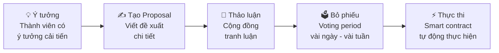

# Buổi 6 - Ứng dụng Phi tập trung (DApps) và Tổ chức Tự trị Phi tập trung (DAOs)

---

## Mục tiêu

- Phân biệt sự tiến hóa của Internet từ Web1, Web2 đến Web3
- Phân tích và so sánh kiến trúc DApp vs ứng dụng truyền thống
- Hiểu định nghĩa, vai trò và các thành phần cốt lõi của DAO
- Mô tả vòng đời của một governance proposal trong DAO

---

## 1. DApps

### 1.1 Sự tiến hóa Web

```
Web 1.0 (1990–2004)  →  Web 2.0 (2004–Nay)  →  Web 3.0 (Tương lai)
  Read-Only Web           Read-Write Web          Read-Write-Own Web
```

| Thế hệ | Đặc điểm |
|--------|----------|
| Web 1.0 | Trang tĩnh, người dùng chỉ đọc |
| Web 2.0 | Tương tác, mạng xã hội — người dùng tạo nội dung nhưng **dữ liệu thuộc về công ty** |
| Web 3.0 | Người dùng **sở hữu dữ liệu**, ứng dụng chạy trên nền tảng phi tập trung |

!!! quote
    "DApps chính là những ứng dụng của kỷ nguyên Web3."

---

### 1.2 Kiến trúc Web2 truyền thống

Ứng dụng như Facebook, Shopee gồm:

- **Frontend**: HTML, CSS, JavaScript — giao diện người dùng
- **Backend**: Logic nghiệp vụ, chạy trên máy chủ công ty (AWS, Google Cloud)
- **Database**: Lưu toàn bộ dữ liệu người dùng, **công ty toàn quyền kiểm soát**

---

### 1.3 Vấn đề Web2 và DApps giải quyết

!!! danger "Vấn đề của Web2"
    - **Điểm lỗi đơn**: Máy chủ sập → toàn bộ ứng dụng ngừng hoạt động
    - **Kiểm duyệt**: Công ty có thể khóa tài khoản, xóa nội dung bất cứ lúc nào
    - **Không minh bạch**: Người dùng không biết dữ liệu được xử lý ra sao
    - **Phụ thuộc**: Hệ thống phụ thuộc quyết định của một công ty

!!! success "DApps giải quyết"
    - **Phi tập trung**: Không có điểm lỗi đơn, chạy trên nhiều nút mạng
    - **Chống kiểm duyệt**: Không ai có thể dừng hoặc thay đổi DApp tùy ý
    - **Minh bạch**: Toàn bộ mã nguồn và dữ liệu có thể kiểm tra được
    - **Tự chủ**: Người dùng có quyền kiểm soát tài sản và dữ liệu của mình

---

### 1.4 Định nghĩa và thành phần DApp

!!! info "Định nghĩa"
    **DApp** là ứng dụng có backend chạy trên mạng blockchain phi tập trung (thay vì trên máy chủ tập trung).

**Các thành phần:**

| Thành phần | Vai trò |
|-----------|---------|
| **Frontend** | Giao diện người dùng, có thể host trên IPFS hoặc dịch vụ phi tập trung |
| **Smart Contracts** | Thay thế backend server truyền thống, chạy trên blockchain |
| **Blockchain** | Thay thế database tập trung, lưu trữ phi tập trung |
| **Web3 Provider** | Cầu nối giữa frontend và blockchain (ví dụ: MetaMask) |

!!! warning "Lưu ý"
    Không phải tất cả dữ liệu đều cần lưu trên blockchain (chi phí cao). Một số dữ liệu có thể lưu trên **IPFS** hoặc các giải pháp **off-chain** khác.

---

### 1.5 So sánh App Truyền thống vs DApp

| Tiêu chí | App Truyền thống | DApp |
|----------|-----------------|------|
| Backend | Máy chủ tập trung | Smart Contracts trên blockchain |
| Database | CSDL tập trung | Blockchain + IPFS |
| Quyền sở hữu | Công ty sở hữu | Người dùng sở hữu |
| Kiểm duyệt | Có thể bị kiểm duyệt | Chống kiểm duyệt |
| Chi phí giao dịch | Miễn phí cho người dùng | Phí gas cho mỗi giao dịch |
| Tốc độ | Nhanh (milliseconds) | Chậm hơn (giây hoặc phút) |

---

### 1.6 Case Study: Uniswap vs Binance

??? info "Binance (CEX — Centralized Exchange)"
    - Công ty Binance kiểm soát toàn bộ hệ thống
    - Người dùng gửi tiền vào ví của Binance
    - Giao dịch diễn ra trong database của Binance
    - Binance **có thể** đóng băng tài khoản
    - Nhanh và phí thấp, nhưng **phải tin tưởng Binance**

??? success "Uniswap (DEX — Decentralized Exchange)"
    - Chạy hoàn toàn trên smart contracts
    - Người dùng tự nắm giữ tiền trong ví cá nhân
    - Giao dịch diễn ra trực tiếp trên blockchain
    - **Không ai có thể** đóng băng tài khoản
    - Chậm hơn và phí cao hơn, nhưng **hoàn toàn tự chủ**

!!! question "Câu hỏi thảo luận"
    Bạn sẽ chọn gì khi giao dịch **100 USD** vs **10,000 USD**?

---

## 2. DAOs

### 2.1 DAO là gì?

!!! info "Định nghĩa"
    **DAO (Decentralized Autonomous Organization)** là một tổ chức được điều hành bởi các quy tắc được mã hóa trong smart contracts, thay vì được quản lý bởi một nhóm lãnh đạo tập trung.

**Đặc điểm chính:**

- **Phi tập trung**: Không có CEO hay ban giám đốc truyền thống
- **Tự trị**: Hoạt động dựa trên code, không cần sự can thiệp của con người
- **Minh bạch**: Tất cả quyết định và tài chính đều công khai trên blockchain
- **Dân chủ**: Thành viên bỏ phiếu để đưa ra quyết định

!!! quote
    "Hãy tưởng tượng một công ty mà tất cả các quyết định quan trọng đều được bỏ phiếu công khai, và tất cả tài chính đều minh bạch 100%."

---

### 2.2 So sánh Công ty Truyền thống vs DAO

| Tiêu chí | Công ty Truyền thống | DAO |
|----------|---------------------|-----|
| Cấu trúc quản lý | Phân cấp (CEO → Manager → Nhân viên) | Ngang hàng (P2P), mọi người đều có tiếng nói |
| Quyết định | Ban lãnh đạo quyết định | Bỏ phiếu tập thể |
| Minh bạch | Hạn chế (chỉ công bố báo cáo định kỳ) | Hoàn toàn minh bạch (mọi thứ đều public) |
| Thay đổi quy tắc | Ban lãnh đạo thay đổi bất cứ lúc nào | Cần đa số bỏ phiếu đồng ý |
| Cổ phần/Quyền sở hữu | Cổ phiếu truyền thống | Token quản trị (governance tokens) |
| Tốc độ quyết định | Nhanh (giờ → ngày) | Chậm hơn (ngày → tuần) |

---

### 2.3 Các thành phần cốt lõi của DAO

```
┌─────────────────────────────────────────────────────┐
│                       DAO                           │
│                                                     │
│  Smart Contracts  │  Governance Tokens              │
│  Proposals        │  Voting Mechanism               │
│              Treasury                               │
└─────────────────────────────────────────────────────┘
```

| Thành phần | Vai trò |
|-----------|---------|
| **Smart Contracts** | Quy tắc và logic hoạt động — định nghĩa cách bỏ phiếu, phân phối token, thực thi quyết định |
| **Governance Tokens** | Đại diện quyền bỏ phiếu. Nhiều token = nhiều quyền biểu quyết |
| **Proposals** | Đề xuất thay đổi/hành động, mỗi proposal đều cần bỏ phiếu |
| **Voting Mechanism** | Cơ chế bỏ phiếu để thông qua proposal, thường dựa trên số token sở hữu |
| **Treasury (Kho bạc)** | Quỹ chung của DAO, việc sử dụng cũng cần bỏ phiếu quyết định |

---

### 2.4 Vòng đời của một Governance Proposal



**Ví dụ thực tế:**

```
Proposal : "Tăng phần thưởng staking từ 5% lên 7% APY"
Kết quả  : 65% vote "Có", 35% vote "Không" → Thông qua
Thực thi : Smart contract tự động cập nhật tỷ lệ thưởng
           → Không cần can thiệp thủ công
```

---

### 2.5 Case Study: MakerDAO — "Ngân hàng phi tập trung"

!!! example "MakerDAO"
    **Mục đích**: Tạo ra stablecoin DAI được thế chấp bằng crypto, không cần ngân hàng truyền thống.

**Cách hoạt động:**

1. Người dùng gửi ETH làm tài sản thế chấp
2. Hệ thống cho vay DAI (tỷ lệ 1:1 với USD)
3. Governance token **MKR** để bỏ phiếu các thông số
4. Nếu giá ETH giảm quá mức → tài sản bị thanh lý

**Số liệu (2024):**

| Chỉ số | Giá trị |
|--------|---------|
| Total Value Locked | ~$8 tỷ USD |
| DAI đang lưu hành | ~5 tỷ DAI |
| Holders MKR | ~10,000+ |
| Proposal đã thông qua | 500+ |

```
Proposal thực tế:
  "Tăng Stability Fee cho ETH-A từ 2.25% lên 2.75%"
  → 89% MKR holders bỏ phiếu "Có" → Tự động áp dụng
```

---

### 2.6 Thách thức và Giải pháp

!!! danger "Thách thức"
    **DApps:**
    - Hiệu suất chậm hơn ứng dụng truyền thống
    - Phí gas cao trên Ethereum
    - UX/UI phức tạp với người dùng thông thường
    - Khả năng mở rộng hạn chế (TPS thấp)

    **DAOs:**
    - **Voter apathy**: Không phải ai cũng tham gia bỏ phiếu
    - **Whale control**: Người có nhiều token có quyền lực quá lớn

!!! success "Giải pháp đang phát triển"
    **Cho DApps:**
    - **Layer 2**: Polygon, Arbitrum — giảm phí giao dịch
    - **Better UX**: Abstract Account
    - **Hybrid model**: Kết hợp tập trung và phi tập trung

    **Cho DAOs:**
    - **Quadratic voting**: Giảm sự thống trị của whale
    - **Delegation**: Ủy quyền bỏ phiếu cho chuyên gia
    - **Snapshot voting**: Bỏ phiếu off-chain để tiết kiệm gas

!!! note "Kết luận"
    DApps và DAOs vẫn đang trong giai đoạn phát triển. Chúng có tiềm năng lớn nhưng cần thời gian để hoàn thiện và được chấp nhận rộng rãi.

---

### 2.7 Tương lai của DApps và DAOs

**Xu hướng DApps:**
- DeFi 2.0: Giao thức phức tạp hơn, tích hợp AI
- Gaming: Play-to-earn, NFT trong game
- Social Media: Mạng xã hội phi tập trung
- Identity: Quản lý danh tính tự chủ
- Cross-chain: Hoạt động trên nhiều blockchain

**Xu hướng DAOs:**
- Legal framework: Luật pháp bắt đầu công nhận DAO
- Professional DAOs: Tổ chức làm việc phi tập trung
- Investment DAOs: Quỹ đầu tư cộng đồng
- City DAOs: Quản trị thành phố bằng DAO
- AI + DAO: Kết hợp trí tuệ nhân tạo

!!! tip "Dự đoán 5–10 năm tới"
    - Mọi ứng dụng sẽ có phiên bản DApp tương ứng
    - DAOs sẽ trở thành hình thức tổ chức phổ biến cho các dự án công nghệ
    - Chính phủ các nước sẽ thử nghiệm governance bằng blockchain
    - Web3 sẽ trở thành tiêu chuẩn, không còn là "công nghệ mới"

---

---

# 50 Câu Trắc Nghiệm

---

**Câu 1.** Web 1.0 được đặc trưng bởi điều gì?

- A. Read-Write Web
- B. Read-Only Web ✅
- C. Read-Write-Own Web
- D. Decentralized Web

> **Giải thích:** Web 1.0 (1990–2004) là các trang tĩnh, người dùng chủ yếu chỉ đọc thông tin.

---

**Câu 2.** Đặc điểm chính của Web 2.0 là gì?

- A. Người dùng sở hữu dữ liệu
- B. Ứng dụng chạy trên blockchain
- C. Người dùng tạo nội dung nhưng dữ liệu thuộc về công ty ✅
- D. Không có máy chủ tập trung

> **Giải thích:** Web 2.0 là Read-Write Web — người dùng tạo nội dung nhưng dữ liệu thuộc quyền kiểm soát của các công ty nền tảng.

---

**Câu 3.** Web 3.0 còn được gọi là gì?

- A. Read-Only Web
- B. Read-Write Web
- C. Read-Write-Own Web ✅
- D. Decentralized-Only Web

---

**Câu 4.** DApp là gì?

- A. Ứng dụng chạy hoàn toàn trên máy chủ tập trung
- B. Ứng dụng có backend chạy trên mạng blockchain phi tập trung ✅
- C. Ứng dụng di động không cần kết nối internet
- D. Ứng dụng sử dụng cơ sở dữ liệu SQL phi tập trung

---

**Câu 5.** Trong kiến trúc DApp, thành phần nào thay thế backend server truyền thống?

- A. IPFS
- B. Frontend
- C. Smart Contracts ✅
- D. Web3 Provider

---

**Câu 6.** Web3 Provider như MetaMask đóng vai trò gì trong DApp?

- A. Lưu trữ dữ liệu phi tập trung
- B. Thực thi logic nghiệp vụ
- C. Cầu nối giữa frontend và blockchain ✅
- D. Cung cấp giao diện người dùng

---

**Câu 7.** Vì sao không phải tất cả dữ liệu của DApp đều được lưu trên blockchain?

- A. Blockchain không đủ bảo mật
- B. Chi phí lưu trữ trên blockchain rất cao ✅
- C. Blockchain không thể lưu trữ dữ liệu lớn về mặt kỹ thuật
- D. Quy định pháp luật không cho phép

---

**Câu 8.** Giải pháp lưu trữ off-chain phổ biến được đề cập trong bài là gì?

- A. AWS S3
- B. Google Cloud Storage
- C. IPFS ✅
- D. MySQL

---

**Câu 9.** Điểm lỗi đơn (Single Point of Failure) là vấn đề của hệ thống nào?

- A. DApp
- B. DAO
- C. Web2 truyền thống ✅
- D. Blockchain

> **Giải thích:** Nếu máy chủ của ứng dụng Web2 sập, toàn bộ ứng dụng ngừng hoạt động.

---

**Câu 10.** DApp giải quyết vấn đề "kiểm duyệt" bằng cách nào?

- A. Mã hóa toàn bộ dữ liệu
- B. Chạy trên nhiều nút mạng, không ai có thể dừng tùy ý ✅
- C. Yêu cầu xác thực 2 yếu tố
- D. Sử dụng VPN

---

**Câu 11.** So với ứng dụng truyền thống, tốc độ xử lý của DApp như thế nào?

- A. Nhanh hơn (microseconds)
- B. Tương đương (milliseconds)
- C. Chậm hơn (giây hoặc phút) ✅
- D. Phụ thuộc vào nhà cung cấp

---

**Câu 12.** Trong DApp, quyền sở hữu dữ liệu thuộc về ai?

- A. Công ty phát triển
- B. Nhà cung cấp dịch vụ cloud
- C. Người dùng ✅
- D. Chính phủ

---

**Câu 13.** Binance là loại sàn giao dịch nào?

- A. DEX
- B. CEX ✅
- C. Hybrid Exchange
- D. Cross-chain Exchange

---

**Câu 14.** Đặc điểm nào sau đây đúng với Uniswap?

- A. Công ty kiểm soát toàn bộ hệ thống
- B. Người dùng phải gửi tiền vào ví của sàn
- C. Chạy hoàn toàn trên smart contracts ✅
- D. Giao dịch diễn ra trong database tập trung

---

**Câu 15.** Nhược điểm của Uniswap so với Binance là gì?

- A. Dễ bị kiểm duyệt hơn
- B. Chậm hơn và phí cao hơn ✅
- C. Không hỗ trợ nhiều loại token
- D. Yêu cầu KYC phức tạp hơn

---

**Câu 16.** DAO là viết tắt của gì?

- A. Decentralized Application Organization
- B. Distributed Autonomous Operation
- C. Decentralized Autonomous Organization ✅
- D. Digital Asset Organization

---

**Câu 17.** DAO được điều hành bởi điều gì?

- A. CEO và ban giám đốc
- B. Chính phủ
- C. Các quy tắc được mã hóa trong smart contracts ✅
- D. Hội đồng cổ đông truyền thống

---

**Câu 18.** Đặc điểm "Tự trị" của DAO có nghĩa là gì?

- A. DAO hoạt động độc lập không cần internet
- B. DAO hoạt động dựa trên code, không cần sự can thiệp của con người ✅
- C. DAO tự động tạo ra token
- D. DAO không cần smart contracts

---

**Câu 19.** Trong DAO, quyền biểu quyết được đại diện bằng gì?

- A. Cổ phiếu truyền thống
- B. NFT
- C. Governance Tokens ✅
- D. Email xác nhận

---

**Câu 20.** Mối quan hệ giữa số lượng governance token và quyền biểu quyết trong DAO là gì?

- A. Ngược chiều — càng ít token càng có nhiều quyền
- B. Không liên quan
- C. Thuận chiều — nhiều token = nhiều quyền biểu quyết ✅
- D. Cố định, không phụ thuộc số token

---

**Câu 21.** Thành phần nào của DAO được ví như "quỹ chung"?

- A. Governance Token
- B. Voting Mechanism
- C. Proposal
- D. Treasury ✅

---

**Câu 22.** Vòng đời của một Governance Proposal trong DAO diễn ra theo thứ tự nào?

- A. Proposal → Ý tưởng → Thảo luận → Bỏ phiếu → Thực thi
- B. Ý tưởng → Tạo Proposal → Thảo luận → Bỏ phiếu → Thực thi ✅
- C. Bỏ phiếu → Tạo Proposal → Thảo luận → Thực thi
- D. Ý tưởng → Bỏ phiếu → Thảo luận → Tạo Proposal → Thực thi

---

**Câu 23.** Sau khi proposal được thông qua, ai/cái gì thực thi quyết định?

- A. Ban quản trị DAO
- B. Nhà sáng lập dự án
- C. Smart contract tự động thực hiện ✅
- D. Cơ quan pháp lý

---

**Câu 24.** Thời gian voting period trong DAO thường là bao lâu?

- A. Vài giờ
- B. Vài phút
- C. Vài ngày đến vài tuần ✅
- D. Vài tháng

---

**Câu 25.** Trong ví dụ thực tế tại bài học, một proposal về staking được thông qua khi nào?

- A. 100% vote "Có"
- B. 65% vote "Có" ✅
- C. 51% vote "Có"
- D. 75% vote "Có"

---

**Câu 26.** MakerDAO tạo ra loại tài sản gì?

- A. Bitcoin
- B. Ethereum
- C. Stablecoin DAI ✅
- D. NFT

---

**Câu 27.** Trong MakerDAO, người dùng gửi tài sản gì để vay DAI?

- A. BTC
- B. ETH ✅
- C. USDT
- D. MKR

---

**Câu 28.** Governance token của MakerDAO là gì?

- A. DAI
- B. ETH
- C. MKR ✅
- D. UNI

---

**Câu 29.** DAI được neo giá theo tỷ lệ nào?

- A. 1:1 với Bitcoin
- B. 1:1 với EUR
- C. 1:1 với USD ✅
- D. 1:2 với ETH

---

**Câu 30.** Theo số liệu 2024, Total Value Locked của MakerDAO là bao nhiêu?

- A. ~1 tỷ USD
- B. ~4 tỷ USD
- C. ~8 tỷ USD ✅
- D. ~20 tỷ USD

---

**Câu 31.** Trong ví dụ proposal thực tế của MakerDAO, bao nhiêu % MKR holders đã bỏ phiếu "Có"?

- A. 65%
- B. 75%
- C. 89% ✅
- D. 95%

---

**Câu 32.** Điều gì xảy ra với tài sản thế chấp trong MakerDAO khi giá ETH giảm quá mức?

- A. Người dùng nhận thêm DAI
- B. Tài sản bị thanh lý ✅
- C. Giao dịch bị hủy
- D. MKR token được phát hành thêm

---

**Câu 33.** Vấn đề "Voter apathy" trong DAO là gì?

- A. Người dùng bỏ phiếu sai
- B. Không phải ai cũng tham gia bỏ phiếu ✅
- C. Hệ thống bỏ phiếu bị lỗi
- D. Phí bỏ phiếu quá cao

---

**Câu 34.** "Whale control" trong bối cảnh DAO đề cập đến vấn đề gì?

- A. Cá voi thật sự tấn công mạng blockchain
- B. Người có nhiều token có quyền lực quá lớn trong việc ra quyết định ✅
- C. Chi phí giao dịch tăng đột biến
- D. Thiếu thanh khoản trong treasury

---

**Câu 35.** Layer 2 như Polygon, Arbitrum giải quyết vấn đề gì của DApps?

- A. Bảo mật smart contract
- B. Phí gas cao trên Ethereum ✅
- C. Voter apathy trong DAO
- D. Khó khăn trong việc tạo UI

---

**Câu 36.** Quadratic voting được đề xuất để giải quyết vấn đề gì?

- A. Phí gas cao
- B. Tốc độ giao dịch chậm
- C. Sự thống trị của whale ✅
- D. Thiếu minh bạch

---

**Câu 37.** Snapshot voting là gì?

- A. Chụp ảnh màn hình kết quả bỏ phiếu
- B. Bỏ phiếu off-chain để tiết kiệm gas ✅
- C. Hệ thống bỏ phiếu nhanh trong 1 giây
- D. Bỏ phiếu ẩn danh

---

**Câu 38.** "Delegation" trong DAO cho phép điều gì?

- A. Chuyển toàn bộ token cho người khác
- B. Ủy quyền bỏ phiếu cho chuyên gia ✅
- C. Xóa proposal đã được tạo
- D. Tăng số lượng governance token

---

**Câu 39.** Cấu trúc quản lý của DAO khác công ty truyền thống như thế nào?

- A. DAO có cấu trúc phân cấp chặt chẽ hơn
- B. DAO theo mô hình ngang hàng (P2P), mọi người đều có tiếng nói ✅
- C. DAO chỉ có một người ra quyết định
- D. DAO sử dụng cùng mô hình CEO-Manager

---

**Câu 40.** Điểm khác biệt về minh bạch giữa công ty truyền thống và DAO?

- A. Công ty truyền thống minh bạch hơn vì phải nộp báo cáo tài chính
- B. Cả hai đều hoàn toàn minh bạch
- C. DAO hoàn toàn minh bạch (mọi thứ public), công ty chỉ công bố báo cáo định kỳ ✅
- D. DAO ẩn danh hoàn toàn nên không minh bạch

---

**Câu 41.** Xu hướng nào của DApps tích hợp trí tuệ nhân tạo?

- A. Gaming DApps
- B. Social Media DApps
- C. DeFi 2.0 ✅
- D. Identity DApps

---

**Câu 42.** "Cross-chain" trong xu hướng DApps có nghĩa là gì?

- A. DApp chạy trên nhiều thiết bị
- B. DApp hoạt động trên nhiều blockchain khác nhau ✅
- C. DApp kết nối với Web2
- D. DApp hỗ trợ nhiều ngôn ngữ

---

**Câu 43.** City DAOs được dự đoán dùng để làm gì?

- A. Giao dịch bất động sản
- B. Quản trị thành phố bằng DAO ✅
- C. Phát hành token địa phương
- D. Quản lý giao thông

---

**Câu 44.** Xu hướng nào trong DAO liên quan đến pháp lý?

- A. Snapshot voting
- B. Quadratic voting
- C. Legal framework — luật pháp bắt đầu công nhận DAO ✅
- D. Investment DAOs

---

**Câu 45.** Trong DApp, ai chịu trả phí gas khi thực hiện giao dịch?

- A. Công ty phát triển DApp
- B. Validator trên blockchain
- C. Người dùng ✅
- D. Không ai — giao dịch miễn phí

---

**Câu 46.** Điều gì xảy ra với tài sản người dùng khi sàn Binance sập?

- A. Tài sản được bảo hiểm tự động
- B. Tài sản có thể bị ảnh hưởng vì nằm trong ví Binance ✅
- C. Tài sản được tự động chuyển về ví cá nhân
- D. Tài sản không bị ảnh hưởng gì

> **Giải thích:** Với CEX, người dùng gửi tiền vào ví của sàn, nên khi sàn sập hoặc bị hack, tài sản có thể bị ảnh hưởng. Đây là rủi ro điển hình của mô hình tập trung.

---

**Câu 47.** Cơ sở dữ liệu trong DApp được thay thế bằng gì?

- A. MySQL phi tập trung
- B. MongoDB trên cloud
- C. Blockchain + IPFS ✅
- D. Redis cluster

---

**Câu 48.** Thành phần nào của DAO định nghĩa cách thức bỏ phiếu và phân phối token?

- A. Treasury
- B. Governance Tokens
- C. Proposals
- D. Smart Contracts ✅

---

**Câu 49.** Trong so sánh DAO vs công ty truyền thống, thay đổi quy tắc trong DAO đòi hỏi điều gì?

- A. Quyết định của CEO
- B. Đa số bỏ phiếu đồng ý ✅
- C. Phê duyệt của cơ quan pháp lý
- D. Đồng ý của tất cả thành viên (100%)

---

**Câu 50.** Kết luận của bài học về DApps và DAOs là gì?

- A. DApps và DAOs đã hoàn thiện và sẵn sàng thay thế hoàn toàn hệ thống hiện tại
- B. DApps và DAOs không có tương lai trong thực tế
- C. DApps và DAOs vẫn đang phát triển, có tiềm năng lớn nhưng cần thời gian hoàn thiện và được chấp nhận rộng rãi ✅
- D. DApps tốt nhưng DAOs không khả thi
