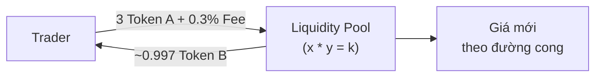
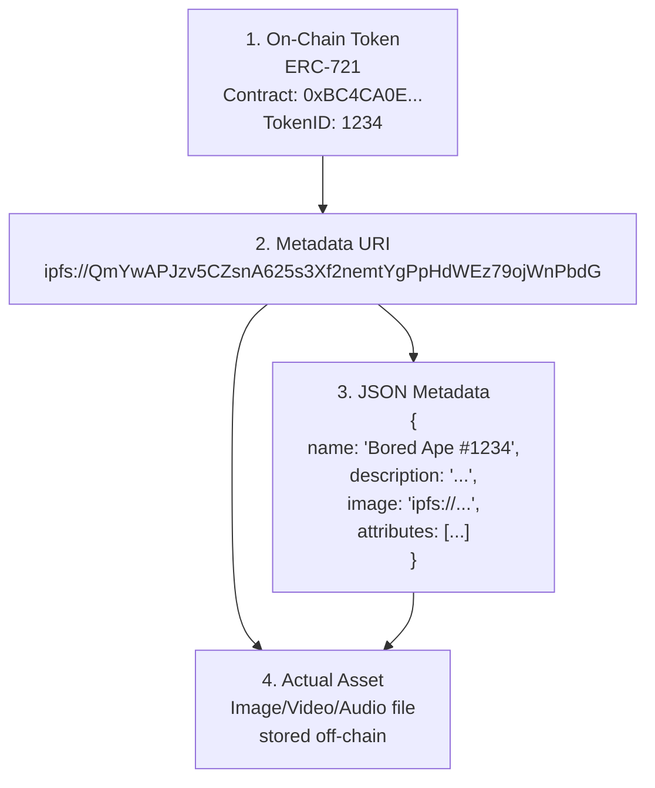

# Buổi 7 – Tài chính Phi tập trung (DeFi) và NFTs

---

## Mục tiêu buổi học

Khám phá hai "killer apps" đã đưa Blockchain đến với hàng triệu người dùng:

- **DeFi:** Hiểu các vấn đề của Tài chính Truyền thống (TradFi) và cách DeFi giải quyết. Phân tích các "viên gạch" cốt lõi: Stablecoins, DEXs, Lending.
- **NFTs:** Giải mã NFT không chỉ là "tranh ảnh đắt tiền". Hiểu cấu trúc kỹ thuật và tiềm năng ứng dụng trong việc định hình lại quyền sở hữu số.

---

## Dẫn nhập

Chúng ta đã học về **DApps** (cách xây dựng ứng dụng) và **DAOs** (cách quản trị ứng dụng). Vậy những DApps và DAOs này được dùng để làm gì trong thực tế? Hai lĩnh vực lớn mạnh nhất đã nổi lên:

| Mục tiêu | Lĩnh vực |
|---|---|
| Tái cấu trúc lại toàn bộ hệ thống tài chính | → Tài chính Phi tập trung (DeFi) |
| Tái định nghĩa lại khái niệm sở hữu trong thế giới số | → Non-Fungible Tokens (NFTs) |

---

## Phần 1 – Tài chính Phi tập trung (DeFi)

### Vấn đề của Tài chính Truyền thống (TradFi)

Một hệ thống tài chính toàn cầu nhưng lại chậm chạp, tốn kém và không dành cho tất cả mọi người:

- **Tập trung & Cần cấp phép:** Bị kiểm soát bởi các ngân hàng, chính phủ. Bạn phải được "cho phép" tham gia.
- **Thiếu minh bạch:** Các quy tắc và hoạt động nội bộ thường không rõ ràng.
- **Kém hiệu quả:** Giao dịch xuyên biên giới mất nhiều ngày và tốn phí cao.
- **Không bao trùm:** 1.4 tỷ người lớn trên thế giới không có tài khoản ngân hàng.

---

### DeFi là gì? – Triết lý "Money Legos"

**DeFi (Decentralized Finance)** là một hệ sinh thái các ứng dụng tài chính được xây dựng trên nền tảng blockchain.

!!! info "Triết lý cốt lõi: Money Legos"
    DeFi không phải là một sản phẩm duy nhất, mà là một **tập hợp các giao thức** (những viên gạch Lego) có thể tương tác và kết hợp với nhau một cách tự do — gọi là **tính composability**.

> **Mục tiêu:** Xây dựng một hệ thống tài chính **Mở – Toàn cầu – Không cần cấp phép – Minh bạch.**

---

### Lego #1 – Stablecoins: Nền móng của DeFi

!!! question "Tại sao cần Stablecoin?"
    Hãy tưởng tượng bạn đi mua cà phê và giá Bitcoin lúc bạn đặt hàng là $30,000, nhưng khi bạn thanh toán (5 phút sau) đã tăng lên $31,000. Cửa hàng sẽ nhận được ít tiền hơn dự kiến!

Tiền mã hóa như BTC và ETH biến động giá rất mạnh → DeFi cần một đơn vị tính toán ổn định.

**Stablecoin** là một loại token được thiết kế để duy trì giá trị ổn định, thường neo giá **1:1** với một đồng tiền pháp định (như USD).

#### Phân loại Stablecoin

| Loại | Cơ chế | Ưu điểm | Rủi ro | Ví dụ |
|---|---|---|---|---|
| **Thế chấp bằng Fiat** | Bảo chứng 1:1 bằng tiền thật (USD) trong tài khoản ngân hàng | Đơn giản, ổn định cao | Rủi ro tập trung, cần tin tưởng công ty phát hành | USDT, USDC |
| **Thế chấp bằng Crypto** | Bảo chứng bằng tài sản crypto khác với tỷ lệ over-collateralized | Phi tập trung, minh bạch on-chain | Rủi ro khi thị trường biến động mạnh, phức tạp hơn | DAI (MakerDAO) |
| **Thuật toán** | Dùng thuật toán phức tạp để tự động điều chỉnh cung cầu nhằm giữ giá | Hoàn toàn phi tập trung (về lý thuyết) | Cực kỳ rủi ro, có thể sụp đổ (ví dụ: UST) | *(Hiện ít phổ biến)* |

---

### Lego #2 – Sàn giao dịch Phi tập trung (DEXs)

#### CEX vs DEX

| | CEX *(Binance, Coinbase)* | DEX *(Uniswap, Sushiswap)* |
|---|---|---|
| Quản lý tài sản | Bạn gửi tiền vào ví của sàn | Bạn giao dịch trực tiếp từ ví của mình |
| Khớp lệnh | Trong database nội bộ của sàn | Mọi giao dịch đều là on-chain |
| Kiểm soát khóa | Bạn **không** kiểm soát khóa cá nhân | Bạn **luôn** kiểm soát tài sản |
| Tốc độ & phí | Nhanh và phí thấp | Chậm hơn và phí gas cao hơn |
| KYC | Cần KYC và tuân thủ quy định | Không cần KYC, pseudonymous |

---

#### Đột phá của DEX: AMM (Automated Market Maker)

Các DEX đời đầu cố gắng sao chép mô hình **sổ lệnh (order book)** của CEX nhưng rất chậm và tốn gas. Một mô hình mới đã ra đời:

!!! success "Nhà tạo lập Thị trường Tự động (AMM)"
    Thay vì khớp lệnh giữa người mua và người bán, người dùng sẽ giao dịch với một **Bể thanh khoản (Liquidity Pool)** — một hợp đồng thông minh chứa một cặp token (ví dụ: ETH và DAI).

Giá được quyết định bởi công thức toán học:

```
x * y = k
```

Trong đó:
- `x` = số lượng Token A trong pool
- `y` = số lượng Token B trong pool
- `k` = hằng số bất biến

#### Ví dụ hoạt động AMM (Uniswap)

```
Pool Start:   Token A = 1200   /   Token B = 400   →   k = 480,000

Trader thực hiện swap:
  Input:  3 Token A + 0.3% Fee
  Output: ~0.997 Token B

Pool End:   Token A ≈ 1203.009   /   Token B ≈ 399.003
Next price thay đổi theo đường cong x*y=k
```



---

### Lego #3 – Vay và Cho vay (Lending & Borrowing)

Các giao thức như **Aave**, **Compound** tạo ra các thị trường tiền tệ phi tập trung.

=== "Người cho vay (Lenders)"

    - Nạp tài sản vào một pool để kiếm lãi suất
    - Nhận token đại diện *(ví dụ: aUSDC)*
    - Lãi suất tự động tích lũy theo thời gian
    - Có thể rút tiền bất cứ lúc nào *(nếu có thanh khoản)*

=== "Người vay (Borrowers)"

    - Phải thế chấp một tài sản khác *(ETH, WBTC)*
    - Giá trị thế chấp **>** số tiền vay *(over-collateralization)*
    - Nếu giá trị thế chấp giảm quá mức → **liquidation**
    - Trả lãi suất biến động theo cung cầu

!!! success "Kết quả"
    → Loại bỏ hoàn toàn quy trình thẩm định tín dụng, mở ra khả năng vay cho **bất kỳ ai có tài sản thế chấp**.

---

### Rủi ro trong DeFi

!!! danger "Rủi ro Hợp đồng thông minh"
    Lỗi (bugs) trong mã nguồn có thể bị hacker khai thác, dẫn đến mất toàn bộ tài sản trong giao thức.

!!! warning "Rủi ro Kinh tế & Thiết kế"
    - **Tấn công Oracle:** Thao túng nguồn cấp giá từ bên ngoài để đánh lừa giao thức.
    - **Tổn thất Tạm thời (Impermanent Loss):** Rủi ro đặc thù khi cung cấp thanh khoản cho AMM.

!!! warning "Rủi ro Pháp lý"
    Môi trường pháp lý cho DeFi vẫn chưa rõ ràng ở nhiều quốc gia.

!!! tip "Nguyên tắc vàng"
    **Never invest more than you can afford to lose.** DeFi yields cao thường đi kèm với rủi ro cao.

---

## Phần 2 – Non-Fungible Tokens (NFTs)

### Vấn đề "Sở hữu" trong Kỷ nguyên số

Bạn có thể dễ dàng sao chép một file ảnh, một bài hát, một video. Hành động "Chuột phải → Lưu" tạo ra một bản sao hoàn hảo → Vấn đề "bản gốc" và "bản sao" trở nên vô nghĩa.

!!! question "Câu hỏi tư duy"
    Nếu tôi có thể copy file ảnh Mona Lisa hoàn hảo 100%, tại sao bức tranh gốc ở Louvre lại đắt hơn bản copy?

---

### Tách biệt Tài sản và "Giấy tờ"

**NFT không phải là file ảnh.** NFT là một token duy nhất trên blockchain, hoạt động như một **giấy chứng nhận quyền sở hữu không thể giả mạo** cho một tài sản nào đó (có thể là tài sản số hoặc vật lý).

| | Tài sản (Asset) | NFT (Deed) |
|---|---|---|
| Định dạng | File JPEG, MP4, GIF, ... | Token ERC-721 trên blockchain (on-chain) |
| Lưu trữ | Thường lưu ngoài chuỗi (off-chain): IPFS, Arweave | On-chain |
| Khả năng copy | Ai cũng có thể xem và copy | Không thể giả mạo hoặc nhân bản |
| Chức năng | Nội dung thực tế | Chứng minh quyền sở hữu duy nhất |

> **→ Sở hữu NFT chính là sở hữu "giấy tờ" chứng minh quyền sở hữu tài sản đó.**

---

### Giải phẫu một NFT



Bốn thành phần của một NFT:

1. **On-Chain Token** – Token ERC-721 với Contract Address và TokenID duy nhất, lưu trên blockchain.
2. **Metadata URI** – Con trỏ (pointer) dạng IPFS link trỏ đến file metadata.
3. **JSON Metadata** – File JSON chứa tên, mô tả, đường dẫn ảnh, và các thuộc tính (attributes).
4. **Actual Asset** – File media thực tế (ảnh, video, audio) lưu off-chain.

---

### Tiềm năng thực sự của NFT

NFT không chỉ dành cho tác phẩm nghệ thuật. Chúng có thể đại diện cho quyền sở hữu của **bất kỳ tài sản độc nhất nào**:

| Lĩnh vực | Ứng dụng |
|---|---|
| 🎫 **Vé Sự kiện** | Chống vé giả |
| 🗡 **Vật phẩm Game** | Người chơi thực sự sở hữu tài sản |
| 🌐 **Tên miền Web3** | ENS (Ethereum Name Service) |
| 🎓 **Bằng cấp, Chứng chỉ** | Không thể giả mạo |
| 🏠 **Bất động sản** | Số hóa quyền sở hữu |

!!! example "Ví dụ thực tế: Axie Infinity"
    Trong game Axie Infinity, mỗi con Axie là một NFT. Người chơi có thể mua, bán, và trade Axie giữa các người chơi khác **mà không cần sự cho phép của nhà phát triển game**.

---

### Thách thức của NFTs

- **Biến động thị trường:** Thị trường NFT mang tính đầu cơ cao và rất dễ biến động.
- **Wash Trading:** Các hành vi tự mua đi bán lại để thổi phồng giá trị một cách giả tạo.
- **Vấn đề lưu trữ Off-chain:** Nếu liên kết đến file media bị hỏng, NFT của bạn có thể trở thành một "tờ giấy trắng".
- **Vấn đề bản quyền:** Ai cũng có thể "mint" một hình ảnh thành NFT, kể cả khi không có quyền sở hữu trí tuệ đối với hình ảnh đó.

!!! warning "Câu hỏi tranh cãi"
    **"Khi bạn mua một NFT của bức tranh Mona Lisa, bạn có sở hữu bức tranh đó không?"**

    **Đáp án:** Không. Bạn chỉ sở hữu một token trỏ đến hình ảnh của bức tranh. Quyền sở hữu trí tuệ vẫn thuộc về chủ sở hữu gốc.

---

---

# 50 Câu hỏi Trắc nghiệm

---

### Phần A – DeFi Tổng quan

**Câu 1.** DeFi là viết tắt của?

- A. Digital Finance
- B. Decentralized Finance
- C. Distributed Financial Exchange
- D. Direct Finance

> ✅ **Đáp án: B** — DeFi = Decentralized Finance (Tài chính Phi tập trung).

---

**Câu 2.** Hệ thống tài chính truyền thống (TradFi) có bao nhiêu tỷ người lớn không có tài khoản ngân hàng (theo bài giảng)?

- A. 0.4 tỷ
- B. 1 tỷ
- C. 1.4 tỷ
- D. 2 tỷ

> ✅ **Đáp án: C** — Bài giảng nêu 1.4 tỷ người lớn trên thế giới không có tài khoản ngân hàng.

---

**Câu 3.** Đặc điểm nào sau đây KHÔNG phải vấn đề của TradFi?

- A. Thiếu minh bạch
- B. Tập trung và cần cấp phép
- C. Sử dụng smart contract
- D. Kém hiệu quả trong giao dịch xuyên biên giới

> ✅ **Đáp án: C** — Smart contract là công nghệ của DeFi/blockchain, không phải vấn đề của TradFi.

---

**Câu 4.** "Tính composability" trong DeFi có nghĩa là gì?

- A. Khả năng nén dữ liệu blockchain
- B. Các giao thức có thể tương tác và kết hợp với nhau tự do
- C. Khả năng mã hóa giao dịch
- D. Tốc độ xử lý giao dịch cao

> ✅ **Đáp án: B** — Composability là đặc tính "Money Legos" – các giao thức DeFi có thể ghép nối, tương tác tự do với nhau.

---

**Câu 5.** Mục tiêu cốt lõi của DeFi là xây dựng hệ thống tài chính với đặc điểm nào?

- A. Nhanh – Rẻ – Ẩn danh – Lợi nhuận cao
- B. Mở – Toàn cầu – Không cần cấp phép – Minh bạch
- C. Tập trung – Minh bạch – Bảo mật – Nhanh
- D. Phi tập trung – Có cấp phép – Toàn cầu – Rẻ

> ✅ **Đáp án: B** — Bốn đặc điểm cốt lõi là Mở, Toàn cầu, Không cần cấp phép, Minh bạch.

---

### Phần B – Stablecoins

**Câu 6.** Stablecoin là gì?

- A. Một loại tiền mã hóa biến động mạnh như Bitcoin
- B. Một token được thiết kế để duy trì giá trị ổn định, thường neo 1:1 với fiat
- C. Một loại cổ phiếu số hóa trên blockchain
- D. Một giao thức cho vay phi tập trung

> ✅ **Đáp án: B** — Stablecoin được thiết kế để giữ giá ổn định, thường neo với USD theo tỷ lệ 1:1.

---

**Câu 7.** USDT và USDC thuộc loại stablecoin nào?

- A. Thế chấp bằng Crypto
- B. Thuật toán
- C. Thế chấp bằng Fiat
- D. Hybrid

> ✅ **Đáp án: C** — USDT và USDC được bảo chứng 1:1 bằng tiền thật (USD) trong tài khoản ngân hàng.

---

**Câu 8.** DAI của MakerDAO là loại stablecoin nào?

- A. Thế chấp bằng Fiat
- B. Thuật toán
- C. Thế chấp bằng Crypto
- D. Không có tài sản đảm bảo

> ✅ **Đáp án: C** — DAI được bảo chứng bằng các tài sản crypto khác với tỷ lệ over-collateralized.

---

**Câu 9.** Rủi ro lớn nhất của stablecoin thuật toán là gì?

- A. Quá nhiều người dùng
- B. Có thể sụp đổ hoàn toàn (ví dụ: UST)
- C. Phí giao dịch cao
- D. Tốc độ xử lý chậm

> ✅ **Đáp án: B** — Stablecoin thuật toán cực kỳ rủi ro, có thể sụp đổ như trường hợp UST của Terra/Luna.

---

**Câu 10.** "Over-collateralization" trong stablecoin thế chấp bằng Crypto có nghĩa là?

- A. Giá trị thế chấp bằng đúng số tiền vay
- B. Giá trị thế chấp nhỏ hơn số tiền vay
- C. Giá trị thế chấp lớn hơn số tiền vay/phát hành
- D. Không cần tài sản thế chấp

> ✅ **Đáp án: C** — Over-collateralization có nghĩa là phải thế chấp tài sản có giá trị vượt mức so với số stablecoin được phát hành, để đảm bảo an toàn khi thị trường biến động.

---

**Câu 11.** Tại sao BTC và ETH không phù hợp làm phương tiện trao đổi hàng ngày trong DeFi?

- A. Vì chúng không chạy trên blockchain
- B. Vì chúng biến động giá rất mạnh
- C. Vì chúng không có smart contract
- D. Vì chúng quá phổ biến

> ✅ **Đáp án: B** — Biến động giá cao khiến BTC/ETH không ổn định để làm đơn vị tính toán hàng ngày.

---

**Câu 12.** Ưu điểm của stablecoin thế chấp bằng Fiat so với loại khác là?

- A. Hoàn toàn phi tập trung
- B. Minh bạch on-chain tuyệt đối
- C. Đơn giản và ổn định cao
- D. Không cần công ty phát hành

> ✅ **Đáp án: C** — Loại fiat-backed đơn giản và ổn định nhất, dù có nhược điểm là tập trung.

---

### Phần C – DEX và AMM

**Câu 13.** Điểm khác biệt cốt lõi giữa CEX và DEX là gì?

- A. CEX dùng blockchain, DEX không dùng
- B. CEX khớp lệnh trong database nội bộ, DEX giao dịch on-chain trực tiếp
- C. DEX yêu cầu KYC, CEX thì không
- D. DEX nhanh hơn và phí thấp hơn CEX

> ✅ **Đáp án: B** — CEX khớp lệnh nội bộ trong cơ sở dữ liệu, còn DEX thực hiện giao dịch trực tiếp on-chain.

---

**Câu 14.** Khi dùng DEX, người dùng kiểm soát tài sản của mình như thế nào?

- A. Tài sản được gửi vào ví của sàn
- B. Tài sản do DEX quản lý hoàn toàn
- C. Người dùng luôn giữ tài sản trong ví cá nhân
- D. Tài sản bị khóa trong smart contract vĩnh viễn

> ✅ **Đáp án: C** — Người dùng giao dịch trực tiếp từ ví cá nhân, luôn kiểm soát tài sản của mình.

---

**Câu 15.** AMM giải quyết vấn đề gì của DEX đời đầu?

- A. Vấn đề bảo mật smart contract
- B. Mô hình order book chậm và tốn gas
- C. Vấn đề thiếu người dùng
- D. Vấn đề pháp lý

> ✅ **Đáp án: B** — Các DEX đời đầu cố dùng order book như CEX nhưng rất chậm và tốn gas, AMM ra đời để khắc phục.

---

**Câu 16.** AMM là viết tắt của?

- A. Automated Money Maker
- B. Automatic Market Management
- C. Automated Market Maker
- D. Advanced Market Module

> ✅ **Đáp án: C** — AMM = Automated Market Maker (Nhà tạo lập Thị trường Tự động).

---

**Câu 17.** Trong mô hình AMM, người dùng giao dịch với ai/cái gì?

- A. Trực tiếp với người bán khác
- B. Với sổ lệnh của sàn
- C. Với một Bể thanh khoản (Liquidity Pool)
- D. Với ngân hàng trung gian

> ✅ **Đáp án: C** — Trong AMM, người dùng giao dịch với Liquidity Pool chứa cặp token.

---

**Câu 18.** Công thức AMM của Uniswap là?

- A. x + y = k
- B. x / y = k
- C. x * y = k
- D. x ^ y = k

> ✅ **Đáp án: C** — Công thức là `x * y = k`, với x, y là số lượng hai token và k là hằng số.

---

**Câu 19.** Trong công thức `x * y = k`, `k` đại diện cho điều gì?

- A. Tỷ giá hiện tại giữa hai token
- B. Một hằng số bất biến của pool
- C. Tổng số token trong pool
- D. Phí giao dịch của pool

> ✅ **Đáp án: B** — `k` là hằng số bất biến, đảm bảo tích của hai lượng token luôn không đổi sau mỗi giao dịch.

---

**Câu 20.** Ví dụ Uniswap: Pool có 1200 Token A và 400 Token B. Tính k?

- A. 1600
- B. 800
- C. 3
- D. 480,000

> ✅ **Đáp án: D** — k = 1200 × 400 = 480,000.

---

**Câu 21.** Nhược điểm của DEX so với CEX là?

- A. Không có thanh khoản
- B. Không thể giao dịch token phổ biến
- C. Chậm hơn và phí gas cao hơn
- D. Không có giao diện người dùng

> ✅ **Đáp án: C** — Do giao dịch on-chain nên DEX chậm hơn và phí gas cao hơn CEX.

---

**Câu 22.** Tính năng nào của DEX phù hợp cho những người muốn ẩn danh?

- A. Cần KYC đầy đủ
- B. Pseudonymous, không cần KYC
- C. Yêu cầu xác minh danh tính quốc tế
- D. Chỉ cho phép người dùng từ các nước nhất định

> ✅ **Đáp án: B** — DEX không yêu cầu KYC, người dùng giao dịch dưới dạng pseudonymous.

---

### Phần D – Lending & Borrowing

**Câu 23.** Aave và Compound là ví dụ của loại giao thức DeFi nào?

- A. DEX (Sàn giao dịch phi tập trung)
- B. Stablecoin
- C. Lending & Borrowing (Vay và Cho vay)
- D. NFT Marketplace

> ✅ **Đáp án: C** — Aave và Compound là các giao thức cho vay phi tập trung hàng đầu.

---

**Câu 24.** Trong giao thức lending DeFi, khi người cho vay nạp tài sản họ nhận được gì?

- A. Lãi suất cố định ngay lập tức
- B. Token đại diện (ví dụ: aUSDC)
- C. NFT xác nhận quyền sở hữu
- D. Cổ phiếu của giao thức

> ✅ **Đáp án: B** — Người cho vay nhận token đại diện (như aUSDC trên Aave), lãi suất tích lũy qua thời gian.

---

**Câu 25.** "Over-collateralization" trong DeFi lending có nghĩa là?

- A. Vay nhiều hơn giá trị tài sản thế chấp
- B. Giá trị tài sản thế chấp phải lớn hơn số tiền vay
- C. Không cần tài sản thế chấp
- D. Thế chấp bằng danh tính cá nhân

> ✅ **Đáp án: B** — Người vay phải thế chấp tài sản có giá trị vượt số tiền vay để bảo vệ người cho vay.

---

**Câu 26.** "Liquidation" xảy ra khi nào trong DeFi lending?

- A. Khi người vay trả nợ đầy đủ
- B. Khi giá trị tài sản thế chấp tăng mạnh
- C. Khi giá trị tài sản thế chấp giảm xuống dưới ngưỡng an toàn
- D. Khi lãi suất giảm về 0

> ✅ **Đáp án: C** — Liquidation là quá trình thanh lý tài sản thế chấp khi giá trị của nó giảm quá mức cho phép.

---

**Câu 27.** Điểm đột phá của DeFi lending so với ngân hàng truyền thống là?

- A. Lãi suất thấp hơn
- B. Loại bỏ hoàn toàn quy trình thẩm định tín dụng
- C. Yêu cầu nhiều giấy tờ hơn
- D. Chỉ phục vụ người có điểm tín dụng cao

> ✅ **Đáp án: B** — DeFi lending loại bỏ thẩm định tín dụng, ai có tài sản thế chấp đều có thể vay.

---

**Câu 28.** Lãi suất trong DeFi lending được xác định như thế nào?

- A. Do ngân hàng trung ương quyết định
- B. Cố định theo hợp đồng ban đầu
- C. Biến động theo cung cầu trên thị trường
- D. Do nhà sáng lập giao thức ấn định

> ✅ **Đáp án: C** — Lãi suất trong DeFi là biến động (variable), phụ thuộc vào cung cầu của thị trường.

---

### Phần E – Rủi ro DeFi

**Câu 29.** "Smart Contract Risk" trong DeFi là gì?

- A. Rủi ro giá token biến động
- B. Lỗi trong mã nguồn hợp đồng thông minh có thể bị hacker khai thác
- C. Rủi ro khi chuyển nhầm địa chỉ ví
- D. Rủi ro pháp lý từ chính phủ

> ✅ **Đáp án: B** — Smart contract risk là nguy cơ mất tài sản do bug/lỗ hổng trong code hợp đồng thông minh.

---

**Câu 30.** "Oracle Attack" trong DeFi là gì?

- A. Tấn công vào phần cứng máy chủ
- B. Thao túng nguồn cấp giá từ bên ngoài để đánh lừa giao thức
- C. Tấn công từ chối dịch vụ (DDoS)
- D. Đánh cắp private key của người dùng

> ✅ **Đáp án: B** — Oracle Attack là khi kẻ tấn công thao túng dữ liệu giá từ oracle bên ngoài để khai thác giao thức DeFi.

---

**Câu 31.** "Impermanent Loss" là rủi ro đặc thù của ai trong DeFi?

- A. Người đi vay trên Aave
- B. Người nắm giữ stablecoin
- C. Người cung cấp thanh khoản (LP) cho AMM
- D. Người phát hành NFT

> ✅ **Đáp án: C** — Impermanent Loss là rủi ro xảy ra khi cung cấp thanh khoản vào AMM pool và tỷ giá giữa hai token thay đổi.

---

**Câu 32.** Nguyên tắc vàng khi tham gia DeFi là?

- A. Đầu tư tất cả vào yield cao nhất
- B. Never invest more than you can afford to lose
- C. Luôn dùng đòn bẩy tối đa
- D. Chỉ dùng stablecoin thuật toán

> ✅ **Đáp án: B** — Nguyên tắc vàng: không bao giờ đầu tư nhiều hơn mức bạn có thể chấp nhận mất.

---

### Phần F – NFT Tổng quan

**Câu 33.** NFT là viết tắt của?

- A. New Financial Technology
- B. Non-Fungible Token
- C. Network Finance Token
- D. Next-gen Financial Transfer

> ✅ **Đáp án: B** — NFT = Non-Fungible Token (Token không thể thay thế).

---

**Câu 34.** "Non-Fungible" có nghĩa là?

- A. Có thể hoán đổi 1:1 cho nhau
- B. Không thể chia nhỏ
- C. Độc nhất, không thể thay thế bằng một token khác
- D. Không thể giao dịch

> ✅ **Đáp án: C** — Non-fungible nghĩa là mỗi token là duy nhất, không thể hoán đổi 1:1 với token khác.

---

**Câu 35.** NFT thực sự là gì theo bài giảng?

- A. Một file ảnh được lưu trên blockchain
- B. Một video clip kỹ thuật số
- C. Một token duy nhất trên blockchain hoạt động như giấy chứng nhận quyền sở hữu
- D. Một loại tiền mã hóa có thể chia nhỏ

> ✅ **Đáp án: C** — NFT là token duy nhất on-chain, hoạt động như giấy chứng nhận quyền sở hữu không thể giả mạo.

---

**Câu 36.** File ảnh/video thực sự trong NFT thường được lưu ở đâu?

- A. Hoàn toàn trên blockchain (on-chain)
- B. Trên máy chủ của người mua
- C. Ngoài chuỗi (off-chain), thường trên IPFS hoặc Arweave
- D. Trên Google Drive của người tạo

> ✅ **Đáp án: C** — File media (ảnh, video) thường lưu off-chain trên IPFS hoặc Arweave, NFT chỉ chứa con trỏ trỏ đến chúng.

---

**Câu 37.** Chuẩn token nào thường được dùng cho NFT trên Ethereum?

- A. ERC-20
- B. ERC-721
- C. ERC-1155
- D. BEP-20

> ✅ **Đáp án: B** — ERC-721 là chuẩn token phổ biến nhất cho NFT trên Ethereum, đảm bảo tính duy nhất của mỗi token.

---

**Câu 38.** "Metadata URI" trong NFT là gì?

- A. Địa chỉ ví của người sở hữu NFT
- B. Con trỏ trỏ đến file JSON chứa thông tin của NFT
- C. Mã hash của block chứa NFT
- D. Giá bán của NFT

> ✅ **Đáp án: B** — Metadata URI là đường dẫn (thường là IPFS link) trỏ đến file JSON metadata mô tả NFT.

---

**Câu 39.** JSON Metadata của một NFT thường chứa những gì?

- A. Private key của người sở hữu
- B. Số dư tài khoản của người tạo
- C. Tên, mô tả, đường dẫn ảnh, và các thuộc tính (attributes)
- D. Lịch sử giao dịch đầy đủ

> ✅ **Đáp án: C** — JSON metadata chứa name, description, image link, và attributes của NFT.

---

**Câu 40.** Khi bạn "copy" một file ảnh NFT, điều gì xảy ra?

- A. Bạn trở thành chủ sở hữu NFT đó
- B. Bạn chỉ có bản sao file ảnh, không có "giấy tờ" chứng minh quyền sở hữu
- C. Bạn vi phạm smart contract
- D. NFT bị hủy tự động

> ✅ **Đáp án: B** — Copy ảnh chỉ lấy được tài sản (Asset), không lấy được NFT (Deed) – giấy chứng nhận quyền sở hữu on-chain.

---

### Phần G – Ứng dụng và Thách thức NFT

**Câu 41.** Trong game Axie Infinity, mỗi con Axie là?

- A. Một ERC-20 token
- B. Một stablecoin
- C. Một NFT
- D. Một smart contract riêng biệt

> ✅ **Đáp án: C** — Mỗi Axie là một NFT, thuộc sở hữu thực sự của người chơi và có thể giao dịch tự do.

---

**Câu 42.** ENS (Ethereum Name Service) là ứng dụng NFT trong lĩnh vực nào?

- A. Nghệ thuật số
- B. Bất động sản
- C. Tên miền Web3
- D. Chứng chỉ học tập

> ✅ **Đáp án: C** — ENS dùng NFT để đại diện cho tên miền Web3 (ví dụ: `vitalik.eth`).

---

**Câu 43.** "Wash Trading" trong thị trường NFT là gì?

- A. Rửa tiền thông qua NFT
- B. Tự mua đi bán lại để thổi phồng giá trị giả tạo
- C. Giao dịch NFT không có tài sản thực
- D. Sao chép NFT và bán lại

> ✅ **Đáp án: B** — Wash Trading là hành vi một người/nhóm tự mua bán NFT với nhau để tạo ra khối lượng giao dịch và giá cao giả tạo.

---

**Câu 44.** Rủi ro "NFT thành tờ giấy trắng" xảy ra khi nào?

- A. Smart contract bị hack
- B. Liên kết đến file media off-chain bị hỏng/mất
- C. Blockchain bị tắt
- D. Người sở hữu mất private key

> ✅ **Đáp án: B** — Nếu file ảnh lưu trên IPFS hoặc máy chủ web bị mất, NFT chỉ còn là token trỏ đến nơi không có gì.

---

**Câu 45.** Khi mua NFT của một tác phẩm nghệ thuật, bạn có được quyền sở hữu trí tuệ không?

- A. Có, bạn có toàn quyền với tác phẩm
- B. Có, nhưng phải trả thêm phí
- C. Không, quyền sở hữu trí tuệ vẫn thuộc về chủ sở hữu gốc
- D. Có, sau 1 năm sở hữu NFT

> ✅ **Đáp án: C** — Sở hữu NFT chỉ là sở hữu "giấy tờ" token, không tự động có quyền sở hữu trí tuệ.

---

**Câu 46.** NFT có thể ứng dụng để chống giả mạo trong lĩnh vực nào sau đây?

- A. Tiền mặt vật lý
- B. Bằng cấp và chứng chỉ học tập
- C. Mật khẩu tài khoản
- D. Dữ liệu thời tiết

> ✅ **Đáp án: B** — NFT có thể đại diện bằng cấp/chứng chỉ không thể giả mạo vì được xác thực trên blockchain.

---

### Phần H – So sánh và Tổng hợp

**Câu 47.** Điểm chung giữa DeFi và NFT là gì?

- A. Cả hai đều là stablecoin
- B. Cả hai đều được xây dựng trên nền tảng blockchain
- C. Cả hai đều yêu cầu KYC
- D. Cả hai đều do ngân hàng phát hành

> ✅ **Đáp án: B** — Cả DeFi lẫn NFT đều là ứng dụng (killer apps) được xây dựng trên blockchain.

---

**Câu 48.** Theo bài giảng, DeFi và NFT đại diện cho hai mục tiêu gì?

- A. Kiếm tiền và đầu cơ
- B. Tái cấu trúc hệ thống tài chính và tái định nghĩa quyền sở hữu số
- C. Thay thế tiền mặt và tạo nghệ thuật số
- D. Phát triển blockchain và bảo mật mạng lưới

> ✅ **Đáp án: B** — DeFi hướng đến tái cấu trúc tài chính; NFT tái định nghĩa khái niệm sở hữu trong thế giới số.

---

**Câu 49.** Token ERC-20 khác ERC-721 ở điểm nào cơ bản nhất?

- A. ERC-20 dùng trên Ethereum, ERC-721 dùng trên Bitcoin
- B. ERC-20 là fungible (có thể thay thế), ERC-721 là non-fungible (độc nhất)
- C. ERC-20 phí cao hơn ERC-721
- D. ERC-721 ra đời trước ERC-20

> ✅ **Đáp án: B** — ERC-20 là chuẩn token fungible (1 ETH = 1 ETH), còn ERC-721 là chuẩn NFT – mỗi token là duy nhất.

---

**Câu 50.** Câu nào sau đây mô tả ĐÚNG nhất về mối quan hệ giữa "Tài sản" và "NFT"?

- A. NFT chứa toàn bộ dữ liệu của tài sản số bên trong blockchain
- B. NFT là một token on-chain hoạt động như "giấy tờ" sở hữu, còn tài sản thực thường lưu off-chain
- C. NFT và tài sản số là một, không thể tách rời
- D. Tài sản số luôn lưu hoàn toàn trên blockchain khi được mint thành NFT

> ✅ **Đáp án: B** — NFT (on-chain token) và tài sản thực (off-chain file) là hai thứ riêng biệt; NFT chỉ chứa con trỏ trỏ đến tài sản.
