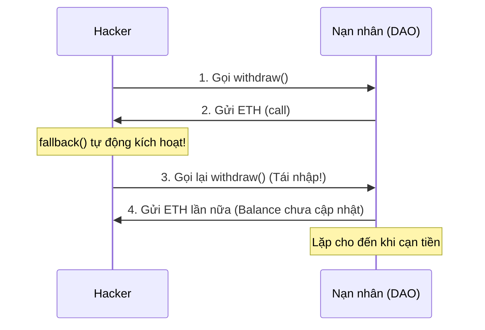
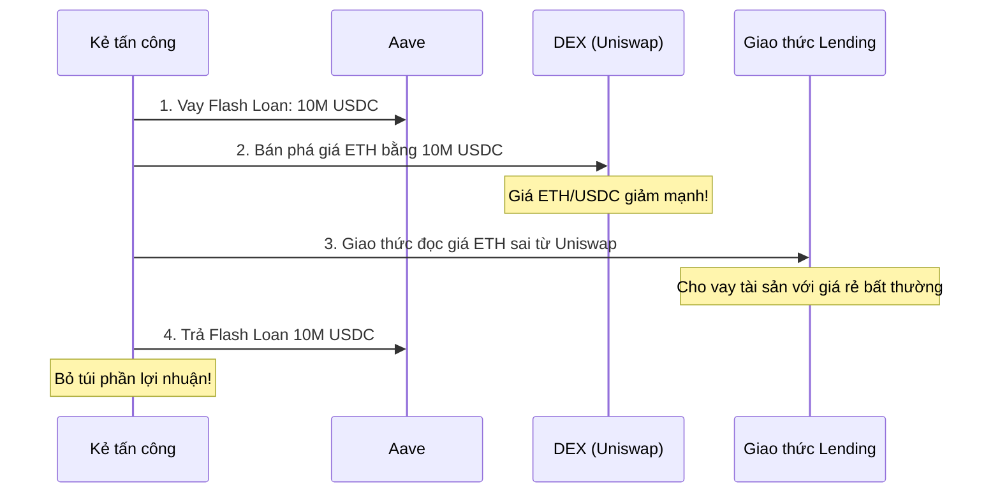
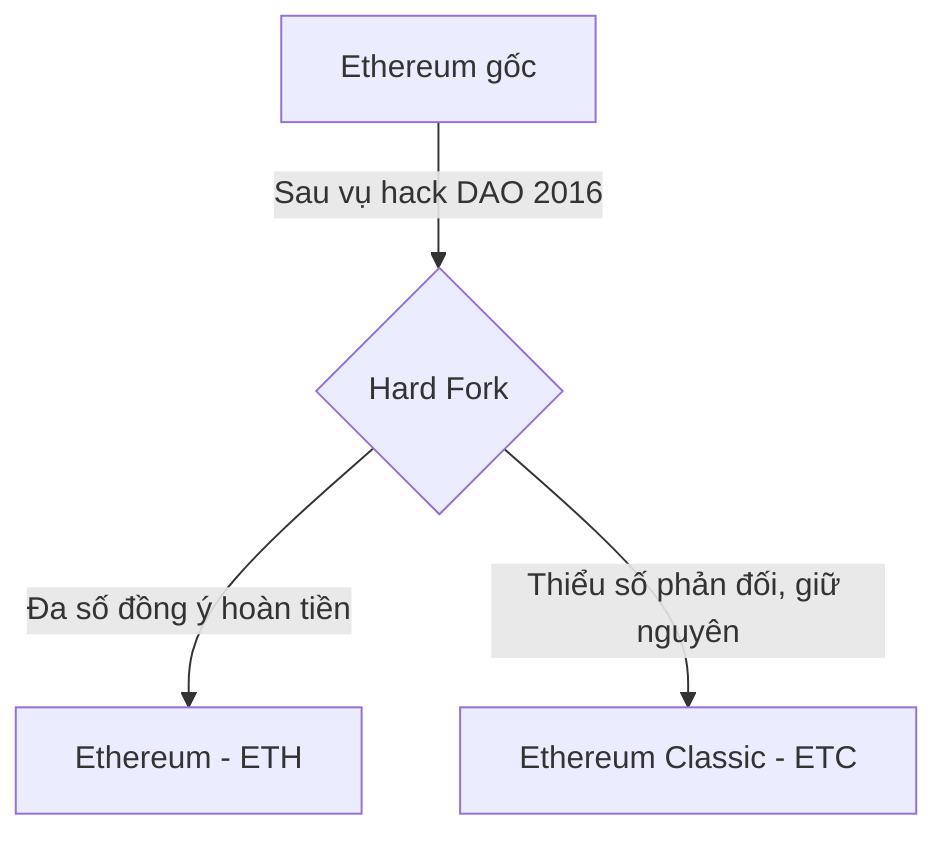

# Buổi 8 - Bảo mật và các Lỗ hổng trong Smart Contract

> **Môn học:** Blockchain: Nền tảng, Ứng dụng & Bảo mật  
> **Giảng viên:** ThS. Trần Tuấn Dũng — UIT / Blockchainist Research Team

---

## Mục tiêu buổi học

!!! info "Hôm nay, chúng ta sẽ học cách suy nghĩ như một hacker mũ trắng."

- **Hiểu** tại sao bảo mật Hợp đồng thông minh lại quan trọng và khó khăn đến vậy.
- **Nhận diện** và **phân tích** các lỗ hổng kinh điển: Reentrancy, Integer Overflow/Underflow, Oracle Manipulation, ...
- **Mô tả** được cách thức tấn công thông qua các lược đồ động.
- **Nắm vững** các phương pháp và quy tắc lập trình an toàn để phòng chống tấn công.

---

## Dẫn nhập

### "Code is Law"

> Mã nguồn là luật lệ. Nhưng điều gì xảy ra nếu luật lệ có kẽ hở?

!!! danger "Đã có hàng tỷ đô la bị đánh cắp từ các lỗ hổng Smart Contract."

Smart Contract có ba đặc điểm khiến bảo mật trở nên cực kỳ quan trọng:

- **Tính Bất biến (Immutability):** Một khi đã triển khai, mã nguồn không thể sửa đổi. Một con bọ (bug) sẽ tồn tại vĩnh viễn.
- **Tính Minh bạch (Transparency):** Mã nguồn thường được công khai. Hacker có thể tự do nghiên cứu để tìm ra điểm yếu.
- **Tài sản được kiểm soát trực tiếp bởi mã nguồn:** Không có nút "hoàn tác" hay bộ phận "chăm sóc khách hàng". Nếu tiền bị đánh cắp bởi một lỗ hổng, nó sẽ mất vĩnh viễn.

---

### Tư duy của Hacker: Mọi thứ đều Công khai

Để tìm ra lỗ hổng, bạn phải suy nghĩ như một kẻ tấn công. Trong thế giới blockchain:

- Mã nguồn của hợp đồng là công khai.
- Trạng thái của tất cả các biến là công khai.
- Tất cả các giao dịch trong quá khứ là công khai.
- Các giao dịch đang chờ xử lý trong **mempool** cũng là công khai.

!!! warning "Không có gì là bí mật. An ninh phải được đảm bảo ngay cả khi kẻ tấn công biết mọi thứ về hệ thống của bạn."

---

## Các lỗ hổng Smart Contract (SMC)

### 1. Tấn công Tái nhập (Reentrancy)

!!! danger "Đây là lỗ hổng nổi tiếng nhất, đã gây ra vụ hack The DAO lịch sử."

**Ví von thực tế: Giao dịch viên Ngân hàng đãng trí**

> 1. Bạn yêu cầu rút 10 triệu.
> 2. Giao dịch viên đưa tiền cho bạn trước.
> 3. Trong lúc anh ta chuẩn bị cập nhật số dư vào sổ sách, bạn lại hét lên "Tôi muốn rút 10 triệu nữa!".
> 4. Anh ta nhìn vào sổ, thấy bạn vẫn còn tiền, và lại đưa cho bạn. Bạn lặp lại điều này cho đến khi hết tiền trong quầy.

**Lỗi ở đây là: Thực hiện hành động (trả tiền) TRƯỚC khi cập nhật trạng thái (trừ số dư).**

#### Luồng tấn công Reentrancy



#### Code dễ bị tấn công

```solidity
contract EtherBank {
    mapping(address => uint) public balances;

    function withdraw(uint _amount) public {
        require(balances[msg.sender] >= _amount);

        // LỖI: Gửi ETH trước khi cập nhật số dư
        (bool sent, ) = msg.sender.call{value: _amount}("");
        require(sent, "Failed to send Ether");

        balances[msg.sender] -= _amount; // Quá muộn!
    }
}
```

#### Phòng chống: Pattern Checks-Effects-Interactions (CEI)

!!! success "Đây là một quy tắc vàng trong lập trình Solidity."

- **Checks (Kiểm tra):** Kiểm tra tất cả các điều kiện đầu vào (ví dụ: người dùng có đủ số dư không?).
- **Effects (Tác động):** Thay đổi trạng thái của hợp đồng (ví dụ: trừ số dư của người dùng **NGAY LẬP TỨC**).
- **Interactions (Tương tác):** Tương tác với các hợp đồng bên ngoài (ví dụ: gửi ETH — làm **SAU CÙNG**).

```solidity
function withdraw(uint _amount) public {
    // 1. Checks
    require(balances[msg.sender] >= _amount);

    // 2. Effects - Cập nhật trạng thái TRƯỚC
    balances[msg.sender] -= _amount;

    // 3. Interactions - Gửi ETH SAU CÙNG
    (bool sent, ) = msg.sender.call{value: _amount}("");
    require(sent, "Failed to send Ether");
}
```

---

### 2. Tràn số Nguyên (Integer Overflow/Underflow)

**Ví von thực tế: Đồng hồ công-tơ-mét xe máy cũ**

> Hãy tưởng tượng đồng hồ đo quãng đường của bạn chỉ có 6 chữ số. Khi bạn đi đến **999,999 km**, điều gì xảy ra ở km tiếp theo?
>
> - Nó sẽ quay về **000,000**. Đây là **Overflow (tràn trên)**.
> - Ngược lại, nếu bạn có thể tua ngược đồng hồ từ 000,000, nó có thể quay về **999,999**. Đây là **Underflow (tràn dưới)**.

#### Tràn số trong Solidity (phiên bản cũ)

!!! warning "Trong các phiên bản Solidity < 0.8.0, các phép toán số học **không** tự động kiểm tra tràn số."

```solidity
// Dành cho Solidity < 0.8.0
pragma solidity ^0.7.0;

contract Token {
    mapping(address => uint256) public balanceOf;

    function transfer(address _to, uint256 _value) public {
        // LỖI: Nếu balanceOf[msg.sender] < _value,
        // kết quả sẽ bị "tràn dưới" và trở thành một số cực lớn!
        balanceOf[msg.sender] -= _value;
        balanceOf[_to] += _value;
    }
}
```

!!! danger "Kẻ tấn công có 0 token có thể chuyển một lượng token khổng lồ cho chính mình."

#### Phòng chống Tràn số

??? tip "Cách 1: Nâng cấp phiên bản Solidity (Tốt nhất)"
    Từ phiên bản **Solidity 0.8.0** trở lên, trình biên dịch đã tự động tích hợp sẵn cơ chế kiểm tra tràn số. Bất kỳ phép toán nào gây tràn số sẽ tự động bị `revert` (hủy bỏ giao dịch).

??? tip "Cách 2: Sử dụng thư viện SafeMath (Cho phiên bản cũ)"
    Thư viện **SafeMath** của OpenZeppelin cung cấp các hàm toán học an toàn (`.add()`, `.sub()`, `.mul()`) để thay thế các toán tử thông thường.

---

### 3. Thao túng Oracle (Oracle Manipulation)

**Oracle** là các dịch vụ cung cấp dữ liệu từ thế giới thực (off-chain) cho hợp đồng thông minh (on-chain), ví dụ như giá của ETH/USD.

!!! warning "Vấn đề"
    Nếu một giao thức DeFi (ví dụ: lending) dựa vào một nguồn cấp giá **không an toàn** (ví dụ: giá giao dịch tức thời từ một DEX duy nhất), kẻ tấn công có thể **tạm thời thao túng** giá đó để trục lợi.

#### Tấn công Oracle bằng Flash Loan



#### Phòng chống Thao túng Oracle

- **Không bao giờ tin vào một nguồn giá duy nhất:** Sử dụng nhiều nguồn oracle và lấy giá trị trung bình hoặc trung vị.
- **Sử dụng Time-Weighted Average Price (TWAP):** Thay vì lấy giá giao dịch tức thời, hãy lấy giá trung bình trong một khoảng thời gian (ví dụ: 30 phút). Điều này khiến việc thao túng giá trong một giao dịch đơn lẻ trở nên vô cùng tốn kém.
- **Sử dụng các dịch vụ Oracle uy tín:** **Chainlink** là giải pháp oracle phi tập trung hàng đầu, được thiết kế để chống lại các loại tấn công này.

---

### 4. Các Lỗ hổng Phổ biến khác

| Lỗ hổng | Mô tả | Cách phòng chống |
|---|---|---|
| **Front-Running** | Kẻ tấn công xem các giao dịch đang chờ trong mempool và gửi một giao dịch với phí gas cao hơn để được thực thi trước. | Sử dụng cơ chế commit-reveal, hoặc các giải pháp như Flashbots. |
| **Kiểm soát Truy cập Sai (Access Control)** | Các hàm quan trọng (ví dụ: thay đổi chủ sở hữu, rút tiền) không được bảo vệ và có thể được gọi bởi bất kỳ ai. | Sử dụng các modifier như `onlyOwner`, và đặt visibility là `private`/`internal` khi cần thiết. |
| **Phụ thuộc vào `tx.origin`** | Sử dụng `tx.origin` để xác thực có thể bị tấn công phishing. Kẻ tấn công lừa bạn gọi một hợp đồng trung gian. | Luôn sử dụng `msg.sender` để xác thực người gọi trực tiếp. |

---

## Case Study: Vụ hack The DAO (2016)

!!! example "Vụ tấn công định hình nên lịch sử Ethereum"

- The DAO là một trong những DAO đầu tiên, huy động được **150 triệu USD** (tương đương 12.7 triệu ETH lúc đó).
- **Lỗ hổng:** Reentrancy.
- **Hậu quả:** Một hacker đã rút ruột **3.6 triệu ETH**, tương đương ~50 triệu USD.
- **Giải pháp gây tranh cãi:** Cộng đồng Ethereum đã bỏ phiếu thực hiện một **Hard Fork** để "quay ngược thời gian" và trả lại số tiền bị đánh cắp.
- **Kết quả:** Chuỗi mới tiếp tục là **Ethereum (ETH)**. Một nhóm nhỏ phản đối hard fork đã ở lại chuỗi cũ, tạo ra **Ethereum Classic (ETC)**.



---

---

## Bộ câu hỏi trắc nghiệm (50+ câu)

---

### Phần 1 — Dẫn nhập & Tư duy Bảo mật

**Câu 1.** Trong bối cảnh Smart Contract, câu nói "Code is Law" có hàm ý chính là gì?

- A. Lập trình viên có quyền lực tuyệt đối.
- B. Mã nguồn là pháp luật — mọi thứ được thực thi chính xác theo những gì được viết, không có ngoại lệ.
- C. Blockchain tuân theo pháp luật của từng quốc gia.
- D. Chỉ có Smart Contract được pháp luật công nhận mới hợp lệ.

??? success "Đáp án: B"
    Câu nói này nhấn mạnh rằng hợp đồng thực thi tự động theo đúng mã nguồn, không phụ thuộc vào bên thứ ba hay ý định của người viết — dù tốt hay xấu.

---

**Câu 2.** Tính **Immutability (Bất biến)** của Smart Contract tạo ra rủi ro bảo mật gì?

- A. Hacker có thể dễ dàng thay đổi mã nguồn.
- B. Một khi bug tồn tại trong mã, nó sẽ tồn tại vĩnh viễn và không thể vá.
- C. Contract không thể nhận tiền từ bên ngoài.
- D. Người dùng không thể tương tác với contract.

??? success "Đáp án: B"
    Không như phần mềm truyền thống có thể cập nhật bản vá, Smart Contract đã triển khai không thể sửa đổi, nên mọi bug đều trở thành vĩnh viễn.

---

**Câu 3.** Tính **Transparency (Minh bạch)** của Smart Contract có lợi cho hacker như thế nào?

- A. Hacker không thể lợi dụng tính minh bạch.
- B. Hacker có thể tự do nghiên cứu mã nguồn công khai để tìm ra điểm yếu.
- C. Mã nguồn bị mã hóa nên hacker không đọc được.
- D. Hacker cần quyền admin mới đọc được mã nguồn.

??? success "Đáp án: B"
    Mã nguồn thường được công khai trên blockchain explorers, cho phép bất kỳ ai — kể cả hacker — nghiên cứu kỹ lưỡng trước khi tấn công.

---

**Câu 4.** Điều gì xảy ra nếu tiền bị đánh cắp do lỗ hổng Smart Contract?

- A. Công ty bảo hiểm sẽ hoàn tiền.
- B. Bộ phận "chăm sóc khách hàng" có thể hoàn tác giao dịch.
- C. Tiền sẽ mất vĩnh viễn vì không có nút "hoàn tác".
- D. Cảnh sát có thể truy hồi tiền từ blockchain.

??? success "Đáp án: C"
    Blockchain không có cơ chế hoàn tác mặc định. Trừ trường hợp đặc biệt như Hard Fork (The DAO), tiền mất là mất.

---

**Câu 5.** Trong thế giới blockchain, thông tin nào KHÔNG phải là công khai?

- A. Mã nguồn của hợp đồng.
- B. Trạng thái của tất cả các biến.
- C. Tất cả các giao dịch trong quá khứ.
- D. Private key của người dùng.

??? success "Đáp án: D"
    Private key là thông tin bí mật duy nhất trong hệ thống — tất cả dữ liệu on-chain (mã nguồn, biến, giao dịch, mempool) đều công khai.

---

**Câu 6.** Khu vực **mempool** chứa gì?

- A. Các block đã được xác nhận.
- B. Smart Contract đã triển khai.
- C. Các giao dịch đang chờ xử lý (chưa được đưa vào block).
- D. Mã nguồn của các dApp.

??? success "Đáp án: C"
    Mempool (memory pool) là nơi tập kết các giao dịch chưa được miner/validator xử lý, và nó hoàn toàn công khai — đây là cơ sở của tấn công Front-Running.

---

### Phần 2 — Reentrancy

**Câu 7.** Lỗ hổng **Reentrancy** xảy ra do nguyên nhân cốt lõi nào?

- A. Sử dụng phiên bản Solidity quá cũ.
- B. Thực hiện hành động bên ngoài (gửi ETH) TRƯỚC khi cập nhật trạng thái nội bộ.
- C. Thiếu kiểm tra số dư người dùng.
- D. Hàm `withdraw` không có modifier `public`.

??? success "Đáp án: B"
    Đây là lỗi logic: gửi ETH cho người dùng (tương tác bên ngoài) trước khi trừ số dư (cập nhật state). Kẻ tấn công có thể tái nhập vào hàm trong khi số dư chưa bị trừ.

---

**Câu 8.** Trong ví von "Giao dịch viên Ngân hàng đãng trí", lỗi của giao dịch viên tương ứng với điều gì trong Smart Contract?

- A. Không kiểm tra CMND của khách hàng.
- B. Đưa tiền cho khách trước khi ghi vào sổ sách (cập nhật số dư).
- C. Không yêu cầu mật khẩu.
- D. Giao dịch vào ngày cuối tuần.

??? success "Đáp án: B"
    Giao dịch viên đưa tiền (= gửi ETH) trước khi cập nhật sổ sách (= trừ `balances[msg.sender]`), tương tự chính xác với lỗi trong contract dễ bị Reentrancy.

---

**Câu 9.** Vụ hack nào lịch sử nhất liên quan đến lỗ hổng Reentrancy?

- A. Vụ hack Binance 2019.
- B. Vụ hack The DAO 2016.
- C. Vụ hack Mt. Gox 2014.
- D. Vụ hack Poly Network 2021.

??? success "Đáp án: B"
    Vụ hack The DAO năm 2016 là vụ tấn công Reentrancy nổi tiếng nhất, khiến 3.6 triệu ETH bị đánh cắp.

---

**Câu 10.** Trong đoạn code `EtherBank` lỗi, dòng nào là nguyên nhân trực tiếp gây ra lỗ hổng?

```solidity
function withdraw(uint _amount) public {
    require(balances[msg.sender] >= _amount);
    (bool sent, ) = msg.sender.call{value: _amount}("");  // Dòng A
    require(sent, "Failed to send Ether");
    balances[msg.sender] -= _amount;                       // Dòng B
}
```

- A. `require(balances[msg.sender] >= _amount)` thừa.
- B. Dòng A (gửi ETH) được đặt trước Dòng B (cập nhật số dư).
- C. Sử dụng `.call` thay vì `.transfer`.
- D. Thiếu modifier `nonReentrant`.

??? success "Đáp án: B"
    Vấn đề là thứ tự: gửi ETH (Dòng A) trước khi trừ số dư (Dòng B). Kẻ tấn công có thể kích hoạt `fallback()` trong lúc giao dịch đang ở Dòng A để gọi lại `withdraw()` khi Dòng B chưa được thực thi.

---

**Câu 11.** Pattern **CEI** (Checks-Effects-Interactions) phòng chống Reentrancy như thế nào?

- A. Bằng cách mã hóa toàn bộ trạng thái hợp đồng.
- B. Cập nhật trạng thái (Effects) trước khi tương tác với bên ngoài (Interactions), nên khi re-enter xảy ra, số dư đã bị trừ rồi.
- C. Chặn hoàn toàn mọi external call.
- D. Yêu cầu xác thực 2 lớp trước mỗi giao dịch.

??? success "Đáp án: B"
    Khi trừ số dư trước (Effects) rồi mới gửi ETH (Interactions), kẻ tấn công tái nhập vào lần 2 sẽ thấy số dư đã bằng 0 và lệnh `require` sẽ thất bại.

---

**Câu 12.** Trong pattern CEI, bước "Effects" nên làm gì?

- A. Kiểm tra điều kiện đầu vào.
- B. Gửi ETH đến địa chỉ đích.
- C. Thay đổi trạng thái (state variables) của hợp đồng.
- D. Gọi hàm của hợp đồng khác.

??? success "Đáp án: C"
    Effects là bước thay đổi trạng thái nội bộ như trừ số dư, cập nhật mapping, thay đổi biến trạng thái — phải làm trước khi tương tác bên ngoài.

---

**Câu 13.** Vì sao hàm `fallback()` trong contract của Hacker lại quan trọng trong tấn công Reentrancy?

- A. Nó khởi tạo số dư ban đầu cho hacker.
- B. Nó được tự động kích hoạt khi hacker nhận ETH, cho phép gọi lại `withdraw()` ngay lập tức.
- C. Nó ẩn địa chỉ của hacker.
- D. Nó bypass bước `require` kiểm tra số dư.

??? success "Đáp án: B"
    Khi contract nạn nhân gửi ETH đến contract của hacker bằng `.call`, hàm `fallback()` (hoặc `receive()`) trong contract hacker tự động được kích hoạt, và hacker đã lập trình để nó gọi lại `withdraw()`.

---

**Câu 14.** Trong phiên bản code **đã vá** theo CEI:

```solidity
balances[msg.sender] -= _amount;  // Dòng X
(bool sent, ) = msg.sender.call{value: _amount}("");  // Dòng Y
```

Nếu kẻ tấn công cố gắng tái nhập, điều gì xảy ra?

- A. Tái nhập thành công, ETH tiếp tục bị rút.
- B. Dòng X đã trừ số dư, nên khi tái nhập, `require(balances[msg.sender] >= _amount)` sẽ thất bại.
- C. Contract bị crash hoàn toàn.
- D. Giao dịch của hacker bị block bởi miner.

??? success "Đáp án: B"
    Đây chính là lý do CEI hoạt động: khi Dòng X đã thực thi, số dư đã về 0 (hoặc giá trị đúng), nên lần tái nhập tiếp theo `require` sẽ fail và revert.

---

### Phần 3 — Integer Overflow/Underflow

**Câu 15.** **Integer Overflow** là gì?

- A. Biến số nguyên bị xóa khỏi bộ nhớ.
- B. Khi một phép tính tạo ra kết quả vượt quá giá trị tối đa mà kiểu dữ liệu có thể lưu trữ, kết quả "quay vòng" về giá trị nhỏ nhất.
- C. Khi biến chứa quá nhiều ký tự chuỗi.
- D. Khi gas không đủ để thực hiện phép tính.

??? success "Đáp án: B"
    Ví dụ: `uint8` tối đa là 255. Nếu tính 255 + 1, kết quả sẽ là 0 — quay vòng về giá trị nhỏ nhất của kiểu dữ liệu.

---

**Câu 16.** **Integer Underflow** là gì?

- A. Khi một phép tính tạo ra kết quả nhỏ hơn giá trị tối thiểu, kết quả "quay vòng" về giá trị lớn nhất.
- B. Khi biến chứa giá trị âm.
- C. Khi phép chia cho 0 xảy ra.
- D. Khi biến bị đặt về 0 do lỗi.

??? success "Đáp án: A"
    Ví dụ: `uint256` nhỏ nhất là 0. Nếu tính 0 - 1, kết quả sẽ là 2^256 - 1 (giá trị tối đa) — đây là Underflow.

---

**Câu 17.** Trong đồng hồ công-tơ-mét 6 chữ số: nếu hiện 000,000 và tua ngược 1, sẽ hiện:

- A. 000,001
- B. -000,001
- C. 999,999
- D. Báo lỗi

??? success "Đáp án: C"
    Đây chính là ví von cho Underflow — khi giá trị nhỏ nhất bị trừ thêm, nó "quay vòng" về giá trị lớn nhất (999,999 trong ví dụ 6 chữ số).

---

**Câu 18.** Trong phiên bản Solidity nào, Overflow/Underflow **không** tự động được kiểm tra?

- A. Solidity >= 0.8.0
- B. Solidity < 0.8.0
- C. Solidity >= 0.6.0
- D. Tất cả các phiên bản

??? success "Đáp án: B"
    Trước Solidity 0.8.0, các phép toán số học không có kiểm tra tràn số tích hợp, lập trình viên phải tự xử lý bằng SafeMath.

---

**Câu 19.** Trong đoạn code Underflow:

```solidity
balanceOf[msg.sender] -= _value;
```

Nếu `balanceOf[msg.sender] = 0` và `_value = 1`, kết quả là?

- A. -1
- B. 0
- C. 2^256 - 1 (số cực lớn)
- D. Revert giao dịch (trên Solidity < 0.8.0)

??? success "Đáp án: C"
    Trên Solidity < 0.8.0, `uint256` không thể âm. Khi `0 - 1` xảy ra, kết quả tràn về `2^256 - 1` — số lớn nhất của `uint256`.

---

**Câu 20.** Hệ quả của lỗi Underflow trong contract Token ví dụ là gì?

- A. Contract bị hủy hoàn toàn.
- B. Kẻ tấn công có 0 token có thể "chuyển" và nhận một lượng token khổng lồ.
- C. Tất cả token của người dùng bị burn.
- D. Contract bị đóng băng.

??? success "Đáp án: B"
    `balanceOf[msg.sender] -= _value` với `balanceOf = 0` → tràn thành số cực lớn. Kẻ tấn công vừa tạo token cho mình mà không cần có gì ban đầu.

---

**Câu 21.** Từ **Solidity 0.8.0** trở lên, điều gì xảy ra khi có Overflow/Underflow?

- A. Kết quả tự wrap-around như phiên bản cũ.
- B. Giao dịch tự động bị `revert`.
- C. Compiler báo warning nhưng vẫn chạy.
- D. Biến được đặt về 0.

??? success "Đáp án: B"
    Solidity >= 0.8.0 tích hợp kiểm tra tràn số vào runtime. Mọi phép toán gây overflow/underflow đều tự động revert toàn bộ giao dịch.

---

**Câu 22.** Thư viện **SafeMath** của OpenZeppelin có tác dụng gì?

- A. Mã hóa các phép tính toán học.
- B. Cung cấp các hàm toán học an toàn (`.add()`, `.sub()`, `.mul()`) tự kiểm tra tràn số cho Solidity < 0.8.0.
- C. Tăng tốc độ tính toán trên blockchain.
- D. Chuyển đổi kiểu dữ liệu tự động.

??? success "Đáp án: B"
    SafeMath là giải pháp cho Solidity phiên bản cũ, thêm kiểm tra overflow/underflow vào từng phép tính thông qua các hàm thay thế.

---

**Câu 23.** Cách phòng chống Overflow/Underflow **tốt nhất** hiện nay là gì?

- A. Dùng SafeMath trong mọi trường hợp.
- B. Nâng cấp lên Solidity >= 0.8.0 vì đã tích hợp sẵn kiểm tra tràn số.
- C. Thêm `require` trước mọi phép tính.
- D. Chuyển sang dùng `int256` thay vì `uint256`.

??? success "Đáp án: B"
    Solidity >= 0.8.0 là giải pháp tốt nhất và đơn giản nhất — không cần thêm thư viện, kiểm tra được tích hợp ngay trong compiler.

---

### Phần 4 — Oracle Manipulation

**Câu 24.** **Oracle** trong blockchain là gì?

- A. Một loại Smart Contract đặc biệt có thể thay đổi sau khi triển khai.
- B. Dịch vụ cung cấp dữ liệu từ thế giới thực (off-chain) cho Smart Contract (on-chain).
- C. Một cơ sở dữ liệu phi tập trung lưu trữ lịch sử giao dịch.
- D. Công cụ kiểm tra bảo mật Smart Contract tự động.

??? success "Đáp án: B"
    Oracle là cầu nối giữa blockchain (on-chain) và thế giới thực (off-chain), cung cấp dữ liệu như giá tài sản, dữ liệu thời tiết, kết quả thể thao... cho Smart Contract.

---

**Câu 25.** Tại sao Smart Contract không thể tự lấy dữ liệu giá từ internet?

- A. Blockchain không hỗ trợ kết nối HTTP.
- B. Smart Contract là môi trường deterministic — mọi node phải tính ra cùng kết quả. Nếu mỗi node tự fetch giá khác nhau, blockchain sẽ mâu thuẫn.
- C. Dữ liệu internet quá lớn để lưu on-chain.
- D. Cả A và B.

??? success "Đáp án: D"
    Blockchain cần tính deterministic để đồng thuận. Mỗi validator phải cho ra kết quả giống nhau khi thực thi cùng transaction — điều này không thể đảm bảo nếu mỗi node tự fetch data từ internet.

---

**Câu 26.** Trong tấn công Oracle Manipulation sử dụng Flash Loan, bước đầu tiên của kẻ tấn công là gì?

- A. Thao túng giá trực tiếp trên Chainlink.
- B. Hack vào server của giao thức lending.
- C. Vay một lượng lớn tài sản (Flash Loan) từ một giao thức như Aave.
- D. Tạo một token giả mạo.

??? success "Đáp án: C"
    Kẻ tấn công cần vốn lớn để thao túng giá DEX, và Flash Loan cho phép vay số tiền khổng lồ mà không cần thế chấp, miễn là hoàn trả trong cùng một giao dịch.

---

**Câu 27.** Bước "thao túng DEX" trong cuộc tấn công Flash Loan Oracle diễn ra như thế nào?

- A. Hacker tấn công trực tiếp vào smart contract của DEX.
- B. Hacker dùng lượng tiền vay khổng lồ để mua/bán tài sản, làm giá lệch nghiêm trọng trong một thời điểm ngắn.
- C. Hacker giả mạo danh tính validator để thay đổi giá.
- D. Hacker khai thác lỗ hổng trong giao diện frontend của DEX.

??? success "Đáp án: B"
    Flash Loan cho phép dùng 10 triệu USDC để bán ồ ạt ETH, đẩy giá ETH/USDC xuống thấp bất thường. Đây không phải hack DEX mà là lợi dụng cơ chế AMM hợp lệ.

---

**Câu 28.** Điểm yếu cốt lõi bị khai thác trong tấn công Oracle bằng Flash Loan là gì?

- A. Lỗ hổng trong giao thức Flash Loan.
- B. Giao thức Lending dùng giá giao dịch tức thời (spot price) từ một DEX duy nhất làm oracle.
- C. Giao thức Lending không có hàm kiểm tra số dư.
- D. DEX không có cơ chế anti-bot.

??? success "Đáp án: B"
    Vấn đề là giao thức lending tin tưởng vào một nguồn giá duy nhất có thể bị thao túng. Giá spot từ một DEX dễ bị ảnh hưởng bởi một giao dịch lớn.

---

**Câu 29.** **TWAP (Time-Weighted Average Price)** giúp phòng chống Oracle Manipulation như thế nào?

- A. Lấy giá từ nhiều blockchain khác nhau.
- B. Yêu cầu xác nhận từ nhiều validator trước khi cập nhật giá.
- C. Lấy giá trung bình trong một khoảng thời gian (ví dụ 30 phút), khiến việc thao túng tốn kém vì phải duy trì giá lệch trong nhiều block.
- D. Mã hóa dữ liệu giá để hacker không đọc được.

??? success "Đáp án: C"
    Flash Loan chỉ tồn tại trong một transaction (một block). Với TWAP 30 phút, kẻ tấn công phải duy trì giá lệch qua nhiều block liên tục — chi phí sẽ vô cùng lớn.

---

**Câu 30.** **Chainlink** là giải pháp oracle như thế nào?

- A. Một oracle tập trung do một công ty duy nhất vận hành.
- B. Một oracle phi tập trung, lấy dữ liệu từ nhiều node độc lập và tổng hợp để tránh điểm thất bại đơn lẻ.
- C. Một DEX cung cấp dữ liệu giá on-chain.
- D. Một công cụ kiểm tra bảo mật của Ethereum Foundation.

??? success "Đáp án: B"
    Chainlink là mạng oracle phi tập trung — nhiều node độc lập cung cấp dữ liệu, kết quả được tổng hợp, làm cho việc thao túng cực kỳ khó và tốn kém.

---

**Câu 31.** Tại sao Flash Loan KHÔNG phải là "lỗ hổng" tự thân?

- A. Flash Loan luôn hợp pháp và không gây hại.
- B. Flash Loan là tính năng hợp lệ của DeFi; vấn đề nằm ở các giao thức sử dụng nguồn giá kém an toàn có thể bị thao túng.
- C. Flash Loan chỉ có thể được dùng bởi các tổ chức tài chính được cấp phép.
- D. Flash Loan tự động revert nếu bị dùng cho mục đích xấu.

??? success "Đáp án: B"
    Flash Loan là sản phẩm tài chính hợp lệ. Lỗ hổng thực sự nằm ở giao thức lending dùng spot price không bảo mật — Flash Loan chỉ là công cụ để khuếch đại vấn đề.

---

### Phần 5 — Các Lỗ hổng Khác

**Câu 32.** Tấn công **Front-Running** là gì?

- A. Hacker tấn công người dùng trước khi họ đăng ký tài khoản.
- B. Kẻ tấn công theo dõi mempool, nhìn thấy giao dịch chờ xử lý của nạn nhân và gửi giao dịch tương tự với gas cao hơn để được thực thi trước.
- C. Hacker can thiệp vào giao tiếp giữa frontend và blockchain.
- D. Tấn công nhắm vào block đầu tiên của chuỗi.

??? success "Đáp án: B"
    Mempool là công khai, nên kẻ tấn công có thể "nhảy hàng" bằng cách trả phí gas cao hơn để miner ưu tiên transaction của họ trước.

---

**Câu 33.** Cơ chế **commit-reveal** giúp chống Front-Running như thế nào?

- A. Người dùng gửi hash của hành động trước (commit), sau đó mới tiết lộ hành động thực (reveal) ở bước sau — kẻ front-runner không biết hành động thực khi commit.
- B. Tất cả giao dịch được mã hóa bằng key của validator.
- C. Người dùng phải xác nhận giao dịch 2 lần.
- D. Smart Contract tự chọn thứ tự xử lý giao dịch ngẫu nhiên.

??? success "Đáp án: A"
    Bước commit chỉ gửi hash (không tiết lộ nội dung), nên kẻ front-runner nhìn thấy giao dịch nhưng không biết hành động thực. Đến bước reveal mới tiết lộ — lúc đó quá muộn để front-run.

---

**Câu 34.** Lỗ hổng **Access Control Sai** (Kiểm soát Truy cập Sai) là gì?

- A. Người dùng có thể truy cập blockchain mà không cần private key.
- B. Các hàm quan trọng (rút tiền, thay đổi owner) không được bảo vệ và có thể gọi bởi bất kỳ ai.
- C. Contract không có hàm `receive()` để nhận ETH.
- D. Biến trạng thái bị khai báo `public` thay vì `private`.

??? success "Đáp án: B"
    Nếu hàm như `setOwner()` hay `withdrawAll()` không có kiểm tra quyền truy cập, bất kỳ ai cũng có thể gọi chúng và chiếm quyền kiểm soát contract.

---

**Câu 35.** Modifier **`onlyOwner`** giải quyết vấn đề gì?

- A. Ngăn Overflow/Underflow.
- B. Đảm bảo chỉ có chủ sở hữu hợp đồng mới có thể gọi hàm được bảo vệ.
- C. Tự động revert khi Reentrancy xảy ra.
- D. Mã hóa dữ liệu đầu vào.

??? success "Đáp án: B"
    `onlyOwner` là modifier phổ biến trong OpenZeppelin, thêm `require(msg.sender == owner)` vào đầu hàm, ngăn người không phải chủ sở hữu gọi hàm quan trọng.

---

**Câu 36.** Tại sao sử dụng **`tx.origin`** để xác thực người dùng lại nguy hiểm?

- A. `tx.origin` luôn trả về giá trị null.
- B. `tx.origin` là địa chỉ của người khởi tạo giao dịch gốc, không phải người gọi trực tiếp. Nếu nạn nhân bị lừa gọi một contract trung gian, `tx.origin` vẫn là nạn nhân.
- C. `tx.origin` bị deprecated từ Solidity 0.8.0.
- D. `tx.origin` chỉ hoạt động trên mainnet, không hoạt động trên testnet.

??? success "Đáp án: B"
    Kẻ tấn công có thể tạo contract độc hại, lừa nạn nhân gọi. Khi đó `tx.origin = nạn nhân` nhưng `msg.sender = contract độc hại`. Nếu contract nạn nhân dùng `tx.origin`, nó nghĩ đang được chính nạn nhân gọi, trong khi thực ra là bị phishing.

---

**Câu 37.** Biến nào nên dùng để xác thực người gọi trực tiếp trong Solidity?

- A. `tx.origin`
- B. `block.timestamp`
- C. `msg.sender`
- D. `msg.value`

??? success "Đáp án: C"
    `msg.sender` luôn là địa chỉ của người/contract gọi trực tiếp hàm hiện tại — đây là biến đúng để xác thực quyền truy cập.

---

**Câu 38.** Flashbots giúp giải quyết vấn đề gì?

- A. Tăng tốc độ giao dịch trên Ethereum.
- B. Giảm thiểu tác hại của Front-Running bằng cách cho phép gửi giao dịch private (không qua mempool công khai).
- C. Tự động kiểm tra lỗ hổng trong Smart Contract.
- D. Cung cấp dịch vụ oracle phi tập trung.

??? success "Đáp án: B"
    Flashbots tạo ra kênh giao tiếp riêng giữa người dùng và miner/validator, cho phép giao dịch đi thẳng mà không xuất hiện trong mempool công khai — loại bỏ cơ hội front-run.

---

### Phần 6 — Case Study: The DAO Hack

**Câu 39.** The DAO huy động được bao nhiêu tiền trước khi bị hack?

- A. 10 triệu USD
- B. 50 triệu USD
- C. 150 triệu USD (12.7 triệu ETH lúc đó)
- D. 1 tỷ USD

??? success "Đáp án: C"
    The DAO huy động được 150 triệu USD tương đương 12.7 triệu ETH vào năm 2016 — một kỷ lục crowdfunding lúc bấy giờ.

---

**Câu 40.** Kẻ tấn công đã rút được bao nhiêu ETH trong vụ hack The DAO?

- A. 1 triệu ETH
- B. 3.6 triệu ETH (~50 triệu USD)
- C. 12.7 triệu ETH (toàn bộ)
- D. 500,000 ETH

??? success "Đáp án: B"
    Kẻ tấn công rút được 3.6 triệu ETH, tương đương khoảng 50 triệu USD — một phần đáng kể của quỹ.

---

**Câu 41.** Giải pháp nào được cộng đồng Ethereum thực hiện để xử lý hậu quả vụ hack The DAO?

- A. Bắt giam và truy tố hacker.
- B. Tất cả ETH bị mất được bảo hiểm bởi Ethereum Foundation.
- C. Thực hiện Hard Fork để "quay ngược thời gian" và hoàn trả số tiền bị đánh cắp.
- D. Đóng băng toàn bộ mạng Ethereum và khởi động lại.

??? success "Đáp án: C"
    Cộng đồng bỏ phiếu thực hiện Hard Fork — thay đổi quy tắc giao thức để xóa các giao dịch tấn công, hoàn trả ETH cho chủ nhân ban đầu.

---

**Câu 42.** **Ethereum Classic (ETC)** ra đời như thế nào?

- A. Được Ethereum Foundation tạo ra để thử nghiệm tính năng mới.
- B. Một nhóm nhỏ phản đối hard fork, giữ nguyên chuỗi gốc (không rollback), tạo ra Ethereum Classic.
- C. Kẻ tấn công tạo ra ETC để rửa tiền.
- D. ETC là phiên bản Ethereum dành cho doanh nghiệp.

??? success "Đáp án: B"
    Những người theo triết lý "Code is Law" tuyệt đối — ngay cả khi kết quả là mất tiền — từ chối hard fork và tiếp tục chuỗi gốc, tạo thành Ethereum Classic.

---

**Câu 43.** Vụ hack The DAO cho thấy hệ quả quan trọng nào về tính bất biến của blockchain?

- A. Blockchain luôn có thể bị rollback nếu cộng đồng đồng ý.
- B. Khi có consensus, cộng đồng có thể thực hiện hard fork để can thiệp, nhưng điều này gây tranh cãi vì vi phạm triết lý "Code is Law".
- C. Bất biến là đặc tính tuyệt đối, không có ngoại lệ.
- D. Ethereum không thực sự là blockchain bất biến.

??? success "Đáp án: B"
    Đây là bài học triết lý lớn: blockchain về kỹ thuật là bất biến, nhưng về mặt xã hội, nếu đủ người đồng ý, hard fork có thể thực hiện — tuy nhiên điều này phân rẽ cộng đồng.

---

### Phần 7 — Câu hỏi tổng hợp & nâng cao

**Câu 44.** Một developer viết hàm rút tiền với thứ tự: (1) kiểm tra số dư, (2) gửi ETH, (3) trừ số dư. Hàm này vi phạm nguyên tắc nào?

- A. DRY (Don't Repeat Yourself)
- B. CEI (Checks-Effects-Interactions) — bước Interactions đặt trước Effects
- C. SOLID
- D. KISS (Keep It Simple Stupid)

??? success "Đáp án: B"
    Thứ tự đúng theo CEI phải là: (1) Checks → (2) Effects (trừ số dư) → (3) Interactions (gửi ETH). Đặt gửi ETH trước trừ số dư vi phạm pattern này.

---

**Câu 45.** Điểm khác biệt chính giữa `transfer` / `send` và `call` trong Solidity về mặt bảo mật Reentrancy là gì?

- A. `transfer` và `send` giới hạn gas 2300 (đủ để log, không đủ để gọi lại hàm), trong khi `call` chuyển toàn bộ gas.
- B. `call` an toàn hơn vì nó có tích hợp chống Reentrancy.
- C. `transfer` không được dùng trong Solidity hiện đại.
- D. Không có sự khác biệt đáng kể.

??? success "Đáp án: A"
    `transfer` và `send` có stipend gas 2300 — quá ít để thực hiện thêm logic (như gọi lại hàm). `call` chuyển toàn bộ gas còn lại, cho phép hàm `fallback` của hacker chạy code phức tạp, bao gồm việc tái nhập.

---

**Câu 46.** Kẻ tấn công có thể lợi dụng thông tin **mempool** để làm gì?

- A. Chỉ đọc thông tin, không khai thác được.
- B. Thực hiện Front-Running bằng cách gửi giao dịch tương tự với gas cao hơn.
- C. Thao túng kết quả đồng thuận của validator.
- D. Xóa giao dịch của người khác khỏi mempool.

??? success "Đáp án: B"
    Mempool công khai cho phép "transaction snooping" — theo dõi giao dịch chờ và nhảy trước bằng cách trả gas cao hơn.

---

**Câu 47.** Điều nào sau đây là **sai** về Smart Contract?

- A. Mã nguồn thường được công khai trên blockchain.
- B. Một khi triển khai, mã nguồn có thể dễ dàng được cập nhật bởi developer.
- C. Tài sản được kiểm soát trực tiếp bởi code.
- D. Không có bộ phận "chăm sóc khách hàng" để hoàn tác giao dịch sai.

??? success "Đáp án: B"
    Smart Contract là bất biến sau khi triển khai. Muốn "cập nhật", developer phải triển khai contract mới và migrate — không thể sửa trực tiếp contract cũ.

---

**Câu 48.** Nếu một giao thức DeFi chỉ dùng giá spot từ một DEX duy nhất làm oracle, rủi ro chính là gì?

- A. Giá sẽ bị trễ vài giây so với thực tế.
- B. Kẻ tấn công có thể dùng Flash Loan để thao túng giá tức thời trên DEX đó và khai thác giao thức.
- C. Giao thức sẽ không nhận được giá khi DEX offline.
- D. Cả B và C.

??? success "Đáp án: D"
    Dùng một nguồn oracle duy nhất tạo ra cả hai rủi ro: (B) thao túng giá bằng Flash Loan, và (C) điểm thất bại đơn lẻ (Single Point of Failure) khi nguồn đó offline.

---

**Câu 49.** Nguyên tắc nào dưới đây **KHÔNG** phải là biện pháp phòng chống bảo mật Smart Contract?

- A. Cập nhật trạng thái trước khi gửi ETH (CEI pattern).
- B. Dùng `msg.sender` thay vì `tx.origin` để xác thực.
- C. Giữ nguyên phiên bản Solidity cũ để tương thích.
- D. Sử dụng nhiều nguồn oracle và lấy giá TWAP.

??? success "Đáp án: C"
    Giữ nguyên phiên bản Solidity cũ (< 0.8.0) là ngược lại với khuyến nghị bảo mật — nó giữ lại các rủi ro như Overflow/Underflow không được kiểm tra tự động.

---

**Câu 50.** Một developer viết code:

```solidity
pragma solidity ^0.7.0;
// ...
uint256 public totalSupply = 1000;
totalSupply -= 2000; // Người dùng burn 2000 token
```

Điều gì xảy ra?

- A. Giao dịch revert vì `totalSupply` không đủ.
- B. `totalSupply` = 0.
- C. `totalSupply` tràn về một số rất lớn (Underflow).
- D. Compiler báo lỗi và từ chối biên dịch.

??? success "Đáp án: C"
    Solidity ^0.7.0 không kiểm tra Underflow tự động. `1000 - 2000` với `uint256` sẽ wrap-around về `2^256 - 1000` — một số khổng lồ, không phải revert.

---

**Câu 51.** Trong mô hình tấn công Reentrancy, hàm `fallback()` của contract hacker đóng vai trò gì?

- A. Nhận ETH và tự động chuyển đến địa chỉ khác.
- B. Được kích hoạt tự động khi nhận ETH, cho phép gọi lại hàm `withdraw()` của nạn nhân trước khi trạng thái được cập nhật.
- C. Lưu trữ ETH nhận được để rút sau.
- D. Xác thực giao dịch của hacker trên blockchain.

??? success "Đáp án: B"
    Đây là "vũ khí" của cuộc tấn công. `fallback()` chạy khi contract nhận ETH. Hacker lập trình nó để ngay lập tức gọi lại `withdraw()` — tạo vòng lặp rút tiền.

---

**Câu 52.** Tại sao Hard Fork giải quyết vụ hack The DAO lại "gây tranh cãi"?

- A. Hard Fork làm chậm mạng Ethereum.
- B. Nó vi phạm triết lý "Code is Law" — can thiệp vào kết quả của smart contract, dù kết quả đó là do hack.
- C. Hard Fork quá tốn kém về chi phí kỹ thuật.
- D. Nhiều validator không biết cách nâng cấp phần mềm.

??? success "Đáp án: B"
    Những người theo "Code is Law" tuyệt đối cho rằng dù hack là sai về mặt đạo đức, smart contract đã chạy đúng theo code — cộng đồng không nên can thiệp. Đây là lý do Ethereum Classic ra đời.

---

**Câu 53.** Visibility **`private`** trong Solidity có ý nghĩa bảo mật gì?

- A. Hàm được mã hóa, không ai đọc được.
- B. Hàm chỉ có thể gọi từ trong cùng contract, ngăn contract ngoài và người dùng gọi trực tiếp.
- C. Hàm chỉ được gọi 1 lần duy nhất trong vòng đời contract.
- D. Hàm không tốn gas khi thực thi.

??? success "Đáp án: B"
    `private` giới hạn phạm vi gọi hàm trong nội bộ contract. Điều này ngăn các hàm nhạy cảm bị gọi từ bên ngoài hoặc từ contract con kế thừa.

---

**Câu 54.** Tại sao "Không có gì là bí mật" lại là nguyên tắc quan trọng khi thiết kế bảo mật Smart Contract?

- A. Vì blockchain không hỗ trợ lưu trữ mật khẩu.
- B. Vì toàn bộ mã nguồn, trạng thái biến, và lịch sử giao dịch đều công khai — bất kỳ cơ chế bảo mật nào dựa vào "bí mật" đều có thể bị bẻ.
- C. Vì luật pháp yêu cầu Smart Contract phải minh bạch.
- D. Vì hacker luôn có đủ tài nguyên để brute-force mọi mật khẩu.

??? success "Đáp án: B"
    Đây là nguyên tắc cốt lõi. Không thể giấu logic, giấu biến (chúng chỉ là `private` về API, không phải về dữ liệu), hay dựa vào sự mơ hồ. Bảo mật phải đến từ thiết kế đúng đắn, không phải sự ẩn giấu.

---

**Câu 55.** Một Smart Contract bị deploy với lỗi Reentrancy. Cách tốt nhất để xử lý là:

- A. Cập nhật mã nguồn của contract đang chạy.
- B. Liên hệ Ethereum Foundation để vá lỗi.
- C. Deploy một contract mới đã vá lỗi và di chuyển (migrate) tài sản sang contract mới.
- D. Đặt contract ở chế độ "maintenance" để dừng tất cả hoạt động vĩnh viễn.

??? success "Đáp án: C"
    Vì Smart Contract là bất biến, không thể sửa trực tiếp. Giải pháp phổ biến là dùng Proxy Pattern hoặc deploy contract mới và migrate tài sản — đây là lý do tại sao kiểm tra bảo mật **trước** khi deploy là cực kỳ quan trọng.

---

> **Ghi chú:** Bộ câu hỏi 55 câu bao phủ toàn bộ nội dung bài: Dẫn nhập & tư duy hacker (câu 1–6), Reentrancy (7–14), Overflow/Underflow (15–23), Oracle Manipulation (24–31), Các lỗ hổng khác (32–38), Case Study The DAO (39–43), và Câu hỏi tổng hợp/nâng cao (44–55).
