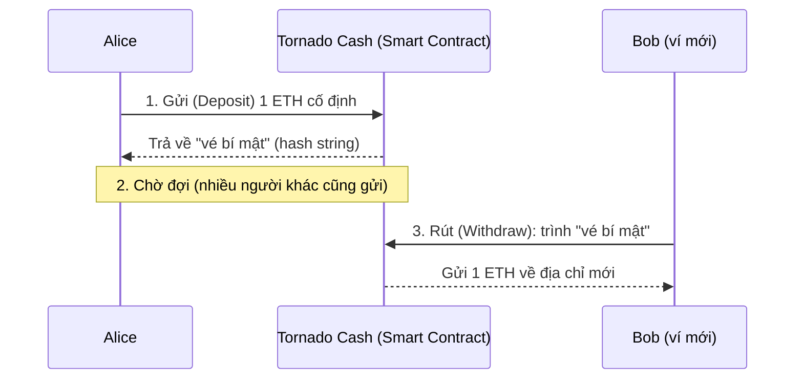
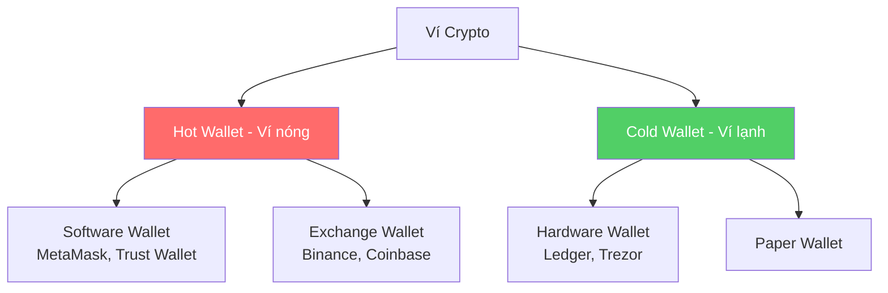
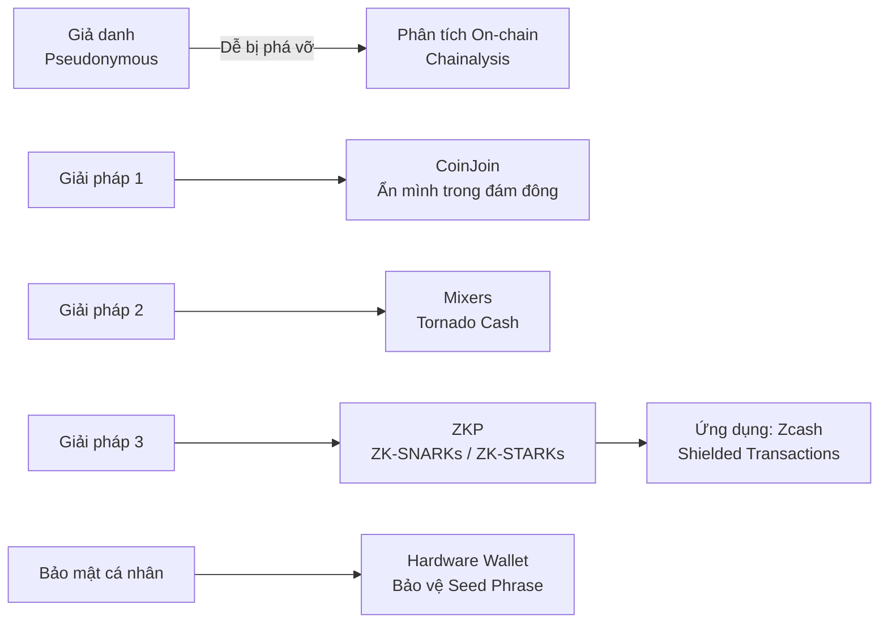

# Buổi 9 — Quyền riêng tư và các Giải pháp Bảo mật Nâng cao

> **Môn học:** Blockchain: Nền tảng, Ứng dụng & Bảo mật  
> **Giảng viên:** ThS. Trần Tuấn Dũng

---

## 1. Dẫn Nhập

Một trong những "tính năng" cốt lõi của blockchain là **sự minh bạch**: bất kỳ ai cũng có thể xem mọi giao dịch. Nhưng chính sự minh bạch này lại tạo ra một vấn đề lớn:

!!! question "Câu hỏi trọng tâm"
    **Làm thế nào để bảo vệ quyền riêng tư trong một hệ thống được thiết kế để mọi thứ đều công khai?**

---

## 2. Quyền Riêng Tư Trên Blockchain

### 2.1 Nghịch lý về Quyền Riêng Tư

Hầu hết các blockchain lớn như Bitcoin và Ethereum **không ẩn danh, mà là giả danh (pseudonymous)**:

- Mọi người thấy **địa chỉ (0x123...)** của bạn, nhưng không biết đó là bạn.
- **Vấn đề:** Một khi địa chỉ của bạn bị liên kết với danh tính thật (ví dụ: qua một giao dịch trên sàn CEX có KYC), toàn bộ lịch sử giao dịch sẽ bị phơi bày.

!!! example "Ví dụ trực quan"
    Điều này giống như bạn dùng một **bút danh duy nhất** cho mọi cuốn sách bạn viết. Nếu ai đó phát hiện ra bút danh đó là của bạn, họ sẽ biết tất cả những gì bạn đã viết.

### 2.2 Phân biệt các Khái Niệm

| Khái niệm | Mô tả | Ví dụ |
|---|---|---|
| **Giả danh (Pseudonymous)** | Danh tính được che giấu sau một định danh giả (địa chỉ). Hành động vẫn có thể được liên kết với định danh đó. | Bitcoin, Ethereum |
| **Ẩn danh (Anonymous)** | Không có định danh nào để liên kết các hành động với nhau. Mỗi hành động là riêng biệt. | Giao dịch bằng tiền mặt |
| **Riêng tư (Private)** | Chi tiết của hành động (người gửi, người nhận, số tiền) được che giấu hoàn toàn khỏi bên thứ ba. | Zcash, Monero |

### 2.3 Phân tích On-chain: Phá vỡ sự Giả danh

Các công ty phân tích blockchain (ví dụ: **Chainalysis**) có thể truy vết các giao dịch để liên kết các địa chỉ với nhau và với danh tính ngoài đời thực bằng cách:

- **Phân tích đồ thị giao dịch** để gom cụm các địa chỉ có thể thuộc về cùng một người/tổ chức.
- **Liên kết các địa chỉ** với các điểm tương tác off-chain đã biết (sàn giao dịch, dịch vụ thương mại, ...).

!!! warning "Kết luận"
    **Sự riêng tư trên các blockchain công khai rất mong manh.**

---

## 3. Các Giải Pháp Riêng Tư

### 3.1 Giải pháp 1: "Ẩn mình trong Đám đông" — CoinJoin

**Ý tưởng cơ bản:** Trộn lẫn giao dịch của bạn với nhiều người khác để gây khó khăn cho việc truy vết nguồn gốc của một khoản tiền cụ thể.

```
Trước CoinJoin:
  Alice (50 BTC) ──→ [Tx 1] ──→ 0.5 BTC → địa chỉ 1A1...
                              └─→ 49.5 BTC → địa chỉ 1B2...

Sau CoinJoin:
  Alice (0.5 BTC) ─┐
  Bob   (0.8 BTC) ─┤→ [Tx 2 gộp] ──→ 0.8 BTC → 1D4...
  Carol (0.3 BTC) ─┘              └─→ 0.8 BTC → 1E5...
                                  └─→ 0.8 BTC → ...
```

!!! info "CoinJoin (dành cho Bitcoin)"
    Nhiều người dùng cùng nhau tạo ra **một giao dịch lớn duy nhất**. Tất cả các UTXO đầu vào được gộp lại và chia ra các UTXO đầu ra **có giá trị bằng nhau**. Rất khó để xác định đầu vào nào tương ứng với đầu ra nào.

### 3.2 Giải pháp 2: Coin Mixer (Mixers trên Ethereum)

**Tornado Cash** là ví dụ kinh điển — hoạt động như một hệ thống "gửi và rút tiền ẩn danh":



> Vì nhiều người cùng gửi và rút, rất khó để liên kết giao dịch gửi và giao dịch rút của một người cụ thể.

!!! danger "Mặt tối của Mixers"
    Mặc dù là công cụ riêng tư mạnh mẽ, mixers cũng là **công cụ ưa thích của hacker và tội phạm mạng** để rửa tiền (money laundering) sau khi đánh cắp tài sản từ các vụ hack DeFi.

    Ví dụ điển hình: Bộ Tài chính Hoa Kỳ đã đưa **Tornado Cash vào danh sách trừng phạt vào năm 2022**, gây ra nhiều tranh cãi về quyền riêng tư và tự do ngôn luận (vì mã nguồn cũng là một dạng ngôn luận).

---

## 4. Giải pháp Riêng Tư 3: Bằng chứng Không-Kiến thức (ZKP)

!!! tip "Câu hỏi trọng tâm"
    Các giải pháp trộn coin chỉ làm "mờ" đường đi của dòng tiền. Liệu có cách nào để **chứng minh một giao dịch là hợp lệ mà không cần tiết lộ bất kỳ thông tin nào** về nó (người gửi, người nhận, số tiền)?

    **→ Câu trả lời là: Bằng chứng Không-Kiến thức (Zero-Knowledge Proofs — ZKP)**

### 4.1 Trực quan hóa: Hang động của Ali Baba

???+ example "Câu chuyện Hang động Ali Baba"
    Đây là câu chuyện kinh điển để giải thích ZKP một cách trực quan.

    - **Bối cảnh:** Peggy muốn chứng minh cho Victor rằng cô ấy biết mật khẩu của cánh cửa ma thuật, **nhưng không muốn tiết lộ mật khẩu**.
    - **Quy trình:**
        1. Victor đứng ngoài. Peggy đi vào hang qua lối A hoặc B.
        2. Victor đi đến cửa hang và hét lên ngẫu nhiên "Hãy ra bằng lối A!".
        3. Nếu Peggy vào bằng lối A, cô ấy đi ra. Nếu cô ấy vào bằng lối B, cô ấy phải dùng mật khẩu để mở cửa và đi ra lối A.
    - Họ lặp lại nhiều lần. Nếu Peggy luôn ra đúng lối Victor yêu cầu, Victor có thể tin chắc rằng cô ấy biết mật khẩu, **dù anh ta chưa bao giờ nhìn thấy nó**.

### 4.2 Ba thuộc tính của ZKP

Một hệ thống ZKP phải thỏa mãn 3 điều kiện:

!!! success "Tính Toàn vẹn (Completeness)"
    Nếu một khẳng định là **đúng**, người chứng minh (Prover) trung thực luôn có thể thuyết phục được người xác minh (Verifier).

!!! success "Tính Lành mạnh (Soundness)"
    Nếu một khẳng định là **sai**, không một người chứng minh gian lận nào có thể thuyết phục được người xác minh rằng nó đúng.

!!! success "Không-Kiến thức (Zero-Knowledge)"
    Người xác minh **không biết thêm bất cứ thông tin gì** ngoài việc khẳng định đó là đúng.

### 4.3 Các loại ZKP phổ biến: SNARKs vs. STARKs

| Tiêu chí | ZK-SNARKs | ZK-STARKs |
|---|---|---|
| **Viết tắt của** | Succinct Non-Interactive Argument of Knowledge | Scalable Transparent Argument of Knowledge |
| **Kích thước bằng chứng** | Rất nhỏ (Succinct) | Lớn hơn |
| **Thiết lập ban đầu (Setup)** | Cần "Thiết lập đáng tin cậy" (Trusted Setup). Nếu quá trình này bị xâm phạm, toàn bộ hệ thống sẽ mất an toàn. | Không cần (Transparent). Dựa trên sự ngẫu nhiên công khai. |
| **Kháng Lượng tử** | Không | **Có** |
| **Ví dụ** | Zcash, ZKSync Era | StarkNet, Polygon Miden |

### 4.4 Ứng dụng ZKP: Giao dịch Riêng tư — Zcash

**Zcash** là đồng tiền riêng tư tiên phong, cho phép người dùng thực hiện các **giao dịch được che chắn (shielded transactions)**:

- Sử dụng ZK-SNARKs, một giao dịch Zcash có thể được xác thực trên blockchain mà **không tiết lộ**:
    - Địa chỉ người gửi
    - Địa chỉ người nhận
    - Số tiền giao dịch
- Blockchain chỉ ghi nhận rằng **một giao dịch hợp lệ đã xảy ra**. Mọi chi tiết khác đều được mã hóa.

---

## 5. Bảo mật Cá nhân Nâng cao

Các giải pháp trên là ở cấp độ giao thức. Nhưng **mắt xích yếu nhất trong an ninh thường là con người**. Việc **bảo vệ khóa cá nhân (private key)** là tối quan trọng.

!!! danger "Nguyên tắc vàng"
    **"If you don't hold your keys, you don't own your crypto."**

    Nếu bạn không giữ khóa của mình, bạn không thực sự sở hữu tài sản crypto của mình.

### 5.1 Hardware Wallet (Ví phần cứng)

```
┌─────────────────────────────────────────────────────────┐
│              HARDWARE WALLET                            │
│  Private key KHÔNG BAO GIỜ rời khỏi thiết bị           │
│  Giao dịch được ký BÊN TRONG chip bảo mật              │
│  Ví dụ: Ledger, Trezor                                  │
└─────────────────────────────────────────────────────────┘
```

### 5.2 Seed Phrase (Cụm từ khôi phục)

!!! warning "Bảo vệ Seed Phrase"
    - Seed phrase (12 hoặc 24 từ) là **chìa khóa master** để khôi phục toàn bộ ví.
    - **KHÔNG BAO GIỜ** lưu seed phrase trên thiết bị kết nối internet (điện thoại, máy tính, cloud).
    - **KHÔNG BAO GIỜ** chia sẻ seed phrase với bất kỳ ai, kể cả "nhân viên hỗ trợ".
    - Nên viết tay trên giấy và cất ở nơi an toàn (két sắt, tránh ẩm ướt/lửa).

### 5.3 Phân loại Ví



---

## 6. Tổng Kết



| Phương pháp | Mức độ riêng tư | Ưu điểm | Nhược điểm |
|---|---|---|---|
| Pseudonymous (Bitcoin gốc) | Thấp | Đơn giản | Dễ bị truy vết |
| CoinJoin | Trung bình | Không cần tin tưởng bên thứ ba | Vẫn có thể phân tích |
| Coin Mixer (Tornado Cash) | Cao | Hiệu quả | Rủi ro pháp lý, cần tin tưởng mixer |
| ZKP / Zcash | Rất cao | Ẩn hoàn toàn thông tin giao dịch | Phức tạp, chi phí tính toán cao |

---

---

# 🧪 Câu hỏi Trắc nghiệm

## Phần 1: Khái niệm Cơ bản

**Câu 1.** Đặc điểm nào sau đây mô tả đúng nhất tính chất của Bitcoin và Ethereum về quyền riêng tư?

- A. Ẩn danh hoàn toàn
- B. **Giả danh (Pseudonymous)** ✅
- C. Riêng tư hoàn toàn
- D. Không có bất kỳ tính năng bảo mật nào

> **Giải thích:** Bitcoin và Ethereum là pseudonymous — địa chỉ là công khai nhưng không gắn trực tiếp với danh tính thật.

---

**Câu 2.** Theo bài học, điều gì xảy ra khi địa chỉ blockchain của bạn bị liên kết với danh tính thật (ví dụ: qua KYC trên sàn CEX)?

- A. Địa chỉ của bạn bị khóa
- B. Chỉ giao dịch gần nhất bị lộ
- C. **Toàn bộ lịch sử giao dịch của bạn sẽ bị phơi bày** ✅
- D. Không có ảnh hưởng gì vì blockchain đã mã hóa dữ liệu

> **Giải thích:** Vì blockchain là bất biến và công khai, một khi địa chỉ được gắn với danh tính thật, tất cả lịch sử giao dịch từ địa chỉ đó đều có thể bị truy vết.

---

**Câu 3.** Sự khác biệt chính giữa "Ẩn danh (Anonymous)" và "Giả danh (Pseudonymous)" là gì?

- A. Anonymous an toàn hơn về mặt mã hóa
- B. **Anonymous không có định danh nào để liên kết các hành động; Pseudonymous có một định danh giả nhưng các hành động vẫn có thể liên kết với nhau** ✅
- C. Pseudonymous không để lại dấu vết trên blockchain
- D. Anonymous yêu cầu xác minh danh tính

---

**Câu 4.** Zcash và Monero là ví dụ của loại quyền riêng tư nào?

- A. Ẩn danh (Anonymous)
- B. Giả danh (Pseudonymous)
- C. **Riêng tư (Private)** ✅
- D. Công khai (Public)

> **Giải thích:** Private nghĩa là chi tiết giao dịch (người gửi, người nhận, số tiền) được che giấu hoàn toàn.

---

**Câu 5.** Giao dịch bằng tiền mặt trong thực tế là ví dụ của loại quyền riêng tư nào?

- A. Riêng tư (Private)
- B. **Ẩn danh (Anonymous)** ✅
- C. Giả danh (Pseudonymous)
- D. Minh bạch (Transparent)

---

## Phần 2: Phân tích On-chain

**Câu 6.** Chainalysis là loại công ty gì?

- A. Công ty phát triển blockchain
- B. Sàn giao dịch crypto
- C. **Công ty phân tích blockchain** ✅
- D. Công ty cung cấp ví hardware

---

**Câu 7.** Các công ty phân tích blockchain phá vỡ sự giả danh bằng cách nào? (Chọn tất cả đúng)

- A. **Phân tích đồ thị giao dịch để gom cụm các địa chỉ** ✅
- B. Hack vào hệ thống blockchain
- C. **Liên kết địa chỉ với các điểm tương tác off-chain đã biết (sàn giao dịch, v.v.)** ✅
- D. Giải mã khóa riêng tư của người dùng

---

**Câu 8.** Kết luận chính về quyền riêng tư trên các blockchain công khai là gì?

- A. Tuyệt đối an toàn nếu không tiết lộ tên thật
- B. Chỉ bị lộ khi dùng sàn tập trung
- C. **Rất mong manh** ✅
- D. Hoàn toàn ẩn danh

---

## Phần 3: CoinJoin

**Câu 9.** Ý tưởng cốt lõi của giải pháp "Ẩn mình trong Đám đông" (CoinJoin) là gì?

- A. Mã hóa giao dịch bằng thuật toán mạnh
- B. Xóa lịch sử giao dịch khỏi blockchain
- C. **Trộn lẫn giao dịch của bạn với nhiều người khác để gây khó khăn cho việc truy vết** ✅
- D. Tạo ra địa chỉ mới cho mỗi giao dịch

---

**Câu 10.** CoinJoin hoạt động như thế nào?

- A. Mã hóa nội dung giao dịch
- B. **Nhiều người dùng cùng tạo một giao dịch lớn duy nhất, gộp tất cả UTXO đầu vào và chia ra các UTXO đầu ra có giá trị bằng nhau** ✅
- C. Sử dụng địa chỉ một lần duy nhất
- D. Gửi tiền qua nhiều blockchain khác nhau

---

**Câu 11.** Tại sao CoinJoin khiến việc truy vết khó hơn?

- A. Vì giao dịch được mã hóa đầu cuối
- B. Vì blockchain không lưu lịch sử
- C. **Vì rất khó để xác định đầu vào nào tương ứng với đầu ra nào khi tất cả có giá trị bằng nhau** ✅
- D. Vì địa chỉ người nhận bị ẩn

---

**Câu 12.** CoinJoin chủ yếu được thiết kế cho blockchain nào?

- A. Ethereum
- B. Solana
- C. **Bitcoin** ✅
- D. Polkadot

---

## Phần 4: Coin Mixer & Tornado Cash

**Câu 13.** Bước đầu tiên khi sử dụng Tornado Cash là gì?

- A. Rút tiền về địa chỉ mới
- B. Chờ người khác cùng gửi
- C. **Gửi (Deposit) một lượng ETH cố định vào hợp đồng thông minh** ✅
- D. Cung cấp "vé bí mật"

---

**Câu 14.** Sau khi gửi tiền vào Tornado Cash, hợp đồng thông minh trả lại cho người dùng điều gì?

- A. Biên lai giao dịch
- B. NFT xác nhận
- C. **Một "vé bí mật" (chuỗi hash)** ✅
- D. Địa chỉ ví mới

---

**Câu 15.** Khi rút tiền từ Tornado Cash, người dùng cần làm gì?

- A. Cung cấp địa chỉ gốc đã gửi tiền
- B. Xác thực bằng KYC
- C. **Trình "vé bí mật" từ một địa chỉ ví hoàn toàn mới** ✅
- D. Chờ 24 giờ sau khi gửi

---

**Câu 16.** Tại sao Tornado Cash hiệu quả trong việc bảo vệ quyền riêng tư?

- A. Vì nó xóa giao dịch khỏi blockchain
- B. Vì nó dùng mã hóa đối xứng
- C. **Vì nhiều người cùng gửi và rút, rất khó liên kết giao dịch gửi và rút của một người cụ thể** ✅
- D. Vì chỉ admin mới xem được giao dịch

---

**Câu 17.** Bộ Tài chính Hoa Kỳ đưa Tornado Cash vào danh sách trừng phạt vào năm nào?

- A. 2020
- B. 2021
- C. **2022** ✅
- D. 2023

---

**Câu 18.** Tranh cãi xung quanh việc trừng phạt Tornado Cash liên quan đến quyền gì?

- A. Quyền sở hữu tài sản số
- B. **Quyền riêng tư và tự do ngôn luận** ✅
- C. Quyền bầu cử trong DAO
- D. Quyền truy cập blockchain

> **Giải thích:** Lập luận rằng mã nguồn (code) cũng là một dạng ngôn luận, do đó việc cấm code vi phạm tự do ngôn luận.

---

**Câu 19.** Mixers bị lạm dụng chủ yếu vào mục đích gì?

- A. Trốn thuế cá nhân
- B. Spam giao dịch
- C. **Rửa tiền (money laundering) sau khi đánh cắp tài sản từ các vụ hack DeFi** ✅
- D. Khai thác lỗ hổng hợp đồng thông minh

---

## Phần 5: Zero-Knowledge Proofs (ZKP)

**Câu 20.** ZKP viết tắt của từ gì?

- A. Zero Key Proof
- B. **Zero-Knowledge Proof (Bằng chứng Không-Kiến thức)** ✅
- C. Zero Keccak Protocol
- D. Zero Kernel Process

---

**Câu 21.** Câu hỏi cốt lõi mà ZKP giải quyết là gì?

- A. Làm sao mã hóa nhanh hơn?
- B. Làm sao tăng tốc độ blockchain?
- C. **Làm sao chứng minh một giao dịch là hợp lệ mà không tiết lộ bất kỳ thông tin nào về nó?** ✅
- D. Làm sao giảm phí giao dịch?

---

**Câu 22.** Trong câu chuyện hang động Ali Baba, Peggy đóng vai trò gì trong ZKP?

- A. Verifier (Người xác minh)
- B. **Prover (Người chứng minh)** ✅
- C. Trusted Setup
- D. Challenger

---

**Câu 23.** Victor trong câu chuyện hang động Ali Baba tương ứng với vai trò nào?

- A. **Verifier (Người xác minh)** ✅
- B. Prover (Người chứng minh)
- C. Người tấn công
- D. Oracle

---

**Câu 24.** Trong câu chuyện Ali Baba, điều gì chứng minh rằng Peggy biết mật khẩu mà không tiết lộ nó?

- A. Peggy cho Victor xem mật khẩu trong phong bì kín
- B. Peggy giải một bài toán mã hóa
- C. **Peggy liên tục ra đúng lối Victor yêu cầu qua nhiều lần lặp** ✅
- D. Peggy ký tên vào tài liệu xác nhận

---

**Câu 25.** Tính "Toàn vẹn (Completeness)" của ZKP có nghĩa là gì?

- A. Hệ thống không thể bị hack
- B. **Nếu một khẳng định là đúng, người chứng minh trung thực luôn có thể thuyết phục được người xác minh** ✅
- C. Người xác minh không biết thêm thông tin
- D. Người gian lận không thể tạo bằng chứng giả

---

**Câu 26.** Tính "Lành mạnh (Soundness)" của ZKP có nghĩa là gì?

- A. Hệ thống hoạt động nhanh
- B. Bằng chứng có kích thước nhỏ
- C. Người xác minh không biết bí mật
- D. **Nếu một khẳng định là sai, không một người chứng minh gian lận nào có thể thuyết phục được người xác minh rằng nó đúng** ✅

---

**Câu 27.** Tính "Không-Kiến thức (Zero-Knowledge)" của ZKP có nghĩa là gì?

- A. Người chứng minh không biết gì về bài toán
- B. **Người xác minh không biết thêm bất cứ thông tin gì ngoài việc khẳng định đó là đúng** ✅
- C. Không cần khóa mã hóa
- D. Giao dịch không có dữ liệu

---

**Câu 28.** Một hệ thống ZKP phải thỏa mãn bao nhiêu điều kiện?

- A. 1
- B. 2
- C. **3** ✅
- D. 4

---

## Phần 6: ZK-SNARKs vs ZK-STARKs

**Câu 29.** ZK-SNARK là viết tắt của gì?

- A. Secure Non-Algorithmic Recursive Knowledge
- B. **Succinct Non-Interactive Argument of Knowledge** ✅
- C. Simple Non-Auditable Record of Knowledge
- D. Smart Node Application for Record Knowledge

---

**Câu 30.** ZK-STARK là viết tắt của gì?

- A. Smart Transparent Application for Record Knowledge
- B. Secure Token Algorithm for Record Keeping
- C. **Scalable Transparent Argument of Knowledge** ✅
- D. Sequential Transaction Algorithm for Record Knowledge

---

**Câu 31.** So với ZK-STARKs, kích thước bằng chứng của ZK-SNARKs là:

- A. Lớn hơn
- B. Bằng nhau
- C. **Nhỏ hơn (Succinct)** ✅
- D. Không xác định được

---

**Câu 32.** ZK-SNARKs yêu cầu điều gì đặc biệt khi thiết lập?

- A. Nhiều node xác thực
- B. **"Thiết lập đáng tin cậy" (Trusted Setup)** ✅
- C. Phần cứng chuyên dụng
- D. Kết nối internet tốc độ cao

---

**Câu 33.** Điều gì xảy ra nếu quá trình "Trusted Setup" của ZK-SNARKs bị xâm phạm?

- A. Chỉ một số giao dịch bị ảnh hưởng
- B. Bằng chứng trở nên lớn hơn
- C. **Toàn bộ hệ thống sẽ mất an toàn** ✅
- D. Không có ảnh hưởng gì

---

**Câu 34.** ZK-STARKs giải quyết vấn đề Trusted Setup bằng cách nào?

- A. Dùng nhiều trusted setup song song
- B. Mã hóa quá trình setup
- C. **Không cần Trusted Setup — dựa trên sự ngẫu nhiên công khai (Transparent)** ✅
- D. Chuyển việc setup sang blockchain khác

---

**Câu 35.** Loại ZKP nào có khả năng kháng lượng tử?

- A. ZK-SNARKs
- B. **ZK-STARKs** ✅
- C. Cả hai đều có
- D. Cả hai đều không có

---

**Câu 36.** Zcash và ZKSync Era là ví dụ sử dụng loại ZKP nào?

- A. ZK-STARKs
- B. **ZK-SNARKs** ✅
- C. Cả hai
- D. Không sử dụng ZKP

---

**Câu 37.** StarkNet và Polygon Miden là ví dụ sử dụng loại ZKP nào?

- A. ZK-SNARKs
- B. **ZK-STARKs** ✅
- C. Cả hai
- D. Không sử dụng ZKP

---

## Phần 7: Zcash và Ứng dụng ZKP

**Câu 38.** Zcash cho phép loại giao dịch đặc biệt nào?

- A. Giao dịch miễn phí
- B. Giao dịch nhanh hơn Bitcoin
- C. **Giao dịch được che chắn (Shielded Transactions)** ✅
- D. Giao dịch đa chữ ký

---

**Câu 39.** Khi dùng giao dịch shielded của Zcash, thông tin nào KHÔNG bị tiết lộ trên blockchain?

- A. Thời gian giao dịch
- B. **Địa chỉ người gửi, địa chỉ người nhận và số tiền giao dịch** ✅
- C. Phí giao dịch
- D. Block chứa giao dịch

---

**Câu 40.** Blockchain Zcash ghi nhận điều gì sau một giao dịch shielded?

- A. Toàn bộ chi tiết giao dịch được mã hóa
- B. Không ghi nhận gì cả
- C. **Chỉ ghi nhận rằng một giao dịch hợp lệ đã xảy ra** ✅
- D. Ghi nhận địa chỉ người gửi nhưng ẩn người nhận

---

## Phần 8: Bảo mật Cá nhân Nâng cao

**Câu 41.** Theo bài học, "mắt xích yếu nhất" trong an ninh blockchain thường là gì?

- A. Hợp đồng thông minh
- B. Node mạng
- C. Thuật toán mã hóa
- D. **Con người** ✅

---

**Câu 42.** Câu nói "If you don't hold your keys, you don't own your crypto" có ý nghĩa gì?

- A. Bạn phải lưu khóa trên máy tính
- B. Chỉ hardware wallet mới an toàn
- C. **Nếu không tự giữ private key, bạn không thực sự kiểm soát tài sản của mình** ✅
- D. Nên dùng nhiều loại ví khác nhau

---

**Câu 43.** Ưu điểm chính của Hardware Wallet là gì?

- A. Giao dịch nhanh hơn
- B. Phí thấp hơn
- C. **Private key không bao giờ rời khỏi thiết bị; giao dịch được ký bên trong chip bảo mật** ✅
- D. Hỗ trợ nhiều loại coin hơn

---

**Câu 44.** Ledger và Trezor là ví dụ của loại ví nào?

- A. Software Wallet
- B. Exchange Wallet
- C. Paper Wallet
- D. **Hardware Wallet** ✅

---

**Câu 45.** Seed phrase (cụm từ khôi phục) thường có bao nhiêu từ?

- A. 6 hoặc 8 từ
- B. **12 hoặc 24 từ** ✅
- C. 16 hoặc 32 từ
- D. Số từ tùy thuộc vào ví

---

**Câu 46.** Theo bài học, nên lưu seed phrase ở đâu là an toàn nhất?

- A. File Word trên máy tính
- B. Email hoặc cloud storage
- C. Ảnh chụp màn hình trên điện thoại
- D. **Viết tay trên giấy, cất ở nơi an toàn (tránh ẩm ướt/lửa)** ✅

---

**Câu 47.** Điều nào sau đây là TUYỆT ĐỐI KHÔNG được làm với seed phrase?

- A. Viết vào nhiều bản giấy để backup
- B. Dùng két sắt để bảo quản
- C. **Chia sẻ với "nhân viên hỗ trợ" khi được yêu cầu** ✅
- D. Cất ở nơi tách biệt với thiết bị

---

**Câu 48.** Sự khác biệt cơ bản giữa Hot Wallet và Cold Wallet là gì?

- A. Hot Wallet mã hóa mạnh hơn Cold Wallet
- B. **Hot Wallet kết nối internet; Cold Wallet không kết nối internet** ✅
- C. Hot Wallet là phần cứng; Cold Wallet là phần mềm
- D. Hot Wallet miễn phí; Cold Wallet phải mua

---

**Câu 49.** MetaMask và Trust Wallet thuộc loại ví nào?

- A. Hardware Wallet
- B. Exchange Wallet
- C. Paper Wallet
- D. **Software Wallet (Hot Wallet)** ✅

---

**Câu 50.** Đặt ví tiền trên sàn giao dịch tập trung (Exchange Wallet) có rủi ro chính là gì?

- A. Phí giao dịch cao hơn
- B. Giao dịch chậm hơn
- C. **Bạn không giữ private key — sàn bị hack hoặc phá sản thì tài sản có thể mất** ✅
- D. Không hỗ trợ đa số loại coin

---

## Câu hỏi Tổng hợp / Nâng cao

**Câu 51.** So sánh CoinJoin và Tornado Cash, điểm khác biệt quan trọng nhất là:

- A. CoinJoin dùng cho Ethereum; Tornado Cash dùng cho Bitcoin
- B. Tornado Cash an toàn hơn tuyệt đối
- C. **CoinJoin là phi tập trung (không cần tin bên thứ ba); Tornado Cash là hợp đồng thông minh trên Ethereum** ✅
- D. Cả hai đều hoạt động như nhau

---

**Câu 52.** Tại sao ZKP được xem là giải pháp riêng tư mạnh hơn so với CoinJoin và Mixer?

- A. ZKP rẻ hơn
- B. ZKP nhanh hơn
- C. **ZKP có thể chứng minh tính hợp lệ mà hoàn toàn không tiết lộ bất kỳ thông tin nào, trong khi Mixer/CoinJoin chỉ làm mờ đường đi của tiền** ✅
- D. ZKP không cần blockchain

---

**Câu 53.** Trong bối cảnh ZKP, "Prover" và "Verifier" tương ứng với ai trong một giao dịch blockchain thực tế?

- A. Prover = Miner, Verifier = Node
- B. **Prover = Người gửi giao dịch, Verifier = Node/Hợp đồng thông minh xác thực** ✅
- C. Prover = Sàn giao dịch, Verifier = Người dùng
- D. Prover = Oracle, Verifier = Validator

---

**Câu 54.** Lý do chính khiến ZK-STARKs an toàn hơn ZK-SNARKs trong tương lai là:

- A. STARKs có bằng chứng nhỏ hơn
- B. STARKs phổ biến hơn
- C. **STARKs không cần Trusted Setup và kháng được tấn công từ máy tính lượng tử** ✅
- D. STARKs rẻ hơn về chi phí tính toán

---

**Câu 55.** Điều nào sau đây thể hiện đúng nhất "Nghịch lý về Quyền riêng tư" trên blockchain?

- A. Blockchain minh bạch nên hoàn toàn an toàn
- B. Người dùng không muốn sự minh bạch của blockchain
- C. **Sự minh bạch — vốn là điểm mạnh của blockchain — lại chính là mối đe dọa lớn nhất đối với quyền riêng tư của người dùng** ✅
- D. Quyền riêng tư và bảo mật là hai khái niệm giống nhau

---

Xong! Tổng cộng **55 câu trắc nghiệm** bao phủ toàn bộ nội dung của buổi 9, từ khái niệm cơ bản (pseudonymous/anonymous/private), phân tích on-chain, CoinJoin, Mixer/Tornado Cash, ZKP (3 thuộc tính, Ali Baba, SNARKs vs STARKs, Zcash), đến bảo mật cá nhân (hardware wallet, seed phrase, hot/cold wallet).
