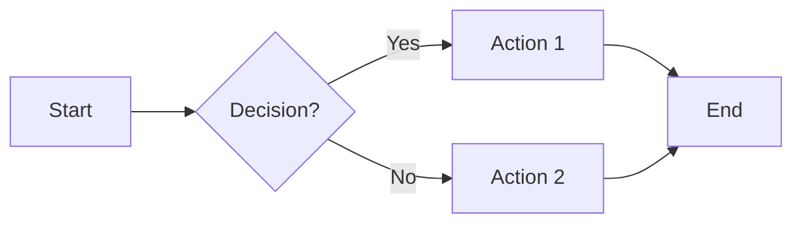
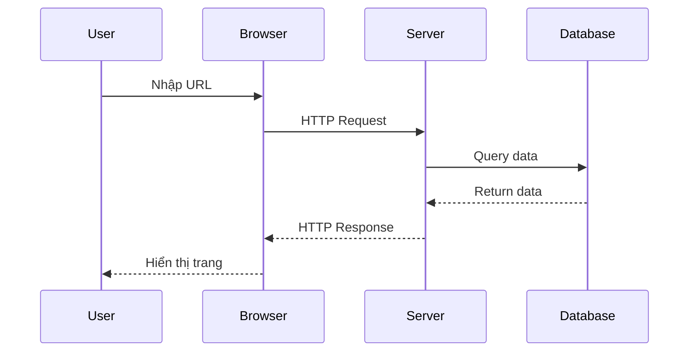
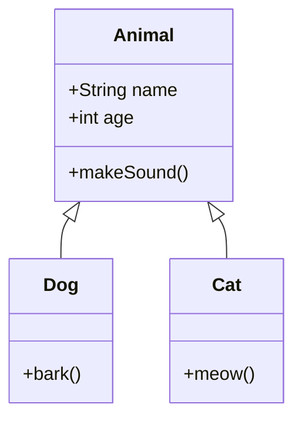

# Demo MkDocs Material Features

Đây là trang demo các tính năng của MkDocs Material, hoàn toàn độc lập với blog.

[Tham khảo snippet](../guide/setup/mkdocs_syntax/snippet.md)

---

## Admonitions

!!! note "Ghi chú"
    Đây là một ghi chú quan trọng với Material theme.

!!! tip "Mẹo hay"
    Bạn có thể dùng nhiều loại admonition khác nhau!

!!! warning "Cảnh báo"
    Hãy cẩn thận khi thực hiện thao tác này.

!!! danger "Nguy hiểm"
    Không được làm điều này trong production!

??? success "Collapsible Success (Click để mở)"
    Nội dung này có thể thu gọn được!
    
    ```python
    print("Hello from collapsed content!")
    ```

???+ info "Mở sẵn (Click để đóng)"
    Admonition này mở sẵn khi load trang.

---

## Code Blocks

### Python với syntax highlighting

```python
def greet(name: str) -> str:
    """
    Hàm chào hỏi đơn giản
    
    Args:
        name: Tên người được chào
    
    Returns:
        Chuỗi chào hỏi
    """
    return f"Xin chào, {name}! 👋"

# Sử dụng
message = greet("Dat")
print(message)
```

### JavaScript với line numbers

```javascript linenums="1"
// Function để tính tổng mảng
function sumArray(arr) {
    return arr.reduce((acc, curr) => acc + curr, 0);
}

const numbers = [1, 2, 3, 4, 5];
console.log(sumArray(numbers)); // Output: 15
```

### Code với highlighting dòng cụ thể

```python hl_lines="2 3"
def calculate_total(items):
    # Dòng này được highlight
    total = sum(item['price'] for item in items)
    return total
```

### Inline code

Bạn có thể dùng `inline code` trong câu, hoặc highlight với ==`important code`==

---

## Tabs

=== "Python"

    ```python
    print("Đây là code Python")
    
    class Student:
        def __init__(self, name, age):
            self.name = name
            self.age = age
    ```

=== "JavaScript"

    ```javascript
    console.log("Đây là code JavaScript");
    
    class Student {
        constructor(name, age) {
            this.name = name;
            this.age = age;
        }
    }
    ```

=== "C++"

    ```cpp
    #include <iostream>
    using namespace std;
    
    class Student {
        string name;
        int age;
    };
    ```

---

## Diagrams

### Mermaid - Flowchart



### Mermaid - Sequence Diagram



### Mermaid - Class Diagram



---

## Math

### Inline Math

Công thức Einstein: $E = mc^2$

Định lý Pythagoras: $a^2 + b^2 = c^2$

### Block Math

$$
\int_{-\infty}^{\infty} e^{-x^2} dx = \sqrt{\pi}
$$

$$
\frac{d}{dx}\left( \int_{a}^{x} f(u)\,du\right)=f(x)
$$

### Ma trận

$$
A = \begin{bmatrix}
a_{11} & a_{12} & a_{13} \\
a_{21} & a_{22} & a_{23} \\
a_{31} & a_{32} & a_{33}
\end{bmatrix}
$$

---

## Icons & Emojis

### Material Icons

:material-account: Account
:material-github: GitHub  
:material-heart: Love
:fontawesome-solid-rocket: Rocket
:octicons-mark-github-16: GitHub Octicon

### Emojis

:smile: :heart: :star: :rocket: :fire: :100: :thumbsup: :flag_vn:

---

## Lists & Tasks

### Danh sách có thứ tự

1. Item đầu tiên
2. Item thứ hai
    1. Sub-item 2.1
    2. Sub-item 2.2
3. Item thứ ba

### Danh sách không thứ tự

- Item A
- Item B
    - Sub-item B.1
    - Sub-item B.2
- Item C

### Task List

- [x] Hoàn thành task 1
- [x] Hoàn thành task 2
- [ ] Task đang làm
- [ ] Task chưa làm

---

## Tables

### Bảng cơ bản

| Tên | Tuổi | Nghề nghiệp |
|-----|------|-------------|
| An  | 25   | Developer   |
| Bình| 30   | Designer    |
| Chi | 28   | Manager     |

### Bảng với alignment

| Left | Center | Right |
|:-----|:------:|------:|
| A    | B      | C     |
| 1    | 2      | 3     |
| X    | Y      | Z     |

---

## Text Formatting

**Bold text** và *italic text*

==Highlight text==

~~Strikethrough~~

H~2~O (subscript)

X^2^ (superscript)

==Highlighted text== và **Bold text**

Keyboard keys: ++ctrl+alt+delete++

---

## Buttons & Links

[Regular Link](https://github.com){ .md-button }

[Primary Button](https://github.com){ .md-button .md-button--primary }

[External Link :material-open-in-new:](https://mkdocs.org){ target="_blank" }

---

## Footnotes

Đây là văn bản với footnote[^1] và một footnote khác[^2].

[^1]: Đây là nội dung footnote đầu tiên.
[^2]: Đây là footnote thứ hai với nhiều dòng.
    
    Có thể thêm nhiều paragraph trong footnote.

---

## Custom Blocks

!!! example "Ví dụ thực tế"
    
    ```python
    # Demo authentication
    from flask import Flask, request
    
    app = Flask(__name__)
    
    @app.route('/login', methods=['POST'])
    def login():
        username = request.form.get('username')
        password = request.form.get('password')
        # Xử lý authentication
        return {'status': 'success'}
    ```

---

## Abbreviations

The HTML specification is maintained by the W3C.

*[HTML]: Hyper Text Markup Language
*[W3C]: World Wide Web Consortium

---

!!! success "Hoàn thành!"
    Bạn đã xem qua các tính năng chính của MkDocs Material! 🎉
