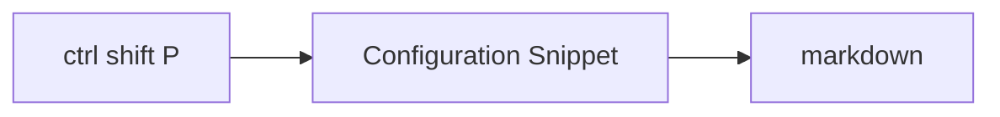
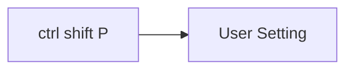

# Using snipet in vscode

## Snipet markdown


??? note "markdown.json"

    ``` json
        {
        "Admonition Note": {
            "prefix": "note",
            "body": [
            "!!! note \"${1:Title}\"",
            "    ${2:Content}"
            ],
            "description": "Create a note admonition"
        },
        "Admonition Warning": {
            "prefix": "warning",
            "body": [
            "!!! warning \"${1:Title}\"",
            "    ${2:Content}"
            ],
            "description": "Create a warning admonition"
        },
        "Admonition Info": {
            "prefix": "info",
            "body": [
            "!!! info \"${1:Title}\"",
            "    ${2:Content}"
            ],
            "description": "Create an info admonition"
        },
        "Admonition Tip": {
            "prefix": "tip",
            "body": [
            "!!! tip \"${1:Title}\"",
            "    ${2:Content}"
            ],
            "description": "Create a tip admonition"
        },
        "Admonition Danger": {
            "prefix": "danger",
            "body": [
            "!!! danger \"${1:Title}\"",
            "    ${2:Content}"
            ],
            "description": "Create a danger admonition"
        },
        "Collapsible Admonition": {
            "prefix": "details",
            "body": [
            "??? ${1:note} \"${2:Title}\"",
            "    ${3:Content}"
            ],
            "description": "Create a collapsible admonition"
        },
        "Code Block with Tabs": {
            "prefix": "tabs",
            "body": [
            "=== \"${1:Python}\"",
            "",
            "    ```${2:py}",
            "    ${3:def main():",
            "        print(\"Hello world!\")}",
            "    ```",
            "",
            "=== \"${4:JavaScript}\"",
            "",
            "    ```${5:js}",
            "    ${6:function main() {",
            "        console.log(\"Hello world!\");",
            "    \\}}",
            "    ```"
            ],
            "description": "Create tabbed code blocks"
        },
        "Code Block Basic": {
            "prefix": "code",
            "body": [
            "```${1:py} title=\"${2:filename.py}\" linenums=\"1\"",
            "${3:# Your code here}",
            "```"
            ],
            "description": "Create basic code block with title"
        },
        "Code Block Highlighted": {
            "prefix": "codehl",
            "body": [
            "```${1:js} title=\"${2:filename.js}\" linenums=\"1\" hl_lines=\"${3:2-4}\"",
            "${4:// Your code here}",
            "```"
            ],
            "description": "Create code block with highlighted lines"
        },
        "Code Block Annotated": {
            "prefix": "codeanno",
            "body": [
            "```${1:python} linenums=\"1\"",
            "${2:code} # (1)",
            "```",
            "",
            "1. ${3:Annotation text}"
            ],
            "description": "Create annotated code block"
        },
        "Mermaid Flowchart": {
            "prefix": "mermaid",
            "body": [
            "```mermaid",
            "graph ${1:LR}",
            "  ${2:A}[Start] --> ${3:B}{Decision?};",
            "  ${3:B} -->|${4:Yes}| ${5:C}[Process];",
            "  ${3:B} -->|${6:No}| ${7:D}[End];",
            "```"
            ],
            "description": "Create a Mermaid flowchart"
        },
        "Mermaid Sequence": {
            "prefix": "sequence",
            "body": [
            "```mermaid",
            "sequenceDiagram",
            "  autonumber",
            "  ${1:Client}->>${2:Server}: ${3:Request}",
            "  ${2:Server}-->${1:Client}: ${4:Response}",
            "```"
            ],
            "description": "Create a Mermaid sequence diagram"
        },
        "Material Button": {
            "prefix": "button",
            "body": [
            "[${1:Button Text}](${2:link}){ .md-button .md-button--primary }"
            ],
            "description": "Create a Material button"
        },
        "Content Tabs Generic": {
            "prefix": "ctabs",
            "body": [
            "=== \"${1:Plain text}\"",
            "",
            "    ${2:This is some plain text}",
            "",
            "=== \"${3:List}\"",
            "",
            "    * ${4:First item}",
            "    * ${5:Second item}",
            "    * ${6:Third item}"
            ],
            "description": "Create generic content tabs"
        },
        "Definition List": {
            "prefix": "deflist",
            "body": [
            "${1:Term}",
            ":   ${2:Definition}"
            ],
            "description": "Create a definition list item"
        },
        "Footnote": {
            "prefix": "footnote",
            "body": [
            "${1:Text}[^${2:1}]",
            "",
            "[^${2:1}]: ${3:Footnote content}"
            ],
            "description": "Create a footnote"
        },
        "Task List": {
            "prefix": "tasklist",
            "body": [
            "- [x] ${1:Completed task}",
            "- [ ] ${2:Incomplete task}"
            ],
            "description": "Create a task list"
        },
        "Table": {
            "prefix": "table",
            "body": [
            "| ${1:Column 1} | ${2:Column 2} | ${3:Column 3} |",
            "| ----------- | ----------- | ----------- |",
            "| ${4:Row 1 Col 1} | ${5:Row 1 Col 2} | ${6:Row 1 Col 3} |",
            "| ${7:Row 2 Col 1} | ${8:Row 2 Col 2} | ${9:Row 2 Col 3} |"
            ],
            "description": "Create a table"
        },
        "Keyboard Key": {
            "prefix": "key",
            "body": [
            "++${1:ctrl+alt+del}++"
            ],
            "description": "Create keyboard key markup"
        },
        "Highlight Text": {
            "prefix": "highlight",
            "body": [
            "==${1:highlighted text}=="
            ],
            "description": "Highlight text"
        },
        "Material Icons": {
            "prefix": "icon",
            "body": [
            ":material-${1:icon-name}:"
            ],
            "description": "Insert Material icon"
        },
        "Emoji": {
            "prefix": "emoji",
            "body": [
            ":${1:emoji-name}:"
            ],
            "description": "Insert emoji"
        },
        "Image with Caption": {
            "prefix": "imgcap",
            "body": [
            "<figure markdown>",
            "  ",
            "  <figcaption>${3:Caption}</figcaption>",
            "</figure>"
            ],
            "description": "Image with caption"
        },
        "Blog Post Header": {
            "prefix": "blog",
            "body": [
            "---",
            "date:",
            "    created: ${1:2025-01-09}",
            "    updated: ${2:2025-02-09}",
            "readtime: ${3:5}",
            "categories:",
            "    - ${4:Life}",
            "tags:",
            "    - ${5:life}",
            "draft: ${6:true}",
            "---",
            "",
            "# ${7:Blog Post Title}",
            "",
            "${8:Your content here}"
            ],
            "description": "Create blog post with frontmatter"
        }
        }
    ```

## Configure the user setting for tab



??? note "setting.json"

    ``` json
      {
      "github.copilot.nextEditSuggestions.enabled": true,
      "security.workspace.trust.untrustedFiles": "open",
      "files.autoSave": "afterDelay",
      "terminal.integrated.suggest.enabled": true,
      "editor.fontFamily": "Fira Code",
      "editor.fontLigatures": true,
      "terminal.integrated.fontFamily": "MesloLGSDZ Nerd Font Mono",
      "git.autofetch": true,
      "workbench.colorCustomizations": {
          "[Vira*]": {
              "toolbar.activeBackground": "#80CBC426",
              "button.background": "#80CBC4",
              "button.hoverBackground": "#80CBC4cc",
              "extensionButton.separator": "#80CBC433",
              "extensionButton.background": "#80CBC414",
              "extensionButton.foreground": "#80CBC4",
              "extensionButton.hoverBackground": "#80CBC433",
              "extensionButton.prominentForeground": "#80CBC4",
              "extensionButton.prominentBackground": "#80CBC414",
              "extensionButton.prominentHoverBackground": "#80CBC433",
              "activityBarBadge.background": "#80CBC4",
              "activityBar.activeBorder": "#80CBC4",
              "activityBarTop.activeBorder": "#80CBC4",
              "list.inactiveSelectionIconForeground": "#80CBC4",
              "list.activeSelectionForeground": "#80CBC4",
              "list.inactiveSelectionForeground": "#80CBC4",
              "list.highlightForeground": "#80CBC4",
              "sash.hoverBorder": "#80CBC480",
              "list.activeSelectionIconForeground": "#80CBC4",
              "scrollbarSlider.activeBackground": "#80CBC480",
              "editorSuggestWidget.highlightForeground": "#80CBC4",
              "textLink.foreground": "#80CBC4",
              "progressBar.background": "#80CBC4",
              "pickerGroup.foreground": "#80CBC4",
              "tab.activeBorder": "#80CBC4",
              "tab.activeBorderTop": "#80CBC400",
              "tab.unfocusedActiveBorder": "#80CBC4",
              "tab.unfocusedActiveBorderTop": "#80CBC400",
              "tab.activeModifiedBorder": "#80CBC400",
              "notificationLink.foreground": "#80CBC4",
              "editorWidget.resizeBorder": "#80CBC4",
              "editorWidget.border": "#80CBC4",
              "settings.modifiedItemIndicator": "#80CBC4",
              "panelTitle.activeBorder": "#80CBC4",
              "breadcrumb.activeSelectionForeground": "#80CBC4",
              "menu.selectionForeground": "#80CBC4",
              "menubar.selectionForeground": "#80CBC4",
              "editor.findMatchBorder": "#80CBC4",
              "selection.background": "#80CBC440",
              "statusBarItem.remoteBackground": "#80CBC414",
              "statusBarItem.remoteHoverBackground": "#80CBC4",
              "statusBarItem.remoteForeground": "#80CBC4",
              "notebook.inactiveFocusedCellBorder": "#80CBC480",
              "commandCenter.activeBorder": "#80CBC480",
              "chat.slashCommandForeground": "#80CBC4",
              "chat.avatarForeground": "#80CBC4",
              "activityBarBadge.foreground": "#000000",
              "button.foreground": "#000000",
              "statusBarItem.remoteHoverForeground": "#000000"
          }
      },
      "editor.fontSize": 16,
      "workbench.iconTheme": "material-icon-theme",
      "Codegeex.Privacy": true,
      "explorer.fileNesting.patterns": {
          "*.ts": "${capture}.js",
          "*.js": "${capture}.js.map, ${capture}.min.js, ${capture}.d.ts",
          "*.jsx": "${capture}.js",
          "*.tsx": "${capture}.ts",
          "tsconfig.json": "tsconfig.*.json",
          "package.json": "package-lock.json, yarn.lock, pnpm-lock.yaml, bun.lockb, bun.lock",
          "*.sqlite": "${capture}.${extname}-*",
          "*.db": "${capture}.${extname}-*",
          "*.sqlite3": "${capture}.${extname}-*",
          "*.db3": "${capture}.${extname}-*",
          "*.sdb": "${capture}.${extname}-*",
          "*.s3db": "${capture}.${extname}-*"
      },
      "editor.linkedEditing": true,
      "explorer.confirmDelete": false,
      "editor.autoClosingBrackets": "always",
      "css.lint.unknownAtRules": "ignore",
      "explorer.confirmPasteNative": false,
      "terminal.integrated.profiles.windows": {
          "PowerShell": {
              "source": "PowerShell",
              "icon": "terminal-powershell"
          },
          "Command Prompt": {
              "path": [
                  "${env:windir}\\Sysnative\\cmd.exe",
                  "${env:windir}\\System32\\cmd.exe"
              ],
              "args": [],
              "icon": "terminal-cmd"
          },
          "Git Bash": {
              "source": "Git Bash"
          },
          "Ubuntu": {
              "path": "wsl.exe",
              "args": ["-d", "Ubuntu"],
              "icon": "terminal-ubuntu"
          }
      },
      "terminal.integrated.defaultProfile.windows": "PowerShell",
      "explorer.compactFolders": false,
      "editor.wordWrap": "on",
      "workbench.colorTheme": "Catppuccin Mocha",
      "editor.tabCompletion": "on",
      "editor.snippetSuggestions": "top",
      "editor.suggest.snippetsPreventQuickSuggestions": false,
      "editor.wordBasedSuggestions": "off",
      "[markdown]": {
          "editor.quickSuggestions": {
              "other": true,
              "comments": false,
              "strings": true
          },
          "editor.acceptSuggestionOnEnter": "on",
          "editor.suggest.showSnippets": true
      }
    }
    ```

## Full Markdown

??? note "markdown.json"

    ``` json
      {
      "MkDocs Metadata Block": {
        "prefix": "meta",
        "body": [
          "---",
          "title: $1",
          "description: $2", 
          "icon: ${3:material/book}",
          "status: ${4|new,deprecated|}",
          "subtitle: $5",
          "template: ${6:main.html}",
          "date: ${CURRENT_YEAR}-${CURRENT_MONTH}-${CURRENT_DATE}",
          "---",
          "",
          "$0"
        ],
        "description": "MkDocs Material metadata block with auto date"
      },

      "Blog Post Frontmatter": {
        "prefix": "blog",
        "body": [
          "---",
          "date:",
          "  created: ${CURRENT_YEAR}-${CURRENT_MONTH}-${CURRENT_DATE}",
          "  updated: ${CURRENT_YEAR}-${CURRENT_MONTH}-${CURRENT_DATE}",
          "categories:",
          "  - $1",
          "tags:",
          "  - $2",
          "authors:",
          "  - $3",
          "readtime: $4",
          "draft: ${5|true,false|}",
          "---",
          "",
          "# $6",
          "",
          "$0"
        ],
        "description": "Blog post with complete frontmatter"
      },

      "Admonition Note": {
        "prefix": "note",
        "body": [
          "!!! note \"$1\"",
          "",
          "    $0"
        ],
        "description": "Note admonition"
      },

      "Admonition Abstract": {
        "prefix": "abstract",
        "body": [
          "!!! abstract \"$1\"",
          "",
          "    $0"
        ],
        "description": "Abstract admonition"
      },

      "Admonition Info": {
        "prefix": "info",
        "body": [
          "!!! info \"$1\"",
          "",
          "    $0"
        ],
        "description": "Info admonition"
      },

      "Admonition Tip": {
        "prefix": "tip",
        "body": [
          "!!! tip \"$1\"",
          "",
          "    $0"
        ],
        "description": "Tip admonition"
      },

      "Admonition Success": {
        "prefix": "success",
        "body": [
          "!!! success \"$1\"",
          "",
          "    $0"
        ],
        "description": "Success admonition"
      },

      "Admonition Question": {
        "prefix": "question",
        "body": [
          "!!! question \"$1\"",
          "",
          "    $0"
        ],
        "description": "Question admonition"
      },

      "Admonition Warning": {
        "prefix": "warning",
        "body": [
          "!!! warning \"$1\"",
          "",
          "    $0"
        ],
        "description": "Warning admonition"
      },

      "Admonition Failure": {
        "prefix": "failure",
        "body": [
          "!!! failure \"$1\"",
          "",
          "    $0"
        ],
        "description": "Failure admonition"
      },

      "Admonition Danger": {
        "prefix": "danger",
        "body": [
          "!!! danger \"$1\"",
          "",
          "    $0"
        ],
        "description": "Danger admonition"
      },

      "Admonition Bug": {
        "prefix": "bug",
        "body": [
          "!!! bug \"$1\"",
          "",
          "    $0"
        ],
        "description": "Bug admonition"
      },

      "Admonition Example": {
        "prefix": "example",
        "body": [
          "!!! example \"$1\"",
          "",
          "    $0"
        ],
        "description": "Example admonition"
      },

      "Admonition Quote": {
        "prefix": "quote",
        "body": [
          "!!! quote \"$1\"",
          "",
          "    $0"
        ],
        "description": "Quote admonition"
      },

      "Collapsible Admonition": {
        "prefix": "details",
        "body": [
          "??? ${1|note,info,tip,success,question,warning,failure,danger,bug,example,quote,abstract|} \"$2\"",
          "",
          "    $0"
        ],
        "description": "Collapsible admonition"
      },

      "Expanded Collapsible": {
        "prefix": "expand",
        "body": [
          "???+ ${1|note,info,tip,success,question,warning,failure,danger,bug,example,quote,abstract|} \"$2\"",
          "",
          "    $0"
        ],
        "description": "Expanded collapsible admonition"
      },

      "Inline Admonition End": {
        "prefix": "inline-end",
        "body": [
          "!!! ${1|note,info,tip,success,question,warning,failure,danger,bug,example,quote,abstract|} inline end \"$2\"",
          "",
          "    $3",
          "",
          "$0"
        ],
        "description": "Inline admonition aligned to right"
      },

      "Inline Admonition": {
        "prefix": "inline",
        "body": [
          "!!! ${1|note,info,tip,success,question,warning,failure,danger,bug,example,quote,abstract|} inline \"$2\"",
          "",
          "    $3",
          "",
          "$0"
        ],
        "description": "Inline admonition aligned to left"
      },

      "Code Block Basic": {
        "prefix": "code",
        "body": [
          "``` ${1:python}",
          "$0",
          "```"
        ],
        "description": "Basic code block"
      },

      "Code Block with Title": {
        "prefix": "codet",
        "body": [
          "``` ${1:python} title=\"$2\"",
          "$0",
          "```"
        ],
        "description": "Code block with title"
      },

      "Code Block with Line Numbers": {
        "prefix": "codel",
        "body": [
          "``` ${1:python} linenums=\"$2\"",
          "$0",
          "```"
        ],
        "description": "Code block with line numbers"
      },

      "Code Block Highlighted": {
        "prefix": "codeh",
        "body": [
          "``` ${1:python} hl_lines=\"$2\"",
          "$0",
          "```"
        ],
        "description": "Code block with highlighted lines"
      },

      "Code Block Full": {
        "prefix": "codef",
        "body": [
          "``` ${1:python} title=\"$2\" linenums=\"$3\" hl_lines=\"$4\"",
          "$0",
          "```"
        ],
        "description": "Full featured code block"
      },

      "Code Block with Annotations": {
        "prefix": "codea",
        "body": [
          "``` ${1:python}",
          "$2 # (1)!",
          "```",
          "",
          "1.  $0"
        ],
        "description": "Code block with annotations"
      },

      "Content Tabs": {
        "prefix": "tabs",
        "body": [
          "=== \"$1\"",
          "",
          "    $2",
          "",
          "=== \"$3\"",
          "",
          "    $4",
          "",
          "$0"
        ],
        "description": "Content tabs"
      },

      "Content Tabs Code": {
        "prefix": "tabscode",
        "body": [
          "=== \"$1\"",
          "",
          "    ``` ${2:python}",
          "    $3",
          "    ```",
          "",
          "=== \"$4\"",
          "",
          "    ``` ${5:javascript}",
          "    $6",
          "    ```",
          "",
          "$0"
        ],
        "description": "Content tabs with code blocks"
      },

      "Mermaid Flowchart": {
        "prefix": "mermaid",
        "body": [
          "``` mermaid",
          "flowchart ${1|TD,TB,BT,RL,LR|}",
          "    $2[\"$3\"] --> $4[\"$5\"]",
          "    $4 --> $6[\"$7\"]",
          "```",
          "",
          "$0"
        ],
        "description": "Mermaid flowchart"
      },

      "Mermaid Sequence Diagram": {
        "prefix": "sequence",
        "body": [
          "``` mermaid",
          "sequenceDiagram",
          "    autonumber",
          "    participant $1",
          "    participant $2",
          "    $1->>$2: $3",
          "    $2-->>$1: $4",
          "```",
          "",
          "$0"
        ],
        "description": "Mermaid sequence diagram"
      },

      "Mermaid Class Diagram": {
        "prefix": "class",
        "body": [
          "``` mermaid",
          "classDiagram",
          "    class $1 {",
          "        +$2",
          "        +$3()",
          "    }",
          "    class $4 {",
          "        +$5",
          "        +$6()",
          "    }",
          "    $1 --> $4",
          "```",
          "",
          "$0"
        ],
        "description": "Mermaid class diagram"
      },

      "Mermaid State Diagram": {
        "prefix": "state",
        "body": [
          "``` mermaid",
          "stateDiagram-v2",
          "    [*] --> $1",
          "    $1 --> $2",
          "    $2 --> [*]",
          "```",
          "",
          "$0"
        ],
        "description": "Mermaid state diagram"
      },

      "Mermaid ER Diagram": {
        "prefix": "erdiagram",
        "body": [
          "``` mermaid",
          "erDiagram",
          "    $1 {",
          "        int $2",
          "        string $3",
          "    }",
          "    $4 {",
          "        int $5",
          "        string $6",
          "    }",
          "    $1 ||--o{ $4 : \"$7\"",
          "```",
          "",
          "$0"
        ],
        "description": "Mermaid ER diagram"
      },

      "Mermaid Gantt Chart": {
        "prefix": "gantt",
        "body": [
          "``` mermaid",
          "gantt",
          "    title $1",
          "    dateFormat YYYY-MM-DD",
          "    section $2",
          "    $3 :$4, ${CURRENT_YEAR}-${CURRENT_MONTH}-${CURRENT_DATE}, 30d",
          "    $5 :after $4, 20d",
          "```",
          "",
          "$0"
        ],
        "description": "Mermaid Gantt chart"
      },

      "Mermaid Pie Chart": {
        "prefix": "pie",
        "body": [
          "``` mermaid",
          "pie title $1",
          "    \"$2\" : $3",
          "    \"$4\" : $5",
          "    \"$6\" : $7",
          "```",
          "",
          "$0"
        ],
        "description": "Mermaid pie chart"
      },

      "Data Table": {
        "prefix": "table",
        "body": [
          "| $1 | $2 | $3 |",
          "| --- | --- | --- |",
          "| $4 | $5 | $6 |",
          "| $7 | $8 | $9 |",
          "",
          "$0"
        ],
        "description": "Data table"
      },

      "Aligned Table": {
        "prefix": "tablea",
        "body": [
          "| $1 | $2 | $3 |",
          "| :--- | :---: | ---: |",
          "| $4 | $5 | $6 |",
          "| $7 | $8 | $9 |",
          "",
          "$0"
        ],
        "description": "Table with column alignment"
      },

      "Sortable Table": {
        "prefix": "tables",
        "body": [
          "| $1 { data-sort } | $2 { data-sort } | $3 { data-sort } |",
          "| --- | --- | --- |",
          "| $4 | $5 | $6 |",
          "| $7 | $8 | $9 |",
          "{ .md-typeset__table }",
          "",
          "$0"
        ],
        "description": "Sortable table"
      },

      "Grid Cards": {
        "prefix": "grid",
        "body": [
          "<div class=\"grid cards\" markdown>",
          "",
          "-   :$1: **$2**",
          "",
          "    ---",
          "",
          "    $3",
          "",
          "-   :$4: **$5**",
          "",
          "    ---",
          "",
          "    $6",
          "",
          "</div>",
          "",
          "$0"
        ],
        "description": "Grid cards layout"
      },

      "Generic Grid": {
        "prefix": "gridg",
        "body": [
          "<div class=\"grid\" markdown>",
          "",
          "<div markdown>",
          "",
          "$1",
          "",
          "</div>",
          "",
          "<div markdown>",
          "",
          "$2",
          "",
          "</div>",
          "",
          "</div>",
          "",
          "$0"
        ],
        "description": "Generic grid layout"
      },

      "Button": {
        "prefix": "btn",
        "body": [
          "[$1]($2){ .md-button }",
          "",
          "$0"
        ],
        "description": "Button link"
      },

      "Primary Button": {
        "prefix": "btnp",
        "body": [
          "[$1]($2){ .md-button .md-button--primary }",
          "",
          "$0"
        ],
        "description": "Primary button link"
      },

      "Icon Button": {
        "prefix": "btni",
        "body": [
          "[$1 :$2:]($3){ .md-button }",
          "",
          "$0"
        ],
        "description": "Button with icon"
      },

      "Task List": {
        "prefix": "task",
        "body": [
          "- [x] $1",
          "- [ ] $2",
          "- [ ] $3",
          "",
          "$0"
        ],
        "description": "Task list"
      },

      "Definition List": {
        "prefix": "def",
        "body": [
          "$1",
          ":   $2",
          "",
          "$3",
          ":   $4",
          "",
          "$0"
        ],
        "description": "Definition list"
      },

      "Footnote": {
        "prefix": "fn",
        "body": [
          "$1[^$2]",
          "",
          "[^$2]: $3",
          "",
          "$0"
        ],
        "description": "Footnote"
      },

      "Math Block": {
        "prefix": "math",
        "body": [
          "$$",
          "$1",
          "$$",
          "",
          "$0"
        ],
        "description": "Math block"
      },

      "Inline Math": {
        "prefix": "imath",
        "body": [
          "\\($1\\)$0"
        ],
        "description": "Inline math"
      },

      "Highlight": {
        "prefix": "mark",
        "body": [
          "==$1==$0"
        ],
        "description": "Highlight text"
      },

      "Keys": {
        "prefix": "keys",
        "body": [
          "++$1++$0"
        ],
        "description": "Keyboard keys"
      },

      "Progress": {
        "prefix": "progress",
        "body": [
          "[=$1% \"$2\"]",
          "",
          "$0"
        ],
        "description": "Progress bar"
      },

      "Abbreviation": {
        "prefix": "abbr",
        "body": [
          "$1",
          "",
          "*[$2]: $3",
          "",
          "$0"
        ],
        "description": "Abbreviation"
      },

      "Critic Addition": {
        "prefix": "add",
        "body": [
          "{++$1++}$0"
        ],
        "description": "Critic markup addition"
      },

      "Critic Deletion": {
        "prefix": "del",
        "body": [
          "{--$1--}$0"
        ],
        "description": "Critic markup deletion"
      },

      "Critic Substitution": {
        "prefix": "sub",
        "body": [
          "{~~$1~>$2~~}$0"
        ],
        "description": "Critic markup substitution"
      },

      "Critic Comment": {
        "prefix": "comment",
        "body": [
          "{>>$1<<}$0"
        ],
        "description": "Critic markup comment"
      },

      "Critic Highlight": {
        "prefix": "cmark",
        "body": [
          "{==$1==}{>>$2<<}$0"
        ],
        "description": "Critic markup highlight with comment"
      },

      "Emoji": {
        "prefix": "emoji",
        "body": [
          ":$1:$0"
        ],
        "description": "Emoji shortcode"
      },

      "Icon": {
        "prefix": "icon",
        "body": [
          ":material-$1:$0"
        ],
        "description": "Material icon"
      },

      "Simple Icon": {
        "prefix": "simple",
        "body": [
          ":simple-$1:$0"
        ],
        "description": "Simple icon"
      },

      "Fontawesome Icon": {
        "prefix": "fa",
        "body": [
          ":fontawesome-${1|brands,regular,solid|}-$2:$0"
        ],
        "description": "FontAwesome icon"
      },

      "Octicon": {
        "prefix": "octicon",
        "body": [
          ":octicons-$1-16:$0"
        ],
        "description": "Octicon"
      },

      "Annotation": {
        "prefix": "anno",
        "body": [
          "$1 (1)",
          "{ .annotate }",
          "",
          "1.  $2",
          "",
          "$0"
        ],
        "description": "Text annotation"
      },

      "Details": {
        "prefix": "details",
        "body": [
          "<details>",
          "  <summary>$1</summary>",
          "  $2",
          "</details>",
          "",
          "$0"
        ],
        "description": "HTML details element"
      },

      "Image": {
        "prefix": "img",
        "body": [
          "",
          "",
          "$0"
        ],
        "description": "Image"
      },

      "Image with Caption": {
        "prefix": "imgc",
        "body": [
          "<figure markdown>",
          "  ",
          "  <figcaption>$3</figcaption>",
          "</figure>",
          "",
          "$0"
        ],
        "description": "Image with caption"
      },

      "Image Alignment": {
        "prefix": "imga",
        "body": [
          "{ align=${3|left,right|} }",
          "",
          "$0"
        ],
        "description": "Aligned image"
      },

      "Image Lazy Loading": {
        "prefix": "imgl",
        "body": [
          "{ loading=lazy }",
          "",
          "$0"
        ],
        "description": "Lazy loading image"
      },

      "Content Warning": {
        "prefix": "spoiler",
        "body": [
          "||$1||$0"
        ],
        "description": "Spoiler/content warning"
      },

      "Subscript": {
        "prefix": "sub",
        "body": [
          "~$1~$0"
        ],
        "description": "Subscript"
      },

      "Superscript": {
        "prefix": "sup",
        "body": [
          "^$1^$0"
        ],
        "description": "Superscript"
      },

      "Link with Tooltip": {
        "prefix": "linkt",
        "body": [
          "[$1]($2 \"$3\")$0"
        ],
        "description": "Link with tooltip"
      },

      "External Link": {
        "prefix": "linke",
        "body": [
          "[$1]($2){ target=\"_blank\" }$0"
        ],
        "description": "External link (new tab)"
      }
    }
    ```

## I usually use 

??? note "markdown.json"

    ``` json
    {
    "MkDocs Metadata Block": {
        "prefix": "meta",
        "body": [
        "---",
        "title: $1",
        "description: $2", 
        "icon: ${3:material/book}",
        "status: ${4|new,deprecated|}",
        "subtitle: $5",
        "template: ${6:main.html}",
        "date: ${CURRENT_YEAR}-${CURRENT_MONTH}-${CURRENT_DATE}",
        "---",
        "",
        "$0"
        ],
        "description": "MkDocs Material metadata block with auto date"
    },

    "Blog Post Frontmatter": {
    "prefix": "blog",
    "body": [
        "---",
        "date:",
        "  created: ${CURRENT_YEAR}-${CURRENT_MONTH}-${CURRENT_DATE}",
        "  updated: ${CURRENT_YEAR}-${CURRENT_MONTH}-${CURRENT_DATE}",
        "categories:",
        "  - $1",
        "tags:",
        "  - $2",
        "authors:",
        "  - $3",
        "readtime: $4",
        "draft: ${5|true,false|}",
        "---",
        "",
        "# $6",
        "",
        "<!-- more -->",
        "",
        "$0"
    ],
    "description": "Blog post with complete frontmatter"
    },

    "Tags": {
    "prefix": "tags",
    "body": [
        "tags:",
        "  - $1",
        "  - $2",
        "",
        "$0"
    ],
    "description": "Tags in frontmatter"
    },

    "Admonition Note": {
        "prefix": "note",
        "body": [
        "!!! note \"$1\"",
        "",
        "    $0"
        ],
        "description": "Note admonition"
    },

    "Admonition Abstract": {
        "prefix": "abstract",
        "body": [
        "!!! abstract \"$1\"",
        "",
        "    $0"
        ],
        "description": "Abstract admonition"
    },

    "Admonition Info": {
        "prefix": "info",
        "body": [
        "!!! info \"$1\"",
        "",
        "    $0"
        ],
        "description": "Info admonition"
    },

    "Admonition Tip": {
        "prefix": "tip",
        "body": [
        "!!! tip \"$1\"",
        "",
        "    $0"
        ],
        "description": "Tip admonition"
    },

    "Admonition Success": {
        "prefix": "success",
        "body": [
        "!!! success \"$1\"",
        "",
        "    $0"
        ],
        "description": "Success admonition"
    },

    "Admonition Question": {
        "prefix": "question",
        "body": [
        "!!! question \"$1\"",
        "",
        "    $0"
        ],
        "description": "Question admonition"
    },

    "Admonition Warning": {
        "prefix": "warning",
        "body": [
        "!!! warning \"$1\"",
        "",
        "    $0"
        ],
        "description": "Warning admonition"
    },

    "Admonition Failure": {
        "prefix": "failure",
        "body": [
        "!!! failure \"$1\"",
        "",
        "    $0"
        ],
        "description": "Failure admonition"
    },

    "Admonition Danger": {
        "prefix": "danger",
        "body": [
        "!!! danger \"$1\"",
        "",
        "    $0"
        ],
        "description": "Danger admonition"
    },

    "Admonition Bug": {
        "prefix": "bug",
        "body": [
        "!!! bug \"$1\"",
        "",
        "    $0"
        ],
        "description": "Bug admonition"
    },

    "Admonition Example": {
        "prefix": "example",
        "body": [
        "!!! example \"$1\"",
        "",
        "    $0"
        ],
        "description": "Example admonition"
    },

    "Admonition Quote": {
        "prefix": "quote",
        "body": [
        "!!! quote \"$1\"",
        "",
        "    $0"
        ],
        "description": "Quote admonition"
    },

    "Collapsible Admonition": {
        "prefix": "details",
        "body": [
        "??? ${1|note,info,tip,success,question,warning,failure,danger,bug,example,quote,abstract|} \"$2\"",
        "",
        "    $0"
        ],
        "description": "Collapsible admonition"
    },

    "Expanded Collapsible": {
        "prefix": "expand",
        "body": [
        "???+ ${1|note,info,tip,success,question,warning,failure,danger,bug,example,quote,abstract|} \"$2\"",
        "",
        "    $0"
        ],
        "description": "Expanded collapsible admonition"
    },

    "Inline Admonition End": {
        "prefix": "inline-end",
        "body": [
        "!!! ${1|note,info,tip,success,question,warning,failure,danger,bug,example,quote,abstract|} inline end \"$2\"",
        "",
        "    $3",
        "",
        "$0"
        ],
        "description": "Inline admonition aligned to right"
    },

    "Inline Admonition": {
        "prefix": "inline",
        "body": [
        "!!! ${1|note,info,tip,success,question,warning,failure,danger,bug,example,quote,abstract|} inline \"$2\"",
        "",
        "    $3",
        "",
        "$0"
        ],
        "description": "Inline admonition aligned to left"
    },

    "Code Block Basic": {
        "prefix": "code",
        "body": [
        "``` ${1:python}",
        "$0",
        "```"
        ],
        "description": "Basic code block"
    },

    "Code Block with Title": {
        "prefix": "codet",
        "body": [
        "``` ${1:python} title=\"$2\"",
        "$0",
        "```"
        ],
        "description": "Code block with title"
    },

    "Code Block with Line Numbers": {
        "prefix": "codel",
        "body": [
        "``` ${1:python} linenums=\"$2\"",
        "$0",
        "```"
        ],
        "description": "Code block with line numbers"
    },

    "Code Block Highlighted": {
        "prefix": "codeh",
        "body": [
        "``` ${1:python} hl_lines=\"$2\"",
        "$0",
        "```"
        ],
        "description": "Code block with highlighted lines"
    },

    "Code Block Full": {
        "prefix": "codef",
        "body": [
        "``` ${1:python} title=\"$2\" linenums=\"$3\" hl_lines=\"$4\"",
        "$0",
        "```"
        ],
        "description": "Full featured code block"
    },

    "Code Block with Annotations": {
        "prefix": "codea",
        "body": [
        "``` ${1:python}",
        "$2 # (1)!",
        "```",
        "",
        "1.  $0"
        ],
        "description": "Code block with annotations"
    },

    "Content Tabs": {
        "prefix": "tabs",
        "body": [
        "=== \"$1\"",
        "",
        "    $2",
        "",
        "=== \"$3\"",
        "",
        "    $4",
        "",
        "$0"
        ],
        "description": "Content tabs"
    },

    "Content Tabs Code": {
        "prefix": "tabscode",
        "body": [
        "=== \"$1\"",
        "",
        "    ``` ${2:python}",
        "    $3",
        "    ```",
        "",
        "=== \"$4\"",
        "",
        "    ``` ${5:javascript}",
        "    $6",
        "    ```",
        "",
        "$0"
        ],
        "description": "Content tabs with code blocks"
    },

    "Mermaid Flowchart": {
        "prefix": "mermaid",
        "body": [
        "``` mermaid",
        "flowchart ${1|TD,TB,BT,RL,LR|}",
        "    $2[\"$3\"] --> $4[\"$5\"]",
        "    $4 --> $6[\"$7\"]",
        "```",
        "",
        "$0"
        ],
        "description": "Mermaid flowchart"
    },

    "Mermaid Sequence Diagram": {
        "prefix": "sequence",
        "body": [
        "``` mermaid",
        "sequenceDiagram",
        "    autonumber",
        "    participant $1",
        "    participant $2",
        "    $1->>$2: $3",
        "    $2-->>$1: $4",
        "```",
        "",
        "$0"
        ],
        "description": "Mermaid sequence diagram"
    },

    "Mermaid Class Diagram": {
        "prefix": "class",
        "body": [
        "``` mermaid",
        "classDiagram",
        "    class $1 {",
        "        +$2",
        "        +$3()",
        "    }",
        "    class $4 {",
        "        +$5",
        "        +$6()",
        "    }",
        "    $1 --> $4",
        "```",
        "",
        "$0"
        ],
        "description": "Mermaid class diagram"
    },

    "Mermaid State Diagram": {
        "prefix": "state",
        "body": [
        "``` mermaid",
        "stateDiagram-v2",
        "    [*] --> $1",
        "    $1 --> $2",
        "    $2 --> [*]",
        "```",
        "",
        "$0"
        ],
        "description": "Mermaid state diagram"
    },

    "Mermaid ER Diagram": {
        "prefix": "erdiagram",
        "body": [
        "``` mermaid",
        "erDiagram",
        "    $1 {",
        "        int $2",
        "        string $3",
        "    }",
        "    $4 {",
        "        int $5",
        "        string $6",
        "    }",
        "    $1 ||--o{ $4 : \"$7\"",
        "```",
        "",
        "$0"
        ],
        "description": "Mermaid ER diagram"
    },

    "Mermaid Gantt Chart": {
        "prefix": "gantt",
        "body": [
        "``` mermaid",
        "gantt",
        "    title $1",
        "    dateFormat YYYY-MM-DD",
        "    section $2",
        "    $3 :$4, ${CURRENT_YEAR}-${CURRENT_MONTH}-${CURRENT_DATE}, 30d",
        "    $5 :after $4, 20d",
        "```",
        "",
        "$0"
        ],
        "description": "Mermaid Gantt chart"
    },

    "Mermaid Pie Chart": {
        "prefix": "pie",
        "body": [
        "``` mermaid",
        "pie title $1",
        "    \"$2\" : $3",
        "    \"$4\" : $5",
        "    \"$6\" : $7",
        "```",
        "",
        "$0"
        ],
        "description": "Mermaid pie chart"
    },

    "Data Table": {
        "prefix": "table",
        "body": [
        "| $1 | $2 | $3 |",
        "| --- | --- | --- |",
        "| $4 | $5 | $6 |",
        "| $7 | $8 | $9 |",
        "",
        "$0"
        ],
        "description": "Data table"
    },

    "Aligned Table": {
        "prefix": "tablea",
        "body": [
        "| $1 | $2 | $3 |",
        "| :--- | :---: | ---: |",
        "| $4 | $5 | $6 |",
        "| $7 | $8 | $9 |",
        "",
        "$0"
        ],
        "description": "Table with column alignment"
    },

    "Sortable Table": {
        "prefix": "tables",
        "body": [
        "| $1 { data-sort } | $2 { data-sort } | $3 { data-sort } |",
        "| --- | --- | --- |",
        "| $4 | $5 | $6 |",
        "| $7 | $8 | $9 |",
        "{ .md-typeset__table }",
        "",
        "$0"
        ],
        "description": "Sortable table"
    },

    "Grid Cards": {
        "prefix": "grid",
        "body": [
        "<div class=\"grid cards\" markdown>",
        "",
        "-   :$1: **$2**",
        "",
        "    ---",
        "",
        "    $3",
        "",
        "-   :$4: **$5**",
        "",
        "    ---",
        "",
        "    $6",
        "",
        "</div>",
        "",
        "$0"
        ],
        "description": "Grid cards layout"
    },

    "Generic Grid": {
        "prefix": "gridg",
        "body": [
        "<div class=\"grid\" markdown>",
        "",
        "<div markdown>",
        "",
        "$1",
        "",
        "</div>",
        "",
        "<div markdown>",
        "",
        "$2",
        "",
        "</div>",
        "",
        "</div>",
        "",
        "$0"
        ],
        "description": "Generic grid layout"
    },

    "Button": {
        "prefix": "btn",
        "body": [
        "[$1]($2){ .md-button }",
        "",
        "$0"
        ],
        "description": "Button link"
    },

    "Primary Button": {
        "prefix": "btnp",
        "body": [
        "[$1]($2){ .md-button .md-button--primary }",
        "",
        "$0"
        ],
        "description": "Primary button link"
    },

    "Icon Button": {
        "prefix": "btni",
        "body": [
        "[$1 :$2:]($3){ .md-button }",
        "",
        "$0"
        ],
        "description": "Button with icon"
    },

    "Task List": {
        "prefix": "task",
        "body": [
        "- [x] $1",
        "- [ ] $2",
        "- [ ] $3",
        "",
        "$0"
        ],
        "description": "Task list"
    },

    "Definition List": {
        "prefix": "def",
        "body": [
        "$1",
        ":   $2",
        "",
        "$3",
        ":   $4",
        "",
        "$0"
        ],
        "description": "Definition list"
    },

    "Footnote": {
        "prefix": "fn",
        "body": [
        "$1[^$2]",
        "",
        "[^$2]: $3",
        "",
        "$0"
        ],
        "description": "Footnote"
    },

    "Math Block": {
        "prefix": "math",
        "body": [
        "$$",
        "$1",
        "$$",
        "",
        "$0"
        ],
        "description": "Math block"
    },

    "Inline Math": {
        "prefix": "imath",
        "body": [
        "\\($1\\)$0"
        ],
        "description": "Inline math"
    },

    "Highlight": {
        "prefix": "mark",
        "body": [
        "==$1==$0"
        ],
        "description": "Highlight text"
    },

    "Keys": {
        "prefix": "keys",
        "body": [
        "++$1++$0"
        ],
        "description": "Keyboard keys"
    },

    "Progress": {
        "prefix": "progress",
        "body": [
        "[=$1% \"$2\"]",
        "",
        "$0"
        ],
        "description": "Progress bar"
    },

    "Abbreviation": {
        "prefix": "abbr",
        "body": [
        "$1",
        "",
        "*[$2]: $3",
        "",
        "$0"
        ],
        "description": "Abbreviation"
    },

    "Critic Addition": {
        "prefix": "add",
        "body": [
        "{++$1++}$0"
        ],
        "description": "Critic markup addition"
    },

    "Critic Deletion": {
        "prefix": "del",
        "body": [
        "{--$1--}$0"
        ],
        "description": "Critic markup deletion"
    },

    "Critic Substitution": {
        "prefix": "sub",
        "body": [
        "{~~$1~>$2~~}$0"
        ],
        "description": "Critic markup substitution"
    },

    "Critic Comment": {
        "prefix": "comment",
        "body": [
        "{>>$1<<}$0"
        ],
        "description": "Critic markup comment"
    },

    "Critic Highlight": {
        "prefix": "cmark",
        "body": [
        "{==$1==}{>>$2<<}$0"
        ],
        "description": "Critic markup highlight with comment"
    },

    "Emoji": {
        "prefix": "emoji",
        "body": [
        ":$1:$0"
        ],
        "description": "Emoji shortcode"
    },

    "Icon": {
        "prefix": "icon",
        "body": [
        ":material-$1:$0"
        ],
        "description": "Material icon"
    },

    "Simple Icon": {
        "prefix": "simple",
        "body": [
        ":simple-$1:$0"
        ],
        "description": "Simple icon"
    },

    "Fontawesome Icon": {
        "prefix": "fa",
        "body": [
        ":fontawesome-${1|brands,regular,solid|}-$2:$0"
        ],
        "description": "FontAwesome icon"
    },

    "Octicon": {
        "prefix": "octicon",
        "body": [
        ":octicons-$1-16:$0"
        ],
        "description": "Octicon"
    },

    "Annotation": {
        "prefix": "anno",
        "body": [
        "$1 (1)",
        "{ .annotate }",
        "",
        "1.  $2",
        "",
        "$0"
        ],
        "description": "Text annotation"
    },

    "Details": {
        "prefix": "details",
        "body": [
        "<details>",
        "  <summary>$1</summary>",
        "  $2",
        "</details>",
        "",
        "$0"
        ],
        "description": "HTML details element"
    },

    "Image": {
        "prefix": "img",
        "body": [
        "",
        "",
        "$0"
        ],
        "description": "Image"
    },

    "Image with Caption": {
        "prefix": "imgc",
        "body": [
        "<figure markdown>",
        "  ",
        "  <figcaption>$3</figcaption>",
        "</figure>",
        "",
        "$0"
        ],
        "description": "Image with caption"
    },

    "Image Alignment": {
        "prefix": "imga",
        "body": [
        "{ align=${3|left,right|} }",
        "",
        "$0"
        ],
        "description": "Aligned image"
    },

    "Image Lazy Loading": {
        "prefix": "imgl",
        "body": [
        "{ loading=lazy }",
        "",
        "$0"
        ],
        "description": "Lazy loading image"
    },
    "Image with Width": {
    "prefix": "imgw",
    "body": [
        "{ width=\"${3:300}\" }",
        "",
        "$0"
    ],
    "description": "Image with custom width"
    },
        "Center Text": {
    "prefix": "center",
    "body": [
        "<div align=\"center\">",
        "",
        "$1",
        "",
        "</div>",
        "",
        "$0"
    ],
    "description": "Center aligned text"
    },
    "Two Column Layout": {
    "prefix": "2col",
    "body": [
        "<div class=\"grid\" markdown>",
        "",
        "<div markdown>",
        "",
        "### $1",
        "",
        "$2",
        "",
        "</div>",
        "",
        "<div markdown>",
        "",
        "### $3",
        "",
        "$4",
        "",
        "</div>",
        "",
        "</div>",
        "",
        "$0"
    ],
    "description": "Two column layout with headings"
    },

    "Content Warning": {
        "prefix": "spoiler",
        "body": [
        "||$1||$0"
        ],
        "description": "Spoiler/content warning"
    },

    "Subscript": {
        "prefix": "sub",
        "body": [
        "~$1~$0"
        ],
        "description": "Subscript"
    },

    "Superscript": {
        "prefix": "sup",
        "body": [
        "^$1^$0"
        ],
        "description": "Superscript"
    },

    "Link with Tooltip": {
        "prefix": "linkt",
        "body": [
        "[$1]($2 \"$3\")$0"
        ],
        "description": "Link with tooltip"
    },

    "External Link": {
        "prefix": "linke",
        "body": [
        "[$1]($2){ target=\"_blank\" }$0"
        ],
        "description": "External link (new tab)"
    },
    "Wikilink": {
    "prefix": "[[",
    "body": [
        "[[$1]]$0"
    ],
    "description": "Obsidian-style wikilink"
    },
    "Wikilink with Alias": {
    "prefix": "[[|",
    "body": [
        "[[$1|$2]]$0"
    ],
    "description": "Wikilink with custom text"
    },
    "Callout": {
    "prefix": "callout",
    "body": [
        "> [!${1|note,abstract,info,tip,success,question,warning,failure,danger,bug,example,quote|}] $2",
        "> $0"
    ],
    "description": "Obsidian-style callout"
    },
    "YouTube Embed": {
        "prefix": "youtube",
        "body": [
        "<iframe width=\"${1:700}\" height=\"${2:400}\" src=\"https://www.youtube.com/embed/$3\" title=\"YouTube video player\" frameborder=\"0\" allow=\"accelerometer; autoplay; clipboard-write; encrypted-media; gyroscope; picture-in-picture\" allowfullscreen></iframe>",
        "",
        "$0"
        ],
        "description": "Embed YouTube video with correct URL"
    },
    }
    ```