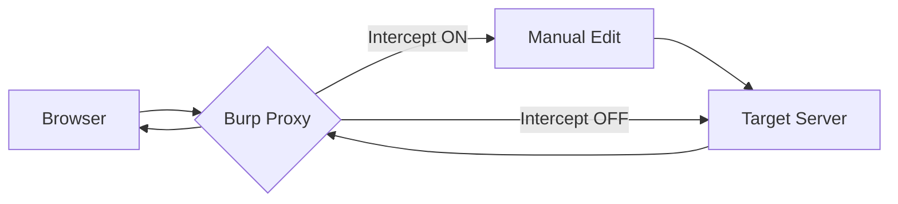

# Burp Suite Cheat Sheet :simple-burpsuite: :wireless:

Burp Suite là một nền tảng tích hợp dùng để tấn công các ứng dụng web. Nó hoạt động như một Proxy trung gian giữa trình duyệt và máy chủ mục tiêu.

<!--more-->

---

## 1. Cơ chế hoạt động (Proxy Workflow)

Hiểu cách Burp Suite can thiệp vào luồng HTTP/HTTPS.

---

## 2. Phím tắt thiết yếu (Essential Shortcuts)

Sử dụng phím tắt giúp tối ưu hóa thời gian khi thực hiện Pentest.

| Phím tắt | Chức năng | Giải thích |
| :--- | :--- | :--- |
| **Ctrl + R** | Send to Repeater | Chuyển request sang tab Repeater để thử nghiệm thủ công. |
| **Ctrl + I** | Send to Intruder | Chuyển request sang tab Intruder để tấn công tự động/fuzzing. |
| **Ctrl + Shift + R** | Render Page | Hiển thị giao diện web của response trong Repeater. |
| **Ctrl + U** | URL Encode | Mã hóa URL các ký tự được chọn. |
| **Ctrl + Shift + U** | URL Decode | Giải mã URL. |
| **Ctrl + B** | Base64 Encode | Mã hóa Base64. |
| **Ctrl + Shift + B** | Base64 Decode | Giải mã Base64. |
| **Ctrl + F** | Find | Tìm kiếm trong nội dung Request/Response. |
| **Ctrl + Space** | Intercept Toggle | Bật/Tắt chế độ chặn gói tin (Cần cấu hình Hotkey). |

---

## 3. Các thành phần lõi (Core Modules)

### Proxy
Nơi quản lý và can thiệp trực tiếp vào lưu lượng mạng.
- **Intercept:** Chặn gói tin thời gian thực để sửa đổi trước khi gửi đi.
- **HTTP History:** Lưu trữ toàn bộ lịch sử các request đã đi qua Burp.
- **WebSockets History:** Lưu trữ lưu lượng của giao thức WebSocket.

### Repeater
Dùng để chỉnh sửa một request duy nhất và gửi đi nhiều lần để quan sát phản hồi.
!!! tip "Học sâu"
    Repeater là công cụ tốt nhất để tìm kiếm các lỗ hổng logic, IDOR, hoặc các lỗi liên quan đến Input Validation vì bạn có thể thay đổi từng byte của request một cách tỉ mỉ.

### Intruder
Công cụ tự động hóa việc gửi các request biến đổi. Cần nắm vững 4 kiểu tấn công (Attack Types):

=== "Sniper"
    - **Cơ chế:** Sử dụng 1 bộ payload. Thử lần lượt vào từng vị trí (position) đã đánh dấu.
    - **Ứng dụng:** Kiểm tra lỗi Fuzzing cơ bản, thử mật khẩu cho 1 User.

=== "Battering Ram"
    - **Cơ chế:** Sử dụng 1 bộ payload. Gửi cùng 1 payload vào tất cả các vị trí cùng một lúc.
    - **Ứng dụng:** Khi bạn cần cùng một giá trị xuất hiện ở nhiều nơi trong request.

=== "Pitchfork"
    - **Cơ chế:** Sử dụng nhiều bộ payload tương ứng với nhiều vị trí. Lấy payload thứ nhất của mỗi bộ cùng lúc.
    - **Ứng dụng:** Thử cặp Username:Password (User1:Pass1, User2:Pass2).

=== "Cluster Bomb"
    - **Cơ chế:** Thử mọi tổ hợp có thể giữa các bộ payload (Tích Cartesian).
    - **Ứng dụng:** Brute-force cực mạnh (Ví dụ: 100 users x 100 passwords = 10,000 requests).

---

## 4. Kỹ thuật nâng cao (Advanced Techniques)

### Match and Replace
Tự động thay đổi nội dung request/response dựa trên quy tắc định sẵn.
- **Đường dẫn:** `Proxy -> Options -> Match and Replace`.
- **Ứng dụng:**
    - Tự động thay đổi User-Agent để giả lập thiết bị di động.
    - Thêm header `X-Forwarded-For` để bypass bộ lọc IP.
    - Ép buộc quyền admin bằng cách đổi `is_admin=false` thành `is_admin=true` trong body.

### Burp Collaborator
Công cụ để phát hiện các lỗ hổng **Out-of-band (OOB)**.

- **Cách dùng:** Lấy một link collaborator và chèn vào các tham số nghi ngờ bị lỗi Blind SSRF hoặc Blind OS Injection.
- **Kết quả:** Nếu máy chủ mục tiêu tương tác với link này (DNS hoặc HTTP), Burp sẽ ghi lại.

### Macros & Session Handling
Dùng để duy trì phiên đăng nhập hoặc thực hiện một chuỗi hành động trước khi gửi request chính.
!!! info "Ví dụ"
    Khi một trang web yêu cầu mã CSRF Token mới cho mỗi request, bạn tạo một Macro để lấy Token trước, sau đó tự động chèn vào request trong Intruder.

---

## 5. Các bộ lọc và tìm kiếm (Filtering)

Phân tích sâu file Log/History bằng cách lọc:
- **Filter by Status Code:** Chỉ hiện 200 OK hoặc 404, 500.
- **Filter by MIME Type:** Chỉ hiện JSON, XML hoặc HTML.
- **Filter by Search Term:** Tìm các request có chứa từ khóa "admin", "password", "config".

---

## 6. Decoder & Comparer

??? details "Decoder"
    Hỗ trợ chuyển đổi dữ liệu qua nhiều định dạng:
    
    - URL, HTML, Base64, ASCII Hex.
    - Hex, Octal, Binary.
    - Các thuật toán băm (Hashes): MD5, SHA, SHA-256.
    - Tính năng "Smart Decode" giúp tự nhận diện định dạng mã hóa.

??? details "Comparer"
    Dùng để so sánh sự khác biệt giữa hai Request hoặc hai Response.
    
    - **Ứng dụng:** So sánh phản hồi khi nhập mật khẩu đúng và sai để tìm dấu hiệu của lỗ hổng Enumeration (Dò quét User).
    - So sánh bằng: **Words** (từ ngữ) hoặc **Bytes** (mã hexa).

---

## 7. Các tiện ích mở rộng (BApp Store)

Để nâng cao sức mạnh của Burp, nên cài đặt các Extension sau:

| Tiện ích | Công dụng |
| :--- | :--- |
| **Turbo Intruder** | Gửi hàng triệu request với tốc độ cực cao (dùng Python). |
| **Autorize** | Tự động kiểm tra lỗi phân quyền (Authorization). |
| **JSON Beautifier** | Làm đẹp định dạng JSON để dễ đọc. |
| **Param Miner** | Tự động tìm kiếm các tham số ẩn (Hidden parameters). |
| **Logger++** | Ghi nhật ký chi tiết hơn cả tab History mặc định. |

---

## 8. Cấu hình HTTPS & SSL

Để Burp Suite có thể đọc được dữ liệu HTTPS, bạn phải cài đặt CA Certificate của Burp vào trình duyệt.

1. Truy cập `http://burp` khi đang bật proxy.
2. Tải `CA Certificate`.
3. Import vào trình duyệt (Tab Authorities/Trusted Root).

---

## 9. Bypass kỹ thuật phổ biến với Burp

!!! warning "Lưu ý bảo mật"
    Chỉ thực hiện trên các hệ thống bạn có quyền thử nghiệm.

- **Bypass Client-side Validation:** Tắt Intercept, thực hiện nhập liệu đúng trên web, sau đó bật Intercept và đổi giá trị thành dữ liệu độc hại trước khi gửi đi.
- **Bypass File Upload Restriction:** 
    - Đổi `Content-Type` từ `application/x-php` thành `image/jpeg`.
    - Đổi tên file từ `shell.php` thành `shell.php.jpg` hoặc `shell.phtml`.
- **Bypass Rate Limiting:**
    - Sử dụng các header như `X-Originating-IP`, `X-Forwarded-For`, `X-Remote-IP`.
    - Sử dụng Intruder với danh sách IP giả mạo.

---

!!! success "Lời khuyên thực hành"
    Đừng chỉ dựa vào tab **Dashboard** (Scanner tự động). Sức mạnh thực sự của Burp Suite nằm ở tab **Repeater** và khả năng hiểu logic của người dùng. Hãy luôn bắt đầu bằng việc đọc kỹ các Request trong **HTTP History** để hiểu cách ứng dụng truyền tải dữ liệu.
