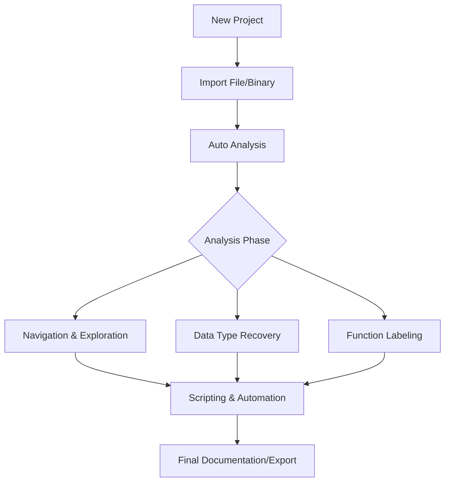

# Ghidra  Cheat Sheet :dragon_face: :simple-dragonframe:

<!--more-->

Ghidra là một khung phân tích phần mềm mạnh mẽ bao gồm các công cụ phân tích mã code, phân dịch (disassembly), và dịch ngược (decompilation).

---

## 1. Quy trình phân tích mã nguồn (Reverse Engineering Workflow)

Hiểu vòng đời của một dự án trong Ghidra để tối ưu hóa việc phân tích.



---

## 2. Phím tắt thần thánh (Essential Shortcuts)

Hệ thống phím tắt giúp tăng tốc độ "đọc" mã lên gấp nhiều lần.

### Phím tắt điều hướng & View

| Phím tắt | Chức năng | Ý nghĩa |
| :--- | :--- | :--- |
| **G** | Go To | Đi đến địa chỉ, nhãn (Label) hoặc tên hàm cụ thể |
| **L** | Rename | Đổi tên biến, tên hàm, nhãn (Cực kỳ quan trọng để hiểu luồng) |
| **Y** | Retype | Thay đổi kiểu dữ liệu (Data Type) của biến hoặc hàm |
| **Ctrl + E** | Edit Function | Chỉnh sửa thuộc tính hàm, tham số, Calling Convention |
| **Ctrl + F** | Find | Tìm kiếm trong cửa sổ hiện tại |
| **X** | References | Xem các tham chiếu (Xrefs) - Gói tin này được gọi ở đâu? |
| **F5** | Refresh Decompiler | Cập nhật lại mã C sau khi bạn đổi tên hoặc kiểu dữ liệu |
| **Alt + Up/Down** | Navigation | Di chuyển đến hàm trước hoặc sau trong danh sách |

### Phím tắt xử lý dữ liệu (Data & Assembly)

| Phím tắt | Chức năng | Giải thích |
| :--- | :--- | :--- |
| **D** | Data | Chuyển vùng nhớ hiện tại thành dữ liệu (Byte, Word, Dword) |
| **C** | Clear | Xóa định nghĩa tại địa chỉ (trở về byte chưa xác định) |
| **[`** | Array | Tạo mảng (sau khi đã xác định kiểu dữ liệu bằng D) |
| **P** | Create Function | Ép Ghidra coi vùng mã hiện tại là một hàm |
| **U** | Undefine | Hủy định nghĩa hàm hoặc dữ liệu |
| **' (Single Quote)** | Edit Label | Chỉnh sửa nhãn tại địa chỉ hiện tại |
| **T** | Choose Data Type | Mở bảng chọn kiểu dữ liệu nâng cao (struct, union) |

---

## 3. Các cửa sổ chức năng quan trọng (Windows & Views)

Ghidra chia nhỏ giao diện thành các công cụ chuyên biệt.

=== "Listing (Disassembly)"
    - Hiển thị mã máy (Assembly).
    - Nơi bạn thực hiện các thao tác logic như Patch Byte, đặt Label.
    - Cung cấp cái nhìn chi tiết về cách bộ nhớ được tổ chức.

=== "Decompiler"
    - Chuyển đổi mã Assembly sang mã giả C (Pseudo-C).
    - Đây là nơi hầu hết các nhà phân tích dành thời gian để hiểu logic chương trình.
    - Chú ý: Mã C này là "phỏng đoán", không phải mã gốc 100%.

=== "Symbol Tree"
    - Quản lý Exports, Imports, Functions, Labels.
    - Giúp tìm nhanh các hàm thư viện (như `printf`, `malloc`, `WinMain`).

=== "Data Type Manager"
    - Thư viện các cấu trúc dữ liệu.
    - Cho phép nạp file header `.h` để định nghĩa các `struct` phức tạp.

---

## 4. Kỹ thuật phân tích chuyên sâu (Deep Analysis)

!!! info "Xrefs (Cross-References)"
    Xrefs là chìa khóa của dịch ngược. Khi bạn đứng tại một chuỗi (string) hoặc một hàm, nhấn **X** sẽ cho bạn biết tất cả những nơi trong chương trình sử dụng nó. Điều này giúp lần ngược từ "hành động" về "nguyên nhân".

### Xử lý Cấu trúc dữ liệu (Structures)
Khi gặp một con trỏ trỏ tới một vùng nhớ có nhiều biến (struct), hãy thực hiện:

1.  Vào **Data Type Manager**.
2.  Chuột phải -> **New -> Structure**.
3.  Định nghĩa các trường (Fields), kích thước.
4.  Tại mã nguồn, nhấn **Y** trên biến đó và gõ tên struct vừa tạo.
5.  Mã C sẽ tự động chuyển từ `*(int *)(ptr + 8)` thành `ptr->my_variable`.

### Phân tích gián tiếp (Indirect Calls)
Sử dụng **Thunk Functions** và **Constant References** để giải quyết các lời gọi hàm động (Dynamic calls).

---

## 5. Ghidra Scripting & Tự động hóa

Ghidra hỗ trợ script bằng **Java** và **Python (Jython)**.

??? details "Cách chạy script"
    1.  Mở **Window -> Script Manager**.
    2.  Tìm kiếm script theo tính năng (ví dụ: `FindCrypt`, `RecoverControlFlow`).
    3.  Nhấn biểu tượng Play (Run) màu xanh.

??? details "Viết Script cơ bản (Python ví dụ)"
    ```python
    # Tìm tất cả các lệnh 'CALL' trong chương trình
    listing = currentProgram.getListing()
    iter = listing.getInstructions(True)
    while iter.hasNext():
        ins = iter.next()
        if ins.getMnemonicString() == "CALL":
            print("Found CALL at: {}".format(ins.getAddress()))
    ```

---

## 6. Sửa đổi mã (Patching Binaries)

Ghidra không chỉ để đọc, nó có thể sửa đổi logic chương trình.

1.  Tại cửa sổ **Listing**, chọn dòng lệnh cần sửa.
2.  Chuột phải -> **Patch Instruction** (hoặc nhấn `Ctrl + Shift + G`).
3.  Nhập lệnh Assembly mới (ví dụ: đổi `JZ` thành `JNZ` để bypass check).
4.  **Lưu ý:** Để lưu file thực thi mới, bạn cần dùng script `SavePatch.py` hoặc sử dụng các Plugin như **Ghidra2Exe**.

---

## 7. Các Plugin "Phải có" cho người dùng nâng cao

| Plugin | Mô tả |
| :--- | :--- |
| **Ghidra-Dark** | Cung cấp giao diện tối (Dark mode) để bảo vệ mắt. |
| **FindCrypt** | Tự động tìm kiếm các hằng số của các thuật toán mã hóa (AES, SHA...). |
| **GhidraSRE** | Tập hợp các công cụ hỗ trợ phân tích Malware. |
| **LazyGhidra** | Thêm các phím tắt và menu chuột phải tiện lợi cho việc đổi tên/kiểu. |

---

## 8. Mẹo chẩn đoán và khắc phục sự cố

!!! tip "Phân tích lại (Re-analyze)"
    Nếu bạn thấy mã Decompiler trông quá kỳ lạ, hãy thử vào `Analysis -> Analyze All Open...` và bật các tùy chọn như **Decompiler Parameter ID** hoặc **Non-Returning Functions**.

!!! warning "Lưu ý về Endianness"
    Khi Import file, hãy đảm bảo chọn đúng Format (ELF, PE, Mach-O) và Processor (x86:LE, ARM:BE...). Chọn sai sẽ khiến toàn bộ mã bị giải mã lỗi.

---

## 9. Bảng tra cứu nhanh các kiểu dữ liệu trong Ghidra

| Ghidra Type | C Type | Size (Typical) |
| :--- | :--- | :--- |
| **db** | char / byte | 1 byte |
| **dw** | short / word | 2 bytes |
| **dd** | int / dword | 4 bytes |
| **dq** | long long / qword | 8 bytes |
| **undefined** | Unknown | 1 byte |
| **pointer** | void * | 4/8 bytes (tùy kiến trúc) |

---

!!! success "Kết luận"
    Ghidra là một kỹ năng cần sự kiên nhẫn. Quy trình tốt nhất là: **Tìm chuỗi (Strings) -> Tìm Xrefs -> Đổi tên hàm (Rename) -> Định nghĩa Struct -> Đọc Logic.** Hãy tận dụng tối đa phím **L** và **Y** để biến mã máy thành mã nguồn dễ hiểu.
