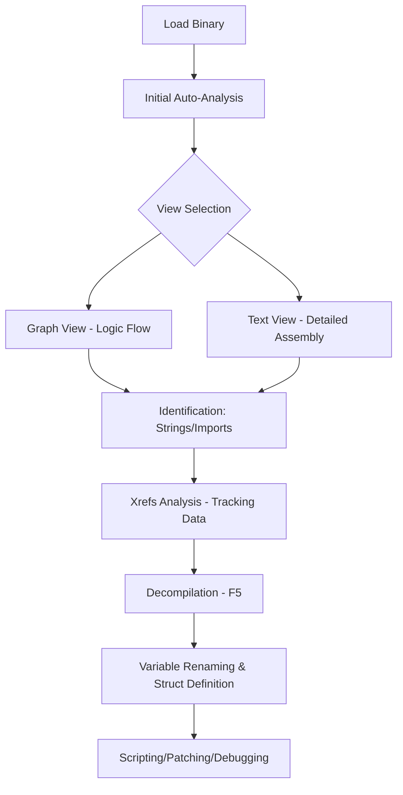

# IDA Pro Cheat Sheet

<!--more-->

IDA Pro là công cụ phân dịch (Disassembler) có tính tương tác cao và tích hợp trình dịch ngược (Decompiler) Hex-Rays mạnh mẽ.

---

## 1. Quy trình phân tích (Standard Workflow)

Hiểu trình tự làm việc chuyên nghiệp để không bị lạc trong hàng triệu dòng mã.



---

## 2. Phím tắt điều hướng & View (Navigation & Interface)

IDA Pro dựa cực kỳ nhiều vào phím tắt. Nắm vững bộ phím này là điều kiện tiên quyết để trở thành chuyên gia.

| Phím tắt | Chức năng | Giải thích chi tiết |
| :--- | :--- | :--- |
| **Spacebar** | Switch View | Chuyển đổi giữa Graph view (sơ đồ) và Text view (danh sách). |
| **G** | Jump to Address | Nhảy đến một địa chỉ (Virtual Address) hoặc tên hàm. |
| **Esc** | Jump Back | Quay lại vị trí trước đó (giống nút Back trên trình duyệt). |
| **Ctrl + Enter** | Jump Forward | Đi tới vị trí tiếp theo trong lịch sử điều hướng. |
| **F5** | Decompile | Chuyển đổi hàm hiện tại sang mã C (yêu cầu Hex-Rays). |
| **Tab** | Switch Code | Chuyển nhanh giữa cửa sổ Disassembly và Decompiler. |
| **N** | Rename | Đổi tên hàm, biến, nhãn hoặc tham số. |
| **X** | Cross-References | Xem các nơi tham chiếu tới địa chỉ/hàm hiện tại. |
| **Ctrl + P** | Functions List | Mở danh sách tất cả các hàm trong file. |
| **Shift + F12** | Strings Window | Mở danh sách tất cả các chuỗi (strings) tìm thấy. |

---

## 3. Thao tác với dữ liệu và mã (Data Manipulation)

Phím tắt dùng để định nghĩa lại cách IDA hiểu các byte dữ liệu.

=== "Định nghĩa mã/dữ liệu"
    - **C (Code):** Ép IDA hiểu vùng nhớ này là tập hợp các lệnh thực thi.
    - **D (Data):** Chuyển đổi vùng nhớ thành dữ liệu (nhấn nhiều lần để đổi byte -> word -> dword -> qword).
    - **A (ASCII):** Chuyển vùng nhớ thành chuỗi ký tự (String).
    - **U (Undefine):** Xóa định nghĩa tại địa chỉ hiện tại (biến về byte thô).
    - **\* (Asterisk):** Định nghĩa mảng (Array).

=== "Định nghĩa số học"
    - **H (Hex):** Hiển thị giá trị ở dạng thập lục phân.
    - **Q (Octal):** Hiển thị ở dạng bát phân.
    - **B (Binary):** Hiển thị ở dạng nhị phân.
    - **R (Char):** Chuyển giá trị số sang ký tự tương ứng (ví dụ 0x41 thành 'A').
    - **_ (Underscore):** Hiển thị giá trị ở dạng hằng số symbolic (nếu có).

---

## 4. Phân tích Cross-References (Xrefs)

!!! info "Tầm quan trọng của Xrefs"
    Xrefs cho bạn biết mối quan hệ giữa các thành phần.
    - **Code Xrefs:** Hàm nào gọi hàm này? Lệnh nhảy nào dẫn đến đây?
    - **Data Xrefs:** Những lệnh nào đang đọc hoặc ghi vào biến này?

**Cách sử dụng:** Chọn tên hàm hoặc địa chỉ biến -> Nhấn **X**. Kết quả sẽ hiển thị danh sách tất cả các điểm truy cập. Đây là cách chính để lần ra logic của malware hoặc tìm lỗ hổng phần mềm.

---

## 5. Làm việc với Structures & Enums

Để mã Decompiler dễ đọc hơn, bạn cần định nghĩa lại các cấu trúc dữ liệu.

??? details "Các bước tạo Structure"
    1. Nhấn **Shift + F9** để mở cửa sổ Structures.
    2. Nhấn **Ins** (Insert) để tạo struct mới và đặt tên.
    3. Chọn struct vừa tạo, nhấn **D** để thêm trường (field).
    4. Nhấn **N** trên trường đó để đổi tên.
    5. Quay lại mã nguồn, chọn một biến/đối số, nhấn **T** để áp dụng kiểu cấu trúc (Type).

??? details "Làm việc với Enums"
    1. Nhấn **Shift + F10** để mở Enums.
    2. Tạo Enum mới và thêm các hằng số.
    3. Tại cửa sổ Disassembly, nhấn **M** để chuyển một giá trị số khan hiếm thành tên Enum có ý nghĩa.

---

## 6. Hex-Rays Decompiler Tips

Khi đã ở trong giao diện mã C (nhấn F5), các phím tắt sau sẽ giúp ích:

| Phím tắt | Chức năng |
| :--- | :--- |
| **Y** | Set Item Type | Thay đổi khai báo kiểu dữ liệu của biến (ví dụ: `int` thành `char *`). |
| **/ (Forward Slash)** | Add Comment | Thêm chú thích vào dòng mã. |
| **Insert** | Add/Edit Comment | Tương tự như trên nhưng chuyên sâu hơn. |
| **= (Equal)** | Map variable | Gộp hai biến cục bộ lại thành một (thường dùng khi IDA nhận diện sai). |
| **Ctrl + Shift + W** | Generate Static View | Xuất mã C ra file text. |

---

## 7. Scripting với IDAPython

IDA hỗ trợ Python cực mạnh để tự động hóa các tác vụ lặp đi lặp lại.

```python
import idautils
import idc

# Ví dụ: Liệt kê tất cả các hàm và địa chỉ bắt đầu
for func in idautils.Functions():
    print(f"Function {idc.get_func_name(func)} at {hex(func)}")

# Ví dụ: Tìm các byte cụ thể (Pattern matching)
pattern = "48 89 5C 24" # Một đoạn opcodes phổ biến
addr = idc.find_binary(0, idc.SEARCH_DOWN, pattern)
if addr != idc.BADADDR:
    print(f"Pattern found at {hex(addr)}")
```

---

## 8. Interactive Debugging

IDA Pro tích hợp trình gỡ lỗi mạnh mẽ cho nhiều nền tảng (Windows, Linux, Android, iOS, GDB).

- **F2:** Đặt Breakpoint (điểm dừng).
- **F9:** Bắt đầu chạy chương trình (Run).
- **F7:** Step Into (Đi vào chi tiết bên trong hàm).
- **F8:** Step Over (Chạy qua hàm, không đi vào trong).
- **Ctrl + F2:** Kết thúc phiên debug.
- **Ctrl + F7:** Chạy cho đến khi thoát khỏi hàm hiện tại (Run until return).

---

## 9. Sửa đổi mã (Patching)

!!! warning "Lưu ý"
    IDA Pro mặc định không lưu thay đổi trực tiếp vào file gốc để bảo vệ dữ liệu.

1.  Tại dòng lệnh cần sửa: `Edit -> Patch program -> Assemble...`
2.  Nhập lệnh mới (ví dụ: `nop` hoặc `jmp <addr>`).
3.  Để áp dụng vào file vật lý: `Edit -> Patch program -> Apply patches to input file...`

---

## 10. Các phím tắt bổ trợ khác

| Phím tắt | Chức năng |
| :--- | :--- |
| **; (Semicolon)** | Add Manual Comment | Chú thích sẽ xuất hiện ở tất cả các Xrefs. |
| **: (Colon)** | Add Regular Comment | Chú thích chỉ xuất hiện tại dòng hiện tại. |
| **Alt + T** | Search Text | Tìm kiếm chuỗi văn bản trong toàn bộ disassembly. |
| **Alt + B** | Search Bytes | Tìm kiếm chuỗi Byte (Hex). |
| **Shift + F4** | Names Window | Danh sách tất cả các nhãn, hàm, biến được đặt tên. |

---

!!! success "Mẹo học tập"
    Sự khác biệt giữa người mới và chuyên gia IDA Pro là khả năng **Định nghĩa kiểu dữ liệu (Typing)**. Đừng bao giờ để mã của bạn đầy những biến như `v1`, `v2`, `a1`. Hãy luôn dùng **N** và **Y** để biến chúng thành `counter`, `buffer_size`, `user_struct *` ngay khi bạn nhận ra ý nghĩa của chúng. Mã nguồn sẽ tự khắc trở nên rõ ràng.
